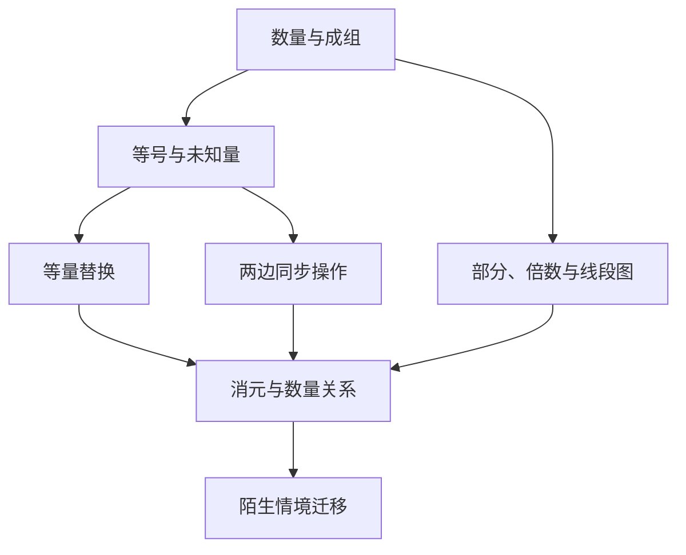
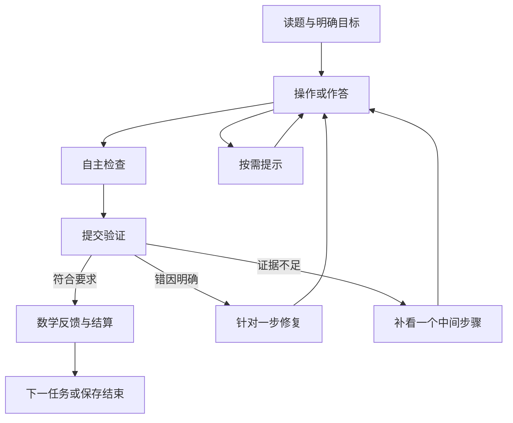

# Kevin 数学学习网站：产品与课程设计方案 v0.3（Codex 实施交接版）

日期：2026-09-09  
状态：已吸收 Maths Is Fun 的讲解形式，并完成课程、页面、教具、数据和验收的实现审查；正式网站尚未开始实现。  
暂定名称：**数学生长岛**。角色、视觉风格与积分参数为可调整的设计值。

## 0. 本版确定的产品范围

设计一个供 Kevin 在**电脑本地网页**使用的数学学习与探究网站。课程覆盖**小学一至六年级的基础内容和系统奥数提升**，当前推荐面向三年级起步，但保留一、二年级基础补充和自由选择四至六年级的入口。后续连接初中、高中及更深学习。

**基础和奥数是两条相连、可以并行的路线，数学思想贯穿两者。** 每项学习从需要和概念出发，通过操作、图形、语言和符号建立理解，再解决变式、迁移与综合问题。奥数提升主要增加关系、方法选择和论证要求，不只是把数字变大。

每次数学学习安排为 **30—60 分钟**，提供 30、45、60 分钟模板，初始推荐 45 分钟。结束后可另用约 2—5 分钟照料伙伴；界面分别显示学习安排与照料安排。遇到疲劳或临时中断可以保存退出，未坐满时长不扣分。

网站由课程图谱、方法工具箱、学习证据与复习、积分及蛋形伙伴养成四部分组成。星点兑换伙伴和物品，成长值记录共同经历，知识掌握只由数学证据决定。

### 0.1 已确认的约束与设计默认

| 项目 | 本版采用的规则 | 状态 |
|---|---|---|
| 单次学习 | 30—60 分钟；提供三种安排模板 | 用户已确认 |
| 主要设备 | 电脑网页，本地使用；键盘鼠标优先 | 用户已确认 |
| 全量范围 | 整个小学的基础和奥数提升，重点学习思想方法 | 用户已确认 |
| 附件练习与 20 天材料 | 只作案例和困难分析参考，不固定课程范围、顺序、题量或学习天数 | 用户已确认 |
| 教材作用 | 确定语言、尺度、阶段和顺序参考；网站自行设计课程和题目 | 新增研究底稿已明确 |
| 课程开放 | 先修关系只推荐和解释；可以直接选择各年级和主题 | 新增研究底稿已明确 |
| 当前工作 | 完善设计，不开始正式实现 | 用户已确认 |
| 家庭与身份 | Kevin 一个本地学习档案，家长管理；可扩展多个本地档案 | 设计默认 |
| 蛋仔养成 | 原创蛋形伙伴与站内物品；第一只免费、后续积分兑换 | 设计默认 |
| 联网功能 | 核心学习、判题、复习、语音、养成和兑换离线可用；联网扩展另行选配 | 基于本地需求的设计默认 |

### 0.2 本稿交付什么

- 8 个领域、59 个主题单元，96 项基础覆盖条目、64 个奥数题族、28 项思想方法，以及教材差异和衔接内容入口。
- 内容完整性的台账字段、查漏方法和发布标准；明确区分范围设计、课程制作与学生掌握。
- 15 个示范概念课、30 个示范能力节点和重点交互脚本；这些是设计样例，不是课程总量或必须先学完的关卡。
- 30／45／60 分钟安排、自由选课和推荐规则、分层练习、错因分析、复习与家长端。
- 电脑阅读页与专注练习页、25 类教具、本地启动和保存方案、题目验证、积分经济、6 个原创伙伴及动作语音。
- 明确的技术默认、课程内容契约、本地 API、奖励事务、24 课试学里程碑、20 项实现验收与机器可读课程清单。

阅读入口：整体范围看第 2—4 节；知识讲解形式看第 7.5—7.6、10.4 节；学习安排看第 5、21 节；界面与养成看第 10—13、26 节。**交给 Codex 时先读第 23—27 节，再查相应课程与产品细节**。配套 `Kevin_数学课程结构清单.json` 是可导入的设计索引，不是已发布课程包。

### 0.3 来源状态与证据边界

本轮依据包括：已阅读的上传汇总全文、用户新增的使用约束、用户直接提供的《三年级课程设计依据》和《四至六年级课程研究底稿》，以及用户指定的 Maths Is Fun 具体知识页面。后两份材料中的教材目录与思想锚点直接用于本版设计，不再搜索或下载课本。

研究底稿提到的两册教材已目视核对、四至六年级本地 PDF 路径，是**用户提供的研究记录**；本轮没有据此声称自己重新打开或逐页核对了那些 PDF。底稿不是教材复刻要求，附件中的原题、页码和 20 天练习也不是内容制作清单。

课标作为基础范围核对的总纲。已核查发布通知和课程修订解读，完整课程发布前仍要完成课标内容条款与课程子项的对应核验；本稿不把目录完整性检查写成已经完成全部课标页码审计。[教育部课程方案与标准发布通知](https://www.moe.gov.cn/srcsite/A26/s8001/202204/t20220420_619921.html)

## 1. 从 Kevin 的困难推导产品目标

### 1.1 核心学习目标

Kevin 应逐步能够独立完成：读懂问题中的量与单位，选择表示方式，建立关系，解释合法变化，求解，并代回原条件检查。

| 材料中的证据 | 对设计的要求 | 可观察的改善 |
|---|---|---|
| 会算，但不理解为什么乙能换成甲＋5 | 单独训练等量替换，允许只做替换、不求答案 | 在陌生情境中替换整个表达式，保留其他部分 |
| 把三个甲和甲的数值混淆 | 区分“每份是多少”和“一共有几份” | 能从三个同样盒子中同时移除一份 |
| 两步运算会遗漏、看错符号 | 有限时期外显中间步骤与检查目标 | 首次正确、主动改正、错误位置分别可见 |
| 当时理解，几天后忘记 | 用变式进行间隔复习 | 延迟后仍能独立建立关系 |
| 家长不想零散讲题 | 前置知识图谱与跨题型方法索引 | 知道当前方法来自什么、还能用于什么 |
| 希望通过蛋仔增加参与 | 学习后有可预期的小反馈和成长 | 能开始并完成计划，之后按约定结束 |

### 1.2 教学原则的具体化

1. **先呈现需要，再给工具。** 例如先遇到逐个数太慢的问题，再认识等量成组与乘法。
2. **操作要改变数学状态。** 移动、拆分、分组必须对应明确的量或关系；只移动装饰不算数学交互。
3. **图、语言、符号要能互相翻译。** 不能永远依赖盒子，也不能在盒子尚未看懂时直接要求符号变形。
4. **每次验证一个关键难点。** 练代入时可以只检查替换是否正确，避免把计算错误混成代入错误。
5. **陌生题也要出现。** 换故事、换表示、反向提问和混合练习分别检验不同程度的迁移。
6. **先探索，再适时讲解。** 不要求孩子独自重新发现每条数学定理；卡住时通过示范和对比补充必要信息。

系统教学、明确的数学语言、实物与图形表示、数轴，以及针对文字题的教学，可参考 IES 的小学数学干预指南。本网站的具体交互与养成规则是据此和 Kevin 材料提出的设计，不能把指南当作其效果已获验证的证据。[IES 小学数学干预指南](https://ies.ed.gov/ncee/wwc/practiceguide/26)

### 1.3 原材料中需要保留适用范围的表述

| 原有教学表达 | 本方案中的准确用法 |
|---|---|
| 乘法是很多组一样多 | 用于自然数乘法入门；学习分数时继续扩展为缩放、部分与比例 |
| 减法是数轴上的距离 | 大数减小数可表示距离；以后有负数时区分有向差与绝对距离 |
| 两块大小不同不能都叫一半 | 同一个整体必须等分；不同大小整体的一半可以大小不同 |
| 把东西摆对位置、揭开遮挡 | 用作等价变换的提示；计数、建模和证明还需补充分类、假设与验证 |
| 通过实验发现规律 | 有限例子支持猜想；“一定成立”还需要理由，或完整覆盖所有情况 |

## 2. 课程的组织方式

### 2.1 内容结构与共同字段

**领域 → 主题单元 → 概念课／方法课 → 学习任务**。领域用于按代数、几何等分类，主题单元容纳概念和应用，课围绕明确的认知目标，任务留下可观察证据。

每个节点同时保留 `grade + strand + representation + thinkingSkills`，增加 `track`（基础／奥数提升）、推荐前置、教材锚点、内容覆盖编号和发布状态。年级允许多值，例如一个方法在三年级入门、六年级继续深化；节点不锁定某一版本教材。

同一知识和同一道题可以连到多个方法与应用，学习记录按节点共享。教材顺序、学科分类和思想路线是看同一套课程的不同方式，不复制成互不相认的题库。

### 2.2 两条路线与四种选课方式

| 路线 | 主要目标 | 深入方式 |
|---|---|---|
| 基础内容 | 概念、运算、空间、数据和实践；知道怎么做并解释为什么 | 从直观到抽象，建立稳定模型和基本应用 |
| 奥数提升 | 主动发现结构、选择和组合方法、迁移与论证 | 从一个条件到多个条件，从熟悉表示到陌生问题 |

两条路线可以在同一次学习中连接，也可以安排独立的基础巩固课或深度探究课。并非每项基础内容都需要硬配一个传统奥数题名；测量、数据和实践可以通过估算、建模、优化或解释来深化。

| 选课方式 | 用户能做什么 | 推荐的作用 |
|---|---|---|
| 按年级 | 直接进入一至六年级，重点入口为三至六年级 | 说明阶段与内容尺度 |
| 按领域 | 针对代数、几何、数论等学习 | 显示相邻概念和跨领域联系 |
| 按思想方法 | 学画图、替换、枚举、逆向、不变量等 | 跨题型练同一个方法 |
| 今天的计划 | 恢复进度、复习、主学习和迁移 | 根据已有证据给出可修改的安排 |

**先修关系只用于推荐和解释，不锁课程。** 若直接选择尚缺基础的内容，显示“这课会用到什么”，提供“直接开始、先看一个例子、补相关基础”的选择。积分、年级和历史正确率都不能成为购买或解锁课程的门槛。

### 2.3 每课必须包含的设计证据

每课明确现实动机、关键概念及范围、至少两种有意义的表示、可观察的思想动作、练习层次、迁移情境和检查方法。纯符号课的第二种表示可以是数线、表格或关系图，不强行添加无关故事。

| 练习层 | 任务作用 | 典型变化 |
|---|---|---|
| 热身 | 提取本课用到的已有知识 | 少量相关复习或前置探测 |
| 核心 | 建立概念、表示、方法及理由 | 操作、例题、独立同结构应用 |
| 迁移 | 检查能否认出相同数学结构 | 换故事、换图、反向提问、减少支架 |
| 挑战 | 组合关系并选择方法 | 分类、系统枚举、逆向、不变量、最优化与解释 |

### 2.4 难度不是单一数字

任务分别标记概念深度、计算负担、文字负担、步骤数量、表示抽象程度、方法选择要求和迁移距离。降低文字量不必降低数学目标；增加数字位数也不能自动算作奥数提升。

## 3. 小学全量内容设计：八领域、59 个主题单元

下列为章节级的内容组织和推荐先后关系。每行还要拆成概念与能力节点，并通过第 3.9 节基础清单、第 4.2 节奥数清单和第 4.1 节方法清单核对。

推荐前置列出理解本主题常用的知识；多个编号表示这些联系都值得提示，**不构成进入限制**。章节内可先做直观活动，再按需要补充高级课所用的概念。所有年级与主题可直接选择，未发布课程应标明制作状态。

### 3.1 N：数与运算

| 编号 | 主题与知识范围 | 奥数延伸 | 推荐前置 |
|---|---|---|---|
| N01 | 数量、一一对应、数与数字、顺序、数轴入门 | 对应、排序、数形互译 | 无 |
| N02 | 位值、0、大数、数的组成、估计、近似 | 数字重排、数位和、最大最小数 | N01 |
| N03 | 加减的含义、大小比较、进退位 | 和不变、差的变化、补偿 | N01 |
| N04 | 等量成组、乘法阵列、两种除法、有余数初步 | 分组、倍数、周期入口 | N03 |
| N05 | 加减与乘除互逆、括号、混合运算、检验 | 倒推、还原、填运算符 | N03、N04 |
| N06 | 交换、结合、分配、拆数、凑整、估算检查 | 配对求和、等差求和、适龄裂项与巧算 | N05 |
| N07 | 整体与等分、分数数轴、等值、比较、约通分、四则 | 单位“1”、分数大小与巧算 | N04 |
| N08 | 小数位值、小数运算、分小互化、百分数 | 百分比变化、折扣与计算 | N02、N07 |
| N09 | 长度、质量、容量、货币、时间、日历及换算 | 钟表、跨日时间、单位统一 | N02、N03、N04 |

N07 内部先直观认识等值分数；系统约分、通分课提示 T02/T03 中相应因数知识。章节联系与内部高级课的推荐前置分别管理。

### 3.2 A：数量关系与代数

| 编号 | 主题与知识范围 | 奥数延伸 | 推荐前置 |
|---|---|---|---|
| A01 | 相等关系、非标准等式、未知盒子、字母表示 | 填空等式、数字谜入口 | N03 |
| A02 | 部分整体、比较、线段图、单位一致、条件翻译 | 多个量与部分和、年龄关系 | N03 |
| A03 | 几倍与几份、和差、和倍、差倍、单位量 | 倍数变化、赠送前后关系 | A02、N04 |
| A04 | 等量替换、两边同步操作、方程、代入与消元 | 两袋物品、连续替换、鸡兔同笼 | A01、N05 |
| A05 | 平均数中的总量、移多补少、归一归总、盈亏 | 平均分配最值、差量分析 | A03、N05 |
| A06 | 比、比例、单位率、正反比例的适龄模型 | 比例分配、分率对应、尺度变化 | N07、N08、A03 |
| A07 | 路程速度时间、相遇追及、流水、工程效率 | 多阶段行程、钟面追及、合作效率 | A06、N09 |
| A08 | 数列、数表、图形数、输入输出、变量 | 等差、三角数、平方数、递推、第 n 项 | N03、N04 |
| A09 | 守恒建模、浓度混合、持续增减、购物问题 | 牛吃草、复杂盈亏、利润折扣综合 | A04、A06、A07 |

A09 的情境使用虚构且自洽的数据；“利率”只作百分数模型，不承担现实投资教育或产品推荐。

### 3.3 G：图形、几何与测量

| 编号 | 主题与知识范围 | 奥数延伸 | 推荐前置 |
|---|---|---|---|
| G01 | 位置方向、数对、路线与比例尺、线和角、平行垂直、作图工具 | 路线描述、角度约束 | N01 |
| G02 | 三角形、四边形、多边形及性质 | 分类、包含关系、图形判断 | G01 |
| G03 | 平移、旋转、对称、拼搭 | 对称构造、火柴变形、铺砌 | G02 |
| G04 | 周长与面积、单位、矩形及基本图形面积 | 方阵、边框、植树点与间隔 | G02、N04、N09 |
| G05 | 割补、等积、组合与阴影面积、面积比 | 巧分、辅助线、等底等高与比例 | G04、N07 |
| G06 | 圆、圆周长、圆面积、扇形初步 | 组合圆图、滚动与路径拓展 | G04、N08 |
| G07 | 长方体、正方体、柱锥初步、表面积体积容积 | 切拼、表面涂色、组合立体 | G04、N09 |
| G08 | 视图、展开折回、堆叠、可见与隐藏方块、截面探究 | 展开图判断、染色方块计数 | G07 |
| G09 | 数线段角三角形、网格、最短路线与空间构造 | 几何计数、分类防遗漏 | G03、G04、C01 |

圆锥体积等正式计算课有额外的分数和圆面积前置；直接选学时仍要说明这些联系，并提供就地补充材料。

### 3.4 T：整数结构与数论

| 编号 | 主题与知识范围 | 奥数延伸 | 推荐前置 |
|---|---|---|---|
| T01 | 奇偶、奇偶运算、配对 | 奇偶判定、不可能性 | N04 |
| T02 | 整除、因数倍数、整除特征 | 整除条件、约数结构 | N04 |
| T03 | 质数合数、质因数分解、最大公因数、最小公倍数 | 多次周期重合、分组最值 | T02 |
| T04 | 被除数除数商余数、余数范围、周期尾数 | 报数、星期、传球、末位周期 | N04 |
| T05 | 同余直观、多组余数条件、范围与整数解 | 余数求最小数、逐步筛选 | T04、T03 |
| T06 | 数位结构、数码约束、数字谜、竖式谜 | 替换数码、整除与数位综合 | N02、T02、T04 |
| T07 | 整数条件与分数、因数结构综合、数论最值 | 构造、反例、简单不定方程探究 | T03、T05、N07 |

### 3.5 C：计数与组合

| 编号 | 主题与知识范围 | 奥数延伸 | 推荐前置 |
|---|---|---|---|
| C01 | 有序枚举、分类、表格、树状图 | 不重不漏、按条件筛选 | N01 |
| C02 | 分步与分类、加法与乘法计数原理 | 搭配、路线、号码 | C01、N04 |
| C03 | 排列组合的直观、顺序是否重要、相同物体 | 排队、选组、插空捆绑、有限环形排列 | C02 |
| C04 | 重复计数、两类三类容斥、对应计数 | 多集合人数、计数校验 | C02 |
| C05 | 路径计数、拆分、递推、由小到大 | 棋盘路线、铺砖、阶梯问题 | C02、A08 |
| C06 | 抽屉原理、最坏情况、至少与至多 | 保证性问题、极端分配 | C01、N04 |
| C07 | 棋盘染色、配对、构造、覆盖 | 能否铺满、一笔画、简单图结构计数 | C01、G03、T01 |

### 3.6 L：逻辑、策略与证明萌芽

| 编号 | 主题与知识范围 | 奥数延伸 | 推荐前置 |
|---|---|---|---|
| L01 | 条件、判断、且或非、确定与可能 | 真假话、条件充分性 | N01 |
| L02 | 对应表、排除、顺序、约束传播 | 数独、逻辑表、称重入门 | L01、C01 |
| L03 | 逆推、还原、假设、替换、比较方案 | 反弹高度、鸡兔同笼的另一解法 | N05、A02 |
| L04 | 不变量、守恒、奇偶与对称策略 | 移动操作、棋盘、状态变化 | N03、G03 |
| L05 | 最值、极端、统筹安排、策略游戏 | 过河、沏茶、取物、简单博弈 | L02、N05 |
| L06 | 举例与反例、分类讨论、理由链、猜想与验证 | 完整枚举证明、构造存在、证明不可能 | L01、C01 |

逻辑课的术语由具体问题逐步引出；不在三年级开场教授形式逻辑符号。

### 3.7 S：数据、统计与概率

| 编号 | 主题与知识范围 | 奥数延伸 | 推荐前置 |
|---|---|---|---|
| S01 | 分类收集、统计表、条形图、折线图、扇形图及读图 | 读图补条件、信息比较 | N01 |
| S02 | 平均数、中位数、众数、加权直观 | 平均数变动、数据反推 | S01、N04 |
| S03 | 随机、必然、不可能、可能性比较 | 事件条件与样本空间 | S01 |
| S04 | 等可能模型、简单概率、与计数结合 | 有放回和无放回的有限实验 | S03、C02、N07 |
| S05 | 重复试验、频数频率、波动与预测 | 理论比例与实验结果比较 | S04 |
| S06 | 小调查、数据来源、比较公平性、综合建模 | 设计实验、解释结论适用范围 | S02、S05、A06 |

中位数、众数、概率计算及部分高级专题标为拓展，不据此假定 Kevin 当学期已学。小学随机实验可从 S03 的直观比较开始，不必先学习分数概率；综合项目在 P 领域另行组织。

### 3.8 P：综合实践与数学探究

综合实践单列为第八个领域，避免它被计算、应用题或统计目录挤掉。项目分入门版和进阶版，入口仅列推荐前置；具体子任务按实际用到的知识提示补充。

| 编号 | 主题与知识范围 | 思维延伸 | 推荐前置 |
|---|---|---|---|
| P01 | 测量、估计、单位选择、误差与记录 | 多种测量方案、间接测量、等量替换 | N03 |
| P02 | 时间、日历、购物、预算与生活安排 | 周期、约束、方案比较与优化 | N03 |
| P03 | 图形设计、路线、包装、比例模型 | 割补、空间想象、资源限制下的设计 | G02 |
| P04 | 提问、调查、实验、整理数据与表达结论 | 公平比较、重复试验、结论边界 | S01 |
| P05 | 数字编码、规则与流程、数学文化 | 一一对应、分类、算法与纠错直观 | N02、C01 |
| P06 | 自主提出问题、建立模型、检验与交流 | 跨领域建模、一题多解、改条件再研究 | A02、L01 |

至此共 **8 个领域、59 个主题单元**。章节是组织容器；以下内容清单才是后续查漏与发布验收的依据。

### 3.9 基础内容覆盖清单：B001—B096

下表列出本项目小学基础课程的 **96 项设计条目**。它是自行编排的内容范围，不是逐字摘录课标，也不是某一版本教材的目录。“建议阶段”表示从哪里开始、在哪里继续发展，不限制选课。每格中的分号分项在内容台账中分别建子项，不能只完成其中一个就把整行标绿。

每项都要做到：**讲清概念与适用范围 → 至少两种表示 → 基础操作或计算 → 解释一个关键理由 → 新情境应用 → 延迟复习证据**。思想与方法使用第 4.1 节 F 编号登记，B 编号不是试题编号。

**数的认识与表示，20 项**

| 编号 | 必须安排的内容 | 主题归属 | 建议阶段 |
|---|---|---|---|
| B001 | 一一对应、数物体、数量守恒、基数与序数 | N01 | 1—2 起步 |
| B002 | 数与数字；数字在数量、顺序和编码中的不同作用 | N01、N02、P05 | 1—4 |
| B003 | 0 的数量意义与占位作用；十进制计数单位 | N02 | 1—4 |
| B004 | 20、100、万以内数逐级认识；读写、组成与分解 | N02 | 1—3 |
| B005 | 万以上大数、数位与数级；读写、改写与比较 | N02 | 4 起步 |
| B006 | 数的大小、排序；在有刻度的线上表示与定位 | N01、N02 | 1—6 |
| B007 | 数量估计、近似数、四舍五入与近似单位 | N02、N06 | 3—6 |
| B008 | 奇数与偶数；配对与不能配成一对的剩余 | T01 | 2 起步、5 整理 |
| B009 | 因数与倍数；在规定范围内有序寻找 | T02 | 4—5 |
| B010 | 2、3、5 的整除特征及理由的适龄解释 | T02 | 5 起步 |
| B011 | 质数、合数；1 的特殊性；质因数分解入门 | T03 | 5 起步 |
| B012 | 公因数、最大公因数；公倍数、最小公倍数 | T03 | 5 起步 |
| B013 | 分数来自整体等分；分子、分母、分数单位 | N07 | 3 起步 |
| B014 | 分数表示部分、商和数线上的数；单位“1” | N07 | 3—6 |
| B015 | 真分数、假分数、带分数及相互表示 | N07 | 5 起步 |
| B016 | 分数基本性质、等值、约分、通分和大小比较 | N07、T03 | 5 起步 |
| B017 | 小数的十进分割、位值、读写、数线与比较 | N08 | 3—5 |
| B018 | 小数基本性质；移动小数点与乘除 10、100 等的关系 | N08 | 4—5 |
| B019 | 有限小数、循环现象、商的近似值；分数与小数互化 | N07、N08 | 5—6 |
| B020 | 百分数的含义；分数、小数、百分数互化；超过 100% 的解释 | N08 | 6 起步 |

**运算的意义、算法与检验，18 项**

| 编号 | 必须安排的内容 | 主题归属 | 建议阶段 |
|---|---|---|---|
| B021 | 加法的合并与增加；算式和故事、图互译 | N03 | 1—3 |
| B022 | 减法的拿走、比较与补足；加减互逆 | N03、N05 | 1—3 |
| B023 | 整数加减口算与竖式；进位、退位的位值理由 | N03 | 1—4 |
| B024 | 乘法的等量组、倍与阵列；乘法口诀的结构 | N04 | 2—3 |
| B025 | 平均分与按组分；除法和乘法的对应 | N04 | 2—3 |
| B026 | 有余数除法；四个量的关系；余数范围 | N04、T04 | 2—4 |
| B027 | 多位数乘一位数的口算、笔算与分解模型 | N04、N06 | 3 起步 |
| B028 | 多位数乘两位数；部分积、对位、积中 0 | N04、N06 | 4 起步 |
| B029 | 除数是一位数；逐位分配、试商、商中 0 | N04、N05 | 3 起步 |
| B030 | 除数是两位数；估商、调商、商与余数检查 | N04、N05 | 4 起步 |
| B031 | 四则顺序、小括号与中括号；多步情境的共同表达 | N05 | 3—6 |
| B032 | 交换律、结合律、分配律；适用运算与反例 | N06 | 3—5 |
| B033 | 和、差、积、商的变化关系；补偿与商不变的条件 | N03、N06 | 3—6 |
| B034 | 小数加减与乘除；位值、单位与算法解释 | N08 | 3—5 |
| B035 | 同分母、异分母分数加减；统一分数单位 | N07 | 3—5 |
| B036 | 分数乘法与缩放；倒数；分数除法的意义和算法 | N07 | 6 起步 |
| B037 | 整数、小数、分数四则综合；选择合适表示简算 | N05、N06、N07、N08 | 5—6 |
| B038 | 估算、逆运算、代回与另一方法验算；合理使用计算工具核对 | N05、N06、P05 | 1—6 |

**数量关系、比与应用模型，14 项**

| 编号 | 必须安排的内容 | 主题归属 | 建议阶段 |
|---|---|---|---|
| B039 | 等号表示关系；等与不等；等式两边都含算式 | A01 | 1—4 |
| B040 | 部分与整体、相差量、倍数关系；线段图 | A02、A03 | 1—4 |
| B041 | 已知与未知、条件与问题；未知框、字母和数量单位 | A01、A02 | 3—6 |
| B042 | 从生活动作建立加法、乘法模型；区分求和、差、积、商 | A02、A03 | 1—4 |
| B043 | 单价、数量、总价；单份量、份数、总量 | A03、A05 | 3—4 |
| B044 | 路程、速度、时间；单位率的直观与单位一致 | A07、N09 | 4—6 |
| B045 | 平均数、总量与份数；移多补少；不能随意平均平均数 | A05、S02 | 4—6 |
| B046 | 比、比值、比的基本性质；化简比与对应量 | A06 | 6 起步 |
| B047 | 按比分配；比与分数的联系；明确整体和部分 | A06、N07 | 6 起步 |
| B048 | 求一个量的几分之几；已知部分求整体；分率对应 | A06、N07 | 5—6 |
| B049 | 百分率、增减百分比、折扣及生活中的百分数模型 | A06、A09、N08 | 6 起步 |
| B050 | 成比例的对应与缩放；正比例直观；比例式作为关系表示 | A06、G01 | 6 起步 |
| B051 | 数、图形和表格中的规律；输入输出；用语言或字母描述 | A08 | 1—6 |
| B052 | 多步实际问题；选择信息、统一状态、检查单位和结果范围 | A02、A09、P06 | 3—6 |

正式方程求解、系统负数运算与反比例另在第 3.10 节保留。B041 的“用字母表示”、B050 的“比与缩放”不自动要求先学完正式方程。这样既保留用户教材底稿的锚点，又明确不同学习深度。

**量、测量、图形与空间，26 项**

| 编号 | 必须安排的内容 | 主题归属 | 建议阶段 |
|---|---|---|---|
| B053 | 长短、轻重、大小与量感；选单位、估计再测量 | N09、P01 | 1—6 |
| B054 | 毫米、厘米、分米、米、千米；测量、换算与实际尺度 | N09、G01 | 1—4 |
| B055 | 克、千克、吨；质量估计、称量与单位换算 | N09、P01 | 2—4 |
| B056 | 人民币元角分；价格表示、收付、找零 | N09、P02 | 1—3 |
| B057 | 钟表、时分秒；时刻与经过时间；24 时计时法 | N09、P02 | 1—4 |
| B058 | 年月日、季度、平闰年；日历、跨日和跨月计算 | N09、P02 | 3—4 |
| B059 | 平方厘米、平方分米、平方米、公顷、平方千米；面积单位换算 | G04、N09 | 3—6 |
| B060 | 立方厘米、立方分米、立方米、升、毫升；体积与容积及换算 | G07、N09 | 5—6 |
| B061 | 前后左右上下、位置相对性；东南西北及方向组合 | G01 | 1—3 |
| B062 | 数对、方格定位；方向与距离；路线图、比例尺和图上实距 | G01、A06 | 3—6 |
| B063 | 立体与平面图形初识；形状分类、拼搭和物体表面 | G02、G07 | 1—2 起步 |
| B064 | 点、线段、射线、直线；端点、长度与延伸 | G01 | 3—4 |
| B065 | 角的形成与分类；量角器；量角、画角与旋转量 | G01 | 3—4 |
| B066 | 平行与垂直；距离；直尺和三角尺的相应操作 | G01 | 4 起步 |
| B067 | 三角形分类；底高、三边关系、内角和及稳定性 | G02 | 4—5 |
| B068 | 四边形分类；长方形、正方形、平行四边形和梯形的关系 | G02 | 3—5 |
| B069 | 周长是边界长度；长方形和正方形周长；非规则边界估测 | G04 | 3—4 |
| B070 | 面积是覆盖内部的量；单位铺放；长方形和正方形面积 | G04 | 3—4 |
| B071 | 平行四边形、三角形、梯形面积；割补推导与组合图形 | G04、G05 | 4—5 |
| B072 | 圆心、半径、直径、圆规；圆周率、周长与面积；扇形直观 | G06 | 5—6 |
| B073 | 轴对称、翻折、平移、旋转；描述操作与补全图案 | G03 | 3—6 |
| B074 | 从不同位置观察同一物体；实物、视图、拼搭之间互译 | G08 | 3—6 |
| B075 | 长方体、正方体的面棱顶点、展开图、表面积与体积 | G07、G08 | 5 起步 |
| B076 | 圆柱、圆锥的特征；圆柱侧面展开、表面积和体积；圆锥体积 | G07、G08 | 6 起步 |
| B077 | 估测不规则图形的面积或物体体积；拼拆、排水等间接测量 | G05、G07、P01 | 4—6 |
| B078 | 几何作图与测量工具；作等长线段、画图检验；区分实验与理由 | G01、G02、P01 | 3—6 |

**数据、统计与随机意识，8 项**

| 编号 | 必须安排的内容 | 主题归属 | 建议阶段 |
|---|---|---|---|
| B079 | 根据问题分类；确定调查对象、记录单位与分类标准 | S01、P04 | 1—6 |
| B080 | 数据收集、整理、计数记录；简单与复式统计表 | S01 | 1—4 |
| B081 | 象形或简单图示到条形图；刻度、横纵轴和复式比较 | S01 | 2—5 |
| B082 | 折线图、变化趋势；读图、制图与数据对应 | S01 | 5 起步 |
| B083 | 扇形统计图；部分与整体；与条形、折线图的选择比较 | S01、N08 | 6 起步 |
| B084 | 用平均数描述数据；数据变化与平均数变化；解释比较的局限 | S02 | 4—6 |
| B085 | 确定与不确定；一定、不可能、可能；可能性大小的直观比较 | S03 | 3—6 |
| B086 | 简单随机实验、记录和重复观察；结果波动；用数据解释结论 | S03、P04 | 4—6 |

**综合实践与贯穿性能力，10 项**

| 编号 | 必须安排的内容 | 主题归属 | 建议阶段 |
|---|---|---|---|
| B087 | 从生活发现、提出可研究的数学问题；说明需要哪些数据 | P06 | 1—6 |
| B088 | 测量实践：身边长度、质量、面积或容量；比较测量方案 | P01 | 1—6 |
| B089 | 时间与日历实践：制作日历、安排日程、计算持续时间 | P02 | 1—6 |
| B090 | 购物与预算实践：清单、单价总价、找零及多方案比较 | P02 | 1—6 |
| B091 | 图形设计实践：花园、地砖、包装、小屋或比例模型 | P03 | 3—6 |
| B092 | 调查与实验实践：提问、采集、整理、选择图表、解释 | P04 | 1—6 |
| B093 | 数字编码与规则：身份、位置、分类；设计可读的编码 | P05 | 3—6 |
| B094 | 数学流程与工具：分步执行、查错、计算器或表格辅助验证 | P05 | 3—6 |
| B095 | 交流与反思：故事、图、表、算式互译；讲清理由并回应反例 | P06、L06 | 1—6 |
| B096 | 跨领域项目：建模、求解、检查、修订、展示；数学文化与发现记录 | P06 | 3—6 |

### 3.10 教材差异与衔接内容：保留内容，标清深度

用户补充底稿把简易方程、负数、比例等列作高年级教材锚点。本稿保留这些入口。核查到的课标修订解读将负数、方程、反比例的部分正式教学要求归到初中，因此不能把所有旧版或衔接内容都写成“2022 课标小学统一必学”。课程通过“基础补充／奥数工具／初中衔接”标签管理，具体所用教材的归属以用户提供版本为准。[华东师大出版社所载课程修订解读](https://data2.ecnupress.com.cn/files/6709905e7dab6d/resource/9472205e9009f5/172611913661009.pdf)

| 编号 | 必须保留的内容入口 | 在小学网站怎样呈现 |
|---|---|---|
| X01 | 负数、相反方向与数线；正负量 | 生活直观可先探索，系统运算标为衔接 |
| X02 | 简易方程、等式性质、代入与求解 | 从天平、未知盒子和算术关系进入；按教材或兴趣选学 |
| X03 | 两个未知量、替换与消元 | 奥数工具先用图物表示；正式方程组后续展开 |
| X04 | 反比例、一定总量下的乘积不变 | 用份数与每份量、速度与时间探索；标注适用条件 |
| X05 | 中位数、众数、加权平均的直观 | 放在数据拓展，比较“哪个数能代表这组数据” |
| X06 | 等可能模型、分数概率、树状图 | 作为计数与随机拓展；明确抽样方式与等可能条件 |
| X07 | 同余、简单不定方程、递推和初等图论 | 先用整数、表格、图和完整枚举，不提前堆术语 |
| X08 | 坐标、变化关系、函数与形式证明的初步联系 | 保存通往中学的链接；不计入小学基础完成率 |

X 标签是深度说明，不设第三个必须通关的主路线。网站主路线始终为“基础内容”和“奥数提升”。

### 3.11 怎样验收“完整全面”

建立三份相连的台账：**内容范围台账、课程制作台账、Kevin 学习证据台账**。目录列出一个主题、课程已制作和孩子已掌握是三件不同的事。

| 检查层 | 检查对象 | 完成判据 |
|---|---|---|
| 基础范围 | B001—B096 及每格的子项；课标条款与教材锚点 | 每个子项有课程落点；未映射条款和教材差异明确列出 |
| 奥数范围 | 第 4.2 节 O01—O64 及其子结构 | 每个题族有基础入口、方法课、分层任务与陌生迁移 |
| 思想方法 | F01—F28 | 每个方法有适用条件、成立理由、至少两个不同结构的应用和失效例 |
| 横向分布 | 1—2、3—4、5—6 阶段 × 八领域 × 两条路线 | 每格明确已覆盖、待制作或有理由不适用；不能把空白视为已完成 |
| 课程可用性 | 概念、两种表示、交互、题干、解答、提示、评价、复习 | 全部审核通过并可在本地使用，才计为已发布 |
| 学习掌握 | 每个知识子项与方法的独立、迁移、保持证据 | 按证据标记，不能按视频完成、积分或课时替代 |

内容台账的必要字段：`coverageId + subitemId + grade + strand + track + textbookAnchor + standardAnchor + lessonIds + representation + thinkingSkills + evidenceRule + reviewStatus`。`grade` 保存建议年级数组，报告中的 1—2、3—4、5—6 学段由它汇总。其中 `standardAnchor` 应登记版本、条款或页码；尚未核到原文的位置标“待核对”，不能编造页码。教材锚点可以来自用户提供的研究记录，并记录来源状态。

**发布门槛**：宣布“小学基础完整发布”之前，B 清单全部子项、所采用课标的小学内容条款和已采用教材的补充条目必须逐项核对通过；宣布“奥数体系完整发布”之前，O 清单全部子结构和 F 方法证据模板必须齐备。试用版按实际完成范围命名。当前完成的是设计范围与样例教案，尚未制作全量课程，也尚未完成课标逐条页码审计。

奥数题目的故事和组合可以继续增长。完整性在“数学内容、基本结构和思想方法”上验收：遇到新题先找既有结构，映射不到就新增范围项和课程任务，不能用“综合题”三个字把缺口掩盖。

## 4. 数学方法索引与奥数融合

### 4.1 数学思想与方法索引：F01—F28

把方法作为跨领域的长期能力。每个方法按“什么时候想到—怎样开始—为什么成立—什么时候不适用—还能用于哪里”设计；先操作和表达，再逐渐认识名称。基础课同样学习思想，奥数课进一步要求主动选方法、组合方法和说明理由。

| 编号 | 思想或方法 | 可观察动作 | 两种应用结构示例 |
|---|---|---|---|
| F01 | 抽象与多种表示 | 从故事提取对象与关系，图、表、式互译 | 数的位值；应用题建模 |
| F02 | 数形结合与可视化 | 用图解释数，用数检验图 | 数线上的分数；几何计数 |
| F03 | 单位量与单位“1” | 明确以什么为一份、什么为整体 | 平均分；分数、比例和工程 |
| F04 | 关系建模 | 写出条件、未知量、单位与约束 | 单价总价；行程与浓度 |
| F05 | 分解与组合 | 拆成可解决部分再合并 | 乘法分配律；组合面积 |
| F06 | 凑整与补偿 | 说明补了多少、为什么要还回 | 简便计算；盈亏比较 |
| F07 | 等价转化 | 换表示或问题形式并保持解的条件 | 分数通分；割补转化 |
| F08 | 整体与等量替换 | 把一个完整对象换成相等表达 | 两袋物品；间接测量 |
| F09 | 假设与比较 | 先选基准情形，再根据差量修正 | 鸡兔同笼；混合配比 |
| F10 | 消元与消去共同部分 | 让相同未知部分抵消 | 线段和差；两条等量关系 |
| F11 | 逆向与还原 | 从终点反推并检查每一步可逆 | 逆运算；赠送、反弹 |
| F12 | 分类讨论 | 明确互斥或重叠边界，并覆盖全部 | 三角形分类；计数分情况 |
| F13 | 有序枚举 | 固定顺序列出有限情况并检漏 | 数字谜；选组和路线 |
| F14 | 一一对应 | 构造对应并说明不重不漏 | 比较数量；配对计数 |
| F15 | 不变量与守恒 | 说明允许操作中哪个量保持 | 年龄差；面积、总量与棋盘 |
| F16 | 奇偶分析 | 用配对和余数说明可能与不可能 | 整数运算；染色和取物 |
| F17 | 周期与余数 | 找周期、起点与循环中的位置 | 星期报数；末位与环形运动 |
| F18 | 对称与配对 | 找到对称对象和对应操作 | 等差求和；几何和策略游戏 |
| F19 | 极端、界限与最优化 | 考察边界并比较可行方案 | 数位最值；平均分配与统筹 |
| F20 | 最坏情况与抽屉原理 | 先构造仍不能保证的情况 | 摸球保证；余数分类 |
| F21 | 容斥与重复计数修正 | 标出重叠部分并修正重复次数 | 集合人数；边框和覆盖 |
| F22 | 由小到大与递推 | 把新情况联系到已解决的小情况 | 路径、铺砖；图形数列 |
| F23 | 构造与试验 | 主动造一个符合条件的对象 | 幻方；几何拼搭和方案设计 |
| F24 | 猜想与概括 | 从例子猜规律，再说明证据边界 | 运算规律；数列与图形规律 |
| F25 | 反例与矛盾检验 | 找反例或推出与条件冲突之处 | 判断命题；不可能铺砌 |
| F26 | 估算与合理性检查 | 用数量级、单位和上下界检查 | 竖式结果；测量与应用题 |
| F27 | 论证与多路径验证 | 连接理由，代回或用另一表示核对 | 等式变换；计数与几何解释 |
| F28 | 数据推断与模型修订 | 区分观察与结论，按新数据修正 | 随机实验；调查与生活项目 |

工具箱保留已学方法和自己的例子；混合挑战提交前隐藏题型与方法标签。不能因为会背“抽屉原理”四个字就点亮该方法。

### 4.2 奥数提升覆盖清单：O01—O64

以下 **64 个题族** 是课程覆盖项，不是 64 道题或 64 节课。每项至少包含：基础入口、思想解释、基础变式、独立应用、陌生迁移、综合挑战和复习。不同题族可以共享概念课，避免重复讲解；各子结构仍需单独登记。

| 编号 | 必须覆盖的题族与子结构 | 主题归属与基础联系 | 主要方法 |
|---|---|---|---|
| O01 | 整数巧算、拆分、配对、凑整、补偿 | N05、N06 | F05、F06、F18 |
| O02 | 等差数列、图形数、配对求和与规律描述 | N06、A08 | F18、F22、F24 |
| O03 | 数位、数字和、重排、添去或交换数字 | N02 | F01、F04、F19 |
| O04 | 横式谜、竖式谜、字母数码与进退位约束 | T06、N03、N04、N05 | F12、F13、F25 |
| O05 | 商余关系、估算约束、范围内筛选 | N04、T04 | F04、F13、F26 |
| O06 | 分数比较、分数巧算、裂项直观与单位“1” | N07、N06 | F03、F05、F07 |
| O07 | 循环小数探究、积的末位、周期性数值 | N08、T04 | F17、F24、F27 |
| O08 | 填运算符、加括号、定义新运算与规则解读 | N05 | F11、F12、F13 |
| O09 | 奇偶性质、配对、不可能性判断 | T01 | F14、F16、F25 |
| O10 | 整除特征、整除条件的组合与推广 | T02 | F05、F12、F27 |
| O11 | 质因数分解、因数个数与因数结构 | T03 | F05、F13、F14 |
| O12 | 最大公因数、最小公倍数的分组与周期问题 | T03 | F03、F17、F19 |
| O13 | 余数运算、剩余分类、周期起点和末项 | T04 | F12、F17、F27 |
| O14 | 多组余数、同余直观、范围内最小或全部解 | T05 | F04、F13、F17 |
| O15 | 整数解、奇偶与整除联合约束、适龄不定方程 | T03、T05 | F12、F13、F25 |
| O16 | 整数与分数综合、数论最值与构造 | T07、N07 | F19、F23、F27 |
| O17 | 和差问题；两量与多量的部分整体关系 | A02、A03 | F02、F05、F10 |
| O18 | 和倍、差倍、倍数变化、相同份数 | A03 | F02、F03、F10 |
| O19 | 年龄问题；差不变、倍数随时间变化 | A02、A03 | F04、F11、F15 |
| O20 | 平均数、移多补少、加减成员、加权直观 | A05、S02 | F03、F15、F19 |
| O21 | 归一归总、连比关系与单位量 | A05、A06 | F03、F04、F07 |
| O22 | 盈亏问题、两种分配方案与差量比较 | A05 | F04、F06、F09 |
| O23 | 鸡兔同笼、假设替换与等量消元 | A04、L03 | F08、F09、F10 |
| O24 | 还原问题、连续增减、倍分变化与反弹 | N05、L03 | F04、F11、F27 |
| O25 | 交换、借还、赠送、多次转移与总量守恒 | A03、A04、A09 | F08、F10、F15 |
| O26 | 分率对应、单位“1”变化、分数应用综合 | N07、A06 | F02、F03、F04 |
| O27 | 比例分配、连比、缩放、正反变化模型 | A06 | F03、F04、F15 |
| O28 | 浓度、混合、稀释与蒸发；物质分别守恒 | A06、A09 | F03、F09、F15 |
| O29 | 工程合作、效率变化、轮流工作与周期 | A07 | F03、F04、F17 |
| O30 | 牛吃草、持续增加或减少、初始量与净变化 | A07、A09 | F04、F09、F10 |
| O31 | 买卖、折扣、利润、预算、分段计费与方案比较 | N08、A09 | F04、F12、F19 |
| O32 | 多条件数量关系、连环替换、条件多余或不足 | A04、A09、L01 | F08、F10、F25 |
| O33 | 路程图、平均速度、等距离与等时间的比较 | A07、N09 | F02、F03、F26 |
| O34 | 相遇与追及；速度和、速度差的来源 | A07 | F02、F04、F07 |
| O35 | 环形、多次相遇、往返与折返 | A07、T04 | F12、F15、F17 |
| O36 | 火车过桥、过人、错车；相对路程 | A07 | F02、F04、F07 |
| O37 | 流水行船；静水、顺逆水、漂流物 | A07 | F04、F09、F10 |
| O38 | 钟面角度、重合、追及；时间与角的对应 | A07、G01、N09 | F02、F14、F17 |
| O39 | 走停交替、变速、多阶段行程与路线图 | A07 | F04、F12、F26 |
| O40 | 发车间隔、扶梯等情境中的共同运动与相对运动 | A07、T04 | F04、F07、F17 |
| O41 | 植树、楼层、排队、敲钟；点与间隔；方阵与边框 | G04、C02 | F12、F14、F21 |
| O42 | 角度约束、三角形四边形性质与辅助线 | G01、G02 | F02、F05、F27 |
| O43 | 数线段、角、三角形、矩形及图形分类计数 | G09、C01 | F12、F13、F14 |
| O44 | 周长巧求、移动线段、边界与重复边 | G04 | F05、F07、F15 |
| O45 | 割补、等积、面积比、阴影与辅助图形 | G05、N07 | F02、F07、F15 |
| O46 | 圆与扇形组合、圆形阴影、滚动轨迹的适龄探究 | G06、G05 | F05、F07、F18 |
| O47 | 立体切拼、涂色方块、表面积体积变化与排水 | G07、G08 | F12、F13、F15 |
| O48 | 展开图、视图、折叠、隐藏方块与截面 | G08 | F02、F23、F27 |
| O49 | 有序枚举、树状图；分类加法与分步乘法原理 | C01、C02 | F12、F13、F14 |
| O50 | 排列与组合直观；排队、选组、插空、捆绑 | C03 | F12、F14、F23 |
| O51 | 相同物体、限制排列与有限环形排列 | C03 | F12、F14、F21 |
| O52 | 两类、三类容斥；集合和重复计数 | C04 | F12、F21、F27 |
| O53 | 网格路径、阶梯、铺砖；递推与分解 | C05 | F05、F12、F22 |
| O54 | 抽屉原理；至少、至多、保证与最坏情况 | C06 | F12、F19、F20 |
| O55 | 握手、连线、一笔画；点边关系与有限图结构 | C07、T01 | F14、F16、F27 |
| O56 | 棋盘染色、覆盖、配对、铺砌与火柴变形 | C07、G03、L04 | F15、F18、F23 |
| O57 | 真假话、逻辑表、排序、对应、数独与约束传播 | L01、L02 | F12、F13、F25 |
| O58 | 天平称重、真假物体、分组测试与信息分辨 | L02、C01 | F12、F19、F23 |
| O59 | 过河、倒水、移动、操作流程与逆向状态搜索 | L03、L05 | F11、F13、F23 |
| O60 | 取物、报数等有限策略游戏；必胜与必败状态 | L05、T04 | F15、F17、F22 |
| O61 | 统筹、排程、最短路线、最值；可行方案与最优理由 | L05、P02 | F12、F19、F27 |
| O62 | 九宫格、幻方、数阵；等和、对称和奇偶结构 | A08、L02、T01 | F15、F16、F18 |
| O63 | 构造存在、证明不可能、反例、一题多解与条件推广 | L06、P06 | F23、F24、F25、F27 |
| O64 | 概率树、等可能计数、实验频率、数据反推与公平比较 | S02、S04、S05、S06、P04 | F12、F14、F26、F28 |

表中的主题关联用于目录归属和就地补充；具体课时另外登记实际用到的能力前置。一个题族可以同时出现在数论、计数或逻辑等有关主题下，复用同一份课程数据与学习记录。

教学不能把题族名称当作启动口令。例如“牛吃草”先理解初始存量、持续增加与消耗，再用图表比较净变化；“抽屉原理”先构造最坏情况，再解释为什么再多一个就能保证。新故事必须回到关系结构。

### 4.3 从基础到奥数的五层递进

| 层次 | 要解决的认知任务 | 等量替换这一条路径的例子 | 晋级所需证据 |
|---|---|---|---|
| D0：补概念 | 知道对象和符号在说什么 | 相同盒子代表同样多；等号两边一样多 | 从图到语言正确对应 |
| D1：做基本关系 | 操作一个明确、简单的关系 | 已知乙＝甲＋5，把一个乙换成完整的甲＋5 | 无数学提示完成局部动作 |
| D2：用单一方法 | 在两条条件中主动使用一个方法 | 两袋物品题，找到需要替换的量 | 自己选出替换对象并求解 |
| D3：组合方法 | 先识别关系，再结合两种以上动作 | 换情境，先画图，再替换、消元并检验 | 不靠题型标题完成理由链 |
| D4：论证与推广 | 解释为什么、何时成立、怎样变化 | 增加量改变时答案如何变；条件不足时能否唯一确定 | 提供理由、反例或适用条件 |

D0—D4 是同一个知识对象上的理解深度，不是固定年级。小学阶段在合适题目上也能进行论证；高级术语不等于思维深度。

### 4.4 区分“换数字”和真正迁移

| 变化类型 | 改变什么 | 实例 | 能说明什么 |
|---|---|---|---|
| 数值变式 | 数字，关系不变 | 把加 5、加 9 换为另一组合 | 同一流程是否熟悉 |
| 情境变式 | 故事和对象 | 大米换为绳长、积分卡数量 | 能否摆脱故事表面 |
| 表示变式 | 条件的呈现方式 | 把文字换成线段图、表格或式子 | 能否在表示间转换 |
| 对比辨析 | 只改一处关键关系 | “乙加 9 是甲的 3 倍”与“甲加 9 是乙的 3 倍” | 是否读懂对象和方向 |
| 反向构造 | 已知答案或部分条件，补出合法题目 | 甲 7、乙 12，构造两条一致条件 | 是否理解条件之间的约束 |
| 混合识别 | 不给方法名称，和其他结构交错出现 | 同一组包含倍数、周期和面积问题 | 能否先识别问题结构 |

题库分别标记这些变化。新题不能只替换人物名字就被计算为远迁移。一个概念的完整练习包应至少包含两道基本变式、两道不同情境/表示题和一道对比或反向题，挑战再安排混合识别。

## 5. 前置关系与 Kevin 当前路径

### 5.1 核心路径示意



完整章节的推荐关系在第 3 节；图中只展示 Kevin 当前值得优先连接的概念。它解释如何补基础，不锁住其他年级、领域和兴趣实验。章节内保留更细的能力证据，不能用一个“学过分数”覆盖全部分数运算。

### 5.2 首次进入的诊断

首次诊断作为一次 30—45 分钟入门学习中的一个环节，分两组、每组约 5—8 分钟；剩余时间用于自主选题、体验教具和完成一个小目标。诊断可跳过或暂停。先展示题目操作方式，再记录数学表现。

| 任务 | 观察内容 |
|---|---|
| 同样 7 个物体换摆法 | 数量是否受摆法干扰 |
| 205 与 25 对比 | 位值与 0 |
| 8＋2＝6＋4，5＋4＝□＋3 | 等号是否被理解为相等关系 |
| 3 个一样的盒子与 3 个物体 | 份数与每份量 |
| 12÷3 的两种故事 | 平均分和按组分 |
| 9÷3－2，记录中间结果 | 运算符和步骤 |
| 已知甲＝乙＋2，只替换甲 | 替换是否作为整体 |
| 拖动两条长度并比较差 | 能否识别变化与不变 |

诊断只决定起点，不颁发“稳定掌握”。答不出时可以跳过、请求读题、动手再试。读题帮助和数学提示分别记录。

### 5.3 初始开放策略

- 主推等号、成组与份数、未知量、等量替换；根据诊断决定是否补位值和四则含义。
- 每周穿插一个几何或逻辑实验，先选不依赖分数的内容。
- “差的变化”作为不变量支线；九宫格先自由探究，完整证明后置。
- 所有年级、基础与提升主题都可直接选择。推荐提示缺失基础，孩子和家长均可选择直接开始或先补充；课程不采用积分解锁。

### 5.4 单次学习：30／45／60 分钟模板

“课”是内容单位，“一次学习”是时间安排。一次可完成一个概念及迁移，也可持续研究一个复杂问题；较大的主题可以跨多次学习。15 个示范概念课不是 15 天任务，也不要求 Kevin 先全部完成。

下表为初始安排值，单位为分钟。45、60 分钟模板包含一次短休息，休息时停止计题；伙伴照料另列在数学学习之后，不占用这张表里的学习安排。

| 环节 | 30 分钟 | 45 分钟 | 60 分钟 | 目标 |
|---|---:|---:|---:|---|
| 热身与相关复习 | 3 | 5 | 5 | 唤起本次要用的知识，避免无关口算堆量 |
| 概念、表示与交互探究 | 8 | 10 | 12 | 观察、操作、预测，理解关系 |
| 核心练习与方法表达 | 8 | 10 | 13 | 从支持下完成到独立使用 |
| 离屏休息 | 0 | 3 | 5 | 暂停计时，可提前或按需调整 |
| 迁移与奥数挑战 | 8 | 12 | 18 | 一道深题或少量变式，说明方法 |
| 检查、总结与下次安排 | 3 | 5 | 7 | 检验结果，保存具体发现与疑问 |
| 合计 | **30** | **45** | **60** | 不是必须逐分钟执行的倒计时考试 |

纯基础修复课可以把挑战时间用于迁移和模型理解；深度探究课可把更多时间集中到一道问题。系统按认知目标安排任务，不要求每次完成固定题数；计时不直接产生积分或掌握度。45、60 分钟是包含短休息的学习会话总长，若家庭需要 30—60 分钟净学习，休息可另计并明确显示。

每次开始提供时长选择、主要目标和计划概览。中途可以在自然节点结束并保存；未完成目标分配到下次，已获得的学习证据和星点保留。完成一个复杂问题的模型、推理和检验可以构成整次有效学习，不用另补若干简单题凑量。

附件中的口算与 20 天题目只提供题型和错误线索。网站自编热身、核心、迁移、挑战任务，不继承“每天 15 道口算＋3 道思维”或按 PDF 页码排课的约束。

### 5.5 跨领域的近期安排

不先把全部代数学完再学几何。以最近 6 次学习为滚动观察窗，兼顾数量与运算、几何与空间、数论计数或逻辑、数据或综合实践；复习穿插其中。示例：数量关系 → 几何 → 数论／计数 → 数量关系迁移 → 数据／实践 → 兴趣挑战。频率由家庭安排，窗口不是固定一周或必须连续学习。

若 Kevin 主动连续研究一个领域，保留选择，同时在家长端提醒长期未接触的领域。课程地图显示覆盖广度和具体证据，不用“总学习时长”遮盖知识缺口。

### 5.6 学习安排的自适应规则

每天先确定一个主要认知目标，再选择题，而不是先凑够固定题数。

| 最新证据 | 下一次安排 | 保持不变的目标 |
|---|---|---|
| 理解关系但运算错误 | 保留关系，减少数字负担，并短练相关计算 | 继续训练建模 |
| 会计算但不会建模 | 提供实物/线段表示，暂停增加计算难度 | 找出量与关系 |
| 在图上会、符号上不会 | 增加图与符号对应，逐步隐藏图 | 完成表示转换 |
| 同结构会、换故事不会 | 先对比两个故事的同一结构 | 情境迁移 |
| 当天会、延迟后忘 | 缩短复习间隔，使用新变式 | 提取与保持 |
| 关键前置已掌握 | 跳过重复讲解，直接探测和应用 | 保留系统联系 |

一次只改变一个主要难度维度，避免文字、数字、步骤同时变难后无法判断卡点。连续两个有效任务出现相同的明确困难时，停止同难度堆题，进入一个短示范或前置修复。

“系统推荐下一课”和“稳定掌握”分别判断：推荐可参考两种表示的短探测或既有证据；无需等待 7 天、21 天复习完成才继续学习。无论推荐状态如何，用户都可以直接选课；证据不足时提供支持并说明原因。

## 6. 15 个示范概念课设计

这些课用于验证从概念到思维的课程写法，并针对材料中提到的数量关系困难提供样例。全量内容由 B／O／F 清单确定；数学基础已具备时可直接选学后续主题，示范课不构成统一起跑线。

### 6.1 共同教学流程

| 阶段 | Kevin 的操作 | 系统应提供的支持 | 留下的证据 |
|---|---|---|---|
| 需要 | 看一段短情境，明确要解决什么 | 文字可朗读，数据与单位固定可见 | 是否识别目标量 |
| 探索 | 拖、摆、分、合、圈选或输入 | 可撤销；允许先试，不立即给公式 | 动作与预测 |
| 表示 | 把实物换成图、线段或表格 | 对应部分联动高亮 | 能否保持相同关系 |
| 语言 | 选句补全或自己解释发现 | 短句支架；不强制打长段文字 | 解释内容和帮助程度 |
| 符号 | 把刚才的关系写成算式 | 显式对应每个符号代表的量 | 自然语言到算式的转换 |
| 引导 | 做一题，按需展开提示 | 从关注点到局部示范分层提示 | 哪一步需要帮助 |
| 练习 | 完成 5 个基础或迁移任务 | 允许分两次做；代表性题外显步骤 | 首次答案、最终答案与过程 |
| 挑战 | 做 1—3 个可选问题 | 不显示题型；可暂停 | 新情境迁移与方法选择 |
| 检查 | 代回条件、估计或用另一种方法 | 指向具体检查对象 | 检查是否有数学内容 |
| 总结 | 完成“我发现……因为……” | 保存学习卡，播一次适当反馈 | 可回看的发现与下一次复习 |

提交答案前提供一次中性检查机会，不提前用红绿提示泄露是否正确。不必每题机械点击十次；这些是教学阶段，不是十个必经弹窗。

### M01：数是什么

- **目标与需要**：用同一个数记录不同物体的数量，区分数量、顺序和符号。
- **推荐前置**：无。**教具**：计数积木、匹配区。
- **交互**：把 7 枚果子和 7 块积木一一配对；改变间距和排列，先预测数量是否变化；最后拖入数字卡 7。
- **五个任务**：认出两排各 7 个物体数量相同；7 个物体换摆法仍是 7；把 5 个物体配到数字 5；区分“第 3 个”与“3 个”；判断只看物体占据的宽度不能确定数量。
- **挑战**：物体被遮住一部分，但已建立一一配对，能得到什么结论？
- **错因与验收**：纠正“更长就更多”；至少两种摆法中保持数量判断，并用配对或计数说明。

### M02：数位为什么存在

- **目标与需要**：大量逐个记录不方便，用十进制成组；理解 0 的占位作用。
- **推荐前置**：M01。**教具**：位值板、可捆扎积木。
- **交互**：10 个一换 1 个十；10 个十换 1 个百；把 205 的十位留空，比较删除 0 后的 25。
- **五个任务**：23＝2 个十和 3 个一；203＝2 个百和 3 个一；205 与 25 不相等；4 个十和 6 个一写 46；在 2、0、5 各用一次且首位非零时组成最大数 520。
- **挑战**：组成最小三位数 205，解释 0 为什么不能放百位。
- **错因与验收**：能区分“数字相同”和“值相同”；拖动数码换位后同步说明其值。

### M03：等号到底是什么意思

- **目标与需要**：比较两种不同表示是否一样多。
- **推荐前置**：M05 的基本加法含义；诊断已具备者可直接进入。编号不强制决定学习顺序。
- **教具与交互**：把左右两组已知积木放入天平，尝试不同组合；将图形换成等式。
- **五个任务**：3＋4＝7；7＝3＋4；8＋2＝6＋4；5＋4＝□＋3 中填 6；12－5＝□＋1 中填 6。
- **挑战**：自造一个左右两边都有运算的真等式。
- **错因与验收**：“等号右边只能写答案”应被对比任务排除；能解释两边外观不同仍可以相等。

### M04：数轴是什么

- **目标与需要**：把数量和顺序放到统一参照中，认识等间隔。
- **推荐前置**：M01。**教具**：数轴。
- **交互**：设置起点 0 和单位长度；把数字落到刻度；比较改变量程与改变数值的区别。
- **五个任务**：在等距轴放置 3；从 2 向右 3 格到 5；从 9 向左 4 格到 5；3 与 8 的距离为 5；0 与 10 的中点为 5。
- **挑战**：换成每格代表 2，找到 6。
- **错因与验收**：区分刻度点个数和间隔数；不把屏幕像素距离当作固定数值。

### M05：为什么需要加法

- **目标与需要**：描述合并、增加和部分整体关系。
- **推荐前置**：M01。**教具**：计数积木、部分整体图。
- **交互**：合并两组物体，先操作再写算式；总量不变时移动分界线。
- **五个任务**：3＋2＝5；7＋4＝11；6＋□＝10 填 4；总共 9 个、已知一部分 2 个，另一部分 7 个；把 8 分成两个非负整数并验证总和。
- **挑战**：总数不变，一边加 1，另一边怎样变？
- **错因与验收**：能区分加入新物体与在两组间移动物体；开放题允许多个正确分法。

### M06：减法的多种意义

- **目标与需要**：分别描述拿走、求缺少和比较差量。
- **推荐前置**：M04、M05。**教具**：积木、数轴、两条长度模型。
- **交互**：同一个 9－5 分别表示取走和比较；拖动端点看差变化。
- **五个任务**：11 个拿走 4 个剩 7；9 比 5 多 4；□＋6＝14 填 8；9 和 5 都增加 4 后差仍为 4；原差 580，大数减 30、小数加 20 后差为 530。
- **挑战**：只知道两个数同时增加不同数量，能否不求原数就知道差如何变？
- **错因与验收**：把“大数变化”和“小数变化”分别操作；能解释小数增加时差为什么变小。

### M07：为什么出现乘法

- **目标与需要**：压缩相同数量的重复相加，稳定理解份数与每份量。
- **推荐前置**：M05。**教具**：阵列、相同盒子。
- **交互**：摆 4 组、每组 3 个；旋转阵列；把内容隐藏成相同盒子，保留每份相同的标记。
- **五个任务**：3 组每组 4 个共 12；4 行每行 5 个共 20；解释 3×4 和 4×3 总数相同；2×□＝14 填 7；3 个同样的未知盒子拿走 1 个后剩 2 份，不能断言只剩 2 个物体。
- **挑战**：每组并不一样多时，能否直接用“组数×固定每组数”？
- **错因与验收**：有明确的“每份量”和“份数”；允许不同乘法书写约定，但量的角色必须解释一致。

### M08：两种除法

- **目标与需要**：认识平均分与按组分，以及商和余数。
- **推荐前置**：M07。**教具**：分组托盘、余数区。
- **交互**：同样 12 个物体，先分给 3 人，再每 3 个装一袋；对比结果单位。
- **五个任务**：12 个分给 3 人，每人 4 个；12 个每袋 3 个，装 4 袋；17÷5＝3 余 2；声称每组 5 个却余 6 个不符合最终分组，需再组成一组；3 组每组 5 个另余 2 个，总共 17。
- **挑战**：除数为 5 时可能的余数是 0、1、2、3、4。
- **错因与验收**：数字答案相同也能说清单位不同；解释余数为何小于正整数除数。

### M09：运算为什么可以互相检查

- **目标与需要**：由已知关系找回未知部分，并验证结果。
- **推荐前置**：M06、M08。**教具**：数轴、分组、关系卡。
- **交互**：完成动作后执行逆动作，观察回到哪里；把同一关系的几个算式连接。
- **五个任务**：用 13－5＝8 检验 8＋5＝13；用 9＋6＝15 检验 15－6＝9；用 24÷6＝4 检验 4×6＝24；用 4×7＝28 检验 28÷7＝4；□×3＝21 填 7 并检验。
- **挑战**：含余数的除法如何检查？例如 17＝5×3＋2。
- **错因与验收**：接受数学上正确的其他检验式；说明逆动作和原动作的对应关系。

### M10：运算律是怎么发现的

- **目标与需要**：改变计算形式以看清结构，并保持值不变。
- **推荐前置**：M07、M09。**教具**：阵列切割、分组括号。
- **交互**：拖动 7×8 矩形的切线，把 8 拆为 5＋3；同屏显示原式和拆分式。
- **五个任务**：7×8＝35＋21＝56；25＋17＋75＝117；19＋8＝27，用 20＋8－1 解释；6×9＝54，用 6×10－6 解释；比较（4＋6）×3＝30 与 4＋6×3＝22。
- **挑战**：举出不能随意交换减法顺序的例子。
- **错因与验收**：能对应每个拆分区域；不把加乘的规则机械套到减除。

### M11：未知数是什么

- **目标与需要**：给还不知道的量命名，让关系可记录、可追踪。
- **推荐前置**：M03。**教具**：未知盒子、符号配对。
- **交互**：同一个未知量依次使用方框、甲、x 命名；改名字不改数量关系。
- **五个任务**：□＋3＝10 中为 7；x＋3＝10 中为 7；x＋x＝12 中为 6；y＋2＝8 中为 6；只给□＋△＝10 时，判断两个未知量不能分别唯一确定。
- **挑战**：已知甲＝3 个乙，乙还未知时仍能记录这条关系。
- **错因与验收**：同一题同名符号代表同一个量；不同符号是否相同要看条件，不能凭外观猜。

### M12：天平与方程

- **目标与需要**：通过保持相等关系的操作逐步确定未知量。
- **推荐前置**：M09、M11。**教具**：天平、同步动作栏。
- **交互**：尝试只从一边取走，再比较两边同步取走；每次动作都显示对应关系。
- **五个任务**：x＋3＝10 得 x＝7；2x＝14 得 x＝7；3x＝x＋14 同时去掉一个 x 得 2x＝14；x－4＝5 得 x＝9；2x＋3＝11 得 x＝4。
- **挑战**：为什么“左边减 3、右边减 2”通常不能保持原来的相等关系？
- **错因与验收**：操作对象和操作量明确；对每步能说明两边发生了什么；除法操作只允许除以已知非零数。

### M13：等量替换是什么

- **目标与需要**：用已知相等的表示消除混杂的未知对象。
- **推荐前置**：M07、M11。**教具**：替换卡、表达式高亮。
- **交互**：把代表甲的盒子换成完整的“乙＋2”；替换前后保持整块框选。
- **五个任务，只做替换**：甲＝乙＋2、甲＋5＝10 →（乙＋2）＋5＝10；甲＝3乙、甲－6＝乙 → 3乙－6＝乙；乙＝甲＋5、3甲＝乙＋9 → 3甲＝（甲＋5）＋9；甲＝乙＋2、3甲＝18 → 3×（乙＋2）＝18；橘＝2梨、橘＋梨＝12 → 2梨＋梨＝12。
- **挑战**：3×（乙＋2）为什么不能写成 3乙＋2？
- **错因与验收**：替换整个子表达式，保留其他项和括号意义；本课不要求求完未知数。

### M14：消元是什么

- **目标与需要**：把关系化成“几份等于已知量”，再确定一份。
- **推荐前置**：M12、M13。**教具**：同样盒子、同步移除、均分。
- **交互**：把 3乙－6＝乙 重新表示为 3乙＝乙＋6；两边移除一份乙，再把 6 分为两等份。
- **五个任务**：3乙－6＝乙 得乙＝3；3甲＝甲＋14 得甲＝7；4x＝x＋18 得 x＝6；2x＋4＝x＋9 得 x＝5；2b＋1＝b＋7 得 b＝6。
- **挑战**：已知甲＝3乙，乙＝3，回到原题验证甲＝9。
- **错因与验收**：正确区分“去掉 1 份”和“每份减少 1”；能在隐藏积木后保留合法步骤。

### M15：画图解决数量关系

- **目标与需要**：由语言主动选择关系图，完成建模、求解与代回。
- **推荐前置**：M06、M07、M14。**教具**：线段图、可选天平。
- **交互**：从空白图开始标注数量、份数与差；系统不先送出正确模型。
- **五个任务**：两数和 20、差 4 得 12 和 8；甲是乙的 3 倍、和 24 得甲 18 乙 6；甲是乙的 3 倍、差 12 得甲 18 乙 6；两袋大米原题得甲 7 千克乙 12 千克；甲比乙的 2 倍多 4、合计 22 得甲 16 乙 6。
- **挑战**：把两袋大米结构迁移到积分卡或绳长，不显示原题型；比较线段图和方程的对应。
- **错因与验收**：接受正确的多种方法；必须把所得数值代回每条原始条件，且单位正确。

### 6.2 15 课的推荐顺序清单

| 课 | 推荐前置 | 课 | 推荐前置 | 课 | 推荐前置 |
|---|---|---|---|---|---|
| M01 | 无 | M06 | M04、M05 | M11 | M03 |
| M02 | M01 | M07 | M05 | M12 | M09、M11 |
| M03 | M05 | M08 | M07 | M13 | M07、M11 |
| M04 | M01 | M09 | M06、M08 | M14 | M12、M13 |
| M05 | M01 | M10 | M07、M09 | M15 | M06、M07、M14 |

基础诊断与已有证据可帮助省去重复讲解，不替代后续延迟复习；也不要求先通过诊断才能选课。M02、M10 等可与代数主线穿插。可用试学版同时安排几何、计数、数据和实践等领域的代表课程，具体发布范围见第 19 节。

### 6.3 示范课的 30 个可观察能力节点

K 编号作为首批稳定能力节点 ID，同时保存对应的语义名称。课程是一组学习经历，能力节点才是证据落点；不能仅因一节课做完就把其中所有能力全部标为掌握。

| 节点 | 对应课 | 可观察能力 | 推荐前置 |
|---|---|---|---|
| K01 | M01 | 用一一对应比较数量 | 无 |
| K02 | M01 | 摆法变化后保持数量判断 | K01 |
| K03 | M02 | 在“10 个一”和“1 个十”之间转换 | K01 |
| K04 | M02 | 说明 0 占位与数字位置的值 | K03 |
| K05 | M05 | 由合并操作形成加法关系 | K01 |
| K06 | M05 | 在部分和整体之间确定缺少的量 | K05 |
| K07 | M03 | 把等号理解为相等关系 | K05 |
| K08 | M03 | 判断逆写和两边都有运算的等式 | K07 |
| K09 | M04 | 建立统一单位、等间隔数轴 | K01 |
| K10 | M04 | 区分位置、位移和间隔数量 | K09、K05 |
| K11 | M06 | 区分拿走与比较两个减法模型 | K06、K10 |
| K12 | M06 | 根据两数各自变化判断差的变化 | K11 |
| K13 | M07 | 区分份数、每份量和总量 | K05 |
| K14 | M07 | 用阵列解释乘法及行列交换 | K13 |
| K15 | M08 | 区分平均分与按组分并标明结果单位 | K13 |
| K16 | M08 | 解释商余关系及余数范围 | K15 |
| K17 | M09 | 用加减互逆恢复与检查 | K11 |
| K18 | M09 | 用乘除互逆恢复与检查 | K15 |
| K19 | M10 | 用分割阵列解释分配关系 | K14 |
| K20 | M10 | 判断变形是否适用于当前运算 | K17、K18、K19 |
| K21 | M11 | 保持同一未知符号的身份一致 | K07 |
| K22 | M11 | 识别条件不足而不能唯一确定的情况 | K21 |
| K23 | M12 | 在等式两边执行相同合法操作 | K08、K17、K18、K21 |
| K24 | M12 | 从几份相等的总量求一份 | K23、K13 |
| K25 | M13 | 根据已知相等关系替换整个对象 | K21、K07 |
| K26 | M13 | 在外层运算中保持替换范围与括号意义 | K25、K13 |
| K27 | M14 | 同时消去相同份数，保留等量关系 | K24、K25 |
| K28 | M14 | 求出一个未知量后回到另一条关系 | K27 |
| K29 | M15 | 自主把文字条件转换为数量关系图 | K06、K13 |
| K30 | M15 | 把结果代回全部原始条件检验 | K28、K29 |

首轮教学优先盯住 K07、K13、K21、K25、K27、K30。其余节点服务于定位具体困难；不会把 30 个节点同时展示在 Kevin 首页。

同一道题可支持多个能力节点，但每一项必须有自己的可观察依据。某一步计算错误不能自动让已经正确完成的关系识别也判为错误；来自同一道题的多个记录不能伪装成多个独立样本。

## 7. 六个示范交互与讲解脚本

### 7.1 两袋大米：分解成可验证的认知动作

题意明确写成两次**分别从原状出发**的比较：第一种情况，只给甲加 5 千克，两袋同重；第二种情况，只给乙加 9 千克，此时乙为原来甲的 3 倍。避免孩子误以为第二步延续已经给甲加过 5 的状态。

| 步骤 | 屏幕状态与问题 | Kevin 应做的动作 | 判断依据 |
|---|---|---|---|
| 1 | 原来两袋都未知 | 分别给甲、乙命名并保留单位 | 两个未知量没有被混用 |
| 2 | 第一种比较 | 用甲盒子＋5 的图匹配乙 | 得到甲＋5＝乙 |
| 3 | 回到原状，第二种比较 | 拼出乙＋9 与 3 份甲 | 得到乙＋9＝3甲 |
| 4 | 只问“乙能换成什么” | 把乙整块换成甲＋5 | 得到甲＋5＋9＝3甲 |
| 5 | 两边都有一份甲 | 同时拿走一份甲 | 14＝2甲 |
| 6 | 两份相同，共 14 | 平均分成 7 和 7 | 甲＝7 |
| 7 | 回到第一条关系 | 求乙＝12 | 保持千克单位 |
| 8 | 展开两个原始场景 | 检验 7＋5＝12；12＋9＝3×7 | 两个条件都成立 |

卡在第 4 步时只补替换练习；卡在第 5 步时回到份数与同步移除。不要自动重讲整个故事。

变式生成：先选原甲 a＞0、增加量 d＞0 和倍数 k＞1，设乙 b＝a＋d，再设另一增加量 e＝(k－1)a－d，并要求 e＞0。由此保证两个条件一致；题型需要整数时，参数均取适龄正整数。

### 7.2 差的变化：同一张图操作两个独立变化

采用对齐起点的两条长度，原差显示 580。第一次拖动大数端点向左 30，差变为 550；第二次把小数端点向右 20，差变为 530。过程记录为“原差－30－20”。

之后换数轴上两个点表示位置，比较“两个数都加同一个数”的差不变。两种模型分别解释各自参照系，不能把“数的变化方向”和“两个人是否相向行走”混为一谈。

预测按钮先于动画：Kevin 先选差变大、变小或不变，再操作检验。最后隐藏滑块，只保留文字条件做迁移。

### 7.3 九宫格：自由探索、结构发现、说明理由分开

探索模式可以实时显示行、列、对角线和。挑战模式可隐藏这些即时提示，提交后统一检查，以区分借助反馈试摆和独立推理。

内容分三层：

1. 拖放 1—9，每数使用一次，观察哪些线受一次移动影响。
2. 推出总和 45，所以每行目标和为 15；探索中心与相对数对。
3. 用说明卡解释中心 5、相对两数和 10、四角为偶数，不能只记布局。

教师说明卡中的完整理由：设中心为 c。四条经过中心的线总和为 60，同时等于全部数字总和 45 再加 3c，因此 c＝5。每对中心相对位置之和为 10，所以每对同奇偶。偶数角的数量只能是 0、2、4。若为 0，角全奇、边全偶，一条外侧线之和为偶数，不可能是 15。若为 2，这两个偶数角必须相对，则每条外侧线的两个角一奇一偶，为使和为奇数，四个边中点都要是偶数，但总共只有四个偶数，数量矛盾。因此四角全偶。

这段理由拆成可操作的提示卡；不要求 Kevin 首次探索时一次完成证明。验收接受所有合法旋转、镜像布局。

### 7.4 立体几何：一个立体对象的多种表示

第一批正式几何课采用正方体与长方体。可旋转、点选面、拆成单位方块、展开并折回。展开时同一面保持编号、颜色和对应关系，折线保持连接关系。

任务依次为：数清面与顶点；找到相对面；由展开图预测能否折成正方体；解释重叠失败的位置；隐藏立体模型后只判断展开图。

折叠动作使用已校验的几何关系。任意拖动拼出的六个方格需要验证连通、无重叠和折叠后覆盖六个面，不能“只要有六格就自动成功”。3D 显示失败时提供同一任务的多视图和平面操作。

### 7.5 分数讲解页的原创内容样板

对应 R01。标题为“分数：取了整体的几份？”，首屏用 1 米长纸带，标出整体、等分和取份。下列文案供实施时直接落入内容区块；图形由数学参数生成，不把参考网站图片作为素材。

| 区块 | 给 Kevin 的具体内容 | 对应图形或动作 |
|---|---|---|
| 引入 | “把这条 1 米纸带平均分成 6 份，取其中 2 份。怎样告诉别人取了多少？” | 1 米整体，6 个等长分段，前 2 段着色并标记 |
| 含义 | “先看整体。它被平均分成了 6 份，每份是整体的六分之一；取 2 份，就是整体的六分之二。” | 图下同步显示 2/6；分母和全部等份联动，分子和取出的份数联动 |
| 操作 | “把每两小份合成一份。取出的长度变了吗？” | 6 格合成 3 组，着色范围不变，显示 2/6＝1/3 |
| 数线 | “如果把同样的长度放到 0 到 1 米的数线上，它在哪里？” | 拖动端点；在探索模式中显示与纸带对应的位置 |
| 对比 | “把整体换成 2 米长，仍然取整体的三分之一。比例相同，取出的长度还一样吗？” | 占比均为 1/3；实际长度分别为 1/3 米和 2/3 米 |
| 误解 | “分成 3 块，不一定每块都叫三分之一。要看每块是否同样大。” | 一条分成 1、1、2 个单位长的纸带；解释不是三等分 |
| 独立题 | “另一条 1 米纸带等分 8 份，取 3 份。表示分数，并在数线上标出长度。” | 新实例关闭即时正误，接受 3/8 米的准确表示 |
| 思想延伸 | “分法改变时，长度可以不变；整体改变时，相同分数对应的长度可能改变。” | 连接 F03 单位“1”、F07 等价转化及分数比较 |

状态至少包含 `wholeLength, wholeUnit, partitionCount, selectedParts, grouping, representation`。改变表示不得丢失整体身份。选择超过一整个的内容时另开假分数课，不在本页悄悄改变规则。

### 7.6 面积与周长讲解页的原创内容样板

对应 R02。标题为“铺满里面，还是绕着边走？”。使用边长 1 厘米的单位方格；边界线和内部覆盖采用不同线型及标签，不只用颜色区分。

1. “用方格铺满这块地面，我们是在量面积；沿边走一圈，我们是在量周长。”先拖放 12 个方格拼成 3×4 矩形。
2. 数出 3 行，每行 4 格：面积为 12 平方厘米。沿边记录 3、4、3、4：周长为 14 厘米。图、算式和单位同时可见。
3. “用同样的 12 个方格换一种拼法。”改拼成 2×6，先预测，再显示面积 12 平方厘米、周长 16 厘米。
4. “面积没变，因为仍是这 12 个方格；周长变了，因为露在外面的边变了。”圈出相邻格之间的内部边，它们不属于外边界。
5. 独立任务用 1×12，答案面积 12、周长 26，单位分别判断；挑战比较面积为 12 的整数边长矩形，3×4 的周长最小，并说明已列出的情况不重不漏。
6. 迁移到包礼物、围花坛或铺地砖，先判断需要面积还是周长，再决定算式。连接 F05 分解组合、F13 枚举、F15 不变量和 F19 最优化。

拼块模型只在网格落点吸附，独立任务不能吸附到某个正确答案形状。计数器、边界长度和答案显隐由教学模式控制；任意拼出的连通图形按实际边界计算，不套用矩形公式。

## 8. 错因诊断、掌握与复习

### 8.1 先记录事实，再推断错因

系统保存首次输入、修改过程、关键中间结果、提示使用、所选表示、最后答案与验证动作。只保存对教学必要的事件，不记录无关的连续触摸轨迹。

| 错误代码 | 可以支持判断的证据 | 后续任务 |
|---|---|---|
| operator_misread | 原式是减法，Kevin 重述或选出的操作明确是加法 | 两个相近式子辨别；让他圈出当前操作 |
| first_step_error | 第一段中间算式与结果不相符 | 单独完成第一段，再接回原题 |
| skipped_second_operation | 中间结果正确，却直接作为最终结果提交 | 两步进度条；明确下一步要做什么 |
| intermediate_value_mismatch | 前一步写 3，下一步使用的却是另一个数 | 高亮相邻两步的同一中间量 |
| answer_transcription_error | 过程得出正确数值，最终录入不同 | 核对最后一步与答题框 |
| final_answer_not_updated | 修改了过程，但最后答案保留旧值 | 修改后提示重新确认最终结果 |
| relation_translation_error | 模型与文字中的部分、差或倍数不匹配 | 用图标注哪句话对应哪一部分 |
| substitution_scope_error | 已知相等却只替换表达式一部分，或漏掉括号意义 | 整块框选与替换 |
| unequal_operation | 等式两边执行不同的操作量 | 对照两边动作日志 |
| unit_error | 数值关系正确，但单位或单位换算不符 | 先统一单位再求解 |
| insufficient_evidence | 只有最终错答，不能定位原因 | 最多补问一个中间步骤，仍不清楚则保留未知 |

例如 9÷3－2＝6，单凭“6”不能确定是看错符号。询问“9÷3 是多少”和“接下来做什么”后，才可能区分运算错误与符号错误。快速答错也不能直接等同于乱猜或态度问题。

错因记录附带依据与“待确认/证据明确”状态；家长可纠正。连续两次出现同类明确证据时，可插入一个短对比任务；这只是路由规则，不是对孩子能力或心理的诊断。

### 8.2 四类学习证据

| 维度 | 记录的问题 | 不能用什么替代 |
|---|---|---|
| 理解 | 能否对应图、语言和符号，解释关键关系 | 观看完视频、点了所有步骤 |
| 操作 | 能否独立完成合法变换和计算 | 复制标准步骤 |
| 迁移 | 换情境或表示后能否选择方法 | 原题只改一个数字 |
| 保持 | 间隔后能否重新独立完成 | 当天连续做对多题 |

初版不显示“数学能力 87 分”这种无法解释的总分。知识节点显示状态与证据，例如：“已能独立替换；2 道换情境题通过；7 天后复习待完成”。

**试运行状态规则**：

- 未学习：没有有效证据。
- 探索中：已操作或在提示下完成。
- 初步会：最近 5 个有效独立任务至少 4 个正确，覆盖至少 2 类表示/情境，并有 1 个关键关系解释任务通过。
- 稳定掌握：在初步会基础上，有 2 个陌生迁移任务通过，并在不同日期独立完成 2 次复习，其中至少一次距离初学满 7 天。
- 待复习：独立的日程标记，不等于能力倒退。复习失败时写明待巩固的具体维度，保留已有历史。

这些是掌握状态的初始判定阈值，不是选课门槛。证据稀少时显示“证据不足”，不把一次成功换算成高概率掌握。

独立正确率的统计单位是“节点＋题目实例的首次独立提交”。同题反复提交、订正和多个中间动作不增加独立样本数；自主订正另外保存为修复证据。只有参数变化的题仍属于同一结构，不能冒充陌生迁移。得到数学帮助的实例不进入独立窗口，需另派新变式验证；家长核验的开放答案保留核验人和依据。

解释任务初期用模型匹配、选择并反驳理由、补全关系等可检查形式。自由口述可以由家长按标准确认；AI 评价只能作为辅助意见，不能独自认定掌握。

### 8.3 提示和独立性

四级帮助：读题/解释操作方式；指出应关注的数量；提供局部图形或下一步线索；展示一段示范。读题和界面帮助不计数学依赖，数学线索及示范要计入帮助记录。

看过完整解答后完成原题记作学习过程；随后换一道结构相同、情境不同的新题，才用于验证。使用提示不扣已有积分，也不封锁后续学习。

### 8.4 间隔复习策略

默认在初学后的第 1、3、7、21 天安排 1—2 个短变式。这里的天数是距离初学的间隔，不是连续签到次数。每个节点第一次完成相应核心学习活动的家庭日期固定为 `firstLearnedDay`，是否借助提示另行保存；安排复习不代表已经掌握。

- 独立正确且解释清楚：进入下一个间隔。
- 答案正确但依赖数学提示：保留当前间隔等级，较早再测。
- 明确卡在某个前置：插入该前置的短修复任务。
- 积压过多：一次优先 2—3 个关键节点，其余顺延；不以一次清空全部为目标。
- 休息数天：不清空学习记录，不扣积分，不要求补齐所有“欠题”。

复习使用不同题目实例，并记录情境与表示变化。第 21 天之后根据学习频度继续穿插；排程算法首期用可解释规则，积累数据后再评估是否需要复杂模型。

排程 1.0 的具体规则：同节点逾期的多个日期合并为一次待复习，不用同一天补做多次来制造保持证据。独立通过后，取上述锚定日期中晚于今天的最近一个；全部已过则初拟 28 天后再安排。需要帮助或未通过时，增加次日短修复／再测，保留原锚点和历史。系统停止使用数天后只重新排序，不在后台虚构作答。家长调整安排须记录原因，不改变已发生的数学证据。

### 8.5 区分四种容易被混淆的“会了”

| 观察到的结果 | 可以记录 | 还不能推断 |
|---|---|---|
| 根据红绿反馈拖到了正确位置 | 在反馈支持下完成操作 | 已独立理解 |
| 同一节替换课后做对另一道替换题 | 近迁移成功 | 能在混合题中主动选方法 |
| 一次选择题选对理由 | 有一条辅助解释证据 | 已能自己建立理由链 |
| 认真操作了很久但最后算错 | 具体成功步骤与明确错因 | 没有学习，也不能反向断言已经掌握 |

初步会的证据至少含一种自建答案或自建模型，不能全部来自选择题。真正的方法选择任务安排在跨课混合练习中，临时隐藏提示方法的课程标题、面包屑和题型名称。

计时只用于安排会话与发现操作障碍，暂停、读题和设备中断单独记录。它不能直接变成能力分或奖励乘数。

## 9. 通用交互组件规范

### 9.1 所有教具的共同约定

每个教具都具备：初始状态、允许动作、数学约束、状态变化、可观察事件、检查方式、撤销/重做、重置和键盘／点选替代操作。数学状态是唯一事实来源，动画只呈现状态。

探索、引导、独立验证是三种不同模式。探索可以实时显示结果；独立验证必须关闭会暴露答案的自动吸附、红绿提示或完整中间和。吸附到操作槽位可以保留，吸附到正确答案位置不能保留。

| 组件 | 可执行动作 | 数学约束与验证 | 阶段 |
|---|---|---|---|
| NumberLine 数轴 | 放点、跳步、改单位、比较距离 | 刻度值与位置一致；区分位置、变化量和距离 | 首批 |
| CounterBlocks 计数积木 | 配对、分组、合并、移除 | 物体身份与数量守恒；复制必须明确表示新加入 | 首批 |
| PlaceValueBoard 位值板 | 进位交换、换位、拆组 | 10 个低位单位等于 1 个高位单位；保留占位 | 首批 |
| ArrayGrid 阵列 | 改行列、旋转、切割 | 计数与面积一致；离散格点不出现半个计数物体 | 首批 |
| RemainderGrouping 分组 | 选每组量、平均分、余数再组 | 除数正整数；总量＝组数×每组量＋余数 | 首批 |
| BalanceScale 天平 | 两边增减、均分、恢复 | 只由已知关系判定相等；未知方向时不伪造精确重量差 | 首批 |
| EquationSubstitution 等量替换 | 选子表达式、套用等量卡 | 匹配整个表达式；不能丢失括号、系数、单位 | 首批 |
| BarModel 线段图 | 标量、分份、对齐、加差量 | 同一量同标签；探索可自由画，验证检查关系而非像素完美 | 首批 |
| CheckPanel 检查栏 | 代回、逆运算、对照修改 | 检查内容可验证；点击“查过了”本身不是证据 | 首批 |
| FractionModel 分数 | 选整体、等分、覆盖、落到数轴 | 明确整体；用精确分数比较 | 试学版 |
| GeometryBoard 几何拼板 | 旋转、平移、割补、标边角 | 区分面积不变与周长可能变化；图形由性质判断 | 试学版起步，后续扩展 |
| TableTree 表格树 | 增分支、分类、标重复 | 检查覆盖与重叠；允许不同枚举顺序 | 试学版 |
| MagicSquareBoard 幻方 | 拖数字、交换、检查线和 | 1—9 各一次；接纳全部合法旋转和镜像 | 下一批 |
| SolidGeometryViewer 立体 | 旋转、拆分、折叠、面对应 | 保存拓扑和面身份；验证展开关系 | 试学版 |
| ClockTimeline 时钟 | 转指针、连续时间轴、跨日 | 区分钟小时、经过时间、钟面循环与真实日期 | 下一批 |
| PatternLab 规律 | 改项、构造规则、扩展 | 有限项可能对应多个规则；不误称答案唯一 | 下一批 |
| ProbabilityLab 随机实验 | 选模型、单次/批量试验 | 明确等可能假设；样本结果不冒充理论必然 | 完整小学阶段 |
| ArithmeticWorkbench 运算工作台 | 列竖式、对位、进退位、选择运算顺序 | 保存中间量；不同合法算法可接受；不替孩子自动完成当前目标 | 试学版起步 |
| RatioWorkbench 比例工作台 | 调整体与份数、对应量、缩放、分率 | 占比与实际量分开；单位量、比例和面积缩放条件明确 | 试学版起步 |
| MeasureWorkbench 测量工作台 | 虚拟尺、量角器、圆规、称量与单位选择 | 屏幕量与现实物理长度区分；测量精度和近似条件明确 | 试学版起步 |
| DataWorkbench 数据工作台 | 录入分类、表格、条形折线扇形图、平均线 | 图表与数据一致；刻度、样本量和缺失值可见 | 试学版起步 |
| MotionWorkbench 行程工作台 | 改速度、时间、相遇追及和折返 | 动画位置由单位一致的数学状态计算；前后情境不混用 | 全量内容扩展 |
| LogicWorkbench 条件推理 | 标真伪、筛候选、关联条件、记录排除理由 | 候选解由全部条件验证，区分一个解和全部解 | 试学版起步 |
| StrategyLab 策略实验 | 取物、过河、倒水、称重方案、状态搜索 | 规则和合法动作明示；按有限状态验证，不将一次获胜当必胜证明 | 全量内容扩展 |
| ProjectNotebook 实践记录 | 提问、估计、记录测量、预算、图文成果和反思 | 模拟数据、自报数据和家长确认分开，不自动判定真实测量正确 | 试学版起步 |

上述共 25 类教具。它们可以复用底层绘图与状态工具，但课程必须有相应数学能力；不能用统一的文字选择题替代测量、图表或空间操作。

天平中未知量不需要提前向孩子透露具体值。由原来平衡且两边操作差已知，可以判断变化方向；仅凭未知符号数量不足以判断时，应显示“信息不足”，不能靠任意的装饰重量模拟结论。

求解模式首期只开放同加、同减及乘除已知非零数等可逆操作。两边同时乘 0 虽会得到一个真等式，却丢失原关系的信息，不能当作有效的等价求解步骤；未来加入平方等操作时也须处理附加条件。

## 10. 信息架构与页面布局

### 10.1 Kevin 端：四个主入口

| 入口 | 内容 | 默认行为 |
|---|---|---|
| 今天 | 30／45／60 分钟计划、复习、继续上次、结束学习 | 展示数学目标与预计安排，提供一个主要开始按钮 |
| 学习地图 | 年级、领域、基础／奥数提升、内容进度筛选 | 各年级和主题直接可选，推荐前置以提示呈现 |
| 方法工具箱 | 已学方法、适用条件、自己的例子、跨题型练习 | 从“如何表示/变换/探索/验证”进入 |
| 成长岛 | 伙伴、照料、衣柜、兑换、成长相册 | 默认进入当前伙伴的小屋 |

家长入口位于独立位置，通过家长验证进入。它是家庭管理入口，不与孩子的学习任务挤在同一菜单。

### 10.2 视觉方向

默认采用**明亮、清晰的数学实验室＋有独立轮廓的蛋形伙伴**。暂定暖白背景、深色文字、青绿色主操作、柔和杏色奖励点缀。最终配色需在实际界面检查可读性。

- 教学区域保留大量可操作空间；角色和主题装饰主要出现在首页、反馈角和成长岛。
- 数学相同对象使用一致颜色，同时带文字或形状标记；不能只靠颜色区分甲乙。
- 电脑以 1366×768 和 1440×900 的可用窗口作为首轮布局参照；正文初拟 18—20px，题干 22—26px。侧栏可收起，支持浏览器缩放，不能固定画布导致低分辨率下提交按钮消失。
- 采用明确的方框、等号和分数排版；避免让相近的乘号、字母 x、加减号难以辨认。
- 数学图形允许精确、克制的视觉；宠物可以圆润、富于动作。进入初高中后可切换更简洁主题而保留历史。

### 10.3 首页设计稿说明

以电脑浏览器为主。顶部为本地档案、四个导航、声音开关和较小的星点余额；今日任务卡可选择 30／45／60 分钟。主内容保留三个区域：

| 区域 | 约占内容宽度 | 实际内容示例 |
|---|---:|---|
| 今日主任务 | 约 2/3 | “今天研究：为什么乙能换成甲＋5？”；“先回顾 2 题，再做一个替换实验”；按钮“继续实验” |
| 伙伴近况 | 约 1/3 | 圆圆的当前形态；“一起学会了：把相等的量换一种写法”；进入小屋 |
| 最近发现 | 下方整行 | 最近一条自己总结的关系和一次待复习提醒 |

没有任务时展示“选一个想研究的问题”。返回网站优先恢复上次停留的数学状态；今天的星点不能遮盖学习目标。

### 10.4 知识讲解页：短文、图解与操作在同一条阅读线中

知识讲解采用可滚动的阅读页：概念解释、图解、例题和小实验相邻出现，可以回看、跳到某一段或进入练习。它与第 10.9 节的专注练习页共用课程数据，但承担不同任务；不能把所有讲解做成连续点击“下一步”的卡片。

**参考网站核查与采用方式**

| 已查看的页面 | 实际看到的讲解方式 | 本网站采用的设计 |
|---|---|---|
| [分数](https://www.mathsisfun.com/fractions.html) | 简短定义、图与分数相邻、内嵌尝试、相邻概念链接 | 先建立整体与等分，图形、读法和符号联动；延伸内容有明确入口 |
| [交互分数](https://www.mathsisfun.com/fractions-interactive.html) | 同一概念有多种图形表示 | 原创条形、圆形、方格和数线表示；换形状时保持数学量 |
| [代数入门](https://www.mathsisfun.com/algebra/introduction.html) | 从未知框引出字母，逐步展示变换并解释理由 | 先明确未知对象，再建立等量关系；过程与原因并排 |
| [加减天平](https://www.mathsisfun.com/algebra/add-subtract-balance.html) | 按钮作用于等式两边，物体图和算式一起变化 | 操作必须更新真实数学状态；增加预测、理由和独立验证模式 |
| [面积](https://www.mathsisfun.com/geometry/area.html) | 单位方格、公式、数格子、估测与拆分相连接 | 先区分内部与边界，再从单位铺放解释公式，最后研究割补 |
| [三角形](https://www.mathsisfun.com/triangle.html) | 图形分类、顶点拖动、度量与面积解释 | 性质、变化与不变同屏；引导观察后要求给理由 |
| [运算顺序](https://www.mathsisfun.com/operation-order-pemdas.html) | 相近算式与错误做法对照、逐步计算 | 使用中文运算规则和适龄数字，突出括号、同级从左到右 |
| [概率树](https://www.mathsisfun.com/data/probability-tree-diagrams.html) | 分支逐层增加，路径与计算对应，最后检查总和 | 先用于有序枚举，理解后再连接概率；说清分支的条件 |

核查方式：阅读了上述页面；在浏览器中查看分数与天平的实际画面，操作确认了分数表示可切换为方形，以及天平减 1 后两边常数都减少 1。没有把全站所有互动都当作已测试。

本网站自行编写中文讲解、题目、图形、代码与角色素材，参考的是讲解组织和数学交互方式。源站的英文记忆口诀、广告、外部练习服务和远程脚本不纳入本地产品。引用关系在内容编辑端记录，不在 Kevin 学习页塞入开发说明。

**一页知识讲解的固定骨架**

| 顺序 | 页面区块 | 写作及交互要求 |
|---|---|---|
| 1 | 标题＋一个具体问题 | 例如“同样是一半，为什么看起来不一样大？”；用一句话指出本页研究什么 |
| 2 | 直观起点 | 一张图或一个小场景，明确量、单位和当前整体 |
| 3 | 核心解释 | 一次解释一个关系；单段通常 40—100 个汉字，重点词少量加粗 |
| 4 | 动手试 | 一个可直接操作的小实验，初始状态、操作目标和重置清楚可见 |
| 5 | 两个相邻例子 | 一个基本例子，一个只改变关键条件的对比例子；步骤与理由相邻 |
| 6 | 为什么／哪里会误解 | 正例与反例、适用范围，解释错误在哪里而非只给红叉 |
| 7 | 自己做 | 进入独立练习；重新提供题目实例，探索时的答案提示关闭 |
| 8 | 思想连接与延伸 | 显示本次方法、已有基础、奥数入口、返回地图；不强制完成才能继续 |

中文解释保留必要的数学精度。分数入门可以讲等分，后续要扩展到商与数；等式变换说明可逆条件；等边三角形是等腰三角形的特殊情形。四边形分类约定在课程中明确，不直接搬用不同教材或语言中的名称习惯。

**电脑阅读布局**：外框最大宽度初拟 1280px；主阅读栏约 760—880px，目录侧栏约 200px，可收起。图解按内容取宽度，图与解释尽量保持在同一视区；操作画布可放大。正文初拟 20px、行高约 1.65，避免把文本分散到许多横向卡片。顶部导航保留当前位置，阅读进度只表示读到哪里，不代表掌握。

### 10.5 地图、工具箱与复习页

地图默认显示章节列表和相邻依赖关系。完整图谱供展开查看，避免首页出现几十个互相交叉的节点。每节课显示“为什么学、会用到什么、可以延伸到哪里”，并提供直接开始；前置关系不显示锁头。基础和奥数提升各自展示学习证据，同一概念的证据可以复用。

方法卡包含：触发问题、核心动作、成立条件、自己的成功案例、一个失效或反例场景。使用方法练习时可以显示方法；混合挑战时隐藏名称。

复习页以“再用一次这个方法”为主，保存原错题供回看，默认安排新变式。一次只聚焦一个错因，不把错误列表变成长期负面标签。

### 10.6 家长端

| 页面/指标 | 计算与呈现 | 决策用途 |
|---|---|---|
| 当前路径 | 已有证据、缺失前置、推荐原因 | 调整近期重点 |
| 7/21 天保持 | 显示有效独立复习通过数/任务数和日期 | 看是否真正记住 |
| 首次与最终正确 | 分别显示首次正确、修改后正确、提示后正确 | 区分计算、检查与帮助依赖 |
| 迁移证据 | 按换情境、换表示、反向、综合分别列例题 | 识别是否只会套熟题 |
| 自主检查 | 有效检验动作及自主发现的错误 | 逐步撤掉家长提醒 |
| 错因趋势 | 原始证据、次数、是否待确认 | 选一个短专项，不泛称粗心 |
| 学习安排 | 30／45／60 分钟模板、休息日、选课偏好、复习上限 | 调整安排，不以坐满时长判定学习效果 |
| 内容覆盖 | 按 B／O／F、年级与领域查看已发布、未学、学习中与有证据项 | 查找遗漏和长期未接触的领域 |
| 本地数据 | 保存状态、备份日期、导出与恢复 | 换电脑、升级或故障后保留学习与伙伴 |
| 星点与伙伴 | 收入来源、兑换记录、成长事件 | 调整激励是否支持学习 |

样本少时显示具体计数，不以漂亮百分比暗示稳定能力。不设同龄排名。家长可以手动确认口述、记录纸笔任务，手动记录需与系统独立作答分开标记。

报告只描述观察到的行为，例如“5 次替换中，有 2 次漏保留外层乘法”，不生成“专注力低”“数学天赋不足”等判断。

### 10.7 让三年级孩子能完成输入

| 任务 | 首期输入方式 | 需要保留的数学信息 |
|---|---|---|
| 数值答案 | 实体键盘优先，屏幕数字面板可选；负号/小数/分数按内容显示 | 数值、单位分别明确 |
| 等量替换 | 点选原对象，再点选或拼出整个替代表达式 | 替换范围、外层运算和括号 |
| 方程变换 | 两边同步操作按钮，逐步过渡到自己写式子 | 操作对象、操作量、理由 |
| 线段图 | 点选建立量、分份、对齐、差量标签 | 自主确定关系，非只套一个完成图 |
| 枚举与逻辑 | 表格、树状分支、条件勾选 | 分类依据、排除依据、重复识别 |
| 简短解释 | 补全理由、模型与语句匹配、口头向家长说明 | 解释是否来自孩子、是否有帮助 |
| 草稿 | 可清除和撤销的自由画布 | 草稿作为辅助，不把字迹识别失败判成数学错误 |

纸笔始终可以作为替代。首期不承诺自动读懂所有手写过程；家长确认的口述或纸笔记录有单独标记。随着能力形成逐步减少提示卡，孩子主动选择画图工具本身不等于需要别人给出数学提示。

### 10.8 学习页的状态与错误分支



每个可操作状态都能保存退出。数学状态已经保存后才显示“下次从这里继续”；无法写入本地档案时显示“尚未保存”，保留当前操作并允许重试；不能显示保存成功或已经入账。

| 情况 | 界面行为 | 数据行为 |
|---|---|---|
| 首次进入、没有记录 | 先领养，随后选择短诊断或推荐入口 | 初始状态为空，不填假分数 |
| 课程尚未制作 | 显示主题简介与开放状态 | 不出现可以进入但内容为空的课 |
| 拖拽没落入操作槽 | 返回原位，允许点选替代 | 记作界面操作，不计数学错误 |
| 答案格式无法辨认 | 指出需要的格式，如数值与单位分开 | 不直接判数学错误 |
| 提示或音频加载失败 | 文字仍可用，允许继续 | 不重复记录提示已使用 |
| 提交响应中 | 显示正在检查，保留答案，防重复提交 | 使用同一事件 ID 重试 |
| 中途退出或重新打开浏览器 | 恢复到最近确认的步骤；换电脑需恢复导出包 | 保留首次答案和帮助历史 |
| 当天目标未完全完成 | 保存已经学到的内容，明确下次继续处 | 不伪记掌握；合格的已完成子目标仍可结算 |

### 10.9 专注练习页与讲解页的切换

| 位置 | 内容 | 行为 |
|---|---|---|
| 顶部 | 问题、单位和必要条件 | 数据持续可见；需要时朗读 |
| 主区 | 当前教具、草稿、表格或答案表达 | 约占可用宽度 65%—75%，可展开 |
| 可收起侧栏 | 看清题目—完成推理或计算—核对条件 | 用真实动作留下过程证据，不要求机械打勾 |
| 底部 | 撤销、提示、检查、提交、保存退出 | 当前只有一个突出的主按钮，键盘可用 |
| 小型反馈区 | 数学反馈、真实星点、伙伴动作 | 不遮住条件，不等待动画结束才能继续 |

“返回讲解”保留当前作答。若查看了本题相关的数学示范，当前题记为参考辅助；仅调整画布或自主调用空白工具，不算获得数学提示。混合迁移任务隐藏能泄露方法的标题、面包屑和推荐卡；需要帮助时仍可主动打开。

读题、计算、检查采用渐隐支架：初期在代表性题中圈关键量或选运算顺序；逐步改为孩子自己解释；形成习惯后只留简短提醒。检查可以代回、逆运算、估算或对照单位。单纯点击“我已看清”“我检查了”不给解释星点，也不作为学会检查的证据。读题时间随题目复杂度变化，不强制每道短题停留两分钟。

返回上页、刷新、关闭后重新打开都能恢复最近已保存状态；换电脑必须先恢复导出包。一般复习每次先取一个关键节点，避免为了完成检查表增加无意义操作。


## 11. 积分制：可兑换的星点

### 11.1 三类记录各自负责什么

| 记录 | 来源 | 能否消费 | 用途 |
|---|---|---|---|
| 星点 | 有效学习任务与完成计划 | 可以 | 购买伙伴、装扮和小屋物品 |
| 伙伴成长值 | 完成一个有效学习日 | 不可以 | 显示从幼仔到成熟的共同成长 |
| 知识与方法证据 | 独立解题、解释、迁移与复习 | 不可以 | 决定学习推荐与掌握状态 |

孩子日常只需理解“星点可以买东西、学习会让伙伴长大”。成长值在角色详情页可见，学习页不同时悬挂三套数字。

### 11.2 初版积分规则

| 事件 | 星点 | 条件 |
|---|---:|---|
| 正确完成一个有效任务 | ＋2 | 可为求解、正确替换、有效建模或检查任务；同一任务只结算一次 |
| 完成已标定的迁移任务 | 额外＋1 | 独立完成；题目安排时已标记为换情境／表示 |
| 完成该任务要求的解释或验证 | 额外＋1 | 独立完成且有可核验数学内容；不是点击“已检查” |
| 完成当日约定的学习与检查计划 | ＋5 | 每个学习日一次；卡住后完成对应修复任务也可结算 |
| 看讲解、纯播放动画、重复已结算原题 | 0 | 保留学习进度；不重复生成星点 |

表中为名义奖励，实际到账受日额度影响；具体结算见第 25.4 节。单个任务组最高 4 星点；解释若已作为该任务的基础得分项，不再作为同一个动作的额外奖励。按课程设计预先划定任务组，不能把一次动作拆成多个奖励事件。

主动选择的新课也可以得分，仍受任务有效性和日上限约束。明确使用数学提示的成功仍可获得基础星点，但本题不获独立迁移或解释额外项，在掌握度中记为有帮助。完整答案展示后的原题不计新奖励，之后的新变式按正常规则处理。

**答错不扣已有积分，订正不额外叠加“先错后对”奖励。** 同一题先错后改对，最多拿到该任务原有的奖励。难题尝试中正确建立模型，也可以在预先设计的模型任务中获得星点，不必等最终数值完全正确才获得任何反馈。

### 11.3 收入与价格校准

积分 1.0 采用每日任务奖励最多 30 星点，加每日一次完成奖励 5 星点，总计最多 35；完成奖励单独保留额度。一个学习日的有效计划通常约 20—35 星点。30、45、60 分钟不设置时长倍数奖励；较长学习可以花在同一道问题的深入探究上，不能靠在线计时刷分。达到上限仍可学习，界面只说明今日奖励已完成，不诱导继续刷题。

一个具体的 23 星点样例：2 道复习基础奖励 4；5 道主任务基础奖励 10；其中 2 道迁移各加 1，共 2；2 个符合规则的解释/验证各加 1，共 2；计划完成 5。合计 4＋10＋2＋2＋5＝23。

| 商品 | 星点价格 | 获得的实际内容 |
|---|---:|---|
| 日常食物、基础玩具 | 免费 | 满足日常照料与互动 |
| 一次特别点心 | 10 | 一次专属进食动画；不增加成长速度 |
| 蝴蝶结/围巾 | 30 | 可永久穿戴的小装饰 |
| 探索帽 | 50 | 一件头部装扮 |
| 小屋台灯 | 80 | 一件可摆放家具 |
| 另外一只首发伙伴 | 120 | 直接选择角色，获得新的外观与语音 |
| 后续主题伙伴 | 180 | 不同角色与动作；教学功能相同 |
| 小屋主题套装 | 240 | 一套背景与家具组合 |

第一只伙伴免费，从首发三只中自选。按每个学习日 23 星点且暂不消费计算，120 星点约需 6 个学习日；这不是要求连续学习 6 天。正式价格应在 1—2 周试用后根据实际收入与兑换频率调整。

所有商品明码展示，预览后直接兑换。无随机抽取、重复碎片、限时倒计时或兑换后提升答题收益的道具。教学提示与课程不作为商品出售。

复杂题应在安排时划分成少量实质目标，例如“建立关系、整体替换、消元、验证”，分别作为奖励组；不能按鼠标点击数拆分。这样研究一道复杂题也能获得与一组基础题相近的奖励。已经稳定掌握的节点，主要在到期复习或新的迁移任务中获得奖励，反复重做熟练原型不会持续产生星点。

| 可比较的学习计划 | 基础奖励 | 额外证据奖励 | 完成奖励 | 示例总计 |
|---|---:|---:|---:|---:|
| 2 个复习任务＋5 个基础/迁移任务 | 14 | 4 | 5 | 23 |
| 2 个复习任务＋复杂题的4个实质目标 | 12 | 3 | 5 | 20 |

这两个总计是用于调参的示例，不是必须完成的点数指标。差异要与实际认知负担一起观察，不能用“答得快就挣得多”作为默认方向。

### 11.4 积分与游戏行为的约束

- 星点奖励来自学习，不来自登录次数、在线时长或在小屋反复点击。
- 换数字重开同一个已经结算的任务，不能刷新该奖励组；到期复习是新的计划事件。
- 角色外观不带数学成绩加成；喜欢哪只与课程选择无关。
- 家长可以调整价格和上限，已购买物品保留。手动赠送或纠错有原因记录，不能修改学习证据。
- 虚拟装扮支持预览与短时撤销误购；撤销同时返还星点和移除商品，避免重复持有。
- 完成学习后，反馈优先说明“发现了什么关系”，再显示本次星点。

### 11.5 如需兑换《蛋仔派对》真实奖励

本稿默认仅有站内模拟养成。若家长确认还要接入真实游戏奖励，采用独立、可关闭的“家长兑换券”：家长设定可兑换内容和周期限额，孩子申请后由家长确认兑现。

网站只记录申请和兑现状态，不假定拥有发放蛋币、皮肤或道具的接口。具体兑换什么、兑换比例以及是否改变原有家庭游戏规则，需要家长另行明确；不把这部分隐含混入默认积分体系。

## 12. 蛋形伙伴：领养、成长与日常陪伴

### 12.1 世界与功能定位

伙伴是同一个学习世界中的陪伴角色。每只可以跟随任何课程，区别在轮廓、配色、动作、语音与表达习惯。角色的“擅长方法”用于塑造形象和举例，不限制 Kevin 的工具或课程。

第一只伙伴在首次进入时即可选取、命名和孵化，领取基础小屋、食物、玩具。选择时展示静态形象、一个动作和一句试听；无需先完成一套长诊断才能领养。

### 12.2 六个原创角色草案

| 名称 | 外观识别 | 表达习惯与方法线索 | 口头禅草案 | 声音设计 |
|---|---|---|---|---|
| 圆圆 | 奶油黄蛋形，左右对称的青色袖口，小背包 | 关注两边关系与同步变化 | “两边一样多，就能一起变。” | 清楚、平稳，中速 |
| 拼拼 | 薄荷绿色，腹部有不规则拼片，短围巾 | 用拆分、拼合与画图解释 | “拆开看看，再拼回去。” | 轻快，短句分明 |
| 奇奇 | 靛蓝色，三颗大小不同的点，小天线 | 喜欢观察奇偶、重复与周期 | “哪里在变，哪里没变？” | 较低音色，句尾清晰 |
| 点点 | 橙色，串珠背带，圆形耳罩 | 按顺序枚举，检查遗漏重复 | “排好顺序，一个也不漏。” | 有节奏但不催促 |
| 探探 | 青绿色，小放大镜，菱形领结 | 从条件排除、提出可验证猜想 | “这一步的理由是什么？” | 克制、明确，停顿适中 |
| 波波 | 珊瑚色，波纹肚皮，小数据板 | 区分一次结果与长期数据 | “再试几次，看看记录。” | 柔和，吐字完整 |

首发制作圆圆、拼拼、奇奇三只；点点、探探、波波随课程范围扩展发布。所有名字和外观均为待审草案，先确认轮廓与风格，再制作整套素材。

### 12.3 成长规则

| 阶段 | 累计成长值 | 按每天完成计划＋10 的参考节奏 | 可见变化 |
|---|---:|---|---|
| 幼仔 | 0 | 领养即有 | 小身体、基础动作、简单对话 |
| 小伙伴 | 50 | 5 个有效学习日 | 新表情、第一次成长相册、更多互动 |
| 探索伙伴 | 150 | 15 个有效学习日 | 更完整装扮、专属学习纪念动作 |
| 成熟伙伴 | 300 | 30 个有效学习日 | 成熟形态、回顾过去的共同发现 |

每个有效学习日结算一次成长＋10，不因当天多做题加速。当日首次完成计划时，固定已领养伙伴名单并一起结算；当日此后领养的角色从 0 开始，到下一个有效学习日再参与成长。同一天再完成计划不会给后来领养的角色补发。切换伙伴不会重算已发生事件，也不会重复增加星点。

成长值来自学习日，不从商店购买。一次“有效学习日”必须完成预先约定的数学目标与检查，不能仅靠打开页面达成。经家长确认的纸笔学习可作为单独来源计入，但需保留来源标签。

休息时伙伴保持原样，不生病、不离开、不扣亲密度。成熟后仍有新装扮、故事片段与学习相册，保留幼仔外观选择，避免长期用户只能重新养一只。

### 12.4 日常可玩的内容

| 活动 | 一次交互 | 与成长的关系 |
|---|---|---|
| 打招呼 | 点选伙伴，回应一段短动作 | 不产生积分，随时可用 |
| 喂食 | 把免费食物放到餐盘，播放进食动作 | 不要求付费维持生存 |
| 玩玩具 | 选球或积木，触发一段可结束互动 | 不产出可刷取奖励 |
| 换装 | 预览、穿戴、收回 | 已拥有物品永久可用 |
| 布置小屋 | 在固定区域摆放家具 | 保存布局，可一键整理 |
| 看相册 | 回看一次发现和对应成长纪念 | 让数学成果成为可保存的经历 |

学习开始前可以短暂打招呼，结束后进入完整照料。初拟学习后照料 2—5 分钟，由家长设置提醒或会话上限；结束时伙伴完成当前动作再返回首页，不用饥饿或失落台词催促孩子停留。

### 12.5 与数学真正相连的成长内容

相册条目来自已验证的学习事件，例如“第一次发现两边可以同时拿走一份”“第一次用图解决一个新故事”。角色可以穿上纪念徽章，但该徽章不增加数学能力数值。

课程可以偶尔使用小屋布置、食物平均分等场景，但迁移题必须包含现实和纯数学情境。不能让 Kevin 只有在宠物故事中才认得同一种关系。

### 12.6 让伙伴有可持续的个性

角色需要有数学之外的偏好与动作，避免每次交流都像在重复教学提示：圆圆喜欢整理小屋和收藏相片，拼拼喜欢把玩具重新搭成另一种样子，奇奇喜欢收藏形状不同的小石子。后续角色也采用少量明确偏好，保持可记住的差异。

日常表达来自短台词库和真实发生的事件，例如当前穿戴、上次选择的玩具、已经保存的学习发现。系统只引用确有记录的经历，不虚构“你昨天来过”或“我一直等你”。

成长后的新内容主要是动作、外观、小屋和相册表达。可以增加短篇场景故事和共同布置任务，已有角色始终可用。学习记录跨角色保存，兑换新角色不会丢掉原来的共同经历。

当 Kevin 长大后，提供保留成熟伙伴、简化伙伴显示和完全隐藏伙伴三种呈现方式。关闭游戏表现后，课程和学习记录仍然完整。

## 13. 动画、语音与反馈

### 13.1 反馈强度

| 时机 | 动画草案 | 声音 | 数学反馈 |
|---|---|---|---|
| 普通答对 | 约 0.3—0.6 秒点头、轻跳或小星光 | 短音效可关 | 点明这次成立的关系 |
| 主动完成验证 | 伙伴举起检查卡 | 简短语句，控制频率 | “代回两条条件都成立。” |
| 完成一个概念目标 | 约 0.8—1.2 秒小范围撒花或鼓掌 | 一次掌声或角色短句 | 显示今天学会的具体动作 |
| 伙伴成长 | 可跳过的约 2—4 秒成长动作 | 专属短语 | 显示共同完成的学习记录 |
| 答错 | 保持中性状态，标出需核对的关系 | 默认不播放失败音 | 给下一步检查方向，不先公布答案 |

动效均可关闭或切换为淡入提示；静音时仍有完整字幕。撒花不挡住算式，不等待动画播完才能操作下一题。相同语句设冷却时间，不能每答对一道都连续鼓掌。

### 13.2 角色状态与素材范围

统一状态：待机、看向当前对象、思考、点头庆祝、鼓掌、进食、玩耍、睡觉、成长。睡觉为安静表现，不表示孩子离线造成负面后果。

首发三只共用动作骨架和事件协议，各有独立外观层、表情与细节动作。四个成长阶段采用可组合的外观层，避免把“3 角色×4 阶段×9 状态”全部做成互不复用的动画。

教学进行时伙伴静止或只做极小幅度动作；等待输入时不反复催促、不主动插话。

### 13.3 语音的实现选择

**首选：预先制作的固定音频＋字幕。** 每只首发角色先做 12 条左右的高频语句，共约 36 条，覆盖问候、答对、验证、提示入口、完成、成长和结束。固定台词经过数学与措辞审核后再生成或录制音频，作为本地资源随课程包安装；断网仍可播放。

**补充：浏览器朗读用于可变题干。** 浏览器提供的声音列表来自当前设备，因此不能靠一段前端设置就保证不同电脑都有相同的三种角色音色，也不能假定全部系统声音离线可用。角色口头禅使用固定音频；核心课程讲解和题目音频可随包提供，可变题干朗读优先使用已确认离线可用的系统声音，缺失时保留文本与操作支持。[MDN：getVoices](https://developer.mozilla.org/en-US/docs/Web/API/SpeechSynthesis/getVoices)

带声音的自动播放会受浏览器策略影响。首次进入默认静音，Kevin 主动开启声音后播放；如果播放被阻止，保留字幕和可点击的播放按钮，不阻断学习。[MDN：媒体自动播放](https://developer.mozilla.org/en-US/docs/Web/Media/Guides/Autoplay)

首期无需实时 AI 对话或孩子语音识别。未来添加自由解释时，再明确记录用途、保存范围和家长控制；基础学习流程应在没有这些功能时完整可用。

### 13.4 台词触发规范

每条台词标记角色、事件、适用上下文、字幕、音频、冷却时间和优先级。朗读题干优先于奖励音；离开当前题或重新提交后取消过期语音。

| 事件 | 可用语句 | 使用条件 |
|---|---|---|
| 替换正确 | “你把乙整块换成了甲加五。” | 实际完成了整体替换 |
| 两边同步操作 | “两边都拿走一份，还是一样多。” | 两边操作确实一致 |
| 枚举完成 | “按这个顺序，没有重复，也没有漏掉。” | 系统已验证完整覆盖 |
| 有错误待检查 | “看看第二步用了哪个数。” | 错因证据明确指向中间量 |
| 完成计划 | “今天的发现已经记进相册。” | 相册保存成功 |
| 结束 | “下次从这里继续。” | 当前进度已保存 |

数学公式有独立朗读文本，例如把 3甲 读成“三份甲”，不会直接把公式源码交给朗读服务。台词不声称未被验证的理解，也不用“太聪明了”代替具体反馈。

## 14. 电脑本地网页的使用与技术方案

### 14.1 用户怎样使用

首次安装一次本地应用包，之后双击“数学生长岛”，自动在默认浏览器打开。首页选择 Kevin 的本地档案，继续上次进度。日常学习无需登录外部账户，无需启动命令行，也不依赖云端判题或联网播放资源。

采用 **浏览器界面＋本机后台程序＋SQLite 数据文件＋本地课程资源包**；具体默认技术见第 23.2 节。这里的后台运行在同一台电脑上；日常界面只呈现“已保存、备份、课程更新”等用户能理解的状态。安装包内包含运行所需依赖，后续根据实际操作系统验证启动与卸载流程。

| 方案 | 能满足什么 | 本稿选择 |
|---|---|---|
| 直接双击单个 HTML 文件 | 很小的演示、有限交互 | 可以做独立样例，不承担长期课程与档案系统 |
| 本地启动器打开浏览器 | 稳定资源路径、本地数据库、离线课程、可靠备份 | **正式本地版本的默认方案** |
| 在线网站与云同步 | 多设备协作与远程访问 | 将来有需求再增加，不作为本期前提 |

浏览器模块通过 `file://` 加载可能遇到跨源限制，因此正式课程通过本机 HTTP 地址打开。启动器负责端口占用提示与打开页面，不让孩子处理这些问题。[MDN：JavaScript 模块与本地测试](https://developer.mozilla.org/en-US/docs/Web/JavaScript/Guide/Modules)

### 14.2 内部分工

| 层 | 负责 | 关键约束 |
|---|---|---|
| 浏览器界面 | 页面、键盘鼠标、数学画布、字幕、角色表现 | 不自行决定答案真值或修改余额 |
| 学习会话 | 计划时长、阶段、实例、操作、提示与恢复 | 播放完成不等于掌握 |
| 数学内核 | 数与单位、表达式、约束、生成和验证 | 核心判分确定可复现，不依赖在线大模型 |
| 本地学习记录 | 作答、思想证据、复习排程与推荐 | 推荐与自由选课分开 |
| 本地积分与养成 | 账本、兑换、库存、成长、相册 | 事务、去重和恢复由本机程序统一处理 |
| 课程包 | 课程、题型、数学图形、音频、字体、素材 | 所有已安装核心资源断网可用；版本可查 |

前端默认 React＋TypeScript＋Vite；主要二维教具采用 SVG 和普通界面元素，密集方格或粒子局部用 Canvas。立体几何按需使用 Three.js。具体依赖版本在实施时验证，不在设计稿中假定未来版本兼容。[React 组件与状态设计](https://react.dev/learn/thinking-in-react)、[Three.js 对象层级](https://threejs.org/manual/en/scenegraph.html)

本机服务默认只监听回环地址，不自动向局域网公开。写操作校验本机页面来源及会话凭证；家长 PIN 用于防止日常误改。该方案面向可信家庭电脑，不把本地文件设计成家长本人也无法修改的系统。

### 14.3 本地持久保存、备份与换电脑

- 学习档案放在独立用户数据目录，与程序安装目录和课程资源分开；清理浏览器缓存不应删除学习、星点和伙伴。
- 数学操作在稳定步骤自动保存，提交、兑换和成长在本地事务成功后显示完成。SQLite 的原子事务用于保证相关写入一起完成或回滚。[SQLite：原子提交](https://sqlite.org/atomiccommit.html)
- 每个学习日结束以及更新前自动生成版本化备份，初拟保留最近 7 份日备份和 4 份周备份；容量与清理策略在家长页可见。
- “导出完整档案”包含学习记录、题目实例、版本索引、星点账本、库存、伙伴、相册、设置和必要的自建素材。完整迁移包还可包含已安装课程包；仅导出档案时明确列出恢复需要的课程版本。
- 恢复先检查包格式与版本，预览档案、日期和记录范围，自动备份当前状态，再执行恢复。课程升级不得覆盖历史作答。

运行中数据库使用 SQLite 的一致性备份机制，不能直接复制正在写入的单个数据库文件冒充可靠备份。[SQLite：备份接口](https://sqlite.org/backup.html)

备份至同一硬盘能应对误操作，换电脑或硬盘故障恢复需要家长保存一份导出包到其他位置。首期使用明确的导出／导入迁移，不自动合并两台电脑同时学习的账本。

### 14.4 离线范围与可选扩展

| 功能 | 默认是否需要互联网 | 设计要求 |
|---|---|---|
| 已安装课程、教具、练习和判题 | 不需要 | 题目模板、约束与资源全部本地提供 |
| 复习、积分、兑换、伙伴成长 | 不需要 | 本地记录即时结算，不出现“等联网到账” |
| 角色台词、掌声和关键讲解音频 | 不需要 | 固定音频随包提供，字幕始终可用 |
| 可变题干系统朗读 | 取决于系统声音 | 检测离线声音；不以朗读成功作为学习前提 |
| 新课程安装与程序更新 | 可在线下载，也可导入安装包 | 更新前备份，失败可回到旧版 |
| 自由 AI 对话或远程同步 | 将来选配 | 关闭后核心学习仍完整；不用于默认判分 |

不默认收集录音、真实学校或精确生日。将来启用外部服务时，再说明发送的数据；密钥不写入网页资源。当前数学内容与角色日常表达可用已审核模板完成。

## 15. 数据模型与课程描述格式

### 15.1 核心数据实体

| 实体 | 核心字段 | 设计约束 |
|---|---|---|
| LocalProfile / Learner | 本地档案、学习者、昵称、阶段、家庭时区、偏好 | 年级用于选择与展示，能力不由年级推断 |
| KnowledgeNode | 稳定 ID、grade、strand、track、representation、thinkingSkills、推荐前置、发布状态 | 新增初高中节点不更换已有 ID；前置不锁课 |
| CoverageItem | B／O／F 编号、子项、教材锚点、课标锚点、来源状态、课程落点、审核状态 | 目录覆盖、制作完成与学习掌握分别计算 |
| ThinkingSkill | 方法 ID、适用条件、动作、反例、关联任务 | 与知识节点多对多 |
| LessonVersion | 课程 ID、版本、目标、前置、阶段、组件、任务、材料来源 | 已发布版本可追溯；计划中的课程不冒充已上线 |
| QuestionTemplate | 模板 ID、版本、参数约束、生成器、验证器、标签 | 内容生成与数学约束绑定 |
| QuestionInstance | 实例 ID、模板版本、随机种子、实际参数、题干、目标 | 同一次作答绑定固定快照，重试不能偷偷换题 |
| Attempt | 实例、首次/最终答案、关键步骤、提示、帮助来源、时间 | 追加保存，修改过程不覆盖首次答案 |
| MasteryEvidence | 概念/方法、证据类型、来源作答、独立性、判定依据 | 掌握状态由证据派生，可重新计算 |
| ReviewItem | 知识节点、到期日、间隔阶段、来源、完成状态 | 到期提醒与掌握历史分别保存 |
| DailyPlan | 日期、30／45／60 分钟模板、任务组、目标、版本、完成条件 | 已开始计划的奖励条件不在中途随意改变 |
| RewardLedger | 来源事件、金额、原因、规则版本、确认状态 | 追加式账本；同一来源事件不重复入账 |
| Purchase / Inventory | 购买事件、商品、价格快照、数量、所有权 | 扣款与获得商品同一事务完成 |
| PetDefinition / PetInstance | 角色资源、领养时间、阶段、成长事件、装扮 | 成长历史不依赖当前穿戴 |
| MediaAsset | 文件、角色/课程、字幕、朗读文本、版本、来源 | 语音与题目版本匹配 |
| ParentAction | 操作、理由、操作者、时间、关联记录 | 手动奖励或纸笔确认有明确来源 |
| BackupManifest | 数据版本、课程版本、时间、档案清单、校验值 | 迁移前验证兼容性，恢复前保留当前备份 |

### 15.2 一节课的元数据配置示例

这是一段可解析的元数据设计，尚不是完整可发布课程。完整包还必须具备第 24.2 节的 `articleBlocks`、任务、解答、资源、验证器与审核记录。字段统一为 camelCase。

```json
{
  "schemaVersion": 3,
  "lessonId": "algebra.substitution.intro",
  "contentVersion": 1,
  "status": "draft",
  "title": "等量替换是什么",
  "strand": "algebra",
  "parentUnitId": "A04",
  "grade": [3, 4, 5, 6],
  "track": "olympiad",
  "representation": ["objects", "barModel", "expression"],
  "coverageIds": ["O23", "O25", "O32"],
  "recommendedPrerequisites": ["K07", "K21", "K13"],
  "access": "open",
  "teaches": ["K25", "K26"],
  "thinkingSkills": ["F08", "F27"],
  "masteryRuleId": "independent-and-delayed.v1",
  "rewardRuleId": "task-group.v1",
  "reviewIntervalsDays": [1, 3, 7, 21]
}
```

具体数学对象示例：已知甲＝乙＋2，当前表达式为 3×甲，目标是替换甲这个子表达式。验证器检查依据、替换范围和剩余结构。`3×（乙＋2）` 与 `3乙＋6` 数学等价，是否已证明整体替换目标另外检查；不能单靠字符串替换或猜出的未知数数值来判定。

### 15.3 升级与版本

课程、模板、答案验证器、奖励规则分别版本化。旧作答保留当时实例和规则快照，新课程内容不改写历史题目。修正原有错题时，补记更正原因；已错误扣发的星点用冲正记录修复。

从小学扩展到初高中时，新节点连接已有概念和方法。旧的学习证据继续有效，但不自动证明已经掌握新对象范围下的规则，例如会自然数乘法不能直接判定会分数缩放。

## 16. 题目生成与数学验证

### 16.1 生成顺序

**数学结构 → 合法参数 → 解和验证条件 → 图形表示 → 情境文字 → 题目实例**。

先确定数学关系，再填故事。AI 可以起草情境、替换措辞和提示，但生成结果必须经过关系与单位核对。首期使用已审题干模板和确定性数学生成器，保证主要流程不依赖实时模型响应。

| 题型 | 参数与验证要求 | 防止出现的错误 |
|---|---|---|
| 两步口算 | 按年级限制整数范围、除数非零、整除/余数类型明确 | 计算顺序与答案不一致 |
| 两袋物品 | 由 a、d、k 构造一致的 b、e，分别检验两个原条件 | 故事条件矛盾或混用前后状态 |
| 和差倍数 | 先选合法整数解再生成和差与倍数 | 无整数解却要求整数物体数 |
| 差的变化 | 记录被减数和减数变化；入门题保持较大数身份 | 图展示绝对距离，答案却按有向差计算 |
| 余数 | b＞0，0≤r＜b，a＝bq＋r | 余数大于除数或遗漏范围条件 |
| 分数 | 明确整体与单位，以有理数精确表示 | 同名“一半”却指不同整体、浮点误判 |
| 幻方/数字谜 | 验证所有约束；题目说明求一解还是全部解 | 把合法的另一解误判为错 |
| 几何 | 数学坐标和性质负责判断，屏幕像素只呈现 | 以看起来像直角或等长判定 |
| 数列 | 说明已知生成规则，或允许多个合理延伸 | 从有限前几项强行宣布唯一规则 |
| 计数 | 枚举空间、分类边界、重复识别可计算 | 漏解、重复计数或错误套公式 |
| 概率 | 明确样本空间、等可能与抽样方式 | 用有限模拟结果当作精确概率 |

### 16.2 判分层级

1. 数值或对象是否满足题目要求。
2. 单位和范围是否正确。
3. 过程是否遵守已知条件与合法操作。
4. 是否完成本题要求的解释、建模或检验目标。

“答案对、目标步骤未证明”分开记录，不能笼统全对或全错。开放题按约束判定，接受不同合法路径；几何操作允许合理触控容差，但数学相等由对象关系确定。

同一道题不要求所有孩子走固定步骤列表。只有当前明确训练的动作需要有证据，其余合理方法均可接受。

## 17. 本地积分、成长与保存的一致性

以下为后续实现必须满足的行为契约：

- 同一作答事件重复提交，只产生一次奖励。唯一性以学习者、事件类别和来源 ID 确定；升级奖励规则不能重新发放旧事件奖励。
- 学习计划有稳定 ID；完成奖励、当日上限与成长事件共同核对。家庭日期用于安排复习；改时间不能重新结算已经完成的计划。
- 判分、任务证据、星点入账和上限检查在本地一致地完成。界面不通过提交“加多少分”决定金额。
- 购买时检查余额，扣款和增加库存一起成功或一起回滚；双击只购买一次。撤销误购也按一笔完整事务处理。
- 一个有效学习日对当时已领养的每只伙伴只增加一次成长；切换角色、刷新或延长学习时长不重复增加。
- 同时打开两个浏览器标签页时，档案使用同一账本与会话版本；冲突时刷新状态，不能覆盖已提交的新记录。
- 本机程序意外退出时，下次恢复到最近一次确认保存的位置；尚未保存的操作如实提示。互联网断开不影响本地结算。
- 家长更正错误入账采用带原因的冲正；恢复备份以清晰的整体恢复规则执行，不把历史奖励重新作为新事件发放。

这些规则解决重复提交、意外关闭和恢复中的一致性问题。默认不做跨设备并发同步；将来启用同步时另设计冲突策略，不能直接把两个数据库余额相加。

## 18. 内容制作、校验与使用验收

### 18.1 一课的制作工作流

1. 在 B／O／F 台账中确定范围子项、主要概念、现实动机、推荐前置和证据任务。
2. 写出概念成立的理由、适用范围和至少一个常见误解。
3. 选择至少两种有意义的表示和相应教具，绘制状态与动作脚本。
4. 自编热身、核心、迁移、挑战任务；先完成代表性题干、解答与提示，再扩充变式。每课题库至少有 5 个练习及 1—3 个挑战，单次使用数量依目标调整。
5. 从正确题提取参数模板，限定答案、单位和故事条件。
6. 核查代表性参数与边界，必要时对有限空间完整枚举。
7. 审核文字、语音、数学读法、图形对应和错误提示。
8. 在电脑本地环境走通自由选课、成功、错误、提示、保存、恢复和退出路径，并实际断开互联网验证核心功能。
9. Kevin 试用后只修正真实卡点，避免因为可以加入更多功能就扩大界面。
10. 发布有版本的课程包，记录后续问题和更改原因。

不能把 59 个主题的标题或 AI 初稿视为完成课程。逐项完成内容台账和数学审核，所有子项有可用课程、证据任务与复习，才达到发布标准。

### 18.2 需要的测试

| 风险 | 验证方法 | 通过标准 |
|---|---|---|
| 数学错误 | 生成器边界检查、独立求解或有限枚举、人工核题 | 合法参数对应正确题干与判分；非法参数被拒绝 |
| 误判合理解法 | 等价表达式、多解、不同操作顺序样本 | 正确替代方法不因不符模板步骤而失败 |
| 推荐关系错误 | 检查节点存在、推荐关系无环、补充入口与自由选课 | 推荐可以解释，用户能直接进入四至六年级或任一已发布主题 |
| 内容遗漏 | B／O 子项与 F 方法交叉检查，核对课标和教材锚点 | 缺口有明确清单；全量发布时无未处理的必需子项 |
| 操作暗示答案 | 对比探索与独立模式 | 验证模式没有正确位置自动提示 |
| 星点异常 | 双击、刷新、进程中断、两个本地标签页提交 | 不重复发分、不出现负余额或丢物品 |
| 几何错误 | 面对应、折叠关系、旋转后性质检查 | 图形变换与数学关系一致 |
| 电脑操作不可用 | 目标电脑系统和浏览器、窗口大小、缩放、键盘鼠标实测 | 题干和提交可见，拖拽有点选替代，能保存退出 |
| 本地启动或离线失败 | 双击启动、端口冲突、断网、新建档案与课程包检查 | 日常无需命令行或网络；资源缺失有明确恢复入口 |
| 声音与动效阻断 | 静音、播放失败、减少动态、低性能设备 | 不依赖声音或动画完成题目 |
| 数据不可恢复 | 进程中断、清理浏览器缓存、更新、导出到另一台电脑恢复 | 已确认的学习、星点、库存和伙伴均可恢复 |

这些是后续实施的验收要求，不表示本轮已经测试了尚未实现的网站。本轮仅核查文档中的数学样例、目录结构及规则一致性。

### 18.3 Kevin 试用时评估什么

第一轮观察约 5 次、每次按 30—60 分钟安排的学习：能否找到下一步、是否读得懂提示、拖拽是否误触、能否在不由爸爸逐步提醒的情况下完成约定任务。

学习效果以等价变式的首次独立完成、陌生迁移和 7 天后保持为重点；对照初始诊断记录具体变化。短期观察只能用于调整个人教学，不宣称已经证明某种养成机制长期有效。

同时记录游戏机制是否偏离目的：是否为了星点反复找最容易的题、是否频繁离开学习去商店、是否难以结束照料。出现这些行为时调整任务奖励和入口安排，并保留数学学习本身的可用性。

## 19. 分期路线与向更高学段扩展

### 19.1 从设计到完整小学

完整小学是产品内容目标；代表性样板是验证设计与制作方式的步骤。分期不能改变 B／O／F 全量范围，也不按附件的 20 天顺序排开发任务。

| 阶段 | 交付内容 | 完成标准 |
|---|---|---|
| P0：设计定稿 | 本稿、完整覆盖清单、研究依据、30—60 分钟安排、本地方案 | 本轮停在设计；关键决策与样例可审阅 |
| P1：交互样板 | 电脑首页、学习页、成长岛；替换和几何代表样例；一个伙伴 | 看懂数学关系，键盘鼠标操作自然，关键反馈不干扰 |
| P2：可用试学版 | 第 23.4 节明确的 24 课实例，跑通 30／45／60 分钟安排；本地存档、导出、复习、3 伙伴与兑换 | 完整学习和养成流程可离线使用；按实际已发布内容标注范围 |
| P3：小学全量课程 | 按年级段与领域逐批制作基础和奥数；完成 B／O／F 子项；扩至 6 伙伴 | 全量内容台账与数学审核通过；每项有可教、可练、可检验课程 |
| P4：初高中扩展 | 新学段节点、坐标函数证明工具与适龄内容 | 接续小学概念与方法，保留全部档案和伙伴 |

P3 的批次遵循“各领域都有基础入口，再逐层加深”的原则。优先填补 Kevin 当前需要和覆盖台账中的空白：补齐一、二年级概念入口，完成三、四年级各领域基础与提升，继续五、六年级全量范围；每批都有几何、数据和实践，不能全部资源长期集中在代数。

分期不代表用户必须按此顺序学习：已经制作的四、五、六年级课程始终可直接选择。未制作内容在全图中明确标示，不能用空页面或随机通用题冒充某个主题已完成。

### 19.2 长期学科连接

| 小学已有结构 | 初中延伸 | 高中及更深延伸 |
|---|---|---|
| 等号、未知量、代入消元 | 方程组、不等式、代数式与恒等变形 | 更一般的方程、函数关系、线性代数入口 |
| 阵列、分配律、割补 | 多项式、因式分解、面积论证 | 二项式结构、向量和代数结构 |
| 数轴、比、变量与数列 | 有理数、实数、坐标、函数 | 函数族、变化率、极限与微积分入口 |
| 图形性质、对称、面积关系 | 全等、相似、几何证明 | 解析几何、空间向量、变换 |
| 整除、余数、奇偶 | 更系统的整数推理与同余 | 数论、代数结构的适龄延伸 |
| 枚举、容斥、抽屉、递推 | 组合推理和离散模型 | 组合数学、图论、算法 |
| 数据与随机实验 | 概率模型、统计量与数据解释 | 随机变量、统计推断 |

延伸表示保留结构上的连接，不表示小学阶段提前教授这些高级内容。更高学段逐步增加符号、证明和长问题，减少强制情境包装；伙伴可以保留、简化或隐藏。

### 19.3 长期规模的控制点

新增课程通常增加内容配置与题型模板，只有需要新数学操作时才新增教具。知识节点与方法 ID 保持稳定；设备、主题、角色替换不会改变课程含义或学习记录。

主要工作量取决于课程脚本、数学验证和交互制作，而非页面数量。本稿不在未验证 P1 工作量前给出整个小学或初高中的工期承诺。

## 20. 已确定与可以后续调整的选择

时长、电脑本地、整个小学、基础与奥数两条路线、参考材料定位、自由选课和先设计后实现均已确定，不再作为待确认问题。

| 可后续调整的项目 | 当前可继续推进的默认 | 何时需要进一步明确 |
|---|---|---|
| 视觉与伙伴形象 | 清晰数学实验室＋独立成长岛，6 个原创角色草案 | 制作角色和界面视觉稿时 |
| 真实游戏奖励 | 仅站内积分兑换，不默认关联真实游戏账户 | 家长另提出真实奖品兑换需求时 |
| 电脑系统 | 采用可打包的本地浏览器方案，运行依赖随包提供 | 制作本地安装包前核对实际系统；其余实现可以先完成 |
| 教材精确页码 | 使用用户提供的研究锚点，来源状态明确 | 需要逐页对照或按校内单元导航时补充 |
| 每周频率 | 由家长安排，采用最近若干次学习的滚动覆盖 | 试学时按家庭作息设定 |
| 积分价格与照料时长 | 任务 30＋完成 5 的日额度，学习后照料约 2—5 分钟 | 观察实际收入与结束行为后调参 |

这些参数不阻止当前课程结构和设计继续完善；本稿没有发起实现、安装或发布。本文给出的默认已足以启动通用工程与课程制作，后续只有真实平台差异或用户新要求需要调整。

## 21. 一次 45 分钟学习的完整示例

这是设计中的体验脚本，不是 Kevin 的实际成绩。假设本次选择“相等的量可以整体替换”，已能辨认等号与相同份数。会话为 45 分钟，含 3 分钟离屏休息，学习后另有 2—5 分钟伙伴照料。

| 时段 | Kevin 的活动 | 需要留下的证据 | 奖励示例 |
|---|---|---|---:|
| 0—5 分钟 | 两个热身任务：非标准等式、同样的未知盒子 | 本次可调用的旧知识；必要时就地看例子 | 2 组基础奖励，共 4 |
| 5—15 分钟 | 比较两袋物品；用图表示乙＝甲＋5；预测能否用一组物品代替另一袋 | 建立关系；在已知等式下正确替换整个对象 | 2 组共 4；解释另加 1，共 5 |
| 15—25 分钟 | 把 3甲＝乙＋9 中的乙替换成甲＋5；再处理 2乙＋1 的外层运算 | 关系保持；得到 2×（甲＋5）＋1；说明括号含义 | 2 组共 4；表示迁移 1、解释 1，共 6 |
| 25—28 分钟 | 暂停画布，离屏休息 | 保存进度，不记录成解题证据 | 0 |
| 28—40 分钟 | 新故事：红绳比蓝绳长4厘米，用蓝绳表示两根红绳再加3厘米；再解释一个错误替换为何不等价 | 得到 2×（蓝绳长度＋4厘米）＋3厘米；通过数值或模型构造反例 | 2 组共 4；迁移 2、解释 1，共 7 |
| 40—45 分钟 | 回顾“什么可以替换、要整体保留什么”；选下次复习并结束 | 保存总结、帮助程度、仍需练习的节点 | 当日完成奖励 5 |
| 学习结束后 | 圆圆简短鼓掌或撒花，换装、喂食或布置小屋 | 伙伴共同成长＋10；相册引用真实完成的动作 | 不另按照料点击发分 |

合计 **4＋5＋6＋7＋5＝27 星点**，共 8 个预先定义的实质任务组。每组最多 4 星点；解释和迁移额外项不重复计同一动作。示范中各组的额外奖励为 0、0、0、1、1、1、2、1，合计 6，加基础 16 和完成 5 得到 27。

这一课只验证替换及其迁移，不要求顺带解完所有未知数。两袋物品的完整求解可以在消元课继续；若 Kevin 主动研究，也可把本次挑战改为求解并代回，两种安排都保留真实任务与奖励定义。

若卡在替换范围，先问“已知哪个整体和乙一样多”，再提供局部示范。完整示范后的原动作不算独立证据；换一题重新观察。若 45 分钟结束时仍未解决，保存已完成的建模和尝试，下一次继续，不靠提示代做来强行完成进度。

后续用不同情境、不同表示和混合题再次检验，再通过延迟复习确认保持。完成本次计划、获得星点和稳定掌握分别显示。

## 22. 实施前可逐项核对的完成标准

| 交付对象 | 必须真实存在的内容 | 不算完成的情况 |
|---|---|---|
| 一个概念课 | 目标、前置、交互脚本、引导题、5个练习、挑战、答案、提示、错因和证据规则 | 只有标题、故事和一个下一步按钮 |
| 一个方法 | 触发条件、动作、成立理由、失效例、至少两种应用结构 | 只有口诀或固定题型标签 |
| 一个教具 | 可改变数学状态的操作、验证、撤销、键盘及点选替代、模式差异 | 能拖动但数学状态不变 |
| 一个伙伴 | 完整识别外观、状态动作、台词触发、成长、持有与换装 | 只有静态图片或装饰性头像 |
| 一次奖励结算 | 可解释来源、确认余额、去重、失败恢复 | 前端加个数字后没有账本 |
| 一个知识掌握标记 | 可打开查看支持它的任务、帮助程度与复习日期 | 按课程观看比例自动点亮 |
| 一个发布版本 | 可恢复的数据、已审核课程范围、电脑本地可用、断网可用、明确的下一批计划 | 大目录挂满尚未制作的课程入口 |
| 小学基础完整版本 | B 清单全部子项、课标与所采用教材补充条目映射、课与证据齐备 | 只有完整目录，或某领域长期只有几道样题 |
| 奥数体系完整版本 | O 清单全部子结构、F 方法成立条件与迁移证据齐备 | 只覆盖参考题、只教口诀或只增加数字 |

所有界面中的能力状态、星点、成长和课程开放情况都应来自真实状态。视觉稿中使用样例时明确标记为样例，不在正式产品中填入示范成绩。

## 23. 给 Codex 的实现入口与工作顺序

### 23.1 交付物和当前边界

这份 v0.3 是用于开工、逐批制作内容和验收的产品规格。配套的 `Kevin_数学课程结构清单.json` 提供机器可读取的领域、主题、B／O／F／X 条目、推荐关系、课程计划和默认规则。它是**设计清单**，其中 `planned` 不得被程序解释为已发布课程。

本文包含产品意图、具体行为和验收要求；JSON 是对应的结构化索引。两者共同交接给 Codex。数据字段以第 24 节为准；若后续校验发现两份文件不一致，先报告具体差异并修复索引，不能静默丢弃内容条目。

当前仍只交付设计。用户把本稿交给 Codex 并明确要求实现后，Codex 按下列默认继续，无需重新询问已经确定的课程范围、设备、时长、参考题定位和自由选课。教材材料使用本稿中的来源记录，不自行搜索或下载课本。

### 23.2 已作出的工程选择

| 范围 | 默认实现选择 | 允许调整的条件 |
|---|---|---|
| 工程组织 | TypeScript，npm workspaces；前端、本机服务、共享模型、数学内核、内容工具分包 | 既有项目有可用结构时可复用，保留职责与验收 |
| 前端 | React＋Vite；浏览器路由；SVG 为主要数学图形，3D 按需加载 Three.js | 记录真实兼容问题后替换局部实现 |
| 本机服务 | Node.js 实施时仍受支持的 LTS，Fastify 提供同源页面与 `/api/v1` | 锁定实际选用版本，不把开发服务器当交付运行方式 |
| 数据 | SQLite，优先 better-sqlite3；事务、外键、迁移与备份 | 目标平台驱动不兼容时可换 SQLite 适配器，行为保持 |
| 内容与输入校验 | JSON 为发布格式，Zod 校验共享结构；编辑时可用 Markdown | 课程内容仅引用已注册组件、模板、验证器和资源 |
| 数学表达 | 有理数精确计算、单位注册表、受限表达式树；模板验证器处理特殊结构 | 超出能力范围明确转人工确认，不用随机数值代入冒充证明 |
| 验证 | Vitest 做数学与规则测试，Playwright 做实际浏览器流程；另有内容检查命令 | 只测试真实风险与交付门槛，不用大量测试掩盖空课程 |
| 分发 | 各目标平台的本地程序目录或安装包，附运行时、前端产物、驱动和课程包 | 不要求压成单一可执行文件；必须验证双击启动 |

Vite 的构建产物可以由本机服务提供；Fastify 的监听地址显式限定为回环地址。SQLite 驱动涉及原生模块，运行时、操作系统与架构要成套打包验证。[Vite 构建文档](https://vite.dev/guide/build.html)、[Fastify 服务文档](https://fastify.dev/docs/latest/Reference/Server/)、[Node.js 发布说明](https://nodejs.org/en/about/previous-releases)、[better-sqlite3 项目说明](https://github.com/WiseLibs/better-sqlite3)、[Zod 文档](https://zod.dev/)

不把某个尚未测试的操作系统写成已支持。先在 Kevin 实际电脑对应的平台交付可用包；若实施环境不能验证该平台，交付构建与测试缺口记录，不能把 Linux 开发运行成功等同于 Mac 或 Windows 双击可用。这个差异不阻止课程和通用功能先完成。

### 23.3 建议目录与每步的产物

| 项目路径，指未来代码库内的相对路径 | 负责的内容 |
|---|---|
| `apps/web/` | 讲解页、练习页、地图、工具箱、成长岛和家长页 |
| `apps/local-service/` | 本机 API、会话、事务、备份、课程包管理和启动健康检查 |
| `packages/contracts/` | 数据结构、输入响应、错误码、注册表键 |
| `packages/math-core/` | 有理数、单位、表达式、几何关系、生成器与验证器 |
| `packages/lesson-engine/` | 内容区块、教学模式、帮助记录、学习证据和复习排程 |
| `packages/manipulatives/` | 第 9 节教具注册表、数学状态转换与显示适配 |
| `content/` | 范围索引、课程、题型、审核记录、固定台词和资源清单 |
| `migrations/` | 递增编号的数据库迁移；历史版本保持可追溯 |
| `tools/` | 内容检查、覆盖报告、数学样例核验和打包 |
| `docs/` | 当前范围、安装说明、验证记录、已知缺口和变更理由 |

Codex 的工作顺序：导入覆盖清单并建立缺口报告 → 实现内容渲染与两个标杆讲解页 → 实现数学内核和对应教具 → 完成一次学习、保存和奖励事务 → 接入成长岛 → 完成 24 个试学课程实例 → 按全量清单持续制作与验证 → 打包和恢复验收。

工程应提供这些稳定命令，具体内部脚本由实现决定：`npm run dev`、`npm run build`、`npm run start`、`npm run content:check`、`npm run coverage:report`、`npm run test:math`、`npm run test:flows`、`npm run package:local`。它们是未来交付接口，本轮没有运行或声称已经存在。

### 23.4 试学版的 24 个明确课程实例

试学版包含第 6 节 M01—M15 的 15 个示范课，以及下列 R01—R09。这些是实现验证样本；**小学完整交付仍以全部 B／O／F 子项为终点**。共享讲解、教具和验证器可以复用，不能用换标题代替不同课程内容。

| 编号与稳定课程 ID | 目标、两种表示和内容落点 | 核心题与正确关系 | 挑战／主要误区 |
|---|---|---|---|
| R01 `numbers.fractions.meaning` | 整体、等分与数线；B013、B014、B016；F02、F03、F07 | 1 米纸带等分 6 份取 2 份，表示 2/6 米＝1/3 米 | 改成 2 米整体时区分“占整体 1/3”和“长 2/3 米” |
| R02 `geometry.area.perimeter` | 方格铺放与边界路径；B069、B070；F02、F05、F15 | 3×4 个单位方格，面积 12 平方单位、周长 14 长度单位 | 2×6 面积仍 12、周长 16；不能把面积相同当周长相同 |
| R03 `geometry.solids.views` | 立体堆叠与俯视／侧视；B074、B075；F02、F13 | 2×2 底面四列高度为 1、2、1、3，共 7 个单位方块 | 同一俯视轮廓可有不同高度；不从单一视图猜唯一立体 |
| R04 `number_theory.remainders` | 分组和数线；B026、O13；F03、F17 | 23 个物体每组 5 个，4 组余 3；23＝5×4＋3 | 循环位置区分余 0 与第一项；明确起点编号 |
| R05 `counting.ordered_choices` | 表格与树；O49；F12、F13、F14 | 3 件不同上衣配 2 条不同裤子，共 6 套 | 加一条禁止搭配条件，剩 5 套；不能仍机械乘法 |
| R06 `logic.truth_constraints` | 真假语句与候选表；O57；F12、F13、F25 | 宝物在 A/B/C 一盒，语句“在 A”“不在 B”“不在 A”恰一真，解为 B | 更改真假条件并列全候选；不能凭一条话直接确定 |
| R07 `data.mean_and_charts` | 可移动数据点、条形图与平均线；B080、B081、B084；F02、F15、F28 | 数据 2、4、6、8，平均数 5；改为 2、4、6、12，平均数 6 | 解释总量增加 4 为何平均增加 1；不把最高条当平均 |
| R08 `practice.measure_and_estimate` | 真实物体、记录表和单位尺；B053、B054、B088；F03、F26、F28 | 模拟线段从 2cm 到 9cm，长 7cm；先估再量桌边并记录 | 屏幕像素不能直接当真实厘米；实物测量标为自报或家长确认 |
| R09 `algebra.ratio_scaling` | 方格图与对应表；B046、B050、B062；F02、F03、F04 | 1:100 模型中 3cm 对应实长 3m；4×6 图形边长加倍成 8×12 | 周长加倍、面积变 4 倍；不能把一维缩放率直接用于面积 |

每课的发布包还需自编热身 2 题、核心练习至少 5 题、迁移至少 2 题、挑战至少 1 题，以及答案、提示、反例和复习变式；这些是题库储备，不要求一次全部做完。R08 等实践课可用测量记录、方案或解释任务代替同等数量的纯计算题，并逐项说明证据。

## 24. 课程、区块与数学交互的数据契约

### 24.1 四类 ID 各自表示什么

| ID 类型 | 例子 | 作用 |
|---|---|---|
| 内容覆盖项 | B013、O23、F08、X02 | 检查范围是否落实；不是一道题或一次学习 |
| 主题单元 | N07、A04 | 组织课程和推荐关系 |
| 课程／课时 | `numbers.fractions.meaning` | 一组有内容和目标的学习经历；每个目标有稳定后缀 ID |
| 作答实例 | 本地服务生成的 `instanceId` | 固定参数、题干、规则和帮助历史；重新打开不换题 |

全量课程计划采用 `base.b001`、`olympiad.o01` 等稳定计划 ID，计划下可拆出 `.01`、`.02` 等课时；计划 ID 本身不计为已完成课。F 方法通过跨课任务积累证据，独立方法页是索引，不复制一套虚假的掌握记录。M／R 是文稿案例编号，与稳定课程 ID 的映射在 JSON 中给出。

### 24.2 发布课程的必要结构

统一使用 camelCase 字段；第 15.2 节是元数据示例，不是完整可发布课程。`grade` 为建议年级数组，`strand` 取八领域之一，`track` 为 `foundation` 或 `olympiad`。同一概念两条路线共享知识节点，课程目标和任务深度可以不同。

| 字段 | 内容及校验规则 |
|---|---|
| `schemaVersion, lessonId, contentVersion, status` | 状态为 planned／draft／reviewed／published／retired；只有 published 进入正常学习推荐 |
| `title, grade, strand, track, parentUnitId` | 中文标题、有效领域及主题；开放权限不能由年级决定 |
| `coverageIds, coveredSubitemIds, thinkingSkills` | 所有引用存在；标明每个目标实际覆盖哪些子项 |
| `objectives[]` | 稳定 ID、可观察动作、适用范围、判定方法；不能只有“理解某某” |
| `recommendedPrerequisites, relatedLessonIds` | 推荐关系允许回看，但课程先后关系不得出现互相要求的循环 |
| `representation[]` | 至少两种与数学目标有关的表示；记录它们保持哪个量或关系 |
| `sourceAnchors[]` | 来源、用途、核查状态；用户底稿和亲自核查分别记录 |
| `articleBlocks[]` | 第 10.4 节的阅读区块，有稳定 blockId 和可恢复位置 |
| `taskSets` | warmup／core／transfer／challenge／review；每题关联目标、模式与证据角色 |
| `misconceptions, hints, workedSolutions` | 错误证据、分层提示、解答及为什么成立；完整解答必须可访问 |
| `masteryRuleId, rewardRuleId, estimatedActiveMinutes` | 使用有版本的规则；估时不用于发分 |
| `assetIds, validatorIds, generatorIds` | 引用存在且版本兼容；缺资源不能发布后靠网络临时补齐 |
| `reviewRecord` | 数学校核、交互核对、来源记录和验证结果；自动检查通过不冒充人工审题 |

内容区块注册表：`leadQuestion`、`text`、`math`、`diagram`、`manipulative`、`workedExample`、`compareCases`、`reasoning`、`checkpoint`、`methodBridge`、`relatedLinks`。各区块都是数据，不能嵌任意脚本、远程 iframe 或未经处理的 HTML。编辑器可以使用 Markdown，但发布时转换为可校验区块。

### 24.3 教具适配器与三种教学模式

每个组件实现：`createState(config)`、`applyAction(state, action)`、`validateState(state)`、`serialize(state)`、`restore(snapshot)`、`deriveView(state, mode)`、`collectEvidence(events, objective)`。状态不读取颜色、像素截图或动画播放进度来决定数学真假。

统一动作包含 `actionId, componentInstanceId, sequence, actionType, payload`。选择、拖动、键盘输入要归一为同一数学动作。撤销只改变当前草稿，不删除已提交作答；重置清除当前模型但保留帮助及已结算历史。

| 模式 | 可以显示 | 不直接推断的结论 |
|---|---|---|
| exploration | 即时数值、关系提示、预览与试错 | 不从试摆成功判独立掌握 |
| guided | 分步线索、局部演示、错误比较 | 记录获得的数学帮助 |
| independent | 题干、空白教具、必要刻度与单位；提交后反馈 | 不提前高亮正确落点、正确选项或答案线和 |

“空白数线／画板”是工具；已替孩子画好关键关系的图是数学支持。每道题配置允许的表示和默认可见状态，避免一律把可视化当提示，或把提示当独立操作。

### 24.4 数学真值与开放答案

- 整数和分数以精确有理数表示，分子分母在 JSON 中用十进制整数字符串，分母非零；小数按十进制字符串转有理数。不能使用 JavaScript `eval` 计算学生输入。
- 表达式树区分数值、变量、加减乘除与有限整数幂；已知相等关系、替换位置和替换范围分别保存。首版等价判断至少支持有理数和有理系数线性表达式。
- 数值相同、表达式等价、完成教学目标分别返回结果。例如 `3×(乙＋2)` 与 `3乙＋6` 可等价，但是否证明了“整体替换”还要看对应过程。
- 单位有量纲和换算表。数量正确而单位缺失时提示补单位；错误单位换算是数学错误，未能解析输入是格式问题，两者不混记。
- 几何以数学坐标、拓扑和约束判定；对测量题预先给出精度或容差。拖动形成近似直角时，区分近似测量、精确约束和视觉外观。
- 开放题返回 `correct`、`incorrect`、`partiallyCorrect`、`ungraded` 或 `invalidInput`。系统不能核验的自由证明、实物测量与口述进入明确的人工确认路径，不能强行判错或假装 AI 已经证明。
- “求一个解”与“求全部解”、“至少”与“恰好”、放回与不放回、方向与距离、前后状态、离散个数与连续量必须在模板中显式配置。

### 24.5 内容制作与覆盖报告

配套 JSON 中 `scopeParts` 是从设计条目拆出的范围短语，不是已经完成的教案。Codex 应为每个短语继续拆出可观察目标，登记 `coveredSubitemIds`。一个课程同时覆盖几个条目时允许多重引用，但各子项必须各有证据。

覆盖报告同时列出：计划数、已有讲解数、可用任务数、通过数学核验数、已发布数、需要人工核查项。基础发布覆盖率按 B 子项逐一计算，奥数按 O 子结构计算，方法按 F 的应用结构和证据规则计算；不能用“有一个页面”就记整个主题完成。

全量内容逐批制作，每批发布前输出缺口表。初中和高中节点以后加入新范围版本，历史 B／O／F ID 不重用，已有学习证据保留。

## 25. 本地接口、存档与奖励的行为契约

### 25.1 页面路由

| 路由 | 页面与进入行为 |
|---|---|
| `/` | 今天；无档案时引导创建本地昵称档案并免费领养 |
| `/map` | 年级、领域、基础／提升筛选与本地搜索，搜索覆盖标题、概念和方法 |
| `/learn/:lessonId` | 可自由阅读的讲解页；恢复区块位置；可进入独立练习 |
| `/practice/:sessionId` | 专注练习；恢复实例、草稿、帮助与已提交状态 |
| `/methods`、`/methods/:methodId` | 方法索引、自己的案例、适用条件和跨课练习 |
| `/review` | 到期复习；保留原错题回看，默认生成新变式 |
| `/island` | 当前伙伴、照料、小屋、衣柜、商店与相册 |
| `/parent` | 学习证据、安排、积分记录、内容状态、本地备份和设置 |

刷新任一路由由本机服务返回正确页面；无效 ID 显示可返回的错误页，不跳成假课程。未发布内容只能查看简介与制作状态，不能点击后得到随机通用题。

### 25.2 本机 API 最小集合

以下是需要实现的接口契约，路径并非本轮已存在的服务。所有写请求校验结构、档案身份和来源；家长操作还需本地管理会话。

| 接口 | 输入要点 | 成功返回或关键限制 |
|---|---|---|
| `GET /api/v1/bootstrap` | 无 | 应用版本、已装内容版本、档案、设置和恢复入口；不返回密钥 |
| `GET /api/v1/catalog` | grade、strand、track、query | 内容状态、推荐原因、可进入的 lessonId |
| `GET /api/v1/lessons/:id` | 课程及版本 | 讲解区块、任务入口、资源和推荐关系 |
| `POST /api/v1/profiles` | 昵称、偏好 | 创建空档案；不能填入示范成绩 |
| `POST /api/v1/plans` | 30／45／60、选课、复习偏好 | 固定 planId、目标、题目组及完成规则 |
| `POST /api/v1/sessions` | planId 或自由选课 ID | sessionId、固定实例、初始模式和会话版本 |
| `PUT /api/v1/sessions/:id/draft` | expectedRevision、草稿和动作序列 | 新 revision 和保存时间；冲突返回 409，不覆盖新状态 |
| `POST /api/v1/attempts` | clientEventId、instanceId、revision、答案、关键步骤 | 判分、帮助记录、证据变化、真实奖励与保存回执 |
| `POST /api/v1/hints` | instanceId、hintId、requestId | 提示正文和更新后的帮助等级；先记录再展示 |
| `POST /api/v1/plans/:id/complete` | requestId | 核验完成目标后，原子提交完成奖励与成长；重复返回同一回执 |
| `POST /api/v1/pets/adopt` | petId、requestId；付费时带报价版本 | 首只免费或按确认的价格扣款；同角色不重复领养 |
| `POST /api/v1/purchases` | sku、quantity、requestId、报价版本 | 扣款与入库一起成功；余额不足或价格变化有明确提示 |
| `POST /api/v1/purchases/:id/undo` | requestId | 满足撤销条件才退款并移除库存，不能重复退款 |
| `POST /api/v1/backups/export` | 档案或完整迁移包 | 一致性备份文件、版本和校验清单 |
| `POST /api/v1/backups/inspect` | 用户选择的备份 | 验证结果、档案日期、将覆盖内容和短期恢复凭证 |
| `POST /api/v1/backups/restore` | 恢复凭证、明确确认 | 先备份当前数据，再整体恢复；不重新触发历史奖励 |

补充必要的只读记录接口与设置保存接口时保持相同约定。统一错误结构为 `code + message + recoverable + details`；至少包含 INVALID_INPUT、STALE_REVISION、CONTENT_NOT_INSTALLED、INSUFFICIENT_POINTS、PRICE_CHANGED、SAVE_FAILED、BACKUP_INCOMPATIBLE。错误文字给下一步，不把原始堆栈和数据库路径展示给孩子。

### 25.3 一个提交的事务边界

一次作答事务保存：已提交答案与关键步骤、帮助快照、验证结果、目标证据、奖励结算记录和回执。同一 `clientEventId` 重试返回原回执；不同 ID 提交同一已结算目标也不能重复发分，业务唯一键与网络去重键分别存在。

建议唯一约束：`learnerId + clientEventId`（请求）、`learnerId + rewardEligibilityKey`（任务奖励组）、`learnerId + planId`（计划完成）、`learnerId + learningDayKey + completionBonus`（每日完成奖励）、`petInstanceId + learningDayKey`（成长）、`learnerId + purchaseRequestId`（购买）。这些字段作为数据库列，不只是前端变量。

每日可以多个学习会话，但只产生一次当日完成奖励和一批伙伴成长。首次有效完成时，在同一事务中写入学习日结算记录、当时已领养的伙伴名单与各自＋10；同日后续完成沿用这份回执，不扩充名单。

计划的 `planDayKey` 和规则版本在创建时固定；奖励的 `learningDayKey` 则取这笔新权益首次成功结算时的家庭日期，并写入不可重复的回执。跨午夜继续未完成计划时，新结算使用实际当天额度，不能补领昨天未用额度；已经完成的计划不能第二天再领一次。恢复多个旧计划也只允许实际当天一次完成奖励与成长，保证当天学习收入上限仍为 35。网络重试沿用原回执日期；晚到的新增解释证据只结算新权益。家庭时区默认读系统设置，可由家长调整；本地可信使用不引入联网校时作为学习前提。

### 25.4 积分 1.0 的明确结算规则

**每日任务奖励最多 30，完成奖励 5，合计最多 35。** 完成奖励额度单独保留，避免前面练习用满额度后“完成＋5”无法兑现。家长手动赠送、退款和纠错另有来源，不记作学生日学习收入；退款不能重置任务奖励额度。

每个奖励组的名义权益：基本任务成功 2；独立完成指定迁移额外 1；独立完成有效解释或验证额外 1；上限 4。UI／读题帮助不影响独立性。得到数学线索或示范后，本题可获基本 2，但不获本题的独立额外项；看完整答案后再做原题不产生新的学习奖励。已结算奖励不因后来请求帮助倒扣。

每组记录 `settledEntitlement` 与 `paidPoints`。新证据带来的权益增量为当前有效权益减去已经结算的权益，最小为 0；实际到账再受当日剩余任务额度限制。即使只付出部分或 0 分，也记录这次权益已结算，不能到下一天重放原事件补领。额外解释分晚于基本分到来时，仅结算新增加的那部分。

例：当日任务已获 29 分，本组新增名义权益 3 分，实际只到账 1 分；完成计划后仍可获 5 分，当日合计 35。反馈显示实际到账和“今日任务奖励已满”，学习证据照常保存。第 21 节的 27 分示例不触及上限，结果不变。

奖励资格在派题时确定。已稳定掌握的同一原型，只在到期复习或新的迁移结构中获得新的资格；反复刷新、换参数或重做不能创建新资格。即使奖励用完，所有课程、工具和正常鼓励仍可用。

### 25.5 计划完成、暂停与备份

完成由预先列出的核心目标及检查目标决定，允许采用已记录的修复路径；可选挑战不阻止结课。中途修改计划必须保留原计划及修订原因，不能仅点击“完成”把缺失证据补成成功。认真尝试可保存过程与已有正确子目标，不自动等于全部达成。

草稿在稳定操作后防抖保存，提交、退出、切课前立即保存；保存成功后显示时间。动作正在提交时关闭页面，重开后查询事件回执，不能擅自重做扣款。浏览器缓存仅作加速，唯一持久档案由本机数据库和资源目录组成。

备份使用一致性快照；恢复包包含格式版本、数据版本、课程版本、相对路径、大小和摘要。解包前检查路径越界与文件大小，导入只接受数据和受支持课程资源，不执行包内脚本。缺少课程版本时仍能恢复历史记录，但相应课程标资源待补全，不能丢弃历史题目快照。

## 26. 伙伴、商品与声音的制作契约

### 26.1 资产与角色状态

六只角色的身份和口头禅沿用第 12 节。每只角色有稳定 petId，四个成长阶段共用动作协议；动作资源可采用原创 SVG／骨骼层／精灵序列。每个阶段要有可辨认变化，不把同一张图简单放大当作全部成长。

每个资源登记 `assetId, relativePath, mediaType, ownerId, state, growthStage, durationMs, loop, reducedMotionFallback, subtitleId, sourceRecord, status`。教学期默认安静待机；喂食、玩耍、睡觉和成长各自可退出。动画播放失败不改变库存、积分或学习结果。

固定语音是内容制作任务：首批 3 只至少各 12 条，完整 6 只至少各 12 条。声音差异要试听确认可辨认、清楚、自然，不能只把同一声音加速减速就宣布多个角色音色完成。语音生产使用实施环境可用的录制或合成能力，生成后随包离线提供；没有音频时明确标为素材待制作，字幕与基础学习先可用，不虚报声音功能完成。

### 26.2 首批 12 类台词的具体稿

| 事件 ID | 圆圆 | 拼拼 | 奇奇 |
|---|---|---|---|
| hello | 今天想研究什么？ | 来，动手试一试。 | 这次会发现什么规律？ |
| resume | 我们从上次保存的地方继续。 | 上次的模型还在这里。 | 接着看看上次的问题吧。 |
| focus | 先看看题目在问什么。 | 找找有哪些量可以摆出来。 | 把条件看清楚，再开始。 |
| correct | 这次的结果符合条件。 | 拼好了，这个关系成立。 | 检查通过，结果对上了。 |
| model | 你把数量关系表示出来了。 | 这张图把关系摆清楚了。 | 条件在模型里找到了位置。 |
| verify | 代回检查，也对得上。 | 换种方法，结果也相同。 | 两次核对，关系一致。 |
| hint | 要看看哪一步的提示？ | 我们可以先看一个小例子。 | 先找一条能用的条件。 |
| retry | 这一步再核对一下。 | 可以撤销，再试另一种摆法。 | 看看哪条条件还没有满足。 |
| transfer | 新问题里，也用上了这个方法。 | 换了样子，你还是认出了关系。 | 你找到了相同的结构。 |
| complete | 今天的发现已经保存好了。 | 把这次发现收进相册吧。 | 这个方法，下次还能再用。 |
| grow | 我们又一起长大一点。 | 小屋里又多了一段成长记录。 | 新阶段，还有新发现。 |
| goodbye | 已经保存，下次再继续。 | 工具收好了，下次见。 | 今天先到这里，下次再探索。 |

台词只在相应事件确实成立时播放：例如 model 需要模型验证通过，verify 需要对应检查证据，complete 和 goodbye 需要保存成功。提示问句不暗示尚未证明的能力。后续角色按同一事件集制作不同措辞和音色，原有专属口头禅另作为低频角色语句。

### 26.3 商品和误购规则

永久装扮、家具和伙伴不能重复购买相同 SKU；消耗品可以累计，数量限制初拟单次 1—9。默认撤销窗口 60 秒：物品尚未消耗、伙伴尚未产生新的成长或相册事件时，可原价撤销；否则进入家长纠错入口。永久装扮允许撤销时自动卸下并同步退款，不留下重复库存。

商品包含价格版本、适用角色、成长阶段兼容性、穿戴槽位和实际预览。免费日常食物无限可用；特别点心只提供额外表现，不影响生存、成长速度或答题收益。领养第二只后，可以自由切换；既有知识与相册按档案保存，不随换角色丢失。

## 27. 实现验收与本轮审查结论

### 27.1 必须跑通的验收场景

| 编号 | 操作场景 | 必须观察到的结果 |
|---|---|---|
| AT01 | 新档案进入 → 免费选伙伴 → 直接选择六年级课程 | 无假成绩，无积分或前置锁；缺基础以建议呈现 |
| AT02 | 阅读分数页 → 改表示 → 回看解释 → 进入独立题 | 阅读位置可恢复；数学量保持；独立题不带答案提示 |
| AT03 | 纸带整体从 1 米换成 2 米，占比保持 1/3 | 分数占比与实际长度分别显示，不混淆 |
| AT04 | 面积 12 的 3×4 改为 2×6 | 面积相同、周长从 14 变 16；单位不同 |
| AT05 | 整体替换保留外层乘法；提交展开的等价式 | 正确等价式可接受；教学目标证据独立核验 |
| AT06 | 只输错误最终答案，再补一个中间步骤 | 证据不足时保留未知错因；不自动标粗心 |
| AT07 | 读题帮助、数学提示、完整解答后分别作答 | 三种帮助的独立性和奖励规则正确区分 |
| AT08 | 先得基本分，再补解释，再重复发送事件 | 仅补新增权益；不重复发分 |
| AT09 | 当日任务已 29 分，再提交应得 3 分的组，然后完成计划；跨午夜恢复旧计划 | 实际新增 1＋5，当日 35；跨日不补领旧额度；证据仍完整保存 |
| AT10 | 兑换双击、余额不足、价格更改、允许撤销和已消耗撤销 | 不负余额、不重复库存、不重复退款，失败可理解 |
| AT11 | 两个标签页编辑同一草稿，保存旧版本 | 返回版本冲突，保留已经确认的新状态 |
| AT12 | 写入事务后响应丢失，再次提交 | 返回既有回执，不重发奖励或成长 |
| AT13 | 断开互联网完整学习、兑换、成长和播放已安装音频 | 本地核心流程可用；无外链脚本或临时语音请求依赖 |
| AT14 | 清理浏览器缓存 → 重开；导出 → 另一目标电脑恢复 | 档案、题目、星点、库存、伙伴一致 |
| AT15 | 更新课程 → 回看旧作答；模拟更新失败 | 旧题快照可读，旧记录不被新答案覆盖，能恢复旧版 |
| AT16 | 第 1、3、7、21 天复习到期；中间休息数天 | 用新变式记录保持，无连续签到惩罚或强制补清 |
| AT17 | 1366×768 窗口、放大字体、仅键盘、关闭声音和动效 | 条件和提交可访问，教具仍可操作，反馈有文字 |
| AT18 | 无法自动判定的自由解释或实物测量 | 明确标自报／待确认，不能直接记为独立正确 |
| AT19 | 对照 B／O 子项与 F 方法生成覆盖报告 | 计划、讲解、任务、审核、发布分开计数，缺口可定位 |
| AT20 | 伙伴免费领养、积分领养、成长、切换、回看相册 | 角色与记录一致，结算前后领养时间不产生重复成长 |

首个标杆应把 AT02—AT05 的图文与数学联动做到可使用，再扩充教具。每个发布批次同时检查内容、数学、页面和本地恢复，不只检查首页截图或构建通过。

### 27.2 什么情况下可以说“完成”

- **交互样板完成**：标杆讲解、教具和练习可操作，明确只含样例。
- **试学版完成**：24 个明确实例按内容契约可用；覆盖八领域；学习、复习、积分和 3 伙伴闭环在已验证电脑平台离线跑通。
- **小学完整版本完成**：全部 B／O 子项和 F 方法的课程、任务与证据齐备；采用的课标和教材补充条目已对照；6 伙伴完整素材和语音可用；所有适用验收场景通过。

某一步存在未完成内容或尚未测试的平台，就按实际阶段交付并列出缺口。用户授权做完整小学后，试学版是可检视的中间成果，不能擅自把 24 课改成最终范围。需跨会话继续时，在代码库留下范围、完成项、当前风险和下一步，避免重新规划或遗漏。

### 27.3 本轮发现并修正的问题

| 原问题 | 本版修正 |
|---|---|
| 只有操作画布布局，知识讲解缺少具体形态 | 增加可自由阅读的讲解页骨架与专注练习页切换 |
| “参考网站”容易变成照搬外观或远程嵌入 | 逐页记录参考方式，使用原创中文内容和本地资源 |
| 教具清单偏重代数，缺少全量基础所需工具 | 补竖式、比例、测量、数据、行程、逻辑策略和实践记录 |
| 元数据示例不足以指导完整内容生产 | 增加发布课程契约、区块类型、目标证据和结构化索引 |
| 数字谜、不变量、重复试验、数据综合建模四个主题缺少范围清单的反向引用 | 在 O04、O56、O64 补齐 T06、L04、S05、S06 关联，59 个主题都有范围落点 |
| 学习日上限与完成奖励可能冲突 | 拆成任务 30＋完成 5，规定迟到额外分与重复事件行为 |
| 有些分数等价式正确，仍可能被固定步骤误判 | 数学等价与当前教学目标分别核验 |
| 读过讲解、用过提示与独立完成边界不清 | 明确返回讲解、提示、示范及空白工具的不同证据状态 |
| “保存、离线、换设备”仍可能被理解成浏览器缓存或自动同步 | 明确本机数据、版本冲突、回执、导出恢复和平台验证 |
| 角色与语音只有数量，没有制作与触发契约 | 补资产字段、台词稿、触发条件与素材发布门槛 |
| 15 个示范课容易变成产品范围 | 明确 24 课试学里程碑与全量 B／O／F 的最终验收 |

本轮可确认的是设计与索引已补齐到可以启动实现的程度；全量教案、题库、素材制作和真实电脑测试属于下一阶段工作。本稿给出这些工作的明确产物和完成条件，不把它们表述为已经完成。


## 附录 A：参考材料怎样转化为设计证据

附件中的练习题、20 天练习和历史讲解都是参考。它们用于理解 Kevin 的困难、挑选交互样例和检验思路，不决定小学内容边界，也不形成必须导入、必须照排或必须完成的课程计划。

| 参考材料提供的线索 | 保留的设计价值 | 自编课程如何延展 |
|---|---|---|
| 两袋物品与多次代换 | 整体替换、份数、条件状态的困难 | 等号到替换、消元；迁移到长度、价格、面积和符号 |
| 差的变化、年龄与赠送 | 变化和不变量需要可操作表示 | 差、总量、倍数与前后状态的对比 |
| 数位、竖式与余数题 | 位值和约束需要分开诊断 | 完整数与运算、数论、编码与周期课程 |
| 九宫格、图形和空间题 | 自由探索与独立验证应分开 | 几何、计数、构造、反例和解释 |
| 20 天练习的组合 | 可观察到多种题族及复习需求 | 对应 O 清单中的结构，自编不同层次和情境 |
| 新增教材研究底稿 | 年级尺度、语言与思想锚点 | 同一知识连接图、表、式和跨情境方法 |

不保留“每天指定页码＋固定口算数＋固定思维题数”作为产品要求。原题若将来用于示例，标明来源；新题先确定数学结构和正确条件再写情境，不能只替换人名数字充当完整课程。

## 附录 B：对上传材料 23 项设计要求的覆盖

| 原要求 | 本稿位置 |
|---|---|
| 1. 产品定位与教学哲学 | 第 0—1 节 |
| 2. Kevin 用户画像 | 第 1、5 节 |
| 3. 完整小学数学知识图谱 | 第 3 节的 59 个主题及 B 清单，第 4 节的 O／F 清单 |
| 4. 前置依赖 DAG | 第 3、5、6 节推荐关系；不作为选课门槛 |
| 5. 课内知识与奥数融合 | 第 2—4 节 |
| 6. 数学思维技能树 | 第 4 节 |
| 7. Kevin 当前开放路径 | 第 5 节 |
| 8. 15 个概念课的样例设计 | 第 6 节；现定位为示范，不限定产品课程总量 |
| 9. 每课交互流程 | 第 6.1、7 节 |
| 10. 通用交互组件规范 | 第 9 节 |
| 11. 页面与信息架构 | 第 10 节 |
| 12. 题目生成器架构 | 第 16 节 |
| 13. 错误诊断模型 | 第 8.1 节 |
| 14. 掌握度模型 | 第 8.2—8.3 节 |
| 15. 间隔复习策略 | 第 8.4 节 |
| 16. 家长端指标 | 第 10.6 节 |
| 17. Kevin 端 UX | 第 10、13 节 |
| 18. 数据模型 | 第 15.1 节 |
| 19. 课程描述格式 | 第 15.2 节 |
| 20. 内容生产工作流 | 第 18.1 节 |
| 21. 前端技术方案 | 第 14 节 |
| 22. 测试方案 | 第 18.2—18.3 节 |
| 23. 从 MVP 到完整小学的路线 | 第 19 节 |
| 积分、角色、养成、动画与语音 | 第 11—13、17 节 |
| 新增：30—60 分钟、电脑本地、附件只作参考 | 第 0、5、14、17、21 节及附录 A |
| 新增：完整小学、自由选年级、教材研究锚点 | 第 2—4 节及附录 D |
| 新增：Maths Is Fun 讲解形式与 Codex 直接实现 | 第 7.5—7.6、10.4、10.9、23—27 节及结构化清单 |

## 附录 C：交给下一轮实施时必须保留的约束

- 整个小学是课程范围，基础和奥数提升并行，数学思想贯穿两者。
- 每次学习按 30—60 分钟安排，允许暂停和续学，时长不直接换积分。
- 主要在电脑本地浏览器使用，核心学习、保存、判题和养成离线可用。
- 附件与 20 天练习只供参考，不决定课程顺序、题量、天数或内容边界。
- 按年级、领域和方法自由选课，先修只提供推荐和补充，不锁关卡。
- 每个节点有现实动机、至少两种表示、分层任务、思想动作与迁移证据。
- 数学目标先于故事、装饰和角色；单位、状态、等式与图形必须一致。
- 先记录作答事实，再推断错因；探索提示不能偷偷保留到独立测验中。
- 星点、成长和知识掌握独立，不互相购买或替代。
- 每个已发布课程、题目和奖励规则有版本；内容台账可核查，未完成内容不冒充已发布。
- 知识讲解参考 Maths Is Fun 的短解释、图解、例题、内嵌操作和延伸，使用原创中文内容与本地资源。
- Codex 以第 23—27 节及结构化清单开展实现，试学 24 课不替代全量小学范围。
- 当前交付为设计文稿，正式网站尚未开始实现。

## 附录 D：新增教材研究底稿的吸收记录

### D.1 三年级：从具体经验形成可解释的模型

| 教材锚点，由用户提供 | 课程思想与表示 | 本方案落点 |
|---|---|---|
| 上册：观察物体 | 视角改变，物体结构保持；实物与视图互译 | B074、G08、F02、F15 |
| 上册：混合运算 | 多步动作与共同可读的运算顺序 | B031、N05、F01、F04 |
| 上册：毫米、分米、千米 | 单位是尺度，先估后测 | B053、B054、F03、F26 |
| 上册：曹冲称象 | 等量替换与间接测量 | B077、P01、F08 |
| 上册：多位数乘一位数 | 位值分解、阵列与分配 | B027、F02、F05 |
| 上册：数字编码 | 数字表示身份、分类和位置 | B002、B093、P05 |
| 上册：线和角 | 边界、端点与转弯的抽象 | B064、B065、F01 |
| 上册：分数初步 | 整体、等分、取份及不同表示 | B013、B014、F03 |
| 下册：运动现象 | 平移、旋转、翻折中的保持量 | B073、F15、F18 |
| 下册：一位数除法 | 分配流程、位值与余数约束 | B026、B029、F03、F27 |
| 下册：长方形、正方形与面积 | 边界与内部不同；单位覆盖、割补 | B068—B071、F05、F07 |
| 下册：数据收集整理 | 从问题到表格和证据 | B079—B081、P04、F28 |
| 下册：年月日 | 周期与跨单位计算 | B058、F17、F26 |
| 下册：小数初步 | 十进分割、货币和位值 | B017、B018、B034、F03 |

这些锚点决定语言和进入尺度。数感估算、因数倍数、组合计数、逆向、不变量、最优化和建模的提升都先连接一个可理解的模型；不据此把三年级目录作为网站全量边界。

### D.2 四至六年级：保持用户提供的主线，并拆出学习深度

| 年级主线 | 吸收的教材与内容锚点 | 思想、表示与奥数连接 |
|---|---|---|
| 四年级：看懂运算和图形结构 | 大数、角、多位数乘除、加法乘法模型、四边形、条形图、运算律、小数与面积 | 位值与估算；阵列、分配与剪拼；图表回答问题；假设、分类、周期、和差倍与逆向 |
| 五年级：数量关系走向符号表达 | 小数乘除、位置、可能性、多边形面积、因数倍数、分数、图形运动；保留简易方程锚点 | 数线统一分数小数；等式关系；面积体积单位铺放；频数记录；数论、容斥、抽屉和行程图 |
| 六年级：多个表示连接为模型 | 分数乘除、比、圆、百分数、扇形图、圆柱圆锥、比例、综合实践；保留负数锚点 | 单位“1”与缩放；图表、字母、式与单位互译；空间变换；极端、递推、组合和策略 |

简易方程、负数、反比例等在不同教材与课标中的位置需要分开标注，内容均保留在第 3.10 节。研究底稿中的“第三学段含方程”等概括不作为未经核对的课标逐条结论；不因此删掉对应课程。

### D.3 来源怎样记录

| 来源 | 本轮实际使用方式 | 证据状态 |
|---|---|---|
| 用户提供的三年级和四至六年级底稿 | 直接用于本版阶段锚点、思想路线、分层练习与自由选课 | 已阅读用户文本 |
| 底稿提及的教材 PDF 及本地目录 | 记录为用户的教材核对依据 | 本轮未重新打开，不虚报逐页检查 |
| 教育部 2022 课程标准与发布通知 | 作为全量范围对齐的总纲 | 已核查通知和修订解读；逐条页码审计待内容制作时完成 |
| 人教社新教材简介 | 保留为用户提供的教材组织参考 | 本轮使用的是底稿中的归纳 |
| IES 小学数学教学指南 | 支持系统教学、数学语言、表示与问题解决的设计方向 | 指南依据与网站效果验证分别记录 |
| NRICH 小学课程图与思维资源 | 吸收用户底稿中的探索、系统记录、猜想、可视化与解释方向 | 不照搬外部题目，不声称本轮逐页审阅 |

来源入口：[人教社新教材简介](https://www.pep.com.cn/xw/zt/hd/12/xjcjs/xx/202409/t20240920_1995566.html)、[IES 指南](https://ies.ed.gov/ncee/wwc/practiceguide/26)、[NRICH 小学课程图](https://nrich.maths.org/curriculum-maps/primary)、[NRICH 数学思维资源](https://nrich.maths.org/thinking-mathematically-primary-students)。这些链接来自用户研究底稿，列在这里便于后续追溯。

## 附录 E：本轮文稿检查记录

本轮已完成下列文稿、索引和示例核验。检查对象是设计文件，不是尚未实现的网站。

| 检查项 | 结果与范围 |
|---|---|
| 范围编号 | 8 领域、59 主题、B001—B096、O01—O64、F01—F28、X01—X08 均存在且无重复 |
| 范围落点 | 59 个主题都有范围条目引用；基础、奥数、方法与衔接引用无悬空编号 |
| 文稿与 JSON | B／O／X 范围文字一致；201 个基础、82 个奥数、9 个衔接范围短语保留原文；168 个制作计划均有关联 |
| 推荐关系 | 主题、24 个示范课和 30 个示范能力节点的推荐图无循环；进入权限始终开放 |
| 实现样本 | 24 个示范课覆盖八领域，关联 25 类注册教具中的所需组件；元数据样例与课程索引一致 |
| 数学与规则样例 | 核验分数整体变化、面积周长、方块数、商余、搭配、真假话、平均数、比例尺、替换、袋米和九宫格等 17 组关系；时长合计、积分和成长算例一致 |
| 表格与格式 | Markdown 表格列数一致；配套 JSON 与文稿内 JSON 示例可解析 |
| 交互参考 | 已查看指定的 Maths Is Fun 知识页面，并实际确认分数表示切换和天平两边减 1 的联动 |

这里的 292 个范围短语仍需拆成可观察的教学目标；168 个计划不代表已写好 168 节课。36 条首批角色台词是文字稿，音频尚未制作。第 27 节的 20 项程序验收尚待实现后执行，完整课标条款对应、全量教案题库、角色素材和目标电脑运行测试均不在本轮已完成项中。
