# Kevin 三至六年级课程：完整教案审核稿

> 2026-09-25合订更新：只更新三年级；四至六年级章节与来源原文冻结保留。优先审核三年级独立文件，不把其他年级视为本轮已修订。
> 全部教案尚未接入网站。四至六年级的旧状态、页码和课堂建议是上次稿件快照，本轮未重新验证。

| 年级 | 课数 | B | E | O | R | 课内题 | 分日回顾题 | 本轮状态 |
|---|---:|---:|---:|---:|---:|---:|---:|---|
| 3 | 60 | 48 | 8 | 2 | 2 | 720 | 240 | 已修订，待编码/试学 |
| 4 | 71 | 44 | 19 | 2 | 6 | 852 | 284 | 冻结旧稿，未修改 |
| 5 | 75 | 47 | 12 | 9 | 7 | 900 | 300 | 冻结旧稿，未修改 |
| 6 | 75 | 47 | 10 | 1 | 17 | 900 | 300 | 冻结旧稿，未修改 |

三年级新增5道诊断、1道专用迁移题及60道思维收尾题不计入表中课内题；其他年级没有增加任务。合订共281课、3372道课内题，不能用总量代表审核通过。

## Kevin 三年级课程：完整教案审核稿

> 2026-09-25根据外审修订。本轮仅三年级；四至六年级不改。本稿不含Kevin真实学习档案。
> 60课、720道课内题，其中240道分日回顾；另5道单元诊断、1道专用独立迁移检验，再有60道思维收尾题，共786个任务。教案与操作规约已写，未接入网站或经过Kevin试学。

### 阅读与审核边界

教材单元是主入口。B先完成必要基础，E解释变式与边界，O整理复用方法，R独立诊断。E/O不锁B，不因积分开关内容。课题旁保留教材印刷页与PDF页，常规题由项目原创；思维附录含参考暑假专项方法后改写的题，逐题标来源。
每课给出最低证据、3道代表题、可选题、复杂课分次、七环节模型与撤除教具后的完整独立题。前8题为当堂备选；P09–P12分别第1/3/7/21天，不是当天任务。预留的独立题先不展示，避免把刚讲过的题拿来证明迁移。
audit=auto_checked只说明结构筛查；另有AI题意和答案复核，不等于human_checked。当前786题具名成人确认0题，真实试学0课；开放解释只给参考和关键数量关系，不强行自动判分。首批实际发出的题先审核，再试学两课，不要求一口气人工审完全年级。思维题每次最多一道，按兴趣与准备程度选。
具体网站设计见《Kevin数学学习网站_设计与实现审核稿.md》，章节连接见《Kevin三年级_教材主线与分层实施路线.md》，五课状态机见《Kevin三年级_混合运算五课交互规格.md》。

### 内容与检查数量

| 年级 | 课数 | B | E | O | R | 课内题 | 分日回顾题 | 本轮状态 |
|---|---:|---:|---:|---:|---:|---:|---:|---|
| 3 | 60 | 48 | 8 | 2 | 2 | 720 | 240 | 已修订，待编码/试学 |

专门数值断言74组通过，结构引用错误0；这不替代语义/年龄适配和课堂验证。first/deepen/transfer/review是概念节点的教学角色，不依据角色自动判Kevin已经会了。

### 3年级逐课备课方案

2026-09-24外审后修订：仅三年级60课；明确教材主线、分层退出证据、可操作规格及审核边界。尚未接入网站或通过Kevin试学，四至六年级冻结。

上下册均以所供实际目录为准；教材正文印刷页+6=PDF序号。先修低年级内容按诊断回补，不从数数强制重学。

共 60 课，720 道练习，每题附答案和理由。B为基础或必要衔接，E为提升，O为思想专题，R为复习诊断。教材中的数学广角按基础成熟程度选学，不作为升级门槛。

每课有12道练习：前8题是当堂或下一次学习的备选题，另4题分别安排在完成核心学习后的第1、3、7、21天独立回顾。一次通常选3—5题，复杂课可分两次；不能同一天把12题全部做完并声称长期掌握。日程是教案设计，网站调度尚未接入。

页码是原教材印刷页与PDF序号，原创题并非教材原题。先修关系提供建议，不锁定入口。所有无图文字题应能独立理解。

#### 目录

| 单元 | 原教材页 | 课程顺序 |
|---|---|---|
|G3-U01 观察物体|1–5|[B01](#g3-u01-b01) → [B02](#g3-u01-b02) → [B03](#g3-u01-b03)|
|G3-U02 混合运算|6–19|[B01](#g3-u02-b01) → [B02](#g3-u02-b02) → [B03](#g3-u02-b03) → [B04](#g3-u02-b04) → [B05](#g3-u02-b05) → [E01](#g3-u02-e01) → [E03](#g3-u02-e03) → [E02](#g3-u02-e02) → [E04](#g3-u02-e04) → [E05](#g3-u02-e05) → [O01](#g3-u02-o01) → [O02](#g3-u02-o02)|
|G3-U03 毫米、分米和千米|20–30|[B01](#g3-u03-b01) → [B02](#g3-u03-b02)|
|G3-UP01 曹冲称象的故事：质量与替换测量|31–38|[B01](#g3-up01-b01) → [B02](#g3-up01-b02)|
|G3-U04 多位数乘一位数|39–56|[B01](#g3-u04-b01) → [B02](#g3-u04-b02) → [B03](#g3-u04-b03) → [B04](#g3-u04-b04) → [B05](#g3-u04-b05)|
|G3-UP02 数字编码|57–60|[B01](#g3-up02-b01)|
|G3-U05 线和角|61–72|[B01](#g3-u05-b01) → [B02](#g3-u05-b02) → [B03](#g3-u05-b03)|
|G3-U06 分数的初步认识|73–91|[B01](#g3-u06-b01) → [B02](#g3-u06-b02) → [B03](#g3-u06-b03) → [B04](#g3-u06-b04) → [B05](#g3-u06-b05) → [E01](#g3-u06-e01)|
|G3-U07 复习与关联（含搭配问题）|92–102|[R01](#g3-u07-r01) → [B01](#g3-u07-b01)|
|G3-L01 生活中的运动现象|1–9|[B01](#g3-l01-b01) → [B02](#g3-l01-b02)|
|G3-L02 除数是一位数的除法|10–38|[B01](#g3-l02-b01) → [B02](#g3-l02-b02) → [B03](#g3-l02-b03) → [B04](#g3-l02-b04) → [B05](#g3-l02-b05) → [B06](#g3-l02-b06)|
|G3-L03 长方形和正方形|39–51|[B01](#g3-l03-b01) → [B02](#g3-l03-b02) → [E01](#g3-l03-e01)|
|G3-L04 图形的面积|52–64|[B01](#g3-l04-b01) → [B02](#g3-l04-b02) → [B03](#g3-l04-b03)|
|G3-L05 数据的收集与整理|65–76|[B01](#g3-l05-b01) → [B02](#g3-l05-b02)|
|G3-LP01 年、月、日的秘密|77–85|[B01](#g3-lp01-b01) → [B02](#g3-lp01-b02) → [E01](#g3-lp01-e01)|
|G3-L06 小数的初步认识|86–94|[B01](#g3-l06-b01) → [B02](#g3-l06-b02) → [B03](#g3-l06-b03)|
|G3-L07 复习与关联（含重叠问题）|95–104|[R01](#g3-l07-r01) → [B01](#g3-l07-b01)|

#### G3-U01 观察物体

正面、侧面、上面观察；单一视图信息不足；剪展纸盒。

**本章思维收尾（选学，每次最多一道）：**[本章提升：用两种观察补齐被挡住的信息](#g3-u01-th1)；[奥数思想选学：同一轮廓能藏多少种数量](#g3-u01-th2)

##### G3-U01-B01 换一个位置，看到的样子为什么变了

**定位：** B；建议35分钟。来源G3-upper：印刷1–2 / PDF 7–8。
原创教案；页码锚定相关教材内容，不表示本教案题目出自教材。

**先修：**能辨认长方体、正方体、球、圆柱；不要求画三视图。
**关联课程：**依已有能力直接进入

**目标：**能说清观察位置与所见面的对应。

**真实问题：**给玩具汽车拍照片，车头照与侧面照看起来不同，怎样告诉别人自己站在哪里？

**为什么：**照片只保留朝向观察者的部分；视图变化并不代表物体改变。

**模型操作：**把长方体橡皮盒放稳，前面贴红点、右面贴蓝点、上面贴星星；只移动人。

**讲解：**

1. 固定盒子，依次从前、右、上观察。
2. 记录看见的标记与面的形状。
3. 对比三次：物体没动，观察方向变了。

**学习层级与本次目标：**教材基础
**最低证据：**能说清观察位置与所见面的对应。
**最低代表题：**G3-U01-B01-P01、G3-U01-B01-P03、G3-U01-B01-P05
**其他当堂备选：**G3-U01-B01-P02、G3-U01-B01-P04、G3-U01-B01-P06、G3-U01-B01-P07、G3-U01-B01-P08
**退出规则：**本次选定3道代表题能独立完成，并按本课理由说明关键关系，成人确认后记“本次达标”。自主自查改对单独记录；看过解答后改对只记订正。任何状态都允许结束和进入其他课；不是解锁条件。
**暂停与回补：**同一关系连续两次仍需步骤提示，停止加题，回到本课具体模型或建议先修；也可保存位置，下次再学。不能为积分强迫做完。 回补位置：本课模型与已列先修
**课次安排：**讲解与模型约12–18分钟，3道目标题约8–12分钟，复述/自查约3–5分钟；可提前停止。
**共享概念：**geometry.viewpoint（first）

**教具行为规约（尚未实现）：**

| 环节 | 具体行为与证据 |
|---|---|
| 初始状态 | 固定盒子前红、右蓝、顶星，镜头位于正前方。 |
| Kevin动作 | 点右侧镜头按钮，盒子保持固定。 |
| 可观察变化 | 正对面从红面变为蓝面，盒子顶点位置不变。 |
| 追问 | 向别人解释为什么三张照片可以属于同一个盒子。 |
| 预期解释 | 照片只保留朝向观察者的部分；视图变化并不代表物体改变。 |
| 错误动作反馈 | 若拖盒子，提示本次只换观察位置；先把盒子恢复原位再试。 |
| 撤除教具后 | 先收起模型、提示和例题答案，显示独立题；不把操纵成功直接记为掌握。 独立题G3-U01-B01-P05：要让没见过玩具车的人了解车头和两侧，拍一张车头照够吗？ |
| 独立题参考 | 不够，可补两侧照片；一张照片未提供所有方向的信息。 |

本题预留到教具撤除后，早先选题跳过它；若已曝光则只记练习，改选未曝光且经审核的同目标题，题库耗尽时成人确认，不伪造独立证据。
如本操作尚无可执行教具，先展示准确的前后两图或用实体材料，并明确标为演示/线下操作。不得让不可操作图片冒充拖拽。
**自查动作：**重新读所求的量；核对条件和每步关系；用本课模型、逆算或合理范围检查结果。
**记录：**首答提交后先自行检查再确认最终答；首次答案不可覆盖，未反馈正确答案前的自主纠错可独立记录。

**原创例题：**盒子前面有红点，右面有蓝点。Kevin只想拍到蓝点所在面的正面，应从哪里拍？

1. 先找蓝点在哪个面。
2. 让镜头正对右面，而不是转动盒子。

答案：从盒子的右侧正对蓝点拍。

**练习与讲评：**

1. 【基础】〔G3-U01-B01-P01；auto_checked〕固定盒子前面是红点，从前面正对着看见哪个标记？
   答案：红点 理由：视线正对前面。
2. 【基础】〔G3-U01-B01-P02；auto_checked〕桌面上的盒子，上面贴星星。站高往下看主要看见哪个标记？
   答案：星星 理由：从上向下看上面。
3. 【变式】〔G3-U01-B01-P03；auto_checked〕人从盒子前面走到右面，盒子没有动。变的是物体还是观察方向？
   答案：观察方向 理由：不能把视图变化说成物体变形。
4. 【变式】〔G3-U01-B01-P04；auto_checked〕只写“我看见一个长方形”，能确定站在盒子哪边吗？
   答案：通常不能 理由：不同面可能都为长方形。
5. 【迁移】〔G3-U01-B01-P05；auto_checked〕要让没见过玩具车的人了解车头和两侧，拍一张车头照够吗？
   答案：不够，可补两侧照片 理由：一张照片未提供所有方向的信息。
6. 【挑战】〔G3-U01-B01-P06；auto_checked〕一个球表面没有标记，从不同方向看都像圆。能仅靠轮廓判断相机方向吗？
   答案：不能 理由：球的这些视图相同。
7. 【补充变式】〔G3-U01-B01-P07；auto_checked〕盒子的前面贴圆，右面贴星，顶面贴月亮。你站在盒子正前方，主要看到哪个标记？
   答案：圆。 理由：观察者正对盒子的前面。
8. 【选学提升】〔G3-U01-B01-P08；auto_checked〕两个大小、形状相同的盒子都以前面朝向相机。甲盒前面画圆、后面画星；乙盒前面画圆、后面画三角。只拍正面能区分两盒吗？再补拍正面还是背面，更能区分？说清新增照片提供了什么。
   提示1（按需展开）：先找两张正面照中有没有不同信息。
   提示2（按需展开）：两盒背面的标记分别是什么？
   答案：正面不能区分；应补拍背面，星与三角不同。 理由：两盒正面标记同为圆，重复正面照片没有增加区分信息。背面分别为星与三角，因此背面照可以区分。
9. 【独立回顾】〔G3-U01-B01-P09；auto_checked〕〔第1天独立回顾〕同一个杯子的杯把朝右。小明从右边看，小红从左边看，两人看到的样子必须相同吗？
   答案：不必须相同。 理由：从杯把一侧和另一侧观察，遮挡关系不同。
10. 【独立回顾】〔G3-U01-B01-P10；auto_checked〕〔第3天独立回顾〕小朋友说“我看不到盒子的背面，所以它没有背面”。你怎样解释？
   答案：看不到只是被遮住了，可以绕到背后观察。 理由：看见哪些面取决于位置，不能据此否定被遮住的面。
11. 【独立回顾】〔G3-U01-B01-P11；auto_checked〕〔第7天独立回顾〕机器人只拍到了鞋盒的顶面。想看清鞋盒正面的标签，摄像头应移到什么位置？
   答案：移到鞋盒正前方，朝向标签。 理由：要让标签所在面朝向摄像头。
12. 【独立回顾】〔G3-U01-B01-P12；auto_checked〕〔第21天独立回顾〕怎样证明两张不同照片可能拍的是同一个盒子？说一个可以实际做的办法。
   答案：固定盒子，分别从正面和侧面拍照并比较。 理由：同一物体从不同方向可以得到不同图像。

**练习安排：**12题是题库：P01–P08当堂备选，一次选3–5题；P09–P12分别第1、3、7、21天出现，不得提前展示。选学挑战不影响基础完成。

**本课基础怎样走向提升：**基础过关后，本课提升与关联思维卡合计最多选一道；需要多个任务才讲清的可分次，允许跳过提升继续教材主线。
**实际提升题：**G3-U01-B01-P08
**要观察的思考：**选择能排除另一种可能的证据，不是多拍就有用。
**关联思维卡：**先使用本课列出的提升题，不额外开重复专题
**掌握证据边界：**P09–P12用于本课原有目标的分日回顾，不因基础回顾通过就判新提升已掌握。看过答案的原题不再作为独立证据；后续选同方法、条件有变化的题单独记录，暂无对应独立题时标待迁移。

**证据边界：**本稿提供参考答案与数量理由，尚不是可执行评分器。首答、自查后的最终答和帮助等级分开保存；开放解释须成人确认。AI复核不计为教师人工审定或Kevin试学。

**易错：**看到不同形状，说明盒子变形了。 → 先固定物体，再比较观察方向。

**Kevin复述：**向别人解释为什么三张照片可以属于同一个盒子。

**后续联系：**接着研究：一张照片能不能唯一确定物体。

##### G3-U01-B02 看见一个面，能猜出整个物体吗

**定位：** B；建议35分钟。来源G3-upper：印刷2–3 / PDF 8–9。
原创教案；页码锚定相关教材内容，不表示本教案题目出自教材。

**先修：**G3-U01-B01 的视角经验。
**关联课程：**G3-U01-B01

**目标：**知道线索可能不足，能提出补充观察。

**真实问题：**一张照片只显示一个正方形，包裹一定是正方体吗？

**为什么：**判断要看证据是否足够；同一平面形状可能来自不同立体物体。

**模型操作：**比较正方体与端面为正方形的长盒子；只露出端面再打开遮挡。

**讲解：**

1. 先列至少两个符合照片的物体。
2. 找能区分它们的方向。
3. 用新观察排除不合条件的猜测。

**学习层级与本次目标：**教材基础
**最低证据：**知道线索可能不足，能提出补充观察。
**最低代表题：**G3-U01-B02-P01、G3-U01-B02-P05、G3-U01-B02-P07
**其他当堂备选：**G3-U01-B02-P02、G3-U01-B02-P03、G3-U01-B02-P04、G3-U01-B02-P06、G3-U01-B02-P08
**退出规则：**本次选定3道代表题能独立完成，并按本课理由说明关键关系，成人确认后记“本次达标”。自主自查改对单独记录；看过解答后改对只记订正。任何状态都允许结束和进入其他课；不是解锁条件。
**暂停与回补：**同一关系连续两次仍需步骤提示，停止加题，回到本课具体模型或建议先修；也可保存位置，下次再学。不能为积分强迫做完。 回补位置：G3-U01-B01
**课次安排：**讲解与模型约12–18分钟，3道目标题约8–12分钟，复述/自查约3–5分钟；可提前停止。
**共享概念：**reasoning.sufficient-evidence（first）

**教具行为规约（尚未实现）：**

| 环节 | 具体行为与证据 |
|---|---|
| 初始状态 | 遮挡两盒，只露同样的正方形前面；盒深分别2和5个单位。 |
| Kevin动作 | 先判断能否分辨，再揭开侧面遮挡。 |
| 可观察变化 | 正面相同而侧面深度不同，原来信息不能唯一确定物体。 |
| 追问 | 只看一个盒子的正方形正面，为什么还不能确定它是正方体？你会再从哪里看？ |
| 预期解释 | 判断要看证据是否足够；同一平面形状可能来自不同立体物体。 |
| 错误动作反馈 | 选“一定同样”时展示侧面，不说猜错，而问多了哪条证据。 |
| 撤除教具后 | 先收起模型、提示和例题答案，显示独立题；不把操纵成功直接记为掌握。 独立题G3-U01-B02-P07：从正前方看到一个正方形，物体一定是正方体吗？给出另一种可能。 |
| 独立题参考 | 不一定，也可能是前面为正方形的长方体。；正面图不能给出前后方向的长度。 |

本题预留到教具撤除后，早先选题跳过它；若已曝光则只记练习，改选未曝光且经审核的同目标题，题库耗尽时成人确认，不伪造独立证据。
如本操作尚无可执行教具，先展示准确的前后两图或用实体材料，并明确标为演示/线下操作。不得让不可操作图片冒充拖拽。
**自查动作：**重新读所求的量；核对条件和每步关系；用本课模型、逆算或合理范围检查结果。
**记录：**首答提交后先自行检查再确认最终答；首次答案不可覆盖，未反馈正确答案前的自主纠错可独立记录。

**原创例题：**物体正面是正方形。从右侧看是一个很长的长方形。它可能是正方体吗？

1. 正方体各面都是同样大的正方形。
2. 右侧是非正方形的长方形，与此冲突。

答案：不是正方体，可以是有正方形端面的长方体。

**练习与讲评：**

1. 【基础】〔G3-U01-B02-P01；auto_checked〕只看到圆形正面，物体一定是球吗？
   答案：不一定 理由：圆柱的底面也可能是圆。
2. 【基础】〔G3-U01-B02-P02；auto_checked〕正方体任意一个面是什么形状？
   答案：正方形 理由：这是正方体面的特征。
3. 【变式】〔G3-U01-B02-P03；auto_checked〕一个盒子的正面是正方形，侧面是长宽不相等的长方形，它可能是正方体吗？
   答案：不可能。 理由：正方体所有面都是正方形；必须说明侧面不是正方形，才能排除正方体。
4. 【变式】〔G3-U01-B02-P04；auto_checked〕一个杯子的照片没拍到把手，能断定它没有把手吗？
   答案：不能 理由：把手可能在背面。
5. 【迁移】〔G3-U01-B02-P05；auto_checked〕卖家只发了鞋盒顶面的照片，你还想了解盒子高不高，应补哪张照片？
   答案：正面或侧面 理由：这些方向能显示高度。
6. 【挑战】〔G3-U01-B02-P06；auto_checked〕两件物体从正面看相同，从上面看不同，“正面相同就相同”哪里错？
   答案：把部分信息当成全部信息 理由：一个反例即可否定该判断。
7. 【补充变式】〔G3-U01-B02-P07；auto_checked〕从正前方看到一个正方形，物体一定是正方体吗？给出另一种可能。
   答案：不一定，也可能是前面为正方形的长方体。 理由：正面图不能给出前后方向的长度。
8. 【选学提升】〔G3-U01-B02-P08；auto_checked〕用同样的小正方体在一条直线上从前往后放两堆，每堆竖直叠齐、至少1块。前堆高2块，从正前方只见2块高的轮廓，后堆完全被挡住。总块数有哪些可能？补看哪个方向能知道准确数量？
   提示1（按需展开）：后堆至少有1块；能比前堆更高吗？
   提示2（按需展开）：分别摆后堆1块与2块，从前面与侧面各看一次。
   答案：总数可能3或4块；从侧面看两堆各有多高即可确定。 理由：后堆不能超过2块，否则露出；至少1块，所以后堆为1或2，总数为3或4。侧面把前后两堆分开显示，能直接比较高度。
9. 【独立回顾】〔G3-U01-B02-P09；auto_checked〕〔第1天独立回顾〕两个盒子的正面同样宽、同样高，一个深2厘米，一个深5厘米。正面照片能区分它们吗？
   答案：仅凭正面照片不能。 理由：两盒前后方向的长度不同，但正面轮廓相同。
10. 【独立回顾】〔G3-U01-B02-P10；auto_checked〕〔第3天独立回顾〕“看见3块小积木，所以一共只有3块。”这句话缺少什么检查？
   答案：要检查是否有被遮住的积木。 理由：看见的数量可能少于实际数量。
11. 【独立回顾】〔G3-U01-B02-P11；auto_checked〕〔第7天独立回顾〕拍一件玩具的两张照片供朋友认形状，你会怎样选角度？为什么？
   答案：例如正面和侧面；两张正面照提供的信息可能重复。 理由：不同方向可补充被遮住的形状信息。
12. 【独立回顾】〔G3-U01-B02-P12；auto_checked〕〔第21天独立回顾〕正面图相同是否足以认定两件物体完全相同？用长短不同的盒子说明。
   答案：不足；前面一样但深度不同的盒子，正面图仍可相同。 理由：判断整个物体需要多方向和尺寸信息。

**练习安排：**12题是题库：P01–P08当堂备选，一次选3–5题；P09–P12分别第1、3、7、21天出现，不得提前展示。选学挑战不影响基础完成。

**本课基础怎样走向提升：**基础过关后，本课提升与关联思维卡合计最多选一道；需要多个任务才讲清的可分次，允许跳过提升继续教材主线。
**实际提升题：**G3-U01-B02-P08
**要观察的思考：**由遮挡条件列出全部可能，并选择补充观察。
**关联思维卡：**G3-U01-TH1、G3-U01-TH2
**掌握证据边界：**P09–P12用于本课原有目标的分日回顾，不因基础回顾通过就判新提升已掌握。看过答案的原题不再作为独立证据；后续选同方法、条件有变化的题单独记录，暂无对应独立题时标待迁移。

**证据边界：**本稿提供参考答案与数量理由，尚不是可执行评分器。首答、自查后的最终答和帮助等级分开保存；开放解释须成人确认。AI复核不计为教师人工审定或Kevin试学。

**易错：**正面一样，物体一定一样。 → 多看一个方向可能排除一种猜测，但不能无条件声称已唯一确定。

**Kevin复述：**只看一个盒子的正方形正面，为什么还不能确定它是正方体？你会再从哪里看？

**后续联系：**四上与五年级组合体视图会在此基础上增加层数和隐藏方块。

##### G3-U01-B03 把纸盒打开，六个面去了哪里

**定位：** B；建议35分钟。来源G3-upper：印刷3–5 / PDF 9–11。
原创教案；页码锚定相关教材内容，不表示本教案题目出自教材。

**先修：**G3-U01-B01；安全使用纸盒和剪刀。
**关联课程：**G3-U01-B02

**目标：**能在展开的纸盒上追踪相邻面，并实际验证折回。

**真实问题：**要给一个盒子的六个面分别贴图案，怎样避免把相邻图案贴到相反位置？

**为什么：**展开把空间关系变成平面关系，折回可以检查推测。

**模型操作：**使用一个真实小长方体纸盒，六面标A到F；沿边剪开且各面保持相连，不依赖缺失插图。

**讲解：**

1. 先在盒子上标前后左右上下。
2. 展开后追踪同一个面，保留邻接边。
3. 折回核对；平面上离得远不代表折回后不相邻。

**学习层级与本次目标：**教材基础
**最低证据：**能在展开的纸盒上追踪相邻面，并实际验证折回。
**最低代表题：**G3-U01-B03-P01、G3-U01-B03-P03、G3-U01-B03-P05
**其他当堂备选：**G3-U01-B03-P02、G3-U01-B03-P04、G3-U01-B03-P06、G3-U01-B03-P07、G3-U01-B03-P08
**退出规则：**本次选定3道代表题能独立完成，并按本课理由说明关键关系，成人确认后记“本次达标”。自主自查改对单独记录；看过解答后改对只记订正。任何状态都允许结束和进入其他课；不是解锁条件。
**暂停与回补：**同一关系连续两次仍需步骤提示，停止加题，回到本课具体模型或建议先修；也可保存位置，下次再学。不能为积分强迫做完。 回补位置：G3-U01-B02
**课次安排：**第一次追踪六个面及相邻/相对。 第二次可实物展开验证；剪刀由成人协助，不要求记11种展开图。
**共享概念：**geometry.faces-adjacency（first）

**教具行为规约（尚未实现）：**

| 环节 | 具体行为与证据 |
|---|---|
| 初始状态 | 实体正方体六面标A至F，A顶D底；纸模型已沿可展开的棱剪开。 |
| Kevin动作 | 展开，保留连接边；预测A与D关系再按原折痕折回。 |
| 可观察变化 | A和D始终是相对面；面数始终6。 |
| 追问 | 讲出一个必须折回盒子才容易确认的判断。 |
| 预期解释 | 展开把空间关系变成平面关系，折回可以检查推测。 |
| 错误动作反馈 | 若把粘贴舌片算作第7面，逐一翻动A至F，区分面和连接片。 |
| 撤除教具后 | 先收起模型、提示和例题答案，显示独立题；不把操纵成功直接记为掌握。 独立题G3-U01-B03-P05：给盒子前面和后面贴不同颜色，如何验证没贴错？ |
| 独立题参考 | 先标记面，折回核对前后相对；要用空间关系检查。 |

本题预留到教具撤除后，早先选题跳过它；若已曝光则只记练习，改选未曝光且经审核的同目标题，题库耗尽时成人确认，不伪造独立证据。
如本操作尚无可执行教具，先展示准确的前后两图或用实体材料，并明确标为演示/线下操作。不得让不可操作图片冒充拖拽。
**自查动作：**重新读所求的量；核对条件和每步关系；用本课模型、逆算或合理范围检查结果。
**记录：**首答提交后先自行检查再确认最终答；首次答案不可覆盖，未反馈正确答案前的自主纠错可独立记录。

**原创例题：**在正方体纸盒上，上面贴星星、下面贴圆点。展开再折回，星星面会和圆点面共用一条边吗？

1. 上下是相对面。
2. 只剪开再按原样折回，没有改变相对关系。

答案：不会，两面仍相对。

**练习与讲评：**

1. 【基础】〔G3-U01-B03-P01；auto_checked〕长方体纸盒共有几个面？
   答案：6个 理由：展开前后面数不变。
2. 【基础】〔G3-U01-B03-P02；auto_checked〕只展开不裁掉纸，纸的总面积会改变吗？
   答案：不会 理由：这里只改变摆放方式。
3. 【变式】〔G3-U01-B03-P03；auto_checked〕展开图里两个面挨着并共享原来的边，折回后还相邻吗？
   答案：相邻 理由：共用边没有剪断。
4. 【变式】〔G3-U01-B03-P04；auto_checked〕展开图里不相邻的面，折回后一定不相邻吗？
   答案：不一定 理由：折叠可使原来分开的边接上。
5. 【迁移】〔G3-U01-B03-P05；auto_checked〕给盒子前面和后面贴不同颜色，如何验证没贴错？
   答案：先标记面，折回核对前后相对 理由：要用空间关系检查。
6. 【挑战】〔G3-U01-B03-P06；auto_checked〕把6个相同正方形一字排成长条，能只沿格线折成封闭正方体吗？
   答案：不能。 理由：一字长条围过四个侧面后会重叠，不能同时补出上下两个面；可以用纸试折验证。
7. 【补充变式】〔G3-U01-B03-P07；auto_checked〕给正方体相对的两个面分别涂红、蓝，展开后颜色都还在。折回原盒后它们会突然变成相邻面吗？
   答案：不会。 理由：展开与折回没有改变原来面的对应关系。
8. 【选学提升】〔G3-U01-B03-P08；auto_checked〕6个相同正方形排成展开图：一条竖列从上到下是1、3、5、6，2接在3的左边，4接在3的右边。只沿公共边折，组成正方体。2号与4号面折好后相邻还是相对？与3号相对的是哪一面？允许剪纸折回验证。

   题面配图：

   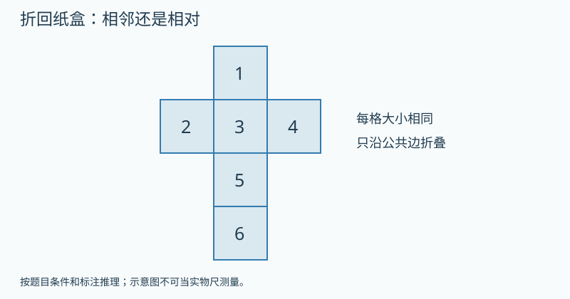

   图的文字备份：展开图竖列从上到下为1、3、5、6；2在3左侧，4在3右侧。六个同样正方形沿公共边连接。

   提示1（按需展开）：先把3号平放，把围着它的四个面折起。
   提示2（按需展开）：2与4在3的哪两侧？还没折的6最后盖在哪里？
   答案：2与4相对；6与3相对。 理由：把3当底面，1、2、4、5沿四条边立起，2与4位于两侧且相对。6连在5外侧，继续折起盖住顶面，因此与底面3相对。
9. 【独立回顾】〔G3-U01-B03-P09；auto_checked〕〔第1天独立回顾〕一个正方体的顶面和右面共用一条棱。沿其他棱剪开并保留这条连接边，这两个面在展开图里还连着吗？
   答案：还沿这条边连着。 理由：没有剪断的连接边在展开后仍保留。
10. 【独立回顾】〔G3-U01-B03-P10；auto_checked〕〔第3天独立回顾〕有人把一个正方体纸盒展开后数出7个完整方形面。最先应该检查什么？
   答案：检查是否把粘贴的小舌片算成面，或重复数了某个面。 理由：正方体只有6个面，粘贴片不是新的完整面。
11. 【独立回顾】〔G3-U01-B03-P11；auto_checked〕〔第7天独立回顾〕想知道展开图里的星星面折回后朝向哪里，可以怎样验证而不靠猜？
   答案：按折痕折回纸盒，观察星星面的位置。 理由：实际折叠可以追踪同一个面的去向。
12. 【独立回顾】〔G3-U01-B03-P12；auto_checked〕〔第21天独立回顾〕一张纸上任意画6个同样大的正方形，就一定能折成正方体吗？说明判断办法。
   答案：不一定；要检查折叠后能否形成6个不重叠的面并围合。 理由：面数正确只是条件之一，连接方式也重要。

**练习安排：**12题是题库：P01–P08当堂备选，一次选3–5题；P09–P12分别第1、3、7、21天出现，不得提前展示。选学挑战不影响基础完成。

**本课基础怎样走向提升：**基础过关后，本课提升与关联思维卡合计最多选一道；需要多个任务才讲清的可分次，允许跳过提升继续教材主线。
**实际提升题：**G3-U01-B03-P08
**要观察的思考：**把展开关系转成空间关系，用实际折叠验证。
**关联思维卡：**先使用本课列出的提升题，不额外开重复专题
**掌握证据边界：**P09–P12用于本课原有目标的分日回顾，不因基础回顾通过就判新提升已掌握。看过答案的原题不再作为独立证据；后续选同方法、条件有变化的题单独记录，暂无对应独立题时标待迁移。

**证据边界：**本稿提供参考答案与数量理由，尚不是可执行评分器。首答、自查后的最终答和帮助等级分开保存；开放解释须成人确认。AI复核不计为教师人工审定或Kevin试学。

**易错：**展开图的样子一变，六个面就变了。 → 面与原来的标记仍是一一对应，空间关系靠折回检查。

**Kevin复述：**讲出一个必须折回盒子才容易确认的判断。

**后续联系：**五下体积与表面积再做精确面积计算；本课不背11种正方体展开图。

#### G3-U02 混合运算

教材印刷6–19页为主线。先完成B01–B05；E01→E03解释去/添括号，E02比较除以积与除以商，E04/E05用具体数体验运算律，O01/O02为可选思想。ID稳定，顺序以本表为准；不要求连续做完所有提升。

**本章思维收尾（选学，每次最多一道）：**[本章提升：括号为了解决不同的题意](#g3-u02-th1)；[奥数思想选学：错序为什么总多出同样的数](#g3-u02-th2)；[本章提升：差变小，是哪两头一起变了](#g3-u02-s02)；[本章提升：两个部分的总数，谁被数了两遍](#g3-u02-s05)；[本章提升：两种文具，先换成同一种价格份](#g3-u02-s06)；[奥数思想选学：同一个数量，为什么出现一段缺口](#g3-u02-s07)；[本章提升：送出去以后，要倒着走两步](#g3-u02-s17)；[奥数思想选学：一个给出五元，差为什么变成十元](#g3-u02-s18)

##### G3-U02-B01 一串加减或乘除，按什么顺序算

**定位：** B；建议35分钟。来源G3-upper：印刷6–7 / PDF 12–13。
原创教案；页码锚定相关教材内容，不表示本教案题目出自教材。

**先修：**表内乘除、两步加减。
**关联课程：**依已有能力直接进入

**目标：**能识别同一级运算，并从左往右计算。

**真实问题：**车上有28人，先下车9人，再上车6人；想在一行里记录变化。

**为什么：**一串符号需要大家用同一种方法读取。数学约定：没有括号时，加减同级、乘除同级，同级从左往右算。这是统一的书写与读取约定，不是从某一个故事证明出来的规律。故事另外帮助我们检查式子是否表示了题意。

**模型操作：**把每一步人数写在连续三张卡片上；另用24个棋子先分6组再把每组取2倍。

**讲解：**

1. 只有加减时，从左到右算：28−9+6先得19，再算19+6得25。
2. 只有乘除时也从左到右算：24÷6×2先得4，再算4×2得8；不是乘法永远先算。
3. 每次只把刚算的部分换成结果，把其余数字和符号原样抄下。24÷6×2=4×2=8；不能在等号左边只写24÷6，却在右边接上4×2，因为两边不相等。
4. 最后自己查三件事：符号抄对了吗？第一步选对了吗？第二步做完了吗？有剩余的分装题另外说清剩下的是什么。

**学习层级与本次目标：**教材基础
**最低证据：**能识别同一级运算，并从左往右计算。
**最低代表题：**G3-U02-B01-P01、G3-U02-B01-P02、G3-U02-B01-P05
**其他当堂备选：**G3-U02-B01-P03、G3-U02-B01-P04、G3-U02-B01-P06、G3-U02-B01-P07、G3-U02-B01-P08
**退出规则：**本次选定3道代表题能独立完成，并按本课理由说明关键关系，成人确认后记“本次达标”。自主自查改对单独记录；看过解答后改对只记订正。任何状态都允许结束和进入其他课；不是解锁条件。
**暂停与回补：**同一关系连续两次仍需步骤提示，停止加题，回到本课具体模型或建议先修；也可保存位置，下次再学。不能为积分强迫做完。 回补位置：本课模型与已列先修
**课次安排：**讲解与模型约12–18分钟，3道目标题约8–12分钟，复述/自查约3–5分钟；可提前停止。
**共享概念：**arithmetic.order.same-level（first）

**教具行为规约（尚未实现）：**

| 环节 | 具体行为与证据 |
|---|---|
| 初始状态 | 显示24÷6×2，三张卡分别标原数、第一步、最终结果；没有括号。 |
| Kevin动作 | 选择第一步的两个数及符号，输入4；再选择4×2输入8。 |
| 可观察变化 | 正确记录24÷6×2→4×2→8；原数字与未算符号逐步保留。 |
| 追问 | 用36÷6×2说明“先乘除”中的乘和除谁先谁后。 |
| 预期解释 | 一串符号需要大家用同一种方法读取。数学约定：没有括号时，加减同级、乘除同级，同级从左往右算。这是统一的书写与读取约定，不是从某一个故事证明出来的规律。故事另外帮助我们检查式子是否表示了题意。 |
| 错误动作反馈 | 先选6×2时显示“这会把后两个数当成一个除数”；不自动改答案，提示本课同级从左往右。 |
| 撤除教具后 | 先收起模型、提示和例题答案，显示独立题；不把操纵成功直接记为掌握。 独立题G3-U02-B01-P05：书架有42本书，借出15本又归还7本，写一条算式。 |
| 独立题参考 | 42−15+7=34（本）；变化顺序先减后加。 |

本题预留到教具撤除后，早先选题跳过它；若已曝光则只记练习，改选未曝光且经审核的同目标题，题库耗尽时成人确认，不伪造独立证据。
如本操作尚无可执行教具，先展示准确的前后两图或用实体材料，并明确标为演示/线下操作。不得让不可操作图片冒充拖拽。
**自查动作：**查符号是否抄对；第一步是否符合括号和同级规则；第二步是否完成；最后说结果是什么量。
**记录：**首答提交后先自行检查再确认最终答；首次答案不可覆盖，未反馈正确答案前的自主纠错可独立记录。

**错后区分性补问：**48÷8×2中，6表示第一步结果还是整式结果？整式还剩哪一步？
参考：第一步6，还需×2得12。；能选对步骤但漏末步→自查支持；步骤也不清→回到同级读取。；允许家长修正，仅标可能原因。

**原创例题：**计算48÷8×3，并解释为什么不先算8×3。

1. 只有乘除，同级从左往右。
2. 48÷8=6，6×3=18。

答案：18；先乘会把原式改成48÷(8×3)。

**练习与讲评：**

1. 【基础】〔G3-U02-B01-P01；auto_checked〕算35−12+8。
   答案：31 理由：先35−12=23，再加8。
2. 【基础】〔G3-U02-B01-P02；auto_checked〕算36÷6×2。
   答案：12 理由：先除再乘。
3. 【变式】〔G3-U02-B01-P03；auto_checked〕算5×8÷4。
   答案：10 理由：40÷4=10。
4. 【变式】〔G3-U02-B01-P04；auto_checked〕有人把40−18+2算成20。他可能把哪一步放在了前面？
   答案：先算18+2 理由：这样实际算了40−(18+2)。
5. 【迁移】〔G3-U02-B01-P05；auto_checked〕书架有42本书，借出15本又归还7本，写一条算式。
   答案：42−15+7=34（本） 理由：变化顺序先减后加。
6. 【挑战】〔G3-U02-B01-P06；auto_checked〕18÷3×2与18÷3÷2的结果分别是多少？只把最后一个乘号换成除号，结果会相同吗？
   答案：分别12和3，不相同。 理由：先18÷3=6，再分别算6×2和6÷2；必须看清第二个符号。
7. 【补充变式】〔G3-U02-B01-P07；auto_checked〕算72÷8×3时，第一步算什么？结果是多少？
   答案：先算72÷8=9，再算9×3=27。 理由：乘除同级，按从左到右的顺序。
8. 【补充变式】〔G3-U02-B01-P08；auto_checked〕算64−18+6，有人先算18+6，得到40。正确结果是多少？
   答案：52。 理由：应先64−18=46，再加6；原式没有要求先合并18和6。
9. 【独立回顾】〔G3-U02-B01-P09；auto_checked〕〔第1天独立回顾〕计算45÷5×2，并说出为什么不是除以10。
   答案：18；先45÷5，再乘2。 理由：乘除同级，不能擅自把后两个数合为一个除数。
10. 【独立回顾】〔G3-U02-B01-P10；auto_checked〕〔第3天独立回顾〕计算90−30−20，并讲成一次取走物品的过程。
   答案：40；90件先取走30件，再取走20件，剩40件。 理由：两次减法按原来顺序完成。
11. 【独立回顾】〔G3-U02-B01-P11；auto_checked〕〔第7天独立回顾〕有36张卡，每4张装一袋。每个同学拿2袋，若问这些袋子能供几人，应写36÷4×2还是36÷4÷2？
   答案：36÷4÷2，能供4人，余1袋。 理由：先得9袋，再按每人2袋分；不能把人数问题改成袋数乘2。
12. 【独立回顾】〔G3-U02-B01-P12；auto_checked〕〔第21天独立回顾〕计算30−8+2，并说明为什么写出22以后还不能停下。
   答案：24；22只完成30−8，还要加2。 理由：同级从左往右，保留第二步；可用24−2+8=30验回起点。

**练习安排：**12题是题库：P01–P08当堂备选，一次选3–5题；P09–P12分别第1、3、7、21天出现，不得提前展示。选学挑战不影响基础完成。

**本课基础怎样走向提升：**基础过关后，本课提升与关联思维卡合计最多选一道；需要多个任务才讲清的可分次，允许跳过提升继续教材主线。
**实际提升题：**G3-U02-B01-P06
**要观察的思考：**先18÷3=6，再分别算6×2和6÷2；必须看清第二个符号。
**关联思维卡：**先使用本课列出的提升题，不额外开重复专题
**掌握证据边界：**P09–P12用于本课原有目标的分日回顾，不因基础回顾通过就判新提升已掌握。看过答案的原题不再作为独立证据；后续选同方法、条件有变化的题单独记录，暂无对应独立题时标待迁移。

**证据边界：**本稿提供参考答案与数量理由，尚不是可执行评分器。首答、自查后的最终答和帮助等级分开保存；开放解释须成人确认。AI复核不计为教师人工审定或Kevin试学。

**易错：**乘法永远比除法先算，加法永远比减法先算。 → 乘除同一级；加减同一级；同级从左往右。

**Kevin复述：**用36÷6×2说明“先乘除”中的乘和除谁先谁后。

**后续联系：**下一课加入不同级运算，再引入括号。

##### G3-U02-B02 没有括号时，先乘除，再加减

**定位：** B；建议35分钟。来源G3-upper：印刷7–8 / PDF 13–14。
原创教案；页码锚定相关教材内容，不表示本教案题目出自教材。

**先修：**G3-U02-B01。
**关联课程：**G3-U02-B01

**目标：**会按先乘除后加减计算，并区分运算顺序约定与情境中列式的理由。

**真实问题：**有3盒彩笔，每盒6支，另有4支散装彩笔，一共有几支？

**为什么：**为使同一算式有一致的读法，数学约定无括号时先乘除后加减。彩笔故事中先求3盒共有多少支，是这个情境的数量关系；它解释为什么列4+3×6，但不是证明所有算式顺序的依据。

**模型操作：**画3个框，每框6点，框外4点；框内总数对应3×6。

**讲解：**

1. 先说明约定：有乘除又有加减，先算乘除；乘和除同级，加和减同级。
2. 3盒每盒6支，先得到18支，再和散装4支合并；3是盒数，4是支数，不能先把3与4相加当作盒数。
3. 4+3×6=4+18=22。先写下未算的4+，防止算出18就停。
4. 只有算式而没有故事时，同样按约定计算；先读符号和括号，再决定第一步。

**学习层级与本次目标：**教材基础
**最低证据：**会按先乘除后加减计算，并区分运算顺序约定与情境中列式的理由。
**最低代表题：**G3-U02-B02-P01、G3-U02-B02-P02、G3-U02-B02-P08
**其他当堂备选：**G3-U02-B02-P03、G3-U02-B02-P04、G3-U02-B02-P05、G3-U02-B02-P06、G3-U02-B02-P07
**退出规则：**本次选定3道代表题能独立完成，并按本课理由说明关键关系，成人确认后记“本次达标”。自主自查改对单独记录；看过解答后改对只记订正。任何状态都允许结束和进入其他课；不是解锁条件。
**暂停与回补：**同一关系连续两次仍需步骤提示，停止加题，回到本课具体模型或建议先修；也可保存位置，下次再学。不能为积分强迫做完。 回补位置：G3-U02-B01
**课次安排：**讲解与模型约12–18分钟，3道目标题约8–12分钟，复述/自查约3–5分钟；可提前停止。
**共享概念：**arithmetic.order.precedence（first）

**教具行为规约（尚未实现）：**

| 环节 | 具体行为与证据 |
|---|---|
| 初始状态 | 显示4+3×6及3盒每盒6支、盒外4支，答案隐藏。 |
| Kevin动作 | 框选3×6并数盒内18支，再把4支移入总数框。 |
| 可观察变化 | 算式同步为4+18→22；18只标盒内支数。 |
| 追问 | 2盒彩笔每盒8支，另外有5支散装。为什么写2×8+5，不能先算2+5？ |
| 预期解释 | 为使同一算式有一致的读法，数学约定无括号时先乘除后加减。彩笔故事中先求3盒共有多少支，是这个情境的数量关系；它解释为什么列4+3×6，但不是证明所有算式顺序的依据。 |
| 错误动作反馈 | 若选4+3，指出4是支数3是盒数；随后另读纯算式，提示先乘除是读取约定。 |
| 撤除教具后 | 先收起模型、提示和例题答案，显示独立题；不把操纵成功直接记为掌握。 独立题G3-U02-B02-P08：24颗球每6颗装一盒，另有2盒已经装好。一共几盒？ |
| 独立题参考 | 24÷6+2=6盒。；除法先把球数换成盒数，再与已有盒数相加。 |

本题预留到教具撤除后，早先选题跳过它；若已曝光则只记练习，改选未曝光且经审核的同目标题，题库耗尽时成人确认，不伪造独立证据。
如本操作尚无可执行教具，先展示准确的前后两图或用实体材料，并明确标为演示/线下操作。不得让不可操作图片冒充拖拽。
**自查动作：**查符号是否抄对；第一步是否符合括号和同级规则；第二步是否完成；最后说结果是什么量。
**记录：**首答提交后先自行检查再确认最终答；首次答案不可覆盖，未反馈正确答案前的自主纠错可独立记录。

**错后区分性补问：**先不计算，指出18−12÷3第一步该选哪一段。
参考：12÷3。；若选对但原题错，查计算/抄符号；仍选错才建议回看顺序约定。；允许家长修正，仅标可能原因。

**原创例题：**24颗珠子每6颗装一袋，另外已有3袋，一共多少袋？

1. 24÷6=4袋。
2. 4+3=7袋，合式为24÷6+3。

答案：7袋。

**练习与讲评：**

1. 【基础】〔G3-U02-B02-P01；auto_checked〕7+4×5等于多少？
   答案：27 理由：先算4×5=20。
2. 【基础】〔G3-U02-B02-P02；auto_checked〕30−18÷3等于多少？
   答案：24 理由：先18÷3=6。
3. 【变式】〔G3-U02-B02-P03；auto_checked〕8+12÷4中，哪一部分先看作一个数量？
   答案：12÷4 理由：先得到商，再与8相加。
4. 【变式】〔G3-U02-B02-P04；auto_checked〕“2盒彩笔每盒8支，另有5支”能写成(2+5)×8吗？
   答案：不能，应2×8+5 理由：5是支数，不是盒数。
5. 【迁移】〔G3-U02-B02-P05；auto_checked〕3张成人票每张9元，再买1张5元儿童票，应付多少？
   答案：3×9+5=32元 理由：同类票价先求和。
6. 【挑战】〔G3-U02-B02-P06；auto_checked〕6+3×4和6×3+4各等于多少？两道题的数字相同，为什么不能抄同一个答案？
   答案：分别18和22。 理由：运算符号的位置不同；前者先3×4，后者先6×3。
7. 【补充变式】〔G3-U02-B02-P07；auto_checked〕每袋5颗糖，买4袋，又收到3颗。列一个综合算式并求总数。
   答案：5×4+3=23颗。 理由：先求4个相同袋子的糖，再加零散的3颗。
8. 【补充变式】〔G3-U02-B02-P08；auto_checked〕24颗球每6颗装一盒，另有2盒已经装好。一共几盒？
   答案：24÷6+2=6盒。 理由：除法先把球数换成盒数，再与已有盒数相加。
9. 【独立回顾】〔G3-U02-B02-P09；auto_checked〕〔第1天独立回顾〕计算7+6×4，第一步为何不是7+6？
   答案：先算6×4，结果31。 理由：这是无括号混合运算的统一约定：先乘除后加减；不能把某个故事当作对所有算式的证明。
10. 【独立回顾】〔G3-U02-B02-P10；auto_checked〕〔第3天独立回顾〕判断50−8×5是否等于210，并改正。
   答案：不等于，应为10。 理由：先算8×5=40，再用50减40，不能先减后乘。
11. 【独立回顾】〔G3-U02-B02-P11；auto_checked〕〔第7天独立回顾〕体育室有3筐球，每筐8个，借走6个。还剩多少个？
   答案：3×8−6=18个。 理由：先求总球数24个，再减去借走数量。
12. 【独立回顾】〔G3-U02-B02-P12；auto_checked〕〔第21天独立回顾〕计算18−12÷3。有人先算18−12得到6，再除3得到2。你怎样检查并改正？
   答案：应先12÷3=4，再18−4=14。 理由：先除后减；两步都完成，不能只报告第一步的4。

**练习安排：**12题是题库：P01–P08当堂备选，一次选3–5题；P09–P12分别第1、3、7、21天出现，不得提前展示。选学挑战不影响基础完成。

**本课基础怎样走向提升：**基础过关后，本课提升与关联思维卡合计最多选一道；需要多个任务才讲清的可分次，允许跳过提升继续教材主线。
**实际提升题：**G3-U02-B02-P06
**要观察的思考：**运算符号的位置不同；前者先3×4，后者先6×3。
**关联思维卡：**先使用本课列出的提升题，不额外开重复专题
**掌握证据边界：**P09–P12用于本课原有目标的分日回顾，不因基础回顾通过就判新提升已掌握。看过答案的原题不再作为独立证据；后续选同方法、条件有变化的题单独记录，暂无对应独立题时标待迁移。

**证据边界：**本稿提供参考答案与数量理由，尚不是可执行评分器。首答、自查后的最终答和帮助等级分开保存；开放解释须成人确认。AI复核不计为教师人工审定或Kevin试学。

**易错：**凡是从左开始算总是对的。 → 先确定层级，再在同级内从左往右。

**Kevin复述：**2盒彩笔每盒8支，另外有5支散装。为什么写2×8+5，不能先算2+5？

**后续联系：**接着研究情境要求先加或减时，怎样用括号写清楚。

##### G3-U02-B03 括号把需要先做的事圈在一起

**定位：** B；建议35分钟。来源G3-upper：印刷8–11 / PDF 14–17。
原创教案；页码锚定相关教材内容，不表示本教案题目出自教材。

**先修：**G3-U02-B02。
**关联课程：**G3-U02-B02

**目标：**能按情境添加括号，并正确读取括号内外的含义。

**真实问题：**两个盒子分别有18颗和12颗珠子，把所有珠子每6颗装一袋，可以装几袋？

**为什么：**要问能装几袋，就得先把两盒珠子合起来，再按每6颗一袋分装。18+12÷6只会先把第二盒分成2袋，接着把第一盒的18颗和这2袋相加；颗数和袋数不能这样直接相加，所以它不能表示这次分装。

**模型操作：**画两堆珠子，用大框同时包住两堆，再从总堆每6颗圈一袋。

**讲解：**

1. 先求珠子的总颗数：18+12=30；再求袋数：30÷6=5。两步分别回答“共有多少颗”和“能装几袋”。
2. 把第一步的18+12作为一个整体放进第二步，写成(18+12)÷6。括号说明两盒的珠子都要参加分装。
3. 括号内若也含多种运算，仍遵守乘除先于加减；本课先练一层小括号。
4. 这里为表达题意添加括号，可以改变原算式的值。以后若题目要求“值保持不变”，那是另一种任务，不能随意只加一对括号。

**学习层级与本次目标：**教材基础
**最低证据：**能按情境添加括号，并正确读取括号内外的含义。
**最低代表题：**G3-U02-B03-P01、G3-U02-B03-P04、G3-U02-B03-P05
**其他当堂备选：**G3-U02-B03-P02、G3-U02-B03-P03、G3-U02-B03-P06、G3-U02-B03-P07、G3-U02-B03-P08
**退出规则：**本次选定3道代表题能独立完成，并按本课理由说明关键关系，成人确认后记“本次达标”。自主自查改对单独记录；看过解答后改对只记订正。任何状态都允许结束和进入其他课；不是解锁条件。
**暂停与回补：**同一关系连续两次仍需步骤提示，停止加题，回到本课具体模型或建议先修；也可保存位置，下次再学。不能为积分强迫做完。 回补位置：G3-U02-B02
**课次安排：**讲解与模型约12–18分钟，3道目标题约8–12分钟，复述/自查约3–5分钟；可提前停止。
**共享概念：**arithmetic.parentheses.model（first）

**教具行为规约（尚未实现）：**

| 环节 | 具体行为与证据 |
|---|---|
| 初始状态 | 两堆分别12和8枚代币，每4枚装一袋；另有12个已装好袋加8枚散币的对照卡。 |
| Kevin动作 | 在第一情境先合并两堆，再逐组装袋；为12+8÷4框选先算部分。 |
| 可观察变化 | 第一情境(12+8)÷4=5袋；第二情境12+8÷4=14袋。 |
| 追问 | 把(18+12)÷6讲成完整故事，再说明18+12÷6为什么不是同一件事。 |
| 预期解释 | 要问能装几袋，就得先把两盒珠子合起来，再按每6颗一袋分装。18+12÷6只会先把第二盒分成2袋，接着把第一盒的18颗和这2袋相加；颗数和袋数不能这样直接相加，所以它不能表示这次分装。 |
| 错误动作反馈 | 若未合并就除，指出第一堆仍是枚、不能与袋相加；两情境的12单位不同，不能只比较图上数字。 |
| 撤除教具后 | 先收起模型、提示和例题答案，显示独立题；不把操纵成功直接记为掌握。 独立题G3-U02-B03-P05：有40元，买一本16元的书，剩下的钱每3元买一支笔，可买几支？ |
| 独立题参考 | (40−16)÷3=8支；先求剩余的钱。 |

本题预留到教具撤除后，早先选题跳过它；若已曝光则只记练习，改选未曝光且经审核的同目标题，题库耗尽时成人确认，不伪造独立证据。
如本操作尚无可执行教具，先展示准确的前后两图或用实体材料，并明确标为演示/线下操作。不得让不可操作图片冒充拖拽。
**自查动作：**查符号是否抄对；第一步是否符合括号和同级规则；第二步是否完成；最后说结果是什么量。
**记录：**首答提交后先自行检查再确认最终答；首次答案不可覆盖，未反馈正确答案前的自主纠错可独立记录。

**错后区分性补问：**18枚与6枚合并，每4枚一袋；要分的是6枚，还是全部24枚？
参考：全部24枚，应(18+6)÷4。；能说整体但漏符号→记录表达支持；整体也错→回合并实物。；允许家长修正，仅标可能原因。

**原创例题：**把18颗与12颗珠子合并，每6颗一袋，有几袋？

1. 先合并18+12=30颗。
2. 30÷6=5袋，写成(18+12)÷6。

答案：5袋。

**练习与讲评：**

1. 【基础】〔G3-U02-B03-P01；auto_checked〕(15+9)÷6等于多少？
   答案：4 理由：先24再除6。
2. 【基础】〔G3-U02-B03-P02；auto_checked〕50−(12+8)等于多少？
   答案：30 理由：括号总共是20。
3. 【变式】〔G3-U02-B03-P03；auto_checked〕50−(12−8)等于多少？
   答案：46 理由：括号是4，不能把加减号看漏。
4. 【变式】〔G3-U02-B03-P04；auto_checked〕给6+4×3添一对括号，使结果为30。
   答案：(6+4)×3 理由：把10作为每组数乘3。
5. 【迁移】〔G3-U02-B03-P05；auto_checked〕有40元，买一本16元的书，剩下的钱每3元买一支笔，可买几支？
   答案：(40−16)÷3=8支 理由：先求剩余的钱。
6. 【挑战】〔G3-U02-B03-P06；auto_checked〕同样是24÷4+2，添括号后能得到4吗？
   答案：能：24÷(4+2)=4 理由：除数变成整体6。
7. 【补充变式】〔G3-U02-B03-P07；auto_checked〕有18元，又得到6元，每支笔4元，最多买几支？把需要先算的部分圈在括号里。
   答案：(18+6)÷4=6支。 理由：先合并两笔钱，再按单价分组。
8. 【补充变式】〔G3-U02-B03-P08；auto_checked〕18+6÷3与(18+6)÷3分别等于多少？
   答案：20和8。 理由：一个先除，一个先把两个加数合为整体。
9. 【独立回顾】〔G3-U02-B03-P09；auto_checked〕〔第1天独立回顾〕计算(42−18)÷6，说明第一步求什么。
   答案：4；第一步求42与18的差24。 理由：括号要求先得到完整的差，再除以6。
10. 【独立回顾】〔G3-U02-B03-P10；auto_checked〕〔第3天独立回顾〕书架有42本书，借走18本。剩下每6本装一包，有人用42−18÷6求包数，哪里错？正确几包？
   答案：应先算(42−18)÷6=4包。 理由：装包的是借走后剩下的24本，整个差才是要平均分的数量。
11. 【独立回顾】〔G3-U02-B03-P11；auto_checked〕〔第7天独立回顾〕36张贴纸，送走12张，剩下平均给4人。有人写36−12÷4，错在什么地方？
   答案：应写(36−12)÷4=6张。 理由：分的是送走后所有剩余贴纸，不只是12张。
12. 【独立回顾】〔G3-U02-B03-P12；auto_checked〕〔第21天独立回顾〕什么情况下括号不能直接删去？用20÷(2+3)说明。
   答案：需要把2+3作为整个除数时不能直接删；原式4，删后13。 理由：删括号可能改变运算的整体与先后。

**练习安排：**12题是题库：P01–P08当堂备选，一次选3–5题；P09–P12分别第1、3、7、21天出现，不得提前展示。选学挑战不影响基础完成。

**本课基础怎样走向提升：**基础过关后，本课提升与关联思维卡合计最多选一道；需要多个任务才讲清的可分次，允许跳过提升继续教材主线。
**实际提升题：**G3-U02-B03-P06
**要观察的思考：**除数变成整体6。
**关联思维卡：**G3-U02-TH1
**掌握证据边界：**P09–P12用于本课原有目标的分日回顾，不因基础回顾通过就判新提升已掌握。看过答案的原题不再作为独立证据；后续选同方法、条件有变化的题单独记录，暂无对应独立题时标待迁移。

**证据边界：**本稿提供参考答案与数量理由，尚不是可执行评分器。首答、自查后的最终答和帮助等级分开保存；开放解释须成人确认。AI复核不计为教师人工审定或Kevin试学。

**易错：**见到括号就可以删掉，数没有变。 → 数没变不等于运算结构没变；先读括号表示的整个数量。

**Kevin复述：**把(18+12)÷6讲成完整故事，再说明18+12÷6为什么不是同一件事。

**后续联系：**下两课从文字和线段图主动构造算式。

##### G3-U02-B04 同一个“剩多少”，可以怎样列式

**定位：** B；建议35分钟。来源G3-upper：印刷12–13 / PDF 18–19。
原创教案；页码锚定相关教材内容，不表示本教案题目出自教材。

**先修：**G3-U02-B03。
**关联课程：**G3-U02-B03

**目标：**能用逐次减与先合并再减表示同一情境。

**真实问题：**60张卡片，上午送出14张，下午送出16张，还剩多少？

**为什么：**两批互不重叠的送出量可以先合并；这种数量关系是去添括号的依据。

**模型操作：**一条60格纸带标出14格、16格与剩余部分，三段刚好拼回整体。

**讲解：**

1. 逐次减：60−14−16。
2. 先求共送出30，再60−(14+16)。
3. 把送出的两段加回剩余，检查是否回到60。

**学习层级与本次目标：**教材基础
**最低证据：**能用逐次减与先合并再减表示同一情境。
**最低代表题：**G3-U02-B04-P01、G3-U02-B04-P02、G3-U02-B04-P03
**其他当堂备选：**G3-U02-B04-P04、G3-U02-B04-P05、G3-U02-B04-P06、G3-U02-B04-P07、G3-U02-B04-P08
**退出规则：**本次选定3道代表题能独立完成，并按本课理由说明关键关系，成人确认后记“本次达标”。自主自查改对单独记录；看过解答后改对只记订正。任何状态都允许结束和进入其他课；不是解锁条件。
**暂停与回补：**同一关系连续两次仍需步骤提示，停止加题，回到本课具体模型或建议先修；也可保存位置，下次再学。不能为积分强迫做完。 回补位置：G3-U02-B03
**课次安排：**讲解与模型约12–18分钟，3道目标题约8–12分钟，复述/自查约3–5分钟；可提前停止。
**共享概念：**arithmetic.subtract-total（first）

**教具行为规约（尚未实现）：**

| 环节 | 具体行为与证据 |
|---|---|
| 初始状态 | 60格纸带：14格标上午送出、16格标下午送出，两段不重叠。 |
| Kevin动作 | 分别划去两段，再撤销并一次划去合成的30格。 |
| 可观察变化 | 两种操作均余30；60−14−16与60−(14+16)对应相同被删部分。 |
| 追问 | 为什么60−(14+16)展开后是两个减号？ |
| 预期解释 | 两批互不重叠的送出量可以先合并；这种数量关系是去添括号的依据。 |
| 错误动作反馈 | 只划一段或把第二段加回时，对照“下午也是送出”检查动作方向。 |
| 撤除教具后 | 先收起模型、提示和例题答案，显示独立题；不把操纵成功直接记为掌握。 独立题G3-U02-B04-P03：80−(23+17)能改成80−23+17吗？ |
| 独立题参考 | 不能；第二批也是借出，不是归还。 |

本题预留到教具撤除后，早先选题跳过它；若已曝光则只记练习，改选未曝光且经审核的同目标题，题库耗尽时成人确认，不伪造独立证据。
如本操作尚无可执行教具，先展示准确的前后两图或用实体材料，并明确标为演示/线下操作。不得让不可操作图片冒充拖拽。
**自查动作：**查符号是否抄对；第一步是否符合括号和同级规则；第二步是否完成；最后说结果是什么量。
**记录：**首答提交后先自行检查再确认最终答；首次答案不可覆盖，未反馈正确答案前的自主纠错可独立记录。

**原创例题：**60张卡片分两次送出14张和16张。用两种方法求剩余。

1. 60−14−16=46−16=30。
2. 60−(14+16)=60−30=30。

答案：30张；两式描述同一组互不重叠的送出。

**练习与讲评：**

1. 【基础】〔G3-U02-B04-P01；auto_checked〕80本书先借出23本，再借出17本，还剩多少？
   答案：40本 理由：80−23−17=40。
2. 【基础】〔G3-U02-B04-P02；auto_checked〕把80−23−17写成“先求一共借出”。
   答案：80−(23+17) 理由：括号内要相加。
3. 【变式】〔G3-U02-B04-P03；auto_checked〕80−(23+17)能改成80−23+17吗？
   答案：不能 理由：第二批也是借出，不是归还。
4. 【变式】〔G3-U02-B04-P04；auto_checked〕原有50张，送出8张又收到12张，还能把8与12合起来一起减吗？
   答案：不能 理由：两次变化方向不同。
5. 【迁移】〔G3-U02-B04-P05；auto_checked〕一条90厘米纸带，剪去不重叠的25厘米和35厘米，剩多少？
   答案：30厘米 理由：两段合为60厘米。
6. 【挑战】〔G3-U02-B04-P06；auto_checked〕总数是90，已送出两批共58，剩下32。只知道这些，能求第一批多少吗？
   答案：不能 理由：两批的分配还不确定。
7. 【补充变式】〔G3-U02-B04-P07；auto_checked〕60本书先借走17本，再借走13本。用两种算式求剩余本数。
   答案：60−17−13=30；60−(17+13)=30。 理由：分两次借与先合计借走数描述同一件事。
8. 【选学提升】〔G3-U02-B04-P08；auto_checked〕60张卡片先送出一些，又送出一些，还剩25张。小乐说“只知道剩多少，什么都求不出”。你能确定什么，不能确定什么？举出两种不同的赠送方案，两次都要送出至少1张。
   提示1（按需展开）：全部60与剩下25，先能知道哪一个合计？
   提示2（按需展开）：找两对不同的正整数，都凑成35。
   答案：能确定两次共送35张，不能确定各送多少。例如10与25、15与20。 理由：60−25=35确定的是两次的合计。不同的两个正整数只要相加为35，都留下25，因此分别的数量不唯一。
9. 【独立回顾】〔G3-U02-B04-P09；auto_checked〕〔第1天独立回顾〕计算100−36−24，并写成带括号的等值算式。
   答案：40；100−(36+24)=40。 理由：连续扣去两笔，等于扣去两笔的总和。
10. 【独立回顾】〔G3-U02-B04-P10；auto_checked〕〔第3天独立回顾〕有人把80−20−15写成80−(20−15)。用结果检查是否正确。
   答案：不正确；原式45，改后75。 理由：括号里应合计扣除量，不能把第二笔扣除变成退回。
11. 【独立回顾】〔G3-U02-B04-P11；auto_checked〕〔第7天独立回顾〕商店原有72瓶水，上午卖28瓶，下午卖22瓶。先求全天卖出数，再求剩余数。
   答案：全天50瓶，剩22瓶。 理由：28+22=50，72−50=22。
12. 【独立回顾】〔G3-U02-B04-P12；auto_checked〕〔第21天独立回顾〕为什么“连续减两笔”能先把两笔相加，却不是随意改变减号？用借书故事解释。
   答案：因为两笔都是从原总数取走的，合计取走量是两笔之和。 理由：保留数量关系才保证两个算式等值。

**练习安排：**12题是题库：P01–P08当堂备选，一次选3–5题；P09–P12分别第1、3、7、21天出现，不得提前展示。选学挑战不影响基础完成。

**本课基础怎样走向提升：**基础过关后，本课提升与关联思维卡合计最多选一道；需要多个任务才讲清的可分次，允许跳过提升继续教材主线。
**实际提升题：**G3-U02-B04-P08
**要观察的思考：**区分总量可确定与分量不可确定，用两种方案证明。
**关联思维卡：**G3-U02-S02
**掌握证据边界：**P09–P12用于本课原有目标的分日回顾，不因基础回顾通过就判新提升已掌握。看过答案的原题不再作为独立证据；后续选同方法、条件有变化的题单独记录，暂无对应独立题时标待迁移。

**证据边界：**本稿提供参考答案与数量理由，尚不是可执行评分器。首答、自查后的最终答和帮助等级分开保存；开放解释须成人确认。AI复核不计为教师人工审定或Kevin试学。

**易错：**只要看到两个数，就可以随便合并。 → 先判断它们是否表示同一种量、是否都要从总数扣除。

**Kevin复述：**为什么60−(14+16)展开后是两个减号？

**后续联系：**提升课会讨论括号里是差时，为什么后一个符号反而改变。

##### G3-U02-B05 两步问题：先找到缺少的那个数量

**定位：** B；建议35分钟。来源G3-upper：印刷13–17 / PDF 19–23。
原创教案；页码锚定相关教材内容，不表示本教案题目出自教材。

**先修：**G3-U02-B03；整除的等量分组。
**关联课程：**G3-U02-B04

**目标：**能从目标倒找所需数量，区分求差后乘与分别相除后求差。

**真实问题：**小林做9朵花，小乔比小林少3朵，小安做的是小乔的2倍。怎样算小安的花数？

**为什么：**第二步用的是小乔的数量，而不是题目中最先出现的9；读清关系比关键词配运算重要。

**模型操作：**画9格与少3格的纸带，再把较短纸带复制成2段；另用等长每袋单位比较两堆。

**讲解：**

1. 先问最后要求谁，再找该数量依赖谁。
2. 用中间问题“先求小乔做几朵”连接两步。
3. 比较另一结构：(48−24)÷6与48÷6−24÷6在整除情境中等价。

**学习层级与本次目标：**教材基础
**最低证据：**能从目标倒找所需数量，区分求差后乘与分别相除后求差。
**最低代表题：**G3-U02-B05-P03、G3-U02-B05-P04、G3-U02-B05-P07
**其他当堂备选：**G3-U02-B05-P01、G3-U02-B05-P02、G3-U02-B05-P05、G3-U02-B05-P06、G3-U02-B05-P08
**退出规则：**本次选定3道代表题能独立完成，并按本课理由说明关键关系，成人确认后记“本次达标”。自主自查改对单独记录；看过解答后改对只记订正。任何状态都允许结束和进入其他课；不是解锁条件。
**暂停与回补：**同一关系连续两次仍需步骤提示，停止加题，回到本课具体模型或建议先修；也可保存位置，下次再学。不能为积分强迫做完。 回补位置：G3-U02-B04
**课次安排：**讲解与模型约12–18分钟，3道目标题约8–12分钟，复述/自查约3–5分钟；可提前停止。
**共享概念：**model.two-step.quantity（deepen）

**教具行为规约（尚未实现）：**

| 环节 | 具体行为与证据 |
|---|---|
| 初始状态 | 9格小林纸带；小乔少3格；小安是小乔的2倍。 |
| Kevin动作 | 先裁出小乔6格，再复制这6格为两段。 |
| 可观察变化 | 中间量6朵、最终12朵；式子(9−3)×2同步出现。 |
| 追问 | 你怎样从“最后问什么”找到必须先算的中间数量？ |
| 预期解释 | 第二步用的是小乔的数量，而不是题目中最先出现的9；读清关系比关键词配运算重要。 |
| 错误动作反馈 | 复制9格时问“小安是谁的2倍”，返回小乔纸带，不只说顺序错。 |
| 撤除教具后 | 先收起模型、提示和例题答案，显示独立题；不把操纵成功直接记为掌握。 独立题G3-U02-B05-P07：大袋有28颗球，小袋有16颗球。每4颗装一盒，大袋比小袋多装几盒？ |
| 独立题参考 | 3盒。；先求多12颗，再12÷4；也可7盒减4盒。 |

本题预留到教具撤除后，早先选题跳过它；若已曝光则只记练习，改选未曝光且经审核的同目标题，题库耗尽时成人确认，不伪造独立证据。
如本操作尚无可执行教具，先展示准确的前后两图或用实体材料，并明确标为演示/线下操作。不得让不可操作图片冒充拖拽。
**自查动作：**查符号是否抄对；第一步是否符合括号和同级规则；第二步是否完成；最后说结果是什么量。
**记录：**首答提交后先自行检查再确认最终答；首次答案不可覆盖，未反馈正确答案前的自主纠错可独立记录。

**原创例题：**红珠子48颗、蓝珠子24颗，每6颗同色珠子装一袋。红袋比蓝袋多几袋？

1. 红8袋，蓝4袋，差4袋。
2. 也可先求多出的24颗，再24÷6=4袋。

答案：多4袋。

**练习与讲评：**

1. 【基础】〔G3-U02-B05-P01；auto_checked〕小乔比9朵少3朵，是几朵？
   答案：6朵 理由：先求比较对象。
2. 【基础】〔G3-U02-B05-P02；auto_checked〕小安做的是6朵的2倍，是几朵？
   答案：12朵 理由：6×2。
3. 【变式】〔G3-U02-B05-P03；auto_checked〕“比9少3的数的2倍”写成9−3×2对吗？
   答案：不对，应(9−3)×2 理由：先求差，后求倍数。
4. 【变式】〔G3-U02-B05-P04；auto_checked〕36颗与12颗分别每6颗装袋，袋数相差多少？
   答案：4袋 理由：36÷6−12÷6=6−2。
5. 【迁移】〔G3-U02-B05-P05；auto_checked〕两卷绳子长42米和30米，都截成6米一段，长卷多几段？
   答案：2段 理由：差12米正好2段。
6. 【挑战】〔G3-U02-B05-P06；auto_checked〕若两堆都每6颗装满袋，剩余不装袋，10颗和5颗袋数相差多少？能直接(10−5)÷6吗？
   答案：相差1袋，不能用该式直接求满袋差 理由：涉及余数取整，两堆的满袋规则要分别处理。
7. 【补充变式】〔G3-U02-B05-P07；auto_checked〕大袋有28颗球，小袋有16颗球。每4颗装一盒，大袋比小袋多装几盒？
   答案：3盒。 理由：先求多12颗，再12÷4；也可7盒减4盒。
8. 【选学提升】〔G3-U02-B05-P08；auto_checked〕甲有5排花、每排6盆；乙有3排花、每排8盆。甲比乙多几盆？小乐想先算5−3再乘6，这样哪里不符合题意？
   提示1（按需展开）：两边“1排”所表示的盆数相同吗？
   提示2（按需展开）：先分别算甲的全部与乙的全部，再比较。
   答案：多6盆；不能把两边每排盆数当成相同。 理由：甲5×6=30，乙3×8=24，相差6。先减排数再乘6，隐含每排都6盆，但乙的每排有8盆。
9. 【独立回顾】〔G3-U02-B05-P09；auto_checked〕〔第1天独立回顾〕有40元，买2本每本8元的本子，还剩多少元？
   答案：24元。 理由：先求两本16元，再从40元扣除。
10. 【独立回顾】〔G3-U02-B05-P10；auto_checked〕〔第3天独立回顾〕小林读24页用了3天，小周读24页用了4天，两人每天页数都不变。小林每天多读几页？
   答案：2页。 理由：先分别求8页和6页，再比较；天数差不能直接当页数差。
11. 【独立回顾】〔G3-U02-B05-P11；auto_checked〕〔第7天独立回顾〕每盒装6支笔，红笔4盒、蓝笔2盒。求红笔比蓝笔多几支，可先求哪个量？
   答案：先求多2盒，再2×6=12支。 理由：比较同样大小的组，可以先比较组数。
12. 【独立回顾】〔G3-U02-B05-P12；auto_checked〕〔第21天独立回顾〕“两步题先找到中间量”是什么意思？用5袋每袋4颗糖、送出6颗的故事说明。
   答案：先求原有20颗，才能从20颗里减6颗得14颗。 理由：最终要求剩余数，就必须先知道原总数。

**练习安排：**12题是题库：P01–P08当堂备选，一次选3–5题；P09–P12分别第1、3、7、21天出现，不得提前展示。选学挑战不影响基础完成。

**本课基础怎样走向提升：**基础过关后，本课提升与关联思维卡合计最多选一道；需要多个任务才讲清的可分次，允许跳过提升继续教材主线。
**实际提升题：**G3-U02-B05-P08
**要观察的思考：**检查简便方法依赖的“每份相同”条件。
**关联思维卡：**G3-U02-S05、G3-U02-S06
**掌握证据边界：**P09–P12用于本课原有目标的分日回顾，不因基础回顾通过就判新提升已掌握。看过答案的原题不再作为独立证据；后续选同方法、条件有变化的题单独记录，暂无对应独立题时标待迁移。

**证据边界：**本稿提供参考答案与数量理由，尚不是可执行评分器。首答、自查后的最终答和帮助等级分开保存；开放解释须成人确认。AI复核不计为教师人工审定或Kevin试学。

**易错：**所有“差÷每份数”都能替代分别装满袋再求差。 → 无余数的等量分组可直接迁移；有剩余只数满袋时先检查限制。

**Kevin复述：**你怎样从“最后问什么”找到必须先算的中间数量？

**后续联系：**归一、归总正式放在三下除法章；此处只建立两步结构。

##### G3-U02-E01 去掉括号，怎样仍表示同一笔钱

**定位：** E；建议35分钟。来源G3-upper：印刷12–19 / PDF 18–25。
原创教案；页码锚定相关教材内容，不表示本教案题目出自教材。本课作相关内容的提升，超出教材直接要求部分见讲解边界。

**先修：**G3-U02-B04；能解释两步同量关系。
**关联课程：**G3-U02-B04

**目标：**用扣款和退款解释减去一个和、减去一个差及加上一个差的等值去括号；只用中间量非负的具体数。

**真实问题：**有70元，支付一件标价28元、优惠8元的物品。怎么写实付后剩余的钱？

**为什么：**减去的是实际花的钱28−8；若先扣28，就要把没有花掉的8加回来。

**模型操作：**把70元余额条分成实付20与余款50；对照“先扣28再退8”。

**讲解：**

1. 有20元，要支付标价8元、优惠3元的物品，实付8−3=5元，余额20−5=15元。
2. 也可以先扣8元再退3元：20−8+3=15。退回的3元应增加余额；20−8−3表示又扣3元，只有9元，是另一件事。
3. 若买两件分别8元和3元的物品，则20−(8+3)=20−8−3=9，两筆都要扣。
4. 若原有20元，新得到8元又从新得的钱中用掉3元，则20+(8−3)=20+8−3=25。括号前的加或减决定整个净数量是加入还是扣除。
5. 本课先从有括号改成无括号；反过来如何添括号保持值，另到E03。这里不用字母公式，也不把负数计算当作先修。

**学习层级与本次目标：**选学或诊断，不作教材基础门槛
**最低证据：**用扣款和退款解释减去一个和、减去一个差及加上一个差的等值去括号；只用中间量非负的具体数。
**最低代表题：**G3-U02-E01-P01、G3-U02-E01-P02、G3-U02-E01-P05
**其他当堂备选：**G3-U02-E01-P03、G3-U02-E01-P04、G3-U02-E01-P06、G3-U02-E01-P07、G3-U02-E01-P08
**退出规则：**本次选定3道代表题能独立完成，并按本课理由说明关键关系，成人确认后记“本次达标”。自主自查改对单独记录；看过解答后改对只记订正。任何状态都允许结束和进入其他课；不是解锁条件。
**暂停与回补：**同一关系连续两次仍需步骤提示，停止加题，回到本课具体模型或建议先修；也可保存位置，下次再学。不能为积分强迫做完。 回补位置：G3-U02-B04
**课次安排：**讲解与模型约12–18分钟，3道目标题约8–12分钟，复述/自查约3–5分钟；可提前停止。
**共享概念：**arithmetic.parentheses.equivalent（first）

**教具行为规约（尚未实现）：**

| 环节 | 具体行为与证据 |
|---|---|
| 初始状态 | 20枚代币为余额，订单标价8、优惠3，净支出卡尚未填写。 |
| Kevin动作 | 从拟扣8枚中退回3枚，确认实扣5；重置后先付8再退3。 |
| 可观察变化 | 两条合法流程都剩15；“先扣8再扣3”的对照流程剩9。 |
| 追问 | 不说“口诀规定”，用退优惠的钱解释70−(28−8)为什么出现+8。 |
| 预期解释 | 减去的是实际花的钱28−8；若先扣28，就要把没有花掉的8加回来。 |
| 错误动作反馈 | 选继续扣3时提示优惠使支出变少，显示错误流程但不据此判定会等值去括号。 |
| 撤除教具后 | 隐藏所有代币、箭头与前题解答。 独立题G3-U02-E01-T01：计算30−(12−4)，写成一个等值的无括号算式，并解释为什么出现+4。 |
| 独立题参考 | 30−12+4=22。；若先扣12，相比实扣8多扣4，需要加回。 |

本题预留到教具撤除后，早先选题跳过它；若已曝光则只记练习，改选未曝光且经审核的同目标题，题库耗尽时成人确认，不伪造独立证据。
如本操作尚无可执行教具，先展示准确的前后两图或用实体材料，并明确标为演示/线下操作。不得让不可操作图片冒充拖拽。
**自查动作：**查符号是否抄对；第一步是否符合括号和同级规则；第二步是否完成；最后说结果是什么量。
**记录：**首答提交后先自行检查再确认最终答；首次答案不可覆盖，未反馈正确答案前的自主纠错可独立记录。

**错后区分性补问：**先付12元又退4元，退款让钱包的钱增加还是减少？
参考：增加；净付8元。；能解释却写错→检查符号；说减少→回余额动作。；允许家长修正，仅标可能原因。

**原创例题：**计算70−(28−8)，再写一个等值的无括号式。

1. 括号内28−8=20，70−20=50。
2. 无括号式70−28+8=42+8=50。

答案：50；等值式为70−28+8。

**练习与讲评：**

1. 【基础】〔G3-U02-E01-P01；auto_checked〕60−(14+6)去括号后怎么写？
   答案：60−14−6 理由：两个量都扣除。
2. 【基础】〔G3-U02-E01-P02；auto_checked〕60−(14−6)去括号后怎么写？
   答案：60−14+6 理由：先多扣6，需要补回。
3. 【变式】〔G3-U02-E01-P03；auto_checked〕25+(18−7)去括号后怎么写？
   答案：25+18−7 理由：增加净数量11，与先加18再减7相同。
4. 【变式】〔G3-U02-E01-P04；auto_checked〕20−(8−3)中，已经先从20扣掉8，还应该加回3还是再扣3？为什么？
   答案：加回3；先扣8比实付5多扣了3。 理由：看实付的净数量，而不是机械记“全部变号”。
5. 【迁移】〔G3-U02-E01-P05；auto_checked〕80元先买30元的票，退回5元优惠。余款有两种写法吗？
   答案：80−30+5=80−(30−5)=55元 理由：实际花25元。
6. 【挑战】〔G3-U02-E01-P06；auto_checked〕有人说“去括号就是把里面的符号全变”。用一个例子驳倒。
   答案：如10+(6−2)=10+6−2=14，不是10−6+2 理由：要看括号前的运算，不能一律变号。
7. 【补充变式】〔G3-U02-E01-P07；auto_checked〕把90−(32−7)改写成无括号算式并计算。
   答案：90−32+7=65。 理由：先扣32多扣了7，需要加回。
8. 【补充变式】〔G3-U02-E01-P08；auto_checked〕把40+(26−6)改写成无括号算式。解释26和6分别使总量怎样变。
   答案：40+26−6；先增加26，再减少6。 理由：加上的是净增加20，原来40这部分不变。
9. 【独立回顾】〔G3-U02-E01-P09；auto_checked〕〔第1天独立回顾〕计算75−(20+15)，再说明去括号后为什么两个数前都是减号。
   答案：40；75−20−15。 理由：20和15都是要扣掉的数量。
10. 【独立回顾】〔G3-U02-E01-P10；auto_checked〕〔第3天独立回顾〕判断50−(18−8)=50−18−8是否成立。
   答案：不成立；左边40，右边24。 理由：括号内退回的8在去括号后必须加回。
11. 【独立回顾】〔G3-U02-E01-P11；auto_checked〕〔第7天独立回顾〕付一张100元，物品标价46元，优惠6元。用“扣标价再补优惠”求余款。
   答案：100−46+6=60元。 理由：实际支付40元；优惠部分不应从余额永久扣除。
12. 【独立回顾】〔G3-U02-E01-P12；auto_checked〕〔第21天独立回顾〕去括号时为什么必须看括号前是加还是减？分别比较10+(5−2)和10−(5−2)。
   答案：前者是加3，写10+5−2；后者是减3，写10−5+2。 理由：同一净变化被加入或被扣除，作用方向不同。

**练习安排：**12题是题库：P01–P08当堂备选，一次选3–5题；P09–P12分别第1、3、7、21天出现，不得提前展示。选学挑战不影响基础完成。

**本课基础怎样走向提升：**基础过关后，本课提升与关联思维卡合计最多选一道；需要多个任务才讲清的可分次，允许跳过提升继续教材主线。
**实际提升题：**G3-U02-E01-P06
**要观察的思考：**要看括号前的运算，不能一律变号。
**关联思维卡：**先使用本课列出的提升题，不额外开重复专题
**掌握证据边界：**P09–P12用于本课原有目标的分日回顾，不因基础回顾通过就判新提升已掌握。看过答案的原题不再作为独立证据；后续选同方法、条件有变化的题单独记录，暂无对应独立题时标待迁移。

**证据边界：**本稿提供参考答案与数量理由，尚不是可执行评分器。首答、自查后的最终答和帮助等级分开保存；开放解释须成人确认。AI复核不计为教师人工审定或Kevin试学。

**易错：**去括号后，所有符号都反过来。 → 加号后内部加减不变；减号后内部加减互换。这里只处理括号内加减，不套到乘法上。

**Kevin复述：**不说“口诀规定”，用退优惠的钱解释70−(28−8)为什么出现+8。

**后续联系：**E03反向添括号；O02比较整个式子不变的理由。四下再推广三项括号和字母表达。

##### G3-U02-E03 添括号但值不变：把净变化打成一包

**定位：** E；建议35分钟。来源G3-upper：印刷12–19 / PDF 18–25。
原创选学拓展，页码仅锚定相关数量关系与比较练习，不声称教材已系统教授本课规律；运算律的正式系统化在四下。

**先修：**能独立计算一层括号内的正整数混合运算；能解释每步求的数量。
**关联课程：**G3-U02-E01

**目标：**能按“保持值不变”的要求，把连续加减中的两项合成一个整体，并用数量动作和反例检查。

**真实问题：**有60元，先付14元又退6元。想在账本中只写一次扣款，应该扣多少？

**为什么：**14元支出和6元退回合成净支出8元。写成60−(14−6)，仍表示相同的余额；写成60−(14+6)则把退款当成第二笔支出。

**模型操作：**左右两本账同步展示：左边余额60→46→52；右边先在净支出卡计算14−6=8，再60→52。

**讲解：**

1. 先说本次目标是值保持不变，不能只追求出现括号。
2. 60−14+6=60−(14−6)=52。括号里记录要扣除的净量，所以+6变成括号内的−6。
3. 60−14−6=60−(14+6)=40，表示两笔都扣。
4. 60+14−6=60+(14−6)=68，表示净增加8。
5. 用30−10+2比较：等值写法30−(10−2)为22；只添括号写30−(10+2)为18，已经改变值。本课限两项、非负中间量。

**学习层级与本次目标：**选学或诊断，不作教材基础门槛
**最低证据：**能按“保持值不变”的要求，把连续加减中的两项合成一个整体，并用数量动作和反例检查。
**最低代表题：**G3-U02-E03-P01、G3-U02-E03-P02、G3-U02-E03-P04
**其他当堂备选：**G3-U02-E03-P03、G3-U02-E03-P05、G3-U02-E03-P06、G3-U02-E03-P07、G3-U02-E03-P08
**退出规则：**本次选定3道代表题能独立完成，并按本课理由说明关键关系，成人确认后记“本次达标”。自主自查改对单独记录；看过解答后改对只记订正。任何状态都允许结束和进入其他课；不是解锁条件。
**暂停与回补：**同一关系连续两次仍需步骤提示，停止加题，回到本课具体模型或建议先修；也可保存位置，下次再学。不能为积分强迫做完。 回补位置：G3-U02-E01
**课次安排：**讲解与模型约12–18分钟，3道目标题约8–12分钟，复述/自查约3–5分钟；可提前停止。
**共享概念：**arithmetic.parentheses.equivalent（deepen）

**教具行为规约（尚未实现）：**

| 环节 | 具体行为与证据 |
|---|---|
| 初始状态 | 两本账：60→付14→退6；右账仅允许填一次净扣款。 |
| Kevin动作 | 在净扣卡选择14−6或14+6，先预测余额，再展开比较。 |
| 可观察变化 | 选14−6时左右都52；选14+6时右40，与原过程不同。 |
| 追问 | 60−14+6里，为什么14和6放进减号后的括号时要写14−6？ |
| 预期解释 | 14元支出和6元退回合成净支出8元。写成60−(14−6)，仍表示相同的余额；写成60−(14+6)则把退款当成第二笔支出。 |
| 错误动作反馈 | 要求先指明6是退款还是支出，再选符号；不能只随机切换直到亮绿。 |
| 撤除教具后 | 先收起模型、提示和例题答案，显示独立题；不把操纵成功直接记为掌握。 独立题G3-U02-E03-P04：把40−18+5只添括号写成40−(18+5)，还等值吗？分别算。 |
| 独立题参考 | 不等值，原式27，改后17。；把退回5错误变成又扣5。 |

本题预留到教具撤除后，早先选题跳过它；若已曝光则只记练习，改选未曝光且经审核的同目标题，题库耗尽时成人确认，不伪造独立证据。
如本操作尚无可执行教具，先展示准确的前后两图或用实体材料，并明确标为演示/线下操作。不得让不可操作图片冒充拖拽。
**自查动作：**查符号是否抄对；第一步是否符合括号和同级规则；第二步是否完成；最后说结果是什么量。
**记录：**首答提交后先自行检查再确认最终答；首次答案不可覆盖，未反馈正确答案前的自主纠错可独立记录。

**原创例题：**把50−18+8改成50−(□)，值不变。括号内应该怎样写？

1. 18元支出退回8元，净支出18−8=10元。
2. 50−(18−8)=40，原式50−18+8也等于40。

答案：括号内写18−8；两式都为40。

**练习与讲评：**

1. 【基础】〔G3-U02-E03-P01；auto_checked〕把80−25−15写成只扣一次的带括号算式。
   答案：80−(25+15)。 理由：两次扣款合为40。
2. 【基础】〔G3-U02-E03-P02；auto_checked〕把80−25+15写成80−(□)，值不变。
   答案：80−(25−15)。 理由：扣25再退15，净扣10。
3. 【变式】〔G3-U02-E03-P03；auto_checked〕40+18−5写成40+(18−5)后，值变了吗？
   答案：没变，都是53。 理由：净增加13。
4. 【变式】〔G3-U02-E03-P04；auto_checked〕把40−18+5只添括号写成40−(18+5)，还等值吗？分别算。
   答案：不等值，原式27，改后17。 理由：把退回5错误变成又扣5。
5. 【迁移】〔G3-U02-E03-P05；auto_checked〕有90元，付32元后退12元。用一条只有一次外层减法的算式表示余额。
   答案：90−(32−12)=70元。 理由：括号内为实付20元。
6. 【挑战】〔G3-U02-E03-P06；auto_checked〕24−8+4改写为24−(8□4)，方框填加号还是减号？如果还要求保留加号不动，仅添这一对括号能等值吗？
   答案：填减号；保留加号时不等值。 理由：原式20，而24−(8+4)=12；添括号的目标决定是否需要改变内部符号。
7. 【补充变式】〔G3-U02-E03-P07；auto_checked〕比较60−(14−6)与60−14+6，只说结果都是52就讲清原因了吗？请补一句数量解释。
   答案：还要说明付14后退6，等于一次付8。 理由：结果相同是检查，净支出的数量关系解释这次改写为何合理。
8. 【补充变式】〔G3-U02-E03-P08；auto_checked〕30+12−2与30−12+2，应分别把后两步看成净增加多少、净减少多少？
   答案：前者净增10，后者净减10。 理由：应分别写30+(12−2)与30−(12−2)。
9. 【独立回顾】〔G3-U02-E03-P09；auto_checked〕〔第1天独立回顾〕把100−37−13改成先算总支出的带括号式，并求值。
   答案：100−(37+13)=50。 理由：两次减对应总支出相加。
10. 【独立回顾】〔G3-U02-E03-P10；auto_checked〕〔第3天独立回顾〕70−28+8被改写成70−(28+8)。指出符号问题并写出正确式。
   答案：应为70−(28−8)=50。 理由：8是补回量，不是另一笔支出。
11. 【独立回顾】〔G3-U02-E03-P11；auto_checked〕〔第7天独立回顾〕有45张券，发18张又收回6张。用“先求净发出数”的方法求剩下几张。
   答案：45−(18−6)=33张。 理由：净发出12张，再从45扣掉。
12. 【独立回顾】〔G3-U02-E03-P12；auto_checked〕〔第21天独立回顾〕有人说“只要给算式加括号，答案就不变”。用30−10+2和30−(10+2)判断，并写一个等值带括号式。
   答案：不对，前两式22和18；等值式是30−(10−2)。 理由：改变顺序和等值改写是两种不同任务。

**练习安排：**12题是题库：P01–P08当堂备选，一次选3–5题；P09–P12分别第1、3、7、21天出现，不得提前展示。选学挑战不影响基础完成。

**本课基础怎样走向提升：**基础过关后，本课提升与关联思维卡合计最多选一道；需要多个任务才讲清的可分次，允许跳过提升继续教材主线。
**实际提升题：**G3-U02-E03-P06
**要观察的思考：**原式20，而24−(8+4)=12；添括号的目标决定是否需要改变内部符号。
**关联思维卡：**先使用本课列出的提升题，不额外开重复专题
**掌握证据边界：**P09–P12用于本课原有目标的分日回顾，不因基础回顾通过就判新提升已掌握。看过答案的原题不再作为独立证据；后续选同方法、条件有变化的题单独记录，暂无对应独立题时标待迁移。

**证据边界：**本稿提供参考答案与数量理由，尚不是可执行评分器。首答、自查后的最终答和帮助等级分开保存；开放解释须成人确认。AI复核不计为教师人工审定或Kevin试学。

**易错：**添括号从来不用改符号。 → 先明确要保持值；括号中的整个净变化必须和原来相同。

**Kevin复述：**60−14+6里，为什么14和6放进减号后的括号时要写14−6？

**后续联系：**联系E01反向改写、O02整体替换；不增加基础通关要求。

##### G3-U02-E02 连续除与括号里的乘除，为什么有关联

**定位：** E；建议35分钟。来源G3-upper：印刷19 / PDF 25。
三上印刷19页有连续除、括号内除法的等值比较；三下印刷28–30页（PDF34–36）为连除分组迁移。此课只作为三上选学提升，基础路径在三下通过分组掌握。

**先修：**G3-U02-B03；表内乘除。
**关联课程：**G3-U02-B03

**目标：**用具体整除例子区分a÷b÷c与a÷(b÷c)，不把除法当成结合律。

**真实问题：**48张卡先平分给6组，每组再平分给2人。每人分到几张？

**为什么：**每人属于全部6×2个人之一，所以连除可合成除以人数的乘积；这不是随意挪动括号。

**模型操作：**画6组、每组2人，共12个相等份；再比较只分给6÷2=3组的另一情境。

**讲解：**

1. 48÷6÷2=4，对应48÷(6×2)。
2. 48÷(6÷2)=16，对应48÷6×2。
3. 乘号与除号的变化取决于分组含义；本课限定正整数与各步整除，不能除以0。

**学习层级与本次目标：**选学或诊断，不作教材基础门槛
**最低证据：**用具体整除例子区分a÷b÷c与a÷(b÷c)，不把除法当成结合律。
**最低代表题：**G3-U02-E02-P01、G3-U02-E02-P02、G3-U02-E02-P06
**其他当堂备选：**G3-U02-E02-P03、G3-U02-E02-P04、G3-U02-E02-P05、G3-U02-E02-P07、G3-U02-E02-P08
**退出规则：**本次选定3道代表题能独立完成，并按本课理由说明关键关系，成人确认后记“本次达标”。自主自查改对单独记录；看过解答后改对只记订正。任何状态都允许结束和进入其他课；不是解锁条件。
**暂停与回补：**同一关系连续两次仍需步骤提示，停止加题，回到本课具体模型或建议先修；也可保存位置，下次再学。不能为积分强迫做完。 回补位置：G3-U02-B03
**课次安排：**讲解与模型约12–18分钟，3道目标题约8–12分钟，复述/自查约3–5分钟；可提前停止。
**共享概念：**arithmetic.divide.product（first）

**教具行为规约（尚未实现）：**

| 环节 | 具体行为与证据 |
|---|---|
| 初始状态 | 48张卡、6组每组2人；另一个面板48张卡分给6÷2=3人。 |
| Kevin动作 | 先把人数卡组成6×2，比较两级分配和直接12等分；再切到3等分。 |
| 可观察变化 | 48÷6÷2与48÷(6×2)均4；48÷(6÷2)为16。 |
| 追问 | 画出“6组每组2人”和“6÷2组”有什么不同。 |
| 预期解释 | 每人属于全部6×2个人之一，所以连除可合成除以人数的乘积；这不是随意挪动括号。 |
| 错误动作反馈 | 把×2改成÷2时人数从12变3；提示被平均分成的份数已经改变。 |
| 撤除教具后 | 先收起模型、提示和例题答案，显示独立题；不把操纵成功直接记为掌握。 独立题G3-U02-E02-P06：“除法也有结合律”，用48、6、2说明哪里错。 |
| 独立题参考 | (48÷6)÷2=4，但48÷(6÷2)=16；加括号的位置改变除数的意义。 |

本题预留到教具撤除后，早先选题跳过它；若已曝光则只记练习，改选未曝光且经审核的同目标题，题库耗尽时成人确认，不伪造独立证据。
如本操作尚无可执行教具，先展示准确的前后两图或用实体材料，并明确标为演示/线下操作。不得让不可操作图片冒充拖拽。
**自查动作：**查符号是否抄对；第一步是否符合括号和同级规则；第二步是否完成；最后说结果是什么量。
**记录：**首答提交后先自行检查再确认最终答；首次答案不可覆盖，未反馈正确答案前的自主纠错可独立记录。

**原创例题：**48张卡先分6组、每组2人，每人多少张？若改成48÷(6÷2)，还表示同一分法吗？

1. 总人数6×2=12，每人4张。
2. 6÷2=3，48÷3=16，代表只分3份。

答案：4张；另一个式子是16，不是同一分法。

**练习与讲评：**

1. 【基础】〔G3-U02-E02-P01；auto_checked〕72÷8÷3等于多少？
   答案：3 理由：9÷3=3。
2. 【基础】〔G3-U02-E02-P02；auto_checked〕比较72÷(8×3)与72÷8÷3，结果相同吗？说清总共分成多少等份。
   答案：相同，都是3；共24等份。 理由：8组每组3份，共8×3=24份，除以乘积等于这两次连续平均分。
3. 【变式】〔G3-U02-E02-P03；auto_checked〕72÷(8÷2)等于多少？
   答案：18 理由：除数是4。
4. 【变式】〔G3-U02-E02-P04；auto_checked〕96÷8×2应添成96÷(8×2)吗？
   答案：不应，等值写法为96÷(8÷2)。 理由：原式24；除以积得6，除以商得24。此处所有计算都在正整数整除范围。
5. 【迁移】〔G3-U02-E02-P05；auto_checked〕96本练习本平分4班，每班再分给3组，每组多少？
   答案：96÷4÷3=8本 理由：共12组。
6. 【挑战】〔G3-U02-E02-P06；auto_checked〕“除法也有结合律”，用48、6、2说明哪里错。
   答案：(48÷6)÷2=4，但48÷(6÷2)=16 理由：加括号的位置改变除数的意义。
7. 【补充变式】〔G3-U02-E02-P07；auto_checked〕计算96÷6÷4，并写成只含一次除法的算式。
   答案：4；96÷(6×4)=4。 理由：把每6个一组、每4组一大组，合为每24个一大组。
8. 【补充变式】〔G3-U02-E02-P08；auto_checked〕96÷(8÷2)能直接去括号写96÷8÷2吗？分别算出结果。
   答案：不能；前者24，后者6。 理由：括号中的整个除数是4，直接删去后除数结构变了。
9. 【独立回顾】〔G3-U02-E02-P09；auto_checked〕〔第1天独立回顾〕计算120÷5÷3，先合并哪两个数最合适？
   答案：先算5×3=15，再120÷15=8。 理由：连续两次分组相当于按两组大小的积来分。
10. 【独立回顾】〔G3-U02-E02-P10；auto_checked〕〔第3天独立回顾〕“连续除法可以像连续乘法那样随意加括号”对吗？用48÷6÷2说明。
   答案：不对；原式4，而48÷(6÷2)=16。 理由：除法没有这样的结合律。
11. 【独立回顾】〔G3-U02-E02-P11；auto_checked〕〔第7天独立回顾〕144支笔，每盒6支、每箱4盒，共装几箱？用两种算式。
   答案：144÷6÷4=6箱；144÷(6×4)=6箱。 理由：每箱装24支，与逐层分装一致。
12. 【独立回顾】〔G3-U02-E02-P12；auto_checked〕〔第21天独立回顾〕比较72÷(3×4)与72÷(3+5)。它们的结果各是多少？哪一个能改写成连续除法，怎样写？
   答案：分别6和9；前者能写72÷3÷4，后者不能改成72÷3÷5。 理由：乘积12表示分组层级的总份数；和8表示相加的份数，不能把加号也按乘号处理。

**练习安排：**12题是题库：P01–P08当堂备选，一次选3–5题；P09–P12分别第1、3、7、21天出现，不得提前展示。选学挑战不影响基础完成。

**本课基础怎样走向提升：**基础过关后，本课提升与关联思维卡合计最多选一道；需要多个任务才讲清的可分次，允许跳过提升继续教材主线。
**实际提升题：**G3-U02-E02-P08
**要观察的思考：**括号中的整个除数是4，直接删去后除数结构变了。
**关联思维卡：**先使用本课列出的提升题，不额外开重复专题
**掌握证据边界：**P09–P12用于本课原有目标的分日回顾，不因基础回顾通过就判新提升已掌握。看过答案的原题不再作为独立证据；后续选同方法、条件有变化的题单独记录，暂无对应独立题时标待迁移。

**证据边界：**本稿提供参考答案与数量理由，尚不是可执行评分器。首答、自查后的最终答和帮助等级分开保存；开放解释须成人确认。AI复核不计为教师人工审定或Kevin试学。

**易错：**只要三个数和两个除号一样，括号随便放。 → 连续除等于除以除数的积，不等于把两个除数先相除。

**Kevin复述：**画出“6组每组2人”和“6÷2组”有什么不同。

**后续联系：**三下连除情境再次迁移；四下形成简便运算系统，不重复首教。

##### G3-U02-E04 换位置、换分组：交换律和结合律的具体体验

**定位：** E；建议35分钟。来源G3-upper：印刷12–19 / PDF 18–25。
原创选学拓展，页码仅锚定相关数量关系与比较练习，不声称教材已系统教授本课规律；运算律的正式系统化在四下。

**先修：**能独立计算一层括号内的正整数混合运算；能解释每步求的数量。
**关联课程：**G3-U02-B03

**目标：**用点阵与三组物品区分交换和结合，解释加法乘法的改写，并反驳减法除法随意照搬。

**真实问题：**有3袋红珠、每袋4颗。按袋数，或排成4列每列3颗，会不会数出不同总数？另有三堆珠子，先合哪两堆方便？

**为什么：**重新摆放没有增减或重复物品；换位置是交换，先合哪两组是结合。加法的总数和乘法的点阵总数因此保持，不是所有运算都能交换或结合。

**模型操作：**12点排成3行4列可切换逐行/逐列计数；三堆8、2、7只切换大括号框住哪两堆，不移动单点。

**讲解：**

1. 第一小次：8+2=2+8，改变两堆计数先后，总量不变，叫加法交换律。
2. (8+2)+7=8+(2+7)都数同样三堆，改变先合的两堆，叫加法结合律；先凑10只是选择方便的算法。
3. 第二小次：3×4与4×3可以数同一12点阵，叫乘法交换律；写情境时仍须说清每个数表示的组数或每组数。
4. (2×3)×4和2×(3×4)可以数2箱、每箱3盒、每盒4颗的同一批物品，是乘法结合律。
5. 20−8与8−20不能照搬交换；48÷6÷2=4与48÷(6÷2)=16不等，除法不能随意结合。只用具体数解释，字母通式留给四下。

**学习层级与本次目标：**选学或诊断，不作教材基础门槛
**最低证据：**用点阵与三组物品区分交换和结合，解释加法乘法的改写，并反驳减法除法随意照搬。
**最低代表题：**G3-U02-E04-P02、G3-U02-E04-P03、G3-U02-E04-P04
**其他当堂备选：**G3-U02-E04-P01、G3-U02-E04-P05、G3-U02-E04-P06、G3-U02-E04-P07、G3-U02-E04-P08
**退出规则：**本次选定3道代表题能独立完成，并按本课理由说明关键关系，成人确认后记“本次达标”。自主自查改对单独记录；看过解答后改对只记订正。任何状态都允许结束和进入其他课；不是解锁条件。
**暂停与回补：**同一关系连续两次仍需步骤提示，停止加题，回到本课具体模型或建议先修；也可保存位置，下次再学。不能为积分强迫做完。 回补位置：G3-U02-B03
**课次安排：**第一次只做加法的交换与结合，选P01/P02/P05。 第二次做乘法重分组与不能照搬的反例，选P03/P04/P06。
**共享概念：**arithmetic.laws.commute-associate（first）

**教具行为规约（尚未实现）：**

| 环节 | 具体行为与证据 |
|---|---|
| 初始状态 | 12点阵3行4列；另一张有8、2、7三堆珠子的卡。 |
| Kevin动作 | 点逐行/逐列计数；在三堆卡分别尝试换两堆位置与只移动分组框。 |
| 可观察变化 | 点总数12不变；三堆总数17不变，日志分别记录交换或结合动作。 |
| 追问 | 用8、2、7三堆珠子说明交换与结合的不同，再举一个不能这样改的减法例子。 |
| 预期解释 | 重新摆放没有增减或重复物品；换位置是交换，先合哪两组是结合。加法的总数和乘法的点阵总数因此保持，不是所有运算都能交换或结合。 |
| 错误动作反馈 | 只说“都一样”时追问究竟变了位置还是分组；减法卡不允许复用无依据等号。 |
| 撤除教具后 | 先收起模型、提示和例题答案，显示独立题；不把操纵成功直接记为掌握。 独立题G3-U02-E04-P04：(2×3)×4与2×(3×4)相等吗？用箱、盒、支解释。 |
| 独立题参考 | 都24；2箱每箱3盒每盒4支，可以先数盒数或先数每箱支数。；两种分组没有改变物品总数。 |

本题预留到教具撤除后，早先选题跳过它；若已曝光则只记练习，改选未曝光且经审核的同目标题，题库耗尽时成人确认，不伪造独立证据。
如本操作尚无可执行教具，先展示准确的前后两图或用实体材料，并明确标为演示/线下操作。不得让不可操作图片冒充拖拽。
**自查动作：**查符号是否抄对；第一步是否符合括号和同级规则；第二步是否完成；最后说结果是什么量。
**记录：**首答提交后先自行检查再确认最终答；首次答案不可覆盖，未反馈正确答案前的自主纠错可独立记录。

**原创例题：**计算8+7+2。若把它写成(8+2)+7，分别做了哪两种改变？

1. 先把7和2交换位置，写8+2+7。
2. 再把8和2先合为10，得10+7=17。

答案：17；先交换，再结合。

**练习与讲评：**

1. 【基础】〔G3-U02-E04-P01；auto_checked〕6+9与9+6总数相同吗？说一个摆小棒的理由。
   答案：相同，都是15。 理由：只是两堆计数先后变了，没有增减小棒。
2. 【基础】〔G3-U02-E04-P02；auto_checked〕计算(6+4)+8和6+(4+8)。变的是数的位置还是先合哪两数？
   答案：都18；变的是先合哪两数。 理由：6、4、8顺序没变，属于结合。
3. 【变式】〔G3-U02-E04-P03；auto_checked〕3行5列与5行3列的点阵各有多少点？
   答案：各15点。 理由：每点恰数一次，乘法交换保持总数。
4. 【变式】〔G3-U02-E04-P04；auto_checked〕(2×3)×4与2×(3×4)相等吗？用箱、盒、支解释。
   答案：都24；2箱每箱3盒每盒4支，可以先数盒数或先数每箱支数。 理由：两种分组没有改变物品总数。
5. 【迁移】〔G3-U02-E04-P05；auto_checked〕买一件7元、一件16元、一件3元的物品。怎样凑整计算，并说明改了什么？
   答案：7+3+16=26元；交换16与3，再先算7+3。 理由：三笔价格不变，凑10便于算。
6. 【挑战】〔G3-U02-E04-P06；auto_checked〕20−(8−3)能用“结合律”改成(20−8)−3吗？
   答案：不能，分别15和9。 理由：减法没有这样的结合律。
7. 【补充变式】〔G3-U02-E04-P07；auto_checked〕2×5×3先把2×5合起来与先把5×3合起来，有没有改变2、5、3的顺序？
   答案：没有；都为30，只改变先算的两数。 理由：结合不同于交换。
8. 【补充变式】〔G3-U02-E04-P08；auto_checked〕24÷6与6÷24可以像加法一样随意换位置吗？不用求第二式，用每组6与每组24的分装说明。
   答案：不能；24件每6件能装4组，6件每24件连1整组也装不满。 理由：被除数与除数角色不同。
9. 【独立回顾】〔G3-U02-E04-P09；auto_checked〕〔第1天独立回顾〕算9+5+1，说明怎样先凑10。
   答案：9+1+5=15。 理由：先交换，再先合9和1。
10. 【独立回顾】〔G3-U02-E04-P10；auto_checked〕〔第3天独立回顾〕18−6−2与18−(6−2)都只改变分组，所以相等，对吗？
   答案：不对，分别10和14。 理由：不能把加法结合律套在减法上。
11. 【独立回顾】〔G3-U02-E04-P11；auto_checked〕〔第7天独立回顾〕4盒，每盒2袋，每袋5颗。用两种分组方法算总颗数。
   答案：(4×2)×5=40；4×(2×5)=40。 理由：先求总袋数或每盒颗数，最后数的物品相同。
12. 【独立回顾】〔G3-U02-E04-P12；auto_checked〕〔第21天独立回顾〕“换两个数的位置”和“位置不动，只改变先合哪两数”分别叫什么？各说一条适用限制。
   答案：分别交换与结合；这里对加法、乘法成立，不能直接套减法除法。 理由：应能给具体例子或反例，不要求背字母通式。

**练习安排：**12题是题库：P01–P08当堂备选，一次选3–5题；P09–P12分别第1、3、7、21天出现，不得提前展示。选学挑战不影响基础完成。

**本课基础怎样走向提升：**基础过关后，本课提升与关联思维卡合计最多选一道；需要多个任务才讲清的可分次，允许跳过提升继续教材主线。
**实际提升题：**G3-U02-E04-P06
**要观察的思考：**减法没有这样的结合律。
**关联思维卡：**先使用本课列出的提升题，不额外开重复专题
**掌握证据边界：**P09–P12用于本课原有目标的分日回顾，不因基础回顾通过就判新提升已掌握。看过答案的原题不再作为独立证据；后续选同方法、条件有变化的题单独记录，暂无对应独立题时标待迁移。

**证据边界：**本稿提供参考答案与数量理由，尚不是可执行评分器。首答、自查后的最终答和帮助等级分开保存；开放解释须成人确认。AI复核不计为教师人工审定或Kevin试学。

**易错：**所有运算都可以随意交换和结合。 → 保持值需要依据，减法除法的反例直接否定随意套用。

**Kevin复述：**用8、2、7三堆珠子说明交换与结合的不同，再举一个不能这样改的减法例子。

**后续联系：**在多位数乘法中复用重分组；四下系统命名、字母表达和一般化。

##### G3-U02-E05 一块点阵分两块：为什么每部分都要乘

**定位：** E；建议35分钟。来源G3-upper：印刷12–19 / PDF 18–25。
原创选学拓展，页码仅锚定相关数量关系与比较练习，不声称教材已系统教授本课规律；运算律的正式系统化在四下。

**先修：**能独立计算一层括号内的正整数混合运算；能解释每步求的数量。
**关联课程：**G3-U02-B03

**目标：**用同一矩形点阵说明乘法对加减法的分配，能补出漏乘部分，区分除以和。

**真实问题：**教室有7排座位，每排左边5个、右边3个。先数每排还是分别数左右区，都应该得到同样座位数。

**为什么：**左右两区互不重叠又恰好覆盖全部座位；每排的两部分都出现7次，因此要分别乘7再合起来。这给出可推广的数量理由，单算几个例子相等不够。

**模型操作：**7行8列点阵，第5列后有可切换的分割线；总点数固定，左右显示7×5和7×3。

**讲解：**

1. 先按整排：7×(5+3)=7×8=56。
2. 分别数左右两区：7×5+7×3=35+21=56；分割没有添座位、丢座位或重叠数。
3. 7×5+3只把右区算了1排，会漏掉另外6排的18个座位。
4. 去掉一块也一样：7×(8−3)=7×8−7×3=35，减去的是每排3个，共7排。
5. 反过来，5×6+5×4=5×(6+4)；两个部分都乘5，才能合成一个整排。
6. 不能把30÷(3+2)写成30÷3+30÷2：前者6，后者25。除以一个和不是把总数分别除以两部分再相加。

**学习层级与本次目标：**选学或诊断，不作教材基础门槛
**最低证据：**用同一矩形点阵说明乘法对加减法的分配，能补出漏乘部分，区分除以和。
**最低代表题：**G3-U02-E05-P01、G3-U02-E05-P03、G3-U02-E05-P05
**其他当堂备选：**G3-U02-E05-P02、G3-U02-E05-P04、G3-U02-E05-P06、G3-U02-E05-P07、G3-U02-E05-P08
**退出规则：**本次选定3道代表题能独立完成，并按本课理由说明关键关系，成人确认后记“本次达标”。自主自查改对单独记录；看过解答后改对只记订正。任何状态都允许结束和进入其他课；不是解锁条件。
**暂停与回补：**同一关系连续两次仍需步骤提示，停止加题，回到本课具体模型或建议先修；也可保存位置，下次再学。不能为积分强迫做完。 回补位置：G3-U02-B03
**课次安排：**讲解与模型约12–18分钟，3道目标题约8–12分钟，复述/自查约3–5分钟；可提前停止。
**共享概念：**arithmetic.law.distribution（first）

**教具行为规约（尚未实现）：**

| 环节 | 具体行为与证据 |
|---|---|
| 初始状态 | 7行8列点阵，中间第5列后可显示分割线，左右颜色不同。 |
| Kevin动作 | 分别点出左区7×5、右区7×3，再合并为总区；切换漏乘右区的对照。 |
| 可观察变化 | 35+21=56，漏乘时35+3=38，有18点未计入。 |
| 追问 | 对着7排、每排5+3个座位说清两种算法；关掉点阵后解释4×(6+2)。 |
| 预期解释 | 左右两区互不重叠又恰好覆盖全部座位；每排的两部分都出现7次，因此要分别乘7再合起来。这给出可推广的数量理由，单算几个例子相等不够。 |
| 错误动作反馈 | 只写+3就高亮另外6排右区，问哪些点还没数，保留孩子原式供自查。 |
| 撤除教具后 | 先收起模型、提示和例题答案，显示独立题；不把操纵成功直接记为掌握。 独立题G3-U02-E05-P05：6袋糖，每袋9颗。借每袋10颗来算，应从60里减1还是减6？ |
| 独立题参考 | 减6，得54颗。；每袋多算1，共6袋。 |

本题预留到教具撤除后，早先选题跳过它；若已曝光则只记练习，改选未曝光且经审核的同目标题，题库耗尽时成人确认，不伪造独立证据。
如本操作尚无可执行教具，先展示准确的前后两图或用实体材料，并明确标为演示/线下操作。不得让不可操作图片冒充拖拽。
**自查动作：**查符号是否抄对；第一步是否符合括号和同级规则；第二步是否完成；最后说结果是什么量。
**记录：**首答提交后先自行检查再确认最终答；首次答案不可覆盖，未反馈正确答案前的自主纠错可独立记录。

**原创例题：**4排座位，每排6个红座和2个蓝座。用两种方法计算总数，并说明为什么4×6+2不够。

1. 每排8个，共4×(6+2)=32。
2. 分区：4×6+4×2=24+8=32；4×6+2只得26，漏了6个蓝座。

答案：32个；蓝座也必须乘4。

**练习与讲评：**

1. 【基础】〔G3-U02-E05-P01；auto_checked〕3×(4+2)写成分别乘再相加，怎样写？
   答案：3×4+3×2=18。 理由：两部分各有3组。
2. 【基础】〔G3-U02-E05-P02；auto_checked〕5×(7−2)写成先数全部再去掉一部分，怎样写？
   答案：5×7−5×2=25。 理由：每组都去2，共去5组2。
3. 【变式】〔G3-U02-E05-P03；auto_checked〕把6×(5+3)写成6×5+3，漏了多少个？
   答案：漏15个。 理由：应有6×3=18，只计3，漏5组3。
4. 【变式】〔G3-U02-E05-P04；auto_checked〕4×8+4×2合成一个乘法和一个括号。
   答案：4×(8+2)=40。 理由：同样4组的两个部分能合并。
5. 【迁移】〔G3-U02-E05-P05；auto_checked〕6袋糖，每袋9颗。借每袋10颗来算，应从60里减1还是减6？
   答案：减6，得54颗。 理由：每袋多算1，共6袋。
6. 【挑战】〔G3-U02-E05-P06；auto_checked〕30÷(3+2)能改成30÷3+30÷2吗？分别算后说明。
   答案：不能，分别6和25。 理由：原来除以总份数5，与分别除以3和2是不同分法。
7. 【补充变式】〔G3-U02-E05-P07；auto_checked〕4×7+2×7与4×7+2×5，哪个能直接合成(4+2)×7？
   答案：前一个；后一个每组大小不同。 理由：公有的每组7是合并的条件。
8. 【补充变式】〔G3-U02-E05-P08；auto_checked〕3排每排4红2蓝。只改变红蓝的左右位置，总数会变吗？怎样区别“换位置”与“拆两区数”？
   答案：不变；换位置是交换，拆两区数是分配。 理由：操作改变的对象不同，不把所有简算都叫交换律。
9. 【独立回顾】〔G3-U02-E05-P09；auto_checked〕〔第1天独立回顾〕把8×(5+2)展开并计算。
   答案：8×5+8×2=56。 理由：左右两部分都重复8次。
10. 【独立回顾】〔G3-U02-E05-P10；auto_checked〕〔第3天独立回顾〕判断9×(6−1)=9×6−1，并改正。
   答案：不等，应9×6−9×1=45。 理由：不是只减1，而是每组都减1。
11. 【独立回顾】〔G3-U02-E05-P11；auto_checked〕〔第7天独立回顾〕花坛有4行，每行左区5盆、右区4盆。移走整个右区后剩多少盆？写先算全部再减的式子。
   答案：4×(5+4)−4×4=20盆。 理由：移走右区4行各4盆，不能只减4盆。
12. 【独立回顾】〔G3-U02-E05-P12；auto_checked〕〔第21天独立回顾〕为什么可以将乘法分配到括号里的加法两部分？不要只回答“因为结果一样”。
   答案：两部分互不重叠又组成整体，并且每部分都重复同样的次数。 理由：用点阵完整覆盖说明等值，并能指出漏乘会丢哪部分。

**练习安排：**12题是题库：P01–P08当堂备选，一次选3–5题；P09–P12分别第1、3、7、21天出现，不得提前展示。选学挑战不影响基础完成。

**本课基础怎样走向提升：**基础过关后，本课提升与关联思维卡合计最多选一道；需要多个任务才讲清的可分次，允许跳过提升继续教材主线。
**实际提升题：**G3-U02-E05-P06
**要观察的思考：**原来除以总份数5，与分别除以3和2是不同分法。
**关联思维卡：**G3-U02-TH2
**掌握证据边界：**P09–P12用于本课原有目标的分日回顾，不因基础回顾通过就判新提升已掌握。看过答案的原题不再作为独立证据；后续选同方法、条件有变化的题单独记录，暂无对应独立题时标待迁移。

**证据边界：**本稿提供参考答案与数量理由，尚不是可执行评分器。首答、自查后的最终答和帮助等级分开保存；开放解释须成人确认。AI复核不计为教师人工审定或Kevin试学。

**易错：**去括号后只乘第一部分。 → 括号里的每一部分都重复相同次数，必须分别乘到。

**Kevin复述：**对着7排、每排5+3个座位说清两种算法；关掉点阵后解释4×(6+2)。

**后续联系：**多位数乘法按位拆分沿用本思想；四下再正式总结通式。

##### G3-U02-O01 从算错的结果倒着找回去

**定位：** O；建议35分钟。来源G3-upper：印刷19 / PDF 25。
原创教案；页码锚定相关教材内容，不表示本教案题目出自教材。本课作相关内容的提升，超出教材直接要求部分见讲解边界。

**先修：**G3-U02-B01至B05；本课可选。
**关联课程：**G3-U02-B03

**目标：**能沿运算流程逆推未知数并检验，不依赖猜口诀。

**真实问题：**原式是7+□×4，小乐先算加法再乘法，错误结果得到44。方框里是什么？

**为什么：**错误结果仍包含信息；把每个实际做过的动作倒着撤销，就能还原。

**模型操作：**流程图：□→加7→乘4→44；逆向箭头标除4、减7。

**讲解：**

1. 先写出他实际算的是(7+□)×4。
2. 由44÷4=11，再11−7=4。
3. 把4代回正确原式7+4×4，求正确结果并检查错误路线。

**学习层级与本次目标：**选学或诊断，不作教材基础门槛
**最低证据：**能沿运算流程逆推未知数并检验，不依赖猜口诀。
**最低代表题：**G3-U02-O01-P03、G3-U02-O01-P04、G3-U02-O01-P05
**其他当堂备选：**G3-U02-O01-P01、G3-U02-O01-P02、G3-U02-O01-P06、G3-U02-O01-P07、G3-U02-O01-P08
**退出规则：**本次选定3道代表题能独立完成，并按本课理由说明关键关系，成人确认后记“本次达标”。自主自查改对单独记录；看过解答后改对只记订正。任何状态都允许结束和进入其他课；不是解锁条件。
**暂停与回补：**同一关系连续两次仍需步骤提示，停止加题，回到本课具体模型或建议先修；也可保存位置，下次再学。不能为积分强迫做完。 回补位置：G3-U02-B03
**课次安排：**讲解与模型约12–18分钟，3道目标题约8–12分钟，复述/自查约3–5分钟；可提前停止。
**共享概念：**reasoning.reverse-process（first）

**教具行为规约（尚未实现）：**

| 环节 | 具体行为与证据 |
|---|---|
| 初始状态 | 流程□→加7→乘4→44，标题明确这是错算者实际执行的过程。 |
| Kevin动作 | 从44端撤销最后一步，再撤销加7；最后分别沿错误与正确流程代回。 |
| 可观察变化 | 44÷4=11，11−7=4；错流程44，正确7+4×4=23。 |
| 追问 | 7+□×4被小乐按先加后乘算成44。说清他实际怎样算、你怎样逆推、正确原式怎样验算。 |
| 预期解释 | 错误结果仍包含信息；把每个实际做过的动作倒着撤销，就能还原。 |
| 错误动作反馈 | 先减7时让孩子指出原流程最后一步，提示撤销最后一步，不把“减法先算”当新口诀。 |
| 撤除教具后 | 先收起模型、提示和例题答案，显示独立题；不把操纵成功直接记为掌握。 独立题G3-U02-O01-P05：3+□×6被误算成(3+□)×6，得48。正确结果多少？ |
| 独立题参考 | 33；□=48÷6−3=5，3+5×6=33。 |

本题预留到教具撤除后，早先选题跳过它；若已曝光则只记练习，改选未曝光且经审核的同目标题，题库耗尽时成人确认，不伪造独立证据。
如本操作尚无可执行教具，先展示准确的前后两图或用实体材料，并明确标为演示/线下操作。不得让不可操作图片冒充拖拽。
**自查动作：**查符号是否抄对；第一步是否符合括号和同级规则；第二步是否完成；最后说结果是什么量。
**记录：**首答提交后先自行检查再确认最终答；首次答案不可覆盖，未反馈正确答案前的自主纠错可独立记录。

**错后区分性补问：**原过程先加3再乘2，撤销时先撤哪一步？
参考：先撤最后乘2，用除2。；分清动作但算错→算术检查；仍从第一步撤→回放流程。；允许家长修正，仅标可能原因。

**原创例题：**7+□×4被误算为(7+□)×4，结果44。求□及正确结果。

1. 44÷4=11，11−7=4。
2. 正确7+4×4=23；错误(7+4)×4=44，核对通过。

答案：□=4，正确结果23。

**练习与讲评：**

1. 【基础】〔G3-U02-O01-P01；auto_checked〕一个数先加5得12，原数多少？
   答案：7 理由：撤销加5用减5。
2. 【基础】〔G3-U02-O01-P02；auto_checked〕一个数乘3得27，原数多少？
   答案：9 理由：撤销乘3用除3。
3. 【变式】〔G3-U02-O01-P03；auto_checked〕一个数先加2再乘5得35，原数多少？
   答案：5 理由：35÷5−2=5。
4. 【变式】〔G3-U02-O01-P04；auto_checked〕有人从35先减2再除5，倒推哪里错？
   答案：撤销顺序反了 理由：最后做乘5，必须先除5。
5. 【迁移】〔G3-U02-O01-P05；auto_checked〕3+□×6被误算成(3+□)×6，得48。正确结果多少？
   答案：33 理由：□=48÷6−3=5，3+5×6=33。
6. 【挑战】〔G3-U02-O01-P06；auto_checked〕一个数先减4再乘3得到18。若把原数改成先乘3再减4，结果仍是18吗？先找原数再检查。
   答案：原数10；改顺序后10×3−4=26，不再是18。 理由：先(18÷3)+4=10，再代回两条流程；本题不要求解非整数方程。
7. 【补充变式】〔G3-U02-O01-P07；auto_checked〕一个数先加8，再乘3得到45。这个数是多少？按相反顺序还原。
   答案：7。 理由：45÷3=15，再15−8=7，检验(7+8)×3=45。
8. 【补充变式】〔G3-U02-O01-P08；auto_checked〕本应把一个数减6再乘4，却先乘4再减6，错算结果34。原数是多少，正确结果是多少？
   答案：原数10，正确结果16。 理由：先按错误流程还原：(34+6)÷4=10，再(10−6)×4=16。
9. 【独立回顾】〔G3-U02-O01-P09；auto_checked〕〔第1天独立回顾〕某数先乘5再减7得到33，原数是多少？
   答案：8。 理由：先撤销减7得40，再撤销乘5得8。
10. 【独立回顾】〔G3-U02-O01-P10；auto_checked〕〔第3天独立回顾〕“先乘2再加3”的逆过程是“先除2再减3”吗？用结果17还原检查。
   答案：不是；应先17−3=14，再14÷2=7。 理由：撤销动作必须倒着进行。
11. 【独立回顾】〔G3-U02-O01-P11；auto_checked〕〔第7天独立回顾〕机器人从起点前进9格，再后退4格，最后在第18格。起点是第几格？
   答案：第13格。 理由：从18先向前补回4，再退9：18+4−9=13。
12. 【独立回顾】〔G3-U02-O01-P12；auto_checked〕〔第21天独立回顾〕解逆推题为什么还要代回原过程？
   答案：逆推可能把动作或顺序看错，代回能检查是否真得到目标结果。 理由：逆运算有用，但原题条件才是最终检验依据。

**练习安排：**12题是题库：P01–P08当堂备选，一次选3–5题；P09–P12分别第1、3、7、21天出现，不得提前展示。选学挑战不影响基础完成。

**本课基础怎样走向提升：**基础过关后，本课提升与关联思维卡合计最多选一道；需要多个任务才讲清的可分次，允许跳过提升继续教材主线。
**实际提升题：**G3-U02-O01-P06
**要观察的思考：**先(18÷3)+4=10，再代回两条流程；本题不要求解非整数方程。
**关联思维卡：**G3-U02-S17
**掌握证据边界：**P09–P12用于本课原有目标的分日回顾，不因基础回顾通过就判新提升已掌握。看过答案的原题不再作为独立证据；后续选同方法、条件有变化的题单独记录，暂无对应独立题时标待迁移。

**证据边界：**本稿提供参考答案与数量理由，尚不是可执行评分器。首答、自查后的最终答和帮助等级分开保存；开放解释须成人确认。AI复核不计为教师人工审定或Kevin试学。

**易错：**逆向推理就是把运算符号改掉，顺序不用变。 → 要从最后一步开始，一步一步撤销，并代回检查。

**Kevin复述：**7+□×4被小乐按先加后乘算成44。说清他实际怎样算、你怎样逆推、正确原式怎样验算。

**后续联系：**四年级逆向数量关系与五年级方程将用另一种语言表达同一关系。

##### G3-U02-O02 把一整包数量临时换个名字

**定位：** O；建议35分钟。来源G3-upper：印刷12–19 / PDF 18–25。
原创选学拓展，页码仅锚定相关数量关系与比较练习，不声称教材已系统教授本课规律；运算律的正式系统化在四下。

**先修：**能独立计算一层括号内的正整数混合运算；能解释每步求的数量。
**关联课程：**G3-U02-B03

**目标：**用方框代表一个确定的整体数量；解释整体相等时可在同一运算位置替换，不把任意片段乱换。

**真实问题：**一盒彩笔有12支红笔和8支蓝笔。买3个同样的盒子，式子里的“每盒支数”能先用一张卡代替吗？

**为什么：**方框只是给整个12+8临时起名字，仍代表20支。只要含义不变，在相同位置替换就保留数量关系；换名字不等于换数值。

**模型操作：**框卡盖住完整12+8，卡旁写“每盒支数”；式子由(12+8)×3变成□×3，翻卡见20。

**讲解：**

1. 先明确方框代表什么：整盒12+8支，不能只盖住8。
2. 把(12+8)×3读成每盒支数×3，先算□=20，再20×3=60。
3. 若同一课又有24÷6，也要另开4支的卡，不能因为都画方框就把20和4当成同一数。
4. 20−(8−3)中，整体卡代表净支出5；先换成20−5，再求15。卡的意义与括号中的整体一致。
5. 相等的整体在同一个运算位置可以替换；把12+8随意换成12×8会改变数量。此处只是整体与代入启蒙，不要求解正式方程。

**学习层级与本次目标：**选学或诊断，不作教材基础门槛
**最低证据：**用方框代表一个确定的整体数量；解释整体相等时可在同一运算位置替换，不把任意片段乱换。
**最低代表题：**G3-U02-O02-P01、G3-U02-O02-P03、G3-U02-O02-P05
**其他当堂备选：**G3-U02-O02-P02、G3-U02-O02-P04、G3-U02-O02-P06、G3-U02-O02-P07、G3-U02-O02-P08
**退出规则：**本次选定3道代表题能独立完成，并按本课理由说明关键关系，成人确认后记“本次达标”。自主自查改对单独记录；看过解答后改对只记订正。任何状态都允许结束和进入其他课；不是解锁条件。
**暂停与回补：**同一关系连续两次仍需步骤提示，停止加题，回到本课具体模型或建议先修；也可保存位置，下次再学。不能为积分强迫做完。 回补位置：G3-U02-B03
**课次安排：**讲解与模型约12–18分钟，3道目标题约8–12分钟，复述/自查约3–5分钟；可提前停止。
**共享概念：**reasoning.whole-substitution（first）

**教具行为规约（尚未实现）：**

| 环节 | 具体行为与证据 |
|---|---|
| 初始状态 | 12红8蓝为一整盒，式子(12+8)×3；框卡可覆盖完整表达式。 |
| Kevin动作 | 框住整个12+8并命名“每盒数”，翻卡得20，替入20×3。 |
| 可观察变化 | 表达式暂记□×3，方框值20，总数60；数量和范围保持。 |
| 追问 | 把“每盒12红8蓝，共3盒”用整体卡讲一次；拿走卡后写回带括号的式子。 |
| 预期解释 | 方框只是给整个12+8临时起名字，仍代表20支。只要含义不变，在相同位置替换就保留数量关系；换名字不等于换数值。 |
| 错误动作反馈 | 只盖8时标签改成蓝笔数，提示它不能替代整盒数；两个数量不混叫同一方框。 |
| 撤除教具后 | 先收起模型、提示和例题答案，显示独立题；不把操纵成功直接记为掌握。 独立题G3-U02-O02-P05：一包材料里4张红纸、6张蓝纸，买5包。给每包张数起一个名字，用它算总张数。 |
| 独立题参考 | 例如□=4+6=10，□×5=50张。；每包的完整数量是后一步的一个输入。 |

本题预留到教具撤除后，早先选题跳过它；若已曝光则只记练习，改选未曝光且经审核的同目标题，题库耗尽时成人确认，不伪造独立证据。
如本操作尚无可执行教具，先展示准确的前后两图或用实体材料，并明确标为演示/线下操作。不得让不可操作图片冒充拖拽。
**自查动作：**查符号是否抄对；第一步是否符合括号和同级规则；第二步是否完成；最后说结果是什么量。
**记录：**首答提交后先自行检查再确认最终答；首次答案不可覆盖，未反馈正确答案前的自主纠错可独立记录。

**原创例题：**已知□表示18−6，把(18−6)÷3改成含□的式子并求值。

1. 整包18−6=12，方框代表12。
2. 写□÷3，再12÷3=4。

答案：□÷3=4；方框不是任意未知数。

**练习与讲评：**

1. 【基础】〔G3-U02-O02-P01；auto_checked〕让□表示9+3，把(9+3)×2用□记录并求值。
   答案：□×2=24，□为12。 理由：替换完整括号部分。
2. 【基础】〔G3-U02-O02-P02；auto_checked〕让△表示20−8，计算△+5。
   答案：17。 理由：先求△=12，再加5。
3. 【变式】〔G3-U02-O02-P03；auto_checked〕(7+5)×3中只把5遮住，却说□代表7+5，这样记录对吗？
   答案：不对，应遮住整个7+5。 理由：名称与替换范围必须一致。
4. 【变式】〔G3-U02-O02-P04；auto_checked〕□表示6+4，○表示15−5。能在□×3中用○替换□吗？
   答案：能，两卡都代表10，结果30。 理由：先验证值相等，再在同一位置替换。
5. 【迁移】〔G3-U02-O02-P05；auto_checked〕一包材料里4张红纸、6张蓝纸，买5包。给每包张数起一个名字，用它算总张数。
   答案：例如□=4+6=10，□×5=50张。 理由：每包的完整数量是后一步的一个输入。
6. 【挑战】〔G3-U02-O02-P06；auto_checked〕甲卡写8+2，乙卡写8×2。能因为都用了8和2就互换吗？
   答案：不能，甲为10，乙为16。 理由：数字相同不代表结构和值相同。
7. 【补充变式】〔G3-U02-O02-P07；auto_checked〕把20−(8−3)里的净支出叫“小包”，小包是多少，余额多少？
   答案：小包5，余额15。 理由：先求完整差再扣掉，不丢掉减号。
8. 【补充变式】〔G3-U02-O02-P08；auto_checked〕在一题里□表示12，下一题里也用□，就必定仍是12吗？
   答案：不一定，要重新看题目约定。 理由：名字只在约定范围内指代同一个量。
9. 【独立回顾】〔G3-U02-O02-P09；auto_checked〕〔第1天独立回顾〕让□表示16+4，求60−□。
   答案：40。 理由：整体是20，从60扣去20。
10. 【独立回顾】〔G3-U02-O02-P10；auto_checked〕〔第3天独立回顾〕□表示9−3。有人写□×2=9−3×2，哪里漏了整体？
   答案：右边应(9−3)×2=12；原右式为3。 理由：替换回算式时必须恢复括号范围。
11. 【独立回顾】〔G3-U02-O02-P11；auto_checked〕〔第7天独立回顾〕两篮分别18个和12个苹果，合起来平均分5袋。先给总苹果数起名，再列式。
   答案：□=18+12=30，□÷5=6个每袋。 理由：先求总数这个整体量。
12. 【独立回顾】〔G3-U02-O02-P12；auto_checked〕〔第21天独立回顾〕方框换成“每盒总数”这几个字，会改变答案吗？什么时候会变？
   答案：含义和数值不变就不变；若换成别的数量或只替换部分，答案可能改变。 理由：整体思想关注所代表的量，名字本身不是数学操作。

**练习安排：**12题是题库：P01–P08当堂备选，一次选3–5题；P09–P12分别第1、3、7、21天出现，不得提前展示。选学挑战不影响基础完成。

**本课基础怎样走向提升：**基础过关后，本课提升与关联思维卡合计最多选一道；需要多个任务才讲清的可分次，允许跳过提升继续教材主线。
**实际提升题：**G3-U02-O02-P06
**要观察的思考：**数字相同不代表结构和值相同。
**关联思维卡：**G3-U02-S07、G3-U02-S18
**掌握证据边界：**P09–P12用于本课原有目标的分日回顾，不因基础回顾通过就判新提升已掌握。看过答案的原题不再作为独立证据；后续选同方法、条件有变化的题单独记录，暂无对应独立题时标待迁移。

**证据边界：**本稿提供参考答案与数量理由，尚不是可执行评分器。首答、自查后的最终答和帮助等级分开保存；开放解释须成人确认。AI复核不计为教师人工审定或Kevin试学。

**易错：**同样的方框在任何题中都表示同一个数。 → 每题先定义代表的完整数量，再计算或替换。

**Kevin复述：**把“每盒12红8蓝，共3盒”用整体卡讲一次；拿走卡后写回带括号的式子。

**后续联系：**通向等量替换、代入与方程；当前只作方法体验，不把方程作为三年级基础。

#### G3-U03 毫米、分米和千米

实际测量、单位关系、长距离估计与整理。

**本章思维收尾（选学，每次最多一道）：**[本章提升：两把没刻度的尺还能量吗](#g3-u03-th1)；[奥数思想选学：路上的标记与环上的标记](#g3-u03-th2)；[本章提升：两块木板接起来，哪一段算重了](#g3-u03-th3)；[本章提升：四块板只有几处接头](#g3-u03-th4)；[本章提升：总长知道了，接头盖住多少](#g3-u03-th5)；[本章提升：链环接长，为什么一处要看两段厚度](#g3-u03-th6)；[本章提升：同样两根纸条，为什么答案不同](#g3-u03-th7)；[奥数思想选学：三块叠在一起，还能每对都减吗](#g3-u03-th8)

##### G3-U03-B01 尺子的小格为什么还要细分

**定位：** B；建议35分钟。来源G3-upper：印刷20–24 / PDF 26–30。
原创教案；页码锚定相关教材内容，不表示本教案题目出自教材。

**先修：**厘米、米和整数加减。
**关联课程：**依已有能力直接进入

**目标：**用毫米和分米表示长度，理解换单位时长度不变。

**真实问题：**两张卡片都不到1厘米厚，怎样比较它们的厚度？

**为什么：**原来的单位太大，细分单位才可更精确地记录；换单位改变数字，不改变物体。

**模型操作：**把1厘米的尺段分为10小格，10厘米合成1分米；用完整尺刻度读起点与终点。

**讲解：**

1. 1厘米=10毫米，1分米=10厘米。
2. 从0刻度量；若从3厘米量到8厘米，应取差5厘米。
3. 复合长度先换成同一单位再相加。

**学习层级与本次目标：**教材基础
**最低证据：**用毫米和分米表示长度，理解换单位时长度不变。
**最低代表题：**G3-U03-B01-P02、G3-U03-B01-P03、G3-U03-B01-P04
**其他当堂备选：**G3-U03-B01-P01、G3-U03-B01-P05、G3-U03-B01-P06、G3-U03-B01-P07、G3-U03-B01-P08
**退出规则：**本次选定3道代表题能独立完成，并按本课理由说明关键关系，成人确认后记“本次达标”。自主自查改对单独记录；看过解答后改对只记订正。任何状态都允许结束和进入其他课；不是解锁条件。
**暂停与回补：**同一关系连续两次仍需步骤提示，停止加题，回到本课具体模型或建议先修；也可保存位置，下次再学。不能为积分强迫做完。 回补位置：本课模型与已列先修
**课次安排：**讲解与模型约12–18分钟，3道目标题约8–12分钟，复述/自查约3–5分钟；可提前停止。
**共享概念：**measure.length-unit（deepen）

**教具行为规约（尚未实现）：**

| 环节 | 具体行为与证据 |
|---|---|
| 初始状态 | 尺上2厘米到7厘米4毫米的纸条；0点也保留可见。 |
| Kevin动作 | 把两端换成毫米标签，再移动同长纸条到0点验证。 |
| 可观察变化 | 74−20=54毫米；移到0后终点5厘米4毫米。 |
| 追问 | 为什么同一长度可以有两个不同的数字？ |
| 预期解释 | 原来的单位太大，细分单位才可更精确地记录；换单位改变数字，不改变物体。 |
| 错误动作反馈 | 直接读74时，标出起点前多计的20毫米，要求量两端之间。 |
| 撤除教具后 | 先收起模型、提示和例题答案，显示独立题；不把操纵成功直接记为掌握。 独立题G3-U03-B01-P04：35毫米和4厘米哪一个更长？ |
| 独立题参考 | 4厘米；4厘米=40毫米。 |

本题预留到教具撤除后，早先选题跳过它；若已曝光则只记练习，改选未曝光且经审核的同目标题，题库耗尽时成人确认，不伪造独立证据。
如本操作尚无可执行教具，先展示准确的前后两图或用实体材料，并明确标为演示/线下操作。不得让不可操作图片冒充拖拽。
**自查动作：**重新读所求的量；核对条件和每步关系；用本课模型、逆算或合理范围检查结果。
**记录：**首答提交后先自行检查再确认最终答；首次答案不可覆盖，未反馈正确答案前的自主纠错可独立记录。

**原创例题：**纸条从尺上2厘米刻度铺到7厘米4毫米，长多少？

1. 终点为74毫米，起点为20毫米。
2. 74−20=54毫米。

答案：54毫米，即5厘米4毫米。

**练习与讲评：**

1. 【基础】〔G3-U03-B01-P01；auto_checked〕1厘米有几个1毫米？
   答案：10个 理由：尺上每厘米分成10小格。
2. 【基础】〔G3-U03-B01-P02；auto_checked〕2分米3厘米是多少厘米？
   答案：23厘米 理由：20+3=23。
3. 【变式】〔G3-U03-B01-P03；auto_checked〕从尺上4厘米到9厘米，物体长9厘米吗？
   答案：不是，长5厘米 理由：读数之差才是长度。
4. 【变式】〔G3-U03-B01-P04；auto_checked〕35毫米和4厘米哪一个更长？
   答案：4厘米 理由：4厘米=40毫米。
5. 【迁移】〔G3-U03-B01-P05；auto_checked〕把18厘米长纸带剪掉6厘米5毫米，剩多长？
   答案：11厘米5毫米 理由：180−65=115毫米。
6. 【挑战】〔G3-U03-B01-P06；auto_checked〕同一纸条说成120毫米和12厘米，哪种写法让它变长了？
   答案：都没有 理由：只是换单位表达同一长度。
7. 【补充变式】〔G3-U03-B01-P07；auto_checked〕一支铅笔长12厘米5毫米，一共多少毫米？
   答案：125毫米。 理由：12厘米是120毫米，再加5毫米。
8. 【补充变式】〔G3-U03-B01-P08；auto_checked〕直尺的0刻度磨掉了。线段一端对准2厘米，另一端对准7厘米3毫米，线段多长？
   答案：5厘米3毫米。 理由：量的是两刻度之差，不是右端读数本身。
9. 【独立回顾】〔G3-U03-B01-P09；auto_checked〕〔第1天独立回顾〕把48毫米写成几厘米几毫米。
   答案：4厘米8毫米。 理由：每10毫米换成1厘米。
10. 【独立回顾】〔G3-U03-B01-P10；auto_checked〕〔第3天独立回顾〕“小明说1分米是100厘米”，怎样用单位关系纠正？
   答案：1分米是10厘米，也就是100毫米。 理由：不能把厘米和毫米混成同一级单位。
11. 【独立回顾】〔G3-U03-B01-P11；auto_checked〕〔第7天独立回顾〕一段丝带原长2分米，剪去7厘米，还剩多少厘米？
   答案：13厘米。 理由：先把2分米换成20厘米，再减7厘米。
12. 【独立回顾】〔G3-U03-B01-P12；auto_checked〕〔第21天独立回顾〕同一段线用厘米或毫米记录，长度会变吗？数字为什么会变？
   答案：长度不变；毫米单位更小，所需单位个数更多。 理由：改变的是计数单位，不是实物长度。

**练习安排：**12题是题库：P01–P08当堂备选，一次选3–5题；P09–P12分别第1、3、7、21天出现，不得提前展示。选学挑战不影响基础完成。

**本课基础怎样走向提升：**基础过关后，本课提升与关联思维卡合计最多选一道；需要多个任务才讲清的可分次，允许跳过提升继续教材主线。
**实际提升题：**G3-U03-B01-P08
**要观察的思考：**量的是两刻度之差，不是右端读数本身。
**关联思维卡：**G3-U03-TH1、G3-U03-TH3、G3-U03-TH4、G3-U03-TH5、G3-U03-TH6、G3-U03-TH7、G3-U03-TH8
**掌握证据边界：**P09–P12用于本课原有目标的分日回顾，不因基础回顾通过就判新提升已掌握。看过答案的原题不再作为独立证据；后续选同方法、条件有变化的题单独记录，暂无对应独立题时标待迁移。

**证据边界：**本稿提供参考答案与数量理由，尚不是可执行评分器。首答、自查后的最终答和帮助等级分开保存；开放解释须成人确认。AI复核不计为教师人工审定或Kevin试学。

**易错：**读到终点的数字就是物体长度。 → 先看起点，必要时用终点读数减起点读数。

**Kevin复述：**为什么同一长度可以有两个不同的数字？

**后续联系：**下一课把测量尺度扩大到步行路程。

##### G3-U03-B02 很远的路怎样估计长度

**定位：** B；建议35分钟。来源G3-upper：印刷25–30 / PDF 31–36。
原创教案；页码锚定相关教材内容，不表示本教案题目出自教材。

**先修：**G3-U03-B01；整百数乘一位数可先用连加。
**关联课程：**G3-U03-B01

**目标：**理解1千米=1000米，能借标准段估计并说明误差。

**真实问题：**从家到学校不能用短尺一遍遍量，怎样得到大约路程？

**为什么：**选择合适的标准段，重复累计就能估计大尺度。估计是有依据的近似。

**模型操作：**以实测100米路段为参照，把路线分成相似长度的小段，不把直线距离当实际绕行路程。

**讲解：**

1. 先选可靠标准，如操场一圈长度。
2. 数有多少个标准段并相乘。
3. 说明拐弯和步幅会带来误差，用实际路线核对。

**学习层级与本次目标：**教材基础
**最低证据：**理解1千米=1000米，能借标准段估计并说明误差。
**最低代表题：**G3-U03-B02-P01、G3-U03-B02-P02、G3-U03-B02-P05
**其他当堂备选：**G3-U03-B02-P03、G3-U03-B02-P04、G3-U03-B02-P06、G3-U03-B02-P07、G3-U03-B02-P08
**退出规则：**本次选定3道代表题能独立完成，并按本课理由说明关键关系，成人确认后记“本次达标”。自主自查改对单独记录；看过解答后改对只记订正。任何状态都允许结束和进入其他课；不是解锁条件。
**暂停与回补：**同一关系连续两次仍需步骤提示，停止加题，回到本课具体模型或建议先修；也可保存位置，下次再学。不能为积分强迫做完。 回补位置：G3-U03-B01
**课次安排：**讲解与模型约12–18分钟，3道目标题约8–12分钟，复述/自查约3–5分钟；可提前停止。
**共享概念：**measure.reference-estimate（first）

**教具行为规约（尚未实现）：**

| 环节 | 具体行为与证据 |
|---|---|
| 初始状态 | 路线分4个250米标准段，另接100米；标准段有“实测”标签。 |
| Kevin动作 | 累计四段并在1000米处换成1千米，再加末段。 |
| 可观察变化 | 4段1千米，全程1100米；若段长改“约”，结果也显示“约”。 |
| 追问 | 不用“看起来很远”，怎样说明你的估计有依据？ |
| 预期解释 | 选择合适的标准段，重复累计就能估计大尺度。估计是有依据的近似。 |
| 错误动作反馈 | 把直线端点距离当绕行路线时，要求沿实际路段逐段标记。 |
| 撤除教具后 | 先收起模型、提示和例题答案，显示独立题；不把操纵成功直接记为掌握。 独立题G3-U03-B02-P05：一段路大约是已知200米路段的3倍，估计多长？ |
| 独立题参考 | 约600米；用标准段估计，不声称精确。 |

本题预留到教具撤除后，早先选题跳过它；若已曝光则只记练习，改选未曝光且经审核的同目标题，题库耗尽时成人确认，不伪造独立证据。
如本操作尚无可执行教具，先展示准确的前后两图或用实体材料，并明确标为演示/线下操作。不得让不可操作图片冒充拖拽。
**自查动作：**重新读所求的量；核对条件和每步关系；用本课模型、逆算或合理范围检查结果。
**记录：**首答提交后先自行检查再确认最终答；首次答案不可覆盖，未反馈正确答案前的自主纠错可独立记录。

**原创例题：**操场一圈250米，绕4圈多远？再走100米呢？

1. 250×4=1000米=1千米。
2. 再加100米得1100米。

答案：4圈1千米；再走100米共1100米。

**练习与讲评：**

1. 【基础】〔G3-U03-B02-P01；auto_checked〕3千米是多少米？
   答案：3000米 理由：每千米1000米。
2. 【基础】〔G3-U03-B02-P02；auto_checked〕1800米再走200米，共多少千米？
   答案：2千米 理由：2000米=2千米。
3. 【变式】〔G3-U03-B02-P03；auto_checked〕400米一圈，跑2圈半是否1千米？
   答案：是 理由：800+200=1000米。
4. 【变式】〔G3-U03-B02-P04；auto_checked〕知道两地地图直线距离500米，就一定只需走500米吗？
   答案：不一定 理由：路线可能绕行。
5. 【迁移】〔G3-U03-B02-P05；auto_checked〕一段路大约是已知200米路段的3倍，估计多长？
   答案：约600米 理由：用标准段估计，不声称精确。
6. 【挑战】〔G3-U03-B02-P06；auto_checked〕每步约5分米，走2000步约多远？
   答案：约1千米 理由：10000分米=1000米，步幅只是近似。
7. 【补充变式】〔G3-U03-B02-P07；auto_checked〕家到图书馆1千米200米，已经走700米，还剩多少米？
   答案：500米。 理由：先合成1200米，再减700米。
8. 【选学提升】〔G3-U03-B02-P08；auto_checked〕一条直路起点到学校约800米。沿路从起点走到书店约300米，从书店再走到学校约500米。小乐把800、300、500相加，说到学校要走1600米。请画出三个地点，说清哪些数表示同一段路的整体和部分。
   提示1（按需展开）：把起点、书店、学校依次标在一条线上。
   提示2（按需展开）：800指整条路，300与500是它里面的哪两段？
   答案：约800米；300与500已经包含在800里。 理由：按起点、书店、学校依次画在直线上，300与500首尾相接等于整段约800。再加800相当于把整条路算两遍。
9. 【独立回顾】〔G3-U03-B02-P09；auto_checked〕〔第1天独立回顾〕把3千米80米写成米。
   答案：3080米。 理由：3千米是3000米，余下80米不能误写成800米。
10. 【独立回顾】〔G3-U03-B02-P10；auto_checked〕〔第3天独立回顾〕地图写两地相距2千米，能解释成步行只需2步吗？为什么？
   答案：不能；千米是长度单位，步数还取决于每步长度。 理由：数量和单位必须一起理解。
11. 【独立回顾】〔G3-U03-B02-P11；auto_checked〕〔第7天独立回顾〕从校门到路口约250米，沿类似长度路段走4段，约走多少千米？
   答案：约1千米。 理由：250×4=1000米；每段只是估计，所以总数也应说约。
12. 【独立回顾】〔G3-U03-B02-P12；auto_checked〕〔第21天独立回顾〕用“操场一圈”估计路程前，为什么要先知道操场一圈有多长？
   答案：不同操场一圈长度不同，必须先确定标准段。 理由：没有标准长度，圈数不能可靠换成米或千米。

**练习安排：**12题是题库：P01–P08当堂备选，一次选3–5题；P09–P12分别第1、3、7、21天出现，不得提前展示。选学挑战不影响基础完成。

**本课基础怎样走向提升：**基础过关后，本课提升与关联思维卡合计最多选一道；需要多个任务才讲清的可分次，允许跳过提升继续教材主线。
**实际提升题：**G3-U03-B02-P08
**要观察的思考：**识别整体与分段，避免把所有给出的数都相加。
**关联思维卡：**G3-U03-TH2
**掌握证据边界：**P09–P12用于本课原有目标的分日回顾，不因基础回顾通过就判新提升已掌握。看过答案的原题不再作为独立证据；后续选同方法、条件有变化的题单独记录，暂无对应独立题时标待迁移。

**证据边界：**本稿提供参考答案与数量理由，尚不是可执行评分器。首答、自查后的最终答和帮助等级分开保存；开放解释须成人确认。AI复核不计为教师人工审定或Kevin试学。

**易错：**写了一个精确整数，估计就变成精确测量。 → 保留“大约”并说明参照标准；不同路线与步幅可能改变估计。

**Kevin复述：**不用“看起来很远”，怎样说明你的估计有依据？

**后续联系：**四年级大数和尺度项目继续研究数量级。

#### G3-UP01 曹冲称象的故事：质量与替换测量

综合实践包含克、千克、吨，不得只保留故事而漏质量知识。

**本章思维收尾（选学，每次最多一道）：**[本章提升：天平两边都有盒子怎么办](#g3-up01-th1)；[奥数思想选学：两次称量找出较重的小球](#g3-up01-th2)；[奥数思想选学：两次试验都从原来两袋开始](#g3-up01-s09)；[本章提升：换小砝码之前，先凑成可以换的一组](#g3-up01-s20)

##### G3-UP01-B01 用什么尺度记录轻重

**定位：** B；建议35分钟。来源G3-upper：印刷31–35 / PDF 37–41。
原创教案；页码锚定相关教材内容，不表示本教案题目出自教材。

**先修：**整数加减，千以内数的概念。
**关联课程：**依已有能力直接进入

**目标：**认识质量单位的大小关系并会读、估、称、比较。

**真实问题：**一枚回形针与一袋米差别很大，用同一种秤都合适吗？

**为什么：**测量工具有量程和精度；克、千克、吨分别适合不同尺度。

**模型操作：**比较约1克小物、1千克装粮食和1000千克概念；用包装标注与实际秤数核对，不要求真实搬运1吨。

**讲解：**

1. 读秤前确认单位、归零和量程。
2. 1千克=1000克，1吨=1000千克。
3. 连袋称得的是总质量；要知道米的质量，扣除袋子。

**学习层级与本次目标：**教材基础
**最低证据：**认识质量单位的大小关系并会读、估、称、比较。
**最低代表题：**G3-UP01-B01-P01、G3-UP01-B01-P03、G3-UP01-B01-P05
**其他当堂备选：**G3-UP01-B01-P02、G3-UP01-B01-P04、G3-UP01-B01-P06、G3-UP01-B01-P07、G3-UP01-B01-P08
**退出规则：**本次选定3道代表题能独立完成，并按本课理由说明关键关系，成人确认后记“本次达标”。自主自查改对单独记录；看过解答后改对只记订正。任何状态都允许结束和进入其他课；不是解锁条件。
**暂停与回补：**同一关系连续两次仍需步骤提示，停止加题，回到本课具体模型或建议先修；也可保存位置，下次再学。不能为积分强迫做完。 回补位置：本课模型与已列先修
**课次安排：**讲解与模型约12–18分钟，3道目标题约8–12分钟，复述/自查约3–5分钟；可提前停止。
**共享概念：**measure.mass-unit（first）

**教具行为规约（尚未实现）：**

| 环节 | 具体行为与证据 |
|---|---|
| 初始状态 | 秤示袋米合重1020克，空袋20克；最大量程5千克可见。 |
| Kevin动作 | 记录两次称量并扣去空袋，将1000克合成1千克。 |
| 可观察变化 | 净米1000克；容器与米标签分别保留。 |
| 追问 | 为什么称米时有时要先称空袋？ |
| 预期解释 | 测量工具有量程和精度；克、千克、吨分别适合不同尺度。 |
| 错误动作反馈 | 把1020当米重时追问秤上还放了什么；超量程只提示换工具，不输出假读数。 |
| 撤除教具后 | 先收起模型、提示和例题答案，显示独立题；不把操纵成功直接记为掌握。 独立题G3-UP01-B01-P05：杯与水共380克，杯120克，水多少克？ |
| 独立题参考 | 260克；扣掉容器质量。 |

本题预留到教具撤除后，早先选题跳过它；若已曝光则只记练习，改选未曝光且经审核的同目标题，题库耗尽时成人确认，不伪造独立证据。
如本操作尚无可执行教具，先展示准确的前后两图或用实体材料，并明确标为演示/线下操作。不得让不可操作图片冒充拖拽。
**自查动作：**重新读所求的量；核对条件和每步关系；用本课模型、逆算或合理范围检查结果。
**记录：**首答提交后先自行检查再确认最终答；首次答案不可覆盖，未反馈正确答案前的自主纠错可独立记录。

**原创例题：**袋和米共1020克，空袋20克，米有多重？

1. 1020−20=1000克。
2. 1000克=1千克。

答案：米1千克。

**练习与讲评：**

1. 【基础】〔G3-UP01-B01-P01；auto_checked〕2千克是多少克？
   答案：2000克 理由：每千克1000克。
2. 【基础】〔G3-UP01-B01-P02；auto_checked〕1吨减去300千克是多少千克？
   答案：700千克 理由：1000−300。
3. 【变式】〔G3-UP01-B01-P03；auto_checked〕500克的糖两包和1千克的米哪样重？
   答案：一样重 理由：两包共1000克。
4. 【变式】〔G3-UP01-B01-P04；auto_checked〕秤最多称5千克，能直接称30千克行李吗？
   答案：不能 理由：超过量程。
5. 【迁移】〔G3-UP01-B01-P05；auto_checked〕杯与水共380克，杯120克，水多少克？
   答案：260克 理由：扣掉容器质量。
6. 【挑战】〔G3-UP01-B01-P06；auto_checked〕大小相同的木块和铁块一定一样重吗？
   答案：不一定 理由：外形相同不能决定质量。
7. 【补充变式】〔G3-UP01-B01-P07；auto_checked〕一袋米重2千克，分成4袋且每袋一样重，每小袋重多少克？
   答案：500克。 理由：2千克=2000克，2000÷4=500。
8. 【选学提升】〔G3-UP01-B01-P08；auto_checked〕一个空篮重200克，装5个同样重的苹果后共950克。小乐直接用950÷5算一个苹果重多少，哪里不对？一个苹果重多少克？
   提示1（按需展开）：950克里有没有不是苹果的东西？
   提示2（按需展开）：先拿走200克的篮重，再平分给5个苹果。
   答案：应先除去篮重；每个苹果150克。 理由：950包括篮与苹果；苹果共950−200=750克，再平均分5个得150克。950÷5会把篮重也分摊进每个苹果的质量。
9. 【独立回顾】〔G3-UP01-B01-P09；auto_checked〕〔第1天独立回顾〕3千克50克一共多少克？
   答案：3050克。 理由：3千克=3000克，再加50克。
10. 【独立回顾】〔G3-UP01-B01-P10；auto_checked〕〔第3天独立回顾〕“500克比2千克重，因为500大于2”错在哪里？
   答案：没有统一单位；2千克=2000克，比500克重。 理由：只能比较同一单位下的数字。
11. 【独立回顾】〔G3-UP01-B01-P11；auto_checked〕〔第7天独立回顾〕电梯限载1吨，已经载重800千克，再放入150千克物品是否超载？
   答案：不超载，合计950千克。 理由：1吨=1000千克，950小于1000。
12. 【独立回顾】〔G3-UP01-B01-P12；auto_checked〕〔第21天独立回顾〕同一袋米从厨房拿到客厅，克数会因为位置改变就增加吗？
   答案：不会仅因换位置而增加。 理由：物品本身没有增减，测量时还应检查秤是否放平、归零。

**练习安排：**12题是题库：P01–P08当堂备选，一次选3–5题；P09–P12分别第1、3、7、21天出现，不得提前展示。选学挑战不影响基础完成。

**本课基础怎样走向提升：**基础过关后，本课提升与关联思维卡合计最多选一道；需要多个任务才讲清的可分次，允许跳过提升继续教材主线。
**实际提升题：**G3-UP01-B01-P08
**要观察的思考：**辨认测到的总量与目标量，分离容器。
**关联思维卡：**先使用本课列出的提升题，不额外开重复专题
**掌握证据边界：**P09–P12用于本课原有目标的分日回顾，不因基础回顾通过就判新提升已掌握。看过答案的原题不再作为独立证据；后续选同方法、条件有变化的题单独记录，暂无对应独立题时标待迁移。

**证据边界：**本稿提供参考答案与数量理由，尚不是可执行评分器。首答、自查后的最终答和帮助等级分开保存；开放解释须成人确认。AI复核不计为教师人工审定或Kevin试学。

**易错：**体积看起来更大就一定更重。 → 质量需要掂量或称量比较，不能只凭外形。

**Kevin复述：**为什么称米时有时要先称空袋？

**后续联系：**下一课把直接称不了的大物体转成可以称的小物体。

##### G3-UP01-B02 称不了大物体，怎样换成小物体

**定位：** B；建议35分钟。来源G3-upper：印刷35–38 / PDF 41–44。
原创教案；页码锚定相关教材内容，不表示本教案题目出自教材。

**先修：**G3-UP01-B01。
**关联课程：**G3-UP01-B01

**目标：**理解保持同一状态的等量替换和测量限制。

**真实问题：**大秤不够大，能否把要称的东西换成几批能称的小物体？

**为什么：**如果替换前后保持能反映总质量的条件相同，就可以通过小物体的总质量间接求出原质量。

**模型操作：**同一只船在静水中先装重物，标水线；换装石块到同一水线。这里讨论理想稳定条件，由成人演示模型。

**讲解：**

1. 同一船、相同水环境、同一水线表示总载质量相同。
2. 分批称替代物并累加。
3. 船自重不变可抵消；若乘员或水线变了，结论失效。

**学习层级与本次目标：**教材基础
**最低证据：**理解保持同一状态的等量替换和测量限制。
**最低代表题：**G3-UP01-B02-P01、G3-UP01-B02-P03、G3-UP01-B02-P08
**其他当堂备选：**G3-UP01-B02-P02、G3-UP01-B02-P04、G3-UP01-B02-P05、G3-UP01-B02-P06、G3-UP01-B02-P07
**退出规则：**本次选定3道代表题能独立完成，并按本课理由说明关键关系，成人确认后记“本次达标”。自主自查改对单独记录；看过解答后改对只记订正。任何状态都允许结束和进入其他课；不是解锁条件。
**暂停与回补：**同一关系连续两次仍需步骤提示，停止加题，回到本课具体模型或建议先修；也可保存位置，下次再学。不能为积分强迫做完。 回补位置：G3-UP01-B01
**课次安排：**第一次讲替换条件，用天平卡即可。 船模型由成人准备，另一次线下演示；没有船也可用等量砝码检验替换。
**共享概念：**reasoning.equal-substitution（first）

**教具行为规约（尚未实现）：**

| 环节 | 具体行为与证据 |
|---|---|
| 初始状态 | 同一模型船、同一水，重物使水线到红标；其他载荷固定。 |
| Kevin动作 | 取走重物，加入200、300、400克替代包至同标记；切换增加乘客的反例。 |
| 可观察变化 | 固定条件下重物900克；有额外乘客时石包总量不再等于原重物。 |
| 追问 | 替换时为什么不能偷偷往船上加别的东西？ |
| 预期解释 | 如果替换前后保持能反映总质量的条件相同，就可以通过小物体的总质量间接求出原质量。 |
| 错误动作反馈 | 不同水线或另加物品时不显示等号，先列出哪项条件变了。 |
| 撤除教具后 | 先收起模型、提示和例题答案，显示独立题；不把操纵成功直接记为掌握。 独立题G3-UP01-B02-P08：用小石块替代船上的重物来称量，为什么两次水面必须到同一标记？ |
| 独立题参考 | 需要让船处于同样吃水状态，才能用石块总质量替代重物质量。；若标记不同，就没有保证相等。 |

本题预留到教具撤除后，早先选题跳过它；若已曝光则只记练习，改选未曝光且经审核的同目标题，题库耗尽时成人确认，不伪造独立证据。
如本操作尚无可执行教具，先展示准确的前后两图或用实体材料，并明确标为演示/线下操作。不得让不可操作图片冒充拖拽。
**自查动作：**重新读所求的量；核对条件和每步关系；用本课模型、逆算或合理范围检查结果。
**记录：**首答提交后先自行检查再确认最终答；首次答案不可覆盖，未反馈正确答案前的自主纠错可独立记录。

**原创例题：**模型船原装一个重物；换成3包砝码到同一水线，三包分别200、300、400克。原重物多重？

1. 船和环境保持不变。
2. 替代物共200+300+400=900克。

答案：原重物900克（在相同测量条件下）。

**练习与讲评：**

1. 【基础】〔G3-UP01-B02-P01；auto_checked〕100克和200克两个砝码可替代多重物体？
   答案：300克 理由：替代物质量相加。
2. 【基础】〔G3-UP01-B02-P02；auto_checked〕替代的石块分两次称，120克和180克，总重多少？
   答案：300克 理由：测量总量可分批累加。
3. 【变式】〔G3-UP01-B02-P03；auto_checked〕换石块时船上又坐进一个人，仍到原水线，石块质量还等于原重物吗？
   答案：不等于 理由：新增人的质量也占载重。
4. 【变式】〔G3-UP01-B02-P04；auto_checked〕只看水线差不多，没有量清楚，能说结果绝对精确吗？
   答案：不能 理由：水线判断和称量都有误差。
5. 【迁移】〔G3-UP01-B02-P05；auto_checked〕用同一架天平称出3个相同空盒共150克，一个空盒多重？
   答案：50克 理由：同样盒子平均分总质量。
6. 【挑战】〔G3-UP01-B02-P06；auto_checked〕5个同样小球太轻不易读秤，怎样提高测量可读性？
   答案：一起称足够多个再除以数量 理由：把难测小量累积成较大总量。
7. 【选学提升】〔G3-UP01-B02-P07；auto_checked〕同一个盒子，放5个同样重的小球时总质量170克，放2个同样的小球时总质量110克。盒子质量没变。一个球多少克，空盒多少克？不能打开球，先比较两次称量多了什么。

   题面配图：

   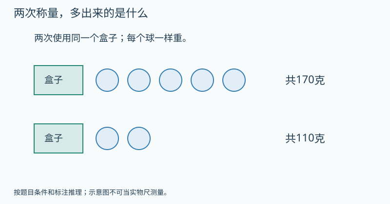

   图的文字备份：同一盒子加5球共170克，加2球共110克；盒子未变，所有球同重。

   提示1（按需展开）：两次记录里哪些东西完全一样？
   提示2（按需展开）：多出的60克只来自多出的几个球？
   答案：小球20克，空盒70克。 理由：两次都有同一盒和2个球，差出的170−110=60克只来自另外3个球。每球60÷3=20克；空盒110−2×20=70克。
8. 【补充变式】〔G3-UP01-B02-P08；auto_checked〕用小石块替代船上的重物来称量，为什么两次水面必须到同一标记？
   答案：需要让船处于同样吃水状态，才能用石块总质量替代重物质量。 理由：若标记不同，就没有保证相等。
9. 【独立回顾】〔G3-UP01-B02-P09；auto_checked〕〔第1天独立回顾〕一个密封袋与两个各300克的同样砝码平衡，袋子质量是多少？
   答案：600克。 理由：替代物的质量相加就是袋子的质量。
10. 【独立回顾】〔G3-UP01-B02-P10；auto_checked〕〔第3天独立回顾〕船上取下重物后又上来一个人，再放石块到原水线。石块总质量还能直接当作重物质量吗？
   答案：不能。 理由：多了人的质量，船上其他条件不再相同。
11. 【独立回顾】〔G3-UP01-B02-P11；auto_checked〕〔第7天独立回顾〕一个玩具与5块同样的积木平衡，每块积木重40克。换成每块重100克的砝码，需要几块？
   答案：2块。 理由：玩具重5×40=200克，200÷100=2。
12. 【独立回顾】〔G3-UP01-B02-P12；auto_checked〕〔第21天独立回顾〕“用能测的小物体替换大物体”最重要的条件是什么？
   答案：替换前后保持用来判断相等的状态，其他负载不变，并准确测出替代物总质量。 理由：替换依靠等量关系，不是随意换一种东西。

**练习安排：**12题是题库：P01–P08当堂备选，一次选3–5题；P09–P12分别第1、3、7、21天出现，不得提前展示。选学挑战不影响基础完成。

**本课基础怎样走向提升：**基础过关后，本课提升与关联思维卡合计最多选一道；需要多个任务才讲清的可分次，允许跳过提升继续教材主线。
**实际提升题：**G3-UP01-B02-P07
**要观察的思考：**消去共同部分，先求差对应几个球。
**关联思维卡：**G3-UP01-TH1、G3-UP01-TH2、G3-UP01-S09、G3-UP01-S20
**掌握证据边界：**P09–P12用于本课原有目标的分日回顾，不因基础回顾通过就判新提升已掌握。看过答案的原题不再作为独立证据；后续选同方法、条件有变化的题单独记录，暂无对应独立题时标待迁移。

**证据边界：**本稿提供参考答案与数量理由，尚不是可执行评分器。首答、自查后的最终答和帮助等级分开保存；开放解释须成人确认。AI复核不计为教师人工审定或Kevin试学。

**易错：**故事有趣就够了，不必说明替换时什么没变。 → 必须说出同一船、同一水线、其余载荷相同等关键条件。

**Kevin复述：**替换时为什么不能偷偷往船上加别的东西？

**后续联系：**五年级等式性质与代换学习将形式化“相等的量可以替换”。

#### G3-U04 多位数乘一位数

口算、竖式、连续进位、零、估算与解决问题；分配律以拆分模型体验。

**本章思维收尾（选学，每次最多一道）：**[本章提升：十位看错，乘积差多少](#g3-u04-th1)；[奥数思想选学：把乘法竖式中的数字补全](#g3-u04-th2)；[本章提升：相邻三位的和相同，哪两位必须相同](#g3-u04-s01)；[本章提升：符合数字和的数，怎样保证最小](#g3-u04-s03)；[本章提升：同样七颗珠，两个不同数怎样和最大](#g3-u04-s04)；[本章提升：四倍与多二十七，哪几份是差](#g3-u04-s10)；[本章提升：同是四倍，知道总数还是差数](#g3-u04-s15)

##### G3-U04-B01 把几十、几百和零散个数分别乘

**定位：** B；建议35分钟。来源G3-upper：印刷39–42 / PDF 45–48。
原创教案；页码锚定相关教材内容，不表示本教案题目出自教材。

**先修：**表内乘法与十进制位值。
**关联课程：**依已有能力直接进入

**目标：**用位值拆分解释整十整百和两位数口算乘法。

**真实问题：**每盒12支笔，买3盒，怎样不用一支支数就知道总数？

**为什么：**每盒的1个十与2个一可以分别收集，结果仍是同一批笔。

**模型操作：**画3捆十根与3组2根，再合并；对应12×3=10×3+2×3。

**讲解：**

1. 先确认每个数字的位置与单位。
2. 分别求几个十、几个一。
3. 合并总数；零的位置来自计数单位，不是随意补零。

**学习层级与本次目标：**教材基础
**最低证据：**用位值拆分解释整十整百和两位数口算乘法。
**最低代表题：**G3-U04-B01-P01、G3-U04-B01-P03、G3-U04-B01-P05
**其他当堂备选：**G3-U04-B01-P02、G3-U04-B01-P04、G3-U04-B01-P06、G3-U04-B01-P07、G3-U04-B01-P08
**退出规则：**本次选定3道代表题能独立完成，并按本课理由说明关键关系，成人确认后记“本次达标”。自主自查改对单独记录；看过解答后改对只记订正。任何状态都允许结束和进入其他课；不是解锁条件。
**暂停与回补：**同一关系连续两次仍需步骤提示，停止加题，回到本课具体模型或建议先修；也可保存位置，下次再学。不能为积分强迫做完。 回补位置：本课模型与已列先修
**课次安排：**讲解与模型约12–18分钟，3道目标题约8–12分钟，复述/自查约3–5分钟；可提前停止。
**共享概念：**arithmetic.law.distribution（transfer）若未选三上提升，则在本课具体模型中首次建立关系；若已独立会用，则只做迁移题。不得因跨课同conceptId自动跳过。

**教具行为规约（尚未实现）：**

| 环节 | 具体行为与证据 |
|---|---|
| 初始状态 | 3组12根小棒，每组1捆十和2根；先保留分组框。 |
| Kevin动作 | 分别聚集三捆十与三组2，再合回总数；给两个部分标×3。 |
| 可观察变化 | 10×3+2×3=36，所有小棒恰计一次。 |
| 追问 | 23×3拆开算时，为什么两部分都必须乘3？ |
| 预期解释 | 每盒的1个十与2个一可以分别收集，结果仍是同一批笔。 |
| 错误动作反馈 | 只乘十位时高亮未计的6根，提示个位部分也重复3次。 |
| 撤除教具后 | 先收起模型、提示和例题答案，显示独立题；不把操纵成功直接记为掌握。 独立题G3-U04-B01-P05：4袋糖每袋21颗，共多少颗？ |
| 独立题参考 | 84颗；20×4+1×4。 |

本题预留到教具撤除后，早先选题跳过它；若已曝光则只记练习，改选未曝光且经审核的同目标题，题库耗尽时成人确认，不伪造独立证据。
如本操作尚无可执行教具，先展示准确的前后两图或用实体材料，并明确标为演示/线下操作。不得让不可操作图片冒充拖拽。
**自查动作：**重新读所求的量；核对条件和每步关系；用本课模型、逆算或合理范围检查结果。
**记录：**首答提交后先自行检查再确认最终答；首次答案不可覆盖，未反馈正确答案前的自主纠错可独立记录。

**原创例题：**23×3怎样口算？

1. 20×3=60，3×3=9。
2. 60+9=69。

答案：69。

**练习与讲评：**

1. 【基础】〔G3-U04-B01-P01；auto_checked〕30×4等于多少？
   答案：120 理由：3个十乘4得12个十。
2. 【基础】〔G3-U04-B01-P02；auto_checked〕200×3等于多少？
   答案：600 理由：2个百乘3得6个百。
3. 【变式】〔G3-U04-B01-P03；auto_checked〕14×2拆成哪两部分？
   答案：10×2与4×2 理由：按十位和个位分。
4. 【变式】〔G3-U04-B01-P04；auto_checked〕20×4的结果为何不是8？
   答案：2个十的4倍是8个十 理由：单位是十。
5. 【迁移】〔G3-U04-B01-P05；auto_checked〕4袋糖每袋21颗，共多少颗？
   答案：84颗 理由：20×4+1×4。
6. 【挑战】〔G3-U04-B01-P06；auto_checked〕19×4怎样借20×4来算？
   答案：80−4=76 理由：每组多算1，共多算4。
7. 【补充变式】〔G3-U04-B01-P07；auto_checked〕口算32×3，先把32拆成哪两个数更方便？
   答案：拆成30和2，结果96。 理由：30×3=90，2×3=6，再合起来。
8. 【选学提升】〔G3-U04-B01-P08；auto_checked〕4盒笔原来每盒21支。现在只从其中1盒拿走1支，剩多少支？如果改为每盒都拿走1支，又剩多少支？为什么一个减1、另一个减4？
   提示1（按需展开）：画4个盒子，分别执行“只一盒”和“每盒”。
   提示2（按需展开）：数总共拿走几支，不是只看题里出现了一个1。
   答案：分别83支、80支。 理由：原共4×21=84。只动一盒，总量只少1；每盒少1，4盒合计少4。对应84−1与84−4，不能把两种变化混为一谈。
9. 【独立回顾】〔G3-U04-B01-P09；auto_checked〕〔第1天独立回顾〕计算203×3，并说明中间的0表示什么。
   答案：609；203表示2个百、0个十、3个一。 理由：分别乘3，得到6个百和9个一。
10. 【独立回顾】〔G3-U04-B01-P10；auto_checked〕〔第3天独立回顾〕把40×6算成24，少算了什么？
   答案：少保留了十这个计数单位，应为240。 理由：4个十乘6是24个十。
11. 【独立回顾】〔G3-U04-B01-P11；auto_checked〕〔第7天独立回顾〕一排有12个座位，7排共多少个？不用竖式说明算法。
   答案：84个。 理由：10×7=70，2×7=14，70+14=84。
12. 【独立回顾】〔G3-U04-B01-P12；auto_checked〕〔第21天独立回顾〕为什么26×3不能只算20×3而忘记6？
   答案：26的两部分都重复3次，必须加上6×3。 理由：拆分后要保持原来的全部数量。

**练习安排：**12题是题库：P01–P08当堂备选，一次选3–5题；P09–P12分别第1、3、7、21天出现，不得提前展示。选学挑战不影响基础完成。

**本课基础怎样走向提升：**基础过关后，本课提升与关联思维卡合计最多选一道；需要多个任务才讲清的可分次，允许跳过提升继续教材主线。
**实际提升题：**G3-U04-B01-P08
**要观察的思考：**区分改变一份与改变每一份，连接分配律。
**关联思维卡：**G3-U04-TH1、G3-U04-S01、G3-U04-S03、G3-U04-S04、G3-U04-S10、G3-U04-S15
**掌握证据边界：**P09–P12用于本课原有目标的分日回顾，不因基础回顾通过就判新提升已掌握。看过答案的原题不再作为独立证据；后续选同方法、条件有变化的题单独记录，暂无对应独立题时标待迁移。

**证据边界：**本稿提供参考答案与数量理由，尚不是可执行评分器。首答、自查后的最终答和帮助等级分开保存；开放解释须成人确认。AI复核不计为教师人工审定或Kevin试学。

**易错：**数字末尾有0，就随便添几个0。 → 解释成几个十或几个百，零只是位值的写法。

**Kevin复述：**23×3拆开算时，为什么两部分都必须乘3？

**后续联系：**下一课竖式把这个拆分过程按位置记录下来。

##### G3-U04-B02 竖式是把拆分过程排整齐

**定位：** B；建议35分钟。来源G3-upper：印刷43–44 / PDF 49–50。
原创教案；页码锚定相关教材内容，不表示本教案题目出自教材。

**先修：**G3-U04-B01。
**关联课程：**G3-U04-B01

**目标：**理解个位起算、数位对齐和一次进位。

**真实问题：**算16×3时，18个一怎样写进只有一个个位的位置？

**为什么：**满十换一十，把计数单位整理回十进制表示，竖式记录这种交换。

**模型操作：**3组16根小棒，先数18个一，捆1个十还剩8个一，再与原来3个十合并。

**讲解：**

1. 个位6×3=18，写8进1。
2. 十位1×3=3个十，加进的1个十。
3. 得4个十8个一，用估算和拆分验算。

**学习层级与本次目标：**教材基础
**最低证据：**理解个位起算、数位对齐和一次进位。
**最低代表题：**G3-U04-B02-P01、G3-U04-B02-P04、G3-U04-B02-P05
**其他当堂备选：**G3-U04-B02-P02、G3-U04-B02-P03、G3-U04-B02-P06、G3-U04-B02-P07、G3-U04-B02-P08
**退出规则：**本次选定3道代表题能独立完成，并按本课理由说明关键关系，成人确认后记“本次达标”。自主自查改对单独记录；看过解答后改对只记订正。任何状态都允许结束和进入其他课；不是解锁条件。
**暂停与回补：**同一关系连续两次仍需步骤提示，停止加题，回到本课具体模型或建议先修；也可保存位置，下次再学。不能为积分强迫做完。 回补位置：G3-U04-B01
**课次安排：**讲解与模型约12–18分钟，3道目标题约8–12分钟，复述/自查约3–5分钟；可提前停止。
**共享概念：**arithmetic.carry.place-value（first）

**教具行为规约（尚未实现）：**

| 环节 | 具体行为与证据 |
|---|---|
| 初始状态 | 3组16根小棒，位值表十、个；待整理有3个十18个一。 |
| Kevin动作 | 选10个一换成1个十，并把进位卡送到十位。 |
| 可观察变化 | 十位4、个位8，共48；数字1指1个十。 |
| 追问 | 把26×3中的进位1解释给一个不会竖式的人听。 |
| 预期解释 | 满十换一十，把计数单位整理回十进制表示，竖式记录这种交换。 |
| 错误动作反馈 | 把进位留在个位时同时显示数量兑换，不接受无单位拼接48和1。 |
| 撤除教具后 | 先收起模型、提示和例题答案，显示独立题；不把操纵成功直接记为掌握。 独立题G3-U04-B02-P05：3盒彩纸，每盒28张，总共多少？ |
| 独立题参考 | 84张；24个一进2，再6个十+2个十。 |

本题预留到教具撤除后，早先选题跳过它；若已曝光则只记练习，改选未曝光且经审核的同目标题，题库耗尽时成人确认，不伪造独立证据。
如本操作尚无可执行教具，先展示准确的前后两图或用实体材料，并明确标为演示/线下操作。不得让不可操作图片冒充拖拽。
**自查动作：**重新读所求的量；核对条件和每步关系；用本课模型、逆算或合理范围检查结果。
**记录：**首答提交后先自行检查再确认最终答；首次答案不可覆盖，未反馈正确答案前的自主纠错可独立记录。

**原创例题：**26×3写竖式时，十位为什么得到7？

1. 6×3=18，进1个十。
2. 2个十×3=6个十，再加进来的1个十，得7个十。

答案：78。

**练习与讲评：**

1. 【基础】〔G3-U04-B02-P01；auto_checked〕24×2等于多少？
   答案：48 理由：8个一、4个十。
2. 【基础】〔G3-U04-B02-P02；auto_checked〕17×4等于多少？
   答案：68 理由：28个一进2个十，加4个十。
3. 【变式】〔G3-U04-B02-P03；auto_checked〕算26×3，有人算个位6×3=18，个位写8，却把十位只写成2×3=6，结果68。他漏了哪一步？
   答案：漏了把进位的1个十加到十位；正确78。 理由：给出可观察的实际过程，不凭一个错误答案断定原因。
4. 【变式】〔G3-U04-B02-P04；auto_checked〕算18×3，进位的2表示2个一吗？
   答案：不是，表示2个十 理由：24个一换2个十4个一。
5. 【迁移】〔G3-U04-B02-P05；auto_checked〕3盒彩纸，每盒28张，总共多少？
   答案：84张 理由：24个一进2，再6个十+2个十。
6. 【挑战】〔G3-U04-B02-P06；auto_checked〕为什么不能只把个位进位记下，最后把它当普通数字接在答案末尾？
   答案：进位有指定数位，必须与高一位相加 理由：不能把计数单位丢掉。
7. 【补充变式】〔G3-U04-B02-P07；auto_checked〕计算24×4，并说明个位16该怎样记录。
   答案：96；个位写6，向十位进1。 理由：16个一换成1个十和6个一。
8. 【选学提升】〔G3-U04-B02-P08；auto_checked〕一个两位数的十位是2。把它乘3，个位乘完向十位进了2。原来的个位可能是几？找全所有可能，并写出对应乘积。
   提示1（按需展开）：个位相乘所得要多大，才会进2个十？
   提示2（按需展开）：从6×3、7×3、8×3、9×3依次检查。
   答案：个位7、8、9；对应27×3=81、28×3=84、29×3=87。 理由：向十位进2说明个位数字乘3的结果在20到29之间。0到9逐一检查或从6×3=18往上试，只有7、8、9符合。十位再加进来的2，得到8个十。
9. 【独立回顾】〔G3-U04-B02-P09；auto_checked〕〔第1天独立回顾〕计算42×2。
   答案：84。 理由：个位2×2=4，十位4×2=8，不需要进位。
10. 【独立回顾】〔G3-U04-B02-P10；auto_checked〕〔第3天独立回顾〕计算17×4，有人写48。他可能漏掉了什么？正确答案多少？
   答案：可能漏加个位进上来的2个十；正确是68。 理由：7×4=28，十位要算1×4+2。
11. 【独立回顾】〔G3-U04-B02-P11；auto_checked〕〔第7天独立回顾〕买6盒每盒13支的彩笔，共多少支？先估范围再算。
   答案：78支，介于60和120支之间。 理由：每盒多于10支少于20支，准确计算13×6=78。
12. 【独立回顾】〔G3-U04-B02-P12；auto_checked〕〔第21天独立回顾〕竖式里进上来的“2”为什么要加到十位，不能加到个位结果里？
   答案：它代表从个位换来的2个十。 理由：数位的位置记录计数单位。

**练习安排：**12题是题库：P01–P08当堂备选，一次选3–5题；P09–P12分别第1、3、7、21天出现，不得提前展示。选学挑战不影响基础完成。

**本课基础怎样走向提升：**基础过关后，本课提升与关联思维卡合计最多选一道；需要多个任务才讲清的可分次，允许跳过提升继续教材主线。
**实际提升题：**G3-U04-B02-P08
**要观察的思考：**从进位信息倒推数字，并给出完整解集。
**关联思维卡：**先使用本课列出的提升题，不额外开重复专题
**掌握证据边界：**P09–P12用于本课原有目标的分日回顾，不因基础回顾通过就判新提升已掌握。看过答案的原题不再作为独立证据；后续选同方法、条件有变化的题单独记录，暂无对应独立题时标待迁移。

**证据边界：**本稿提供参考答案与数量理由，尚不是可执行评分器。首答、自查后的最终答和帮助等级分开保存；开放解释须成人确认。AI复核不计为教师人工审定或Kevin试学。

**易错：**进位数字只是一个记号，不必管它代表什么。 → 每个进位都代表高一位的计数单位。

**Kevin复述：**把26×3中的进位1解释给一个不会竖式的人听。

**后续联系：**下一课处理连续两次进位。

##### G3-U04-B03 连续进位也只是反复“满十换一”

**定位：** B；建议35分钟。来源G3-upper：印刷45–48 / PDF 51–54。
原创教案；页码锚定相关教材内容，不表示本教案题目出自教材。

**先修：**G3-U04-B02。
**关联课程：**G3-U04-B02

**目标：**正确计算两三位数乘一位数的连续进位并核查。

**真实问题：**8箱饮料每箱147瓶，需要多少瓶记录才不会漏算？

**为什么：**相同的十进制交换可以连续发生；一次进位不能替代所有数位的进位。

**模型操作：**位值表列百、十、个；每列的总量包括乘积与从右边来的进位。

**讲解：**

1. 先算个位并进位。
2. 十位乘积加进位后，再判断是否满十。
3. 百位同理，用接近的整百数检查结果大小。

**学习层级与本次目标：**教材基础
**最低证据：**正确计算两三位数乘一位数的连续进位并核查。
**最低代表题：**G3-U04-B03-P01、G3-U04-B03-P02、G3-U04-B03-P07
**其他当堂备选：**G3-U04-B03-P03、G3-U04-B03-P04、G3-U04-B03-P05、G3-U04-B03-P06、G3-U04-B03-P08
**退出规则：**本次选定3道代表题能独立完成，并按本课理由说明关键关系，成人确认后记“本次达标”。自主自查改对单独记录；看过解答后改对只记订正。任何状态都允许结束和进入其他课；不是解锁条件。
**暂停与回补：**同一关系连续两次仍需步骤提示，停止加题，回到本课具体模型或建议先修；也可保存位置，下次再学。不能为积分强迫做完。 回补位置：G3-U04-B02
**课次安排：**讲解与模型约12–18分钟，3道目标题约8–12分钟，复述/自查约3–5分钟；可提前停止。
**共享概念：**arithmetic.carry.place-value（deepen）

**教具行为规约（尚未实现）：**

| 环节 | 具体行为与证据 |
|---|---|
| 初始状态 | 147×8，百十个位表：个位56待整理，十位乘积32，百位8。 |
| Kevin动作 | 依次交换50个一为5十，再37十换3百7十，最后合并百位。 |
| 可观察变化 | 个位6、十位7、百位11，最终1176；每个进位有来源箭头。 |
| 追问 | 连续进位与一次进位，使用的道理变了吗？ |
| 预期解释 | 相同的十进制交换可以连续发生；一次进位不能替代所有数位的进位。 |
| 错误动作反馈 | 漏进位时只回放上一列交换，问这5个十/3个百去哪了。 |
| 撤除教具后 | 先收起模型、提示和例题答案，显示独立题；不把操纵成功直接记为掌握。 独立题G3-U04-B03-P07：计算68×7，并写出两次进位怎样处理。 |
| 独立题参考 | 476。；8×7=56，写6进5；6×7+5=47个十，写7进4。 |

本题预留到教具撤除后，早先选题跳过它；若已曝光则只记练习，改选未曝光且经审核的同目标题，题库耗尽时成人确认，不伪造独立证据。
如本操作尚无可执行教具，先展示准确的前后两图或用实体材料，并明确标为演示/线下操作。不得让不可操作图片冒充拖拽。
**自查动作：**重新读所求的量；核对条件和每步关系；用本课模型、逆算或合理范围检查结果。
**记录：**首答提交后先自行检查再确认最终答；首次答案不可覆盖，未反馈正确答案前的自主纠错可独立记录。

**原创例题：**147×8是多少？

1. 7×8=56，写6进5。
2. 4×8+5=37，写7进3。
3. 1×8+3=11，写11。

答案：1176。

**练习与讲评：**

1. 【基础】〔G3-U04-B03-P01；auto_checked〕38×6等于多少？
   答案：228 理由：48进4，18+4=22个十。
2. 【基础】〔G3-U04-B03-P02；auto_checked〕126×7等于多少？
   答案：882 理由：42进4；14+4=18进1；7+1=8。
3. 【变式】〔G3-U04-B03-P03；auto_checked〕算29×8，十位2×8=16后还要加什么？
   答案：加个位进来的7 理由：9×8=72。
4. 【变式】〔G3-U04-B03-P04；auto_checked〕147×8一定小于160×8吗？
   答案：是 理由：相同正数倍数保持大小关系。
5. 【迁移】〔G3-U04-B03-P05；auto_checked〕6排座位每排128个，共多少？
   答案：768个 理由：128×6。
6. 【挑战】〔G3-U04-B03-P06；auto_checked〕一个两位数乘9得到三位数，最高一定只有1吗？
   答案：不一定，如99×9=891 理由：乘积最高位来自全部进位与高位乘积。
7. 【补充变式】〔G3-U04-B03-P07；auto_checked〕计算68×7，并写出两次进位怎样处理。
   答案：476。 理由：8×7=56，写6进5；6×7+5=47个十，写7进4。
8. 【选学提升】〔G3-U04-B03-P08；auto_checked〕三位数□57乘3，积仍是三位数。方框是百位上的数字，不能为0。它可能填哪些数字？请说明为什么从3起都不行。
   提示1（按需展开）：先检查百位填1、2、3时的乘积。
   提示2（按需展开）：357乘3已经超过999，百位再大还能回到三位数吗？
   答案：只能1或2；157×3=471，257×3=771。 理由：357×3=1071已经是四位数；百位再大，乘3的积只会更大。百位1与2经计算都符合，所以只有两个可能。
9. 【独立回顾】〔G3-U04-B03-P09；auto_checked〕〔第1天独立回顾〕计算286×4。
   答案：1144。 理由：6×4=24；8×4+2=34；2×4+3=11。
10. 【独立回顾】〔G3-U04-B03-P10；auto_checked〕〔第3天独立回顾〕把79×6算成424，正确吗？先用80×6检查范围，再给出正确结果。
   答案：不正确；正确474。 理由：79×6只比480少6，不可能少56。
11. 【独立回顾】〔G3-U04-B03-P11；auto_checked〕〔第7天独立回顾〕学校买8套图书，每套售价96元，共多少钱？
   答案：768元。 理由：96×8；也可100×8−4×8。
12. 【独立回顾】〔G3-U04-B03-P12；auto_checked〕〔第21天独立回顾〕连续进位时，每一位计算为什么都要看前一位留下的进位？
   答案：它是低一位凑成的整十、整百，属于这一位的数量。 理由：漏掉进位等于丢掉一部分总量。

**练习安排：**12题是题库：P01–P08当堂备选，一次选3–5题；P09–P12分别第1、3、7、21天出现，不得提前展示。选学挑战不影响基础完成。

**本课基础怎样走向提升：**基础过关后，本课提升与关联思维卡合计最多选一道；需要多个任务才讲清的可分次，允许跳过提升继续教材主线。
**实际提升题：**G3-U04-B03-P08
**要观察的思考：**利用位值与大小界限排除整段候选，不盲试九次。
**关联思维卡：**G3-U04-TH2
**掌握证据边界：**P09–P12用于本课原有目标的分日回顾，不因基础回顾通过就判新提升已掌握。看过答案的原题不再作为独立证据；后续选同方法、条件有变化的题单独记录，暂无对应独立题时标待迁移。

**证据边界：**本稿提供参考答案与数量理由，尚不是可执行评分器。首答、自查后的最终答和帮助等级分开保存；开放解释须成人确认。AI复核不计为教师人工审定或Kevin试学。

**易错：**每列只算本列数字乘一位数，忽略右边传来的进位。 → 每列总数=本列乘积+右边进位。

**Kevin复述：**连续进位与一次进位，使用的道理变了吗？

**后续联系：**零的特殊写法也必须遵循同一位值规则。

##### G3-U04-B04 乘数中的0，为什么不能跳过它的位置

**定位：** B；建议35分钟。来源G3-upper：印刷49–50 / PDF 55–56。
原创教案；页码锚定相关教材内容，不表示本教案题目出自教材。

**先修：**G3-U04-B03。
**关联课程：**G3-U04-B03

**目标：**理解0乘任何数得0，区分中间0和末尾0。

**真实问题：**604个座位组成一个区，8个区共有多少？十位0意味着整个数只剩64吗？

**为什么：**0占住缺少的计数单位；省略它的位置会把600变成60。

**模型操作：**百十个位表中填604；个位乘积仍可能向十位进位。

**讲解：**

1. 604×8个位得32，十位0×8加3进位得3。
2. 百位6×8=48。
3. 600×8可看6个百的8倍；末尾0来自单位。

**学习层级与本次目标：**教材基础
**最低证据：**理解0乘任何数得0，区分中间0和末尾0。
**最低代表题：**G3-U04-B04-P02、G3-U04-B04-P03、G3-U04-B04-P07
**其他当堂备选：**G3-U04-B04-P01、G3-U04-B04-P04、G3-U04-B04-P05、G3-U04-B04-P06、G3-U04-B04-P08
**退出规则：**本次选定3道代表题能独立完成，并按本课理由说明关键关系，成人确认后记“本次达标”。自主自查改对单独记录；看过解答后改对只记订正。任何状态都允许结束和进入其他课；不是解锁条件。
**暂停与回补：**同一关系连续两次仍需步骤提示，停止加题，回到本课具体模型或建议先修；也可保存位置，下次再学。不能为积分强迫做完。 回补位置：G3-U04-B03
**课次安排：**讲解与模型约12–18分钟，3道目标题约8–12分钟，复述/自查约3–5分钟；可提前停止。
**共享概念：**arithmetic.zero.place-value（deepen）

**教具行为规约（尚未实现）：**

| 环节 | 具体行为与证据 |
|---|---|
| 初始状态 | 205×4位值表，空十位以0占位，个位20需换2十。 |
| Kevin动作 | 在十位合并0×4与进来的2，再完成百位。 |
| 可观察变化 | 积820，十位为2而非0；205与25的表格并排不同。 |
| 追问 | 604与64只差一个0，为什么乘积差很多？ |
| 预期解释 | 0占住缺少的计数单位；省略它的位置会把600变成60。 |
| 错误动作反馈 | 删0把2百挤成2十时冻结列宽，展示数位意义已改变。 |
| 撤除教具后 | 先收起模型、提示和例题答案，显示独立题；不把操纵成功直接记为掌握。 独立题G3-U04-B04-P07：计算304×3，乘数十位是0，积的十位也一定是0吗？ |
| 独立题参考 | 912。；4×3=12，进来的1个十加到0个十上，因此十位是1，并不是0。 |

本题预留到教具撤除后，早先选题跳过它；若已曝光则只记练习，改选未曝光且经审核的同目标题，题库耗尽时成人确认，不伪造独立证据。
如本操作尚无可执行教具，先展示准确的前后两图或用实体材料，并明确标为演示/线下操作。不得让不可操作图片冒充拖拽。
**自查动作：**重新读所求的量；核对条件和每步关系；用本课模型、逆算或合理范围检查结果。
**记录：**首答提交后先自行检查再确认最终答；首次答案不可覆盖，未反馈正确答案前的自主纠错可独立记录。

**原创例题：**205×4是多少，为什么答案不是8200？

1. 5×4=20，写0进2。
2. 十位0×4+2=2。
3. 百位2×4=8。

答案：820。

**练习与讲评：**

1. 【基础】〔G3-U04-B04-P01；auto_checked〕0×9是多少？
   答案：0 理由：9组0仍没有。
2. 【基础】〔G3-U04-B04-P02；auto_checked〕300×7是多少？
   答案：2100 理由：21个百。
3. 【变式】〔G3-U04-B04-P03；auto_checked〕105×6是多少？
   答案：630 理由：个位进3到十位。
4. 【变式】〔G3-U04-B04-P04；auto_checked〕402×3写成126，错在哪里？
   答案：丢了十位的位置，应1206 理由：402不是42。
5. 【迁移】〔G3-U04-B04-P05；auto_checked〕每包250克，4包共多少克？
   答案：1000克 理由：25×4个十=100个十。
6. 【挑战】〔G3-U04-B04-P06；auto_checked〕一个乘数末尾有1个0，乘积一定只有1个0吗？
   答案：不一定，250×4=1000 理由：其他乘积也可能产生新的末尾0。
7. 【补充变式】〔G3-U04-B04-P07；auto_checked〕计算304×3，乘数十位是0，积的十位也一定是0吗？
   答案：912。 理由：4×3=12，进来的1个十加到0个十上，因此十位是1，并不是0。
8. 【选学提升】〔G3-U04-B04-P08；auto_checked〕小乐把205抄成250再乘4。虽然只是0和5换了位置，乘积会一样吗？不先算两个完整乘积，解释错误结果比正确结果多多少。
   提示1（按需展开）：250比205多出的部分在4份里出现几次？
   提示2（按需展开）：把一份的差45乘4，原来的相同部分不用重复算。
   答案：不一样，多180。 理由：250比205多45，每份多45而共有4份，所以多45×4=180。验250×4=1000，205×4=820，差180。
9. 【独立回顾】〔G3-U04-B04-P09；auto_checked〕〔第1天独立回顾〕计算406×2。
   答案：812。 理由：个位12进1十，十位0×2再加1，百位4×2。
10. 【独立回顾】〔G3-U04-B04-P10；auto_checked〕〔第3天独立回顾〕“乘数中有0，就把这一位删掉”对吗？用205×3反驳。
   答案：不对；结果615，删成25×3只有75。 理由：0保留了百位和个位之间的数位位置。
11. 【独立回顾】〔G3-U04-B04-P11；auto_checked〕〔第7天独立回顾〕一箱饮料30瓶，7箱共多少瓶？再拿走10瓶还剩多少？
   答案：先210瓶，剩200瓶。 理由：30×7=210，再减10。
12. 【独立回顾】〔G3-U04-B04-P12；auto_checked〕〔第21天独立回顾〕为什么320×0与320×1不同？
   答案：前者0，后者320。 理由：0组是什么也没有，1组保留原来的整组数量。

**练习安排：**12题是题库：P01–P08当堂备选，一次选3–5题；P09–P12分别第1、3、7、21天出现，不得提前展示。选学挑战不影响基础完成。

**本课基础怎样走向提升：**基础过关后，本课提升与关联思维卡合计最多选一道；需要多个任务才讲清的可分次，允许跳过提升继续教材主线。
**实际提升题：**G3-U04-B04-P08
**要观察的思考：**位置决定数值，把输入差连接到输出差。
**关联思维卡：**先使用本课列出的提升题，不额外开重复专题
**掌握证据边界：**P09–P12用于本课原有目标的分日回顾，不因基础回顾通过就判新提升已掌握。看过答案的原题不再作为独立证据；后续选同方法、条件有变化的题单独记录，暂无对应独立题时标待迁移。

**证据边界：**本稿提供参考答案与数量理由，尚不是可执行评分器。首答、自查后的最终答和帮助等级分开保存；开放解释须成人确认。AI复核不计为教师人工审定或Kevin试学。

**易错：**乘数里有几个0，答案就固定有几个0。 → 看位值和乘积，不能只数零。

**Kevin复述：**604与64只差一个0，为什么乘积差很多？

**后续联系：**用估算检查数量级，再研究计算策略。

##### G3-U04-B05 先估一估，才知道答案靠不靠谱

**定位：** B；建议35分钟。来源G3-upper：印刷51–56 / PDF 57–62。
原创教案；页码锚定相关教材内容，不表示本教案题目出自教材。

**先修：**G3-U04-B01至B04。
**关联课程：**G3-U04-B04

**目标：**能按问题选用上界或下界估计，并处理多步费用。

**真实问题：**398名同学每人票价8元，准备3200元够不够？

**为什么：**有时只需判断足够与否，合适的上界就能回答，不必先精确计算。

**模型操作：**把398看作略小于400，在数线上比较两种总费用；用箭头注明估大还是估小。

**讲解：**

1. 398<400，所以总价<400×8=3200。
2. 若估小后已超预算，就一定不够；估大后超预算则还不能确定。
3. 需要精确余额时再算。

**学习层级与本次目标：**教材基础
**最低证据：**能按问题选用上界或下界估计，并处理多步费用。
**最低代表题：**G3-U04-B05-P02、G3-U04-B05-P03、G3-U04-B05-P04
**其他当堂备选：**G3-U04-B05-P01、G3-U04-B05-P05、G3-U04-B05-P06、G3-U04-B05-P07、G3-U04-B05-P08
**退出规则：**本次选定3道代表题能独立完成，并按本课理由说明关键关系，成人确认后记“本次达标”。自主自查改对单独记录；看过解答后改对只记订正。任何状态都允许结束和进入其他课；不是解锁条件。
**暂停与回补：**同一关系连续两次仍需步骤提示，停止加题，回到本课具体模型或建议先修；也可保存位置，下次再学。不能为积分强迫做完。 回补位置：G3-U04-B04
**课次安排：**讲解与模型约12–18分钟，3道目标题约8–12分钟，复述/自查约3–5分钟；可提前停止。
**共享概念：**reasoning.bounds（first）

**教具行为规约（尚未实现）：**

| 环节 | 具体行为与证据 |
|---|---|
| 初始状态 | 398张8元票、预算3200；对照上界400张。 |
| Kevin动作 | 先判断400张费用，再撤掉2张并填写多估费用。 |
| 可观察变化 | 上界3200，实际少16，剩16；接近估计不表示精算正确。 |
| 追问 | “估大后仍然够”和“估小后已经不够”分别为什么可靠？ |
| 预期解释 | 有时只需判断足够与否，合适的上界就能回答，不必先精确计算。 |
| 错误动作反馈 | 估大超预算不能直接说不够，展示可能落在预算上下的实际值，要求进一步算。 |
| 撤除教具后 | 先收起模型、提示和例题答案，显示独立题；不把操纵成功直接记为掌握。 独立题G3-U04-B05-P04：估大得到120元，预算110元，能立即断定不够吗？ |
| 独立题参考 | 不能；实际总价可能低于110元。 |

本题预留到教具撤除后，早先选题跳过它；若已曝光则只记练习，改选未曝光且经审核的同目标题，题库耗尽时成人确认，不伪造独立证据。
如本操作尚无可执行教具，先展示准确的前后两图或用实体材料，并明确标为演示/线下操作。不得让不可操作图片冒充拖拽。
**自查动作：**重新读所求的量；核对条件和每步关系；用本课模型、逆算或合理范围检查结果。
**记录：**首答提交后先自行检查再确认最终答；首次答案不可覆盖，未反馈正确答案前的自主纠错可独立记录。

**原创例题：**398人每人8元，3200元够吗？还能剩多少？

1. 400人需3200元，实际少2人，肯定够。
2. 少花2×8=16元。

答案：够，剩16元。

**练习与讲评：**

1. 【基础】〔G3-U04-B05-P01；auto_checked〕198×4比200×4大还是小？
   答案：小 理由：198<200且乘数为正。
2. 【基础】〔G3-U04-B05-P02；auto_checked〕每盒29元买3盒，90元够吗？
   答案：够 理由：30×3=90且实际更少。
3. 【变式】〔G3-U04-B05-P03；auto_checked〕每盒31元买3盒，90元够吗？
   答案：不够 理由：31×3比30×3大。
4. 【变式】〔G3-U04-B05-P04；auto_checked〕估大得到120元，预算110元，能立即断定不够吗？
   答案：不能 理由：实际总价可能低于110元。
5. 【迁移】〔G3-U04-B05-P05；auto_checked〕4张票每张26元，另付10元停车费，总费多少？
   答案：114元 理由：26×4+10。
6. 【选学提升】〔G3-U04-B05-P06；auto_checked〕要买6件同样的物品，预算2400元。甲店每件398元，乙店每件402元。不求精确总价，能判断哪家够钱、哪家不够吗？为什么把两家都粗略看成400元还不够？
   提示1（按需展开）：每件正好400元时，6件与预算是什么关系？
   提示2（按需展开）：比较398与400、402与400的大小方向。
   答案：甲店够，乙店不够；必须保留比400小或大的方向。 理由：6×400=2400。398每件比400少，6件合计必小于2400；402每件比400多，6件必大于2400。都只写约2400会丢掉判断预算所需的方向。
7. 【补充变式】〔G3-U04-B05-P07；auto_checked〕每本书39元，买5本，带200元够吗？先估再精算。
   答案：够，实际195元。 理由：每本不足40元，5本不足200元。
8. 【补充变式】〔G3-U04-B05-P08；auto_checked〕一张门票51元，4人有200元，够买票吗？
   答案：不够，需要204元。 理由：每张多于50元，4张会超过200元。
9. 【独立回顾】〔G3-U04-B05-P09；auto_checked〕〔第1天独立回顾〕298×3大约是多少？这个估计适合检查答案892是否一定正确吗？
   答案：大约900；接近估计不证明正确，准确值894。 理由：估算可排除明显错误，仍需核算。
10. 【独立回顾】〔G3-U04-B05-P10；auto_checked〕〔第3天独立回顾〕有8袋糖，每袋至少19颗。能保证糖数少于160颗吗？
   答案：不能。 理由：“至少19”没有给上界，每袋也可能是20颗或更多。
11. 【独立回顾】〔G3-U04-B05-P11；auto_checked〕〔第7天独立回顾〕班级36人，每人需要3张纸。一包100张，买1包够不够？
   答案：不够，需要108张。 理由：36×3=108，不能因约100就忽略8张。
12. 【独立回顾】〔G3-U04-B05-P12；auto_checked〕〔第21天独立回顾〕判断钱够不够时，什么时候需要保守地估多一点？
   答案：制定预算或保证钱够用时，费用上界更有帮助。 理由：把价格往低估可能造成实际不够，临界处应精算。

**练习安排：**12题是题库：P01–P08当堂备选，一次选3–5题；P09–P12分别第1、3、7、21天出现，不得提前展示。选学挑战不影响基础完成。

**本课基础怎样走向提升：**基础过关后，本课提升与关联思维卡合计最多选一道；需要多个任务才讲清的可分次，允许跳过提升继续教材主线。
**实际提升题：**G3-U04-B05-P06
**要观察的思考：**使用上、下界作决策，说明估计的误差方向。
**关联思维卡：**先使用本课列出的提升题，不额外开重复专题
**掌握证据边界：**P09–P12用于本课原有目标的分日回顾，不因基础回顾通过就判新提升已掌握。看过答案的原题不再作为独立证据；后续选同方法、条件有变化的题单独记录，暂无对应独立题时标待迁移。

**证据边界：**本稿提供参考答案与数量理由，尚不是可执行评分器。首答、自查后的最终答和帮助等级分开保存；开放解释须成人确认。AI复核不计为教师人工审定或Kevin试学。

**易错：**估大后的结果超预算，就一定不够。 → 上界超预算不能下结论，需要更紧的估计或精算。

**Kevin复述：**“估大后仍然够”和“估小后已经不够”分别为什么可靠？

**后续联系：**四年级数量关系和运算律将正式推广拆分与补偿计算。

#### G3-UP02 数字编码

读编码、设计规则、检验唯一性。

**本章思维收尾（选学，每次最多一道）：**[本章提升：把编号连起来会发生什么](#g3-up02-th1)；[奥数思想选学：不用重复数字的两位密码](#g3-up02-th2)

##### G3-UP02-B01 数字有时表示身份，而不是多少

**定位：** B；建议35分钟。来源G3-upper：印刷57–60 / PDF 63–66。
原创教案；页码锚定相关教材内容，不表示本教案题目出自教材。

**先修：**乘法和系统记录。
**关联课程：**依已有能力直接进入

**目标：**设计不重复、可解释的编码，区分标识与数量。

**真实问题：**给图书馆每个书架的书贴号码，怎样避免两本书同号？

**为什么：**编码把位置和顺序组织起来，目的在于查找与区分，不是做四则运算。

**模型操作：**用“架号-层号-本序号”，例如02-03-05；固定每段含义。

**讲解：**

1. 先决定要记录哪些信息。
2. 每一段约定范围与位数。
3. 检查同号冲突和新增容量，不使用孩子真实身份证或个人敏感号码。

**学习层级与本次目标：**教材基础
**最低证据：**设计不重复、可解释的编码，区分标识与数量。
**最低代表题：**G3-UP02-B01-P02、G3-UP02-B01-P03、G3-UP02-B01-P07
**其他当堂备选：**G3-UP02-B01-P01、G3-UP02-B01-P04、G3-UP02-B01-P05、G3-UP02-B01-P06、G3-UP02-B01-P08
**退出规则：**本次选定3道代表题能独立完成，并按本课理由说明关键关系，成人确认后记“本次达标”。自主自查改对单独记录；看过解答后改对只记订正。任何状态都允许结束和进入其他课；不是解锁条件。
**暂停与回补：**同一关系连续两次仍需步骤提示，停止加题，回到本课具体模型或建议先修；也可保存位置，下次再学。不能为积分强迫做完。 回补位置：本课模型与已列先修
**课次安排：**讲解与模型约12–18分钟，3道目标题约8–12分钟，复述/自查约3–5分钟；可提前停止。
**共享概念：**representation.code（first）

**教具行为规约（尚未实现）：**

| 环节 | 具体行为与证据 |
|---|---|
| 初始状态 | 3架4层8格的虚拟书架，字段架-层-格，例02-03-05。 |
| Kevin动作 | 按编号定位，再给另一格编号并检查冲突。 |
| 可观察变化 | 每个三字段组合唯一定位，最多96位置；相同格不得领两种身份。 |
| 追问 | 一个好编号为什么既要有规则，又要保证不重复？ |
| 预期解释 | 编码把位置和顺序组织起来，目的在于查找与区分，不是做四则运算。 |
| 错误动作反馈 | 只写05时同时亮起多格，提示补充架和层，说明是信息不足。 |
| 撤除教具后 | 先收起模型、提示和例题答案，显示独立题；不把操纵成功直接记为掌握。 独立题G3-UP02-B01-P07：给三年级2班的第7号同学设计“年级1位、班级1位、序号2位”的编号，应该写什么？ |
| 独立题参考 | 3207。；3表示年级，2表示班级，07保持两位序号。 |

本题预留到教具撤除后，早先选题跳过它；若已曝光则只记练习，改选未曝光且经审核的同目标题，题库耗尽时成人确认，不伪造独立证据。
如本操作尚无可执行教具，先展示准确的前后两图或用实体材料，并明确标为演示/线下操作。不得让不可操作图片冒充拖拽。
**自查动作：**重新读所求的量；核对条件和每步关系；用本课模型、逆算或合理范围检查结果。
**记录：**首答提交后先自行检查再确认最终答；首次答案不可覆盖，未反馈正确答案前的自主纠错可独立记录。

**原创例题：**有3个架子，每架4层，每层最多8本。用架-层-本编号，最多能区分几本？

1. 每架4×8=32本。
2. 3×32=96本，三个字段联合区分身份。

答案：96本；例如02-03-05定位第2架第3层第5本。

**练习与讲评：**

1. 【基础】〔G3-UP02-B01-P01；auto_checked〕学号08中的8一定表示年龄吗？
   答案：不一定 理由：含义由编码规则决定。
2. 【基础】〔G3-UP02-B01-P02；auto_checked〕02-03-05表示第几层？
   答案：第3层 理由：第二字段已约定为层号。
3. 【变式】〔G3-UP02-B01-P03；auto_checked〕不同架子的第1层第1本都只编01，可能有什么问题？
   答案：号码重复 理由：缺少架号和层号。
4. 【变式】〔G3-UP02-B01-P04；auto_checked〕同一个编号去掉前导0一定不影响识别吗？
   答案：不一定 理由：固定字段位数可能用于分段。
5. 【迁移】〔G3-UP02-B01-P05；auto_checked〕2个柜，每柜3层，每层5格，可编多少唯一位置？
   答案：30个 理由：2×3×5。
6. 【挑战】〔G3-UP02-B01-P06；auto_checked〕两人独立按同规则给不同书编号，还必须核对什么？
   答案：是否用了同一位置或序号 理由：规则相同不自动防止重复分配。
7. 【补充变式】〔G3-UP02-B01-P07；auto_checked〕给三年级2班的第7号同学设计“年级1位、班级1位、序号2位”的编号，应该写什么？
   答案：3207。 理由：3表示年级，2表示班级，07保持两位序号。
8. 【选学提升】〔G3-UP02-B01-P08；auto_checked〕编码规定“年级1位、班级1位、序号2位”，例如三年级2班7号写3207。若现在同年级有第12班，这条规则还能直接用吗？提出一种新规则，并写出三年级12班7号的编号，说明为什么不会与三年级1班27号混淆。
   提示1（按需展开）：班级那一位只能写一个数字，12能放进去吗？
   提示2（按需展开）：班级固定两位，不够两位补0；再按字段读回去。
   答案：原规则的班级一位不够。可改为年级1位、班级2位、序号2位：31207与30127。用明确分隔符也可。 理由：12班需要两位。固定各字段宽度并补前导0，解码时边界明确；两个人的班级和序号不会挤在一起。
9. 【独立回顾】〔G3-UP02-B01-P09；auto_checked〕〔第1天独立回顾〕书架编号A03中，03主要表示书有3本吗？
   答案：不是，通常表示位置或序号，具体按规则解释。 理由：编码中的数字不一定是数量。
10. 【独立回顾】〔G3-UP02-B01-P10；auto_checked〕〔第3天独立回顾〕两个不同房间都编号101，访客会遇到什么问题？可以增加什么信息？
   答案：可能找错位置；可加入楼栋或楼层等区别信息。 理由：有效编码应在使用范围内能唯一识别对象。
11. 【独立回顾】〔G3-UP02-B01-P11；auto_checked〕〔第7天独立回顾〕用两位编号给12个储物柜编码，从01开始，最后一个编号是什么？为什么不能只用一位？
   答案：12；一位十进制数字最多区分10种编号。 理由：需要的对象数超过一位能提供的不同代码数。
12. 【独立回顾】〔G3-UP02-B01-P12；auto_checked〕〔第21天独立回顾〕为什么给两个不同对象随意使用同一编号会出问题？
   答案：接收者无法只凭编号确定是哪一个对象。 理由：编码要有清楚规则，并避免需要区分的对象发生冲突。

**练习安排：**12题是题库：P01–P08当堂备选，一次选3–5题；P09–P12分别第1、3、7、21天出现，不得提前展示。选学挑战不影响基础完成。

**本课基础怎样走向提升：**基础过关后，本课提升与关联思维卡合计最多选一道；需要多个任务才讲清的可分次，允许跳过提升继续教材主线。
**实际提升题：**G3-UP02-B01-P08
**要观察的思考：**条件扩大时检查规则是否仍有效，并设计无歧义表示。
**关联思维卡：**G3-UP02-TH1、G3-UP02-TH2
**掌握证据边界：**P09–P12用于本课原有目标的分日回顾，不因基础回顾通过就判新提升已掌握。看过答案的原题不再作为独立证据；后续选同方法、条件有变化的题单独记录，暂无对应独立题时标待迁移。

**证据边界：**本稿提供参考答案与数量理由，尚不是可执行评分器。首答、自查后的最终答和帮助等级分开保存；开放解释须成人确认。AI复核不计为教师人工审定或Kevin试学。

**易错：**编码里的数字越大，所表示的东西就越多。 → 号码的用途是身份或位置，不能直接比较其数量大小。

**Kevin复述：**一个好编号为什么既要有规则，又要保证不重复？

**后续联系：**三上搭配计数继续解释乘法原理；所供六上教材再正式用数对描述位置。

#### G3-U05 线和角

线段射线直线、比较和复制线段、角与直角锐角钝角、整理。

**本章思维收尾（选学，每次最多一道）：**[本章提升：直角分成两份，大的一份一定钝吗](#g3-u05-th1)；[奥数思想选学：四条射线能组成几个角](#g3-u05-th2)

##### G3-U05-B01 线的端点和长度告诉我们什么

**定位：** B；建议35分钟。来源G3-upper：印刷61–65 / PDF 67–71。
原创教案；页码锚定相关教材内容，不表示本教案题目出自教材。

**先修：**厘米测量与常见形状。
**关联课程：**G3-U03-B01

**目标：**区分线段、射线、直线，会测量和复制线段。

**真实问题：**画一段5厘米的路线，与画一束继续照下去的光，符号应相同吗？

**为什么：**端点决定是否有限；几何用理想化的线表示物体或方向，纸上画不完的延伸用约定表达。

**模型操作：**画有两端点的AB、有一端点向右延伸的射线、两端延伸的直线；用尺或圆规转移一段长度。

**讲解：**

1. 线段两端固定，可以量长度。
2. 射线一端固定，直线两端无终点；纸上短线只是表示。
3. 比较折线路程要逐段相加，不只量两端直线。

**学习层级与本次目标：**教材基础
**最低证据：**区分线段、射线、直线，会测量和复制线段。
**最低代表题：**G3-U05-B01-P01、G3-U05-B01-P02、G3-U05-B01-P04
**其他当堂备选：**G3-U05-B01-P03、G3-U05-B01-P05、G3-U05-B01-P06、G3-U05-B01-P07、G3-U05-B01-P08
**退出规则：**本次选定3道代表题能独立完成，并按本课理由说明关键关系，成人确认后记“本次达标”。自主自查改对单独记录；看过解答后改对只记订正。任何状态都允许结束和进入其他课；不是解锁条件。
**暂停与回补：**同一关系连续两次仍需步骤提示，停止加题，回到本课具体模型或建议先修；也可保存位置，下次再学。不能为积分强迫做完。 回补位置：G3-U03-B01
**课次安排：**讲解与模型约12–18分钟，3道目标题约8–12分钟，复述/自查约3–5分钟；可提前停止。
**共享概念：**geometry.line-types（first）

**教具行为规约（尚未实现）：**

| 环节 | 具体行为与证据 |
|---|---|
| 初始状态 | 三图分别两端点AB、一端点向右箭头、两侧箭头；纸面长度看似相同。 |
| Kevin动作 | 切换纸面窗口大小，标记端点是否仍是边界。 |
| 可观察变化 | 线段端点固定；射线/直线在窗口外仍继续，不由笔画长度分类。 |
| 追问 | 为什么线段能量长度，射线却不能报一个总长度？ |
| 预期解释 | 端点决定是否有限；几何用理想化的线表示物体或方向，纸上画不完的延伸用约定表达。 |
| 错误动作反馈 | 把纸边当端点时平移窗口，显示箭头只是延伸约定。 |
| 撤除教具后 | 先收起模型、提示和例题答案，显示独立题；不把操纵成功直接记为掌握。 独立题G3-U05-B01-P04：把5厘米线段换个方向放，长度改变吗？ |
| 独立题参考 | 不变；方向不是长度。 |

本题预留到教具撤除后，早先选题跳过它；若已曝光则只记练习，改选未曝光且经审核的同目标题，题库耗尽时成人确认，不伪造独立证据。
如本操作尚无可执行教具，先展示准确的前后两图或用实体材料，并明确标为演示/线下操作。不得让不可操作图片冒充拖拽。
**自查动作：**重新读所求的量；核对条件和每步关系；用本课模型、逆算或合理范围检查结果。
**记录：**首答提交后先自行检查再确认最终答；首次答案不可覆盖，未反馈正确答案前的自主纠错可独立记录。

**原创例题：**一段折线先走3厘米，再走4厘米，折线长多少？一定等于两端直线距离吗？

1. 折线长度3+4=7厘米。
2. 两段有转弯时，端点直连通常更短。

答案：折线7厘米；不能把端点间距离当作折线长。

**练习与讲评：**

1. 【基础】〔G3-U05-B01-P01；auto_checked〕有两个端点的直线形状叫作什么？
   答案：线段 理由：长度有限。
2. 【基础】〔G3-U05-B01-P02；auto_checked〕射线有几个端点？
   答案：1个 理由：另一方向无限延伸。
3. 【变式】〔G3-U05-B01-P03；auto_checked〕把纸上的射线再画长，射线本身“变长”了吗？
   答案：不能这样比较 理由：射线原本就无限延伸。
4. 【变式】〔G3-U05-B01-P04；auto_checked〕把5厘米线段换个方向放，长度改变吗？
   答案：不变 理由：方向不是长度。
5. 【迁移】〔G3-U05-B01-P05；auto_checked〕怎样不读尺上的数字，把一段长度搬到另一条线上？
   答案：用圆规张口取原长，再在新线上截取 理由：保持两脚距离。
6. 【挑战】〔G3-U05-B01-P06；auto_checked〕三点A、B、C在同一直线上，B在A、C之间，AB=3，BC=5，AC多长？
   答案：8 理由：相邻线段合成整段。
7. 【补充变式】〔G3-U05-B01-P07；auto_checked〕一根拉直的绳子两端各打一个结，只研究两结之间的部分，更像线段、射线还是直线？
   答案：线段。 理由：这部分有两个确定端点和有限长度。
8. 【选学提升】〔G3-U05-B01-P08；auto_checked〕A、B、C三个不同点在同一直线上，只知道AB长3厘米、BC长5厘米，没有说谁在中间。AC一定长8厘米吗？请画两种位置，找出AC所有可能的长度。

   提示1配图（学生初始不展示）：

   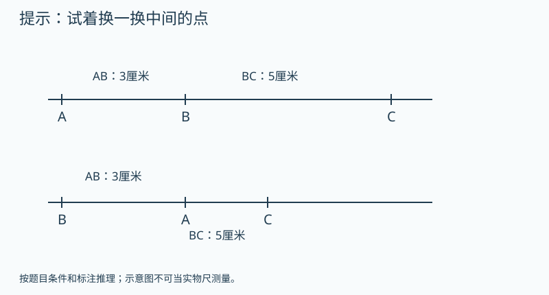

   图的文字备份：上图A、B、C依次排列，AB为3、BC为5；下图B、A、C依次排列，AB为3、BC为5。只在提示后展示两种位置，AC均不标答案。

   提示1（按需展开）：先试B在中间；再试A在中间。
   提示2（按需展开）：若C在中间，BC能比整个AB还长吗？
   答案：不一定；AC可能8厘米或2厘米。 理由：B在A、C之间时AC=3+5=8；A在B、C之间时AC=5−3=2。C不可能在A、B之间，因为BC=5比整个AB=3还长，所以没有第三种。
9. 【独立回顾】〔G3-U05-B01-P09；auto_checked〕〔第1天独立回顾〕一条线段长6厘米，把它转一个方向再量，长度会因方向改变吗？
   答案：不会。 理由：转动没有拉伸或截短线段。
10. 【独立回顾】〔G3-U05-B01-P10；auto_checked〕〔第3天独立回顾〕“直线就是画得很长的线段”准确吗？
   答案：不准确。 理由：线段有两个端点，直线向两边无限延伸，区别不在纸上画了多长。
11. 【独立回顾】〔G3-U05-B01-P11；auto_checked〕〔第7天独立回顾〕要把两根木条都截成8厘米，为什么用线段长度能说明要求，而只说“直线”不能？
   答案：线段能指定两个端点间的长度，直线没有有限总长。 理由：实际截取需要有限长度。
12. 【独立回顾】〔G3-U05-B01-P12；auto_checked〕〔第21天独立回顾〕比较线段、射线、直线，分别有几个端点？哪些能说总长度是5厘米？
   答案：分别2、1、0个端点；只有线段能说总长5厘米。 理由：射线和直线都包含无限延伸的方向。

**练习安排：**12题是题库：P01–P08当堂备选，一次选3–5题；P09–P12分别第1、3、7、21天出现，不得提前展示。选学挑战不影响基础完成。

**本课基础怎样走向提升：**基础过关后，本课提升与关联思维卡合计最多选一道；需要多个任务才讲清的可分次，允许跳过提升继续教材主线。
**实际提升题：**G3-U05-B01-P08
**要观察的思考：**从点的位置决定加或减，检查未说明的条件。
**关联思维卡：**先使用本课列出的提升题，不额外开重复专题
**掌握证据边界：**P09–P12用于本课原有目标的分日回顾，不因基础回顾通过就判新提升已掌握。看过答案的原题不再作为独立证据；后续选同方法、条件有变化的题单独记录，暂无对应独立题时标待迁移。

**证据边界：**本稿提供参考答案与数量理由，尚不是可执行评分器。首答、自查后的最终答和帮助等级分开保存；开放解释须成人确认。AI复核不计为教师人工审定或Kevin试学。

**易错：**射线画得短，所以比5厘米线段短。 → 纸上画法只是有限表示，射线本身没有有限长度。

**Kevin复述：**为什么线段能量长度，射线却不能报一个总长度？

**后续联系：**四年级角的度量进一步研究方向之间的转动量。

##### G3-U05-B02 角的大小看张口，不看边画多长

**定位：** B；建议35分钟。来源G3-upper：印刷66–68 / PDF 72–74。
原创教案；页码锚定相关教材内容，不表示本教案题目出自教材。

**先修：**G3-U05-B01。
**关联课程：**G3-U05-B01

**目标：**识别角的顶点和两边，用重叠比较角。

**真实问题：**剪刀张开一点和张开很多，哪次转得更多？

**为什么：**角记录两条射线的方向差，边的绘制长度只是为了看清方向。

**模型操作：**两根纸条用钉固定一端；边长不变而张口可变。把两个角顶点与一边重合比较另一边。

**讲解：**

1. 从同一点出发的两条射线组成角。
2. 比较时对齐顶点与一边。
3. 把边延长只让方向更明显，不改变角的大小。

**学习层级与本次目标：**教材基础
**最低证据：**识别角的顶点和两边，用重叠比较角。
**最低代表题：**G3-U05-B02-P03、G3-U05-B02-P04、G3-U05-B02-P06
**其他当堂备选：**G3-U05-B02-P01、G3-U05-B02-P02、G3-U05-B02-P05、G3-U05-B02-P07、G3-U05-B02-P08
**退出规则：**本次选定3道代表题能独立完成，并按本课理由说明关键关系，成人确认后记“本次达标”。自主自查改对单独记录；看过解答后改对只记订正。任何状态都允许结束和进入其他课；不是解锁条件。
**暂停与回补：**同一关系连续两次仍需步骤提示，停止加题，回到本课具体模型或建议先修；也可保存位置，下次再学。不能为积分强迫做完。 回补位置：G3-U05-B01
**课次安排：**讲解与模型约12–18分钟，3道目标题约8–12分钟，复述/自查约3–5分钟；可提前停止。
**共享概念：**geometry.angle-invariance（first）

**教具行为规约（尚未实现）：**

| 环节 | 具体行为与证据 |
|---|---|
| 初始状态 | 两纸条共顶点，张口固定；一条可伸长，另一控件可转方向。 |
| Kevin动作 | 先只拉长边，再只旋转一边，与透明原角叠合。 |
| 可观察变化 | 拉长后方向重合角不变；转边后张口变大或变小。 |
| 追问 | 用活动纸条说明“边长没变，角能变化”。 |
| 预期解释 | 角记录两条射线的方向差，边的绘制长度只是为了看清方向。 |
| 错误动作反馈 | 用涂色面积判断时暂隐藏填充，只对齐顶点与一边比较方向。 |
| 撤除教具后 | 先收起模型、提示和例题答案，显示独立题；不把操纵成功直接记为掌握。 独立题G3-U05-B02-P06：把整个角一起旋转，角的大小变吗？ |
| 独立题参考 | 不变；两边之间的方向关系不变。 |

本题预留到教具撤除后，早先选题跳过它；若已曝光则只记练习，改选未曝光且经审核的同目标题，题库耗尽时成人确认，不伪造独立证据。
如本操作尚无可执行教具，先展示准确的前后两图或用实体材料，并明确标为演示/线下操作。不得让不可操作图片冒充拖拽。
**自查动作：**重新读所求的量；核对条件和每步关系；用本课模型、逆算或合理范围检查结果。
**记录：**首答提交后先自行检查再确认最终答；首次答案不可覆盖，未反馈正确答案前的自主纠错可独立记录。

**原创例题：**一个角的两边各画2厘米，另一个与它张口相同、两边各画5厘米。哪个角大？

1. 让顶点与一边重合。
2. 另一边方向也重合，说明张口相同。

答案：一样大。

**练习与讲评：**

1. 【基础】〔G3-U05-B02-P01；auto_checked〕角的两边从同一个什么位置出发？
   答案：顶点 理由：必须有共同起点。
2. 【基础】〔G3-U05-B02-P02；auto_checked〕剪刀从小开口继续张大，角怎样变？
   答案：变大 理由：两边方向差增加。
3. 【变式】〔G3-U05-B02-P03；auto_checked〕延长角的一边，会把角变大吗？
   答案：不会 理由：方向不变。
4. 【变式】〔G3-U05-B02-P04；auto_checked〕比较两个角，只把顶点重合就一定看得准吗？
   答案：不一定 理由：还应把一条边对齐。
5. 【迁移】〔G3-U05-B02-P05；auto_checked〕门从几乎关着转到半开，门与门框形成的角怎样变？
   答案：变大 理由：转开更多。
6. 【挑战】〔G3-U05-B02-P06；auto_checked〕把整个角一起旋转，角的大小变吗？
   答案：不变 理由：两边之间的方向关系不变。
7. 【补充变式】〔G3-U05-B02-P07；auto_checked〕一个角的一条边画长了，顶点和两边方向都没变，角会变大吗？
   答案：不会。 理由：角大小由张开的方向差决定，不由线画多长决定。
8. 【选学提升】〔G3-U05-B02-P08；auto_checked〕把一个角描在透明纸上。小乐把整张透明纸转了方向，小明只把角的一条边绕顶点转动、另一边不动。这两种操作都一定保持原来的角大小吗？怎样用原图检验？
   提示1（按需展开）：判断两条边的相对张口有没有改变。
   提示2（按需展开）：将透明纸顶点与原图顶点对齐，再转到一边重合。
   答案：整张转动保持角大小；只转一边不一定保持。把顶点与一边重新对齐，看另一边是否也重合。 理由：整张转动时两边一起转，相互张口不变。只转一边会改变两边的相对方向；通过与原图叠合可直接检验。
9. 【独立回顾】〔G3-U05-B02-P09；auto_checked〕〔第1天独立回顾〕把角的一边与另一个角的一边重合，还必须让哪里重合才能比较？
   答案：还要让两个顶点重合。 理由：顶点和一边对齐后，另一边的方向才可以直接比较。
10. 【独立回顾】〔G3-U05-B02-P10；auto_checked〕〔第3天独立回顾〕“角里面涂色面积大，所以角一定大”为什么不可靠？
   答案：把边画长也会扩大涂色区域，角却可能没变。 理由：区域面积与夹角大小是不同的量。
11. 【独立回顾】〔G3-U05-B02-P11；auto_checked〕〔第7天独立回顾〕门从关着打开到一半，再继续打开，门与原来位置的夹角怎样变？
   答案：逐渐变大。 理由：转动让两个方向的张口增加。
12. 【独立回顾】〔G3-U05-B02-P12；auto_checked〕〔第21天独立回顾〕为什么比较角时不能只用尺量两边的长度？
   答案：两边可以任意延长，长度不唯一，但方向形成的张口固定。 理由：要比较夹角而不是边长。

**练习安排：**12题是题库：P01–P08当堂备选，一次选3–5题；P09–P12分别第1、3、7、21天出现，不得提前展示。选学挑战不影响基础完成。

**本课基础怎样走向提升：**基础过关后，本课提升与关联思维卡合计最多选一道；需要多个任务才讲清的可分次，允许跳过提升继续教材主线。
**实际提升题：**G3-U05-B02-P08
**要观察的思考：**区分整体运动与内部关系改变，用叠合检验不变量。
**关联思维卡：**先使用本课列出的提升题，不额外开重复专题
**掌握证据边界：**P09–P12用于本课原有目标的分日回顾，不因基础回顾通过就判新提升已掌握。看过答案的原题不再作为独立证据；后续选同方法、条件有变化的题单独记录，暂无对应独立题时标待迁移。

**证据边界：**本稿提供参考答案与数量理由，尚不是可执行评分器。首答、自查后的最终答和帮助等级分开保存；开放解释须成人确认。AI复核不计为教师人工审定或Kevin试学。

**易错：**画得长的边围出的角更大。 → 比较开口与方向，不比较边画多长。

**Kevin复述：**用活动纸条说明“边长没变，角能变化”。

**后续联系：**下一课用统一的直角作为比较标准。

##### G3-U05-B03 用一个直角作标准来分类

**定位：** B；建议35分钟。来源G3-upper：印刷67–72 / PDF 73–78。
原创教案；页码锚定相关教材内容，不表示本教案题目出自教材。

**先修：**G3-U05-B02。
**关联课程：**G3-U05-B02

**目标：**辨认直角、锐角、钝角，明确本课比较范围。

**真实问题：**没有量角器，怎样判断墙角是否像书本角那样方正？

**为什么：**共同的直角标准使“大一些、小一些”变成可复核的分类。

**模型操作：**把三角尺的直角顶点与待测角顶点重合，一边对齐，再看另一边。

**讲解：**

1. 与直角一样大是直角。
2. 小于直角是锐角；大于直角且小于平角是钝角。
3. 旋转三角尺不改变标准，不靠纸面朝向猜。

**学习层级与本次目标：**教材基础
**最低证据：**辨认直角、锐角、钝角，明确本课比较范围。
**最低代表题：**G3-U05-B03-P01、G3-U05-B03-P02、G3-U05-B03-P05
**其他当堂备选：**G3-U05-B03-P03、G3-U05-B03-P04、G3-U05-B03-P06、G3-U05-B03-P07、G3-U05-B03-P08
**退出规则：**本次选定3道代表题能独立完成，并按本课理由说明关键关系，成人确认后记“本次达标”。自主自查改对单独记录；看过解答后改对只记订正。任何状态都允许结束和进入其他课；不是解锁条件。
**暂停与回补：**同一关系连续两次仍需步骤提示，停止加题，回到本课具体模型或建议先修；也可保存位置，下次再学。不能为积分强迫做完。 回补位置：G3-U05-B02
**课次安排：**讲解与模型约12–18分钟，3道目标题约8–12分钟，复述/自查约3–5分钟；可提前停止。
**共享概念：**geometry.angle-class（deepen）

**教具行为规约（尚未实现）：**

| 环节 | 具体行为与证据 |
|---|---|
| 初始状态 | 一个直角工具及三个非零角，分别小于、等于、大于直角且小于平角。 |
| Kevin动作 | 拖动工具使顶点与一边对齐，比较另一边位置，再整体旋转图纸。 |
| 可观察变化 | 三角依次锐、直、钝；旋转整张图后类别不变。 |
| 追问 | 怎样说明分类取决于角本身，不取决于图画方向？ |
| 预期解释 | 共同的直角标准使“大一些、小一些”变成可复核的分类。 |
| 错误动作反馈 | 只对齐顶点时补问还需哪条边对齐；明确钝角还须小于平角。 |
| 撤除教具后 | 先收起模型、提示和例题答案，显示独立题；不把操纵成功直接记为掌握。 独立题G3-U05-B03-P05：怎样检查手画的角是不是直角？ |
| 独立题参考 | 用三角尺对齐顶点和一边；看另一边是否重合。 |

本题预留到教具撤除后，早先选题跳过它；若已曝光则只记练习，改选未曝光且经审核的同目标题，题库耗尽时成人确认，不伪造独立证据。
如本操作尚无可执行教具，先展示准确的前后两图或用实体材料，并明确标为演示/线下操作。不得让不可操作图片冒充拖拽。
**自查动作：**重新读所求的量；核对条件和每步关系；用本课模型、逆算或合理范围检查结果。
**记录：**首答提交后先自行检查再确认最终答；首次答案不可覆盖，未反馈正确答案前的自主纠错可独立记录。

**原创例题：**一个角比直角大，却还没张成一条直线，它是哪类角？

1. 先确认超过直角。
2. 再确认没有达到平角。

答案：钝角。

**练习与讲评：**

1. 【基础】〔G3-U05-B03-P01；auto_checked〕比直角小的非零角叫什么？
   答案：锐角 理由：开口小于直角。
2. 【基础】〔G3-U05-B03-P02；auto_checked〕正方形的四个角是什么角？
   答案：直角 理由：每角都与三角尺直角重合。
3. 【变式】〔G3-U05-B03-P03；auto_checked〕把直角旋转成斜着放，还是直角吗？
   答案：是 理由：整体方向不影响角的大小。
4. 【变式】〔G3-U05-B03-P04；auto_checked〕“所有比直角大的角都是钝角”对吗？
   答案：不对 理由：钝角还要小于平角，四年级会进一步分类。
5. 【迁移】〔G3-U05-B03-P05；auto_checked〕怎样检查手画的角是不是直角？
   答案：用三角尺对齐顶点和一边 理由：看另一边是否重合。
6. 【挑战】〔G3-U05-B03-P06；auto_checked〕从一点引出3条互不重合的射线，任意选两条组成小于平角的角；若三条都在同一小扇形内，共有几个角？
   答案：3个 理由：可选第1和2、第1和3、第2和3。
7. 【补充变式】〔G3-U05-B03-P07；auto_checked〕把一个角与三角尺的直角对齐，它的另一边落在直角内部，这是什么角？
   答案：锐角。 理由：它比直角小。
8. 【选学提升】〔G3-U05-B03-P08；auto_checked〕用同一张直角纸片，一次沿内部某条线把直角分成两个角，另一次把两个较小的锐角并在一起。小乐说“直角拆开都是锐角，所以任意两个锐角合起来一定是直角”。这句话能成立吗？试把两个很小的锐角贴着共同顶点拼起来说明。
   提示1（按需展开）：把两个很小的锐角贴着一条边并起来。
   提示2（按需展开）：把直角对折再对折，所得的小角能作反例吗？
   答案：不能；两个很小的锐角拼起来仍可比直角小。 理由：从一个直角内部拆出的两角合起来是原直角，这是有条件的。任意两个锐角没有“合起来等于原直角”的条件；可用两个直角四分之一大小的角拼出半个直角作反例。
9. 【独立回顾】〔G3-U05-B03-P09；auto_checked〕〔第1天独立回顾〕正方形四个角属于什么角？旋转纸张后分类会变吗？
   答案：都是直角，旋转后仍是直角。 理由：图形朝向不改变角的大小。
10. 【独立回顾】〔G3-U05-B03-P10；auto_checked〕〔第3天独立回顾〕“凡是边斜着画的角都是锐角”对吗？
   答案：不对。 理由：角的类别由张口决定，直角也可以整体转斜。
11. 【独立回顾】〔G3-U05-B03-P11；auto_checked〕〔第7天独立回顾〕钟面3时整与2时整，时针和分针之间较小的角，哪个是直角？哪个是锐角？
   答案：3时是直角，2时是锐角。 理由：3时夹角等于四分之一周，2时更小。
12. 【独立回顾】〔G3-U05-B03-P12；auto_checked〕〔第21天独立回顾〕仅看一个角“像直角”能保证它就是直角吗？怎样检查？
   答案：不能保证；用直角工具对齐顶点和一边检查。 理由：图形画法可能有误差，需要明确依据。

**练习安排：**12题是题库：P01–P08当堂备选，一次选3–5题；P09–P12分别第1、3、7、21天出现，不得提前展示。选学挑战不影响基础完成。

**本课基础怎样走向提升：**基础过关后，本课提升与关联思维卡合计最多选一道；需要多个任务才讲清的可分次，允许跳过提升继续教材主线。
**实际提升题：**G3-U05-B03-P08
**要观察的思考：**辨别结论能否反过来用，用具体拼角构造反例。
**关联思维卡：**G3-U05-TH1、G3-U05-TH2
**掌握证据边界：**P09–P12用于本课原有目标的分日回顾，不因基础回顾通过就判新提升已掌握。看过答案的原题不再作为独立证据；后续选同方法、条件有变化的题单独记录，暂无对应独立题时标待迁移。

**证据边界：**本稿提供参考答案与数量理由，尚不是可执行评分器。首答、自查后的最终答和帮助等级分开保存；开放解释须成人确认。AI复核不计为教师人工审定或Kevin试学。

**易错：**看着斜的角就不是直角。 → 位置可以变，张口不变；用工具检验。

**Kevin复述：**怎样说明分类取决于角本身，不取决于图画方向？

**后续联系：**四上正式测量角度；数角时的系统枚举可选拓展。

#### G3-U06 分数的初步认识

几分之一、几分之几、同分母比较与加减、一个整体及一组物品的分数。

**本章思维收尾（选学，每次最多一道）：**[本章提升：分数不同，取出的长度能相同吗](#g3-u06-th1)；[奥数思想选学：“剩下的一半”是谁的一半](#g3-u06-th2)；[本章提升：第三次反弹往回找，要乘几次二](#g3-u06-s19)

##### G3-U06-B01 一份不到一个，怎样说清楚

**定位：** B；建议35分钟。来源G3-upper：印刷73–75 / PDF 79–81。
原创教案；页码锚定相关教材内容，不表示本教案题目出自教材。

**先修：**平均分与整数1的整体含义。
**关联课程：**依已有能力直接进入

**目标：**理解整体、平均分和几分之一的关系。

**真实问题：**一块饼平均给4人，每人不到一块，用什么数记录每人所得？

**为什么：**整数个数不够表达分割后的份额；分数记录对同一整体怎样等分、取几份。

**模型操作：**一条完整纸带标为1，折成4段相同长度并涂其中1段；同时保留未分割的同长参照纸带。

**讲解：**

1. 先指定1指哪条完整纸带。
2. 平均分意味着每小份相等，不是只分出4块。
3. 4份中的1份记作1/4，分母说等分总份数。

**学习层级与本次目标：**教材基础
**最低证据：**理解整体、平均分和几分之一的关系。
**最低代表题：**G3-U06-B01-P01、G3-U06-B01-P02、G3-U06-B01-P03
**其他当堂备选：**G3-U06-B01-P04、G3-U06-B01-P05、G3-U06-B01-P06、G3-U06-B01-P07、G3-U06-B01-P08
**退出规则：**本次选定3道代表题能独立完成，并按本课理由说明关键关系，成人确认后记“本次达标”。自主自查改对单独记录；看过解答后改对只记订正。任何状态都允许结束和进入其他课；不是解锁条件。
**暂停与回补：**同一关系连续两次仍需步骤提示，停止加题，回到本课具体模型或建议先修；也可保存位置，下次再学。不能为积分强迫做完。 回补位置：本课模型与已列先修
**课次安排：**讲解与模型约12–18分钟，3道目标题约8–12分钟，复述/自查约3–5分钟；可提前停止。
**共享概念：**fraction.unit-whole（first）

**教具行为规约（尚未实现）：**

| 环节 | 具体行为与证据 |
|---|---|
| 初始状态 | 两条同长纸带，一条1整条参照，另一条4等份、首格涂色。 |
| Kevin动作 | 对齐格子检验等长，再切换不等分的反例。 |
| 可观察变化 | 等分时涂色1/4；不等分不能仅数4块就判1/4。 |
| 追问 | 为什么1/4一定要先说清楚“哪个整体”的四分之一？ |
| 预期解释 | 整数个数不够表达分割后的份额；分数记录对同一整体怎样等分、取几份。 |
| 错误动作反馈 | 忽略等分时展示大小不同的份，问每份是否可互相重合。 |
| 撤除教具后 | 先收起模型、提示和例题答案，显示独立题；不把操纵成功直接记为掌握。 独立题G3-U06-B01-P03：一张纸剪成4块但大小不同，每块都能叫1/4吗？ |
| 独立题参考 | 不能；必须平均分。 |

本题预留到教具撤除后，早先选题跳过它；若已曝光则只记练习，改选未曝光且经审核的同目标题，题库耗尽时成人确认，不伪造独立证据。
如本操作尚无可执行教具，先展示准确的前后两图或用实体材料，并明确标为演示/线下操作。不得让不可操作图片冒充拖拽。
**自查动作：**重新读所求的量；核对条件和每步关系；用本课模型、逆算或合理范围检查结果。
**记录：**首答提交后先自行检查再确认最终答；首次答案不可覆盖，未反馈正确答案前的自主纠错可独立记录。

**原创例题：**一条纸带平均分成5段，只涂1段，涂色占整条多少？

1. 整体是整条纸带。
2. 5段同样长，取其中1段。

答案：1/5。

**练习与讲评：**

1. 【基础】〔G3-U06-B01-P01；auto_checked〕一块饼平均分2份，每份是多少块？
   答案：1/2块 理由：整体一块等分为2份。
2. 【基础】〔G3-U06-B01-P02；auto_checked〕1/6中的6表示什么？
   答案：整体被平均分成6份 理由：不是涂色份数。
3. 【变式】〔G3-U06-B01-P03；auto_checked〕一张纸剪成4块但大小不同，每块都能叫1/4吗？
   答案：不能 理由：必须平均分。
4. 【变式】〔G3-U06-B01-P04；auto_checked〕同样大小的两张纸，一张取1/2，一张取1/4，哪张取的部分大？
   答案：1/2那部分 理由：同一大小整体，分得越少每份越大。
5. 【迁移】〔G3-U06-B01-P05；auto_checked〕把一米绳平均分5段，一段占原绳多少？
   答案：1/5 理由：基准是原来一米绳。
6. 【挑战】〔G3-U06-B01-P06；auto_checked〕两根绳子分别长8厘米和4厘米，各取一半，取下的长度相同吗？
   答案：不同，分别4厘米和2厘米。 理由：同一个分数对应的实际长度还取决于整体；给出明确长度，避免只说大小西瓜比较什么量不清楚。
7. 【补充变式】〔G3-U06-B01-P07；auto_checked〕一块饼切成4块，其中一块特别大。任取一块都能叫这块饼的1/4吗？
   答案：不能。 理由：几分之一要求把同一整体平均分成相等的份。
8. 【选学提升】〔G3-U06-B01-P08；auto_checked〕一张长方形纸先沿中线对折，展开；再沿垂直方向的中线对折，展开，得到4个一样大的小长方形。小乐给其中1格涂色，小明给另外2格涂色。两人合起来涂了整张纸的几分之几？如果第2次没有沿中线折，还能仅凭“分成4块”这样判断吗？
   提示1（按需展开）：分母4要求的是四块，还是四块一样大？
   提示2（按需展开）：两次中线折叠为什么能让四格面积相同？
   答案：沿两条中线分成四等份时共涂3/4；第二次不沿中线就不能仅凭块数判断。 理由：第一次平分两半，第二次再把每半平分，四块面积相同，因此3块占3/4。若四块不等大，分母4没有“4等份”的依据。
9. 【独立回顾】〔G3-U06-B01-P09；auto_checked〕〔第1天独立回顾〕同一张纸平均分成8份，取1份，用分数表示。
   答案：1/8。 理由：把整体平均分成8份后取一份。
10. 【独立回顾】〔G3-U06-B01-P10；auto_checked〕〔第3天独立回顾〕“1/3中的3表示取了3份”对吗？
   答案：不对；3表示整体平均分3份，分子1表示取1份。 理由：要区分等分份数与取出的份数。
11. 【独立回顾】〔G3-U06-B01-P11；auto_checked〕〔第7天独立回顾〕一瓶果汁平均倒入6个杯子，没有剩余，每杯占这瓶果汁多少？
   答案：1/6。 理由：每杯是整瓶平均分成6份中的一份。
12. 【独立回顾】〔G3-U06-B01-P12；auto_checked〕〔第21天独立回顾〕说“一半”之前为什么要说明是谁的一半？
   答案：不同大小整体的一半，实际数量可能不同。 理由：分数描述相对整体的关系，不能脱离整体判断实际量。

**练习安排：**12题是题库：P01–P08当堂备选，一次选3–5题；P09–P12分别第1、3、7、21天出现，不得提前展示。选学挑战不影响基础完成。

**本课基础怎样走向提升：**基础过关后，本课提升与关联思维卡合计最多选一道；需要多个任务才讲清的可分次，允许跳过提升继续教材主线。
**实际提升题：**G3-U06-B01-P08
**要观察的思考：**从分割方法说明等分条件，不能仅数块数。
**关联思维卡：**先使用本课列出的提升题，不额外开重复专题
**掌握证据边界：**P09–P12用于本课原有目标的分日回顾，不因基础回顾通过就判新提升已掌握。看过答案的原题不再作为独立证据；后续选同方法、条件有变化的题单独记录，暂无对应独立题时标待迁移。

**证据边界：**本稿提供参考答案与数量理由，尚不是可执行评分器。首答、自查后的最终答和帮助等级分开保存；开放解释须成人确认。AI复核不计为教师人工审定或Kevin试学。

**易错：**分母越大，每份就越大。 → 对于相同整体，等分份数越多，每份越小。

**Kevin复述：**为什么1/4一定要先说清楚“哪个整体”的四分之一？

**后续联系：**下一课数几个同样的分数单位。

##### G3-U06-B02 几个同样的小份，怎样合成一个分数

**定位：** B；建议35分钟。来源G3-upper：印刷76–80 / PDF 82–86。
原创教案；页码锚定相关教材内容，不表示本教案题目出自教材。

**先修：**G3-U06-B01。
**关联课程：**G3-U06-B01

**目标：**理解几分之几并比较同分母分数及简单同分子分数。

**真实问题：**一张长条贴纸平均分8格，涂3格；怎样一句话记录涂色多少？

**为什么：**分数也在数：数的是1/8这样的单位，而不是整数个物品。

**模型操作：**同长纸带均分8格，分别涂3格和5格；同一条纸带表示8/8=1。

**讲解：**

1. 3个1/8就是3/8。
2. 同分母时单位相同，份数多的更大。
3. 比较1/3和1/5先保持整体相同，不能只比较数字3和5。

**学习层级与本次目标：**教材基础
**最低证据：**理解几分之几并比较同分母分数及简单同分子分数。
**最低代表题：**G3-U06-B02-P01、G3-U06-B02-P02、G3-U06-B02-P03
**其他当堂备选：**G3-U06-B02-P04、G3-U06-B02-P05、G3-U06-B02-P06、G3-U06-B02-P07、G3-U06-B02-P08
**退出规则：**本次选定3道代表题能独立完成，并按本课理由说明关键关系，成人确认后记“本次达标”。自主自查改对单独记录；看过解答后改对只记订正。任何状态都允许结束和进入其他课；不是解锁条件。
**暂停与回补：**同一关系连续两次仍需步骤提示，停止加题，回到本课具体模型或建议先修；也可保存位置，下次再学。不能为积分强迫做完。 回补位置：G3-U06-B01
**课次安排：**讲解与模型约12–18分钟，3道目标题约8–12分钟，复述/自查约3–5分钟；可提前停止。
**共享概念：**fraction.count-units（deepen）

**教具行为规约（尚未实现）：**

| 环节 | 具体行为与证据 |
|---|---|
| 初始状态 | 同长8等份纸带各涂前3格和前5格。 |
| Kevin动作 | 逐格指认每个1/8，并把涂色起点对齐。 |
| 可观察变化 | 5/8多2个1/8；8/8才到整条终点。 |
| 追问 | 说清楚5/8中的5在数什么。 |
| 预期解释 | 分数也在数：数的是1/8这样的单位，而不是整数个物品。 |
| 错误动作反馈 | 用5与1直接比较时同时摆整条8格参照，改为同一单位数份。 |
| 撤除教具后 | 先收起模型、提示和例题答案，显示独立题；不把操纵成功直接记为掌握。 独立题G3-U06-B02-P03：6/6表示几个完整的整体？ |
| 独立题参考 | 1个；6份全取完。 |

本题预留到教具撤除后，早先选题跳过它；若已曝光则只记练习，改选未曝光且经审核的同目标题，题库耗尽时成人确认，不伪造独立证据。
如本操作尚无可执行教具，先展示准确的前后两图或用实体材料，并明确标为演示/线下操作。不得让不可操作图片冒充拖拽。
**自查动作：**重新读所求的量；核对条件和每步关系；用本课模型、逆算或合理范围检查结果。
**记录：**首答提交后先自行检查再确认最终答；首次答案不可覆盖，未反馈正确答案前的自主纠错可独立记录。

**原创例题：**同一张纸的3/8与5/8，哪个大？相差几个1/8？

1. 单位都为1/8。
2. 5份比3份多2份。

答案：5/8更大，相差2个1/8。

**练习与讲评：**

1. 【基础】〔G3-U06-B02-P01；auto_checked〕4个1/7写成什么分数？
   答案：4/7 理由：分子数取了几份。
2. 【基础】〔G3-U06-B02-P02；auto_checked〕同一整体的2/9与7/9哪个大？
   答案：7/9 理由：同单位7份多于2份。
3. 【变式】〔G3-U06-B02-P03；auto_checked〕6/6表示几个完整的整体？
   答案：1个 理由：6份全取完。
4. 【变式】〔G3-U06-B02-P04；auto_checked〕同样的纸带，1/3与1/6哪个长？
   答案：1/3 理由：同整体分3份的每份更长。
5. 【迁移】〔G3-U06-B02-P05；auto_checked〕8格任务表完成5格，未完成几格、占整张多少？
   答案：3格，3/8 理由：整体共有8个相同格。
6. 【挑战】〔G3-U06-B02-P06；auto_checked〕有人说“5/8比1大，因为5比1大”，怎样反驳？
   答案：8/8才是1，5/8只取了其中5份 理由：整数1与分子5不是同一单位。
7. 【补充变式】〔G3-U06-B02-P07；auto_checked〕同一条纸带平均分成7份，涂了3份，再涂2份，现在占整条的几分之几？
   答案：5/7。 理由：一共取5个七分之一。
8. 【选学提升】〔G3-U06-B02-P08；auto_checked〕一条纸带平均分成8格，小乐涂第1、2、3格，小明涂第3、4、5格。两人最后涂到的不同格子占整条的几分之几？为什么不能直接把3/8和3/8相加说是6/8？

   题面配图：

   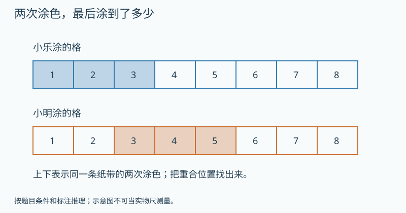

   图的文字备份：同一条八等份纸带：小乐涂1、2、3格，小明涂3、4、5格；两行是同一纸带的操作记录，不是两个整体。

   提示1（按需展开）：先圈出两次记录都出现的格子编号。
   提示2（按需展开）：把涂到的不同编号列一次，别让同一格出现两回。
   答案：5/8。 理由：第3格被两人都涂，但实际只占一格。不同涂色格为1、2、3、4、5，共5格。两次各3格相加会把第3格重复算一次。
9. 【独立回顾】〔G3-U06-B02-P09；auto_checked〕〔第1天独立回顾〕同一个圆的3/8和5/8，哪个更大？
   答案：5/8。 理由：相同整体、相同等分，比较取出的份数。
10. 【独立回顾】〔G3-U06-B02-P10；auto_checked〕〔第3天独立回顾〕“1/8比1/4大，因为8比4大”错在哪？
   答案：同一整体分得越细，每份反而越小，所以1/8小。 理由：分母不是直接表示取出的数量。
11. 【独立回顾】〔G3-U06-B02-P11；auto_checked〕〔第7天独立回顾〕同样长的两根丝带，一根用去2/3，一根用去2/5，哪根用去得长？
   答案：用去2/3的更长。 理由：同一大小整体的三分之一比五分之一大，都是取2份。
12. 【独立回顾】〔G3-U06-B02-P12；auto_checked〕〔第21天独立回顾〕比较分数时为什么先问整体是否同样大？用两块大小不同的蛋糕举例。
   答案：大蛋糕的1/4可能比小蛋糕的1/2更多。 理由：分数数值与对应的实际蛋糕量不能混为一谈。

**练习安排：**12题是题库：P01–P08当堂备选，一次选3–5题；P09–P12分别第1、3、7、21天出现，不得提前展示。选学挑战不影响基础完成。

**本课基础怎样走向提升：**基础过关后，本课提升与关联思维卡合计最多选一道；需要多个任务才讲清的可分次，允许跳过提升继续教材主线。
**实际提升题：**G3-U06-B02-P08
**要观察的思考：**把分数计数与重叠连接，检查所加部分是否互不重叠。
**关联思维卡：**先使用本课列出的提升题，不额外开重复专题
**掌握证据边界：**P09–P12用于本课原有目标的分日回顾，不因基础回顾通过就判新提升已掌握。看过答案的原题不再作为独立证据；后续选同方法、条件有变化的题单独记录，暂无对应独立题时标待迁移。

**证据边界：**本稿提供参考答案与数量理由，尚不是可执行评分器。首答、自查后的最终答和帮助等级分开保存；开放解释须成人确认。AI复核不计为教师人工审定或Kevin试学。

**易错：**分子是几，就等于几个完整物品。 → 分子数的是由分母决定的小份。

**Kevin复述：**说清楚5/8中的5在数什么。

**后续联系：**下一课把同样的小份合并与拿走。

##### G3-U06-B03 分数加减，先确认数的是同一种小份

**定位：** B；建议35分钟。来源G3-upper：印刷81–84 / PDF 87–90。
原创教案；页码锚定相关教材内容，不表示本教案题目出自教材。

**先修：**G3-U06-B02。
**关联课程：**G3-U06-B02

**目标：**解释同分母分数加减和1减几分之几。

**真实问题：**一块饼上午吃2/8，下午吃3/8，一共吃多少，还剩多少？

**为什么：**把相同的小份合并时，份的大小不变，只改变份数；这与2支加3支的道理相通。

**模型操作：**同一纸带8格：先涂2格再涂不重叠的3格；分母仍是8。

**讲解：**

1. 2个1/8加3个1/8是5个1/8。
2. 完整1可写成8/8。
3. 剩8/8−5/8=3/8；本课不把异分母规则提前硬塞。

**学习层级与本次目标：**教材基础
**最低证据：**解释同分母分数加减和1减几分之几。
**最低代表题：**G3-U06-B03-P01、G3-U06-B03-P03、G3-U06-B03-P04
**其他当堂备选：**G3-U06-B03-P02、G3-U06-B03-P05、G3-U06-B03-P06、G3-U06-B03-P07、G3-U06-B03-P08
**退出规则：**本次选定3道代表题能独立完成，并按本课理由说明关键关系，成人确认后记“本次达标”。自主自查改对单独记录；看过解答后改对只记订正。任何状态都允许结束和进入其他课；不是解锁条件。
**暂停与回补：**同一关系连续两次仍需步骤提示，停止加题，回到本课具体模型或建议先修；也可保存位置，下次再学。不能为积分强迫做完。 回补位置：G3-U06-B02
**课次安排：**讲解与模型约12–18分钟，3道目标题约8–12分钟，复述/自查约3–5分钟；可提前停止。
**共享概念：**fraction.same-denominator（deepen）

**教具行为规约（尚未实现）：**

| 环节 | 具体行为与证据 |
|---|---|
| 初始状态 | 一条8格纸带，前2格已涂，随后3格待涂。 |
| Kevin动作 | 涂后3格并数合计，切换是否增加分格线的错误动作。 |
| 可观察变化 | 5格涂色占5/8；小份大小仍1/8，没有产生16等份。 |
| 追问 | 用8格纸带解释为什么答案分母不是16。 |
| 预期解释 | 把相同的小份合并时，份的大小不变，只改变份数；这与2支加3支的道理相通。 |
| 错误动作反馈 | 选5/16时要求指出16等份在哪里，撤回无依据改分母。 |
| 撤除教具后 | 先收起模型、提示和例题答案，显示独立题；不把操纵成功直接记为掌握。 独立题G3-U06-B03-P04：2/8+3/8=5/16对吗？ |
| 独立题参考 | 不对，应5/8；每小份的大小没变。 |

本题预留到教具撤除后，早先选题跳过它；若已曝光则只记练习，改选未曝光且经审核的同目标题，题库耗尽时成人确认，不伪造独立证据。
如本操作尚无可执行教具，先展示准确的前后两图或用实体材料，并明确标为演示/线下操作。不得让不可操作图片冒充拖拽。
**自查动作：**重新读所求的量；核对条件和每步关系；用本课模型、逆算或合理范围检查结果。
**记录：**首答提交后先自行检查再确认最终答；首次答案不可覆盖，未反馈正确答案前的自主纠错可独立记录。

**原创例题：**一块饼吃去2/8又吃去3/8，还剩多少？

1. 共吃5/8。
2. 1=8/8，8/8−5/8=3/8。

答案：剩3/8块。

**练习与讲评：**

1. 【基础】〔G3-U06-B03-P01；auto_checked〕2/7+3/7是多少？
   答案：5/7 理由：合并5个1/7。
2. 【基础】〔G3-U06-B03-P02；auto_checked〕6/9−2/9是多少？
   答案：4/9 理由：拿走2个1/9。
3. 【变式】〔G3-U06-B03-P03；auto_checked〕1−3/5是多少？
   答案：2/5 理由：1先看作5/5。
4. 【变式】〔G3-U06-B03-P04；auto_checked〕2/8+3/8=5/16对吗？
   答案：不对，应5/8 理由：每小份的大小没变。
5. 【迁移】〔G3-U06-B03-P05；auto_checked〕一张纸用去2/6和1/6，剩下几分之几？
   答案：3/6 理由：共用3/6，剩3份。
6. 【挑战】〔G3-U06-B03-P06；auto_checked〕两块大小不同的蛋糕各吃1/4，能说共吃某一块的2/4吗？
   答案：不能直接这样说 理由：整体不同，不是同样大小的分数单位。
7. 【补充变式】〔G3-U06-B03-P07；auto_checked〕一张纸用掉2/7，又用掉3/7，共用掉多少？
   答案：5/7。 理由：相同的七分之一小份共取5份。
8. 【选学提升】〔G3-U06-B03-P08；auto_checked〕一张纸第一次用去原纸的2/7，第二次又用去原纸的3/7，两次剪下的部分不重叠。还剩多少？若只把第2个条件改成“用去剩下纸的3/7”，还能沿用原来的算式吗？只判断能否沿用，不必计算新结果。
   提示1（按需展开）：给每个分数后面补上“谁的”。
   提示2（按需展开）：第二次如果改为剩下纸的几分之几，每小份仍一样大吗？
   答案：原题剩2/7；改变条件后不能直接沿用。 理由：原来的两个分数以同一张原纸为整体，可算7/7−2/7−3/7=2/7。改后第二次的整体是较小的剩余纸，3/7所表示的小份大小变了，不能直接和原纸的2/7相减。
9. 【独立回顾】〔G3-U06-B03-P09；auto_checked〕〔第1天独立回顾〕计算6/8−2/8，说明分母为什么不减。
   答案：4/8。 理由：减的是八分之一的份数，小份大小没有改变。
10. 【独立回顾】〔G3-U06-B03-P10；auto_checked〕〔第3天独立回顾〕判断2/5+1/5=3/10是否正确，并用小份解释。
   答案：不正确，应为3/5。 理由：2个五分之一加1个五分之一仍是3个五分之一。
11. 【独立回顾】〔G3-U06-B03-P11；auto_checked〕〔第7天独立回顾〕一天喝一瓶水的3/10，第二天喝2/10，两天后瓶里还剩整瓶的几分之几？
   答案：5/10。 理由：先共喝5/10，再用10/10减去。
12. 【独立回顾】〔G3-U06-B03-P12；auto_checked〕〔第21天独立回顾〕能把1/2和1/3直接当作同一种小份相加吗？为什么？
   答案：不能直接只加分子。 理由：二分之一与三分之一大小不同，需要先统一小份；本课先处理同分母。

**练习安排：**12题是题库：P01–P08当堂备选，一次选3–5题；P09–P12分别第1、3、7、21天出现，不得提前展示。选学挑战不影响基础完成。

**本课基础怎样走向提升：**基础过关后，本课提升与关联思维卡合计最多选一道；需要多个任务才讲清的可分次，允许跳过提升继续教材主线。
**实际提升题：**G3-U06-B03-P08
**要观察的思考：**比较分数所指整体，不提前要求异分母运算。
**关联思维卡：**先使用本课列出的提升题，不额外开重复专题
**掌握证据边界：**P09–P12用于本课原有目标的分日回顾，不因基础回顾通过就判新提升已掌握。看过答案的原题不再作为独立证据；后续选同方法、条件有变化的题单独记录，暂无对应独立题时标待迁移。

**证据边界：**本稿提供参考答案与数量理由，尚不是可执行评分器。首答、自查后的最终答和帮助等级分开保存；开放解释须成人确认。AI复核不计为教师人工审定或Kevin试学。

**易错：**相加时分母也一起加。 → 分母决定每份大小，不因把几份并在一起而改变。

**Kevin复述：**用8格纸带解释为什么答案分母不是16。

**后续联系：**五下在重新统一分数单位后学习异分母加减。

##### G3-U06-B04 一个整体，也可以是一盒东西

**定位：** B；建议35分钟。来源G3-upper：印刷85–86 / PDF 91–92。
原创教案；页码锚定相关教材内容，不表示本教案题目出自教材。

**先修：**G3-U06-B01；整除。
**关联课程：**G3-U06-B03

**目标：**区分一个物体和一组物品作为整体，找到一组物品的单位分数。

**真实问题：**一盒有12颗糖，拿走这盒糖的1/3，到底是几颗？

**为什么：**整体由什么构成要先约定；同一个分数可表示一块饼的一部分，也可表示一盒糖的一组。

**模型操作：**用圈包住12颗，平均分成3个小组，每组4颗；大圈才是本题的1。

**讲解：**

1. 把整盒12颗视作1个整体。
2. 等分3组，每组是整盒的1/3。
3. 求实际颗数用12÷3=4，分数与实际个数分别回答不同问题。

**学习层级与本次目标：**教材基础
**最低证据：**区分一个物体和一组物品作为整体，找到一组物品的单位分数。
**最低代表题：**G3-U06-B04-P01、G3-U06-B04-P02、G3-U06-B04-P04
**其他当堂备选：**G3-U06-B04-P03、G3-U06-B04-P05、G3-U06-B04-P06、G3-U06-B04-P07、G3-U06-B04-P08
**退出规则：**本次选定3道代表题能独立完成，并按本课理由说明关键关系，成人确认后记“本次达标”。自主自查改对单独记录；看过解答后改对只记订正。任何状态都允许结束和进入其他课；不是解锁条件。
**暂停与回补：**同一关系连续两次仍需步骤提示，停止加题，回到本课具体模型或建议先修；也可保存位置，下次再学。不能为积分强迫做完。 回补位置：G3-U06-B03
**课次安排：**讲解与模型约12–18分钟，3道目标题约8–12分钟，复述/自查约3–5分钟；可提前停止。
**共享概念：**fraction.set-whole（deepen）

**教具行为规约（尚未实现）：**

| 环节 | 具体行为与证据 |
|---|---|
| 初始状态 | 大圈包12颗糖，3个等份小框为空。 |
| Kevin动作 | 逐轮每框分同样颗数，给一框标整体的1/3。 |
| 可观察变化 | 每框4颗，1/3是一组而不是1颗。 |
| 追问 | 1/3盒和4颗怎样可以同时描述同一份糖？ |
| 预期解释 | 整体由什么构成要先约定；同一个分数可表示一块饼的一部分，也可表示一盒糖的一组。 |
| 错误动作反馈 | 把2、4、6颗都称1/3时对比不等组，提示只有4颗符合本整体的1/3。 |
| 撤除教具后 | 先收起模型、提示和例题答案，显示独立题；不把操纵成功直接记为掌握。 独立题G3-U06-B04-P04：一盒糖的1/3一定是3颗吗？ |
| 独立题参考 | 不一定；要看整盒多少颗。 |

本题预留到教具撤除后，早先选题跳过它；若已曝光则只记练习，改选未曝光且经审核的同目标题，题库耗尽时成人确认，不伪造独立证据。
如本操作尚无可执行教具，先展示准确的前后两图或用实体材料，并明确标为演示/线下操作。不得让不可操作图片冒充拖拽。
**自查动作：**重新读所求的量；核对条件和每步关系；用本课模型、逆算或合理范围检查结果。
**记录：**首答提交后先自行检查再确认最终答；首次答案不可覆盖，未反馈正确答案前的自主纠错可独立记录。

**原创例题：**12颗糖为一盒，拿这盒的1/3是多少颗？如果另一盒18颗呢？

1. 12÷3=4。
2. 18÷3=6；两个1/3的整体不同。

答案：分别4颗、6颗。

**练习与讲评：**

1. 【基础】〔G3-U06-B04-P01；auto_checked〕8支笔平均分4组，每组占总数几分之几？
   答案：1/4 理由：整体分成4个相等组。
2. 【基础】〔G3-U06-B04-P02；auto_checked〕8支笔平均分成4组，每组有几支？
   答案：2支 理由：8÷4。
3. 【变式】〔G3-U06-B04-P03；auto_checked〕一盒20颗糖的1/5是多少颗？
   答案：4颗 理由：20÷5。
4. 【变式】〔G3-U06-B04-P04；auto_checked〕一盒糖的1/3一定是3颗吗？
   答案：不一定 理由：要看整盒多少颗。
5. 【迁移】〔G3-U06-B04-P05；auto_checked〕15名同学平均分5队，一队是全体的几分之几，有几人？
   答案：1/5，3人 理由：份额与人数要分别说明。
6. 【挑战】〔G3-U06-B04-P06；auto_checked〕把12颗糖分成3组，三组分别有2颗、4颗、6颗。能因为分了3组，就说每一组都是总数的1/3吗？
   答案：不能；只有4颗那组正好是12颗的1/3。 理由：三组并不一样多，不能把每组都当作等份。
7. 【补充变式】〔G3-U06-B04-P07；auto_checked〕把12颗同样的糖看成一个整体，平均分3份，一份有几颗？占整体多少？
   答案：4颗，占1/3。 理由：12÷3=4，3个相等组中的一组就是整体的1/3。
8. 【选学提升】〔G3-U06-B04-P08；auto_checked〕红盒装12颗珠，蓝盒装20颗珠。各取一盒的1/4，哪盒取出的多，多几颗？红盒若想也取出与蓝盒一样多的珠，还需多拿几颗？
   提示1（按需展开）：分别把12与20平分成4份。
   提示2（按需展开）：分数同为1/4，但两次被分的总数相同吗？
   答案：蓝盒多2颗；红盒需再拿2颗。 理由：红盒的1/4是12÷4=3颗，蓝盒的1/4是20÷4=5颗，相差2。相同分数并不保证实际数量相同，因为整体不同。
9. 【独立回顾】〔G3-U06-B04-P09；auto_checked〕〔第1天独立回顾〕18朵花平均分6束，每束占全部的多少？每束几朵？
   答案：1/6；3朵。 理由：先明确全部18朵为整体，再按6等份分组。
10. 【独立回顾】〔G3-U06-B04-P10；auto_checked〕〔第3天独立回顾〕“12颗糖的1/3是1颗糖”错在哪里？
   答案：把1份误当成1颗，实际1份有4颗。 理由：分子1表示一组，不要求组内只有一个物品。
11. 【独立回顾】〔G3-U06-B04-P11；auto_checked〕〔第7天独立回顾〕两盒积木各有8块和12块，各取一半，取出的块数相同吗？
   答案：不同，分别4块和6块。 理由：相同比例遇到不同总量，对应实际数量不同。
12. 【独立回顾】〔G3-U06-B04-P12；auto_checked〕〔第21天独立回顾〕分数里的一个整体一定只能是一件东西吗？请举例。
   答案：不一定；例如一篮24个苹果也可以看作一个整体。 理由：整体由研究的问题决定，可以是一个物体或一组物品。

**练习安排：**12题是题库：P01–P08当堂备选，一次选3–5题；P09–P12分别第1、3、7、21天出现，不得提前展示。选学挑战不影响基础完成。

**本课基础怎样走向提升：**基础过关后，本课提升与关联思维卡合计最多选一道；需要多个任务才讲清的可分次，允许跳过提升继续教材主线。
**实际提升题：**G3-U06-B04-P08
**要观察的思考：**同分数、不同整体的数量比较。
**关联思维卡：**先使用本课列出的提升题，不额外开重复专题
**掌握证据边界：**P09–P12用于本课原有目标的分日回顾，不因基础回顾通过就判新提升已掌握。看过答案的原题不再作为独立证据；后续选同方法、条件有变化的题单独记录，暂无对应独立题时标待迁移。

**证据边界：**本稿提供参考答案与数量理由，尚不是可执行评分器。首答、自查后的最终答和帮助等级分开保存；开放解释须成人确认。AI复核不计为教师人工审定或Kevin试学。

**易错：**分母是3，就拿3颗。 → 分母表示等分成3组，每组几颗由总数决定。

**Kevin复述：**1/3盒和4颗怎样可以同时描述同一份糖？

**后续联系：**下一课从1份推进到几份。

##### G3-U06-B05 先求一小份，再求几小份

**定位：** B；建议35分钟。来源G3-upper：印刷87–91 / PDF 93–97。
原创教案；页码锚定相关教材内容，不表示本教案题目出自教材。

**先修：**G3-U06-B04。
**关联课程：**G3-U06-B04

**目标：**用“总量÷等分份数×取的份数”求一组物品的几分之几。

**真实问题：**24张贴纸的3/8要送给朋友，应拿出多少张？

**为什么：**先找到共同的1/8单位，再数3个这样的单位，联系除法与乘法。

**模型操作：**24张摆成8个相等小组，每组3张；圈出3组。

**讲解：**

1. 24÷8=3表示一小份。
2. 3×3=9表示取3小份。
3. 检查9张少于24张，未取5组共15张，两者相加24。

**学习层级与本次目标：**教材基础
**最低证据：**用“总量÷等分份数×取的份数”求一组物品的几分之几。
**最低代表题：**G3-U06-B05-P01、G3-U06-B05-P02、G3-U06-B05-P03
**其他当堂备选：**G3-U06-B05-P04、G3-U06-B05-P05、G3-U06-B05-P06、G3-U06-B05-P07、G3-U06-B05-P08
**退出规则：**本次选定3道代表题能独立完成，并按本课理由说明关键关系，成人确认后记“本次达标”。自主自查改对单独记录；看过解答后改对只记订正。任何状态都允许结束和进入其他课；不是解锁条件。
**暂停与回补：**同一关系连续两次仍需步骤提示，停止加题，回到本课具体模型或建议先修；也可保存位置，下次再学。不能为积分强迫做完。 回补位置：G3-U06-B04
**课次安排：**讲解与模型约12–18分钟，3道目标题约8–12分钟，复述/自查约3–5分钟；可提前停止。
**共享概念：**fraction.quantity（deepen）

**教具行为规约（尚未实现）：**

| 环节 | 具体行为与证据 |
|---|---|
| 初始状态 | 24张卡整体框内有8个相等小组，每组数隐藏。 |
| Kevin动作 | 先分完8组，再只选3组，用两行记录每份数和所取总数。 |
| 可观察变化 | 每份3张，3组9张；24÷8×3的两个除乘量义不同。 |
| 追问 | 不背算式，说清24÷8×3每一步在找什么。 |
| 预期解释 | 先找到共同的1/8单位，再数3个这样的单位，联系除法与乘法。 |
| 错误动作反馈 | 得到3就停时高亮目标“取3份”，提示还缺合计三份的一步。 |
| 撤除教具后 | 先收起模型、提示和例题答案，显示独立题；不把操纵成功直接记为掌握。 独立题G3-U06-B05-P03：求20的3/5，先20÷3再×5对吗？ |
| 独立题参考 | 不对，应20÷5×3=12；等分份数由分母决定。 |

本题预留到教具撤除后，早先选题跳过它；若已曝光则只记练习，改选未曝光且经审核的同目标题，题库耗尽时成人确认，不伪造独立证据。
如本操作尚无可执行教具，先展示准确的前后两图或用实体材料，并明确标为演示/线下操作。不得让不可操作图片冒充拖拽。
**自查动作：**重新读所求的量；核对条件和每步关系；用本课模型、逆算或合理范围检查结果。
**记录：**首答提交后先自行检查再确认最终答；首次答案不可覆盖，未反馈正确答案前的自主纠错可独立记录。

**原创例题：**24张贴纸的3/8是多少张？

1. 一份24÷8=3张。
2. 取3份3×3=9张。

答案：9张。

**练习与讲评：**

1. 【基础】〔G3-U06-B05-P01；auto_checked〕18个球的1/6是多少个？
   答案：3个 理由：18÷6。
2. 【基础】〔G3-U06-B05-P02；auto_checked〕18个球的5/6是多少个？
   答案：15个 理由：先3再乘5。
3. 【变式】〔G3-U06-B05-P03；auto_checked〕求20的3/5，先20÷3再×5对吗？
   答案：不对，应20÷5×3=12 理由：等分份数由分母决定。
4. 【变式】〔G3-U06-B05-P04；auto_checked〕24张的3/8与3/4，哪一种拿得多？
   答案：3/4拿18张，更多 理由：每份大小不同。
5. 【迁移】〔G3-U06-B05-P05；auto_checked〕30人中2/5参加绘画，多少人参加，多少没参加？
   答案：12人，18人 理由：30÷5×2=12。
6. 【挑战】〔G3-U06-B05-P06；auto_checked〕已知某盒糖的1/4是5颗，整盒有多少颗？
   答案：20颗 理由：4个相同的5颗合成整体。
7. 【补充变式】〔G3-U06-B05-P07；auto_checked〕24张卡的3/4是多少张？写出先求一份再求三份的步骤。
   答案：18张。 理由：24÷4=6，6×3=18。
8. 【选学提升】〔G3-U06-B05-P08；auto_checked〕一盒珠子的3/4是18颗。整盒多少颗，剩下的1/4多少颗？小乐把18平均分4份，为什么分错了？
   提示1（按需展开）：画4个同样大的空格，标明18对应几个格。
   提示2（按需展开）：先把18分给3格，再求全部4格。
   答案：每一份6颗，整盒24颗，剩下6颗。 理由：18颗对应的是3个四分之一，所以先18÷3=6求一小份，再6×4=24恢复整体。把18除4是把三份误当整盒四份。
9. 【独立回顾】〔G3-U06-B05-P09；auto_checked〕〔第1天独立回顾〕35颗珠子的4/7是多少颗？
   答案：20颗。 理由：35÷7×4=20。
10. 【独立回顾】〔G3-U06-B05-P10；auto_checked〕〔第3天独立回顾〕求20个苹果的3/5时，只算20÷5得到4就停下，对吗？
   答案：不对，应再乘3得12个。 理由：4只是1/5的数量，题目要3份。
11. 【独立回顾】〔G3-U06-B05-P11；auto_checked〕〔第7天独立回顾〕运动队28人，其中3/7参加跳绳，其他人参加跑步。跑步多少人？
   答案：16人。 理由：跳绳28÷7×3=12人，其余28−12。
12. 【独立回顾】〔G3-U06-B05-P12；auto_checked〕〔第21天独立回顾〕为什么求一组物品的几分之几，先除以分母再乘分子？
   答案：除法确定每一等份的数量，乘法合并要取的份数。 理由：两步分别对应“分成几份”和“取几份”。

**练习安排：**12题是题库：P01–P08当堂备选，一次选3–5题；P09–P12分别第1、3、7、21天出现，不得提前展示。选学挑战不影响基础完成。

**本课基础怎样走向提升：**基础过关后，本课提升与关联思维卡合计最多选一道；需要多个任务才讲清的可分次，允许跳过提升继续教材主线。
**实际提升题：**G3-U06-B05-P08
**要观察的思考：**从几份反求一份与整体，确认已知量占几份。
**关联思维卡：**G3-U06-TH1、G3-U06-TH2、G3-U06-S19
**掌握证据边界：**P09–P12用于本课原有目标的分日回顾，不因基础回顾通过就判新提升已掌握。看过答案的原题不再作为独立证据；后续选同方法、条件有变化的题单独记录，暂无对应独立题时标待迁移。

**证据边界：**本稿提供参考答案与数量理由，尚不是可执行评分器。首答、自查后的最终答和帮助等级分开保存；开放解释须成人确认。AI复核不计为教师人工审定或Kevin试学。

**易错：**看到两个分数数字就随意决定除谁乘谁。 → 先用语言确认“分成几份”“取了几份”。

**Kevin复述：**不背算式，说清24÷8×3每一步在找什么。

**后续联系：**逆求整体以后在分数除法系统学习；此处先用整份回拼。

##### G3-U06-E01 合并格子，已经涂色的长度会变吗

**定位：** E；建议35分钟。来源G3-upper：印刷74–80 / PDF 80–86。
原创教案；页码锚定相关教材内容，不表示本教案题目出自教材。本课作相关内容的提升，超出教材直接要求部分见讲解边界。

**先修：**G3-U06-B02；可选提升。
**关联课程：**G3-U06-B02

**目标：**通过同一纸带重分组理解等值分数，为五年级分数性质铺垫。

**真实问题：**同一条纸带从左到右平均分成6小格，前2小格涂蓝色。现在不剪纸带，也不改变蓝色部分，只把每相邻2小格看作1大格。改变分组前后，蓝色部分的实际长度一样吗？

**为什么：**分组方式改变了计数单位，实际纸带和涂色边界并未移动；份数名称可以不同而数量相同。

**模型操作：**保留同一条纸带和同一段涂色，把6小格两两合成3大格；涂色恰好1大格。

**讲解：**

1. 原来涂2个小格，占2/6。
2. 现在每大格含2小格，共3大格，涂了1大格，占1/3。
3. 比较的是重分组前后那段涂色的实际长度：它没有变。

**学习层级与本次目标：**选学或诊断，不作教材基础门槛
**最低证据：**通过同一纸带重分组理解等值分数，为五年级分数性质铺垫。
**最低代表题：**G3-U06-E01-P03、G3-U06-E01-P04、G3-U06-E01-P05
**其他当堂备选：**G3-U06-E01-P01、G3-U06-E01-P02、G3-U06-E01-P06、G3-U06-E01-P07、G3-U06-E01-P08
**退出规则：**本次选定3道代表题能独立完成，并按本课理由说明关键关系，成人确认后记“本次达标”。自主自查改对单独记录；看过解答后改对只记订正。任何状态都允许结束和进入其他课；不是解锁条件。
**暂停与回补：**同一关系连续两次仍需步骤提示，停止加题，回到本课具体模型或建议先修；也可保存位置，下次再学。不能为积分强迫做完。 回补位置：G3-U06-B02
**课次安排：**讲解与模型约12–18分钟，3道目标题约8–12分钟，复述/自查约3–5分钟；可提前停止。
**共享概念：**fraction.equivalence（first）

**教具行为规约（尚未实现）：**

| 环节 | 具体行为与证据 |
|---|---|
| 初始状态 | 同一条6等份纸带前2格已涂色，起终点与涂色端点固定。 |
| Kevin动作 | 每相邻2小格包成一大格，仅换分组线不移动涂色边界。 |
| 可观察变化 | 总3大格、涂1大格；2/6和1/3表示同一段长度。 |
| 追问 | 完整说一遍：哪条纸带、原来怎样分、现在怎样分、什么变了、什么没变。 |
| 预期解释 | 分组方式改变了计数单位，实际纸带和涂色边界并未移动；份数名称可以不同而数量相同。 |
| 错误动作反馈 | 只改分子时把新标记对应回图，指出单位与取份须一起改变。 |
| 撤除教具后 | 先收起模型、提示和例题答案，显示独立题；不把操纵成功直接记为掌握。 独立题G3-U06-E01-P05：一条纸带平均分成10小格，前5格涂蓝色。从左向右把每相邻5小格看作1大格，蓝色不变。按大格计数，蓝色部分占整条纸带的几分之几？ |
| 独立题参考 | 1/2；共2大组，涂1组。 |

本题预留到教具撤除后，早先选题跳过它；若已曝光则只记练习，改选未曝光且经审核的同目标题，题库耗尽时成人确认，不伪造独立证据。
如本操作尚无可执行教具，先展示准确的前后两图或用实体材料，并明确标为演示/线下操作。不得让不可操作图片冒充拖拽。
**自查动作：**重新读所求的量；核对条件和每步关系；用本课模型、逆算或合理范围检查结果。
**记录：**首答提交后先自行检查再确认最终答；首次答案不可覆盖，未反馈正确答案前的自主纠错可独立记录。

**原创例题：**一条纸带平均分成6小格，前2格涂蓝色。从左向右把每相邻2小格看作1大格，蓝色不变。现在蓝色部分占几大格？占整条纸带的几分之几？

1. 6÷2=3大份。
2. 涂色2小份正好1大份。

答案：1大份，占1/3；与原来的2/6同长。

**练习与讲评：**

1. 【基础】〔G3-U06-E01-P01；auto_checked〕8小格每2格合1大格，共几大格？
   答案：4大格 理由：8÷2。
2. 【基础】〔G3-U06-E01-P02；auto_checked〕一条纸带平均分成8小格，前4格涂蓝色。从左向右把每相邻2小格看作1大格，原来的蓝色部分正好占几大格？
   答案：2大格 理由：4÷2。
3. 【变式】〔G3-U06-E01-P03；auto_checked〕同一条纸带平均分成8小格，前4格涂蓝色。从左向右把每相邻2小格看作1大格，蓝色不变。原来用4/8表示蓝色部分，现在按大格计数应写成哪个分数？
   答案：2/4 理由：分子分母对应同一分组改变。
4. 【变式】〔G3-U06-E01-P04；auto_checked〕一条纸带平均分成8小格，前4格涂蓝色。把相邻2小格看作1大格后，整条有4大格，蓝色占2大格。有人把原来的4/8改写成4/4，这还表示原来那段蓝色长度吗？
   答案：不表示；应写2/4。4/4表示整条纸带。 理由：现在取了全部，不是原来一半。
5. 【迁移】〔G3-U06-E01-P05；auto_checked〕一条纸带平均分成10小格，前5格涂蓝色。从左向右把每相邻5小格看作1大格，蓝色不变。按大格计数，蓝色部分占整条纸带的几分之几？
   答案：1/2 理由：共2大组，涂1组。
6. 【挑战】〔G3-U06-E01-P06；auto_checked〕拿不同长度纸带，一条涂2/6另一条涂1/3，能保证实际涂色长度相同吗？
   答案：不能 理由：2/6与1/3是相等的数；但不同长度纸带的1/3不一定同长。比较实际涂色长度，还要知道整条纸带的长度。
7. 【补充变式】〔G3-U06-E01-P07；auto_checked〕同一纸带平均分成12格，前4格涂色，每相邻4格看成一大格。涂色占大格的几分之几？
   答案：1/3。 理由：整条3大格，原涂色正好1大格。
8. 【选学提升】〔G3-U06-E01-P08；auto_checked〕同一条纸带平均分6小格，小乐只涂第1格和第3格。现在把相邻两小格并成一大格，共3大格。涂色总长度与整条的1/3一样长吗？能直接说“恰好涂满了1个大格”吗？允许剪下两段涂色后并起来比较。

   题面配图：

   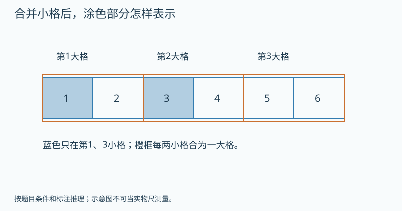

   图的文字备份：纸带六等份，第1和3格涂蓝。每相邻两小格合为一个大格，橙框为1–2、3–4、5–6，涂色边界不动。

   提示1（按需展开）：涂色有两小格，但它们是否在同一个橙框里？
   提示2（按需展开）：可以剪下来合并比总长度，再回头看原来的位置。
   答案：总长度是1/3；但没有直接涂满某一个大格。 理由：两小格合计长度等于一个大格，即整条1/3。可是原来涂在第1、3格，分散在两个大格内；总长度相等不代表位置连续或恰好填满一个原有大格。
9. 【独立回顾】〔G3-U06-E01-P09；auto_checked〕〔第1天独立回顾〕一条纸带平均分8格，前6格涂色。每相邻2格合成大格后，涂色占几大格，共几大格？
   答案：涂3大格，共4大格，即3/4。 理由：6÷2=3，8÷2=4。
10. 【独立回顾】〔G3-U06-E01-P10；auto_checked〕〔第3天独立回顾〕有人把涂色4/12改记为2/12，说“涂色格数减半就好了”。这保留原来的涂色量了吗？
   答案：没有。 理由：只改变取的份数而不改变等分方法，会把量减半。
11. 【独立回顾】〔G3-U06-E01-P11；auto_checked〕〔第7天独立回顾〕同一根绳子，一人说用了3/9，另一人把每3小段看成一大段，说用了1/3。他们可能说同一段吗？
   答案：可能，前提是3个小段相邻并按同一整体重新分组。 理由：分组变了，但用掉的实际边界可不变。
12. 【独立回顾】〔G3-U06-E01-P12；auto_checked〕〔第21天独立回顾〕两条一样长的纸带分别涂2/4和3/6，不用背公式怎样说明涂色同长？
   答案：两种分法都取了整条的一半，把两条对齐可见涂色边界相同。 理由：比较的是相同整体中的同一部分大小。

**练习安排：**12题是题库：P01–P08当堂备选，一次选3–5题；P09–P12分别第1、3、7、21天出现，不得提前展示。选学挑战不影响基础完成。

**本课基础怎样走向提升：**基础过关后，本课提升与关联思维卡合计最多选一道；需要多个任务才讲清的可分次，允许跳过提升继续教材主线。
**实际提升题：**G3-U06-E01-P08
**要观察的思考：**区分数量相等与图上位置相同，检验分组模型边界。
**关联思维卡：**先使用本课列出的提升题，不额外开重复专题
**掌握证据边界：**P09–P12用于本课原有目标的分日回顾，不因基础回顾通过就判新提升已掌握。看过答案的原题不再作为独立证据；后续选同方法、条件有变化的题单独记录，暂无对应独立题时标待迁移。

**证据边界：**本稿提供参考答案与数量理由，尚不是可执行评分器。首答、自查后的最终答和帮助等级分开保存；开放解释须成人确认。AI复核不计为教师人工审定或Kevin试学。

**易错：**分数写法变了，实际取出的长度一定变。 → 明确比较重分组前后同一段涂色，边界不动、长度不变。

**Kevin复述：**完整说一遍：哪条纸带、原来怎样分、现在怎样分、什么变了、什么没变。

**后续联系：**五下分数基本性质才正式总结分子分母同乘同除的规律与限制。

#### G3-U07 复习与关联（含搭配问题）

按知识关系诊断，不重新从数数教起；搭配为本册数学广角。

**本章思维收尾（选学，每次最多一道）：**[本章提升：套餐加上预算条件，乘法还够吗](#g3-u07-th1)；[奥数思想选学：最短路线怎样列全](#g3-u07-th2)

##### G3-U07-R01 把计算、分数与测量连成一个方案

**定位：** R；建议35分钟。来源G3-upper：印刷92–100 / PDF 98–106。
原创教案；页码锚定相关教材内容，不表示本教案题目出自教材。

**先修：**三上基础课；可直接诊断后跳过已会内容。
**关联课程：**G3-U04-B05、G3-U06-B05

**目标：**综合选择运算结构，找出需要回补的单元而非重做全册。

**真实问题：**班级要做36份小礼物，每份贴2张贴纸，已有20张，还需买多少？

**为什么：**同一计划会遇到总量、份数、缺少多少等结构；复习的目的在于辨认何时用什么。

**模型操作：**用“每份—份数—总数”表和一条整体纸带组织已知、未知。

**讲解：**

1. 先找总需求与已有量。
2. 列式后估计答案范围。
3. 依据具体错误返回混合运算、乘法、测量或分数课，不整册重学。

**学习层级与本次目标：**选学或诊断，不作教材基础门槛
**最低证据：**综合选择运算结构，找出需要回补的单元而非重做全册。
**最低代表题：**G3-U07-R01-P01、G3-U07-R01-P02、G3-U07-R01-P03
**其他当堂备选：**G3-U07-R01-P04、G3-U07-R01-P05、G3-U07-R01-P06、G3-U07-R01-P07、G3-U07-R01-P08
**退出规则：**本次选定3道代表题能独立完成，并按本课理由说明关键关系，成人确认后记“本次达标”。自主自查改对单独记录；看过解答后改对只记订正。任何状态都允许结束和进入其他课；不是解锁条件。
**暂停与回补：**同一关系连续两次仍需步骤提示，停止加题，回到本课具体模型或建议先修；也可保存位置，下次再学。不能为积分强迫做完。 回补位置：G3-U04-B05、G3-U06-B05
**课次安排：**讲解与模型约12–18分钟，3道目标题约8–12分钟，复述/自查约3–5分钟；可提前停止。
**共享概念：**model.two-step.quantity（review）

**教具行为规约（尚未实现）：**

| 环节 | 具体行为与证据 |
|---|---|
| 初始状态 | 36份礼物每份2贴纸、已有20张；表格列需求与库存，不预填运算。 |
| Kevin动作 | 自行选相关数据，先列总需求，再求补购数量。 |
| 可观察变化 | 总72张，补52；36份与20张不能直接减。 |
| 追问 | 举出两个看起来不同但都用“每份×份数−已有”的问题。 |
| 预期解释 | 同一计划会遇到总量、份数、缺少多少等结构；复习的目的在于辨认何时用什么。 |
| 错误动作反馈 | 把份数减张数时先标各数据含义，再找必须知道的中间量。 |
| 撤除教具后 | 先收起模型、提示和例题答案，显示独立题；不把操纵成功直接记为掌握。 独立题G3-U07-R01-P03：“已有20，还要36份每份2张”写(36−20)×2对吗？ |
| 独立题参考 | 不对；36是份数，20是张数。 |

本题预留到教具撤除后，早先选题跳过它；若已曝光则只记练习，改选未曝光且经审核的同目标题，题库耗尽时成人确认，不伪造独立证据。
如本操作尚无可执行教具，先展示准确的前后两图或用实体材料，并明确标为演示/线下操作。不得让不可操作图片冒充拖拽。
**自查动作：**重新读所求的量；核对条件和每步关系；用本课模型、逆算或合理范围检查结果。
**记录：**首答提交后先自行检查再确认最终答；首次答案不可覆盖，未反馈正确答案前的自主纠错可独立记录。

**原创例题：**做36份礼物，每份2张贴纸，已有20张，还要多少？

1. 需求36×2=72张。
2. 72−20=52张。

答案：还要52张。

**练习与讲评：**

1. 【基础】〔G3-U07-R01-P01；auto_checked〕算36×2−20。
   答案：52 理由：先乘后减。
2. 【基础】〔G3-U07-R01-P02；auto_checked〕24张的1/3是多少张？
   答案：8张 理由：24÷3。
3. 【变式】〔G3-U07-R01-P03；auto_checked〕“已有20，还要36份每份2张”写(36−20)×2对吗？
   答案：不对 理由：36是份数，20是张数。
4. 【变式】〔G3-U07-R01-P04；auto_checked〕两根绳各40厘米，重叠10厘米连接后多长？
   答案：70厘米 理由：重叠长度只计一次。
5. 【迁移】〔G3-U07-R01-P05；auto_checked〕每袋12颗糖买4袋，平均分6人，每人多少？
   答案：8颗 理由：12×4÷6。
6. 【挑战】〔G3-U07-R01-P06；auto_checked〕题目只给“有36份礼物”，能算贴纸需求吗？
   答案：不能 理由：还需每份贴纸数。
7. 【补充变式】〔G3-U07-R01-P07；auto_checked〕买4包每包6张的纸，共用去全部的1/3，还剩多少张？
   答案：16张。 理由：总共24张，用8张，剩16张。
8. 【选学提升】〔G3-U07-R01-P08；auto_checked〕准备24份礼物，每份系一段10厘米的丝带，不能把零头拼接，剪切不损耗。方案甲用3根各90厘米的丝带，方案乙用3根各85厘米的丝带，分别能剪几段、够不够？再检查3根分别长79、79、90厘米的方案：虽然总长超过240厘米，就一定够剪24段吗？
   提示1（按需展开）：每根都只剪完整10厘米段，分别记录段数和零头。
   提示2（按需展开）：79厘米的9厘米零头能与另一根的零头拼吗？
   答案：甲27段、乙24段，都够；79、79、90厘米的方案只能剪23段，不够。 理由：每根只能贡献完整的10厘米段。甲每根9段共27，乙每根8段共24；最后一组为7+7+9=23段，虽然材料共248厘米，两个9厘米零头不能拼成一段。可用段数必须逐根求，不能只用材料总长除以10。
9. 【独立回顾】〔G3-U07-R01-P09；auto_checked〕〔第1天独立回顾〕3盒每盒8元的彩笔和一本6元的本子，一共多少钱？
   答案：30元。 理由：先3×8=24，再加6。
10. 【独立回顾】〔G3-U07-R01-P10；auto_checked〕〔第3天独立回顾〕有人说“1千克和1000米里的1000相同，所以一样大”，怎样纠正？
   答案：质量和长度是不同的量，不能这样比较。 理由：单位不仅表示大小尺度，还说明研究哪种量。
11. 【独立回顾】〔G3-U07-R01-P11；auto_checked〕〔第7天独立回顾〕为18人准备材料，每3人共用1盒彩泥，每盒7元，需要几盒、多少钱？
   答案：6盒，42元。 理由：18÷3=6，6×7=42。
12. 【独立回顾】〔G3-U07-R01-P12；auto_checked〕〔第21天独立回顾〕遇到同时含人数、钱数、长度的数据，列式前先做什么？
   答案：先说清要问哪种量，筛选能求它的数据，再标出中间量。 理由：不能把所有数字不分意义地放进算式。

**练习安排：**12题是题库：P01–P08当堂备选，一次选3–5题；P09–P12分别第1、3、7、21天出现，不得提前展示。选学挑战不影响基础完成。

**本课基础怎样走向提升：**基础过关后，本课提升与关联思维卡合计最多选一道；需要多个任务才讲清的可分次，允许跳过提升继续教材主线。
**实际提升题：**G3-U07-R01-P08
**要观察的思考：**综合分段限制与余数；总材料长度不能代替可用完整段数。
**关联思维卡：**先使用本课列出的提升题，不额外开重复专题
**掌握证据边界：**P09–P12用于本课原有目标的分日回顾，不因基础回顾通过就判新提升已掌握。看过答案的原题不再作为独立证据；后续选同方法、条件有变化的题单独记录，暂无对应独立题时标待迁移。

**证据边界：**本稿提供参考答案与数量理由，尚不是可执行评分器。首答、自查后的最终答和帮助等级分开保存；开放解释须成人确认。AI复核不计为教师人工审定或Kevin试学。

**易错：**复习就是把相同计算题再刷一遍。 → 用混合任务检查是否能独立识别结构和解释原因。

**Kevin复述：**举出两个看起来不同但都用“每份×份数−已有”的问题。

**后续联系：**对未掌握单元定向回补；学会后进入三下。

##### G3-U07-B01 每种选择都配一遍，怎样不重复不遗漏

**定位：** B；建议35分钟。来源G3-upper：印刷101–102 / PDF 107–108。
原创教案；页码锚定相关教材内容，不表示本教案题目出自教材。

**先修：**G3-U04乘法；本课虽属数学广角，来源为教材。
**关联课程：**G3-U04-B01

**目标：**用表格或连线数完整搭配，区分任选一种与分两步组合。

**真实问题：**有2种上衣、3种裤子，每次各穿1件，可以组成几套？

**为什么：**逐个固定第一种选择，再把第二步走完，就能解释为什么用乘法。

**模型操作：**用2行3列表格，行标上衣A/B，列标裤子1/2/3，每格一种套装。

**讲解：**

1. 先固定A配1、2、3。
2. 再固定B配1、2、3。
3. 检查每套恰好一个格，数量2×3；若飞机或高铁任选一种则是相加。

**学习层级与本次目标：**选学或诊断，不作教材基础门槛
**最低证据：**用表格或连线数完整搭配，区分任选一种与分两步组合。
**最低代表题：**G3-U07-B01-P01、G3-U07-B01-P02、G3-U07-B01-P08
**其他当堂备选：**G3-U07-B01-P03、G3-U07-B01-P04、G3-U07-B01-P05、G3-U07-B01-P06、G3-U07-B01-P07
**退出规则：**本次选定3道代表题能独立完成，并按本课理由说明关键关系，成人确认后记“本次达标”。自主自查改对单独记录；看过解答后改对只记订正。任何状态都允许结束和进入其他课；不是解锁条件。
**暂停与回补：**同一关系连续两次仍需步骤提示，停止加题，回到本课具体模型或建议先修；也可保存位置，下次再学。不能为积分强迫做完。 回补位置：G3-U04-B01
**课次安排：**讲解与模型约12–18分钟，3道目标题约8–12分钟，复述/自查约3–5分钟；可提前停止。
**共享概念：**reasoning.systematic-enumeration（first）

**教具行为规约（尚未实现）：**

| 环节 | 具体行为与证据 |
|---|---|
| 初始状态 | 表格行上衣A/B，列裤1/2/3，六格空白；另有“只任选一样”卡。 |
| Kevin动作 | 按行生成搭配，每套填唯一格；再比较只选上衣或裤的任务。 |
| 可观察变化 | 各选一样有6套，任选一件有5种；任务结构决定相乘或相加。 |
| 追问 | 为什么表格每一格只代表一种搭配？ |
| 预期解释 | 逐个固定第一种选择，再把第二步走完，就能解释为什么用乘法。 |
| 错误动作反馈 | 重复填同格高亮已有套装，遗漏显示空格；不只反馈数值对错。 |
| 撤除教具后 | 先收起模型、提示和例题答案，显示独立题；不把操纵成功直接记为掌握。 独立题G3-U07-B01-P08：早餐从3种主食、2种饮料中各选1种，怎样列出而不漏？ |
| 独立题参考 | 按每种主食依次配两种饮料，共6种。；固定一项再遍历另一项可以不重不漏。 |

本题预留到教具撤除后，早先选题跳过它；若已曝光则只记练习，改选未曝光且经审核的同目标题，题库耗尽时成人确认，不伪造独立证据。
如本操作尚无可执行教具，先展示准确的前后两图或用实体材料，并明确标为演示/线下操作。不得让不可操作图片冒充拖拽。
**自查动作：**重新读所求的量；核对条件和每步关系；用本课模型、逆算或合理范围检查结果。
**记录：**首答提交后先自行检查再确认最终答；首次答案不可覆盖，未反馈正确答案前的自主纠错可独立记录。

**原创例题：**2件上衣和3条裤子，每次各选1件，有几套？

1. A1、A2、A3。
2. B1、B2、B3。

答案：6套。

**练习与讲评：**

1. 【基础】〔G3-U07-B01-P01；auto_checked〕3种饮品和2种面包，各选1种，有几种套餐？
   答案：6种 理由：3×2。
2. 【基础】〔G3-U07-B01-P02；auto_checked〕有2班火车或3班汽车任选一班，共几种选择？
   答案：5种 理由：两类互斥路线相加。
3. 【变式】〔G3-U07-B01-P03；auto_checked〕搭配表里漏写B3，是重复还是遗漏？
   答案：遗漏 理由：这一格没有计入。
4. 【变式】〔G3-U07-B01-P04；auto_checked〕先选上衣再选裤子与先选裤子再选上衣，完整套装数相同吗？
   答案：相同 理由：每套仍对应同一对选择。
5. 【迁移】〔G3-U07-B01-P05；auto_checked〕3张明信片配4种信封，各选1个，多少组合？
   答案：12种 理由：3×4。
6. 【选学提升】〔G3-U07-B01-P06；auto_checked〕上衣有红、蓝两件，裤子有黑、白、灰三条。每天选一件上衣和一条裤子。红上衣不能配白裤，蓝上衣不能配黑裤，其他都能配。共有几种可穿的搭配？请列表，解释为何不能仍用2×3。
   提示1（按需展开）：固定红上衣，列完可穿裤子；再固定蓝上衣。
   提示2（按需展开）：用两行三列表，把不允许的格子划掉。
   答案：4种：红黑、红灰、蓝白、蓝灰。 理由：固定红上衣有2种允许裤子，固定蓝上衣也有2种，共4。2×3把每件都能配全部3条当条件，忽略了两种不允许的搭配。
7. 【补充变式】〔G3-U07-B01-P07；auto_checked〕2件上衣和4条裤子，每次各选1件搭配，有几种？
   答案：8种。 理由：每件上衣都可与4条裤子配，2×4。
8. 【补充变式】〔G3-U07-B01-P08；auto_checked〕早餐从3种主食、2种饮料中各选1种，怎样列出而不漏？
   答案：按每种主食依次配两种饮料，共6种。 理由：固定一项再遍历另一项可以不重不漏。
9. 【独立回顾】〔G3-U07-B01-P09；auto_checked〕〔第1天独立回顾〕3顶帽子配3条围巾，各取1件，有多少搭配？
   答案：9种。 理由：3×3=9。
10. 【独立回顾】〔G3-U07-B01-P10；auto_checked〕〔第3天独立回顾〕午餐可以只选米饭或只选面条，米饭有2种、面条有3种。有人算2×3种，对吗？
   答案：不对，应有5种。 理由：这里只有任选一种主食，不是米饭面条各选一种。
11. 【独立回顾】〔G3-U07-B01-P11；auto_checked〕〔第7天独立回顾〕有2条路从家到公园、3条路从公园到书店，经公园去书店有几种路线？
   答案：6种。 理由：每条前段路线都可接3条后段路线。
12. 【独立回顾】〔G3-U07-B01-P12；auto_checked〕〔第21天独立回顾〕什么情况下用加法数选择，什么情况下可能用乘法？用早餐举例。
   答案：只从两类中任选一种可相加；两类各选一种组成套餐可相乘。 理由：先区分选择是在并列选一项还是分步组成一个结果。

**练习安排：**12题是题库：P01–P08当堂备选，一次选3–5题；P09–P12分别第1、3、7、21天出现，不得提前展示。选学挑战不影响基础完成。

**本课基础怎样走向提升：**基础过关后，本课提升与关联思维卡合计最多选一道；需要多个任务才讲清的可分次，允许跳过提升继续教材主线。
**实际提升题：**G3-U07-B01-P06
**要观察的思考：**条件限制改变计数结构，有序列全而非死乘。
**关联思维卡：**G3-U07-TH1、G3-U07-TH2
**掌握证据边界：**P09–P12用于本课原有目标的分日回顾，不因基础回顾通过就判新提升已掌握。看过答案的原题不再作为独立证据；后续选同方法、条件有变化的题单独记录，暂无对应独立题时标待迁移。

**证据边界：**本稿提供参考答案与数量理由，尚不是可执行评分器。首答、自查后的最终答和帮助等级分开保存；开放解释须成人确认。AI复核不计为教师人工审定或Kevin试学。

**易错：**只要有两个类别就一定相乘。 → 同一结果需要两步选择用乘法；从互斥类别中任选一种用加法。

**Kevin复述：**为什么表格每一格只代表一种搭配？

**后续联系：**四五年级有条件枚举、乘法原理与组合专题深化；不另建重复入门课。

#### G3-L01 生活中的运动现象

轴对称、平移、旋转与剪纸实践；暂不要求坐标化精确作图。

**本章思维收尾（选学，每次最多一道）：**[本章提升：折两次后打一个孔](#g3-l01-th1)；[奥数思想选学：面积够了，为什么还铺不了](#g3-l01-th2)

##### G3-L01-B01 对折后能重合，才是轴对称

**定位：** B；建议35分钟。来源G3-lower：印刷1–3 / PDF 7–9。
原创教案；页码锚定相关教材内容，不表示本教案题目出自教材。

**先修：**三上线和角、常见图形。
**关联课程：**G3-U05-B03

**目标：**用折叠判断对称，并辨认常见图形对称轴。

**真实问题：**剪一张左右两边相同的窗花，怎样少画一半又保证形状一致？

**为什么：**对折使对应两边重合，提供可操作的判定；看起来均衡不等于数学对称。

**模型操作：**沿候选直线折纸，检查边与角是否逐处重合；正方形与非正方形长方形对比。

**讲解：**

1. 找一条候选折线。
2. 折后检查整个图形，不只检查中心一点。
3. 一条成功不能说明只有一条，旋转纸继续寻找。

**学习层级与本次目标：**教材基础
**最低证据：**用折叠判断对称，并辨认常见图形对称轴。
**最低代表题：**G3-L01-B01-P02、G3-L01-B01-P03、G3-L01-B01-P05
**其他当堂备选：**G3-L01-B01-P01、G3-L01-B01-P04、G3-L01-B01-P06、G3-L01-B01-P07、G3-L01-B01-P08
**退出规则：**本次选定3道代表题能独立完成，并按本课理由说明关键关系，成人确认后记“本次达标”。自主自查改对单独记录；看过解答后改对只记订正。任何状态都允许结束和进入其他课；不是解锁条件。
**暂停与回补：**同一关系连续两次仍需步骤提示，停止加题，回到本课具体模型或建议先修；也可保存位置，下次再学。不能为积分强迫做完。 回补位置：G3-U05-B03
**课次安排：**讲解与模型约12–18分钟，3道目标题约8–12分钟，复述/自查约3–5分钟；可提前停止。
**共享概念：**geometry.symmetry（first）

**教具行为规约（尚未实现）：**

| 环节 | 具体行为与证据 |
|---|---|
| 初始状态 | 正方形与长宽不等的长方形，候选折痕含中线和对角线。 |
| Kevin动作 | 逐条折叠或开透明叠合，记录能否全图重合。 |
| 可观察变化 | 正方形4条、长方形2条；只面积相同的两半未必逐点重合。 |
| 追问 | 为什么面积各一半还不能证明轴对称？ |
| 预期解释 | 对折使对应两边重合，提供可操作的判定；看起来均衡不等于数学对称。 |
| 错误动作反馈 | 仅比较面积时标出不能重合的边角，提醒判断全图对应。 |
| 撤除教具后 | 先收起模型、提示和例题答案，显示独立题；不把操纵成功直接记为掌握。 独立题G3-L01-B01-P05：剪对称窗花时，为什么先对折再剪一边？ |
| 独立题参考 | 展开后形成镜像对应；同一次剪切作用到两层。 |

本题预留到教具撤除后，早先选题跳过它；若已曝光则只记练习，改选未曝光且经审核的同目标题，题库耗尽时成人确认，不伪造独立证据。
如本操作尚无可执行教具，先展示准确的前后两图或用实体材料，并明确标为演示/线下操作。不得让不可操作图片冒充拖拽。
**自查动作：**重新读所求的量；核对条件和每步关系；用本课模型、逆算或合理范围检查结果。
**记录：**首答提交后先自行检查再确认最终答；首次答案不可覆盖，未反馈正确答案前的自主纠错可独立记录。

**原创例题：**一个非正方形的长方形，沿对角线折，两半会完全重合吗？

1. 长边与短边长度不同。
2. 对角线折后对应边不能全部重合。

答案：不能；它有横、竖中线两条对称轴。

**练习与讲评：**

1. 【基础】〔G3-L01-B01-P01；auto_checked〕正方形沿水平中线折能重合吗？
   答案：能 理由：两半完全对应。
2. 【基础】〔G3-L01-B01-P02；auto_checked〕正方形共有几条对称轴？
   答案：4条 理由：两条中线与两条对角线。
3. 【变式】〔G3-L01-B01-P03；auto_checked〕非正方形长方形共有几条对称轴？
   答案：2条 理由：只有两条中线。
4. 【变式】〔G3-L01-B01-P04；auto_checked〕一个图形面积左右相等，必定轴对称吗？
   答案：不一定 理由：相等面积不能保证逐点对应。
5. 【迁移】〔G3-L01-B01-P05；auto_checked〕剪对称窗花时，为什么先对折再剪一边？
   答案：展开后形成镜像对应 理由：同一次剪切作用到两层。
6. 【挑战】〔G3-L01-B01-P06；auto_checked〕正方形折纸只试过中线，就说只有2条对称轴，哪里不充分？
   答案：没有检查对角线 理由：需要系统枚举候选。
7. 【补充变式】〔G3-L01-B01-P07；auto_checked〕一个长方形不是正方形，沿两条对角线分别对折，都能完全重合吗？
   答案：不能。 理由：长边与短边不能互相重合，非正方形长方形的对角线不是对称轴。
8. 【选学提升】〔G3-L01-B01-P08；auto_checked〕把一张长方形纸沿竖直中线对折成两层，在折痕边剪一个半圆形缺口，半圆的直径沿折痕，切口穿透两层。展开后是两个分开的半圆孔，还是一个完整圆孔？如果改为在远离折痕处穿透两层打一个小圆孔，展开又会怎样？

   题面配图：

   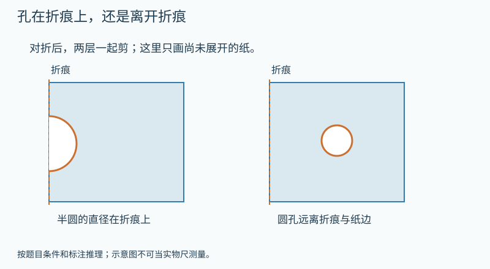

   图的文字备份：两张分别对折的纸。左图在折痕边剪半圆，直径沿折痕；右图在远离折痕和纸边处打圆孔。均穿透两层，尚未展示展开结果。

   提示1（按需展开）：先看缺口有没有碰到作为共同边的折痕。
   提示2（按需展开）：把纸慢慢展开：折痕上的两半会接起来，远处的两个孔会在哪里？
   答案：折痕处的半圆展开为1个完整圆孔；远离折痕打圆孔，展开为2个对称的圆孔。 理由：折痕是两半的共同边，两个半圆沿共同直径连成一个圆。离开折痕的圆孔在两侧不同位置，展开后互不连接。
9. 【独立回顾】〔G3-L01-B01-P09；auto_checked〕〔第1天独立回顾〕一个长宽不相等的长方形有几条对称轴？
   答案：2条。 理由：连接两组对边中点的直线各一条；排除正方形有4条的情况。
10. 【独立回顾】〔G3-L01-B01-P10；auto_checked〕〔第3天独立回顾〕一个图形左右面积相等，就一定关于中间直线对称吗？
   答案：不一定。 理由：面积相等不保证每一个对应位置都能重合。
11. 【独立回顾】〔G3-L01-B01-P11；auto_checked〕〔第7天独立回顾〕给蝴蝶左翅的一个点找对称位置，该点到折痕2厘米，右边对应点应离折痕多远？
   答案：2厘米。 理由：对折重合要求对应点到折痕距离相等。
12. 【独立回顾】〔G3-L01-B01-P12；auto_checked〕〔第21天独立回顾〕怎样检验一条线是不是某个纸片图形的对称轴？
   答案：沿这条线对折，检查整个图形两侧是否完全重合。 理由：只看局部相似或两边一样大不足以证明。

**练习安排：**12题是题库：P01–P08当堂备选，一次选3–5题；P09–P12分别第1、3、7、21天出现，不得提前展示。选学挑战不影响基础完成。

**本课基础怎样走向提升：**基础过关后，本课提升与关联思维卡合计最多选一道；需要多个任务才讲清的可分次，允许跳过提升继续教材主线。
**实际提升题：**G3-L01-B01-P08
**要观察的思考：**改变孔与折痕的位置，分析连接与对称，不能只按层数数孔。
**关联思维卡：**G3-L01-TH1
**掌握证据边界：**P09–P12用于本课原有目标的分日回顾，不因基础回顾通过就判新提升已掌握。看过答案的原题不再作为独立证据；后续选同方法、条件有变化的题单独记录，暂无对应独立题时标待迁移。

**证据边界：**本稿提供参考答案与数量理由，尚不是可执行评分器。首答、自查后的最终答和帮助等级分开保存；开放解释须成人确认。AI复核不计为教师人工审定或Kevin试学。

**易错：**左右看起来差不多就是轴对称。 → 使用完全重合的操作标准，不能只凭外观。

**Kevin复述：**为什么面积各一半还不能证明轴对称？

**后续联系：**下一课研究图形整体移动；五年级再做对应点精确作图。

##### G3-L01-B02 平移和旋转，移动方式哪里不同

**定位：** B；建议35分钟。来源G3-lower：印刷4–9 / PDF 10–15。
原创教案；页码锚定相关教材内容，不表示本教案题目出自教材。

**先修：**G3-L01-B01；角的直观认识。
**关联课程：**G3-L01-B01

**目标：**辨别整体平移、绕点旋转，明确物体与观察视角。

**真实问题：**抽屉拉开和风车转动都在动，它们按同一种方式动吗？

**为什么：**记录运动方式能预测每个部分去哪里；平移保持朝向，旋转围绕中心改变朝向。

**模型操作：**纸箭头沿直尺滑动再用图钉绕固定点转动；观察箭头尖与尾的共同变化。

**讲解：**

1. 平移时各部分沿相同方向移动相同距离。
2. 旋转围绕固定点转动，不能只看中心没动。
3. 实际物体可能同时移动和转动；本课先分析单一动作。

**学习层级与本次目标：**教材基础
**最低证据：**辨别整体平移、绕点旋转，明确物体与观察视角。
**最低代表题：**G3-L01-B02-P01、G3-L01-B02-P02、G3-L01-B02-P03
**其他当堂备选：**G3-L01-B02-P04、G3-L01-B02-P05、G3-L01-B02-P06、G3-L01-B02-P07、G3-L01-B02-P08
**退出规则：**本次选定3道代表题能独立完成，并按本课理由说明关键关系，成人确认后记“本次达标”。自主自查改对单独记录；看过解答后改对只记订正。任何状态都允许结束和进入其他课；不是解锁条件。
**暂停与回补：**同一关系连续两次仍需步骤提示，停止加题，回到本课具体模型或建议先修；也可保存位置，下次再学。不能为积分强迫做完。 回补位置：G3-L01-B01
**课次安排：**讲解与模型约12–18分钟，3道目标题约8–12分钟，复述/自查约3–5分钟；可提前停止。
**共享概念：**geometry.motion（first）

**教具行为规约（尚未实现）：**

| 环节 | 具体行为与证据 |
|---|---|
| 初始状态 | 朝上的纸箭头，按钮向右滑动与绕尾端转向右。 |
| Kevin动作 | 分别执行两动作，跟踪箭头尖和尾，再合成一次完整运动。 |
| 可观察变化 | 平移不改朝向；绕点转动改变朝向；复合过程不能只标平移。 |
| 追问 | 用一支铅笔演示平移与旋转，说明固定了什么、改变了什么。 |
| 预期解释 | 记录运动方式能预测每个部分去哪里；平移保持朝向，旋转围绕中心改变朝向。 |
| 错误动作反馈 | 只看最终位置时显示路径和固定点，问运动方式而非是否换了位置。 |
| 撤除教具后 | 先收起模型、提示和例题答案，显示独立题；不把操纵成功直接记为掌握。 独立题G3-L01-B02-P03：纸箭头向右移后变成朝下，还能说只做了平移吗？ |
| 独立题参考 | 不能；朝向改变，至少还发生转动。 |

本题预留到教具撤除后，早先选题跳过它；若已曝光则只记练习，改选未曝光且经审核的同目标题，题库耗尽时成人确认，不伪造独立证据。
如本操作尚无可执行教具，先展示准确的前后两图或用实体材料，并明确标为演示/线下操作。不得让不可操作图片冒充拖拽。
**自查动作：**重新读所求的量；核对条件和每步关系；用本课模型、逆算或合理范围检查结果。
**记录：**首答提交后先自行检查再确认最终答；首次答案不可覆盖，未反馈正确答案前的自主纠错可独立记录。

**原创例题：**纸箭头朝上，先整体向右移，再绕尾端转成朝右。哪一步是平移，哪一步旋转？

1. 第一步朝向没变，只换位置。
2. 第二步绕尾端改变方向。

答案：先平移，再旋转。

**练习与讲评：**

1. 【基础】〔G3-L01-B02-P01；auto_checked〕直上直下的电梯轿厢属于哪类运动？
   答案：平移 理由：整体方向与距离一致。
2. 【基础】〔G3-L01-B02-P02；auto_checked〕风车叶片绕轴转动属于什么？
   答案：旋转 理由：有固定旋转轴心。
3. 【变式】〔G3-L01-B02-P03；auto_checked〕纸箭头向右移后变成朝下，还能说只做了平移吗？
   答案：不能 理由：朝向改变，至少还发生转动。
4. 【变式】〔G3-L01-B02-P04；auto_checked〕车在前进时，车轮只做平移吗？
   答案：不是 理由：车轮同时平移和转动。
5. 【迁移】〔G3-L01-B02-P05；auto_checked〕两个剪纸图案形状、大小相同，且对应部分朝向相同，只是位置不同。怎样让它们重合？
   答案：可整体平移。 理由：各对应部分移动相同方向、相同距离，不能只说形状相同而忽略大小。
6. 【挑战】〔G3-L01-B02-P06；auto_checked〕固定中心的小风车转一圈，回到原位，能说它没运动吗？
   答案：不能 理由：最终位置相同不代表中间没有运动。
7. 【补充变式】〔G3-L01-B02-P07；auto_checked〕抽屉沿轨道拉出，方向不变，主要属于平移还是旋转？
   答案：平移。 理由：抽屉各部分沿相同方向移动。
8. 【选学提升】〔G3-L01-B02-P08；auto_checked〕一张写着字母L的透明卡片先向右平移3格，再向上平移2格；另一张同样起点、同样朝向的卡片先向上2格再向右3格。最后能完全重合吗？如果第二张在移动前转了半圈，最后只到同一位置就一定重合吗？
   提示1（按需展开）：分别记录水平移动、竖直移动和朝向。
   提示2（按需展开）：平移会不会把已经倒过来的L再转正？
   答案：只交换两次平移顺序可以重合；第二张若转了半圈，同位置不保证重合。 理由：两次移动后的总水平、竖直位移相同，且未转动，形状与朝向相同。转半圈后L的朝向改变，平移不会把朝向变回来。
9. 【独立回顾】〔G3-L01-B02-P09；auto_checked〕〔第1天独立回顾〕一本书保持朝向不变，向右滑动10厘米，书的形状和大小变了吗？
   答案：没有。 理由：平移改变位置，不改变形状和大小。
10. 【独立回顾】〔G3-L01-B02-P10；auto_checked〕〔第3天独立回顾〕“只要物体位置变了就叫平移”对吗？用门说明。
   答案：不对；门绕门轴打开是旋转。 理由：旋转也改变位置，要看运动方式。
11. 【独立回顾】〔G3-L01-B02-P11；auto_checked〕〔第7天独立回顾〕一块拼图向左移两格后，又围绕某个角转动。全过程能只叫平移吗？
   答案：不能，它包含平移和旋转。 理由：两个阶段的运动方式不同。
12. 【独立回顾】〔G3-L01-B02-P12；auto_checked〕〔第21天独立回顾〕怎么向别人说明一次旋转，才不会只说“转一下”？
   答案：指出绕哪个点、朝哪个方向转，并说明转多少。 理由：旋转中心、方向和转动大小共同确定动作。

**练习安排：**12题是题库：P01–P08当堂备选，一次选3–5题；P09–P12分别第1、3、7、21天出现，不得提前展示。选学挑战不影响基础完成。

**本课基础怎样走向提升：**基础过关后，本课提升与关联思维卡合计最多选一道；需要多个任务才讲清的可分次，允许跳过提升继续教材主线。
**实际提升题：**G3-L01-B02-P08
**要观察的思考：**把位置与朝向分开记录，寻找操作顺序中的不变量。
**关联思维卡：**G3-L01-TH2
**掌握证据边界：**P09–P12用于本课原有目标的分日回顾，不因基础回顾通过就判新提升已掌握。看过答案的原题不再作为独立证据；后续选同方法、条件有变化的题单独记录，暂无对应独立题时标待迁移。

**证据边界：**本稿提供参考答案与数量理由，尚不是可执行评分器。首答、自查后的最终答和帮助等级分开保存；开放解释须成人确认。AI复核不计为教师人工审定或Kevin试学。

**易错：**只有位置变了才算运动，回原位等于没动。 → 运动描述要包含过程，不只比较起终状态。

**Kevin复述：**用一支铅笔演示平移与旋转，说明固定了什么、改变了什么。

**后续联系：**五年级用方向、角度与中心精确描述旋转。

#### G3-L02 除数是一位数的除法

口算估算、竖式与余数验算、商含0、连乘连除、归一归总、整理；和三上混合运算衔接。

**本章思维收尾（选学，每次最多一道）：**[本章提升：有余数时，总数不只有一个答案](#g3-l02-th1)；[奥数思想选学：两种装法的余数都要满足](#g3-l02-th2)；[奥数思想选学：最多的一个人，最少能做多少](#g3-l02-s08)；[奥数思想选学：余数条件逐层筛，最小数怎样保证](#g3-l02-s11)；[本章提升：两个余数相同，先拿走什么](#g3-l02-s13)；[奥数思想选学：除法的四个量都在同一个总和里](#g3-l02-s14)；[本章提升：报到几号与余数，差在整轮的时候](#g3-l02-s16)

##### G3-L02-B01 把几十、几百平均分，先看计数单位

**定位：** B；建议35分钟。来源G3-lower：印刷10–14 / PDF 16–20。
原创教案；页码锚定相关教材内容，不表示本教案题目出自教材。

**先修：**三上位值、乘法与平均分。
**关联课程：**G3-U04-B01

**目标：**用位值理解口算除法，选合适近似数估商。

**真实问题：**把90张纸平分3人，怎样把9个十平均分，而不一张张发？

**为什么：**除法可以分计数单位；90÷3分的是9个十，所得3个十。

**模型操作：**9捆十张纸分3堆；96张先分90张再分6张。

**讲解：**

1. 90÷3=30。
2. 96÷3=(90÷3)+(6÷3)=32，两个部分都可整分。
3. 估98÷3可用接近的可整除数99，结果约33，注明不是精确值。

**学习层级与本次目标：**教材基础
**最低证据：**用位值理解口算除法，选合适近似数估商。
**最低代表题：**G3-L02-B01-P01、G3-L02-B01-P03、G3-L02-B01-P06
**其他当堂备选：**G3-L02-B01-P02、G3-L02-B01-P04、G3-L02-B01-P05、G3-L02-B01-P07、G3-L02-B01-P08
**退出规则：**本次选定3道代表题能独立完成，并按本课理由说明关键关系，成人确认后记“本次达标”。自主自查改对单独记录；看过解答后改对只记订正。任何状态都允许结束和进入其他课；不是解锁条件。
**暂停与回补：**同一关系连续两次仍需步骤提示，停止加题，回到本课具体模型或建议先修；也可保存位置，下次再学。不能为积分强迫做完。 回补位置：G3-U04-B01
**课次安排：**讲解与模型约12–18分钟，3道目标题约8–12分钟，复述/自查约3–5分钟；可提前停止。
**共享概念：**arithmetic.divide.place-value（deepen）

**教具行为规约（尚未实现）：**

| 环节 | 具体行为与证据 |
|---|---|
| 初始状态 | 9捆十张与6散张，3人框；每人分得数初始0。 |
| Kevin动作 | 先分9捆，再分6张；将每人30与2合并。 |
| 可观察变化 | 96÷3=30+2=32，分的是相同总量给相同3份。 |
| 追问 | 为什么96÷3可以分成两次平均分后再相加？ |
| 预期解释 | 除法可以分计数单位；90÷3分的是9个十，所得3个十。 |
| 错误动作反馈 | 把9÷3=3直接当3张时保留捆的十标签，追问3的单位。 |
| 撤除教具后 | 先收起模型、提示和例题答案，显示独立题；不把操纵成功直接记为掌握。 独立题G3-L02-B01-P06：把96拆成90+6容易算96÷3；若除数是4，还一定方便吗？ |
| 独立题参考 | 不一定；90÷4不能整分，可拆80+16。 |

本题预留到教具撤除后，早先选题跳过它；若已曝光则只记练习，改选未曝光且经审核的同目标题，题库耗尽时成人确认，不伪造独立证据。
如本操作尚无可执行教具，先展示准确的前后两图或用实体材料，并明确标为演示/线下操作。不得让不可操作图片冒充拖拽。
**自查动作：**重新读所求的量；核对条件和每步关系；用本课模型、逆算或合理范围检查结果。
**记录：**首答提交后先自行检查再确认最终答；首次答案不可覆盖，未反馈正确答案前的自主纠错可独立记录。

**原创例题：**96张纸平分3人，每人多少？

1. 90张每人30张。
2. 6张每人2张，合起来32。

答案：32张。

**练习与讲评：**

1. 【基础】〔G3-L02-B01-P01；auto_checked〕80÷4等于多少？
   答案：20 理由：8个十平均分4份。
2. 【基础】〔G3-L02-B01-P02；auto_checked〕600÷3等于多少？
   答案：200 理由：6个百分3份。
3. 【变式】〔G3-L02-B01-P03；auto_checked〕84÷4怎样拆着算？
   答案：80÷4+4÷4=21 理由：两部分都平分给同样4份。
4. 【变式】〔G3-L02-B01-P04；auto_checked〕95÷3估成约30，能说正好30吗？
   答案：不能 理由：估计没有记录余量。
5. 【迁移】〔G3-L02-B01-P05；auto_checked〕5人分250张纸，每人多少？
   答案：50张 理由：25个十÷5。
6. 【挑战】〔G3-L02-B01-P06；auto_checked〕把96拆成90+6容易算96÷3；若除数是4，还一定方便吗？
   答案：不一定 理由：90÷4不能整分，可拆80+16。
7. 【补充变式】〔G3-L02-B01-P07；auto_checked〕口算480÷6，为什么可以先想48个十除以6？
   答案：480是48个十，分后每份8个十，即80。 理由：计数单位始终保持为十。
8. 【选学提升】〔G3-L02-B01-P08；auto_checked〕要心算96÷4，小乐拆成90÷4与6÷4，却发现两次都不能整除。你能把96换一种拆法，让两部分都能整除4吗？给出两种拆法，并说明结果为何仍是24。
   提示1（按需展开）：找一个容易除以4的数作为第一部分。
   提示2（按需展开）：用80后还剩16；用40后还剩56，两部分都能分吗？
   答案：例如80+16：20+4=24；也可40+56：10+14=24。其他正确拆法也可。 理由：拆分只改变分批方法，没有漏掉或重复96个物品。只要两部分各平均分给4人，再把每人两批所得合起来，就是96平均分4份。
9. 【独立回顾】〔G3-L02-B01-P09；auto_checked〕〔第1天独立回顾〕计算420÷7。
   答案：60。 理由：42个十除以7是6个十。
10. 【独立回顾】〔G3-L02-B01-P10；auto_checked〕〔第3天独立回顾〕把360÷6算成6，漏掉了什么？
   答案：漏了十这个单位，应为60。 理由：36个十平均分6份得到6个十。
11. 【独立回顾】〔G3-L02-B01-P11；auto_checked〕〔第7天独立回顾〕一共有719人，若每辆车坐8人，估计需要大约多少辆，再判断90辆够不够。
   答案：大约90辆，90辆够坐720人。 理由：把719近似成720可估商，再用容量验证。
12. 【独立回顾】〔G3-L02-B01-P12；auto_checked〕〔第21天独立回顾〕估算除法时为什么要选容易整除、又接近原数的数？
   答案：这样能方便口算并得到接近实际的商。 理由：为了判断是否够用，还应结合上界、下界再检查。

**练习安排：**12题是题库：P01–P08当堂备选，一次选3–5题；P09–P12分别第1、3、7、21天出现，不得提前展示。选学挑战不影响基础完成。

**本课基础怎样走向提升：**基础过关后，本课提升与关联思维卡合计最多选一道；需要多个任务才讲清的可分次，允许跳过提升继续教材主线。
**实际提升题：**G3-L02-B01-P08
**要观察的思考：**选择适合除数的分解，而非固定按十位个位拆。
**关联思维卡：**先使用本课列出的提升题，不额外开重复专题
**掌握证据边界：**P09–P12用于本课原有目标的分日回顾，不因基础回顾通过就判新提升已掌握。看过答案的原题不再作为独立证据；后续选同方法、条件有变化的题单独记录，暂无对应独立题时标待迁移。

**证据边界：**本稿提供参考答案与数量理由，尚不是可执行评分器。首答、自查后的最终答和帮助等级分开保存；开放解释须成人确认。AI复核不计为教师人工审定或Kevin试学。

**易错：**把被除数里每个数字分别除，再直接拼成答案。 → 应分计数单位，不能把9个十当9个一。

**Kevin复述：**为什么96÷3可以分成两次平均分后再相加？

**后续联系：**下一课竖式处理不能直接整分的高位。

##### G3-L02-B02 除法竖式为什么从高位开始

**定位：** B；建议35分钟。来源G3-lower：印刷15–17 / PDF 21–23。
原创教案；页码锚定相关教材内容，不表示本教案题目出自教材。

**先修：**G3-L02-B01。
**关联课程：**G3-L02-B01

**目标：**理解高位分得多少、剩余换成低位单位继续分。

**真实问题：**52颗糖平均分4人，5捆十颗分完后剩的一捆怎么办？

**为什么：**剩下的高位单位仍属于总数，拆成低位后继续分能保证公平和完整。

**模型操作：**5捆十颗加2颗，先每人1捆，余1捆拆10颗，加2成12颗。

**讲解：**

1. 十位5÷4商1余1个十。
2. 余下1个十与2个一合成12个一。
3. 12÷4=3，每人13；4×13回到52。

**学习层级与本次目标：**教材基础
**最低证据：**理解高位分得多少、剩余换成低位单位继续分。
**最低代表题：**G3-L02-B02-P02、G3-L02-B02-P03、G3-L02-B02-P05
**其他当堂备选：**G3-L02-B02-P01、G3-L02-B02-P04、G3-L02-B02-P06、G3-L02-B02-P07、G3-L02-B02-P08
**退出规则：**本次选定3道代表题能独立完成，并按本课理由说明关键关系，成人确认后记“本次达标”。自主自查改对单独记录；看过解答后改对只记订正。任何状态都允许结束和进入其他课；不是解锁条件。
**暂停与回补：**同一关系连续两次仍需步骤提示，停止加题，回到本课具体模型或建议先修；也可保存位置，下次再学。不能为积分强迫做完。 回补位置：G3-L02-B01
**课次安排：**讲解与模型约12–18分钟，3道目标题约8–12分钟，复述/自查约3–5分钟；可提前停止。
**共享概念：**arithmetic.divide.exchange（first）

**教具行为规约（尚未实现）：**

| 环节 | 具体行为与证据 |
|---|---|
| 初始状态 | 52颗以5捆十和2颗表示，4个分配框。 |
| Kevin动作 | 先每框一捆，余一捆拆10颗，连同2颗再均分。 |
| 可观察变化 | 每框10+3=13；每步剩余回到总量表中。 |
| 追问 | 用52颗糖解释商的13不是把两个无关数字拼起来。 |
| 预期解释 | 剩下的高位单位仍属于总数，拆成低位后继续分能保证公平和完整。 |
| 错误动作反馈 | 丢余下1捆时显示已分40与总52的差12，提示还有数量未分。 |
| 撤除教具后 | 先收起模型、提示和例题答案，显示独立题；不把操纵成功直接记为掌握。 独立题G3-L02-B02-P05：96本书平分4班，每班多少？ |
| 独立题参考 | 24本；按高位分与拆分。 |

本题预留到教具撤除后，早先选题跳过它；若已曝光则只记练习，改选未曝光且经审核的同目标题，题库耗尽时成人确认，不伪造独立证据。
如本操作尚无可执行教具，先展示准确的前后两图或用实体材料，并明确标为演示/线下操作。不得让不可操作图片冒充拖拽。
**自查动作：**重新读所求的量；核对条件和每步关系；用本课模型、逆算或合理范围检查结果。
**记录：**首答提交后先自行检查再确认最终答；首次答案不可覆盖，未反馈正确答案前的自主纠错可独立记录。

**原创例题：**52÷4怎样分？

1. 先分40，每人10，剩12。
2. 再分12，每人3。

答案：13。

**练习与讲评：**

1. 【基础】〔G3-L02-B02-P01；auto_checked〕48÷2是多少？
   答案：24 理由：4个十分2份，每份2个十；8个一分2份。
2. 【基础】〔G3-L02-B02-P02；auto_checked〕72÷3是多少？
   答案：24 理由：7个十分后余1个十，与2组成12。
3. 【变式】〔G3-L02-B02-P03；auto_checked〕52÷4十位余1，是余1颗吗？
   答案：不是，余1个十 理由：必须保留单位。
4. 【变式】〔G3-L02-B02-P04；auto_checked〕84÷7为何商的十位是1？
   答案：8个十中能每人分1个十 理由：已分70，还剩14。
5. 【迁移】〔G3-L02-B02-P05；auto_checked〕96本书平分4班，每班多少？
   答案：24本 理由：按高位分与拆分。
6. 【挑战】〔G3-L02-B02-P06；auto_checked〕除法从高位开始，对“已经分完的数量不超过总数”有什么帮助？
   答案：先决定最大计数单位能分多少，再细分余量 理由：每步都能判断够不够。
7. 【补充变式】〔G3-L02-B02-P07；auto_checked〕计算84÷3，十位分完后剩下的2个十怎样处理？
   答案：换成20个一，与4个一合为24，再分得8；商28。 理由：高位剩余不能丢，须换成低一级单位继续分。
8. 【选学提升】〔G3-L02-B02-P08；auto_checked〕84张卡平均分3组，小乐在竖式中把8个十分完后剩下的2个十当成2张，再与4张合起来分，写出22。请用十张一捆的卡片指出哪一步改变了单位，并给出正确结果。
   提示1（按需展开）：两捆卡片是2张还是20张？
   提示2（按需展开）：先发掉60张以后，84还剩多少张？
   答案：剩下的是2个十即20张，应与4张合成24再分；正确是28张。 理由：每组先分2捆，已分60张，仍有24张。误当2张会凭空漏掉18张。余下每组8张，总共每组28，28×3=84。
9. 【独立回顾】〔G3-L02-B02-P09；auto_checked〕〔第1天独立回顾〕计算75÷5。
   答案：15。 理由：先分7个十得1个十余2个十，25个一再分得5。
10. 【独立回顾】〔G3-L02-B02-P10；auto_checked〕〔第3天独立回顾〕计算86÷2时，有人分别算8÷2和6÷2，结果43。这种拆法为什么这次可行？
   答案：两个数位都能整除，没有高位余数需要合并。 理由：若高位有余数，就不能把余数丢掉逐位各算各的。
11. 【独立回顾】〔G3-L02-B02-P11；auto_checked〕〔第7天独立回顾〕把92颗珠子平均分4袋，十位还剩下1个十后，一共有多少个一要继续分？
   答案：12个一，最后每袋23颗。 理由：1个十换成10个一，加原来的2个一。
12. 【独立回顾】〔G3-L02-B02-P12；auto_checked〕〔第21天独立回顾〕为什么除法竖式通常从最高位分起？
   答案：先决定能分出多少大单位，剩余再换小单位分。 理由：这让商的数位和每一步剩余量都有明确意义。

**练习安排：**12题是题库：P01–P08当堂备选，一次选3–5题；P09–P12分别第1、3、7、21天出现，不得提前展示。选学挑战不影响基础完成。

**本课基础怎样走向提升：**基础过关后，本课提升与关联思维卡合计最多选一道；需要多个任务才讲清的可分次，允许跳过提升继续教材主线。
**实际提升题：**G3-L02-B02-P08
**要观察的思考：**追踪剩余量的计数单位，并用总量守恒检验竖式。
**关联思维卡：**先使用本课列出的提升题，不额外开重复专题
**掌握证据边界：**P09–P12用于本课原有目标的分日回顾，不因基础回顾通过就判新提升已掌握。看过答案的原题不再作为独立证据；后续选同方法、条件有变化的题单独记录，暂无对应独立题时标待迁移。

**证据边界：**本稿提供参考答案与数量理由，尚不是可执行评分器。首答、自查后的最终答和帮助等级分开保存；开放解释须成人确认。AI复核不计为教师人工审定或Kevin试学。

**易错：**高位余1，直接把它丢掉。 → 把余下计数单位换成下一位再分。

**Kevin复述：**用52颗糖解释商的13不是把两个无关数字拼起来。

**后续联系：**下一课保留分不尽的最后余数并验算。

##### G3-L02-B03 有剩余时，怎样判断答案真的分完了

**定位：** B；建议35分钟。来源G3-lower：印刷17–21 / PDF 23–27。
原创教案；页码锚定相关教材内容，不表示本教案题目出自教材。

**先修：**G3-L02-B02。
**关联课程：**G3-L02-B02

**目标：**理解余数小于除数及被除数=商×除数+余数。

**真实问题：**53颗糖每4颗装一袋，装了13袋后还剩多少？

**为什么：**余数表示无法再凑出一份的部分；若还够一份，分配就没完成。

**模型操作：**把53个点分成13个四点框，框外1点；与“12袋余5颗”比较。

**讲解：**

1. 53÷4=13余1。
2. 4×13+1=53验算。
3. 余数1小于4；12袋余5虽然总量对，但还能再装一袋，不是标准结果。

**学习层级与本次目标：**教材基础
**最低证据：**理解余数小于除数及被除数=商×除数+余数。
**最低代表题：**G3-L02-B03-P01、G3-L02-B03-P04、G3-L02-B03-P05
**其他当堂备选：**G3-L02-B03-P02、G3-L02-B03-P03、G3-L02-B03-P06、G3-L02-B03-P07、G3-L02-B03-P08
**退出规则：**本次选定3道代表题能独立完成，并按本课理由说明关键关系，成人确认后记“本次达标”。自主自查改对单独记录；看过解答后改对只记订正。任何状态都允许结束和进入其他课；不是解锁条件。
**暂停与回补：**同一关系连续两次仍需步骤提示，停止加题，回到本课具体模型或建议先修；也可保存位置，下次再学。不能为积分强迫做完。 回补位置：G3-L02-B02
**课次安排：**讲解与模型约12–18分钟，3道目标题约8–12分钟，复述/自查约3–5分钟；可提前停止。
**共享概念：**arithmetic.remainder（deepen）

**教具行为规约（尚未实现）：**

| 环节 | 具体行为与证据 |
|---|---|
| 初始状态 | 53点每4点一袋，候选12袋余5与13袋余1。 |
| Kevin动作 | 继续从余5圈出4点，再用乘加验回总数。 |
| 可观察变化 | 正确13袋余1；验算与余数小于4两项都满足。 |
| 追问 | 为什么“总量验算对”还不足以证明商余数写得对？ |
| 预期解释 | 余数表示无法再凑出一份的部分；若还够一份，分配就没完成。 |
| 错误动作反馈 | 仅见12×4+5=53就判对时让孩子试余5还能不能再装一袋。 |
| 撤除教具后 | 先收起模型、提示和例题答案，显示独立题；不把操纵成功直接记为掌握。 独立题G3-L02-B03-P05：38人坐每车6人的车，至少几辆？ |
| 独立题参考 | 7辆；6辆坐36人，剩2人还需1辆。 |

本题预留到教具撤除后，早先选题跳过它；若已曝光则只记练习，改选未曝光且经审核的同目标题，题库耗尽时成人确认，不伪造独立证据。
如本操作尚无可执行教具，先展示准确的前后两图或用实体材料，并明确标为演示/线下操作。不得让不可操作图片冒充拖拽。
**自查动作：**重新读所求的量；核对条件和每步关系；用本课模型、逆算或合理范围检查结果。
**记录：**首答提交后先自行检查再确认最终答；首次答案不可覆盖，未反馈正确答案前的自主纠错可独立记录。

**原创例题：**53÷4写成12余5为何不合要求？

1. 12×4+5=53数量虽对。
2. 5≥4，还可装1袋，变13余1。

答案：正确为13余1。

**练习与讲评：**

1. 【基础】〔G3-L02-B03-P01；auto_checked〕29÷3的商和余数？
   答案：商9余2 理由：27+2=29且2<3。
2. 【基础】〔G3-L02-B03-P02；auto_checked〕商7、除数5、余数3，被除数多少？
   答案：38 理由：7×5+3。
3. 【变式】〔G3-L02-B03-P03；auto_checked〕余数能等于除数吗？
   答案：不能 理由：还够再分一份。
4. 【变式】〔G3-L02-B03-P04；auto_checked〕47÷6=7余5怎样验算？
   答案：6×7+5=47，且5<6 理由：总量和余数范围都检查。
5. 【迁移】〔G3-L02-B03-P05；auto_checked〕38人坐每车6人的车，至少几辆？
   答案：7辆 理由：6辆坐36人，剩2人还需1辆。
6. 【挑战】〔G3-L02-B03-P06；auto_checked〕38个零件，每盒6个，只卖完整盒，最多几盒？
   答案：6盒 理由：问题要满盒数量，不为剩余再算一盒。
7. 【补充变式】〔G3-L02-B03-P07；auto_checked〕65颗糖每8颗装一袋，能装满几袋，还剩几颗？
   答案：8袋，剩1颗。 理由：8×8+1=65，余数小于8。
8. 【补充变式】〔G3-L02-B03-P08；auto_checked〕有人算47÷6=6余11，怎样说明还没有分完？
   答案：11里还能分出1组6，应为7余5。 理由：余数必须小于除数，否则还能继续分组。
9. 【独立回顾】〔G3-L02-B03-P09；auto_checked〕〔第1天独立回顾〕计算83÷9并检验。
   答案：9余2。 理由：9×9+2=83，且2小于9。
10. 【独立回顾】〔G3-L02-B03-P10；auto_checked〕〔第3天独立回顾〕“有余数就说明算错了”对吗？用14个球每4个装一盒说明。
   答案：不对；装满3盒余2个是正确结果。 理由：不整除时允许余数，但余数必须符合条件。
11. 【独立回顾】〔G3-L02-B03-P11；auto_checked〕〔第7天独立回顾〕29人坐每车4座的小车，至少要几辆？为什么不是只取商？
   答案：8辆。 理由：29÷4=7余1，剩下1人也需要座位。
12. 【独立回顾】〔G3-L02-B03-P12；auto_checked〕〔第21天独立回顾〕余数为什么既不能是负数，也不能达到除数？
   答案：负数表示取多了；达到除数说明还能再分出一组。 理由：有效余数应从0开始且小于每组大小。

**练习安排：**12题是题库：P01–P08当堂备选，一次选3–5题；P09–P12分别第1、3、7、21天出现，不得提前展示。选学挑战不影响基础完成。

**本课基础怎样走向提升：**基础过关后，本课提升与关联思维卡合计最多选一道；需要多个任务才讲清的可分次，允许跳过提升继续教材主线。
**实际提升题：**G3-L02-B03-P06
**要观察的思考：**问题要满盒数量，不为剩余再算一盒。
**关联思维卡：**G3-L02-TH1、G3-L02-TH2、G3-L02-S08、G3-L02-S11、G3-L02-S13、G3-L02-S14、G3-L02-S16
**掌握证据边界：**P09–P12用于本课原有目标的分日回顾，不因基础回顾通过就判新提升已掌握。看过答案的原题不再作为独立证据；后续选同方法、条件有变化的题单独记录，暂无对应独立题时标待迁移。

**证据边界：**本稿提供参考答案与数量理由，尚不是可执行评分器。首答、自查后的最终答和帮助等级分开保存；开放解释须成人确认。AI复核不计为教师人工审定或Kevin试学。

**易错：**有余数就一律商加1。 → 是否加1由情境决定：全员上车与只数满盒不同。

**Kevin复述：**为什么“总量验算对”还不足以证明商余数写得对？

**后续联系：**下一课处理商里缺少某一位时的0。

##### G3-L02-B04 商里有0，也不能漏掉位置

**定位：** B；建议35分钟。来源G3-lower：印刷22–26 / PDF 28–32。
原创教案；页码锚定相关教材内容，不表示本教案题目出自教材。

**先修：**G3-L02-B03。
**关联课程：**G3-L02-B03

**目标：**掌握中间或末尾商0与0除以非零数，避免除以0。

**真实问题：**408本书平分4班，十位没有书可分，答案为何不能写12？

**为什么：**商的位值位置对应每人所得的百、十、个；没有十也必须记录。

**模型操作：**位值表：4个百分4份各1百，0个十分4份各0十，8个一各2一。

**讲解：**

1. 408÷4=102，0保留十位。
2. 420÷4=105，是剩余低位合并后再分。
3. 0÷非零数=0；不能把规则倒过来写成除以0。

**学习层级与本次目标：**教材基础
**最低证据：**掌握中间或末尾商0与0除以非零数，避免除以0。
**最低代表题：**G3-L02-B04-P02、G3-L02-B04-P03、G3-L02-B04-P04
**其他当堂备选：**G3-L02-B04-P01、G3-L02-B04-P05、G3-L02-B04-P06、G3-L02-B04-P07、G3-L02-B04-P08
**退出规则：**本次选定3道代表题能独立完成，并按本课理由说明关键关系，成人确认后记“本次达标”。自主自查改对单独记录；看过解答后改对只记订正。任何状态都允许结束和进入其他课；不是解锁条件。
**暂停与回补：**同一关系连续两次仍需步骤提示，停止加题，回到本课具体模型或建议先修；也可保存位置，下次再学。不能为积分强迫做完。 回补位置：G3-L02-B03
**课次安排：**讲解与模型约12–18分钟，3道目标题约8–12分钟，复述/自查约3–5分钟；可提前停止。
**共享概念：**arithmetic.zero.place-value（transfer）

**教具行为规约（尚未实现）：**

| 环节 | 具体行为与证据 |
|---|---|
| 初始状态 | 408个单位用4百0十8一表示，4人框，商数位百十个固定。 |
| Kevin动作 | 依次分百、十、个，在十位显式放0，再乘回检查。 |
| 可观察变化 | 每人102；12×4=48不能回到408。 |
| 追问 | 102与12的区别，怎样用乘法验算立刻发现？ |
| 预期解释 | 商的位值位置对应每人所得的百、十、个；没有十也必须记录。 |
| 错误动作反馈 | 跳过十位时不挤压位置，要求说明这一列分得几个十。 |
| 撤除教具后 | 先收起模型、提示和例题答案，显示独立题；不把操纵成功直接记为掌握。 独立题G3-L02-B04-P04：0÷5=0，能推出5÷0=0吗？ |
| 独立题参考 | 不能；0乘任何数都不可能得到5。 |

本题预留到教具撤除后，早先选题跳过它；若已曝光则只记练习，改选未曝光且经审核的同目标题，题库耗尽时成人确认，不伪造独立证据。
如本操作尚无可执行教具，先展示准确的前后两图或用实体材料，并明确标为演示/线下操作。不得让不可操作图片冒充拖拽。
**自查动作：**重新读所求的量；核对条件和每步关系；用本课模型、逆算或合理范围检查结果。
**记录：**首答提交后先自行检查再确认最终答；首次答案不可覆盖，未反馈正确答案前的自主纠错可独立记录。

**原创例题：**408÷4是多少？用乘法检查102和12。

1. 4×102=408。
2. 4×12=48，与原总数不同。

答案：102。

**练习与讲评：**

1. 【基础】〔G3-L02-B04-P01；auto_checked〕0÷7是多少？
   答案：0 理由：每份都是0。
2. 【基础】〔G3-L02-B04-P02；auto_checked〕606÷3是多少？
   答案：202 理由：十位商0。
3. 【变式】〔G3-L02-B04-P03；auto_checked〕650÷5是多少？
   答案：130 理由：个位没有余量，商0。
4. 【变式】〔G3-L02-B04-P04；auto_checked〕0÷5=0，能推出5÷0=0吗？
   答案：不能 理由：0乘任何数都不可能得到5。
5. 【迁移】〔G3-L02-B04-P05；auto_checked〕816元买4套相同用品，每套多少？
   答案：204元 理由：4×204=816。
6. 【挑战】〔G3-L02-B04-P06；auto_checked〕502÷5是多少，余数为何不能让商个位写成2？
   答案：100余2 理由：2不足再分出每份1，属于总余量。
7. 【补充变式】〔G3-L02-B04-P07；auto_checked〕计算408÷4，商中的0应在哪一位？
   答案：102，0在十位。 理由：分完4个百后，十位没有十可分，仍要用0占位。
8. 【选学提升】〔G3-L02-B04-P08；auto_checked〕小乐算612÷6，把商十位的0漏掉，写成12。请不重做整套竖式，先用乘法检查这个答案，再说明0记录了什么。
   提示1（按需展开）：先拿商12乘回6，看能不能回到612。
   提示2（按需展开）：百位分完后剩1个十；它够每份分一个十吗？
   答案：12×6=72，与612不符；正确为102，0表示每份没有整十。 理由：6个百分给6份，每份先得1个百；剩下1个十不足给每份1个十，商十位写0。把这1个十与2个一合成12个一，每份2个一，得102。
9. 【独立回顾】〔G3-L02-B04-P09；auto_checked〕〔第1天独立回顾〕计算630÷3。
   答案：210。 理由：63个十除3是21个十，个位0保留。
10. 【独立回顾】〔G3-L02-B04-P10；auto_checked〕〔第3天独立回顾〕有人把808÷8写成11，用乘法怎样发现问题？
   答案：11×8=88，不是808；正确商101。 理由：漏写中间0会改变数位。
11. 【独立回顾】〔G3-L02-B04-P11；auto_checked〕〔第7天独立回顾〕0颗糖平均分给5人，每人多少颗？5颗糖平均分给0人能按普通除法算吗？
   答案：每人0颗；不能除以0。 理由：0作被除数和0作除数是两种不同情况。
12. 【独立回顾】〔G3-L02-B04-P12；auto_checked〕〔第21天独立回顾〕商里写0是“什么也不用做”吗？
   答案：不是；它记录这个数位没有分得相应单位，并保留其他数位的位置。 理由：少写0会把后面数字挤到错误的位上。

**练习安排：**12题是题库：P01–P08当堂备选，一次选3–5题；P09–P12分别第1、3、7、21天出现，不得提前展示。选学挑战不影响基础完成。

**本课基础怎样走向提升：**基础过关后，本课提升与关联思维卡合计最多选一道；需要多个任务才讲清的可分次，允许跳过提升继续教材主线。
**实际提升题：**G3-L02-B04-P08
**要观察的思考：**用逆运算定位位值错误，理解0不是可有可无的空白。
**关联思维卡：**先使用本课列出的提升题，不额外开重复专题
**掌握证据边界：**P09–P12用于本课原有目标的分日回顾，不因基础回顾通过就判新提升已掌握。看过答案的原题不再作为独立证据；后续选同方法、条件有变化的题单独记录，暂无对应独立题时标待迁移。

**证据边界：**本稿提供参考答案与数量理由，尚不是可执行评分器。首答、自查后的最终答和帮助等级分开保存；开放解释须成人确认。AI复核不计为教师人工审定或Kevin试学。

**易错：**商中间没有量就把0删掉。 → 0承担占位作用，删除会改变其他数字的计数单位。

**Kevin复述：**102与12的区别，怎样用乘法验算立刻发现？

**后续联系：**四年级两位数除法承接本课，但必须补混版教材缺口。

##### G3-L02-B05 连乘连除：每箱、每盒、每个怎样对应

**定位：** B；建议35分钟。来源G3-lower：印刷27–30 / PDF 33–36。
原创教案；页码锚定相关教材内容，不表示本教案题目出自教材。

**先修：**G3-L02-B04；三上混合运算。
**关联课程：**G3-L02-B04

**目标：**在多层等量组情境中构造连乘连除，并解释合并分组。

**真实问题：**2箱杯子，每箱4盒，每盒6个，全部有几个？反过来48个分装怎样求每盒？

**为什么：**层层分组的总份数是乘积；同一结构可按不同层级计数。

**模型操作：**画2个大框，每框4小框，每小框6点；标清箱、盒、个。

**讲解：**

1. 求总数可先每箱24个，再2箱48个。
2. 也可先共8盒，再每盒6个。
3. 反过来48÷2÷4=6；与三上括号课同理，这里增加单位层级而非重教规则。

**学习层级与本次目标：**教材基础
**最低证据：**在多层等量组情境中构造连乘连除，并解释合并分组。
**最低代表题：**G3-L02-B05-P01、G3-L02-B05-P02、G3-L02-B05-P05
**其他当堂备选：**G3-L02-B05-P03、G3-L02-B05-P04、G3-L02-B05-P06、G3-L02-B05-P07、G3-L02-B05-P08
**退出规则：**本次选定3道代表题能独立完成，并按本课理由说明关键关系，成人确认后记“本次达标”。自主自查改对单独记录；看过解答后改对只记订正。任何状态都允许结束和进入其他课；不是解锁条件。
**暂停与回补：**同一关系连续两次仍需步骤提示，停止加题，回到本课具体模型或建议先修；也可保存位置，下次再学。不能为积分强迫做完。 回补位置：G3-L02-B04
**课次安排：**讲解与模型约12–18分钟，3道目标题约8–12分钟，复述/自查约3–5分钟；可提前停止。
**共享概念：**arithmetic.divide.product（transfer）若未选三上提升，则在本课具体模型中首次建立关系；若已独立会用，则只做迁移题。不得因跨课同conceptId自动跳过。

**教具行为规约（尚未实现）：**

| 环节 | 具体行为与证据 |
|---|---|
| 初始状态 | 72支、3箱每箱4盒的空层级图。 |
| Kevin动作 | 在盒层数12个等份，然后逐箱逐盒分；两方法对照。 |
| 可观察变化 | 每盒6支，72÷3÷4与72÷(3×4)同量。 |
| 追问 | 72÷3÷4中两个除数分别代表什么？ |
| 预期解释 | 层层分组的总份数是乘积；同一结构可按不同层级计数。 |
| 错误动作反馈 | 把4理解成乘回盒数时标明当前量是每箱支数，目标是每盒支数。 |
| 撤除教具后 | 先收起模型、提示和例题答案，显示独立题；不把操纵成功直接记为掌握。 独立题G3-L02-B05-P05：96人平均4队，每队3组，每组多少人？ |
| 独立题参考 | 8人；总12组。 |

本题预留到教具撤除后，早先选题跳过它；若已曝光则只记练习，改选未曝光且经审核的同目标题，题库耗尽时成人确认，不伪造独立证据。
如本操作尚无可执行教具，先展示准确的前后两图或用实体材料，并明确标为演示/线下操作。不得让不可操作图片冒充拖拽。
**自查动作：**重新读所求的量；核对条件和每步关系；用本课模型、逆算或合理范围检查结果。
**记录：**首答提交后先自行检查再确认最终答；首次答案不可覆盖，未反馈正确答案前的自主纠错可独立记录。

**原创例题：**72支笔，平均装3箱，每箱4盒，每盒多少支？

1. 3×4=12盒。
2. 72÷12=6，也可72÷3÷4。

答案：6支。

**练习与讲评：**

1. 【基础】〔G3-L02-B05-P01；auto_checked〕3箱，每箱2盒，每盒8支，共多少支？
   答案：48支 理由：3×2×8。
2. 【基础】〔G3-L02-B05-P02；auto_checked〕48支分3箱，每箱2盒，每盒多少？
   答案：8支 理由：48÷3÷2。
3. 【变式】〔G3-L02-B05-P03；auto_checked〕48÷3÷2能写成48÷(3×2)吗？
   答案：能 理由：总共6盒。
4. 【变式】〔G3-L02-B05-P04；auto_checked〕把48÷3÷2写成48÷(3÷2)对吗？
   答案：不对 理由：盒数不是3÷2。
5. 【迁移】〔G3-L02-B05-P05；auto_checked〕96人平均4队，每队3组，每组多少人？
   答案：8人 理由：总12组。
6. 【挑战】〔G3-L02-B05-P06；auto_checked〕甲箱4盒、乙箱6盒，各盒都6支，能用2×4×6求总数吗？
   答案：不能，应(4+6)×6=60 理由：每箱盒数不相同。
7. 【补充变式】〔G3-L02-B05-P07；auto_checked〕每箱3盒，每盒8支笔，5箱共多少支？
   答案：120支。 理由：先3×8=24支每箱，再24×5。
8. 【选学提升】〔G3-L02-B05-P08；auto_checked〕96支笔要装盒。方案甲：每小袋4支，每盒3袋。方案乙：每小袋3支，每盒4袋。两种方案各装几盒？每种用的小袋数相同吗？请区分一盒支数、袋数和总盒数。
   提示1（按需展开）：分别求每盒有几支，再求总共有几袋。
   提示2（按需展开）：每盒支数相同，并不表示每袋支数也相同。
   答案：两种都装8盒；甲24袋，乙32袋。 理由：每盒都是12支，所以96÷12=8盒。甲每袋4支用96÷4=24袋；乙每袋3支用96÷3=32袋。乘积相同保持的是每盒总量，不是所有中间量。
9. 【独立回顾】〔G3-L02-B05-P09；auto_checked〕〔第1天独立回顾〕每包6张，每盒4包，2盒一共多少张卡？
   答案：48张。 理由：6×4×2=48，各因数表示不同层的组数。
10. 【独立回顾】〔G3-L02-B05-P10；auto_checked〕〔第3天独立回顾〕“120支笔，每盒6支，每箱5盒，应算120÷6×5”对吗？
   答案：不对，应120÷6÷5=4箱。 理由：得到盒数后还要每5盒分一箱，不能乘5。
11. 【独立回顾】〔G3-L02-B05-P11；auto_checked〕〔第7天独立回顾〕48瓶水先每6瓶装盒，再每2盒装袋，与直接每12瓶装袋，袋数相同吗？
   答案：相同，都是4袋。 理由：每袋包含2组6瓶，总组大小为12。
12. 【独立回顾】〔G3-L02-B05-P12；auto_checked〕〔第21天独立回顾〕列连乘连除时，怎样避免把“每箱”“每盒”的层次弄反？
   答案：先画箱、盒、物品的层级图，并写出每一步求的是哪种数量。 理由：分组层级清楚后，运算才有对应意义。

**练习安排：**12题是题库：P01–P08当堂备选，一次选3–5题；P09–P12分别第1、3、7、21天出现，不得提前展示。选学挑战不影响基础完成。

**本课基础怎样走向提升：**基础过关后，本课提升与关联思维卡合计最多选一道；需要多个任务才讲清的可分次，允许跳过提升继续教材主线。
**实际提升题：**G3-L02-B05-P08
**要观察的思考：**多层分组中区分相同的总量与不同的中间数量。
**关联思维卡：**先使用本课列出的提升题，不额外开重复专题
**掌握证据边界：**P09–P12用于本课原有目标的分日回顾，不因基础回顾通过就判新提升已掌握。看过答案的原题不再作为独立证据；后续选同方法、条件有变化的题单独记录，暂无对应独立题时标待迁移。

**证据边界：**本稿提供参考答案与数量理由，尚不是可执行评分器。首答、自查后的最终答和帮助等级分开保存；开放解释须成人确认。AI复核不计为教师人工审定或Kevin试学。

**易错：**每出现一个层级，就随意再乘或除一个数。 → 先画清每层的等量关系；各层份数相同才能合并。

**Kevin复述：**72÷3÷4中两个除数分别代表什么？

**后续联系：**下一课在份数变化时寻找保持不变的单价或总量。

##### G3-L02-B06 归一与归总：先找哪个量没有变

**定位：** B；建议35分钟。来源G3-lower：印刷31–38 / PDF 37–44。
原创教案；页码锚定相关教材内容，不表示本教案题目出自教材。

**先修：**G3-L02-B05。
**关联课程：**G3-L02-B05

**目标：**区分单价不变和总量不变，选择先求每份还是总量。

**真实问题：**4本同价本子24元，买7本要多少钱？另一问题：同一批书每箱6本装4箱，改每箱8本需几箱？

**为什么：**第一题保持每份量，第二题保持总量；中间量决定运算顺序。

**模型操作：**表格列数量、每份、总量；把“本次不变的那一列”明确圈出。

**讲解：**

1. 同价：24÷4=6元一本，再6×7。
2. 总量不变：6×4=24本，再24÷8。
3. 先判断条件，不靠“照这样”三个字机械选择。

**学习层级与本次目标：**教材基础
**最低证据：**区分单价不变和总量不变，选择先求每份还是总量。
**最低代表题：**G3-L02-B06-P01、G3-L02-B06-P02、G3-L02-B06-P06
**其他当堂备选：**G3-L02-B06-P03、G3-L02-B06-P04、G3-L02-B06-P05、G3-L02-B06-P07、G3-L02-B06-P08
**退出规则：**本次选定3道代表题能独立完成，并按本课理由说明关键关系，成人确认后记“本次达标”。自主自查改对单独记录；看过解答后改对只记订正。任何状态都允许结束和进入其他课；不是解锁条件。
**暂停与回补：**同一关系连续两次仍需步骤提示，停止加题，回到本课具体模型或建议先修；也可保存位置，下次再学。不能为积分强迫做完。 回补位置：G3-L02-B05
**课次安排：**讲解与模型约12–18分钟，3道目标题约8–12分钟，复述/自查约3–5分钟；可提前停止。
**共享概念：**reasoning.constant-quantity（first）

**教具行为规约（尚未实现）：**

| 环节 | 具体行为与证据 |
|---|---|
| 初始状态 | 左表4本24元且同价，右表总24颗原每袋4颗，两个不变量明确。 |
| Kevin动作 | 左圈单价列推7本费用；右圈总量列改每袋8颗求袋数。 |
| 可观察变化 | 左单价6得42元；右总24得3袋，不变量不同。 |
| 追问 | 拿买本子与换包装两个问题解释：你先求的是单价还是总量？ |
| 预期解释 | 第一题保持每份量，第二题保持总量；中间量决定运算顺序。 |
| 错误动作反馈 | 两题都先除任意数时要求指出保持哪一列，若折扣条件变则暂停直接比例推算。 |
| 撤除教具后 | 先收起模型、提示和例题答案，显示独立题；不把操纵成功直接记为掌握。 独立题G3-L02-B06-P06：商店3本18元、5本25元，能直接说每本始终6元吗？ |
| 独立题参考 | 不能；两组数据说明价格规则变了。 |

本题预留到教具撤除后，早先选题跳过它；若已曝光则只记练习，改选未曝光且经审核的同目标题，题库耗尽时成人确认，不伪造独立证据。
如本操作尚无可执行教具，先展示准确的前后两图或用实体材料，并明确标为演示/线下操作。不得让不可操作图片冒充拖拽。
**自查动作：**重新读所求的量；核对条件和每步关系；用本课模型、逆算或合理范围检查结果。
**记录：**首答提交后先自行检查再确认最终答；首次答案不可覆盖，未反馈正确答案前的自主纠错可独立记录。

**原创例题：**4本同价本子24元，7本多少钱？若买得越多越便宜，还能照此算吗？

1. 单价24÷4=6元。
2. 同价条件下7本42元；打折规则改变则需新信息。

答案：同价时42元；有额外折扣时不能直接推算。

**练习与讲评：**

1. 【基础】〔G3-L02-B06-P01；auto_checked〕3支同价笔15元，5支多少元？
   答案：25元 理由：先每支5元。
2. 【基础】〔G3-L02-B06-P02；auto_checked〕每袋4颗装6袋，改每袋8颗需几袋？
   答案：3袋 理由：总24颗不变。
3. 【变式】〔G3-L02-B06-P03；auto_checked〕已知4人完成任务用6天，8人一定3天吗？
   答案：不一定 理由：还需效率相同且工作可这样分配等条件。
4. 【变式】〔G3-L02-B06-P04；auto_checked〕每小时走4千米走3小时，同路程2小时走完，每小时多少？
   答案：6千米 理由：总路程12千米不变。
5. 【迁移】〔G3-L02-B06-P05；auto_checked〕2辆同样车每次运10吨，运30吨一次需几辆？
   答案：6辆 理由：每辆5吨。
6. 【挑战】〔G3-L02-B06-P06；auto_checked〕商店3本18元、5本25元，能直接说每本始终6元吗？
   答案：不能 理由：两组数据说明价格规则变了。
7. 【补充变式】〔G3-L02-B06-P07；auto_checked〕4本同价练习本共28元，6本共多少元？
   答案：42元。 理由：单价不变，先28÷4=7，再7×6。
8. 【选学提升】〔G3-L02-B06-P08；auto_checked〕同样120张纸全部平均分。方案甲：每组6张，需要几组？方案乙：分给6组，每组几张？两题都写120÷6，为什么答案的数字一样，却不是同一个问题？请分别说6和商20代表什么。
   提示1（按需展开）：把两题中的6分别接在“每组”或“共有”后读。
   提示2（按需展开）：一个题求能分几组，另一个求每组拿几张。
   答案：甲20组，6表示每组张数；乙每组20张，6表示组数。 理由：除法既可以求有几份，也可以求每份多少。两题算式数字相同，但6与20的数量角色互换。应通过分组图和口头解释区分，不要求额外选单位。
9. 【独立回顾】〔G3-L02-B06-P09；auto_checked〕〔第1天独立回顾〕3袋同样的米共18千克，5袋共多少千克？
   答案：30千克。 理由：先求每袋6千克，再求5袋。
10. 【独立回顾】〔G3-L02-B06-P10；auto_checked〕〔第3天独立回顾〕“份数增加，每份数量一定减少”对吗？指出需要什么条件。
   答案：不一定；必须先保证总量不变。 理由：若每份固定而总量随之增长，每份不会减少。
11. 【独立回顾】〔G3-L02-B06-P11；auto_checked〕〔第7天独立回顾〕一批球原来装8盒，每盒9个；现每盒装6个，要几盒？
   答案：12盒。 理由：先求不变总量8×9=72，再72÷6。
12. 【独立回顾】〔G3-L02-B06-P12；auto_checked〕〔第21天独立回顾〕“先求每份”与“先求总量”怎样选择？
   答案：单价或每份量不变时可先归一；总量固定而分法改变时可先归总。 理由：方法由哪一个量保持不变决定。

**练习安排：**12题是题库：P01–P08当堂备选，一次选3–5题；P09–P12分别第1、3、7、21天出现，不得提前展示。选学挑战不影响基础完成。

**本课基础怎样走向提升：**基础过关后，本课提升与关联思维卡合计最多选一道；需要多个任务才讲清的可分次，允许跳过提升继续教材主线。
**实际提升题：**G3-L02-B06-P08
**要观察的思考：**把平均分与包含分的不同含义说清，不能只看算式认题型。
**关联思维卡：**先使用本课列出的提升题，不额外开重复专题
**掌握证据边界：**P09–P12用于本课原有目标的分日回顾，不因基础回顾通过就判新提升已掌握。看过答案的原题不再作为独立证据；后续选同方法、条件有变化的题单独记录，暂无对应独立题时标待迁移。

**证据边界：**本稿提供参考答案与数量理由，尚不是可执行评分器。首答、自查后的最终答和帮助等级分开保存；开放解释须成人确认。AI复核不计为教师人工审定或Kevin试学。

**易错：**所有倍数变化都用同一公式，不需要检查不变量。 → 归一先固定每份量，归总先固定总量；条件不满足就不能直接迁移。

**Kevin复述：**拿买本子与换包装两个问题解释：你先求的是单价还是总量？

**后续联系：**四上数量模型、六年级正反比例将在这里继续深化。

#### G3-L03 长方形和正方形

多边形、边角特征、周长、拼图与周长优化，包含单元实践。

**本章思维收尾（选学，每次最多一道）：**[本章提升：同一根绳能围成几种长方形](#g3-l03-th1)；[奥数思想选学：挖一个小缺口，周长为什么增加](#g3-l03-th2)

##### G3-L03-B01 从边与角给图形分类

**定位：** B；建议35分钟。来源G3-lower：印刷39–42 / PDF 45–48。
原创教案；页码锚定相关教材内容，不表示本教案题目出自教材。

**先修：**角与长度测量。
**关联课程：**G3-U05-B03

**目标：**辨认多边形、长方形、正方形，理解包含关系。

**真实问题：**做相框前，要确定四条边和四个角满足什么条件。

**为什么：**图形名称归纳共同结构；分类依据要能检验，而不只看摆放方向。

**模型操作：**摆直线段首尾连接成封闭图形；用尺和三角尺验证长方形的对边与直角。

**讲解：**

1. 多边形由线段围成封闭图形。
2. 长方形四个角都是直角、对边相等。
3. 正方形四边相等且四角直角，是特殊长方形。

**学习层级与本次目标：**教材基础
**最低证据：**辨认多边形、长方形、正方形，理解包含关系。
**最低代表题：**G3-L03-B01-P04、G3-L03-B01-P05、G3-L03-B01-P08
**其他当堂备选：**G3-L03-B01-P01、G3-L03-B01-P02、G3-L03-B01-P03、G3-L03-B01-P06、G3-L03-B01-P07
**退出规则：**本次选定3道代表题能独立完成，并按本课理由说明关键关系，成人确认后记“本次达标”。自主自查改对单独记录；看过解答后改对只记订正。任何状态都允许结束和进入其他课；不是解锁条件。
**暂停与回补：**同一关系连续两次仍需步骤提示，停止加题，回到本课具体模型或建议先修；也可保存位置，下次再学。不能为积分强迫做完。 回补位置：G3-U05-B03
**课次安排：**讲解与模型约12–18分钟，3道目标题约8–12分钟，复述/自查约3–5分钟；可提前停止。
**共享概念：**geometry.rectangle-properties（deepen）

**教具行为规约（尚未实现）：**

| 环节 | 具体行为与证据 |
|---|---|
| 初始状态 | 长方形4×7、正方形4×4与斜菱形，边长和直角工具可开关。 |
| Kevin动作 | 量四边并对齐角工具，用四直角条件分类再检查是否等边。 |
| 可观察变化 | 正方形也满足长方形条件；菱形虽等边却无四直角。 |
| 追问 | 说出一个满足长方形定义却不是正方形的例子。 |
| 预期解释 | 图形名称归纳共同结构；分类依据要能检验，而不只看摆放方向。 |
| 错误动作反馈 | 只凭斜着摆分类时旋转图形，边角数据保持不变。 |
| 撤除教具后 | 先收起模型、提示和例题答案，显示独立题；不把操纵成功直接记为掌握。 独立题G3-L03-B01-P08：正方形能否也看作长方形？说明依据。 |
| 独立题参考 | 能，是四边相等的特殊长方形。；它满足四个角都是直角的长方形条件。 |

本题预留到教具撤除后，早先选题跳过它；若已曝光则只记练习，改选未曝光且经审核的同目标题，题库耗尽时成人确认，不伪造独立证据。
如本操作尚无可执行教具，先展示准确的前后两图或用实体材料，并明确标为演示/线下操作。不得让不可操作图片冒充拖拽。
**自查动作：**重新读所求的量；核对条件和每步关系；用本课模型、逆算或合理范围检查结果。
**记录：**首答提交后先自行检查再确认最终答；首次答案不可覆盖，未反馈正确答案前的自主纠错可独立记录。

**原创例题：**一个四边形四个角都是直角，四边都3厘米，它既是正方形也是长方形吗？

1. 符合正方形的边角要求。
2. 也满足长方形的四直角、对边相等。

答案：是。

**练习与讲评：**

1. 【基础】〔G3-L03-B01-P01；auto_checked〕圆是多边形吗？
   答案：不是 理由：边界不是线段围成。
2. 【基础】〔G3-L03-B01-P02；auto_checked〕五边形有几条边几个顶点？
   答案：5条，5个 理由：首尾连接成闭合边界。
3. 【变式】〔G3-L03-B01-P03；auto_checked〕正方形斜着放就变成另一类了吗？
   答案：没有 理由：边与角的关系没变。
4. 【变式】〔G3-L03-B01-P04；auto_checked〕四条边相等就一定是正方形吗？
   答案：不一定 理由：还要四个角都是直角。
5. 【迁移】〔G3-L03-B01-P05；auto_checked〕画长6厘米宽3厘米长方形，应检查什么？
   答案：对边长度与四个直角 理由：只量边不够。
6. 【选学提升】〔G3-L03-B01-P06；auto_checked〕用4根同样长的吸管首尾连成四边形，接头可活动。它一定是正方形吗？把它轻轻推斜后，哪些条件仍满足、哪个条件可能不满足？怎样才能确定它是正方形？
   提示1（按需展开）：推斜时吸管有没有变长，夹角有没有改变？
   提示2（按需展开）：拿直角纸片检查四个角，只量边够不够？
   答案：不一定；边仍全等，角未必为直角。还要检查四个角都是直角。 理由：吸管长度不变只能保证四边相等。活动接头改变夹角，推斜后可以是非正方形的菱形；四个直角与四边相等同时满足才是正方形。
7. 【补充变式】〔G3-L03-B01-P07；auto_checked〕一个四边形四个角都是直角，邻边长分别为4厘米和7厘米。它是长方形还是正方形？
   答案：是长方形，不是正方形。 理由：四角为直角符合长方形条件，四边不全相等。
8. 【补充变式】〔G3-L03-B01-P08；auto_checked〕正方形能否也看作长方形？说明依据。
   答案：能，是四边相等的特殊长方形。 理由：它满足四个角都是直角的长方形条件。
9. 【独立回顾】〔G3-L03-B01-P09；auto_checked〕〔第1天独立回顾〕一个图形有4条直边首尾围合，就一定是长方形吗？
   答案：不一定。 理由：四边形还可能没有四个直角。
10. 【独立回顾】〔G3-L03-B01-P10；auto_checked〕〔第3天独立回顾〕“小红只量了四条边都相等，就认定是正方形”，还要检查什么？
   答案：检查四个角是否都是直角。 理由：菱形也可能四边相等但没有直角。
11. 【独立回顾】〔G3-L03-B01-P11；auto_checked〕〔第7天独立回顾〕一个圆与一个三角形，哪个是多边形？为什么？
   答案：三角形是。 理由：多边形由线段首尾围合，圆的边界是曲线。
12. 【独立回顾】〔G3-L03-B01-P12；auto_checked〕〔第21天独立回顾〕给图形分类时为什么不能只凭它摆放得正不正？
   答案：把图形旋转后，边长和角的性质不变。 理由：分类依据是结构特征，不是朝向。

**练习安排：**12题是题库：P01–P08当堂备选，一次选3–5题；P09–P12分别第1、3、7、21天出现，不得提前展示。选学挑战不影响基础完成。

**本课基础怎样走向提升：**基础过关后，本课提升与关联思维卡合计最多选一道；需要多个任务才讲清的可分次，允许跳过提升继续教材主线。
**实际提升题：**G3-L03-B01-P06
**要观察的思考：**按充分条件分类，用可操作反例检验“等边就够了”。
**关联思维卡：**先使用本课列出的提升题，不额外开重复专题
**掌握证据边界：**P09–P12用于本课原有目标的分日回顾，不因基础回顾通过就判新提升已掌握。看过答案的原题不再作为独立证据；后续选同方法、条件有变化的题单独记录，暂无对应独立题时标待迁移。

**证据边界：**本稿提供参考答案与数量理由，尚不是可执行评分器。首答、自查后的最终答和帮助等级分开保存；开放解释须成人确认。AI复核不计为教师人工审定或Kevin试学。

**易错：**正方形与长方形是完全没有关系的两类。 → 正方形具备长方形全部特征，并增加四边相等条件。

**Kevin复述：**说出一个满足长方形定义却不是正方形的例子。

**后续联系：**下一课沿图形边界测量周长。

##### G3-L03-B02 围一圈需要多长：周长的意义

**定位：** B；建议35分钟。来源G3-lower：印刷43–44 / PDF 49–50。
原创教案；页码锚定相关教材内容，不表示本教案题目出自教材。

**先修：**G3-L03-B01；混合运算。
**关联课程：**G3-L03-B01

**目标：**把周长理解为封闭图形外边界一周长度，推导长方形正方形公式。

**真实问题：**给长8米宽5米的花坛装一圈围栏，要买多少米？

**为什么：**围栏沿边界延伸，求的是线的总长度；不能用内部铺多少块地砖代替。

**模型操作：**从花坛一个角出发沿四条边走一圈，依次标8、5、8、5米。

**讲解：**

1. 先确认走的是外边一圈。
2. 四边相加8+5+8+5。
3. 合成(8+5)×2；正方形则是边长×4。

**学习层级与本次目标：**教材基础
**最低证据：**把周长理解为封闭图形外边界一周长度，推导长方形正方形公式。
**最低代表题：**G3-L03-B02-P01、G3-L03-B02-P02、G3-L03-B02-P04
**其他当堂备选：**G3-L03-B02-P03、G3-L03-B02-P05、G3-L03-B02-P06、G3-L03-B02-P07、G3-L03-B02-P08
**退出规则：**本次选定3道代表题能独立完成，并按本课理由说明关键关系，成人确认后记“本次达标”。自主自查改对单独记录；看过解答后改对只记订正。任何状态都允许结束和进入其他课；不是解锁条件。
**暂停与回补：**同一关系连续两次仍需步骤提示，停止加题，回到本课具体模型或建议先修；也可保存位置，下次再学。不能为积分强迫做完。 回补位置：G3-L03-B01
**课次安排：**讲解与模型约12–18分钟，3道目标题约8–12分钟，复述/自查约3–5分钟；可提前停止。
**共享概念：**measure.perimeter（first）

**教具行为规约（尚未实现）：**

| 环节 | 具体行为与证据 |
|---|---|
| 初始状态 | 长8米宽5米长方形花坛，四边标8、5、8、5，无入口。 |
| Kevin动作 | 从同一角沿外边界走满一圈，累计每边一次，再打开2米入口。 |
| 可观察变化 | 完整26米，实际围栏24米；轨迹是线不是内部格子。 |
| 追问 | 不看公式，用走一圈解释为什么长和宽的和还要乘2。 |
| 预期解释 | 围栏沿边界延伸，求的是线的总长度；不能用内部铺多少块地砖代替。 |
| 错误动作反馈 | 只加一长一宽时轨迹停在对角，提示还没回起点。 |
| 撤除教具后 | 先收起模型、提示和例题答案，显示独立题；不把操纵成功直接记为掌握。 独立题G3-L03-B02-P04：封闭花坛周长26米，留2米门口不装围栏，需多长？ |
| 独立题参考 | 24米；从整圈扣除入口。 |

本题预留到教具撤除后，早先选题跳过它；若已曝光则只记练习，改选未曝光且经审核的同目标题，题库耗尽时成人确认，不伪造独立证据。
如本操作尚无可执行教具，先展示准确的前后两图或用实体材料，并明确标为演示/线下操作。不得让不可操作图片冒充拖拽。
**自查动作：**重新读所求的量；核对条件和每步关系；用本课模型、逆算或合理范围检查结果。
**记录：**首答提交后先自行检查再确认最终答；首次答案不可覆盖，未反馈正确答案前的自主纠错可独立记录。

**原创例题：**长8米宽5米的花坛，整圈围栏需要多长？

1. 两条8米、两条5米。
2. 8+5+8+5=26。

答案：26米（没有留入口）。

**练习与讲评：**

1. 【基础】〔G3-L03-B02-P01；auto_checked〕边长4厘米的正方形周长？
   答案：16厘米 理由：4条等长边。
2. 【基础】〔G3-L03-B02-P02；auto_checked〕长7米宽3米长方形周长？
   答案：20米 理由：(7+3)×2。
3. 【变式】〔G3-L03-B02-P03；auto_checked〕长7宽3，7×3求的是周长吗？
   答案：不是 理由：周长要加四边，乘积以后表示面积。
4. 【变式】〔G3-L03-B02-P04；auto_checked〕封闭花坛周长26米，留2米门口不装围栏，需多长？
   答案：24米 理由：从整圈扣除入口。
5. 【迁移】〔G3-L03-B02-P05；auto_checked〕一根20厘米铁丝弯成正方形，每边几厘米？
   答案：5厘米 理由：20÷4。
6. 【挑战】〔G3-L03-B02-P06；auto_checked〕长方形周长24厘米，长8厘米，宽多少？
   答案：4厘米 理由：长宽和12，减8得4。
7. 【补充变式】〔G3-L03-B02-P07；auto_checked〕长方形操场长18米、宽12米，沿边走一圈多远？
   答案：60米。 理由：(18+12)×2=60，两组相对边都要计算。
8. 【选学提升】〔G3-L03-B02-P08；auto_checked〕一块长8米、宽5米的长方形菜地，有完整的一边紧贴墙，贴墙一边不用围栏，另三边都围。选8米边靠墙和选5米边靠墙，分别需多少米围栏？哪种更省？

   题面配图：

   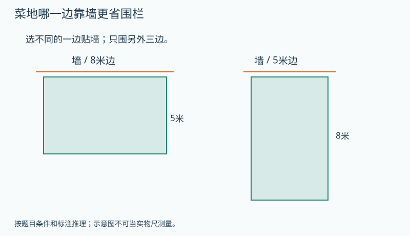

   图的文字备份：同一8米×5米菜地：左图8米边贴墙，右图旋转摆放使5米边贴墙。靠墙边不围，其余三边都围。

   提示1（按需展开）：先把贴墙的那条边划掉，再沿另外三边走。
   提示2（按需展开）：两种摆法分别有几条8米边、几条5米边需要围？
   答案：8米边靠墙需18米，5米边靠墙需21米；长边靠墙省3米。 理由：8米边靠墙时要围8+5+5=18；5米边靠墙时要围8+8+5=21。都可从完整周长26中减去实际靠墙的那一边，不能直接把完整周长当所购围栏长。
9. 【独立回顾】〔G3-L03-B02-P09；auto_checked〕〔第1天独立回顾〕一个长方形长9厘米、宽4厘米，周长多少？
   答案：26厘米。 理由：9+4+9+4=26。
10. 【独立回顾】〔G3-L03-B02-P10；auto_checked〕〔第3天独立回顾〕“长方形周长就是长加宽”漏掉了哪部分？
   答案：漏了另一条长边和另一条宽边。 理由：围完整一圈必须走过四条边。
11. 【独立回顾】〔G3-L03-B02-P11；auto_checked〕〔第7天独立回顾〕花坛长8米、宽5米，围栏留一个2米宽的入口，需要多少米围栏？
   答案：24米。 理由：完整周长26米，入口不装围栏，减去2米。
12. 【独立回顾】〔G3-L03-B02-P12；auto_checked〕〔第21天独立回顾〕为什么求围栏长度不能只算长乘宽？
   答案：长乘宽得到内部面积，围栏需要沿外边界的长度。 理由：两种问题测量的对象不同。

**练习安排：**12题是题库：P01–P08当堂备选，一次选3–5题；P09–P12分别第1、3、7、21天出现，不得提前展示。选学挑战不影响基础完成。

**本课基础怎样走向提升：**基础过关后，本课提升与关联思维卡合计最多选一道；需要多个任务才讲清的可分次，允许跳过提升继续教材主线。
**实际提升题：**G3-L03-B02-P08
**要观察的思考：**现实约束决定哪些边属于所求量，并比较两种方案。
**关联思维卡：**G3-L03-TH1
**掌握证据边界：**P09–P12用于本课原有目标的分日回顾，不因基础回顾通过就判新提升已掌握。看过答案的原题不再作为独立证据；后续选同方法、条件有变化的题单独记录，暂无对应独立题时标待迁移。

**证据边界：**本稿提供参考答案与数量理由，尚不是可执行评分器。首答、自查后的最终答和帮助等级分开保存；开放解释须成人确认。AI复核不计为教师人工审定或Kevin试学。

**易错：**把长乘宽就能得到围栏长度。 → 周长是线段相加；数清实际需要围住的边。

**Kevin复述：**不看公式，用走一圈解释为什么长和宽的和还要乘2。

**后续联系：**面积课会与周长作直接对照。

##### G3-L03-E01 拼在一起以后，哪些边不再露在外面

**定位：** E；建议35分钟。来源G3-lower：印刷45–51 / PDF 51–57。
原创教案；页码锚定相关教材内容，不表示本教案题目出自教材。本课作相关内容的提升，超出教材直接要求部分见讲解边界。

**先修：**G3-L03-B02；本课实践与周长优化有教材依据。
**关联课程：**G3-L03-B02

**目标：**解释拼接周长变化，系统比较同数量方格的外边界。

**真实问题：**两个边长3厘米的方形相框并排拼成一块板，外面绕一圈需要24厘米吗？

**为什么：**拼接前共有两条相同的接缝边；拼接后它们都在内部，不属于外边界。

**模型操作：**两个3×3正方形沿整边拼成长6宽3长方形；把两条接缝标记再从外圈中划去。

**讲解：**

1. 原两块周长合24。
2. 接缝长3，被原周长计算了两次。
3. 新周长24−2×3=18；面积没有因拼接消失。

**学习层级与本次目标：**选学或诊断，不作教材基础门槛
**最低证据：**解释拼接周长变化，系统比较同数量方格的外边界。
**最低代表题：**G3-L03-E01-P01、G3-L03-E01-P03、G3-L03-E01-P04
**其他当堂备选：**G3-L03-E01-P02、G3-L03-E01-P05、G3-L03-E01-P06、G3-L03-E01-P07、G3-L03-E01-P08
**退出规则：**本次选定3道代表题能独立完成，并按本课理由说明关键关系，成人确认后记“本次达标”。自主自查改对单独记录；看过解答后改对只记订正。任何状态都允许结束和进入其他课；不是解锁条件。
**暂停与回补：**同一关系连续两次仍需步骤提示，停止加题，回到本课具体模型或建议先修；也可保存位置，下次再学。不能为积分强迫做完。 回补位置：G3-L03-B02
**课次安排：**讲解与模型约12–18分钟，3道目标题约8–12分钟，复述/自查约3–5分钟；可提前停止。
**共享概念：**measure.perimeter-join（deepen）

**教具行为规约（尚未实现）：**

| 环节 | 具体行为与证据 |
|---|---|
| 初始状态 | 两块3厘米正方形分开，共8条边；接缝各有颜色。 |
| Kevin动作 | 沿完整边拼接，再只点仍在外边界的边。 |
| 可观察变化 | 合周长24减两段3，得18；内部接缝不计。 |
| 追问 | 用两种颜色指出接缝为什么要减两次。 |
| 预期解释 | 拼接前共有两条相同的接缝边；拼接后它们都在内部，不属于外边界。 |
| 错误动作反馈 | 只减3时分别追踪原来两条边，解释两条都变成内部。 |
| 撤除教具后 | 先收起模型、提示和例题答案，显示独立题；不把操纵成功直接记为掌握。 独立题G3-L03-E01-P04：去掉接缝只减一次对吗？ |
| 独立题参考 | 不对；拼前两个图形各算了一次。 |

本题预留到教具撤除后，早先选题跳过它；若已曝光则只记练习，改选未曝光且经审核的同目标题，题库耗尽时成人确认，不伪造独立证据。
如本操作尚无可执行教具，先展示准确的前后两图或用实体材料，并明确标为演示/线下操作。不得让不可操作图片冒充拖拽。
**自查动作：**重新读所求的量；核对条件和每步关系；用本课模型、逆算或合理范围检查结果。
**记录：**首答提交后先自行检查再确认最终答；首次答案不可覆盖，未反馈正确答案前的自主纠错可独立记录。

**原创例题：**两块边长3厘米正方形沿一条完整边拼接，新外周长多少？

1. 合计周长12+12=24。
2. 减掉两次接缝3厘米。

答案：18厘米。

**练习与讲评：**

1. 【基础】〔G3-L03-E01-P01；auto_checked〕两个边长1的小方格并排，外周长几？
   答案：6 理由：8−2。
2. 【基础】〔G3-L03-E01-P02；auto_checked〕三个边长1小方格排直线，外周长几？
   答案：8 理由：长3宽1。
3. 【变式】〔G3-L03-E01-P03；auto_checked〕四个小方格排1×4与2×2，外周长分别几？
   答案：10和8 理由：内部接缝数量不同。
4. 【变式】〔G3-L03-E01-P04；auto_checked〕去掉接缝只减一次对吗？
   答案：不对 理由：拼前两个图形各算了一次。
5. 【迁移】〔G3-L03-E01-P05；auto_checked〕12张单位方纸拼成1×12、2×6、3×4，哪种外边最短？
   答案：3×4，周长14 理由：另外26与16。
6. 【挑战】〔G3-L03-E01-P06；auto_checked〕一块长方形角上挖掉一个小长方形，外周长一定减小吗？
   答案：不一定，贴着角挖时可不变 理由：拿走的两段外边与新增两段内凹边可等长。
7. 【补充变式】〔G3-L03-E01-P07；auto_checked〕两个边长3厘米的正方形沿完整一边拼成长方形，拼成图形的周长多少？
   答案：18厘米。 理由：原周长共24厘米，接缝3厘米在两块各算一次，要减6。
8. 【选学提升】〔G3-L03-E01-P08；auto_checked〕两个边长3厘米的正方形纸片不重叠地拼在一起。一种让完整的一条边贴合，另一种只让两个角碰到。分别沿拼后露在外面的所有边走一遍，总边长各多少？为什么第二种不能也减去两条3厘米边？
   提示1（按需展开）：用彩笔沿真正露在外面的边描一遍。
   提示2（按需展开）：只碰一个角，是否有整段3厘米边藏到里面了？
   答案：整边贴合为18厘米；只碰角时两片外露边长合计24厘米。 理由：两片原周长共24。整边贴合隐藏两条3厘米边，减6得18；只碰一个点没有任何正长度的边被隐藏，仍为24。第二种说的是两片外露边的合计，不把它误称为单个长方形。
9. 【独立回顾】〔G3-L03-E01-P09；auto_checked〕〔第1天独立回顾〕两个边长2厘米的小正方形仅在一个顶点接触，外露边总长度是多少？
   答案：16厘米。 理由：没有共用完整边，原来8条边都仍外露。
10. 【独立回顾】〔G3-L03-E01-P10；auto_checked〕〔第3天独立回顾〕“两个图形拼接，周长永远相加”对吗？
   答案：不对。 理由：若共用边，这些边成为内部接缝，不再属于外边界。
11. 【独立回顾】〔G3-L03-E01-P11；auto_checked〕〔第7天独立回顾〕两块长4厘米、宽2厘米的纸片沿4厘米边拼接，所得图形周长多少？
   答案：16厘米。 理由：拼成4×4正方形，也可24−2×4。
12. 【独立回顾】〔G3-L03-E01-P12；auto_checked〕〔第21天独立回顾〕为什么拼接时每段共同边要减两次？
   答案：拼之前它分别属于两块图形的周长，已算两次；拼后两次都不露在外面。 理由：减少量取决于被重复计入的接缝。

**练习安排：**12题是题库：P01–P08当堂备选，一次选3–5题；P09–P12分别第1、3、7、21天出现，不得提前展示。选学挑战不影响基础完成。

**本课基础怎样走向提升：**基础过关后，本课提升与关联思维卡合计最多选一道；需要多个任务才讲清的可分次，允许跳过提升继续教材主线。
**实际提升题：**G3-L03-E01-P08
**要观察的思考：**从接触点与公共边区别解释周长变化的边界。
**关联思维卡：**G3-L03-TH2
**掌握证据边界：**P09–P12用于本课原有目标的分日回顾，不因基础回顾通过就判新提升已掌握。看过答案的原题不再作为独立证据；后续选同方法、条件有变化的题单独记录，暂无对应独立题时标待迁移。

**证据边界：**本稿提供参考答案与数量理由，尚不是可执行评分器。首答、自查后的最终答和帮助等级分开保存；开放解释须成人确认。AI复核不计为教师人工审定或Kevin试学。

**易错：**拼接后周长减少，说明面积也减少。 → 一周边界与内部占地是两种量；要分别追踪。

**Kevin复述：**用两种颜色指出接缝为什么要减两次。

**后续联系：**下一单元正式区分面积，并研究同周长不同面积。

#### G3-L04 图形的面积

面积与单位、长方正方面积、单位进率、分割补形、周长面积对照。

**本章思维收尾（选学，每次最多一道）：**[本章提升：沿对角线剪开，面积怎么办](#g3-l04-th1)；[奥数思想选学：九宫格里不只九个正方形](#g3-l04-th2)

##### G3-L04-B01 铺满里面，需要多少个小方块

**定位：** B；建议35分钟。来源G3-lower：印刷52–55 / PDF 58–61。
原创教案；页码锚定相关教材内容，不表示本教案题目出自教材。

**先修：**G3-L03-B02。
**关联课程：**G3-L03-B02

**目标：**把面积理解为覆盖内部的大小，建立统一平方单位。

**真实问题：**同一个花坛既要围栏又要铺地砖，为什么要算两个不同的数？

**为什么：**围栏量边界长度，地砖覆盖内部；使用同样大小的方块才能公平比较覆盖量。

**模型操作：**长4格宽3格的格图：用手沿边走一圈，再逐格涂满12格，明确两种动作。

**讲解：**

1. 先比较重叠或数格覆盖。
2. 大小不同的方块数不能直接比较面积。
3. 规定边长1厘米的方形为1平方厘米，边长1米的方形为1平方米。

**学习层级与本次目标：**教材基础
**最低证据：**把面积理解为覆盖内部的大小，建立统一平方单位。
**最低代表题：**G3-L04-B01-P01、G3-L04-B01-P02、G3-L04-B01-P03
**其他当堂备选：**G3-L04-B01-P04、G3-L04-B01-P05、G3-L04-B01-P06、G3-L04-B01-P07、G3-L04-B01-P08
**退出规则：**本次选定3道代表题能独立完成，并按本课理由说明关键关系，成人确认后记“本次达标”。自主自查改对单独记录；看过解答后改对只记订正。任何状态都允许结束和进入其他课；不是解锁条件。
**暂停与回补：**同一关系连续两次仍需步骤提示，停止加题，回到本课具体模型或建议先修；也可保存位置，下次再学。不能为积分强迫做完。 回补位置：G3-L03-B02
**课次安排：**讲解与模型约12–18分钟，3道目标题约8–12分钟，复述/自查约3–5分钟；可提前停止。
**共享概念：**measure.area-unit（first）

**教具行为规约（尚未实现）：**

| 环节 | 具体行为与证据 |
|---|---|
| 初始状态 | 4列3行格图，每格1平方厘米；描边和铺内部为两种按钮。 |
| Kevin动作 | 先描外圈再用单位方块无缝铺满内部，给两个量各命名。 |
| 可观察变化 | 面积12平方厘米，边界14厘米，单位和动作不同。 |
| 追问 | 用花坛解释买围栏与买地砖分别需要知道什么。 |
| 预期解释 | 围栏量边界长度，地砖覆盖内部；使用同样大小的方块才能公平比较覆盖量。 |
| 错误动作反馈 | 把铺12格当周长时将光标从格内移到边上，问材料覆盖哪里。 |
| 撤除教具后 | 先收起模型、提示和例题答案，显示独立题；不把操纵成功直接记为掌握。 独立题G3-L04-B01-P03：甲用10块大砖，乙用12块小砖，就能说乙面积大吗？ |
| 独立题参考 | 不能；单位砖大小不同。 |

本题预留到教具撤除后，早先选题跳过它；若已曝光则只记练习，改选未曝光且经审核的同目标题，题库耗尽时成人确认，不伪造独立证据。
如本操作尚无可执行教具，先展示准确的前后两图或用实体材料，并明确标为演示/线下操作。不得让不可操作图片冒充拖拽。
**自查动作：**重新读所求的量；核对条件和每步关系；用本课模型、逆算或合理范围检查结果。
**记录：**首答提交后先自行检查再确认最终答；首次答案不可覆盖，未反馈正确答案前的自主纠错可独立记录。

**原创例题：**一个图形铺满需12块1平方厘米方纸，另一个需9块同样方纸，哪个面积大？

1. 单位相同，比较所需块数。
2. 12>9。

答案：第一个大3平方厘米。

**练习与讲评：**

1. 【基础】〔G3-L04-B01-P01；auto_checked〕1平方厘米的小方形边长多少？
   答案：1厘米 理由：平方单位的定义。
2. 【基础】〔G3-L04-B01-P02；auto_checked〕无重叠无空隙铺了7块1平方厘米纸，面积多少？
   答案：7平方厘米 理由：7个同样面积单位。
3. 【变式】〔G3-L04-B01-P03；auto_checked〕甲用10块大砖，乙用12块小砖，就能说乙面积大吗？
   答案：不能 理由：单位砖大小不同。
4. 【变式】〔G3-L04-B01-P04；auto_checked〕描图形外圈是在量面积吗？
   答案：不是 理由：那是在追踪周长。
5. 【迁移】〔G3-L04-B01-P05；auto_checked〕同一个桌面铺纸要估计面积，贴桌边防撞条要估计什么？
   答案：周长或需贴的边长 理由：材料覆盖的位置不同。
6. 【挑战】〔G3-L04-B01-P06；auto_checked〕把同一张纸剪成两块再拼好，没有空隙重叠，面积变吗？
   答案：不变 理由：覆盖单位的总量守恒。
7. 【补充变式】〔G3-L04-B01-P07；auto_checked〕甲用边长1厘米的方格铺满纸片，乙用更大的方格铺同一纸片。谁需要的格数通常更多？
   答案：甲。 理由：单位面积更小，同一总面积需要更多个单位。
8. 【选学提升】〔G3-L04-B01-P08；auto_checked〕两张纸都用同一种1平方厘米小方格测量。甲正好覆盖12整格；乙覆盖8整格，另有8个恰好半格的部分，这些半格不重叠。能因乙只有8整格就说它面积小吗？请把半格成对拼起来比较。

   题面配图：

   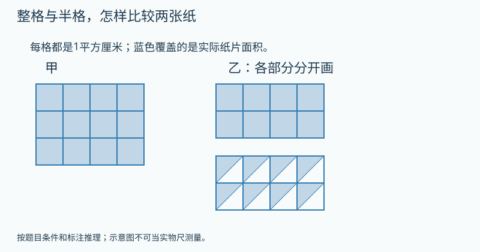

   图的文字备份：甲覆盖12整格，乙覆盖8整格及8个沿对角线切出的半格；所有原方格均为1平方厘米，乙的各部分不重叠。

   提示1（按需展开）：不能把没有满一格的部分当成0。
   提示2（按需展开）：每两个半格合起来有多大？
   答案：不能；两张面积相等，都是12平方厘米。 理由：乙的8个半格可两两合成4整格，所以8+4=12。比较面积要包括所有覆盖部分，而不是只数完整格。
9. 【独立回顾】〔G3-L04-B01-P09；auto_checked〕〔第1天独立回顾〕一个图形由7个不重叠的1平方厘米方格组成，面积多少？
   答案：7平方厘米。 理由：每个单位方格覆盖1平方厘米。
10. 【独立回顾】〔G3-L04-B01-P10；auto_checked〕〔第3天独立回顾〕把一个纸片剪成两块再无缝无重叠地拼起来，总面积会因为形状变了就增加吗？
   答案：不会。 理由：没有添加、丢失或重叠任何一部分。
11. 【独立回顾】〔G3-L04-B01-P11；auto_checked〕〔第7天独立回顾〕桌面长50厘米、宽40厘米，铺边长10厘米的方形垫片，正好要多少块？
   答案：20块。 理由：长边5块、宽边4块，共5×4。
12. 【独立回顾】〔G3-L04-B01-P12；auto_checked〕〔第21天独立回顾〕面积单位为什么需要说“平方厘米”，不能只说“厘米”？
   答案：厘米计长度，平方厘米计边长1厘米方块覆盖的大小。 理由：单位要反映测量的是边还是面。

**练习安排：**12题是题库：P01–P08当堂备选，一次选3–5题；P09–P12分别第1、3、7、21天出现，不得提前展示。选学挑战不影响基础完成。

**本课基础怎样走向提升：**基础过关后，本课提升与关联思维卡合计最多选一道；需要多个任务才讲清的可分次，允许跳过提升继续教材主线。
**实际提升题：**G3-L04-B01-P08
**要观察的思考：**把零碎部分等积拼补，面积是覆盖量而非整格计数。
**关联思维卡：**先使用本课列出的提升题，不额外开重复专题
**掌握证据边界：**P09–P12用于本课原有目标的分日回顾，不因基础回顾通过就判新提升已掌握。看过答案的原题不再作为独立证据；后续选同方法、条件有变化的题单独记录，暂无对应独立题时标待迁移。

**证据边界：**本稿提供参考答案与数量理由，尚不是可执行评分器。首答、自查后的最终答和帮助等级分开保存；开放解释须成人确认。AI复核不计为教师人工审定或Kevin试学。

**易错：**两个数字都表示图形大小，所以周长和面积可以直接比较。 → 两者量的对象与单位不同，不能说周长“比面积大”。

**Kevin复述：**用花坛解释买围栏与买地砖分别需要知道什么。

**后续联系：**下一课从数行列推导面积公式。

##### G3-L04-B02 长乘宽为什么得到面积

**定位：** B；建议35分钟。来源G3-lower：印刷56–57 / PDF 62–63。
原创教案；页码锚定相关教材内容，不表示本教案题目出自教材。

**先修：**G3-L04-B01；乘除。
**关联课程：**G3-L04-B01

**目标：**把长方形面积公式连接到单位方格的行列计数。

**真实问题：**长6米宽4米的地面铺1平方米方砖，需要几块？

**为什么：**每行6块、共4行，乘法缩短的是重复计数；长宽必须使用相同长度单位。

**模型操作：**画6列4行格子，先数一行，再数行数；将6米、4米与格数对应。

**讲解：**

1. 边长1米的单位砖沿长铺6块。
2. 沿宽共有4行。
3. 6×4=24个1平方米；正方形长宽相同。

**学习层级与本次目标：**教材基础
**最低证据：**把长方形面积公式连接到单位方格的行列计数。
**最低代表题：**G3-L04-B02-P01、G3-L04-B02-P04、G3-L04-B02-P07
**其他当堂备选：**G3-L04-B02-P02、G3-L04-B02-P03、G3-L04-B02-P05、G3-L04-B02-P06、G3-L04-B02-P08
**退出规则：**本次选定3道代表题能独立完成，并按本课理由说明关键关系，成人确认后记“本次达标”。自主自查改对单独记录；看过解答后改对只记订正。任何状态都允许结束和进入其他课；不是解锁条件。
**暂停与回补：**同一关系连续两次仍需步骤提示，停止加题，回到本课具体模型或建议先修；也可保存位置，下次再学。不能为积分强迫做完。 回补位置：G3-L04-B01
**课次安排：**讲解与模型约12–18分钟，3道目标题约8–12分钟，复述/自查约3–5分钟；可提前停止。
**共享概念：**measure.area-array（deepen）

**教具行为规约（尚未实现）：**

| 环节 | 具体行为与证据 |
|---|---|
| 初始状态 | 6米×4米长方形网格，每格1平方米。 |
| Kevin动作 | 先填一行6格，再复制为4行，计全部单位格。 |
| 可观察变化 | 6×4=24平方米，行长与行数决定格数。 |
| 追问 | 长方形每行6块方砖，共4行，为什么用6×4求总块数？ |
| 预期解释 | 每行6块、共4行，乘法缩短的是重复计数；长宽必须使用相同长度单位。 |
| 错误动作反馈 | 只数边界格或把6+4当面积时逐行核对遗漏的内部格。 |
| 撤除教具后 | 先收起模型、提示和例题答案，显示独立题；不把操纵成功直接记为掌握。 独立题G3-L04-B02-P07：长方形每行摆8个1平方厘米方格，摆5行，面积多少？ |
| 独立题参考 | 40平方厘米。；8×5=40，数的是单位方格总数。 |

本题预留到教具撤除后，早先选题跳过它；若已曝光则只记练习，改选未曝光且经审核的同目标题，题库耗尽时成人确认，不伪造独立证据。
如本操作尚无可执行教具，先展示准确的前后两图或用实体材料，并明确标为演示/线下操作。不得让不可操作图片冒充拖拽。
**自查动作：**重新读所求的量；核对条件和每步关系；用本课模型、逆算或合理范围检查结果。
**记录：**首答提交后先自行检查再确认最终答；首次答案不可覆盖，未反馈正确答案前的自主纠错可独立记录。

**原创例题：**6米×4米地面面积多少？

1. 每行6个1平方米方格。
2. 4行共6×4=24。

答案：24平方米。

**练习与讲评：**

1. 【基础】〔G3-L04-B02-P01；auto_checked〕长5厘米宽3厘米面积多少？
   答案：15平方厘米 理由：5列3行。
2. 【基础】〔G3-L04-B02-P02；auto_checked〕边长7米正方形面积多少？
   答案：49平方米 理由：7×7。
3. 【变式】〔G3-L04-B02-P03；auto_checked〕长2米宽30厘米，能直接2×30得60平方米吗？
   答案：不能 理由：先统一单位，200×30=6000平方厘米。
4. 【变式】〔G3-L04-B02-P04；auto_checked〕面积24平方厘米、长6厘米，宽多少？
   答案：4厘米 理由：24÷6。
5. 【迁移】〔G3-L04-B02-P05；auto_checked〕长8米宽5米地面每平方米需2块砖，共几块？
   答案：80块 理由：先40平方米，再×2。
6. 【挑战】〔G3-L04-B02-P06；auto_checked〕长宽都扩大2倍，面积只扩大2倍吗？
   答案：不是，扩大4倍 理由：行内块数与行数都变2倍。
7. 【补充变式】〔G3-L04-B02-P07；auto_checked〕长方形每行摆8个1平方厘米方格，摆5行，面积多少？
   答案：40平方厘米。 理由：8×5=40，数的是单位方格总数。
8. 【选学提升】〔G3-L04-B02-P08；auto_checked〕长方形纸原来长6厘米、宽4厘米。现把长增加2厘米、宽减少1厘米。面积一定变大吗？先画两张方格图再比较；如果改为只增加长、宽不变，又会怎样？
   提示1（按需展开）：长变了，宽是否也在变？
   提示2（按需展开）：分别按6×4和8×3画方格，比较覆盖格数。
   答案：同时改变后仍24平方厘米；只增长则变为32平方厘米。 理由：原面积6×4=24；新面积8×3=24，长变大但行数减少，两种作用抵消。只增长为8×4=32。不能只看一个方向判断面积。
9. 【独立回顾】〔G3-L04-B02-P09；auto_checked〕〔第1天独立回顾〕边长9厘米的正方形面积是多少？
   答案：81平方厘米。 理由：9行、每行9个单位方格。
10. 【独立回顾】〔G3-L04-B02-P10；auto_checked〕〔第3天独立回顾〕“长方形长增加2厘米，面积一定增加2平方厘米”对吗？
   答案：不对。 理由：增加的长条面积等于2乘原来的宽，宽不同增加量不同。
11. 【独立回顾】〔G3-L04-B02-P11；auto_checked〕〔第7天独立回顾〕长6米、宽4米的地面，铺边长1米方砖且不留缝，需要多少块？
   答案：24块。 理由：地面可排4行，每行6块。
12. 【独立回顾】〔G3-L04-B02-P12；auto_checked〕〔第21天独立回顾〕为什么长方形面积用乘法而不是把四条边相加？
   答案：内部方格按行列组成等量组，相乘能数出全部；四边相加只量外圈。 理由：计算方法来自被测量的结构。

**练习安排：**12题是题库：P01–P08当堂备选，一次选3–5题；P09–P12分别第1、3、7、21天出现，不得提前展示。选学挑战不影响基础完成。

**本课基础怎样走向提升：**基础过关后，本课提升与关联思维卡合计最多选一道；需要多个任务才讲清的可分次，允许跳过提升继续教材主线。
**实际提升题：**G3-L04-B02-P08
**要观察的思考：**两个变量同时变化时用模型比较，避免单因素直觉。
**关联思维卡：**G3-L04-TH1、G3-L04-TH2
**掌握证据边界：**P09–P12用于本课原有目标的分日回顾，不因基础回顾通过就判新提升已掌握。看过答案的原题不再作为独立证据；后续选同方法、条件有变化的题单独记录，暂无对应独立题时标待迁移。

**证据边界：**本稿提供参考答案与数量理由，尚不是可执行评分器。首答、自查后的最终答和帮助等级分开保存；开放解释须成人确认。AI复核不计为教师人工审定或Kevin试学。

**易错：**面积公式是无理由的口诀。 → 画出每行多少个单位方格、有多少行，公式才有含义。

**Kevin复述：**长方形每行6块方砖，共4行，为什么用6×4求总块数？

**后续联系：**下一课解释平方单位换算与分割补形。

##### G3-L04-B03 分割、拼补和换单位，面积怎样保持一致

**定位：** B；建议35分钟。来源G3-lower：印刷58–64 / PDF 64–70。
原创教案；页码锚定相关教材内容，不表示本教案题目出自教材。

**先修：**G3-L04-B02；本课分次完成单位与拼补两组任务。
**关联课程：**G3-L04-B02

**目标：**解释相邻常用面积单位进率100，比较同面积/同周长图形。

**真实问题：**边长1分米的方纸，为什么能铺100个平方厘米，而不是10个？

**为什么：**两条方向都细分为10格，所以总单位数是10×10；图形分割后总面积也要按覆盖部分相加减。

**模型操作：**1分米方纸画10列10行；另画长8宽5大矩形，角上剪去长3宽2矩形。

**讲解：**

1. 1平方分米=100平方厘米，同理1平方米=100平方分米。
2. 剪去6平方厘米，大矩形40还剩34。
3. 周长应重新描外圈，不能从面积变化推断周长变化。

**学习层级与本次目标：**教材基础
**最低证据：**能用10行10列解释相邻常用面积单位进率100，并独立完成换算；剪拼与同周长/同面积比较为第二次选学目标。
**最低代表题：**G3-L04-B03-P01、G3-L04-B03-P02、G3-L04-B03-P03
**其他当堂备选：**G3-L04-B03-P04、G3-L04-B03-P05、G3-L04-B03-P06、G3-L04-B03-P07、G3-L04-B03-P08
**退出规则：**本次选定3道代表题能独立完成，并按本课理由说明关键关系，成人确认后记“本次达标”。自主自查改对单独记录；看过解答后改对只记订正。任何状态都允许结束和进入其他课；不是解锁条件。
**暂停与回补：**同一关系连续两次仍需步骤提示，停止加题，回到本课具体模型或建议先修；也可保存位置，下次再学。不能为积分强迫做完。 回补位置：G3-L04-B02
**课次安排：**第一次学习面积单位进率，选P01/P02/P03。 第二次选择剪拼与周长比较，选P04/P05/P06；不影响单位换算目标。
**共享概念：**measure.square-unit-conversion（deepen）

**教具行为规约（尚未实现）：**

| 环节 | 具体行为与证据 |
|---|---|
| 初始状态 | 1分米正方形，长宽各10厘米；另有8×5角剪3×2的卡。 |
| Kevin动作 | 先沿两个方向细分10×10格；第二小次在角部剪下小矩形并描新边界。 |
| 可观察变化 | 1平方分米为100平方厘米；剪角后面积34、周长26，两种量变化不同。 |
| 追问 | 用10×10格解释100，并指出这里为什么不能只算一排。 |
| 预期解释 | 两条方向都细分为10格，所以总单位数是10×10；图形分割后总面积也要按覆盖部分相加减。 |
| 错误动作反馈 | 只写10时显示还未数的9行；把周长没变当面积没变时对照被剪掉6格。 |
| 撤除教具后 | 先收起模型、提示和例题答案，显示独立题；不把操纵成功直接记为掌握。 独立题G3-L04-B03-P03：1分米=10厘米，能推出1平方分米=10平方厘米吗？ |
| 独立题参考 | 不能；要算10×10。 |

本题预留到教具撤除后，早先选题跳过它；若已曝光则只记练习，改选未曝光且经审核的同目标题，题库耗尽时成人确认，不伪造独立证据。
如本操作尚无可执行教具，先展示准确的前后两图或用实体材料，并明确标为演示/线下操作。不得让不可操作图片冒充拖拽。
**自查动作：**重新读所求的量；核对条件和每步关系；用本课模型、逆算或合理范围检查结果。
**记录：**首答提交后先自行检查再确认最终答；首次答案不可覆盖，未反馈正确答案前的自主纠错可独立记录。

**原创例题：**8×5厘米长方形角上剪去3×2厘米小长方形，剩余面积与周长多少？

1. 面积40−6=34。
2. 角上移走外边3和2，同时新增内凹边3和2，周长仍26。

答案：面积34平方厘米，周长26厘米。

**练习与讲评：**

1. 【基础】〔G3-L04-B03-P01；auto_checked〕2平方分米是多少平方厘米？
   答案：200平方厘米 理由：每平方分米100。
2. 【基础】〔G3-L04-B03-P02；auto_checked〕300平方分米是多少平方米？
   答案：3平方米 理由：300÷100。
3. 【变式】〔G3-L04-B03-P03；auto_checked〕1分米=10厘米，能推出1平方分米=10平方厘米吗？
   答案：不能 理由：要算10×10。
4. 【变式】〔G3-L04-B03-P04；auto_checked〕面积都是12的1×12和3×4，周长一样吗？
   答案：不一样，26与14 理由：面积相同不决定边界长度。
5. 【迁移】〔G3-L04-B03-P05；auto_checked〕周长16的长方形，长宽为7与1、6与2、5与3、4与4，哪个面积最大？
   答案：4×4=16 理由：逐一算7、12、15、16。
6. 【挑战】〔G3-L04-B03-P06；auto_checked〕剪掉角上一块后周长不变，能说没剪掉面积吗？
   答案：不能 理由：新增边补回周长，但内部确实减少。
7. 【补充变式】〔G3-L04-B03-P07；auto_checked〕3平方分米等于多少平方厘米？
   答案：300平方厘米。 理由：每平方分米含10×10个平方厘米。
8. 【选学提升】〔G3-L04-B03-P08；auto_checked〕一张8厘米长、5厘米宽的长方形纸，从角上剪去一块3厘米长、2厘米宽的小长方形，小块两条边沿原纸两条边。剩下面积多少，周长与原来相比怎样？请分别标出消失的边与新露出的边。

   题面配图：

   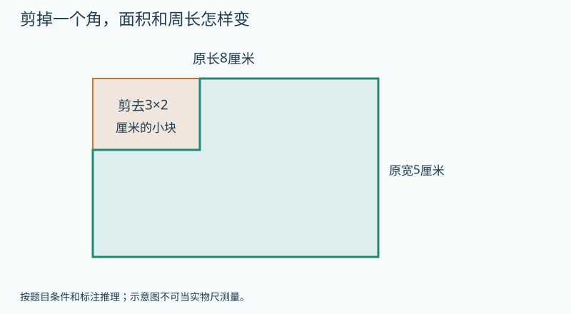

   图的文字备份：8×5厘米长方形左上角剪去3×2厘米小长方形，剪去的两条边沿原长方形两条边；橙线标出剪去的原边，绿线表示剩余形状。

   提示1（按需展开）：一支笔圈内部剪掉的面积，另一支描新边界。
   提示2（按需展开）：原来消失的3与2，是否在缺口上重新出现？
   答案：面积34平方厘米；周长仍26厘米。 理由：面积40减6为34。角上原边去掉3和2，同时缺口新露出3和2，总边长一减一增抵消。面积减少不意味着周长一定减少。
9. 【独立回顾】〔G3-L04-B03-P09；auto_checked〕〔第1天独立回顾〕500平方厘米等于多少平方分米？
   答案：5平方分米。 理由：每100平方厘米换成1平方分米。
10. 【独立回顾】〔G3-L04-B03-P10；auto_checked〕〔第3天独立回顾〕“1平方分米=10平方厘米，因为1分米=10厘米”错在哪？
   答案：只换算了一条边；应为100平方厘米。 理由：单位方形的长和宽都扩大10倍。
11. 【独立回顾】〔G3-L04-B03-P11；auto_checked〕〔第7天独立回顾〕一张长8厘米、宽5厘米的纸，剪成两块再无重叠拼成另一形状，面积是多少？
   答案：40平方厘米。 理由：剪拼保持全部纸片，面积不增不减。
12. 【独立回顾】〔G3-L04-B03-P12；auto_checked〕〔第21天独立回顾〕把面积单位从平方分米改为平方厘米，为什么数字会乘100？
   答案：每个大单位内有10行10列小单位，共100个。 理由：平方单位的进率来自两个方向同时细分。

**练习安排：**12题是题库：P01–P08当堂备选，一次选3–5题；P09–P12分别第1、3、7、21天出现，不得提前展示。选学挑战不影响基础完成。

**本课基础怎样走向提升：**基础过关后，本课提升与关联思维卡合计最多选一道；需要多个任务才讲清的可分次，允许跳过提升继续教材主线。
**实际提升题：**G3-L04-B03-P08
**要观察的思考：**同一剪切同时追踪面积与边界，避免混同两种量。
**关联思维卡：**先使用本课列出的提升题，不额外开重复专题
**掌握证据边界：**P09–P12用于本课原有目标的分日回顾，不因基础回顾通过就判新提升已掌握。看过答案的原题不再作为独立证据；后续选同方法、条件有变化的题单独记录，暂无对应独立题时标待迁移。

**证据边界：**本稿提供参考答案与数量理由，尚不是可执行评分器。首答、自查后的最终答和帮助等级分开保存；开放解释须成人确认。AI复核不计为教师人工审定或Kevin试学。

**易错：**相邻长度单位进率10，所以面积单位也进率10。 → 平方单位由两个方向共同细分。

**Kevin复述：**用10×10格解释100，并指出这里为什么不能只算一排。

**后续联系：**五年级多边形面积用分割、转化深化，本课只处理矩形拼补。

#### G3-L05 数据的收集与整理

调查、分类记录、单复式统计表、按标准分组、比较与表达；不把平均数提前当主课。

**本章思维收尾（选学，每次最多一道）：**[本章提升：统计表空着的格子怎样补](#g3-l05-th1)；[奥数思想选学：十票分给三种游戏，能保证什么](#g3-l05-th2)

##### G3-L05-B01 先问清问题，再收集能回答它的数据

**定位：** B；建议35分钟。来源G3-lower：印刷65–68 / PDF 71–74。
原创教案；页码锚定相关教材内容，不表示本教案题目出自教材。

**先修：**整数加减和分类。
**关联课程：**依已有能力直接进入

**目标：**设计明确调查、逐项记录，用单式与复式表整理。

**真实问题：**班级要选一次集体活动地点，怎样知道大家最想去哪儿？

**为什么：**数据是针对问题收集的记录；规则含糊会让统计结果无法解释。

**模型操作：**每人只投1票，选项互斥，唱票逐一画正字；表格行是组别、列是选项。

**讲解：**

1. 先定义调查对象与每人可选几项。
2. 逐项记录，合计与参与人数核对。
3. 两组同题同规则的表可合并为复式表，不能丢失行列含义。

**学习层级与本次目标：**教材基础
**最低证据：**设计明确调查、逐项记录，用单式与复式表整理。
**最低代表题：**G3-L05-B01-P01、G3-L05-B01-P03、G3-L05-B01-P05
**其他当堂备选：**G3-L05-B01-P02、G3-L05-B01-P04、G3-L05-B01-P06、G3-L05-B01-P07、G3-L05-B01-P08
**退出规则：**本次选定3道代表题能独立完成，并按本课理由说明关键关系，成人确认后记“本次达标”。自主自查改对单独记录；看过解答后改对只记订正。任何状态都允许结束和进入其他课；不是解锁条件。
**暂停与回补：**同一关系连续两次仍需步骤提示，停止加题，回到本课具体模型或建议先修；也可保存位置，下次再学。不能为积分强迫做完。 回补位置：本课模型与已列先修
**课次安排：**讲解与模型约12–18分钟，3道目标题约8–12分钟，复述/自查约3–5分钟；可提前停止。
**共享概念：**data.collection-rule（first）

**教具行为规约（尚未实现）：**

| 环节 | 具体行为与证据 |
|---|---|
| 初始状态 | 18个虚拟名字，每人只能投一个目的地，票数初始0。 |
| Kevin动作 | 逐个投票并统计；故意重复一个名字触发核对，再按类别合计。 |
| 可观察变化 | 18张有效票应各有一个不同投票者；合计相同也仍可检查具体记录。 |
| 追问 | 为什么一次只能选一个与可以多选的票数不能直接比较？ |
| 预期解释 | 数据是针对问题收集的记录；规则含糊会让统计结果无法解释。 |
| 错误动作反馈 | 重复投票先提示哪条事实不符合规则，不按多出票给出全班偏好结论。 |
| 撤除教具后 | 先收起模型、提示和例题答案，显示独立题；不把操纵成功直接记为掌握。 独立题G3-L05-B01-P05：甲组苹果5香蕉3，乙组苹果4香蕉6，哪种水果总票多？ |
| 独立题参考 | 一样多，苹果和香蕉各9票。；需跨行合并同一列。 |

本题预留到教具撤除后，早先选题跳过它；若已曝光则只记练习，改选未曝光且经审核的同目标题，题库耗尽时成人确认，不伪造独立证据。
如本操作尚无可执行教具，先展示准确的前后两图或用实体材料，并明确标为演示/线下操作。不得让不可操作图片冒充拖拽。
**自查动作：**重新读所求的量；核对条件和每步关系；用本课模型、逆算或合理范围检查结果。
**记录：**首答提交后先自行检查再确认最终答；首次答案不可覆盖，未反馈正确答案前的自主纠错可独立记录。

**原创例题：**18人每人选一处：博物馆8人、公园6人、科技馆4人。票数怎样核对？最受欢迎是哪处？

1. 8+6+4=18，与人数相符。
2. 8最大。

答案：记录合计正确；博物馆票数最多。

**练习与讲评：**

1. 【基础】〔G3-L05-B01-P01；auto_checked〕3个完整正字记录几票？
   答案：15票 理由：每个正字5笔。
2. 【基础】〔G3-L05-B01-P02；auto_checked〕8、6、4票一共几票？
   答案：18票 理由：逐项求和。
3. 【变式】〔G3-L05-B01-P03；auto_checked〕18人每人只能选一次，却收到20票，应先做什么？
   答案：检查重复或记录错误 理由：不能直接当18人的有效投票。
4. 【变式】〔G3-L05-B01-P04；auto_checked〕允许每人选两项时，总票数一定等于人数吗？
   答案：不一定 理由：一人可能贡献多票。
5. 【迁移】〔G3-L05-B01-P05；auto_checked〕甲组苹果5香蕉3，乙组苹果4香蕉6，哪种水果总票多？
   答案：一样多，苹果和香蕉各9票。 理由：需跨行合并同一列。
6. 【选学提升】〔G3-L05-B01-P06；auto_checked〕全班20人每人选一种最喜欢的游戏。只采访了8人，其中5人选跳绳、3人选踢毽子。现在能断定跳绳在全班最多吗？请给余下12人安排一种可能的选择，让结论变成踢毽子更多。
   提示1（按需展开）：尚未采访的12人，选择是否已经知道？
   提示2（按需展开）：如果他们全部选踢毽子，全班各有多少票？
   答案：不能；例如余下12人全选踢毽子，全班就为跳绳5、踢毽子15。 理由：当前5大于3只描述已采访8人。没采访的12人可以改变名次。构造5比15的完整数据，证明全班结论尚不能确定。
7. 【补充变式】〔G3-L05-B01-P07；auto_checked〕想知道同学最喜欢哪种课间游戏，问题该问“喜欢运动吗”还是“以下游戏最喜欢哪一种”？
   答案：后者更能回答目标。 理由：前者只得到是否喜欢运动，不能区分游戏类别。
8. 【补充变式】〔G3-L05-B01-P08；auto_checked〕调查规定每人只选一种最喜欢的水果，10人却记录12票，先检查什么？
   答案：是否有人多选、重复记录或记录了非受访者。 理由：每人一票时票数应与人数一致。
9. 【独立回顾】〔G3-L05-B01-P09；auto_checked〕〔第1天独立回顾〕喜欢跳绳6人、踢毽子4人、跳房子5人，且每人只选一项，共调查多少人？
   答案：15人。 理由：三类互不重叠，6+4+5=15。
10. 【独立回顾】〔G3-L05-B01-P10；auto_checked〕〔第3天独立回顾〕“只问了自己两位好友，就知道全班最爱什么”为什么不可靠？
   答案：样本过少且可能偏向好友，不能代表全班。 理由：结论范围不能随意超过调查范围。
11. 【独立回顾】〔G3-L05-B01-P11；auto_checked〕〔第7天独立回顾〕要比较两个班喜欢球类的人数，表格除了人数还必须清楚标明什么？
   答案：两个班级及相同的调查项目或规则。 理由：统一类别和口径才能正确对照。
12. 【独立回顾】〔G3-L05-B01-P12；auto_checked〕〔第21天独立回顾〕记录调查结果为什么需要边听边记，而不只靠记忆？
   答案：避免遗漏、重复和记错，并留下可复查的记录。 理由：可靠数据来自清楚、一致的收集过程。

**练习安排：**12题是题库：P01–P08当堂备选，一次选3–5题；P09–P12分别第1、3、7、21天出现，不得提前展示。选学挑战不影响基础完成。

**本课基础怎样走向提升：**基础过关后，本课提升与关联思维卡合计最多选一道；需要多个任务才讲清的可分次，允许跳过提升继续教材主线。
**实际提升题：**G3-L05-B01-P06
**要观察的思考：**用未观测数据构造反例，而不是只回答样本不够。
**关联思维卡：**G3-L05-TH1
**掌握证据边界：**P09–P12用于本课原有目标的分日回顾，不因基础回顾通过就判新提升已掌握。看过答案的原题不再作为独立证据；后续选同方法、条件有变化的题单独记录，暂无对应独立题时标待迁移。

**证据边界：**本稿提供参考答案与数量理由，尚不是可执行评分器。首答、自查后的最终答和帮助等级分开保存；开放解释须成人确认。AI复核不计为教师人工审定或Kevin试学。

**易错：**统计表有数字，就能回答所有问题。 → 先核对调查范围、规则和表格标题。

**Kevin复述：**为什么一次只能选一个与可以多选的票数不能直接比较？

**后续联系：**下一课把连续记录按清楚的区间分组。

##### G3-L05-B02 按范围分组，边界上的数据放哪里

**定位：** B；建议35分钟。来源G3-lower：印刷69–76 / PDF 75–82。
原创教案；页码锚定相关教材内容，不表示本教案题目出自教材。

**先修：**G3-L05-B01。
**关联课程：**G3-L05-B01

**目标：**用不重叠不遗漏的区间整理数据，依据数据作有范围的结论。

**真实问题：**整理8次阅读时长，直接看一串数不容易比较，怎样分组更清楚？

**为什么：**分类减少零散信息，但每条记录应恰好落入一组；结论不能超出数据范围。

**模型操作：**阅读分钟数5、8、10、12、15、18、20、22；分0–9、10–19、20及以上三组。所有分钟数按整数分钟记录，区间两端均包含。

**讲解：**

1. 先定分组标准，写清边界。
2. 逐个划去已记数据，核对总频数。
3. 解释哪组多，不把一次调查说成永远如此。

**学习层级与本次目标：**教材基础
**最低证据：**用不重叠不遗漏的区间整理数据，依据数据作有范围的结论。
**最低代表题：**G3-L05-B02-P01、G3-L05-B02-P03、G3-L05-B02-P08
**其他当堂备选：**G3-L05-B02-P02、G3-L05-B02-P04、G3-L05-B02-P05、G3-L05-B02-P06、G3-L05-B02-P07
**退出规则：**本次选定3道代表题能独立完成，并按本课理由说明关键关系，成人确认后记“本次达标”。自主自查改对单独记录；看过解答后改对只记订正。任何状态都允许结束和进入其他课；不是解锁条件。
**暂停与回补：**同一关系连续两次仍需步骤提示，停止加题，回到本课具体模型或建议先修；也可保存位置，下次再学。不能为积分强迫做完。 回补位置：G3-L05-B01
**课次安排：**讲解与模型约12–18分钟，3道目标题约8–12分钟，复述/自查约3–5分钟；可提前停止。
**共享概念：**data.exhaustive-groups（first）

**教具行为规约（尚未实现）：**

| 环节 | 具体行为与证据 |
|---|---|
| 初始状态 | 整数分钟卡5、8、10、12、15、18、20、22，区间0–9/10–19/20及以上。 |
| Kevin动作 | 每卡拖入唯一栏，专门试10与20的边界；合计人数。 |
| 可观察变化 | 三栏2、4、2，共8；每卡恰一次。 |
| 追问 | 给出一组有重复边界的分类，再亲自修正。 |
| 预期解释 | 分类减少零散信息，但每条记录应恰好落入一组；结论不能超出数据范围。 |
| 错误动作反馈 | 边界重叠时先修改分组标签，不能让同一张卡在两栏复制。 |
| 撤除教具后 | 先收起模型、提示和例题答案，显示独立题；不把操纵成功直接记为掌握。 独立题G3-L05-B02-P08：数据8、10、15、19、20、23，按不足10、10至19、20及以上分组，各几个？ |
| 独立题参考 | 1个、3个、2个。；逐个核对边界，合计6个。 |

本题预留到教具撤除后，早先选题跳过它；若已曝光则只记练习，改选未曝光且经审核的同目标题，题库耗尽时成人确认，不伪造独立证据。
如本操作尚无可执行教具，先展示准确的前后两图或用实体材料，并明确标为演示/线下操作。不得让不可操作图片冒充拖拽。
**自查动作：**重新读所求的量；核对条件和每步关系；用本课模型、逆算或合理范围检查结果。
**记录：**首答提交后先自行检查再确认最终答；首次答案不可覆盖，未反馈正确答案前的自主纠错可独立记录。

**原创例题：**8人的阅读时长按整数分钟记录为5、8、10、12、15、18、20、22。按0–9、10–19、20及以上分组，各几人？

1. 0–9有5、8，共2。
2. 10–19有10、12、15、18，共4；其余2。

答案：分别2、4、2人。

**练习与讲评：**

1. 【基础】〔G3-L05-B02-P01；auto_checked〕阅读10分钟应放0–9还是10–19组？
   答案：10–19 理由：边界已明确。
2. 【基础】〔G3-L05-B02-P02；auto_checked〕阅读时长按0–9、10–19、20及以上分组，人数依次为2、4、2人，一共几人？
   答案：8人 理由：2+4+2核对原记录数。
3. 【变式】〔G3-L05-B02-P03；auto_checked〕分成0–10与10–20，两组有什么问题？
   答案：10会重复归类 理由：区间边界重叠。
4. 【变式】〔G3-L05-B02-P04；auto_checked〕0–9、11–19两个分组漏掉哪个整数？
   答案：10 理由：分组不能遗漏可能值。
5. 【迁移】〔G3-L05-B02-P05；auto_checked〕甲组5人中3人达标，乙组20人中8人达标，能只凭8>3说乙组整体表现更好吗？
   答案：不能直接下结论 理由：总人数不同，要继续考虑比较标准。
6. 【选学提升】〔G3-L05-B02-P06；auto_checked〕老师只保存了分组表：阅读不足10分钟的2人，10到19分钟的3人，20分钟及以上的1人。小乐说全班阅读总时长一定是80分钟。能确定吗？请列两组都符合这张表的6个整数时长，但总时长不同。

   题面配图：

   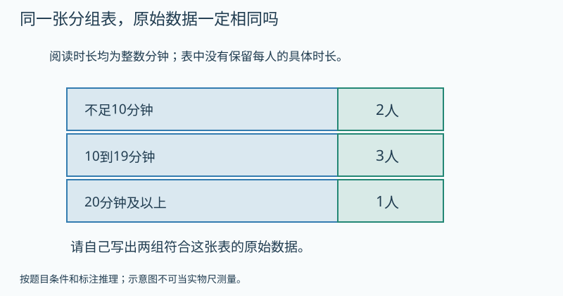

   图的文字备份：分组表只给出不足10分钟2人、10到19分钟3人、20分钟及以上1人，没有具体时长。

   提示1（按需展开）：同一范围里是否只能填一个固定时长？
   提示2（按需展开）：每个范围各选较小数与较大数，保持各组人数不变。
   答案：不能。例如5、5、10、10、10、20合计60；9、9、19、19、19、25合计100。其他符合分组且总和不同的两组也可。 理由：两组数据各有2个不足10、3个10到19、1个至少20，分组人数完全相同。分组丢掉了每人的精确时长，因此不能唯一求总时长。
7. 【补充变式】〔G3-L05-B02-P07；auto_checked〕成绩按0至9、10至19、20至29分组，19和20分别进哪组？
   答案：19进10至19组，20进20至29组。 理由：边界规定明确，每个数只归一组。
8. 【补充变式】〔G3-L05-B02-P08；auto_checked〕数据8、10、15、19、20、23，按不足10、10至19、20及以上分组，各几个？
   答案：1个、3个、2个。 理由：逐个核对边界，合计6个。
9. 【独立回顾】〔G3-L05-B02-P09；auto_checked〕〔第1天独立回顾〕身高分成“低于130厘米”和“130厘米及以上”，130厘米应放哪里？
   答案：第二组。 理由：“及以上”包括130本身。
10. 【独立回顾】〔G3-L05-B02-P10；auto_checked〕〔第3天独立回顾〕分组写“0至10”和“10至20”，会给数据10带来什么问题？
   答案：可能被两组同时收录。 理由：分组范围不能重叠，应明确一侧不包含10。
11. 【独立回顾】〔G3-L05-B02-P11；auto_checked〕〔第7天独立回顾〕8人的阅读时长为5、12、8、16、20、22、18、25分钟。至少20分钟的有几人？
   答案：3人。 理由：20、22、25都包含在至少20分钟内。
12. 【独立回顾】〔G3-L05-B02-P12；auto_checked〕〔第21天独立回顾〕把数据分组后为什么还要把各组人数相加检查？
   答案：合计应等于原始人数，可以发现漏记或重复归组。 理由：分组要覆盖全部数据且每项只计一次。

**练习安排：**12题是题库：P01–P08当堂备选，一次选3–5题；P09–P12分别第1、3、7、21天出现，不得提前展示。选学挑战不影响基础完成。

**本课基础怎样走向提升：**基础过关后，本课提升与关联思维卡合计最多选一道；需要多个任务才讲清的可分次，允许跳过提升继续教材主线。
**实际提升题：**G3-L05-B02-P06
**要观察的思考：**识别统计汇总丢失的信息，构造同表不同数据。
**关联思维卡：**G3-L05-TH2
**掌握证据边界：**P09–P12用于本课原有目标的分日回顾，不因基础回顾通过就判新提升已掌握。看过答案的原题不再作为独立证据；后续选同方法、条件有变化的题单独记录，暂无对应独立题时标待迁移。

**证据边界：**本稿提供参考答案与数量理由，尚不是可执行评分器。首答、自查后的最终答和帮助等级分开保存；开放解释须成人确认。AI复核不计为教师人工审定或Kevin试学。

**易错：**区间怎么写都行，只要最后总数差不多。 → 要求每个观测值恰好进一组，并精确核对总数。

**Kevin复述：**给出一组有重复边界的分类，再亲自修正。

**后续联系：**四年级条形统计图和平均数继续表达、比较数据；六年级才用比例比较不同人数群体。

#### G3-LP01 年、月、日的秘密

年历、大小月、平闰年、24时计时、时长、制作月历与日影记录实践。

**本章思维收尾（选学，每次最多一道）：**[本章提升：哪些星期会多出现一次](#g3-lp01-th1)；[奥数思想选学：三个连续星期一的日期之和](#g3-lp01-th2)；[奥数思想选学：来回传球，一个周期不是六次](#g3-lp01-s12)

##### G3-LP01-B01 日历为什么不能每月都排30天

**定位：** B；建议35分钟。来源G3-lower：印刷77–79 / PDF 83–85。
原创教案；页码锚定相关教材内容，不表示本教案题目出自教材。

**先修：**知道日与周，能查年历。
**关联课程：**依已有能力直接进入

**目标：**读年历，区分大小月、二月和平闰年，谨慎处理计数边界。

**真实问题：**要做生日月历，为什么不能复制一张30天的表用12次？

**为什么：**月份长度并不相同，日历把日期组织为共同规则；学习使用规则，不编造未经证实的历史起源。

**模型操作：**对照一个平年与一个闰年的年历，逐月记录天数，二月单独突出。

**讲解：**

1. 一年12月，大月31天、小月30天，二月28或29天。
2. 公历闰年一般逢4年，但整百年须能被400整除；先用真实年历检验。
3. 相隔天数与包含起止的日期个数不同，要读清问题。

**学习层级与本次目标：**教材基础
**最低证据：**读懂月份日期、大小月及给定年历中的平闰年二月；整百年规则和端点计数作为延伸，不作为本次基础达标条件。
**最低代表题：**G3-LP01-B01-P01、G3-LP01-B01-P02、G3-LP01-B01-P07
**其他当堂备选：**G3-LP01-B01-P03、G3-LP01-B01-P04、G3-LP01-B01-P05、G3-LP01-B01-P06、G3-LP01-B01-P08
**退出规则：**本次选定3道代表题能独立完成，并按本课理由说明关键关系，成人确认后记“本次达标”。自主自查改对单独记录；看过解答后改对只记订正。任何状态都允许结束和进入其他课；不是解锁条件。
**暂停与回补：**同一关系连续两次仍需步骤提示，停止加题，回到本课具体模型或建议先修；也可保存位置，下次再学。不能为积分强迫做完。 回补位置：本课模型与已列先修
**课次安排：**第一次读日历、大小月和平闰年已知资料，选P01/P02/P07。 整百年与端点计数为后续选学，不要求先会整除400。
**共享概念：**time.calendar（first）

**教具行为规约（尚未实现）：**

| 环节 | 具体行为与证据 |
|---|---|
| 初始状态 | 已给2023平年和2024闰年的真实二月月历，2月28日突出。 |
| Kevin动作 | 各向后点一天再一天；切换“经过天数”和“含首尾记录次数”。 |
| 可观察变化 | 2024先29日再3月1日，2023先3月1日再2日；间隔和端点计数分开。 |
| 追问 | 用两个连续日期说明“经过一天”为什么会涉及两个日期。 |
| 预期解释 | 月份长度并不相同，日历把日期组织为共同规则；学习使用规则，不编造未经证实的历史起源。 |
| 错误动作反馈 | 默认每月30天时指向月历末格，先读实际规则；整百年例外单列选学。 |
| 撤除教具后 | 先收起模型、提示和例题答案，显示独立题；不把操纵成功直接记为掌握。 独立题G3-LP01-B01-P07：4月有30天，4月30日的第二天是几月几日？ |
| 独立题参考 | 5月1日。；满月末日后进入下一个月。 |

本题预留到教具撤除后，早先选题跳过它；若已曝光则只记练习，改选未曝光且经审核的同目标题，题库耗尽时成人确认，不伪造独立证据。
如本操作尚无可执行教具，先展示准确的前后两图或用实体材料，并明确标为演示/线下操作。不得让不可操作图片冒充拖拽。
**自查动作：**重新读所求的量；核对条件和每步关系；用本课模型、逆算或合理范围检查结果。
**记录：**首答提交后先自行检查再确认最终答；首次答案不可覆盖，未反馈正确答案前的自主纠错可独立记录。

**原创例题：**2024年2月28日的第二天与再下一天分别哪天？2023年呢？

1. 2024是闰年，二月有29天。
2. 2023二月28天。

答案：2024：2月29日、3月1日；2023：3月1日、3月2日。

**练习与讲评：**

1. 【基础】〔G3-LP01-B01-P01；auto_checked〕一年有几个月？
   答案：12个月 理由：年历的组织单位。
2. 【基础】〔G3-LP01-B01-P02；auto_checked〕4月有多少天？
   答案：30天 理由：4月是小月。
3. 【变式】〔G3-LP01-B01-P03；auto_checked〕2024年二月与2023年二月相差几天？
   答案：1天 理由：29−28。
4. 【变式】〔G3-LP01-B01-P04；auto_checked〕“年份能被4整除就一定是闰年”对吗？
   答案：不对，如1900不是闰年 理由：整百年份还需被400整除。
5. 【迁移】〔G3-LP01-B01-P05；auto_checked〕从5月3日到5月8日，经过几天？若含这两个日期共记录几天？
   答案：经过5天；记录6个日期 理由：间隔数与端点数不同。
6. 【挑战】〔G3-LP01-B01-P06；auto_checked〕2000年与2100年都为整百年份，谁是闰年？
   答案：2000年是，2100年不是 理由：2000能被400整除，2100不能。
7. 【补充变式】〔G3-LP01-B01-P07；auto_checked〕4月有30天，4月30日的第二天是几月几日？
   答案：5月1日。 理由：满月末日后进入下一个月。
8. 【选学提升】〔G3-LP01-B01-P08；auto_checked〕2028年是闰年，2027年是平年。两年都从2月28日上午9时开始，经过整整3天，各是几月几日上午9时？请一天一天跨日期，不要把起始日期算作已经经过1天。
   提示1（按需展开）：先写每年2月28日再过1天分别是哪天。
   提示2（按需展开）：画3根“再过1天”的箭头；起点还没经过一天。
   答案：2028年为3月2日；2027年为3月3日，均上午9时。 理由：闰年依次经过到2月29日、3月1日、3月2日三个间隔；平年依次到3月1日、2日、3日。比较的是经过时长，不是包含首尾的日期个数。
9. 【独立回顾】〔G3-LP01-B01-P09；auto_checked〕〔第1天独立回顾〕7月1日至7月5日每天做一次记录，一共记录几次？
   答案：5次。 理由：起止两天都包含，不能只取日期差4。
10. 【独立回顾】〔G3-LP01-B01-P10；auto_checked〕〔第3天独立回顾〕“所有能被4整除的年份都一定是闰年”完整吗？用1900说明。
   答案：不完整；1900不是闰年。 理由：整百年还需被400整除。
11. 【独立回顾】〔G3-LP01-B01-P11；auto_checked〕〔第7天独立回顾〕一年中的31天月份有几个？列出它们。
   答案：7个：1、3、5、7、8、10、12月。 理由：其余4、6、9、11月30天，2月另算。
12. 【独立回顾】〔G3-LP01-B01-P12；auto_checked〕〔第21天独立回顾〕计算“过了多少天”和“共记录了几天”为什么可能差1？
   答案：前者量两个日期之间的间隔，后者可能连起点那天也计一次。 理由：要先明确是否同时包含起止日期。

**练习安排：**12题是题库：P01–P08当堂备选，一次选3–5题；P09–P12分别第1、3、7、21天出现，不得提前展示。选学挑战不影响基础完成。

**本课基础怎样走向提升：**基础过关后，本课提升与关联思维卡合计最多选一道；需要多个任务才讲清的可分次，允许跳过提升继续教材主线。
**实际提升题：**G3-LP01-B01-P08
**要观察的思考：**用日期间隔处理不同月长，区分日期与经过天数。
**关联思维卡：**先使用本课列出的提升题，不额外开重复专题
**掌握证据边界：**P09–P12用于本课原有目标的分日回顾，不因基础回顾通过就判新提升已掌握。看过答案的原题不再作为独立证据；后续选同方法、条件有变化的题单独记录，暂无对应独立题时标待迁移。

**证据边界：**本稿提供参考答案与数量理由，尚不是可执行评分器。首答、自查后的最终答和帮助等级分开保存；开放解释须成人确认。AI复核不计为教师人工审定或Kevin试学。

**易错：**每4年必定有一个闰年，任何年份都不用例外。 → 给出整百年份的例外；若整除判断困难可查年历，不强塞数论证明。

**Kevin复述：**用两个连续日期说明“经过一天”为什么会涉及两个日期。

**后续联系：**月历与周期思考相连，作息时间用24时制记录。

##### G3-LP01-B02 时刻是一个点，时长是一段路

**定位：** B；建议35分钟。来源G3-lower：印刷80–82 / PDF 86–88。
原创教案；页码锚定相关教材内容，不表示本教案题目出自教材。

**先修：**会读时分，60分=1时。
**关联课程：**G3-LP01-B01

**目标：**转换常用时刻与24时计时法，计算跨整时和跨日时长。

**真实问题：**下午开始的活动写“3点”，别人会不会误以为凌晨？

**为什么：**同一天的时针绕两圈，用0至24小时刻度能消除歧义；时刻与经过多久是不同量。

**模型操作：**画从0到24的时间线，标15:20和16:05；用分钟步进跨过16:00。

**讲解：**

1. 下午3时为15时；中午12时是12时，午夜0时开始新一天。
2. 从15:20到16:00有40分，再到16:05有5分。
3. 跨日拆到24:00与次日0:00，不把钟面差直接当时长。

**学习层级与本次目标：**教材基础
**最低证据：**转换常用时刻与24时计时法，计算跨整时和跨日时长。
**最低代表题：**G3-LP01-B02-P01、G3-LP01-B02-P03、G3-LP01-B02-P04
**其他当堂备选：**G3-LP01-B02-P02、G3-LP01-B02-P05、G3-LP01-B02-P06、G3-LP01-B02-P07、G3-LP01-B02-P08
**退出规则：**本次选定3道代表题能独立完成，并按本课理由说明关键关系，成人确认后记“本次达标”。自主自查改对单独记录；看过解答后改对只记订正。任何状态都允许结束和进入其他课；不是解锁条件。
**暂停与回补：**同一关系连续两次仍需步骤提示，停止加题，回到本课具体模型或建议先修；也可保存位置，下次再学。不能为积分强迫做完。 回补位置：G3-LP01-B01
**课次安排：**讲解与模型约12–18分钟，3道目标题约8–12分钟，复述/自查约3–5分钟；可提前停止。
**共享概念：**time.elapsed（first）

**教具行为规约（尚未实现）：**

| 环节 | 具体行为与证据 |
|---|---|
| 初始状态 | 时间线15:20→16:05，16:00可作中转，分钟步长明确。 |
| Kevin动作 | 先走40分钟到16:00，再走5分钟；写总时长。 |
| 可观察变化 | 合45分钟，终点为16:05，不能把时刻与时长混写。 |
| 追问 | 为什么午夜前后不能只比较钟上数字大小？ |
| 预期解释 | 同一天的时针绕两圈，用0至24小时刻度能消除歧义；时刻与经过多久是不同量。 |
| 错误动作反馈 | 将605−520式类比十进制减时提示一小时60分钟；回到分段数线。 |
| 撤除教具后 | 先收起模型、提示和例题答案，显示独立题；不把操纵成功直接记为掌握。 独立题G3-LP01-B02-P04：时刻14:00与时长14小时能混用吗？ |
| 独立题参考 | 不能；一个位置，一个持续量。 |

本题预留到教具撤除后，早先选题跳过它；若已曝光则只记练习，改选未曝光且经审核的同目标题，题库耗尽时成人确认，不伪造独立证据。
如本操作尚无可执行教具，先展示准确的前后两图或用实体材料，并明确标为演示/线下操作。不得让不可操作图片冒充拖拽。
**自查动作：**重新读所求的量；核对条件和每步关系；用本课模型、逆算或合理范围检查结果。
**记录：**首答提交后先自行检查再确认最终答；首次答案不可覆盖，未反馈正确答案前的自主纠错可独立记录。

**原创例题：**15:20开始，16:05结束，活动持续多久？

1. 15:20到16:00为40分钟。
2. 再加5分钟。

答案：45分钟。

**练习与讲评：**

1. 【基础】〔G3-LP01-B02-P01；auto_checked〕晚上8时用24时制怎么写？
   答案：20时 理由：12+8。
2. 【基础】〔G3-LP01-B02-P02；auto_checked〕17时是下午几时？
   答案：5时 理由：17−12。
3. 【变式】〔G3-LP01-B02-P03；auto_checked〕9:50到10:15经过多久？
   答案：25分钟 理由：10分加15分。
4. 【变式】〔G3-LP01-B02-P04；auto_checked〕时刻14:00与时长14小时能混用吗？
   答案：不能 理由：一个位置，一个持续量。
5. 【迁移】〔G3-LP01-B02-P05；auto_checked〕23:30出发，次日0:20到达，路上多久？
   答案：50分钟 理由：30分到午夜，再20分。
6. 【选学提升】〔G3-LP01-B02-P06；auto_checked〕13:40从家出发，走25分钟到公交站。车在14:00和14:20发车，错过就等下一班，坐车15分钟到图书馆。最早几点到图书馆，中间等车多久？请把走路、等车、乘车分成三段。

   题面配图：

   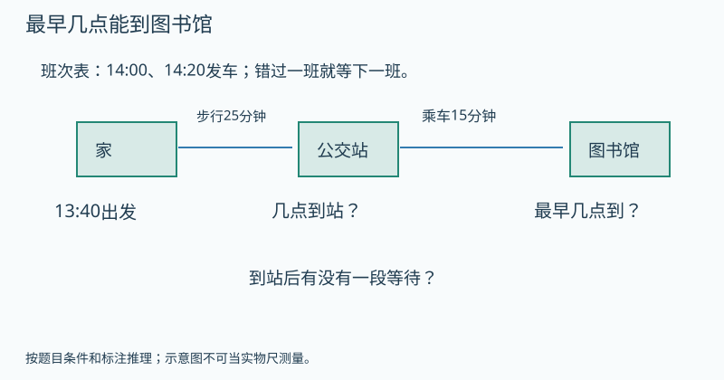

   图的文字备份：13:40从家出发，步行25分钟到站；班次14:00和14:20；上车后15分钟到图书馆。到站、等车和到馆时刻未填答案。

   提示1（按需展开）：走25分钟后是否赶得上14:00那班？
   提示2（按需展开）：把到站到下一班发车之间的空档也画进时间线。
   答案：14:35到；等车15分钟。 理由：走到车站是14:05，已错过14:00，只能等14:20；等待15分钟，再乘15分钟，到14:35。不能只把步行与乘车的40分钟加在13:40上，漏掉等车。
7. 【补充变式】〔G3-LP01-B02-P07；auto_checked〕14:35开始活动，15:10结束，持续多久？
   答案：35分钟。 理由：到15:00有25分钟，再10分钟。
8. 【补充变式】〔G3-LP01-B02-P08；auto_checked〕晚上9时20分用24时计时法怎么写？
   答案：21:20。 理由：下午和晚上相应时刻加12小时。
9. 【独立回顾】〔G3-LP01-B02-P09；auto_checked〕〔第1天独立回顾〕从23:40到次日0:15经过多少分钟？
   答案：35分钟。 理由：先20分钟到午夜，再15分钟。
10. 【独立回顾】〔G3-LP01-B02-P10；auto_checked〕〔第3天独立回顾〕“13:50到14:10是60分钟”错在哪里？
   答案：把小时差当作整个时长，正确是20分钟。 理由：分钟位置必须一起考虑。
11. 【独立回顾】〔G3-LP01-B02-P11；auto_checked〕〔第7天独立回顾〕电影16:25开始，时长95分钟，几点结束？
   答案：18:00。 理由：先加60分钟到17:25，再加35分钟。
12. 【独立回顾】〔G3-LP01-B02-P12；auto_checked〕〔第21天独立回顾〕为什么“8时”与“8小时”不是同一种说法？
   答案：8时是时刻，8小时是一段持续时间。 理由：数值相同，测量对象仍不同。

**练习安排：**12题是题库：P01–P08当堂备选，一次选3–5题；P09–P12分别第1、3、7、21天出现，不得提前展示。选学挑战不影响基础完成。

**本课基础怎样走向提升：**基础过关后，本课提升与关联思维卡合计最多选一道；需要多个任务才讲清的可分次，允许跳过提升继续教材主线。
**实际提升题：**G3-LP01-B02-P06
**要观察的思考：**时刻约束会增加等待，时间线里不能漏掉隐含的一段。
**关联思维卡：**先使用本课列出的提升题，不额外开重复专题
**掌握证据边界：**P09–P12用于本课原有目标的分日回顾，不因基础回顾通过就判新提升已掌握。看过答案的原题不再作为独立证据；后续选同方法、条件有变化的题单独记录，暂无对应独立题时标待迁移。

**证据边界：**本稿提供参考答案与数量理由，尚不是可执行评分器。首答、自查后的最终答和帮助等级分开保存；开放解释须成人确认。AI复核不计为教师人工审定或Kevin试学。

**易错：**16:05减15:20可以把05−20直接写成−15而不换单位。 → 小时和分钟进率60，用时间线或借1小时换60分钟。

**Kevin复述：**为什么午夜前后不能只比较钟上数字大小？

**后续联系：**设计一天作息表并检查活动是否重叠；日期周期作为选学。

##### G3-LP01-E01 星期循环与制作月历

**定位：** E；建议35分钟。来源G3-lower：印刷83–85 / PDF 89–91。
原创教案；页码锚定相关教材内容，不表示本教案题目出自教材。本课作相关内容的提升，超出教材直接要求部分见讲解边界。

**先修：**G3-LP01-B01、B02；有余数除法。
**关联课程：**G3-LP01-B01、G3-L02-B03

**目标：**用7天周期推算星期，结合日期规则制作并验证月历。

**真实问题：**已知某月1日是星期二，怎样不查整张日历就知道15日是星期几？

**为什么：**每过7天回到同一星期位置；余下几天决定最终变化。

**模型操作：**七个格按周一到周日排成一圈；再画真实月历，区别循环位置和日期编号。

**讲解：**

1. 15日与1日间隔14天，不是15天。
2. 14是2个完整星期，所以同为周二。
3. 扩展做日影观察日志时固定地点、时刻与测量办法，只描述数据，不把一次记录当全年规律。

**学习层级与本次目标：**选学或诊断，不作教材基础门槛
**最低证据：**用7天周期推算星期，结合日期规则制作并验证月历。
**最低代表题：**G3-LP01-E01-P01、G3-LP01-E01-P02、G3-LP01-E01-P04
**其他当堂备选：**G3-LP01-E01-P03、G3-LP01-E01-P05、G3-LP01-E01-P06、G3-LP01-E01-P07、G3-LP01-E01-P08
**退出规则：**本次选定3道代表题能独立完成，并按本课理由说明关键关系，成人确认后记“本次达标”。自主自查改对单独记录；看过解答后改对只记订正。任何状态都允许结束和进入其他课；不是解锁条件。
**暂停与回补：**同一关系连续两次仍需步骤提示，停止加题，回到本课具体模型或建议先修；也可保存位置，下次再学。不能为积分强迫做完。 回补位置：G3-LP01-B01、G3-L02-B03
**课次安排：**讲解与模型约12–18分钟，3道目标题约8–12分钟，复述/自查约3–5分钟；可提前停止。
**共享概念：**reasoning.period（first）

**教具行为规约（尚未实现）：**

| 环节 | 具体行为与证据 |
|---|---|
| 初始状态 | 周一至周日7格环，某月1日周二；31格月历为空。 |
| Kevin动作 | 走完整7天回原格，再处理余天；计算15日与18日时先求日期差。 |
| 可观察变化 | 15日相隔14天仍周二，18日相隔17天为周五。 |
| 追问 | 说清“第15天”与“过15天”为什么可能指不同日期。 |
| 预期解释 | 每过7天回到同一星期位置；余下几天决定最终变化。 |
| 错误动作反馈 | 把第15日当过15天时同时标1日已在起点，不再多走第一天。 |
| 撤除教具后 | 先收起模型、提示和例题答案，显示独立题；不把操纵成功直接记为掌握。 独立题G3-LP01-E01-P04：从1日到15日为何不是经过15天？ |
| 独立题参考 | 间隔为15−1=14；不重复计入起点。 |

本题预留到教具撤除后，早先选题跳过它；若已曝光则只记练习，改选未曝光且经审核的同目标题，题库耗尽时成人确认，不伪造独立证据。
如本操作尚无可执行教具，先展示准确的前后两图或用实体材料，并明确标为演示/线下操作。不得让不可操作图片冒充拖拽。
**自查动作：**重新读所求的量；核对条件和每步关系；用本课模型、逆算或合理范围检查结果。
**记录：**首答提交后先自行检查再确认最终答；首次答案不可覆盖，未反馈正确答案前的自主纠错可独立记录。

**原创例题：**某月1日是周二，15日与18日各周几？

1. 15−1=14，两个星期，仍周二。
2. 18比15晚3天，是周五。

答案：15日周二，18日周五。

**练习与讲评：**

1. 【基础】〔G3-LP01-E01-P01；auto_checked〕星期三过7天是星期几？
   答案：星期三 理由：完整周期回原位。
2. 【基础】〔G3-LP01-E01-P02；auto_checked〕星期三过9天是星期几？
   答案：星期五 理由：7天后再过2天。
3. 【变式】〔G3-LP01-E01-P03；auto_checked〕某月1日周日，8日周几？
   答案：周日 理由：相隔7天。
4. 【变式】〔G3-LP01-E01-P04；auto_checked〕从1日到15日为何不是经过15天？
   答案：间隔为15−1=14 理由：不重复计入起点。
5. 【迁移】〔G3-LP01-E01-P05；auto_checked〕做31天月历，1日周五，31日周几？
   答案：周日 理由：相隔30天，4周余2天。
6. 【挑战】〔G3-LP01-E01-P06；auto_checked〕比较一周日影长度，周一上午测、周二傍晚测，就能只归因于日期变化吗？
   答案：不能 理由：测量时刻等条件也改变。
7. 【补充变式】〔G3-LP01-E01-P07；auto_checked〕今天星期二，14天后星期几？
   答案：星期二。 理由：14是两个完整7天周期。
8. 【选学提升】〔G3-LP01-E01-P08；auto_checked〕某月有30天，1日是星期一。这个月星期一和星期二各出现几次，其他星期各几次？下个月1日是星期几？请把整月拆成完整的周和剩下的天。
   提示1（按需展开）：先圈出前28天的四个完整星期。
   提示2（按需展开）：第29、30天各星期几？下一天又是什么？
   答案：星期一、二各5次，其余各4次；下月1日星期三。 理由：28天正好4周，剩下29日周一、30日周二，因此这两种星期多一次。30日后的下一天才是下月1日，故周三。
9. 【独立回顾】〔G3-LP01-E01-P09；auto_checked〕〔第1天独立回顾〕今天星期三，17天后星期几？
   答案：星期六。 理由：17除以7余3，从星期三向后3天。
10. 【独立回顾】〔G3-LP01-E01-P10；auto_checked〕〔第3天独立回顾〕“某月1日到7日相差7天，所以同星期”错在哪里？
   答案：相差6天，不是7天；1日与8日才相差7天。 理由：日期差不把起点额外计入间隔。
11. 【独立回顾】〔G3-LP01-E01-P11；auto_checked〕〔第7天独立回顾〕一个30天月份的1日是星期一，下个月1日是星期几？
   答案：星期三。 理由：30除以7余2，起始星期往后2天。
12. 【独立回顾】〔G3-LP01-E01-P12；auto_checked〕〔第21天独立回顾〕制作月历为什么既要知道1日星期几，也要知道这个月有几天？
   答案：前者决定排放起点，后者决定何时结束并衔接下月。 理由：星期周期与月份长度共同确定月历。

**练习安排：**12题是题库：P01–P08当堂备选，一次选3–5题；P09–P12分别第1、3、7、21天出现，不得提前展示。选学挑战不影响基础完成。

**本课基础怎样走向提升：**基础过关后，本课提升与关联思维卡合计最多选一道；需要多个任务才讲清的可分次，允许跳过提升继续教材主线。
**实际提升题：**G3-LP01-E01-P08
**要观察的思考：**周期里的整组、余项与下一位置要分别判断。
**关联思维卡：**G3-LP01-TH1、G3-LP01-TH2、G3-LP01-S12
**掌握证据边界：**P09–P12用于本课原有目标的分日回顾，不因基础回顾通过就判新提升已掌握。看过答案的原题不再作为独立证据；后续选同方法、条件有变化的题单独记录，暂无对应独立题时标待迁移。

**证据边界：**本稿提供参考答案与数量理由，尚不是可执行评分器。首答、自查后的最终答和帮助等级分开保存；开放解释须成人确认。AI复核不计为教师人工审定或Kevin试学。

**易错：**求第几日的星期，直接把日期除以7。 → 先找与已知日期的间隔，再取周期余数。

**Kevin复述：**说清“第15天”与“过15天”为什么可能指不同日期。

**后续联系：**四年级周期余数专题扩展到图案循环；实验记录与统计相连。

#### G3-L06 小数的初步认识

一位两位小数、测量与货币联系、大小比较、一位小数简单加减；四年级再推广。

**本章思维收尾（选学，每次最多一道）：**[本章提升：正好花完4元，有不止一种买法](#g3-l06-th1)；[奥数思想选学：买至少五支，怎样最省钱](#g3-l06-th2)

##### G3-L06-B01 不足一米的部分，仍用十进制记录

**定位：** B；建议35分钟。来源G3-lower：印刷86–88 / PDF 92–94。
原创教案；页码锚定相关教材内容，不表示本教案题目出自教材。

**先修：**三上分数单位与长度关系。
**关联课程：**G3-U06-B01、G3-U03-B01

**目标：**用米分米厘米或元角分理解一位两位小数的位值。

**真实问题：**纸条长1米3分米，只用“米”怎样写，既简短又清楚？

**为什么：**十进制可以继续向小于1的单位延伸，小数点把整数部分与不足1的部分分开。

**模型操作：**1米尺等分10份为分米，再每份细分10份为厘米；用同一米作整体。

**讲解：**

1. 1分米是1/10米，写0.1米。
2. 1厘米是1/100米，写0.01米。
3. 1米3分米写1.3米，1米3厘米写1.03米，两者不同。

**学习层级与本次目标：**教材基础
**最低证据：**用米分米厘米或元角分理解一位两位小数的位值。
**最低代表题：**G3-L06-B01-P01、G3-L06-B01-P02、G3-L06-B01-P03
**其他当堂备选：**G3-L06-B01-P04、G3-L06-B01-P05、G3-L06-B01-P06、G3-L06-B01-P07、G3-L06-B01-P08
**退出规则：**本次选定3道代表题能独立完成，并按本课理由说明关键关系，成人确认后记“本次达标”。自主自查改对单独记录；看过解答后改对只记订正。任何状态都允许结束和进入其他课；不是解锁条件。
**暂停与回补：**同一关系连续两次仍需步骤提示，停止加题，回到本课具体模型或建议先修；也可保存位置，下次再学。不能为积分强迫做完。 回补位置：G3-U06-B01、G3-U03-B01
**课次安排：**讲解与模型约12–18分钟，3道目标题约8–12分钟，复述/自查约3–5分钟；可提前停止。
**共享概念：**decimal.unit（first）

**教具行为规约（尚未实现）：**

| 环节 | 具体行为与证据 |
|---|---|
| 初始状态 | 同一1米尺分10分米和100厘米，另有1米3分米及1米3厘米两绳。 |
| Kevin动作 | 把两绳分别标1.3米和1.03米，点各数字看所代表的单位。 |
| 可观察变化 | 3分米与3厘米长度不同；十分位0占位不能删。 |
| 追问 | 1.3与1.03都含1和3，为什么长短不同？ |
| 预期解释 | 十进制可以继续向小于1的单位延伸，小数点把整数部分与不足1的部分分开。 |
| 错误动作反馈 | 把1.03写1.3时两条实际长度对齐，显示多写成了27厘米。 |
| 撤除教具后 | 先收起模型、提示和例题答案，显示独立题；不把操纵成功直接记为掌握。 独立题G3-L06-B01-P03：2.05米中的5代表多少？ |
| 独立题参考 | 5厘米；5在百分位。 |

本题预留到教具撤除后，早先选题跳过它；若已曝光则只记练习，改选未曝光且经审核的同目标题，题库耗尽时成人确认，不伪造独立证据。
如本操作尚无可执行教具，先展示准确的前后两图或用实体材料，并明确标为演示/线下操作。不得让不可操作图片冒充拖拽。
**自查动作：**重新读所求的量；核对条件和每步关系；用本课模型、逆算或合理范围检查结果。
**记录：**首答提交后先自行检查再确认最终答；首次答案不可覆盖，未反馈正确答案前的自主纠错可独立记录。

**原创例题：**1米3分米与1米3厘米，分别写成小数是多少米？

1. 3分米=0.3米。
2. 3厘米=0.03米。

答案：1.3米；1.03米。

**练习与讲评：**

1. 【基础】〔G3-L06-B01-P01；auto_checked〕7分米只用米表示是多少？
   答案：0.7米 理由：7个十分之一米。
2. 【基础】〔G3-L06-B01-P02；auto_checked〕8厘米只用米表示是多少？
   答案：0.08米 理由：8个百分之一米。
3. 【变式】〔G3-L06-B01-P03；auto_checked〕2.05米中的5代表多少？
   答案：5厘米 理由：5在百分位。
4. 【变式】〔G3-L06-B01-P04；auto_checked〕0.4元与0.04元分别多少？
   答案：4角与4分 理由：十分之一元和百分之一元不同。
5. 【迁移】〔G3-L06-B01-P05；auto_checked〕标价3元6角用小数记录。
   答案：3.6元 理由：整元加十分之一元。
6. 【挑战】〔G3-L06-B01-P06；auto_checked〕0.5米和0.50米长度相同吗？
   答案：相同 理由：5分米=50厘米；此处先用测量解释。
7. 【补充变式】〔G3-L06-B01-P07；auto_checked〕一根绳长1米3分米，用米作单位写成小数。
   答案：1.3米。 理由：3分米是3个十分之一米。
8. 【选学提升】〔G3-L06-B01-P08；auto_checked〕两张价格标签分别写2.5元和2.05元。店员擦掉小数点后都想按整数理解。原来这两种价格各是几元几角几分，相差多少分？请用钱币说明0的位置。
   提示1（按需展开）：把两个价格的小数部分都换成分来比较。
   提示2（按需展开）：5角有50分；0角5分只有多少分？
   答案：2.5元是2元5角，2.05元是2元0角5分；相差45分。 理由：5角是50分，另一个只多5分，所以差45分。小数点和0标明哪一位是角、哪一位是分；不能删除后把25与205当原金额比较。
9. 【独立回顾】〔G3-L06-B01-P09；auto_checked〕〔第1天独立回顾〕把0.7米写成分米。
   答案：7分米。 理由：一位小数表示十分之一米的个数。
10. 【独立回顾】〔G3-L06-B01-P10；auto_checked〕〔第3天独立回顾〕“0.04米是4分米”正确吗？
   答案：不正确，是4厘米。 理由：百分之一米是1厘米。
11. 【独立回顾】〔G3-L06-B01-P11；auto_checked〕〔第7天独立回顾〕尺子显示物体长1米8厘米，写成米是多少？
   答案：1.08米。 理由：1米加8个百分之一米，中间十分位用0占位。
12. 【独立回顾】〔G3-L06-B01-P12；auto_checked〕〔第21天独立回顾〕小数点右边第一位和第二位为什么不能随意交换？
   答案：它们代表不同大小的单位：十分之一与百分之一。 理由：把0.26写成0.62改变了每个数字所属的数位。

**练习安排：**12题是题库：P01–P08当堂备选，一次选3–5题；P09–P12分别第1、3、7、21天出现，不得提前展示。选学挑战不影响基础完成。

**本课基础怎样走向提升：**基础过关后，本课提升与关联思维卡合计最多选一道；需要多个任务才讲清的可分次，允许跳过提升继续教材主线。
**实际提升题：**G3-L06-B01-P08
**要观察的思考：**把小数位值还原为具体单位，解释占位0的作用。
**关联思维卡：**先使用本课列出的提升题，不额外开重复专题
**掌握证据边界：**P09–P12用于本课原有目标的分日回顾，不因基础回顾通过就判新提升已掌握。看过答案的原题不再作为独立证据；后续选同方法、条件有变化的题单独记录，暂无对应独立题时标待迁移。

**证据边界：**本稿提供参考答案与数量理由，尚不是可执行评分器。首答、自查后的最终答和帮助等级分开保存；开放解释须成人确认。AI复核不计为教师人工审定或Kevin试学。

**易错：**小数点后的03读作零三十或把它当3分米。 → 每个位置有自己的单位；先回到米分米厘米辨认。

**Kevin复述：**1.3与1.03都含1和3，为什么长短不同？

**后续联系：**四下系统扩展小数位值和基本性质，本课先建立量的含义。

##### G3-L06-B02 比较小数，先比较同样的计数单位

**定位：** B；建议35分钟。来源G3-lower：印刷89 / PDF 95。
原创教案；页码锚定相关教材内容，不表示本教案题目出自教材。

**先修：**G3-L06-B01。
**关联课程：**G3-L06-B01

**目标：**根据位值或同单位测量比较简单小数。

**真实问题：**两人跳高分别0.9米与0.85米，谁跳得更高？

**为什么：**书写位数更多不一定代表数量更大；需把不同写法放回相同单位。

**模型操作：**将两条0到1米线都细分100厘米，标0.9米=90厘米与0.85米=85厘米。

**讲解：**

1. 先比整数部分。
2. 整数部分相同，从十分位向右逐位比。
3. 必要时转成厘米或分验证，不能按整个数字串比较。

**学习层级与本次目标：**教材基础
**最低证据：**根据位值或同单位测量比较简单小数。
**最低代表题：**G3-L06-B02-P01、G3-L06-B02-P03、G3-L06-B02-P05
**其他当堂备选：**G3-L06-B02-P02、G3-L06-B02-P04、G3-L06-B02-P06、G3-L06-B02-P07、G3-L06-B02-P08
**退出规则：**本次选定3道代表题能独立完成，并按本课理由说明关键关系，成人确认后记“本次达标”。自主自查改对单独记录；看过解答后改对只记订正。任何状态都允许结束和进入其他课；不是解锁条件。
**暂停与回补：**同一关系连续两次仍需步骤提示，停止加题，回到本课具体模型或建议先修；也可保存位置，下次再学。不能为积分强迫做完。 回补位置：G3-L06-B01
**课次安排：**讲解与模型约12–18分钟，3道目标题约8–12分钟，复述/自查约3–5分钟；可提前停止。
**共享概念：**decimal.compare（deepen）

**教具行为规约（尚未实现）：**

| 环节 | 具体行为与证据 |
|---|---|
| 初始状态 | 同一米尺标0.9与0.85，可切厘米标90与85。 |
| Kevin动作 | 先判断谁长，再统一到厘米比较，随后隐藏尺。 |
| 可观察变化 | 0.9更大，因为90厘米>85厘米，不靠小数位数多少。 |
| 追问 | 为什么0.85位数更多，却比0.9小？ |
| 预期解释 | 书写位数更多不一定代表数量更大；需把不同写法放回相同单位。 |
| 错误动作反馈 | 用85>9比较时要求给9和85各补单位，再统一。 |
| 撤除教具后 | 先收起模型、提示和例题答案，显示独立题；不把操纵成功直接记为掌握。 独立题G3-L06-B02-P05：跳远2.05米、2.5米、2.15米，从远到近排。 |
| 独立题参考 | 2.5、2.15、2.05；依次比同一数位。 |

本题预留到教具撤除后，早先选题跳过它；若已曝光则只记练习，改选未曝光且经审核的同目标题，题库耗尽时成人确认，不伪造独立证据。
如本操作尚无可执行教具，先展示准确的前后两图或用实体材料，并明确标为演示/线下操作。不得让不可操作图片冒充拖拽。
**自查动作：**重新读所求的量；核对条件和每步关系；用本课模型、逆算或合理范围检查结果。
**记录：**首答提交后先自行检查再确认最终答；首次答案不可覆盖，未反馈正确答案前的自主纠错可独立记录。

**原创例题：**比较0.9米与0.85米。

1. 0.9米=90厘米。
2. 0.85米=85厘米。

答案：0.9米更长。

**练习与讲评：**

1. 【基础】〔G3-L06-B02-P01；auto_checked〕1.2与1.5哪个大？
   答案：1.5 理由：整数同，十分位5>2。
2. 【基础】〔G3-L06-B02-P02；auto_checked〕2.1与1.99哪个大？
   答案：2.1 理由：整数部分已经决定。
3. 【变式】〔G3-L06-B02-P03；auto_checked〕0.08比0.1大，因为8>1，对吗？
   答案：不对 理由：8厘米少于10厘米。
4. 【变式】〔G3-L06-B02-P04；auto_checked〕3.20和3.2相比怎样？
   答案：相等 理由：3元2角=3元20分。
5. 【迁移】〔G3-L06-B02-P05；auto_checked〕跳远2.05米、2.5米、2.15米，从远到近排。
   答案：2.5、2.15、2.05 理由：依次比同一数位。
6. 【挑战】〔G3-L06-B02-P06；auto_checked〕在0.4与0.5之间写一个两位小数。
   答案：例如0.45 理由：45厘米在40与50厘米之间。
7. 【补充变式】〔G3-L06-B02-P07；auto_checked〕比较0.8米和0.75米，哪根长？先换成厘米解释。
   答案：0.8米长，分别80厘米和75厘米。 理由：统一单位后比较80与75。
8. 【选学提升】〔G3-L06-B02-P08；auto_checked〕用数字0、4、5各一次，在固定格式□.□□中填数，小数点位置不能移动。要使结果小于1且尽可能大，该怎样填？把其他符合小于1的填法也写出，再比较。
   提示1（按需展开）：要小于1，整数位能放4或5吗？
   提示2（按需展开）：整数位固定后，剩下两位只剩两种排法。
   答案：最大0.54；另一个是0.45。 理由：小于1要求整数位为0，剩下4和5只有两种顺序。十分位5比4大，所以0.54更大；先比较位值，不比较数字排列看着长短。
9. 【独立回顾】〔G3-L06-B02-P09；auto_checked〕〔第1天独立回顾〕比较2.4与2.38。
   答案：2.4大。 理由：2.4=2.40，同整数部分先比较十分位。
10. 【独立回顾】〔G3-L06-B02-P10；auto_checked〕〔第3天独立回顾〕“小数位数越多，数就越大”对吗？用0.9和0.12说明。
   答案：不对；0.9大于0.12。 理由：小数比较看数位对应的量，不看位数多少。
11. 【独立回顾】〔G3-L06-B02-P11；auto_checked〕〔第7天独立回顾〕两块木板长1.25米和1.3米，哪块长，长多少厘米？
   答案：1.3米的长，多5厘米。 理由：130厘米减125厘米。
12. 【独立回顾】〔G3-L06-B02-P12；auto_checked〕〔第21天独立回顾〕比较2.08和2.8时，为什么要把0也读清楚？
   答案：0表示没有十分之一，2.08只有8个百分之一；2.8有8个十分之一。 理由：漏读占位0会混淆数位。

**练习安排：**12题是题库：P01–P08当堂备选，一次选3–5题；P09–P12分别第1、3、7、21天出现，不得提前展示。选学挑战不影响基础完成。

**本课基础怎样走向提升：**基础过关后，本课提升与关联思维卡合计最多选一道；需要多个任务才讲清的可分次，允许跳过提升继续教材主线。
**实际提升题：**G3-L06-B02-P08
**要观察的思考：**在位置与范围限制下有序枚举并优化。
**关联思维卡：**先使用本课列出的提升题，不额外开重复专题
**掌握证据边界：**P09–P12用于本课原有目标的分日回顾，不因基础回顾通过就判新提升已掌握。看过答案的原题不再作为独立证据；后续选同方法、条件有变化的题单独记录，暂无对应独立题时标待迁移。

**证据边界：**本稿提供参考答案与数量理由，尚不是可执行评分器。首答、自查后的最终答和帮助等级分开保存；开放解释须成人确认。AI复核不计为教师人工审定或Kevin试学。

**易错：**把小数点去掉后比较数字大小。 → 数位单位一改变，原先的比较就无效。

**Kevin复述：**为什么0.85位数更多，却比0.9小？

**后续联系：**四年级将比较扩展到更多数位，并用数线理解稠密性。

##### G3-L06-B03 小数加减也要把相同单位对齐

**定位：** B；建议35分钟。来源G3-lower：印刷90–94 / PDF 96–100。
原创教案；页码锚定相关教材内容，不表示本教案题目出自教材。

**先修：**G3-L06-B01；整数进退位。
**关联课程：**G3-L06-B02

**目标：**理解小数点对齐背后的同单位相加与满十进退。

**真实问题：**一盒彩笔3.8元、一本本子2.5元，合计多少钱？付10元找回多少？

**为什么：**元要和元相加，角要和角相加；小数点对齐是单位对齐的简写。

**模型操作：**用元角钱币先算38角+25角，再转换为6元3角；竖式与钱币一一对应。

**讲解：**

1. 先对齐个位与十分位。
2. 8角+5角=13角，换1元3角。
3. 求找零时10元看作10.0元，借1元为10角。

**学习层级与本次目标：**教材基础
**最低证据：**理解小数点对齐背后的同单位相加与满十进退。
**最低代表题：**G3-L06-B03-P01、G3-L06-B03-P02、G3-L06-B03-P04
**其他当堂备选：**G3-L06-B03-P03、G3-L06-B03-P05、G3-L06-B03-P06、G3-L06-B03-P07、G3-L06-B03-P08
**退出规则：**本次选定3道代表题能独立完成，并按本课理由说明关键关系，成人确认后记“本次达标”。自主自查改对单独记录；看过解答后改对只记订正。任何状态都允许结束和进入其他课；不是解锁条件。
**暂停与回补：**同一关系连续两次仍需步骤提示，停止加题，回到本课具体模型或建议先修；也可保存位置，下次再学。不能为积分强迫做完。 回补位置：G3-L06-B02
**课次安排：**讲解与模型约12–18分钟，3道目标题约8–12分钟，复述/自查约3–5分钟；可提前停止。
**共享概念：**arithmetic.carry.place-value（transfer）

**教具行为规约（尚未实现）：**

| 环节 | 具体行为与证据 |
|---|---|
| 初始状态 | 元角表摆3元8角和2元5角，整数位与十分位对齐。 |
| Kevin动作 | 合13角换1元3角，合并原5元；再从10元找零。 |
| 可观察变化 | 合6.3元、找3.7元；进位仍是10小单位换1大单位。 |
| 追问 | 小数加减和整数加减，共用什么道理？ |
| 预期解释 | 元要和元相加，角要和角相加；小数点对齐是单位对齐的简写。 |
| 错误动作反馈 | 把5元13角直接写5.13元时用钱币验证小数第二位是分，不是13角。 |
| 撤除教具后 | 先收起模型、提示和例题答案，显示独立题；不把操纵成功直接记为掌握。 独立题G3-L06-B03-P04：3.6+1.8被算成4.14，问题在哪？ |
| 独立题参考 | 14个十分之一应进1个一，得5.4；不能把两列结果直接拼接。 |

本题预留到教具撤除后，早先选题跳过它；若已曝光则只记练习，改选未曝光且经审核的同目标题，题库耗尽时成人确认，不伪造独立证据。
如本操作尚无可执行教具，先展示准确的前后两图或用实体材料，并明确标为演示/线下操作。不得让不可操作图片冒充拖拽。
**自查动作：**重新读所求的量；核对条件和每步关系；用本课模型、逆算或合理范围检查结果。
**记录：**首答提交后先自行检查再确认最终答；首次答案不可覆盖，未反馈正确答案前的自主纠错可独立记录。

**原创例题：**3.8元+2.5元合计多少，付10元找多少？

1. 合计6.3元。
2. 10.0−6.3=3.7元。

答案：合计6.3元，找3.7元。

**练习与讲评：**

1. 【基础】〔G3-L06-B03-P01；auto_checked〕1.4+2.3是多少？
   答案：3.7 理由：同位单位相加。
2. 【基础】〔G3-L06-B03-P02；auto_checked〕5.2−1.6是多少？
   答案：3.6 理由：借1个一换10个十分之一。
3. 【变式】〔G3-L06-B03-P03；auto_checked〕4+0.7应是4.7还是1.1？
   答案：4.7 理由：4是4个一，不是4个十分之一。
4. 【变式】〔G3-L06-B03-P04；auto_checked〕3.6+1.8被算成4.14，问题在哪？
   答案：14个十分之一应进1个一，得5.4 理由：不能把两列结果直接拼接。
5. 【迁移】〔G3-L06-B03-P05；auto_checked〕两根绳长2.4米与1.8米，重叠0.5米连接，连接后多长？
   答案：3.7米 理由：2.4+1.8−0.5。
6. 【挑战】〔G3-L06-B03-P06；auto_checked〕9.9再加0.1为什么变成10？
   答案：十分位凑10进1，个位又满10进位 理由：仍是十进制位值规则。
7. 【补充变式】〔G3-L06-B03-P07；auto_checked〕3.6元加2.8元共多少？进位表示什么？
   答案：6.4元。 理由：6角加8角=14角，10角换1元。
8. 【选学提升】〔G3-L06-B03-P08；auto_checked〕买两件物品，标签为3.6元和2.8元。店员把第二件的小数点看错，记成28元。总价会比正确的多多少元？不先重算两个总价，能否只比较哪一项改变了？
   提示1（按需展开）：两个总价里面，第一件的价格有没有改变？
   提示2（按需展开）：只比较第二件从2.8变成28，多了多少。
   答案：多25.2元。 理由：第一件价格相同，会在比较两次总价时消去；只需28−2.8=25.2。验正确6.4、错误31.6，相差25.2。
9. 【独立回顾】〔G3-L06-B03-P09；auto_checked〕〔第1天独立回顾〕计算2.3+1.4。说清小数点为什么要对齐。
   答案：3.7。 理由：十分之一与十分之一相加、整数与整数相加；本课回顾保持在一位小数加减，避免提前考两位小数算法。
10. 【独立回顾】〔G3-L06-B03-P10；auto_checked〕〔第3天独立回顾〕把4.2−1.8算成3.6，可能忽略了什么？
   答案：借1个一后，整数位也要减少；正确2.4。 理由：4.2=3个一和12个十分之一。
11. 【独立回顾】〔G3-L06-B03-P11；auto_checked〕〔第7天独立回顾〕买一件8.5元和一件6.8元的物品，付20元，找回多少？
   答案：4.7元。 理由：总价15.3元，再20−15.3。
12. 【独立回顾】〔G3-L06-B03-P12；auto_checked〕〔第21天独立回顾〕为什么小数加减要求小数点对齐，而不是末尾数字对齐？
   答案：小数点确定单位位置，对齐后才是元加元、角加角等同类量相加减。 理由：末位不同不一定代表相同大小单位。

**练习安排：**12题是题库：P01–P08当堂备选，一次选3–5题；P09–P12分别第1、3、7、21天出现，不得提前展示。选学挑战不影响基础完成。

**本课基础怎样走向提升：**基础过关后，本课提升与关联思维卡合计最多选一道；需要多个任务才讲清的可分次，允许跳过提升继续教材主线。
**实际提升题：**G3-L06-B03-P08
**要观察的思考：**把误读位值与和的变化连接，消去不变部分。
**关联思维卡：**G3-L06-TH1、G3-L06-TH2
**掌握证据边界：**P09–P12用于本课原有目标的分日回顾，不因基础回顾通过就判新提升已掌握。看过答案的原题不再作为独立证据；后续选同方法、条件有变化的题单独记录，暂无对应独立题时标待迁移。

**证据边界：**本稿提供参考答案与数量理由，尚不是可执行评分器。首答、自查后的最终答和帮助等级分开保存；开放解释须成人确认。AI复核不计为教师人工审定或Kevin试学。

**易错：**竖式只需把最右边对齐，单位不用管。 → 先对齐相同计数单位；小数点对齐帮助做到这一点。

**Kevin复述：**小数加减和整数加减，共用什么道理？

**后续联系：**四下推广多位小数加减与简便运算；五上再学小数乘除。

#### G3-L07 复习与关联（含重叠问题）

综合诊断数与量、图形和统计；重叠问题是实际教材数学广角，单独学习但不另造重复思想课。

**本章思维收尾（选学，每次最多一道）：**[本章提升：两种都没选的人也要放进图里](#g3-l07-th1)；[奥数思想选学：总数和相差数，怎样分成两份](#g3-l07-th2)

##### G3-L07-R01 给一次班级活动做完整计划

**定位：** R；建议35分钟。来源G3-lower：印刷95–101 / PDF 101–107。
原创教案；页码锚定相关教材内容，不表示本教案题目出自教材。

**先修：**三年级上下册核心概念。
**关联课程：**G3-L02-B06、G3-L04-B03、G3-L06-B03

**目标：**综合处理预算、平均分、周长面积与时间，解释各量意义。

**真实问题：**24人做手工，每人2张纸，纸每包12张6元；活动15:10至15:50。怎样做简明计划？

**为什么：**一个真实计划包含多个不同结构，先定义要回答的问题，才能选择合适运算。

**模型操作：**列“材料需求—包装数量—费用—时间”四行表，分开记录，不把所有数字塞进同一算式。

**讲解：**

1. 总纸数24×2=48张。
2. 包数48÷12=4，费用4×6=24元。
3. 时长40分；独立核对单位与现实条件，按错误回补相应课。

**学习层级与本次目标：**选学或诊断，不作教材基础门槛
**最低证据：**综合处理预算、平均分、周长面积与时间，解释各量意义。
**最低代表题：**G3-L07-R01-P03、G3-L07-R01-P04、G3-L07-R01-P08
**其他当堂备选：**G3-L07-R01-P01、G3-L07-R01-P02、G3-L07-R01-P05、G3-L07-R01-P06、G3-L07-R01-P07
**退出规则：**本次选定3道代表题能独立完成，并按本课理由说明关键关系，成人确认后记“本次达标”。自主自查改对单独记录；看过解答后改对只记订正。任何状态都允许结束和进入其他课；不是解锁条件。
**暂停与回补：**同一关系连续两次仍需步骤提示，停止加题，回到本课具体模型或建议先修；也可保存位置，下次再学。不能为积分强迫做完。 回补位置：G3-L02-B06、G3-L04-B03、G3-L06-B03
**课次安排：**讲解与模型约12–18分钟，3道目标题约8–12分钟，复述/自查约3–5分钟；可提前停止。
**共享概念：**model.two-step.quantity（review）

**教具行为规约（尚未实现）：**

| 环节 | 具体行为与证据 |
|---|---|
| 初始状态 | 24人每人2张纸，每包12张6元，库存1包；计划表分需求/补购/费用。 |
| Kevin动作 | 自行填中间量并选择所需数据，不提供运算名称。 |
| 可观察变化 | 需48张4包，补3包18元；每行量义清楚。 |
| 追问 | 这个计划中，哪一步用了归一或分组，哪一步用了时间间隔？ |
| 预期解释 | 一个真实计划包含多个不同结构，先定义要回答的问题，才能选择合适运算。 |
| 错误动作反馈 | 误算4包都要新买时指向库存记录，要求先核对尚缺数量。 |
| 撤除教具后 | 先收起模型、提示和例题答案，显示独立题；不把操纵成功直接记为掌握。 独立题G3-L07-R01-P08：14:15开始做手工，准备15分钟，制作30分钟，几点结束？ |
| 独立题参考 | 15:00。；两段共45分钟，加到开始时刻。 |

本题预留到教具撤除后，早先选题跳过它；若已曝光则只记练习，改选未曝光且经审核的同目标题，题库耗尽时成人确认，不伪造独立证据。
如本操作尚无可执行教具，先展示准确的前后两图或用实体材料，并明确标为演示/线下操作。不得让不可操作图片冒充拖拽。
**自查动作：**重新读所求的量；核对条件和每步关系；用本课模型、逆算或合理范围检查结果。
**记录：**首答提交后先自行检查再确认最终答；首次答案不可覆盖，未反馈正确答案前的自主纠错可独立记录。

**原创例题：**24人做手工，每人需要2张纸。每包纸12张，售价6元。如果从零购买，需要几包、花多少钱？如果已经有1整包未用的纸，还要再买几包、花多少钱？

1. 共需4包24元。
2. 已有1包，再买3包18元。

答案：4包24元；有1包时再买3包18元。

**练习与讲评：**

1. 【基础】〔G3-L07-R01-P01；auto_checked〕36张纸平均给6人，每人多少？
   答案：6张 理由：等分。
2. 【基础】〔G3-L07-R01-P02；auto_checked〕15:10到15:50持续多久？
   答案：40分钟 理由：同一小时内求差。
3. 【变式】〔G3-L07-R01-P03；auto_checked〕长方形桌面长2米、宽1米，覆盖整个桌面的面积与围边一周的长度分别是多少？
   答案：2平方米、6米。 理由：明确桌面是长方形后，面积为2×1，周长为(2+1)×2。
4. 【变式】〔G3-L07-R01-P04；auto_checked〕需要48张而每包10张，应买4包吗？
   答案：不够，要5包 理由：实际需求需进一取整。
5. 【迁移】〔G3-L07-R01-P05；auto_checked〕1.5米丝带剪去0.6米，又剪0.4米，剩多少？
   答案：0.5米 理由：两次减法。
6. 【选学提升】〔G3-L07-R01-P06；auto_checked〕20人做手工，每人需3张纸。甲店每包10张4元；乙店每包8张3元，两店都只卖整包。只在一家买，选哪家花钱少？还剩多少张？请同时考虑包数取整、价格和余纸。
   提示1（按需展开）：各店至少买几包才够60张，能不能买半包？
   提示2（按需展开）：乙店7包够不够？再用各自包数乘包价。
   答案：两家都是24元；甲买6包正好60张不剩，乙买8包64张剩4张。只按费用无法区分更省。 理由：需要60张；甲60÷10=6包，6×4=24。乙7包只有56张，必须8包，8×3=24，剩4。每包便宜不代表这次总花费一定少。
7. 【补充变式】〔G3-L07-R01-P07；auto_checked〕20人每人用3张纸，每包10张4元，应买几包、花多少钱？
   答案：6包，24元。 理由：总需60张，60÷10=6，6×4=24。
8. 【补充变式】〔G3-L07-R01-P08；auto_checked〕14:15开始做手工，准备15分钟，制作30分钟，几点结束？
   答案：15:00。 理由：两段共45分钟，加到开始时刻。
9. 【独立回顾】〔G3-L07-R01-P09；auto_checked〕〔第1天独立回顾〕长方形活动区长6米、宽4米，铺垫子要覆盖整个内部，应求什么量，是多少？
   答案：面积，24平方米。 理由：覆盖长方形内部，6×4=24；不是外圈长度。
10. 【独立回顾】〔G3-L07-R01-P10；auto_checked〕〔第3天独立回顾〕某组列预算把3盒彩笔每盒8元写成3+8=11元，应怎样纠正？
   答案：应3×8=24元。 理由：盒数和每盒价不能直接相加，总价是3个8元。
11. 【独立回顾】〔G3-L07-R01-P11；auto_checked〕〔第7天独立回顾〕32人分8组，每组领2张桌布，共需要几张桌布？是否需要先求每组人数？
   答案：16张，不必先求人数。 理由：桌布按组发放，8×2即可，32人不是必要计算数据。
12. 【独立回顾】〔G3-L07-R01-P12；auto_checked〕〔第21天独立回顾〕一个计划里出现长度、面积、人数、钱数，怎样让别人检查方便？
   答案：分项列条件、算式和结果，说明每步求的量及单位。 理由：不同量各有含义，不能把一个数字当作所有问题的答案。

**练习安排：**12题是题库：P01–P08当堂备选，一次选3–5题；P09–P12分别第1、3、7、21天出现，不得提前展示。选学挑战不影响基础完成。

**本课基础怎样走向提升：**基础过关后，本课提升与关联思维卡合计最多选一道；需要多个任务才讲清的可分次，允许跳过提升继续教材主线。
**实际提升题：**G3-L07-R01-P06
**要观察的思考：**多约束方案比较，排除单看包装价的直觉。
**关联思维卡：**G3-L07-TH2
**掌握证据边界：**P09–P12用于本课原有目标的分日回顾，不因基础回顾通过就判新提升已掌握。看过答案的原题不再作为独立证据；后续选同方法、条件有变化的题单独记录，暂无对应独立题时标待迁移。

**证据边界：**本稿提供参考答案与数量理由，尚不是可执行评分器。首答、自查后的最终答和帮助等级分开保存；开放解释须成人确认。AI复核不计为教师人工审定或Kevin试学。

**易错：**复习必须把所有已会课重新上一遍。 → 用跨单元任务诊断，再按具体缺口选择回补。

**Kevin复述：**这个计划中，哪一步用了归一或分组，哪一步用了时间间隔？

**后续联系：**升四年级前诊断通过即可继续；遇到具体困难才回补。

##### G3-L07-B01 同一个人出现两次，怎样只数一次

**定位：** B；建议35分钟。来源G3-lower：印刷102–104 / PDF 108–110。
原创教案；页码锚定相关教材内容，不表示本教案题目出自教材。

**先修：**G3-L05-B01；加减与分类。
**关联课程：**G3-L05-B01

**目标：**解释两个集合的重叠与容斥，不将两类计数机械相加。

**真实问题：**读书组8人、绘画组7人，其中3人两个组都参加。总共有多少不同的人？

**为什么：**两份名单相加时，重叠的人被数两遍；总人数只应该计每人一次。

**模型操作：**画相交两个圈：交叉区放3个名字，读书独有区5个、绘画独有区4个。

**讲解：**

1. 先找两边共同出现的名字。
2. 两组人数相加15，包括重叠部分两次。
3. 减掉多算的一次3，得到12；也可5+3+4。

**学习层级与本次目标：**选学或诊断，不作教材基础门槛
**最低证据：**解释两个集合的重叠与容斥，不将两类计数机械相加。
**最低代表题：**G3-L07-B01-P02、G3-L07-B01-P03、G3-L07-B01-P05
**其他当堂备选：**G3-L07-B01-P01、G3-L07-B01-P04、G3-L07-B01-P06、G3-L07-B01-P07、G3-L07-B01-P08
**退出规则：**本次选定3道代表题能独立完成，并按本课理由说明关键关系，成人确认后记“本次达标”。自主自查改对单独记录；看过解答后改对只记订正。任何状态都允许结束和进入其他课；不是解锁条件。
**暂停与回补：**同一关系连续两次仍需步骤提示，停止加题，回到本课具体模型或建议先修；也可保存位置，下次再学。不能为积分强迫做完。 回补位置：G3-L05-B01
**课次安排：**讲解与模型约12–18分钟，3道目标题约8–12分钟，复述/自查约3–5分钟；可提前停止。
**共享概念：**reasoning.inclusion-exclusion（first）

**教具行为规约（尚未实现）：**

| 环节 | 具体行为与证据 |
|---|---|
| 初始状态 | 两份姓名名单：读书8人、绘画7人，3个共同名字；同名用同一个ID。 |
| Kevin动作 | 把名字拖入两圈，共同者只留交叠区一份，再数不同人。 |
| 可观察变化 | 独有5+共同3+独有4=12；8+7中共同者多算了一次。 |
| 追问 | 用同学名单解释为什么共同参加者不能被删光。 |
| 预期解释 | 两份名单相加时，重叠的人被数两遍；总人数只应该计每人一次。 |
| 错误动作反馈 | 减共同者两次时显示3人被完全删掉，提醒他们也参加了活动。 |
| 撤除教具后 | 先收起模型、提示和例题答案，显示独立题；不把操纵成功直接记为掌握。 独立题G3-L07-B01-P05：借故事书10人、科普书8人，共14个不同借书人，两类都借几人？ |
| 独立题参考 | 4人；10+8比14多4次计数。 |

本题预留到教具撤除后，早先选题跳过它；若已曝光则只记练习，改选未曝光且经审核的同目标题，题库耗尽时成人确认，不伪造独立证据。
如本操作尚无可执行教具，先展示准确的前后两图或用实体材料，并明确标为演示/线下操作。不得让不可操作图片冒充拖拽。
**自查动作：**重新读所求的量；核对条件和每步关系；用本课模型、逆算或合理范围检查结果。
**记录：**首答提交后先自行检查再确认最终答；首次答案不可覆盖，未反馈正确答案前的自主纠错可独立记录。

**原创例题：**读书8人、绘画7人，两组都参加3人，至少参加一种的共有多少人？

1. 8+7=15把3人重复了一次。
2. 15−3=12，或(8−3)+3+(7−3)=12。

答案：12人。

**练习与讲评：**

1. 【基础】〔G3-L07-B01-P01；auto_checked〕甲组5人乙组4人，完全不重叠，共几人？
   答案：9人 理由：没有重复计数。
2. 【基础】〔G3-L07-B01-P02；auto_checked〕两组各6人，共同2人，共几人？
   答案：10人 理由：6+6−2。
3. 【变式】〔G3-L07-B01-P03；auto_checked〕为什么不减掉共同的2人两次？
   答案：他们仍须在总人数里算一次 理由：原来计了两次，只删除多的一次。
4. 【变式】〔G3-L07-B01-P04；auto_checked〕全班20人，至少参加一种12人，两种都不参加几人？
   答案：8人 理由：全班减并集。
5. 【迁移】〔G3-L07-B01-P05；auto_checked〕借故事书10人、科普书8人，共14个不同借书人，两类都借几人？
   答案：4人 理由：10+8比14多4次计数。
6. 【挑战】〔G3-L07-B01-P06；auto_checked〕两组人数8和7，能有9人两组都参加吗？
   答案：不能 理由：交集不可能超过任一组人数。
7. 【补充变式】〔G3-L07-B01-P07；auto_checked〕参加画画的8人、唱歌的7人，两项都参加的3人，至少参加一项的有几人？
   答案：12人。 理由：8+7先把共同3人数两遍，减去3。
8. 【选学提升】〔G3-L07-B01-P08；auto_checked〕画画组8人、唱歌组7人，全部来自一个20人的班。没有说两组是否有共同成员。至少参加一组的人，最多和最少各多少？两项都没参加的人，最少和最多各多少？请画出两种极端名单关系。
   提示1（按需展开）：先试两份名单完全不同，再试小组全部包含在大组中。
   提示2（按需展开）：交集最多只能有7人；在20人中减去参加的人就得未参加人数。
   答案：至少一组最多15、最少8；都没参加最少5、最多12。 理由：两组完全不重叠时参加8+7=15，未参加5。唱歌7人全部在画画8人中时，参加仅8，未参加12。共同人数不可能超过较小组7，因此两端都不能再越过。
9. 【独立回顾】〔G3-L07-B01-P09；auto_checked〕〔第1天独立回顾〕会游泳9人，会滑冰6人，其中4人两项都会，至少会一项多少人？
   答案：11人。 理由：9+6−4=11。
10. 【独立回顾】〔G3-L07-B01-P10；auto_checked〕〔第3天独立回顾〕“甲组5人乙组6人，两组一定11人”缺少什么条件？
   答案：需确认两组没有重合的人。 理由：若有人两组都在，直接相加会重复。
11. 【独立回顾】〔G3-L07-B01-P11；auto_checked〕〔第7天独立回顾〕图书角有故事书标签的10本、科学书标签的9本，两种标签都有4本，共涉及多少本不同书？
   答案：15本。 理由：按标签计数的对象可能重叠，10+9−4。
12. 【独立回顾】〔G3-L07-B01-P12；auto_checked〕〔第21天独立回顾〕为什么两个集合求总数只减一次交集，而不是减两次？
   答案：相加时交集被算两次，保留一次才算每人一次。 理由：减两次会把交集的人完全漏掉。

**练习安排：**12题是题库：P01–P08当堂备选，一次选3–5题；P09–P12分别第1、3、7、21天出现，不得提前展示。选学挑战不影响基础完成。

**本课基础怎样走向提升：**基础过关后，本课提升与关联思维卡合计最多选一道；需要多个任务才讲清的可分次，允许跳过提升继续教材主线。
**实际提升题：**G3-L07-B01-P08
**要观察的思考：**用包含与分离构造上下界，证明不只一个可能答案。
**关联思维卡：**G3-L07-TH1
**掌握证据边界：**P09–P12用于本课原有目标的分日回顾，不因基础回顾通过就判新提升已掌握。看过答案的原题不再作为独立证据；后续选同方法、条件有变化的题单独记录，暂无对应独立题时标待迁移。

**证据边界：**本稿提供参考答案与数量理由，尚不是可执行评分器。首答、自查后的最终答和帮助等级分开保存；开放解释须成人确认。AI复核不计为教师人工审定或Kevin试学。

**易错：**相加再减重叠只是公式，不知道减了谁。 → 用姓名卡逐一追踪，保证每个人最后恰好出现一次。

**Kevin复述：**用同学名单解释为什么共同参加者不能被删光。

**后续联系：**四年级分类计数、五六年级复杂容斥从这里深化；三集合只作未来选学。

#### 三年级：本章提升与奥数思维收尾题

2026-09-24；60张思维题卡。按教材单元与方法联系选题，不是新增必修课。尚未接入网站。
已通读用户提供的《Kevin_数学20天专项练习_指定页码版》26页，核对20天60道思维题。原有34题保留；新增20张按日题型关联的改写/变式卡、6张长度连接卡，共60张。PDF页码按该文件自身序号，不冒用其中引用的另一份“原PDF页码”。链环原图不在此文件，新增图为明确条件的原创教学模型。
17个教材单元均有提升/奥数入口；按基础理解与方法联系选题，不强求每章同样题数。每天最多1张，复杂题可跨日；60张是备选库，不是60节必修课。

本稿供家长审核，所以同时列答案与提示；学生端必须先隐藏，按需逐级展开。不同正确表达可接受，开放证明由成人确认，不能仅按结果或参考文字判满分。

##### 题目索引

| 单元 | 提升 | 奥数思想选学 |
|---|---|---|
| G3-U01 | [用两种观察补齐被挡住的信息](#g3-u01-th1) | [同一轮廓能藏多少种数量](#g3-u01-th2) |
| G3-U02 | [括号为了解决不同的题意](#g3-u02-th1)；[差变小，是哪两头一起变了](#g3-u02-s02)；[两个部分的总数，谁被数了两遍](#g3-u02-s05)；[两种文具，先换成同一种价格份](#g3-u02-s06)；[送出去以后，要倒着走两步](#g3-u02-s17) | [错序为什么总多出同样的数](#g3-u02-th2)；[同一个数量，为什么出现一段缺口](#g3-u02-s07)；[一个给出五元，差为什么变成十元](#g3-u02-s18) |
| G3-U03 | [两把没刻度的尺还能量吗](#g3-u03-th1)；[两块木板接起来，哪一段算重了](#g3-u03-th3)；[四块板只有几处接头](#g3-u03-th4)；[总长知道了，接头盖住多少](#g3-u03-th5)；[链环接长，为什么一处要看两段厚度](#g3-u03-th6)；[同样两根纸条，为什么答案不同](#g3-u03-th7) | [路上的标记与环上的标记](#g3-u03-th2)；[三块叠在一起，还能每对都减吗](#g3-u03-th8) |
| G3-UP01 | [天平两边都有盒子怎么办](#g3-up01-th1)；[换小砝码之前，先凑成可以换的一组](#g3-up01-s20) | [两次称量找出较重的小球](#g3-up01-th2)；[两次试验都从原来两袋开始](#g3-up01-s09) |
| G3-U04 | [十位看错，乘积差多少](#g3-u04-th1)；[相邻三位的和相同，哪两位必须相同](#g3-u04-s01)；[符合数字和的数，怎样保证最小](#g3-u04-s03)；[同样七颗珠，两个不同数怎样和最大](#g3-u04-s04)；[四倍与多二十七，哪几份是差](#g3-u04-s10)；[同是四倍，知道总数还是差数](#g3-u04-s15) | [把乘法竖式中的数字补全](#g3-u04-th2) |
| G3-UP02 | [把编号连起来会发生什么](#g3-up02-th1) | [不用重复数字的两位密码](#g3-up02-th2) |
| G3-U05 | [直角分成两份，大的一份一定钝吗](#g3-u05-th1) | [四条射线能组成几个角](#g3-u05-th2) |
| G3-U06 | [分数不同，取出的长度能相同吗](#g3-u06-th1)；[第三次反弹往回找，要乘几次二](#g3-u06-s19) | [“剩下的一半”是谁的一半](#g3-u06-th2) |
| G3-U07 | [套餐加上预算条件，乘法还够吗](#g3-u07-th1) | [最短路线怎样列全](#g3-u07-th2) |
| G3-L01 | [折两次后打一个孔](#g3-l01-th1) | [面积够了，为什么还铺不了](#g3-l01-th2) |
| G3-L02 | [有余数时，总数不只有一个答案](#g3-l02-th1)；[两个余数相同，先拿走什么](#g3-l02-s13)；[报到几号与余数，差在整轮的时候](#g3-l02-s16) | [两种装法的余数都要满足](#g3-l02-th2)；[最多的一个人，最少能做多少](#g3-l02-s08)；[余数条件逐层筛，最小数怎样保证](#g3-l02-s11)；[除法的四个量都在同一个总和里](#g3-l02-s14) |
| G3-L03 | [同一根绳能围成几种长方形](#g3-l03-th1) | [挖一个小缺口，周长为什么增加](#g3-l03-th2) |
| G3-L04 | [沿对角线剪开，面积怎么办](#g3-l04-th1) | [九宫格里不只九个正方形](#g3-l04-th2) |
| G3-L05 | [统计表空着的格子怎样补](#g3-l05-th1) | [十票分给三种游戏，能保证什么](#g3-l05-th2) |
| G3-LP01 | [哪些星期会多出现一次](#g3-lp01-th1) | [三个连续星期一的日期之和](#g3-lp01-th2)；[来回传球，一个周期不是六次](#g3-lp01-s12) |
| G3-L06 | [正好花完4元，有不止一种买法](#g3-l06-th1) | [买至少五支，怎样最省钱](#g3-l06-th2) |
| G3-L07 | [两种都没选的人也要放进图里](#g3-l07-th1) | [总数和相差数，怎样分成两份](#g3-l07-th2) |

##### 方法连接与选择顺序

**量长度 → 接长与去重 → 反求 → 模型边界：**[G3-U03-TH3](#g3-u03-th3) → [G3-U03-TH4](#g3-u03-th4) → [G3-U03-TH5](#g3-u03-th5) → [G3-U03-TH6](#g3-u03-th6) → [G3-U03-TH7](#g3-u03-th7) → [G3-U03-TH8](#g3-u03-th8)
TH3是入口；TH8为困难选学，先会两块去重再考虑，不能阻塞基础。

**同样多的几份 → 已知差 → 已知总数 → 单价替换 → 两种关系：**[G3-U04-S10](#g3-u04-s10) → [G3-U04-S15](#g3-u04-s15) → [G3-U02-S06](#g3-u02-s06) → [G3-U02-S07](#g3-u02-s07)
同一格的含义必须说清，S10与S15用于区分差与和，不重复教两套公式。

**差的变化 → 送前送后 → 转移总数不变：**[G3-U02-S02](#g3-u02-s02) → [G3-U02-S17](#g3-u02-s17) → [G3-U02-S18](#g3-u02-s18)
画时间栏和线段，先区分量再逆推。

**一种装法 → 范围筛选 → 多条件 → 报数边界：**[G3-L02-TH1](#g3-l02-th1) → [G3-L02-S13](#g3-l02-s13) → [G3-L02-S11](#g3-l02-s11) → [G3-L02-S16](#g3-l02-s16)
先少量实物分组，不提前要求同余方程。

**天平等重 → 成组替换 → 两边消去 → 独立试验：**[G3-UP01-S20](#g3-up01-s20) → [G3-UP01-TH1](#g3-up01-th1) → [G3-UP01-S09](#g3-up01-s09)
同一种数量在图和算式里保持同一含义。

**木板重叠 → 两个部分和 → 集合重复 → 三重边界：**[G3-U03-TH3](#g3-u03-th3) → [G3-U02-S05](#g3-u02-s05) → [G3-L07-TH1](#g3-l07-th1) → [G3-U03-TH8](#g3-u03-th8)
方法入口复用题ID，不重复发题/发奖；不是强制提前学后面单元。

##### G3-U01-TH1 用两种观察补齐被挡住的信息

**层级：**本章提升；建议8–12（可分次）分钟；先修/挂靠G3-U01-B02；思想reasoning.sufficient-evidence。
**教材连接：**G3-upper印刷1–5；教材单元为知识锚点；本题原创。现已收到暑假专项，关联对照见summer-20days索引。
**为什么接在这里：**基础已会观察不同方向；提升需要把两条信息合起来，而非只凭一张正面图猜。

**题目：**用相同小正方体叠三堆：前排左、前排右、后排左各一堆，后排右空着。从正前方看，左列最高2块、右列最高1块；从右侧看，前排最高2块、后排最高1块。每堆至少1块，且上下竖直叠齐。三堆各有几块，一共几块？

**先独立尝试；以下提示与答案供家长审核。**

提示1：画一个2行2列的地面格，按题意标三个有堆的位置。
提示2：先找只有一堆的列或排，它的最高数就等于该堆块数。

**参考答案：**前左2、前右1、后左1，共4块。

**为什么：**

1. 右列只有前右，所以前右为1。
2. 后排只有后左，所以后左为1。
3. 左列最高2，后左只有1，因此前左必须2；合计4。

**适用边界：**观察按正对方向的最高堆高读图；题干已给每堆占一个地面格，不容许悬空或斜放。
**怎样看出确实在思考：**能说清每条信息排除了什么；不能只报4。
**审核状态：**auto_checked；AI编辑复核不等于人类教师确认。
**选题与帮助：**每次至多1题；先预测或尝试，再按需逐级提示；看过提示记帮助，完整解答后原题仅订正。

##### G3-U01-TH2 同一轮廓能藏多少种数量

**层级：**奥数思想选学；建议8–12（可分次）分钟；先修/挂靠G3-U01-B02；思想reasoning.exhaustive-cases。
**教材连接：**G3-upper印刷1–5；教材单元为知识锚点；本题原创。现已收到暑假专项，关联对照见summer-20days索引。
**为什么接在这里：**把“证据不足”进一步变成列出所有可能，解释何以不漏。

**题目：**两堆积木一前一后竖直叠齐，每堆至少1块，前堆3块。从正前方看，后堆完全被前堆挡住，外轮廓只有3块高。后堆可能有几块？两堆总数有哪些可能？只凭这幅正面轮廓能知道总数吗？

**先独立尝试；以下提示与答案供家长审核。**

提示1：用3块的前堆挡住后面的1块、2块、3块试试看。
提示2：后堆增加到4块，会发生什么？

**参考答案：**后堆1、2或3块；总数4、5或6块，不能唯一确定。

**为什么：**

1. 后堆至少1块。
2. 若超过3块就会露出，不再完全挡住。
3. 因此只可能1、2、3，分别加前堆3。

**适用边界：**两堆底部同高、同样大小的方块、观察方向正对；不是任意透视照片估数。
**怎样看出确实在思考：**给出所有可能并说明上限，体验分类与穷尽，而不是随机猜数。
**审核状态：**auto_checked；AI编辑复核不等于人类教师确认。
**选题与帮助：**每次至多1题；先预测或尝试，再按需逐级提示；看过提示记帮助，完整解答后原题仅订正。

##### G3-U02-TH1 括号为了解决不同的题意

**层级：**本章提升；建议8–12（可分次）分钟；先修/挂靠G3-U02-B03；思想arithmetic.parentheses.model。
**教材连接：**G3-upper印刷6–19；教材单元为知识锚点；本题原创。现已收到暑假专项，关联对照见summer-20days索引。
**为什么接在这里：**从会先算括号，提升为根据目标选择括号范围，并区分是否等值。

**题目：**把36−12÷3添一对括号，使结果变成8；数字和运算符号的位置都不能改。再说清：这是保持原式的值，还是把式子改成另一种运算顺序？请编一个关于贴纸的故事表示新式子。

**先独立尝试；以下提示与答案供家长审核。**

提示1：倒着想：每人8张、3人，一共要分多少张？
提示2：要把哪两项先算成24，才能作为整体分给3人？

**参考答案：**(36−12)÷3=8；原式32，值改变。例：36张贴纸送走12张，剩下平均给3人，每人8张。

**为什么：**

1. 要得到8，先得到要平均分的24张。
2. 用括号包住36−12，再除以3。
3. 原式先除后减为32，与新式不是等值改写。

**适用边界：**只允许一对括号，不移动数字/符号；故事中36与12为张数，3为人数。
**怎样看出确实在思考：**能说明括号包住的量，并主动说出这题允许改变值。
**审核状态：**auto_checked；AI编辑复核不等于人类教师确认。
**选题与帮助：**每次至多1题；先预测或尝试，再按需逐级提示；看过提示记帮助，完整解答后原题仅订正。

##### G3-U02-TH2 错序为什么总多出同样的数

**层级：**奥数思想选学；建议8–12（可分次）分钟；先修/挂靠G3-U02-E05；思想reasoning.invariant-difference。
**教材连接：**G3-upper印刷6–19；教材单元为知识锚点；本题原创。现已收到暑假专项，关联对照见summer-20days索引。
**为什么接在这里：**在先乘后加与分配模型基础上，寻找错误结果与正确结果的固定差。

**题目：**原式是5+□×3。小乐每次都误算成(5+□)×3。先试□是2和4，再想：不管方框里换成哪个非负整数，错误结果都比正确结果多多少？为什么？

**先独立尝试；以下提示与答案供家长审核。**

提示1：把两式分别画成“5”和“方框中的一组”小纸条。
提示2：错误式中有几份5？正确式有几份5？哪些部分可一一配对消去？

**参考答案：**总多10。

**为什么：**

1. □为2时正确11、错误21；□为4时正确17、错误27。
2. 正确式只加一次5，错误式把5也重复3次。
3. 多了两份5，共10；方框那部分在两式中都重复3次，没有变化。

**适用边界：**固定外面的5与乘数3；若这些数改变，多出的量也会改变。不要求列字母公式。
**怎样看出确实在思考：**不仅试两个数，还能解释任意方框下为何都多两份5。
**审核状态：**auto_checked；AI编辑复核不等于人类教师确认。
**选题与帮助：**每次至多1题；先预测或尝试，再按需逐级提示；看过提示记帮助，完整解答后原题仅订正。

##### G3-U03-TH1 两把没刻度的尺还能量吗

**层级：**本章提升；建议8–12（可分次）分钟；先修/挂靠G3-U03-B01；思想reasoning.segment-compensation。
**教材连接：**G3-upper印刷20–30；教材单元为知识锚点；本题原创。现已收到暑假专项，关联对照见summer-20days索引。
**为什么接在这里：**从读尺两端差，拓展为借已知线段组合得到新长度。

**题目：**只有两条硬纸条，长分别4厘米和7厘米，没有中间刻度。可以在纸上画直线、标纸条两端。怎样得到一段3厘米线段，再得到一段10厘米线段？不能凭眼睛估长度。

**先独立尝试；以下提示与答案供家长审核。**

提示1：让两纸条有一个端点重合，另一端之间是什么量？
提示2：已经得到3厘米后，如何与7厘米组成10厘米？

**参考答案：**先同起点对齐4和7，两个终点间3厘米；再把7厘米与复制出的3厘米首尾接起来得10厘米。

**为什么：**

1. 相同起点使终点间距离为7−4=3。
2. 把这3厘米用纸条或标记完整复制。
3. 7+3=10，连接处不重叠也不留缝。

**适用边界：**纸条不伸缩、始终沿同一直线；可转移端点，不能把厚度或歪斜当长度。
**怎样看出确实在思考：**解释为何取差与首尾相加能保证长度，而不是“看起来差不多”。
**审核状态：**auto_checked；AI编辑复核不等于人类教师确认。
**选题与帮助：**每次至多1题；先预测或尝试，再按需逐级提示；看过提示记帮助，完整解答后原题仅订正。

##### G3-U03-TH2 路上的标记与环上的标记

**层级：**奥数思想选学；建议8–12（可分次）分钟；先修/挂靠G3-U03-B02；思想reasoning.intervals。
**教材连接：**G3-upper印刷20–30；教材单元为知识锚点；本题原创。现已收到暑假专项，关联对照见summer-20days索引。
**为什么接在这里：**长度除以间距先得到段数；物品个数还取决于两端是否重合。

**题目：**一条24米直绳每隔4米做一个标记，两端都要标，共几个标记？再把一条24米绳首尾准确接成环，在接头先标一个，沿环每隔4米标一个，共几个不同标记？不计接头消耗长度。

**先独立尝试；以下提示与答案供家长审核。**

提示1：先画只有2段的直绳，数几个端点。
提示2：走完整个环后，最后落到的是新点还是原来的起点？

**参考答案：**直绳7个，环6个。

**为什么：**

1. 两种绳都分成24÷4=6段。
2. 直绳6段有7个不同端点。
3. 环走6段回到第一个标记，末点与起点是同一个，只计一次。

**适用边界：**直绳包含首尾，环只数不同位置；不是对所有种树题一律“加1”。
**怎样看出确实在思考：**区分段数与点数，并能用首尾关系解释差1。
**审核状态：**auto_checked；AI编辑复核不等于人类教师确认。
**选题与帮助：**每次至多1题；先预测或尝试，再按需逐级提示；看过提示记帮助，完整解答后原题仅订正。

##### G3-UP01-TH1 天平两边都有盒子怎么办

**层级：**本章提升；建议8–12（可分次）分钟；先修/挂靠G3-UP01-B02；思想reasoning.equal-elimination。
**教材连接：**G3-upper印刷31–38；教材单元为知识锚点；本题原创。现已收到暑假专项，关联对照见summer-20days索引。
**为什么接在这里：**等量替换延伸为两边去掉同样的已知部分，保留相等关系。

**题目：**天平平衡。左盘有3个质量相同的密封盒和20克砝码；右盘有2个同样密封盒和合计170克的砝码（其中能取出20克）。每个盒子总质量相同，不能打开。一个盒子重多少克？说清每次从两边拿走什么。

**先独立尝试；以下提示与答案供家长审核。**

提示1：哪种东西在天平两边都存在？能各取走相同数量吗？
提示2：只剩1盒加20克与170克时，20克该怎样处理？

**参考答案：**一个盒子150克。

**为什么：**

1. 两边同时拿走2个同样盒，仍平衡。
2. 剩左边1盒加20克，右边170克。
3. 再从两边同时去掉20克，1盒等于150克。

**适用边界：**同样盒子指含内容物的总质量相同；本题用操作，不要求移项口诀。
**怎样看出确实在思考：**每一步指出两边等量减少；只在一边拿走物品不算合法消元。
**审核状态：**auto_checked；AI编辑复核不等于人类教师确认。
**选题与帮助：**每次至多1题；先预测或尝试，再按需逐级提示；看过提示记帮助，完整解答后原题仅订正。

##### G3-UP01-TH2 两次称量找出较重的小球

**层级：**奥数思想选学；建议8–12（可分次）分钟；先修/挂靠G3-UP01-B02；思想reasoning.branching。
**教材连接：**G3-upper印刷31–38；教材单元为知识锚点；本题原创。现已收到暑假专项，关联对照见summer-20days索引。
**为什么接在这里：**从测量与等量比较，发展为提前设计分支，让一次观察排除多种可能。

**题目：**8个外观相同的小球中，恰有1个比其余7个重，其他球质量相同。只有没有砝码的天平，最多称2次，怎样保证找出较重球？要说明第一次平衡和不平衡时分别怎么做。

**先独立尝试；以下提示与答案供家长审核。**

提示1：第一次若4对4，两边不平衡后还剩4种可能，一次1对1够排除吗？
提示2：考虑第一次给自己保留“左重、右重、平衡”三种结果。

**参考答案：**先3球对3球；平衡则重球在剩2球中，第二次1对1；不平衡则在较重的3球中，第二次其中1对1，较重者或未称者就是目标。

**为什么：**

1. 把球标A至H，ABC对DEF，G/H先留着。
2. 若平衡，重球在G/H，比较即可。
3. 若不平衡，选较重的那3球；任取2个比较，若平衡就是第三个，否则是较重者。

**适用边界：**已经知道异球更重，不能改成轻重未知；三条分支都要覆盖。
**怎样看出确实在思考：**画出分支并检查每条路径最多2次，不以碰巧找到代替保证。
**审核状态：**auto_checked；AI编辑复核不等于人类教师确认。
**选题与帮助：**每次至多1题；先预测或尝试，再按需逐级提示；看过提示记帮助，完整解答后原题仅订正。

##### G3-U04-TH1 十位看错，乘积差多少

**层级：**本章提升；建议8–12（可分次）分钟；先修/挂靠G3-U04-B01；思想arithmetic.law.distribution。
**教材连接：**G3-upper印刷39–56；教材单元为知识锚点；本题原创。现已收到暑假专项，关联对照见summer-20days索引。
**为什么接在这里：**位值拆分不只服务算法，还能分析输入误差怎样累积。

**题目：**算27×4时，小乐把27的十位2看成3，实际算了37×4。不重新算两个完整乘积，能知道错误结果比正确结果多多少吗？若只把个位7看成8呢？

**先独立尝试；以下提示与答案供家长审核。**

提示1：先看一组数量究竟增加1还是10。
提示2：一组多出的量在4组中重复了几次？

**参考答案：**十位看错多40；个位看错多4。

**为什么：**

1. 27变37，每组多10，4组共多40。
2. 27变28，每组多1，4组共多4。
3. 同样一个数字写大1，所在数位不同，影响也不同。

**适用边界：**只改变指定一位且乘数仍4；不是任何计算错误都能这样推断。
**怎样看出确实在思考：**用计数单位与重复组解释差值，不依赖两个结果相减。
**审核状态：**auto_checked；AI编辑复核不等于人类教师确认。
**选题与帮助：**每次至多1题；先预测或尝试，再按需逐级提示；看过提示记帮助，完整解答后原题仅订正。

##### G3-U04-TH2 把乘法竖式中的数字补全

**层级：**奥数思想选学；建议8–12（可分次）分钟；先修/挂靠G3-U04-B03；思想reasoning.constrained-enumeration。
**教材连接：**G3-upper印刷39–56；教材单元为知识锚点；本题原创。现已收到暑假专项，关联对照见summer-20days索引。
**为什么接在这里：**按进位与数位条件缩小范围，再有序列全，不盲猜数字。

**题目：**一个两位数个位是6，乘3后得到三位数，百位是1、个位是8。这个两位数有哪些可能？要求全部找出，不把同一个数重复列。

**先独立尝试；以下提示与答案供家长审核。**

提示1：个位计算给十位留下多少进位？
提示2：从十位1到9按顺序试，什么时候第一次到100，什么时候超过199？

**参考答案：**36、46、56、66；乘积分别108、138、168、198。

**为什么：**

1. 6×3=18，个位8并进1个十。
2. 十位为1、2时乘积不到100；十位为7、8、9时乘积至少228，百位不再1。
3. 依次检验十位3、4、5、6，全部满足。

**适用边界：**原数必须两位、乘积必须三位且百位1；每个空位可取不同数字，不默认方框同数。
**怎样看出确实在思考：**能解释排除了1/2/7/8/9，展示所有可行解，而非只报36。
**审核状态：**auto_checked；AI编辑复核不等于人类教师确认。
**选题与帮助：**每次至多1题；先预测或尝试，再按需逐级提示；看过提示记帮助，完整解答后原题仅订正。

##### G3-UP02-TH1 把编号连起来会发生什么

**层级：**本章提升；建议8–12（可分次）分钟；先修/挂靠G3-UP02-B01；思想representation.code-ambiguity。
**教材连接：**G3-upper印刷57–60；教材单元为知识锚点；本题原创。现已收到暑假专项，关联对照见summer-20days索引。
**为什么接在这里：**从读字段到检测规则是否唯一，知道编码不能只看数字串。

**题目：**图书编号直接把“架号”和“本号”连写，不用分隔符，位数也不固定。第1架第12本写112，第11架第2本也写112。请给出两种能消除这次歧义的新规则，并分别写这两个编号。

**先独立尝试；以下提示与答案供家长审核。**

提示1：歧义发生在什么地方：数字相同，还是不知道从哪里分开？
提示2：既可以标出分界，也可以规定每段一定几位。

**参考答案：**例如加分隔符：1-12、11-2；或架号和本号各固定两位：01-12、11-02（固定四位也可0112、1102）。

**为什么：**

1. 先指出不同对象得到相同编号。
2. 分隔符明确字段边界。
3. 固定字段长度也明确边界；规则需在允许编号范围内统一。

**适用边界：**固定两位方案限定架号、本号不超过99；不声称它适用无限数量。
**怎样看出确实在思考：**提出可执行规则并验证两个旧冲突确实分开。
**审核状态：**auto_checked；AI编辑复核不等于人类教师确认。
**选题与帮助：**每次至多1题；先预测或尝试，再按需逐级提示；看过提示记帮助，完整解答后原题仅订正。

##### G3-UP02-TH2 不用重复数字的两位密码

**层级：**奥数思想选学；建议8–12（可分次）分钟；先修/挂靠G3-UP02-B01；思想reasoning.ordered-choice。
**教材连接：**G3-upper印刷57–60；教材单元为知识锚点；本题原创。现已收到暑假专项，关联对照见summer-20days索引。
**为什么接在这里：**编码容量连接有序选择；同一数字不能再用，不能直接把两位选择都当3种。

**题目：**只用1、2、3给6个柜子编两位号码，每个号码里的两个数字不能相同。可以编出哪些号码？够不够6柜每柜一个不同号码？为什么不是3×3=9种？

**先独立尝试；以下提示与答案供家长审核。**

提示1：先把第一位固定为1，再列第二位可用的数字。
提示2：换首位后重新检查剩下哪些数字，而不是机械乘3。

**参考答案：**12、13、21、23、31、32，正好6种，够。

**为什么：**

1. 先固定首位1，末位只能2或3。
2. 首位2对应1或3；首位3对应1或2。
3. 11、22、33违反不重复条件，不能计入。

**适用边界：**12与21是不同编号；不重复只指同一号码内部。
**怎样看出确实在思考：**按首位分类、不漏不重，说明限制为什么改变乘法计数。
**审核状态：**auto_checked；AI编辑复核不等于人类教师确认。
**选题与帮助：**每次至多1题；先预测或尝试，再按需逐级提示；看过提示记帮助，完整解答后原题仅订正。

##### G3-U05-TH1 直角分成两份，大的一份一定钝吗

**层级：**本章提升；建议8–12（可分次）分钟；先修/挂靠G3-U05-B03；思想reasoning.counterexample。
**教材连接：**G3-upper印刷61–72；教材单元为知识锚点；本题原创。现已收到暑假专项，关联对照见summer-20days索引。
**为什么接在这里：**从会分类转向判断相对大小与标准分类不是一件事。

**题目：**用一条射线把一个直角内部划成两个非零角，其中左边的角比右边大。左边的角一定是钝角吗？不用量角器，用直角纸片说明。

**先独立尝试；以下提示与答案供家长审核。**

提示1：先把每个小角分别与原来的整个直角对齐。
提示2：钝角要比哪个标准大，而不是只比旁边的小角大？

**参考答案：**不是；两部分都小于整个直角，所以都是锐角。

**为什么：**

1. 两个非零角都在直角内部，各自只占整个张口的一部分。
2. 较大的那部分虽大于另一部分，仍小于直角。
3. “比较大”不等于“大于直角”。

**适用边界：**分割射线严格在直角内部，两个部分非零；不提前要求角度数。
**怎样看出确实在思考：**给出标准参照，分清相对比较与分类条件。
**审核状态：**auto_checked；AI编辑复核不等于人类教师确认。
**选题与帮助：**每次至多1题；先预测或尝试，再按需逐级提示；看过提示记帮助，完整解答后原题仅订正。

##### G3-U05-TH2 四条射线能组成几个角

**层级：**奥数思想选学；建议8–12（可分次）分钟；先修/挂靠G3-U05-B03；思想reasoning.systematic-enumeration。
**教材连接：**G3-upper印刷61–72；教材单元为知识锚点；本题原创。现已收到暑假专项，关联对照见summer-20days索引。
**为什么接在这里：**从识别单个角到有序选两条边，避免只数相邻的小角。

**题目：**从同一点出发的4条不同射线都在一个小于直角的扇形内，按顺序叫A、B、C、D。任取两条作边，只数这两条之间较小的角，共几个？把每个角的两条边列出来。

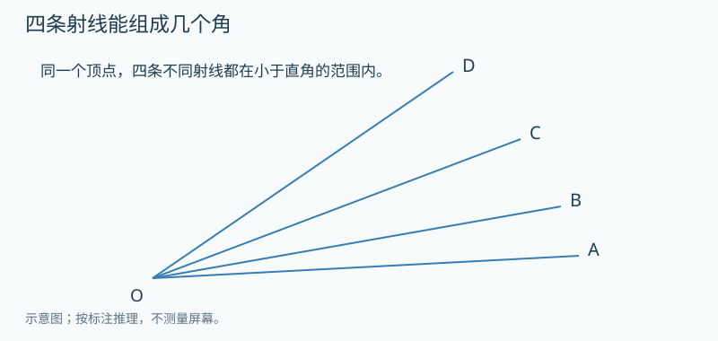

**配图文字备份（仅上传Markdown也可理解）：**顶点O出发四条不同射线按A、B、C、D顺序排列，全部在小于直角的扇形内；数任取两条夹出的较小角。
**图的显示与操作：**先显示静态条件图；允许圈画、标接头或写份数。提示层才显示重复次数/分解；不能把答案作为初始标注。

**先独立尝试；以下提示与答案供家长审核。**

提示1：先不看图中有几个小格，而是选哪两条边。
提示2：AB与BA表示同一个夹角，不能计两次。

**参考答案：**6个：AB、AC、AD、BC、BD、CD。

**为什么：**

1. 固定A，与后面B/C/D配得3个。
2. 固定B，只配还没数过的C/D得2个。
3. 固定C配D得1个，共3+2+1=6。

**适用边界：**每条射线不同且在同一小扇形中，避免平角、优角和重合边的额外约定。
**怎样看出确实在思考：**完整列出非相邻边形成的大角，用分类解释不重复。
**审核状态：**auto_checked；AI编辑复核不等于人类教师确认。
**选题与帮助：**每次至多1题；先预测或尝试，再按需逐级提示；看过提示记帮助，完整解答后原题仅订正。

##### G3-U06-TH1 分数不同，取出的长度能相同吗

**层级：**本章提升；建议8–12（可分次）分钟；先修/挂靠G3-U06-B05；思想fraction.whole-versus-quantity。
**教材连接：**G3-upper印刷73–91；教材单元为知识锚点；本题原创。现已收到暑假专项，关联对照见summer-20days索引。
**为什么接在这里：**从知道分母与份数，提升到比较相对比例和实际量。

**题目：**红绳长12厘米，取它的1/2；蓝绳长18厘米，取它的1/3。取下的长度相同吗？有人说1/2大于1/3，所以红绳一定取得更长，这句话哪里缺条件？

**先独立尝试；以下提示与答案供家长审核。**

提示1：先分别求每条绳里一小份是多少厘米。
提示2：比较的是分数数值，还是剪下的厘米数？

**参考答案：**都取6厘米；不能脱离两条绳原来的整体长度比较实际取出量。

**为什么：**

1. 红绳12÷2=6。
2. 蓝绳18÷3=6。
3. 1/2与1/3作为数前者较大，但对应不同整体时实际长度不由分数本身 决定。

**适用边界：**明确比较实际长度；不否定1/2大于1/3这一数值关系。
**怎样看出确实在思考：**同时说清分数关系与厘米结果，避免“不同整体就不能比较分数数值”的新误解。
**审核状态：**auto_checked；AI编辑复核不等于人类教师确认。
**选题与帮助：**每次至多1题；先预测或尝试，再按需逐级提示；看过提示记帮助，完整解答后原题仅订正。

##### G3-U06-TH2 “剩下的一半”是谁的一半

**层级：**奥数思想选学；建议8–12（可分次）分钟；先修/挂靠G3-U06-B05；思想reasoning.changing-whole。
**教材连接：**G3-upper印刷73–91；教材单元为知识锚点；本题原创。现已收到暑假专项，关联对照见summer-20days索引。
**为什么接在这里：**相同分数遇到新的整体，中间量必须重新确定。

**题目：**一盒24颗珠子，先把整盒的1/3放进红盘，再把剩下珠子的一半放进蓝盘，最后其余都放进绿盘。三个盘各有几颗？为什么蓝盘不是24的一半？

**先独立尝试；以下提示与答案供家长审核。**

提示1：每次出现“几分之几”先给所指整体画大圈。
提示2：拿走红珠以后，第二个整体里还剩多少？

**参考答案：**三种各8颗。

**为什么：**

1. 红珠24÷3=8，剩16。
2. 蓝珠是剩下16的一半，16÷2=8。
3. 绿珠16−8=8；合计24验算。

**适用边界：**颜色是分配后的标记，先后取出的组不重叠；第二步明确只研究剩余。
**怎样看出确实在思考：**主动更新整体，不把两次分数都机械作用在24上。
**审核状态：**auto_checked；AI编辑复核不等于人类教师确认。
**选题与帮助：**每次至多1题；先预测或尝试，再按需逐级提示；看过提示记帮助，完整解答后原题仅订正。

##### G3-U07-TH1 套餐加上预算条件，乘法还够吗

**层级：**本章提升；建议8–12（可分次）分钟；先修/挂靠G3-U07-B01；思想reasoning.constrained-combinations。
**教材连接：**G3-upper印刷92–102；教材单元为知识锚点；本题原创。现已收到暑假专项，关联对照见summer-20days索引。
**为什么接在这里：**先完整搭配再根据真实条件筛选，知道乘法给的是未筛选总数。

**题目：**面包有4元和6元两种，饮料有3元和5元两种。各选一种组成套餐，预算最多9元。有哪些可以买的套餐？价格恰好9元能不能选？

**先独立尝试；以下提示与答案供家长审核。**

提示1：先把全部4格写完，不要边猜边漏。
提示2：“最多9元”是否包括9？相同价格是否等于同一个套餐？

**参考答案：**4+3=7、4+5=9、6+3=9三种；6+5=11不行，恰好9元可以。

**为什么：**

1. 列2×2表得4种完整搭配。
2. 逐个求总价，按不超过9筛选。
3. 两种同为9元的套餐内容不同，仍算不同搭配。

**适用边界：**不同品种只有各一种选择；按内容而非价格区分套餐。
**怎样看出确实在思考：**列全后筛选，并处理包含边界与同价不同组合。
**审核状态：**auto_checked；AI编辑复核不等于人类教师确认。
**选题与帮助：**每次至多1题；先预测或尝试，再按需逐级提示；看过提示记帮助，完整解答后原题仅订正。

##### G3-U07-TH2 最短路线怎样列全

**层级：**奥数思想选学；建议8–12（可分次）分钟；先修/挂靠G3-U07-B01；思想reasoning.path-enumeration。
**教材连接：**G3-upper印刷92–102；教材单元为知识锚点；本题原创。现已收到暑假专项，关联对照见summer-20days索引。
**为什么接在这里：**搭配与有序记录迁移到路线；每一步选择受已走步数约束。

**题目：**在2格宽、2格高的方格路网上，从左下角走到右上角。只能沿格线向右或向上，每次走一格，不许回头。每条路都要走2次右、2次上。不同的走法顺序算不同路线，共几条？用“右/上”写全。

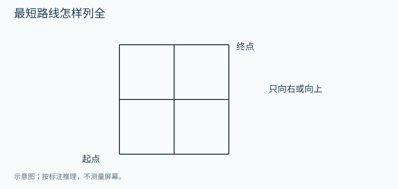

**配图文字备份（仅上传Markdown也可理解）：**2行2列格路，起点左下，终点右上；只沿格线向右或向上，每次一格。
**图的显示与操作：**先显示静态条件图；允许圈画、标接头或写份数。提示层才显示重复次数/分解；不能把答案作为初始标注。

**先独立尝试；以下提示与答案供家长审核。**

提示1：先写所有以“右”开头的路线。
提示2：每列一条就数清是否恰有2右2上。

**参考答案：**6条：右右上上、右上右上、右上上右、上右右上、上右上右、上上右右。

**为什么：**

1. 先按第一步向右或向上分类。
2. 首步右时，把剩下1右2上依次安排得3条。
3. 首步上同理3条，共6，没有多余回头路。

**适用边界：**只数沿网格线的最短单调路线，不允许斜走；题干文字足够重建2×2路网。
**怎样看出确实在思考：**通过分类说明列全，而非只在图上随手画几条。
**审核状态：**auto_checked；AI编辑复核不等于人类教师确认。
**选题与帮助：**每次至多1题；先预测或尝试，再按需逐级提示；看过提示记帮助，完整解答后原题仅订正。

##### G3-L01-TH1 折两次后打一个孔

**层级：**本章提升；建议8–12（可分次）分钟；先修/挂靠G3-L01-B01；思想geometry.symmetry-unfold。
**教材连接：**G3-lower印刷1–9；教材单元为知识锚点；本题原创。现已收到暑假专项，关联对照见summer-20days索引。
**为什么接在这里：**对折的镜像对应通过两次展开层层复制，不靠猜图案。

**题目：**一张长方形纸先沿竖直中线对折，再沿水平中线对折，形成四层。用打孔器一次穿透四层，在离所有折痕和纸边都足够远处打一个小圆孔。完全展开后有几个孔？它们有什么对称关系？

**先独立尝试；以下提示与答案供家长审核。**

提示1：只先展开一次，原来的上下两层分别留下什么？
提示2：再展开另一折痕，已有每个孔会怎样对应？

**参考答案：**4个不同小孔；关于原竖直、水平中线都成对称对应。

**为什么：**

1. 先展开第二次折叠，得到2孔。
2. 再展开第一次折叠，每孔各有一个对应孔，共4。
3. 孔不在折痕上且远离边，所以不合成一个或被剪成边缘缺口。

**适用边界：**小孔远离折痕，打透全部四层；若在折痕上，本答案不可直接套用。
**怎样看出确实在思考：**按展开过程追踪孔，不只背“折两次四个”。
**审核状态：**auto_checked；AI编辑复核不等于人类教师确认。
**选题与帮助：**每次至多1题；先预测或尝试，再按需逐级提示；看过提示记帮助，完整解答后原题仅订正。

##### G3-L01-TH2 面积够了，为什么还铺不了

**层级：**奥数思想选学；建议8–12（可分次）分钟；先修/挂靠G3-L01-B02；思想reasoning.coloring-invariant。
**教材连接：**G3-lower印刷1–9；教材单元为知识锚点；本题原创。现已收到暑假专项，关联对照见summer-20days索引。
**为什么接在这里：**平移旋转保形，增加黑白染色观察，说明有时面积足够仍无法拼成。

**题目：**画4行4列方格，像棋盘一样黑白相间，左上角为黑。剪掉左上角和右下角两格。剩14格，准备用7张每张恰盖相邻2格的1×2纸片铺满，可旋转但不剪、不重叠。能铺满吗？为什么？

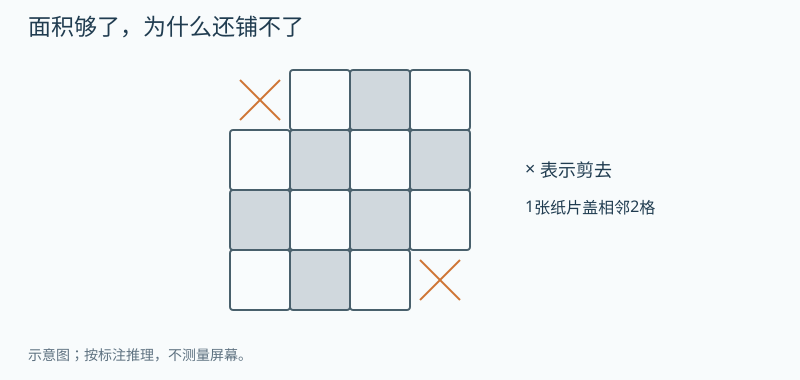

**配图文字备份（仅上传Markdown也可理解）：**4×4黑白棋盘，左上与右下两个同色角格剪去，拟用七张1×2相邻格纸片铺满。
**图的显示与操作：**先显示静态条件图；允许圈画、标接头或写份数。提示层才显示重复次数/分解；不能把答案作为初始标注。

**先独立尝试；以下提示与答案供家长审核。**

提示1：先数剪掉的两个角是什么颜色。
提示2：一张1×2无论怎样转动，覆盖的两格颜色有何关系？

**参考答案：**不能。剩黑6格、白8格；每张纸片必盖1黑1白，7张需黑白各7格。

**为什么：**

1. 原来黑白各8格；两个被剪角都为黑。
2. 横放或竖放，1×2都跨相邻异色两格。
3. 黑白数量不等，怎样旋转移动都不能改变每片各占一色的事实。

**适用边界：**只允许沿网格铺满两格的矩形纸片，不允许斜盖或切割；这是选学证明任务。
**怎样看出确实在思考：**用颜色数量给出不可能的理由，而不是多试几次没成功就断言不能。
**审核状态：**auto_checked；AI编辑复核不等于人类教师确认。
**选题与帮助：**每次至多1题；先预测或尝试，再按需逐级提示；看过提示记帮助，完整解答后原题仅订正。

##### G3-L02-TH1 有余数时，总数不只有一个答案

**层级：**本章提升；建议8–12（可分次）分钟；先修/挂靠G3-L02-B03；思想reasoning.remainder-range。
**教材连接：**G3-lower印刷10–38；教材单元为知识锚点；本题原创。现已收到暑假专项，关联对照见summer-20days索引。
**为什么接在这里：**除法余数关系用于逆推所有可能总量，而非只做正向除法。

**题目：**珠子每6颗装一满袋，最后余4颗。满袋至少3袋、最多5袋。珠子总数有哪些可能？要求找全，并说明为什么没有25颗。

**先独立尝试；以下提示与答案供家长审核。**

提示1：先列满袋数的所有可能，不要先猜总数。
提示2：每种满袋数量外面都还必须有4颗。

**参考答案：**22、28、34颗；25除以6余1，不满足余4。

**为什么：**

1. 满袋数只能3、4、5。
2. 依次用袋数×6+4，得22、28、34。
3. 其他总数不满足袋数范围或余数条件。

**适用边界：**“至少3、最多5”均含边界，余4是颗数而非袋数。
**怎样看出确实在思考：**按商的范围列全，并代回检验余数。
**审核状态：**auto_checked；AI编辑复核不等于人类教师确认。
**选题与帮助：**每次至多1题；先预测或尝试，再按需逐级提示；看过提示记帮助，完整解答后原题仅订正。

##### G3-L02-TH2 两种装法的余数都要满足

**层级：**奥数思想选学；建议8–12（可分次）分钟；先修/挂靠G3-L02-B03；思想reasoning.systematic-filter。
**教材连接：**G3-lower印刷10–38；教材单元为知识锚点；本题原创。现已收到暑假专项，关联对照见summer-20days索引。
**为什么接在这里：**从一个余数条件生成候选，再用第二条件筛选；暂不教同余公式。

**题目：**一堆卡片有10到30张（包括10和30）。每3张装一袋余2张；每4张装一袋余3张。总数所有可能是多少？怎样保证没有漏掉？

**先独立尝试；以下提示与答案供家长审核。**

提示1：只用第一个条件排成递增的一列。
提示2：再用第二条件逐一打勾，不要把余2与余3直接相加。

**参考答案：**11张或23张。

**为什么：**

1. 先列10到30中除以3余2的数：11、14、17、20、23、26、29。
2. 再逐个查除以4的余数，只有11和23余3。
3. 候选先按每次增加3有序列完，所以不会遗漏同时满足者。

**适用边界：**范围和余数都必须同时满足；答案有两个，不能只接受11。
**怎样看出确实在思考：**先生成候选后过滤，说明全部可行解，不用高级术语。
**审核状态：**auto_checked；AI编辑复核不等于人类教师确认。
**选题与帮助：**每次至多1题；先预测或尝试，再按需逐级提示；看过提示记帮助，完整解答后原题仅订正。

##### G3-L03-TH1 同一根绳能围成几种长方形

**层级：**本章提升；建议8–12（可分次）分钟；先修/挂靠G3-L03-B02；思想reasoning.fixed-sum-enumeration。
**教材连接：**G3-lower印刷39–51；教材单元为知识锚点；本题原创。现已收到暑假专项，关联对照见summer-20days索引。
**为什么接在这里：**周长固定转为长宽和固定，用有序枚举保证不重复。

**题目：**用24厘米绳围成长方形，不计接头，边长都是正整数厘米，允许正方形。旋转后相同的图形只算一种。有哪些长和宽？怎样知道列全了？

**先独立尝试；以下提示与答案供家长审核。**

提示1：先把两条长和两条宽分成两份相同的长+宽。
提示2：约定只记长不小于宽，可以避免哪种重复？

**参考答案：**11和1、10和2、9和3、8和4、7和5、6和6，共6种。

**为什么：**

1. 长加宽为24÷2=12。
2. 从较短边1开始依次增加到6，另边为12减它。
3. 短边超过6会把已有长宽交换，只是旋转重复。

**适用边界：**只列正整数边长，允许正方形；若允许任意小数则不止6种。
**怎样看出确实在思考：**说清有限范围与去重规则，不把不完整列举说成所有。
**审核状态：**auto_checked；AI编辑复核不等于人类教师确认。
**选题与帮助：**每次至多1题；先预测或尝试，再按需逐级提示；看过提示记帮助，完整解答后原题仅订正。

##### G3-L03-TH2 挖一个小缺口，周长为什么增加

**层级：**奥数思想选学；建议8–12（可分次）分钟；先修/挂靠G3-L03-E01；思想reasoning.boundary-compensation。
**教材连接：**G3-lower印刷39–51；教材单元为知识锚点；本题原创。现已收到暑假专项，关联对照见summer-20days索引。
**为什么接在这里：**从拼接减两条接缝，迁移到追踪替换掉的边；比较挖角与挖边中间。

**题目：**长方形纸片长8厘米、宽5厘米。在一条8厘米边的正中，向内部剪去一个宽2厘米、深1厘米的小长方形，缺口不碰两侧角。剩余图形周长多少？为什么不是把原周长减去小长方形周长？

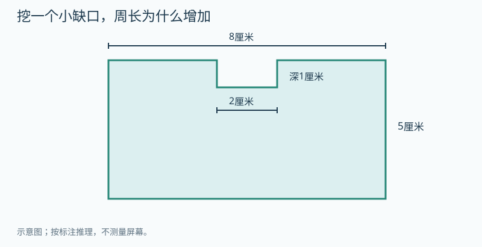

**配图文字备份（仅上传Markdown也可理解）：**8×5厘米长方形，在上方8厘米边的中部剪去宽2厘米、深1厘米的矩形缺口；两侧角保留。
**图的显示与操作：**先显示静态条件图；允许圈画、标接头或写份数。提示层才显示重复次数/分解；不能把答案作为初始标注。

**先独立尝试；以下提示与答案供家长审核。**

提示1：用两种颜色分别描原来消失的边和新露出的边。
提示2：缺口底边与消失那段一样长后，还多出哪两段？

**参考答案：**28厘米。

**为什么：**

1. 原周长(8+5)×2=26。
2. 原外边减少宽2的一段，缺口底新增同长2，互相抵消。
3. 缺口两侧各新增深1，共增加2，得28。

**适用边界：**缺口在边中间，深1小于宽5，不挖穿也不碰角；挖角时结论可能不同。
**怎样看出确实在思考：**依据边的增减说明原因，不能拿两个图形周长机械相减。
**审核状态：**auto_checked；AI编辑复核不等于人类教师确认。
**选题与帮助：**每次至多1题；先预测或尝试，再按需逐级提示；看过提示记帮助，完整解答后原题仅订正。

##### G3-L04-TH1 沿对角线剪开，面积怎么办

**层级：**本章提升；建议8–12（可分次）分钟；先修/挂靠G3-L04-B02；思想geometry.equal-area-decomposition。
**教材连接：**G3-lower印刷52–64；教材单元为知识锚点；本题原创。现已收到暑假专项，关联对照见summer-20days索引。
**为什么接在这里：**已经会长方形面积，用旋转重合与完整覆盖解释一半，不提前死记三角形公式。

**题目：**长6厘米、宽4厘米的长方形纸，沿一条对角线剪成两块。两块能重合吗？每块面积多少？请用剪拼或转动解释，不直接背三角形面积公式。

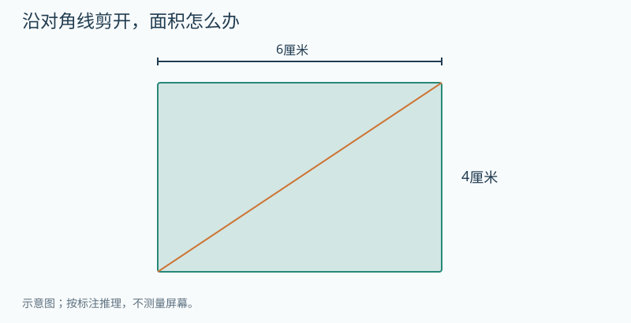

**配图文字备份（仅上传Markdown也可理解）：**长6厘米、宽4厘米的长方形，从左下到右上画一条对角线，拟沿线剪开。
**图的显示与操作：**先显示静态条件图；允许圈画、标接头或写份数。提示层才显示重复次数/分解；不能把答案作为初始标注。

**先独立尝试；以下提示与答案供家长审核。**

提示1：先比较两块的对应边，实际转动叠起来试。
提示2：确认两块相同且刚好组成整张后，怎样分总面积？

**参考答案：**两块可以转动后重合，每块12平方厘米。

**为什么：**

1. 长方形总面积6×4=24。
2. 沿对角线分成的两块，转动其中一块可与另一块重合。
3. 两块无重叠恰好组成原纸，所以等分24，各12。

**适用边界：**必须沿长方形对角线；任意一刀不一定等面积。
**怎样看出确实在思考：**先有等分依据再除2，不把“剪两块”直接当“平均分”。
**审核状态：**auto_checked；AI编辑复核不等于人类教师确认。
**选题与帮助：**每次至多1题；先预测或尝试，再按需逐级提示；看过提示记帮助，完整解答后原题仅订正。

##### G3-L04-TH2 九宫格里不只九个正方形

**层级：**奥数思想选学；建议8–12（可分次）分钟；先修/挂靠G3-L04-B02；思想reasoning.count-by-size。
**教材连接：**G3-lower印刷52–64；教材单元为知识锚点；本题原创。现已收到暑假专项，关联对照见summer-20days索引。
**为什么接在这里：**面积方格的行列结构转为分大小数图形，避免只数最小单位格。

**题目：**一张3行3列、共9个小方格的网格图，完整网格线都画出。只数四条边都沿现有网格线的正方形，包括不同大小，共几个？把每种大小分别说明。

**配图文字备份（仅上传Markdown也可理解）：**3行3列完整方格图，所有横竖边界线均画出；数边沿格线的所有正方形。
**图的显示与操作：**先显示静态条件图；允许圈画、标接头或写份数。提示层才显示重复次数/分解；不能把答案作为初始标注。

**先独立尝试；以下提示与答案供家长审核。**

提示1：除了一个小方格，能不能把相邻4格围成一个更大的正方形？
提示2：把大方形的左上角逐格移动，哪些位置还能完整放下？

**参考答案：**14个：边长1小格的9个，边长2小格的4个，边长3小格的1个。

**为什么：**

1. 按边长1、2、3小格分类，其他整数边长放不下。
2. 2×2方形的左上角只有前两行前两列四种位置。
3. 9+4+1=14；不计没有沿网格线的斜正方形。

**适用边界：**限定边沿现有格线，不计任意方向任意位置的几何正方形。
**怎样看出确实在思考：**按大小和起点位置分类，说明无漏无重。
**审核状态：**auto_checked；AI编辑复核不等于人类教师确认。
**选题与帮助：**每次至多1题；先预测或尝试，再按需逐级提示；看过提示记帮助，完整解答后原题仅订正。

##### G3-L05-TH1 统计表空着的格子怎样补

**层级：**本章提升；建议8–12（可分次）分钟；先修/挂靠G3-L05-B01；思想reasoning.table-constraints。
**教材连接：**G3-lower印刷65–76；教材单元为知识锚点；本题原创。现已收到暑假专项，关联对照见summer-20days索引。
**为什么接在这里：**统计不只读最大数，也要用行总数与已知量找缺项、交叉核对。

**题目：**甲组8人、乙组10人，每人只选苹果或香蕉一种。甲选苹果3人，乙选苹果4人。两组各有多少人选香蕉？合起来香蕉是否比苹果多，多几人？请画表核对总人数。

**先独立尝试；以下提示与答案供家长审核。**

提示1：每人只能选一种，所以每组苹果与香蕉合计应等于什么？
提示2：先补行，再合列，最后核对两种求总数方式。

**参考答案：**甲香蕉5人，乙香蕉6人；香蕉11、苹果7，香蕉多4人，总18人。

**为什么：**

1. 每行用组人数减选苹果人数，得到5与6。
2. 按列合计苹果7、香蕉11。
3. 两列7+11=18与两组8+10=18一致，再求差4。

**适用边界：**两个选项覆盖全部人且互斥；允许多选时不能直接用减法补空格。
**怎样看出确实在思考：**利用行列约束推理，并主动查统计口径。
**审核状态：**auto_checked；AI编辑复核不等于人类教师确认。
**选题与帮助：**每次至多1题；先预测或尝试，再按需逐级提示；看过提示记帮助，完整解答后原题仅订正。

##### G3-L05-TH2 十票分给三种游戏，能保证什么

**层级：**奥数思想选学；建议8–12（可分次）分钟；先修/挂靠G3-L05-B02；思想reasoning.pigeonhole。
**教材连接：**G3-lower印刷65–76；教材单元为知识锚点；本题原创。现已收到暑假专项，关联对照见summer-20days索引。
**为什么接在这里：**分类统计连接“最坏也会怎样”的推理，用具体数量体验抽屉思想。

**题目：**10位同学每人只投1票，在跳绳、毽子、捉迷藏3种游戏中选一种。还不知道结果，能保证至少有一种游戏得到4票或更多吗？能保证某一种指定的游戏一定有4票吗？

**先独立尝试；以下提示与答案供家长审核。**

提示1：如果想让所有游戏都不满4票，每种最多容纳几票？
提示2：三种各放3票后，第10票无论放哪会发生什么？

**参考答案：**能保证至少一种有4票或更多；不能保证指定的游戏。

**为什么：**

1. 假设每一种都最多3票，合计最多3+3+3=9。
2. 实际有10票，所以至少一类必须超过3。
3. 但10票也可以全部投别的游戏，指定游戏可能0票。

**适用边界：**每人一票且只有三类；“至少一种”不同于事先指定哪一种。
**怎样看出确实在思考：**用反设或摆票说明必然性，不能只给一个出现4票的样例。
**审核状态：**auto_checked；AI编辑复核不等于人类教师确认。
**选题与帮助：**每次至多1题；先预测或尝试，再按需逐级提示；看过提示记帮助，完整解答后原题仅订正。

##### G3-LP01-TH1 哪些星期会多出现一次

**层级：**本章提升；建议8–12（可分次）分钟；先修/挂靠G3-LP01-E01；思想reasoning.period-remainder。
**教材连接：**G3-lower印刷77–85；教材单元为知识锚点；本题原创。现已收到暑假专项，关联对照见summer-20days索引。
**为什么接在这里：**7天周期进一步拆成完整周和余天，解释月历中数量差异。

**题目：**某月有31天，1日是星期四。这个月哪些星期各出现5次，哪些各出现4次？不要逐个日期数31遍，说明完整周和余天怎样分。

**先独立尝试；以下提示与答案供家长审核。**

提示1：31天中先取出多少天，刚好能组成完整的周？
提示2：剩下三天从哪个星期接着排？

**参考答案：**星期四、五、六各5次；星期日、一、二、三各4次。

**为什么：**

1. 前28天是4个完整周，每个星期4次。
2. 29、30、31日分别星期四、五、六。
3. 余下3天给这三种星期各增加1次。

**适用边界：**月份恰有31天且1日周四；30天或起始星期不同需重排余天。
**怎样看出确实在思考：**用周期与余数解释所有星期次数，而不是只算某一天。
**审核状态：**auto_checked；AI编辑复核不等于人类教师确认。
**选题与帮助：**每次至多1题；先预测或尝试，再按需逐级提示；看过提示记帮助，完整解答后原题仅订正。

##### G3-LP01-TH2 三个连续星期一的日期之和

**层级：**奥数思想选学；建议8–12（可分次）分钟；先修/挂靠G3-LP01-E01；思想reasoning.equalize-pair。
**教材连接：**G3-lower印刷77–85；教材单元为知识锚点；本题原创。现已收到暑假专项，关联对照见summer-20days索引。
**为什么接在这里：**周期给出等差间隔，借两端补偿找到中间量，连接和差与配对思想。

**题目：**同一个月里三个连续星期一，它们的日期数字相加是36。这三个日期分别是多少？先找中间的日期，并解释为什么可以把36平均分3份。

**先独立尝试；以下提示与答案供家长审核。**

提示1：把三个日期画成相隔7的三个点。
提示2：将右边多出的7补到左边少的7，三个数会怎样？

**参考答案：**5日、12日、19日。

**为什么：**

1. 连续星期一相隔7天。
2. 从最大日期拿7给最小日期，三个数都变成中间日期，总和仍36。
3. 中间36÷3=12，前后各差7，所以5、12、19。

**适用边界：**三个日期在同一个月、连续三周；跨月日期数字重置时本方法不可直接套。
**怎样看出确实在思考：**用补偿解释平均而非机械记平均数；代回相隔7和总和36。
**审核状态：**auto_checked；AI编辑复核不等于人类教师确认。
**选题与帮助：**每次至多1题；先预测或尝试，再按需逐级提示；看过提示记帮助，完整解答后原题仅订正。

##### G3-L06-TH1 正好花完4元，有不止一种买法

**层级：**本章提升；建议8–12（可分次）分钟；先修/挂靠G3-L06-B03；思想reasoning.decimal-combinations。
**教材连接：**G3-lower印刷86–94；教材单元为知识锚点；本题原创。现已收到暑假专项，关联对照见summer-20days索引。
**为什么接在这里：**小数加减用于有限搭配与多解核对，不以同价误合并不同方案。

**题目：**四种文具价格分别1.2元、1.8元、2.2元、2.8元。只能买两种不同文具，每种1件，正好花4元。所有买法是什么？先买哪件不影响组合。

**先独立尝试；以下提示与答案供家长审核。**

提示1：从4元减去第一件价格，看剩下的钱有没有对应另一件。
提示2：1.2+2.8与2.8+1.2是两种买法吗？

**参考答案：**1.2元与2.8元；1.8元与2.2元，两种。

**为什么：**

1. 先固定1.2，余款2.8正好有。
2. 固定1.8，余款2.2正好有。
3. 以后得到的是已有组合的反向，不重复算。

**适用边界：**必须两种不同文具且各一件；允许重复买同种时要另查条件。
**怎样看出确实在思考：**有序枚举、去重，准确处理一位小数。
**审核状态：**auto_checked；AI编辑复核不等于人类教师确认。
**选题与帮助：**每次至多1题；先预测或尝试，再按需逐级提示；看过提示记帮助，完整解答后原题仅订正。

##### G3-L06-TH2 买至少五支，怎样最省钱

**层级：**奥数思想选学；建议8–12（可分次）分钟；先修/挂靠G3-L06-B03；思想reasoning.finite-optimization。
**教材连接：**G3-lower印刷86–94；教材单元为知识锚点；本题原创。现已收到暑假专项，关联对照见summer-20days索引。
**为什么接在这里：**把小数预算与分类比较结合；先明确允许多买再讨论最小费用。

**题目：**同样的笔单买每支1.4元，3支装一包3.6元，整包不能拆卖。至少要5支，允许多买。怎样花钱最少？把买0包、1包、2包的情况都检查，并说明更多包为何不用再试。

**先独立尝试；以下提示与答案供家长审核。**

提示1：按整包的数量分类，每类只补满足需要的最少单支。
提示2：允许多买，所以2包也要比较，但包更多的价格是否可能更低？

**参考答案：**买1包加2支单支，共5支，6.4元。

**为什么：**

1. 0包要5支单买，7.0元。
2. 1包还缺2支，3.6+2.8=6.4元。
3. 2包有6支，7.2元；3包及以上仅包价就至少10.8元，比已找到的6.4贵。

**适用边界：**价格固定且无额外优惠，单支与整包是同样笔；比较总支出不是每支单价。
**怎样看出确实在思考：**用有限候选和下界排除更大方案，解释最优而非只给一种可行买法。
**审核状态：**auto_checked；AI编辑复核不等于人类教师确认。
**选题与帮助：**每次至多1题；先预测或尝试，再按需逐级提示；看过提示记帮助，完整解答后原题仅订正。

##### G3-L07-TH1 两种都没选的人也要放进图里

**层级：**本章提升；建议8–12（可分次）分钟；先修/挂靠G3-L07-B01；思想reasoning.inclusion-exclusion。
**教材连接：**G3-lower印刷95–104；教材单元为知识锚点；本题原创。现已收到暑假专项，关联对照见summer-20days索引。
**为什么接在这里：**重叠问题加入圈外人数，先明确研究全班还是并集，避免把20直接当两类合计。

**题目：**全班20人，喜欢游泳12人，喜欢画画10人，其中4人两种都不喜欢。两种都喜欢的有几人？只喜欢游泳、只喜欢画画分别几人？用四个互不重叠部分验回20。

**先独立尝试；以下提示与答案供家长审核。**

提示1：先把圈外4人放好，两个圈合起来还应有多少人？
提示2：12与10相加多出来的是什么人？

**参考答案：**都喜欢6人；只游泳6人，只画画4人；都不喜欢4人。

**为什么：**

1. 至少喜欢一种20−4=16人。
2. 12+10把共同者多计一次，所以共同22−16=6。
3. 只游泳12−6=6，只画画10−6=4；6+6+4+4=20。

**适用边界：**人数均指全班20人中的同一调查；两类可重叠，圈外也须计入全班。
**怎样看出确实在思考：**区分全体与并集，完成四区交叉验算。
**审核状态：**auto_checked；AI编辑复核不等于人类教师确认。
**选题与帮助：**每次至多1题；先预测或尝试，再按需逐级提示；看过提示记帮助，完整解答后原题仅订正。

##### G3-L07-TH2 总数和相差数，怎样分成两份

**层级：**奥数思想选学；建议8–12（可分次）分钟；先修/挂靠G3-L07-R01；思想reasoning.sum-difference。
**教材连接：**G3-lower印刷95–104；教材单元为知识锚点；本题原创。现已收到暑假专项，关联对照见summer-20days索引。
**为什么接在这里：**加减数量关系连接和差问题，通过去掉多出的量或等量转移理解公式。

**题目：**哥哥和弟弟共有18张卡，哥哥比弟弟多4张。两人各几张？哥哥给弟弟几张后两人一样多？为什么不是给4张？

**先独立尝试；以下提示与答案供家长审核。**

提示1：把哥哥纸带分成“和弟弟同样长的一段”与“多4的一段”。
提示2：移动1张时，两人的数量都怎样变化？

**参考答案：**哥哥11张，弟弟7张；给2张后各9张。

**为什么：**

1. 先从哥哥那里暂拿走多出的4张，两人剩下的一样多，共14，每人7。
2. 把4张还给哥哥，哥哥11，弟弟7。
3. 哥哥给弟弟1张，哥哥少1、弟弟多1，相差减少2；给2张就减少4。

**适用边界：**卡片总数转移时保持18；“暂拿出”用于比较与“交给弟弟”是不同动作。
**怎样看出确实在思考：**能用两条纸带或移卡解释和差、差变化，不只背(和±差)÷2。
**审核状态：**auto_checked；AI编辑复核不等于人类教师确认。
**选题与帮助：**每次至多1题；先预测或尝试，再按需逐级提示；看过提示记帮助，完整解答后原题仅订正。

##### G3-U03-TH3 两块木板接起来，哪一段算重了

**层级：**本章提升；建议8–12（可分次）分钟；先修/挂靠G3-U03-B01；思想measurement.overlap。
**教材连接：**G3-upper印刷20–30；教材仅作知识锚点；按用户提出的连接与重叠情境原创，非声称复原其未提供的链环原图。
**为什么接在这里：**会量一根物体以后，转向两根接起来的实际长度；先找重叠，再计算。

**题目：**两块木板沿同一方向平放，甲长30厘米，乙长25厘米。甲的右端与乙的左端上下搭在一起，重叠部分沿长度方向是8厘米。乙的右端伸到甲的右端以外。看图，从甲的最左端到乙的最右端一共长多少厘米？请在图上圈出不能重复计算的那一段。

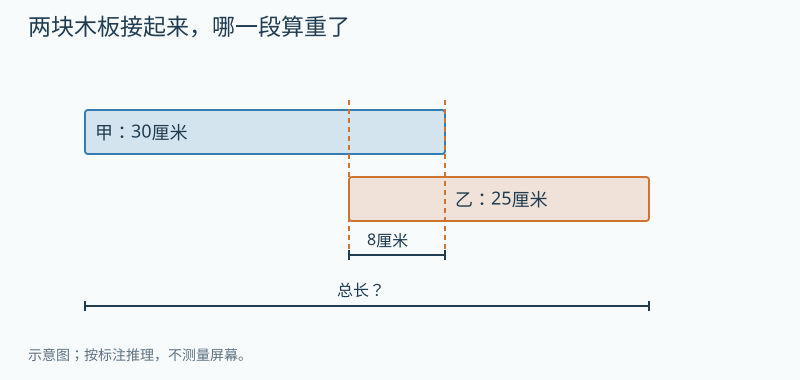

**配图文字备份（仅上传Markdown也可理解）：**甲板从共同起点向右长30厘米。乙板从甲右端左移8厘米处起，长25厘米；两板在8厘米投影段重叠，求覆盖总长。
**图的显示与操作：**先显示静态条件图；允许圈画、标接头或写份数。提示层才显示重复次数/分解；不能把答案作为初始标注。

**先独立尝试；以下提示与答案供家长审核。**

提示1：从左到右指一遍实际覆盖的路段。
提示2：在乙板上遮住已被甲板盖住的8厘米，乙真正接长了多少？

**参考答案：**47厘米。

**为什么：**

1. 把两块各自的长度相加是30+25=55厘米。
2. 其中8厘米重叠段在甲里算了一次，在乙里又算了一次。
3. 实际总长只需保留一次：55−8=47厘米；也可30+(25−8)=47厘米。

**适用边界：**直线搭接，无空隙、无弯折；问端到端的覆盖长度，不是买来木料的总长度。
**怎样看出确实在思考：**能区分55厘米木料与47厘米覆盖长度，并解释只减一次8。
**审核状态：**auto_checked；AI编辑复核不等于人类教师确认。
**选题与帮助：**一次最多一道，允许跨日；先独立画、摆、说，再逐级提示；完整解答后仅作订正，不能记独立迁移。

##### G3-U03-TH4 四块板只有几处接头

**层级：**本章提升；建议8–12（可分次）分钟；先修/挂靠G3-U03-B01；思想measurement.overlap。
**教材连接：**G3-upper印刷20–30；教材仅作知识锚点；按用户提出的连接与重叠情境原创，非声称复原其未提供的链环原图。
**为什么接在这里：**把一次去重扩展到连续连接，数的是接头而不是木板数。

**题目：**4块木板各长20厘米，沿同一直线从左到右依次搭接。图中三个接头的重叠长度，从左到右分别是3厘米、5厘米、2厘米。只有相邻两块板重叠，没有三块叠在一起。拼好后从最左端到最右端长多少厘米？为什么不用减去4段重叠？

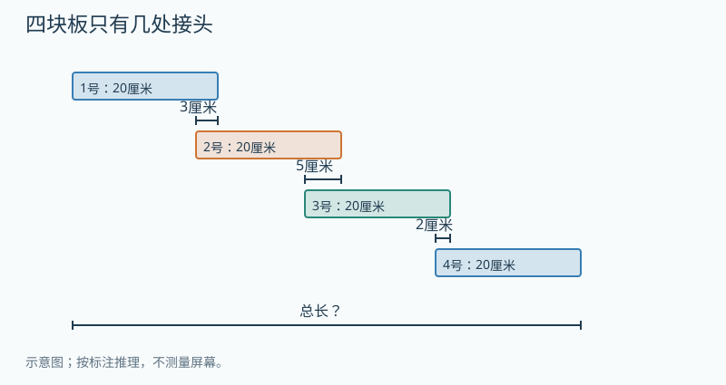

**配图文字备份（仅上传Markdown也可理解）：**4块各20厘米的木板沿直线顺次搭接，三处从左到右重叠3、5、2厘米，没有三重重叠。
**图的显示与操作：**先显示静态条件图；允许圈画、标接头或写份数。提示层才显示重复次数/分解；不能把答案作为初始标注。

**先独立尝试；以下提示与答案供家长审核。**

提示1：用4张卡片顺次搭接，用手指逐一指接头。
提示2：分别找第二、第三、第四块新增加的长度。

**参考答案：**70厘米；4块板之间只有3处接头。

**为什么：**

1. 4块木板的材料长度共20×4=80厘米。
2. 相邻接头有3处，重复长度共3+5+2=10厘米。
3. 80−10=70厘米；第一块先放好，后面每添一块才多一处接头。

**适用边界：**仅有相邻两板重叠，三处重叠区域互不重叠。不能推广为任何摆法都减三个数。
**怎样看出确实在思考：**能数对3处接头，并用20+17+15+18复核。
**审核状态：**auto_checked；AI编辑复核不等于人类教师确认。
**选题与帮助：**一次最多一道，允许跨日；先独立画、摆、说，再逐级提示；完整解答后仅作订正，不能记独立迁移。

##### G3-U03-TH5 总长知道了，接头盖住多少

**层级：**本章提升；建议8–12（可分次）分钟；先修/挂靠G3-U03-B01；思想reasoning.inverse。
**教材连接：**G3-upper印刷20–30；教材仅作知识锚点；按用户提出的连接与重叠情境原创，非声称复原其未提供的链环原图。
**为什么接在这里：**保留“材料长度减重复长度”的结构，倒过来求每处重叠。

**题目：**3块木板各长30厘米，沿同一直线依次搭接。两处接头的重叠长度相同，没有三块重叠。拼好后端到端是78厘米。每处接头重叠多少厘米？请摆回去检查总长。

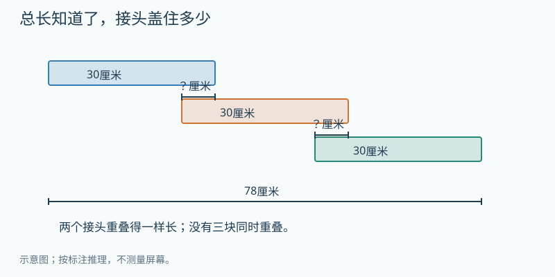

**配图文字备份（仅上传Markdown也可理解）：**三板各30厘米，两处相等搭接，没有三重重叠，端到端78厘米，求每处重叠。
**图的显示与操作：**先显示静态条件图；允许圈画、标接头或写份数。提示层才显示重复次数/分解；不能把答案作为初始标注。

**先独立尝试；以下提示与答案供家长审核。**

提示1：先求合计少了多少厘米。
提示2：3块板只有2处接头；12厘米要平均分给谁？

**参考答案：**每处6厘米。

**为什么：**

1. 没有重叠时材料总长30×3=90厘米。
2. 拼成78厘米，说明两处合计重复90−78=12厘米。
3. 两处一样长，所以每处12÷2=6厘米；检查30+24+24=78厘米。

**适用边界：**必须知道两处相等；若没有这一条件，不能确定每一处。
**怎样看出确实在思考：**能说明为什么除以2而不是3，并指出“相同”条件的作用。
**审核状态：**auto_checked；AI编辑复核不等于人类教师确认。
**选题与帮助：**一次最多一道，允许跨日；先独立画、摆、说，再逐级提示；完整解答后仅作订正，不能记独立迁移。

##### G3-U03-TH6 链环接长，为什么一处要看两段厚度

**层级：**本章提升；建议8–12（可分次）分钟；先修/挂靠G3-U03-B01；思想measurement.overlap。
**教材连接：**G3-upper印刷20–30；教材仅作知识锚点；按用户提出的连接与重叠情境原创，非声称复原其未提供的链环原图。
**为什么接在这里：**把厘米毫米换算用于读连接结构，区分单侧厚度与接头少增加的长度。

**题目：**4个相同的链环连接后拉直、绷紧。每个环沿拉伸方向，从最左外缘到最右外缘长4厘米，金属条厚5毫米。图中的连接结构规定：每处接头沿拉伸方向重叠的长度，由前一个环端部的5毫米和后一个环端部的5毫米合成。只有相邻环重叠。整条链从最左外缘到最右外缘长多少毫米？先在放大图中指出这一处接头的两段厚度。

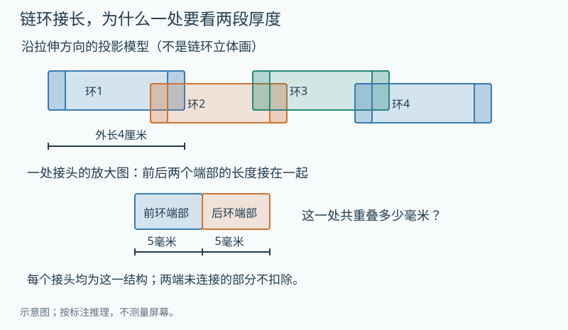

**配图文字备份（仅上传Markdown也可理解）：**4环拉紧的轴向投影；每环外长40毫米，端部厚5毫米，每处接头的重叠由两个5毫米端部相接组成。只与相邻环重叠，求链条外端总长。
**图的显示与操作：**先显示静态条件图；允许圈画、标接头或写份数。提示层才显示重复次数/分解；不能把答案作为初始标注。

**先独立尝试；以下提示与答案供家长审核。**

提示1：先暂时只看两个环，接上第二环能增加完整的40毫米吗？
提示2：对照放大图，接头涉及两个环的端部；再数有几处接头。

**参考答案：**130毫米，也就是13厘米。

**为什么：**

1. 统一长度：4厘米=40毫米；一处接头少增加5+5=10毫米。
2. 4个环有3处接头，不是4处；重叠总长10×3=30毫米。
3. 40×4−30=130毫米；从第一环接长也可40+30+30+30=130毫米。

**适用边界：**这是明确给定端部投影结构的理想化拉直模型，不是任意链环的通用公式。4厘米若表示内孔长、链条松弛或连接方式不同，不能直接用本题结果。未看到用户原图，不能断言原题一定为13厘米。
**怎样看出确实在思考：**分别解释外长40、接头10、接头数3；仅写答案不够。
**审核状态：**auto_checked；AI编辑复核不等于人类教师确认。
**选题与帮助：**一次最多一道，允许跨日；先独立画、摆、说，再逐级提示；完整解答后仅作订正，不能记独立迁移。

##### G3-U03-TH7 同样两根纸条，为什么答案不同

**层级：**本章提升；建议8–12（可分次）分钟；先修/挂靠G3-U03-B01；思想reasoning.sufficient-evidence。
**教材连接：**G3-upper印刷20–30；教材仅作知识锚点；按用户提出的连接与重叠情境原创，非声称复原其未提供的链环原图。
**为什么接在这里：**从会算升级为先判断条件是否足以决定长度。

**题目：**桌上有两根都长20厘米的纸条。小乐只说“我把它们搭接成一根”，没有告诉你重叠多少厘米。能确定拼好后的长度吗？请画出两种都符合他说法的摆法，给出各自总长，并告诉他还需要量哪一段。

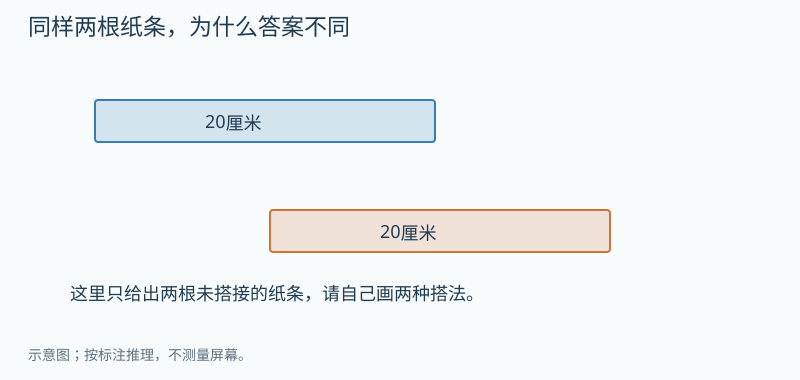

**配图文字备份（仅上传Markdown也可理解）：**两根纸条各20厘米；图只展示材料，不给定接头位置或重叠长度。
**图的显示与操作：**先显示静态条件图；允许圈画、标接头或写份数。提示层才显示重复次数/分解；不能把答案作为初始标注。

**先独立尝试；以下提示与答案供家长审核。**

提示1：试着把上面的纸条往左滑一点，总长变了吗？
提示2：分别假设重叠2厘米和5厘米，两个摆法是否都符合原话？

**参考答案：**不能确定。例如重叠2厘米时总长38厘米，重叠5厘米时总长35厘米；需要知道沿长度方向的重叠长度。其他合理例子也可。

**为什么：**

1. 纸条各长20厘米，只能知道材料共40厘米。
2. 画重叠2厘米与5厘米的两种搭接，分别得到40−2=38、40−5=35厘米。
3. 同样的已知条件允许不同答案，所以需补测重叠长度，并确认沿直线搭接。

**适用边界：**仅要求举两个反例证明不唯一，不要求穷举连续长度；不能默认没有说明的接头长度。
**怎样看出确实在思考：**能主动指出缺条件，而不是随意猜一个重叠数。
**审核状态：**auto_checked；AI编辑复核不等于人类教师确认。
**选题与帮助：**一次最多一道，允许跨日；先独立画、摆、说，再逐级提示；完整解答后仅作订正，不能记独立迁移。

##### G3-U03-TH8 三块叠在一起，还能每对都减吗

**层级：**奥数思想选学；建议8–12（可分次）分钟；先修/挂靠G3-U03-B01；思想reasoning.overcount。
**教材连接：**G3-upper印刷20–30；教材仅作知识锚点；按用户提出的连接与重叠情境原创，非声称复原其未提供的链环原图。
**为什么接在这里：**在两块去重已理解之后，检验有三重覆盖时旧办法的边界；困难选学。

**题目：**图中的共同刻度以厘米计。3条纸带都长30厘米：甲从0铺到30，乙从10铺到40，丙从20铺到50。它们都沿同一直线，没有空隙。实际覆盖从哪里到哪里，一共长多少厘米？甲乙重叠20厘米，乙丙重叠20厘米，甲丙重叠10厘米。小乐从90厘米中把这三段都减去，为什么算出的长度不对？请重点看20到30这一段。

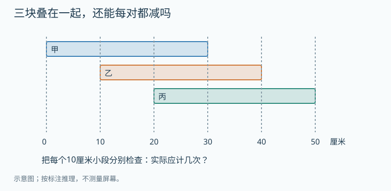

**配图文字备份（仅上传Markdown也可理解）：**共同厘米轴：甲覆盖0到30、乙10到40、丙20到50。虚线每10厘米分段，三条纸带均长30厘米。
**图的显示与操作：**先显示静态条件图；允许圈画、标接头或写份数。提示层才显示重复次数/分解；不能把答案作为初始标注。

**先独立尝试；以下提示与答案供家长审核。**

提示1：把直线按0、10、20、30、40、50分成5小段。
提示2：只盯住20到30：它原来算几次，三次减法又减几次？

**参考答案：**从0到50，共50厘米。把三对重叠都减去会得到40厘米，把20到30的一段完全减没了；应补回这10厘米。

**为什么：**

1. 直接看最左端0和最右端50，覆盖长50厘米。
2. 20到30这10厘米原本在三条纸带中被计了3次；减甲乙、乙丙、甲丙时又被减了3次，变为0次。
3. 实际应计1次，需补回10厘米：90−20−20−10+10=50厘米；先理解图，不要求记三集合公式。

**适用边界：**三重重叠的反例；仅看这个具体图，不把三集合容斥设为三年级必修。
**怎样看出确实在思考：**能逐段追踪计算次数，并解释“减重复”不是见重叠就随意全减。
**审核状态：**auto_checked；AI编辑复核不等于人类教师确认。
**选题与帮助：**一次最多一道，允许跨日；先独立画、摆、说，再逐级提示；完整解答后仅作订正，不能记独立迁移。

##### G3-U04-S01 相邻三位的和相同，哪两位必须相同

**层级：**本章提升；建议8–12（可分次）分钟；先修/挂靠G3-U04-B01；思想reasoning.cancellation。
**教材连接：**G3-upper印刷39–56；教材仅作知识锚点；参考暑假第1天的方法，重写条件和解释，未把原日程当课程顺序。
**为什么接在这里：**位值之外，比较两组共享的数，发现可消去的共同部分。

**题目：**一个四位数的千位是3，十位比千位大4。千、百、十这三位的数字之和是15；百、十、个这三位的数字之和也为15。这个数是多少？不用把所有四位数逐个试，解释千位与个位为什么相同。

**暑假来源：**20天专项第1天，本文件PDF第2页；当日思维题的方法；题文以本卡为准。

**先独立尝试；以下提示与答案供家长审核。**

提示1：把两组三位数字各写在一行，把重复的两位对齐。
提示2：两行都拿走同一个5和7，剩下的数还相等吗？

**参考答案：**3573。

**为什么：**

1. 十位是3+4=7，百位是15−3−7=5。
2. 两个和都为15，而且共同含有百位5和十位7；去掉共同部分，千位与个位必须一样。
3. 个位是3；检验3+5+7和5+7+3都为15。

**适用边界：**数位数字是0到9，千位不为0；不是任意两个三位和相同就能断言首尾相等。
**怎样看出确实在思考：**能用共享部分说明等量消去，而非只代入猜答案。
**审核状态：**auto_checked；AI编辑复核不等于人类教师确认。
**选题与帮助：**一次最多一道，允许跨日；先独立画、摆、说，再逐级提示；完整解答后仅作订正，不能记独立迁移。

##### G3-U02-S02 差变小，是哪两头一起变了

**层级：**本章提升；建议8–12（可分次）分钟；先修/挂靠G3-U02-B04；思想arithmetic.difference-change。
**教材连接：**G3-upper印刷6–19；教材仅作知识锚点；参考暑假第2天的方法，重写条件和解释，未把原日程当课程顺序。
**为什么接在这里：**从剩余的减法模型，扩展到被减数和减数同时变化。

**题目：**红盒彩珠比蓝盒多80颗。后来从红盒拿走12颗，又往蓝盒放进8颗（这8颗来自第三个盒子）。现在红盒比蓝盒多多少颗？不知道两盒原来各有多少颗，能不能确定这个差？请画两条长短条解释。

**暑假来源：**20天专项第2天，本文件PDF第3页；当日思维题的方法；题文以本卡为准。

**先独立尝试；以下提示与答案供家长审核。**

提示1：把红盒比蓝盒多出的80颗画成一段。
提示2：红条缩短、蓝条变长，空出来的差距分别怎样变？

**参考答案：**多60颗，可以确定差。

**为什么：**

1. 从红盒拿走12颗，差由80减到68。
2. 蓝盒又增加8颗，蓝条变长，所以差再减8，而不是加8。
3. 80−12−8=60；例如原来100与20，后来88与28，差60。

**适用边界：**红盒减少后仍比蓝盒多；8颗不是从已拿出的12颗中转移，两个动作条件独立且已写明。
**怎样看出确实在思考：**能解释两个变化都让差缩小，不靠背“减减加加”口诀。
**审核状态：**auto_checked；AI编辑复核不等于人类教师确认。
**选题与帮助：**一次最多一道，允许跨日；先独立画、摆、说，再逐级提示；完整解答后仅作订正，不能记独立迁移。

##### G3-U04-S03 符合数字和的数，怎样保证最小

**层级：**本章提升；建议8–12（可分次）分钟；先修/挂靠G3-U04-B01；思想reasoning.ordered-search。
**教材连接：**G3-upper印刷39–56；教材仅作知识锚点；参考暑假第3天的方法，重写条件和解释，未把原日程当课程顺序。
**为什么接在这里：**用位值比较控制查找顺序，最小要给出排除理由。

**题目：**找一个比1500大、比1700小的四位数，各位数字相加是9。最小的符合条件的数是多少？小乐找到1512，为什么它还不是最小？

**暑假来源：**20天专项第3天，本文件PDF第4页；当日思维题的方法；题文以本卡为准。

**先独立尝试；以下提示与答案供家长审核。**

提示1：从1501、1502开始，看数字和。
提示2：把剩下的3尽量放在高位还是低位，整个数更小？

**参考答案：**1503；1512虽符合数字和，但比1503大。

**为什么：**

1. 先用最小可能的千位1、百位5、十位0，此时数字和为6。
2. 个位再放3，得到1503，数字和9且在范围内。
3. 1501、1502的数字和小于9；十位增加到1会比1503大，所以1503最小。

**适用边界：**严格不含1500和1700；这里可以把剩余3放个位，不能对所有数字和题照搬。
**怎样看出确实在思考：**同时检查范围、数字和、最小性三个条件。
**审核状态：**auto_checked；AI编辑复核不等于人类教师确认。
**选题与帮助：**一次最多一道，允许跨日；先独立画、摆、说，再逐级提示；完整解答后仅作订正，不能记独立迁移。

##### G3-U04-S04 同样七颗珠，两个不同数怎样和最大

**层级：**本章提升；建议8–12（可分次）分钟；先修/挂靠G3-U04-B01；思想reasoning.optimization。
**教材连接：**G3-upper印刷39–56；教材仅作知识锚点；参考暑假第4天的方法，重写条件和解释，未把原日程当课程顺序。
**为什么接在这里：**珠子放在哪一位影响价值，把局部选择与最大值连接。

**题目：**计数器有百、十、个位三档，每档最多9颗珠。每次必须用完7颗珠拨一个三位数，记下后收回全部珠子，再拨另一个不同的三位数。两个数的和最大是多少？为什么不能把700加两遍？

**暑假来源：**20天专项第4天，本文件PDF第5页；当日思维题的方法；题文以本卡为准。

**先独立尝试；以下提示与答案供家长审核。**

提示1：一颗放百位、十位、个位分别值多少？
提示2：保留尽量多的百位珠，又要与700不同。

**参考答案：**700+610=1310。

**为什么：**

1. 7颗全放百位得到最大的700。
2. 另一个数不能仍是700；尽量保留6颗在百位，剩1颗放十位比放个位大，得到610。
3. 其余可拨出的数不超过610，所以这两个最大的不同数相加最大。

**适用边界：**是同一批7颗珠重复拨两次，不是把7颗分给两个计数器；每个数数字和均为7。
**怎样看出确实在思考：**理解不同与复用条件，说明610为何是第二大。
**审核状态：**auto_checked；AI编辑复核不等于人类教师确认。
**选题与帮助：**一次最多一道，允许跨日；先独立画、摆、说，再逐级提示；完整解答后仅作订正，不能记独立迁移。

##### G3-U02-S05 两个部分的总数，谁被数了两遍

**层级：**本章提升；建议8–12（可分次）分钟；先修/挂靠G3-U02-B05；思想reasoning.overcount。
**教材连接：**G3-upper印刷6–19；教材仅作知识锚点；参考暑假第5天的方法，重写条件和解释，未把原日程当课程顺序。
**为什么接在这里：**两步加减转向共享部分，为后面的木板去重和集合重叠搭桥。

**题目：**苹果、梨、橙子共42个。苹果和梨合计25个，梨和橙子合计30个。梨有多少个？请把三个种类画成三段，说明25+30为什么比42大。

**暑假来源：**20天专项第5天，本文件PDF第6页；当日思维题的方法；题文以本卡为准。

**先独立尝试；以下提示与答案供家长审核。**

提示1：给两个合计各画一个圈，哪种水果同时在两个圈里？
提示2：把55与真实总数42比较，多出来的是谁？

**参考答案：**梨13个；苹果12个，橙子17个。

**为什么：**

1. 25+30=55，其中苹果和橙子各一次，梨被计了两次。
2. 去掉全部水果的一次42，剩下的正是多计的一份梨：55−42=13。
3. 25−13=12，30−13=17；12+13+17=42，全部条件符合。

**适用边界：**三类互不重叠，且全部只有这三类；这里的重叠是统计范围重叠。
**怎样看出确实在思考：**能联系木板题中的重复计算，说明本题为什么反而要求重复部分。
**审核状态：**auto_checked；AI编辑复核不等于人类教师确认。
**选题与帮助：**一次最多一道，允许跨日；先独立画、摆、说，再逐级提示；完整解答后仅作订正，不能记独立迁移。

##### G3-U02-S06 两种文具，先换成同一种价格份

**层级：**本章提升；建议8–12（可分次）分钟；先修/挂靠G3-U02-B05；思想reasoning.substitution。
**教材连接：**G3-upper印刷6–19；教材仅作知识锚点；参考暑假第6天的方法，重写条件和解释，未把原日程当课程顺序。
**为什么接在这里：**先乘后加的两步问题，提升为同一种价格份的替换。

**题目：**4支记号笔和2支钢笔共50元，每支钢笔的价格是每支记号笔的3倍。两种笔每支各多少元？图中的1格代表一支记号笔的价格，先把每支钢笔换成相等价钱的格子。

**暑假来源：**20天专项第6天，本文件PDF第7页；当日思维题的方法；题文以本卡为准。

**配图文字备份（仅上传Markdown也可理解）：**4支记号笔各占1格价格，两支钢笔分别占3格价格；全部合计50元，每格同价。
**图的显示与操作：**先显示静态条件图；允许圈画、标接头或写份数。提示层才显示重复次数/分解；不能把答案作为初始标注。

**先独立尝试；以下提示与答案供家长审核。**

提示1：“3倍”比较的是一支的价格。
提示2：总价中有几个相同的一份？

**参考答案：**记号笔5元，钢笔15元。

**为什么：**

1. 4支记号笔占4格，2支钢笔共占3×2=6格。
2. 总共10个一样大的价格格值50元，一格是50÷10=5元。
3. 钢笔3格是15元；检验4×5+2×15=50。

**适用边界：**不同物品可以等价换算价格，不能说2支钢笔实际变成6支笔；除以10可用十份平均分实物体验。
**怎样看出确实在思考：**能指出每一份代表什么，不把4+2=6当总份数。
**审核状态：**auto_checked；AI编辑复核不等于人类教师确认。
**选题与帮助：**一次最多一道，允许跨日；先独立画、摆、说，再逐级提示；完整解答后仅作订正，不能记独立迁移。

##### G3-U02-S07 同一个数量，为什么出现一段缺口

**层级：**奥数思想选学；建议8–12（可分次）分钟；先修/挂靠G3-U02-O02；思想reasoning.equivalent-relations。
**教材连接：**G3-upper印刷6–19；教材仅作知识锚点；参考暑假第7天的方法，重写条件和解释，未把原日程当课程顺序。
**为什么接在这里：**一整包数量可暂用一格表示，比较同一数量的两种表述。

**题目：**绘本的本数比科普书的3倍多8本，又比科普书的4倍少4本。科普书和绘本各多少本？画两条表示同一批绘本的线段，把“多8”和“少4”标在不同位置。

**暑假来源：**20天专项第7天，本文件PDF第8页；当日思维题的方法；题文以本卡为准。

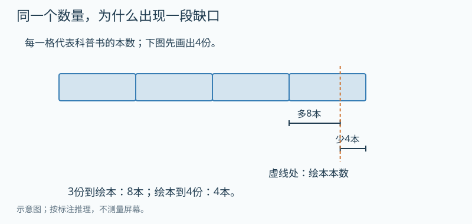

**配图文字备份（仅上传Markdown也可理解）：**科普书4个等长份并排，从3份末端到绘本点有8本，从绘本点到4份末端有4本；绘本点在两者之间。
**图的显示与操作：**先显示静态条件图；允许圈画、标接头或写份数。提示层才显示重复次数/分解；不能把答案作为初始标注。

**先独立尝试；以下提示与答案供家长审核。**

提示1：从3份走到4份，中间经过“绘本本数”这个点。
提示2：8和4是这条缺口的两段，应接起来还是抵消？

**参考答案：**科普书12本，绘本44本。

**为什么：**

1. 3份科普书到绘本还差8本，绘本到4份科普书又差4本。
2. 3份到4份合起来相差8+4=12本，这就是1份科普书。
3. 绘本3×12+8=44；再验4×12−4=44。

**适用边界：**两种说法必须描述同一批绘本；不要求先学字母方程。
**怎样看出确实在思考：**解释为何8+4，而非只记倍差公式。
**审核状态：**auto_checked；AI编辑复核不等于人类教师确认。
**选题与帮助：**一次最多一道，允许跨日；先独立画、摆、说，再逐级提示；完整解答后仅作订正，不能记独立迁移。

##### G3-L02-S08 最多的一个人，最少能做多少

**层级：**奥数思想选学；建议8–12（可分次）分钟；先修/挂靠G3-L02-B03；思想reasoning.optimization。
**教材连接：**G3-lower印刷10–38；教材仅作知识锚点；参考暑假第8天的方法，重写条件和解释，未把原日程当课程顺序。
**为什么接在这里：**平均分与余数之后，加入“另外四人相等、主角严格最多”的限制。

**题目：**乐乐和另外4个人共折34颗星星。另外4个人折的一样多，乐乐必须比他们每个人都多。乐乐最少折多少颗？有人把34÷5的余数分给乐乐，得到每人6颗、乐乐10颗；请解释为什么乐乐不能更少。

**暑假来源：**20天专项第8天，本文件PDF第9页；当日思维题的方法；题文以本卡为准。

**先独立尝试；以下提示与答案供家长审核。**

提示1：用表格记“其他每人、四人合计、乐乐”。
提示2：试把其他每人从6提高到7，会发生什么？

**参考答案：**乐乐10颗，其他每人6颗。

**为什么：**

1. 试其他每人6颗，4人共24，乐乐34−24=10，确实最多。
2. 若其他每人增到7颗，乐乐只剩34−28=6，反而比他们少。
3. 其他每人再增加，乐乐只会更少，更不符合条件；其他每人少于6，乐乐只会超过10。

**适用边界：**折的颗数为非负整数；“最多”按严格大于，不允许并列。
**怎样看出确实在思考：**给出可行方案及不可能更少的理由，不把平均数机械上取整。
**审核状态：**auto_checked；AI编辑复核不等于人类教师确认。
**选题与帮助：**一次最多一道，允许跨日；先独立画、摆、说，再逐级提示；完整解答后仅作订正，不能记独立迁移。

##### G3-UP01-S09 两次试验都从原来两袋开始

**层级：**奥数思想选学；建议8–12（可分次）分钟；先修/挂靠G3-UP01-B02；思想reasoning.equivalent-relations。
**教材连接：**G3-upper印刷31–38；教材仅作知识锚点；参考暑假第9天的方法，重写条件和解释，未把原日程当课程顺序。
**为什么接在这里：**从天平的等重替换，连接同一初始状态的两条条件。

**题目：**甲、乙两袋面粉原来各有一些。做两个分别从原状开始的试验：试验一只给甲加4千克，两袋一样重；把面粉恢复原状后，试验二只给乙加8千克，乙变成原来甲的3倍。甲、乙原来各多少千克？请分别检查两个试验，不能把两次加的东西混在一起。

**暑假来源：**20天专项第9天，本文件PDF第10页；当日思维题的方法；题文以本卡为准。

**先独立尝试；以下提示与答案供家长审核。**

提示1：先画原来的甲、乙两条；谁比谁多4？
提示2：第二个试验前要恢复原状，所以甲还是原来的长度。

**参考答案：**甲6千克，乙10千克。

**为什么：**

1. 试验一说明原来乙比甲多4千克。
2. 试验二的乙等于“原来甲+4+8”，又等于3份原来甲；多出的12千克对应2份甲。
3. 甲12÷2=6，乙6+4=10；分别验6+4=10与10+8=3×6。

**适用边界：**明确是独立试验。若连续给甲再给乙添加，答案改变；不复制原文的时序歧义。
**怎样看出确实在思考：**能在两个图中标“原来”，正确区分独立试验与连续操作。
**审核状态：**auto_checked；AI编辑复核不等于人类教师确认。
**选题与帮助：**一次最多一道，允许跨日；先独立画、摆、说，再逐级提示；完整解答后仅作订正，不能记独立迁移。

##### G3-U04-S10 四倍与多二十七，哪几份是差

**层级：**本章提升；建议8–12（可分次）分钟；先修/挂靠G3-U04-B01；思想reasoning.part-unit。
**教材连接：**G3-upper印刷39–56；教材仅作知识锚点；参考暑假第10天的方法，重写条件和解释，未把原日程当课程顺序。
**为什么接在这里：**乘法中的同样多几份，转向差占几份。

**题目：**哥哥的钱是弟弟的4倍，哥哥比弟弟多27元。两人各有多少元？把弟弟画成1份，哥哥画成4份，圈出表示27元的部分。

**暑假来源：**20天专项第10天，本文件PDF第11页；当日思维题的方法；题文以本卡为准。

**先独立尝试；以下提示与答案供家长审核。**

提示1：把两条左端对齐，盖住相同的一份。
提示2：多出的到底是4份还是3份？

**参考答案：**弟弟9元，哥哥36元。

**为什么：**

1. 4份与1份相差3份，27元对应这3份。
2. 1份为27÷3=9元，哥哥4份是36元。
3. 检验36是9的4倍，36−9=27；27不是哥哥全部的钱。

**适用边界：**倍数指相同时间的钱数，钱数非负；不要求背差倍公式。
**怎样看出确实在思考：**能区分总量与相差量，圈对三份。
**审核状态：**auto_checked；AI编辑复核不等于人类教师确认。
**选题与帮助：**一次最多一道，允许跨日；先独立画、摆、说，再逐级提示；完整解答后仅作订正，不能记独立迁移。

##### G3-L02-S11 余数条件逐层筛，最小数怎样保证

**层级：**奥数思想选学；建议8–12（可分次）分钟；先修/挂靠G3-L02-B03；思想reasoning.remainder-search。
**教材连接：**G3-lower印刷10–38；教材仅作知识锚点；参考暑假第11天的方法，重写条件和解释，未把原日程当课程顺序。
**为什么接在这里：**从一种装袋验余数，转向多个条件共同筛选。

**题目：**找最小的正整数：每3个分一组剩1个，每5个分一组也剩1个，每4个分一组却剩2个。这个数是多少？可以列候选表，但要解释为什么更小的都不合适。

**暑假来源：**20天专项第11天，本文件PDF第12页；当日思维题的方法；题文以本卡为准。

**先独立尝试；以下提示与答案供家长审核。**

提示1：从1开始，别漏掉不足一满组的情况。
提示2：先通过前两个条件，再逐个检查第三个。

**参考答案：**46。

**为什么：**

1. 从小到大列每3个剩1的数，再保留每5个也剩1的：1、16、31、46。
2. 检查除以4的余数依次是1、0、3、2，46第一次符合。
3. 验46=3×15+1=5×9+1=4×11+2；全部更小的共同候选已排除。

**适用边界：**允许商0；不必教授中国剩余定理，也不能只验46而不解释最小。
**怎样看出确实在思考：**能有序筛选、解释未漏更小候选。
**审核状态：**auto_checked；AI编辑复核不等于人类教师确认。
**选题与帮助：**一次最多一道，允许跨日；先独立画、摆、说，再逐级提示；完整解答后仅作订正，不能记独立迁移。

##### G3-LP01-S12 来回传球，一个周期不是六次

**层级：**奥数思想选学；建议8–12（可分次）分钟；先修/挂靠G3-LP01-E01；思想reasoning.cycle。
**教材连接：**G3-lower印刷77–85；教材仅作知识锚点；参考暑假第12天的方法，重写条件和解释，未把原日程当课程顺序。
**为什么接在这里：**把星期循环迁移到方向也属于状态的往返过程。

**题目：**6个小朋友排成直线，编号1到6。开始球在1号手里，这不计接球。每次传给相邻一人：从1传到6后立刻反向，传回1又反向。传球35次后，2号和4号各接到过几次？先记前10次的接球者；端点不原地再接一次。

**暑假来源：**20天专项第12天，本文件PDF第13页；当日思维题的方法；题文以本卡为准。

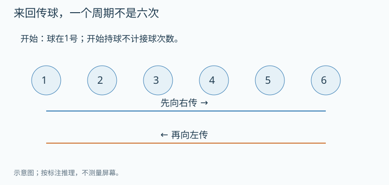

**配图文字备份（仅上传Markdown也可理解）：**六人直线站位从左到右1至6，球从1依次到6再依次回1，每次只传给相邻一人，端点立即反向。
**图的显示与操作：**先显示静态条件图；允许圈画、标接头或写份数。提示层才显示重复次数/分解；不能把答案作为初始标注。

**先独立尝试；以下提示与答案供家长审核。**

提示1：用一枚棋子来回走，每走到下一人算传一次。
提示2：一个周期要回到同一位置，而且接下来的方向相同。

**参考答案：**2号7次，4号7次。

**为什么：**

1. 前10次接球者为2、3、4、5、6、5、4、3、2、1；球回到起点且下次方向相同。
2. 35=10×3+5，3个完整周期中2号和4号各接6次。
3. 余下5次为2、3、4、5、6，两人各多1次，所以都是7次。

**适用边界：**本题开始持球不计一次接球；往返端点不重复停留。不把人数6当周期。
**怎样看出确实在思考：**能区分传了几次与经过几个人，说明10次周期。
**审核状态：**auto_checked；AI编辑复核不等于人类教师确认。
**选题与帮助：**一次最多一道，允许跨日；先独立画、摆、说，再逐级提示；完整解答后仅作订正，不能记独立迁移。

##### G3-L02-S13 两个余数相同，先拿走什么

**层级：**本章提升；建议8–12（可分次）分钟；先修/挂靠G3-L02-B03；思想reasoning.remainder-search。
**教材连接：**G3-lower印刷10–38；教材仅作知识锚点；参考暑假第13天的方法，重写条件和解释，未把原日程当课程顺序。
**为什么接在这里：**把剩余分离出来，转为可完整分组的数量。

**题目：**一盒彩笔比30支多、比50支少。每5支一组剩2支，每7支一组也剩2支。一共有多少支？先想拿出哪几支后，两种装法都不剩。

**暑假来源：**20天专项第13天，本文件PDF第14页；当日思维题的方法；题文以本卡为准。

**先独立尝试；以下提示与答案供家长审核。**

提示1：两种分法剩下的都是2，可以先单独放一边。
提示2：在29到47之间列5的倍数，再用7去检查。

**参考答案：**37支。

**为什么：**

1. 先拿出2支，剩下的能按5支或7支整组分。
2. 总数31到49，拿出2后为29到47；其中5的倍数30、35、40、45，只有35也是7的倍数。
3. 放回2支得到37；验37=5×7+2=7×5+2。

**适用边界：**严格在30与50之间；两个余数相同才可同时减去同一个余数。
**怎样看出确实在思考：**能指出先减后加回的含义及范围如何随之变化。
**审核状态：**auto_checked；AI编辑复核不等于人类教师确认。
**选题与帮助：**一次最多一道，允许跨日；先独立画、摆、说，再逐级提示；完整解答后仅作订正，不能记独立迁移。

##### G3-L02-S14 除法的四个量都在同一个总和里

**层级：**奥数思想选学；建议8–12（可分次）分钟；先修/挂靠G3-L02-B03；思想reasoning.substitution。
**教材连接：**G3-lower印刷10–38；教材仅作知识锚点；参考暑假第14天的方法，重写条件和解释，未把原日程当课程顺序。
**为什么接在这里：**把被除数=除数×商+余数用于替换一整个数量。

**题目：**一个整数除法的商是6、余数是3。被除数、除数、商、余数这四个数相加为68。被除数和除数各是多少？把除数画成1格，再把被除数画成6格加3，看看68里还包括哪些数。

**暑假来源：**20天专项第14天，本文件PDF第15页；当日思维题的方法；题文以本卡为准。

**先独立尝试；以下提示与答案供家长审核。**

提示1：四个数一个也不能漏；余数的3在两个地方出现有不同原因。
提示2：把所有不是格子的数先合起来。

**参考答案：**除数8，被除数51。

**为什么：**

1. 被除数是6格加3，除数又占1格；此外总和还包含商6和余数3。
2. 68由7格与3+6+3=12组成，所以7格是56，一格8。
3. 被除数6×8+3=51；验51+8+6+3=68，且3<8。

**适用边界：**余数须小于正除数；图上的格表示未知除数，不是数字1。
**怎样看出确实在思考：**解释两次出现3的来源，并验余数合法。
**审核状态：**auto_checked；AI编辑复核不等于人类教师确认。
**选题与帮助：**一次最多一道，允许跨日；先独立画、摆、说，再逐级提示；完整解答后仅作订正，不能记独立迁移。

##### G3-U04-S15 同是四倍，知道总数还是差数

**层级：**本章提升；建议8–12（可分次）分钟；先修/挂靠G3-U04-B01；思想reasoning.part-unit。
**教材连接：**G3-upper印刷39–56；教材仅作知识锚点；参考暑假第15天的方法，重写条件和解释，未把原日程当课程顺序。
**为什么接在这里：**与差倍卡成对，改变已知量而不是只换数字。

**题目：**甲、乙两组共60人，甲组人数是乙组的4倍。两组各多少人，相差多少人？请画图说明：60应平均分成4份、5份，还是3份？

**暑假来源：**20天专项第15天，本文件PDF第16页；当日思维题的方法；题文以本卡为准。

**先独立尝试；以下提示与答案供家长审核。**

提示1：把两个组的线段首尾接起来表示总人数。
提示2：总共的份数与多出的份数一样吗？

**参考答案：**乙12人，甲48人，相差36人；60对应5份。

**为什么：**

1. 乙1份、甲4份，合起来共5份。
2. 1份60÷5=12人，甲12×4=48人。
3. 相差3份即36人；若把60除以3，是误把总数当差数。

**适用边界：**参考暑假第15天倍数与总数，主动把“已知差求总数”改成“已知总数求差”作为对照；不是重复第10天。
**怎样看出确实在思考：**能与S10比较，按问题关系选份数而非见4倍就固定除3。
**审核状态：**auto_checked；AI编辑复核不等于人类教师确认。
**选题与帮助：**一次最多一道，允许跨日；先独立画、摆、说，再逐级提示；完整解答后仅作订正，不能记独立迁移。

##### G3-L02-S16 报到几号与余数，差在整轮的时候

**层级：**本章提升；建议8–12（可分次）分钟；先修/挂靠G3-L02-B03；思想reasoning.cycle。
**教材连接：**G3-lower印刷10–38；教材仅作知识锚点；参考暑假第16天的方法，重写条件和解释，未把原日程当课程顺序。
**为什么接在这里：**把余数用于循环报数，同时处理报到最后一号时余数为0的边界。

**题目：**队伍人数比25多、比40少。每人依次报1、2、3、4，然后从1重新开始，最后一人报3；另一次每人依次循环报1、2、3，最后一人报2。队伍多少人？再解释：如果最后一人恰好报4，人数除以4的余数是4还是0？

**暑假来源：**20天专项第16天，本文件PDF第17页；当日思维题的方法；题文以本卡为准。

**先独立尝试；以下提示与答案供家长审核。**

提示1：先列每4人一轮、再多3人的人数。
提示2：把4个人实际报一轮，是否还剩没编进整轮的人？

**参考答案：**35人；报4时余数是0。

**为什么：**

1. 26到39中，按4循环最后报3的候选为27、31、35、39。
2. 这些数除以3的余数依次是0、1、2、0，只有35符合第二个条件。
3. 报4意味着完整一轮刚结束，剩余人数为0；余数不能等于除数4。

**适用边界：**每次从队首报1，每人只报一次；报数号码与余数并非在所有情况下完全相同。
**怎样看出确实在思考：**能解释报最后一号对应余0，防止机械翻译。
**审核状态：**auto_checked；AI编辑复核不等于人类教师确认。
**选题与帮助：**一次最多一道，允许跨日；先独立画、摆、说，再逐级提示；完整解答后仅作订正，不能记独立迁移。

##### G3-U02-S17 送出去以后，要倒着走两步

**层级：**本章提升；建议8–12（可分次）分钟；先修/挂靠G3-U02-O01；思想reasoning.inverse。
**教材连接：**G3-upper印刷6–19；教材仅作知识锚点；参考暑假第17天的方法，重写条件和解释，未把原日程当课程顺序。
**为什么接在这里：**从运算逆推迁移到有明确时间先后的数量变化。

**题目：**小雨原有26张卡片，送给小明2张后，小雨剩下的是小明这时卡片数的3倍。小明原有多少张？在“送前、送后”两列里分别记数，解释为何最后要减2。

**暑假来源：**20天专项第17天，本文件PDF第18页；当日思维题的方法；题文以本卡为准。

**先独立尝试；以下提示与答案供家长审核。**

提示1：先找送后小雨有多少。
提示2：求出8时，小明收到礼物了吗？

**参考答案：**小明原有6张。

**为什么：**

1. 送后小雨26−2=24张。
2. 送后小明24÷3=8张，这是已经收到2张之后的数量。
3. 倒回送前，小明8−2=6张；检验26−2=3×(6+2)。

**适用边界：**3倍比较的是同一时刻“送后”的数量；不是小雨原来的26与小明原来相比。
**怎样看出确实在思考：**能标清各个数的时点，解释最后减而非加。
**审核状态：**auto_checked；AI编辑复核不等于人类教师确认。
**选题与帮助：**一次最多一道，允许跨日；先独立画、摆、说，再逐级提示；完整解答后仅作订正，不能记独立迁移。

##### G3-U02-S18 一个给出五元，差为什么变成十元

**层级：**奥数思想选学；建议8–12（可分次）分钟；先修/挂靠G3-U02-O02；思想reasoning.transfer-invariant。
**教材连接：**G3-upper印刷6–19；教材仅作知识锚点；参考暑假第18天的方法，重写条件和解释，未把原日程当课程顺序。
**为什么接在这里：**把总数不变、双方同时变化与倍数关系连起来。

**题目：**兄弟原来各有同样多的钱。弟弟给哥哥5元后，哥哥现有的钱是弟弟现有的3倍。原来每人有多少元、两人共多少元？只看手里的钱，不计还款。先解释给出5元后两人的差为什么是10元。

**暑假来源：**20天专项第18天，本文件PDF第19页；当日思维题的方法；题文以本卡为准。

**先独立尝试；以下提示与答案供家长审核。**

提示1：同时移动两条的端点，而不是只给哥哥加5。
提示2：现在的2份差对应10元，先求现在的一份。

**参考答案：**原来每人10元，共20元。

**为什么：**

1. 哥哥增加5、弟弟减少5，两条原来同长的线段相差5+5=10元。
2. 现在哥哥3份、弟弟1份，相差2份，所以弟弟现在10÷2=5元，哥哥15元。
3. 倒回原状各为10元，总数20；转移不改变总数。

**适用边界：**改写原文“借钱”为给出，避免余额与债务混淆；只比较现有现金。
**怎样看出确实在思考：**能解释差变两倍而总数不变，再逆推原来。
**审核状态：**auto_checked；AI编辑复核不等于人类教师确认。
**选题与帮助：**一次最多一道，允许跨日；先独立画、摆、说，再逐级提示；完整解答后仅作订正，不能记独立迁移。

##### G3-U06-S19 第三次反弹往回找，要乘几次二

**层级：**本章提升；建议8–12（可分次）分钟；先修/挂靠G3-U06-B05；思想reasoning.inverse。
**教材连接：**G3-upper印刷73–91；教材仅作知识锚点；参考暑假第19天的方法，重写条件和解释，未把原日程当课程顺序。
**为什么接在这里：**每次取前一次的一半，逆向时恢复整个数量。

**题目：**在这道题的理想模型里，每次反弹高度都恰好是前一次反弹高度的一半。第3次反弹高6厘米，第1次反弹高多少厘米？请在第1、2、3次三个格子间画箭头，再说为什么不是乘3次2。

**暑假来源：**20天专项第19天，本文件PDF第20页；当日思维题的方法；题文以本卡为准。

**先独立尝试；以下提示与答案供家长审核。**

提示1：把三个时刻排开，数连接它们的箭头。
提示2：从一半恢复原来的全部，应该怎样算？

**参考答案：**第1次24厘米，第2次12厘米。

**为什么：**

1. 第3次6是第2次的一半，第2次为6×2=12厘米。
2. 第2次12是第1次的一半，第1次为12×2=24厘米。
3. 从第3次退到第1次只有2个间隔；顺着验24、12、6。

**适用边界：**模型不声称真实球每次都恰好一半；只问第1次反弹，不问最初落下高度或总路程。
**怎样看出确实在思考：**能区分次数编号与变化间隔，解释逆向乘2。
**审核状态：**auto_checked；AI编辑复核不等于人类教师确认。
**选题与帮助：**一次最多一道，允许跨日；先独立画、摆、说，再逐级提示；完整解答后仅作订正，不能记独立迁移。

##### G3-UP01-S20 换小砝码之前，先凑成可以换的一组

**层级：**本章提升；建议8–12（可分次）分钟；先修/挂靠G3-UP01-B02；思想reasoning.substitution。
**教材连接：**G3-upper印刷31–38；教材仅作知识锚点；参考暑假第20天的方法，重写条件和解释，未把原日程当课程顺序。
**为什么接在这里：**等量替换需要匹配整组关系，不把系数直接乱乘。

**题目：**有熊形、猴形、兔形三种模型砝码，同种砝码质量相同。1个熊形恰好与4个猴形一样重；2个猴形恰好与3个兔形一样重。1个熊形与几个兔形一样重？先把4个猴形分组，再替换。

**暑假来源：**20天专项第20天，本文件PDF第21页；当日思维题的方法；题文以本卡为准。

**先独立尝试；以下提示与答案供家长审核。**

提示1：题目允许把1个猴形直接换成3个兔形吗？
提示2：先在4个猴形里每2个圈一组。

**参考答案：**6个兔形砝码。

**为什么：**

1. 把熊形换成4个猴形，质量不变。
2. 4个猴形分成2组，每组2个；每组可换3个兔形。
3. 共2×3=6个兔形；不能4×3，因为一组3个兔形对应的是2个猴形。

**适用边界：**使用玩具模型砝码，避免把虚构动物重量关系当自然常识；要求同种等重。
**怎样看出确实在思考：**能说清一次替换对应哪一组，并解释不直接乘12。
**审核状态：**auto_checked；AI编辑复核不等于人类教师确认。
**选题与帮助：**一次最多一道，允许跨日；先独立画、摆、说，再逐级提示；完整解答后仅作订正，不能记独立迁移。

### 附录：混合运算基础的独立诊断

#### G3-U02-D01 同级与第二步

计算36÷6×2，写出第一步和最终结果。

参考：36÷6=6，再6×2=12。 理由：不把6×2先算；不能只停在6。

审核：auto_checked；讲解与常规练习不展示；仅单元检查发题。已看过答案的重做不能作为独立样本。

#### G3-U02-D02 先乘除与自查

计算40−4×6，保留首答，检查后再确认最终答。

参考：先4×6=24，再40−24=16。 理由：运算顺序按约定；不把36×6作为原式。

审核：auto_checked；讲解与常规练习不展示；仅单元检查发题。已看过答案的重做不能作为独立样本。

#### G3-U02-D03 按题意列括号

红纸14张、蓝纸10张，把所有纸平均分给4人。每人几张？写一个综合算式，说明括号中的量。

参考：(14+10)÷4=6张。 理由：括号表示要平均分的总张数24。

审核：auto_checked；讲解与常规练习不展示；仅单元检查发题。已看过答案的重做不能作为独立样本。

#### G3-U02-D04 两步中间量

每盒彩笔8支，买3盒后送出5支。还剩多少支？先说明每一步求什么。

参考：先8×3=24支，再24−5=19支。 理由：乘积是总支数，减的是同一种支数。

审核：auto_checked；讲解与常规练习不展示；仅单元检查发题。已看过答案的重做不能作为独立样本。

#### G3-U02-D05 逆过程验算

盒中原有50张贴纸，取走16张又放回6张。剩多少？从结果倒着检查能否回到50。

参考：40张；40−6+16=50。 理由：依次撤销放回和取走，不把逆算和新题的规则混淆。

审核：auto_checked；讲解与常规练习不展示；仅单元检查发题。已看过答案的重做不能作为独立样本。

### 附录：三年级教材核对

#### 三年级教材核对记录

##### 来源与页码

| 来源 ID | 本地 PDF | PDF 总页数 | 正文页关系 |
|---|---|---:|---|
| G3-upper | [三年级上册](../../research/source-textbooks/grade-3/义务教育教科书数学三年级上册.pdf) | 114 | 印刷页 + 6 = PDF 序号 |
| G3-lower | [三年级下册](../../research/source-textbooks/grade-3/义务教育教科书%20数学%20三年级下册.pdf) | 114 | 印刷页 + 6 = PDF 序号 |

两册均以实际目录为依据，不套用另一版常见的“三上时分秒、三下位置方向”目录。上册印刷104页后记说明依据2022年版课标编写。版权页未提供可确认的具体出版年月，不能把 PDF 文件日期当成版次。来源文件为扫描图；全文识别文本仅供定位，分数、符号及图题须对照页面图像。

##### 单元覆盖核对

| 册别与实际目录项 | 印刷页 | 课程单元 | 关键内容与边界 |
|---|---:|---|---|
| 上·观察物体 | 1–5 | G3-U01 | 多方向观察、线索不足、剪展纸盒；不提前要求标准三视图绘制 |
| 上·混合运算 | 6–19 | G3-U02 | 同级从左到右、先乘除后加减、小括号、两步问题、等值写法；E/O为延伸 |
| 上·毫米、分米和千米 | 20–30 | G3-U03 | 尺刻度、换单位、长距离标准段估计与整理 |
| 上·曹冲称象的故事 | 31–38 | G3-UP01 | 实际包含克、千克、吨和称量活动，不能仅改成等量替换故事 |
| 上·多位数乘一位数 | 39–56 | G3-U04 | 口算、位值竖式、进位、0、估算及问题解决 |
| 上·数字编码 | 57–60 | G3-UP02 | 编号意义、编码规则、避免冲突；不收集真实身份资料 |
| 上·线和角 | 61–72 | G3-U05 | 线段射线直线、比较与复制线段、角与分类；度数留给四上 |
| 上·分数的初步认识 | 73–91 | G3-U06 | 几分之一与几分之几、简单加减、一组物品的分数；等值纸带仅作体验 |
| 上·复习与关联 | 92–100 | G3-U07-R01 | 综合诊断、针对错误回补，避免重教全册 |
| 上·数学广角：搭配问题 | 101–102 | G3-U07-B01 | 逐项固定、表格枚举、加法与乘法计数的区别 |
| 下·生活中的运动现象 | 1–9 | G3-L01 | 对称、平移、旋转与剪纸实践；精确旋转作图后续深化 |
| 下·除数是一位数的除法 | 10–38 | G3-L02 | 口算估算、竖式、余数与验算、商0、连乘连除、归一归总 |
| 下·长方形和正方形 | 39–51 | G3-L03 | 多边形、边角、周长、拼图与外边界变化 |
| 下·图形的面积 | 52–64 | G3-L04 | 平方单位、行列计数推公式、进率100、分割拼补与周长对比 |
| 下·数据的收集与整理 | 65–76 | G3-L05 | 调查规则、单/复式表、分组边界、比较与结论范围 |
| 下·年、月、日的秘密 | 77–85 | G3-LP01 | 年历、月份、平闰年、24时、时长、制作月历和日影记录 |
| 下·小数的初步认识 | 86–94 | G3-L06 | 测量/货币小数、比较、简单加减；系统位值扩展留给四下 |
| 下·复习与关联 | 95–101 | G3-L07-R01 | 跨单元诊断与实际方案 |
| 下·数学广角：重叠问题 | 102–104 | G3-L07-B01 | 姓名集合、每人只计一次、两集合容斥 |

“覆盖”表示上述知识与活动有明确课程位置，不表示照抄每一道教材习题。练习和情境均重新编写。较长的综合实践可以跨两次学习完成。

##### 混合运算的关键依据

- 印刷6–8页（PDF12–14）：运算顺序与括号。不能把规则缩成“乘法总在除法前、加法总在减法前”。
- 印刷12–14页（PDF18–20）：同一数量关系的分步算式、综合算式、不同解法。去括号应从数量意义生长出来。
- 印刷19页（PDF25）：比较 `a−b+c` 与 `a−(b−c)`、连续乘除与括号内除法等写法；另有因错算顺序反求原数的思考题。课程 E01/E02/O01据此扩展，并限制在能理解的正整数实例。
- 三下印刷27–34页（PDF33–40）：多层分组、归一与归总。三下重点是数量模型的迁移，不再从头背一次混合运算口诀。

##### 核对方法与限制

已逐册检查目录并对混合运算关键页作图像核对；使用全书识别文本查找小节、练习与综合实践，重要符号以原页面为准。当前交付是完整逐课内容初稿；具体讲解的难度、每课实际耗时和题目区分度仍需 Kevin 试学。没有把试学尚未发生的效果写成“已验证有效”。

##### 2026-09-24 外审后的定点复核

本轮重新查看两册PDF第6页目录以及三上PDF第25页（印刷19页）扫描图。目录仍为上册9个、下册8个入口，含综合实践；数学广角保留在册末，不伪造一个目录编号单元。

印刷19页确有“连续加减与带括号式”“连续除乘与括号内除法”的比较，以及错序运算逆推。因此E01/E03的等值改写、E02的除法比较、O01的逆推是从本章练习自然延伸。E04交换/结合、E05分配、O02整体替换为原创选学拓展；其anchor仅表示与本章数量关系的联系，不能解读为该页已经正式讲完所有运算律。

三年级现为60课、720道课内练习，另5道基础诊断、1道专用迁移及60道思维收尾题（34张原卡、20张暑假方法改写卡、6张长度连接卡）。每课新增最低证据、具体操作、撤除帮助后的独立题与审核状态。题文可机读不等于判题已实现；AI复核不算人类教师审定。四至六年级本轮冻结，未继续核对其教材正文。

##### 暑假训练补充来源（2026-09-24）

来源summer-20days：[Kevin数学20天专项练习](../../docs/review/Kevin_数学20天专项练习_指定页码版.pdf)，26页。PDF第1页索引，第2–21页依次对应第1–20天，第22–26页参考答案。其文内“原PDF第×页”指另一份材料，不能用于定位本文件。

已读20天全部60道思维题并重新验算相应答案；300道口算不在本轮核验范围。数值符合参考答案，但第9天两次添加必须明确为独立试验；第4天应明确7颗珠每次重新使用；周期题与反弹题要标清初始状态和计数口径。新题不是整份原文搬入：提取20天方法，按教材位置重写，尤其第15天改为与差倍对照的和倍任务，减少同构重复。

用户描述的链环/木板原配图不在此专项内。项目另画15幅数学SVG，其中链环明确给定外长与两端部投影结构，仅在这些条件下推出130毫米；不能反向宣称复原了用户未提供的原图。

> 4年级冻结原稿：以下内容本轮不修改。

## 4年级逐课备课方案

教案与12题分层练习已补齐，含4道独立间隔回顾；待内容复核与Kevin试学，未接入网站

教材目录混版，不能用旧版四上目录替换实际PDF。共用基础节点去重；两位数除法桥接；鸡兔同笼两处来源共用一套课。前4题建议当堂，后2题选做或间隔回顾。

共 71 课，852 道练习，每题附答案和理由。B为基础或必要衔接，E为提升，O为思想专题，R为复习诊断。教材中的数学广角按基础成熟程度选学，不作为升级门槛。

每课有12道练习：原有6题与补充2题是当堂或下一次学习的备选题，另4题分别安排在完成核心学习后的第1、3、7、21天独立回顾。一次通常选3—5题，复杂课可分两次；不能同一天把12题全部做完并声称长期掌握。日程是教案设计，网站调度尚未接入。

页码是原教材印刷页与PDF序号，原创题并非教材原题。先修关系提供建议，不锁定入口。所有无图文字题应能独立理解。

### 目录

| 单元 | 原教材页 | 课程顺序 |
|---|---|---|
|G4-U01 万以上数的认识|1–23|[B01](#g4-u01-b01) → [B02](#g4-u01-b02) → [B03](#g4-u01-b03) → [B04](#g4-u01-b04) → [E01](#g4-u01-e01)|
|G4-U02 1亿有多大|24–27|[B01](#g4-u02-b01)|
|G4-U03 角的度量|28–38|[R01](#g4-u03-r01) → [B02](#g4-u03-b02) → [B03](#g4-u03-b03) → [E01](#g4-u03-e01)|
|G4-U04 多位数乘两位数|39–57|[B01](#g4-u04-b01) → [B02](#g4-u04-b02) → [E01](#g4-u04-e01)|
|G4-U05 加法模型和乘法模型|58–69|[B01](#g4-u05-b01) → [B02](#g4-u05-b02) → [E01](#g4-u05-e01) → [R01](#g4-u05-r01) → [O01](#g4-u05-o01)|
|G4-U06 平行四边形和梯形|70–87|[B01](#g4-u06-b01) → [B02](#g4-u06-b02) → [B03](#g4-u06-b03) → [E01](#g4-u06-e01)|
|G4-U07 条形统计图|88–101|[B01](#g4-u07-b01) → [E01](#g4-u07-e01)|
|G4-U08 寻找宝藏|102–107|[B01](#g4-u08-b01) → [E01](#g4-u08-e01)|
|G4-U09 复习与关联|108–120|[R01](#g4-u09-r01) → [R02](#g4-u09-r02)|
|G4-X01 混版必要桥接：除数是两位数|无本套教材对应完整单元|[B01](#g4-x01-b01) → [B02](#g4-x01-b02) → [B03](#g4-x01-b03) → [B04](#g4-x01-b04)|
|G4-L01 四则运算|2–12|[B01](#g4-l01-b01) → [B02](#g4-l01-b02) → [E01](#g4-l01-e01) → [E02](#g4-l01-e02)|
|G4-L02 观察物体（二）|13–16|[B01](#g4-l02-b01) → [E01](#g4-l02-e01)|
|G4-L03 运算律|17–31|[B01](#g4-l03-b01) → [B02](#g4-l03-b02) → [B03](#g4-l03-b03) → [E01](#g4-l03-e01) → [E02](#g4-l03-e02) → [E03](#g4-l03-e03) → [O01](#g4-l03-o01)|
|G4-L04 小数的意义和性质|32–56|[B01](#g4-l04-b01) → [B02](#g4-l04-b02) → [B03](#g4-l04-b03) → [B04](#g4-l04-b04) → [B05](#g4-l04-b05) → [E01](#g4-l04-e01)|
|G4-L05 三角形|57–68|[B01](#g4-l05-b01) → [B02](#g4-l05-b02) → [B03](#g4-l05-b03) → [B04](#g4-l05-b04) → [E01](#g4-l05-e01)|
|G4-L06 小数的加法和减法|69–78|[B01](#g4-l06-b01) → [B02](#g4-l06-b02) → [E01](#g4-l06-e01)|
|G4-L07 图形的运动（二）|79–86|[B01](#g4-l07-b01) → [B02](#g4-l07-b02) → [E01](#g4-l07-e01)|
|G4-L08 平均数与条形统计图|87–96|[B01](#g4-l08-b01) → [B02](#g4-l08-b02) → [E01](#g4-l08-e01)|
|G4-L09 营养午餐|97–98|[B01](#g4-l09-b01)|
|G4-L10 数学广角：鸡兔同笼|99–102|[B01](#g4-l10-b01) → [B02](#g4-l10-b02) → [E01](#g4-l10-e01)|
|G4-L11 总复习|103–111|[R01](#g4-l11-r01) → [R02](#g4-l11-r02)|

### G4-U01 万以上数的认识

#### G4-U01-B01 每十个换一份：把数位扩展到亿

**定位：** B；建议35分钟。来源G4-UP：印刷1–23 / PDF 7–29。
页码是核对后的对应单元范围，不声称每题来自教材。例题练习均为原创。

**先修：**万以内数的组成；十个一是十
**关联课程：**依已有能力直接进入

**目标：**把亿以内和亿以上的数放入同一十进制数位表，区分数字、数位和计数单位。

**真实问题：**仓库收到一千万颗螺丝，怎样记录，才不用写一千万个记号？

**为什么：**把相同数量打包，每满十份换成高一级的一份，有限的数字就能记录大数量。

**模型操作：**画个、十、百、千、万、十万、百万、千万、亿九列；用一枚筹码在相邻列移动，比较表示的数量。

**讲解：**

1. 从10个千换成1个万继续打包，10个万是1个十万。
2. 同一数字写在左边相邻数位，表示原来的10倍；这是数位的作用。
3. 把40206000拆成40000000、200000、6000，空着的数位要用0占住。

**原创例题：**七千万、五十万和三百合起来是多少？

1. 在千万位写7，十万位写5，百位写3。
2. 其余数位用0占位，逐位检查。

答案：70500300

**练习与讲评：**

1. 【基础】10个百万是多少？
   答案：一千万 理由：相邻计数单位之间的进率是10
2. 【基础】630000中3表示多少？
   答案：3个万，即30000 理由：3在万位
3. 【变式】有人把4个百万和6个百写成400060，改正。
   答案：4000600 理由：百万是第7位，百是第3位
4. 【迁移】图书馆编号从999999再添1，得到什么？
   答案：1000000 理由：连续满十进一
5. 【挑战】同一个5从千位移到十万位，表示的数变成几倍？
   答案：100倍 理由：向左跨两位，每跨一位乘10
6. 【回顾】用加法拆开90802000。
   答案：90000000+800000+2000 理由：每个非零数位贡献相应数量
7. 【补充变式】数字7在70、70000、7000000里分别表示多少？
   答案：7个十、7个万、7个百万。 理由：数字相同，所在数位决定计数单位。
8. 【补充变式】10个一千万是多少？再有10个这样的数是多少？
   答案：一亿；十亿。 理由：相邻数位满十进一。
9. 【独立回顾】〔第1天独立回顾〕一个数由4个千万、6个万、2个百组成，写出这个数。
   答案：40060200。 理由：缺少的数位用0占位。
10. 【独立回顾】〔第3天独立回顾〕“十万位左边是万位”对吗？
   答案：不对，左边是百万位。 理由：向左相邻位的单位扩大10倍。
11. 【独立回顾】〔第7天独立回顾〕工厂原有9个十万件，再生产1个十万件，一共多少件？
   答案：1000000件。 理由：10个十万换成1个百万。
12. 【独立回顾】〔第21天独立回顾〕为什么500005中的两个5表示的数量不同？
   答案：左边5表示50万，右边5表示5个一。 理由：十进制用位置承载不同大小的单位。

**练习安排：**8道当堂备选题加4道分日独立回顾题，共12题。一次通常选3—5题，按表现补做；不能把同一天看过答案后的重做计为间隔保持。

**证据边界：**参考答案及理由用于教研/家长核对。等价的正确表达同样接受；开放解释不自动判满分。分日题使用了独立题干，但真实呈现、帮助记录和调度尚待接入网站。

**易错：**相邻数级之间也是10倍。 → 个级、万级、亿级各有四位，相邻数级的基本单位之间是10000倍；相邻数位才是10倍。

**Kevin复述：**同一个3为什么放在万位比放在千位多表示十倍？

**后续联系：**接读写大数；以后小数位值向右继续扩展。

#### G4-U01-B02 四位分一级：读清楚、写清楚大数

**定位：** B；建议35分钟。来源G4-UP：印刷1–23 / PDF 7–29。
页码是核对后的对应单元范围，不声称每题来自教材。例题练习均为原创。

**先修：**大数的数位与计数单位
**关联课程：**G4-U01-B01

**目标：**按亿级、万级、个级读写，理解0的占位作用。

**真实问题：**捐书记录写着30040506本，广播员怎样读才不会把数量说错？

**为什么：**分级把长数字分成能处理的小块；0保留空位，读法只需清楚表达数量。

**模型操作：**用竖线把30040506划成3004|0506，再在数位表中逐位定位。

**讲解：**

1. 从右往左每四位分一级，各级先按万以内数读。
2. 读完万级、亿级加上级名；一个级末尾的0不读，级内连续0只读一个零。
3. 写数先确定各级数，缺的数位补0，最后回读核对。

**原创例题：**写出“二亿零三万零九”。

1. 亿级写2，万级写0003，个级写0009。
2. 按亿级、万级、个级接成200030009，再回读核对。

答案：200030009

**练习与讲评：**

1. 【基础】读出7050000。
   答案：七百零五万 理由：万级是705，个级全0
2. 【基础】写出六千万零四十。
   答案：60000040 理由：千万位6、十位4，其余0
3. 【变式】10001000应读“一千万一千”吗？
   答案：应读一千万一千 理由：万级1000读一千万，个级1000读一千，级间无需另添零
4. 【迁移】一张标签写“二百四十万零六”，数字标签应是什么？
   答案：2400006 理由：240万加6
5. 【挑战】用0、0、0、1、2各一次写出最大的五位数。
   答案：21000 理由：高位尽量大且首位不为0
6. 【回顾】把30040506分级并读出。
   答案：3004|0506，三千零四万零五百零六 理由：万级与个级分别读，低级前导空位用零连接
7. 【补充变式】写出“三千零五万零八十”。
   答案：30050080。 理由：万级3005、个级0080，各级按四位定位。
8. 【补充变式】把405020006按四位一级分开并读出。
   答案：4｜0502｜0006，四亿零五百零二万零六。 理由：中间缺位用零衔接，末尾连续0不逐个读。
9. 【独立回顾】〔第1天独立回顾〕“七百万零九”写成哪个数？
   答案：7000009。 理由：7在百万位，9在个位，其余占0。
10. 【独立回顾】〔第3天独立回顾〕把6000800读作“六百万八千”对吗？
   答案：不对，应读六百万零八百。 理由：8位于百位，不是千位。
11. 【独立回顾】〔第7天独立回顾〕一个记录写为12｜0030｜0405，去掉分级线后是多少？怎样读？
   答案：1200300405，十二亿零三十万零四百零五。 理由：每级保持四位，不能漏掉占位0。
12. 【独立回顾】〔第21天独立回顾〕读数时不把每个0都读出，写数时为什么仍不能随意删0？
   答案：读法有合并零的约定，但0记录数位空缺。 理由：删0会使其他数字移到不同数位。

**练习安排：**8道当堂备选题加4道分日独立回顾题，共12题。一次通常选3—5题，按表现补做；不能把同一天看过答案后的重做计为间隔保持。

**证据边界：**参考答案及理由用于教研/家长核对。等价的正确表达同样接受；开放解释不自动判满分。分日题使用了独立题干，但真实呈现、帮助记录和调度尚待接入网站。

**易错：**数中有几个0就读几个零。 → 0负责占位，读几个零由位置决定，不由0的个数决定。

**Kevin复述：**为什么二亿零三万零九写数时需要这么多个0，却不用一个个读？

**后续联系：**接比较大数；读写已经熟练时不另刷同类抄写。

#### G4-U01-B03 先看最高不同位：比较大数

**定位：** B；建议35分钟。来源G4-UP：印刷1–23 / PDF 7–29。
页码是核对后的对应单元范围，不声称每题来自教材。例题练习均为原创。

**先修：**读写大数
**关联课程：**G4-U01-B02

**目标：**用位值解释大小比较，避免只盯某个大数字。

**真实问题：**两个场馆分别有99890个和100050个座位，哪一个更大？

**为什么：**高一级的一份能超过低级所有数位的最大组合，所以应先看位数，再从高位比较。

**模型操作：**在两张同长度数位表中对齐两个数，从左向右圈出第一处不同。

**讲解：**

1. 不含前导0的整数先比较位数，位数多的数大。
2. 位数相同时从最高位向右，第一次不同的数字决定大小。
3. 比较“万”“亿”表示的数时先统一表示方式，不能只比眼前数字。

**原创例题：**比较508900与50万，并说明理由。

1. 50万=500000。
2. 十万位同为5，万位同为0；千位8大于0。

答案：508900>50万

**练习与讲评：**

1. 【基础】在999999与1000000间填大小关系。
   答案：999999<1000000 理由：六位数小于七位数
2. 【基础】按从小到大排列405060、450060、405600。
   答案：405060<405600<450060 理由：从最高不同数位比较
3. 【变式】“999万比1亿大，因为999比1大”对吗？
   答案：不对 理由：1亿=10000万
4. 【迁移】限载95000千克，货重94800千克，可装下吗？
   答案：可以，还差200千克到限载 理由：94800<95000
5. 【挑战】要使68□920>685990，□可填什么数字？
   答案：6、7、8、9 理由：□=5时后面920<990，必须大于5
6. 【回顾】怎样不用完整计算判断700000+8000与709000谁大？
   答案：709000大 理由：前者708000，差在千位
7. 【补充变式】比较999999和1000000，哪个大？
   答案：1000000大。 理由：位数更多且最高位非0，已进入百万。
8. 【补充变式】比较5070800与5078000，从哪一位开始不同？
   答案：千位，后者大。 理由：前面的百万、十万、万位相同，千位0小于8。
9. 【独立回顾】〔第1天独立回顾〕把820000、802000、800200按从小到大排列。
   答案：800200＜802000＜820000。 理由：从最高不同位逐位比较。
10. 【独立回顾】〔第3天独立回顾〕“末尾数字9比末尾数字1大，所以239比501大”错在哪里？
   答案：应先比最高不同位，百位2小于5。 理由：低位差不能抵消更高位的差。
11. 【独立回顾】〔第7天独立回顾〕两个城市藏书分别为3040500册与3045000册，哪座更多，多多少册？
   答案：3045000册的更多，多4500册。 理由：同数位比较后相减。
12. 【独立回顾】〔第21天独立回顾〕两个同位数整数为什么从最高不同位比较就够了？
   答案：高位多1所增加的量，大于后面全部低位可能补出的最大差。 理由：位值保证了这个比较顺序。

**练习安排：**8道当堂备选题加4道分日独立回顾题，共12题。一次通常选3—5题，按表现补做；不能把同一天看过答案后的重做计为间隔保持。

**证据边界：**参考答案及理由用于教研/家长核对。等价的正确表达同样接受；开放解释不自动判满分。分日题使用了独立题干，但真实呈现、帮助记录和调度尚待接入网站。

**易错：**把两个数右边对齐后，从个位开始比较。 → 从最高不同位比较；个位再大也不能抵消高位的不足。

**Kevin复述：**为什么位数一样时，找到第一处不同后就可以停止比较？

**后续联系：**接近似数与范围；不把大小比较单独包装成奥数。

#### G4-U01-B04 精确记录与大约数量：改写和四舍五入

**定位：** B；建议35分钟。来源G4-UP：印刷1–23 / PDF 7–29。
页码是核对后的对应单元范围，不声称每题来自教材。例题练习均为原创。

**先修：**数位、大小比较
**关联课程：**G4-U01-B03

**目标：**区分整万整亿数的准确改写与省略尾数求近似数。

**真实问题：**新闻只需说明会场大约有多少人，售票系统却必须知道准确人数，两种记录为什么不同？

**为什么：**近似数保留需要的精度，牺牲部分细节换取易读；准确改写没有改变数量。

**模型操作：**画以万为间隔的数线，把68400放在60000和70000之间，再标出中点65000。

**讲解：**

1. 80000=8万是同一个数的不同写法。
2. 68400不是整万数，按四舍五入保留到万位，看千位6，进到7万。
3. 用约等号标出信息被舍去；知道“大约7万”无法恢复唯一原数。

**原创例题：**某馆有264850本书，准确数用数字写着；按万本报告是多少？

1. 保留万位，看千位4。
2. 4小于5，尾数舍去，写约26万本。

答案：264850≈26万本

**练习与讲评：**

1. 【基础】70000000改写成以万为单位的数。
   答案：7000万 理由：准确改写，不舍去数量
2. 【基础】把45800按四舍五入保留到万位。
   答案：约5万 理由：千位5，需要进一
3. 【变式】判断80000≈8万必须写约等号吗？
   答案：不必，应写80000=8万 理由：完全相等，未取近似
4. 【迁移】限人数50000，报名人数四舍五入约5万，能断定没超限吗？
   答案：不能 理由：例如52000也约5万却超限
5. 【挑战】一个整数保留到万位约是3万，最小、最大可能是多少？
   答案：25000、34999 理由：中点25000进到3万，35000进到4万
6. 【回顾】99950000保留到万位是多少？
   答案：约10000万，即约1亿 理由：千位5进一，连续进位
7. 【补充变式】560000准确改写成以万为单位的数是多少？
   答案：56万。 理由：560000除以10000，没有省略实际数量。
8. 【补充变式】把745600省略万位后面的尾数，约是多少万？
   答案：75万。 理由：千位是5，向万位进1。
9. 【独立回顾】〔第1天独立回顾〕39960000取近似数到万位是多少？
   答案：3996万。 理由：原数是整万数，此次没有数值变化。
10. 【独立回顾】〔第3天独立回顾〕“420000=42万”和“424900≈42万”有什么不同？
   答案：前者准确相等，后者经过舍入只是近似。 理由：改写单位不一定损失信息，取近似数可能损失。
11. 【独立回顾】〔第7天独立回顾〕某地人口约30万，能据此肯定恰好有300000人吗？
   答案：不能。 理由：“约”表示允许一个舍入范围，不是精确人数。
12. 【独立回顾】〔第21天独立回顾〕四舍五入到万位时为什么看千位，而不是看个位？
   答案：千位决定剩余部分是否达到半个万。 理由：只看个位不能判断应保留还是进一。

**练习安排：**8道当堂备选题加4道分日独立回顾题，共12题。一次通常选3—5题，按表现补做；不能把同一天看过答案后的重做计为间隔保持。

**证据边界：**参考答案及理由用于教研/家长核对。等价的正确表达同样接受；开放解释不自动判满分。分日题使用了独立题干，但真实呈现、帮助记录和调度尚待接入网站。

**易错：**求近似数就是把尾数直接删掉。 → 必须看保留位右边第一位；用哪种近似方法还要服从问题需要。

**Kevin复述：**为什么准确的3万和大约3万包含的信息不一样？

**后续联系：**提升课反过来找原数范围；估算一亿的实践会用到近似。

#### G4-U01-E01 从条件反推数字：范围和有序尝试

**定位：** E；建议35分钟。来源G4-UP：印刷1–23 / PDF 7–29。
页码是核对后的对应单元范围，不声称每题来自教材。例题练习均为原创。本课是相关内容的原创提升。

**先修：**近似数；读写比较
**关联课程：**G4-U01-B04

**目标：**把近似、大小和数位条件转成范围，再有序排除。

**真实问题：**一个损坏的计数器显示3□680，记录员记得它约是4万，能修复哪一位？

**为什么：**不用乱猜所有数字，先把“约4万”转成范围，就能缩小候选。

**模型操作：**在数线上着色35000到44999，再放入30680、31680等候选点。

**讲解：**

1. 保留到万位约4万意味着整数在35000至44999之间。
2. 3□680必须至少35000，所以□至少5。
3. 继续核对额外条件；如果没有足够条件，应承认答案不唯一。

**原创例题：**3□680四舍五入到万位约4万，且小于37000，□可以是什么？

1. 约4万给出□至少5。
2. 小于37000要求□最多6。
3. 逐个核对35680、36680。

答案：□=5或6

**练习与讲评：**

1. 【基础】4□200约5万，□至少是多少？
   答案：5 理由：45200开始能进到5万
2. 【基础】约2万的五位整数最小是多少？
   答案：15000 理由：四舍五入边界
3. 【变式】“约8万”就能还原为80000，对吗？
   答案：不对 理由：75000至84999都可能
4. 【迁移】计数器□9900是五位数，约2万，首位是什么？
   答案：1 理由：19900约2万，29900约3万
5. 【挑战】用1、2、0、0、0各一次组数，约2万的有多少个不同数？
   答案：4个：21000、20100、20010、20001 理由：首位只能2，1放在余下四个位置
6. 【回顾】怎样证明3□680的候选已经找全？
   答案：依次检查□=0到9，或用范围推出5到9 理由：明确有限范围，有序不漏
7. 【补充变式】一个整数四舍五入到万位是8万，最小可能是多少？最大呢？
   答案：75000和84999。 理由：从7.5万开始进到8万，到8.5万前仍舍为8万。
8. 【补充变式】用2、0、5、7各一次组成四位数，最大和最小各是多少？
   答案：7520和2057。 理由：最高位不能是0，按位有序选择。
9. 【独立回顾】〔第1天独立回顾〕一个五位数约为4万，且千位为8，它的万位应是多少？
   答案：3。 理由：38000至38999会进为4万；48000附近会进为5万。
10. 【独立回顾】〔第3天独立回顾〕“约等于6万的数都小于6万”对吗？给一个反例。
   答案：不对，例如62000约等于6万。 理由：舍入区间包含目标值两侧的数。
11. 【独立回顾】〔第7天独立回顾〕一个整数在35000至44999之间，且是整千数，符合的有几个？
   答案：10个。 理由：35000、36000一直到44000，共10个候选。
12. 【独立回顾】〔第21天独立回顾〕反推近似数原值时为什么先写范围，再加其他条件？
   答案：范围先排除不可能的数，其他条件再缩小候选。 理由：有序筛选比随意猜测更易保证不漏。

**练习安排：**8道当堂备选题加4道分日独立回顾题，共12题。一次通常选3—5题，按表现补做；不能把同一天看过答案后的重做计为间隔保持。

**证据边界：**参考答案及理由用于教研/家长核对。等价的正确表达同样接受；开放解释不自动判满分。分日题使用了独立题干，但真实呈现、帮助记录和调度尚待接入网站。

**易错：**推理题一定有且只有一个答案。 → 条件不足时可以有多个答案；完整列出并说明边界就是正确解答。

**Kevin复述：**为什么先画范围比试很多数字更可靠？

**后续联系：**连接五年级按规则分类、列举；不重复开“填数字游戏”基础课。

### G4-U02 1亿有多大

#### G4-U02-B01 1亿有多大：用小样本估计大数量

**定位：** B；建议35分钟。来源G4-UP：印刷24–27 / PDF 30–33。
页码是核对后的对应单元范围，不声称每题来自教材。例题练习均为原创。

**先修：**大数；乘法意义；近似数
**关联课程：**G4-U01-B04

**目标：**经历测量、按倍数放大、检验假设的完整实践。

**真实问题：**如果每天读1000个数字，读完1到1亿会怎样？先不真的读完，如何估计？

**为什么：**直接测量巨大数量不现实，可以测一小份再按份数放大，但结果依赖每份相近的假设。

**模型操作：**用同样厚的纸测100张的总厚度；画“100张→10000份→100万张”的倍数箭头。

**讲解：**

1. 先选安全、可测的小样本，记录数量和总厚度，避免只量一张的误差。
2. 大数量是小样本的多少倍，就把测量结果乘同样倍数。
3. 讨论纸张压实程度、厚薄是否一致，结论说“大约”而非保证值。

**原创例题：**同种纸100张叠起来约1厘米，100万张叠起来约多高？

1. 100万÷100=10000，样本份数扩大10000倍。
2. 1厘米×10000=10000厘米=100米。

答案：约100米，假设厚度与压实程度相近

**练习与讲评：**

1. 【基础】1亿里面有多少个1万？
   答案：10000个 理由：100000000÷10000
2. 【基础】100枚同种小垫片约重200克，10000枚约多重？
   答案：20000克，即20千克 理由：数量扩大100倍
3. 【变式】测1张纸再放大，和测100张再平均，哪种通常更容易可靠？
   答案：测100张 理由：尺上微小误差对总厚度的相对影响更小
4. 【迁移】每分钟数100个，10分钟约数几个？
   答案：1000个 理由：把速度保持相同作为假设
5. 【挑战】有人用100颗大小不同的石头估计1亿颗任意石头的重量，缺什么说明？
   答案：样本是否代表整体、石头大小是否相近 理由：倍数推估需要合理样本
6. 【回顾】完成实践后必须报告哪三项？
   答案：样本量与测量结果、放大倍数、假设和误差来源 理由：让别人能复核估计
7. 【补充变式】100张纸叠厚1厘米，假设厚度一致，1万张叠厚多少米？
   答案：1米。 理由：1万张是100组，厚100厘米。
8. 【补充变式】每秒数1个数且不停顿，数1亿个约需1亿秒。这能当作真人准确用时吗？
   答案：不能。 理由：真人会休息、速度变化，假设与实际不同。
9. 【独立回顾】〔第1天独立回顾〕测得1000粒米约重20克，按此估1亿粒约重多少吨？
   答案：约2吨。 理由：1亿÷1000=10万组，200万克=2吨。
10. 【独立回顾】〔第3天独立回顾〕只量1张纸的厚度为什么常不如量100张再平均可靠？
   答案：单张太薄，刻度误差占比大，成叠测量更容易读。 理由：样本放大可以减轻相对测量误差。
11. 【独立回顾】〔第7天独立回顾〕100人排队约长50米，假设间距和排列相同，1万人约长多少千米？
   答案：约5千米。 理由：人数扩大100倍，队长约5000米；端点和间距会带来误差。
12. 【独立回顾】〔第21天独立回顾〕把小样本结果放大到1亿时，要说明哪些假设？
   答案：样本是否有代表性、单位大小或速度是否保持、测量是否可靠。 理由：放大倍数正确不保证原假设正确。

**练习安排：**8道当堂备选题加4道分日独立回顾题，共12题。一次通常选3—5题，按表现补做；不能把同一天看过答案后的重做计为间隔保持。

**证据边界：**参考答案及理由用于教研/家长核对。等价的正确表达同样接受；开放解释不自动判满分。分日题使用了独立题干，但真实呈现、帮助记录和调度尚待接入网站。

**易错：**按倍数算出的估计一定准确。 → 计算可以准确，样本和测量却有误差；估计应说明假设。

**Kevin复述：**别人不在现场，凭你的记录能不能重做这次估计？

**后续联系：**用于后续统计调查和大数量判断；综合实践不另拆成重复数数课。

### G4-U03 角的度量

#### G4-U03-R01 线和角的诊断衔接：进入度量之前先核对对象

**定位：** R；建议35分钟。来源G4-UP：印刷28–38 / PDF 34–44。
页码是核对后的对应单元范围，不声称每题来自教材。例题练习均为原创。

**先修：**三上G3-U05-B01、B02、B03；诊断后按需要回补
**关联课程：**依已有能力直接进入

**目标：**诊断三上已经学习的线和角；能解释者直接进入角度测量，不重复新授。

**真实问题：**一条有限的绳子、一束朝前延伸的光、向两端延伸的路线，在数学图中怎样区分？

**为什么：**实际物体不够理想，数学选定端点和可延伸方向，才能准确讨论距离与方向。

**模型操作：**画AB线段；保留A让B方向继续延伸成射线；再让两端都延伸成直线。

**讲解：**

1. 线段有两个端点且能量长度。
2. 射线有一个端点，直线没有端点，数学上无限延伸，纸上的图只是示意。
3. 两条射线共用端点组成角；比较角看张开程度，不看画出的边长。

**原创例题：**从同一点画两条射线，一条画长一条画短，缩短其中一边会使角变小吗？

1. 角的方向没有改变。
2. 纸上长短只决定可见部分，不改变两条射线的张开程度。

答案：不会

**练习与讲评：**

1. 【基础】哪类线有两个端点？
   答案：线段 理由：端点限制两端
2. 【基础】射线能量出全长吗？
   答案：不能 理由：它向一个方向无限延伸
3. 【变式】把角的一边擦短一半，角大小变了吗？
   答案：没变 理由：方向与张开程度未变
4. 【迁移】从A到B拉一条绷紧的细线，用哪种数学对象表示两点间距离？
   答案：线段AB 理由：距离有确定起止点
5. 【挑战】同一直线上依次有A、B、C三点，射线AB和射线AC是否同一条？
   答案：是 理由：同端点A、同向延伸
6. 【回顾】线段AB与线段BA有区别吗？
   答案：没有 理由：端点相同，是同一条线段
7. 【补充变式】一条边画长了，但顶点及两边方向都不变，角度会变吗？
   答案：不会。 理由：角度由两条方向的张口决定。
8. 【补充变式】射线与线段在端点和长度上有什么区别？
   答案：射线1个端点且无限延伸；线段2个端点且长度有限。 理由：不是靠纸上画了多长区分。
9. 【独立回顾】〔第1天独立回顾〕将直角纸片转斜，它会成为锐角吗？
   答案：不会。 理由：整体转动不改变两边之间的夹角。
10. 【独立回顾】〔第3天独立回顾〕“有一条边水平的角才是直角”为什么不对？
   答案：直角可以朝任何方向摆放。 理由：直角描述90°的张口，不描述方向。
11. 【独立回顾】〔第7天独立回顾〕要量一个角，首先需找清哪三个部分？
   答案：顶点及组成这个角的两条边。 理由：量角器的中心和0线需要对应明确对象。
12. 【独立回顾】〔第21天独立回顾〕为什么旧知识诊断通过后可以直接学量角？
   答案：已能区分角和线的对象，就可用新工具进一步度量。 理由：复习用于找缺口，不必把已理解内容从头重复。

**练习安排：**8道当堂备选题加4道分日独立回顾题，共12题。一次通常选3—5题，按表现补做；不能把同一天看过答案后的重做计为间隔保持。

**证据边界：**参考答案及理由用于教研/家长核对。等价的正确表达同样接受；开放解释不自动判满分。分日题使用了独立题干，但真实呈现、帮助记录和调度尚待接入网站。

**易错：**直线是画得很长的线段。 → 区别是有没有端点和是否无限延伸，与纸上画多长无关。

**Kevin复述：**为什么不能把角的边画长一点就说角变大？

**后续联系：**接角度作为可测量的张开程度；平行垂直需要延长直线的观念。

#### G4-U03-B02 1度是什么：会读量角器的两套刻度

**定位：** B；建议35分钟。来源G4-UP：印刷28–38 / PDF 34–44。
页码是核对后的对应单元范围，不声称每题来自教材。例题练习均为原创。

**先修：**射线与角
**关联课程：**G4-U03-R01

**目标：**理解度为角的单位，按中心、0线、刻度顺序量角。

**真实问题：**两扇门分别打开多大，不能拿边长来比，怎样给张开程度一个数？

**为什么：**把半周平均分为180份，每份1度，就能用统一单位交流角的大小。

**模型操作：**画一个明显小于直角的角，把量角器中心放顶点，0刻度线贴一边，另一边读数。

**讲解：**

1. 先估是锐角还是钝角，给读数一个合理范围。
2. 中心对准顶点，一条0刻度线对准一条边；从这条边的0开始读。
3. 同一交点常有内外两套数字，选从0增加的那一套，再用估计检查。

**原创例题：**量一个锐角时，另一边对应量角器内圈40和外圈140，应该选哪一个？

1. 锐角应小于90度。
2. 从贴住的那条边的0刻度起读；对应40。

答案：40°，并检查0线确实对齐

**练习与讲评：**

1. 【基础】半周平均分180份，每份多大？
   答案：1° 理由：度的定义
2. 【基础】一个直角是多少度？
   答案：90° 理由：半平角
3. 【变式】顶点没对准中心，即使0线贴边能正确量吗？
   答案：不能保证 理由：中心偏移使刻度不对应真实转角
4. 【迁移】门从20°再打开30°，现在多大？
   答案：50° 理由：同方向增加张开程度
5. 【挑战】同一个钝角读到35或145，合理的是哪个？
   答案：145° 理由：钝角大于90°小于180°
6. 【回顾】量角前为什么先估一估？
   答案：帮助发现读反刻度等明显错误 理由：估计提供数量范围
7. 【补充变式】量角器中心对准顶点，起始边对准内圈0，另一边指内圈65、外圈115，角是多少度？
   答案：65°。 理由：从起始边所在的0刻度读同一圈。
8. 【补充变式】量出的角看起来是钝角，却读到40°，可能哪里错了？
   答案：可能读错内外圈，应检查是否应为140°。 理由：图形类别可帮助复核，但最终以正确对齐读数为准。
9. 【独立回顾】〔第1天独立回顾〕量角器中心偏离顶点，即使读数清楚，测量可靠吗？
   答案：不可靠。 理由：刻度以中心为圆心，偏离后角与刻度不对应。
10. 【独立回顾】〔第3天独立回顾〕有人每次都读外圈，不看起始边在哪里。这样对吗？
   答案：不对。 理由：必须选从该起始边的0开始的刻度。
11. 【独立回顾】〔第7天独立回顾〕测两条边之间的夹角，一边指同圈20°、另一边指70°，且两边在该半圆内，夹角是多少？
   答案：50°。 理由：角度是两方向刻度差70−20。
12. 【独立回顾】〔第21天独立回顾〕量角为什么要依次检查中心、0线、刻度？
   答案：中心定位顶点，0线确定起始方向，正确刻度给出转过的度数。 理由：三个条件缺一会把位置或方向误差当成角度。

**练习安排：**8道当堂备选题加4道分日独立回顾题，共12题。一次通常选3—5题，按表现补做；不能把同一天看过答案后的重做计为间隔保持。

**证据边界：**参考答案及理由用于教研/家长核对。等价的正确表达同样接受；开放解释不自动判满分。分日题使用了独立题干，但真实呈现、帮助记录和调度尚待接入网站。

**易错：**总读外圈刻度就可以。 → 从哪边的0开始取决于角的一边贴哪条0线，不固定读某一圈。

**Kevin复述：**如果读到150°但画的是很小的角，你会检查哪两件事？

**后续联系：**接分类与画角；后续所有角推理先保证测量含义正确。

#### G4-U03-B03 角的家族：分类、画角与转一圈

**定位：** B；建议35分钟。来源G4-UP：印刷28–38 / PDF 34–44。
页码是核对后的对应单元范围，不声称每题来自教材。例题练习均为原创。

**先修：**量角器读数
**关联课程：**G4-U03-B02

**目标：**按张开程度分类，并规范画指定度数的角。

**真实问题：**机器人向左转多少才能从朝东变成朝北？怎样画出这个转向？

**为什么：**分类用度数划清边界，画角则把数字指令变成方向。

**模型操作：**先画一条朝右射线，以端点作中心，标60°点，再连成另一条射线。

**讲解：**

1. 锐角小于90°且大于0°；直角90°，钝角大于90°小于180°。
2. 平角180°，周角360°，不能把两种看成同样没有张开。
3. 画角先射线，再对中心与0线，再标点连射线，最后量回检查。

**原创例题：**画120°角，说明它属于哪类。

1. 先画一条射线，用量角器标120°。
2. 从端点向标点画射线，检查大于直角小于平角。

答案：120°钝角

**练习与讲评：**

1. 【基础】89°属于哪类？
   答案：锐角 理由：小于90°
2. 【基础】两个直角合起来是多少度？
   答案：180° 理由：90+90
3. 【变式】180°是钝角吗？
   答案：不是，是平角 理由：钝角严格小于180°
4. 【迁移】机器人连续向左转90°四次，朝向怎样？
   答案：回到原朝向 理由：总转360°
5. 【挑战】用一副含30°、45°的三角尺能拼出75°吗？
   答案：能 理由：30°+45°=75°
6. 【回顾】画完120°角怎样自检？
   答案：重合中心与0线量回120°，且外形是钝角 理由：同时检查数值和范围
7. 【补充变式】85°、90°、125°分别是什么角？
   答案：锐角、直角、钝角。 理由：分别小于、等于、大于90°且125°小于180°。
8. 【补充变式】画120°角时，如果最后看起来比直角小，最先检查什么？
   答案：是否选错刻度或连错标记点。 理由：120°必须比直角大。
9. 【独立回顾】〔第1天独立回顾〕一条射线转半圈是多少度？转一圈呢？
   答案：180°；360°。 理由：平角是半周，周角是一周。
10. 【独立回顾】〔第3天独立回顾〕“180°也是钝角”对吗？
   答案：不对，是平角。 理由：钝角严格大于90°且小于180°。
11. 【独立回顾】〔第7天独立回顾〕钟面6时整两针夹角为多少度？4时整较小夹角呢？
   答案：180°和120°。 理由：每相邻小时刻度相隔30°。
12. 【独立回顾】〔第21天独立回顾〕画指定角度时为什么先画一条射线，而不是随手画两条再猜？
   答案：第一条确定顶点和起始方向，量角器才能标定第二条方向。 理由：作图要有可复核的度量过程。

**练习安排：**8道当堂备选题加4道分日独立回顾题，共12题。一次通常选3—5题，按表现补做；不能把同一天看过答案后的重做计为间隔保持。

**证据边界：**参考答案及理由用于教研/家长核对。等价的正确表达同样接受；开放解释不自动判满分。分日题使用了独立题干，但真实呈现、帮助记录和调度尚待接入网站。

**易错：**大于90°的角都是钝角。 → 钝角还必须小于180°；平角、周角是另外的角。

**Kevin复述：**为什么周角和零度角最终方向相同，转过的量却不同？

**后续联系：**提升用总角减部分角；几何分类按性质，不能只凭样子。

#### G4-U03-E01 不重新量：用角的组成推角度

**定位：** E；建议35分钟。来源G4-UP：印刷28–38 / PDF 34–44。
页码是核对后的对应单元范围，不声称每题来自教材。例题练习均为原创。本课是相关内容的原创提升。

**先修：**平角周角；加减关系
**关联课程：**G4-U03-B03

**目标：**在相邻不重叠角中利用平角、直角的总量求未知角。

**真实问题：**一块路牌挡住量角器，已知直线上一个邻角65°，另一个还能求出吗？

**为什么：**整体角固定，已知部分就能用减法求另一部分；这是数量关系迁移到图形。

**模型操作：**画直线AB和线上点O，从O向上画射线OC，把180°分成两个邻角。

**讲解：**

1. 先找共同顶点以及两条外边，确认整体是平角。
2. 两个部分没有重叠且铺满整体，才可以相加得180°。
3. 写未知角=整体−已知部分，再用加回检查。

**原创例题：**一条射线把直角分成两部分，一部分28°，另一部分多少度？

1. 整体是90°。
2. 90−28=62，再算28+62=90。

答案：62°

**练习与讲评：**

1. 【基础】平角的一部分47°，另一部分？
   答案：133° 理由：180−47
2. 【基础】周角分成90°、120°和一个角，第三个？
   答案：150° 理由：360−90−120
3. 【变式】两个角同顶点就一定能相加成平角吗？
   答案：不一定 理由：外边须是反向射线且两角不重叠
4. 【迁移】三条连续射线把直角分成20°、30°、未知角，求未知。
   答案：40° 理由：90−20−30
5. 【挑战】平角被分成两个角，大角比小角多40°，各几度？
   答案：110°和70° 理由：先把差40去掉，140平均分为两份
6. 【回顾】为什么先看图的边界再列式？
   答案：确定整体和部分是否确实对应 理由：不能见到两角就套180°
7. 【补充变式】一个直角被一条内部射线分成两个角，其中一个28°，另一个多少？
   答案：62°。 理由：90−28=62。
8. 【补充变式】一条直线上方两个相邻角合成平角，一个116°，另一个多少？
   答案：64°。 理由：两部分不重叠地组成180°。
9. 【独立回顾】〔第1天独立回顾〕同一顶点周围三个不重叠角合成一周，两个分别90°、150°，第三个多少？
   答案：120°。 理由：360−90−150。
10. 【独立回顾】〔第3天独立回顾〕两个角都为40°，能不看位置就说它们合成80°的大角吗？
   答案：不能。 理由：相加表示同一大角需确认共顶点、相邻且内部不重叠。
11. 【独立回顾】〔第7天独立回顾〕一个平角分成三个相邻部分，其中两个相等，第三个40°。相等的各多少？
   答案：70°。 理由：先180−40=140，再平均分成2份。
12. 【独立回顾】〔第21天独立回顾〕求未知角时为什么先说清“这几个角合成什么”？
   答案：总量可能是90°、180°或360°，不同关系用不同总量。 理由：位置关系是减法依据，不是看到数字就相减。

**练习安排：**8道当堂备选题加4道分日独立回顾题，共12题。一次通常选3—5题，按表现补做；不能把同一天看过答案后的重做计为间隔保持。

**证据边界：**参考答案及理由用于教研/家长核对。等价的正确表达同样接受；开放解释不自动判满分。分日题使用了独立题干，但真实呈现、帮助记录和调度尚待接入网站。

**易错：**图上挨着的两个角都互补。 → 要证明它们恰好组成平角，不能凭“挨着”判断。

**Kevin复述：**你用减法求角度时，减法中的整体到底是哪一个角？

**后续联系：**和差关系在模型章集中教学，本题可等学后再挑战。

### G4-U04 多位数乘两位数

#### G4-U04-B01 两位数乘法：每一行部分积表示什么

**定位：** B；建议35分钟。来源G4-UP：印刷39–57 / PDF 45–63。
页码是核对后的对应单元范围，不声称每题来自教材。例题练习均为原创。

**先修：**两位数乘一位数；位值
**关联课程：**G4-U01-B01

**目标：**理解多位数乘两位数的笔算，把第二行对齐解释为乘几个十。

**真实问题：**每盒有124枚棋子，23盒一共有多少枚？逐盒相加太慢。

**为什么：**把23盒分成20盒和3盒，先各算再合并，就得到笔算的两行。

**模型操作：**画23列、每列124的长方形条带，分成20列与3列，在竖式旁标“20盒”“3盒”。

**讲解：**

1. 124×23表示23个124。
2. 3个124是372，20个124是2480；第二行不是248，而是248个十。
3. 相同数位对齐相加得2852，再用约120×20判断数量级。

**原创例题：**计算213×24并解释第二行。

1. 213×4=852。
2. 213×20=4260。
3. 852+4260=5112。

答案：5112；第二行表示20个213

**练习与讲评：**

1. 【基础】132×12是多少？
   答案：1584 理由：1320+264
2. 【基础】124×30表示多少个124？
   答案：30个 理由：十位3表示3个十
3. 【变式】把213×20写成426错在哪里？
   答案：漏了十倍，正确4260 理由：把20当成2
4. 【迁移】一排有116座，18排有几座？
   答案：2088座 理由：116×(10+8)
5. 【挑战】不计算全积，判断299×21大于6000吗？
   答案：大于 理由：299×20=5980，再加299
6. 【回顾】竖式第二行为什么向左错一位？
   答案：它计算的是几个十的积 理由：数位必须记录计数单位
7. 【补充变式】计算124×23，并说明乘20得到的部分积。
   答案：2852；乘20得2480。 理由：124×3=372，加上2480。
8. 【补充变式】算36×42时，竖式第二行144为什么代表1440？
   答案：因为4在十位，表示40。 理由：部分积必须按十位起写，记录乘几个十。
9. 【独立回顾】〔第1天独立回顾〕计算208×14。
   答案：2912。 理由：208×10=2080，208×4=832。
10. 【独立回顾】〔第3天独立回顾〕把125×12写成125×1+125×2，错在哪？
   答案：十位1是10，正确应125×10+125×2=1500。 理由：漏掉位值会少乘9个125。
11. 【独立回顾】〔第7天独立回顾〕学校有24个班，每班38人，共多少人？用两个部分积说明。
   答案：912人。 理由：38×20=760，38×4=152，合计912。
12. 【独立回顾】〔第21天独立回顾〕为什么多位数乘两位数的两行部分积可以相加？
   答案：把两位数拆成整十部分和个位，两批相同份数合起来正好是总份数。 理由：拆分后没有重复或遗漏。

**练习安排：**8道当堂备选题加4道分日独立回顾题，共12题。一次通常选3—5题，按表现补做；不能把同一天看过答案后的重做计为间隔保持。

**证据边界：**参考答案及理由用于教研/家长核对。等价的正确表达同样接受；开放解释不自动判满分。分日题使用了独立题干，但真实呈现、帮助记录和调度尚待接入网站。

**易错：**乘数每一位都只是个位数。 → 十位上的2表示20；可先把末尾0写全，再理解省略写法。

**Kevin复述：**把竖式两行分别翻译成盒数和枚数给我听。

**后续联系：**运算律章会给这种拆分命名为分配律，本课先懂计算意义。

#### G4-U04-B02 含0的乘法与合理估计

**定位：** B；建议35分钟。来源G4-UP：印刷39–57 / PDF 45–63。
页码是核对后的对应单元范围，不声称每题来自教材。例题练习均为原创。

**先修：**多位数乘两位数笔算
**关联课程：**G4-U04-B01

**目标：**区分中间0和末尾0，利用估算发现漏位。

**真实问题：**每箱205个零件，买40箱，答案820是否合理？

**为什么：**0有占位作用；先算有效部分再补倍数可以提高效率，但不能凭0的个数随意添。

**模型操作：**把205×40写成205×4×10；中间0留在205的十位上。

**讲解：**

1. 中间0不能删掉，205与25的大小不同。
2. 末尾整十整百可把因数分成有效部分和10、100，乘完再恢复倍数。
3. 先估一个范围，再计算，结果的数量级必须合理。

**原创例题：**计算306×20。

1. 306×2=612。
2. 20是2的10倍，因此612×10=6120。

答案：6120

**练习与讲评：**

1. 【基础】240×30是多少？
   答案：7200 理由：24×3×100
2. 【基础】402×12是多少？
   答案：4824 理由：4020+804
3. 【变式】“200×30先算2×3再添2个0”改正。
   答案：应添3个0，得6000 理由：200带100倍，30带10倍
4. 【迁移】每箱198元，买21箱需钱超过4000元吗？
   答案：超过，共4158元 理由：198×20=3960，再加198
5. 【挑战】一个因数是250，另一个是40，积末尾几个0？
   答案：4个 理由：25×4=100，再乘100得10000，不能只数原因数的0
6. 【回顾】205×40为什么不可能是820？
   答案：205×4已是820，乘40应大10倍 理由：估量与倍数核验
7. 【补充变式】计算305×20，先估结果应在几千左右。
   答案：6100，约6000。 理由：305约300，20组约6000，精算保留零的数位。
8. 【补充变式】把408×30拆成400×30与8×30两部分，分别是多少？合起来多少？
   答案：12000、240；合计12240。 理由：分配律保留408的两部分和整十因数30。
9. 【独立回顾】〔第1天独立回顾〕计算720×40。
   答案：28800。 理由：72×4=288，再补回两个10的因子。
10. 【独立回顾】〔第3天独立回顾〕把506×12算成672，怎样用估算发现不合理？
   答案：506×12大于500×10=5000，672明显太小；准确6072。 理由：估算可发现漏位或漏0。
11. 【独立回顾】〔第7天独立回顾〕每箱售价198元，买21箱，带4200元够吗？
   答案：够，实际4158元。 理由：198×21=4158，且低于200×21=4200。
12. 【独立回顾】〔第21天独立回顾〕为什么不能只数原算式里有几个0，就确定积里恰有几个0？
   答案：非零部分相乘也可能再产生整十。 理由：例如25×4=100，末尾0来自计算结果，不只来自原数。

**练习安排：**8道当堂备选题加4道分日独立回顾题，共12题。一次通常选3—5题，按表现补做；不能把同一天看过答案后的重做计为间隔保持。

**证据边界：**参考答案及理由用于教研/家长核对。等价的正确表达同样接受；开放解释不自动判满分。分日题使用了独立题干，但真实呈现、帮助记录和调度尚待接入网站。

**易错：**积末尾的0恰好等于因数末尾0个数之和。 → 这是至少可带出的0，非零部分相乘还可能产生新的0。

**Kevin复述：**为什么250×40比“把两个因数原有的0拼上”多出一个0？

**后续联系：**接积的变化规律，准备两位数除法估商。

#### G4-U04-E01 积怎样跟着因数变化

**定位：** E；建议35分钟。来源G4-UP：印刷39–57 / PDF 45–63。
页码是核对后的对应单元范围，不声称每题来自教材。例题练习均为原创。本课是相关内容的原创提升。

**先修：**乘法意义；含0计算
**关联课程：**G4-U04-B02

**目标：**用份数变化解释一个因数扩大、另一个缩小的积变化。

**真实问题：**24袋糖每袋5颗，与12袋每袋10颗，总颗数一样吗？

**为什么：**每袋翻倍但袋数减半，重新分组没有增加或减少糖，总量保持不变。

**模型操作：**画24组5点，把每两组并成一组，得到12组10点。

**讲解：**

1. 只把一个因数乘3，积就乘3。
2. 一个乘2另一个除以2，在能按当前数域完成除法时，积不变。
3. 两个因数都变时分别跟踪倍数，不凭“都变大”猜增加多少。

**原创例题：**已知16×25=400，快速求32×25与8×50。

1. 32是16的2倍，另一个因数不变，所以积800。
2. 8是16的一半，50是25的2倍，总变化互相抵消。

答案：800；400

**练习与讲评：**

1. 【基础】7×12=84，21×12是多少？
   答案：252 理由：一个因数乘3
2. 【基础】48×5与24×10相等吗？
   答案：相等，均240 理由：一半与两倍相抵
3. 【变式】两个因数都乘2，积只乘2，对吗？
   答案：不对，积乘4 理由：每个因数各贡献2倍
4. 【迁移】每袋12颗改每袋6颗，要装同样总数，袋数怎样变？
   答案：变为2倍 理由：总量固定，每份减半
5. 【挑战】用因数变化算125×32。
   答案：4000 理由：125×8=1000，32=8×4
6. 【回顾】保持积不变，18×20可改成9×几？
   答案：40 理由：18减半，20须翻倍
7. 【补充变式】两个因数积为360，一个因数扩大3倍，另一个不变，积是多少？
   答案：1080。 理由：相同组数的每组数量或组数扩大3倍，总量也扩大3倍。
8. 【补充变式】一个因数乘4，另一个除以4且可整除，积怎样变？
   答案：不变。 理由：一侧增加的4倍被另一侧缩小为四分之一抵消。
9. 【独立回顾】〔第1天独立回顾〕24×15与12×30大小关系怎样？
   答案：相等，都是360。 理由：第一个因数减半，第二个加倍。
10. 【独立回顾】〔第3天独立回顾〕“两个因数都加2，积就加4”对吗？用3×5说明。
   答案：不对；3×5=15，5×7=35，增加20。 理由：加数变化会同时影响多个部分，不能把增量直接相加。
11. 【独立回顾】〔第7天独立回顾〕一块长方形长扩大2倍、宽扩大3倍，面积是原来的几倍？
   答案：6倍。 理由：行数与每行数量分别扩大2倍和3倍，总共2×3倍。
12. 【独立回顾】〔第21天独立回顾〕说明“一个因数扩大几倍，积也扩大几倍”时为什么要补充另一个因数不变？
   答案：另一个因数若也变化，会共同影响总积。 理由：规律的成立依赖被固定的条件。

**练习安排：**8道当堂备选题加4道分日独立回顾题，共12题。一次通常选3—5题，按表现补做；不能把同一天看过答案后的重做计为间隔保持。

**证据边界：**参考答案及理由用于教研/家长核对。等价的正确表达同样接受；开放解释不自动判满分。分日题使用了独立题干，但真实呈现、帮助记录和调度尚待接入网站。

**易错：**因数同时加同一个数也能保持积不变。 → 这里是成倍放大和相应缩小，不是任意加减；3×8≠5×6。

**Kevin复述：**为什么两袋合成一袋没有改变糖的总数？

**后续联系：**四下乘法结合律解释这种变换；不再另设重复“巧算”入门。

### G4-U05 加法模型和乘法模型

#### G4-U05-B01 总量和分量：不看关键词，看数量关系

**定位：** B；建议35分钟。来源G4-UP：印刷58–69 / PDF 64–75。
页码是核对后的对应单元范围，不声称每题来自教材。例题练习均为原创。

**先修：**加减运算意义；读表
**关联课程：**依已有能力直接进入

**目标：**把合并、剩余和比较问题画成总量与分量模型。

**真实问题：**图书室借出28本后还剩47本，题目没写“一共”，为什么仍要加？

**为什么：**要求的是借出前的总量，借出与剩余共同组成它；运算来自结构而非词语。

**模型操作：**画一根整条表示原书数，分成借出28和剩余47两段，问号放整条上。

**讲解：**

1. 先说每个数表示什么，再标已知与未知。
2. 总量=各分量之和；一个分量=总量−其余分量。
3. 检查分量是否重叠或遗漏；图中相加的必须是同一整体的部分。

**原创例题：**展厅上午来了126人，下午比上午少38人，全天来了多少人？

1. 下午126−38=88人。
2. 全天由上午和下午组成，126+88=214。

答案：214人

**练习与讲评：**

1. 【基础】总共90张贴纸，用去36张，剩几张？
   答案：54张 理由：总量减分量
2. 【基础】借出28本剩47本，原来几本？
   答案：75本 理由：两部分合并
3. 【变式】“比去年少20，所以求今年一定用加法”对吗？
   答案：不对 理由：今年=去年−20
4. 【迁移】一车原有35人，下12人，上9人，现在几人？
   答案：32人 理由：35−12+9，分清变化方向
5. 【挑战】上午人数比下午多24，总共100，各几人？
   答案：上午62、下午38 理由：从100去掉多出的24，余76分两份
6. 【回顾】为什么不能把“参加画画30人”和“参加体育20人”直接断定为50人？
   答案：可能有人两项都参加 理由：两部分可能重叠
7. 【补充变式】仓库原有180箱，运入45箱，运出70箱，还剩多少箱？
   答案：155箱。 理由：先增加再扣除，180+45−70。
8. 【补充变式】甲比乙多28本书，乙有65本。求甲和两人总数。
   答案：甲93本，总158本。 理由：先65+28，再加乙的65。
9. 【独立回顾】〔第1天独立回顾〕全班42人，男生23人，女生多少人？
   答案：19人。 理由：总量减去已知分量。
10. 【独立回顾】〔第3天独立回顾〕“题目出现‘多’就一定加法”对吗？甲93本，比乙多28本，乙多少？
   答案：不对，乙65本。 理由：要从较多数量中去掉多出的部分。
11. 【独立回顾】〔第7天独立回顾〕活动预算500元，材料费260元、交通费145元，结余多少？用整体说明。
   答案：95元。 理由：两项支出共405元，从总预算扣除。
12. 【独立回顾】〔第21天独立回顾〕画总量与分量图时，为什么先确定哪条表示整体？
   答案：整体决定各部分如何合并或从中扣除。 理由：关键词不足以替代数量之间的关系。

**练习安排：**8道当堂备选题加4道分日独立回顾题，共12题。一次通常选3—5题，按表现补做；不能把同一天看过答案后的重做计为间隔保持。

**证据边界：**参考答案及理由用于教研/家长核对。等价的正确表达同样接受；开放解释不自动判满分。分日题使用了独立题干，但真实呈现、帮助记录和调度尚待接入网站。

**易错：**见“多”就加，见“少”就减。 → 先找参照量与要求量，关键词不能替代关系。

**Kevin复述：**请不使用“见多就加”，说明原有书数为何等于借出加剩余。

**后续联系：**和差提升使用同一条带模型；四下只深化互逆，不重讲本课。

#### G4-U05-B02 每份数、份数、总数：单价和速度也是同一结构

**定位：** B；建议35分钟。来源G4-UP：印刷58–69 / PDF 64–75。
页码是核对后的对应单元范围，不声称每题来自教材。例题练习均为原创。

**先修：**乘除意义；统一情境单位
**关联课程：**G4-U05-B01

**目标：**在购物、行程等情境中识别相同份数结构，并用逆运算求未知。

**真实问题：**每盒18支笔买7盒；每分钟走60米走7分钟，两道题有什么相同关系？

**为什么：**它们都是7份相同数量相加；总数、每份数和份数三者可互相求。

**模型操作：**画7个等长格，每格标18支；再换成7段1分钟路程，每段60米。

**讲解：**

1. 数量=单价对应的份数，总价=单价×数量。
2. 匀速时路程=速度×时间，先核对速度与时间单位配套。
3. 求一份用总量除以份数，求有几份用总量除以每份数；除数不能为0。

**原创例题：**小车每分钟行80米，走了6分钟，到终点还差120米，全程多远？

1. 已走80×6=480米。
2. 全程由已走和剩余组成，480+120=600米。

答案：600米

**练习与讲评：**

1. 【基础】每本16元，9本共多少元？
   答案：144元 理由：每份数×份数
2. 【基础】8袋共96颗，每袋几颗？
   答案：12颗 理由：总数÷份数
3. 【变式】把72÷9=8编成“求有几份”的题。
   答案：72颗糖每袋9颗，可装8袋 理由：9是每份数，8是份数
4. 【迁移】每分钟45米，4分钟走多远？
   答案：180米 理由：45×4
5. 【挑战】一人前3分钟每分钟60米，后2分钟每分钟90米，可直接60×5吗？
   答案：不可以，应360米 理由：两段速度不同，180+180
6. 【回顾】比较总量模型与乘法模型的共同点。
   答案：都由部分合成整体，乘法要求相同份的数量相同 理由：重复加法被压缩成乘法
7. 【补充变式】每箱24瓶，共15箱，多少瓶？若360瓶每箱24瓶，可装几箱？
   答案：360瓶；15箱。 理由：总数=每份数×份数，逆向用除法。
8. 【补充变式】汽车每小时行65千米，匀速行3小时，路程多少？
   答案：195千米。 理由：每小时65千米重复3次。
9. 【独立回顾】〔第1天独立回顾〕6支同价钢笔共90元，单价多少？
   答案：15元。 理由：总价平均分给6支。
10. 【独立回顾】〔第3天独立回顾〕“速度=路程×时间”对吗？120千米用2小时，速度多少？
   答案：不对，应路程÷时间，60千米/小时。 理由：速度记录每1小时的路程。
11. 【独立回顾】〔第7天独立回顾〕一台机器每分钟做18件，连续做7分钟后又做了6件，共多少？
   答案：132件。 理由：18×7是完整7分钟产量，再加额外6件。
12. 【独立回顾】〔第21天独立回顾〕单价、速度、工作效率为什么能用相似的数量结构？
   答案：它们都描述每一单位对应多少，乘单位份数得到总量。 理由：相似来自等量重复关系，单位含义仍不同。

**练习安排：**8道当堂备选题加4道分日独立回顾题，共12题。一次通常选3—5题，按表现补做；不能把同一天看过答案后的重做计为间隔保持。

**证据边界：**参考答案及理由用于教研/家长核对。等价的正确表达同样接受；开放解释不自动判满分。分日题使用了独立题干，但真实呈现、帮助记录和调度尚待接入网站。

**易错：**所有路程都能用一个速度乘总时间。 → 只有该速度适用于整段时间，或已知全程平均速度时才可这样用。

**Kevin复述：**为什么求每袋几颗和求能装几袋都用除法，答案意义却不同？

**后续联系：**提升归一与和倍；五六年级速度关系深化不重复命名为新题型。

#### G4-U05-E01 和差问题：先去掉多出来的部分

**定位：** E；建议35分钟。来源G4-UP：印刷58–69 / PDF 64–75。
页码是核对后的对应单元范围，不声称每题来自教材。例题练习均为原创。本课是相关内容的原创提升。

**先修：**总量与分量；平均分
**关联课程：**G4-U05-B01

**目标：**从条带推导和差关系，能解释两种求法。

**真实问题：**两箱球共有86个，大箱比小箱多18个，各有多少？

**为什么：**总量里多出的18只属于大箱，拿走它后就变成两个相同的小箱。

**模型操作：**画两条同起点纸带，下条短，上条末尾多18；把86减18后的两段标同长。

**讲解：**

1. 先说明总和与两量之差，不能把差当成其中一个量。
2. 和−差得到两个较小量，除以2求小量；再加差求大量。
3. 也可和+差得到两个大量；用和、差两条条件一起验算。

**原创例题：**两个队合收94千克纸，甲比乙多16千克，分别多少？

1. 乙=(94−16)÷2=39。
2. 甲=39+16=55。
3. 55+39=94，55−39=16。

答案：甲55千克，乙39千克

**练习与讲评：**

1. 【基础】两数和40、差8，小数多少？
   答案：16 理由：(40−8)÷2
2. 【基础】两数和60、差12，大数多少？
   答案：36 理由：(60+12)÷2
3. 【变式】把(86−18)÷2理解成“大箱数”，对吗？
   答案：不对，是小箱数 理由：先去掉多出部分后是两个小箱
4. 【迁移】两根绳合长70米，一根多10米，长绳多长？
   答案：40米 理由：(70+10)÷2
5. 【挑战】两整数和41、差8，可能吗？
   答案：不可能 理由：(41−8)÷2=16.5，不是整数
6. 【回顾】除了检查相加，还要检查什么？
   答案：两量相减是否等于给定差 理由：两个条件都需满足
7. 【补充变式】两人共有46张卡，甲比乙多10张，各有多少？
   答案：甲28张，乙18张。 理由：先去掉多出的10，余36平均分。
8. 【补充变式】两根绳共72米，长绳比短绳长8米，各长多少？
   答案：长40米，短32米。 理由：(72−8)÷2=32，再加8。
9. 【独立回顾】〔第1天独立回顾〕和为90、差为14的两个数是多少？
   答案：52和38。 理由：大数=(90+14)÷2，小数=(90−14)÷2。
10. 【独立回顾】〔第3天独立回顾〕“和减差后直接就是小数”对吗？
   答案：不对，还要除以2。 理由：去掉多出的部分后，留下的是两个同样小的量。
11. 【独立回顾】〔第7天独立回顾〕鸡蛋两篮共64个，从多的一篮取4个放到少的一篮，两篮就一样多。原来各几个？
   答案：36个与28个。 理由：转移4让差减少8，所以原差8。
12. 【独立回顾】〔第21天独立回顾〕和差问题为什么可以先补给小量，再把新总量平均分？
   答案：补上差后两个量都与原大数一样大，除以2就得到大数。 理由：减差与加差是两种把不等量变等量的办法。

**练习安排：**8道当堂备选题加4道分日独立回顾题，共12题。一次通常选3—5题，按表现补做；不能把同一天看过答案后的重做计为间隔保持。

**证据边界：**参考答案及理由用于教研/家长核对。等价的正确表达同样接受；开放解释不自动判满分。分日题使用了独立题干，但真实呈现、帮助记录和调度尚待接入网站。

**易错：**记住公式就不必画图。 → 公式中的加差减差必须对应“补成两个大”或“去成两个小”，否则容易求错对象。

**Kevin复述：**和减差为什么不是直接得到小数，而是两个小数？

**后续联系：**与角的拆分、平均数移多补少连接；小学后续只迁移情境。

#### G4-U05-R01 归一归总的迁移诊断：先检查不变量

**定位：** R；建议35分钟。来源G4-UP：印刷58–69 / PDF 64–75。
页码是核对后的对应单元范围，不声称每题来自教材。例题练习均为原创。本课是相关内容的原创提升。

**先修：**三下G3-L02-B06；基础已会者直接做条件辨析
**关联课程：**G4-U05-B02

**目标：**承接三下归一归总，诊断在促销、速度和机器效率条件中能否识别每份量与总量是否不变。

**真实问题：**3包相同练习本花24元，5包要多少钱？没有直接给单价。

**为什么：**相同份的联系藏在题目里；先找一份就能连接不同份数。

**模型操作：**画3个相等格括起来写24元，先给一个格标价，再扩成5格。

**讲解：**

1. 确认各包规格价格相同，才有固定每份量。
2. 归一先24÷3=8，再8×5=40。
3. 若份数正好成倍，也可直接按倍数推；每份不同时必须分开算。

**原创例题：**4袋相同珠子共56颗，7袋几颗？

1. 每袋56÷4=14。
2. 7袋14×7=98。

答案：98颗

**练习与讲评：**

1. 【基础】2盒彩笔30元，6盒几元？
   答案：90元 理由：6盒是2盒的3倍
2. 【基础】5米绳40元，3米多少元？
   答案：24元 理由：每米8元
3. 【变式】3包促销24元，单买1包一定8元吗？
   答案：不一定 理由：促销可能只按整组售卖，须明确同单价条件
4. 【迁移】机器匀速4分钟加工36件，7分钟几件？
   答案：63件 理由：每分钟9件
5. 【挑战】相同效率机器做完同一任务，1台需12小时，3台同时做需几小时？
   答案：4小时 理由：工作可平均分且互不干扰时，总工作量固定
6. 【回顾】归一中的“一”指什么？
   答案：当前问题选定的一份，如1包、1米或1分钟 理由：不是无意义的数字1
7. 【补充变式】4本原价相同的本子共24元，商店规定第5本免费。买5本还能直接用单价乘5吗？
   答案：不能，实际付24元。 理由：促销改变了付款数量，原先比例关系不再直接适用。
8. 【补充变式】一车货总重840千克，每箱30千克，换成每箱20千克包装需要几箱？
   答案：42箱。 理由：总量不变，840÷20。
9. 【独立回顾】〔第1天独立回顾〕同一机器匀速做6分钟完成90件，做10分钟多少件？
   答案：150件。 理由：先求每分钟15件，且题目保证效率不变。
10. 【独立回顾】〔第3天独立回顾〕“路程固定，速度加倍，时间也加倍”对吗？
   答案：不对，时间减半。 理由：相同总路程按更大的每小时路程分组，所需份数减少。
11. 【独立回顾】〔第7天独立回顾〕8人每人分12颗糖，如果多来4人且总糖数不变，每人可分几颗？
   答案：8颗。 理由：总共96颗，现12人，96÷12。
12. 【独立回顾】〔第21天独立回顾〕归一归总之前必须检查什么，才能避免套错方法？
   答案：检查单价、效率或总量哪一个确实保持不变。 理由：现实的折扣、停工、损耗可能破坏等量关系。

**练习安排：**8道当堂备选题加4道分日独立回顾题，共12题。一次通常选3—5题，按表现补做；不能把同一天看过答案后的重做计为间隔保持。

**证据边界：**参考答案及理由用于教研/家长核对。等价的正确表达同样接受；开放解释不自动判满分。分日题使用了独立题干，但真实呈现、帮助记录和调度尚待接入网站。

**易错：**凡数量变化都按同一个倍数计算。 → 先判断不变量：单价固定与总量固定是不同关系。

**Kevin复述：**在3包24元这道题中，哪一个条件保证先求单包价格合理？

**后续联系：**五年级小数单价继续迁移，六年级正式区分正反比例。

#### G4-U05-O01 和倍与差倍：把两条带换成同样的一份

**定位：** O；建议35分钟。来源G4-UP：印刷58–69 / PDF 64–75。
页码是核对后的对应单元范围，不声称每题来自教材。例题练习均为原创。本课是相关内容的原创提升。

**先修：**倍的意义；总量与分量
**关联课程：**G4-U05-B02

**目标：**把倍数关系转成份数，明确“是几倍”与“多几倍”。

**真实问题：**两个书架共96本，上架是下架的3倍，怎样不用试很多次求各自本数？

**为什么：**选较小量为一份，大量就有3份，合起来4份，未知具体量变成可平均分的结构。

**模型操作：**下架画1格，上架画3个同长格；在四格外标96。

**讲解：**

1. 先确定谁是一份，不能见3倍就把总数除3。
2. 和倍看总共1+3份；差倍看相差3−1份。
3. 把求出的一份还原成每个对象，检查总和或差及倍数。

**原创例题：**甲的钱是乙的4倍，甲比乙多63元，各有多少？

1. 乙1份，甲4份，差为3份。
2. 乙63÷3=21，甲21×4=84。

答案：甲84元、乙21元

**练习与讲评：**

1. 【基础】两量和80，大量是小量3倍，小量多少？
   答案：20 理由：80÷(3+1)
2. 【基础】大量是小量5倍，差48，小量多少？
   答案：12 理由：48÷(5−1)
3. 【变式】“甲是乙3倍”等于“甲比乙多3倍”吗？
   答案：不等 理由：前者多2倍，后者是4倍
4. 【迁移】红花是白花2倍，共45朵，各多少？
   答案：白15、红30 理由：共3份
5. 【挑战】两整数和50，大量是小量3倍，能满足吗？
   答案：不能 理由：一份50÷4=12.5不是整数
6. 【回顾】和倍与和差有什么共同结构？
   答案：都把不相同的两量转成相同份再求一份 理由：一个消去差，一个用倍数表示
7. 【补充变式】甲是乙的3倍，两人共48颗珠子，各多少？
   答案：甲36颗，乙12颗。 理由：共4份，48÷4=12。
8. 【补充变式】大数是小数的5倍，两数相差36，求两数。
   答案：大数45，小数9。 理由：差为4份，每份9。
9. 【独立回顾】〔第1天独立回顾〕红花数是黄花数的4倍，共35朵，黄花多少？
   答案：7朵。 理由：总量由1+4=5份组成。
10. 【独立回顾】〔第3天独立回顾〕“甲比乙多3倍”与“甲是乙的3倍”相同吗？
   答案：不同，前者甲是乙的4倍。 理由：多出来的3份之外还包含乙对应的1份。
11. 【独立回顾】〔第7天独立回顾〕两箱球，大箱是小箱的2倍，从大箱拿6个给小箱后一样多。原来各多少？
   答案：大箱24个，小箱12个。 理由：原差12是一份，大箱两份。
12. 【独立回顾】〔第21天独立回顾〕和倍与差倍为什么都要先找到“一份”？
   答案：倍数把量拆成同样的份，已知总和或差分别对应若干份。 理由：先确定份数关系，再求每份量。

**练习安排：**8道当堂备选题加4道分日独立回顾题，共12题。一次通常选3—5题，按表现补做；不能把同一天看过答案后的重做计为间隔保持。

**证据边界：**参考答案及理由用于教研/家长核对。等价的正确表达同样接受；开放解释不自动判满分。分日题使用了独立题干，但真实呈现、帮助记录和调度尚待接入网站。

**易错：**总和除以倍数就得到小量。 → 总份数还包括小量自己的一份，应除以倍数加1。

**Kevin复述：**差倍题里，为什么用的份数比“大量的倍数”少1？

**后续联系：**作为条带结构思想独立索引；后续方程用同一关系表达。

### G4-U06 平行四边形和梯形

#### G4-U06-B01 把线延长再判断：平行与垂直

**定位：** B；建议35分钟。来源G4-UP：印刷70–87 / PDF 76–93。
页码是核对后的对应单元范围，不声称每题来自教材。例题练习均为原创。

**先修：**直线；直角
**关联课程：**G4-U03-R01、G4-U03-B02

**目标：**在同一平面内按是否相交和夹角判断两条直线。

**真实问题：**铁轨和十字路口都由线组成，为什么一种保持间距，一种形成直角？

**为什么：**只看纸上短短两段可能误判，数学用无限延伸的直线与直角刻画关系。

**模型操作：**画两条短线，延长到相交；再用三角尺检验另一组交角是否90°。

**讲解：**

1. 同一平面内不相交的两条直线互相平行。
2. 相交成直角的两条直线互相垂直。
3. 说清“两条线之间”的关系；不能只说某一条线是平行线。

**原创例题：**两条线在纸内没相交，能断定平行吗？

1. 把两条线按原方向延长。
2. 若会相交则不平行；仅没画到交点不足以判断。

答案：不能

**练习与讲评：**

1. 【基础】两条相交线夹角90°，关系是什么？
   答案：互相垂直 理由：满足垂直定义
2. 【基础】平行线延长后会相交吗？
   答案：不会 理由：同一平面内不相交
3. 【变式】“这条线是平行的”说法缺什么？
   答案：与哪条线平行 理由：平行是两线关系
4. 【迁移】长方形相邻两边的直线互相怎样？
   答案：垂直 理由：相邻夹角是直角
5. 【挑战】同一平面内，两条不同直线都垂直于同一直线，它们怎样？
   答案：平行 理由：方向相同，不相交
6. 【回顾】两线夹角是89°算垂直吗？
   答案：不算 理由：必须是90°
7. 【补充变式】纸面上两条直线现在画出的部分没相交，能直接断定平行吗？
   答案：不能。 理由：要考虑沿原方向延长后是否相交。
8. 【补充变式】两条直线相交成90°，它们是什么关系？
   答案：互相垂直。 理由：垂直是相交的一种特殊情况。
9. 【独立回顾】〔第1天独立回顾〕同一平面内两条直线延长后始终不相交，叫什么？
   答案：互相平行。 理由：这是平行关系的条件。
10. 【独立回顾】〔第3天独立回顾〕“所有相交直线都垂直”对吗？
   答案：不对。 理由：相交角还可能是30°等，只有直角才垂直。
11. 【独立回顾】〔第7天独立回顾〕方格纸上两条横向格线是什么关系？横向格线与竖向格线呢？
   答案：前者平行，后者垂直。 理由：统一方格的横线同方向，横竖交成直角。
12. 【独立回顾】〔第21天独立回顾〕判断平行时为什么要说明在同一平面内？
   答案：空间中不相交的直线还可能不平行。 理由：小学这里讨论同一平面中的直线关系。

**练习安排：**8道当堂备选题加4道分日独立回顾题，共12题。一次通常选3—5题，按表现补做；不能把同一天看过答案后的重做计为间隔保持。

**证据边界：**参考答案及理由用于教研/家长核对。等价的正确表达同样接受；开放解释不自动判满分。分日题使用了独立题干，但真实呈现、帮助记录和调度尚待接入网站。

**易错：**方向看起来差不多就是平行。 → 需要按延长后不相交的性质判断，图形测量可辅助。

**Kevin复述：**为什么“没在纸上相交”不能证明平行？

**后续联系：**接作平行线垂线、四边形分类。

#### G4-U06-B02 画垂线、平行线：最短距离与固定间距

**定位：** B；建议35分钟。来源G4-UP：印刷70–87 / PDF 76–93。
页码是核对后的对应单元范围，不声称每题来自教材。例题练习均为原创。

**先修：**平行垂直
**关联课程：**G4-U06-B01

**目标：**用三角尺作线，理解点到直线距离是垂直线段长度。

**真实问题：**从营地到笔直河岸铺最短水管，应该斜着走还是垂直走？

**为什么：**同一点到直线上各点的线段中，垂直线段最短；两平行线之间的垂直距离固定。

**模型操作：**直线作河岸，点P作营地，画三条连向岸边的线段，用尺比较，再画垂线验证。

**讲解：**

1. 一条直角边贴直线，移动三角尺让另一条直角边过P，再画垂线。
2. 用直尺固定方向，平移三角尺可作平行线。
3. 比较距离必须量垂直线段，斜线段长不能叫两线间距离。

**原创例题：**点P到直线的垂线长4厘米，另画斜线长5厘米，P到直线距离是多少？

1. 距离按最短的垂直线段定义。
2. 选4厘米，不取任意斜线的长度。

答案：4厘米

**练习与讲评：**

1. 【基础】过直线外一点能画几条垂直于它的直线？
   答案：1条 理由：垂直方向固定且须过该点
2. 【基础】两平行线间一条垂线长3厘米，另一条垂线多长？
   答案：3厘米 理由：间距处处相同
3. 【变式】量得斜线6厘米，就说平行线距离6厘米，对吗？
   答案：不对 理由：须量垂直线段
4. 【迁移】画长方形先定一边，邻边应怎样画？
   答案：作垂线 理由：四个角为直角
5. 【挑战】从河岸外点到河岸的5条路线中，哪种一定最短？
   答案：垂直线段路线 理由：点到直线垂直线段最短
6. 【回顾】画平行线时三角尺为何要沿固定直尺滑动？
   答案：保持方向不变 理由：只移动位置，不旋转
7. 【补充变式】从直线外一点向直线画垂直线段和一条斜线段，哪条更短？
   答案：垂直线段。 理由：点到直线的最短距离沿垂直方向。
8. 【补充变式】画过某一点的已知直线的垂线时，三角尺的直角有什么作用？
   答案：保证新线与已知直线夹角90°。 理由：光看方向接近竖直不能保证垂直。
9. 【独立回顾】〔第1天独立回顾〕两条平行线间在不同位置量垂直距离，会怎样？
   答案：相等。 理由：平行线之间保持固定的垂直间距。
10. 【独立回顾】〔第3天独立回顾〕“点到直线的距离可以随便量一条斜线段”对吗？
   答案：不对。 理由：距离约定为从点到直线的垂直线段长度。
11. 【独立回顾】〔第7天独立回顾〕修一条从村庄直达笔直公路的最短路，连接处应形成什么角？
   答案：直角。 理由：从点到直线垂直线段最短。
12. 【独立回顾】〔第21天独立回顾〕画平行线时为什么需要固定方向平移工具，而不是只看两端差不多？
   答案：轻微转动会让两线延长后相交。 理由：平行要保持方向一致，不能只凭局部间距近似。

**练习安排：**8道当堂备选题加4道分日独立回顾题，共12题。一次通常选3—5题，按表现补做；不能把同一天看过答案后的重做计为间隔保持。

**证据边界：**参考答案及理由用于教研/家长核对。等价的正确表达同样接受；开放解释不自动判满分。分日题使用了独立题干，但真实呈现、帮助记录和调度尚待接入网站。

**易错：**距离就是随便连接的一条线段。 → 点到直线距离专指垂直线段的长度。

**Kevin复述：**水管问题中为什么不是找“最近的那个画出来的点”就结束？

**后续联系：**接高：高也是一条规定方向的垂直距离。

#### G4-U06-B03 四边形按性质分家：平行四边形与梯形

**定位：** B；建议35分钟。来源G4-UP：印刷70–87 / PDF 76–93。
页码是核对后的对应单元范围，不声称每题来自教材。例题练习均为原创。

**先修：**平行与垂直
**关联课程：**G4-U06-B01

**目标：**按平行边组数分类，理解长方形、正方形与平行四边形的包含关系。

**真实问题：**把一个活动长方形框推斜后，哪些性质还在，哪些消失了？

**为什么：**分类看不变性质，不看名称熟悉程度；特殊图形可以属于更大类别。

**模型操作：**用四条纸条铰接成长方形，轻推成斜形，检查两组对边仍分别平行。

**讲解：**

1. 两组对边分别平行的四边形叫平行四边形。
2. 本教材把只有一组对边平行的四边形叫梯形。
3. 长方形和正方形都有两组对边平行，所以是特殊平行四边形；活动框易变形是其特性。

**原创例题：**有个四边形四角全为直角，它一定是平行四边形吗？

1. 四角直角说明两组对边分别平行。
2. 满足平行四边形条件，即使看起来是长方形也属于它。

答案：一定是

**练习与讲评：**

1. 【基础】只有一组对边平行的四边形叫什么？
   答案：梯形 理由：按本教材定义
2. 【基础】正方形是不是平行四边形？
   答案：是 理由：两组对边分别平行
3. 【变式】“不是斜的就不是平行四边形”对吗？
   答案：不对 理由：分类看平行边，不看倾斜外形
4. 【迁移】推斜活动长方形框后，边长和角各怎样？
   答案：边长不变，角一般改变 理由：纸条长度固定、连接点可转动
5. 【挑战】一个四边形有一组对边平行，还能立即确定是梯形吗？
   答案：不能 理由：还须确认另一组不平行
6. 【回顾】用一句话说明长方形与平行四边形的关系。
   答案：长方形是有四个直角的特殊平行四边形 理由：特殊类别包含于一般类别
7. 【补充变式】一个四边形有两组对边分别平行，一定是长方形吗？
   答案：不一定，是平行四边形，也可能没有直角。 理由：长方形还要求四个直角。
8. 【补充变式】按“只有一组对边平行”定义梯形，长方形属于梯形吗？
   答案：不属于。 理由：长方形有两组对边平行，不满足只有一组。
9. 【独立回顾】〔第1天独立回顾〕正方形属于平行四边形吗？
   答案：属于。 理由：它的两组对边都分别平行。
10. 【独立回顾】〔第3天独立回顾〕“平行四边形都是长方形”错在哪里？
   答案：把包含关系反过来了。 理由：长方形是有四个直角的特殊平行四边形。
11. 【独立回顾】〔第7天独立回顾〕一个四边形上、下两边平行，左、右两边不平行，按本课定义叫什么？
   答案：梯形。 理由：恰好只有一组对边平行。
12. 【独立回顾】〔第21天独立回顾〕为什么同一个正方形能同时贴上“四边形、平行四边形、长方形”标签？
   答案：这些类别按性质包含，它同时满足较大类别的条件。 理由：分类标签不总是互斥。

**练习安排：**8道当堂备选题加4道分日独立回顾题，共12题。一次通常选3—5题，按表现补做；不能把同一天看过答案后的重做计为间隔保持。

**证据边界：**参考答案及理由用于教研/家长核对。等价的正确表达同样接受；开放解释不自动判满分。分日题使用了独立题干，但真实呈现、帮助记录和调度尚待接入网站。

**易错：**一个图形只能有一个名字。 → 一个正方形也满足长方形、平行四边形和四边形的条件。

**Kevin复述：**为什么“只有一组平行”里的“只有”不能删掉？

**后续联系：**三角形章继续用性质分类；五年级以这些关系推面积。

#### G4-U06-E01 同一图形可以换底：底和高必须配对

**定位：** E；建议35分钟。来源G4-UP：印刷70–87 / PDF 76–93。
页码是核对后的对应单元范围，不声称每题来自教材。例题练习均为原创。本课是相关内容的原创提升。

**先修：**作垂线；四边形分类
**关联课程：**G4-U06-B02、G4-U06-B03

**目标：**明确底与对应高，不把斜边当高，为面积推导准备。

**真实问题：**给斜四边形设计支架，为什么边长不等于上下两条边的垂直间距？

**为什么：**高记录指定两条平行边之间的距离，改变选定的底，相应的高也改变。

**模型操作：**画平行四边形ABCD，先以AB为底向其所在直线作垂线，再换以AD为底。

**讲解：**

1. 选底后，确定与底平行的对边。
2. 从对边任一点向底所在直线作垂线，线段长为对应高，落点可在底的延长线上。
3. 梯形两底是平行边，它们之间的垂直距离就是高。

**原创例题：**一梯形上底3厘米、下底7厘米，腰5厘米，两底垂直距离4厘米，高是多少？

1. 高要求与两底垂直。
2. 腰虽然连接上下底，但题中并未垂直。

答案：4厘米

**练习与讲评：**

1. 【基础】高与对应底成几度角？
   答案：90° 理由：高是垂线段
2. 【基础】平行四边形同一底上的不同高长度相等吗？
   答案：相等 理由：平行线间距离固定
3. 【变式】画在图形外面的高一定错吗？
   答案：不一定 理由：垂足可以在底的延长线上
4. 【迁移】把纸上的图形旋转，原来的高还垂直于原底吗？
   答案：仍然垂直 理由：整体旋转保留夹角
5. 【挑战】底换成邻边后能直接沿用原来的高吗？
   答案：通常不能 理由：必须重新检查与新底垂直
6. 【回顾】如何检验一条标成高的线？
   答案：检查连接哪两条平行线、是否与底垂直 理由：位置和直角条件缺一不可
7. 【补充变式】平行四边形以水平边作底，斜边长5厘米、两平行底边垂直距离3厘米，高是多少？
   答案：3厘米。 理由：高必须垂直于指定底边。
8. 【补充变式】同一个平行四边形换另一条边作底，高还能不检查就沿用原高吗？
   答案：不能。 理由：高必须与所选底边配对。
9. 【独立回顾】〔第1天独立回顾〕梯形的两条平行边之间高5厘米，能画多条长度不同的高吗？
   答案：不能，所有对应高都长5厘米。 理由：平行线之间的垂直距离固定。
10. 【独立回顾】〔第3天独立回顾〕“小明把倾斜的腰当作梯形的高”应检查什么？
   答案：检查这条线是否垂直于两条平行底边。 理由：只有特殊情形腰垂直于底时才可兼作高。
11. 【独立回顾】〔第7天独立回顾〕为测平行四边形底边之间距离，尺子沿斜方向量得7厘米，垂直量得6厘米，应记录哪个作为高？
   答案：6厘米。 理由：斜向跨越两线的长度不是对应高。
12. 【独立回顾】〔第21天独立回顾〕为什么说“高为4厘米”之前最好指出相对于哪一条底？
   答案：同一图形可选不同底，对应高可能不同。 理由：底高是配对关系，不是独立标签。

**练习安排：**8道当堂备选题加4道分日独立回顾题，共12题。一次通常选3—5题，按表现补做；不能把同一天看过答案后的重做计为间隔保持。

**证据边界：**参考答案及理由用于教研/家长核对。等价的正确表达同样接受；开放解释不自动判满分。分日题使用了独立题干，但真实呈现、帮助记录和调度尚待接入网站。

**易错：**高就是图形里竖着的那条线。 → “竖着”取决于纸的方向；高取决于与所选底垂直。

**Kevin复述：**如果我把纸转半圈，你如何仍然认出底和对应高？

**后续联系：**五年级面积唯一主课会使用本课准备，不提前背面积公式。

### G4-U07 条形统计图

#### G4-U07-B01 把统计表画成条形图：长度代表数量

**定位：** B；建议35分钟。来源G4-UP：印刷88–101 / PDF 94–107。
页码是核对后的对应单元范围，不声称每题来自教材。例题练习均为原创。

**先修：**读表；整数比较
**关联课程：**依已有能力直接进入

**目标：**由问题出发收集互不重复的数据，用统一刻度画条形图。

**真实问题：**想为阅读角添书，如何让大家一眼看出几类书的借阅情况？

**为什么：**同一尺度把数量转成长度，比较比反复读表快，但分类必须清楚。

**模型操作：**横轴写童话、科普、历史，纵轴从0起每格2本，用12、8、6画三根条。

**讲解：**

1. 先明确统计对象和时间，如“本周借阅册次”，不要混成不同时间的人数。
2. 统计表列类别与数量，再选择一格代表几本，标清标题和单位。
3. 从0开始画等宽条，条高表示数；用数据回答问题并区分事实与猜测。

**原创例题：**本周借阅童话12册次、科普8册次、历史6册次，每格2册次，三条各高几格？

1. 12÷2=6，8÷2=4，6÷2=3。
2. 同一纵轴尺度下画条并标数量。

答案：6格、4格、3格

**练习与讲评：**

1. 【基础】每格5本，4格表示几本？
   答案：20本 理由：5×4
2. 【基础】条高6格、每格2人，表示多少人？
   答案：12人 理由：6×2
3. 【变式】一图内童话每格2本，科普每格5本，可直接比较条高吗？
   答案：不可以 理由：尺度不同
4. 【迁移】12、8、6册次合计多少？
   答案：26册次 理由：三类互斥且完整时可相加
5. 【挑战】借阅最多能证明全校最喜欢这类书吗？
   答案：不能直接证明 理由：借阅记录受样本、馆藏与时间影响
6. 【回顾】条形图至少要让读者知道什么？
   答案：统计对象时间、类别、数量尺度和单位 理由：这些决定图的含义
7. 【补充变式】调查每人只选一种运动，跑步8人、游泳5人、球类11人，用每格1人画图，各条多高？
   答案：8格、5格、11格。 理由：条形长度按同一比例表示人数。
8. 【补充变式】条形图纵轴没有标单位，会妨碍读什么？
   答案：不知道数字表示人、册、次还是其他量。 理由：图形必须配合类别、刻度和单位。
9. 【独立回顾】〔第1天独立回顾〕书籍数量为10、20、30本，每格5本，三条各占几格？
   答案：2格、4格、6格。 理由：数量除以每格数量得到高度。
10. 【独立回顾】〔第3天独立回顾〕条形图三个柱宽画得不同、刻度还不一致，能放心比较柱面积吗？
   答案：不能。 理由：条形图主要用共同刻度下的长度表示数，不该用随意宽度误导。
11. 【独立回顾】〔第7天独立回顾〕同一调查共30人，各类条形读出12、9、8人且每人只选一类，需要检查什么？
   答案：合计只有29，可能漏记1人或读图错误。 理由：图中数量要与原始总数相符。
12. 【独立回顾】〔第21天独立回顾〕为什么画图前保留原始统计表很有用？
   答案：可核对每根条形是否画错、单位和分组是否一致。 理由：图应是数据的表达，不能替代证据来源。

**练习安排：**8道当堂备选题加4道分日独立回顾题，共12题。一次通常选3—5题，按表现补做；不能把同一天看过答案后的重做计为间隔保持。

**证据边界：**参考答案及理由用于教研/家长核对。等价的正确表达同样接受；开放解释不自动判满分。分日题使用了独立题干，但真实呈现、帮助记录和调度尚待接入网站。

**易错：**图画得漂亮就比表准确。 → 数据、分类和尺度正确比外观重要；图也可能误导。

**Kevin复述：**为什么所有条必须共用同一个数量刻度？

**后续联系：**接尺度选择与数据解释；下册复式图深化为两组比较。

#### G4-U07-E01 一格代表多少：选择尺度，识别误导

**定位：** E；建议35分钟。来源G4-UP：印刷88–101 / PDF 94–107。
页码是核对后的对应单元范围，不声称每题来自教材。例题练习均为原创。本课是相关内容的原创提升。

**先修：**条形图
**关联课程：**G4-U07-B01

**目标：**根据数据范围选刻度，用原数检验视觉判断。

**真实问题：**一张图把24人与20人的差画得像两倍，是真的吗？

**为什么：**截断纵轴或更换尺度会放大视觉差异，应把图形印象还原成数量比较。

**模型操作：**把20与24分别画在从0和从18起的纵轴上，比较条长观感与真实数据。

**讲解：**

1. 先看纵轴是否从0开始、每格是否一致。
2. 数据小用小刻度，数据大可每格5或10；仍要能准确定位。
3. 比较倍数必须用实际数量，24比20多4，不是多一倍。

**原创例题：**数据是15、30、45，用最多9个纵向格，怎样选每格数量？

1. 每格1不够画45。
2. 每格5时分别3、6、9格，既装得下又能准确表示。

答案：每格5

**练习与讲评：**

1. 【基础】每格10辆，35辆应画几格？
   答案：3格半 理由：35÷10
2. 【基础】数据6、9、12，选每格3合适吗？
   答案：合适 理由：分别2、3、4格
3. 【变式】“从10开始的条形图，条高2是条高1的两倍，所以人数两倍”对吗？
   答案：不对 理由：须还原实际数量，起点被截断
4. 【迁移】24人与20人相差多少？
   答案：4人 理由：24−20
5. 【挑战】同一数据用每格2和每格4重画，数据改变了吗？
   答案：没有 理由：只是图的长度缩放
6. 【回顾】你会先查看图的哪两处再下结论？
   答案：纵轴起点与刻度，以及标题统计对象 理由：核对尺度与含义
7. 【补充变式】最大数据为95，图纸纵向只有10格，选每格1还是10更合适？
   答案：每格10。 理由：10格能表示到100，覆盖全部数据。
8. 【补充变式】两图分别每格2人与每格5人，同样高4格，人数相同吗？
   答案：不同，分别8人与20人。 理由：视觉高度必须结合尺度读。
9. 【独立回顾】〔第1天独立回顾〕条形高6格，每格20本，表示多少本？
   答案：120本。 理由：6×20=120。
10. 【独立回顾】〔第3天独立回顾〕一幅图纵轴从90开始，柱高分别到100和110，可以说第二项是第一项两倍吗？
   答案：不可以；实际110不是100的两倍。 理由：截去的基线会放大视觉差异。
11. 【独立回顾】〔第7天独立回顾〕数据为3、6、9，用每格3和每格1画图，结论中的数量关系会改变吗？
   答案：不会。 理由：合理尺度改变图高，但原数和倍数关系不变。
12. 【独立回顾】〔第21天独立回顾〕怎样检查一张看起来差距很大的图是否夸大了差异？
   答案：看纵轴起点、每格数量、间隔是否一致，再读实际数值。 理由：不能只比较未读刻度的视觉长度。

**练习安排：**8道当堂备选题加4道分日独立回顾题，共12题。一次通常选3—5题，按表现补做；不能把同一天看过答案后的重做计为间隔保持。

**证据边界：**参考答案及理由用于教研/家长核对。等价的正确表达同样接受；开放解释不自动判满分。分日题使用了独立题干，但真实呈现、帮助记录和调度尚待接入网站。

**易错：**只比图中的长度比就等于实际数量比。 → 纵轴从0且尺度一致时条长才直接对应数量；先读刻度。

**Kevin复述：**同样的20和24，为什么有的图看起来差别很夸张？

**后续联系：**为平均数、复式图和六年级统计判断准备。

### G4-U08 寻找宝藏

#### G4-U08-B01 把寻宝线索说完整：参照点、方向和距离

**定位：** B；建议35分钟。来源G4-UP：印刷102–107 / PDF 108–113。
页码是核对后的对应单元范围，不声称每题来自教材。例题练习均为原创。

**先修：**八个方向；角度
**关联课程：**G4-U03-B03

**目标：**用参照位置、方向和距离给出能复现的路线。

**真实问题：**“宝藏在右边”为什么会让两个人走向相反的位置？

**为什么：**左右随人的朝向改变；固定北向和参照点能让描述被别人重复执行。

**模型操作：**画上北下南的方格图，入口为起点，每格10米，标出向东3格再向北2格的路线。

**讲解：**

1. 先约定地图北向、起点与一格的实际长度。
2. 每段路线说清从哪里出发、朝哪个方向、走多远；转向角以当前朝向为准。
3. 终点位置与走过路线不同，同一终点可以有不同路线。

**原创例题：**从入口向东30米，再向北20米；每格10米，终点如何标？

1. 从入口向右移3格。
2. 再向上移2格，标终点与北箭头。

答案：入口东3格、北2格处

**练习与讲评：**

1. 【基础】上北下南图中，东在纸的哪边？
   答案：右边 理由：固定地图约定
2. 【基础】每格20米，向西3格是多远？
   答案：60米 理由：20×3
3. 【变式】只说“向北走”能确定终点吗？
   答案：不能 理由：还缺起点和距离
4. 【迁移】先东2格北1格，和先北1格东2格终点相同吗？
   答案：在无障碍方格上相同 理由：横纵位移相同
5. 【挑战】从朝东转为朝南，向右转几度？
   答案：90° 理由：四个基本方向相邻相差直角
6. 【回顾】说明路线时为何不能只写“左转”？
   答案：必须知道此前朝向与转角 理由：相对方向依赖参照
7. 【补充变式】从校门向东走100米到树，再向北走50米到亭。第二段的参照点是哪里？
   答案：树。 理由：每一段从当前到达点重新描述。
8. 【补充变式】纸上上北下南，宝箱在水井西边2格，每格10米。宝箱相对水井在哪、多远？
   答案：向西20米。 理由：方向和距离都以水井为起点。
9. 【独立回顾】〔第1天独立回顾〕只说“在东边”能让朋友准确找到宝物吗？还缺什么？
   答案：还缺参照点和距离，必要时还需更精细方向。 理由：同一方向有许多可能位置。
10. 【独立回顾】〔第3天独立回顾〕小明面向南时说“左边就是西”，对吗？
   答案：不对，左边是东。 理由：身体左右会随面向改变，地图方向不是固定对应身体左右。
11. 【独立回顾】〔第7天独立回顾〕按上北下南图，从起点向北30米、再向东40米，怎样写回到起点的原路路线？
   答案：先向西40米，再向南30米。 理由：返回要倒转路段顺序并反转各段方向。
12. 【独立回顾】〔第21天独立回顾〕为什么路线说明需要逐段更新参照点？
   答案：下一段的方向和距离应从刚到的位置算起。 理由：一直用起点描述容易把连续路线误成多个独立目的地。

**练习安排：**8道当堂备选题加4道分日独立回顾题，共12题。一次通常选3—5题，按表现补做；不能把同一天看过答案后的重做计为间隔保持。

**证据边界：**参考答案及理由用于教研/家长核对。等价的正确表达同样接受；开放解释不自动判满分。分日题使用了独立题干，但真实呈现、帮助记录和调度尚待接入网站。

**易错：**到了同一点就说明走的路线完全相同。 → 终点位置相同，经过的路径和顺序仍可能不同。

**Kevin复述：**怎样写一条让没去过现场的人也能执行的寻宝线索？

**后续联系：**提升安排带约束路线；五六年级方向角与坐标深化。

#### G4-U08-E01 有障碍的寻宝：有序列出路线再比较

**定位：** E；建议35分钟。来源G4-UP：印刷102–107 / PDF 108–113。
页码是核对后的对应单元范围，不声称每题来自教材。例题练习均为原创。本课是相关内容的原创提升。

**先修：**方格路线；加法比较
**关联课程：**G4-U08-B01

**目标：**按明确限制枚举小规模路线，解释最短与可行的区别。

**真实问题：**只能向东和向北走，从西南入口到东2格北1格处，有几条走法？

**为什么：**把路线编码为方向序列，就能有序列举并检查漏重；障碍再作为筛选条件。

**模型操作：**用E表示东1格、N表示北1格；把N放入三个不同位置，得到NEE、ENE、EEN。

**讲解：**

1. 先规定允许的步向、步数与障碍；不明确规则就无法数全。
2. 固定一种步子的放置位置，逐一列路线，而不是凭图随意绕。
3. 逐条核查是否经过禁行点，再比较总路程。

**原创例题：**终点东2格北1格，禁止经过入口正东1格处，有几条只向东、北走的路线？

1. 全部路线是NEE、ENE、EEN。
2. 后两条第一步E即进入禁行点，删除。

答案：1条：NEE

**练习与讲评：**

1. 【基础】东1格北1格有几条只向东、北的路线？
   答案：2条 理由：EN、NE
2. 【基础】东3格北1格有几条？
   答案：4条 理由：N可放在四个位置
3. 【变式】NEE与ENE终点同，算一条路线吗？
   答案：不算 理由：经过位置与顺序不同
4. 【迁移】每格10米，东2格北1格的这些路线各长多少？
   答案：30米 理由：都走3格
5. 【挑战】若允许向西和向南绕路，仍只有3条吗？
   答案：不是 理由：规则改变会出现更多路线，须限制总步数
6. 【回顾】怎样证明没有漏掉路线？
   答案：所有路线恰含一个N，把N的三个位置逐一检查 理由：建立完整分类
7. 【补充变式】在方格路上，从起点向东2格、向北1格到终点，只许东或北走，有几种最短顺序？
   答案：3种：东东北、东北东、北东东。 理由：把唯一的一次北移放在3个不同位置。
8. 【补充变式】方格路上从起点到终点需要向东1格、向北1格，只许东或北走，有几条最短路？
   答案：2条：东北、北东。 理由：两步顺序不同，路径不同。
9. 【独立回顾】〔第1天独立回顾〕从起点到终点需要东2格北1格，若规定第一步不能向北，还有几种最短顺序？
   答案：2种：东东北、东北东。 理由：有序列出后排除北开头的路线。
10. 【独立回顾】〔第3天独立回顾〕“直线距离最短，所以一定能直接穿过池塘走”对吗？
   答案：不对。 理由：最短还必须满足可通行条件，现实障碍会排除直线路径。
11. 【独立回顾】〔第7天独立回顾〕从A到B有两条可走道路，分别长180米和210米；180米那条正在封闭，应选哪条？
   答案：210米那条。 理由：先满足可行性，再在可行路线中比较长度。
12. 【独立回顾】〔第21天独立回顾〕怎样证明列出的最短路线没有遗漏？
   答案：固定总步数和每个方向步数，按某方向出现的位置有序枚举。 理由：明确分类规则比凭图想到几条更可靠。

**练习安排：**8道当堂备选题加4道分日独立回顾题，共12题。一次通常选3—5题，按表现补做；不能把同一天看过答案后的重做计为间隔保持。

**证据边界：**参考答案及理由用于教研/家长核对。等价的正确表达同样接受；开放解释不自动判满分。分日题使用了独立题干，但真实呈现、帮助记录和调度尚待接入网站。

**易错：**画出几条就是全部。 → 需要说明按什么分类覆盖所有可能，并确认没有重复。

**Kevin复述：**为什么用N的位置来分类，比随手画路线更能保证不漏？

**后续联系：**作为有序枚举思想入口；复杂组合计数留到后续。

### G4-U09 复习与关联

印刷118–119的鸡兔同笼与所供下册99–102重复；只建立一套课程，映射到G4-L10，允许上册提前学习。

#### G4-U09-R01 上册复习：从数位到数量模型

**定位：** R；建议35分钟。来源G4-UP：印刷108–120 / PDF 114–126。
页码是核对后的对应单元范围，不声称每题来自教材。例题练习均为原创。

**先修：**上册数与运算
**关联课程：**G4-U04-E01、G4-U05-E01、G4-U05-R01

**目标：**按数位、计算、关系三层复核问题，不重开已学基础课。

**真实问题：**给图书节做采购清单，要同时保证大数没写错、积没算错、数量关系没看反。

**为什么：**同一道综合题的错误可以来自不同层，分类诊断比重复做整套更有用。

**模型操作：**画采购表：品名、单价、份数、总价；旁边放数位表与关系条带，选择需要的工具。

**讲解：**

1. 先读懂数据及各自对象，数量大时用数位表复核。
2. 选择关系后计算，用估算检查数量级。
3. 错题归因到读数、计算、关系或检验，再只回到对应课练习。

**原创例题：**买24套每套125元的材料，预算3500元，还剩多少？

1. 总价125×24=3000。
2. 余额3500−3000=500。
3. 约100×24为2400，3000数量级合理。

答案：500元

**练习与讲评：**

1. 【基础】读出20030040。
   答案：二千零三万零四十 理由：按2003|0040分级
2. 【基础】250×16是多少？
   答案：4000 理由：250×4×4
3. 【变式】“总价÷单价=每件的价格”改正。
   答案：总价÷单价=数量 理由：求能包含多少个单价
4. 【迁移】两箱共120个，大箱比小箱多20，各几？
   答案：70和50 理由：和差模型
5. 【挑战】5包45元，8包72元，能断定同样单价吗？
   答案：这两组均每包9元，但需确认规格及定价条件 理由：数据符合相同单价，不代表所有购买规则
6. 【回顾】选一道错题，说出你会回哪课。
   答案：按错误回数位、笔算或模型课，并给具体理由 理由：复习应精准定位
7. 【补充变式】把7080000改写成万，再与709万比较。
   答案：708万，小于709万。 理由：单位统一后比较同一数位。
8. 【补充变式】某工厂每天做125件，连续做24天，共多少件？
   答案：3000件。 理由：125×(20+4)=2500+500。
9. 【独立回顾】〔第1天独立回顾〕两仓共560箱，甲比乙多80箱，各多少？
   答案：甲320箱，乙240箱。 理由：先把差去掉，余480平均分。
10. 【独立回顾】〔第3天独立回顾〕计算结果是估算得出的约2000，却用等号写成精确答案，哪里不合适？
   答案：应标近似，或进行精算后再写准确相等。 理由：估计和准确记录是不同证据。
11. 【独立回顾】〔第7天独立回顾〕每箱18件、14箱共多少件？把252与2520两个候选用估算区分。
   答案：252件。 理由：约20×14=280，2520明显多一个数量级。
12. 【独立回顾】〔第21天独立回顾〕检查一道多步数量题时，为什么不仅核算算式还要核对每步含义？
   答案：计算正确也可能列错关系。 理由：数位、运算和建模都需要分别检查。

**练习安排：**8道当堂备选题加4道分日独立回顾题，共12题。一次通常选3—5题，按表现补做；不能把同一天看过答案后的重做计为间隔保持。

**证据边界：**参考答案及理由用于教研/家长核对。等价的正确表达同样接受；开放解释不自动判满分。分日题使用了独立题干，但真实呈现、帮助记录和调度尚待接入网站。

**易错：**复习就是把所有题重新做一遍。 → 先用混合任务找薄弱点，再定向回顾；已会内容不重复占用课时。

**Kevin复述：**你怎样区分“算错了”和“选错数量关系”这两类错误？

**后续联系：**上册鸡兔页只链接下册L10同一课程；不重复生成。

#### G4-U09-R02 上册复习：做一张别人看得懂的校园图

**定位：** R；建议35分钟。来源G4-UP：印刷108–120 / PDF 114–126。
页码是核对后的对应单元范围，不声称每题来自教材。例题练习均为原创。

**先修：**角；平行垂直；条形图；路线
**关联课程：**G4-U06-E01、G4-U07-E01、G4-U08-E01

**目标：**在综合作品里解释几何和数据选择，完成有证据的自我评价。

**真实问题：**校园图既要给出可走路线，又要用图展示各场地使用人数，怎么让别人不误解？

**为什么：**图形与统计都把信息转成图，准确的标注和尺度决定是否能交流。

**模型操作：**画含北箭头、格距、两条平行路的校园图，另配人数条形图；请同伴按图复走。

**讲解：**

1. 用几何条件检查道路关系与转向，不只看装饰外形。
2. 人数图说明统计时段与尺度，路线说明起点与每步距离。
3. 邀请别人复现一个结果，以实际表现记录“能解释、需提示、需回顾”。

**原创例题：**路从A向东40米，再向北30米，每格10米；统计12、18、24人，用每格6人画图。

1. 路线向右4格、向上3格，拐角90°。
2. 统计条高2、3、4格，纵轴从0开始。

答案：路线70米；条高2、3、4格

**练习与讲评：**

1. 【基础】直角与平角各几度？
   答案：90°和180° 理由：基本度量
2. 【基础】两平行路间应量哪条线作为距离？
   答案：垂直线段 理由：距离取垂直间距
3. 【变式】长方形一定属于平行四边形吗？
   答案：是 理由：两组对边分别平行
4. 【迁移】每格6人，5格表示几人？
   答案：30人 理由：6×5
5. 【挑战】路线长70米能说两点直线距离也70米吗？
   答案：不能 理由：折线路程通常大于线段距离
6. 【回顾】写一条本学期自评，并附证据。
   答案：例如能解释第二行部分积，因为能把213×24拆成20份和4份 理由：评价需具体作品或解释支持
7. 【补充变式】校园图上两条道路互相垂直，另一图把整个校园图转动后，道路关系会改变吗？
   答案：不会。 理由：整体转动保留夹角关系。
8. 【补充变式】教室藏书数据A班40册、B班60册，图上每格10册，各画几格？
   答案：4格与6格。 理由：统一尺度表达真实数量。
9. 【独立回顾】〔第1天独立回顾〕地图只标地点名称没有方向标志，对读路线有什么影响？
   答案：不易确定图上的东南西北。 理由：位置描述需要统一方向约定。
10. 【独立回顾】〔第3天独立回顾〕“学校图越漂亮，测量和数据就一定越准确”对吗？
   答案：不对。 理由：外观不能替代尺寸、方向、来源和计算的核对。
11. 【独立回顾】〔第7天独立回顾〕画一张别人能按图从门口走到图书馆的图，至少应标哪三类信息？
   答案：起点和目标、方向或路线、必要距离。 理由：他人应能够复现行走过程。
12. 【独立回顾】〔第21天独立回顾〕完成校园调查作品后，怎样提供可检查的证据？
   答案：附测量记录或统计表，说明尺度、方法和估计误差。 理由：结论应能追溯到测量与数据。

**练习安排：**8道当堂备选题加4道分日独立回顾题，共12题。一次通常选3—5题，按表现补做；不能把同一天看过答案后的重做计为间隔保持。

**证据边界：**参考答案及理由用于教研/家长核对。等价的正确表达同样接受；开放解释不自动判满分。分日题使用了独立题干，但真实呈现、帮助记录和调度尚待接入网站。

**易错：**答案对一次就证明已经完全掌握。 → 还要看能否解释、迁移和隔几天独立完成。

**Kevin复述：**这张图如果交给一个没参加制作的人，哪些标注绝不能少？

**后续联系：**进入混版除法诊断与下册深化。

### G4-X01 混版必要桥接：除数是两位数

所供四上新版与四下另一目录版本均无完整两位数除法单元。先诊断，已经掌握可跳过；桥接课不伪标为课本原单元。

#### G4-X01-B01 桥接诊断1：除以整十数，商表示几份

**定位：** B；建议35分钟。来源G4-MIX：印刷无本套教材对应完整单元 / PDF 无对应完整单元。
页码是核对后的对应单元范围，不声称每题来自教材。例题练习均为原创。为所供混版缺口补齐；不冒充原书小节。

**先修：**三下除数一位数；乘法意义
**关联课程：**G4-U04-B02

**目标：**把整十除法与几个十联系，判断是否需要补学桥接。

**真实问题：**240张卡每20张一包，可以装几包？为什么不是240÷2？

**为什么：**除数20表示一包20张；把被除数和除数同用“十张”为单位，包含份数不变。

**模型操作：**240张画成24捆十张，每包取2捆，圈成12包。

**讲解：**

1. 240÷20是在24个十里找几个2个十。
2. 先估商，再用20×商还原总数。
3. 有剩余时说清装满几包与剩几张，不把余数继续当十张。

**原创例题：**270张卡每40张一包，装几整包、剩几张？

1. 40×6=240，40×7=280超出。
2. 270−240=30。

答案：6包，剩30张

**练习与讲评：**

1. 【基础】360÷30是多少？
   答案：12 理由：36个十÷3个十
2. 【基础】400÷80是多少？
   答案：5 理由：80×5=400
3. 【变式】270÷40=6余3对吗？
   答案：不对，余30 理由：除去240后剩30
4. 【迁移】185人每车坐30人，至少几车？
   答案：7车 理由：6车只坐180人，剩5人也需一车
5. 【挑战】99÷20商几余几？
   答案：4余19 理由：20×4=80且19<20
6. 【回顾】怎样用乘法检验有余数除法？
   答案：除数×商+余数=被除数，且余数小于除数 理由：等式和余数范围都要检查
7. 【补充变式】240÷30可以怎样理解为“几个十分成几份”？
   答案：24个十按每3个十一组，得到8组。 理由：被除数和除数都以十为单位。
8. 【补充变式】560张卡每80张一包，能装几包？
   答案：7包。 理由：56个十除以8个十，组数为7。
9. 【独立回顾】〔第1天独立回顾〕计算360÷40。
   答案：9。 理由：36÷4=9，相同单位同时缩小。
10. 【独立回顾】〔第3天独立回顾〕“420÷70=6，所以42÷70也等于6”对吗？
   答案：不对。 理由：只改变被除数会改变商，不能只删一边的0。
11. 【独立回顾】〔第7天独立回顾〕300元买每套60元的工具，最多买几套？
   答案：5套。 理由：300÷60=5，商表示套数，不是元数。
12. 【独立回顾】〔第21天独立回顾〕为什么整十除法能把两数同时去掉一个末尾0？
   答案：相当于同时改用十作计数单位，组数关系不变。 理由：必须是两数同时按相同倍数改变。

**练习安排：**8道当堂备选题加4道分日独立回顾题，共12题。一次通常选3—5题，按表现补做；不能把同一天看过答案后的重做计为间隔保持。

**证据边界：**参考答案及理由用于教研/家长核对。等价的正确表达同样接受；开放解释不自动判满分。分日题使用了独立题干，但真实呈现、帮助记录和调度尚待接入网站。

**易错：**把两数末尾0划掉后，余数不用改。 → 商相同，余数要恢复原计数单位；270÷40的余数是30。

**Kevin复述：**每包40张的题中，余数为什么必须小于40？

**后续联系：**掌握后进入两位数试商；全会可跳过对应桥接。

#### G4-X01-B02 桥接2：两位数除法，试商和调商为什么必要

**定位：** B；建议35分钟。来源G4-MIX：印刷无本套教材对应完整单元 / PDF 无对应完整单元。
页码是核对后的对应单元范围，不声称每题来自教材。例题练习均为原创。为所供混版缺口补齐；不冒充原书小节。

**先修：**整十数除法；多位数乘法
**关联课程：**G4-X01-B01

**目标：**用接近整十数估商，再乘回调大调小，不把估计当答案。

**真实问题：**468个零件每26个一盒，装盒数不容易口算，怎么找到合适商？

**为什么：**整十数容易估，真正除数负责最后检验；试商是有依据的尝试。

**模型操作：**把468先分成46个十；试26进46一次，余20个十，再放下8个一成为208。

**讲解：**

1. 从高位除，前两位够除则在相应商位写商。
2. 把除数近似成整十数试商，每次用真实除数乘回。
3. 积太大就调小；余数仍至少一个除数就调大，直至余数小于除数。

**原创例题：**计算468÷26。

1. 46里含1个26，余20，放下8得到208。
2. 26×8=208，个位商8。
3. 26×18=468检查。

答案：18

**练习与讲评：**

1. 【基础】312÷24是多少？
   答案：13 理由：24×13=312
2. 【基础】试27进175商7，发现27×7=189，该怎样？
   答案：调小到6 理由：商7过大，27×6=162
3. 【变式】试23进188商7，余27，可以结束吗？
   答案：不能，应商8余4 理由：余数27仍大于23
4. 【迁移】336人每组28人，几组？
   答案：12组 理由：28×12=336
5. 【挑战】估算721÷89约几，精确商余数是什么？
   答案：约8；商8余9 理由：89×8=712
6. 【回顾】为什么调商时必须乘真实除数而非约成的整十数？
   答案：估算只供猜范围，原题每份数量没有变 理由：否则不再解决原问题
7. 【补充变式】计算364÷26，先估再乘回检查。
   答案：14。 理由：26×14=364，试商后乘回确认。
8. 【补充变式】425÷52，商8是否合适？余数多少？
   答案：合适，余9。 理由：52×8=416，425−416=9，小于52。
9. 【独立回顾】〔第1天独立回顾〕计算736÷32。
   答案：23。 理由：32×20=640，余96，再3组。
10. 【独立回顾】〔第3天独立回顾〕估算158÷27时把27看成30，试商5。这个5一定是最终商吗？
   答案：需乘回检查；本题5余23是最终结果。 理由：估计只给候选，余数条件决定是否要调商。
11. 【独立回顾】〔第7天独立回顾〕一箱装48个零件，590个可装满多少箱、余多少个？
   答案：12箱，余14个。 理由：48×12=576，余14小于48。
12. 【独立回顾】〔第21天独立回顾〕试商过大与过小时，乘回后各出现什么信号？
   答案：过大时积超过被除数；过小时余数仍不小于除数。 理由：两个边界帮助调整商。

**练习安排：**8道当堂备选题加4道分日独立回顾题，共12题。一次通常选3—5题，按表现补做；不能把同一天看过答案后的重做计为间隔保持。

**证据边界：**参考答案及理由用于教研/家长核对。等价的正确表达同样接受；开放解释不自动判满分。分日题使用了独立题干，但真实呈现、帮助记录和调度尚待接入网站。

**易错：**四舍五入后算出的商就是正确商。 → 估商要乘回、比较、必要时调整；估计不是等式。

**Kevin复述：**你怎么知道商既没有大一也没有小一？

**后续联系：**接商中0与商不变，准备四则三步运算。

#### G4-X01-B03 桥接3：商里的0不能丢，余数有边界

**定位：** B；建议35分钟。来源G4-MIX：印刷无本套教材对应完整单元 / PDF 无对应完整单元。
页码是核对后的对应单元范围，不声称每题来自教材。例题练习均为原创。为所供混版缺口补齐；不冒充原书小节。

**先修：**两位数笔算除法
**关联课程：**G4-X01-B02

**目标：**解释商的占位0，完整检验除法。

**真实问题：**816个零件每8个一包得102包，为什么中间要有0？换成两位数除数也一样吗？

**为什么：**某个数位不够分到1份时，该位商0，保留以后数位的位置。

**模型操作：**算824÷41：82个十够2个41个十，余2个十加4个一得24，不够再分一份，个位写0。

**讲解：**

1. 先判商位数，逐位处理。
2. 某位不够除要在该位写0，再放下一位；末位不够也要留下0。
3. 检验乘回加余数并核对余数范围，两个条件共同排错。

**原创例题：**计算624÷31。

1. 62÷31=2，在十位写2，余0。
2. 放下4后不足31，个位写0。
3. 31×20+4=624。

答案：20余4

**练习与讲评：**

1. 【基础】840÷40是多少？
   答案：21 理由：40×21=840
2. 【基础】625÷31商余各多少？
   答案：20余5 理由：620+5=625
3. 【变式】“624÷31=2余4”错在哪？
   答案：商的个位0丢了 理由：31×2+4不等624
4. 【迁移】420件每21件装一箱，几箱？
   答案：20箱 理由：个位0表示没有额外零散整箱
5. 【挑战】能有商20余35的除以31的结果吗？
   答案：不能 理由：余35还够再分1份，应调商
6. 【回顾】若除数46，余数最大是多少？
   答案：45 理由：非负整数余数必须小于46
7. 【补充变式】计算3120÷30，商中0能省去吗？
   答案：104，不能省。 理由：省成14后乘30只有420，与原数不符。
8. 【补充变式】724÷36的整数商与余数是多少？
   答案：20余4。 理由：36×20+4=724，个位必须保留0。
9. 【独立回顾】〔第1天独立回顾〕计算5050÷25。
   答案：202。 理由：25×200=5000，余50还能分2组。
10. 【独立回顾】〔第3天独立回顾〕有人说600÷29=19余49，如何改正？
   答案：20余20。 理由：余49还可再分1组29，商应增加1。
11. 【独立回顾】〔第7天独立回顾〕103人乘每辆24座的车，至少需几辆？
   答案：5辆。 理由：整数商4余7，余下7人也必须安排座位。
12. 【独立回顾】〔第21天独立回顾〕商里一个0和余数0分别说明什么？
   答案：商中0记录某数位没有相应份数，余数0表示整除没有剩余。 理由：位置与作用不同，不能混淆。

**练习安排：**8道当堂备选题加4道分日独立回顾题，共12题。一次通常选3—5题，按表现补做；不能把同一天看过答案后的重做计为间隔保持。

**证据边界：**参考答案及理由用于教研/家长核对。等价的正确表达同样接受；开放解释不自动判满分。分日题使用了独立题干，但真实呈现、帮助记录和调度尚待接入网站。

**易错：**0没有数量，所以商里的0可删掉。 → 0还负责占位；20与2不是同一个数。

**Kevin复述：**怎样只用两个检查条件找出“商20余35，除数31”的错误？

**后续联系：**有余数应用要按问题决定商取几，不统一四舍五入。

#### G4-X01-B04 桥接4：商不变，为什么余数却可能变

**定位：** B；建议35分钟。来源G4-MIX：印刷无本套教材对应完整单元 / PDF 无对应完整单元。
教材混版缺失的必要基础衔接：商不变性质及余数尺度；非所供教材原章。

**先修：**除法检验；位值
**关联课程：**G4-X01-B03

**目标：**理解同时按同一非零倍数缩放被除数和除数时商不变，余数按倍数变化。

**真实问题：**每40颗装袋与每4颗装袋的缩小模型，袋数对应，剩余颗数能直接照搬吗？

**为什么：**把每10颗当成一个新单位，份数不变；剩下的单位大小却变了。

**模型操作：**并列画270÷40与27÷4，后一图每个点代表前图10颗。

**讲解：**

1. 整除时，两个数同时乘或除以相同非零数，商不变；当前整数学习选能整除的缩放。
2. 有余数时满足a=bq+r；整体乘k后余数也乘k。
3. 不能只改变一个数，也不能把除数变成0。

**原创例题：**已知27÷4=6余3，270÷40商几余几？

1. 被除数和除数同时扩大10倍。
2. 份数6不变，剩余3个新单位变成30颗。

答案：6余30

**练习与讲评：**

1. 【基础】560÷70与56÷7的商相同吗？
   答案：相同，均8 理由：同时除以10
2. 【基础】24÷6=4，240÷6是多少？
   答案：40 理由：只放大被除数，商也放大10倍
3. 【变式】“两数同时减2，商不变”对吗？
   答案：不对 理由：24÷6=4，22÷4不是4
4. 【迁移】950张每90张一包，几包剩几张？
   答案：10包剩50张 理由：95÷9=10余5，恢复10倍
5. 【挑战】如果除数和被除数都乘0，还能说商不变吗？
   答案：不能 理由：除数为0，除法无意义
6. 【回顾】为什么商不变规律不能直接推出余数不变？
   答案：商数袋数，余数数剩余单位，单位缩放影响余数 理由：从a=bq+r可检验
7. 【补充变式】630÷90=7，把两数同时除以10后算式是什么，商变吗？
   答案：63÷9=7，商不变。 理由：同时换成十分之一的单位数量。
8. 【补充变式】95÷9=10余5，对应950÷90的商和余数是多少？
   答案：10余50。 理由：份数不变，剩余量随两数一起扩大10倍。
9. 【独立回顾】〔第1天独立回顾〕已知47÷6=7余5，470÷60是多少？
   答案：7余50。 理由：余数按10倍变化，仍小于60。
10. 【独立回顾】〔第3天独立回顾〕“被除数和除数都乘3，余数不变”对吗？
   答案：不对，余数也乘3。 理由：完整关系被除数=除数×商+余数整体按3倍扩大。
11. 【独立回顾】〔第7天独立回顾〕把850张纸每40张装一包，借助85÷4求包数与剩余。
   答案：21包，余10张。 理由：85÷4=21余1，原问题的1份单位是10张。
12. 【独立回顾】〔第21天独立回顾〕为什么商可以不变而余数必须换回原单位？
   答案：商是组数，余数是剩下多少实际物品。 理由：换单位不改组数，但改变记录剩余量的数值。

**练习安排：**8道当堂备选题加4道分日独立回顾题，共12题。一次通常选3—5题，按表现补做；不能把同一天看过答案后的重做计为间隔保持。

**证据边界：**参考答案及理由用于教研/家长核对。等价的正确表达同样接受；开放解释不自动判满分。分日题使用了独立题干，但真实呈现、帮助记录和调度尚待接入网站。

**易错：**商不变意味着整道除法的所有数字都不变。 → 只有商保持；有余数时余数随共同缩放倍数改变。

**Kevin复述：**把除法想成装袋时，商和余数分别在数什么？

**后续联系：**运算律章只引用此规律，不另造一套重复桥接。

### G4-L01 四则运算

三上已学混合运算；本处是互逆关系、三步运算与中括号深化，不重开同一入门课。

#### G4-L01-B01 四则关系整理：从已知结果找未知部分

**定位：** B；建议35分钟。来源G4-LOW：印刷2–12 / PDF 8–18。
页码是核对后的对应单元范围，不声称每题来自教材。例题练习均为原创。

**先修：**上册数量模型；乘除计算
**关联课程：**G4-U05-B01、G4-U05-B02、G4-X01-B02

**目标：**用互逆关系找未知量，并解释0参与运算的边界；已有意义只回顾不重讲。

**真实问题：**电子秤总数与一个分量已知，如何反推出另一分量？为什么除以0却无法这样反推？

**为什么：**加减、乘除的互逆来自整体与部分、等份与总数的关系；除法需要每份数或份数不为0。

**模型操作：**画总量条带和等份格，分别遮住一个数；再尝试把0颗糖分成0份，讨论结果为什么不唯一。

**讲解：**

1. a+b=c可反推a=c−b；a−b=c可反推a=b+c或b=a−c。
2. a×b=c在除数非0时可反推；有余数除法用被除数=除数×商+余数。
3. 0加减不改数量，0乘任意数得0；0除非0数得0，任何数都不能除以0。

**原创例题：**□÷24=15，求□；再解释24÷0为什么不能算。

1. □=24×15=360。
2. 若24÷0=x，就要0×x=24，不可能。

答案：□=360；24÷0没有定义

**练习与讲评：**

1. 【基础】□+78=150，□是多少？
   答案：72 理由：150−78
2. 【基础】560−□=190，□是多少？
   答案：370 理由：被减数减差得减数
3. 【变式】0÷7与7÷0一样吗？
   答案：不一样，前者0，后者无定义 理由：检验对应乘法关系
4. 【迁移】每盒25支共300支，未知盒数怎么求？
   答案：300÷25=12盒 理由：总数除每份数
5. 【挑战】0÷0能取任何一个商吗？
   答案：不能定义为唯一结果 理由：0乘很多数都得0，无法确定唯一商
6. 【回顾】除数18，商12，余7，被除数是多少？
   答案：223 理由：18×12+7
7. 【补充变式】一个数加125得400，这个数是多少？
   答案：275。 理由：用400减去已知加数125。
8. 【补充变式】56乘一个数得448，这个数是多少？
   答案：8。 理由：448÷56=8，乘除互逆。
9. 【独立回顾】〔第1天独立回顾〕一个数减去39得78，原数是多少？
   答案：117。 理由：78+39=117，补回减去的部分。
10. 【独立回顾】〔第3天独立回顾〕“0可以作任何除法的除数”对吗？
   答案：不对。 理由：0不能作除数，0除以非零数则等于0。
11. 【独立回顾】〔第7天独立回顾〕总价360元买15件同价物品，单价多少？怎样检验？
   答案：24元，24×15=360。 理由：除法求未知因数，再用乘法还原。
12. 【独立回顾】〔第21天独立回顾〕为什么解未知量之前要先确定它是总量、分量还是每份量？
   答案：未知位置不同，使用的逆运算不同。 理由：不能见到一个空格就固定加或固定除。

**练习安排：**8道当堂备选题加4道分日独立回顾题，共12题。一次通常选3—5题，按表现补做；不能把同一天看过答案后的重做计为间隔保持。

**证据边界：**参考答案及理由用于教研/家长核对。等价的正确表达同样接受；开放解释不自动判满分。分日题使用了独立题干，但真实呈现、帮助记录和调度尚待接入网站。

**易错：**0÷0=0，因为0除任何数都是0。 → “0除以任何非0数”才得0，条件不能省。

**Kevin复述：**为什么加减可以互相检查，而除以0不能靠乘回找到唯一答案？

**后续联系：**三步运算把这些关系组合起来，括号表达哪些结果先产生。

#### G4-L01-B02 三步运算和中括号：先生成谁需要的结果

**定位：** B；建议35分钟。来源G4-LOW：印刷2–12 / PDF 8–18。
页码是核对后的对应单元范围，不声称每题来自教材。例题练习均为原创。

**先修：**三年级同级从左往右；两级运算
**关联课程：**G4-L01-B01

**目标：**把情境依赖关系写成三步式，正确处理小括号与中括号。

**真实问题：**72支笔先取出12支，剩下的平均分给3组，每组再分给4人，每人几支？

**为什么：**后一步需要前一步的结果，括号用来保留这个依赖；无括号时按共同约定读式。

**模型操作：**把算式画成步骤树：72−12→÷3→÷4；再写成(72−12)÷3÷4。

**讲解：**

1. 无括号时，乘除同级从左往右，加减同级从左往右；先处理乘除层再加减层。
2. 有括号先算括号内，括号内也遵守同级与两级规则。
3. 小括号嵌在中括号里先小后中；中括号不是“更厉害的运算”，只是第二层分组。

**原创例题：**计算180÷[(12+6)÷3]。

1. 小括号12+6=18。
2. 中括号18÷3=6。
3. 180÷6=30。

答案：30

**练习与讲评：**

1. 【基础】48÷6×2是多少？
   答案：16 理由：乘除同级从左往右
2. 【基础】90−18+12是多少？
   答案：84 理由：加减同级从左往右
3. 【变式】“先乘除就是先乘再除”对吗？
   答案：不对 理由：乘除同级，按从左到右
4. 【迁移】72支取12支，余下分3组，每组4人，每人几支？
   答案：5支 理由：(72−12)÷3÷4
5. 【挑战】96÷[4×(9−5)]是多少？
   答案：6 理由：先得4，再中括号16，最后96÷16
6. 【回顾】每写一行等式时，未算的部分能丢掉吗？
   答案：不能 理由：每一行都要表示原来整个式子的同一值
7. 【补充变式】计算360÷[3×(8−4)]。
   答案：30。 理由：先小括号4，再中括号12，最后除。
8. 【补充变式】把“24与16的和乘3，再减20”写成一个算式并计算。
   答案：(24+16)×3−20=100。 理由：按叙述依次生成需要的中间结果。
9. 【独立回顾】〔第1天独立回顾〕计算200−[48÷(2+4)+35]。
   答案：157。 理由：先6，再48÷6=8，合计43，从200扣除。
10. 【独立回顾】〔第3天独立回顾〕“小括号算完后，一律从左往右”准确吗？
   答案：不准确。 理由：还要处理其他括号及乘除优先等原有规则。
11. 【独立回顾】〔第7天独立回顾〕4组各买3本8元的书，另付运费12元，共多少元？
   答案：108元。 理由：4×3×8+12，运费只加一次。
12. 【独立回顾】〔第21天独立回顾〕中括号与小括号的共同作用是什么？
   答案：都把某一部分指定为整体；嵌套时先处理内层。 理由：形状不同是为了读清层次，不是任意新造运算。

**练习安排：**8道当堂备选题加4道分日独立回顾题，共12题。一次通常选3—5题，按表现补做；不能把同一天看过答案后的重做计为间隔保持。

**证据边界：**参考答案及理由用于教研/家长核对。等价的正确表达同样接受；开放解释不自动判满分。分日题使用了独立题干，但真实呈现、帮助记录和调度尚待接入网站。

**易错：**看到括号就把括号内从左到右全部直接算。 → 括号只划出先处理的整体，内部仍先乘除后加减，同级从左向右。

**Kevin复述：**为什么48÷6×2不等于48÷(6×2)？请解释计算顺序。

**后续联系：**添括号改变结果先做探索；保持值不变的添去括号放运算律章。

#### G4-L01-E01 租船和配车：先列可行方案，再比较花费

**定位：** E；建议35分钟。来源G4-LOW：印刷2–12 / PDF 8–18。
页码是核对后的对应单元范围，不声称每题来自教材。例题练习均为原创。本课是相关内容的原创提升。

**先修：**两位数除法；四则关系
**关联课程：**G4-L01-B02

**目标：**识别容量约束和费用目标，避免只选单价低或座位便宜就停止检验。

**真实问题：**26人租船，大船6座30元，小船4座24元，怎样安排费用少且都能坐下？

**为什么：**整船购买使空座影响费用；先按规则列完整小范围方案，才能证明最省。

**模型操作：**列表大船0至5条，补上最少小船数，计算总座位、空座和费用。

**讲解：**

1. 每种方案总容量至少26，船数必须非负整数。
2. 对每个大船数，只需补最少的小船，再比较费用。
3. 大船5条已经能载完，多租只增加费用；这给出枚举边界。

**原创例题：**26人租6座30元大船和4座24元小船，最省多少钱？

1. 大船0、1、2、3、4、5对应小船7、5、4、2、1、0。
2. 费用168、150、156、138、144、150元。
3. 最小138，3大2小有26座。

答案：3条大船、2条小船，共138元

**练习与讲评：**

1. 【基础】26人全坐6座船至少几条？
   答案：5条 理由：4条只能坐24人
2. 【基础】3大2小共有几座、多少钱？
   答案：26座、138元 理由：3×6+2×4；3×30+2×24
3. 【变式】“大船每座便宜，所以全租大船一定最便宜”对吗？
   答案：不对 理由：空座可能浪费，须按整船比较
4. 【迁移】2大4小能坐26人吗，费用多少？
   答案：能，28座、156元 理由：容量和费用分别计算
5. 【挑战】为什么不必检查6条及更多大船？
   答案：5条已够坐，且150元；再增加正费用不会更省 理由：可用明确上界剪除
6. 【回顾】怎样判断一个答案只可行但还未证明最优？
   答案：只验证坐得下，未比较其他可能 理由：满足限制和费用最小是两件事
7. 【补充变式】14人租船，大船6座40元，小船4座30元。至少花多少？
   答案：100元，1大2小。 理由：恰14座；0大需4小120，2大需1小110，3大120。
8. 【补充变式】24人租车，大车8座60元，小车6座50元。可选3辆大车吗？费用多少？
   答案：可以，180元。 理由：24座刚好满足容量，并需与其他可行方案比较才称最省。
9. 【独立回顾】〔第1天独立回顾〕17人乘每辆6座的车，至少几辆？
   答案：3辆。 理由：2辆仅12座不足，3辆18座。
10. 【独立回顾】〔第3天独立回顾〕“票价最低的车一定使总费用最低”对吗？
   答案：不对。 理由：还需看座位数以及为满足人数要租几辆。
11. 【独立回顾】〔第7天独立回顾〕20人租车，8座车70元、5座车50元，比较2大1小与4小。
   答案：前者190元、21座；后者200元、20座，前者更省。 理由：容许空座时，总费用比是否刚好坐满更重要。
12. 【独立回顾】〔第21天独立回顾〕租船最省钱题为什么先列够坐方案，再比费用？
   答案：不够坐的低价方案不能完成任务。 理由：容量是约束，费用是优化目标，两者要同时考虑。

**练习安排：**8道当堂备选题加4道分日独立回顾题，共12题。一次通常选3—5题，按表现补做；不能把同一天看过答案后的重做计为间隔保持。

**证据边界：**参考答案及理由用于教研/家长核对。等价的正确表达同样接受；开放解释不自动判满分。分日题使用了独立题干，但真实呈现、帮助记录和调度尚待接入网站。

**易错：**余下2人不用再租一条船。 → 容量约束必须满足每个人；商取整方式由实际问题决定。

**Kevin复述：**你怎样证明138元最少，而不只是碰巧找到了便宜方案？

**后续联系：**有序列举思想可独立进入；不扩成脱离课本的额外题型堆。

#### G4-L01-E02 加一个括号会改变什么：用结构有序尝试

**定位：** E；建议35分钟。来源G4-LOW：印刷2–12 / PDF 8–18。
页码是核对后的对应单元范围，不声称每题来自教材。例题练习均为原创。本课是相关内容的原创提升。

**先修：**三步运算顺序
**关联课程：**G4-L01-B02

**目标：**区分改变结果的加括号游戏与保持结果的等值改写。

**真实问题：**数字和符号完全相同，为什么一道算式加上括号就能得到另一个答案？

**为什么：**括号改变哪一部分先合成一个数，继而改变外面运算接收到的数。

**模型操作：**写8+4×3−2，把可以括起的连续片段逐一标出，禁止移动数字或符号。

**讲解：**

1. 先算原式，再明确只可加一对括号、不改顺序等规则。
2. 每种括法先说最先计算哪个片段，再算整个式。
3. 列出所有允许片段后检查目标；本课允许值改变，不称它为运算律。

**原创例题：**只给8+4×3−2加一对括号，使结果等于34。

1. 原式等于18。
2. 把8+4先合并：(8+4)×3−2=12×3−2。

答案：(8+4)×3−2=34

**练习与讲评：**

1. 【基础】原式8+4×3−2等于多少？
   答案：18 理由：先4×3
2. 【基础】8+4×(3−2)等于多少？
   答案：12 理由：括号先得1
3. 【变式】“加括号不会改变答案”正确吗？
   答案：不正确 理由：本例18、34、12不同
4. 【迁移】把20−8÷4变成3，只加一对括号。
   答案：(20−8)÷4=3 理由：先求12再平均分4份
5. 【挑战】给16−8−4加一对括号，能得到12吗？
   答案：能，16−(8−4)=12 理由：先算8−4
6. 【回顾】本课与“等式两边改写但值不变”有什么不同？
   答案：这里在改变运算结构以达目标，等值改写必须保留原值 理由：不能混用规则
7. 【补充变式】给18−6÷3加一对括号，使结果为4。
   答案：(18−6)÷3=4。 理由：括号改变原来的第一步。
8. 【补充变式】给2+3×4添一对括号，能得到20吗？
   答案：能，(2+3)×4=20。 理由：先合并两个加数再乘。
9. 【独立回顾】〔第1天独立回顾〕比较48÷(4+2)与48÷4+2，结果分别多少？
   答案：8和14。 理由：前者把6作为完整除数，后者先除再加。
10. 【独立回顾】〔第3天独立回顾〕“添括号的题目都要求结果不变”对吗？
   答案：不对。 理由：有的题是改变运算结构达到目标，有的是等值改写，要读任务要求。
11. 【独立回顾】〔第7天独立回顾〕给7+5×2加括号得到24，与直接计算原式得到多少作比较？
   答案：原式17；(7+5)×2=24。 理由：两个结果不同是结构变化的正常后果。
12. 【独立回顾】〔第21天独立回顾〕有序尝试括号位置时，哪些东西不能偷偷改？
   答案：数的顺序、运算符和题目允许的括号数量。 理由：只有在规则内列出的候选才有效。

**练习安排：**8道当堂备选题加4道分日独立回顾题，共12题。一次通常选3—5题，按表现补做；不能把同一天看过答案后的重做计为间隔保持。

**证据边界：**参考答案及理由用于教研/家长核对。等价的正确表达同样接受；开放解释不自动判满分。分日题使用了独立题干，但真实呈现、帮助记录和调度尚待接入网站。

**易错：**任意添括号都能用交换律解释。 → 交换律是保持结果的规律；任意添括号常会改变值，必须分开讨论。

**Kevin复述：**同样四个数字，为什么括号位置一变答案就不同？

**后续联系：**等值添去括号在L03集中说明条件，形成直接联系。

### G4-L02 观察物体（二）

#### G4-L02-B01 同一积木从不同方向看：只画看见的方格

**定位：** B；建议35分钟。来源G4-LOW：印刷13–16 / PDF 19–22。
页码是核对后的对应单元范围，不声称每题来自教材。例题练习均为原创。

**先修：**正方体；前后左右
**关联课程：**依已有能力直接进入

**目标：**用指定观察方向画组合体视图，区分遮挡与真实数量。

**真实问题：**两堆积木从前面看一样，能断定搭法相同吗？

**为什么：**视图只保留观察方向上的轮廓，深度被压在一起，部分信息会丢失。

**模型操作：**桌上摆一排3个方块，再在中间方块后加1个；从正前看仍是3格，从上看能见后加那格。

**讲解：**

1. 先固定前面、上面、左面，改变观察位置而不随意转积木。
2. 沿视线重合的方块只贡献一格轮廓，不画隐藏分界。
3. 把各方向的图对照，说明哪些信息保留、哪些被遮挡。

**原创例题：**底层前排3块，中间那块后面再放1块。从前和上看各见几格？

1. 前看后方那块被中间前块挡住。
2. 上看所有块位于不同平面格位，没有上下堆叠。

答案：前看3格，上看4格

**练习与讲评：**

1. 【基础】一排3块，从正前看几格？
   答案：3格 理由：三块左右并列
2. 【基础】同一排从左端看几格？
   答案：1格 理由：沿视线重合
3. 【变式】前视图有3格，就一定只有3块吗？
   答案：不一定 理由：后面可能有被挡的块
4. 【迁移】两块上下叠，前看与上看各几格？
   答案：前2格，上1格 理由：竖向高度与平面占地不同
5. 【挑战】前看相同、上看不同说明什么？
   答案：前视信息不足以唯一确定搭法 理由：补方向可区分
6. 【回顾】画视图前最该明确什么？
   答案：观察者从哪一面看 理由：“前面”必须约定
7. 【补充变式】两块同样的正方体前后紧贴摆一行，从正前方看能见几个正方形？从上方呢？
   答案：正前方1个，上方2个。 理由：正面视线重叠，上方能区分前后位置。
8. 【补充变式】三块小正方体左右摆一排，右端再叠一块。从正面看各列高度是多少？
   答案：1、1、2格。 理由：同一列上下叠放，高度累加。
9. 【独立回顾】〔第1天独立回顾〕4块积木竖直叠成一柱，从上面看有几格？
   答案：1格。 理由：上方只见同一位置最顶面，不能把4层全画成4格。
10. 【独立回顾】〔第3天独立回顾〕“画视图时每块积木都要画出来”对吗？
   答案：不对。 理由：被遮住的块在该方向的轮廓图中不另露出。
11. 【独立回顾】〔第7天独立回顾〕一层积木摆成前排2块、后排对应2块的2×2方阵，从正面看几格，上面看几格？
   答案：正面2格，上面4格。 理由：正面前后重叠，上视图保留行列位置。
12. 【独立回顾】〔第21天独立回顾〕画组合体某方向的图时，为什么先固定观察方向？
   答案：同一组积木从不同方向投影不同。 理由：先确定从哪里看，才能判断哪些轮廓重合。

**练习安排：**8道当堂备选题加4道分日独立回顾题，共12题。一次通常选3—5题，按表现补做；不能把同一天看过答案后的重做计为间隔保持。

**证据边界：**参考答案及理由用于教研/家长核对。等价的正确表达同样接受；开放解释不自动判满分。分日题使用了独立题干，但真实呈现、帮助记录和调度尚待接入网站。

**易错：**看不到的积木就不存在。 → 视图忽略遮挡部分，实物仍可能包含这些方块。

**Kevin复述：**为什么只给一个方向的照片不一定能把积木搭回原样？

**后续联系：**提升从视图反推，但保留答案可能不唯一。

#### G4-L02-E01 由图反推积木：寻找不唯一的答案

**定位：** E；建议35分钟。来源G4-LOW：印刷13–16 / PDF 19–22。
页码是核对后的对应单元范围，不声称每题来自教材。例题练习均为原创。本课是相关内容的原创提升。

**先修：**三个方向观察
**关联课程：**G4-L02-B01

**目标：**用多个视图作为约束，搭出候选并验证，不声称单图唯一。

**真实问题：**只知道前面看有两列，高度分别1和2，可以搭出不止一种积木吗？

**为什么：**从模型到视图会丢信息，逆向还原必须检查所有条件并承认多解。

**模型操作：**前排左1块右2块，得到最少3块；在右后方地面加1块，前视图仍不变。

**讲解：**

1. 先满足前视每列的最大高度。
2. 再加入上视给出的占地格，逐格确定至少要有方块。
3. 未定高度可尝试，但每个候选都要从所有给定方向复查。

**原创例题：**前视左列1格右列2格，上视只有左右并排两格，最少几块？能少于它吗？

1. 上视只有两处占地，不可另往后摆。
2. 左柱1块，右柱2块，共3。

答案：3块，少一块就不能满足高度

**练习与讲评：**

1. 【基础】前视一列高3格，最少几块？
   答案：3块 理由：这一列必须达到3层
2. 【基础】上视有4个占地格，至少几块？
   答案：4块 理由：每个占地格至少1块
3. 【变式】只有上视4格，能确定共4块吗？
   答案：不能 理由：各格可能向上堆叠
4. 【迁移】前视左右高度1和2，给出最少搭法。
   答案：左1块、右2块 理由：共3块即满足
5. 【挑战】在最少搭法右后面加一块，前视一定改变吗？
   答案：不改变该例前视 理由：后块高度1被右柱遮挡
6. 【回顾】为何反推后还要从所有方向观察一次？
   答案：构造可能满足一图却违反另一图 理由：约束须同时满足
7. 【补充变式】正面只见两列各高1格，积木一定只有2块吗？
   答案：不一定。 理由：同列后面可能藏有一层积木。
8. 【补充变式】规定只有一排且没有前后重叠，正面两列高2格和1格，共几块？
   答案：3块。 理由：附加条件排除了背后隐藏的块。
9. 【独立回顾】〔第1天独立回顾〕4块积木摆成一层2×2，和只摆前面左右2块，从正面看可相同吗？
   答案：可以，都像横排2格。 理由：正面图不能单独揭示深度。
10. 【独立回顾】〔第3天独立回顾〕“只要某一个视图符合，就搭对了多视图题”对吗？
   答案：不对。 理由：所有给出的视图必须同时满足。
11. 【独立回顾】〔第7天独立回顾〕一个组合体上方只见一个方格，正面见竖直3格，且方格均代表同样的小正方体，最少几块？
   答案：3块。 理由：占一个平面位置，至少叠3层。
12. 【独立回顾】〔第21天独立回顾〕用多个视图反推物体，怎样证明答案不唯一？
   答案：给出两种不同搭法，并逐一说明它们都符合每张视图。 理由：仅说“可能还有”不如具体构造可核验。

**练习安排：**8道当堂备选题加4道分日独立回顾题，共12题。一次通常选3—5题，按表现补做；不能把同一天看过答案后的重做计为间隔保持。

**证据边界：**参考答案及理由用于教研/家长核对。等价的正确表达同样接受；开放解释不自动判满分。分日题使用了独立题干，但真实呈现、帮助记录和调度尚待接入网站。

**易错：**找到一种搭法就证明是唯一答案。 → 要证明唯一，必须排除其他满足条件的搭法；多数单视图不能做到。

**Kevin复述：**“至少3块”和“恰好3块”有什么区别？

**后续联系：**连接有序尝试与空间证据；后续立体几何继续深化。

### G4-L03 运算律

添去括号和符号变化统一放在本单元；四则单元先理解运算顺序，不混为一课。

#### G4-L03-B01 加法交换律与结合律：换位置和改分组不同

**定位：** B；建议35分钟。来源G4-LOW：印刷17–31 / PDF 23–37。
页码是核对后的对应单元范围，不声称每题来自教材。例题练习均为原创。

**先修：**总量模型；括号顺序
**关联课程：**G4-U05-B01、G4-L01-B02

**目标：**从不重不漏合并解释两条加法律，选合适分组凑整。

**真实问题：**三箱文具分别38、62、27件，先合哪两箱更省力，为什么总件数不变？

**为什么：**交换只是重排同一批物品，结合只是改变分组；每件仍被计算一次。

**模型操作：**用三色筹码代表三批，交换容器位置，再把括号画成先倒进一只篮子的两批。

**讲解：**

1. 交换律a+b=b+a改变两个加数位置。
2. 结合律(a+b)+c=a+(b+c)改变先算哪两个，加数顺序不必变。
3. 混合使用可凑整，但减法不能直接套用加法的规律。

**原创例题：**计算46+78+54+22，并说明用到什么。

1. 交换位置成(46+54)+(78+22)。
2. 两组都为100，总和200。

答案：200；交换与结合共同使用

**练习与讲评：**

1. 【基础】37+63+28怎样算方便？
   答案：100+28=128 理由：先合能凑整的加数
2. 【基础】18+25=25+18是哪条律？
   答案：加法交换律 理由：交换位置
3. 【变式】“80−30=30−80”是交换律吗？
   答案：不是 理由：减法不满足交换律
4. 【迁移】三天回收125、76、75千克，合计多少？
   答案：276千克 理由：125+75先凑200
5. 【挑战】把a+(b+c)改成(a+b)+c，改的是位置还是分组？
   答案：分组 理由：加数顺序没变
6. 【回顾】为什么任意三个加数的这两种分组都一样？
   答案：最终仍把三批不重不漏合并 理由：不能只凭一组数字验证全部
7. 【补充变式】计算38+147+62，怎样分组方便？
   答案：(38+62)+147=247。 理由：交换和结合让互补数先凑100。
8. 【补充变式】75+(25+46)改为(75+25)+46，用了什么规律？
   答案：加法结合律。 理由：数的顺序没变，只改分组。
9. 【独立回顾】〔第1天独立回顾〕计算125+86+75+14。
   答案：300。 理由：125+75=200，86+14=100。
10. 【独立回顾】〔第3天独立回顾〕把83−27写成27−83是加法交换律吗？
   答案：不是，不能把加法规律直接用于减法。 理由：改变减法顺序会改变差。
11. 【独立回顾】〔第7天独立回顾〕三天捐书先后为48、65、52本，不改变总本数，怎样合并易算？
   答案：48+52+65=165本。 理由：每批书都计一次，换合并顺序不改总量。
12. 【独立回顾】〔第21天独立回顾〕交换律与结合律究竟分别改变什么？
   答案：交换律换加数位置，结合律换先合并哪组。 理由：两者都保留所有加数及各自数量。

**练习安排：**8道当堂备选题加4道分日独立回顾题，共12题。一次通常选3—5题，按表现补做；不能把同一天看过答案后的重做计为间隔保持。

**证据边界：**参考答案及理由用于教研/家长核对。等价的正确表达同样接受；开放解释不自动判满分。分日题使用了独立题干，但真实呈现、帮助记录和调度尚待接入网站。

**易错：**结合律就是把两个数字调位置。 → 调位置属于交换，结合改变分组；一道题可同时使用。

**Kevin复述：**不用背字母式，拿三箱物品解释为什么先合哪两箱都行。

**后续联系：**减法添去括号不能直接沿用，下一课专门拆清。

#### G4-L03-B02 乘法交换律与结合律：换计数方向、换打包层次

**定位：** B；建议35分钟。来源G4-LOW：印刷17–31 / PDF 23–37。
页码是核对后的对应单元范围，不声称每题来自教材。例题练习均为原创。

**先修：**多位数乘法的点阵与分组模型；积变化选学课不是必经门槛
**关联课程：**G4-U04-B01

**目标：**从点阵和多层分组解释乘法两条律，区分拆因数与拆加数。

**真实问题：**有25盒，每盒4袋，每袋7颗，先数每盒还是先数所有袋，结果为何相同？

**为什么：**对同一批对象按行列或打包层次计数，总数不变。

**模型操作：**画4行7列点阵转90°解释交换；用25盒、4袋、7颗三层树解释结合。

**讲解：**

1. 交换律a×b=b×a可用行列计同一个阵列说明。
2. 结合律(a×b)×c=a×(b×c)，改变等份的打包层次。
3. 25×4先凑100是选方便的分组，不能把乘法随意换成加法。

**原创例题：**计算25×17×4。

1. 交换17与4的位置，得25×4×17。
2. 先算25×4=100，再100×17。

答案：1700

**练习与讲评：**

1. 【基础】125×8×3是多少？
   答案：3000 理由：先125×8=1000
2. 【基础】6×9=9×6是哪条律？
   答案：乘法交换律 理由：交换因数位置
3. 【变式】“12÷3=3÷12”对吗？
   答案：不对 理由：除法不满足交换律
4. 【迁移】8盒每盒5袋、每袋6颗，共几颗？
   答案：240颗 理由：(8×5)×6=8×(5×6)
5. 【挑战】25×16能写成25×4×4吗？
   答案：能 理由：16=4×4，拆成因数
6. 【回顾】25×(4+4)能直接变25×4×4吗？
   答案：不能 理由：括号里是和8，不是积16
7. 【补充变式】计算25×17×4。
   答案：1700。 理由：先25×4=100，再乘17。
8. 【补充变式】8×(125×6)改成(8×125)×6是哪条规律？
   答案：乘法结合律。 理由：因数顺序没变，先后分组改变。
9. 【独立回顾】〔第1天独立回顾〕计算2×35×5。
   答案：350。 理由：先2×5=10，再乘35。
10. 【独立回顾】〔第3天独立回顾〕“乘法交换律可以把24÷6改成6÷24”对吗？
   答案：不对。 理由：除法的被除数与除数作用不同。
11. 【独立回顾】〔第7天独立回顾〕每箱5盒，每盒12支，共2箱，按另一种分组求总笔数。
   答案：(2×5)×12=120支。 理由：先数总盒数，再按每盒数量算。
12. 【独立回顾】〔第21天独立回顾〕为什么从不同方向数同一个长方点阵可以说明乘法交换律？
   答案：行数乘每行个数与列数乘每列个数都不重不漏数同一批点。 理由：结果一致来自同一总量。

**练习安排：**8道当堂备选题加4道分日独立回顾题，共12题。一次通常选3—5题，按表现补做；不能把同一天看过答案后的重做计为间隔保持。

**证据边界：**参考答案及理由用于教研/家长核对。等价的正确表达同样接受；开放解释不自动判满分。分日题使用了独立题干，但真实呈现、帮助记录和调度尚待接入网站。

**易错：**看到括号就用结合律拿掉，不管里面是什么符号。 → 结合律适用于同一种连加或连乘；和与积是不同结构。

**Kevin复述：**三层包装中，先数总袋数和先数每盒颗数各对应哪种括号？

**后续联系：**分配律处理“乘一个和”，它与结合律结构不同。

#### G4-L03-B03 乘法分配律：每一部分都要乘到

**定位：** B；建议35分钟。来源G4-LOW：印刷17–31 / PDF 23–37。
页码是核对后的对应单元范围，不声称每题来自教材。例题练习均为原创。

**先修：**乘法意义；加法总量
**关联课程：**G4-L03-B02、G4-L03-B01

**目标：**用面积或相同组合解释乘法对加减法的分配，并能反向合并。

**真实问题：**每组有3支红笔和2支蓝笔，买7组，为什么可以先算每组，也可以分颜色算？

**为什么：**每一种笔都重复了7次，拆开后两部分都要乘7，不能只乘其中一项。

**模型操作：**画7行、每行分3格与2格的长方形；从整体与两块分别数格。

**讲解：**

1. 7×(3+2)表示7个组合；拆成7×3+7×2。
2. 乘一个差也可在非负整数量范围内看成先取多的再去掉：7×(10−2)=70−14。
3. 反向把共同因数提出来，依据仍是同样数量的组合，不是凭符号外形。

**原创例题：**计算24×103。

1. 103拆为100+3。
2. 24×100+24×3=2400+72。

答案：2472

**练习与讲评：**

1. 【基础】18×(10+2)是多少？
   答案：216 理由：180+36
2. 【基础】35×99怎样算方便？
   答案：3465 理由：35×(100−1)=3500−35
3. 【变式】“12×(20+1)=240+1”错在哪？
   答案：1也要乘12，应252 理由：每部分都重复12次
4. 【迁移】每套书8本故事、5本科普，6套共多少本？
   答案：78本 理由：6×8+6×5
5. 【挑战】27×63+27×37是多少？
   答案：2700 理由：27×(63+37)
6. 【回顾】3×(4×5)改成(3×4)×5是分配律吗？
   答案：不是，是结合律 理由：里面是乘积，没有拆分和
7. 【补充变式】计算46×102，写出拆成两部分的过程。
   答案：4692；46×100+46×2=4600+92。 理由：102拆成100与2，两部分都乘46。
8. 【补充变式】计算38×57+38×43。
   答案：3800。 理由：合成38×(57+43)=38×100。
9. 【独立回顾】〔第1天独立回顾〕计算64×99。
   答案：6336。 理由：64×(100−1)=6400−64。
10. 【独立回顾】〔第3天独立回顾〕把15×(20−2)写成300−2，漏了什么？
   答案：漏了2也要乘15；应300−30=270。 理由：每一组都少2，共15组都要扣除。
11. 【独立回顾】〔第7天独立回顾〕12套文具有每套7元铅笔和3元本子，求总价并说明两种算法。
   答案：120元；12×(7+3)=12×7+12×3。 理由：每种物品都买12份。
12. 【独立回顾】〔第21天独立回顾〕怎样用同样的组数解释反向合并两个积？
   答案：例如9×6+9×4是9组中每组6加4，合为9×10。 理由：共同因数对应两部分相同的组数。

**练习安排：**8道当堂备选题加4道分日独立回顾题，共12题。一次通常选3—5题，按表现补做；不能把同一天看过答案后的重做计为间隔保持。

**证据边界：**参考答案及理由用于教研/家长核对。等价的正确表达同样接受；开放解释不自动判满分。分日题使用了独立题干，但真实呈现、帮助记录和调度尚待接入网站。

**易错：**分配律就是把外面的数只乘括号里第一个数。 → 括号表示一个整体，里面每一部分都出现外面规定的份数。

**Kevin复述：**为什么拆开的两个积里必须都保留7？请用笔的两种颜色解释。

**后续联系：**下一课把添去括号与符号变化整理成条件清楚的规则。

#### G4-L03-E01 从两项到多项：把去添括号的理由写完整

**定位：** E；建议35分钟。来源G4-LOW：印刷17–31 / PDF 23–37。
页码是核对后的对应单元范围，不声称每题来自教材。例题练习均为原创。本课是相关内容的原创提升。

**先修：**加法律；整体与部分；运算顺序
**关联课程：**G4-L03-B01、G4-L01-E02

**目标：**在三上具体两项变形基础上，推广到三项括号和字母记录；已会两项者直接做诊断，不重复整课。

**真实问题：**有100元，买32元和18元两样东西，为什么100−(32+18)等于100−32−18？

**为什么：**减去一整包，就要减去包中每一部分；若包中已减掉一部分，外面再减时应补回它。

**模型操作：**100格预算条先划去32+18；再画“买32元退回8元”的净支出32−8，比较剩余。

**讲解：**

1. 先诊断a−(b+c)与a−(b−c)的数量意义；未掌握者回补G3-U02-E01。
2. 再看150−(48−12+9)：先扣48、退回12、再扣9，去括号后150−48+12−9。
3. 概括a−(b−c+d)=a−b+c−d；加号前括号内加减不变。字母只是记录同一规律，本课数值题选取中间量非负的自然数。

**原创例题：**150元，要支付48元的物品，优惠12元，再支付9元包装费。余款怎样写成含括号与不含括号的等值式？

1. 实际支付48−12+9=45元，所以余款150−(48−12+9)。
2. 展开为150−48+12−9，得105元；核对150−45=105。

答案：105元；150−(48−12+9)=150−48+12−9。

**练习与讲评：**

1. 【基础】80−(25+15)去括号后怎么算？
   答案：80−25−15=40 理由：整包两部分都减去
2. 【基础】80+(25−15)去括号后怎么算？
   答案：80+25−15=90 理由：加净数量，内部方向不变
3. 【变式】“80−(25−15)=80−25−15”改正。
   答案：80−25+15=70 理由：多减的15须补回
4. 【迁移】钱包120元，买46元商品退回6元，余多少？
   答案：80元 理由：120−(46−6)
5. 【挑战】把150−48+12−9的后三项放到一个减号后的括号里，怎样写？
   答案：150−(48−12+9)。 理由：添加括号必须保留净扣除45元。
6. 【回顾】a−(b−c+d)去括号后怎样写？用a=150、b=48、c=12、d=9核对。
   答案：a−b+c−d；代入得105。 理由：括号前减号作用于整个净数量，不能只改变第一项。
7. 【补充变式】把200−(60−15+5)去括号并计算。
   答案：200−60+15−5=150。 理由：括号表示净扣50，退回的15要加回。
8. 【补充变式】把80−25+9−4中后三项放到减号后的同一括号。
   答案：80−(25−9+4)。 理由：整个括号表示要扣掉的净20。
9. 【独立回顾】〔第1天独立回顾〕计算100+(24−8+6)，去括号会改变哪些内部符号？
   答案：结果122，内部加减不变。 理由：整个净增量被加进来。
10. 【独立回顾】〔第3天独立回顾〕判断a−(b−c+d)=a−b−c+d是否正确。
   答案：不正确，应a−b+c−d。 理由：减去整个括号时，内部增减的作用反向。
11. 【独立回顾】〔第7天独立回顾〕有300元，先买80元物品、获得20元退款、再花35元。用减一个括号表示余额。
   答案：300−(80−20+35)=205元。 理由：括号统一记录净支出95。
12. 【独立回顾】〔第21天独立回顾〕为什么多项括号不能只改变第一个减号就算处理完？
   答案：括号前的减法作用于整个净量，每项的增减都必须对应。 理由：可用实际收支逐项检查变化方向。

**练习安排：**8道当堂备选题加4道分日独立回顾题，共12题。一次通常选3—5题，按表现补做；不能把同一天看过答案后的重做计为间隔保持。

**证据边界：**参考答案及理由用于教研/家长核对。等价的正确表达同样接受；开放解释不自动判满分。分日题使用了独立题干，但真实呈现、帮助记录和调度尚待接入网站。

**易错：**括号前是减号，只把第一个符号变一下。 → 括号内作为加减项的每个方向都要相反；先用两项理解，后续再推广多项。

**Kevin复述：**用“付钱又退款”的故事解释，为什么减去一个差会变成先减再加。

**后续联系：**这是三年级混合运算之后的深化；五六年级只迁移到小数、分数，不重复开新规则课。

#### G4-L03-E02 连除、除以积与除以和：哪些括号可以改

**定位：** E；建议35分钟。来源G4-LOW：印刷17–31 / PDF 23–37。
页码是核对后的对应单元范围，不声称每题来自教材。例题练习均为原创。本课是相关内容的原创提升。

**先修：**除法意义；乘法律；商不变
**关联课程：**G4-L03-B02、G4-X01-B04

**目标：**解释a÷b÷c=a÷(b×c)，识别除法不能对加法任意分配。

**真实问题：**120张纸先平均分给3组，每组再平均分给4人，为什么等于分给12人？

**为什么：**两层等分合成总份数的乘积；把除数相加却是在换另一种分组。

**模型操作：**画3组，每组4个相同格，共12格，把120平均放入。

**讲解：**

1. b、c均非0时，连续除以b、c等于除以它们的积。
2. 除以一个差或和必须先算其值，a÷(b+c)通常不等于a÷b+a÷c。
3. 在可整除的当前例子里，(a+b)÷c可以按同样c份拆开为a÷c+b÷c；不能颠倒成除数分配。

**原创例题：**计算240÷5÷8，并解释改写。

1. 先分5组，每组8份，相当于共40份。
2. 240÷(5×8)=240÷40=6。

答案：6

**练习与讲评：**

1. 【基础】360÷6÷5是多少？
   答案：12 理由：360÷30
2. 【基础】96÷(4×6)是多少？
   答案：4 理由：可改96÷4÷6
3. 【变式】“60÷(3+2)=60÷3+60÷2”对吗？
   答案：不对，12不等50 理由：除数中的和不能这样分配
4. 【迁移】120张纸分3组，每组4人，每人几张？
   答案：10张 理由：120÷12
5. 【挑战】(80+40)÷4可先分别除再相加吗？
   答案：可以，20+10=30 理由：两部分各分成同样4份
6. 【回顾】96÷(8÷2)与96÷8÷2相等吗？
   答案：不相等，前者24、后者6。 理由：除以商与连续除不同；这两个例子各步均可整除。
7. 【补充变式】计算180÷6÷5并写成除以一个积。
   答案：6；180÷(6×5)。 理由：两层分组总大小是30。
8. 【补充变式】比较144÷(12÷3)与144÷12÷3。
   答案：36和4。 理由：前者除数是4，后者依次除12和3。
9. 【独立回顾】〔第1天独立回顾〕240÷(8×5)等于多少？
   答案：6。 理由：可先除8再除5。
10. 【独立回顾】〔第3天独立回顾〕“60÷(6+4)=60÷6+60÷4”正确吗？
   答案：不正确；左边6，右边25。 理由：除以和不能分别除后相加。
11. 【独立回顾】〔第7天独立回顾〕96件礼物每4件装盒、每3盒装袋，用一次除法求袋数。
   答案：96÷(4×3)=8袋。 理由：除数必须是每袋完整件数12。
12. 【独立回顾】〔第21天独立回顾〕为什么(60+30)÷3可以拆，而90÷(6+3)不能用同样拆法？
   答案：前者两批都按每3个分组可合计；后者改变的是每组大小，不能各自除再合并。 理由：拆的是被除数还是除数，数量结构不同。

**练习安排：**8道当堂备选题加4道分日独立回顾题，共12题。一次通常选3—5题，按表现补做；不能把同一天看过答案后的重做计为间隔保持。

**证据边界：**参考答案及理由用于教研/家长核对。等价的正确表达同样接受；开放解释不自动判满分。分日题使用了独立题干，但真实呈现、帮助记录和调度尚待接入网站。

**易错：**去乘除括号也只需把里面符号不变地抄下来。 → 先识别“除以积”还是“除以商”；不能照搬加法形式。

**Kevin复述：**为什么连续分3组、再每组分4份，要用3×4而不是3+4？

**后续联系：**分配律综合应用时反复检查运算结构；分数阶段再扩展非整除情形。

#### G4-L03-E03 先认结构再选方法：展开、合并、补偿

**定位：** E；建议35分钟。来源G4-LOW：印刷17–31 / PDF 23–37。
页码是核对后的对应单元范围，不声称每题来自教材。例题练习均为原创。本课是相关内容的原创提升。

**先修：**五条运算律；添去括号
**关联课程：**G4-L03-B03、G4-L03-E01、G4-L03-E02

**目标：**针对数的特点选择等值改写，避免所有题都硬套“简便”。

**真实问题：**25×44、25×(40+4)、25×4×11看起来不同，哪些改写真正能省事？

**为什么：**简便计算不是新规则，而是在保持值的前提下选择更易算的表达。

**模型操作：**把同一式做成“乘一个和”“连乘”“相同因数两个积”三类卡片，每张先说结构再变形。

**讲解：**

1. 连乘可换顺序和分组；乘一个和可展开，两个有共同因数的积可合并。
2. 接近整百的因数可写成100±几，每个修正部分都要乘到。
3. 每一步保留等号的相等意义，不为凑整随意多加少减。

**原创例题：**计算48×99+48。

1. 48是48×1。
2. 提取48得到48×(99+1)=48×100。

答案：4800

**练习与讲评：**

1. 【基础】25×44怎样简算？
   答案：1100 理由：25×4×11，或25×(40+4)
2. 【基础】99×36是多少？
   答案：3564 理由：100×36−36
3. 【变式】“38×102=3800+2”为什么错？
   答案：少乘38，应3876 理由：增加的是2个38
4. 【迁移】每箱24件，第一批37箱、第二批63箱，共几件？
   答案：2400件 理由：24×(37+63)
5. 【挑战】125×32与125×(30+2)，哪种改写更省？
   答案：把32拆成8×4通常更省，得4000 理由：先凑1000再乘4
6. 【回顾】不能发现简便结构时怎么办？
   答案：按原顺序准确计算，再用估算检验 理由：不必为了简便强行改写
7. 【补充变式】计算398+267，怎样补偿？
   答案：665。 理由：先400+267=667，再减多加的2。
8. 【补充变式】计算125×32，说明选哪种拆法。
   答案：4000。 理由：32=4×8，先125×8=1000，再乘4。
9. 【独立回顾】〔第1天独立回顾〕计算47×98。
   答案：4606。 理由：47×100−47×2=4700−94。
10. 【独立回顾】〔第3天独立回顾〕“为了简便，所有乘法都必须拆成两个加数”对吗？
   答案：不对。 理由：有时拆成因数凑整更方便，应看结构。
11. 【独立回顾】〔第7天独立回顾〕买99支每支12元的笔，相比买100支少付多少？实际多少元？
   答案：少12元，实际1188元。 理由：100×12−12。
12. 【独立回顾】〔第21天独立回顾〕简便计算为什么最后还要确认与原式等值？
   答案：方便不意味着可以改变数量或漏掉补偿。 理由：每次拆分、合并、增减都应有对应理由。

**练习安排：**8道当堂备选题加4道分日独立回顾题，共12题。一次通常选3—5题，按表现补做；不能把同一天看过答案后的重做计为间隔保持。

**证据边界：**参考答案及理由用于教研/家长核对。等价的正确表达同样接受；开放解释不自动判满分。分日题使用了独立题干，但真实呈现、帮助记录和调度尚待接入网站。

**易错：**简便计算必须比正常笔算少写任何一步。 → 关键是结构合理、计算负担更小；写清依据比省去必要步骤重要。

**Kevin复述：**为什么48×99+48里的最后一个48可看成48×1？

**后续联系：**接有序配对求和的思想课，运算律成为证明工具。

#### G4-L03-O01 等差数列求和：首尾配对为什么可行

**定位：** O；建议35分钟。来源G4-LOW：印刷17–31 / PDF 23–37。
页码是核对后的对应单元范围，不声称每题来自教材。例题练习均为原创。本课是相关内容的原创提升。

**先修：**加法交换结合；乘法意义
**关联课程：**G4-L03-B01

**目标：**通过首尾配对或倒序相加推导等间隔数列的和，注意奇偶项数。

**真实问题：**从1加到100太长，能不能让很多小加法变成相同份的乘法？

**为什么：**等间隔序列中，首项每增加一份，末项对应减少一份，配对和固定。

**模型操作：**把1到10写一行，倒序10到1写下一行，竖着配成10个11，最后除2。

**讲解：**

1. 先确认相邻差相等，数清项数，不能只看头尾。
2. 首尾配对，每对同和；偶数项直接按对数乘。
3. 奇数项可留中间项，或把正倒两行求和后除2，除2因原和被算了两遍。

**原创例题：**计算2+4+6+…+20。

1. 共有10项，首尾每对22。
2. 5对共22×5=110。

答案：110

**练习与讲评：**

1. 【基础】1+2+…+10是多少？
   答案：55 理由：5对，每对11
2. 【基础】3+6+9+12+15是多少？
   答案：45 理由：两对18再加中间9
3. 【变式】“1到9有4.5对，不能求和”对吗？
   答案：不对 理由：可留中间5，或双行求和后除2
4. 【迁移】台阶每排4、8、12、16把椅子，共几把？
   答案：40把 理由：两对20
5. 【挑战】2、4、8、10能直接套“首尾和×项数÷2”吗？
   答案：本例碰巧得24，但不能当普遍等差规律 理由：相邻差不恒定，需检查配对和是否都相同
6. 【回顾】倒序相加最后为什么除以2？
   答案：每个原来的数在两行各出现一次，总和算了两遍 理由：不是因为有两个端点
7. 【补充变式】求2+4+6+…+20。
   答案：110。 理由：10项，首尾每对22，共5对。
8. 【补充变式】求1+3+5+…+19。
   答案：100。 理由：10项，首尾20，共5对。
9. 【独立回顾】〔第1天独立回顾〕计算1+2+…+11，中间那项怎样处理？
   答案：66。 理由：5对各12，再加中间6。
10. 【独立回顾】〔第3天独立回顾〕“首尾配对时有9项，就有9对”错在哪？
   答案：每对用两项，不能把项数直接当对数。 理由：奇数项还会留一个中间项。
11. 【独立回顾】〔第7天独立回顾〕台阶第一层7块砖，每层比前层多5块，共8层，最后一层42块。总共多少？
   答案：196块。 理由：首尾各对49，8层配4对。
12. 【独立回顾】〔第21天独立回顾〕为什么等差数列首尾配对的和相等？
   答案：一端每次增同样的量，另一端恰好减同样的量。 理由：变化互相抵消，所以每对总和保持不变。

**练习安排：**8道当堂备选题加4道分日独立回顾题，共12题。一次通常选3—5题，按表现补做；不能把同一天看过答案后的重做计为间隔保持。

**证据边界：**参考答案及理由用于教研/家长核对。等价的正确表达同样接受；开放解释不自动判满分。分日题使用了独立题干，但真实呈现、帮助记录和调度尚待接入网站。

**易错：**任何数列都能用首尾和乘项数除2。 → 必须有恒定配对和等结构依据；等差是常见充分条件。

**Kevin复述：**首尾配对时，为何每一对的和都相同？请说明一边加、另一边减的关系。

**后续联系：**独立思想索引只链接本课；高年级推广等差数列，不重复简单配对。

### G4-L04 小数的意义和性质

#### G4-L04-B01 把1继续十等分：小数是十进制的延伸

**定位：** B；建议35分钟。来源G4-LOW：印刷32–56 / PDF 38–62。
页码是核对后的对应单元范围，不声称每题来自教材。例题练习均为原创。

**先修：**三年级初步小数；平均分；整数数位
**关联课程：**G4-U01-B01

**目标：**把十分之一、百分之一、千分之一对应到小数计数单位，读写小数。

**真实问题：**一米长的绳子不满整数米，怎样记录0.37米而不是笼统地说“不足1米”？

**为什么：**整数的每十进一可向右延伸，每个1分十份，便得到连续一致的数位系统。

**模型操作：**画1米纸带，先分10份，再把每份分10份；37个小格对应37/100米，即0.37米。

**讲解：**

1. 0.1是一整个1的十分之一，0.01是百分之一，0.001是千分之一。
2. 10个0.01合成0.1；小数部分相邻计数单位仍是十倍关系。
3. 小数点左边按整数读，右边数字依次读；写数先对准计数单位，不把0.37读成零点三十七。

**原创例题：**3个1、4个0.1和6个0.001合成多少？

1. 个位写3，十分位写4，百分位没有要写0。
2. 千分位写6，合为3.406。

答案：3.406，读作三点四零六

**练习与讲评：**

1. 【基础】7个百分之一写成小数是什么？
   答案：0.07 理由：百分位7，十分位0
2. 【基础】0.5里有多少个0.01？
   答案：50个 理由：0.5=50/100
3. 【变式】“0.308中的3表示3个百分之一”改正。
   答案：3个十分之一 理由：3在十分位
4. 【迁移】1米纸带取出28个百分之一米，长度多少米？
   答案：0.28米 理由：28个0.01米
5. 【挑战】0.999再增加一个0.001得到什么？
   答案：1 理由：1000个千分之一合成1
6. 【回顾】4.206中为什么百分位必须写0？
   答案：该位没有百分之一，0保留千分位6的位置 理由：4.26是另一个数
7. 【补充变式】0.304中的3和4分别表示什么？
   答案：3个十分之一和4个千分之一。 理由：小数点后的数位按十倍关系细分。
8. 【补充变式】写出“2个一、5个百分之一、7个千分之一”组成的数。
   答案：2.057。 理由：十分位没有单位，要用0占位。
9. 【独立回顾】〔第1天独立回顾〕把37个百分之一写成小数。
   答案：0.37。 理由：每100个百分之一组成1。
10. 【独立回顾】〔第3天独立回顾〕“0.006是6个百分之一”对吗？
   答案：不对，是6个千分之一。 理由：第二位是百分位，第三位才是千分位。
11. 【独立回顾】〔第7天独立回顾〕一米刻度细分到毫米，7毫米用米表示是多少？
   答案：0.007米。 理由：1米=1000毫米，一毫米是千分之一米。
12. 【独立回顾】〔第21天独立回顾〕小数点左、右相邻计数单位为什么仍保持十进关系？
   答案：每个单位继续平均分10份，或把10份合成前一级单位。 理由：小数是十进制向更细单位的延伸。

**练习安排：**8道当堂备选题加4道分日独立回顾题，共12题。一次通常选3—5题，按表现补做；不能把同一天看过答案后的重做计为间隔保持。

**证据边界：**参考答案及理由用于教研/家长核对。等价的正确表达同样接受；开放解释不自动判满分。分日题使用了独立题干，但真实呈现、帮助记录和调度尚待接入网站。

**易错：**小数点后第一位叫个分位。 → 第一位是十分位；整数个位已在小数点左边。

**Kevin复述：**0.37和37为什么用着同样数字，表示的大小却相差100倍？

**后续联系：**接性质与比较；未来分数课解释小数与十进分数的统一，不重新发明小数。

#### G4-L04-B02 末尾添0为什么不变：小数性质与比较

**定位：** B；建议35分钟。来源G4-LOW：印刷32–56 / PDF 38–62。
页码是核对后的对应单元范围，不声称每题来自教材。例题练习均为原创。

**先修：**小数计数单位
**关联课程：**G4-L04-B01

**目标：**用等分细化解释小数末尾添去0，按位比较，辨明中间0不能随意删。

**真实问题：**0.5米和0.50米到底一样长吗？为什么0.05米却不同？

**为什么：**把十分之一继续细分成百分之一，只改变表达精细程度，没有增减取出的长度。

**模型操作：**同一条1米纸带的5个十分之一着色，再细分成50个百分之一，着色区域完全相同。

**讲解：**

1. 0.5=0.50，因为5个十分之一等于50个百分之一。
2. 小数部分末尾添0或去0，数值不变；整数末尾或小数中间的0不属于此规则。
3. 比较先比整数部分，再十分位、百分位逐位比；可补末尾0帮助对齐。

**原创例题：**比较2.09、2.9、2.090。

1. 把2.9写成2.900，2.09写成2.090。
2. 整数部分相同，十分位0小于9；2.09与2.090数值相等。

答案：2.09=2.090<2.9

**练习与讲评：**

1. 【基础】把0.600化成最简写法。
   答案：0.6 理由：去小数末尾0
2. 【基础】0.8与0.75谁大？
   答案：0.8 理由：0.80>0.75
3. 【变式】“0.405去掉0等于0.45”对吗？
   答案：不对 理由：中间0改变了4和5对应的数位
4. 【迁移】两根绳1.20米与1.2米，哪根长？
   答案：同长 理由：末尾0不改变数值
5. 【挑战】在0.6与0.7之间写两个小数。
   答案：如0.61、0.65 理由：都大于0.60且小于0.70
6. 【回顾】小数位数越多数越大吗？给反例。
   答案：不是，如0.99<1.0 理由：比较靠位值，不靠位数多少
7. 【补充变式】比较4.5、4.50、4.500的数值。
   答案：相等。 理由：5个十分之一等于50个百分之一或500个千分之一。
8. 【补充变式】0.405中间的0删去得到0.45，数值是否不变？
   答案：改变了。 理由：删中间0让5移到百分位，原为千分位。
9. 【独立回顾】〔第1天独立回顾〕把7.080化简为不含多余末尾0的写法。
   答案：7.08。 理由：仅小数末尾0可去掉，中间0仍占位。
10. 【独立回顾】〔第3天独立回顾〕“所有0都可以删而不改大小”用一个小数反驳。
   答案：如0.09不能改成0.9。 理由：0记录单位空缺，只有特定位置的末尾0不改值。
11. 【独立回顾】〔第7天独立回顾〕把1.2、1.02、1.20按大小关系写出。
   答案：1.02＜1.2=1.20。 理由：先比较十分位，再用末尾0性质判断相等。
12. 【独立回顾】〔第21天独立回顾〕为什么末尾添0不会多出实际数量？
   答案：原有份数被改用更小单位表示，例如3个十分之一变成30个百分之一。 理由：等分细化后计数变多，整体量不变。

**练习安排：**8道当堂备选题加4道分日独立回顾题，共12题。一次通常选3—5题，按表现补做；不能把同一天看过答案后的重做计为间隔保持。

**证据边界：**参考答案及理由用于教研/家长核对。等价的正确表达同样接受；开放解释不自动判满分。分日题使用了独立题干，但真实呈现、帮助记录和调度尚待接入网站。

**易错：**所有0都可以删掉。 → 仅小数部分末尾的0可这样处理；数值相同也不意味着近似测量精度相同。

**Kevin复述：**为什么5个十分之一与50个百分之一可以画成同一段长度？

**后续联系：**接小数点移动，区分不改数值的添0与改变位值的移动。

#### G4-L04-B03 乘10以后谁换了位置：小数点移动的依据

**定位：** B；建议35分钟。来源G4-LOW：印刷32–56 / PDF 38–62。
页码是核对后的对应单元范围，不声称每题来自教材。例题练习均为原创。

**先修：**小数数位；整数乘10
**关联课程：**G4-L04-B01

**目标：**从每位表示的量扩大或缩小解释乘除10、100、1000，正确补0。

**真实问题：**一颗珠子重0.36克，同样珠子100颗重多少？为什么0.36会变成36？

**为什么：**乘100使每个计数单位扩大100倍，数字整体对应到左边两位；书写上表现为小数点右移两位。

**模型操作：**用数位表把0.36的3与6分别从十分位、百分位移到十位、个位，标每项乘100。

**讲解：**

1. 乘10、100、1000，数值相应扩大，小数点向右移1、2、3位。
2. 除以这些数，数值缩小到原来的1/10、1/100、1/1000，小数点向左移。
3. 位数不足补0占位；先判断变大还是变小，再检查移动方向。

**原创例题：**0.047乘100与除以10分别是多少？

1. 乘100每个数位量扩大100倍，小数点右移两位到4.7。
2. 除以10左移一位，十分位不足用0占位，得0.0047。

答案：4.7；0.0047

**练习与讲评：**

1. 【基础】3.08×10是多少？
   答案：30.8 理由：数值扩大10倍
2. 【基础】42÷100是多少？
   答案：0.42 理由：数值缩小到原来的百分之一
3. 【变式】“0.6×100=0.600”错在哪里？
   答案：应是60 理由：末尾添0不改数值，不能表示乘100
4. 【迁移】每颗0.25克，100颗重多少？
   答案：25克 理由：0.25×100
5. 【挑战】一个数乘100是7.3，原数是多少？
   答案：0.073 理由：逆向除以100
6. 【回顾】4.5到0.045是扩大还是缩小？几倍关系？
   答案：缩小到原来的1/100 理由：小数点左移两位
7. 【补充变式】0.37乘100是多少？说明每位代表的量如何变化。
   答案：37。 理由：每位数量都扩大100倍，十分位移到十位等。
8. 【补充变式】45.6除以1000是多少？
   答案：0.0456。 理由：缩小到千分之一，空位补0。
9. 【独立回顾】〔第1天独立回顾〕3.08乘10是多少？
   答案：30.8。 理由：各数字所代表的量扩大10倍。
10. 【独立回顾】〔第3天独立回顾〕把0.6乘100写成0.600，对吗？
   答案：不对，应60。 理由：末尾添0不改值，而乘100必须改变数值。
11. 【独立回顾】〔第7天独立回顾〕一件物品质量0.025千克，100件共多少千克？
   答案：2.5千克。 理由：0.025×100=2.5。
12. 【独立回顾】〔第21天独立回顾〕“小数点移动”只是笔画挪位置吗？它背后代表什么？
   答案：代表各数位的数量同时按10的倍数放大或缩小。 理由：应从位值理解，避免只记方向却漏补0。

**练习安排：**8道当堂备选题加4道分日独立回顾题，共12题。一次通常选3—5题，按表现补做；不能把同一天看过答案后的重做计为间隔保持。

**证据边界：**参考答案及理由用于教研/家长核对。等价的正确表达同样接受；开放解释不自动判满分。分日题使用了独立题干，但真实呈现、帮助记录和调度尚待接入网站。

**易错：**记“移动”就不用判断数是否变大。 → 数值意义是依据；移动口诀用于书写，方向错时可用大小自检。

**Kevin复述：**乘100时0.047里的4从什么数位变到什么数位？

**后续联系：**单位换算用对应进率，不是见单位就机械移动两位。

#### G4-L04-B04 同一长度两种写法：用进率换单位

**定位：** B；建议35分钟。来源G4-LOW：印刷32–56 / PDF 38–62。
页码是核对后的对应单元范围，不声称每题来自教材。例题练习均为原创。

**先修：**米分米厘米；千克克；乘除10的倍数
**关联课程：**G4-L04-B03

**目标：**按同一实际量和单位进率进行单名数、复名数转换。

**真实问题：**一张桌宽85厘米，门宽0.9米，不统一单位怎样准确比较能否通过？

**为什么：**同一物体没变，选的单位越小，需要的单位个数越多；进率决定乘除。

**模型操作：**画1米=100厘米的纸带，把85厘米圈出并写85/100米=0.85米。

**讲解：**

1. 先写进率，如1米=100厘米、1千克=1000克。
2. 大单位换小单位乘进率，小单位换大单位除进率；用数值大小检查方向。
3. 复名数各部分换成同一单位后合并，不能把数字直接拼在小数点后。

**原创例题：**3米8厘米合成多少米？

1. 8厘米=8÷100=0.08米。
2. 3+0.08=3.08米。

答案：3.08米

**练习与讲评：**

1. 【基础】250厘米是多少米？
   答案：2.5米 理由：250÷100
2. 【基础】1.06千克是多少克？
   答案：1060克 理由：1.06×1000
3. 【变式】“4米5厘米=4.5米”改正。
   答案：4.05米 理由：5厘米是0.05米，不是0.5米
4. 【迁移】桌宽85厘米、门宽0.9米，只比宽度能通过吗？
   答案：可以，85厘米<90厘米 理由：先统一单位；实际搬运还须检查其他条件
5. 【挑战】1.2平方米等于多少平方分米？
   答案：120平方分米 理由：1平方米=100平方分米，按面积进率
6. 【回顾】为什么米到厘米乘100，千克到克乘1000？
   答案：两组单位的进率不同 理由：不能把所有换算都当移动两位
7. 【补充变式】2.45米等于多少厘米？
   答案：245厘米。 理由：每米100厘米，乘100。
8. 【补充变式】3500克等于几千克？
   答案：3.5千克。 理由：每1000克换1千克。
9. 【独立回顾】〔第1天独立回顾〕3米7厘米写成米是多少？
   答案：3.07米。 理由：7厘米是0.07米。
10. 【独立回顾】〔第3天独立回顾〕“1.2平方米=120平方厘米”对吗？
   答案：不对，应12000平方厘米。 理由：1平方米=10000平方厘米，面积进率不同于长度。
11. 【独立回顾】〔第7天独立回顾〕一段路线长1.08千米，走了650米，还剩多少米？
   答案：430米。 理由：先换成1080米，再减650。
12. 【独立回顾】〔第21天独立回顾〕换单位时数字变大还是变小，怎样判断而不死记？
   答案：同一实际量用更小单位要更多份，用更大单位要更少份。 理由：先明确单位大小和进率，再运算。

**练习安排：**8道当堂备选题加4道分日独立回顾题，共12题。一次通常选3—5题，按表现补做；不能把同一天看过答案后的重做计为间隔保持。

**证据边界：**参考答案及理由用于教研/家长核对。等价的正确表达同样接受；开放解释不自动判满分。分日题使用了独立题干，但真实呈现、帮助记录和调度尚待接入网站。

**易错：**3米8厘米把3和8拼成3.8米。 → 小数位置由单位进率决定；8厘米是百分之八米。

**Kevin复述：**单位变小以后，物体长度没变，为什么表示长度的数反而变大？

**后续联系：**面积进率在面积专题复用；不单独强制选择单位作为做题障碍。

#### G4-L04-B05 小数近似数：保留的是哪一位精度

**定位：** B；建议35分钟。来源G4-LOW：印刷32–56 / PDF 38–62。
页码是核对后的对应单元范围，不声称每题来自教材。例题练习均为原创。

**先修：**小数比较；整数四舍五入
**关联课程：**G4-L04-B02、G4-U01-B04

**目标：**按指定数位四舍五入，保留必要末尾0，区分数值与精度。

**真实问题：**电子秤显示2.046千克，记录表只写到百分位，应怎样填？

**为什么：**近似只保留需要的细节；末尾0在近似记录中说明保留精度，不能随意删。

**模型操作：**数线上把2.046标在2.04与2.05之间，中点2.045决定四舍五入方向。

**讲解：**

1. 保留到哪位，就查看右边紧邻的一位；后面再多数字也不越级先处理。
2. 遇5或更大进一，可能连续进位，如9.96保留一位为10.0。
3. 近似写约等号；2.0数值等于2，但本题要求保留一位时保留这个0。

**原创例题：**把3.995直接保留两位小数。

1. 保留百分位，看千分位5，需要进一。
2. 9连续进位到整数，结果写4.00。

答案：3.995≈4.00

**练习与讲评：**

1. 【基础】4.362保留一位小数。
   答案：4.4 理由：百分位6进一
2. 【基础】0.746保留两位小数。
   答案：0.75 理由：千分位6进一
3. 【变式】“5.04保留一位得5”完整吗？
   答案：应写5.0 理由：要求展示十分位精度
4. 【迁移】长度1.248米保留到百分位是多少？
   答案：1.25米 理由：千分位8进一
5. 【挑战】2.449直接保留一位是多少？
   答案：2.4 理由：看百分位4，不能先变2.45再进成2.5
6. 【回顾】9.96保留一位为什么写10.0？
   答案：连续进位得到10，末尾0表明保留十分位 理由：数值与精度同时表达
7. 【补充变式】6.284保留两位小数是多少？
   答案：6.28。 理由：看千分位4，百分位不进。
8. 【补充变式】9.96保留一位小数是多少？
   答案：10.0。 理由：百分位6要进位，保留一位要求写末尾0。
9. 【独立回顾】〔第1天独立回顾〕3.145保留两位小数，按通常四舍五入规则是多少？
   答案：3.15。 理由：第三位5，向第二位进1。
10. 【独立回顾】〔第3天独立回顾〕“保留两位小数得到4，可以不写4.00”是否满足格式要求？
   答案：不满足，应写4.00。 理由：此处末尾0表示规定的记录精度。
11. 【独立回顾】〔第7天独立回顾〕原长度测为2.049米，保留到十分位和百分位分别多少？
   答案：2.0米和2.05米。 理由：各自看下一位，并保留要求的位数。
12. 【独立回顾】〔第21天独立回顾〕为什么取近似数不是随意把后面数字删掉？
   答案：被省略部分达到半个保留单位时还要进1。 理由：近似值应按明确规则控制误差。

**练习安排：**8道当堂备选题加4道分日独立回顾题，共12题。一次通常选3—5题，按表现补做；不能把同一天看过答案后的重做计为间隔保持。

**证据边界：**参考答案及理由用于教研/家长核对。等价的正确表达同样接受；开放解释不自动判满分。分日题使用了独立题干，但真实呈现、帮助记录和调度尚待接入网站。

**易错：**先多保留一位再四舍五入，结果一定相同。 → 多次取近似可能造成双重舍入；从原数直接判断目标位右侧第一位。

**Kevin复述：**为什么同样数值4，保留两位小数的答案要写4.00？

**后续联系：**提升由近似值推范围；五年级小数计算应用同一规则。

#### G4-L04-E01 两个小数之间还有数：精细程度与近似范围

**定位：** E；建议35分钟。来源G4-LOW：印刷32–56 / PDF 38–62。
页码是核对后的对应单元范围，不声称每题来自教材。例题练习均为原创。本课是相关内容的原创提升。

**先修：**小数性质比较；四舍五入
**关联课程：**G4-L04-B02、G4-L04-B05

**目标：**区分相邻的同精度小数与数线上无更多小数两种说法，反推简单近似范围。

**真实问题：**0.4和0.5相邻，为什么仍能放进0.45？“约1.3”究竟能代表哪些数？

**为什么：**数位可以继续细分，给定精度只限制写法，不意味着中间没有数。

**模型操作：**把0.4到0.5一段分10格，显示0.41至0.49；给1.25至1.35的范围着色。

**讲解：**

1. 在只保留一位的小数列表里0.4与0.5相邻，但把单位细分到百分之一就有中间点。
2. 求中间数可把两端同时多写一位再选，如0.40与0.50之间0.45。
3. 四舍五入到十分位约1.3，对非负数对应1.25≤原数<1.35；限制两位小数时最大1.34。

**原创例题：**一个两位小数保留一位是2.7，最小和最大各是多少？

1. 进到2.7的下界是2.65。
2. 2.75会进到2.8，故两位小数最大2.74。

答案：最小2.65，最大2.74

**练习与讲评：**

1. 【基础】在0.2与0.3之间写一个数。
   答案：如0.25 理由：0.20<0.25<0.30
2. 【基础】在1.01与1.02之间写一个数。
   答案：如1.015 理由：用更小的千分之一定位
3. 【变式】“小数点后越多位就越接近0”对吗？
   答案：不对 理由：1.999仍接近2
4. 【迁移】两位小数约3.2，最小是多少？
   答案：3.15 理由：百分位5可进一
5. 【挑战】两位小数约3.2，最大是多少？
   答案：3.24 理由：3.25会约3.3
6. 【回顾】约1.3的数可以是1.349吗？
   答案：可以 理由：直接保留一位看百分位4，不进位
7. 【补充变式】1.2和1.3之间写一个小数。
   答案：例如1.25。 理由：把十分之一再细分就能找到中间数。
8. 【补充变式】一个两位小数保留一位后为3.4，最小、最大可能值各是多少？
   答案：3.35和3.44。 理由：按两位小数离散范围应用四舍五入。
9. 【独立回顾】〔第1天独立回顾〕0.56与0.57之间还有小数吗？举一个。
   答案：有，如0.565。 理由：相邻百分数刻度之间还可细分成千分位。
10. 【独立回顾】〔第3天独立回顾〕“数线上相邻两个一位小数之间没有数”错在哪？
   答案：只限制写一位小数时才无别的一位数，数线本身仍可细分。 理由：表示精度限制不等于数量中不存在中间值。
11. 【独立回顾】〔第7天独立回顾〕测量结果约为2.5米且保留一位，实际2.46米可能吗？2.56米呢？
   答案：2.46可能，2.56不可能舍入到2.5。 理由：前者四舍五入为2.5，后者为2.6。
12. 【独立回顾】〔第21天独立回顾〕反推舍入范围时，上边界为什么通常不能包含？
   答案：达到上方半个单位就会进到下一个近似值。 理由：例如3.45保留一位是3.5，不再属于3.4的范围。

**练习安排：**8道当堂备选题加4道分日独立回顾题，共12题。一次通常选3—5题，按表现补做；不能把同一天看过答案后的重做计为间隔保持。

**证据边界：**参考答案及理由用于教研/家长核对。等价的正确表达同样接受；开放解释不自动判满分。分日题使用了独立题干，但真实呈现、帮助记录和调度尚待接入网站。

**易错：**两个相邻百分位小数之间没有数。 → 只是没有别的两位小数；允许三位、四位时仍可细分。

**Kevin复述：**“最大的两位小数”和“所有小数中最大”的范围为什么不能混为一谈？

**后续联系：**连接分数稠密性与误差范围；不提前使用未解释的区间符号要求记忆。

### G4-L05 三角形

#### G4-L05-B01 三角形的特性：边、顶点、高与稳定性

**定位：** B；建议35分钟。来源G4-LOW：印刷57–68 / PDF 63–74。
页码是核对后的对应单元范围，不声称每题来自教材。例题练习均为原创。

**先修：**线段；垂直与距离
**关联课程：**G4-U03-R01、G4-U06-B02

**目标：**明确三角形由三条线段围成，作指定底对应高，并体验固定边长的稳定性。

**真实问题：**桌脚为什么常加一根斜撑？它怎样把容易变形的四边框分成稳定三角形？

**为什么：**固定三边的三角形形状被确定，三角结构能限制活动；高则测量顶点到对边直线的距离。

**模型操作：**用三根定长纸条活动连接成三角形，与四根构成框比较；再选一边为底，从对顶点作垂线。

**讲解：**

1. 三条线段首尾相接且不在同一直线上，围成三角形。
2. 选底后，从对面顶点向底所在直线作垂线，得到对应高；三边各可作底。
3. 固定三边的三角形不易改变形状，四边框加斜撑相当于形成两个三角结构。

**原创例题：**钝角三角形的一条高落在底边延长线上，这条高有效吗？

1. 高的终点须落在底所在直线，而不必在有限的底边上。
2. 只要从对顶点出发且与底直线垂直，就满足条件。

答案：有效

**练习与讲评：**

1. 【基础】三角形有几个顶点、几条边？
   答案：3个顶点、3条边 理由：定义中的三段首尾围成
2. 【基础】指定一条底后，高从哪里出发？
   答案：这条底对面的顶点 理由：不能任选边上点
3. 【变式】“高必须画在三角形内部”对吗？
   答案：不对 理由：钝角三角形有些高在外部
4. 【迁移】四边活动框加一根对角撑为什么更稳定？
   答案：分成两个固定三边的三角形 理由：限制形状变化
5. 【挑战】直角三角形两条直角边可互相看作底和高吗？
   答案：可以 理由：它们垂直且连接对顶点
6. 【回顾】三角形旋转后高会消失吗？
   答案：不会 理由：垂直关系不因整体旋转改变
7. 【补充变式】三角形有几个顶点、几条边？一条指定底边对应的高应满足什么条件？
   答案：3个顶点、3条边；高从对面顶点出发并垂直于底边所在直线。 理由：高由顶点与指定底的关系确定。
8. 【补充变式】三根木条用铰链连成三角形，边长固定时容易像四边形框架那样推斜吗？
   答案：不容易。 理由：固定三边的三角形具有稳定性。
9. 【独立回顾】〔第1天独立回顾〕把三角形转动后，原来的高会因为纸张朝向改变就不是高吗？
   答案：不会。 理由：高与对应底仍垂直。
10. 【独立回顾】〔第3天独立回顾〕“三角形的高一定画在图形内部”对吗？
   答案：不对。 理由：钝角三角形某些高落在底边延长线上。
11. 【独立回顾】〔第7天独立回顾〕工人给四边形架子加一根斜撑，为什么通常更稳定？
   答案：斜撑把框架分成三角形。 理由：三角形固定边长后不易变形。
12. 【独立回顾】〔第21天独立回顾〕描述三角形的高时为什么不能只说“竖着的一条线”？
   答案：图形可任意旋转，竖直不是高的定义。 理由：必须看它是否从对应顶点垂直到指定底边所在直线。

**练习安排：**8道当堂备选题加4道分日独立回顾题，共12题。一次通常选3—5题，按表现补做；不能把同一天看过答案后的重做计为间隔保持。

**证据边界：**参考答案及理由用于教研/家长核对。等价的正确表达同样接受；开放解释不自动判满分。分日题使用了独立题干，但真实呈现、帮助记录和调度尚待接入网站。

**易错：**高是从最高的顶点向纸下方画线。 → 最高是视觉位置；高由指定底及其对顶点决定，并要求垂直。

**Kevin复述：**加斜撑以后，是哪个数学结构让框架不容易扭动？

**后续联系：**接三边能否围成；五年级三角形面积引用这里的底高含义。

#### G4-L05-B02 三条线段一定围得上吗：三角形两边和

**定位：** B；建议35分钟。来源G4-LOW：印刷57–68 / PDF 63–74。
页码是核对后的对应单元范围，不声称每题来自教材。例题练习均为原创。

**先修：**线段长度；比较加法
**关联课程：**G4-L05-B01

**目标：**通过围合实验理解任意两边之和大于第三边，用最长边检验提高效率。

**真实问题：**三根长2、3、6厘米的小棒能拼成封闭三角形吗？为什么差一点也不行？

**为什么：**从两端经第三点绕行必须比直接连接两端长；短的两边若不够长就无法围合。

**模型操作：**固定最长6厘米，把2和3厘米棒的一端各接在长边两端，尝试让另外两端相碰。

**讲解：**

1. 两短边和小于最长边时够不到，相等时只会拉成一条直线。
2. 真正三角形要求任意两边之和大于第三边，严格大于不可改为大于等于。
3. 正长度三边只需检查最短两边和是否大于最长边；其他两组自动更长。

**原创例题：**用4、7、10厘米三棒能否围成三角形？

1. 最长10；另两边和4+7=11。
2. 11>10，所以可围成。

答案：可以

**练习与讲评：**

1. 【基础】2、3、4能围成三角形吗？
   答案：能 理由：2+3>4
2. 【基础】2、3、5能围成吗？
   答案：不能 理由：两短边和恰等于最长边，只能共线
3. 【变式】“任意两边和大于等于第三边”改正。
   答案：必须严格大于 理由：相等无内部区域
4. 【迁移】一条捷径直线长8米，绕某点两段共7米，数据可能吗？
   答案：不可能 理由：折线距离不能短于两端直线
5. 【挑战】两边3和6，第三边是整数厘米，可取哪些？
   答案：4、5、6、7、8 理由：大于6−3=3且小于6+3=9
6. 【回顾】为何通常只检查两短边加起来是否超过最长边？
   答案：另外两组都包含最长边再加正长度，必然超过剩下短边 理由：这是基于正长度的简化
7. 【补充变式】长度2、3、6厘米的三条线段能围成三角形吗？
   答案：不能。 理由：两短边之和5小于最长边6。
8. 【补充变式】4、5、9厘米能围成三角形吗？
   答案：不能。 理由：和等于最长边只会排成直线，必须严格大于。
9. 【独立回顾】〔第1天独立回顾〕5、7、9厘米能围成吗？
   答案：能。 理由：5+7=12大于9，检查两短边即可。
10. 【独立回顾】〔第3天独立回顾〕“只要任意两条边的和有一次大于第三边就行”对吗？
   答案：不对。 理由：必须所有两边和满足，等价地可检查最短两边和大于最长边。
11. 【独立回顾】〔第7天独立回顾〕两边为4厘米、7厘米，第三边取整数厘米时可以有哪些？
   答案：4、5、6、7、8、9、10厘米。 理由：第三边大于差3、小于和11。
12. 【独立回顾】〔第21天独立回顾〕为什么只检查两短边之和与最长边，就能判断能否围成？
   答案：其余两组中已含最长边，加上正长度后一定大于另一短边。 理由：最容易不满足的就是两短边去够最长边。

**练习安排：**8道当堂备选题加4道分日独立回顾题，共12题。一次通常选3—5题，按表现补做；不能把同一天看过答案后的重做计为间隔保持。

**证据边界：**参考答案及理由用于教研/家长核对。等价的正确表达同样接受；开放解释不自动判满分。分日题使用了独立题干，但真实呈现、帮助记录和调度尚待接入网站。

**易错：**最长边再加一条边大于另一边就够了。 → 该条件几乎总成立，关键检查两条短边能否超过最长边。

**Kevin复述：**2+3=5已经够长，为什么仍不能围出真正三角形？

**后续联系：**提升用范围分类数三角形；不把操作实验当作对所有情况的唯一证明。

#### G4-L05-B03 两种分类标准：按角分、按边分

**定位：** B；建议35分钟。来源G4-LOW：印刷57–68 / PDF 63–74。
页码是核对后的对应单元范围，不声称每题来自教材。例题练习均为原创。

**先修：**角分类；三角形
**关联课程：**G4-U03-B03、G4-L05-B01

**目标：**用角与边两套标准分类，理解等边是特殊等腰，避免两套标准混排。

**真实问题：**一个三角形既是等腰又是直角，名字冲突吗？

**为什么：**边是否相等与角是否为直角是不同性质，可以同时成立；分类须先说明标准。

**模型操作：**做两张标签表：角分锐/直/钝，边分不等边/等腰，其中等边放在等腰的内部。

**讲解：**

1. 按角：三个锐角是锐角三角形，有一个直角是直角三角形，有一个钝角是钝角三角形。
2. 按边：至少两边相等为等腰，三边相等为等边，等边满足等腰条件。
3. 拿一个等腰直角三角形分别贴两套标签；同一标准的类别与不同标准不可混淆。

**原创例题：**一个三角形两边等长，夹角90°，按边和按角各叫什么？

1. 两边相等，按边属等腰。
2. 有直角，按角属直角。

答案：等腰直角三角形

**练习与讲评：**

1. 【基础】有一个110°角的三角形属于什么角类？
   答案：钝角三角形 理由：有一个钝角
2. 【基础】三边都相等的三角形是否等腰？
   答案：是 理由：满足至少两边相等
3. 【变式】“锐角三角形只要有一个锐角”对吗？
   答案：不对 理由：需要三个角都锐
4. 【迁移】一个三角形两边长5厘米，第三边6厘米，按边是什么？
   答案：等腰三角形 理由：有两条等边
5. 【挑战】能有两个直角的三角形吗？
   答案：不能 理由：两个直角已180°，无法留出第三个正角，内角和课解释
6. 【回顾】为什么等腰和直角可以同时用？
   答案：一个按边分类，一个按角分类 理由：分类依据不同
7. 【补充变式】三角形有一个95°角，按角分类是什么？
   答案：钝角三角形。 理由：一个角大于90°。
8. 【补充变式】三边长5、5、8厘米，按边分类是什么？
   答案：等腰三角形。 理由：两条边相等，且能围成。
9. 【独立回顾】〔第1天独立回顾〕等边三角形也是等腰三角形吗？
   答案：是。 理由：三边相等当然满足至少两边相等。
10. 【独立回顾】〔第3天独立回顾〕“等腰三角形一定是锐角三角形”对吗？
   答案：不对。 理由：等腰也可能是直角或钝角三角形。
11. 【独立回顾】〔第7天独立回顾〕一个三角形两条直角边都长4厘米，同时按角、按边怎样分类？
   答案：等腰直角三角形。 理由：角与边是两种可以同时使用的标准。
12. 【独立回顾】〔第21天独立回顾〕为什么不宜把“锐角、等腰、钝角”当作同一套互斥分类？
   答案：等腰按边分，锐钝按角分，会出现交叉。 理由：同一分类表应先统一判断标准。

**练习安排：**8道当堂备选题加4道分日独立回顾题，共12题。一次通常选3—5题，按表现补做；不能把同一天看过答案后的重做计为间隔保持。

**证据边界：**参考答案及理由用于教研/家长核对。等价的正确表达同样接受；开放解释不自动判满分。分日题使用了独立题干，但真实呈现、帮助记录和调度尚待接入网站。

**易错：**等腰、等边、直角是同一套互斥类别。 → 等边属于等腰；直角是另一套按角分类。

**Kevin复述：**请选一个图形，分别说出“按边看”和“按角看”的名字及依据。

**后续联系：**内角和解释角类限制；等腰底角性质作为后续提升，不只凭外形猜。

#### G4-L05-B04 三个内角合起来为什么是180°

**定位：** B；建议35分钟。来源G4-LOW：印刷57–68 / PDF 63–74。
页码是核对后的对应单元范围，不声称每题来自教材。例题练习均为原创。

**先修：**平角；三角形角分类
**关联课程：**G4-L05-B03

**目标：**用拼角操作发现内角和，再应用于求角与四边形角和。

**真实问题：**三角形两角已量出，第三角被污渍遮住，能求出来吗？

**为什么：**三角形三个角存在固定总量，测量两个就可确定剩余；拆分把新图形联系到已知图形。

**模型操作：**剪下不同形状纸三角形三个角，把顶点并在一点、角不重叠地拼成平角；说明测量实验支持规律，误差不改变数学结论。

**讲解：**

1. 多个三角形拼角都形成平角，引出三角形内角和180°。
2. 未知角=180°−其余两角之和；各角都必须大于0°。
3. 沿凸四边形一条对角线分成两个三角形，其四角和为360°；不把新添在边上的角算重。

**原创例题：**三角形两个内角是42°和68°，第三角几度？

1. 已知两角和110°。
2. 180°−110°=70°，三角和检查42+68+70=180。

答案：70°

**练习与讲评：**

1. 【基础】直角三角形一个锐角35°，另一个锐角多少？
   答案：55° 理由：180−90−35
2. 【基础】等边三角形每个内角几度？
   答案：60° 理由：三角相等且总和180
3. 【变式】“有两个100°内角的三角形”可能吗？
   答案：不可能 理由：两角已超过180°
4. 【迁移】凸四边形三角70°、90°、110°，第四角多少？
   答案：90° 理由：360−70−90−110
5. 【挑战】三角形一个角等于另两个角的和，这个角几度？
   答案：90° 理由：它和另外两角合起来是两个相等部分，共180
6. 【回顾】手工量得三个角和179°说明规律失效吗？
   答案：不说明 理由：量角与作图有误差，先检查操作
7. 【补充变式】三角形两个内角为48°、67°，第三角多少？
   答案：65°。 理由：180−48−67=65。
8. 【补充变式】等腰三角形顶角40°，两个底角各多少？
   答案：70°。 理由：剩余140°由两个相等底角分。
9. 【独立回顾】〔第1天独立回顾〕三角形两个内角相等，合计100°，第三角多少？
   答案：80°。 理由：另外两个角共100°，第三角为180−100。
10. 【独立回顾】〔第3天独立回顾〕一个三角形可能有两个直角吗？
   答案：不可能。 理由：两个直角已用满180°，没有第三个正角。
11. 【独立回顾】〔第7天独立回顾〕把四边形沿一条内部对角线分成两个三角形，内角和多少？
   答案：360°。 理由：两个三角形内角和合计2×180。
12. 【独立回顾】〔第21天独立回顾〕剪下三个角拼成平角能说明什么？单次不精确剪贴为何还要谨慎？
   答案：帮助理解三角形角和180°；剪贴有测量误差，要结合规范几何关系。 理由：操作是发现与解释工具，不应把误差当成定律例外。

**练习安排：**8道当堂备选题加4道分日独立回顾题，共12题。一次通常选3—5题，按表现补做；不能把同一天看过答案后的重做计为间隔保持。

**证据边界：**参考答案及理由用于教研/家长核对。等价的正确表达同样接受；开放解释不自动判满分。分日题使用了独立题干，但真实呈现、帮助记录和调度尚待接入网站。

**易错：**图画得大，三角形角和也更大。 → 放大改变边长，不改变每个角；所有平面三角形内角和仍180°。

**Kevin复述：**为什么四边形能借助两个三角形求角和，而不是重新背一个孤立数字？

**后续联系：**提升用分割与不变量推角度；五年级多边形面积也采用拆分思想。

#### G4-L05-E01 同一张图两种拆法：角度关系的推理

**定位：** E；建议35分钟。来源G4-LOW：印刷57–68 / PDF 63–74。
页码是核对后的对应单元范围，不声称每题来自教材。例题练习均为原创。本课是相关内容的原创提升。

**先修：**三角形内角和；等腰意义
**关联课程：**G4-L05-B04

**目标：**从整体角减部分角、从三角形总角出发联结多步推理，并说明等腰底角事实的用法。

**真实问题：**大三角形被一条线分成两个小三角形，已知一些角，怎样有顺序地求其余角？

**为什么：**每个小三角形都有180°总量；同一射线分割大角，提供跨图连接。

**模型操作：**画三角形ABC，D在BC上，连AD；标∠BAD=30°、∠CAD=40°、∠B=60°，先求大角A再求C。

**讲解：**

1. 先辨哪两个小角组成同一个大角，不能跨不同顶点直接合并。
2. 利用大三角形求一个角，再用小三角形或平角求连接处的角。
3. 每步写清属于哪个三角形或哪个整体角，让理由可核查。

**原创例题：**三角形ABC中，D在边BC上，连接AD。已知∠BAD=30°、∠CAD=40°、∠ABC=60°，求∠ACB与∠ADB。

1. ∠A=30+40=70°，所以∠C=180−70−60=50°。
2. 在三角形ABD中，∠ADB=180−30−60=90°。

答案：∠C=50°，∠ADB=90°

**练习与讲评：**

1. 【基础】三角形A角分成20°和35°，A是多少？
   答案：55° 理由：同一角不重叠部分相加
2. 【基础】三角形两角45°、65°，第三角？
   答案：70° 理由：180−45−65
3. 【变式】某个角在示意图上看起来像直角，但题目没有标明垂直、90°或其他相关条件。仅凭看起来像，能直接把它当作90°计算吗？
   答案：不能 理由：须有已知标记、量测条件或推理依据
4. 【迁移】一直线上相邻角一为120°，另一为多少？
   答案：60° 理由：合成平角180°
5. 【挑战】三角形内一点连三顶点得到3个小三角形，直接说原三角形角和540°错在哪？
   答案：把中心点周围360°也算入了 理由：540−360=180
6. 【回顾】为什么每步旁边要写“在三角形ABD中”等说明？
   答案：同图有多个整体，明确依据可避免错用角和 理由：关系来自指定图形
7. 【补充变式】三角形A角分成25°和45°，B角50°，C角多少？
   答案：60°。 理由：先A=70，再180−70−50。
8. 【补充变式】等腰三角形两个底角各65°，顶角多少？
   答案：50°。 理由：180−65−65。
9. 【独立回顾】〔第1天独立回顾〕三角形ABC中D在BC上，∠BAD=20°、∠ABD=70°，求∠ADB。
   答案：90°。 理由：在三角形ABD内，用180−20−70。
10. 【独立回顾】〔第3天独立回顾〕把不同顶点的两个角直接当成同一角的两部分，有什么问题？
   答案：它们没有共同顶点与相邻关系，不能说是拆分出的同一个角。 理由：数值相加和图形组成关系要区分。
11. 【独立回顾】〔第7天独立回顾〕三角形一个内角40°，另一个内角80°；在第三个顶点把一边延长，邻接的外角多少？
   答案：120°。 理由：第三内角60°，与该外角合成180°。
12. 【独立回顾】〔第21天独立回顾〕多层角度题怎样让每一步依据清楚？
   答案：说明当前用哪个三角形的180°，或哪两个相邻角的平角关系。 理由：同图多组关系必须明确对应对象。

**练习安排：**8道当堂备选题加4道分日独立回顾题，共12题。一次通常选3—5题，按表现补做；不能把同一天看过答案后的重做计为间隔保持。

**证据边界：**参考答案及理由用于教研/家长核对。等价的正确表达同样接受；开放解释不自动判满分。分日题使用了独立题干，但真实呈现、帮助记录和调度尚待接入网站。

**易错：**一张图里见三个角就加成180°。 → 三个角必须正好属于同一个三角形，不能任意凑三个标记。

**Kevin复述：**多画一条辅助线为什么有用？它带来了哪一个可使用的整体关系？

**后续联系：**作为分割与整体思想的几何入口；不另包装大量只换数字的求角题型。

### G4-L06 小数的加法和减法

#### G4-L06-B01 小数加减为什么对齐小数点：相同单位才能合并

**定位：** B；建议35分钟。来源G4-LOW：印刷69–78 / PDF 75–84。
页码是核对后的对应单元范围，不声称每题来自教材。例题练习均为原创。

**先修：**小数位值与性质；整数加减
**关联课程：**G4-L04-B02

**目标：**把小数加减还原成相同计数单位相加减，正确进退位。

**真实问题：**一根绳长2.35米，再接1.8米，怎样避免把8个十分之一错当百分之一？

**为什么：**加减合并的是同样大小的单位；对齐小数点实质是让个位、十分位、百分位各自对齐。

**模型操作：**用米、十分之一米、百分之一米三栏筹码表示2.35和1.80，逐栏合并，满十向左兑换。

**讲解：**

1. 先按小数点对齐，并可在末尾补0显示相同精度。
2. 相同数位相加减，满十进一，不够减向左一位借1当10。
3. 结果小数点仍与原列对齐，最后按情境决定是否保留末尾0。

**原创例题：**计算6.04−2.8。

1. 把2.8写成2.80，按位对齐。
2. 十分位0不够减8，从个位借1成10个十分之一。
3. 5−2=3，10−8=2，百分位4−0=4。

答案：3.24

**练习与讲评：**

1. 【基础】3.5+2.75是多少？
   答案：6.25 理由：3.50+2.75按位加
2. 【基础】10−3.68是多少？
   答案：6.32 理由：10.00连续退位再减
3. 【变式】“2.4+0.35=0.59”错在哪？
   答案：应2.75 理由：把2.4当0.24，错位相加
4. 【迁移】两段绳2.35米与1.8米接起，不计接头损耗，长多少？
   答案：4.15米 理由：相同长度单位合并
5. 【挑战】5.02−2.786是多少？
   答案：2.234 理由：5.020减2.786按千分位对齐
6. 【回顾】为什么小数点对齐比“最后一位对齐”更重要？
   答案：最后位可能对应不同计数单位，小数点对齐才把同单位放一列 理由：加减对象须同类
7. 【补充变式】计算7.35+2.8。
   答案：10.15。 理由：2.8写成2.80，相同数位相加进位。
8. 【补充变式】计算6−2.47。
   答案：3.53。 理由：把6写成6.00，按位借位。
9. 【独立回顾】〔第1天独立回顾〕3.08+4.92等于多少？
   答案：8。 理由：百分位、十分位相加连续进位。
10. 【独立回顾】〔第3天独立回顾〕把1.25+0.7写成1.32，可能怎样错位？
   答案：把0.7当成0.07加了；正确1.95。 理由：小数点必须对齐。
11. 【独立回顾】〔第7天独立回顾〕绳长8.4米，先剪2.75米，余下多少？
   答案：5.65米。 理由：先8.40，再减2.75。
12. 【独立回顾】〔第21天独立回顾〕借位时为什么一个十分之一可换成10个百分之一？
   答案：小数计数单位相邻进率仍为10。 理由：与整数退一作十相同，只是单位更小。

**练习安排：**8道当堂备选题加4道分日独立回顾题，共12题。一次通常选3—5题，按表现补做；不能把同一天看过答案后的重做计为间隔保持。

**证据边界：**参考答案及理由用于教研/家长核对。等价的正确表达同样接受；开放解释不自动判满分。分日题使用了独立题干，但真实呈现、帮助记录和调度尚待接入网站。

**易错：**小数竖式跟整数一样只管最右边对齐。 → 整数最右位都是个位，小数最右位可能不同；应对齐计数单位。

**Kevin复述：**2.4里的4为什么不能直接与0.35里的5相加？

**后续联系：**接混合与运算律迁移；不重教添去括号的原理。

#### G4-L06-B02 规则不换一套：小数混合加减与简便计算

**定位：** B；建议35分钟。来源G4-LOW：印刷69–78 / PDF 75–84。
页码是核对后的对应单元范围，不声称每题来自教材。例题练习均为原创。

**先修：**小数加减；加法运算律
**关联课程：**G4-L06-B01、G4-L03-B01

**目标：**把已学运算顺序和加法律迁移到小数，解释凑整与补偿。

**真实问题：**购物单4.75、3.6、5.25元，为什么先合4.75和5.25更方便？

**为什么：**小数仍是数量，原来的不重不漏合并理由仍成立；变化的是计数单位，不是运算结构。

**模型操作：**用金额卡片重排，把4.75与5.25放一组凑10，3.6独立；在步骤旁标交换结合。

**讲解：**

1. 无括号连加减按从左到右，括号先算其内部。
2. 只有加数可直接交换结合；减法改写要引用已有括号规则。
3. 选凑整数的加数或共同扣除部分，每一步检查总值不变。

**原创例题：**计算12.6−3.45−2.55。

1. 连续减去的两部分合成3.45+2.55=6。
2. 12.6−6=6.6。

答案：6.6

**练习与讲评：**

1. 【基础】4.75+3.6+5.25是多少？
   答案：13.6 理由：先凑10再加3.6
2. 【基础】8.2−(1.7+2.3)是多少？
   答案：4.2 理由：括号先合4
3. 【变式】“9.6−2.4+1.6=9.6−(2.4+1.6)”对吗？
   答案：不对 理由：右边减去了本应加回的1.6；左值8.8右值5.6
4. 【迁移】20元买3.8、6.2、4.5元三样物品，余多少？
   答案：5.5元 理由：先合10与4.5，共14.5
5. 【挑战】7.9+4.85可以怎样补偿？
   答案：8+4.85−0.1=12.75 理由：多加0.1必须减回
6. 【回顾】为什么这节不是一套新的“小数交换律”？
   答案：仍是同批数量重排，原结构及理由没变 理由：只是表示从整数迁移到小数
7. 【补充变式】计算3.75+6.28+0.25。
   答案：10.28。 理由：先3.75+0.25=4，再加6.28。
8. 【补充变式】计算15.6−4.8−5.2。
   答案：5.6。 理由：两次扣除可合并为10。
9. 【独立回顾】〔第1天独立回顾〕计算9.9+5.36。
   答案：15.26。 理由：先10+5.36再减0.1。
10. 【独立回顾】〔第3天独立回顾〕“小数不能使用加法结合律”对吗？
   答案：不对。 理由：相同数量的不重不漏合并仍成立，数域扩展不另换规则。
11. 【独立回顾】〔第7天独立回顾〕三笔费用12.45、7.55、8.3元，怎样方便求和？
   答案：28.3元。 理由：12.45+7.55先凑20。
12. 【独立回顾】〔第21天独立回顾〕为什么小数连续相减也不能随意交换减数与被减数？
   答案：减法表达有方向的差，运算律不能跨运算种类乱用。 理由：可合并连续扣除量，但不能把减法当作加法交换。

**练习安排：**8道当堂备选题加4道分日独立回顾题，共12题。一次通常选3—5题，按表现补做；不能把同一天看过答案后的重做计为间隔保持。

**证据边界：**参考答案及理由用于教研/家长核对。等价的正确表达同样接受；开放解释不自动判满分。分日题使用了独立题干，但真实呈现、帮助记录和调度尚待接入网站。

**易错：**整数运算律到了小数就失效。 → 用数量、分组解释的规律仍成立；不要把换数域误当新题型。

**Kevin复述：**请说出一道小数题和一道整数题的相同结构，而不只说“数字像”。

**后续联系：**应用课把估计、精确计算与预算决策分清。

#### G4-L06-E01 估算负责预判，精算负责临界决定

**定位：** E；建议35分钟。来源G4-LOW：印刷69–78 / PDF 75–84。
页码是核对后的对应单元范围，不声称每题来自教材。例题练习均为原创。本课是相关内容的原创提升。

**先修：**小数加减与近似数
**关联课程：**G4-L06-B01、G4-L04-B05

**目标：**用估算快速判断范围，在接近预算边界时精算，并解释钱数的单位。

**真实问题：**带22.50元买12.80、7.65、2.20元的物品，先大约算22元能保证够吗？

**为什么：**估算舍去细节，只能提供范围印象；在刚好够不够的决策里，小误差也会改变结论。

**模型操作：**做“预算/估计/准确”三栏清单，将每项价格标在数线上，再合计比较。

**讲解：**

1. 先用整元或方便数估合计，判断数量级。
2. 临近预算时按分精确相加，不能拿约等式替代相等。
3. 算预算与总价的差，明确是余额还是缺口，最后回看估计合理性。

**原创例题：**22.50元买12.80、7.65、2.20元物品，够吗？

1. 12.80+2.20=15.00。
2. 15.00+7.65=22.65。
3. 22.65−22.50=0.15。

答案：不够，还差0.15元

**练习与讲评：**

1. 【基础】5.80元与4.20元合计多少？
   答案：10.00元 理由：十分与百分位对齐
2. 【基础】30元付18.75元，应找多少？
   答案：11.25元 理由：30.00−18.75
3. 【变式】估计商品共“约50元”，带50元一定够吗？
   答案：不一定 理由：准确价格可能略高于50
4. 【迁移】预算15元，支出7.8与6.95元，还剩多少？
   答案：0.25元 理由：15−14.75
5. 【挑战】商家把单价2.995元按分四舍五入，标价是多少？
   答案：3.00元 理由：保留两位，连续进位
6. 【回顾】在什么情况下必须从估算转成精算？
   答案：需要准确支付或结果接近限制边界时 理由：误差可能改变决定
7. 【补充变式】带30元买19.8元与10.3元两样东西，估成20和10后说够，可靠吗？
   答案：不可靠，实际30.1元，不够。 理由：接近预算界限时必须精算。
8. 【补充变式】48.6元与21.2元合计肯定不足80元吗？
   答案：是，合计69.8元。 理由：也可用50+22=72作上界。
9. 【独立回顾】〔第1天独立回顾〕商品共39.7元，付50元，应找多少？
   答案：10.3元。 理由：50−39.7=10.3。
10. 【独立回顾】〔第3天独立回顾〕“估算接近正确值，就能替代收银找零”对吗？
   答案：不对。 理由：实际付款找零需要准确金额。
11. 【独立回顾】〔第7天独立回顾〕有100元，三件分别32.8、33.6、33.7元，能全买吗？
   答案：不能，总价100.1元。 理由：各自接近33不等于总价不超100。
12. 【独立回顾】〔第21天独立回顾〕怎样区分估算负责的事和精算负责的事？
   答案：估算筛范围、发现明显错；临界预算和确切结算用精算。 理由：两种计算服务不同判断。

**练习安排：**8道当堂备选题加4道分日独立回顾题，共12题。一次通常选3—5题，按表现补做；不能把同一天看过答案后的重做计为间隔保持。

**证据边界：**参考答案及理由用于教研/家长核对。等价的正确表达同样接受；开放解释不自动判满分。分日题使用了独立题干，但真实呈现、帮助记录和调度尚待接入网站。

**易错：**估算答案与准确答案接近，就能用于任何决定。 → 是否足够准确取决于任务，预算边界必须精确核对。

**Kevin复述：**“大约够”与“确实够”中间还缺哪一步证据？

**后续联系：**五年级金额乘除沿用这套决策流程。

### G4-L07 图形的运动（二）

#### G4-L07-B01 轴对称：不是左右像，而是折后重合

**定位：** B；建议35分钟。来源G4-LOW：印刷79–86 / PDF 85–92。
页码是核对后的对应单元范围，不声称每题来自教材。例题练习均为原创。

**先修：**图形识别；垂直和距离
**关联课程：**G4-U06-B02

**目标：**用对应点到对称轴的等距关系补全图形，辨识常见图形对称轴。

**真实问题：**剪纸展开后两边为什么能刚好重合？怎样在不折纸时补出另一半？

**为什么：**折叠把轴两侧对应点重合，对应点位于同一垂线上且离轴同样远。

**模型操作：**方格上画竖直对称轴，左侧距轴2格处画点A，右侧同一横线距轴2格标A′，再连对应边。

**讲解：**

1. 先通过折叠理解完全重合是判断标准。
2. 找关键顶点，数到对称轴的垂直格数，在另一侧同距离定位。
3. 按原来的连接顺序连点，并检验轴上点保持原位。

**原创例题：**点A在竖直对称轴左侧3格，与轴同侧的上方位置已固定，对称点在哪里？

1. 从A向轴作水平垂线。
2. 在轴右侧同一水平线上取3格。

答案：轴右侧3格、与A同高处

**练习与讲评：**

1. 【基础】正方形有几条对称轴？
   答案：4条 理由：两条中线与两条对角线
2. 【基础】非正方形的长方形有几条？
   答案：2条 理由：横竖中线，对角线通常不能折合
3. 【变式】“两边面积相同就一定轴对称”对吗？
   答案：不对 理由：还需形状位置能对应重合
4. 【迁移】轴左2格的点翻到另一边，距原点几格？
   答案：4格 理由：两边到轴各2格
5. 【挑战】在对称轴上的点折后到哪里？
   答案：仍在原处 理由：到轴距离0
6. 【回顾】补完图后除距离外还检查什么？
   答案：对应连线垂直于轴，连接关系一致 理由：不能只大致画个相像轮廓
7. 【补充变式】一个点在竖直对称轴左边3格，它的对应点应在哪？
   答案：同一水平线上、轴右边3格。 理由：连线垂直于轴且两侧距离相同。
8. 【补充变式】普通长方形的对角线是对称轴吗？
   答案：一般不是，除非长方形同时是正方形。 理由：对折时长边与短边不能重合。
9. 【独立回顾】〔第1天独立回顾〕等边三角形有几条对称轴？各连接哪两个位置？
   答案：3条，各连接一个顶点与对边中点。 理由：沿每条这样的线对折，两侧都能重合。
10. 【独立回顾】〔第3天独立回顾〕“轴两侧点到轴距离相同就一定对应”还缺什么？
   答案：两点应位于同一条垂直于轴的直线上且分处两侧。 理由：只有距离相等还可能上下错位。
11. 【独立回顾】〔第7天独立回顾〕一个图案沿水平轴对称，上方点距轴2格，反射后左右位置改变吗？
   答案：不改变左右位置，落在正下方距轴2格。 理由：对应连线垂直于水平轴。
12. 【独立回顾】〔第21天独立回顾〕补对称图为什么可以先找几个关键顶点，而不凭轮廓随手画？
   答案：逐点定位能保证距离和形状都对应。 理由：对称需要完整重合，不只是视觉相似。

**练习安排：**8道当堂备选题加4道分日独立回顾题，共12题。一次通常选3—5题，按表现补做；不能把同一天看过答案后的重做计为间隔保持。

**证据边界：**参考答案及理由用于教研/家长核对。等价的正确表达同样接受；开放解释不自动判满分。分日题使用了独立题干，但真实呈现、帮助记录和调度尚待接入网站。

**易错：**对称点到轴距离相等就够，不必在对应垂线上。 → 还必须位于轴两侧同一条垂线上；等距离的其他点不一定对应。

**Kevin复述：**为什么从对称点连到原点的线，会被对称轴平分？

**后续联系：**与平移比较：对称会翻转朝向，平移保持朝向。

#### G4-L07-B02 平移看同一个点：方向和距离同时相同

**定位：** B；建议35分钟。来源G4-LOW：印刷79–86 / PDF 85–92。
页码是核对后的对应单元范围，不声称每题来自教材。例题练习均为原创。

**先修：**方格计数；图形顶点
**关联课程：**依已有能力直接进入

**目标：**以对应点确定平移距离，保持图形大小、形状与朝向。

**真实问题：**一张贴纸向右搬4格，为什么不能拿前后图形之间的空隙当移动距离？

**为什么：**平移时每个点走同方向同距离；测量必须比较同一个点移动前后的两个位置。

**模型操作：**画一个宽2格的方形向右移动4格，标左下角A到A′；两图间空隙只有2格。

**讲解：**

1. 先选一个容易识别的顶点作为参照。
2. 按方向与格数移动所有顶点，再照原顺序连边。
3. 大小与朝向不变；检查每组对应点的位移一致。

**原创例题：**宽2格的正方形向右平移5格，两个图形之间的空隙是多少格？

1. 对应左边相距5格。
2. 扣除原图宽2格，空隙为5−2。

答案：3格；平移距离仍是5格

**练习与讲评：**

1. 【基础】向上平移3格，所有顶点怎么移？
   答案：都向上3格 理由：方向距离一致
2. 【基础】平移后周长和面积改变吗？
   答案：都不变 理由：大小形状未变
3. 【变式】“图间空隙2格，所以平移2格”一定对吗？
   答案：不一定 理由：要比较对应点而非两图最近边
4. 【迁移】先向右2格再向右3格，等同一次怎样移动？
   答案：向右5格 理由：同方向位移相加
5. 【挑战】先向右4格再向左4格，结果怎样？
   答案：回到原位置 理由：相反同量抵消
6. 【回顾】怎样区别平移与旋转？
   答案：平移各点同向同距且朝向不变，旋转会绕点改变方向 理由：运动规则不同
7. 【补充变式】一个图形每个点都向右移4格，大小和朝向会变吗？
   答案：不会。 理由：平移让所有点同方向同距离移动。
8. 【补充变式】图形左端从第2条竖线移到第7条竖线，是移了几格？
   答案：5格。 理由：数的是间隔7−2，不是两端线的条数。
9. 【独立回顾】〔第1天独立回顾〕一个点向左移3格后再向右移8格，净移动多少？
   答案：向右5格。 理由：相反方向的3格相互抵消。
10. 【独立回顾】〔第3天独立回顾〕用原图右端到新图左端的空隙当平移距离，为什么可能错？
   答案：测的不是同一对应点的位置变化。 理由：应比较原来与后来同一个顶点。
11. 【独立回顾】〔第7天独立回顾〕方格图上图形先上移2格再右移3格，与先右3再上2，最后位置相同吗？
   答案：相同。 理由：两方向的位移都相同，先后不改变最终位置。
12. 【独立回顾】〔第21天独立回顾〕判断一幅图是否是另一幅的平移，除了形状相同还要检查什么？
   答案：对应点是否全部按同一方向、同一距离移动，朝向不能改变。 理由：旋转或镜像也可同形，但不属于平移。

**练习安排：**8道当堂备选题加4道分日独立回顾题，共12题。一次通常选3—5题，按表现补做；不能把同一天看过答案后的重做计为间隔保持。

**证据边界：**参考答案及理由用于教研/家长核对。等价的正确表达同样接受；开放解释不自动判满分。分日题使用了独立题干，但真实呈现、帮助记录和调度尚待接入网站。

**易错：**只移动一个顶点，再随意补图即可。 → 所有顶点必须满足同一方向和距离，否则图形可能变形。

**Kevin复述：**为什么量两张图之间最近的缝隙不能代表平移了多远？

**后续联系：**接拼移求面积，强调无重叠、无空缺的条件。

#### G4-L07-E01 剪拼为何保面积：移走的是位置，不是小方格

**定位：** E；建议35分钟。来源G4-LOW：印刷79–86 / PDF 85–92。
页码是核对后的对应单元范围，不声称每题来自教材。例题练习均为原创。本课是相关内容的原创提升。

**先修：**面积初步；平移
**关联课程：**G4-L07-B02

**目标：**在不重不漏的剪拼中证明面积不变，并区分面积与周长。

**真实问题：**台阶形纸片难数，剪一块搬到另一边成为长方形，面积为什么仍然相同？

**为什么：**面积数覆盖的单位小方格总量，搬动位置不改变这些方格；边界长度却可能改变。

**模型操作：**用12个单位正方形先排成3×4矩形，再排成2×6矩形，逐格对应并比较外圈边。

**讲解：**

1. 剪下与移动不增不减面积，条件是重新拼合不重叠、不留漏算部分。
2. 把难数图转成易数长方形，先说明剪哪块、移到哪里。
3. 周长只数外边界，拼合使部分边变成内部，故面积相同不保证周长相同。

**原创例题：**12个边长1厘米方块分别排成3×4与2×6长方形，面积、周长各是多少？

1. 两图都含12个单位方格，面积均12平方厘米。
2. 周长分别2×(3+4)=14、2×(2+6)=16厘米。

答案：面积均12平方厘米；周长14厘米与16厘米

**练习与讲评：**

1. 【基础】一块面积8平方厘米纸片平移后面积？
   答案：8平方厘米 理由：平移不改变大小
2. 【基础】剪成面积3和5两块再无重叠拼合，总面积？
   答案：8平方厘米 理由：两部分不重不漏相加
3. 【变式】“同面积图形周长都相等”对吗？
   答案：不对 理由：3×4和2×6反例
4. 【迁移】6个单位方格排1×6与2×3，周长分别多少？
   答案：14与10个单位长度 理由：外圈边不同
5. 【挑战】两块各4平方厘米重叠1平方厘米，覆盖面积多少？
   答案：7平方厘米 理由：4+4−1，重叠只算一次
6. 【回顾】剪拼说明中必须交代什么条件？
   答案：每块都保留且拼合无重叠、无遗漏 理由：才能以原总面积代表新面积
7. 【补充变式】把长方形剪成两块，平移拼接时没有重叠或空缺，总面积怎样？
   答案：不变。 理由：仍由原来全部小部分组成。
8. 【补充变式】剪拼后外边界变长，能据此断定面积变大吗？
   答案：不能。 理由：面积与周长测量不同对象。
9. 【独立回顾】〔第1天独立回顾〕长5厘米、宽4厘米的纸片剪拼后总覆盖面积多少？
   答案：20平方厘米，前提是不重叠且不丢失。 理由：剪拼保持全部区域。
10. 【独立回顾】〔第3天独立回顾〕“任何剪拼都保持覆盖面积”少了哪些条件？
   答案：不能丢片、重叠，也不能把空洞计成纸片面积。 理由：重叠会让可见覆盖面积减少。
11. 【独立回顾】〔第7天独立回顾〕两块各6平方厘米的纸片，拼时重叠2平方厘米，覆盖面积是多少？
   答案：10平方厘米。 理由：6+6−2，重叠只能算一次。
12. 【独立回顾】〔第21天独立回顾〕为什么用剪拼证明面积公式时需要说明无缝且不重叠？
   答案：这样才保证新旧图形面积相等。 理由：仅看外形变成了熟悉图形不足以完成证明。

**练习安排：**8道当堂备选题加4道分日独立回顾题，共12题。一次通常选3—5题，按表现补做；不能把同一天看过答案后的重做计为间隔保持。

**证据边界：**参考答案及理由用于教研/家长核对。等价的正确表达同样接受；开放解释不自动判满分。分日题使用了独立题干，但真实呈现、帮助记录和调度尚待接入网站。

**易错：**只要把图拼得像长方形，就能乘长宽。 → 要证明铺满且没有重叠或漏块；形似不等于面积相同。

**Kevin复述：**同样12个方格，面积不变，为什么周长还能变？

**后续联系：**五年级平行四边形、三角形、梯形面积推导在此基础深化。

### G4-L08 平均数与条形统计图

#### G4-L08-B01 平均数：把不一样多变成一样多

**定位：** B；建议35分钟。来源G4-LOW：印刷87–96 / PDF 93–102。
页码是核对后的对应单元范围，不声称每题来自教材。例题练习均为原创。

**先修：**总量与平均分；整数小数加减
**关联课程：**G4-L06-B01、G4-U05-B02

**目标：**从移多补少理解平均数=总量÷份数，区分真实个体值与平均水平。

**真实问题：**四天收集瓶子6、8、10、12个，若每天一样多，应算作多少个？

**为什么：**平均数保留总量，把差异压缩成相同份；适合描述整体水平，不代表每个人实际一样。

**模型操作：**用四列筹码表示6、8、10、12，将高列向低列移，直到每列9，核对总数36不变。

**讲解：**

1. 先明确被平均的是哪几份，每份数据一个都不能漏。
2. 移多补少不改变总量，平均每份=总量÷份数。
3. 平均数介于最小最大值之间，可以不是数据中出现过的值，也未必是整数。

**原创例题：**四次投篮进球数4、7、6、7，平均每次几个？

1. 总数4+7+6+7=24。
2. 共4次，24÷4=6。

答案：平均6个，不代表每次都进6个

**练习与讲评：**

1. 【基础】5、7、9的平均数是多少？
   答案：7 理由：21÷3
2. 【基础】4、5的平均数是多少？
   答案：4.5 理由：9÷2，平均可为小数
3. 【变式】平均身高140厘米，能说每人都140厘米吗？
   答案：不能 理由：平均表示总体水平，个体可有差异
4. 【迁移】三天步数4000、6000、8000，平均每天多少？
   答案：6000步 理由：18000÷3
5. 【挑战】5个数平均8，总和多少？
   答案：40 理由：平均×份数
6. 【回顾】平均数可能比所有数据都大吗？
   答案：不可能 理由：若每份都小于它，总和无法达到平均×份数
7. 【补充变式】四天阅读页数8、12、10、14，平均每天多少页？
   答案：11页。 理由：总44页除以4天。
8. 【补充变式】三盒球分别7、10、13个，怎样移多补少使一样多？
   答案：从13个的盒子移3个到7个的盒子，各10个。 理由：总30个不变，平均分三份。
9. 【独立回顾】〔第1天独立回顾〕5人数学游戏得分共425，平均多少分？
   答案：85分。 理由：总分除以人数。
10. 【独立回顾】〔第3天独立回顾〕“平均得分85说明每个人都得85”对吗？
   答案：不对。 理由：平均是把总量均分后的水平，不要求实际每个值相同。
11. 【独立回顾】〔第7天独立回顾〕4次跑步圈数3、5、4、4，平均4圈；再跑6圈，5次平均多少？
   答案：4.4圈。 理由：原总16加6得22，再除5。
12. 【独立回顾】〔第21天独立回顾〕平均数为什么应落在最小值与最大值之间？
   答案：把不同值均分后，不可能低于所有原值或高于所有原值。 理由：若结果越界，应检查总量、份数或单位。

**练习安排：**8道当堂备选题加4道分日独立回顾题，共12题。一次通常选3—5题，按表现补做；不能把同一天看过答案后的重做计为间隔保持。

**证据边界：**参考答案及理由用于教研/家长核对。等价的正确表达同样接受；开放解释不自动判满分。分日题使用了独立题干，但真实呈现、帮助记录和调度尚待接入网站。

**易错：**平均数就是排在中间的那个数。 → 平均数由总量和份数决定；排中间是另一概念，不能混用。

**Kevin复述：**移多补少时，什么变了，什么一直没变？

**后续联系：**提升比较不同人数的两组，防止把两组平均再直接平均。

#### G4-L08-B02 复式条形图：比较同一类别的两组数据

**定位：** B；建议35分钟。来源G4-LOW：印刷87–96 / PDF 93–102。
页码是核对后的对应单元范围，不声称每题来自教材。例题练习均为原创。

**先修：**单式条形图；读表
**关联课程：**G4-U07-B01

**目标：**按图例与共同刻度读画复式图，作同类和组内比较。

**真实问题：**想比较两班各类图书借阅量，把两张图放在一起还不够清楚，怎样并排展示？

**为什么：**每个类别内并排两根条，可直接比较组别差异；两组必须共享统计口径与尺度。

**模型操作：**给童话、科普、历史三类，甲班10、8、6，乙班6、12、8；每类两根不同纹理条并写图例。

**讲解：**

1. 先确认两组统计时段、数量含义一致。
2. 每类别两根条共享纵轴，用颜色或纹理和图例区分，横向或纵向均可。
3. 回答哪类组间差最大、各组总量多少，并区分绝对数量与人均水平。

**原创例题：**甲班三类借阅10、8、6，乙班6、12、8，哪一类乙比甲多最多？

1. 乙减甲分别−4、4、2；在当前语言中说童话少4、科普多4、历史多2。
2. 正向差最大的类别是科普。

答案：科普，多4册次

**练习与讲评：**

1. 【基础】一类两根条分别12、9，相差多少？
   答案：3 理由：读实际数量再减
2. 【基础】甲班10、8、6合计多少？
   答案：24册次 理由：同组各类别相加
3. 【变式】没有图例能保证分清哪根是甲班吗？
   答案：不能 理由：编码需要说明
4. 【迁移】乙班6、12、8合计多少？
   答案：26册次 理由：6+12+8
5. 【挑战】乙班总量多就一定人均多吗？
   答案：不一定 理由：还需两班人数
6. 【回顾】两组一格分别代表2和5，能直接并排比条高吗？
   答案：不能 理由：复式图应采用相同数量尺度
7. 【补充变式】甲班男生12、女生14；乙班男生15、女生13。复式图中比较男生应取哪两条？
   答案：甲男12与乙男15。 理由：先按图例确认同一类别。
8. 【补充变式】同一类别两组条高分别4格、7格，每格3人，差多少？
   答案：9人。 理由：(7−4)×3。
9. 【独立回顾】〔第1天独立回顾〕两班图用蓝色与橙色表示，图例缺失会造成什么困难？
   答案：无法确定每种颜色对应哪个班。 理由：颜色必须有稳定、明确的含义。
10. 【独立回顾】〔第3天独立回顾〕“比较复式图时只看所有柱子中最高的就够了”对吗？
   答案：不对。 理由：要按问题比较同类两组、组内结构或合计，不能只看一根。
11. 【独立回顾】〔第7天独立回顾〕A组三项人数6、9、5，B组7、8、5，哪组合计多？
   答案：合计相同，都是20。 理由：局部一项较高不意味着总量较高。
12. 【独立回顾】〔第21天独立回顾〕为什么复式图各组要共用同一刻度？
   答案：同样长度才能代表相同数量，便于公平比较。 理由：若尺度不同，直接看柱高会误判。

**练习安排：**8道当堂备选题加4道分日独立回顾题，共12题。一次通常选3—5题，按表现补做；不能把同一天看过答案后的重做计为间隔保持。

**证据边界：**参考答案及理由用于教研/家长核对。等价的正确表达同样接受；开放解释不自动判满分。分日题使用了独立题干，但真实呈现、帮助记录和调度尚待接入网站。

**易错：**两根不同颜色的条放一起就叫可靠的复式图。 → 还须同口径、同尺度、明确图例与统计对象。

**Kevin复述：**为什么看出总量高以后，还不能立即说“这个班每个人借得更多”？

**后续联系：**接平均数的权重思想；六年级更系统评估统计图的选择。

#### G4-L08-E01 两组平均不能总是再平均：人数是隐藏的份数

**定位：** E；建议35分钟。来源G4-LOW：印刷87–96 / PDF 93–102。
页码是核对后的对应单元范围，不声称每题来自教材。例题练习均为原创。本课是相关内容的原创提升。

**先修：**平均数意义
**关联课程：**G4-L08-B01

**目标：**先恢复各组总量再合并，解释人数不同时平均数不能直接相加除2。

**真实问题：**2人每人平均收10个瓶子，3人每人平均收20个，全体平均会是15个吗？

**为什么：**两组人数不同，每个组平均数代表的份数不同；直接各占一半会丢掉人数信息。

**模型操作：**画2个10与3个20的方格，先数5份的总量80，再平均分5份。

**讲解：**

1. 组总量=组平均×组人数。
2. 把两组总量相加，除以总人数，得到全体平均。
3. 两组人数相等时才可以把两个平均数直接平均；也可用大小范围检验。

**原创例题：**2人平均10个，3人平均20个，5人平均多少？

1. 第一组总量20，第二组总量60，共80。
2. 总人数5，80÷5=16。

答案：16个

**练习与讲评：**

1. 【基础】3人平均8个，总数多少？
   答案：24个 理由：3×8
2. 【基础】2组各4人，平均分别6与10，全体平均？
   答案：8 理由：人数相同，可(6+10)÷2
3. 【变式】2人平均10、3人平均20，直接平均15错在哪？
   答案：把2人与3人当成相同权重 理由：每组代表人数不同
4. 【迁移】1次用时4分钟、3次共用时24分钟，4次平均用时多少？
   答案：7分钟 理由：总28分钟除4次
5. 【挑战】全体原平均9，新加入一个12，平均会怎样？
   答案：升高但小于12 理由：新数据高于原平均，仍是合并平均
6. 【回顾】为何全体平均16更靠近20而不是10？
   答案：20代表3人，10只代表2人 理由：高平均组人数更多
7. 【补充变式】甲组2人平均10分，乙组4人平均16分，合并平均多少？
   答案：14分。 理由：总分20+64=84，共6人。
8. 【补充变式】两班各20人，平均分别80与90，可以取85吗？
   答案：可以。 理由：人数相等，两班总量的权重相同。
9. 【独立回顾】〔第1天独立回顾〕3人平均12本、1人读20本，4人平均多少本？
   答案：14本。 理由：总量36+20=56，再除4。
10. 【独立回顾】〔第3天独立回顾〕“两个平均数无论人数多少都加起来除2”错在哪里？
   答案：忽略每个平均数代表的份数不同。 理由：应先还原两组总量，再除总人数。
11. 【独立回顾】〔第7天独立回顾〕10人平均40分，另30人平均60分，合并平均多少？
   答案：55分。 理由：(10×40+30×60)÷40。
12. 【独立回顾】〔第21天独立回顾〕为什么人数多的那组平均数对合并结果影响更大？
   答案：它对应更多份，贡献的总量更多。 理由：平均数不是孤立数字，还包含份数。

**练习安排：**8道当堂备选题加4道分日独立回顾题，共12题。一次通常选3—5题，按表现补做；不能把同一天看过答案后的重做计为间隔保持。

**证据边界：**参考答案及理由用于教研/家长核对。等价的正确表达同样接受；开放解释不自动判满分。分日题使用了独立题干，但真实呈现、帮助记录和调度尚待接入网站。

**易错：**求平均永远把题里出现的数加起来除数的个数。 → 先识别原始数据与已求好的组平均；平均数背后的份数不能丢。

**Kevin复述：**用每人一个格子解释，为什么把两组平均当两个人不公平？

**后续联系：**连接归总思想与后续加权平均，当前不要求记术语。

### G4-L09 营养午餐

此处数据仅用于数学约束练习，不给儿童提供个体营养建议。

#### G4-L09-B01 营养午餐的数学任务：按给定条件筛选组合

**定位：** B；建议35分钟。来源G4-LOW：印刷97–98 / PDF 103–104。
页码是核对后的对应单元范围，不声称每题来自教材。例题练习均为原创。

**先修：**读表；加法；大小比较
**关联课程：**依已有能力直接进入

**目标：**把给定模拟营养表转成两个同时满足的数量限制，列举、比较、说明方案。

**真实问题：**食堂给出三种套餐的模拟数据，如何按任务卡选一个同时满足两项限制的组合？

**为什么：**现实决策常不是只求一个数，而是让几个条件同时成立；表格能防止漏条件。

**模型操作：**用教学模拟卡A(400单位能量、12克蛋白)、B(300、18)、C(200、8)，选不同两份；任务限定能量不超过650且蛋白不少于25克。

**讲解：**

1. 先抄清数据与限制，说明它们只是本数学任务给定值，不当作个人营养标准。
2. 有序列AB、AC、BC，分别把两项数值相加。
3. 逐行同时核验上限与下限，留下可行组合；若改条件，再重新判断。

**原创例题：**教学模拟菜单：A餐能量400单位、蛋白12克；B餐能量300单位、蛋白18克；C餐能量200单位、蛋白8克。选两份不同套餐，要求合计能量不超过650单位、蛋白不少于25克。哪种组合同时满足？这些限制仅为数学任务设定，不是饮食建议。

1. AB能量700、蛋白30，超能量。
2. AC能量600、蛋白20，蛋白不足。
3. BC能量500、蛋白26，两项均符合。

答案：BC

**练习与讲评：**

1. 【基础】AB能量合计多少？
   答案：700 理由：400+300
2. 【基础】BC蛋白合计多少克？
   答案：26克 理由：18+8
3. 【变式】“蛋白达标就可选AB”对吗？
   答案：不对 理由：还要满足能量上限650
4. 【迁移】若能量上限改750，原AB能否符合两项条件？
   答案：能 理由：700≤750且30≥25
5. 【挑战】若只准恰选两种，为什么不检查A、B、C三份全选？
   答案：违反份数限制 理由：筛选前先界定所有允许方案
6. 【回顾】一份好的结论应写哪些证据？
   答案：所选组合、两项合计、与每项限制的比较 理由：别人才能复核
7. 【补充变式】教学任务给A餐能量300、蛋白10，B餐能量250、蛋白18；两餐合计能量不超600、蛋白至少25，A加B符合吗？
   答案：符合，能量550、蛋白28。 理由：两项条件都满足；数据仅用于数学练习。
8. 【补充变式】三款模拟餐价格A12元、B15元、C18元，选不同两款且不超30元，有哪些组合？
   答案：AB27元、AC30元。 理由：BC33元超限，有序列举三组。
9. 【独立回顾】〔第1天独立回顾〕任务要求数量至少20、不超过30，20和30能选吗？
   答案：都能。 理由：“至少”“不超过”都包含边界值。
10. 【独立回顾】〔第3天独立回顾〕“只要蛋白满足，能量限制就可以不看”符合同时限制题吗？
   答案：不符合。 理由：所有规定条件都必须同时成立。
11. 【独立回顾】〔第7天独立回顾〕模拟菜单P为能量200蛋白8，Q为能量300蛋白16；要求两份总能量不超500、蛋白至少24，P+Q怎样？
   答案：刚好满足，能量500、蛋白24。 理由：边界等号也合格，不能误排除。
12. 【独立回顾】〔第21天独立回顾〕为什么这类练习的模拟数值不能直接当作孩子真实饮食处方？
   答案：它们只用于练习筛选条件，没有包含个人真实营养需要。 理由：数学上满足给定限制不等于现实中方案已充分合理。

**练习安排：**8道当堂备选题加4道分日独立回顾题，共12题。一次通常选3—5题，按表现补做；不能把同一天看过答案后的重做计为间隔保持。

**证据边界：**参考答案及理由用于教研/家长核对。等价的正确表达同样接受；开放解释不自动判满分。分日题使用了独立题干，但真实呈现、帮助记录和调度尚待接入网站。

**易错：**一个指标越高，方案就一定越好。 → 先满足全部限制；“更好”还需要额外目标，不能自造判断。

**Kevin复述：**为什么这道题不能只计算一列就选套餐？

**后续联系：**与租船同属约束下选择；数据内容不同，方法节点共享。

### G4-L10 数学广角：鸡兔同笼

同时覆盖四上印刷118–119；基础在此唯一主位置，方法索引只链接，不复制课程。

#### G4-L10-B01 鸡兔同笼先不背公式：画图和有序列表

**定位：** B；建议35分钟。来源G4-LOW：印刷99–102 / PDF 105–108。
页码是核对后的对应单元范围，不声称每题来自教材。例题练习均为原创。

**先修：**乘法模型；总量与分量
**关联课程：**G4-U05-B02

**目标：**把头数作为总只数、脚数作为加权总量，有序列表找到匹配；共用上下册同一主课。

**真实问题：**笼里只有鸡和兔，共10个头、28只脚。每只鸡2脚每只兔4脚，怎样查出各几只？

**为什么：**头数固定使一种动物增加时另一种必少一只；每换一只鸡为兔，脚总数固定多2。

**模型操作：**列表兔0、1、2、3、4，对应鸡10、9、8、7、6，脚20、22、24、26、28。

**讲解：**

1. 明确题中动物只含鸡兔，且脚数按正常每只2与4计算。
2. 兔数从0逐个增加，鸡数=10−兔数，不让两列随意同时改变。
3. 每行用2×鸡+4×兔验脚，达到28后再用头和脚两条件检查。

**原创例题：**10头28脚，鸡兔各多少？

1. 全鸡时20脚。
2. 逐次替换，兔0、1、2、3、4时脚20、22、24、26、28。
3. 对应鸡6，验6+4=10、12+16=28。

答案：鸡6只、兔4只

**练习与讲评：**

1. 【基础】5只鸡、3只兔共几头几脚？
   答案：8头22脚 理由：5+3；5×2+3×4
2. 【基础】固定10头，兔由2变3，鸡应由几变几？
   答案：8变7 理由：总只数不变
3. 【变式】“兔增加1，脚多4”在固定头数时对吗？
   答案：不对，多2 理由：还同时少1只鸡的2脚
4. 【迁移】8头22脚，列表找鸡兔。
   答案：鸡5、兔3 理由：兔0到3脚16、18、20、22
5. 【挑战】8头15脚可能吗？
   答案：不可能 理由：全是鸡也至少16脚
6. 【回顾】如何证明列表没漏可能？
   答案：兔只数依次从0到总头数，鸡数由总数唯一确定 理由：有序覆盖全部非负整数情况
7. 【补充变式】鸡兔共8只、脚共22只，列兔数0、1、2、3对应脚数。
   答案：16、18、20、22只脚，所以兔3鸡5。 理由：每把一鸡换一兔，脚增2。
8. 【补充变式】鸡兔共10只、脚28只，兔有几只？
   答案：4只，鸡6只。 理由：按兔数有序增加，达到28脚。
9. 【独立回顾】〔第1天独立回顾〕鸡兔共6只，脚数可能是13只吗？
   答案：不可能。 理由：鸡兔脚数都是偶数，总脚数一定偶数。
10. 【独立回顾】〔第3天独立回顾〕列举时兔数试到总只数以后还要继续吗？
   答案：不必。 理由：超过总只数会使鸡数为负，不可行。
11. 【独立回顾】〔第7天独立回顾〕鸡兔共9只、脚30只，求各只数并检验。
   答案：兔6鸡3；6×4+3×2=30。 理由：总只数也要满足6+3=9。
12. 【独立回顾】〔第21天独立回顾〕用表格列鸡兔问题，为什么每一行都让鸡数随兔数一起变化？
   答案：总只数固定，多一兔就必须少一鸡。 理由：只增加兔不减少鸡会改变原来的总头数。

**练习安排：**8道当堂备选题加4道分日独立回顾题，共12题。一次通常选3—5题，按表现补做；不能把同一天看过答案后的重做计为间隔保持。

**证据边界：**参考答案及理由用于教研/家长核对。等价的正确表达同样接受；开放解释不自动判满分。分日题使用了独立题干，但真实呈现、帮助记录和调度尚待接入网站。

**易错：**头数的一半就是鸡，另一半就是兔。 → 头数只给总只数；脚数提供区分两种动物的第二条信息。

**Kevin复述：**为什么每增加一只兔，脚数只增加2而不是4？

**后续联系：**下一课把逐次列表压缩为一次除法；上册118–119引用本课，不另开重复鸡兔课。

#### G4-L10-B02 假设全是鸡：多出的脚为什么能除以2

**定位：** B；建议35分钟。来源G4-LOW：印刷99–102 / PDF 105–108。
页码是核对后的对应单元范围，不声称每题来自教材。例题练习均为原创。

**先修：**鸡兔列表；除法意义
**关联课程：**G4-L10-B01

**目标：**从替换的固定差推导假设法，用另一个假设交叉验证。

**真实问题：**若头数很多，逐行列表很长，怎样利用每次替换都多2脚直接求兔数？

**为什么：**假设先构造容易算的基准；真实总量与基准的差，正好由若干次同样替换造成。

**模型操作：**画15只全是鸡的模型共30脚，把真实42脚多出的12脚按每兔多2分组。

**讲解：**

1. 假设全部是鸡，基准脚数=2×头数。
2. 真实脚减基准脚，多出的每2脚对应把1鸡换成1兔，故兔数=多脚÷2。
3. 鸡数=头数−兔数；也可全兔假设再减缺少脚，最后两条件验算。

**原创例题：**15头42脚，各多少？

1. 全鸡15×2=30脚，实际多12脚。
2. 每替换1只多2脚，兔12÷2=6。
3. 鸡15−6=9，验18+24=42。

答案：鸡9只、兔6只

**练习与讲评：**

1. 【基础】12头34脚有几兔？
   答案：5只 理由：(34−24)÷2
2. 【基础】12头34脚有几鸡？
   答案：7只 理由：12−5
3. 【变式】“多出10脚，所以有10只兔”错在哪？
   答案：应5只兔 理由：每只兔相对鸡贡献2只额外脚
4. 【迁移】10头28脚，假设全兔怎么求鸡？
   答案：全兔40脚，多12脚，每换鸡少2脚，鸡6只 理由：(40−28)÷2
5. 【挑战】10头29脚可能吗？
   答案：不可能 理由：2脚与4脚总和必偶数，余差9也不能按2分整次
6. 【回顾】假设答案算出兔数大于头数说明什么？
   答案：数据或建模有错，条件不可能同时满足 理由：兔是总动物的一部分
7. 【补充变式】鸡兔共12只、脚38只，假设全鸡，多出多少脚，兔几只？
   答案：多14脚，兔7只、鸡5只。 理由：每只兔比鸡多2脚，14÷2。
8. 【补充变式】鸡兔共10只、脚26只，若假设全兔，会少掉多少脚，对应几只鸡？
   答案：少14脚，鸡7只、兔3只。 理由：每换一兔成鸡少2脚。
9. 【独立回顾】〔第1天独立回顾〕鸡兔共7只、脚20只，求兔数。
   答案：3只。 理由：(20−7×2)÷2。
10. 【独立回顾】〔第3天独立回顾〕“实际脚数减全鸡脚数后就是兔数”错在哪？
   答案：还要除每次替换增加的2只脚。 理由：差量单位是脚，不是兔。
11. 【独立回顾】〔第7天独立回顾〕12张票含成人票10元、儿童票6元，共96元，假设全儿童票，成人票几张？
   答案：6张。 理由：(96−12×6)÷4，替换差变为4元。
12. 【独立回顾】〔第21天独立回顾〕假设法为什么不需要真的把动物或物品换掉？
   答案：它构造一个容易计算的参照总量，再用每次替换的固定差还原。 理由：关键是总份数保持和差量固定。

**练习安排：**8道当堂备选题加4道分日独立回顾题，共12题。一次通常选3—5题，按表现补做；不能把同一天看过答案后的重做计为间隔保持。

**证据边界：**参考答案及理由用于教研/家长核对。等价的正确表达同样接受；开放解释不自动判满分。分日题使用了独立题干，但真实呈现、帮助记录和调度尚待接入网站。

**易错：**假设是随便猜一个答案。 → 假设法选易算的统一基准，再用固定差纠正；结论需检验真实条件。

**Kevin复述：**把多出的12只脚除以2时，2表示什么，商6又表示什么？

**后续联系：**迁移到车辆、票价等同一固定差结构；不再复制“换名字”的课。

#### G4-L10-E01 同一结构换情境：两种票、两种车与可行性

**定位：** E；建议35分钟。来源G4-LOW：印刷99–102 / PDF 105–108。
页码是核对后的对应单元范围，不声称每题来自教材。例题练习均为原创。本课是相关内容的原创提升。

**先修：**假设替换；乘法数量模型
**关联课程：**G4-L10-B02

**目标：**识别总份数、两种每份量、总量四要素，把鸡兔方法迁移到非动物情境并判无解。

**真实问题：**共售12张票，成人票20元、儿童票12元，总收入192元，为什么像鸡兔同笼？

**为什么：**票张数对应头数，单价对应每只脚数；换一张儿童票成成人票，收入固定增加8元。

**模型操作：**画12张儿童票作基准144元，差额48元分成6个8元增量；每增量对应一张成人票。

**讲解：**

1. 先检查“恰有两种”“总张数固定”“每种单价固定”的条件。
2. 全按较低单价计算，差额除以两种单价差，得到高价份数。
3. 若差额为负、不能整除或高价份数超总数，要判条件无可行整数解，不强行四舍五入。

**原创例题：**12张票，成人20元儿童12元，共192元，各几张？

1. 全儿童票12×12=144元。
2. 差192−144=48元，单张差20−12=8元。
3. 成人48÷8=6，儿童12−6=6。

答案：成人6张、儿童6张

**练习与讲评：**

1. 【基础】8辆车只含2轮与3轮车，共21轮，3轮几辆？
   答案：5辆 理由：(21−8×2)÷1
2. 【基础】10张票5元或8元，共62元，8元票几张？
   答案：4张 理由：(62−50)÷3
3. 【变式】有三种票价时能直接用同一条二类公式吗？
   答案：不能一般确定 理由：多出一种未知数量，须更多条件或枚举
4. 【迁移】6件商品每件7元或11元，总价54元，各几件？
   答案：11元3件、7元3件 理由：(54−42)÷4=3
5. 【挑战】10张5元或8元票，总价63元，可能吗？
   答案：不可能 理由：差额13不是3的整数倍
6. 【回顾】哪些变化只换了故事，没换数学结构？
   答案：把动物换票或车辆，但总份数与两种每份量固定 理由：识别关系而非关键词
7. 【补充变式】大小车共7辆，大车8座、小车5座，共44座，各几辆？
   答案：大3辆、小4辆。 理由：全小35座，多9座，每换大车多3座。
8. 【补充变式】共10件商品，单价分别9元和5元，总价70元，各几件？
   答案：各5件。 理由：多出20元，每件差4元。
9. 【独立回顾】〔第1天独立回顾〕两种票每张12元、7元，共8张，总价70元，是否可能？
   答案：不可能。 理由：全低价56元，差14不能被每次替换增加的5元整除，无法得到整数张数。
10. 【独立回顾】〔第3天独立回顾〕总份数固定时，实际总量比“全是较小份”还小，有解吗？
   答案：没有。 理由：全取较小份已是能达到的最小总量。
11. 【独立回顾】〔第7天独立回顾〕9个盒子有每盒4球和每盒7球两种，共51球，各几盒？
   答案：4球盒4个，7球盒5个。 理由：(51−9×4)÷3=5。
12. 【独立回顾】〔第21天独立回顾〕迁移鸡兔方法时，为什么要先写清每次替换的增量？
   答案：非动物问题增量可能是3座、4元等，不总是2。 理由：照抄除2会忽略新情境的数量结构。

**练习安排：**8道当堂备选题加4道分日独立回顾题，共12题。一次通常选3—5题，按表现补做；不能把同一天看过答案后的重做计为间隔保持。

**证据边界：**参考答案及理由用于教研/家长核对。等价的正确表达同样接受；开放解释不自动判满分。分日题使用了独立题干，但真实呈现、帮助记录和调度尚待接入网站。

**易错：**看到两个种类就能套鸡兔公式。 → 必须有固定总份数与固定两种每份量；数据也要满足整数范围。

**Kevin复述：**请不说“鸡”“兔”，用“基准总量、每次差、换了几次”解释方法。

**后续联系：**作为假设与替换思想索引唯一课程；以后方程是表达同一约束的新语言。

### G4-L11 总复习

#### G4-L11-R01 下册复习：同一个数量可以换表示、不能随意换关系

**定位：** R；建议35分钟。来源G4-LOW：印刷103–111 / PDF 109–117。
页码是核对后的对应单元范围，不声称每题来自教材。例题练习均为原创。

**先修：**小数意义与运算；整数运算律
**关联课程：**G4-L06-B02、G4-L01-B01

**目标：**把位值、运算关系、等值变形连接成一张自检路线，诊断而非重复基础。

**真实问题：**一道购物题同时出现小数、括号和简算，怎样决定先看结构还是先竖式？

**为什么：**表示可以改变，数量关系必须守住；模型正确、等式等值、计数单位对齐组成三层检查。

**模型操作：**画三栏“它表示什么→可怎样等值改写→怎样算与检验”，在每个错误步骤旁贴对应栏。

**讲解：**

1. 先解释每个数和每个括号所代表的整体。
2. 需要简算时引用准确条件；不熟练时按规则算同样可以。
3. 用估算、逆运算和生活边界检查，并把错误归到一个具体知识点。

**原创例题：**50元买两样物品，价格18.75与11.25元，剩多少？给两种写法。

1. 50−(18.75+11.25)=50−30=20。
2. 50−18.75−11.25也表示两次扣除，结果同为20。

答案：20元

**练习与讲评：**

1. 【基础】0.6与0.60的数值相同吗？
   答案：相同 理由：末尾0细化单位而不改变量
2. 【基础】2.45+7.55+3.8是多少？
   答案：13.8 理由：前两项凑10
3. 【变式】“24÷6×2=24÷12”错在哪？
   答案：误改括号，原值8，改后2 理由：同级须从左往右
4. 【迁移】3米6厘米等于多少米？
   答案：3.06米 理由：6厘米是0.06米
5. 【挑战】99×27+27是多少？
   答案：2700 理由：27×(99+1)
6. 【回顾】小数加减出错时，你会先检查哪一项？
   答案：小数点对齐和计数单位，再查进退位 理由：从错因定位而非重刷整章
7. 【补充变式】把3.6米换成厘米，再减去85厘米，余多少？
   答案：275厘米。 理由：360−85，先统一量的单位。
8. 【补充变式】计算25×(40+4)，写出一种等值展开。
   答案：1100；25×40+25×4。 理由：分配到括号每一部分。
9. 【独立回顾】〔第1天独立回顾〕一个数乘18得432，这个数多少？
   答案：24。 理由：432÷18，逆运算还原。
10. 【独立回顾】〔第3天独立回顾〕“0.50和0.5数值相等，所以任何任务里写法都能互换”完全准确吗？
   答案：不完全；规定记录两位小数时需保留0.50。 理由：数值与测量或记录精度要求不同。
11. 【独立回顾】〔第7天独立回顾〕150−(30−8+12)等于多少？
   答案：116。 理由：括号内34，或150−30+8−12。
12. 【独立回顾】〔第21天独立回顾〕一道题答案正确但解释用了错误规律，算完全理解了吗？
   答案：不能据此判定，需要用变式或反例检查理由。 理由：偶然正确不等于方法可靠。

**练习安排：**8道当堂备选题加4道分日独立回顾题，共12题。一次通常选3—5题，按表现补做；不能把同一天看过答案后的重做计为间隔保持。

**证据边界：**参考答案及理由用于教研/家长核对。等价的正确表达同样接受；开放解释不自动判满分。分日题使用了独立题干，但真实呈现、帮助记录和调度尚待接入网站。

**易错：**会报出运算律名字就说明会应用。 → 还应说明当前式子满足哪种结构、改写前后为何相等。

**Kevin复述：**选择一道题讲给我听：它的数量、结构、计算三个层面分别是什么？

**后续联系：**基础达标进入五年级小数乘除；提升节点可按兴趣另选，不作升级门槛。

#### G4-L11-R02 下册复习：用图、数据和理由完成一次小调查

**定位：** R；建议35分钟。来源G4-LOW：印刷103–111 / PDF 109–117。
页码是核对后的对应单元范围，不声称每题来自教材。例题练习均为原创。

**先修：**三角形；图形运动；平均数与复式图
**关联课程：**G4-L05-B04、G4-L07-B01、G4-L07-B02、G4-L08-B01、G4-L08-B02

**目标：**综合选择数学表示并展示证据，形成可回顾的学期总结。

**真实问题：**给班级游戏区做简图，再比较两组的三次得分，怎样让同伴照图摆放并理解比较？

**为什么：**几何图准确交流位置形状，统计准确交流整体表现；结论要与给定数据相称。

**模型操作：**用方格图放三角标识与平移后的器材；用甲4、6、8分和乙5、6、7分作复式图、算平均并比较波动。

**讲解：**

1. 先检查图形条件：对应点平移一致、对称点等距、三角形角和成立。
2. 读同口径数据，算总和与平均；平均相同不代表每次表现一样。
3. 以作品和口头解释记录已会与待复习内容，选一题在几天后无提示重做。

**原创例题：**甲三次4、6、8分，乙三次5、6、7分，平均相同吗？能说表现完全一样吗？

1. 两组总和都18，平均18÷3=6。
2. 甲最大最小相差4，乙相差2，各次数据不同。

答案：平均都6分，不能说每次表现完全一样

**练习与讲评：**

1. 【基础】直角三角形一个锐角28°，另一个多少？
   答案：62° 理由：90−28
2. 【基础】图形向左3格再向上2格，大小改变吗？
   答案：不改变 理由：两次平移均保大小形状
3. 【变式】“平均相同，所有原数据也相同”对吗？
   答案：不对 理由：4、6、8与5、6、7为反例
4. 【迁移】3、8、10厘米能围三角形吗？
   答案：能 理由：3+8>10
5. 【挑战】平移前后面积相同，剪拼成别的形状后周长一定相同吗？
   答案：不一定 理由：边界结构可变，需另数周长
6. 【回顾】学期自评怎样才可核验？
   答案：举具体作品、解释或延时独立完成题作证据 理由：不只写“我很棒”或按答题次数评价
7. 【补充变式】调查5人每天阅读分钟为10、20、15、25、30，平均多少？
   答案：20分钟。 理由：总100分钟除5人。
8. 【补充变式】画条形图时记录人数11、14、9，每格1人共需纵向至少几格？
   答案：14格。 理由：要容纳最大数据。
9. 【独立回顾】〔第1天独立回顾〕对称图上一个点离轴4格，对应点也离轴4格，两点间距多少？
   答案：8格，前提是连线垂直轴并分居两侧。 理由：两段到轴距离相加。
10. 【独立回顾】〔第3天独立回顾〕用5个好友的阅读数据就断言全校平均20分钟，证据够吗？
   答案：不够。 理由：调查范围与选样方式不能支持这么大的结论。
11. 【独立回顾】〔第7天独立回顾〕一幅调查作品附统计表和图，但两者合计不同，先做什么？
   答案：逐项对照原始记录，查漏记、重复或画图读数错误。 理由：结论必须建立在一致数据上。
12. 【独立回顾】〔第21天独立回顾〕学期回顾怎样区分“我看过”与“我能独立使用”？
   答案：用未见过的题独立选择方法并解释，再隔几天检查。 理由：熟悉页面或答案不是保持与迁移的充分证据。

**练习安排：**8道当堂备选题加4道分日独立回顾题，共12题。一次通常选3—5题，按表现补做；不能把同一天看过答案后的重做计为间隔保持。

**证据边界：**参考答案及理由用于教研/家长核对。等价的正确表达同样接受；开放解释不自动判满分。分日题使用了独立题干，但真实呈现、帮助记录和调度尚待接入网站。

**易错：**综合任务必须用上所有学过的方法。 → 选与问题真正有关的工具；不为展示方法而增加无关步骤。

**Kevin复述：**同一组数据可以用表、图、平均数表达，分别保留和省略了什么？

**后续联系：**按错因安排局部回顾；鸡兔拓展与其他思想专题可独立选学。

> 5年级冻结原稿：以下内容本轮不修改。

## 5年级逐课备课方案

教案与12题分层练习已补齐，含4道独立间隔回顾；待内容复核与Kevin试学，未接入网站

严格以用户所提供两册PDF为教材证据。上册为“观察简单组合体—小数乘法—小数除法—图形运动—字母数量关系—多边形面积—可能性”的目录；下册为“观察物体（三）—因数倍数—长方体正方体—分数—图形运动（三）…”目录。两册主线存在观察/旋转重复，且没有独立简易方程章，采用诊断合并和显式方程桥接。版权页不能确认版次年份，不用PDF创建日期推断版年。

共 75 课，900 道练习，每题附答案和理由。B为基础或必要衔接，E为提升，O为思想专题，R为复习诊断。教材中的数学广角按基础成熟程度选学，不作为升级门槛。

每课有12道练习：原有6题与补充2题是当堂或下一次学习的备选题，另4题分别安排在完成核心学习后的第1、3、7、21天独立回顾。一次通常选3—5题，复杂课可分两次；不能同一天把12题全部做完并声称长期掌握。日程是教案设计，网站调度尚未接入。

页码是原教材印刷页与PDF序号，原创题并非教材原题。先修关系提供建议，不锁定入口。所有无图文字题应能独立理解。

### 目录

| 单元 | 原教材页 | 课程顺序 |
|---|---|---|
|G5-U01 观察简单组合体|1–6|[B01](#g5-u01-b01) → [E01](#g5-u01-e01)|
|G5-U02 小数乘法|7–23|[B01](#g5-u02-b01) → [B02](#g5-u02-b02) → [B05](#g5-u02-b05) → [B03](#g5-u02-b03) → [E01](#g5-u02-e01) → [B04](#g5-u02-b04)|
|G5-U03 小数除法|24–38|[B01](#g5-u03-b01) → [B02](#g5-u03-b02) → [B03](#g5-u03-b03) → [E01](#g5-u03-e01) → [B04](#g5-u03-b04) → [O01](#g5-u03-o01)|
|G5-U04 图形的运动|39–54|[B01](#g5-u04-b01) → [B02](#g5-u04-b02) → [E01](#g5-u04-e01)|
|G5-U05 用字母表示数和数量关系|55–71|[B01](#g5-u05-b01) → [B02](#g5-u05-b02) → [E01](#g5-u05-e01) → [O01](#g5-u05-o01)|
|G5-U10 混版衔接：等式与简易方程|55–71|[B01](#g5-u10-b01) → [B02](#g5-u10-b02) → [B03](#g5-u10-b03) → [B04](#g5-u10-b04) → [O01](#g5-u10-o01)|
|G5-U06 多边形的面积|72–94|[B01](#g5-u06-b01) → [B02](#g5-u06-b02) → [B03](#g5-u06-b03) → [B04](#g5-u06-b04) → [B05](#g5-u06-b05) → [B06](#g5-u06-b06) → [O01](#g5-u06-o01) → [R01](#g5-u06-r01)|
|G5-U07 综合实践：有趣的密铺|95–97|[B01](#g5-u07-b01)|
|G5-U08 可能性|98–106|[B01](#g5-u08-b01) → [E01](#g5-u08-e01)|
|G5-U09 复习与关联|107–118|[R01](#g5-u09-r01) → [R02](#g5-u09-r02)|
|G5-L01 观察物体（三）|2–4|[R01](#g5-l01-r01)|
|G5-L02 因数和倍数|5–17|[B01](#g5-l02-b01) → [B02](#g5-l02-b02) → [B03](#g5-l02-b03) → [E01](#g5-l02-e01) → [O01](#g5-l02-o01) → [E02](#g5-l02-e02)|
|G5-L03 长方体和正方体|18–43|[B01](#g5-l03-b01) → [B02](#g5-l03-b02) → [B03](#g5-l03-b03) → [B04](#g5-l03-b04) → [B05](#g5-l03-b05) → [E01](#g5-l03-e01)|
|G5-L10 综合实践：探索图形|44|[O01](#g5-l10-o01)|
|G5-L04 分数的意义和性质|45–82|[B01](#g5-l04-b01) → [B02](#g5-l04-b02) → [B03](#g5-l04-b03) → [B04](#g5-l04-b04) → [B05](#g5-l04-b05) → [B06](#g5-l04-b06) → [B07](#g5-l04-b07) → [B08](#g5-l04-b08) → [E01](#g5-l04-e01) → [O01](#g5-l04-o01)|
|G5-L05 图形的运动（三）|83–88|[R01](#g5-l05-r01)|
|G5-L06 分数的加法和减法|89–101|[B01](#g5-l06-b01) → [B02](#g5-l06-b02) → [B03](#g5-l06-b03) → [E01](#g5-l06-e01)|
|G5-L11 综合实践：怎样通知最快|102–103|[O01](#g5-l11-o01)|
|G5-L07 折线统计图|104–111|[B01](#g5-l07-b01) → [E01](#g5-l07-e01)|
|G5-L08 数学广角——找次品|112–114|[B01](#g5-l08-b01) → [O01](#g5-l08-o01)|
|G5-L09 总复习|115–122|[R01](#g5-l09-r01) → [R02](#g5-l09-r02)|

### G5-U01 观察简单组合体

本版上册与下册第一单元重合；本处主教三个方向的观察，下册只做诊断与条件推理。

#### G5-U01-B01 同一堆积木，为什么会有三张不同的图？

**定位：** B；建议35分钟。来源PEP-G5-U：印刷1 / PDF 7。
页码为已核实的教材锚点；例题、练习重新编写。

**先修：**认识正方体；前后左右上下面
**关联课程：**依已有能力直接进入

**目标：**把立体按方向转成平面格图，区分遮挡与缺失。

**真实问题：**给不能走到桌旁的朋友画积木搭法，只画正面够不够？

**为什么：**同一视线上的积木会互相遮挡，平面图只记录这个方向能看到的轮廓。

**模型操作：**底层从左到右摆三块，左端上方再叠一块；所有块只有一排深。

**讲解：**

1. 固定观察方向，不边看边转积木
2. 从前面逐列记录高度2、1、1
3. 从上面看到一排3格，从左面看到竖着2格。

**原创例题：**同样的搭法共用几块？三幅图的格数为什么不都等于积木数？

1. 底层3块加上层1块共4块
2. 正面4格、上面3格、左面2格
3. 顶视和侧视都有遮挡。

答案：4块，格数取决于观察方向。

**练习与讲评：**

1. 【基础】一排摆4块，从上面见几格？
   答案：4格 理由：每块占一个不同位置。
2. 【基础】竖叠4块，从上面见几格？
   答案：1格 理由：四块在同一视线上。
3. 【变式】竖叠4块从前面见几格？
   答案：4格 理由：高度方向没有遮挡。
4. 【迁移】两排两列各高1块，从前面见几格？
   答案：2格 理由：后排被前排遮住。
5. 【挑战】正面见3格，就一定只有3块吗？举例。
   答案：不一定；一排3块后面再放1块 理由：后面的块可能被遮住。
6. 【回顾】例题左端再向上加1块，上视图变吗？
   答案：不变 理由：增加的是高度，不增加占地位置。
7. 【补充变式】底层左右各1块，左边上面再叠2块同样的正方体，从正面看两列分别多高？
   答案：3格、1格。 理由：同列高度累加，左右位置保留。
8. 【补充变式】一层积木摆成前排3块、后排3块，上面看几格？正面看几格？
   答案：上面6格，正面3格。 理由：前后在正面方向重叠。
9. 【独立回顾】〔第1天独立回顾〕5块小正方体竖叠成柱，从上方看见几格？能据此知道高度吗？
   答案：1格，不能只凭上视图确定高度。 理由：俯视记录占地位置，隐藏层数。
10. 【独立回顾】〔第3天独立回顾〕“正面有4格，所以体积一定是4个小立方体”对吗？
   答案：不对。 理由：前后遮挡可使真实块数更多。
11. 【独立回顾】〔第7天独立回顾〕同一积木从前面和右面看轮廓不同，是否说明积木被改动了？
   答案：不能这样判断。 理由：方向不同本来就可能得到不同轮廓。
12. 【独立回顾】〔第21天独立回顾〕画视图为什么要区分“这个位置没有积木”和“积木被挡住”？
   答案：缺失与遮挡产生的立体结构不同。 理由：视图没有单独显示不等于物体不存在。

**练习安排：**8道当堂备选题加4道分日独立回顾题，共12题。一次通常选3—5题，按表现补做；不能把同一天看过答案后的重做计为间隔保持。

**证据边界：**参考答案及理由用于教研/家长核对。等价的正确表达同样接受；开放解释不自动判满分。分日题使用了独立题干，但真实呈现、帮助记录和调度尚待接入网站。

**易错：**看到几个格，就一定有几块积木。 → 格图记录可见轮廓，不直接给出总块数。

**Kevin复述：**为什么从上面看不到底层被盖住的积木？

**后续联系：**下一课利用多个方向的图约束搭法。

#### G5-U01-E01 凭一张图不能确定：补什么信息才有用？

**定位：** E；建议35分钟。来源PEP-G5-U：印刷1 / PDF 7。
本课为所列教材内容上的原创提升；不是另一个课本单元。

**先修：**三方向观察
**关联课程：**G5-U01-B01

**目标：**用反例解释信息不足，逐条筛选可能搭法。

**真实问题：**朋友只说正面是两列各高1块，我们能还原积木吗？

**为什么：**新信息应排除不符合条件的方案；找出两个不同方案就能证明“不唯一”。

**模型操作：**方案甲一排2块；方案乙两排两列4块，均只有一层。

**讲解：**

1. 分别画两方案正面，都是横着2格
2. 比较上视图，甲2格而乙4格
3. 增加“上面是2×2格”便排除甲，但仍需高度条件。

**原创例题：**正面两列各1格，上面2×2格，全部只有一层，共几块？

1. 上视图要求占4个位置
2. 一层要求每处1块
3. 合计4块。

答案：4块。

**练习与讲评：**

1. 【基础】正面1格能否排除竖叠2块？
   答案：能 理由：竖叠2块正面应有2格。
2. 【基础】正面1格能否排除前后放2块？
   答案：不能 理由：前块遮住后块。
3. 【变式】只有上视图能知道高度吗？
   答案：不能 理由：同一占地可以有不同高度。
4. 【迁移】一层积木上面看L形3格，共几块？
   答案：3块 理由：每个占地只有1块。
5. 【挑战】“正面横2格且上面横2格”还需约定什么？
   答案：方向一致、积木按方格摆且不悬空 理由：条件清楚才可约束搭法。
6. 【回顾】写一句比“像小楼”更精确的搭法。
   答案：例如底层横排3块，中间上叠1块 理由：给出位置和层数。
7. 【补充变式】上面看2×2四格，正面两列高1格，且所有方块等大，共几块？
   答案：4块。 理由：正面高度限制所有位置只有一层，上面有4个占用位置。
8. 【补充变式】只知道正面横排3格，最少几块？为什么不能确定最多几块？
   答案：最少3块；没有深度限制，后方还可增加。 理由：要有完整约束才有有限上界。
9. 【独立回顾】〔第1天独立回顾〕同一列前后放2块与只放1块，从正面看会一样吗？
   答案：会。 理由：后面的块被前面遮住。
10. 【独立回顾】〔第3天独立回顾〕“补一张与原来完全相同方向的照片一定能确定厚度”对吗？
   答案：不一定。 理由：重复同方向信息不能保证补足深度线索。
11. 【独立回顾】〔第7天独立回顾〕要区分一层长条3块与前后两排各3块的积木，补哪个观察方向有效？
   答案：上方或侧方。 理由：这两个方向可显示前后排数。
12. 【独立回顾】〔第21天独立回顾〕怎样说明信息不足，而不只是说“我不知道”？
   答案：构造两种都满足已知图却彼此不同的搭法。 理由：反例直接证明已知条件不能唯一确定。

**练习安排：**8道当堂备选题加4道分日独立回顾题，共12题。一次通常选3—5题，按表现补做；不能把同一天看过答案后的重做计为间隔保持。

**证据边界：**参考答案及理由用于教研/家长核对。等价的正确表达同样接受；开放解释不自动判满分。分日题使用了独立题干，但真实呈现、帮助记录和调度尚待接入网站。

**易错：**三张图总能唯一还原任何立体。 → 三张轮廓也可能不足；本课只判断已给条件下的具体搭法。

**Kevin复述：**证明“不唯一”时为什么两个例子就够？

**后续联系：**下册观察单元只检验本课并增加上下界，不重讲三幅图。

### G5-U02 小数乘法

整数运算律只复习其意义；本章教学增量是计算单位和小数倍，不重新当作新定律教。

#### G5-U02-B01 同样价格买几份：小数乘整数

**定位：** B；建议35分钟。来源PEP-G5-U：印刷7–8 / PDF 13–14。
页码为已核实的教材锚点；例题、练习重新编写。

**先修：**整数乘法；小数计数单位
**关联课程：**依已有能力直接进入

**目标：**把小数看作若干个0.1或0.01，解释积的小数点。

**真实问题：**一段装饰绳长1.25米，做4段需要多少米？

**为什么：**计数单位不变，份数增加；125个百分之一的4倍仍是百分之一。

**模型操作：**画1米长纸带，每米分100小格，4条各取125格。

**讲解：**

1. 1.25米是125个0.01米
2. 125×4=500个0.01米
3. 500个0.01米是5米，末尾0可省略。

**原创例题：**每支笔2.4元，买6支付多少？

1. 24角×6=144角
2. 144角=14.4元
3. 用2×6与3×6估计，答案在12与18元之间。

答案：14.4元。

**练习与讲评：**

1. 【基础】0.7×8是多少？
   答案：5.6 理由：7个0.1乘8是56个0.1。
2. 【基础】1.08×5是多少？
   答案：5.4 理由：108个0.01乘5得540个0.01。
3. 【变式】有人算0.6×4=24，哪里错？
   答案：把0.1当成了1 理由：24个0.1是2.4。
4. 【迁移】每天走1.2千米，5天共走多远？
   答案：6千米 理由：5份1.2。
5. 【挑战】不用竖式算0.125×8。
   答案：1 理由：125×8=1000，再除1000。
6. 【回顾】小数乘整数与重复加法有什么联系？
   答案：整数份数时可以反复加同一个小数 理由：乘法缩写等量合并。
7. 【补充变式】每根绳1.25米，买4根共多少米？
   答案：5米。 理由：125个百分之一乘4得500个百分之一。
8. 【补充变式】计算0.36×7。
   答案：2.52。 理由：36×7=252，原单位为百分之一。
9. 【独立回顾】〔第1天独立回顾〕2.08×5等于多少？
   答案：10.4。 理由：208个百分之一乘5得1040个百分之一。
10. 【独立回顾】〔第3天独立回顾〕把0.24×3写成7.2，怎样发现小数点错了？
   答案：三份不到1，7.2太大；正确0.72。 理由：估算范围与位值都能检验。
11. 【独立回顾】〔第7天独立回顾〕一瓶酸奶3.6元，买8瓶，付30元，找多少？
   答案：1.2元。 理由：总价28.8元，30−28.8。
12. 【独立回顾】〔第21天独立回顾〕小数乘整数为什么能先按整数算再恢复单位？
   答案：把小数看成若干个十分之一或百分之一，乘的是这些单位的个数。 理由：恢复单位比只数位数更能解释原因。

**练习安排：**8道当堂备选题加4道分日独立回顾题，共12题。一次通常选3—5题，按表现补做；不能把同一天看过答案后的重做计为间隔保持。

**证据边界：**参考答案及理由用于教研/家长核对。等价的正确表达同样接受；开放解释不自动判满分。分日题使用了独立题干，但真实呈现、帮助记录和调度尚待接入网站。

**易错：**乘出来有整数0，就全部删掉。 → 只能删小数部分末尾的0，不能改变数位。

**Kevin复述：**为什么1.08×5的整数乘积540要缩小100倍？

**后续联系：**转向两因数都是小数，两个缩放都要补偿。

#### G5-U02-B02 两个数都缩放：小数乘小数

**定位：** B；建议35分钟。来源PEP-G5-U：印刷10 / PDF 16。
页码为已核实的教材锚点；例题、练习重新编写。

**先修：**小数乘整数；面积计数
**关联课程：**G5-U02-B01

**目标：**理解积的小数位数由两个因数的计数单位共同决定。

**真实问题：**一块小垫长0.6米、宽0.4米，面积会不会超过1平方米？

**为什么：**十分之一乘十分之一得到百分之一；不能沿用加法的小数点对齐规则。

**模型操作：**1米见方格纸分成10×10小格，圈出6列4行。

**讲解：**

1. 圈出的24格各是0.01平方米
2. 0.6×0.4=0.24
3. 一般先转为整数乘，再按两个放大倍数还原。

**原创例题：**求0.12×0.3。

1. 12×3=36
2. 因数分别放大100和10倍，积放大1000倍
3. 36÷1000=0.036。

答案：0.036。

**练习与讲评：**

1. 【基础】0.4×0.2是多少？
   答案：0.08 理由：8个百分之一。
2. 【基础】0.03×0.5是多少？
   答案：0.015 理由：15除以1000。
3. 【变式】0.2×0.2=0.4对吗？
   答案：不对，应为0.04 理由：混用了加法结果。
4. 【迁移】长1.2米宽0.5米，面积多少？
   答案：0.6平方米 理由：半个1.2平方米。
5. 【挑战】0.05×0.04为何需要补0？
   答案：20÷10000=0.002 理由：整数积位数不足，仍需还原四位。
6. 【回顾】1.20×0.5写成0.60与0.6矛盾吗？
   答案：不矛盾 理由：小数末尾0不改变大小。
7. 【补充变式】计算1.2×0.4，并用十分之一解释。
   答案：0.48。 理由：12个十分之一乘4个十分之一，积以百分之一计。
8. 【补充变式】一块地长2.5米、宽1.6米，面积多少？
   答案：4平方米。 理由：25×16=400，再按两个十分单位还原。
9. 【独立回顾】〔第1天独立回顾〕长0.07米、宽0.8米的小纸片，面积多少平方米？为什么不能写0.56平方米？
   答案：0.056平方米。 理由：7个百分之一与8个十分之一相乘，计数单位是千分之一。
10. 【独立回顾】〔第3天独立回顾〕“0.3×0.2=0.6”错在哪里？
   答案：应0.06。 理由：两个十分之一相乘形成百分之一，不是十分之一。
11. 【独立回顾】〔第7天独立回顾〕每千克水果8.4元，买0.75千克，付多少？
   答案：6.3元。 理由：8.4×0.75=6.3。
12. 【独立回顾】〔第21天独立回顾〕两个因数的小数位数为什么都影响积的单位？
   答案：两者缩放的倍数相乘，整数积要按共同倍数缩回。 理由：不能只恢复一个因数的小数尺度。

**练习安排：**8道当堂备选题加4道分日独立回顾题，共12题。一次通常选3—5题，按表现补做；不能把同一天看过答案后的重做计为间隔保持。

**证据边界：**参考答案及理由用于教研/家长核对。等价的正确表达同样接受；开放解释不自动判满分。分日题使用了独立题干，但真实呈现、帮助记录和调度尚待接入网站。

**易错：**乘法像加法一样先把小数点上下对齐。 → 乘法按数位计算后根据因数缩放确定积，不是同单位直接相加。

**Kevin复述：**用方格说说0.6×0.4为什么不是2.4？

**后续联系：**下一课解释0.8倍与1.2倍为什么一个变小一个变大。

#### G5-U02-B05 算出的精确积与需要报告的近似值

**定位：** B；建议35分钟。来源PEP-G5-U：印刷10–12 / PDF 16–18。
页码为已核实的教材锚点；例题、练习重新编写。

**先修：**小数乘法；四舍五入
**关联课程：**G5-U02-B02

**目标：**先准确计算再按要求取近似，保留有效的末尾0并写约等号。

**真实问题：**每千克彩砂6.75元，买1.3千克，计算总价为8.775元；若约定按元保留两位小数结算，付多少？

**为什么：**乘法给精确计算结果，报告或结算精度由任务另行指定，不能先随意改价格。

**模型操作：**画8.77与8.78之间的细数线，8.775恰在中点；按四舍五入取8.78。

**讲解：**

1. 先算6.75×1.3=8.775
2. 保留百分位看下一位5，向上进1
3. 写8.775≈8.78，不能用等号把近似值说成精确值。

**原创例题：**2.35×1.7的积保留一位小数。

1. 精确积3.995
2. 保留十分位，看百分位9，需要进位
3. 得到4.0，末尾0说明保留一位。

答案：约4.0。

**练习与讲评：**

1. 【基础】1.26×3的积保留一位小数。
   答案：3.8 理由：3.78看百分位8进位。
2. 【基础】0.48×0.6的积保留两位小数。
   答案：0.29 理由：0.288看第三位8。
3. 【变式】3.995保留一位能写4吗？
   答案：大小相等，但按要求应写4.0 理由：表示指定保留位数。
4. 【迁移】单价2.48元、买3件，精确总价？
   答案：7.44元 理由：未要求估算，不先把单价改为2.5。
5. 【挑战】先把每件2.48约成2.5再乘3，会与精算一样吗？
   答案：不一样，7.50与7.44相差0.06 理由：先取近似会积累误差。
6. 【回顾】保留两位小数到底看哪一位？
   答案：第三位小数 理由：它决定第二位是否进1。
7. 【补充变式】1.37×2.4的准确积和保留两位小数的结果各是多少？
   答案：3.288；约3.29。 理由：先精算，再按千分位8进位。
8. 【补充变式】计算2.45×1.2，结果按一位小数报告。
   答案：准确2.94，约2.9。 理由：看百分位4，不进位。
9. 【独立回顾】〔第1天独立回顾〕0.86×3.5保留两位小数是多少？
   答案：3.01。 理由：准确积已是3.01，无需再次改变。
10. 【独立回顾】〔第3天独立回顾〕先把1.46四舍五入成1.5，再乘3，能保证与准确积取一位相同吗？
   答案：不能；前者4.5，准确4.38取一位为4.4。 理由：过早舍入会改变最终结果。
11. 【独立回顾】〔第7天独立回顾〕每千克6.78元的材料买2.5千克，按分付款需多少元？
   答案：16.95元。 理由：准确相乘16.95，货币保留到分。
12. 【独立回顾】〔第21天独立回顾〕为什么结果要求保留两位时，2.4通常应写2.40？
   答案：末尾0记录规定的精度。 理由：数值相同不等于报告格式和精度信息相同。

**练习安排：**8道当堂备选题加4道分日独立回顾题，共12题。一次通常选3—5题，按表现补做；不能把同一天看过答案后的重做计为间隔保持。

**证据边界：**参考答案及理由用于教研/家长核对。等价的正确表达同样接受；开放解释不自动判满分。分日题使用了独立题干，但真实呈现、帮助记录和调度尚待接入网站。

**易错：**得数末尾0都应该删。 → 大小虽不变，但指定保留几位时，末尾0表达精度要求。

**Kevin复述：**为什么买3件时不应随便先把每件价格四舍五入？

**后续联系：**精确乘法与估算各自服务不同问题，衔接预算与分段收费。

#### G5-U02-B03 0.8倍是什么意思？乘法不一定变大

**定位：** B；建议35分钟。来源PEP-G5-U：印刷14–15 / PDF 20–21。
页码为已核实的教材锚点；例题、练习重新编写。

**先修：**小数乘法；倍数比较
**关联课程：**G5-U02-B02

**目标：**把非整数倍理解为以原量为1倍进行缩放。

**真实问题：**一张原图长10厘米，打印为0.8倍和1.2倍，各有多长？

**为什么：**倍数描述与原量的关系，0.8倍是原量的八个十分之一。

**模型操作：**原长度条分10等份，0.8倍取8份，1.2倍取12份。

**讲解：**

1. 先固定原量为1倍
2. 小于1的正倍数只取部分原量，大于1的倍数超过原量
3. 比较积与原量时说明原量是正数。

**原创例题：**原绳长7.5米，新绳是它的0.6倍，新绳多长？

1. 7.5÷10=0.75
2. 取6份得4.5
3. 4.5小于7.5，符合少于1倍。

答案：4.5米。

**练习与讲评：**

1. 【基础】12的0.5倍是多少？
   答案：6 理由：取一半。
2. 【基础】8的1.25倍是多少？
   答案：10 理由：8×1.25。
3. 【变式】正数a乘0.9，积与a相比？
   答案：小于a 理由：只取九成的原量。
4. 【迁移】照片宽4厘米，放大1.5倍后宽多少？
   答案：6厘米 理由：4×1.5。
5. 【挑战】“乘大于1的数，积必定变大”遗漏什么条件？
   答案：原数须为正数；0不会变大 理由：比较需限定原量。
6. 【回顾】0.4×1与0.4×0有何不同？
   答案：0.4与0 理由：1倍保持，0倍为0。
7. 【补充变式】18的0.5倍是多少？和18比较怎样？
   答案：9，小于18。 理由：取原量的一半。
8. 【补充变式】一个正数乘1、乘0.8、乘1.2，分别怎样变化？
   答案：不变、变小、变大。 理由：看倍数与1的关系。
9. 【独立回顾】〔第1天独立回顾〕24×0.25是多少？
   答案：6。 理由：0.25表示四分之一。
10. 【独立回顾】〔第3天独立回顾〕“乘法一定使数变大”用一个正数例子反驳。
   答案：如10×0.3=3。 理由：倍数小于1时只取原量的一部分。
11. 【独立回顾】〔第7天独立回顾〕原长8米的图形线段缩为原来的0.75倍，现长多少？
   答案：6米。 理由：8×0.75=6。
12. 【独立回顾】〔第21天独立回顾〕讨论“乘0.8会变小”为什么应说明原量为正数？
   答案：0乘后仍为0；负数的大小比较还涉及方向，本阶段先讨论正数量。 理由：规律描述需要明确适用范围。

**练习安排：**8道当堂备选题加4道分日独立回顾题，共12题。一次通常选3—5题，按表现补做；不能把同一天看过答案后的重做计为间隔保持。

**证据边界：**参考答案及理由用于教研/家长核对。等价的正确表达同样接受；开放解释不自动判满分。分日题使用了独立题干，但真实呈现、帮助记录和调度尚待接入网站。

**易错：**乘法一定使数变大。 → 正数乘正数时要比较乘数与1；本课不讨论负数乘法。

**Kevin复述：**0.6倍不是“减去0.6”，你能用7.5米说明吗？

**后续联系：**衔接六年级分数乘法的几分之几倍。

#### G5-U02-E01 运算律迁移到小数：先认结构再简算

**定位：** E；建议35分钟。来源PEP-G5-U：印刷15 / PDF 21。
本课为所列教材内容上的原创提升；不是另一个课本单元。

**先修：**整数交换、结合、分配律；小数乘法
**关联课程：**G5-U02-B03

**目标：**分清交换次序、重新分组与拆分一因数，选有依据的简算。

**真实问题：**购买8份0.25千克材料，再加8份0.75千克，如何一眼看清总量？

**为什么：**同样的份数可以先合并每份的量；运算律依赖数量结构而非数字写法。

**模型操作：**8个袋子，每袋放0.25与0.75两段色条。

**讲解：**

1. 0.25×8+0.75×8可合为(0.25+0.75)×8
2. 0.25×7×4是换序并结合成0.25×4
3. 0.6×(10+2)要把0.6分别乘两项。

**原创例题：**简算2.5×3.6+2.5×6.4。

1. 两项都有2.5
2. 提成2.5×(3.6+6.4)
3. 2.5×10=25。

答案：25。

**练习与讲评：**

1. 【基础】0.125×7×8简算。
   答案：7 理由：先合0.125×8=1。
2. 【基础】4.8×101简算。
   答案：484.8 理由：4.8×100+4.8。
3. 【变式】0.3×(2+5)=0.3×2+5对吗？
   答案：错，应为2.1 理由：5也要乘0.3。
4. 【迁移】每份茶点2.6元、饮料1.4元，9份共多少？
   答案：36元 理由：(2.6+1.4)×9。
5. 【挑战】7.2÷(0.3+0.6)能拆成7.2÷0.3+7.2÷0.6吗？
   答案：不能；8不等于36 理由：除数不能这样分配。
6. 【回顾】0.5×(6×2)改成(0.5×6)×2用了哪条律？
   答案：乘法结合律 理由：只改分组，不改顺序。
7. 【补充变式】计算2.5×3.7×4。
   答案：37。 理由：先2.5×4=10，再乘3.7。
8. 【补充变式】计算8.6×0.7+1.4×0.7。
   答案：7。 理由：共同因数0.7，合为10×0.7。
9. 【独立回顾】〔第1天独立回顾〕计算4.8×9.9。
   答案：47.52。 理由：4.8×(10−0.1)=48−0.48。
10. 【独立回顾】〔第3天独立回顾〕把0.6×(2+3)写成1.2+3，哪里漏算？
   答案：3也要乘0.6，应1.2+1.8=3。 理由：分配律对小数同样要求每部分都乘。
11. 【独立回顾】〔第7天独立回顾〕10.1千克米每千克4.5元，用补偿法求总价。
   答案：45.45元。 理由：10×4.5+0.1×4.5。
12. 【独立回顾】〔第21天独立回顾〕简算中“拆成加数”与“拆成因数”会用到同一条规律吗？
   答案：不一定；前者常用分配律，后者常用结合律。 理由：先辨算式结构，再说明变形依据。

**练习安排：**8道当堂备选题加4道分日独立回顾题，共12题。一次通常选3—5题，按表现补做；不能把同一天看过答案后的重做计为间隔保持。

**证据边界：**参考答案及理由用于教研/家长核对。等价的正确表达同样接受；开放解释不自动判满分。分日题使用了独立题干，但真实呈现、帮助记录和调度尚待接入网站。

**易错：**只要有括号就能去掉。 → 先判断外层运算；等值变形必须有对应定律。

**Kevin复述：**两项都含2.5时，为什么可以把它拿到括号外？

**后续联系：**在小数除法与字母表达中迁移这些结构，不另起重复简算课。

#### G5-U02-B04 预算与分段收费：题目规定怎样算钱？

**定位：** B；建议35分钟。来源PEP-G5-U：印刷18–19 / PDF 24–25。
页码为已核实的教材锚点；例题、练习重新编写。

**先修：**小数乘加；估算；进一取整的直观
**关联课程：**G5-U02-B05

**目标：**区分估算够不够和精算付多少，读清起步段与超出段。

**真实问题：**租车前三小时共18元，超过部分每小时4.5元，不足1小时按1小时计。用4.2小时付多少？

**为什么：**前一段不是每小时18元；不足整段怎样收费由规则决定。

**模型操作：**时间线标0、3、4、5小时；3小时前涂同一颜色。

**讲解：**

1. 先将总时间分为3小时与超出1.2小时
2. 超出段按2小时收费
3. 18+2×4.5=27，不能直接4.2×4.5。

**原创例题：**同一规则，用3小时、3.1小时分别付多少？

1. 3小时没有超出段
2. 3.1小时超出0.1，按1小时
3. 分别18与18+4.5。

答案：18元、22.5元。

**练习与讲评：**

1. 【基础】每盒彩泥9.8元，买5盒，50元够吗？
   答案：够 理由：9.8<10，5盒少于50。
2. 【基础】按租车规则用2小时付多少？
   答案：18元 理由：前三小时共18元。
3. 【变式】用5小时付多少？
   答案：27元 理由：超出2小时。
4. 【迁移】用5.1小时付多少？
   答案：31.5元 理由：超出2.1，计3小时。
5. 【挑战】“9.8约10，所以必须付50元”对吗？
   答案：错，实付49元 理由：估算用于判断，不替代约定价格。
6. 【回顾】为什么4.2小时不能四舍五入成4小时计费？
   答案：规则指定不足1小时按1小时 理由：情境规则决定取整。
7. 【补充变式】停车前2小时共6元，超过部分每小时2.5元，不足1小时按1小时计。停4小时20分钟多少钱？
   答案：13.5元。 理由：超出2小时20分按3小时，6+3×2.5。
8. 【补充变式】运费首1千克8元，超出每千克3元，不足1千克按1千克计。1.2千克包裹运费多少？
   答案：11元。 理由：超出0.2千克按1千克计费。
9. 【独立回顾】〔第1天独立回顾〕每本9.8元，买6本，带60元够吗？
   答案：够，合计58.8元。 理由：估算后精算确认。
10. 【独立回顾】〔第3天独立回顾〕计费写“超过3千米的部分每千米2元”，能把全部路程都乘2吗？
   答案：不能。 理由：前3千米适用起步规则，只有超出部分按2元计。
11. 【独立回顾】〔第7天独立回顾〕门票每张12.5元，买8张可少付10元，实际多少？
   答案：90元。 理由：先100元，再按规则减10元。
12. 【独立回顾】〔第21天独立回顾〕分段收费题在计算前先标哪三个信息？
   答案：起步段范围与费用、超出部分单价、零头如何计费。 理由：规则比套一个乘法式更关键。

**练习安排：**8道当堂备选题加4道分日独立回顾题，共12题。一次通常选3—5题，按表现补做；不能把同一天看过答案后的重做计为间隔保持。

**证据边界：**参考答案及理由用于教研/家长核对。等价的正确表达同样接受；开放解释不自动判满分。分日题使用了独立题干，但真实呈现、帮助记录和调度尚待接入网站。

**易错：**所有近似都按四舍五入。 → 预算、测量、计费各有任务要求，需先读规则。

**Kevin复述：**为什么只对“超出段”向上取整？

**后续联系：**单元复盘：乘法算等份总量；分段情境先画结构再列式。

### G5-U03 小数除法

#### G5-U03-B01 余下的1还能继续分：除数是整数

**定位：** B；建议35分钟。来源PEP-G5-U：印刷24–25 / PDF 30–31。
页码为已核实的教材锚点；例题、练习重新编写。

**先修：**整数除法；小数单位
**关联课程：**G5-U02-B01

**目标：**解释添0继续除与商0占位。

**真实问题：**3米彩带平均分给4人，每人不足1米，该怎样写？

**为什么：**1可换成10个0.1；余数不是不能分，而是换更小的计数单位。

**模型操作：**三条1米带分别十等分，再将每条小段细分十分。

**讲解：**

1. 3÷4整数部分为0
2. 30个0.1分4人，每人7个0.1余2个0.1
3. 20个0.01再分，每人5个，合0.75。

**原创例题：**5.4升果汁均分6瓶，每瓶多少？

1. 54个0.1升均分6份得9个0.1升
2. 写0.9
3. 0.9×6=5.4验算。

答案：0.9升。

**练习与讲评：**

1. 【基础】8.4÷4是多少？
   答案：2.1 理由：84个0.1除以4。
2. 【基础】0.63÷7是多少？
   答案：0.09 理由：63个0.01分7份。
3. 【变式】2÷5是多少？
   答案：0.4 理由：20个0.1均分5份。
4. 【迁移】3.6米剪成8段，每段多长？
   答案：0.45米 理由：36个0.1继续细分。
5. 【挑战】0.63÷7=0.9错在哪？
   答案：商的计数单位错；应0.09 理由：9个0.01不是9个0.1。
6. 【回顾】5.4末尾添0为什么没多添果汁？
   答案：5.40与5.4相等 理由：只换更细单位表示。
7. 【补充变式】计算7.5÷3。
   答案：2.5。 理由：7个一分后余1个一，换10个十分之一再与5合分。
8. 【补充变式】4.08升饮料平均倒入4个同样大的杯子，每杯多少升？为什么商的十分位要写0？
   答案：1.02升。 理由：整数位分得1升，十分位没有可分的十分之一，0用来占位。
9. 【独立回顾】〔第1天独立回顾〕12.6米绳平均剪成6段，每段多长？如果有人答21米，怎样用范围判断它错了？
   答案：每段2.1米；21米大于整根12.6米。 理由：平均分出的每段不可能比原绳还长。
10. 【独立回顾】〔第3天独立回顾〕“除到整数部分有余数就必须停”对小数除法成立吗？
   答案：不成立。 理由：可以把余量换成更小计数单位继续平均分。
11. 【独立回顾】〔第7天独立回顾〕9米丝带平均剪4段，每段多长？
   答案：2.25米。 理由：9÷4可继续到百分之一米，没有余下实物。
12. 【独立回顾】〔第21天独立回顾〕给被除数末尾添0继续除为什么不改原数？
   答案：小数末尾添0只是改用更细单位表示同一量。 理由：继续分改变计量精细度，不凭空增加数量。

**练习安排：**8道当堂备选题加4道分日独立回顾题，共12题。一次通常选3—5题，按表现补做；不能把同一天看过答案后的重做计为间隔保持。

**证据边界：**参考答案及理由用于教研/家长核对。等价的正确表达同样接受；开放解释不自动判满分。分日题使用了独立题干，但真实呈现、帮助记录和调度尚待接入网站。

**易错：**除完整数有余数就停止。 → 可以换更小单位继续分；若题目只取完整物件另按情境判断。

**Kevin复述：**商整数部分的0为什么不能漏？

**后续联系：**下一课观察除不尽时余数怎样重复。

#### G5-U03-B02 为什么有的除法算不完：循环小数与近似

**定位：** B；建议35分钟。来源PEP-G5-U：印刷27 / PDF 33。
页码为已核实的教材锚点；例题、练习重新编写。

**先修：**小数除以整数；余数
**关联课程：**G5-U03-B01

**目标：**用重复余数解释循环，不把有限显示当精确值。

**真实问题：**1米纸带分3份，用小数究竟要写几个3？

**为什么：**同一余数重新出现，之后的除法过程相同，所以商的数字重复。

**模型操作：**记录1÷3每一步：10÷3得3余1；余1再次换成10个下一单位。

**讲解：**

1. 余数1不断重复，商为0.333…
2. 省略号表示一直继续，不能写等于0.33
3. 需要到百分位时看第三位，约为0.33。

**原创例题：**5÷6的商保留两位小数。

1. 50÷6得8余2
2. 20÷6得3余2，3开始循环
3. 0.833…看第三位3，约0.83。

答案：5÷6=0.833…≈0.83。

**练习与讲评：**

1. 【基础】1÷8是有限小数吗？
   答案：是，0.125 理由：除到余数0停止。
2. 【基础】2÷3保留两位小数。
   答案：0.67 理由：第三位6，向前进1。
3. 【变式】0.272727…的循环节是什么？
   答案：27 理由：反复出现的最短数字组。
4. 【迁移】计算器显示0.1666667，可以断定原商精确等于它吗？
   答案：不能 理由：显示位数有限，可能已取近似。
5. 【挑战】0.333…与0.33谁大？
   答案：0.333…大 理由：第三位分别3与0。
6. 【回顾】循环小数与小数位数很多的有限小数有何区别？
   答案：前者无限重复，后者最终结束 理由：不是按眼前位数多少区分。
7. 【补充变式】1÷3显示0.3333，是否已经是精确值？
   答案：不是，3会无限重复。 理由：有限显示只截取了循环的一部分。
8. 【补充变式】2÷3保留两位小数是多少？
   答案：约0.67。 理由：循环小数0.666…的第三位使百分位进1。
9. 【独立回顾】〔第1天独立回顾〕5÷6保留一位小数是多少？
   答案：约0.8。 理由：0.833…看百分位3，不进位。
10. 【独立回顾】〔第3天独立回顾〕“0.1666…循环节是16”对吗？
   答案：不对，循环节是6，1是不循环的起始部分。 理由：只有不断重复的最短数字组才是循环节。
11. 【独立回顾】〔第7天独立回顾〕把10元平均分给6份，数学上的每份和精确到分的记录怎样区分？
   答案：数学为10/6元，约1.67元；6份都付1.67会合计10.02元。 理由：近似分配还要处理总额约束。
12. 【独立回顾】〔第21天独立回顾〕长除法里再次出现同一余数，为什么后面会重复？
   答案：相同余数接同样的0会产生相同商位和下一余数。 理由：确定的运算状态再次出现，后续过程循环。

**练习安排：**8道当堂备选题加4道分日独立回顾题，共12题。一次通常选3—5题，按表现补做；不能把同一天看过答案后的重做计为间隔保持。

**证据边界：**参考答案及理由用于教研/家长核对。等价的正确表达同样接受；开放解释不自动判满分。分日题使用了独立题干，但真实呈现、帮助记录和调度尚待接入网站。

**易错：**循环小数就是随意把后面数字省掉。 → 循环写法需说明无限重复；近似值用约等号。

**Kevin复述：**为什么同一个余数会带来同一串后续数字？

**后续联系：**下册分数与小数互化会解释同一商的另一种精确表示。

#### G5-U03-B03 把除数变整数，为什么两边都要动？

**定位：** B；建议35分钟。来源PEP-G5-U：印刷31–32 / PDF 37–38。
页码为已核实的教材锚点；例题、练习重新编写。

**先修：**商不变规律；小数除整数
**关联课程：**G5-U03-B01、G5-U02-B02

**目标：**通过同单位换算理解小数除法，不只记移动小数点。

**真实问题：**4.2米绳子，每0.6米剪一段，能剪几段？

**为什么：**总长度和每段长度用同一新单位表示，段数不变。

**模型操作：**把4.2米与0.6米都改成分米：42分米与6分米。

**讲解：**

1. 4.2÷0.6=42÷6
2. 两数同时乘10保持商不变
3. 只放大一个数就改变每组或总量，商会改变。

**原创例题：**求3.6÷0.24。

1. 除数乘100变24
2. 被除数同乘100变360
3. 360÷24=15，15×0.24=3.6。

答案：15。

**练习与讲评：**

1. 【基础】6.3÷0.7是多少？
   答案：9 理由：同乘10成为63÷7。
2. 【基础】1.2÷0.03是多少？
   答案：40 理由：同乘100成为120÷3。
3. 【变式】2.4÷0.6改为24÷0.6行吗？
   答案：不行 理由：只改了被除数，商变10倍。
4. 【迁移】5.5千克每袋0.25千克，装几袋？
   答案：22袋 理由：550÷25。
5. 【挑战】4÷0.08为什么写成400÷8？
   答案：两数同乘100 理由：4写成4.00后移动两位。
6. 【回顾】除数能是0吗？
   答案：不能 理由：除以0没有确定商。
7. 【补充变式】计算4.8÷0.6，怎样把除数变整数？
   答案：48÷6=8。 理由：两数同时乘10。
8. 【补充变式】0.84升果汁每瓶装0.07升，可装满多少瓶？把两数都换成百分之一升来算。
   答案：12瓶；84÷7=12。 理由：两数同时换同一小单位，组数不变。
9. 【独立回顾】〔第1天独立回顾〕7.2米绳每0.24米剪一段，可剪多少段？若先把0.24米换成24厘米，7.2米该怎样换？
   答案：7.2米=720厘米，720÷24=30段。 理由：先把总长度和每段长度换成同一单位。
10. 【独立回顾】〔第3天独立回顾〕把3.6÷0.3只改成3.6÷3，会得到同一个商吗？
   答案：不会；原商12，改后1.2。 理由：只放大除数会改变份数。
11. 【独立回顾】〔第7天独立回顾〕1.5升饮料每杯0.25升，可倒几杯？
   答案：6杯。 理由：换成1500毫升÷250毫升或同时放大100倍。
12. 【独立回顾】〔第21天独立回顾〕小数除法的“两边一起移动”究竟保持什么？
   答案：保持被除数与除数的比例，也就是包含的组数。 理由：同单位同步换算比只记小数点移动更可靠。

**练习安排：**8道当堂备选题加4道分日独立回顾题，共12题。一次通常选3—5题，按表现补做；不能把同一天看过答案后的重做计为间隔保持。

**证据边界：**参考答案及理由用于教研/家长核对。等价的正确表达同样接受；开放解释不自动判满分。分日题使用了独立题干，但真实呈现、帮助记录和调度尚待接入网站。

**易错：**除数有两位小数，被除数不够就少移一点。 → 必须同时乘相同的非零倍数；位数不够添0补齐。

**Kevin复述：**把米改成厘米时，段数为什么不变？

**后续联系：**下一课区分除以0.5与乘0.5的实际意义。

#### G5-U03-E01 除以0.5为何变大：按组大小比较商

**定位：** E；建议35分钟。来源PEP-G5-U：印刷32–34 / PDF 38–40。
本课为所列教材内容上的原创提升；不是另一个课本单元。

**先修：**小数除法；倍数关系
**关联课程：**G5-U03-B03

**目标：**把除法中的平均分与包含联系到商的大小。

**真实问题：**6升水装入0.5升瓶与1.5升瓶，哪种瓶装得更多？

**为什么：**总量固定，每份越小，可容纳的份数越多。

**模型操作：**6个1升格，每格切成两半，数得12个半升。

**讲解：**

1. 6÷0.5问含几个半升，得12
2. 6÷1.5问含几个一点五升，得4
3. 正数除以0到1之间的数商大于原数，但除以1保持。

**原创例题：**比较7.2÷0.8与7.2，不做竖式也能判断吗？

1. 0.8比1小，同样总量分成更小份
2. 份数大于7.2
3. 算得9验证。

答案：7.2÷0.8=9>7.2。

**练习与讲评：**

1. 【基础】10÷0.5是多少？
   答案：20 理由：每个1含两个0.5。
2. 【基础】10×0.5是多少？
   答案：5 理由：取10的一半。
3. 【变式】正数a÷1.2与a相比？
   答案：较小 理由：每组大于1。
4. 【迁移】3升水装0.2升杯，几杯？
   答案：15杯 理由：每升5杯。
5. 【挑战】“除法使数变小”用一个例子推翻。
   答案：如2÷0.5=4 理由：按更小单位计数。
6. 【回顾】0÷0.5等于多少？
   答案：0 理由：总量0，没有一份。
7. 【补充变式】6÷0.5与6÷2分别多少？哪个商更大？
   答案：12和3，前者更大。 理由：总量相同，每组更小就分得更多组。
8. 【补充变式】一个正数除以0.8，商比原数大还是小？
   答案：更大。 理由：除数小于1，原量包含的0.8单位份数更多。
9. 【独立回顾】〔第1天独立回顾〕3.6千克糖，每袋0.3千克，可装几袋？商比3.6大说明糖的总质量增加了吗？
   答案：12袋；总质量没有增加。 理由：商表示较小的每袋量能分成多少份，不是新的千克数。
10. 【独立回顾】〔第3天独立回顾〕“除法总会变小”用装瓶例子说明哪里错。
   答案：如2升每瓶0.5升，可装4瓶，商4大于2。 理由：总量数字与份数数字还带不同含义，不能用口号代替分析。
11. 【独立回顾】〔第7天独立回顾〕同样9米绳，按每段1.5米或每段0.75米剪，分别几段？
   答案：6段和12段。 理由：每段长度减半，段数加倍。
12. 【独立回顾】〔第21天独立回顾〕比较除法商与被除数大小时，为什么要看除数相对1的大小？
   答案：对于正被除数，除数大于1取更少份，小于1包含更多份，等于1不变。 理由：条件明确才能准确描述变化。

**练习安排：**8道当堂备选题加4道分日独立回顾题，共12题。一次通常选3—5题，按表现补做；不能把同一天看过答案后的重做计为间隔保持。

**证据边界：**参考答案及理由用于教研/家长核对。等价的正确表达同样接受；开放解释不自动判满分。分日题使用了独立题干，但真实呈现、帮助记录和调度尚待接入网站。

**易错：**除以0.5就是把它减半。 → 除以0.5求半个单位的个数；乘0.5才是取一半。

**Kevin复述：**用装瓶解释同一个6为何除以0.5得到12。

**后续联系：**六年级分数除法从单位份数延伸，不再机械背“除法变小”。

#### G5-U03-B04 装满几瓶与至少几瓶，是两个问题

**定位：** B；建议35分钟。来源PEP-G5-U：印刷35 / PDF 41。
页码为已核实的教材锚点；例题、练习重新编写。

**先修：**小数除法；近似数
**关联课程：**G5-U03-B02、G5-U03-B03

**目标：**根据能完成的整份与容纳全部两种目标处理商。

**真实问题：**5升饮料，每瓶装0.8升：能装满几瓶？全部装下至少准备几瓶？

**为什么：**同一个商6.25描述6个满瓶和一部分；问题决定是否保留余量对应的瓶子。

**模型操作：**画6个0.8升满瓶，剩0.2升另画第7个不满瓶。

**讲解：**

1. 5÷0.8=6.25
2. 能装满6瓶且余0.2升
3. 全部装下需7瓶，不把6.25四舍五入成6瓶。

**原创例题：**4.6米绳每份0.7米，完整做几份？剩多少？

1. 4.6÷0.7=6.571…
2. 完整份取6
3. 剩4.6-0.7×6=0.4米。

答案：6份，剩0.4米。

**练习与讲评：**

1. 【基础】9千克每袋2千克，装满几袋？
   答案：4袋 理由：只能取完整份。
2. 【基础】9千克每袋最多2千克，至少几袋？
   答案：5袋 理由：余1千克也需袋。
3. 【变式】9÷2=4.5，两个问题都答5合理吗？
   答案：不合理 理由：“装满”不能包含半袋。
4. 【迁移】8元钱买1.5元一支的笔，最多几支？
   答案：5支 理由：6支需9元，钱不够。
5. 【挑战】4.6÷0.7剩的0.4能直接读成商小数部分吗？
   答案：不能 理由：余长须用总长减已用长。
6. 【回顾】均分1米给3人，每人保留两位小数与剪完整段一样吗？
   答案：不同 理由：前者近似长度，后者计整份。
7. 【补充变式】7升油每瓶0.6升，能装满几瓶？装下全部至少需几瓶？
   答案：11瓶装满；至少12瓶。 理由：商11余0.4升，两个任务处理余量不同。
8. 【补充变式】24米布每件用1.8米，最多做完整衣服几件？
   答案：13件。 理由：做14件需25.2米，不能按四舍五入到14。
9. 【独立回顾】〔第1天独立回顾〕38人每车6座至少几辆车？
   答案：7辆。 理由：6辆仅36座，剩余人员也要容纳。
10. 【独立回顾】〔第3天独立回顾〕“求至少几个容器时总用四舍五入”对吗？
   答案：不对。 理由：只要有剩余就需多一个，哪怕余量很小。
11. 【独立回顾】〔第7天独立回顾〕5.1千克糖，每袋最多0.5千克，要装下全部最少几袋？
   答案：11袋。 理由：10袋只能装5千克。
12. 【独立回顾】〔第21天独立回顾〕“装满的数量”和“容纳全部的数量”为什么可能相差1？
   答案：前者只算完整份，后者还要给不足一份的剩余量安排位置。 理由：取整方式取决于问题目标。

**练习安排：**8道当堂备选题加4道分日独立回顾题，共12题。一次通常选3—5题，按表现补做；不能把同一天看过答案后的重做计为间隔保持。

**证据边界：**参考答案及理由用于教研/家长核对。等价的正确表达同样接受；开放解释不自动判满分。分日题使用了独立题干，但真实呈现、帮助记录和调度尚待接入网站。

**易错：**商后小数部分就是剩余长度。 → 商的小数部分单位是份；剩余原量要乘除数或用减法算。

**Kevin复述：**为什么同一算式有时答6，有时答7？

**后续联系：**本章复盘时同时核对计算正确与情境回答正确。

#### G5-U03-O01 先求每一份：归一与双向检查

**定位：** O；建议35分钟。来源PEP-G5-U：印刷29 / PDF 35。
本课为所列教材内容上的原创提升；不是另一个课本单元。

**先修：**小数乘除；总量与份数
**关联课程：**G5-U03-B03

**目标：**识别归一思想，比较总量不同的方案而不盲比总价。

**真实问题：**甲店3米彩带9.6元，乙店5米15.5元，哪家每米便宜？

**为什么：**比较需要共同标准，把各自总价还原到1米才公平。

**模型操作：**两条不同长度价签，分别画成每米一格。

**讲解：**

1. 甲每米9.6÷3=3.2元
2. 乙每米15.5÷5=3.1元
3. 比较每米价格，若买2米分别6.4和6.2再验证。

**原创例题：**机器2.5小时做35个零件，按相同速度4小时做多少？

1. 每小时35÷2.5=14个
2. 4小时14×4=56个
3. 4小时比2.5小时多，数量应增加。

答案：56个。

**练习与讲评：**

1. 【基础】6本共19.2元，每本多少？
   答案：3.2元 理由：总价除本数。
2. 【基础】同价笔4支10元，7支多少？
   答案：17.5元 理由：先10÷4，再乘7。
3. 【变式】2千克12元比5千克25元便宜吗？
   答案：每千克反而贵 理由：6元/千克比5元/千克贵。
4. 【迁移】同速走1.5小时6千米，2小时多远？
   答案：8千米 理由：每小时4千米。
5. 【挑战】“买得多一定便宜”能直接判断吗？
   答案：不能 理由：须知道单价或折扣规则。
6. 【回顾】归一后的乘回检查是什么？
   答案：单价×原份数应等于原总量 理由：可发现单位或关系错误。
7. 【补充变式】A装0.6千克12元，B装0.8千克15.2元，哪种每千克便宜？
   答案：B，分别20元/千克与19元/千克。 理由：统一到每1千克比较。
8. 【补充变式】5米彩带17.5元，同单价买8米多少？
   答案：28元。 理由：先求3.5元/米，再乘8。
9. 【独立回顾】〔第1天独立回顾〕3.6千克分成9份，每份几千克？
   答案：0.4千克。 理由：总量除份数。
10. 【独立回顾】〔第3天独立回顾〕“总价12元比15元低，所以一定更划算”为什么不够？
   答案：包装数量或质量可能不同。 理由：应在相同数量基础上比较单价。
11. 【独立回顾】〔第7天独立回顾〕机器4分钟做18件，效率不变，10分钟可做多少？
   答案：45件。 理由：每分钟4.5件是平均效率，再乘10。
12. 【独立回顾】〔第21天独立回顾〕求出单价后怎样用双向检查发现单位写反？
   答案：用单价乘数量还原总价，并确认单位是元/千克而非千克/元。 理由：逆向还原同时检查数值与量的意义。

**练习安排：**8道当堂备选题加4道分日独立回顾题，共12题。一次通常选3—5题，按表现补做；不能把同一天看过答案后的重做计为间隔保持。

**证据边界：**参考答案及理由用于教研/家长核对。等价的正确表达同样接受；开放解释不自动判满分。分日题使用了独立题干，但真实呈现、帮助记录和调度尚待接入网站。

**易错：**所有成倍问题都可按同一速度或单价推算。 → 必须确认单位量不变；分段收费等情境不适用。

**Kevin复述：**为什么比较彩带时先算1米有用？

**后续联系：**归一作为方法索引，后续分数、比和比例使用时标“迁移”。

### G5-U04 图形的运动

含轴对称、平移、旋转及运动解决面积；下册旋转采用诊断迁移，避免再教一遍。

#### G5-U04-B01 对称不是“差不多像”：对应点与等距离

**定位：** B；建议35分钟。来源PEP-G5-U：印刷39 / PDF 45。
页码为已核实的教材锚点；例题、练习重新编写。

**先修：**对称轴初步；数格
**关联课程：**依已有能力直接进入

**目标：**用垂直距离相等补全轴对称图形。

**真实问题：**设计蝴蝶徽章，右半边怎样准确复制左半边？

**为什么：**轴对称把每个点翻到对称轴另一边，距离保持，方向相反。

**模型操作：**竖直对称轴左侧3格画点A；在同一横线上右侧3格画A′。

**讲解：**

1. 选顶点并找到其与轴的垂直方向
2. 逐点数到轴的格数，在另一侧等距标点
3. 连接对应顶点，折叠检验。

**原创例题：**点P在竖直轴左2格、点Q在轴上，翻折后位置怎样？

1. P沿水平线到右2格
2. Q到轴距离0，保持原位
3. 不是把整图平移4格。

答案：P到右2格，Q不动。

**练习与讲评：**

1. 【基础】点在轴左5格，对称点在哪？
   答案：同一横线轴右5格 理由：到竖直轴等距。
2. 【基础】轴上的点会去哪？
   答案：原处 理由：距离轴为0。
3. 【变式】左1格的点翻到右2格对吗？
   答案：不对 理由：两侧距离不等。
4. 【迁移】沿水平轴翻折，点原在上方3格？
   答案：到正下方3格 理由：垂直于水平轴移动。
5. 【挑战】所有对称点连线长度相同吗？
   答案：不一定 理由：离轴距离可以不同。
6. 【回顾】画对称图为什么先找顶点？
   答案：顶点确定边的位置 理由：连线即可还原多边形。
7. 【补充变式】点A在竖直轴左侧5格，其对应点B在右侧同一水平线上，B距轴多少格？
   答案：5格。 理由：对应点分居轴两侧且垂直距离相等。
8. 【补充变式】两个点到轴都3格但上下错开，能保证互为对应点吗？
   答案：不能。 理由：对应连线还必须垂直于对称轴。
9. 【独立回顾】〔第1天独立回顾〕图形上一个点就在对称轴上，反射后去哪里？
   答案：仍在原位置。 理由：它到轴的距离为0。
10. 【独立回顾】〔第3天独立回顾〕“反射后的图形一定换了大小”对吗？
   答案：不对。 理由：轴对称保持对应线段长度和角度，只改变位置朝向关系。
11. 【独立回顾】〔第7天独立回顾〕给三角形作轴对称图，先找三个顶点再连线有什么好处？
   答案：对应位置可逐一按等距垂直关系检查。 理由：明确顶点可避免凭感觉拉伸图形。
12. 【独立回顾】〔第21天独立回顾〕为什么检验对称要看每一个对应部分，而不是只看面积相同？
   答案：不同形状也可面积相同，却不能沿轴完全重合。 理由：对称是点与点的对应关系，要求更强。

**练习安排：**8道当堂备选题加4道分日独立回顾题，共12题。一次通常选3—5题，按表现补做；不能把同一天看过答案后的重做计为间隔保持。

**证据边界：**参考答案及理由用于教研/家长核对。等价的正确表达同样接受；开放解释不自动判满分。分日题使用了独立题干，但真实呈现、帮助记录和调度尚待接入网站。

**易错：**数格沿着斜边量。 → 距离对称轴指垂直距离，不是任意斜线长。

**Kevin复述：**轴上的点为什么不用移动？

**后续联系：**平移与旋转比较：三种运动都保形，但点的移动规则不同。

#### G5-U04-B02 平移与旋转：要把指令说完整

**定位：** B；建议35分钟。来源PEP-G5-U：印刷43–47 / PDF 49–53。
页码为已核实的教材锚点；例题、练习重新编写。

**先修：**数格；直角；平移初步
**关联课程：**依已有能力直接进入

**目标：**描述方向距离，或中心方向角度，并保持对应长度。

**真实问题：**把地图上的三角形旗移到新位置，怎样让别人照指令画对？

**为什么：**“移过去”“转一下”信息不足；不同中心或方向会得到不同位置。

**模型操作：**方格纸上点O右3格有A；以O为轴逆时针转90°，A到O上3格。

**讲解：**

1. 平移让每点同方向同距离，图形朝向不变
2. 旋转先固定中心，再定方向和角
3. 对应点到中心的距离保持不变。

**原创例题：**点A在O上2格，绕O顺时针转90°后在哪里？

1. 从向上转向右
2. 仍离O2格
3. 标在O右2格。

答案：O右2格。

**练习与讲评：**

1. 【基础】平移“向右4格”，每个顶点移几格？
   答案：4格 理由：整个图共同移动。
2. 【基础】点在O右1格，逆时针90°后在哪？
   答案：O上1格 理由：保持半径。
3. 【变式】旋转中心自己移动吗？
   答案：不移动 理由：中心到自身距离0。
4. 【迁移】向右2格再向右3格等于什么？
   答案：向右5格 理由：同向距离相加。
5. 【挑战】同中心顺时针90°再90°等于多少？
   答案：顺时针180° 理由：角度相加。
6. 【回顾】只说“转90°”缺什么？
   答案：中心和方向 理由：它们决定最终位置。
7. 【补充变式】把图形向右4格、向下2格，每个顶点都要怎样移动？
   答案：都按相同方向与格数移动。 理由：平移不能只移动一部分顶点。
8. 【补充变式】一条向上的射线绕端点顺时针旋转90°，指向哪里？
   答案：右方。 理由：四分之一周从上转向右。
9. 【独立回顾】〔第1天独立回顾〕绕同一中心连续顺时针转90°两次，相当于一次转多少？
   答案：180°。 理由：同中心同方向的转角可相加。
10. 【独立回顾】〔第3天独立回顾〕“旋转90°已经说完整”还缺什么？
   答案：旋转中心和方向。 理由：不同中心或方向会产生不同位置。
11. 【独立回顾】〔第7天独立回顾〕时针从3走到6，按钟表方向转多少度？
   答案：90°。 理由：3个小时刻度，每格30°。
12. 【独立回顾】〔第21天独立回顾〕为什么旋转中心本身不移动，其他点却会移动？
   答案：中心到自己的距离为0，其他点绕它保持距离转向。 理由：旋转描述围绕固定点的运动。

**练习安排：**8道当堂备选题加4道分日独立回顾题，共12题。一次通常选3—5题，按表现补做；不能把同一天看过答案后的重做计为间隔保持。

**证据边界：**参考答案及理由用于教研/家长核对。等价的正确表达同样接受；开放解释不自动判满分。分日题使用了独立题干，但真实呈现、帮助记录和调度尚待接入网站。

**易错：**旋转后离中心更远，看起来才像转过了。 → 旋转保持每点到中心的距离。

**Kevin复述：**为什么平移不能改变旗子的朝向？

**后续联系：**下课用运动把不好计算的面积转成熟悉图形。

#### G5-U04-E01 移动不添不减：剪拼面积为什么保持？

**定位：** E；建议35分钟。来源PEP-G5-U：印刷43 / PDF 49。
本课为所列教材内容上的原创提升；不是另一个课本单元。

**先修：**平移；长方形面积
**关联课程：**G5-U04-B02

**目标：**把移动图块与面积不变联系，明确无重叠无遗漏。

**真实问题：**一张6×4厘米纸片左侧挖下一块，又把同一块贴到右侧，总面积改了吗？

**为什么：**面积数覆盖的单位方格，搬动本身不产生或损失面积。

**模型操作：**画6×4长方形；左边剪下1×2小块，平移到右边空处且不重叠。

**讲解：**

1. 原面积24
2. 剪下后剩22，另有2仍保留
3. 重新拼合22+2=24，须检查未压叠也未丢弃。

**原创例题：**5×3方纸剪下1×2小块放到外侧，组成新图，面积多少？

1. 原面积15
2. 剩13和剪块2
3. 无重叠拼回为15。

答案：15平方厘米。

**练习与讲评：**

1. 【基础】原面积20，剪成两块后两块总面积多少？
   答案：20 理由：切割不删去纸。
2. 【基础】两块分别6和4，重叠1后外轮廓覆盖多少？
   答案：9 理由：6+4-1。
3. 【变式】“只要拼在一起面积就直接相加”对吗？
   答案：需无重叠 理由：重叠区域不能重复算。
4. 【迁移】8×3长方形移动一块后面积？
   答案：24平方厘米 理由：无丢失无重叠。
5. 【挑战】剪拼后周长一定不变吗？
   答案：不一定 理由：外露边界可能改变。
6. 【回顾】本课与平移的联系是什么？
   答案：用平移重排图块以转成熟悉图形 理由：移动是求面积的方法。
7. 【补充变式】平行四边形剪下一角并平移补到另一侧，变成长方形，总面积为何不变？
   答案：没有增减或重叠纸片。 理由：改变的是位置，不是构成面积的部分。
8. 【补充变式】两片纸面积分别12和9平方厘米，拼接有3平方厘米重叠，覆盖多大？
   答案：18平方厘米。 理由：12+9−3。
9. 【独立回顾】〔第1天独立回顾〕同一纸片重新拼形后周长能变吗？面积呢？
   答案：周长可能变；无损无重叠时面积不变。 理由：外露边与覆盖部分是不同对象。
10. 【独立回顾】〔第3天独立回顾〕“旋转一块纸片后它占的面积更大”对吗？
   答案：不对。 理由：旋转不会拉伸或添加纸。
11. 【独立回顾】〔第7天独立回顾〕四块各5平方厘米的拼图，拼好仍留一个2平方厘米空洞，纸片本身面积和外轮廓包围面积一样吗？
   答案：不一样，纸片20，若只有该空洞则外轮廓22。 理由：不能把空洞当作纸片覆盖区域。
12. 【独立回顾】〔第21天独立回顾〕剪拼证明为什么要追踪每块原来的位置和新的位置？
   答案：确认每块恰好使用一次，无遗漏、无重复。 理由：这才支持总面积保持的结论。

**练习安排：**8道当堂备选题加4道分日独立回顾题，共12题。一次通常选3—5题，按表现补做；不能把同一天看过答案后的重做计为间隔保持。

**证据边界：**参考答案及理由用于教研/家长核对。等价的正确表达同样接受；开放解释不自动判满分。分日题使用了独立题干，但真实呈现、帮助记录和调度尚待接入网站。

**易错：**面积不变，周长也不变。 → 面积记录内部大小，周长记录新外边界，两者不同。

**Kevin复述：**保持面积的两个检查条件是什么？

**后续联系：**接入平行四边形、三角形、梯形公式的推导。

### G5-U05 用字母表示数和数量关系

本册是字母与数量关系，未列“简易方程”单元。等式与方程另设U10混版桥接，明确非此PDF原章。

#### G5-U05-B01 数字还不知道，也能写出关系

**定位：** B；建议35分钟。来源PEP-G5-U：印刷55 / PDF 61。
页码为已核实的教材锚点；例题、练习重新编写。

**先修：**加减倍数关系
**关联课程：**依已有能力直接进入

**目标：**用字母记录会变化的量，表达同一关系。

**真实问题：**Kevin比妹妹大4岁，妹妹年龄变化时要重写多少条加法？

**为什么：**字母让一条表达式适用于多种可能数值，但其范围要符合情境。

**模型操作：**表格列妹妹年龄3、4、5，对应Kevin7、8、9，末行写a与a+4。

**讲解：**

1. 先定义a代表妹妹年龄
2. a+4表示Kevin年龄
3. 代入某个a可算具体年龄，a本身并不总等于1。

**原创例题：**妹妹a岁，妈妈比妹妹大28岁，用式子表达；a=9时呢？

1. 定义年龄单位为岁
2. 妈妈年龄a+28
3. 代入9+28=37。

答案：a+28岁；37岁。

**练习与讲评：**

1. 【基础】n个苹果又放入3个，现有多少？
   答案：n+3个 理由：原有量加新增量。
2. 【基础】一本书p元，买4本多少？
   答案：4p元 理由：4份同价。
3. 【变式】a+5能写成5a吗？
   答案：不能 理由：前者加5，后者乘5。
4. 【迁移】两箱共20个，一箱x个，另一箱？
   答案：20-x个 理由：整体减一部分。
5. 【挑战】20-x的情境中x能为30吗？
   答案：不能 理由：这里x是0至20的整数。
6. 【回顾】字母由a改成t，关系会变吗？
   答案：不会，只要定义一致 理由：名字不是数量关系本身。
7. 【补充变式】每盒有a支笔，5盒共有多少支？
   答案：5a支。 理由：相同每盒数量重复5次。
8. 【补充变式】小林今年n岁，妈妈比他大28岁，妈妈年龄怎样写？
   答案：n+28岁。 理由：未知具体年龄仍可记录差的关系。
9. 【独立回顾】〔第1天独立回顾〕一根绳长x米，剪去3.5米，剩余怎样表示？
   答案：x−3.5米，且需x不少于3.5。 理由：表达式还要符合实际长度条件。
10. 【独立回顾】〔第3天独立回顾〕“字母永远只能表示同一个固定数”准确吗？
   答案：不准确。 理由：在一个具体求解中含义固定，在公式中可表示允许变化的数。
11. 【独立回顾】〔第7天独立回顾〕汽车速度v千米/小时，行t小时，路程怎样表示？
   答案：vt千米。 理由：每小时路程乘小时数。
12. 【独立回顾】〔第21天独立回顾〕为什么写字母表达式前要说明字母代表什么及单位？
   答案：同一个字母可能表示长度、数量或价格，关系依赖具体意义。 理由：只写符号不能保证别人知道所求量。

**练习安排：**8道当堂备选题加4道分日独立回顾题，共12题。一次通常选3—5题，按表现补做；不能把同一天看过答案后的重做计为间隔保持。

**证据边界：**参考答案及理由用于教研/家长核对。等价的正确表达同样接受；开放解释不自动判满分。分日题使用了独立题干，但真实呈现、帮助记录和调度尚待接入网站。

**易错：**字母只是某一个固定数字的代号。 → 它可以表示未知的确定值，也可以表示允许范围内变化的值；需看任务。

**Kevin复述：**为什么写a+4前必须说明a是谁的年龄？

**后续联系：**下一课用字母写公式与运算律；再进入方程桥接。

#### G5-U05-B02 公式是关系的缩写：求值与书写

**定位：** B；建议35分钟。来源PEP-G5-U：印刷58 / PDF 64。
页码为已核实的教材锚点；例题、练习重新编写。

**先修：**字母表达；面积周长公式
**关联课程：**G5-U05-B01

**目标：**区分2a与a²，理解省略乘号和代入求值。

**真实问题：**同样的正方形越来越大，边长改了，面积关系需要重写吗？

**为什么：**公式保留结构，让输入尺寸改变而计算规则不变。

**模型操作：**画边长a的正方形；一边标a，一行a个单位格，共a行。

**讲解：**

1. a×a写a²，2×a写2a
2. 面积S=a²，周长C=4a
3. 求值是把每个a换成同一数再按顺序算。

**原创例题：**边长1.5厘米，求正方形面积和周长。

1. S=1.5×1.5=2.25
2. C=4×1.5=6
3. 两个结果分别描述覆盖与边界。

答案：面积2.25平方厘米，周长6厘米。

**练习与讲评：**

1. 【基础】a=3时2a是多少？
   答案：6 理由：2×3。
2. 【基础】a=3时a²是多少？
   答案：9 理由：3×3。
3. 【变式】a×1可简写什么？
   答案：a 理由：乘1不改变。
4. 【迁移】速度v、时间t，匀速路程怎样写？
   答案：s=vt 理由：路程是速度乘时间。
5. 【挑战】a=2时2a=a²，能证明始终相等吗？
   答案：不能；a=3时6≠9 理由：一个巧合值不是一般规律。
6. 【回顾】2+3能把加号省略成23吗？
   答案：不能 理由：省略规则只针对合适的乘法表达。
7. 【补充变式】当a=3时，2a与a²分别多少？
   答案：6和9。 理由：2a是两倍，a²是a乘自身。
8. 【补充变式】正方形边长s厘米，周长和面积分别怎样写？
   答案：4s厘米，s²平方厘米。 理由：一式合四边长度，一式求方格覆盖。
9. 【独立回顾】〔第1天独立回顾〕当x=2.5时，4x+1是多少？
   答案：11。 理由：先4×2.5=10，再加1。
10. 【独立回顾】〔第3天独立回顾〕“ab可以写成a+b，因为省略符号”对吗？
   答案：不对。 理由：ab省略的是乘号，不是任意运算。
11. 【独立回顾】〔第7天独立回顾〕长方形长a、宽b，a=6、b=2.5时，2(a+b)是多少？
   答案：17。 理由：先代入括号内长度，再乘2。
12. 【独立回顾】〔第21天独立回顾〕为什么代入后要把乘号补清，特别是数字相邻时？
   答案：否则可能把2×3误读成23。 理由：代入应保持原来运算关系，不是简单拼字符。

**练习安排：**8道当堂备选题加4道分日独立回顾题，共12题。一次通常选3—5题，按表现补做；不能把同一天看过答案后的重做计为间隔保持。

**证据边界：**参考答案及理由用于教研/家长核对。等价的正确表达同样接受；开放解释不自动判满分。分日题使用了独立题干，但真实呈现、帮助记录和调度尚待接入网站。

**易错：**a²就是a×2。 → 指数2表示两个a相乘，不是2份a相加。

**Kevin复述：**为什么a=3时是检查2a与a²的好例子？

**后续联系：**将四年级运算律用字母统一表述，并用于解释规律。

#### G5-U05-E01 同一关系的两种写法：合并与展开

**定位：** E；建议35分钟。来源PEP-G5-U：印刷64 / PDF 70。
本课为所列教材内容上的原创提升；不是另一个课本单元。

**先修：**字母表达；分配律
**关联课程：**G5-U05-B02

**目标：**把数字简算提升为等值表达，解释括号的范围。

**真实问题：**每盒有红笔a支蓝笔b支，5盒共多少支？

**为什么：**先合每盒或分颜色统计得到同一总量，因此5(a+b)=5a+5b。

**模型操作：**画5行，每行左a个右b个，用框分别圈每行和各颜色。

**讲解：**

1. 5作用于括号里的整个和
2. 5a+5b是分开统计后相加
3. 反向合为5(a+b)，不是把a和b当同一种量合并成2a。

**原创例题：**每袋有x颗糖，3袋再加2袋共多少？如果再添2颗呢？

1. 3x+2x=5x
2. 3袋再添2颗是3x+2
3. 给x=4检验分别20和14。

答案：5x；3x+2。

**练习与讲评：**

1. 【基础】6a+4a化简。
   答案：10a 理由：同一个a共10份。
2. 【基础】4(x+2)展开。
   答案：4x+8 理由：4分别乘x和2。
3. 【变式】3a+3b能变成6ab吗？
   答案：不能 理由：加两种量不是相乘。
4. 【迁移】每小时走v千米，上下午分别a、b小时，总路程？
   答案：v(a+b) 理由：速度相同才可这样合。
5. 【挑战】7(x-2)展开并说条件。
   答案：7x-14；本课x≥2 理由：分配律用于差，情境量保持非负。
6. 【回顾】3x+2x与3(x+2)差在哪？
   答案：前者5份x，后者3份x再加6 理由：括号范围不同。
7. 【补充变式】把3(x+4)展开。
   答案：3x+12。 理由：括号内每项都重复3次。
8. 【补充变式】把5a+2a合并并解释。
   答案：7a。 理由：5份a加2份a，共7份。
9. 【独立回顾】〔第1天独立回顾〕比较2(x+5)与2x+5是否对所有x相等。
   答案：不相等，前者2x+10。 理由：常数5在括号内也被乘2。
10. 【独立回顾】〔第3天独立回顾〕“a+a=a²”对吗？
   答案：不对，应2a。 理由：相加两份与两个因数相乘不同。
11. 【独立回顾】〔第7天独立回顾〕每套礼物含价格x元的笔和3元的盒子，4套费用用两种式子写。
   答案：4(x+3)=4x+12。 理由：盒子费用也出现4次。
12. 【独立回顾】〔第21天独立回顾〕等值表达式为什么可以换写却不能偷偷换字母所代表的量？
   答案：等值是同一关系的不同表示，量的含义改变后就不是原问题。 理由：符号变形依赖明确、稳定的对应。

**练习安排：**8道当堂备选题加4道分日独立回顾题，共12题。一次通常选3—5题，按表现补做；不能把同一天看过答案后的重做计为间隔保持。

**证据边界：**参考答案及理由用于教研/家长核对。等价的正确表达同样接受；开放解释不自动判满分。分日题使用了独立题干，但真实呈现、帮助记录和调度尚待接入网站。

**易错：**4(x+2)=4x+2。 → 整份括号被乘4，常数2也要重复4次。

**Kevin复述：**画5盒笔，讲出为什么两种式子一定相等。

**后续联系：**桥接方程中的合并同类量；后续代换建立在等值表达上。

#### G5-U05-O01 百数表里的恒等关系：从发现到说明

**定位：** O；建议35分钟。来源PEP-G5-U：印刷68 / PDF 74。
本课为所列教材内容上的原创提升；不是另一个课本单元。

**先修：**字母表达；分配与合并
**关联课程：**G5-U05-B02、G5-U05-E01

**目标：**用字母证明一类结构，不把几个例子当普遍证明。

**真实问题：**百数表任意完整2×2方块，对角线两个数的和总相等吗？

**为什么：**表格固定的横差1与竖差10决定四个数的关系。

**模型操作：**左上写a，右上a+1，左下a+10，右下a+11。

**讲解：**

1. 先试21、22、31、32，两对角均53
2. 写一般四格关系
3. 两对角都等于2a+11，所以任意合法方块成立。

**原创例题：**每行8个数的表，完整2×2方块仍有对角和相等吗？

1. 四数a、a+1、a+8、a+9
2. 两对角为a+(a+9)与(a+1)+(a+8)
3. 均2a+9。

答案：相等。

**练习与讲评：**

1. 【基础】百数表左上34，其余三格？
   答案：35、44、45 理由：横加1，竖加10。
2. 【基础】这四格对角和各多少？
   答案：79 理由：34+45=35+44。
3. 【变式】左上在一行最后一格，还能照搬2×2吗？
   答案：不能 理由：它右边不在同一行。
4. 【迁移】每行6数，左上a，右下是什么？
   答案：a+7 理由：向右1向下6。
5. 【挑战】百数表2×2四格和能是100吗？
   答案：不能 理由：和4a+22除4余2，100除4余0。
6. 【回顾】检验3个方块与一般证明有何区别？
   答案：前者提供线索，后者说明所有合法方块 理由：字母保留结构。
7. 【补充变式】百数表每行10个连续整数，一个数为n，它正下方的数怎样写？
   答案：n+10。 理由：向下一行增加10。
8. 【补充变式】百数表2×2小方块左上为n，四数分别是什么？
   答案：n、n+1、n+10、n+11。 理由：横向加1，纵向加10。
9. 【独立回顾】〔第1天独立回顾〕百数表中2×2方块两条对角线的和为什么相等？
   答案：都等于2n+11。 理由：n+(n+11)与(n+1)+(n+10)相同。
10. 【独立回顾】〔第3天独立回顾〕“试了三个方块都对，所以已经证明所有方块都对”充分吗？
   答案：不充分。 理由：例子帮助发现，字母关系才覆盖所有允许位置。
11. 【独立回顾】〔第7天独立回顾〕每行改成8个数的数表，2×2方块对角线和还相等吗？
   答案：相等，都是2n+9。 理由：四数变为n、n+1、n+8、n+9。
12. 【独立回顾】〔第21天独立回顾〕如果小方块跨过数表行末折到下一行，还能不检查就套横向加1的方格结构吗？
   答案：不能。 理由：必须确认所取位置确实构成同一几何2×2方块，规则有位置条件。

**练习安排：**8道当堂备选题加4道分日独立回顾题，共12题。一次通常选3—5题，按表现补做；不能把同一天看过答案后的重做计为间隔保持。

**证据边界：**参考答案及理由用于教研/家长核对。等价的正确表达同样接受；开放解释不自动判满分。分日题使用了独立题干，但真实呈现、帮助记录和调度尚待接入网站。

**易错：**试过几个例子就证明永远成立。 → 需要说出每一个方块共有的结构与等值推理。

**Kevin复述：**为什么把左上数换成任何合法a，证明都不需要改变？

**后续联系：**思想索引：找不变量、字母表示；不另设一门百数表重复课。

### G5-U10 混版衔接：等式与简易方程

新增必要桥接，不冒充当前PDF单元。安排在U05之后；基础需要补齐，已有掌握证据可直接做E04迁移。

#### G5-U10-B01 等号两边一样多：怎样改变还保持相等？

**定位：** B；建议35分钟。来源PEP-G5-U：印刷58 / PDF 64。
混版必要桥接：取U05字母与数量关系为先修；当前PDF未以简易方程单元主教，本课原创补齐。

**先修：**等量关系；字母表达
**关联课程：**G5-U05-B02

**目标：**理解等式性质与方程的含义。

**真实问题：**天平左边一盒珠子和3颗，右边11颗，怎样知道盒内有几颗？

**为什么：**未知量也可参与等量关系；两边做同样可逆操作便不破坏原相等。

**模型操作：**天平两侧各取走3颗，剩盒子与8颗平衡。

**讲解：**

1. 写x+3=11，等号表示数量相等
2. 两边同减3得到x=8
3. 方程是含未知数的等式，等式不一定都是方程。

**原创例题：**3个同样盒子共重12千克，每盒多重？

1. 写3x=12
2. 两边均分3份
3. x=4并检查3×4=12。

答案：4千克。

**练习与讲评：**

1. 【基础】x+5=14，两边同时减什么？
   答案：5 理由：去掉共同的5。
2. 【基础】3x=18，两边同时除什么？
   答案：3 理由：每边均分3份。
3. 【变式】x+4>9是方程吗？
   答案：不是 理由：它不是等式。
4. 【迁移】7+8=15是方程吗？
   答案：不是 理由：没有未知数。
5. 【挑战】等式两边能同时除0吗？
   答案：不能 理由：除以0无意义。
6. 【回顾】为什么不能左边减3右边减2？
   答案：两边差改变 理由：原先相等不再保证。
7. 【补充变式】天平两边原来一样重，两边各拿走2千克，还相等吗？
   答案：相等。 理由：同时减去相同的量保持等量关系。
8. 【补充变式】x+7=18是方程吗？18−7=11呢？
   答案：前者是，后者是等式但不是方程。 理由：方程要含未知数并表示相等。
9. 【独立回顾】〔第1天独立回顾〕若a=b，两边同时乘3，结果怎样？
   答案：3a=3b。 理由：同倍扩大会保持相等。
10. 【独立回顾】〔第3天独立回顾〕等式两边都除以0可保持等式吗？
   答案：不能。 理由：除以0没有定义，不能作为等价操作。
11. 【独立回顾】〔第7天独立回顾〕盒子加5颗球与17颗球一样多，盒内数量x满足什么方程？
   答案：x+5=17。 理由：等号连接两个相等的总量。
12. 【独立回顾】〔第21天独立回顾〕为什么只在等号左边减5、右边不变，通常不能保持原等式？
   答案：两边改变的量不同，平衡被破坏。 理由：解方程需保持两边等量。

**练习安排：**8道当堂备选题加4道分日独立回顾题，共12题。一次通常选3—5题，按表现补做；不能把同一天看过答案后的重做计为间隔保持。

**证据边界：**参考答案及理由用于教研/家长核对。等价的正确表达同样接受；开放解释不自动判满分。分日题使用了独立题干，但真实呈现、帮助记录和调度尚待接入网站。

**易错：**等号表示“接下来写答案”。 → 等号表达左右值相等；任何一步都要维持这个关系。

**Kevin复述：**天平两边同减3，为什么盒子里的珠子没有变化？

**后续联系：**下一课系统区分未知加数、被减数与减数。

#### G5-U10-B02 解一步方程：未知数的位置影响做法

**定位：** B；建议35分钟。来源PEP-G5-U：印刷58 / PDF 64。
混版必要桥接；不称为该PDF的原练习。

**先修：**等式性质；加减乘除关系
**关联课程：**G5-U10-B01

**目标：**用等式性质解一步方程并代入检验，覆盖未知减数与除数。

**真实问题：**有20张卡，送出x张后剩7张，x该怎样求？

**为什么：**方程保留原来的问题方向，解方程反向找符合等量条件的数。

**模型操作：**20格长条，左段x、右段7；与x+7=20等值。

**讲解：**

1. 20-x=7可两边加x再减7，得x=13
2. x÷4=3两边乘4
3. 12÷x=3先说明x≠0，再得12=3x。

**原创例题：**解18÷x=6。

1. x不能为0
2. 两边乘x得18=6x
3. 两边除6得x=3，代回18÷3=6。

答案：x=3。

**练习与讲评：**

1. 【基础】x+6=15，求x。
   答案：9 理由：两边减6。
2. 【基础】x-6=15，求x。
   答案：21 理由：两边加6。
3. 【变式】21-x=9，求x。
   答案：12 理由：21=9+x。
4. 【迁移】4x=14，求x。
   答案：3.5 理由：两边除4。
5. 【挑战】x÷0.5=8，求x。
   答案：4 理由：两边乘0.5，不是除0.5。
6. 【回顾】用x=12检查21-x=9。
   答案：21-12=9，成立 理由：代入原方程。
7. 【补充变式】解x−4.5=8，并检验。
   答案：x=12.5；12.5−4.5=8。 理由：两边同加4.5。
8. 【补充变式】解20−x=7。
   答案：x=13。 理由：未知是减数，用被减数减去差。
9. 【独立回顾】〔第1天独立回顾〕解3.6x=18。
   答案：x=5。 理由：两边同除以非零的3.6。
10. 【独立回顾】〔第3天独立回顾〕“解24÷x=6就算x=24×6”对吗？
   答案：不对，x=4。 理由：除数乘商应还原被除数。
11. 【独立回顾】〔第7天独立回顾〕每盒同价，买8盒共68元，设单价x，列式并解。
   答案：8x=68，x=8.5元。 理由：总价由8份相同单价组成。
12. 【独立回顾】〔第21天独立回顾〕求出x后为什么代入原方程而不只看最后一个等式？
   答案：原方程才能检查整个推导有没有误改关系。 理由：结果必须满足最初条件。

**练习安排：**8道当堂备选题加4道分日独立回顾题，共12题。一次通常选3—5题，按表现补做；不能把同一天看过答案后的重做计为间隔保持。

**证据边界：**参考答案及理由用于教研/家长核对。等价的正确表达同样接受；开放解释不自动判满分。分日题使用了独立题干，但真实呈现、帮助记录和调度尚待接入网站。

**易错：**未知数在减号后也直接“减掉右边”。 → 先辨认数量角色或按等式性质推导，不背不分位置的口令。

**Kevin复述：**21-x=9与x-21=9为什么解不同？

**后续联系：**进入两步方程：先处理整组再处理每份。

#### G5-U10-B03 两步方程：把一整组看清再拆开

**定位：** B；建议35分钟。来源PEP-G5-U：印刷64 / PDF 70。
混版必要桥接；两步方程为后续分数应用的先修。

**先修：**一步方程；括号与分配律
**关联课程：**G5-U10-B02

**目标：**解ax+b=c和a(x+b)=c，区分括号整体。

**真实问题：**每盒彩笔x元，买3盒另付2元袋费，总共20元，如何列式？

**为什么：**3x是三盒总价，2是只收一次的袋费；括号会改变重复的范围。

**模型操作：**画3段x再接2，与总长20对齐；另一图画3段(x+2)。

**讲解：**

1. 3x+2=20表示3盒的笔钱加一次袋费。两边先减2，得到3x=18；再同时除以3，得到x=6。
2. 另一种情况是每盒笔都配一个2元的袋子，3盒合计21元：3(x+2)=21。先把总价平均分成3份，得到x+2=7；再减去每份中的2元袋费，得到x=5。
3. 把x代回最初的式子，并检查它在故事里代表的是每盒笔的钱，而不是每盒笔加袋子的总价。

**原创例题：**解4(x+1.5)=22。

1. 两边除4，x+1.5=5.5
2. 两边减1.5，x=4
3. 4×(4+1.5)=22。

答案：x=4。

**练习与讲评：**

1. 【基础】2x+3=13，求x。
   答案：5 理由：先减3再除2。
2. 【基础】2(x+3)=14，求x。
   答案：4 理由：先除2再减3。
3. 【变式】5x-4=16，求x。
   答案：4 理由：先加4再除5。
4. 【迁移】3盒同价笔加2元袋费共17元，每盒多少？
   答案：5元 理由：3x+2=17。
5. 【挑战】3(x+2)=3x+2对吗？
   答案：错，应3x+6 理由：括号内2重复3次。
6. 【回顾】解完x=5，只检查最后一步够吗？
   答案：不够，应代入原式 理由：原列式或变形也可能错。
7. 【补充变式】解5x+6=41。
   答案：x=7。 理由：先同减6，再除5。
8. 【补充变式】解4(x−2)=28。
   答案：x=9。 理由：先除4得x−2=7，再加2。
9. 【独立回顾】〔第1天独立回顾〕解3(x+1.5)=16.5。
   答案：x=4。 理由：先求整个括号5.5，再减1.5。
10. 【独立回顾】〔第3天独立回顾〕把2(x+4)=18解为2x=14有什么问题？
   答案：只减了4，实际应先除2或两边减8；x=5。 理由：括号里的4也被重复2次。
11. 【独立回顾】〔第7天独立回顾〕每盒笔x元，3盒加一次9元邮费共45元，求单价。
   答案：x=12元。 理由：3x+9=45，邮费只出现一次。
12. 【独立回顾】〔第21天独立回顾〕解a(x+b)=c时，为什么可以先把括号当成一个整体？
   答案：先求a个相同整体中每个整体是多少，再处理内部关系。 理由：分层结构决定撤销运算的顺序。

**练习安排：**8道当堂备选题加4道分日独立回顾题，共12题。一次通常选3—5题，按表现补做；不能把同一天看过答案后的重做计为间隔保持。

**证据边界：**参考答案及理由用于教研/家长核对。等价的正确表达同样接受；开放解释不自动判满分。分日题使用了独立题干，但真实呈现、帮助记录和调度尚待接入网站。

**易错：**见到3(x+2)就先用右边减2。 → 3乘的是整个括号，先把整组数求出更清楚。

**Kevin复述：**一次袋费与每盒都有袋费，在式子里差在哪？

**后续联系：**下一课先建数量关系，再选择算术或方程。

#### G5-U10-B04 方程解决问题：两种量先写成同一种未知量

**定位：** B；建议35分钟。来源PEP-G5-U：印刷64 / PDF 70。
混版必要桥接；和差、和倍不是重开题型课，是已学数量结构的方程迁移。

**先修：**两步方程；字母倍数表示
**关联课程：**G5-U10-B03

**目标：**用同一未知量表示关联数量，解释和倍、差倍结构。

**真实问题：**长绳是短绳的3倍，两绳共32米，各多长？

**为什么：**用短绳作1份，长绳就是3份，总量化成4份，方程与线段图表达同一结构。

**模型操作：**画短绳1段x，长绳3段x，外框标32。

**讲解：**

1. 设短绳x米，长绳3x米
2. x+3x=32，合成4x=32
3. 求得8与24，检查和32及倍数3都满足。

**原创例题：**两盒卡片共45张，大盒比小盒多9张，各几张？

1. 设小盒x，大盒x+9
2. x+(x+9)=45
3. 2x=36，x=18，大盒27。

答案：小盒18张，大盒27张。

**练习与讲评：**

1. 【基础】长绳2x、短绳x，合计怎样写？
   答案：3x 理由：同量相加。
2. 【基础】甲x、乙4x，乙比甲多多少？
   答案：3x 理由：4份减1份。
3. 【变式】两数和40、差6，较小数？
   答案：17 理由：2x+6=40。
4. 【迁移】两数差18，大数4倍于小数，求小数。
   答案：6 理由：4x-x=18。
5. 【挑战】共32且3倍关系，只检查8+24=32够吗？
   答案：不够 理由：还须24=3×8。
6. 【回顾】和倍问题需要背新公式吗？
   答案：不需要，画份数或列方程 理由：用同一结构推导。
7. 【补充变式】甲是乙的4倍，两人共65张卡，设乙x张，求两人。
   答案：乙13，甲52。 理由：x+4x=65。
8. 【补充变式】长绳比短绳长8米，总长50米，设短绳x，列方程。
   答案：x+(x+8)=50，短21、长29米。 理由：用同一个未知量表示两条绳。
9. 【独立回顾】〔第1天独立回顾〕甲比乙的2倍多3，甲19，乙多少？
   答案：8。 理由：2x+3=19。
10. 【独立回顾】〔第3天独立回顾〕“甲比乙少5，所以甲=x+5”在设乙为x时对吗？
   答案：不对，甲应x−5。 理由：必须看字母代表谁。
11. 【独立回顾】〔第7天独立回顾〕母亲年龄是孩子3倍，两人相差26岁，设孩子x，求年龄。
   答案：孩子13、母亲39岁。 理由：3x−x=26。
12. 【独立回顾】〔第21天独立回顾〕为什么同一问题中最好先用一个未知量表示相关数量？
   答案：这样所有条件能落到同一条可求解关系上。 理由：随意增加字母而不写联系，会增加未知而无法确定。

**练习安排：**8道当堂备选题加4道分日独立回顾题，共12题。一次通常选3—5题，按表现补做；不能把同一天看过答案后的重做计为间隔保持。

**证据边界：**参考答案及理由用于教研/家长核对。等价的正确表达同样接受；开放解释不自动判满分。分日题使用了独立题干，但真实呈现、帮助记录和调度尚待接入网站。

**易错：**大数是小数3倍，差也是3倍。 → 差为3份减1份，剩2份。

**Kevin复述：**画线段与写x+3x=32哪里一一对应？

**后续联系：**代换与消元作为本桥接的可选思想提升。

#### G5-U10-O01 代换与消元：换掉的是等量关系

**定位：** O；建议35分钟。来源PEP-G5-U：印刷64 / PDF 70。
独立思想索引O；依托本章字母和桥接方程，不冒充五上课本原章。

**先修：**等式性质；合并同类量；两步方程
**关联课程：**G5-U10-B04

**目标：**通过等价替换或两条关系相减消去共同量。

**真实问题：**1本本子加1支笔共7元，1本本子加3支同款笔共13元，能先知道什么？

**为什么：**两次购买共有同一本子，相减后只留下多出的2支笔。

**模型操作：**两条价钱条上下对齐，共同本子部分划去，剩两支笔对应6元。

**讲解：**

1. 13-7=6是2支笔差额，单支3元
2. 7-3=4是本子价
3. 把两种价格带回两次购物同时检验。

**原创例题：**1盒点心价等于2杯果汁；1盒点心加1杯果汁共18元，各多少钱？

1. 用2杯果汁替换点心
2. 3杯共18，每杯6
3. 点心12，检验12+6=18。

答案：果汁6元，点心12元。

**练习与讲评：**

1. 【基础】x+y=10，x+2y=14，y是多少？
   答案：4 理由：相减剩y。
2. 【基础】x+y=10，x+2y=14。求x。
   答案：6 理由：10-4。
3. 【变式】若两条式子共同的量不同，还能直接划掉吗？
   答案：不能 理由：必须是完全相同的数量。
4. 【迁移】1袋米=3袋豆的价，米豆各1袋共28元，豆价？
   答案：7元 理由：代换为4袋豆。
5. 【挑战】2x+y=15、x+y=9，求x、y。
   答案：x=6，y=3 理由：相减得x，再代回。
6. 【回顾】为什么得到两个价格后要检查两次购买？
   答案：两条条件都必须成立 理由：满足一条不保证另一条。
7. 【补充变式】2个苹果加1个梨共11元，1个苹果加1个梨共7元，单个苹果多少钱？
   答案：4元。 理由：两式相减消去相同的1个梨。
8. 【补充变式】一个盒子等于3个袋子的重量，2盒加1袋共14千克，一袋多重？
   答案：2千克。 理由：用3袋替1盒，总共7袋。
9. 【独立回顾】〔第1天独立回顾〕甲加乙=18，甲加2乙=25，乙是多少？
   答案：7。 理由：两关系相减，甲和一份乙抵消。
10. 【独立回顾】〔第3天独立回顾〕“消元可以随便划掉两个不同物品”为什么不对？
   答案：只能消去两边相等且对应的量。 理由：符号外形相似不保证等量。
11. 【独立回顾】〔第7天独立回顾〕2本同价书加3支同价笔24元，2本书加1支笔16元，笔单价多少？
   答案：4元。 理由：相减得2支笔8元。
12. 【独立回顾】〔第21天独立回顾〕代换和消元为什么像换积木而不是改题目？
   答案：用等量对象替换或去掉共同部分，原关系保持。 理由：每一步都需有已知等量依据。

**练习安排：**8道当堂备选题加4道分日独立回顾题，共12题。一次通常选3—5题，按表现补做；不能把同一天看过答案后的重做计为间隔保持。

**证据边界：**参考答案及理由用于教研/家长核对。等价的正确表达同样接受；开放解释不自动判满分。分日题使用了独立题干，但真实呈现、帮助记录和调度尚待接入网站。

**易错：**图形长得一样，就能随便消去。 → 能消去的是数值相等且在两边相应运算位置一致的量。

**Kevin复述：**“消消乐”里真正被消掉的是什么？

**后续联系：**未来初中系统学方程组；本课只做具体数量的等量推理。

### G5-U06 多边形的面积

本版公顷与平方千米在此出现；若四年级已经学过，用情境迁移替代重复概念课。各图形以转化关系串联。

#### G5-U06-B01 斜着的地块怎样铺方格：平行四边形面积

**定位：** B；建议35分钟。来源PEP-G5-U：印刷73–74 / PDF 79–80。
小节范围经本地PDF逐页OCR核对，相关公式和关键页面已目视复核；例题练习为原创。

**先修：**长方形面积；剪拼不变；垂线
**关联课程：**G5-U04-B02

**目标：**推导底乘对应高，区分高与斜边。

**真实问题：**一块草地底边8米，两条平行边相距3米，侧边斜着4米，铺草皮要多少？

**为什么：**沿高剪拼成长方形，原底成为长，垂直距离成为宽；斜边不决定行数。

**模型操作：**画底8高3的平行四边形，左侧沿高剪下三角形移到右侧。

**讲解：**

1. 剪拼没有重叠和缺口
2. 长方形长8宽3，面积24
3. 因此S=ah，选底后必须配与它垂直的高。

**原创例题：**平行四边形底6厘米、对应高2.5厘米、斜边3厘米，面积多少？

1. 标出底与对应高
2. 6×2.5=15
3. 斜边3不用于这组底高。

答案：15平方厘米。

**练习与讲评：**

1. 【基础】底5高4，面积多少？
   答案：20 理由：5×4。
2. 【基础】底7、斜边5，仅这些数据能求面积吗？
   答案：不能 理由：缺对应高。
3. 【变式】底不变，高从3变6，面积怎样变？
   答案：变为2倍 理由：行数加倍。
4. 【迁移】两块地同底同高但倾斜不同，面积相同吗？
   答案：相同 理由：都可转成长相同宽相同的长方形。
5. 【挑战】面积30、底6，对应高多少？
   答案：5 理由：30÷6。
6. 【回顾】平行四边形拉斜后四条边长不变，面积也不变吗？
   答案：不一定 理由：高可能变化。
7. 【补充变式】平行四边形底8厘米、对应高5厘米、斜边6厘米，面积多少？
   答案：40平方厘米。 理由：底乘对应高，不乘斜边。
8. 【补充变式】面积72平方厘米，底12厘米，对应高多少？
   答案：6厘米。 理由：72÷12=6。
9. 【独立回顾】〔第1天独立回顾〕底7.5米、高4米，面积多少？
   答案：30平方米。 理由：7.5×4。
10. 【独立回顾】〔第3天独立回顾〕“底乘任意一条邻边就是面积”对吗？
   答案：不对。 理由：邻边若不垂直，不代表两底之间的距离。
11. 【独立回顾】〔第7天独立回顾〕同底10厘米的两个平行四边形，高分别3厘米和6厘米，面积怎样比较？
   答案：后者是前者2倍，30与60平方厘米。 理由：底固定时面积随对应高成倍变化。
12. 【独立回顾】〔第21天独立回顾〕剪拼成长方形后，原来的底与高分别对应什么？
   答案：长方形的长与宽。 理由：这解释了底×高而不是斜边×底。

**练习安排：**8道当堂备选题加4道分日独立回顾题，共12题。一次通常选3—5题，按表现补做；不能把同一天看过答案后的重做计为间隔保持。

**证据边界：**参考答案及理由用于教研/家长核对。等价的正确表达同样接受；开放解释不自动判满分。分日题使用了独立题干，但真实呈现、帮助记录和调度尚待接入网站。

**易错：**底乘旁边那条边就得面积。 → 矩形的邻边恰好垂直；一般平行四边形必须测对应高。

**Kevin复述：**把左边剪下的三角形移到右边，为什么没有增加土地？

**后续联系：**接三角形：借两个全等图形拼成平行四边形。

#### G5-U06-B02 大地块为什么不用一直数平方米？

**定位：** B；建议35分钟。来源PEP-G5-U：印刷76 / PDF 82。
页码为已核实的教材锚点；例题、练习重新编写。

**先修：**平方米；长方形面积；十进制
**关联课程：**依已有能力直接进入

**目标：**从边长推导公顷与平方千米关系，避免线性进率误套面积。

**真实问题：**长200米、宽150米的果园有多大，用什么方式报告方便？

**为什么：**面积单位也是一个参照方块，边长放大100倍，方块数放大10000倍。

**模型操作：**画100×100米正方形记为1公顷，再画1千米见方格分成10×10块公顷。

**讲解：**

1. 1公顷=10000平方米
2. 1平方千米=1000000平方米=100公顷
3. 果园面积30000平方米=3公顷。

**原创例题：**一块地0.4平方千米，分成每块2公顷，可分几块？

1. 0.4平方千米=40公顷
2. 40÷2=20
3. 先统一面积单位再比较。

答案：20块。

**练习与讲评：**

1. 【基础】2公顷是多少平方米？
   答案：20000平方米 理由：每公顷10000。
2. 【基础】300公顷是多少平方千米？
   答案：3平方千米 理由：100公顷为1平方千米。
3. 【变式】1平方千米=1000平方米对吗？
   答案：不对，应1000000平方米 理由：两个方向都按1000倍。
4. 【迁移】长500米宽200米地块有几公顷？
   答案：10公顷 理由：100000平方米。
5. 【挑战】边长200米的正方形是2公顷吗？
   答案：不是，是4公顷 理由：200×200=40000平方米。
6. 【回顾】只说“面积3”为什么不完整？
   答案：不知用哪种面积单位 理由：同一数值的大小取决于参照单位。
7. 【补充变式】一块长100米、宽100米的地，面积几平方米、几公顷？
   答案：10000平方米，1公顷。 理由：公顷用这一标准方形定义。
8. 【补充变式】2.5公顷等于多少平方米？
   答案：25000平方米。 理由：每公顷10000平方米。
9. 【独立回顾】〔第1天独立回顾〕3平方千米等于多少公顷？
   答案：300公顷。 理由：1平方千米=100公顷。
10. 【独立回顾】〔第3天独立回顾〕“1平方千米=1000平方米”哪里错了？
   答案：只换一边，应1000000平方米。 理由：两条边都由千米换成米。
11. 【独立回顾】〔第7天独立回顾〕公园0.6平方千米，其中20公顷是水面，陆地几公顷？
   答案：40公顷。 理由：0.6平方千米=60公顷，再减20。
12. 【独立回顾】〔第21天独立回顾〕大面积单位换算为什么不能沿用长度的1000倍？
   答案：面积有两个长度方向，尺度倍数要相乘。 理由：平方千米到平方米是1000×1000。

**练习安排：**8道当堂备选题加4道分日独立回顾题，共12题。一次通常选3—5题，按表现补做；不能把同一天看过答案后的重做计为间隔保持。

**证据边界：**参考答案及理由用于教研/家长核对。等价的正确表达同样接受；开放解释不自动判满分。分日题使用了独立题干，但真实呈现、帮助记录和调度尚待接入网站。

**易错：**长度进率是多少，面积进率也是多少。 → 面积需考虑两个方向的换算，不能只乘一次长度进率。

**Kevin复述：**1千米边长的大方块里为什么放得下100块1公顷方块？

**后续联系：**若四年级已掌握，仅做第4、5题并纳入面积应用，不再从头教。

#### G5-U06-B03 三角形面积为什么要除以2？

**定位：** B；建议35分钟。来源PEP-G5-U：印刷79–80 / PDF 85–86。
页码为已核实的教材锚点；例题、练习重新编写。

**先修：**平行四边形面积；全等直观
**关联课程：**G5-U06-B01

**目标：**用两个相同三角形拼接推导底×高÷2。

**真实问题：**做一面三角旗，底10厘米、高6厘米，要多少布？

**为什么：**拼成的平行四边形包含两块相同三角形，因此每块占其一半。

**模型操作：**剪两张底10高6的同样三角纸，其中一张旋转后拼成平行四边形。

**讲解：**

1. 辨认拼成图形的底10与高6
2. 总面积60
3. 其中一块30，除2来自两块，不是所有图形都要除2。

**原创例题：**三角形底7厘米，对应高4厘米，面积多少？

1. 两块可拼出底7高4的平行四边形
2. 28÷2=14
3. 核对高须垂直到底所在直线。

答案：14平方厘米。

**练习与讲评：**

1. 【基础】底8高3，三角形面积？
   答案：12 理由：8×3÷2。
2. 【基础】面积15、底6，高多少？
   答案：5 理由：先15×2再除6。
3. 【变式】两条斜边分别5和6，能直接求面积吗？
   答案：不能 理由：它们不一定互相垂直。
4. 【迁移】与底高相同的平行四边形比，三角形面积占多少？
   答案：一半 理由：两相同三角形拼成它。
5. 【挑战】三角形顶点沿与底平行的直线移动，面积变吗？
   答案：不变 理由：底与对应高不变。
6. 【回顾】为什么用两个不同形状但同面积的三角形未必按图拼成功？
   答案：形状边长不一定匹配 理由：推导使用两个全等三角形。
7. 【补充变式】三角形底12厘米、高5厘米，面积多少？
   答案：30平方厘米。 理由：12×5÷2。
8. 【补充变式】三角形面积24平方厘米，高6厘米，底多少？
   答案：8厘米。 理由：先面积乘2得底高积48，再除6。
9. 【独立回顾】〔第1天独立回顾〕底9米、高4米的三角地面积多少？
   答案：18平方米。 理由：9×4的一半。
10. 【独立回顾】〔第3天独立回顾〕“两个任意三角形都能拼成面积公式中的平行四边形”对吗？
   答案：不对，应使用两个完全相同的三角形。 理由：拼接推导需要对应边角一致。
11. 【独立回顾】〔第7天独立回顾〕长方形长10厘米、宽6厘米，沿对角线分成两块，每块面积多少？
   答案：30平方厘米。 理由：对角线把60平方厘米分成两个全等三角形。
12. 【独立回顾】〔第21天独立回顾〕面积公式中的除以2从哪里来？
   答案：两个相同三角形拼成一个底高对应的平行四边形，单个只占一半。 理由：它是拼合关系，不是所有图形都随意除2。

**练习安排：**8道当堂备选题加4道分日独立回顾题，共12题。一次通常选3—5题，按表现补做；不能把同一天看过答案后的重做计为间隔保持。

**证据边界：**参考答案及理由用于教研/家长核对。等价的正确表达同样接受；开放解释不自动判满分。分日题使用了独立题干，但真实呈现、帮助记录和调度尚待接入网站。

**易错：**三角形任意两条边相乘再除2。 → 只能用一条底与这条底对应的垂直高。

**Kevin复述：**这里除以2，在拼图上对应什么？

**后续联系：**提升课用等高面积比较解释几何奥数的“看共同高”。

#### G5-U06-B04 梯形两条底为什么要先相加？

**定位：** B；建议35分钟。来源PEP-G5-U：印刷83–86 / PDF 89–92。
小节范围经本地PDF逐页OCR核对，相关公式和关键页面已目视复核；例题练习为原创。

**先修：**平行四边形面积；三角形面积
**关联课程：**G5-U06-B01、G5-U06-B03

**目标：**推导梯形面积并从面积倒求底或高。

**真实问题：**上底4米、下底8米、高3米的花圃，要覆盖多少土工布？

**为什么：**两个同样梯形拼成底为两底和的平行四边形，每个梯形取一半。

**模型操作：**两张全等梯形，一张旋转180°，腰对腰拼接；新底4+8。

**讲解：**

1. 拼后面积(4+8)×3=36
2. 一张面积18
3. 公式S=(a+b)h÷2中的a、b必须是平行的两底。

**原创例题：**梯形面积30平方厘米，高5厘米，上底4厘米，下底多少？

1. 两底和=30×2÷5=12
2. 下底12-4=8
3. 代回(4+8)×5÷2=30。

答案：8厘米。

**练习与讲评：**

1. 【基础】上底3下底7高4，面积？
   答案：20 理由：两底和10乘4再除2。
2. 【基础】上底5下底5高3，公式给多少？
   答案：15 理由：退化为平行四边形情形，公式一致。
3. 【变式】(3+7)×4÷2能写3+7×4÷2吗？
   答案：不能 理由：括号说明两底和整体乘高。
4. 【迁移】面积24高4，两底和多少？
   答案：12 理由：24×2÷4。
5. 【挑战】下底增加2，高仍3，面积增加多少？
   答案：3 理由：多出底2高3的三角形。
6. 【回顾】已知两腰和高就一定能求面积吗？
   答案：不一定 理由：还缺两底和。
7. 【补充变式】梯形上底4米、下底8米、高3米，面积多少？
   答案：18平方米。 理由：(4+8)×3÷2。
8. 【补充变式】梯形面积35平方厘米，高5厘米，上下底和是多少？
   答案：14厘米。 理由：35×2÷5。
9. 【独立回顾】〔第1天独立回顾〕上底5、下底9、高4厘米的梯形面积是多少？
   答案：28平方厘米。 理由：(5+9)×4÷2。
10. 【独立回顾】〔第3天独立回顾〕“梯形只用下底乘高再除2”漏了什么？
   答案：漏掉上底对应的部分。 理由：两条平行底共同决定拼成图形的底长。
11. 【独立回顾】〔第7天独立回顾〕两完全相同梯形拼成平行四边形，原底为6和10、高4厘米，拼后面积多少？
   答案：64平方厘米。 理由：拼后底16高4，是原梯形面积的2倍。
12. 【独立回顾】〔第21天独立回顾〕倒求梯形一条底时，为什么先求上下底的和？
   答案：面积公式先把两底合成整体，逆算先还原这个整体。 理由：再减去已知底才能得到另一条底。

**练习安排：**8道当堂备选题加4道分日独立回顾题，共12题。一次通常选3—5题，按表现补做；不能把同一天看过答案后的重做计为间隔保持。

**证据边界：**参考答案及理由用于教研/家长核对。等价的正确表达同样接受；开放解释不自动判满分。分日题使用了独立题干，但真实呈现、帮助记录和调度尚待接入网站。

**易错：**先算上底的一半，再加下底乘高。 → 除以2作用于整个拼成图形的面积，运算范围须清楚。

**Kevin复述：**两底和在拼成的图形上是哪条长度？

**后续联系：**组合图形选择分割或补形；等差求和可作为公式的结构迁移。

#### G5-U06-B05 复杂形状拆成哪几块才算得清？

**定位：** B；建议35分钟。来源PEP-G5-U：印刷90 / PDF 96。
页码为已核实的教材锚点；例题、练习重新编写。

**先修：**三角形、梯形与长方形面积
**关联课程：**G5-U06-B03、G5-U06-B04

**目标：**分割和添补两种计算同一面积，找有效长度。

**真实问题：**一张8×6厘米卡片右上角剪去2×3厘米小长方形，剩下面积多少？

**为什么：**不规则轮廓不一定要新公式，可分成已知图形或从整体扣除。

**模型操作：**用虚线补回缺角，外框8×6，缺角2×3；再将剩余部分分成8×3与6×3。

**讲解：**

1. 添补法48-6=42
2. 分割法24+18=42
3. 每条虚线只是帮助计算，不增加或删除纸片。

**原创例题：**屋形标牌下部是宽6高4矩形，上部为底6高3三角形，总面积？

1. 矩形面积24
2. 屋顶面积9
3. 两部分只共享边不重叠，总33。

答案：33平方厘米。

**练习与讲评：**

1. 【基础】10×5矩形挖掉2×2小方块，剩多少？
   答案：46 理由：50-4。
2. 【基础】底6高4三角形拼在6×3矩形上，总面积？
   答案：30 理由：12+18。
3. 【变式】两块面积直接相加前检查什么？
   答案：无重叠且覆盖目标全部 理由：避免重复或遗漏。
4. 【迁移】一块图可分成面积12、8、5三块，总面积？
   答案：25 理由：三部分不重叠。
5. 【挑战】外框7×5，内部挖去三角形底4高3，剩多少？
   答案：29 理由：35-6。
6. 【回顾】补一条线后周长变了吗？
   答案：目标图外边界不变 理由：辅助线不是围栏。
7. 【补充变式】长10、宽6厘米的长方形剪去一角的3×2厘米小长方形，剩余面积多少？
   答案：54平方厘米。 理由：60−6。
8. 【补充变式】一个组合图由不重叠的20平方厘米长方形和底6高4厘米三角形组成，总面积多少？
   答案：32平方厘米。 理由：20+6×4÷2。
9. 【独立回顾】〔第1天独立回顾〕一块L形地可补成8×7米长方形，补上部分2×3米，原面积多少？
   答案：50平方米。 理由：56−6。
10. 【独立回顾】〔第3天独立回顾〕“把图形拆成两块，只要分别算再加，不管有没有重叠”对吗？
   答案：不对。 理由：重叠部分会重复计数，分割要不重不漏。
11. 【独立回顾】〔第7天独立回顾〕组合图某条完整边长12厘米，已知一段5厘米，另一段用于面积计算，长度多少？
   答案：7厘米，前提两段首尾组成这条完整边。 理由：先确定长度组成关系再相减。
12. 【独立回顾】〔第21天独立回顾〕什么时候选择添补比直接分割方便？
   答案：缺口容易计算、外部容易补成熟悉图形时。 理由：方法取决于已知长度能否支持各块面积。

**练习安排：**8道当堂备选题加4道分日独立回顾题，共12题。一次通常选3—5题，按表现补做；不能把同一天看过答案后的重做计为间隔保持。

**证据边界：**参考答案及理由用于教研/家长核对。等价的正确表达同样接受；开放解释不自动判满分。分日题使用了独立题干，但真实呈现、帮助记录和调度尚待接入网站。

**易错：**图里所有数字都必须用上。 → 只选能确定所用图形面积的数据；多余长度可用于检验。

**Kevin复述：**为何分割法和添补法应得到同一个数？

**后续联系：**几何思想课把“共同部分”与“等高”合并为面积关系。

#### G5-U06-B06 叶片没有现成公式：用方格给面积一个范围

**定位：** B；建议35分钟。来源PEP-G5-U：印刷88–89 / PDF 94–95。
页码为已核实的教材锚点；例题、练习重新编写。

**先修：**面积单位；数格；简单图形面积
**关联课程：**G5-U06-B01

**目标：**区分测量估计与精确计算，以上下界说明不规则面积的不确定性。

**真实问题：**把一片叶子描在每格1平方厘米的方格纸上，有些格只盖了一部分，面积怎么报告？

**为什么：**部分格覆盖比例不同，不能把每个边界格都当满格；可先给下界上界再合理估计。

**模型操作：**叶片完全覆盖14格，另外碰到8格，每个边界格都只覆盖部分；不与其他格相交。

**讲解：**

1. 14个满格给面积大于14
2. 即便8个部分格全计满，也小于22
3. 细数边界覆盖或用更小格估计，不能声称有精确整数答案。

**原创例题：**一个轮廓盖满10个1平方厘米格，另有6个半格，其他无覆盖，面积是多少？

1. 满格10
2. 每个部分格明确是1/2，不是随便估
3. 6个半格合3
4. 总13。

答案：13平方厘米；此例半格条件明确，所以可精确算。

**练习与讲评：**

1. 【基础】满格9，另有4个部分格，面积范围？
   答案：大于9且小于13平方厘米 理由：每个部分格严格介于0与1。
2. 【基础】8满格加4个明确半格，面积？
   答案：10平方厘米 理由：4个半格为2。
3. 【变式】“所有不满格都算半格”总准确吗？
   答案：不准确 理由：有的很小有的接近满格。
4. 【迁移】把每格边长缩为原来一半，每小格面积变为多少？
   答案：原来的1/4 理由：两个方向都减半。
5. 【挑战】为何更细方格通常帮助估计？
   答案：边界不确定部分的面积可缩小 理由：并不表示图形本身变化。
6. 【回顾】知道面积范围9到13，可以直接断定等于11吗？
   答案：不能 理由：中点只是可能估计，缺少精确覆盖信息。
7. 【补充变式】叶片覆盖方格，完整格18个，部分格10个，每格1平方厘米，给面积上下界。
   答案：至少18、不超过28平方厘米。 理由：完整格必在内，部分格最多各占1格。
8. 【补充变式】不规则图完整覆盖12格，边缘部分约合5格，每格2平方厘米，估计面积多少？
   答案：约34平方厘米。 理由：约17格乘2，边缘估计不精确。
9. 【独立回顾】〔第1天独立回顾〕把网格细分，估计叶片面积通常更精细吗？
   答案：通常是。 理由：边缘每个不确定小格面积更小。
10. 【独立回顾】〔第3天独立回顾〕“每个不满一格都按半格，结果就是精确面积”对吗？
   答案：不对。 理由：部分格可能大于或小于半格，这只是估计规则。
11. 【独立回顾】〔第7天独立回顾〕完整格25、边缘格8，每格0.5平方厘米，不计更细测量，范围是多少？
   答案：12.5至16.5平方厘米之间。 理由：25×0.5与33×0.5给出界限。
12. 【独立回顾】〔第21天独立回顾〕为什么报告不规则面积时写“约”或范围比硬给很多小数更诚实？
   答案：边界覆盖本来有估计误差，小数位多不意味着真实精确。 理由：报告应反映测量证据的精细程度。

**练习安排：**8道当堂备选题加4道分日独立回顾题，共12题。一次通常选3—5题，按表现补做；不能把同一天看过答案后的重做计为间隔保持。

**证据边界：**参考答案及理由用于教研/家长核对。等价的正确表达同样接受；开放解释不自动判满分。分日题使用了独立题干，但真实呈现、帮助记录和调度尚待接入网站。

**易错：**描到多少格，面积就有多少。 → 数整格与边界部分格要分开，部分覆盖不能全部当满格。

**Kevin复述：**哪些条件让例题13能用等号，叶片面积却要写范围或约数？

**后续联系：**和组合图形相连：能分解则精算，不能精确分解则说明估计方法与误差来源。

#### G5-U06-O01 等底等高的三角形：不用追着每条边算

**定位：** O；建议35分钟。来源PEP-G5-U：印刷82 / PDF 88。
本课为所列教材内容上的原创提升；不是另一个课本单元。

**先修：**三角形面积；平行线间距离
**关联课程：**G5-U06-B03

**目标：**由共同高比较面积，理解中点分割，不背孤立面积模型。

**真实问题：**同一条底边上搭两面三角旗，顶点高度相同但左右位置不同，用布一样多吗？

**为什么：**面积由底和对应高共同决定；形状改变不等于面积改变。

**模型操作：**画底BC长8，点A在其上方距底3的平行线上，再取同线上另一点D。

**讲解：**

1. ABC与DBC底相同、高相同，面积均12
2. 若M为BC中点，则ABM和AMC同高且底均4，各面积6
3. 结论来自公式，非视觉对称。

**原创例题：**三角形ABC面积24，M把底BC分成BM=2、MC=4。ABM面积多少？

1. 两小三角形共用从A到底的高
2. 底共6，BM占其中2份
3. 24÷6×2=8。

答案：8。

**练习与讲评：**

1. 【基础】同底6同高5的两三角形，面积各多少？
   答案：15 理由：底高相同。
2. 【基础】面积20的三角形被顶点连到底中点，两块面积？
   答案：10、10 理由：等底等高。
3. 【变式】底相同但高不同，面积仍相等吗？
   答案：不一定 理由：高也决定面积。
4. 【迁移】一三角形底分为1、2、3三段，连顶点，总面积18，各多少？
   答案：3、6、9 理由：共同高下按底长分。
5. 【挑战】两三角形面积相等，能断定形状完全相同吗？
   答案：不能 理由：等面积不等于全等。
6. 【回顾】比较面积时为什么先找共同高？
   答案：可把两个变量的比较简化为底长比较 理由：共同因素保持不变。
7. 【补充变式】两个三角形共用高6厘米，底分别4厘米、10厘米，面积各多少？
   答案：12与30平方厘米。 理由：相同高度下，底增加，面积按相同倍数变化。
8. 【补充变式】三角形底边中点连对面顶点，分出的两块面积相等吗？
   答案：相等。 理由：两块底相等且共享同一高度。
9. 【独立回顾】〔第1天独立回顾〕同底8厘米、高分别3和9厘米的三角形，面积几倍关系？
   答案：后者是前者3倍。 理由：共同底下，面积随高成倍变化。
10. 【独立回顾】〔第3天独立回顾〕“同样长的底保证所有三角形面积相同”缺什么条件？
   答案：还要对应高相同。 理由：底相同而高不同，面积仍改变。
11. 【独立回顾】〔第7天独立回顾〕三角形面积40平方厘米，底分成两段，长段是短段的3倍，再各连对面顶点。两块面积多少？
   答案：10和30平方厘米。 理由：高相同，面积按底的份数分成4份。
12. 【独立回顾】〔第21天独立回顾〕为什么比较面积有时不必知道每一条边的长度？
   答案：面积可能只取决于共同底高关系，其他边不进入公式。 理由：识别不变量可减少无关计算。

**练习安排：**8道当堂备选题加4道分日独立回顾题，共12题。一次通常选3—5题，按表现补做；不能把同一天看过答案后的重做计为间隔保持。

**证据边界：**参考答案及理由用于教研/家长核对。等价的正确表达同样接受；开放解释不自动判满分。分日题使用了独立题干，但真实呈现、帮助记录和调度尚待接入网站。

**易错：**图看起来左右不对称，面积就不相等。 → 面积比较靠对应底高，不依赖外观。

**Kevin复述：**用公式解释顶点移到同一条平行线上为何面积不变。

**后续联系：**独立奥数索引“等积与转化”，后续组合面积题回链本课。

#### G5-U06-R01 面积单元整理：公式怎样连成一条线？

**定位：** R；建议35分钟。来源PEP-G5-U：印刷72–94 / PDF 78–100。
覆盖本单元整理复习与综合题；本锚点为经目录核对的完整单元范围，不把每道原创题称为教材原题。

**先修：**多边形面积各课
**关联课程：**G5-U06-B01、G5-U06-B02、G5-U06-B03、G5-U06-B04、G5-U06-B05、G5-U06-B06

**目标：**把公式组织成转化网络，诊断对应高与单位错误。

**真实问题：**给公园设计草地、三角旗与梯形花圃，三种面积为什么有共同来源？

**为什么：**新公式可以由已经会算的图形推出，结构比孤立背诵更可靠。

**模型操作：**画长方形→平行四边形→两三角形/两梯形的箭头，每条写保面积或除2。

**讲解：**

1. 长方形按行数列数计数
2. 平行四边形剪拼，三角形梯形倍拼
3. 为每个箭头写明保持的底、高与面积关系。

**原创例题：**平行四边形底6高4，三角形底6高4，梯形两底2、4高4，面积分别多少？

1. 前者24
2. 三角形12
3. 梯形两底和6，面积也12，但形状不同。

答案：24、12、12平方单位。

**练习与讲评：**

1. 【基础】三角形面积为何是底高乘积的一半？
   答案：两张全等三角形拼一平行四边形 理由：对应倍拼过程。
2. 【基础】公顷与平方米如何联系？
   答案：1公顷=10000平方米 理由：100米见方。
3. 【变式】图给斜边5与高4，应选谁配底？
   答案：对应高4 理由：需垂直关系。
4. 【迁移】面积一定时底变为2倍，高应怎样变？
   答案：减为原来一半 理由：底高乘积保持。
5. 【挑战】剪拼会同时保周长吗？举反例方向。
   答案：不会；两小正方形拼成长方形会减少外露边 理由：周长记录外边界。
6. 【回顾】发现自己总忘÷2，应回到哪种模型？
   答案：两张同样纸拼成一张的大图 理由：找面积倍数来源。
7. 【补充变式】同底10厘米、同高4厘米的平行四边形与三角形面积各多少？
   答案：40与20平方厘米。 理由：前者底高积，后者一半。
8. 【补充变式】梯形上底趋近下底并最终相等，两底均6、高3，公式给多少？
   答案：18平方单位，与平行四边形一致。 理由：(6+6)×3÷2=6×3。
9. 【独立回顾】〔第1天独立回顾〕面积45平方厘米的三角形，高9厘米，底多长？
   答案：10厘米。 理由：45×2÷9。
10. 【独立回顾】〔第3天独立回顾〕“所有面积公式都有除以2”正确吗？
   答案：不正确。 理由：平行四边形没有，三角形和梯形的除2各有拼合来源。
11. 【独立回顾】〔第7天独立回顾〕一块地面积2公顷，用平方米记录是多少？
   答案：20000平方米。 理由：单位换算不能遗漏面积进率。
12. 【独立回顾】〔第21天独立回顾〕把面积公式连成一条推导线有什么帮助？
   答案：记住怎样转成长方形或平行四边形，能解释公式并检查条件。 理由：结构联系比孤立背诵更可靠。

**练习安排：**8道当堂备选题加4道分日独立回顾题，共12题。一次通常选3—5题，按表现补做；不能把同一天看过答案后的重做计为间隔保持。

**证据边界：**参考答案及理由用于教研/家长核对。等价的正确表达同样接受；开放解释不自动判满分。分日题使用了独立题干，但真实呈现、帮助记录和调度尚待接入网站。

**易错：**公式数量越多，彼此越没有联系。 → 用转化把它们连起来，并在图上解释系数。

**Kevin复述：**任选一个公式，从你已会的图形一步步推给我看。

**后续联系：**下一单元密铺综合使用角与图形运动。

### G5-U07 综合实践：有趣的密铺

#### G5-U07-B01 一块砖反复铺：什么时候既无缝又不重叠？

**定位：** B；建议35分钟。来源PEP-G5-U：印刷95 / PDF 101。
页码为已核实的教材锚点；例题、练习重新编写。

**先修：**平移旋转；角与周角
**关联课程：**G5-U04-B01、G5-U04-B02

**目标：**用局部顶点角和与整体重复检验密铺方案。

**真实问题：**给蛋仔家园铺地，方砖、正三角砖与圆片能不能铺满？

**为什么：**密铺要求覆盖整个平面而无空隙、无重叠，顶点处角应能凑满一周。

**模型操作：**剪6个等边三角形，在同一顶点拼齐；再用圆片并排对比缺口。

**讲解：**

1. 正方形4个90°凑360°
2. 等边三角形6个60°凑360°
3. 局部拼合后继续向外铺，检验边也能连续接上。

**原创例题：**用同样长方形铺桌面，能否无缝重复？怎样说明？

1. 每个内点周围4个直角合360°
2. 长边对长边、短边对短边
3. 按行列平移可一直延续。

答案：能；按行列重复铺。

**练习与讲评：**

1. 【基础】4个90°合多少？
   答案：360° 理由：正好一周。
2. 【基础】6个60°合多少？
   答案：360° 理由：等边三角形可围成一周。
3. 【变式】圆片排得再整齐就没有缝吗？
   答案：不是 理由：常见等大圆片拼排会留缝。
4. 【迁移】3个正六边形内角各120°，一顶点能拼满吗？
   答案：能 理由：3×120°=360°。
5. 【挑战】角和凑成360°就保证任意图案全局密铺吗？
   答案：不能仅凭这一点保证 理由：还需检查边匹配和向外延伸。
6. 【回顾】裁掉方砖左侧一块移到右侧，设计新砖时须注意什么？
   答案：两处形状对应且可平移吻合 理由：便于相邻砖补缺。
7. 【补充变式】4个正方形角在同一点相接，角度合计多少？能局部无缝围一周吗？
   答案：360°，可以。 理由：4×90°刚好一周。
8. 【补充变式】6个等边三角形角围同一点，合计多少？
   答案：360°。 理由：6×60°。
9. 【独立回顾】〔第1天独立回顾〕正五边形每角108°，只用这种图形，整数个角能刚好凑360°吗？
   答案：不能。 理由：3个324°留缝，4个432°重叠。
10. 【独立回顾】〔第3天独立回顾〕“某个顶点角和360°就证明整个平面都已密铺成功”充分吗？
   答案：不充分。 理由：还要检查边的衔接与全局重复，局部条件不是全部。
11. 【独立回顾】〔第7天独立回顾〕正六边形每角120°，几块可在同一点无缝相接？
   答案：3块。 理由：3×120°=360°，还能检查边长一致的重复铺法。
12. 【独立回顾】〔第21天独立回顾〕判断密铺时为什么同时强调无缝和无重叠？
   答案：留缝没有铺满，重叠重复覆盖，二者都不满足精确铺排。 理由：覆盖一次是共同要求。

**练习安排：**8道当堂备选题加4道分日独立回顾题，共12题。一次通常选3—5题，按表现补做；不能把同一天看过答案后的重做计为间隔保持。

**证据边界：**参考答案及理由用于教研/家长核对。等价的正确表达同样接受；开放解释不自动判满分。分日题使用了独立题干，但真实呈现、帮助记录和调度尚待接入网站。

**易错：**好看、排列整齐就叫密铺。 → 还必须无缝无重叠，并能延展覆盖。

**Kevin复述：**为什么局部没有缝还要再铺几圈检验？

**后续联系：**这是运动、角和、面积的一次综合实践，不另建重复“图案课”。

### G5-U08 可能性

只做可能性定性比较与实验意识，正式概率数值不强行前置。

#### G5-U08-B01 一定、可能、不可能：证据来自所有结果

**定位：** B；建议35分钟。来源PEP-G5-U：印刷98 / PDF 104。
页码为已核实的教材锚点；例题、练习重新编写。

**先修：**分类计数
**关联课程：**依已有能力直接进入

**目标：**列出可能结果，区分必然与偶然。

**真实问题：**袋里只有红球和蓝球，摸出的颜色能提前确定吗？

**为什么：**只看到一次结果不能说明其他结果不可能，要检查袋里有哪些选择。

**模型操作：**放3红1蓝且大小手感相同的球，遮住视线每次摸一个。

**讲解：**

1. 黄色不在袋中，故不可能摸黄
2. 红蓝都有，均可能
3. 若改成全红，才一定摸红。

**原创例题：**袋里4个红球，加入1个蓝球后，“一定摸红”怎样改变？

1. 原来所有球都红，必定红
2. 加入蓝球产生蓝色结果
3. 现在红蓝都可能。

答案：改为可能摸红，也可能摸蓝。

**练习与讲评：**

1. 【基础】全是蓝球，摸蓝属于哪类？
   答案：一定 理由：所有结果都蓝。
2. 【基础】红蓝各1球，摸绿呢？
   答案：不可能 理由：没有绿球。
3. 【变式】袋中只有1个红球和1个蓝球。不看颜色摸出1个，摸到红球属于“一定”“可能”还是“不可能”？
   答案：可能。摸到红球有机会，但不能保证。 理由：有红也有非红。
4. 【迁移】连续3次摸红，能断定袋里没有蓝吗？
   答案：不能 理由：有限次数可能没碰到蓝。
5. 【挑战】设计一个“一定是红或蓝，但不一定红”的袋。
   答案：如2红1蓝 理由：只有两色且两色均存在。
6. 【回顾】可能与“一半机会”是同一意思吗？
   答案：不是 理由：可能只说明该结果能发生。
7. 【补充变式】袋中全是红球，摸出一个是红球属于一定、可能还是不可能？
   答案：一定。 理由：所有可取对象都是红球。
8. 【补充变式】袋中3红2蓝，没有黄球，摸到黄球属于哪类？
   答案：不可能。 理由：结果集合里没有黄色。
9. 【独立回顾】〔第1天独立回顾〕掷普通六面骰子，出现大于4的数是一定吗？
   答案：只是可能。 理由：5、6满足，1至4不满足。
10. 【独立回顾】〔第3天独立回顾〕“上次摸到蓝球，这次一定摸到红球”在放回再摸时成立吗？
   答案：不成立。 理由：放回后各类仍可能，前次结果不能保证本次。
11. 【独立回顾】〔第7天独立回顾〕盒里红蓝球都有，盲摸一球能保证是哪种颜色吗？
   答案：不能。 理由：存在至少两种可行结果。
12. 【独立回顾】〔第21天独立回顾〕为什么说“可能”时最好指出既可能发生也可能不发生的结果？
   答案：这样明确事件不是必然也不是不可能。 理由：判断依靠结果范围而不是个人期待。

**练习安排：**8道当堂备选题加4道分日独立回顾题，共12题。一次通常选3—5题，按表现补做；不能把同一天看过答案后的重做计为间隔保持。

**证据边界：**参考答案及理由用于教研/家长核对。等价的正确表达同样接受；开放解释不自动判满分。分日题使用了独立题干，但真实呈现、帮助记录和调度尚待接入网站。

**易错：**没有摸到过，就不可能摸到。 → 是否可能先看结果是否存在；有限观察不足以排除。

**Kevin复述：**为什么“可能”不能改说成“一定”？

**后续联系：**下一课比较发生机会并设计重复实验。

#### G5-U08-E01 机会大不等于这次赢：公平与重复实验

**定位：** E；建议35分钟。来源PEP-G5-U：印刷102 / PDF 108。
本课为所列教材内容上的原创提升；不是另一个课本单元。

**先修：**可能性定性；记录计数
**关联课程：**G5-U08-B01

**目标：**在等可能单个对象条件下比较机会，并区分预测与保证。

**真实问题：**袋里6红2蓝，蒙眼摸球后放回并摇匀，哪个颜色更容易出现？

**为什么：**同样大小手感且充分混匀时，颜色对应球多，机会较大；一次结果仍不确定。

**模型操作：**准备8张同形卡6红2蓝，抽后放回；用正字记录20次结果。

**讲解：**

1. 说明每张被抽到条件相当
2. 红对应6张，蓝2张，红机会更大
3. 记录实际次数，不强迫20次必须正好15红5蓝。

**原创例题：**怎样把这个摸色游戏改成红蓝公平？

1. 让单球条件相当
2. 把两色数量调成相同，如4红4蓝
3. 规则对两方一致。

答案：等量同形、充分混匀、相同抽取规则。

**练习与讲评：**

1. 【基础】5红1蓝与3红3蓝，哪袋更偏向红？
   答案：5红1蓝 理由：同样总数中红球更多。
2. 【基础】6红2蓝这次摸到蓝，说明规则错了吗？
   答案：没有 理由：机会小仍可能发生。
3. 【变式】抽后不放回会怎样？
   答案：下一次袋中组成变化 理由：每次条件不再相同。
4. 【迁移】20次摸出11红9蓝，可直接断定两色各一半吗？
   答案：不能 理由：小样本有随机波动。
5. 【挑战】为什么不能用大小手感不同的球只按数量比较？
   答案：球被选中的条件可能不同 理由：数量比较需要等可能基础。
6. 【回顾】实验表至少记录什么？
   答案：次数、颜色、是否放回及球组成 理由：便于解释数据。
7. 【补充变式】袋里8红2蓝，球除颜色外相同且均匀混合，盲摸哪个颜色机会大？
   答案：红色。 理由：等可能单球中红球数量更多。
8. 【补充变式】红球多就能保证下一次摸到红吗？
   答案：不能。 理由：蓝球仍有可能被摸到。
9. 【独立回顾】〔第1天独立回顾〕公平六面骰子，奇数与偶数哪边机会大？
   答案：相同。 理由：各有3个等可能面。
10. 【独立回顾】〔第3天独立回顾〕试验5次都红，能认定袋里一定没有蓝球吗？
   答案：不能。 理由：少量结果不能排除未出现的可能。
11. 【独立回顾】〔第7天独立回顾〕转盘分成4个等面积扇区，3红1蓝，红蓝机会相等吗？
   答案：不相等，红更大。 理由：公平转动时等面积区域有相同机会，红占3份。
12. 【独立回顾】〔第21天独立回顾〕设计公平游戏为什么不能只让两边写相同数量的颜色名字？
   答案：实际每种结果所占机会也要比较。 理由：名字数量与等可能结果数量不是同一个量。

**练习安排：**8道当堂备选题加4道分日独立回顾题，共12题。一次通常选3—5题，按表现补做；不能把同一天看过答案后的重做计为间隔保持。

**证据边界：**参考答案及理由用于教研/家长核对。等价的正确表达同样接受；开放解释不自动判满分。分日题使用了独立题干，但真实呈现、帮助记录和调度尚待接入网站。

**易错：**机会是3倍，这次结果就一定是红。 → 概率性比较描述倾向，不保证单次结果。

**Kevin复述：**红球多为什么只是“更可能”，而非“一定”？

**后续联系：**与下册统计连接：用数据描述现象，同时说明推断边界。

### G5-U09 复习与关联

#### G5-U09-R01 小数、字母、方程：同一个数量关系的三种写法

**定位：** R；建议35分钟。来源PEP-G5-U：印刷107 / PDF 113。
页码为已核实的教材锚点；例题、练习重新编写。

**先修：**上册数与运算；方程桥接
**关联课程：**G5-U03-B04、G5-U05-B02、G5-U10-B04

**目标：**把具体计算、字母关系和求未知量连起来。

**真实问题：**手工社每份材料1.25元，怎样分别算6份总价、n份总价、10元能买几份？

**为什么：**数量关系稳定，已知与未知交换位置时选择不同表达和运算。

**模型操作：**三列表格写单价、份数、总价；分别把三种任务的已知值填入。

**讲解：**

1. 已知份数用乘法1.25×6
2. 变化份数写1.25n
3. 已知总价写1.25x=10，用除法解出x=8。

**原创例题：**每份材料2.4元，运费3元，总支出15元，份数多少？

1. 材料费15-3=12
2. 12÷2.4=5
3. 等价方程2.4x+3=15。

答案：5份。

**练习与讲评：**

1. 【基础】0.25×12是多少？
   答案：3 理由：12个四分之一。
2. 【基础】3.6÷0.4是多少？
   答案：9 理由：同乘10。
3. 【变式】5(a+2)为何不是5a+2？
   答案：每份都含2，共5次 理由：应5a+10。
4. 【迁移】2.4x=12，x是多少？
   答案：5 理由：两边除2.4。
5. 【挑战】买完整份数时x=5.3怎么解释？
   答案：须按预算任务取可买的整份并检查 理由：数量可能要求整数。
6. 【回顾】挑一题写出算术与方程两种表达。
   答案：如15-3后除2.4，或2.4x+3=15 理由：两者表达同一关系。
7. 【补充变式】每千克x元买2.5千克，另付3元运费，费用表达式是什么？x=8时多少？
   答案：2.5x+3，23元。 理由：字母关系代入后成为具体计算。
8. 【补充变式】买3盒同价材料加4元运费共31元，列方程并求单价。
   答案：3x+4=31，x=9。 理由：去运费后平均分给3盒。
9. 【独立回顾】〔第1天独立回顾〕计算1.25×8，并说与125×8怎样联系。
   答案：10。 理由：计数单位是百分之一，1000个百分之一是10。
10. 【独立回顾】〔第3天独立回顾〕“列式用x，解到一半可把x改成另一种量而不说明”对吗？
   答案：不对。 理由：同一符号在推导中需保持含义。
11. 【独立回顾】〔第7天独立回顾〕总价42元含6元运费，材料2.4千克，单价多少？
   答案：15元/千克。 理由：(42−6)÷2.4。
12. 【独立回顾】〔第21天独立回顾〕数值计算、字母表达式与方程各在解决什么？
   答案：已知值算结果；表达变化关系；利用相等条件求未知。 理由：三种表示服务同一数量结构的不同任务。

**练习安排：**8道当堂备选题加4道分日独立回顾题，共12题。一次通常选3—5题，按表现补做；不能把同一天看过答案后的重做计为间隔保持。

**证据边界：**参考答案及理由用于教研/家长核对。等价的正确表达同样接受；开放解释不自动判满分。分日题使用了独立题干，但真实呈现、帮助记录和调度尚待接入网站。

**易错：**列方程就不需要理解数量关系。 → 方程把理解写出来；不清楚各量含义仍会列错。

**Kevin复述：**为什么同一张价格表有时用乘法，有时用除法？

**后续联系：**下册分数用另一种数表示同样的商，结构继续复用。

#### G5-U09-R02 设计小花园：让图形、计算和证据合作

**定位：** R；建议35分钟。来源PEP-G5-U：印刷107–118 / PDF 113–124。
复习范围由目录和p107、118目视核对；本课为原创综合活动。

**先修：**上册空间图形与可能性
**关联课程：**G5-U06-B05、G5-U08-B01

**目标：**在综合任务中选工具，并把确定计算与随机预测分开。

**真实问题：**设计底6米高4米的平行四边形草地，摆花与抽签由同一项目组织，哪些结论能算准？

**为什么：**数学工具有不同任务：面积计算给确定值，随机抽签只能给可能性判断。

**模型操作：**画草地与6个等大花盆位置，用表记录每项计算的依据。

**讲解：**

1. 草地面积24平方米
2. 每平方米草皮7.5元，总价180
3. 抽花色若3红1蓝，则红更可能但不保证。

**原创例题：**三角花圃底4高3米，每平方米买2袋土，共需几袋？

1. 面积4×3÷2=6
2. 每平方米2袋，需12
3. 确认此处没有浪费等额外条件。

答案：12袋。

**练习与讲评：**

1. 【基础】底5高4的三角形面积？
   答案：10 理由：底高乘积除2。
2. 【基础】上底2下底6高3的梯形面积？
   答案：12 理由：两底和乘高除2。
3. 【变式】原图面积12，经平移后面积？
   答案：12 理由：运动不改变覆盖大小。
4. 【迁移】每平方米6.5元，12平方米共多少？
   答案：78元 理由：6.5×12。
5. 【挑战】3红1蓝抽4次一定3红吗？
   答案：不一定 理由：抽后放回时仍有随机波动。
6. 【回顾】选本册一个错误，写“错因→模型→新例验证”。
   答案：如把斜边当高→剪拼矩形→底5高3算15 理由：要求解释错因而非抄答案。
7. 【补充变式】花园平行四边形底12米、高5米，其中20平方米铺路，种植面积多少？
   答案：40平方米。 理由：先60再减20。
8. 【补充变式】买4盆每盆8.5元的花，另买12元土，共多少？
   答案：46元。 理由：4×8.5+12。
9. 【独立回顾】〔第1天独立回顾〕若种子发芽只是“可能”，能把每颗都发芽当作保证预算吗？
   答案：不能。 理由：随机结果需要余量或不同方案，不能当作必然。
10. 【独立回顾】〔第3天独立回顾〕设计图没标底对应的高，却把斜边直接代入面积，可靠吗？
   答案：不可靠。 理由：需垂直距离而非随意边长。
11. 【独立回顾】〔第7天独立回顾〕两种同质土，2千克12元与3千克16.5元，哪种单位价格低？
   答案：3千克包装，每千克5.5元，比6元低。 理由：统一每千克比较。
12. 【独立回顾】〔第21天独立回顾〕综合项目报告怎样区分算出来的确定值与假设估计？
   答案：列清条件，精确计算写等号，测量近似或随机预测明确说明。 理由：不同证据不能混成同一种确定结论。

**练习安排：**8道当堂备选题加4道分日独立回顾题，共12题。一次通常选3—5题，按表现补做；不能把同一天看过答案后的重做计为间隔保持。

**证据边界：**参考答案及理由用于教研/家长核对。等价的正确表达同样接受；开放解释不自动判满分。分日题使用了独立题干，但真实呈现、帮助记录和调度尚待接入网站。

**易错：**能算出机会倾向，也就能算出下一次抽色。 → 确定关系与随机现象要使用不同强度的结论。

**Kevin复述：**这次你用到的两种数学工具各解决了什么？

**后续联系：**进入下册；观察和旋转先做诊断，再把主要时间用于数论、分数和体积。

### G5-L01 观察物体（三）

与本套上册观察简单组合体重复；不再开基础首讲。先用本课前4题诊断，已掌握者直接做上下界挑战。

#### G5-L01-R01 一幅图藏了多少积木：观察诊断与范围

**定位：** R；建议35分钟。来源PEP-G5-L：印刷2–3 / PDF 8–9。
页码为已核实的教材锚点；例题、练习重新编写。

**先修：**G5-U01三方向观察
**关联课程：**G5-U01-B01

**目标：**复习遮挡，在明确条件下找最少与最多块数。

**真实问题：**俯视看见两排两列都占满，每柱最多2块，最少与最多用了几块？

**为什么：**平面图给占地信息，额外高度上限才能限制总数。

**模型操作：**把占地画成2×2表，每格写该柱高度；每格至少1且最多2。

**讲解：**

1. 四个占地位置至少各1块，共4块
2. 每柱至多2块，共至多8
3. 中间5、6、7也可用增高部分柱实现。

**原创例题：**上视为横着3格；前视高度从左至右为2、1、3，只有一排深，共几块？

1. 每格占地仅一柱
2. 前视直接给柱高
3. 2+1+3=6。

答案：6块。

**练习与讲评：**

1. 【基础】竖叠3块，上视几格？
   答案：1格 理由：高度被遮挡。
2. 【基础】前后放3块，正面几格？
   答案：1格 理由：后两块被遮挡。
3. 【变式】2×2占地、每柱1块，共多少？
   答案：4块 理由：四个占地位置。
4. 【迁移】2×2占地、柱高1、2、2、1，共多少？
   答案：6块 理由：逐柱相加。
5. 【挑战】只给2×2上视且不限制高度，有最大块数吗？
   答案：没有 理由：可不断加高某柱。
6. 【回顾】例题去掉“只有一排深”，能直接加前视高度吗？
   答案：不能 理由：后面可能藏别的柱。
7. 【补充变式】俯视为一排3格，正面高度依次1、2、1，且每位置竖直连续堆叠，共几块？
   答案：4块。 理由：俯视限制一排位置，正面给出每列层数。
8. 【补充变式】正面与侧面都是横排2格。一层积木允许各块不相连时最少几块？若要求沿面连成一体呢？
   答案：2块，若占对角两个位置；若要求面相连则至少3块。 理由：是否必须连成一体会改变下界，条件必须明确。
9. 【独立回顾】〔第1天独立回顾〕只给俯视2×2四格而不限制高度，块数有有限最大值吗？
   答案：没有。 理由：可在已占位置继续叠高而不改俯视。
10. 【独立回顾】〔第3天独立回顾〕“最少块数就是看见格子最多的那张图的格数”总成立吗？
   答案：不总成立。 理由：不同视图还需同时满足布局，不能只取一个计数。
11. 【独立回顾】〔第7天独立回顾〕一个长方体从正面宽3高2，从侧面深4高2，若由小正方体填满无空洞，共几块？
   答案：24块。 理由：3×4×2，填满条件不可省略。
12. 【独立回顾】〔第21天独立回顾〕观察复习时如果答案不唯一，怎样给出有价值的回答？
   答案：给可行搭法、最少或最多范围，并说明缺少的限制。 理由：不应强行猜唯一数字。

**练习安排：**8道当堂备选题加4道分日独立回顾题，共12题。一次通常选3—5题，按表现补做；不能把同一天看过答案后的重做计为间隔保持。

**证据边界：**参考答案及理由用于教研/家长核对。等价的正确表达同样接受；开放解释不自动判满分。分日题使用了独立题干，但真实呈现、帮助记录和调度尚待接入网站。

**易错：**上视4格就一定只有4块。 → 它给至少4个占地位置，不给每柱高度。

**Kevin复述：**题目中“每柱最多2块”为什么是不可少的条件？

**后续联系：**不再重复上册三方向首讲；空间基础将在体积单元升级为按层计数。

### G5-L02 因数和倍数

本单元首教整除、倍数特征、质合与奇偶；最大公因数和最小公倍数按教材放到分数单元首教，本处不抢教。

#### G5-L02-B01 怎样整齐分完：因数与倍数是一对关系

**定位：** B；建议35分钟。来源PEP-G5-L：印刷5 / PDF 11。
页码为已核实的教材锚点；例题、练习重新编写。

**先修：**整数乘除与余数
**关联课程：**依已有能力直接进入

**目标：**限定正整数范围，用整除表示因数倍数关系。

**真实问题：**18颗珠子分成若干串，每串一样多且不剩，哪些串数可选？

**为什么：**每份数与份数相乘组成总数；能整除说明无需余下零散珠子。

**模型操作：**把18颗摆成1×18、2×9、3×6矩形，记录成对因数。

**讲解：**

1. 18÷3=6无余数，所以3和6是18的因数
2. 18是3和6的倍数
3. 因数有限，正倍数可不断继续。

**原创例题：**列出20的全部正因数。

1. 按小因数依次试1、2、4
2. 对应20、10、5
3. 排序1、2、4、5、10、20，不重不漏。

答案：1、2、4、5、10、20。

**练习与讲评：**

1. 【基础】4是28的因数吗？
   答案：是 理由：28÷4=7。
2. 【基础】写出6的前4个正倍数。
   答案：6、12、18、24 理由：6乘1到4。
3. 【变式】“8是倍数”说清楚了吗？
   答案：没有 理由：应说是哪个数的倍数。
4. 【迁移】24颗平均分5串能无余数吗？
   答案：不能 理由：24÷5余4。
5. 【挑战】一个数的最大正因数与最小正倍数？
   答案：都是它本身 理由：乘或除1得到。
6. 【回顾】本课能用2.5是5的因数吗？
   答案：不采用这种表述 理由：教材此处因数倍数限定自然数且一般不含0。
7. 【补充变式】列出18的所有正因数，用配对说明不漏。
   答案：1、2、3、6、9、18。 理由：从1开始找乘积18的成对整数。
8. 【补充变式】24是6的倍数，怎样反过来描述6？
   答案：6是24的因数。 理由：24÷6是整数且无余数。
9. 【独立回顾】〔第1天独立回顾〕12的最小正倍数是多少？有没有最大的倍数？
   答案：12；没有最大的。 理由：倍数可不断加12。
10. 【独立回顾】〔第3天独立回顾〕“因数与倍数可以只说某个数本身，不用对象”准确吗？
   答案：不准确。 理由：应说是谁的因数、谁的倍数，它们表达两个整数的关系。
11. 【独立回顾】〔第7天独立回顾〕把30个球每盒同样多且不剩，盒数可以是4吗？
   答案：不可以。 理由：30不能被4整除。
12. 【独立回顾】〔第21天独立回顾〕找一个数的因数时，为什么成对列举比只试几个数可靠？
   答案：每个因数都对应一个整数商，配对能追踪完整乘法关系。 理由：有序试到配对开始重复即可避免遗漏。

**练习安排：**8道当堂备选题加4道分日独立回顾题，共12题。一次通常选3—5题，按表现补做；不能把同一天看过答案后的重做计为间隔保持。

**证据边界：**参考答案及理由用于教研/家长核对。等价的正确表达同样接受；开放解释不自动判满分。分日题使用了独立题干，但真实呈现、帮助记录和调度尚待接入网站。

**易错：**能做除法就是因数。 → 需在规定整数范围，商为整数且余数为0。

**Kevin复述：**为什么18÷3=6能同时告诉你两个因数？

**后续联系：**倍数特征用十进制结构快速判断能否分完。

#### G5-L02-B02 2、5、3的倍数为什么有这些特征？

**定位：** B；建议35分钟。来源PEP-G5-L：印刷9–12 / PDF 15–18。
页码为已核实的教材锚点；例题、练习重新编写。

**先修：**十进制位值；因数倍数
**关联课程：**G5-L02-B01

**目标：**从十位可分与各位余量解释倍数特征。

**真实问题：**252张贴纸分成2人、3人或5人小组，能否都正好分完？

**为什么：**十的整倍数能分成2份或5份；对3而言10比9多1，百位千位也各多出相应的1。

**模型操作：**用252表示2个百、5个十、2个一；对3先把每百99、每十9分开。

**讲解：**

1. 判断2看个位是否偶数，判断5看0或5
2. 判断3看各位数字和能否被3整除
3. 252数字和9，能分3份但末尾2不能分5份。

**原创例题：**判断375是否为3和5的倍数，并解释。

1. 末位5，所以可被5整除
2. 数字和3+7+5=15，能被3整除
3. 实际375÷3=125检验。

答案：是3与5的倍数，不是2的倍数。

**练习与讲评：**

1. 【基础】468是2的倍数吗？
   答案：是 理由：个位8。
2. 【基础】235是5的倍数吗？
   答案：是 理由：个位5。
3. 【变式】124是3的倍数吗？
   答案：不是 理由：数字和7不被3整除。
4. 【迁移】4□2是3的倍数，□可以填什么？
   答案：0、3、6、9 理由：数字和6+□为3的倍数。
5. 【挑战】同时是2和5的倍数，个位一定是什么？
   答案：0 理由：共同满足两个末位条件。
6. 【回顾】“个位3就是3的倍数”举反例。
   答案：13 理由：13÷3有余数。
7. 【补充变式】判断735是否为3的倍数、5的倍数。
   答案：都是。 理由：数字和15能被3整除，个位5符合5的倍数。
8. 【补充变式】一个数同时是2和5的倍数，个位是什么？
   答案：0。 理由：个位既须偶数又须0或5，只能0。
9. 【独立回顾】〔第1天独立回顾〕判断426是不是3的倍数。
   答案：是。 理由：4+2+6=12能被3整除。
10. 【独立回顾】〔第3天独立回顾〕“个位是3、6、9的数都是3的倍数”对吗？
   答案：不对，如13不是。 理由：3的倍数要看各位数字和。
11. 【独立回顾】〔第7天独立回顾〕在4□2中填一位数字，使它是3的倍数，能填哪些？
   答案：0、3、6、9。 理由：已知数字和6，加上该位仍应是3的倍数。
12. 【独立回顾】〔第21天独立回顾〕为什么判断5的倍数可只看个位，而判断3一般不能？
   答案：10本身是5的倍数，整十部分可忽略；10除3有余量，所有数位都贡献余数。 理由：整除规则来自位值结构。

**练习安排：**8道当堂备选题加4道分日独立回顾题，共12题。一次通常选3—5题，按表现补做；不能把同一天看过答案后的重做计为间隔保持。

**证据边界：**参考答案及理由用于教研/家长核对。等价的正确表达同样接受；开放解释不自动判满分。分日题使用了独立题干，但真实呈现、帮助记录和调度尚待接入网站。

**易错：**3的倍数也只看个位。 → 3的倍数取决于全部数位留下的余量，需看数字和。

**Kevin复述：**为什么检验3的倍数要把各位数字加起来？

**后续联系：**提升课把多条整除条件组合成筛选任务。

#### G5-L02-B03 质数与合数：整数能拆到哪一步？

**定位：** B；建议35分钟。来源PEP-G5-L：印刷14 / PDF 20。
页码为已核实的教材锚点；例题、练习重新编写。

**先修：**因数列表
**关联课程：**G5-L02-B01

**目标：**按正因数个数分类，正确处理1与2。

**真实问题：**把一批珠子摆成长方阵，有的只能摆一长排，有的还能换成多行，为什么？

**为什么：**质数只有1和自身两个正因数；合数还可分成两个大于1的整数的乘积。

**模型操作：**给2到20做因数卡，把1单独放；对每数尝试小长方阵。

**讲解：**

1. 7只能1×7，故质数
2. 12可2×6、3×4，故合数
3. 1只有一个正因数，不属于二者，2是唯一偶质数。

**原创例题：**分类1、2、9、11、15，并各说依据。

1. 1因数一个
2. 2因数1和2，11因数1和11
3. 9有3、15有3与5等额外因数。

答案：质数2、11；合数9、15；1两者都不是。

**练习与讲评：**

1. 【基础】17是质数吗？
   答案：是 理由：只有1和17两个正因数。
2. 【基础】21是质数吗？
   答案：不是 理由：21=3×7。
3. 【变式】所有奇数都是质数吗？
   答案：不是 理由：9是奇合数。
4. 【迁移】所有偶数都是合数吗？
   答案：不是 理由：2为质数。
5. 【挑战】找两个质数相加得到15。
   答案：2与13 理由：15为奇数，需一奇一偶。
6. 【回顾】1为什么不算质数？
   答案：只有一个正因数 理由：不满足恰有两个不同正因数。
7. 【补充变式】把1、2、9、11分成质数、合数及其他。
   答案：2和11质数，9合数，1既不是质数也不是合数。 理由：按正因数个数分类。
8. 【补充变式】最小的质数和最小的合数各是多少？
   答案：2和4。 理由：2只有1与2，4有1、2、4。
9. 【独立回顾】〔第1天独立回顾〕15有几个正因数，是哪类数？
   答案：4个：1、3、5、15，是合数。 理由：因数超过2个。
10. 【独立回顾】〔第3天独立回顾〕“所有奇数都是质数”对吗？
   答案：不对，9、15都是奇合数。 理由：奇偶与质合是不同分类标准。
11. 【独立回顾】〔第7天独立回顾〕一个大于2的偶数可能是质数吗？
   答案：不可能。 理由：除1和自身外，还有因数2。
12. 【独立回顾】〔第21天独立回顾〕为什么1不能算质数？
   答案：它只有1个正因数，不满足恰有2个不同正因数的定义。 理由：不能因它不能再拆就忽略定义。

**练习安排：**8道当堂备选题加4道分日独立回顾题，共12题。一次通常选3—5题，按表现补做；不能把同一天看过答案后的重做计为间隔保持。

**证据边界：**参考答案及理由用于教研/家长核对。等价的正确表达同样接受；开放解释不自动判满分。分日题使用了独立题干，但真实呈现、帮助记录和调度尚待接入网站。

**易错：**质数是“奇数”的新名字。 → 质合按因数个数，奇偶按能否被2整除，是两种分类。

**Kevin复述：**2为什么在偶数中很特别？

**后续联系：**提升质因数分解用于看整数构成；公因数公倍数留到分数中应用。

#### G5-L02-E01 把合数拆成质数：不同拆法为什么归到一起？

**定位：** E；建议35分钟。来源PEP-G5-L：印刷14–17 / PDF 20–23。
本课为所列教材内容上的原创提升；不是另一个课本单元。

**先修：**质数合数；乘法结合交换律
**关联课程：**G5-L02-B03

**目标：**进行质因数分解，区分分解因数与列举所有因数。

**真实问题：**同一个24先拆成3×8或4×6，最后能用哪些质数积木组成？

**为什么：**合数可继续拆，直到每个因子都是质数；顺序可变，但积须保持。

**模型操作：**画两棵因数树：24→3×8→3×2×4；24→4×6→2×2×2×3。

**讲解：**

1. 每步用两个整数因子的积替换原数
2. 合数继续拆，1不作末端质因数
3. 两种拆法都得到2×2×2×3，检查积24。

**原创例题：**把36分解质因数。

1. 36=4×9
2. 4=2×2，9=3×3
3. 得2×2×3×3。

答案：36=2×2×3×3。

**练习与讲评：**

1. 【基础】18分解质因数。
   答案：2×3×3 理由：每个因子都为质数。
2. 【基础】20=4×5是最终分解吗？
   答案：不是 理由：4还可拆成2×2。
3. 【变式】把1写进质因数分解可以吗？
   答案：不可以 理由：1不是质数。
4. 【迁移】12先拆2×6或3×4，最终分别怎样？
   答案：都为2×2×3 理由：只差分组次序。
5. 【挑战】24有3个2作因子，能说只有3个正因数吗？
   答案：不能 理由：质因子重数不同于所有因数个数。
6. 【回顾】怎样检查一份分解没有漏数字？
   答案：相乘还原原数，并检查末端均为质数 理由：两项条件都要满足。
7. 【补充变式】把36分解成质因数。
   答案：36=2×2×3×3。 理由：一直拆到每个因数都是质数。
8. 【补充变式】把60分解成质因数。
   答案：60=2×2×3×5。 理由：可先6×10再分别分解。
9. 【独立回顾】〔第1天独立回顾〕42=6×7是不是完整质因数分解？
   答案：不是，应2×3×7。 理由：6仍是合数。
10. 【独立回顾】〔第3天独立回顾〕“列出12的因数1、2、3、4、6、12就是质因数分解”对吗？
   答案：不对。 理由：分解应写成质数乘积2×2×3，列因数是另一任务。
11. 【独立回顾】〔第7天独立回顾〕用质因数说明72为什么可被8整除。
   答案：72=2×2×2×3×3，含8=2×2×2。 理由：对应质因子能组成整数倍。
12. 【独立回顾】〔第21天独立回顾〕不同拆法最后因子顺序不同，是否代表不同的分解结果？
   答案：不代表，只要质因子及出现次数一致。 理由：乘法交换律允许调换次序。

**练习安排：**8道当堂备选题加4道分日独立回顾题，共12题。一次通常选3—5题，按表现补做；不能把同一天看过答案后的重做计为间隔保持。

**证据边界：**参考答案及理由用于教研/家长核对。等价的正确表达同样接受；开放解释不自动判满分。分日题使用了独立题干，但真实呈现、帮助记录和调度尚待接入网站。

**易错：**质因数分解就是把所有因数相乘。 → 所有因数会重复包含原数的成分；分解是一次乘积表示。

**Kevin复述：**为什么4×9还没把36拆完？

**后续联系：**下册约分和通分时用来解释公共成分；不提前另教最大公因数公式。

#### G5-L02-O01 奇偶不变量：不用算完也能排除

**定位：** O；建议35分钟。来源PEP-G5-L：印刷9–17 / PDF 15–23。
本课为所列教材内容上的原创提升；不是另一个课本单元。

**先修：**奇偶；加减法
**关联课程：**G5-L02-B02

**目标：**通过配对解释奇偶运算，利用不变性质判断可能性。

**真实问题：**桌上有偶数颗珠子，每次拿走2颗，有可能最后剩1颗吗？

**为什么：**成双取走不会改变是否有落单珠子，这是一种操作中的不变性质。

**模型操作：**将珠子两两圈起，偶数没有落单，奇数恰有一个。

**讲解：**

1. 偶数加偶数仍配对
2. 两个奇数的落单可合成一对，所以奇加奇为偶
3. 每次减2保持奇偶，不能从偶变奇。

**原创例题：**从18开始，每次加2或减4，能到11吗？

1. 18为偶数
2. 加2减4都保持偶数
3. 11为奇数，无法到达。

答案：不能。

**练习与讲评：**

1. 【基础】奇数加偶数是什么？
   答案：奇数 理由：仍有一个落单。
2. 【基础】奇数加奇数是什么？
   答案：偶数 理由：两个落单配成一对。
3. 【变式】偶数乘任意整数是什么？
   答案：偶数 理由：每份可两两配对。
4. 【迁移】9个奇数相加，和为奇还是偶？
   答案：奇 理由：8个可两两配成偶，余一个奇。
5. 【挑战】从7每次加6，能到30吗？
   答案：不能 理由：始终保持奇数。
6. 【回顾】不能做到的证明需要列完全部步骤吗？
   答案：不需要 理由：找到每一步保持而目标不满足的性质。
7. 【补充变式】3个奇数相加，和是奇数还是偶数？
   答案：奇数。 理由：两个奇数和为偶数，再加奇数得奇数。
8. 【补充变式】偶数乘任何整数，结果奇偶怎样？
   答案：偶数。 理由：偶数含因数2，乘后仍能两两配对。
9. 【独立回顾】〔第1天独立回顾〕从奇数开始，每次加2，经过任意次数能变偶数吗？
   答案：不能。 理由：加偶数不改变奇偶。
10. 【独立回顾】〔第3天独立回顾〕“两个奇数乘积一定是偶数”对吗？
   答案：不对，是奇数。 理由：如3×5=15，一般展开也会留下一个单独的1。
11. 【独立回顾】〔第7天独立回顾〕8个数全为奇数，它们的和能是45吗？
   答案：不能。 理由：偶数个奇数之和是偶数，45为奇数。
12. 【独立回顾】〔第21天独立回顾〕奇偶判断能确定准确值吗？它适合做什么？
   答案：不能确定准确值，但可排除不可能结果。 理由：不变量用于缩小范围或证明不可能。

**练习安排：**8道当堂备选题加4道分日独立回顾题，共12题。一次通常选3—5题，按表现补做；不能把同一天看过答案后的重做计为间隔保持。

**证据边界：**参考答案及理由用于教研/家长核对。等价的正确表达同样接受；开放解释不自动判满分。分日题使用了独立题干，但真实呈现、帮助记录和调度尚待接入网站。

**易错：**看不到办法就说明不可能。 → 不可能须给理由；不变量让所有允许步骤一次被覆盖。

**Kevin复述：**你找到的“无论怎么操作都不变”的东西是什么？

**后续联系：**独立思想索引“不变量”；本课是奇偶的深化，非脱离主线的新题型。

#### G5-L02-E02 把整除条件合起来：有序筛选不遗漏

**定位：** E；建议35分钟。来源PEP-G5-L：印刷9–17 / PDF 15–23。
本课为所列教材内容上的原创提升；不是另一个课本单元。

**先修：**倍数特征；质合分类
**关联课程：**G5-L02-B02、G5-L02-B03

**目标：**交叉使用条件，区分必要条件与全部条件。

**真实问题：**用0、2、5各一次组成三位数，哪些既是2又是5的倍数？

**为什么：**同时满足多个条件，应先用强限制缩小范围，再逐一检查其余条件。

**模型操作：**个位固定0，百位和十位只余2、5两张卡；列出250、520。

**讲解：**

1. 2与5共同要求个位0
2. 三位数百位不能为0
3. 剩余位置排列只有两种，用2和5的整除再检验。

**原创例题：**在30到50之间找同时为3与5倍数的数。

1. 5的倍数为30、35、40、45、50
2. 检查数字和
3. 30、45符合。

答案：30、45（含端点）。

**练习与讲评：**

1. 【基础】40到60之间同时为2、5倍数有哪些，含端点？
   答案：40、50、60 理由：个位0。
2. 【基础】1到30同时为2、3倍数有哪些？
   答案：6、12、18、24、30 理由：既偶且数字和被3整除。
3. 【变式】用1、3、5组成三位数，能成为3的倍数吗？
   答案：能，所有排列都可 理由：数字和恒为9。
4. 【迁移】□25同时是3与5倍数，百位可填哪些？
   答案：2、5、8 理由：□+7为3的倍数且百位非0。
5. 【挑战】“是2和3的倍数，所以一定是12的倍数”对吗？
   答案：错，6是反例 理由：条件只保证6的倍数。
6. 【回顾】怎样说明没有遗漏？
   答案：明确可选范围，按固定顺序列出再筛 理由：不能只举几个符合的数。
7. 【补充变式】在50至80的整数中，同时是3和5倍数的有哪些？
   答案：60、75。 理由：按15的倍数列举并限制范围。
8. 【补充变式】三位数2□0同时是3的倍数，空格可填哪些数字？
   答案：1、4、7。 理由：2加空格须被3整除。
9. 【独立回顾】〔第1天独立回顾〕小于30的正整数，同时是2与3倍数的有哪些？
   答案：6、12、18、24。 理由：共同条件等价于6的倍数，本题不含30。
10. 【独立回顾】〔第3天独立回顾〕“满足其中一个条件就能入选”在同时条件题中对吗？
   答案：不对。 理由：必须逐项检查所有约束。
11. 【独立回顾】〔第7天独立回顾〕用0、3、6各一次组成三位偶数且首位不为0，有哪些？
   答案：306、360、630。 理由：603为奇数，首位0的排列不合法。
12. 【独立回顾】〔第21天独立回顾〕筛选后为什么还要把每个候选代回全部条件？
   答案：前一步可能只用了部分条件或漏看端点。 理由：有序列举与逐项复核共同保证不重不漏。

**练习安排：**8道当堂备选题加4道分日独立回顾题，共12题。一次通常选3—5题，按表现补做；不能把同一天看过答案后的重做计为间隔保持。

**证据边界：**参考答案及理由用于教研/家长核对。等价的正确表达同样接受；开放解释不自动判满分。分日题使用了独立题干，但真实呈现、帮助记录和调度尚待接入网站。

**易错：**找到一个符合条件的数就算完成“找所有”。 → 必须说明搜索范围与有序枚举过程。

**Kevin复述：**为什么先确定个位比先随意摆所有数字更省力？

**后续联系：**整理这些工具后，进入分数单元用公因数与公倍数解决新需要。

### G5-L03 长方体和正方体

从二维面积升级到三维空间；表面积、体积、容积分别有明确实际任务，不能混教成套公式。

#### G5-L03-B01 盒子的骨架：面、棱、顶点怎样对应？

**定位：** B；建议35分钟。来源PEP-G5-L：印刷18–22 / PDF 24–28。
页码为已核实的教材锚点；例题、练习重新编写。

**先修：**长方形与正方形；简单组合体
**关联课程：**G5-U01-B01

**目标：**辨认长方体结构及正方体是特殊长方体。

**真实问题：**给礼盒做纸面和铁丝骨架，分别要记录什么？

**为什么：**面覆盖表面、棱构成边界、顶点是相交位置，三类对象不能混数。

**模型操作：**用12根小棒和8个连接球搭成长4宽3高2的盒架，涂同方向棱同色。

**讲解：**

1. 从上下面、前后面、左右面分出6个面
2. 每一方向4条棱，合12条
3. 每个顶点汇合3条棱，共8个顶点。

**原创例题：**长5、宽3、高2厘米的长方体，棱长总和是多少？

1. 长宽高各出现4次
2. 4×(5+3+2)=40
3. 这是骨架长度，不是包纸面积。

答案：40厘米。

**练习与讲评：**

1. 【基础】长方体有几个面？
   答案：6个 理由：三对相对面。
2. 【基础】有几条棱和几个顶点？
   答案：12条棱、8个顶点 理由：逐方向、逐层计数。
3. 【变式】正方体是长方体吗？
   答案：是特殊的长方体 理由：长宽高都相等。
4. 【迁移】棱长2厘米正方体骨架总长？
   答案：24厘米 理由：12×2。
5. 【挑战】有两个面是正方形的长方体一定是正方体吗？
   答案：不一定 理由：如2×2×5长方体。
6. 【回顾】为什么不能用6×边长求骨架？
   答案：6是面数，不是棱数 理由：所数对象不同。
7. 【补充变式】长方体有几个面、几条棱、几个顶点？
   答案：6面、12棱、8顶点。 理由：按上下、前后、左右及连接关系数。
8. 【补充变式】长方体长5、宽3、高2厘米，棱长总和多少？
   答案：40厘米。 理由：每种长度各4条，4×(5+3+2)。
9. 【独立回顾】〔第1天独立回顾〕正方体棱长4厘米，所有棱总长多少？
   答案：48厘米。 理由：12条棱各4厘米。
10. 【独立回顾】〔第3天独立回顾〕“正方体不是长方体”对吗？
   答案：不对，是特殊长方体。 理由：它满足长方体结构，且三个方向长度相等。
11. 【独立回顾】〔第7天独立回顾〕一条长方体棱与多少个面直接相接？
   答案：2个面。 理由：棱是两个面的共同边界。
12. 【独立回顾】〔第21天独立回顾〕为什么数棱时按方向分三组更容易核查？
   答案：每方向4条，共3组，不易重复数遮住的棱。 理由：有序分类比只数看见的线条可靠。

**练习安排：**8道当堂备选题加4道分日独立回顾题，共12题。一次通常选3—5题，按表现补做；不能把同一天看过答案后的重做计为间隔保持。

**证据边界：**参考答案及理由用于教研/家长核对。等价的正确表达同样接受；开放解释不自动判满分。分日题使用了独立题干，但真实呈现、帮助记录和调度尚待接入网站。

**易错：**看到前面3个面，就只有3个面。 → 另3个面被遮挡，应按整体结构计数。

**Kevin复述：**盒架的12条棱为什么能分为三组，每组4条？

**后续联系：**下一课把6个面摊开，研究展开图与表面积。

#### G5-L03-B02 展开图与表面积：包纸究竟包哪些面？

**定位：** B；建议35分钟。来源PEP-G5-L：印刷24 / PDF 30。
页码为已核实的教材锚点；例题、练习重新编写。

**先修：**长方体结构；长方形面积
**关联课程：**G5-L03-B01

**目标：**解释表面积公式，并按有无盖选择实际面。

**真实问题：**制作一个长4厘米、宽3厘米、高2厘米的封闭长方体纸盒，六个面都要有纸。忽略纸的厚度，不计接缝和裁剪损耗，需要多少平方厘米的纸？

**为什么：**包纸覆盖各个外表面，计算时每个面只计一次；开放盒子少一个面。

**模型操作：**将纸盒沿棱剪开，给上下涂一色、前后一色、左右一色。

**讲解：**

1. 上下面各12，前后面各8，左右面各6
2. 封闭盒表面积2×(12+8+6)=52
3. 无盖盒减去顶部12得40。

**原创例题：**制作一个棱长3厘米的封闭正方体纸盒，六个面都要有纸。忽略纸的厚度，不计接缝和裁剪损耗，需要多少平方厘米的纸？

1. 6个面完全相同
2. 每面3×3=9
3. 合54。

答案：54平方厘米。

**练习与讲评：**

1. 【基础】一个长2厘米、宽3厘米、高4厘米的封闭长方体，表面积是多少平方厘米？
   答案：52平方厘米 理由：2×(6+8+12)。
2. 【基础】一个无盖长方体纸盒，底面长2厘米、宽3厘米，高4厘米。只制作底面和四个侧面，不计接缝、厚度和损耗，需要多少平方厘米的纸？
   答案：46平方厘米 理由：52-6。
3. 【变式】一个棱长2厘米的正方体，表面积是多少平方厘米？
   答案：24平方厘米 理由：6×2²。
4. 【迁移】把6个同样大的正方形沿边排成一条直带，只能沿格子间的边折叠，不能剪断或重叠。它能围成封闭的正方体吗？
   答案：不能 理由：折起会重叠或不能围合六面。
5. 【挑战】长方体展开图中的两个面沿一条完整的边连在一起。折成纸盒后，这两个面会成为相对的面吗？说明理由。
   答案：不会；它们折好后仍共有一条棱，是相邻的面。 理由：展开并没有断开这条连接边；相对的两个面不共用棱。
6. 【回顾】包纸问题为什么不乘长×宽×高？
   答案：包的是表面 理由：体积测空间，不是纸面积。
7. 【补充变式】封闭长方体长6、宽4、高3厘米，表面积多少？
   答案：108平方厘米。 理由：2×(24+18+12)。
8. 【补充变式】无盖盒内外厚度忽略，底5×4厘米、高2厘米，制作五个面需纸多少？
   答案：56平方厘米。 理由：底20，加两组侧面20与16。
9. 【独立回顾】〔第1天独立回顾〕棱长5厘米正方体表面积多少？
   答案：150平方厘米。 理由：6×25。
10. 【独立回顾】〔第3天独立回顾〕“包纸用长×宽×高”为什么错？
   答案：那求体积，应加实际要包的各面面积。 理由：表面与内部空间不同。
11. 【独立回顾】〔第7天独立回顾〕长方体3×4×5厘米，只给4个侧面贴纸，底面为3×4，需多少平方厘米？
   答案：70平方厘米。 理由：两块3×5和两块4×5，不含上下底。
12. 【独立回顾】〔第21天独立回顾〕表面积题为什么必须先问是否有盖、贴哪些面？
   答案：实际材料可能不覆盖全部6面。 理由：公式应按任务选择，不能默认完整封闭盒。

**练习安排：**8道当堂备选题加4道分日独立回顾题，共12题。一次通常选3—5题，按表现补做；不能把同一天看过答案后的重做计为间隔保持。

**证据边界：**参考答案及理由用于教研/家长核对。等价的正确表达同样接受；开放解释不自动判满分。分日题使用了独立题干，但真实呈现、帮助记录和调度尚待接入网站。

**易错：**任何盒子都直接套六面总和。 → 先判断需要覆盖哪几个面，再求和。

**Kevin复述：**无盖盒子减去哪一面，为什么必须知道哪面是底？

**后续联系：**进入体积：单位从小方格变为小正方体。

#### G5-L03-B03 从数方格到数小方块：体积的意义

**定位：** B；建议35分钟。来源PEP-G5-L：印刷27–32 / PDF 33–38。
页码为已核实的教材锚点；例题、练习重新编写。

**先修：**空间观察；立方体；乘法
**关联课程：**G5-L03-B01

**目标：**理解体积是所占空间，用单位立方体计量。

**真实问题：**两个外表面积相同的盒子，能否装同样多的积木？

**为什么：**覆盖表面的面积与内部空间不同；体积需要三维单位来比较。

**模型操作：**取棱长1厘米的小正方体，先摆每层3×2块，再叠4层。

**讲解：**

1. 每层6块，4层共24块
2. 每块占1立方厘米
3. 长宽高分别决定每排块数、排数和层数。

**原创例题：**一个实心长方体长5宽2高3厘米，体积多少？

1. 每层5×2=10个单位立方体
2. 3层30个
3. V=5×2×3=30。

答案：30立方厘米。

**练习与讲评：**

1. 【基础】2×2×2单位方块共几块？
   答案：8块 理由：每层4块，共2层。
2. 【基础】4×3×2长方体体积？
   答案：24 理由：每层12，共2层。
3. 【变式】2³与2×3相等吗？
   答案：不等，8与6 理由：立方是三个2相乘。
4. 【迁移】同样12块小积木换一种不重叠搭法，体积变吗？
   答案：不变 理由：单位块总数不变。
5. 【挑战】体积24、底面积6，高多少？
   答案：4 理由：24÷6。
6. 【回顾】只看正面有6格能知道体积吗？
   答案：不能 理由：还缺深度或每柱情况。
7. 【补充变式】长方体每层摆3×4个单位小立方体，叠5层，体积多少立方单位？
   答案：60。 理由：每层12个，共5层。
8. 【补充变式】棱长3厘米正方体体积多少？
   答案：27立方厘米。 理由：3×3×3。
9. 【独立回顾】〔第1天独立回顾〕体积48立方厘米、底面积12平方厘米的长方体，高多少？
   答案：4厘米。 理由：体积除以底面积。
10. 【独立回顾】〔第3天独立回顾〕“体积大就一定表面积大”能直接认定吗？
   答案：不能。 理由：形状会影响表面积，两种量不是简单同序关系。
11. 【独立回顾】〔第7天独立回顾〕一个长方体内排2行、每行5个小方块、共3层，一共多少块？
   答案：30块。 理由：2×5×3，每块作为体积单位。
12. 【独立回顾】〔第21天独立回顾〕面积数方格，体积为什么数小方块？
   答案：面积测二维覆盖，体积测三维空间，需要加入高度方向。 理由：单位结构应与被测对象的维度相符。

**练习安排：**8道当堂备选题加4道分日独立回顾题，共12题。一次通常选3—5题，按表现补做；不能把同一天看过答案后的重做计为间隔保持。

**证据边界：**参考答案及理由用于教研/家长核对。等价的正确表达同样接受；开放解释不自动判满分。分日题使用了独立题干，但真实呈现、帮助记录和调度尚待接入网站。

**易错：**体积就是六个面的面积加起来。 → 体积数占用的单位立方体，表面积数表面的单位方格。

**Kevin复述：**为什么3×2×4中的三个数各有不同的空间角色？

**后续联系：**下一课用分层计数解释体积单位间的1000进率。

#### G5-L03-B04 大立方体里有多少小立方体：体积换算

**定位：** B；建议35分钟。来源PEP-G5-L：印刷34–37 / PDF 40–43。
小节范围经本地PDF逐页OCR核对，相关公式和关键页面已目视复核；例题练习为原创。

**先修：**体积公式；厘米分米米长度关系
**关联课程：**G5-L03-B03

**目标：**从三方向的10倍推导立方单位1000倍。

**真实问题：**棱长1分米的立方体，能装多少个棱长1厘米的小立方体？

**为什么：**一条边有10段不代表整个空间只有10份，还需数行与层。

**模型操作：**画一层10×10小方块，再标10层。

**讲解：**

1. 每层100个
2. 10层1000个，所以1立方分米=1000立方厘米
3. 同理1立方米=1000立方分米。

**原创例题：**0.6立方分米是多少立方厘米？

1. 每立方分米1000立方厘米
2. 0.6×1000=600
3. 这是空间量换算。

答案：600立方厘米。

**练习与讲评：**

1. 【基础】2立方分米是多少立方厘米？
   答案：2000 理由：2×1000。
2. 【基础】3500立方厘米是多少立方分米？
   答案：3.5 理由：3500÷1000。
3. 【变式】1平方米=1000平方厘米吗？
   答案：不是，10000平方厘米 理由：面积与体积进率不能混用。
4. 【迁移】0.02立方米是多少立方分米？
   答案：20 理由：0.02×1000。
5. 【挑战】边长放大2倍的正方体，体积放大几倍？
   答案：8倍 理由：2×2×2。
6. 【回顾】边长同样放大2倍，表面积放大几倍？
   答案：4倍 理由：每面两个方向都加倍。
7. 【补充变式】2立方分米等于多少立方厘米？
   答案：2000立方厘米。 理由：每立方分米含10×10×10个立方厘米。
8. 【补充变式】3500立方厘米等于几立方分米？
   答案：3.5立方分米。 理由：除以1000。
9. 【独立回顾】〔第1天独立回顾〕0.08立方米等于多少立方分米？
   答案：80立方分米。 理由：相邻立方单位进率1000。
10. 【独立回顾】〔第3天独立回顾〕“1立方米=100立方分米”漏了什么？
   答案：漏了第三方向，正确1000。 理由：长宽高都从1米变10分米。
11. 【独立回顾】〔第7天独立回顾〕一个水箱容积60000立方厘米，用立方分米表示多少？
   答案：60立方分米。 理由：60000÷1000。
12. 【独立回顾】〔第21天独立回顾〕长度扩大10倍、三个方向都一起扩大时，体积扩大多少倍？
   答案：1000倍。 理由：三方向的10倍相乘，不能只乘一次或两次。

**练习安排：**8道当堂备选题加4道分日独立回顾题，共12题。一次通常选3—5题，按表现补做；不能把同一天看过答案后的重做计为间隔保持。

**证据边界：**参考答案及理由用于教研/家长核对。等价的正确表达同样接受；开放解释不自动判满分。分日题使用了独立题干，但真实呈现、帮助记录和调度尚待接入网站。

**易错：**每边10倍，所以体积也是10倍。 → 空间计数涉及三个方向，要乘三次。

**Kevin复述：**1立方分米与1000立方厘米为什么是同样的空间？

**后续联系：**容积把体积单位用于可装物体的内部空间。

#### G5-L03-B05 能装多少与本身多大：容积和排水测量

**定位：** B；建议35分钟。来源PEP-G5-L：印刷38 / PDF 44。
页码为已核实的教材锚点；例题、练习重新编写。

**先修：**体积；体积单位
**关联课程：**G5-L03-B04

**目标：**区分内尺寸与外尺寸，用升毫升及排水测不规则物体。

**真实问题：**水箱外部长宽高不能直接告诉能装多少水，为什么？

**为什么：**箱壁也占空间，容积测里面可容纳的体积；完全浸没物体排开同体积的水。

**模型操作：**透明量杯原有120毫升水，放入不吸水且完全浸没的小石头，水面到165毫升。

**讲解：**

1. 容积按内部长宽高求
2. 1升=1立方分米，1毫升=1立方厘米
3. 排水前后差45毫升对应石头45立方厘米。

**原创例题：**内部长3分米宽2分米高2.5分米水箱，最多装多少升水？

1. 3×2×2.5=15立方分米
2. 每立方分米1升
3. 容积15升。

答案：15升。

**练习与讲评：**

1. 【基础】2.5升是多少毫升？
   答案：2500毫升 理由：1升1000毫升。
2. 【基础】450毫升对应多少立方厘米？
   答案：450立方厘米 理由：1毫升=1立方厘米。
3. 【变式】量杯从80升到110毫升，浸没石头体积？
   答案：30立方厘米 理由：110-80。
4. 【迁移】用外部尺寸算装水量会有什么问题？
   答案：把箱壁体积也算入 理由：应测内部尺寸。
5. 【挑战】木块漂着，直接用水面增量求整个木块体积行吗？
   答案：不行 理由：只测到排水部分，未完全浸没。
6. 【回顾】测量时水溢出或材料吸水还能直接取差吗？
   答案：不能照此计算 理由：测量条件被破坏。
7. 【补充变式】水箱内部长4、宽3、高2分米，能装多少升？
   答案：24升。 理由：内容积24立方分米，1立方分米=1升。
8. 【补充变式】量筒水从180毫升升到245毫升，石块完全浸没且不吸水、不溢出，体积多少？
   答案：65立方厘米。 理由：排开65毫升水对应65立方厘米。
9. 【独立回顾】〔第1天独立回顾〕2.75升等于多少毫升？
   答案：2750毫升。 理由：每升1000毫升。
10. 【独立回顾】〔第3天独立回顾〕用盒子的外长宽高求出体积，就一定是能装下的容积吗？
   答案：不一定。 理由：盒壁有厚度，应按内部尺寸计算可用空间。
11. 【独立回顾】〔第7天独立回顾〕杯子有300毫升水，投入不溶不吸水且完全浸没的小物体后总刻度到360毫升，物体体积多少？
   答案：60立方厘米。 理由：增加的排水体积等于物体体积。
12. 【独立回顾】〔第21天独立回顾〕排水法为什么要求完全浸没并避免洒水？
   答案：未浸没只测浸入部分，洒水会破坏前后体积差。 理由：测量关系成立需要这些条件。

**练习安排：**8道当堂备选题加4道分日独立回顾题，共12题。一次通常选3—5题，按表现补做；不能把同一天看过答案后的重做计为间隔保持。

**证据边界：**参考答案及理由用于教研/家长核对。等价的正确表达同样接受；开放解释不自动判满分。分日题使用了独立题干，但真实呈现、帮助记录和调度尚待接入网站。

**易错：**容积、体积、质量都是物体“大小”，可以互换。 → 它们分别描述可装空间、占用空间与质量，不能只凭一个值互推。

**Kevin复述：**石头必须完全浸没且不吸水，是为了保证哪一步正确？

**后续联系：**综合课比较相同体积的不同盒形与包装。

#### G5-L03-E01 拼合与切开：体积不变，表面积为什么变？

**定位：** E；建议35分钟。来源PEP-G5-L：印刷24–43 / PDF 30–49。
在本单元表面积体积基础上的原创提升；整章页范围用作内容锚点。

**先修：**表面积与体积
**关联课程：**G5-L03-B02、G5-L03-B03

**目标：**计算接触面消失与切面增加，建立守恒与变化的区别。

**真实问题：**两块棱长2厘米的正方体拼成一长方体，体积和包纸面积怎样变？

**为什么：**积木没有丢失所以体积相加；相贴的两个面藏到内部，不再需要外部包纸。

**模型操作：**将两个2×2×2正方体沿一面完整贴合，给接触的两面各涂红。

**讲解：**

1. 体积8+8=16
2. 原表面积24+24=48
3. 两个接触面各4，外表面积48-8=40。

**原创例题：**把2×2×4长方体垂直长边中间切开，表面积增加多少？

1. 新露出两个2×2切面
2. 增加2×4=8
3. 体积仍为16。

答案：表面积增加8平方厘米，体积不变。

**练习与讲评：**

1. 【基础】两个单位正方体贴一面，体积多少？
   答案：2 理由：两块空间相加。
2. 【基础】它们外露多少单位面？
   答案：10 理由：12减去两接触面。
3. 【变式】三单位正方体排成一行，表面积？
   答案：14 理由：18减两个接触处共4面。
4. 【迁移】把一个长方体切成两块，体积总和变吗？
   答案：不变 理由：切割不删除材料，忽略锯缝。
5. 【挑战】为什么只减一个接触面会多算？
   答案：接触处有两个面同时藏入内部 理由：两块各贡献一个。
6. 【回顾】“体积越大表面积一定越大”可靠吗？
   答案：不同形状间不可靠 理由：细长与紧凑可有不同表面积关系。
7. 【补充变式】两个棱长2厘米正方体沿一面拼成长方体，体积与表面积分别多少？
   答案：16立方厘米，40平方厘米。 理由：体积相加；原表面积48减接触面两次8。
8. 【补充变式】一正方体沿中间平行于一面切开，表面积增加多少个截面面积？
   答案：2个。 理由：两块各新增一个切面。
9. 【独立回顾】〔第1天独立回顾〕两个体积12与18立方厘米的实心块无损拼合，体积多少？
   答案：30立方厘米。 理由：材料不增不减且不重叠。
10. 【独立回顾】〔第3天独立回顾〕“拼接后表面积总等于原表面积之和”对吗？
   答案：不对。 理由：接触的两个面不再外露。
11. 【独立回顾】〔第7天独立回顾〕长方体长6宽4高2厘米，沿长方向中点切成两块3×4×2，表面积增加多少？
   答案：16平方厘米。 理由：两个新增4×2截面。
12. 【独立回顾】〔第21天独立回顾〕为什么切开可以增加表面积，却不增加体积？
   答案：产生新外露面，但物体材料和占据空间总量未增加。 理由：边界变化与内部量守恒可同时发生。

**练习安排：**8道当堂备选题加4道分日独立回顾题，共12题。一次通常选3—5题，按表现补做；不能把同一天看过答案后的重做计为间隔保持。

**证据边界：**参考答案及理由用于教研/家长核对。等价的正确表达同样接受；开放解释不自动判满分。分日题使用了独立题干，但真实呈现、帮助记录和调度尚待接入网站。

**易错：**拼合只藏掉一个面。 → 接触面是两块的两个面重合，外表面要扣两次。

**Kevin复述：**切一刀为何常多出两个表面而不是一个？

**后续联系：**综合实践按位置分类数涂色面。

### G5-L10 综合实践：探索图形

教材“探索图形”综合实践，放在长方体和正方体之后；编号L10用于与正式第四单元区分，不表示学期末才学。

#### G5-L10-O01 涂色正方体：按位置分类才不会重复

**定位：** O；建议35分钟。来源PEP-G5-L：印刷44 / PDF 50。
本课为所列教材内容上的原创提升；不是另一个课本单元。

**先修：**正方体结构；乘法计数
**关联课程：**G5-L03-B02、G5-L03-B03

**目标：**按角、棱、面内、内部分类数小方块，限定n≥2的模型。

**真实问题：**把3×3×3大正方体外表面涂色，再拆开，几块涂了3面、2面、1面或0面？

**为什么：**涂色面数由小块所在位置决定；分类必须互不重叠且覆盖全部。

**模型操作：**透明3×3×3模型，先点8个角，再点每条棱中点，最后点6个面中心和内部1块。

**讲解：**

1. 角块3面色，共8
2. 12条棱各去两端后剩1，故2面色12
3. 每面中心1块共6，内部1块，合27。

**原创例题：**4×4×4模型各类几块？

1. 3面色8
2. 2面色12×2=24
3. 1面色6×2×2=24
4. 0面色2³=8，合64。

答案：8、24、24、8。

**练习与讲评：**

1. 【基础】3×3×3共有几块？
   答案：27 理由：3³。
2. 【基础】其中3面涂色有几块？
   答案：8 理由：8个角。
3. 【变式】2×2×2有未涂色内部块吗？
   答案：没有 理由：所有块都是角块。
4. 【迁移】4×4×4内部未涂色有几块？
   答案：8 理由：去掉外壳后2×2×2。
5. 【挑战】5×5×5恰有2面涂色几块？
   答案：36 理由：12条棱每条去两端余3。
6. 【回顾】分类数完怎样查漏查重？
   答案：四类相加等于总块数n³ 理由：每块只能归入一类。
7. 【补充变式】棱长分成3等份的大正方体外表涂色，切成27块，三面涂色有几块？
   答案：8块。 理由：每个顶点一块。
8. 【补充变式】棱长分4等份，恰好两面涂色的小块有几块？
   答案：24块。 理由：12条棱各去两端剩2块。
9. 【独立回顾】〔第1天独立回顾〕棱长分3等份，完全不涂色的小块几块？
   答案：1块。 理由：内部为(3−2)³。
10. 【独立回顾】〔第3天独立回顾〕“每条棱有n块，所以两面涂色有12n块”漏看了什么？
   答案：棱两端角块有三面涂色，并被多条棱重复数。 理由：应排除两端后分类。
11. 【独立回顾】〔第7天独立回顾〕棱长分4等份，恰好一面涂色的小块几块？
   答案：24块。 理由：每面内部2×2共4块，6面共24。
12. 【独立回顾】〔第21天独立回顾〕分类总数怎样用来检查涂色计数？
   答案：角、棱中、面内、内部四类应合计n³，且互不重叠。 理由：总量核对能发现漏数与重复。

**练习安排：**8道当堂备选题加4道分日独立回顾题，共12题。一次通常选3—5题，按表现补做；不能把同一天看过答案后的重做计为间隔保持。

**证据边界：**参考答案及理由用于教研/家长核对。等价的正确表达同样接受；开放解释不自动判满分。分日题使用了独立题干，但真实呈现、帮助记录和调度尚待接入网站。

**易错：**一面涂色的块数就是每面n²乘6。 → 那样把角和棱上的块重复计算；须先去掉边框。

**Kevin复述：**为什么每条棱的计数要减去两端？

**后续联系：**思想索引“分类计数”；下册找次品也将利用互斥分类。

### G5-L04 分数的意义和性质

以分数单位为主线：商的精确表示→等值分数→公因数约分→公倍数通分→小数互化。公因数和公倍数在此解决真实新需要；不能在数论单元和本单元各完整教一遍。

#### G5-L04-B01 “一份”是谁的一份：单位1与分数单位

**定位：** B；建议35分钟。来源PEP-G5-L：印刷45–48 / PDF 51–54。
页码为已核实的教材锚点；例题、练习重新编写。

**先修：**三年级分数初步；平均分
**关联课程：**依已有能力直接进入

**目标：**把单位1从一个物体扩展到一组物体，在同一整体内数分数单位。

**真实问题：**12颗珠子合成一盒，取这盒的1/3，和取一颗珠子的1/3一样吗？

**为什么：**分数先说相对于哪个整体，再说平均几份取几份；整体不同，一份大小不同。

**模型操作：**画12颗珠子并圈成一个整体，再均分3组，每组4颗。

**讲解：**

1. 这盒为单位1
2. 每份是整盒的1/3，对应4颗
3. 2/3为两份共8颗，分数单位仍是1/3。

**原创例题：**一篮15个苹果，3个作为一份，取两份占全篮几分之几？

1. 15÷3=5份
2. 每份1/5
3. 两份为2/5，对应6个。

答案：2/5，共6个。

**练习与讲评：**

1. 【基础】3/7的分数单位是什么？
   答案：1/7 理由：每小份占整体七分之一。
2. 【基础】3/7含几个这样的分数单位？
   答案：3个 理由：分子数份数。
3. 【变式】12颗的1/4与20颗的1/4一样多吗？
   答案：不一样，3颗与5颗 理由：整体不同。
4. 【迁移】8支笔中2支红笔，红笔占几分之几？
   答案：2/8=1/4 理由：整组8支为单位1。
5. 【挑战】两块大小不同的饼都取1/2，取出的量一定相等吗？
   答案：不一定 理由：半份随整体大小变化。
6. 【回顾】不平均分成3块，取一块一定是1/3吗？
   答案：不是 理由：分数份数建立在平均分。
7. 【补充变式】把24本书看作单位1，平均分8份，其中3份有几本，占全部多少？
   答案：9本，占3/8。 理由：每份3本，分数单位1/8。
8. 【补充变式】5/9里有几个1/9？还差几个1/9到1？
   答案：5个，还差4个。 理由：整单位是9个九分之一。
9. 【独立回顾】〔第1天独立回顾〕一根绳平均分12段，取其中7段。取出部分占整根多少？分数单位是什么？还差几段成整根？
   答案：取7/12；单位1/12；还差5段。 理由：每段是十二分之一，整根共有12段。
10. 【独立回顾】〔第3天独立回顾〕“单位1只能是一件实物”对吗？
   答案：不对，也可是一组、一个总量。 理由：单位1是选定的比较整体。
11. 【独立回顾】〔第7天独立回顾〕同样4本书，放在8本的一组里占多少，放在20本的一组里呢？
   答案：1/2和1/5。 理由：实际部分相同，整体改变，分数关系改变。
12. 【独立回顾】〔第21天独立回顾〕为什么读分数前先明确单位1？
   答案：否则无法把份数关系对应到实际数量。 理由：不同整体的相同分数不一定表示同样多。

**练习安排：**8道当堂备选题加4道分日独立回顾题，共12题。一次通常选3—5题，按表现补做；不能把同一天看过答案后的重做计为间隔保持。

**证据边界：**参考答案及理由用于教研/家长核对。等价的正确表达同样接受；开放解释不自动判满分。分日题使用了独立题干，但真实呈现、帮助记录和调度尚待接入网站。

**易错：**分母只表示眼前物品有几个。 → 分母表示把所选整体平均分成几份，整体可以是一个也可以是一组。

**Kevin复述：**同样写1/3，为什么有时是4颗，有时不是？

**后续联系：**下一课把“几米平均分给几人”写成精确的分数商。

#### G5-L04-B02 除不尽也能精确写：分数、除法与带分数

**定位：** B；建议35分钟。来源PEP-G5-L：印刷52–55 / PDF 58–61。
页码为已核实的教材锚点；例题、练习重新编写。

**先修：**分数单位；除法；小数商
**关联课程：**G5-L04-B01、G5-U03-B01

**目标：**理解a÷b=a/b，区分每份实物量与占总量的几分之几，并解释假分数带分数。

**真实问题：**5米绳平均分3人，每人分几米？每人又占整条绳的几分之几？

**为什么：**5/3米精确表示商，每人1/3是对原5米整体的份数，两者回答不同问题。

**模型操作：**每米分成3段，共15段各1/3米，3人各得5段。

**讲解：**

1. 每人5个1/3米，即5/3米
2. 其中3个1/3米合1米，剩2/3米，写1又2/3米
3. 每人占原总长1/3。

**原创例题：**7块同样饼均分4人，每人几块？

1. 每块四等分，共28小份
2. 每人7份1/4块，即7/4块
3. 合1又3/4块。

答案：7/4块=1又3/4块。

**练习与讲评：**

1. 【基础】3÷5写成分数。
   答案：3/5 理由：被除数作分子。
2. 【基础】9/4化成带分数。
   答案：2又1/4 理由：9÷4商2余1。
3. 【变式】2又3/5化成假分数。
   答案：13/5 理由：两整份含10个1/5，再加3。
4. 【迁移】6米均分4人，每人占总长多少？每人几米？
   答案：1/4；3/2米 理由：份数与实物量不同。
5. 【挑战】分母能为0吗？
   答案：不能 理由：除以0没有意义。
6. 【回顾】假分数都比1大吗？
   答案：不一定；如4/4=1 理由：假分数分子不小于分母。
7. 【补充变式】3米绳平均分4段，每段几米？每段占全绳多少？
   答案：3/4米，占1/4。 理由：实物量与占原总量的比例不同。
8. 【补充变式】把17/5写成带分数。
   答案：3又2/5。 理由：17÷5=3余2。
9. 【独立回顾】〔第1天独立回顾〕把2又3/4写成假分数。
   答案：11/4。 理由：2个整体是8个四分之一，再加3。
10. 【独立回顾】〔第3天独立回顾〕“5个饼平均给3人，每人1/3个饼”哪里错？
   答案：每人5/3个饼，占总量的1/3。 理由：不能把占全部的分数误当作饼的实际个数。
11. 【独立回顾】〔第7天独立回顾〕7千克米平均装6袋，每袋多少千克？不用小数近似。
   答案：7/6千克，即1又1/6千克。 理由：分数能精确记录除法结果。
12. 【独立回顾】〔第21天独立回顾〕假分数大于或等于1，为什么仍然是合理的数量表示？
   答案：分数单位可累计超过一个完整整体。 理由：它不是错误，只是取的小份数不少于组成一整份所需数量。

**练习安排：**8道当堂备选题加4道分日独立回顾题，共12题。一次通常选3—5题，按表现补做；不能把同一天看过答案后的重做计为间隔保持。

**证据边界：**参考答案及理由用于教研/家长核对。等价的正确表达同样接受；开放解释不自动判满分。分日题使用了独立题干，但真实呈现、帮助记录和调度尚待接入网站。

**易错：**平均分4人，每人永远是1/4米。 → 1/4是占总量的份数；每人的米数是总米数÷4。

**Kevin复述：**5/3米与原绳的1/3为何并不矛盾？

**后续联系：**分数基本性质解释同一长度为何能有不同分数写法。

#### G5-L04-B03 分得更细，长度没变：分数基本性质

**定位：** B；建议35分钟。来源PEP-G5-L：印刷57–59 / PDF 63–65。
小节范围经本地PDF逐页OCR核对，相关公式和关键页面已目视复核；例题练习为原创。

**先修：**分数意义；除法商不变
**关联课程：**G5-L04-B01、G5-L04-B02

**目标：**用细分或合并解释分子分母同时乘除同一个非零数。

**真实问题：**一条1米纸带取1/2米，把整条由2等份改分成6等份，选中部分写成什么？

**为什么：**表示同一量时，总份数与已取份数必须按相同比例变化。

**模型操作：**1米条先折2份，涂1份；每份再切成3份，总6份，涂色占3份。

**讲解：**

1. 原来1份一半，现在3份六分之一
2. 1/2=3/6
3. 反向把6小份每3份合1组，涂色范围不动，写回1/2。

**原创例题：**把2/3写成分母12的等值分数。

1. 每个1/3再分4小份
2. 全条3×4=12份
3. 选中2×4=8份，得8/12。

答案：8/12。

**练习与讲评：**

1. 【基础】1/4写成分母12。
   答案：3/12 理由：分子分母同乘3。
2. 【基础】6/8同时除2得什么？
   答案：3/4 理由：同样合并份数。
3. 【变式】2/3分子加2、分母加2还是等值吗？
   答案：不是，4/5≠2/3 理由：同时加同数不保持商。
4. 【迁移】3/5=□/20，填什么？
   答案：12 理由：每份再分4份。
5. 【挑战】分子分母能同时乘0吗？
   答案：不能 理由：分母变0，无意义。
6. 【回顾】将同一纸带6份中的2份合成3大份，每大份含2小份，涂色长变吗？
   答案：不变，2/6变1/3 理由：只是每份大小和计数改变。
7. 【补充变式】把3/5改写成分母20的分数。
   答案：12/20。 理由：分母乘4，分子也乘4。
8. 【补充变式】把18/24分子分母同除6，结果是多少？
   答案：3/4。 理由：按共同组数合并，小份数量和总份数同步改变。
9. 【独立回顾】〔第1天独立回顾〕2/7的分子乘3，分母应怎样变化才等值？
   答案：也乘3，成为6/21。 理由：同时按相同非零倍数变化。
10. 【独立回顾】〔第3天独立回顾〕“分子分母同时加2不改大小”用1/2检验。
   答案：不对，变为3/4，比1/2大。 理由：性质适用于同乘同除，不是同加。
11. 【独立回顾】〔第7天独立回顾〕两条一样长纸带分别涂4/6和2/3，涂色长度如何比较？
   答案：相同。 理由：把每2小份合成1份可看成同一比例。
12. 【独立回顾】〔第21天独立回顾〕为什么同乘同除的数不能为0？
   答案：乘0会得到0作分母，除0本身也无定义。 理由：限制条件保障分数和运算仍有意义。

**练习安排：**8道当堂备选题加4道分日独立回顾题，共12题。一次通常选3—5题，按表现补做；不能把同一天看过答案后的重做计为间隔保持。

**证据边界：**参考答案及理由用于教研/家长核对。等价的正确表达同样接受；开放解释不自动判满分。分日题使用了独立题干，但真实呈现、帮助记录和调度尚待接入网站。

**易错：**分母变大，所选长度必定变小。 → 若分子也按相同比例增大，选中的实际长度保持。

**Kevin复述：**请指明合份前后哪一段纸完全没动，只有哪两个数字换了。

**后续联系：**约分需要找到能同时整除分子和分母的数。

#### G5-L04-B04 把两种长度切得一样长：最大公因数

**定位：** B；建议35分钟。来源PEP-G5-L：印刷62 / PDF 68。
页码为已核实的教材锚点；例题、练习重新编写。

**先修：**因数；整除
**关联课程：**G5-L02-B01

**目标：**以共同整除长度解释公因数和最大公因数。

**真实问题：**18厘米与24厘米的两根彩带，剪成同样长的小段，均不能剩下，段长最大多少？

**为什么：**段长须同时是两总长的因数；“最大”是在所有共同可用值中选择。

**模型操作：**分别列18和24的因数，用两个圈圈出共有1、2、3、6。

**讲解：**

1. 18因数1、2、3、6、9、18
2. 24因数1、2、3、4、6、8、12、24
3. 共同值最大6。

**原创例题：**12厘米×20厘米纸铺满同样正方形方片，不裁剪且边长为整数厘米，最大边长？

1. 边长须同时整除12与20
2. 共同因数1、2、4
3. 最大4。

答案：4厘米。

**练习与讲评：**

1. 【基础】8与12的公因数？
   答案：1、2、4 理由：分别整除两数。
2. 【基础】它们的最大公因数？
   答案：4 理由：共同可用值中最大。
3. 【变式】4与12的最大公因数？
   答案：4 理由：较小数本身整除较大数。
4. 【迁移】9与10的最大公因数？
   答案：1 理由：没有更大的共同因数。
5. 【挑战】12与18最大公因数为6，可据此说只能切6厘米吗？
   答案：不能，也可1、2、3厘米 理由：“最大”不等于“唯一”。
6. 【回顾】剪段问题为何不找共同倍数？
   答案：段长须整除原长 理由：段不应超过原条再去拼。
7. 【补充变式】把18厘米与24厘米两条绳剪成等长小段且无剩余，每段最长多少厘米？
   答案：6厘米。 理由：最大公因数是6。
8. 【补充变式】求16和40的最大公因数。
   答案：8。 理由：两数共同因数1、2、4、8中最大。
9. 【独立回顾】〔第1天独立回顾〕12与25的最大公因数是多少？
   答案：1。 理由：没有比1更大的共同正因数。
10. 【独立回顾】〔第3天独立回顾〕“共同因数就是较小的那个数”对吗？用8和12说明。
   答案：不对，最大公因数为4。 理由：较小数8并不能整除12。
11. 【独立回顾】〔第7天独立回顾〕30朵红花与45朵黄花分成尽量多束，每束红花数一样、黄花数也一样，最多几束？
   答案：15束。 理由：束数必须同时整除30与45。
12. 【独立回顾】〔第21天独立回顾〕为什么等长分割且无剩余的问题常用公因数？
   答案：段长必须能整除每条原长度。 理由：求最长就在共同可行长度中取最大。

**练习安排：**8道当堂备选题加4道分日独立回顾题，共12题。一次通常选3—5题，按表现补做；不能把同一天看过答案后的重做计为间隔保持。

**证据边界：**参考答案及理由用于教研/家长核对。等价的正确表达同样接受；开放解释不自动判满分。分日题使用了独立题干，但真实呈现、帮助记录和调度尚待接入网站。

**易错：**公因数取两个数较小的一个就行。 → 仅当较小数能整除较大数时成立，否则还需找共同因数。

**Kevin复述：**同一块正方形边长为什么必须同时“分得尽”长和宽？

**后续联系：**下一课最大公因数用于一次约到最简，而非另起无关数论练习。

#### G5-L04-B05 约分：去掉共同分组，不改变大小

**定位：** B；建议35分钟。来源PEP-G5-L：印刷67 / PDF 73。
页码为已核实的教材锚点；例题、练习重新编写。

**先修：**分数基本性质；最大公因数
**关联课程：**G5-L04-B03、G5-L04-B04

**目标：**约成最简分数并说明共同因数只是表示方式的缩减。

**真实问题：**运动记录写18/24小时，能不能换成更易读且同样长的时间？

**为什么：**若分子分母仍有大于1的公因数，就能把小份合成更大的等份。

**模型操作：**24格纸带涂18格，每6小格圈一组，共4组涂3组。

**讲解：**

1. 18与24最大公因数6
2. 同除6得3/4
3. 3和4公因数仅1，所以不能再共同合并。

**原创例题：**将30/42约成最简分数。

1. 30、42最大公因数6
2. 分子分母同除6
3. 得5/7，两数没有大于1的公因数。

答案：5/7。

**练习与讲评：**

1. 【基础】12/18约分。
   答案：2/3 理由：同除6。
2. 【基础】15/25约分。
   答案：3/5 理由：同除5。
3. 【变式】2/3能约成1/2吗？
   答案：不能 理由：不能分子分母各减1。
4. 【迁移】21/14约成最简并化带分数。
   答案：3/2=1又1/2 理由：先同除7，再分整份。
5. 【挑战】把16/24先除2再除4可以吗？
   答案：可以，最终2/3 理由：每一步同除相同公因数。
6. 【回顾】最简分数一定是真分数吗？
   答案：不是，7/3也是最简 理由：最简说公因数，真分数说大小。
7. 【补充变式】把24/36约成最简分数。
   答案：2/3。 理由：分子分母同除最大公因数12。
8. 【补充变式】45/60约成最简是多少？
   答案：3/4。 理由：同除15。
9. 【独立回顾】〔第1天独立回顾〕把14/35的分子分母都除以7，得到什么？为什么取量不变？
   答案：2/5，取量不变。 理由：把小份重新每7个合一组，总份数与所取份数同步减少。
10. 【独立回顾】〔第3天独立回顾〕“把18/30约成6/10已经最简”对吗？
   答案：不对，还可约为3/5。 理由：6与10仍有共同因数2。
11. 【独立回顾】〔第7天独立回顾〕两条同长绳分别取15/25与3/5，取的长度相同吗？
   答案：相同。 理由：15/25同除5得到3/5。
12. 【独立回顾】〔第21天独立回顾〕最简分数为什么不是“分子分母都很小”就行？
   答案：它们应只有公因数1。 理由：例如8/9虽数字较大仍最简，2/4虽小却还能约。

**练习安排：**8道当堂备选题加4道分日独立回顾题，共12题。一次通常选3—5题，按表现补做；不能把同一天看过答案后的重做计为间隔保持。

**证据边界：**参考答案及理由用于教研/家长核对。等价的正确表达同样接受；开放解释不自动判满分。分日题使用了独立题干，但真实呈现、帮助记录和调度尚待接入网站。

**易错：**约分后分子变小，所以分数也变小。 → 分母同步变小，份变大而份数变少，实际量不变。

**Kevin复述：**18格合成3大组后，为什么没把已经记录的运动时间缩短？

**后续联系：**下一课从“共同分得尽”转向“共同凑得到”。

#### G5-L04-B06 两盏灯再同时亮：最小公倍数

**定位：** B；建议35分钟。来源PEP-G5-L：印刷68–72 / PDF 74–78。
小节范围经本地PDF逐页OCR核对，相关公式和关键页面已目视复核；例题练习为原创。

**先修：**倍数；有序列举
**关联课程：**G5-L02-B01

**目标：**从同步周期与共同计数单位理解公倍数和最小公倍数。

**真实问题：**两灯从现在一起闪，甲每4秒闪一次，乙每6秒闪一次，至少几秒后再一起闪？

**为什么：**时刻须同时是两个周期的倍数；排除起点0后找最小正公共时刻。

**模型操作：**在数线上标4、8、12…与6、12、18…，找第一个重合点。

**讲解：**

1. 4的倍数依次4、8、12
2. 6的倍数6、12
3. 最小共同正数12，之后共同闪在24、36等。

**原创例题：**一条彩绳用3厘米或5厘米一段都能正好量完，最短正长度多少？

1. 长度既为3的倍数又为5的倍数
2. 列3、6、9、12、15与5、10、15
3. 首次相交15。

答案：15厘米。

**练习与讲评：**

1. 【基础】6与8的最小公倍数？
   答案：24 理由：最小共同正倍数。
2. 【基础】4与12的最小公倍数？
   答案：12 理由：较大数是较小数倍数。
3. 【变式】6与8相乘48是公倍数吗？是最小的吗？
   答案：是公倍数，但不是最小 理由：24已经满足。
4. 【迁移】钟声每5分、每10分一次，从一起响后何时再同响？
   答案：10分钟后 理由：10同时为两者倍数。
5. 【挑战】2与3的公倍数只有6吗？
   答案：不是 理由：还有12、18等。
6. 【回顾】公因数与公倍数哪个可能比两个数都大？
   答案：公倍数 理由：要让两种份量共同凑到。
7. 【补充变式】两盏灯分别每6秒、8秒亮一次，现在同时亮，至少几秒后再同时亮？
   答案：24秒。 理由：24是6与8的最小公倍数。
8. 【补充变式】求9与12的最小公倍数。
   答案：36。 理由：列倍数最先共同出现36。
9. 【独立回顾】〔第1天独立回顾〕4与20的最小公倍数是多少？
   答案：20。 理由：20已是4的倍数。
10. 【独立回顾】〔第3天独立回顾〕“求最小公倍数永远把两数相乘”对吗？
   答案：不对。 理由：乘积虽是公倍数，但可能不是最小，如6与8乘积48而最小24。
11. 【独立回顾】〔第7天独立回顾〕每盒彩笔6支，每盒铅笔10支，要两种总支数一样且正数最少，各需几盒？
   答案：彩笔5盒、铅笔3盒，都30支。 理由：先求最小共同总数30。
12. 【独立回顾】〔第21天独立回顾〕公因数与公倍数的实际问题怎么区分？
   答案：把现有总量分尽常找因数；重复周期或整盒凑同一总量常找倍数。 理由：看共同的是可分的单位，还是共同到达的总量。

**练习安排：**8道当堂备选题加4道分日独立回顾题，共12题。一次通常选3—5题，按表现补做；不能把同一天看过答案后的重做计为间隔保持。

**证据边界：**参考答案及理由用于教研/家长核对。等价的正确表达同样接受；开放解释不自动判满分。分日题使用了独立题干，但真实呈现、帮助记录和调度尚待接入网站。

**易错：**最小公倍数总是两数相乘。 → 乘积一定是公倍数，但若有共同因子常可更小。

**Kevin复述：**切彩带与两灯同步，为什么一个找因数，一个找倍数？

**后续联系：**通分用共同倍数建立相同的分数单位。

#### G5-L04-B07 通分不是变大小：先换成同样的小份

**定位：** B；建议35分钟。来源PEP-G5-L：印刷73–74 / PDF 79–80。
页码为已核实的教材锚点；例题、练习重新编写。

**先修：**分数基本性质；最小公倍数
**关联课程：**G5-L04-B03、G5-L04-B06

**目标：**通分与比较异分母分数，选择合适的共同分母。

**真实问题：**同样大的两块布，一块取2/3，另一块取3/4，谁取得多？

**为什么：**三分之一与四分之一份大小不同，先把它们都换成十二分之一才能直接数份。

**模型操作：**两条同长纸带，先分别3等分与4等分，再各细分为12等份。

**讲解：**

1. 3与4的最小公倍数12
2. 2/3=8/12，3/4=9/12
3. 同单位下9份多于8份，因此3/4较大。

**原创例题：**比较5/6和7/9。

1. 共同分母取18
2. 5/6=15/18，7/9=14/18
3. 前者多1个1/18。

答案：5/6>7/9。

**练习与讲评：**

1. 【基础】1/2与2/3通成分母6。
   答案：3/6与4/6 理由：按相同比例细分。
2. 【基础】3/8与5/8谁大？
   答案：5/8 理由：同单位比份数。
3. 【变式】3/5与3/7谁大？
   答案：3/5 理由：同整体下五分之一较大，取同样3份。
4. 【迁移】5/12与3/8比较。
   答案：5/12>3/8 理由：10/24>9/24。
5. 【挑战】2/3与3/4通成24作分母行吗？
   答案：可以，16/24与18/24 理由：共同分母不必最小，但较大可能多算。
6. 【回顾】通分后分数单位变了吗？大小变了吗？
   答案：单位变，分数大小不变 理由：细分后的份数相应增加。
7. 【补充变式】比较3/4与5/6。
   答案：3/4小，通分为9/12与10/12。 理由：相同分数单位后比较份数。
8. 【补充变式】把2/3和3/5通分。
   答案：10/15与9/15。 理由：共同分母15，分别同乘5和3。
9. 【独立回顾】〔第1天独立回顾〕比较5/8与7/12。
   答案：5/8大，15/24大于14/24。 理由：共同分母24。
10. 【独立回顾】〔第3天独立回顾〕“通分时只改分母不改分子”为什么错？
   答案：改变了实际分数大小。 理由：分子分母需同倍变化，才只是换表示。
11. 【独立回顾】〔第7天独立回顾〕同长两条纸带分别用掉4/9和5/12，哪条剩得少？
   答案：用掉4/9的剩得少。 理由：16/36大于15/36，用得多则剩得少。
12. 【独立回顾】〔第21天独立回顾〕共同分母为什么可以不取最小公倍数？取最小有何好处？
   答案：任何共同倍数都能统一单位；最小通常让数字更小。 理由：可行性与计算简便程度是两回事。

**练习安排：**8道当堂备选题加4道分日独立回顾题，共12题。一次通常选3—5题，按表现补做；不能把同一天看过答案后的重做计为间隔保持。

**证据边界：**参考答案及理由用于教研/家长核对。等价的正确表达同样接受；开放解释不自动判满分。分日题使用了独立题干，但真实呈现、帮助记录和调度尚待接入网站。

**易错：**分母大的分数总更小。 → 只在分子相同且正、同一整体时能这样比；一般先统一单位。

**Kevin复述：**为什么不能直接比较2和3就断定2/3小于3/4？

**后续联系：**异分母分数加减沿用同样的统一单位，不重新发明规则。

#### G5-L04-B08 小数和分数：同一个数的两种名字

**定位：** B；建议35分钟。来源PEP-G5-L：印刷78 / PDF 84。
页码为已核实的教材锚点；例题、练习重新编写。

**先修：**小数意义与除法；分数除法关系
**关联课程：**G5-L04-B02、G5-L04-B05、G5-U03-B02

**目标：**在精确值与近似值之间保持区分，灵活互化。

**真实问题：**测量记录0.75米，裁缝写3/4米，两个人说的是同样长度吗？

**为什么：**十分、百分等小数单位本来就是特定分数单位；一般分数可通过除法改写。

**模型操作：**1米纸带分100格涂75格，再每25格圈一组。

**讲解：**

1. 0.75=75/100=3/4
2. 3÷4=0.75可反向验证
3. 1/3=0.333…，若保留两位只能写约0.33。

**原创例题：**把0.125和3/8分别换成另一种表示。

1. 0.125=125/1000=1/8
2. 3÷8=0.375
3. 这两个转换均为精确相等。

答案：1/8；0.375。

**练习与讲评：**

1. 【基础】0.4化最简分数。
   答案：2/5 理由：4/10约分。
2. 【基础】0.06化最简分数。
   答案：3/50 理由：6/100约分。
3. 【变式】7/20化小数。
   答案：0.35 理由：7÷20或35/100。
4. 【迁移】2/3保留两位小数。
   答案：约0.67 理由：循环小数取近似。
5. 【挑战】0.125与1/8之间用等号还是约等号？
   答案：等号 理由：两个数精确相等。
6. 【回顾】“所有分数都能写有限小数”对吗？
   答案：不对 理由：1/3就是反例。
7. 【补充变式】把0.375写成最简分数。
   答案：3/8。 理由：375/1000同除125。
8. 【补充变式】把7/20写成小数。
   答案：0.35。 理由：改写成35/100。
9. 【独立回顾】〔第1天独立回顾〕1/6能准确写成0.17吗？
   答案：不能，只能说约0.17。 理由：它是0.1666…，有限小数是近似。
10. 【独立回顾】〔第3天独立回顾〕“0.4与2/5只是差不多相等”对吗？
   答案：不对，它们精确相等。 理由：0.4=4/10=2/5。
11. 【独立回顾】〔第7天独立回顾〕比较0.6与5/8，可怎样统一表示？
   答案：0.6小于0.625=5/8。 理由：转成同种表示便于比较。
12. 【独立回顾】〔第21天独立回顾〕为什么有的分数可写有限小数，有的写不完？
   答案：约成最简后，能补成10、100等分母的可有限；其他可能循环。 理由：分母能否成为十的幂的因数决定此差别。

**练习安排：**8道当堂备选题加4道分日独立回顾题，共12题。一次通常选3—5题，按表现补做；不能把同一天看过答案后的重做计为间隔保持。

**证据边界：**参考答案及理由用于教研/家长核对。等价的正确表达同样接受；开放解释不自动判满分。分日题使用了独立题干，但真实呈现、帮助记录和调度尚待接入网站。

**易错：**循环小数截短后可仍写等号。 → 精确相等与取近似要用不同符号表达。

**Kevin复述：**0.75换成3/4，改变的是长度还是记录方式？

**后续联系：**进入分数加减，必要时选择方便的表示，但保留精确性。

#### G5-L04-E01 整体换了，“几分之几”也会换

**定位：** E；建议35分钟。来源PEP-G5-L：印刷52 / PDF 58。
本课为所列教材内容上的原创提升；不是另一个课本单元。

**先修：**单位1；分数除法；比较
**关联课程：**G5-L04-B01、G5-L04-B02

**目标：**明确比较基准，区别占原量与占余量，避免擅用分数乘除。

**真实问题：**盒中原有12颗糖，吃3颗后剩9颗。吃掉的占原来几分之几？剩下的占原来几分之几？

**为什么：**分子描述所问部分，分母描述选作整体的量；基准不同，分数关系改变。

**模型操作：**画12格，3格标吃掉，9格保留；每个提问下明确圈出当作整体的格子。

**讲解：**

1. 吃掉占原来3/12=1/4
2. 剩下占原来9/12=3/4
3. 吃掉的数量相当于剩下的3/9=1/3，最后一句基准是9。

**原创例题：**红球8个、蓝球12个，红球占全部的几分之几？红球数是蓝球数的几分之几？

1. 全部20，前问8/20=2/5
2. 蓝球12，后问8/12=2/3
3. 分母不同来自比较对象不同。

答案：2/5；2/3。

**练习与讲评：**

1. 【基础】5红15蓝，红占全部多少？
   答案：1/4 理由：5÷20。
2. 【基础】同一组球，红球是蓝球的几分之几？
   答案：1/3 理由：5÷15。
3. 【变式】剩下的1/2与原来的1/2总一样多吗？
   答案：不一定 理由：所指整体不同。
4. 【迁移】10页已读4页，未读占全书多少？
   答案：3/5 理由：6÷10。
5. 【挑战】小数0.5和分数1/2相等，是否保证两种情境的实物量一样？
   答案：不保证 理由：还要比较各自单位1。
6. 【回顾】如何在题中防止基准换错？
   答案：先写“把谁看作整体”，再写所问量÷整体量 理由：用文字确定分母。
7. 【补充变式】20颗球取走5颗，取走的占原来多少？占剩下多少？
   答案：1/4；1/3。 理由：分别以20与15为比较整体。
8. 【补充变式】一条绳长12米，剪去3米，剩下占原长多少？
   答案：3/4。 理由：剩9米，以原12米为单位1。
9. 【独立回顾】〔第1天独立回顾〕红珠6颗蓝珠9颗，红珠占全部多少？占蓝珠数量多少？
   答案：2/5；2/3。 理由：分母分别是总15和蓝9。
10. 【独立回顾】〔第3天独立回顾〕“分子同为6，所以6/15与6/9表示同样比例”对吗？
   答案：不对。 理由：同一实际部分对应不同整体，比例不同。
11. 【独立回顾】〔第7天独立回顾〕某队原10人，加入5人，新加入人数占原队与新队各多少？
   答案：1/2与1/3。 理由：原整体10，新整体15。
12. 【独立回顾】〔第21天独立回顾〕为什么“增加了几分之几”必须指出相对于原量还是现量？
   答案：两个分母不同，会得到不同的比较值。 理由：基准量是分数意义的一部分。

**练习安排：**8道当堂备选题加4道分日独立回顾题，共12题。一次通常选3—5题，按表现补做；不能把同一天看过答案后的重做计为间隔保持。

**证据边界：**参考答案及理由用于教研/家长核对。等价的正确表达同样接受；开放解释不自动判满分。分日题使用了独立题干，但真实呈现、帮助记录和调度尚待接入网站。

**易错：**看到“几分之几”就用较小数除较大数。 → 分子分母由问题指定的比较方向决定，不由大小决定。

**Kevin复述：**为什么8个红球能同时对应2/5和2/3，两者并不冲突？

**后续联系：**六年级分数应用先找单位1；本课不提前教授分数乘除算法。

#### G5-L04-O01 用差替换：最大公因数为什么保持？

**定位：** O；建议35分钟。来源PEP-G5-L：印刷67 / PDF 73。
本课为所列教材内容上的原创提升；不是另一个课本单元。

**先修：**最大公因数；差；因数
**关联课程：**G5-L04-B04、G5-L04-B05

**目标：**解释辗转相减的核心不变关系，用具体数找到公因数。

**真实问题：**有30厘米与18厘米两根绳，先从长绳截下18厘米，剩12厘米；共同最大分段长度会变吗？

**为什么：**能整除两原长度的段长也整除差；能整除较短长度与差，也能整除相加还原的长长度。

**模型操作：**30条分成18与12两段，再将18分为12与6，最后12可分两个6。

**讲解：**

1. (30,18)换成(18,12)
2. 再换成(12,6)
3. 6整除12，故最大公因数6，每步共同可用段长集合保持。

**原创例题：**用差的方法找28与20的最大公因数。

1. 28-20=8，变20与8
2. 20-8-8=4，变8与4
3. 4可整除8，得4。

答案：4。

**练习与讲评：**

1. 【基础】18和12换成哪一对？
   答案：12和6 理由：较大减较小。
2. 【基础】12和6最大公因数？
   答案：6 理由：6可整除12。
3. 【变式】若d同时整除20与12，d会整除8吗？
   答案：会 理由：20-12=8。
4. 【迁移】用相减找21与15的最大公因数。
   答案：3 理由：变15与6，再6与3。
5. 【挑战】差为0时是否继续把0当除数？
   答案：不能 理由：两个数已相等，原相等值就是最大公因数。
6. 【回顾】这为何比不停列因数有时更快？
   答案：把数逐步变小且保留共同因数 理由：不是随便删数字。
7. 【补充变式】18与30的公因数，和18与12的公因数有什么关系？
   答案：相同。 理由：能整除18与30也整除差12；反向可由18+12还原30。
8. 【补充变式】28厘米和20厘米的两根绳，要剪成最长的相同整厘米小段且无余。先用28−20=8，接下来可求哪两数的最大公因数？段长多少？
   答案：可求20和8，最长4厘米。 理由：两数共同的分段长度不会因用差替换其中一数而改变。
9. 【独立回顾】〔第1天独立回顾〕42与30同时减去较小数的倍数，能转为哪一对更小的数？
   答案：12与30，继续可到12与6。 理由：共同整除关系在减法中保持。
10. 【独立回顾】〔第3天独立回顾〕“两个数各随便减1，最大公因数不变”对吗？
   答案：不对，如8与12最大4，7与11最大1。 理由：需要用一个数去减另一个数或其倍数。
11. 【独立回顾】〔第7天独立回顾〕两绳长48与18厘米，利用48减两段18后剩12厘米，求最大等段长。
   答案：6厘米。 理由：18与12共同最大因数6。
12. 【独立回顾】〔第21天独立回顾〕为什么辗转相减既要证明旧公因数仍可行，也要证明新公因数能还原？
   答案：只证明一个方向可能多出或漏掉候选。 理由：双向关系说明公因数集合真正相同。

**练习安排：**8道当堂备选题加4道分日独立回顾题，共12题。一次通常选3—5题，按表现补做；不能把同一天看过答案后的重做计为间隔保持。

**证据边界：**参考答案及理由用于教研/家长核对。等价的正确表达同样接受；开放解释不自动判满分。分日题使用了独立题干，但真实呈现、帮助记录和调度尚待接入网站。

**易错：**只要减去任何数，最大公因数都不变。 → 只能按此配对关系用较大数减较小数，保留另一个数。

**Kevin复述：**为什么一种段长能分完原两根绳，就能分完它们的差？

**后续联系：**独立数论思想索引“等价转化/欧几里得想法”；为约分服务，可选学。

### G5-L05 图形的运动（三）

本套上册已教旋转三要素与作图；本处归为复习迁移，诊断通过不重复开基础课。

#### G5-L05-R01 旋转诊断：换了中心，终点会一样吗？

**定位：** R；建议35分钟。来源PEP-G5-L：印刷83–85 / PDF 89–91。
页码为已核实的教材锚点；例题、练习重新编写。

**先修：**G5-U04旋转
**关联课程：**G5-U04-B02

**目标：**检验旋转三要素，比较不同中心与组合旋转。

**真实问题：**旗尖在柱子右边2格，绕不同柱子旋转90°，会去同一个地方吗？

**为什么：**点绕中心保持距离转动，换中心就改变旋转轨迹；方向角度相同仍可能终点不同。

**模型操作：**方格中O在左、P在O右1格、A在O右2格；分别绕O和P逆时针90°。

**讲解：**

1. 绕O，A到O上2格
2. 绕P，A到P上1格
3. 逐个保持对应半径，画出两个不同终点。

**原创例题：**A在O上3格，绕O顺时针90°再顺时针90°，到哪里？

1. 先到O右3格
2. 再到O下3格
3. 合成绕O顺时针180°。

答案：O下3格。

**练习与讲评：**

1. 【基础】描述一次旋转必须说哪三项？
   答案：中心、方向、角度 理由：共同决定位置。
2. 【基础】A在O左2格，顺时针90°后？
   答案：O上2格 理由：左向转为上向。
3. 【变式】同中心转360°后形状和位置怎样？
   答案：回到原位 理由：完整一周。
4. 【迁移】同中心逆时针90°再顺时针90°？
   答案：回到原位 理由：两次反向抵消。
5. 【挑战】不同中心的两次旋转可直接把角度相加当同中心吗？
   答案：不能 理由：中心位置也影响结果。
6. 【回顾】这与上册相比新增了什么？
   答案：检验与比较中心改变，不再重背定义 理由：重点为迁移。
7. 【补充变式】一条线段绕左端转90°与绕右端转90°，最后位置一定相同吗？
   答案：不一定。 理由：中心不同，固定点及运动轨迹不同。
8. 【补充变式】绕同点顺时针90°再逆时针90°，最终怎样？
   答案：回到原位置。 理由：同中心的相反等角旋转抵消。
9. 【独立回顾】〔第1天独立回顾〕一个点就在旋转中心上，转180°后位置如何？
   答案：仍在原点。 理由：到中心距离为0。
10. 【独立回顾】〔第3天独立回顾〕“旋转后长度变了，所以是正常现象”对吗？
   答案：不对。 理由：纯旋转保持长度，变化说明绘图或模型出错。
11. 【独立回顾】〔第7天独立回顾〕射线向右，绕端点逆时针90°后向哪？
   答案：向上。 理由：方向与转角需同时解释。
12. 【独立回顾】〔第21天独立回顾〕检查旋转图是否正确，除终点方向还要核对什么？
   答案：中心不动，各对应点到中心距离不变，转角方向一致。 理由：这些条件一起定义旋转。

**练习安排：**8道当堂备选题加4道分日独立回顾题，共12题。一次通常选3—5题，按表现补做；不能把同一天看过答案后的重做计为间隔保持。

**证据边界：**参考答案及理由用于教研/家长核对。等价的正确表达同样接受；开放解释不自动判满分。分日题使用了独立题干，但真实呈现、帮助记录和调度尚待接入网站。

**易错：**角度一样，转到的位置就一定一样。 → 还要知道中心、方向以及点的初始位置。

**Kevin复述：**为什么绕O和绕P各转90°仍会到不同终点？

**后续联系：**掌握者直接进入分数加减；有错误只回链上册相应操作。

### G5-L06 分数的加法和减法

从同单位计数到异单位通分；整数括号及运算律在分数中迁移，不重开规则首讲。

#### G5-L06-B01 同分母加减：加的是份数，留下的是单位

**定位：** B；建议35分钟。来源PEP-G5-L：印刷89–92 / PDF 95–98。
页码为已核实的教材锚点；例题、练习重新编写。

**先修：**分数单位；约分
**关联课程：**G5-L04-B01、G5-L04-B05

**目标：**解释同分母加减，处理和大于1与结果约分。

**真实问题：**同一张纸上午用3/8、下午用2/8，两次共用多少？

**为什么：**每份大小同为1/8，只需合并份数；分母是单位名称，不能随份数相加。

**模型操作：**同长8格纸条，先涂3格再涂2格，连成5格。

**讲解：**

1. 3个1/8加2个1/8是5个1/8
2. 用后剩8/8-5/8=3/8
3. 算得6/8时约成3/4，实际量不变。

**原创例题：**7/10+6/10是多少？

1. 同单位合并为13个1/10
2. 13/10=1又3/10
3. 结果可超过1，不是自动错。

答案：13/10=1又3/10。

**练习与讲评：**

1. 【基础】2/9+4/9是多少？
   答案：2/3 理由：6/9约分。
2. 【基础】7/12-5/12是多少？
   答案：1/6 理由：2/12约分。
3. 【变式】3/8+2/8=5/16对吗？
   答案：错，应5/8 理由：把分母当份数加了。
4. 【迁移】1米绳剪去3/7米，剩多少？
   答案：4/7米 理由：1=7/7。
5. 【挑战】5/6+5/6是多少？
   答案：5/3=1又2/3 理由：10/6约分。
6. 【回顾】本课与3个苹果加2个苹果有什么相同？
   答案：单位相同，只加数量 理由：分数单位像一个明确的计数单位。
7. 【补充变式】计算5/9+7/9，结果约成最简。
   答案：4/3，即1又1/3。 理由：12个九分之一超过一整份，再约分。
8. 【补充变式】计算11/12−5/12。
   答案：1/2。 理由：6/12约分。
9. 【独立回顾】〔第1天独立回顾〕1−3/8是多少？
   答案：5/8。 理由：1是8/8。
10. 【独立回顾】〔第3天独立回顾〕“同分母分数加法把分母也加起来”用3/7+2/7纠正。
   答案：应5/7，不是5/14。 理由：小份大小不变，只合并份数。
11. 【独立回顾】〔第7天独立回顾〕一条路线第一天走全程4/15，第二天走7/15，还剩多少？
   答案：4/15。 理由：共走11/15，用15/15减去。
12. 【独立回顾】〔第21天独立回顾〕为什么分数加完大于1不是错误？
   答案：取的分数单位总数可能超过一个整体。 理由：允许用假分数或带分数准确记录。

**练习安排：**8道当堂备选题加4道分日独立回顾题，共12题。一次通常选3—5题，按表现补做；不能把同一天看过答案后的重做计为间隔保持。

**证据边界：**参考答案及理由用于教研/家长核对。等价的正确表达同样接受；开放解释不自动判满分。分日题使用了独立题干，但真实呈现、帮助记录和调度尚待接入网站。

**易错：**两个分数相加，分子分母分别相加。 → 同分母加减只改变分子，分母所指每份大小不变。

**Kevin复述：**如果分母也加了，原来一小份的大小偷偷变成什么了？

**后续联系：**下一课份大小不同，先通分再按本课计算。

#### G5-L06-B02 异分母加减：先找到大家都能用的小份

**定位：** B；建议35分钟。来源PEP-G5-L：印刷93–96 / PDF 99–102。
页码为已核实的教材锚点；例题、练习重新编写。

**先修：**通分；同分母加减
**关联课程：**G5-L06-B01、G5-L04-B07

**目标：**用共同分数单位解释异分母加减，避免规则死记。

**真实问题：**同一条路线上午走1/2，下午走1/3，一共走了全程多少？

**为什么：**半份与三分之一份不同大，先转为六分之一，才可数一共几份。

**模型操作：**1条路线画6格，上午3格，下午2格且接在上午后面。

**讲解：**

1. 1/2=3/6，1/3=2/6
2. 合5/6，剩1/6
3. 选择6为共同分母是因为2与3都能细分到它。

**原创例题：**计算5/6-1/4。

1. 最小共同分母12
2. 5/6=10/12，1/4=3/12
3. 相减7/12。

答案：7/12。

**练习与讲评：**

1. 【基础】1/3+1/4是多少？
   答案：7/12 理由：4/12+3/12。
2. 【基础】3/4-1/6是多少？
   答案：7/12 理由：9/12-2/12。
3. 【变式】1/2+1/3=2/5为何不对？
   答案：单位被错误混合 理由：结果5/6，且2/5反比1/2小。
4. 【迁移】走全程2/5后再走1/4，共走多少？
   答案：13/20 理由：8/20+5/20。
5. 【挑战】2/3+5/6是多少？
   答案：3/2 理由：4/6+5/6=9/6。
6. 【回顾】怎样不用全算就发现两个正分数的和写得过小？
   答案：和应大于任一加数 理由：可做合理性检查。
7. 【补充变式】计算2/3+1/4。
   答案：11/12。 理由：8/12+3/12。
8. 【补充变式】计算7/10−1/4。
   答案：9/20。 理由：14/20−5/20。
9. 【独立回顾】〔第1天独立回顾〕一箱纸上午用去全箱的3/8、下午用去全箱的5/12。全天用去多少，还剩多少？
   答案：用去19/24，还剩5/24。 理由：统一到二十四分之一后相加，再从整箱扣除。
10. 【独立回顾】〔第3天独立回顾〕“1/2+1/3=2/5”用整体的一半来判断合理吗？
   答案：不合理；加上正量后应大于1/2，而2/5反而小。 理由：正确为5/6。
11. 【独立回顾】〔第7天独立回顾〕一杯水先喝1/3杯，再喝1/6杯，共喝多少杯？
   答案：1/2杯。 理由：统一成六分之一，2/6+1/6=3/6。
12. 【独立回顾】〔第21天独立回顾〕异分母为什么先通分，而不能直接数份数？
   答案：不同分母的小份大小不同，先统一单位才能相加减。 理由：与不同长度单位先换算的道理相同。

**练习安排：**8道当堂备选题加4道分日独立回顾题，共12题。一次通常选3—5题，按表现补做；不能把同一天看过答案后的重做计为间隔保持。

**证据边界：**参考答案及理由用于教研/家长核对。等价的正确表达同样接受；开放解释不自动判满分。分日题使用了独立题干，但真实呈现、帮助记录和调度尚待接入网站。

**易错：**通分只需要改变分母。 → 分子必须按相同倍数改变，保持原来的分数。

**Kevin复述：**为什么通分后的每一格必须在同一条整体上等大？

**后续联系：**混合运算继续沿用括号与同级先后规则。

#### G5-L06-B03 分数混合运算：括号围住的是什么量？

**定位：** B；建议35分钟。来源PEP-G5-L：印刷97–99 / PDF 103–105。
页码为已核实的教材锚点；例题、练习重新编写。

**先修：**异分母加减；整数运算顺序
**关联课程：**G5-L06-B02

**目标：**计算分数加减混合，理解括号中整体被减去。

**真实问题：**一条1米丝带剪去1/4米与1/6米，剩多长？

**为什么：**括号把两次剪去的总长合成一组；用1连续减两段与减去两段之和等值。

**模型操作：**1米画12格，先标3格再标2格为剪去部分，其余7格保留。

**讲解：**

1. 1-(1/4+1/6)先算括号内5/12
2. 1-5/12=7/12
3. 也可1-1/4-1/6，同级从左往右或依等值结构重组。

**原创例题：**计算5/6-(1/3-1/4)。

1. 先算括号1/3-1/4=1/12
2. 5/6=10/12
3. 得9/12=3/4。

答案：3/4。

**练习与讲评：**

1. 【基础】1-(1/3+1/4)是多少？
   答案：5/12 理由：1-7/12。
2. 【基础】3/4-1/6+1/12是多少？
   答案：2/3 理由：9/12-2/12+1/12。
3. 【变式】1-(1/2-1/4)能写1-1/2-1/4吗？
   答案：不能，应1-1/2+1/4 理由：减去差要加回被扣除部分。
4. 【迁移】1米剪去1/5米与3/10米，剩？
   答案：1/2米 理由：1-2/10-3/10。
5. 【挑战】给1-1/2+1/4加括号且值不变可怎样？
   答案：1-(1/2-1/4) 理由：减去括号前负号影响两项。
6. 【回顾】通分会改变运算顺序吗？
   答案：不会 理由：只换等值写法，括号结构保持。
7. 【补充变式】计算1−(1/4+1/6)。
   答案：7/12。 理由：先括号5/12，再从1中减。
8. 【补充变式】计算5/6−1/3+1/4。
   答案：3/4。 理由：先减得1/2，再加1/4。
9. 【独立回顾】〔第1天独立回顾〕计算3/4−(1/2−1/8)。
   答案：3/8。 理由：括号3/8，原6/8再减。
10. 【独立回顾】〔第3天独立回顾〕把1−(2/5−1/10)写成1−2/5−1/10对吗？
   答案：不对，应加回1/10，结果7/10。 理由：减去一个差时，后一项作用反向。
11. 【独立回顾】〔第7天独立回顾〕全班人数中1/4参加A、1/3参加B，两组不重叠，其余参加C，C占多少？
   答案：5/12。 理由：1−1/4−1/3。
12. 【独立回顾】〔第21天独立回顾〕分数出现后，原来的运算顺序与括号意义是否需要重学一套？
   答案：不需要，原关系仍适用；只是先统一分数单位。 理由：新数域应承接已知结构。

**练习安排：**8道当堂备选题加4道分日独立回顾题，共12题。一次通常选3—5题，按表现补做；不能把同一天看过答案后的重做计为间隔保持。

**证据边界：**参考答案及理由用于教研/家长核对。等价的正确表达同样接受；开放解释不自动判满分。分日题使用了独立题干，但真实呈现、帮助记录和调度尚待接入网站。

**易错：**分数一多就按看起来好算的顺序随便减。 → 减法顺序不可任意交换；合法简算先写出等值变形依据。

**Kevin复述：**把括号里的1/4加回去，是纠正了哪一次“多减”？

**后续联系：**提升课迁移运算律，把同分母或凑1的项合理组合。

#### G5-L06-E01 凑整、相消与倒推：看见分数式的结构

**定位：** E；建议35分钟。来源PEP-G5-L：印刷99–101 / PDF 105–107。
本课为所列教材内容上的原创提升；不是另一个课本单元。

**先修：**分数加减；交换结合律；括号变形
**关联课程：**G5-L06-B03

**目标：**在有依据的重新分组中简算，用相消观察有限和。

**真实问题：**计算1/4+2/7+3/4，是否必须先全部通成28分之一？

**为什么：**加法可交换结合，先把同单位、能凑整的数配对，可减少计算；每次仍须保持原值。

**模型操作：**将1/4与3/4两段合成1条，另放2/7；另画连续差的相邻线段。

**讲解：**

1. 先圈能凑1的项，写成(1/4+3/4)+2/7
2. 得1又2/7
3. 对于(1-1/2)+(1/2-1/3)，中间加与减同量可相消，得1-1/3。

**原创例题：**计算(1-1/2)+(1/2-1/4)+(1/4-1/8)。

1. 保持每个括号的差
2. 展开后-1/2与+1/2、-1/4与+1/4互抵
3. 剩1-1/8=7/8。

答案：7/8。

**练习与讲评：**

1. 【基础】2/5+3/8+3/5简算。
   答案：1又3/8 理由：先合2/5+3/5。
2. 【基础】1-2/7-5/7简算。
   答案：0 理由：减去的合为1。
3. 【变式】1-(2/3-1/6)是多少？
   答案：1/2 理由：先算括号为1/2。
4. 【迁移】(1-1/3)+(1/3-1/5)是多少？
   答案：4/5 理由：中间同量相消。
5. 【挑战】1/2-1/3+1/4能随意交换减数与加数的符号吗？
   答案：不能 理由：移动项要保留原来的加减作用。
6. 【回顾】相消中的“消掉”意味着扔掉数吗？
   答案：不是 理由：同量加上又减去，净变化0。
7. 【补充变式】计算3/7+5/8+4/7。
   答案：1又5/8。 理由：3/7与4/7凑1。
8. 【补充变式】计算(1−1/2)+(1/2−1/3)+(1/3−1/4)。
   答案：3/4。 理由：中间正负相同项抵消，留下1−1/4。
9. 【独立回顾】〔第1天独立回顾〕某数加2/5得9/10，原数多少？
   答案：1/2。 理由：9/10−4/10。
10. 【独立回顾】〔第3天独立回顾〕“看到相同分母就能隔着任意乘除号相消”对吗？
   答案：不对。 理由：相消需要明确加减的相反项，不能跨不同运算随意划去。
11. 【独立回顾】〔第7天独立回顾〕求1/6+5/12+1/3，选择合适分组。
   答案：11/12。 理由：1/6+1/3先成1/2，再加5/12。
12. 【独立回顾】〔第21天独立回顾〕用相消算有限和时，为什么要认真留下首尾项？
   答案：中间项配对抵消，首尾通常没有配对。 理由：漏掉端点会把整段误判为0。

**练习安排：**8道当堂备选题加4道分日独立回顾题，共12题。一次通常选3—5题，按表现补做；不能把同一天看过答案后的重做计为间隔保持。

**证据边界：**参考答案及理由用于教研/家长核对。等价的正确表达同样接受；开放解释不自动判满分。分日题使用了独立题干，但真实呈现、帮助记录和调度尚待接入网站。

**易错：**式子里出现一样的分数就可以删掉。 → 只有以相反作用成对出现时才能相消；两个加号不能互消。

**Kevin复述：**连续几个差相加，为何常只留下开头与结尾？

**后续联系：**思想索引“配对、相消、逆向”；正式分数乘除留到六年级。

### G5-L11 综合实践：怎样通知最快

教材“怎样通知最快”综合实践，放在分数加减后；按明确的一对一通知规则讨论，不等同现实通信速度。

#### G5-L11-O01 通知也能分工：逐轮倍增与最少轮数

**定位：** O；建议35分钟。来源PEP-G5-L：印刷102–103 / PDF 108–109。
本课为所列教材内容上的原创提升；不是另一个课本单元。

**先修：**倍数；表格；树状关系
**关联课程：**依已有能力直接进入

**目标：**建立递推表并用上限说明方案最优。

**真实问题：**1人已知消息，要通知另外15人；每个已知者每轮只能通知1个新人，新人下一轮才能开始通知，最少几轮？

**为什么：**所有已知者都参与，已知人数每轮最多翻倍；上限与可实现方案吻合才说明最少。

**模型操作：**表格写开始1，1轮2，2轮4，3轮8，4轮16；画每人向一个新人连线。

**讲解：**

1. 第1轮只有1个通知者
2. 第2轮已有2人，可再通知2人
3. 3轮最多8人，不够16，4轮可达到16，所以最少4轮。

**原创例题：**要让包括最初通知者在内的10人都知道，至少几轮？

1. 3轮至多8人，不足10
2. 第4轮只需再通知2人
3. 因此4轮。

答案：4轮。

**练习与讲评：**

1. 【基础】2轮结束最多几人知道？
   答案：4人 理由：1→2→4。
2. 【基础】3轮结束新通知了几人？
   答案：7人 理由：8人中减去原已知的1人。
3. 【变式】只让最初1人逐个通知15人要几轮？
   答案：15轮 理由：每轮只增1人。
4. 【迁移】包括起初1人在内共7人，最少几轮？
   答案：3轮 理由：2轮最多4，3轮可达8。
5. 【挑战】若新人能在同一轮立刻再通知，原模型还成立吗？
   答案：不成立 理由：通知时序假设变了。
6. 【回顾】为什么“我找到4轮方案”还不能独自证明最少？
   答案：还需说明3轮不可能 理由：要给下界。
7. 【补充变式】最初1人知道消息，每轮每位已知者最多通知1位新同学，2轮后最多几人知道？
   答案：4人。 理由：1到2到4，每轮最多翻倍。
8. 【补充变式】同样规则，要让至少20人知道，最少几轮？
   答案：5轮。 理由：4轮最多16，5轮最多32，且可安排只通知所需人数。
9. 【独立回顾】〔第1天独立回顾〕3轮最多知道消息的有几人，含最初通知者？
   答案：8人。 理由：按总已知人数逐轮加倍。
10. 【独立回顾】〔第3天独立回顾〕“第3轮能新增8人”对吗，初始仍1人？
   答案：不对，第3轮最多新增4人，总共8人。 理由：要区分累计人数与本轮新增。
11. 【独立回顾】〔第7天独立回顾〕最初2人知情，同样规则2轮后最多多少人知情？
   答案：8人。 理由：2到4到8，起点不同。
12. 【独立回顾】〔第21天独立回顾〕证明轮数最少为什么既要给通知方案，也要给少一轮做不到的上限？
   答案：方案证明可行，上限排除更快可能。 理由：两部分共同支持最优而非仅给一种做法。

**练习安排：**8道当堂备选题加4道分日独立回顾题，共12题。一次通常选3—5题，按表现补做；不能把同一天看过答案后的重做计为间隔保持。

**证据边界：**参考答案及理由用于教研/家长核对。等价的正确表达同样接受；开放解释不自动判满分。分日题使用了独立题干，但真实呈现、帮助记录和调度尚待接入网站。

**易错：**第4轮通知16人，所以一共31人。 → 表中16是累计知道的人数，第4轮最多新增8人。

**Kevin复述：**如何用“3轮最多8人”排除所有更快方案？

**后续联系：**思想索引“递推与优化”；将条件写在题干最前面。

### G5-L07 折线统计图

#### G5-L07-B01 把变化连起来：折线统计图怎样读与画？

**定位：** B；建议35分钟。来源PEP-G5-L：印刷104–106 / PDF 110–112。
页码为已核实的教材锚点；例题、练习重新编写。

**先修：**统计表；条形图；坐标读值
**关联课程：**依已有能力直接进入

**目标：**按时间顺序绘图，区分某时数量与一段时间的变化量。

**真实问题：**连续5天植物高度分别6、7、7、10、11厘米，怎样看出哪天长得最快？

**为什么：**折线连接按时间排列的测量点，点的高低说明数量，相邻差说明变化。

**模型操作：**横轴等间隔标第1到5天，纵轴每格1厘米，描五点再顺序连接。

**讲解：**

1. 先读两轴和刻度
2. 各点表示当天高度
3. 相邻增长1、0、3、1，第3到4天增长最大，不是第5天最高就长得最快。

**原创例题：**水温每小时记录18、21、25、24℃，哪个相邻时段上升最多？

1. 差分别+3、+4、-1
2. 第二到第三次记录上升4℃
3. 最后仍较高但已经下降。

答案：第二到第三次记录。

**练习与讲评：**

1. 【基础】植物第3天高多少？
   答案：7厘米 理由：读第三个点。
2. 【基础】第2到3天增长多少？
   答案：0厘米 理由：7-7。
3. 【变式】最高点表示增长最快吗？
   答案：不是 理由：最高说数量，增长说相邻差。
4. 【迁移】高度8、10、9的折线最后一段怎样走？
   答案：向下 理由：从10降到9。
5. 【挑战】时间间隔不同，可只比线段坡度判断每小时增长吗？
   答案：须先核对坐标比例与时间间隔 理由：每小时增长需除以经过时间。
6. 【回顾】画图最先标什么？
   答案：横纵轴含义、刻度与单位 理由：否则点无法解释。
7. 【补充变式】4天温度18、21、19、24℃，第二天到第三天变化多少？
   答案：下降2℃。 理由：比较相邻时刻数值差。
8. 【补充变式】折线图横轴按月份，能把3月点与1月点先连接，再连2月吗？
   答案：不能按这种乱序表示时间变化。 理由：应依时间顺序连接。
9. 【独立回顾】〔第1天独立回顾〕数值从40增到55，增加量多少？
   答案：15。 理由：终值减起值。
10. 【独立回顾】〔第3天独立回顾〕“线条最高的一段就是增长最快的一段”对吗？
   答案：不对。 理由：高位置表示水平高，斜率或单位时间增量才表示增长快。
11. 【独立回顾】〔第7天独立回顾〕同样两小时内A从20到30、B从5到20，谁增加更多？
   答案：B，增加15而A增加10。 理由：比较变化量而不是终值大小。
12. 【独立回顾】〔第21天独立回顾〕读折线图为什么先辨纵轴是什么、横轴间隔是否相同？
   答案：不同量或不同时间间隔不能只凭斜线陡缓公平比较。 理由：图形趋势需对应单位与尺度。

**练习安排：**8道当堂备选题加4道分日独立回顾题，共12题。一次通常选3—5题，按表现补做；不能把同一天看过答案后的重做计为间隔保持。

**证据边界：**参考答案及理由用于教研/家长核对。等价的正确表达同样接受；开放解释不自动判满分。分日题使用了独立题干，但真实呈现、帮助记录和调度尚待接入网站。

**易错：**折线越靠上，增长就越快。 → 数量大小与变化速度不同，要比较相同时间间隔的增量。

**Kevin复述：**为什么第5天最高，却不是长得最快的一天？

**后续联系：**复式折线让两组相同时段的数据放在同一标准下比较。

#### G5-L07-E01 两条线放一起：公平比较与谨慎预测

**定位：** E；建议35分钟。来源PEP-G5-L：印刷107–111 / PDF 113–117。
本课为所列教材内容上的原创提升；不是另一个课本单元。

**先修：**折线图；相同刻度；差
**关联课程：**G5-L07-B01

**目标：**画读复式折线，识别截断坐标与外推的限制。

**真实问题：**两盆植物连续4周高度A为4、6、8、10，B为5、6、7、8，谁最后高？谁总增长多？

**为什么：**同一坐标便于比较，起点不同使“最后高”与“增长多”成为不同问题。

**模型操作：**同一横轴4周，纵轴同一厘米刻度，用两种线型和图例。

**讲解：**

1. 末周A10大于B8
2. 总增长A6、B3
3. 趋势可提出下一周猜测，但不能确定植物会保持同样增长。

**原创例题：**1至4月，两班每月借书数依次为甲20、30、25、40本，乙25、25、30、35本。哪个月相差最大？

1. 逐月差为5、5、5、5
2. 四个月差距相同
3. 图形高低交叉不代替数值检查。

答案：各月差均5本。

**练习与讲评：**

1. 【基础】两株植物第1周高度分别是A株4厘米、B株5厘米，谁高，高多少？
   答案：B高1厘米 理由：5-4。
2. 【基础】两株植物第4周高度分别是A株10厘米、B株8厘米，谁高，高多少？
   答案：A高2厘米 理由：10-8。
3. 【变式】两图纵轴每格分别1与10，能直接比线有多陡吗？
   答案：不能 理由：刻度不同。
4. 【迁移】A株连续四周高度依次为4、6、8、10厘米，能保证下一周必定12厘米吗？
   答案：不能保证 理由：只是假设保持趋势时的预测。
5. 【挑战】同一坐标系中，两株植物的高度折线在某次记录时相交，说明什么？
   答案：对应时刻记录值相同 理由：不表示以后也一样。
6. 【回顾】若纵轴从90开始画100与110，应注意什么？
   答案：看清截断，差仍10而不是视觉夸张倍数 理由：比例观感可能误导。
7. 【补充变式】甲4月借书30本、5月40本，乙4月20本、5月35本，谁增加更多？
   答案：乙，多15本；甲10本。 理由：同时比较同一时间段。
8. 【补充变式】两条线用同一坐标，甲末点高能证明甲全程增长更快吗？
   答案：不能。 理由：起点不同或中间变化不同。
9. 【独立回顾】〔第1天独立回顾〕A从80到90，B从20到35，同期谁增量大？
   答案：B，15大于10。 理由：不能只比最终数值90与35。
10. 【独立回顾】〔第3天独立回顾〕连续3个月上涨，就保证下月也上涨吗？
   答案：不能保证。 理由：外推只是基于现有趋势的预测，未来条件可能变。
11. 【独立回顾】〔第7天独立回顾〕两幅图一个纵轴从0起、另一个从95起，都画95到100，视觉陡峭程度能直接比较吗？
   答案：不能。 理由：坐标范围截断会改变视觉印象。
12. 【独立回顾】〔第21天独立回顾〕怎样给出谨慎的趋势预测？
   答案：说明依据的数据区间、条件假设及可能变化，不写成必然结论。 理由：预测与已经观测到的事实应分开。

**练习安排：**8道当堂备选题加4道分日独立回顾题，共12题。一次通常选3—5题，按表现补做；不能把同一天看过答案后的重做计为间隔保持。

**证据边界：**参考答案及理由用于教研/家长核对。等价的正确表达同样接受；开放解释不自动判满分。分日题使用了独立题干，但真实呈现、帮助记录和调度尚待接入网站。

**易错：**线一直升，未来就一定照样升。 → 数据提供趋势证据，预测需条件且可能改变。

**Kevin复述：**为什么画在同一张图中比较，比两张任意刻度的图更可靠？

**后续联系：**把统计与上册可能性关联：观察、记录与结论力度相配。

### G5-L08 数学广角——找次品

明确“恰有1个次品且已知偏重/偏轻”，不混入轻重未知难题。

#### G5-L08-B01 一次天平有三种结果：找次品的分类

**定位：** B；建议35分钟。来源PEP-G5-L：印刷112 / PDF 118。
页码为已核实的教材锚点；例题、练习重新编写。

**先修：**比较质量；等量推理；有序分类
**关联课程：**依已有能力直接进入

**目标：**用称重结果排除候选，准确读已知偏重条件。

**真实问题：**3枚外观一样的币，恰有1枚偏重，用天平称一次能找出吗？

**为什么：**左重、右重、平衡是互斥的三种结果；每种结果要对应一个候选。

**模型操作：**币编号A、B、C，将A、B各放一盘，C留外面。

**讲解：**

1. 左重则A是假币
2. 右重则B
3. 平衡说明A、B正常，外面的C偏重
4. 事先写全三条分支再称。

**原创例题：**3包糖中1包偏轻，称甲与乙，天平左盘甲下沉，次品是谁？

1. 左盘更重，所以右盘乙较轻
2. 题设次品偏轻且只有1包
3. 因此乙。

答案：乙。

**练习与讲评：**

1. 【基础】若偏重次品，称A与B平衡，谁异常？
   答案：C 理由：两盘均正常。
2. 【基础】若偏重次品，A盘上升，谁异常？
   答案：B 理由：B更重。
3. 【变式】若没说明偏重还是偏轻，一次还必定能定位3枚吗？
   答案：不能按本方案保证 理由：不平衡时可能左重也可能右轻。
4. 【迁移】为何每盘正常币数量应相同？
   答案：保证正常总重能抵消 理由：数量差会干扰判别。
5. 【挑战】已知恰有一个异常，有两枚上盘平衡，能说没次品吗？
   答案：不能 理由：异常在未上盘候选中。
6. 【回顾】称之前画三条分支有什么用？
   答案：检查每种可能都能推出结论 理由：不能只设计希望出现的结果。
7. 【补充变式】3枚硬币有1枚较重，天平称其中两枚，平衡时哪枚较重？
   答案：没称的那枚。 理由：两盘相等排除了上秤两枚。
8. 【补充变式】同样3枚已知1枚较重，左盘下沉说明什么？
   答案：左盘那枚是较重次品。 理由：已知偏重方向使结果可直接定位。
9. 【独立回顾】〔第1天独立回顾〕一次天平称重有哪三类结果？
   答案：左重、右重、平衡。 理由：结果可把候选分成三个分支。
10. 【独立回顾】〔第3天独立回顾〕若只知有次品却不知偏重偏轻，还能直接套“重盘里找”吗？
   答案：不能。 理由：轻盘也可能含偏轻次品，条件不同。
11. 【独立回顾】〔第7天独立回顾〕9枚中1枚较重，先称3对3，若平衡，下一步在几枚里查？
   答案：未称的3枚。 理由：等量组平衡说明称过的6枚正常。
12. 【独立回顾】〔第21天独立回顾〕找次品前为什么必须明确次品个数和轻重信息？
   答案：这些条件决定称重结果能排除哪些候选。 理由：少一个条件，所需策略可能完全不同。

**练习安排：**8道当堂备选题加4道分日独立回顾题，共12题。一次通常选3—5题，按表现补做；不能把同一天看过答案后的重做计为间隔保持。

**证据边界：**参考答案及理由用于教研/家长核对。等价的正确表达同样接受；开放解释不自动判满分。分日题使用了独立题干，但真实呈现、帮助记录和调度尚待接入网站。

**易错：**天平低的一边永远有次品。 → 偏轻次品在高的一边；需先读清偏重偏轻。

**Kevin复述：**为什么不称C仍能在平衡时认出C？

**后续联系：**下一课把3个候选扩展为9个，追问最坏情况次数。

#### G5-L08-O01 怎样保证少称：尽量三等分与最坏情况

**定位：** O；建议35分钟。来源PEP-G5-L：印刷112–114 / PDF 118–120。
本课为所列教材内容上的原创提升；不是另一个课本单元。

**先修：**三候选称重；分组；树图
**关联课程：**G5-L08-B01

**目标：**用三分策略与结果数量解释保证次数，不混同幸运次数。

**真实问题：**9枚币中恰有1枚偏重，怎样保证两次找出？

**为什么：**一次最多区分三个结果，应让每个结果后的候选组都尽量小。

**模型操作：**把9枚编号分A、B、C各3枚，A与B称，按结果只保留一组3枚。

**讲解：**

1. 首称左重查A、右重查B、平衡查C
2. 第二次对留下3枚用前课方案
3. 一次只有3种结果不能分别识别9个候选，所以两次是最少保证次数。

**原创例题：**8枚中1枚偏重，怎样保证两次？

1. 分成3、3、2
2. 称前两组
3. 若平衡剩2枚再比较，否则在偏重的3枚中按一对一称。

答案：最多2次，最坏情况下也能确定。

**练习与讲评：**

1. 【基础】3枚1枚偏重最多需几次？
   答案：1次 理由：三种结果分别指向一枚。
2. 【基础】9枚分4、4、1能保证2次吗？
   答案：不能由此策略保证 理由：不平衡后4候选，剩1次最多区分3。
3. 【变式】27枚1枚偏重保证几次可找出？
   答案：3次 理由：9、9、9后逐级三分。
4. 【迁移】10枚1枚偏重，两次是否足够保证？
   答案：不够 理由：两次最多9种结果路径，小于10。
5. 【挑战】一次碰巧找到与保证一次找到有何差别？
   答案：前者只针对实际结果，后者所有分支都须成功 理由：评价看最坏分支。
6. 【回顾】为什么平衡结果也有信息？
   答案：它排除了所有上盘候选 理由：第三组被保留下来。
7. 【补充变式】9枚中1枚较重，怎样保证2次找到？
   答案：分3组各3枚，先称两组；定位到一组后称其中两枚。 理由：每次三种结果均留下最多3再1个候选。
8. 【补充变式】已知1枚较重，27枚能保证3次找出吗？
   答案：能。 理由：依次三等分，27到9到3到1。
9. 【独立回顾】〔第1天独立回顾〕4枚中1枚较重，一次能保证找到吗？
   答案：不能。 理由：一次最多3类结果，无法区分4个候选。
10. 【独立回顾】〔第3天独立回顾〕“某次一次就找到了，所以保证次数是一”对吗？
   答案：不对。 理由：幸运分支不代表所有结果都能一次完成。
11. 【独立回顾】〔第7天独立回顾〕8枚中1枚较重，先3对3、另2枚不称，最多还需几次？
   答案：最多再1次，共2次。 理由：候选最多3，称1对1可在三分支区分。
12. 【独立回顾】〔第21天独立回顾〕为什么求保证次数要看最坏分支而非最快分支？
   答案：承诺必须覆盖任何实际结果。 理由：策略的最慢路径才决定保证上限。

**练习安排：**8道当堂备选题加4道分日独立回顾题，共12题。一次通常选3—5题，按表现补做；不能把同一天看过答案后的重做计为间隔保持。

**证据边界：**参考答案及理由用于教研/家长核对。等价的正确表达同样接受；开放解释不自动判满分。分日题使用了独立题干，但真实呈现、帮助记录和调度尚待接入网站。

**易错：**每次都平分两组肯定最省。 → 天平还有平衡结果；三组能充分使用三种结果。

**Kevin复述：**为什么4、4、1分组的最坏一组比3、3、2更难处理？

**后续联系：**独立思想索引“分类、信息、最坏情况”；与通知问题的最优性证明关联。

### G5-L09 总复习

以知识连接与错因回顾组织，不另开同名基础重复课。

#### G5-L09-R01 因数倍数怎样帮助分数：一张工具选择图

**定位：** R；建议35分钟。来源PEP-G5-L：印刷115 / PDF 121。
页码为已核实的教材锚点；例题、练习重新编写。

**先修：**本学期数论与分数
**关联课程：**G5-L04-B05、G5-L04-B07、G5-L06-B03

**目标：**辨认何时用公因数、何时用公倍数，统一分数意义与运算。

**真实问题：**18/24想写简短，1/6+1/4想相加，它们都找“共同”，为何方向相反？

**为什么：**约分合并小份，用共同因数；通分细分到共同单位，用共同倍数。

**模型操作：**画两箭头：18/24→3/4标同除6；1/6、1/4→2/12、3/12标细分。

**讲解：**

1. 按任务先判断改变表示还是求和
2. 约分保持数值但减份数，通分保持数值但统一单位
3. 最后才做同单位加减并约简。

**原创例题：**计算5/12+1/8，并讲清每个工具负责什么。

1. 分母12、8最小公倍数24
2. 转10/24+3/24=13/24
3. 13与24无大于1的公因数，无需再约。

答案：13/24。

**练习与讲评：**

1. 【基础】18/24约分。
   答案：3/4 理由：同除最大公因数6。
2. 【基础】4与6最小公倍数？
   答案：12 理由：最小共同正倍数。
3. 【变式】1/4+1/6是多少？
   答案：5/12 理由：3/12+2/12。
4. 【迁移】0.45化最简分数。
   答案：9/20 理由：45/100同除5。
5. 【挑战】某人将1/4+1/6写2/10，怎样反驳？
   答案：2/10=1/5，比1/4还小 理由：正数相加不应比原加数更小。
6. 【回顾】整理一条“错因→回学位置”。
   答案：例如分母相加→回L06-B01分数单位 理由：按原因而非只按题号归类。
7. 【补充变式】求18/24最简形式和1/6+1/8，分别用什么工具？
   答案：3/4用公因数约分；7/24用公倍数通分。 理由：一个合并分组，一个统一小份。
8. 【补充变式】两灯周期9秒和15秒，最早同步多久？
   答案：45秒。 理由：找最小公倍数，不是最大公因数。
9. 【独立回顾】〔第1天独立回顾〕40与60的最大公因数和最小公倍数各多少？
   答案：20与120。 理由：按整除关系分别找共同单位和共同总量。
10. 【独立回顾】〔第3天独立回顾〕“公因数与公倍数只要都找共同数字就一样”对吗？
   答案：不对。 理由：因数整除原数，倍数被原数整除，方向相反。
11. 【独立回顾】〔第7天独立回顾〕一绳长2米，取走3/4米，还剩多少米？取走占原绳多少？
   答案：剩5/4米；占3/8。 理由：先分清3/4带米的实物量与相对整体的比例。
12. 【独立回顾】〔第21天独立回顾〕复习中怎样从问题含义选择因数、倍数、通分或约分？
   答案：看是分尽、同步、统一小份还是简化等值表示。 理由：工具名称要对应任务结构。

**练习安排：**8道当堂备选题加4道分日独立回顾题，共12题。一次通常选3—5题，按表现补做；不能把同一天看过答案后的重做计为间隔保持。

**证据边界：**参考答案及理由用于教研/家长核对。等价的正确表达同样接受；开放解释不自动判满分。分日题使用了独立题干，但真实呈现、帮助记录和调度尚待接入网站。

**易错：**最大公因数与最小公倍数名字相像，可任选一个用。 → 它们对应“共同分完”与“共同凑到”的不同方向。

**Kevin复述：**约分和通分都不改大小，却一个数字变小一个变大，为什么？

**后续联系：**六年级分数乘除以本学期精确分数表示与单位1为先修。

#### G5-L09-R02 为家园设计收纳盒：用清楚的量完成项目

**定位：** R；建议35分钟。来源PEP-G5-L：印刷115–122 / PDF 121–128。
覆盖总复习与活动反思，锚点为目录核实的末章范围；题目为原创综合。

**先修：**体积表面积容积；分数加减；统计
**关联课程：**G5-L03-B05、G5-L06-B02、G5-L07-B01

**目标：**综合选择量与模型，解释每一步解决的子问题。

**真实问题：**做内部长4分米宽3分米高2分米的收纳盒，分配储物空间并记录每周使用量，怎样报告？

**为什么：**先明确测内部空间、外部包纸或使用比例，才可选公式；内外尺寸不能偷偷混用。

**模型操作：**画内部尺寸盒图，分成24个立方分米；另做每周使用量表10、12、15、14升。

**讲解：**

1. 内部容积4×3×2=24升
2. 第一周10升、第二周12升，增加2升
3. 若要算外部包纸，需补外尺寸和有无盖，现有信息不足。

**原创例题：**容积24升，其中书占1/3、玩具占1/4，空余占几分之几？

1. 两种物品所占不重叠且都以整盒为整体
2. 合1/3+1/4=7/12
3. 空余1-7/12=5/12。

答案：5/12；本课不要求用未正式学的分数乘法求升数。

**练习与讲评：**

1. 【基础】盒内尺寸4×3×2分米，容积？
   答案：24升 理由：24立方分米。
2. 【基础】24升等于多少毫升？
   答案：24000毫升 理由：乘1000。
3. 【变式】只给内尺寸能精确算外表包纸吗？
   答案：不能 理由：还缺箱壁和外尺寸及盖子条件。
4. 【迁移】使用量10、12、15、14升，哪段增加最多？
   答案：第二到第三次记录 理由：增加3升。
5. 【挑战】书占整盒1/3、玩具占剩余1/4，还能直接加成7/12吗？
   答案：不能 理由：两个分数的整体不同。
6. 【回顾】项目结束请给出一条需要回顾的原因而非错题号。
   答案：如把容积当表面积，需回L03-B02和B05比较 理由：用概念关系规划复习。
7. 【补充变式】收纳盒内部长6、宽4、高3分米，容积多少升？
   答案：72升。 理由：内容积72立方分米。
8. 【补充变式】制作同尺寸无盖盒，忽略厚度和接缝，材料面积多少平方分米？
   答案：84平方分米。 理由：底24，侧面36+24。
9. 【独立回顾】〔第1天独立回顾〕将体积2立方分米、不吸水的固体完全浸入水中，水不溢出，它排开多少升水？
   答案：2升。 理由：排水体积等于浸没物体体积。
10. 【独立回顾】〔第3天独立回顾〕“买包装纸只要知道容积就够了”对吗？
   答案：不够。 理由：包装面积取决于各面尺寸及覆盖范围，体积不能唯一确定。
11. 【独立回顾】〔第7天独立回顾〕长方体盒子内部底面积24平方分米，水深1.5分米，水量多少升？
   答案：36升。 理由：底面积乘水深，单位立方分米换升。
12. 【独立回顾】〔第21天独立回顾〕项目的尺寸、表面积、体积和容积为什么要分栏记录？
   答案：它们描述边、面、空间和内部可装量，计算用途不同。 理由：清晰区分可防止用对公式却答错问题。

**练习安排：**8道当堂备选题加4道分日独立回顾题，共12题。一次通常选3—5题，按表现补做；不能把同一天看过答案后的重做计为间隔保持。

**证据边界：**参考答案及理由用于教研/家长核对。等价的正确表达同样接受；开放解释不自动判满分。分日题使用了独立题干，但真实呈现、帮助记录和调度尚待接入网站。

**易错：**题目给了三个尺寸，任何盒子问题都乘起来。 → 乘积求内部或外部体积；包纸需面面积，且尺寸基准要对应。

**Kevin复述：**你能指出报告中的每个数描述的是长度、面积、空间还是份数吗？

**后续联系：**为六年级分数应用、圆柱体积与统计深化保留清晰先修，不在本课抢教。

> 6年级冻结原稿：以下内容本轮不修改。

## 6年级逐课备课方案

教案与12题分层练习已补齐，含4道独立间隔回顾；待内容复核与Kevin试学，未接入网站

两册不是同一套进度：六上后记明确依据2022年课标，六下后记明确在2014版、2011年课标教材基础上修订并于2022年审查。按实际PDF主线，负数、折扣、利率、鸽巢只首教一次；补比与扇形统计图的先修断层。金额、税率、利率、排放系数均为教学假设，不表示现实现行标准。

共 75 课，900 道练习，每题附答案和理由。B为基础或必要衔接，E为提升，O为思想专题，R为复习诊断。教材中的数学广角按基础成熟程度选学，不作为升级门槛。

每课有12道练习：原有6题与补充2题是当堂或下一次学习的备选题，另4题分别安排在完成核心学习后的第1、3、7、21天独立回顾。一次通常选3—5题，复杂课可分两次；不能同一天把12题全部做完并声称长期掌握。日程是教案设计，网站调度尚未接入。

页码是原教材印刷页与PDF序号，原创题并非教材原题。先修关系提供建议，不锁定入口。所有无图文字题应能独立理解。

### 目录

| 单元 | 原教材页 | 课程顺序 |
|---|---|---|
|G6-U01 确定位置|1–15|[B01](#g6-u01-b01) → [B02](#g6-u01-b02) → [B03](#g6-u01-b03) → [E01](#g6-u01-e01) → [R01](#g6-u01-r01)|
|G6-U02 分数乘法|16–31|[B01](#g6-u02-b01) → [B02](#g6-u02-b02) → [B03](#g6-u02-b03) → [B04](#g6-u02-b04) → [E01](#g6-u02-e01) → [R01](#g6-u02-r01)|
|G6-U03 分数除法|32–43|[B01](#g6-u03-b01) → [B02](#g6-u03-b02) → [B03](#g6-u03-b03) → [B04](#g6-u03-b04) → [B05](#g6-u03-b05) → [E01](#g6-u03-e01)|
|G6-U04 生活中的负数|44–47|[B01](#g6-u04-b01)|
|G6-U05 圆|48–73|[B01](#g6-u05-b01) → [B02](#g6-u05-b02) → [B03](#g6-u05-b03) → [B04](#g6-u05-b04) → [E01](#g6-u05-e01) → [R01](#g6-u05-r01)|
|G6-U06 体育中的数学|74–78|[B01](#g6-u06-b01)|
|G6-U07 百分数|79–100|[B01](#g6-u07-b01) → [B02](#g6-u07-b02) → [B03](#g6-u07-b03) → [B04](#g6-u07-b04) → [B05](#g6-u07-b05) → [E01](#g6-u07-e01) → [B06](#g6-u07-b06) → [B07](#g6-u07-b07) → [E03](#g6-u07-e03)|
|G6-U08 水是生命之源|101–105|[B01](#g6-u08-b01) → [R01](#g6-u08-r01)|
|G6-U09 复习与关联|106–115|[R01](#g6-u09-r01) → [R02](#g6-u09-r02)|
|G6-U10 数学广角：鸽巢问题（六上附页）|116–117|[B01](#g6-u10-b01)|
|G6-L01 负数：承接上册的复习深化|2–7|[R01](#g6-l01-r01)|
|G6-L02 百分数（二）：新增应用与旧知迁移|8–14|[B01](#g6-l02-b01) → [B02](#g6-l02-b02) → [E01](#g6-l02-e01)|
|G6-L03 生活与百分数|15|[R01](#g6-l03-r01)|
|G6-L04 圆柱与圆锥|16–37|[B01](#g6-l04-b01) → [B02](#g6-l04-b02) → [B03](#g6-l04-b03) → [B04](#g6-l04-b04) → [E01](#g6-l04-e01) → [E02](#g6-l04-e02) → [R01](#g6-l04-r01)|
|G6-L05 比的先修桥接：补齐版本衔接|桥接|[B01](#g6-l05-b01) → [B02](#g6-l05-b02) → [B03](#g6-l05-b03)|
|G6-L06 比例|38–64|[B01](#g6-l06-b01) → [B02](#g6-l06-b02) → [B03](#g6-l06-b03) → [B04](#g6-l06-b04) → [B05](#g6-l06-b05) → [B06](#g6-l06-b06) → [B07](#g6-l06-b07) → [E01](#g6-l06-e01)|
|G6-L07 自行车里的数学|65–66|[B01](#g6-l07-b01)|
|G6-L08 数学广角：鸽巢的迁移与构造|67–70|[R01](#g6-l08-r01) → [O01](#g6-l08-o01)|
|G6-L09 整理和复习：跨领域诊断|71–103|[R01](#g6-l09-r01) → [R02](#g6-l09-r02) → [R03](#g6-l09-r03) → [R04](#g6-l09-r04) → [R05](#g6-l09-r05) → [R06](#g6-l09-r06) → [R07](#g6-l09-r07)|
|G6-L10 综合与实践：绿色出行|104–105|[B01](#g6-l10-b01)|
|G6-L11 综合与实践：北京五日游|106–107|[B01](#g6-l11-b01)|
|G6-L12 综合与实践：有趣的平衡|108–109|[B01](#g6-l12-b01)|

### G6-U01 确定位置

本册第一单元包含数对。按照实际PDF首教，不套旧版年级归属。

#### G6-U01-B01 为什么一个数不够定位座位

**定位：** B；建议35分钟。来源G6-U：印刷1–2 / PDF 7–8。
教材概念为锚点，例题和练习原创。

**先修：**行与列；统一观察方向
**关联课程：**依已有能力直接进入

**目标：**按约定用有序数对定位，解释次序的作用。

**真实问题：**图书馆有6列5行书柜，只说“第3”能找到书吗？

**为什么：**需要同时确定左右和前后两个方向，位置才能唯一。

**模型操作：**画6列5行网格，从左往右编号列、从下往上编号行。

**讲解：**

1. 先约定同一观察方向
2. (3,2)先找第3列再找第2行
3. 同列首数相同，同排第二数相同，交换两数通常换位置

**原创例题：**A柜在第4列第2行，B柜在第2列第4行，怎样记录？

1. 列号在前行号在后
2. 分别写(4,2)、(2,4)
3. 检查不是同一点

答案：A(4,2)，B(2,4)。

**练习与讲评：**

1. 【基础】第5列第3行怎样写？
   答案：(5,3) 理由：列在前行在后
2. 【基础】(2,5)表示什么？
   答案：第2列第5行 理由：首数是列号
3. 【变式】(3,4)与(4,3)同位置吗？
   答案：不同 理由：列行分别不同
4. 【迁移】A(2,1)、B(2,4)有什么相同？
   答案：同一列 理由：首数均为2
5. 【挑战】5列4行的柜子有(5,5)吗？
   答案：没有 理由：没有第5行
6. 【回顾】只说第3列够吗？
   答案：不够，还缺行 理由：一列有多个位置
7. 【补充变式】约定数对先列后行，第4列第2行怎样表示？
   答案：(4,2)。 理由：顺序是约定的一部分。
8. 【补充变式】(3,5)与(5,3)一定表示同一位置吗？
   答案：不是，通常是不同位置。 理由：列与行不能随意互换。
9. 【独立回顾】〔第1天独立回顾〕棋盘按(列,行)编号，A在(2,6)，它位于第几列第几行？
   答案：第2列第6行。 理由：两个数分别承担不同定位任务。
10. 【独立回顾】〔第3天独立回顾〕“只报第3列就能确定一个座位”为什么通常不行？
   答案：同一列可能有多行座位。 理由：还缺另一个独立方向的位置。
11. 【独立回顾】〔第7天独立回顾〕两人用同一数对却指到不同位置，先核对哪两个约定？
   答案：先列后行或先行后列，以及编号的起点和方向。 理由：坐标只有在共同约定下才唯一。
12. 【独立回顾】〔第21天独立回顾〕为什么数对称为“有序”？
   答案：两个位置上的数作用不同，交换顺序可能换地点。 理由：它不是把两个数字随意装在一起。

**练习安排：**8道当堂备选题加4道分日独立回顾题，共12题。一次通常选3—5题，按表现补做；不能把同一天看过答案后的重做计为间隔保持。

**证据边界：**参考答案及理由用于教研/家长核对。等价的正确表达同样接受；开放解释不自动判满分。分日题使用了独立题干，但真实呈现、帮助记录和调度尚待接入网站。

**易错：**谁都按自己面向的左边编号。 → 必须使用同一平面图的方向约定。

**Kevin复述：**为什么(2,4)不能随便写成(4,2)？

**后续联系：**接到数对路线。

#### G6-U01-B02 把机器人路线写成数对变化

**定位：** B；建议35分钟。来源G6-U：印刷2–4 / PDF 8–10。
教材概念为锚点，例题和练习原创。

**先修：**数对定位
**关联课程：**G6-U01-B01

**目标：**根据坐标变化解释横竖移动，区分路程和直线距离。

**真实问题：**机器人只能沿仓库格线横竖走，怎样发准确指令？

**为什么：**数对能保存位置，坐标变化能检查运动。

**模型操作：**每格1米，画A(1,1)、B(4,1)、C(4,3)并沿格线连接。

**讲解：**

1. 先记起点
2. 向右只增第一个数，向上只增第二个数
3. 逐段路程相加，不把曲折路程当作两点直线距离

**原创例题：**从(1,2)到(5,2)，再到(5,4)，每格1米，共走多远？

1. 横移4格
2. 上移2格
3. 4+2=6

答案：6米。

**练习与讲评：**

1. 【基础】(2,3)向右3格到哪里？
   答案：(5,3) 理由：只改列号
2. 【基础】(4,5)向下2格到哪里？
   答案：(4,3) 理由：行号减2
3. 【变式】(2,2)到(2,5)再到(4,5)，共几格？
   答案：5格 理由：3+2
4. 【迁移】从(1,1)到(3,4)，先右后上和先上后右谁长？
   答案：同为5格 理由：横向2格纵向3格
5. 【挑战】原路返回如何撤销两段指令？
   答案：先逆第二段再逆第一段 理由：逆序且反向
6. 【回顾】(2,3)到(5,3)是向上3格吗？
   答案：不是，是向右3格 理由：变化的是列号
7. 【补充变式】坐标每格1米，点(2,3)向右4格再上2格，新位置？
   答案：(6,5)。 理由：横坐标加4，纵坐标加2。
8. 【补充变式】从(1,2)只沿格线走到(4,6)，先右再上，共走几格？
   答案：7格。 理由：右3加上4，不是直线斜跨距离。
9. 【独立回顾】〔第1天独立回顾〕(7,5)向左3格、下2格，变成哪里？
   答案：(4,3)。 理由：分别减少相应坐标。
10. 【独立回顾】〔第3天独立回顾〕“两个坐标差相加永远是两点直线距离”对吗？
   答案：不对。 理由：它可表示只沿横竖走的最短路程，斜线直达通常更短。
11. 【独立回顾】〔第7天独立回顾〕从(2,2)走到(5,4)后，沿原路返回，合计格线路程？
   答案：10格。 理由：单程3+2=5，往返两倍。
12. 【独立回顾】〔第21天独立回顾〕描述移动为什么要区分终点与走过的路？
   答案：同一终点可由多条路线到达，绕路会增加路程。 理由：位置变化不唯一决定实际行走距离。

**练习安排：**8道当堂备选题加4道分日独立回顾题，共12题。一次通常选3—5题，按表现补做；不能把同一天看过答案后的重做计为间隔保持。

**证据边界：**参考答案及理由用于教研/家长核对。等价的正确表达同样接受；开放解释不自动判满分。分日题使用了独立题干，但真实呈现、帮助记录和调度尚待接入网站。

**易错：**两点之间只有一条路线。 → 点可以唯一，路线可以多种。

**Kevin复述：**为什么向右走时行号没有变？

**后续联系：**下册用比例尺给网格赋实际长度。

#### G6-U01-B03 方向还要多精确：角度和距离

**定位：** B；建议35分钟。来源G6-U：印刷5–9 / PDF 11–15。
教材概念为锚点，例题和练习原创。

**先修：**东南西北；量角
**关联课程：**G6-U01-B01

**目标：**用参照点、方向、角度、距离确定位置。

**真实问题：**搜救船只知道目标在东北边，为什么还找不到它？

**为什么：**东北是一片区域，精确射线仍有很多点，需要距离。

**模型操作：**从O画北线，向东转30°，沿射线量3厘米；约定每厘米200米。

**讲解：**

1. 先说以谁为参照
2. 北偏东30°是从北线向东转30°
3. 沿方向量规定距离，反向时基准方向同时反转

**原创例题：**灯塔在码头北偏东30°、600米处。每厘米代表200米，画多长？码头在灯塔哪边？

1. 600÷200=3
2. 从北向东量30°
3. 返回方向转180°

答案：画3厘米；码头在灯塔南偏西30°、600米处。

**练习与讲评：**

1. 【基础】北偏东20°从哪里量？
   答案：从正北方向 理由：北是基准
2. 【基础】东偏北60°与北偏东30°同方向吗？
   答案：相同 理由：两角合90°
3. 【变式】每厘米50米，150米画多长？
   答案：3厘米 理由：150÷50
4. 【迁移】A在B西偏南40°、200米处，B在A哪里？
   答案：东偏北40°、200米 理由：方向反转距离不变
5. 【挑战】只知道北偏东30°能确定点吗？
   答案：不能 理由：射线上有多个点
6. 【回顾】“距学校300米”少了什么？
   答案：方向与偏角或其他定位条件 理由：圆周上都可能
7. 【补充变式】灯塔在船的北偏东30°方向2千米处，能只说“东北方”代替吗？
   答案：不够精确。 理由：东北通常指45°方向，30°给出了更精细方位。
8. 【补充变式】“东偏北20°”与“北偏东70°”是同一方向吗？
   答案：是。 理由：两基准方向相差90°，20+70=90。
9. 【独立回顾】〔第1天独立回顾〕学校在公园正西500米，公园在学校什么方向多远？
   答案：正东500米。 理由：相反参照点使方向反转，距离相同。
10. 【独立回顾】〔第3天独立回顾〕方向和距离都有了，却没说从哪里出发，能确定地点吗？
   答案：不能。 理由：相同方向距离可从不同起点到不同位置。
11. 【独立回顾】〔第7天独立回顾〕一处目标在A点东偏南40°、300米，返回A时方向如何写？
   答案：西偏北40°、300米。 理由：反向射线转180°，相对偏角保留。
12. 【独立回顾】〔第21天独立回顾〕为什么方向、角度、距离需配合参照点一起给出？
   答案：它们分别确定起点、射线方向和射线上具体位置。 理由：缺任一项可能留下多个候选地点。

**练习安排：**8道当堂备选题加4道分日独立回顾题，共12题。一次通常选3—5题，按表现补做；不能把同一天看过答案后的重做计为间隔保持。

**证据边界：**参考答案及理由用于教研/家长核对。等价的正确表达同样接受；开放解释不自动判满分。分日题使用了独立题干，但真实呈现、帮助记录和调度尚待接入网站。

**易错：**返回偏角要换成90°减原角。 → 使用相反的基准方向，偏角保持不变。

**Kevin复述：**给救援员说明位置，要说清哪几件事？

**后续联系：**接到分段路线的参照点变化。

#### G6-U01-E01 每走一段，参照点怎样改变

**定位：** E；建议35分钟。来源G6-U：印刷9–10 / PDF 15–16。
以此页教材内容为基础的原创深化，非教材原题。

**先修：**方向距离定位
**关联课程：**G6-U01-B03

**目标：**明确每段起点，编写不会歧义的往返路线。

**真实问题：**从营地到桥再去观察站，第二段“往北”从哪里起算？

**为什么：**路线是一串局部定位，参照点混用会放错终点。

**模型操作：**在网格画A向东3格到B，再由B向北2格到C。

**讲解：**

1. 每段写明从谁出发
2. 新起点仍使用相同的北向
3. 往返路程累加，原路返回必须逆序反向

**原创例题：**从A东400米到B，再北300米到C，原路返回怎么说？往返多远？

1. 从C南300米回B
2. 从B西400米回A
3. 2×(400+300)=1400

答案：先南300米再西400米，往返1400米。

**练习与讲评：**

1. 【基础】从A先向东到B，再从B向北到C，描述第二段起点应选A还是B？
   答案：B。 理由：第二段从当前位置B开始。
2. 【基础】东200米再西50米，终点在哪？
   答案：起点东150米 理由：方向相反相抵
3. 【变式】从同一起点先向东走200米，再向西走50米，实际一共走了多少米？
   答案：250米 理由：路程累加
4. 【迁移】先北100米再东100米，终点相对起点的方向？
   答案：北偏东45° 理由：两垂直方向等长
5. 【挑战】从A先向东到B，再向北到C。返回时若先向西再向南到A，是否沿原路返回？
   答案：不是。 理由：原路返回应先从C向南到B，再向西到A。
6. 【回顾】“向前走200米”怎样改清楚？
   答案：明确出发点及东南西北方向 理由：前方随朝向变化
7. 【补充变式】从家向东200米到商店，再向北150米到学校。第二段的北是相对哪里？
   答案：商店。 理由：每段从当前点出发。
8. 【补充变式】沿原路从学校回家，应怎样走？已知去时东200再北150。
   答案：先南150，再西200米。 理由：路线顺序和每段方向都要反过来。
9. 【独立回顾】〔第1天独立回顾〕从A北行80米到B，再东行60米到C，格线路程多少？
   答案：140米。 理由：两段相加，不能当直线距离。
10. 【独立回顾】〔第3天独立回顾〕“返回只需把去程方向反过来，路段顺序不用变”对吗？
   答案：不对。 理由：应先撤销最后一段，否则通常到不了原起点。
11. 【独立回顾】〔第7天独立回顾〕机器人东走5格、南走2格、再西走5格，终点相对起点在哪里？实际走几格？
   答案：南2格；走12格。 理由：左右位移抵消，但路程仍包含它们。
12. 【独立回顾】〔第21天独立回顾〕在多段路线图中怎样防止把第二段角度画在第一段起点？
   答案：在每个转折点建立新的方向参考并标当前起点。 理由：局部指令必须绑定正确参照点。

**练习安排：**8道当堂备选题加4道分日独立回顾题，共12题。一次通常选3—5题，按表现补做；不能把同一天看过答案后的重做计为间隔保持。

**证据边界：**参考答案及理由用于教研/家长核对。等价的正确表达同样接受；开放解释不自动判满分。分日题使用了独立题干，但真实呈现、帮助记录和调度尚待接入网站。

**易错：**走的路程等于离起点的直线距离。 → 路程沿实际路线累计，直线距离是两点间最短距离。

**Kevin复述：**为什么原路返回要把动作顺序倒过来？

**后续联系：**与数对路线互相翻译。

#### G6-U01-R01 定位复盘：让别人按说明找到宝物

**定位：** R；建议35分钟。来源G6-U：印刷10–15 / PDF 16–21。
教材概念为锚点，例题和练习原创。

**先修：**数对；方向距离；路线
**关联课程：**G6-U01-B02、G6-U01-E01

**目标：**检验定位信息充分性，按薄弱点回看。

**真实问题：**不准指地图，只写文字，另一个人能找到你藏的物品吗？

**为什么：**复习要检查说明是否准确充分，不只检查一个坐标答案。

**模型操作：**同一张有北向的网格分别写数对说明、方向距离说明。

**讲解：**

1. 先固定约定
2. 读一份缺条件说明并补全
3. 选适合地图的表示法，让读者复现路线

**原创例题：**小车在(1,2)，包裹在(4,2)，每格2米，写完整指令。

1. 行号不变
2. 向右3格
3. 3×2=6

答案：从(1,2)沿第2行向右6米，到(4,2)。

**练习与讲评：**

1. 【基础】(3,2)与(3,5)同什么？
   答案：同列 理由：列号相同
2. 【基础】东100米再西100米回起点，路程多少？
   答案：200米 理由：两段都走了
3. 【变式】目标在北偏西25°还可能缺什么？
   答案：参照点和距离 理由：方向不足以定位
4. 【迁移】A在B东偏南35°，反向怎样说？
   答案：B在A西偏北35° 理由：相反基准方向
5. 【挑战】规则货架适合数对还是角度距离？
   答案：数对更简便 理由：已有固定行列
6. 【回顾】同一点可以用两种方法表示吗？
   答案：可以 理由：它们都能描述位置
7. 【补充变式】一张地图只写“宝物在北偏西20°”，还缺哪些定位信息？
   答案：参照点和距离。 理由：角度只给射线方向。
8. 【补充变式】按(列,行)，宝物在(6,4)，另一提示说第6行第4列，两者一致吗？
   答案：不一致。 理由：后一提示对应(4,6)。
9. 【独立回顾】〔第1天独立回顾〕从(3,1)向上3格到哪里？
   答案：(3,4)。 理由：横坐标不变，纵坐标加3。
10. 【独立回顾】〔第3天独立回顾〕把地图旋转后，纸张上方还一定是北吗？
   答案：不一定，应看方向标。 理由：纸的朝向不能代替固定地理方向。
11. 【独立回顾】〔第7天独立回顾〕路线先北40米、东30米，再南40米，終点相对起点在哪里？
   答案：正东30米。 理由：南北位移抵消，东向保留。
12. 【独立回顾】〔第21天独立回顾〕别人无法复现你的寻宝路线时，先检查哪些信息？
   答案：起点、数对顺序或方向基准、每段距离、转折顺序。 理由：定位失败常来自约定或条件缺失，而不只是算错。

**练习安排：**8道当堂备选题加4道分日独立回顾题，共12题。一次通常选3—5题，按表现补做；不能把同一天看过答案后的重做计为间隔保持。

**证据边界：**参考答案及理由用于教研/家长核对。等价的正确表达同样接受；开放解释不自动判满分。分日题使用了独立题干，但真实呈现、帮助记录和调度尚待接入网站。

**易错：**会填数对就掌握了整个单元。 → 还需能描述路线、确认参照点、指出缺条件。

**Kevin复述：**用一个例子比较两种定位方法各有什么方便。

**后续联系：**已掌握进入分数乘法；只回看错误对应课。

### G6-U02 分数乘法

运算律不重新首教，重点检查它为何仍适用于分数。裂项只作有先修的选修思想。

#### G6-U02-B01 几份同样长的分数：分数乘整数

**定位：** B；建议35分钟。来源G6-U：印刷16 / PDF 22。
教材概念为锚点，例题和练习原创。

**先修：**分数单位；同分母加法
**关联课程：**依已有能力直接进入

**目标：**把分数乘整数连接到相同分数相加，能先约分。

**真实问题：**每条手环用3/8米绳，做4条共用多长？

**为什么：**乘法仍能压缩重复加法，分数单位不会因份数改变而变大。

**模型操作：**一米纸带分8格，用4条不同颜色各表示3格，再拼合。

**讲解：**

1. 3/8的分数单位是1/8
2. 4份合起来有3×4个1/8
3. 12/8=3/2，可以先约掉4与8的公因数

**原创例题：**做6面小旗，每面用2/9米布，总共多少米？

1. 6份2/9相加
2. (2×6)/9=12/9
3. 约分得4/3

答案：4/3米，即1又1/3米。

**练习与讲评：**

1. 【基础】2/7×3是多少？
   答案：6/7 理由：3份2/7
2. 【基础】5/12×6是多少？
   答案：5/2 理由：6与12先约分
3. 【变式】3/5×4写成连加。
   答案：3/5+3/5+3/5+3/5 理由：4个相同加数
4. 【迁移】每杯装3/10升，5杯共多少？
   答案：3/2升 理由：3/10×5
5. 【挑战】3/8×8为什么等于3？
   答案：24个1/8合成3个1 理由：分母记录单位大小
6. 【回顾】3/7×2算成6/14哪里错？
   答案：分母不应乘2，正确6/7 理由：增加的是分数单位个数
7. 【补充变式】每段绳长3/8米，5段共多长？
   答案：15/8米，即1又7/8米。 理由：5个3/8相加。
8. 【补充变式】计算7/12×18，先约分。
   答案：21/2，即10.5。 理由：18与12约去6后再乘。
9. 【独立回顾】〔第1天独立回顾〕桶里原有15升水，其中2/5用于浇花，用了多少升，还剩多少升？
   答案：用了6升，还剩9升。 理由：15×2/5=6，余量用15−6求。
10. 【独立回顾】〔第3天独立回顾〕“分数乘整数，要分母也乘整数”对吗？
   答案：不对。 理由：份数增加而分数单位不变，如1/4×3=3/4。
11. 【独立回顾】〔第7天独立回顾〕每天走5/6千米，连续6天共多少？
   答案：5千米。 理由：6份五分之六正好5个整体。
12. 【独立回顾】〔第21天独立回顾〕为什么乘整数时能先把整数与分母约分？
   答案：整数可看作分母1，整体乘积中的公因数可约去。 理由：约分简化表示，不改变最终数量。

**练习安排：**8道当堂备选题加4道分日独立回顾题，共12题。一次通常选3—5题，按表现补做；不能把同一天看过答案后的重做计为间隔保持。

**证据边界：**参考答案及理由用于教研/家长核对。等价的正确表达同样接受；开放解释不自动判满分。分日题使用了独立题干，但真实呈现、帮助记录和调度尚待接入网站。

**易错：**乘几分子分母都乘几。 → 那是改写同一个分数；这里数量要增加若干倍，只乘分子。

**Kevin复述：**为什么做4份时分母还保持8？

**后续联系：**接到取一个数量的几分之几。

#### G6-U02-B02 一份的几分之几：分数乘分数

**定位：** B；建议35分钟。来源G6-U：印刷17–20 / PDF 23–26。
教材概念为锚点，例题和练习原创。

**先修：**分数乘整数；平均分
**关联课程：**G6-U02-B01

**目标：**用面积或纸带说明分母相乘、分子相乘及乘积大小。

**真实问题：**一块地有3/4用于种植，其中2/3种香草，香草占整块地多少？

**为什么：**要把“部分的部分”重新对照最初的整体，不能只看到最后一个分数。

**模型操作：**单位正方形横分4列、竖分3行；先取3列，再取其中2行。

**讲解：**

1. 先圈定整体为整块地
2. 两次分割得到12个相同小格
3. 重叠6格，所以3/4×2/3=6/12=1/2

**原创例题：**2/5米纸带的3/4长多少？

1. 先把2/5米再平均分4份
2. 一份是1/10米
3. 取3份是3/10米

答案：3/10米。

**练习与讲评：**

1. 【基础】1/2的1/3是多少？
   答案：1/6 理由：把半个再分3份
2. 【基础】3/5×2/7是多少？
   答案：6/35 理由：共35小份取6份
3. 【变式】2/3×3/4会大于2/3吗？
   答案：不会，等于1/2 理由：取不足一整份
4. 【迁移】一盒彩泥4/5千克，用其1/2，用了多少？
   答案：2/5千克 理由：4/5×1/2
5. 【挑战】1/2×3/2大于还是小于1/2？
   答案：大于，等于3/4 理由：乘数大于1
6. 【回顾】分数乘分数一定变小吗？
   答案：不一定 理由：取决于乘数与1比较，且比较前明确正数
7. 【补充变式】一条绳长3/4米，取其中2/3，取多少米？
   答案：1/2米。 理由：3/4×2/3，取一部分的部分。
8. 【补充变式】计算4/5×5/8。
   答案：1/2。 理由：先约分5，再4/8。
9. 【独立回顾】〔第1天独立回顾〕20张卡的2/5为红色，红卡中的3/4贴星星。星星卡几张？占全部卡的几分之几？
   答案：6张，占全部的3/10。 理由：先得8张红卡，再取其中3/4，最后以20张为整体比较。
10. 【独立回顾】〔第3天独立回顾〕“两个真分数相乘，积一定大于每个因数”对吗？
   答案：不对。 理由：两个因数都在0与1之间，积比它们各自都小。
11. 【独立回顾】〔第7天独立回顾〕长方形长2/3米、宽3/5米，面积多少？
   答案：2/5平方米。 理由：面积图把整体同时按两个方向细分。
12. 【独立回顾】〔第21天独立回顾〕为什么分母相乘能表示更细的小份？
   答案：先分成一方向的等份，再把每份按另一方向细分，共得到两等分数的积份。 理由：分子乘积数其中取到的小份。

**练习安排：**8道当堂备选题加4道分日独立回顾题，共12题。一次通常选3—5题，按表现补做；不能把同一天看过答案后的重做计为间隔保持。

**证据边界：**参考答案及理由用于教研/家长核对。等价的正确表达同样接受；开放解释不自动判满分。分日题使用了独立题干，但真实呈现、帮助记录和调度尚待接入网站。

**易错：**第二次取2/3，就说占整块地2/3。 → 第二次的整体是第一次留下的部分，必须连乘。

**Kevin复述：**图中为什么分母变成4×3，分子变成3×2？

**后续联系：**接到小数分数混合、连乘数量关系。

#### G6-U02-B03 分数、小数与运算律接在一起

**定位：** B；建议35分钟。来源G6-U：印刷21–24 / PDF 27–30。
教材概念为锚点，例题和练习原创。

**先修：**整数运算顺序与运算律；分小互化
**关联课程：**G6-U02-B02

**目标：**保持运算规则，选择不会损失精度的统一表示。

**真实问题：**同一份材料清单里既写0.75米又写3/4米，怎样算得方便又准确？

**为什么：**数字写法变了，数量关系和等价变形不变；不能靠截断小数装作精确。

**模型操作：**用同一条单位线段标0.75和3/4；用两块面积拼图解释分配律。

**讲解：**

1. 先判断括号和乘加次序
2. 可化成精确分数或有限小数
3. 利用交换、结合、分配律整组变形，不能把加法项随意约分

**原创例题：**(3/8+5/8)×2.4怎样算最方便？

1. 括号内是1
2. 1×2.4=2.4
3. 分配计算两项得到0.9+1.5，同样是2.4

答案：2.4。

**练习与讲评：**

1. 【基础】0.6×5/3是多少？
   答案：1 理由：0.6=3/5
2. 【基础】(1/4+3/4)×8是多少？
   答案：8 理由：先合成1
3. 【变式】1/3能先写0.33再精确计算吗？
   答案：不能 理由：0.33只是近似数
4. 【迁移】3/7×5+4/7×5怎样简算？
   答案：(3/7+4/7)×5=5 理由：分配律逆用
5. 【挑战】2/3×9/10×5怎样配对方便？
   答案：先9/10×5=9/2，再乘2/3得3 理由：结合律及约分
6. 【回顾】(1/2+1/3)×6能只用6乘第一项吗？
   答案：不能，结果5 理由：分配律须乘括号内每一项
7. 【补充变式】计算0.75×8/9，用分数表示。
   答案：2/3。 理由：0.75=3/4，再与8/9约分。
8. 【补充变式】计算5/7×3/4+5/7×1/4。
   答案：5/7。 理由：共同因数乘括号内1。
9. 【独立回顾】〔第1天独立回顾〕计算2.4×5/6。
   答案：2。 理由：2.4可写12/5，约分后2。
10. 【独立回顾】〔第3天独立回顾〕把1/3先取0.33再乘300，会得到精确100吗？
   答案：不会，只得99。 理由：过早近似损失精度，原分数乘300才是100。
11. 【独立回顾】〔第7天独立回顾〕3/8米的丝带用12段，总长多少米？用小数与分数互查。
   答案：4.5米。 理由：3/8=0.375，两种表示应得同一结果。
12. 【独立回顾】〔第21天独立回顾〕统一分数与小数表示时，为什么优先保留精确值？
   答案：近似可能改变最终答案，尤其重复放大后误差更明显。 理由：能精确转换时不必先舍入。

**练习安排：**8道当堂备选题加4道分日独立回顾题，共12题。一次通常选3—5题，按表现补做；不能把同一天看过答案后的重做计为间隔保持。

**证据边界：**参考答案及理由用于教研/家长核对。等价的正确表达同样接受；开放解释不自动判满分。分日题使用了独立题干，但真实呈现、帮助记录和调度尚待接入网站。

**易错：**分数计算可以不管原有运算顺序。 → 括号优先，同级左到右，乘除先于加减；合法简算是等价改写。

**Kevin复述：**为什么把1/3换成0.33会改变答案？

**后续联系：**提升到找共同因数、凑整与反例检验。

#### G6-U02-B04 “其中”和“比原来少”分别怎样画

**定位：** B；建议35分钟。来源G6-U：印刷25–29 / PDF 31–35。
教材概念为锚点，例题和练习原创。

**先修：**分数乘法；单位1
**关联课程：**G6-U02-B02

**目标：**区分连续取部分与以原数为基准的增减。

**真实问题：**书架有120本书，其中3/5是故事书，故事书的1/4被借走；与“借走全部书的1/4”一样吗？

**为什么：**分数必须说清是“谁的几分之几”，不然同一个1/4会对应不同数量。

**模型操作：**画120为整条，先取3/5，再在取出的段里取1/4；另画120整条的1/4比较。

**讲解：**

1. 逐个标出分数对应的整体
2. “其中”通常换了参照整体，要连乘
3. “比原来少1/4”剩下原来的3/4，可用分配律解释

**原创例题：**营地原有80升水，第一天用掉总量的1/4，第二天用掉剩下的1/3，最后多少升？

1. 第一天剩80×3/4=60
2. 第二天剩60×2/3
3. 结果40

答案：40升。

**练习与讲评：**

1. 【基础】60的2/3的1/2是多少？
   答案：20 理由：60×2/3×1/2
2. 【基础】80比原来增加1/4后是多少？
   答案：100 理由：80×(1+1/4)
3. 【变式】第一天用总量1/4，第二天用剩下1/4，能直接减一半吗？
   答案：不能 理由：两个1/4的整体不同
4. 【迁移】50米彩带用去2/5，还剩多少？
   答案：30米 理由：50×3/5
5. 【挑战】连续两次都用剩余的一半，最后占原量多少？
   答案：1/4 理由：1/2×1/2
6. 【回顾】“甲比乙多1/3”谁是整体？
   答案：乙 理由：“比乙”给出参照量
7. 【补充变式】40本书中3/5是故事书，故事书中1/4是新书，新故事书几本？
   答案：6本。 理由：40×3/5×1/4。
8. 【补充变式】一根绳长24米，剪去原长的1/3，剩多少？
   答案：16米。 理由：保留原量的2/3。
9. 【独立回顾】〔第1天独立回顾〕原价80元，降价1/4，现价多少？
   答案：60元。 理由：减少20，或80×3/4。
10. 【独立回顾】〔第3天独立回顾〕“先取总数的1/2，再取剩余的1/2，共取走全部”对吗？
   答案：不对，共取3/4。 理由：第二次基准已变为剩下的一半。
11. 【独立回顾】〔第7天独立回顾〕50人中2/5参加A，A中3/4也参加B，A且B的人数多少？
   答案：15人。 理由：连续取部分，先20再取其3/4。
12. 【独立回顾】〔第21天独立回顾〕看到“其中”时为什么要圈出它指的是哪一个整体？
   答案：它可能指全体，也可能指刚取出的子集。 理由：基准不同，乘法链表达的实际数量就不同。

**练习安排：**8道当堂备选题加4道分日独立回顾题，共12题。一次通常选3—5题，按表现补做；不能把同一天看过答案后的重做计为间隔保持。

**证据边界：**参考答案及理由用于教研/家长核对。等价的正确表达同样接受；开放解释不自动判满分。分日题使用了独立题干，但真实呈现、帮助记录和调度尚待接入网站。

**易错：**看见两个分数就相加。 → 先确认它们是否对应同一个整体；不同整体先建立关系。

**Kevin复述：**为什么第二天的1/3不能直接拿80去乘？

**后续联系：**除法单元反过来：知道部分求整体。

#### G6-U02-E01 从计算到结构：凑整和抵消

**定位：** E；建议35分钟。来源G6-U：印刷22–24 / PDF 28–30。
以此页教材内容为基础的原创深化，非教材原题。

**先修：**分配律；分数减法
**关联课程：**G6-U02-B03

**目标：**通过等价变形解释巧算，判断规律适用条件。

**真实问题：**要快速核对一长列分数，能不能先看它们的关系？

**为什么：**结构让计算量减少，但先要证明每次改写相等。

**模型操作：**画相邻单位分数的差，如1/3与1/4相差1/12；把连续小段首尾相接。

**讲解：**

1. 先用通分验证1/n−1/(n+1)=1/[n(n+1)]
2. 把每项写成相邻两项的差
3. 只消去相加后相反的同一项，首尾保留

**原创例题：**1/6+1/12+1/20怎样不用统一通分？

1. 改成(1/2−1/3)+(1/3−1/4)+(1/4−1/5)
2. 中间项抵消
3. 1/2−1/5=3/10

答案：3/10。

**练习与讲评：**

1. 【基础】验证1/3−1/4。
   答案：1/12 理由：通分12
2. 【基础】1/12可以拆成哪两个相邻单位分数的差？
   答案：1/3−1/4 理由：3×4=12
3. 【变式】1/2−1/3+1/3−1/4剩什么？
   答案：1/2−1/4=1/4 理由：相反项相消
4. 【迁移】1/20+1/30是多少？
   答案：1/12 理由：1/4−1/5+1/5−1/6
5. 【挑战】1/[n(n+1)]公式中n可取0吗？
   答案：不能，本课n为正整数 理由：分母不能为0
6. 【回顾】1/8能直接写1/2−1/3吗？
   答案：不能，后者1/6 理由：必须先验证等价
7. 【补充变式】计算7/9×18+7/9×9。
   答案：21。 理由：合为7/9×27。
8. 【补充变式】计算16×5/8×3/5。
   答案：6。 理由：按因数约分，保留同一乘积。
9. 【独立回顾】〔第1天独立回顾〕计算99×2/3。
   答案：66。 理由：可用100×2/3−2/3或先99÷3×2。
10. 【独立回顾】〔第3天独立回顾〕在5/8+3/8×2中，把两个分母8相同就先加，正确吗？
   答案：不正确，应先乘，结果11/8。 理由：相同分母不改变乘除优先。
11. 【独立回顾】〔第7天独立回顾〕每袋3/4千克，买12袋再退4袋，怎样合并求净重？
   答案：(12−4)×3/4=6千克。 理由：相同每份量乘净份数。
12. 【独立回顾】〔第21天独立回顾〕巧算过程中为什么不能隔着加号随意约分？
   答案：约分针对分子分母的共同因子，不针对总和中的某一项。 理由：运算结构决定可消去的范围。

**练习安排：**8道当堂备选题加4道分日独立回顾题，共12题。一次通常选3—5题，按表现补做；不能把同一天看过答案后的重做计为间隔保持。

**证据边界：**参考答案及理由用于教研/家长核对。等价的正确表达同样接受；开放解释不自动判满分。分日题使用了独立题干，但真实呈现、帮助记录和调度尚待接入网站。

**易错：**分母中有相邻数字就能随便抵消。 → 抵消发生在相加的相反项，不是把分母上的数划掉。

**Kevin复述：**为什么只剩第一项和最后一项？请先写出中间项。

**后续联系：**作为“转化与抵消”思想入口；不是额外一套无先修题型。

#### G6-U02-R01 乘法复盘：每个分数是谁的一部分

**定位：** R；建议35分钟。来源G6-U：印刷30–31 / PDF 36–37。
教材概念为锚点，例题和练习原创。

**先修：**分数乘法；运算律；参照量
**关联课程：**G6-U02-B04、G6-U02-B03

**目标：**把算理、顺序、应用连接起来，分类订正。

**真实问题：**为社团备材料时，怎样检查算式既算对又用对？

**为什么：**算对一个式子不等于回答了问题，分数的参照量必须对。

**模型操作：**准备“算理”“顺序”“整体”三个检查格，把错题归到对应格。

**讲解：**

1. 先估算乘积相对原量大小
2. 再用图解释选择的算式
3. 最后用另一种合法方法核对数值

**原创例题：**36米彩带，装饰用了全部的2/3，包装用了装饰用量的1/4，两项共用多少？

1. 装饰36×2/3=24
2. 包装24×1/4=6
3. 共24+6=30

答案：30米。

**练习与讲评：**

1. 【基础】7/12×6是多少？
   答案：7/2 理由：先约分
2. 【基础】2.4×5/6是多少？
   答案：2 理由：2.4÷6×5
3. 【变式】3/4×8+1/4×8怎样算？
   答案：8 理由：提取共同因数8
4. 【迁移】80的3/5比80少多少？
   答案：32 理由：80×(1−3/5)
5. 【挑战】正数乘3/2为什么变大？
   答案：取原数的1.5倍 理由：乘数大于1
6. 【回顾】把“先用1/3，再用剩余1/2”画成两步。
   答案：剩余为原量1/3 理由：2/3×1/2
7. 【补充变式】30的2/5再取1/3，是多少？
   答案：4。 理由：先12，再取三分之一。
8. 【补充变式】长度60米减少1/5后，再求剩余的1/2，是多少？
   答案：24米。 理由：60×4/5×1/2。
9. 【独立回顾】〔第1天独立回顾〕3/4×8/15是多少？
   答案：2/5。 理由：约分后计算。
10. 【独立回顾】〔第3天独立回顾〕“减少1/3”与“减少到1/3”相同吗？
   答案：不同，前者保留2/3，后者保留1/3。 理由：要区分减掉的部分和最后所占份额。
11. 【独立回顾】〔第7天独立回顾〕一批货72箱，运走3/8，未运多少箱？
   答案：45箱。 理由：72×5/8。
12. 【独立回顾】〔第21天独立回顾〕分数应用错了以后，怎样检查到底是算术错还是基准错？
   答案：先在图上标整体与部分，再核算列出的乘法。 理由：正确计算一个错误关系仍会答错实际问题。

**练习安排：**8道当堂备选题加4道分日独立回顾题，共12题。一次通常选3—5题，按表现补做；不能把同一天看过答案后的重做计为间隔保持。

**证据边界：**参考答案及理由用于教研/家长核对。等价的正确表达同样接受；开放解释不自动判满分。分日题使用了独立题干，但真实呈现、帮助记录和调度尚待接入网站。

**易错：**只要计算正确就不用回看题意。 → 要检查每个分数的整体，及最后问的是用掉还是剩下。

**Kevin复述：**给一题分数应用指出单位1，再解释乘法的含义。

**后续联系：**进入除法：把乘法关系倒过来求未知量。

### G6-U03 分数除法

合作工作率已在本册正文39页，属于教材主线，不误标为纯奥数。

#### G6-U03-B01 倒数是把乘法结果调回1

**定位：** B；建议35分钟。来源G6-U：印刷32 / PDF 38。
教材概念为锚点，例题和练习原创。

**先修：**分数乘法
**关联课程：**G6-U02-B02

**目标：**用积为1定义倒数，处理0、1和小数。

**真实问题：**一张图片放大到原来的3/2倍，要乘几才能恢复原大小？

**为什么：**需要一种恰好抵消乘法倍数的数，核心是乘积为1。

**模型操作：**画单位纸带放大3/2，再按2/3缩回，比较原长度。

**讲解：**

1. 先找与3/2相乘为1的数
2. 把规则推广到非零分数，分子分母交换
3. 0乘任何数仍是0所以没有倒数，1的倒数仍是1

**原创例题：**0.4的倒数是多少？说明为什么不能写成4.0。

1. 0.4=2/5
2. 倒数5/2=2.5
3. 0.4×2.5=1

答案：2.5。

**练习与讲评：**

1. 【基础】3/7的倒数是多少？
   答案：7/3 理由：乘积为1
2. 【基础】5的倒数是多少？
   答案：1/5 理由：5=5/1
3. 【变式】1有没有倒数？
   答案：有，是1 理由：1×1=1
4. 【迁移】0的倒数是0吗？
   答案：不是，0没有倒数 理由：积不可能为1
5. 【挑战】0.25的倒数是多少？
   答案：4 理由：0.25=1/4
6. 【回顾】能说“3/4是倒数”而不说谁的吗？
   答案：表达不完整 理由：倒数是两个数的关系
7. 【补充变式】一个数乘5/12恰好得1，这个数是多少？
   答案：12/5。 理由：倒数的定义是与原数相乘得到1。
8. 【补充变式】0.4千克糖花1元，假设单价不变，1千克糖花多少钱？这里1÷0.4的结果是多少？
   答案：2.5元；1÷0.4=2.5。 理由：把0.4千克对应的价格放大到1千克。
9. 【独立回顾】〔第1天独立回顾〕1的倒数是多少？0有倒数吗？
   答案：1；0没有。 理由：1×1=1，0乘任何数都不能得1。
10. 【独立回顾】〔第3天独立回顾〕“倒数就是把符号变负”对吗？
   答案：不对。 理由：倒数按乘积1定义，变负是另一种关系。
11. 【独立回顾】〔第7天独立回顾〕求2又1/3的倒数。
   答案：3/7。 理由：先化成7/3再交换分子分母。
12. 【独立回顾】〔第21天独立回顾〕为什么求倒数前有时先改写为分数更清楚？
   答案：分子分母结构能直接验证互换后乘积为1。 理由：混合记数或小数不能只交换表面的两个数字。

**练习安排：**8道当堂备选题加4道分日独立回顾题，共12题。一次通常选3—5题，按表现补做；不能把同一天看过答案后的重做计为间隔保持。

**证据边界：**参考答案及理由用于教研/家长核对。等价的正确表达同样接受；开放解释不自动判满分。分日题使用了独立题干，但真实呈现、帮助记录和调度尚待接入网站。

**易错：**倒数就是把数倒着写。 → 先把数写成分数，再用乘积为1检验。

**Kevin复述：**为什么0不能有倒数，而1可以？

**后续联系：**下一课用倒数解释除法。

#### G6-U03-B02 把分数平均分成几份

**定位：** B；建议35分钟。来源G6-U：印刷33–34 / PDF 39–40。
教材概念为锚点，例题和练习原创。

**先修：**分数乘整数；倒数
**关联课程：**G6-U03-B01

**目标：**用平均分理解分数除以非零整数。

**真实问题：**3/4升果汁平均倒入3杯，每杯多少？

**为什么：**分完后每份乘份数必须回到原量，因此除法与乘法相反。

**模型操作：**一升画4格，取3格，再把取出的部分均分3份。

**讲解：**

1. 先在图中平均分
2. 分子不能直接整除时继续细分单位
3. 总结除以n等于乘1/n，n不能为0

**原创例题：**5/6米绳均分4段，每段多少米？

1. 把六分之一细分4份成1/24
2. 5份1/24
3. 5/6÷4=5/24

答案：5/24米。

**练习与讲评：**

1. 【基础】3/5÷3是多少？
   答案：1/5 理由：3份均分
2. 【基础】7/8÷2是多少？
   答案：7/16 理由：乘1/2
3. 【变式】1/2÷4比1/2大吗？
   答案：小，等于1/8 理由：均分4份
4. 【迁移】2/3千克材料分5包，每包多重？
   答案：2/15千克 理由：2/3×1/5
5. 【挑战】5/6÷2能算成5/3吗？
   答案：不能，是5/12 理由：除以2不是分母除2
6. 【回顾】怎样检验7/12÷7？
   答案：结果1/12再乘7得7/12 理由：乘除互逆
7. 【补充变式】3/4米绳平均分3段，每段多少米？
   答案：1/4米。 理由：3个四分之一平均分3份。
8. 【补充变式】半个蛋糕平均分给3人，每人占整个蛋糕多少？
   答案：1/6。 理由：1/2÷3=1/6，整体仍是原来那个蛋糕。
9. 【独立回顾】〔第1天独立回顾〕一根长7/8米的绳平均剪成7段，每段多长？解释分数单位。
   答案：1/8米。 理由：7个八分之一平均分7份，每份1个八分之一。
10. 【独立回顾】〔第3天独立回顾〕“分数除整数只要分子除整数，不能整除就没法算”对吗？
   答案：不对。 理由：可乘整数倒数或把小份继续细分，如1/2÷3=1/6。
11. 【独立回顾】〔第7天独立回顾〕2/3千克材料平均做4件，每件多少千克？
   答案：1/6千克。 理由：2/3×1/4。
12. 【独立回顾】〔第21天独立回顾〕为什么分数除整数后，小份可能需要再细分？
   答案：原来的份数未必能整份分尽，但数量仍可分成更小单位。 理由：分数允许精确表达进一步平均分。

**练习安排：**8道当堂备选题加4道分日独立回顾题，共12题。一次通常选3—5题，按表现补做；不能把同一天看过答案后的重做计为间隔保持。

**证据边界：**参考答案及理由用于教研/家长核对。等价的正确表达同样接受；开放解释不自动判满分。分日题使用了独立题干，但真实呈现、帮助记录和调度尚待接入网站。

**易错：**分子不能整除就不能分。 → 可把分数单位再等分，分数仍能精确表达。

**Kevin复述：**为什么除以4会得到原量的1/4？

**后续联系：**接到“每份本身是分数”的包含除法。

#### G6-U03-B03 为什么除以分数要乘它的倒数

**定位：** B；建议35分钟。来源G6-U：印刷34–38 / PDF 40–44。
教材概念为锚点，例题和练习原创。

**先修：**倒数；平均分；等式性质
**关联课程：**G6-U03-B01、G6-U03-B02

**目标：**从包含和未知整体两种意义推导分数除法。

**真实问题：**3/4米绳，每段1/8米，能剪多少段？

**为什么：**除法问“有几份”或“整体多少”，每份越小可能分得越多。

**模型操作：**同一米纸带分8格，3/4占6格，每段占1格；另用x×2/3=4/5说明逆运算。

**讲解：**

1. 先把被除数与除数放到同一单位里数份
2. 由q×b=a，两边乘b的倒数得到q=a×1/b
3. 只有除数取倒数，被除数不变，除数不能为0

**原创例题：**4/5升饮料，每瓶装2/15升，可以装满几瓶？

1. 4/5=12/15
2. 12个十五分之一中每2个一瓶
3. 12÷2=6，也等于4/5×15/2

答案：6瓶。

**练习与讲评：**

1. 【基础】3/4÷(1/8)是多少？
   答案：6 理由：同单位后6÷1
2. 【基础】2/3÷(4/5)是多少？
   答案：5/6 理由：2/3×5/4
3. 【变式】4÷(1/2)为什么是8？
   答案：每1里有两个1/2 理由：包含份数
4. 【迁移】3/5÷2能把3/5倒过来吗？
   答案：不能 理由：只把除数改成倒数
5. 【挑战】正数除以1/4为什么变大？
   答案：相当于乘4 理由：每份比1小
6. 【回顾】除以0能照样取倒数吗？
   答案：不能 理由：0无倒数且无法确定商
7. 【补充变式】3/4升水，每杯1/8升，可倒几杯？
   答案：6杯。 理由：统一为6个八分之一，包含6份。
8. 【补充变式】计算5/6÷(2/3)。
   答案：5/4。 理由：乘3/2后约分。
9. 【独立回顾】〔第1天独立回顾〕2÷(4/5)是多少？
   答案：5/2，即2.5。 理由：乘除数的倒数5/4。
10. 【独立回顾】〔第3天独立回顾〕“分数除法把被除数取倒数”对吗？
   答案：不对，应乘除数的倒数。 理由：需要用除数的倒数把除数变成1。
11. 【独立回顾】〔第7天独立回顾〕一段路长7/10千米，每分钟走1/20千米，需几分钟？
   答案：14分钟。 理由：7/10÷(1/20)=14。
12. 【独立回顾】〔第21天独立回顾〕除以分数转成乘倒数，为什么不是一条无缘由的口令？
   答案：同时乘除数倒数可把除数变1，商保持不变。 理由：也可用同单位包含关系解释组数。

**练习安排：**8道当堂备选题加4道分日独立回顾题，共12题。一次通常选3—5题，按表现补做；不能把同一天看过答案后的重做计为间隔保持。

**证据边界：**参考答案及理由用于教研/家长核对。等价的正确表达同样接受；开放解释不自动判满分。分日题使用了独立题干，但真实呈现、帮助记录和调度尚待接入网站。

**易错：**除法结果一定比被除数小。 → 正数除以小于1的正数，商反而较大。

**Kevin复述：**用纸带说明3/4里面为什么有6个1/8。

**后续联系：**把计算接到已知部分求整体与合作任务。

#### G6-U03-B04 知道一部分，怎样找回整个量

**定位：** B；建议35分钟。来源G6-U：印刷34–38 / PDF 40–44。
教材概念为锚点，例题和练习原创。

**先修：**分数乘除法；简单方程
**关联课程：**G6-U03-B03

**目标：**先写乘法关系，再用除法或方程求未知整体。

**真实问题：**一本书读了全书的3/5，已读42页，整本多少页？

**为什么：**已知的42对应3份，不对应全部5份，须先还原每份再合成整体。

**模型操作：**画5等份长条，3份括起标42，整条标x。

**讲解：**

1. 圈出分数对应的整体
2. 写整体×分率=已知部分
3. 用逆运算求整体，再代回原句核对

**原创例题：**一箱工具取走2/7后还剩25件，原来多少件？

1. 剩下原来的5/7
2. 设原来x件，x×(5/7)=25
3. x=25÷(5/7)=35

答案：35件。

**练习与讲评：**

1. 【基础】一个数的3/4是18，这个数多少？
   答案：24 理由：18÷(3/4)
2. 【基础】36页是全书2/3，全书多少？
   答案：54页 理由：36÷(2/3)
3. 【变式】减少1/5后为40，原来多少？
   答案：50 理由：40÷(4/5)
4. 【迁移】增加1/4后为60，原来多少？
   答案：48 理由：60÷(5/4)
5. 【挑战】“甲是乙的2/3，甲12”该求谁？
   答案：乙，18 理由：乙是单位1
6. 【回顾】求出原量50怎样检查减少1/5后40？
   答案：50×4/5=40 理由：回到原关系
7. 【补充变式】某班女生18人，占全班3/5，全班几人？
   答案：30人。 理由：总人数×3/5=18，所以18÷(3/5)。
8. 【补充变式】一段绳剪去1/4后剩24米，原长多少？
   答案：32米。 理由：24对应原来的3/4。
9. 【独立回顾】〔第1天独立回顾〕一批书借出21本，恰好占原有书的7/8。原有多少本，还剩几本？
   答案：原有24本，还剩3本。 理由：21÷(7/8)=24，再24−21。
10. 【独立回顾】〔第3天独立回顾〕“知道部分求整体都用部分乘所占分数”对吗？
   答案：不对，应按对应关系除以分数。 理由：部分=整体×份额，求未知整体用逆运算。
11. 【独立回顾】〔第7天独立回顾〕原价打八折后64元，原价多少？
   答案：80元。 理由：64÷0.8，现价对应原价80%。
12. 【独立回顾】〔第21天独立回顾〕为什么求原量时先写乘法关系比直接猜乘除可靠？
   答案：先明确已知部分对应未知整体的哪一份，再用逆运算。 理由：“剩下”“增加后”等词会改变对应份额。

**练习安排：**8道当堂备选题加4道分日独立回顾题，共12题。一次通常选3—5题，按表现补做；不能把同一天看过答案后的重做计为间隔保持。

**证据边界：**参考答案及理由用于教研/家长核对。等价的正确表达同样接受；开放解释不自动判满分。分日题使用了独立题干，但真实呈现、帮助记录和调度尚待接入网站。

**易错：**已知数字看见分数就乘。 → 先判断已知的是整体还是部分，不能凭关键词选运算。

**Kevin复述：**为什么还剩25件时除以5/7而不是2/7？

**后续联系：**百分数反求原量沿用同一结构。

#### G6-U03-B05 不知道总量也能算合作时间

**定位：** B；建议35分钟。来源G6-U：印刷39–40 / PDF 45–46。
教材概念为锚点，例题和练习原创。

**先修：**分数加除法；工作量=效率×时间
**关联课程：**G6-U03-B03

**目标：**把同一工作总量看作1，求稳定合作效率和时间。

**真实问题：**一项整理任务，甲单做6小时，乙单做3小时，合做为何不是4.5小时？

**为什么：**单独时间不能相加平均；能相加的是同一时段完成的工作量。

**模型操作：**把任务画成6格，甲每小时1格，乙每小时2格。

**讲解：**

1. 明确两人效率恒定且合作不互相妨碍
2. 每小时完成1/6和1/3，合计1/2
3. 全部1除以每小时1/2，得2小时

**原创例题：**甲单做8小时，乙单做12小时；同时开始且效率不变，合作完成需多久？

1. 每小时分别完成1/8、1/12
2. 合作效率5/24
3. 1÷(5/24)=24/5

答案：24/5小时，即4小时48分。

**练习与讲评：**

1. 【基础】单独5小时完成，每小时做几分之几？
   答案：1/5 理由：总量看作1
2. 【基础】两人每小时做1/4和1/6，合计多少？
   答案：5/12 理由：同一整体的部分相加
3. 【变式】合效率1/3，做完全部需多久？
   答案：3小时 理由：1÷(1/3)
4. 【迁移】甲乙单做分别4小时、12小时，合做多久？
   答案：3小时 理由：1÷(1/4+1/12)
5. 【挑战】合作时间能取两人时间平均吗？
   答案：不能 理由：平均没有对应工作量关系
6. 【回顾】效率1/4每小时，完成全任务3/4需多久？
   答案：3小时 理由：3/4÷(1/4)
7. 【补充变式】甲单独6天、乙单独3天完成同一工程，匀速合作几天？
   答案：2天。 理由：每天合做1/6+1/3=1/2，总量1除以效率。
8. 【补充变式】一水池甲管8小时灌满、乙管8小时灌满，同时注水几小时？无排水。
   答案：4小时。 理由：合效率1/4池每小时。
9. 【独立回顾】〔第1天独立回顾〕甲12天、乙6天完成，同速合作多少天？
   答案：4天。 理由：1÷(1/12+1/6)=4。
10. 【独立回顾】〔第3天独立回顾〕“合作时间是两人单做时间相加后除2”对吗？
   答案：不对。 理由：应合并单位时间完成量，不是平均完成时间。
11. 【独立回顾】〔第7天独立回顾〕一项工作甲效率每天1/5，乙每天1/10，合作效率多少？完成需多久？
   答案：每天3/10，需10/3天。 理由：总量取1，时间=1÷效率。
12. 【独立回顾】〔第21天独立回顾〕把工作总量看作1有什么条件？
   答案：双方面对同一项总工作，效率在所用时段稳定且可相加。 理由：不同工作或互相干扰不能无条件套用。

**练习安排：**8道当堂备选题加4道分日独立回顾题，共12题。一次通常选3—5题，按表现补做；不能把同一天看过答案后的重做计为间隔保持。

**证据边界：**参考答案及理由用于教研/家长核对。等价的正确表达同样接受；开放解释不自动判满分。分日题使用了独立题干，但真实呈现、帮助记录和调度尚待接入网站。

**易错：**把8小时与12小时直接相加或平均。 → 先把时间变成每小时的工作量，再相加。

**Kevin复述：**为什么不知道这批东西具体有多少也能求时间？

**后续联系：**提升到先独做再合作；六下正反比例联系不变量。

#### G6-U03-E01 先做一段再合作：全过程只用一个总量

**定位：** E；建议35分钟。来源G6-U：印刷40–43 / PDF 46–49。
以此页教材内容为基础的原创深化，非教材原题。

**先修：**工作率；分数四则运算
**关联课程：**G6-U03-B05

**目标：**按阶段累计完成量，求剩余工作的合作时间。

**真实问题：**甲先整理一会儿，乙后来加入，怎样既不漏算又不重复？

**为什么：**阶段不同，人数与效率不同；每段工作量必须先独立计算。

**模型操作：**用12格工作条依次涂第一阶段与合作阶段，剩余不重新当作整项任务。

**讲解：**

1. 把原任务固定为1
2. 先算已完成量并求剩余
3. 剩余÷后来合效率，最后区分合作时间与总经过时间

**原创例题：**甲单做6小时，乙单做12小时。甲先做2小时，再合做，全部共经过多久？

1. 甲先做2×1/6=1/3
2. 余2/3，合效率1/4，合作8/3小时
3. 加先做2小时得14/3

答案：共14/3小时，即4小时40分。

**练习与讲评：**

1. 【基础】单做6小时，先做1小时后余多少？
   答案：5/6 理由：1−1/6
2. 【基础】余1/2，合效率1/4每小时，还需多久？
   答案：2小时 理由：剩余除效率
3. 【变式】先做2小时，再合作3小时，总时长多少？
   答案：5小时 理由：不同阶段相加
4. 【迁移】合作效率应按剩余量重新求倒数吗？
   答案：不应 理由：原效率以原任务1计
5. 【挑战】甲每小时1/5，先做2小时，乙每小时1/10，合作多久收尾？
   答案：2小时 理由：(1−2/5)÷(3/10)
6. 【回顾】列式1÷(6+12)为什么错？
   答案：时间相加不是合作效率 理由：量的意义不对应
7. 【补充变式】甲独做6天完成，先做2天，再与乙合作；乙独做3天完成。剩余需合作几天？
   答案：4/3天。 理由：先完成1/3，剩2/3；合效率1/2。
8. 【补充变式】两人效率分别每天1/8和1/12，先合作2天，完成多少、还剩多少？
   答案：完成5/12，剩7/12。 理由：合效率5/24乘2。
9. 【独立回顾】〔第1天独立回顾〕甲每天做1/5，先做1天，余下由乙每天1/10完成，乙需几天？
   答案：8天。 理由：剩4/5除以1/10。
10. 【独立回顾】〔第3天独立回顾〕“第二阶段可以重新把剩余量当1，但仍沿用原来的效率分数”对吗？
   答案：不对。 理由：若整体变了，效率所占分数也要换；保持同一总量更清楚。
11. 【独立回顾】〔第7天独立回顾〕甲乙合作效率每天1/4，做2天后乙离开，甲单独效率每天1/10，还要几天？
   答案：5天。 理由：已完成1/2，剩1/2除以1/10。
12. 【独立回顾】〔第21天独立回顾〕分阶段工程题为什么列“时间、效率、完成量”表有帮助？
   答案：每阶段先算完成多少，再与同一总工作相加减。 理由：防止把不同基准的分数直接相加。

**练习安排：**8道当堂备选题加4道分日独立回顾题，共12题。一次通常选3—5题，按表现补做；不能把同一天看过答案后的重做计为间隔保持。

**证据边界：**参考答案及理由用于教研/家长核对。等价的正确表达同样接受；开放解释不自动判满分。分日题使用了独立题干，但真实呈现、帮助记录和调度尚待接入网站。

**易错：**剩余任务再次看作1但保留原效率数值。 → 若换了整体，效率分率也要换；本课固定最初总量。

**Kevin复述：**为什么最后还要加上甲先做的2小时？

**后续联系：**单元复习可用一正一反应用诊断，已会不重复练。

### G6-U04 生活中的负数

负数含义在这里首教；下册对应内容先诊断，再深化有向数线与比较。

#### G6-U04-B01 零的另一边：负数到底记录什么

**定位：** B；建议35分钟。来源G6-U：印刷44–47 / PDF 50–53。
教材概念为锚点，例题和练习原创。

**先修：**自然数与小数；参照标准
**关联课程：**依已有能力直接进入

**目标：**解释负数表示相对标准的另一方向，区分负号与减号。

**真实问题：**只写“5℃”，能同时表示零上5℃和零下5℃吗？

**为什么：**普通正数能记录大小，却不能区分相反意义，需要符号记录方向。

**模型操作：**以0℃为中线画温度计，上下每格1℃；另画收支表，收入记正、支出记负。

**讲解：**

1. 先选择并说明0所代表的基准
2. 同样距离在基准两侧用正负区分
3. 0既非正数也非负数，负号是数的一部分而不是一道未完成的减法

**原创例题：**规定海平面为0，山顶高出海平面120米，隧道低于海平面8米，怎样记录？

1. 基准是海平面
2. 高于基准记正
3. 低于基准记负

答案：山顶+120米，隧道−8米。

**练习与讲评：**

1. 【基础】零下3℃怎样记？
   答案：−3℃ 理由：低于零度
2. 【基础】支出12元，规定收入为正，怎样记？
   答案：−12元 理由：相反意义
3. 【变式】0是正数还是负数？
   答案：都不是 理由：0是分界
4. 【迁移】−5米一定表示地下5米吗？
   答案：不一定，须说明0的基准 理由：可能以海平面或别处为基准
5. 【挑战】+4和−4相同在哪里、不同在哪里？
   答案：离基准距离同为4，方向相反 理由：符号与大小各有作用
6. 【回顾】−2里的短横与5−2的短横一样吗？
   答案：角色不同，一个负号一个减号 理由：前者描述数，后者描述运算
7. 【补充变式】零上5℃与零下5℃怎样用带符号的数记录？
   答案：+5℃与−5℃。 理由：相对于0℃在两侧，量的方向不同。
8. 【补充变式】电梯楼层以地面层为0，地下2层怎样表示？
   答案：−2层。 理由：负号记录相对基准的下方。
9. 【独立回顾】〔第1天独立回顾〕存入100元与取出100元，约定存入为正，如何记录？
   答案：+100与−100。 理由：相同数值记录相反变化方向。
10. 【独立回顾】〔第3天独立回顾〕“负数表示一定很坏”对吗？
   答案：不对。 理由：负号只表达相对标准的方向，如地下位置并非好坏评价。
11. 【独立回顾】〔第7天独立回顾〕海拔基准为0，低于基准30米应写什么？
   答案：−30米。 理由：先明确参考面，再记录相对高度。
12. 【独立回顾】〔第21天独立回顾〕负号与减号外形相同，怎样从表达中分辨？
   答案：−4的负号属于数，8−4的减号表示两个数之间的运算。 理由：位置与作用决定意义。

**练习安排：**8道当堂备选题加4道分日独立回顾题，共12题。一次通常选3—5题，按表现补做；不能把同一天看过答案后的重做计为间隔保持。

**证据边界：**参考答案及理由用于教研/家长核对。等价的正确表达同样接受；开放解释不自动判满分。分日题使用了独立题干，但真实呈现、帮助记录和调度尚待接入网站。

**易错：**负数就是没有或少得不能数。 → 负数仍表示确定的量，重点是参照标准和相反方向。

**Kevin复述：**如果不先说0代表什么，−8米为什么不够清楚？

**后续联系：**下册只回顾含义，重点比较有向数线上的数。

### G6-U05 圆

π保留符号是精确表达，情境数值计算题约定π取3.14。圆面积的剪拼是逐渐逼近长方形，不声称有限小块已经成为精确长方形。

#### G6-U05-B01 圆为什么总离中心一样远

**定位：** B；建议35分钟。来源G6-U：印刷48–54 / PDF 54–60。
教材概念为锚点，例题和练习原创。

**先修：**线段；角；轴对称
**关联课程：**依已有能力直接进入

**目标：**用定点定长说明圆，识别半径、直径、扇形与圆心角。

**真实问题：**圆桌想让坐在桌边的人离中间转盘一样远，形状有什么作用？

**为什么：**圆记录“离一个点距离相同”的位置集合，中心与距离共同确定它。

**模型操作：**用图钉固定线的一端，另一端拉紧画线；再用圆规画同样过程。

**讲解：**

1. 固定点叫圆心，固定长度为半径
2. 过圆心、两端在圆上的线段是直径，d=2r
3. 两半径与其间一段弧围成扇形，角顶点必须在圆心才是圆心角

**原创例题：**圆规张开3厘米画圆；直径多长？取90°圆心角的扇形占全圆几分之几？

1. 张开长度是半径
2. 直径2×3=6
3. 90÷360=1/4

答案：直径6厘米，扇形占1/4。

**练习与讲评：**

1. 【基础】半径4厘米，直径多少？
   答案：8厘米 理由：直径含两个半径
2. 【基础】直径10厘米，圆规张开多少？
   答案：5厘米 理由：半径为直径一半
3. 【变式】圆心移动、张口不变，什么改变？
   答案：位置变、大小不变 理由：位置由圆心决定
4. 【迁移】连接圆上两点的线段一定是直径吗？
   答案：不一定 理由：还要经过圆心
5. 【挑战】120°扇形占全圆多少？
   答案：1/3 理由：120÷360
6. 【回顾】半径越长，90°扇形大小相同吗？
   答案：不同 理由：面积还取决于半径
7. 【补充变式】圆半径3.5厘米，直径多少？
   答案：7厘米。 理由：同圆直径是半径2倍。
8. 【补充变式】一条线段经过圆心且两个端点都在圆上，叫什么？
   答案：直径。 理由：它满足直径的全部条件。
9. 【独立回顾】〔第1天独立回顾〕圆周上一点到圆心距离5厘米，另一个圆周点到圆心多远？
   答案：5厘米。 理由：同一圆所有圆周点到圆心等距。
10. 【独立回顾】〔第3天独立回顾〕“直径只是圆内任意最长的斜线”表述准确吗？
   答案：应明确两端在圆上且经过圆心。 理由：几何定义比凭外观判断可靠。
11. 【独立回顾】〔第7天独立回顾〕画半径4厘米圆，圆规两脚距离应是多少？
   答案：4厘米。 理由：固定脚是圆心，另脚保持半径距离。
12. 【独立回顾】〔第21天独立回顾〕定点与定长为什么共同决定一个圆？
   答案：定点给中心，所有距离它固定长度的平面点形成圆周。 理由：只固定方向或只固定某一段边不能形成同样轨迹。

**练习安排：**8道当堂备选题加4道分日独立回顾题，共12题。一次通常选3—5题，按表现补做；不能把同一天看过答案后的重做计为间隔保持。

**证据边界：**参考答案及理由用于教研/家长核对。等价的正确表达同样接受；开放解释不自动判满分。分日题使用了独立题干，但真实呈现、帮助记录和调度尚待接入网站。

**易错：**圆规张口等于直径。 → 圆规固定一端到笔尖的距离是半径。

**Kevin复述：**为什么只有圆心和半径都知道，圆才确定？

**后续联系：**周长量边界、面积量内部，分别研究。

#### G6-U05-B02 圆的一圈怎样量：周长和π

**定位：** B；建议35分钟。来源G6-U：印刷55–59 / PDF 61–65。
教材概念为锚点，例题和练习原创。

**先修：**圆半径直径；乘除法
**关联课程：**G6-U05-B01

**目标：**用测量发现周长直径比，应用C=πd=2πr。

**真实问题：**给圆桌边贴一圈保护条，直尺不能直接贴着曲线，怎么办？

**为什么：**把曲线滚成直线或用绳围一圈，能把新问题变成熟悉的长度测量。

**模型操作：**圆罐做记号，在直尺旁无滑动滚一整圈；记录直径d与路程C。

**讲解：**

1. 量多个不同圆
2. 比较C÷d，发现接近同一个数π
3. 用C=πd计算，3.14是π近似值，半圆形边界还包含直径

**原创例题：**半径2米的圆形花坛围一圈栏杆，留1米门，需栏杆多少米？π取3.14。

1. 周长2×3.14×2=12.56
2. 门不装栏杆
3. 12.56−1=11.56

答案：11.56米。

**练习与讲评：**

1. 【基础】直径6厘米的周长是多少？π取3.14。
   答案：18.84厘米 理由：πd
2. 【基础】周长31.4厘米，直径多少？π取3.14。
   答案：10厘米 理由：C÷π
3. 【变式】半径2厘米的半圆，边界长多少？π取3.14。
   答案：10.28厘米 理由：半圆弧6.28加直径4
4. 【迁移】圆轮周长1.5米，滚20圈多远？
   答案：30米 理由：无滑动时每圈前进一个周长
5. 【挑战】周长与面积可以直接比大小吗？
   答案：不能作为同一种量比较 理由：长度与面积意义不同
6. 【回顾】圆变大，π也变大吗？
   答案：不变 理由：同为周长与直径之比
7. 【补充变式】直径10厘米的圆周长多少？π取3.14。
   答案：31.4厘米。 理由：π乘直径。
8. 【补充变式】半径6米的圆形花坛围一圈多长？π取3.14。
   答案：37.68米。 理由：2×3.14×6。
9. 【独立回顾】〔第1天独立回顾〕圆周长25.12厘米，π取3.14，半径多少？
   答案：4厘米。 理由：先除π得直径8，再除2。
10. 【独立回顾】〔第3天独立回顾〕“π就是3.14，完全相等”对吗？
   答案：不对，3.14是常用近似值。 理由：计算题按指定精度使用，不能当精确恒等。
11. 【独立回顾】〔第7天独立回顾〕轮子直径0.5米，理想无滑动转20圈走多远？π取3.14。
   答案：31.4米。 理由：每圈1.57米乘20。
12. 【独立回顾】〔第21天独立回顾〕为什么测出几个圆的周长与直径之比接近同值，是研究π的线索？
   答案：不同大小圆显示共同的比例结构。 理由：测量有误差，近似发现不等于有限测量给出精确π。

**练习安排：**8道当堂备选题加4道分日独立回顾题，共12题。一次通常选3—5题，按表现补做；不能把同一天看过答案后的重做计为间隔保持。

**证据边界：**参考答案及理由用于教研/家长核对。等价的正确表达同样接受；开放解释不自动判满分。分日题使用了独立题干，但真实呈现、帮助记录和调度尚待接入网站。

**易错：**半圆周长就是圆周长的一半。 → 半圆弧只有一半圆周，但半圆图形边界还要加直径。

**Kevin复述：**绳子绕一圈测到的量，为什么不是面积？

**后续联系：**接到铺满圆内部的面积。

#### G6-U05-B03 剪开再拼：圆面积从哪里来

**定位：** B；建议35分钟。来源G6-U：印刷60–62 / PDF 66–68。
教材概念为锚点，例题和练习原创。

**先修：**圆周长；长方形面积
**关联课程：**G6-U05-B02

**目标：**解释圆面积公式中的πr与r，而不是机械背r²。

**真实问题：**给圆形舞台铺地毯，知道围一圈多长还不够，怎样算里面多大？

**为什么：**用小方格估测，再把陌生图形转成熟悉图形，可以推导新公式。

**模型操作：**把圆均分成越来越细的扇形，交错排列，逐渐逼近长πr、宽r的长方形。

**讲解：**

1. 先区分外边界长度与覆盖面积
2. 剪拼保留总面积，细分越多越接近长方形
3. 近似长为半个周长πr、宽为r，得到S=πr²

**原创例题：**圆形舞台直径8米，地毯每平方米20元，全部铺满约多少钱？π取3.14。

1. 半径8÷2=4
2. 面积3.14×4²=50.24
3. 费用50.24×20=1004.8

答案：约1004.8元。

**练习与讲评：**

1. 【基础】r=3厘米，面积多少？π取3.14。
   答案：28.26平方厘米 理由：π×3²
2. 【基础】d=10厘米，面积多少？π取3.14。
   答案：78.5平方厘米 理由：先r=5
3. 【变式】面积公式的r²能当成2r吗？
   答案：不能 理由：r²=r×r
4. 【迁移】把圆剪拼后面积变化吗？
   答案：不变 理由：没有增减或重叠
5. 【挑战】周长12.56米，面积多少？π取3.14。
   答案：12.56平方米 理由：r=2，S=3.14×4
6. 【回顾】8块扇形拼起来就是严格长方形吗？
   答案：不是，只是近似 理由：边界还带小弧，细分后更接近
7. 【补充变式】半径5厘米的圆面积多少？π取3.14。
   答案：78.5平方厘米。 理由：3.14×25。
8. 【补充变式】直径8米的圆面积多少？π取3.14。
   答案：50.24平方米。 理由：先半径4，再π×16。
9. 【独立回顾】〔第1天独立回顾〕圆面积113.04平方厘米，π取3.14，半径多少？
   答案：6厘米。 理由：半径平方为36，半径正数6。
10. 【独立回顾】〔第3天独立回顾〕“面积用π×直径²”为什么大了？
   答案：正确用半径平方，该式会成为正确面积的4倍。 理由：直径是半径2倍，平方后倍率4。
11. 【独立回顾】〔第7天独立回顾〕半径2米圆中铺草，面积是多少？若只围边又是多少？π取3.14。
   答案：面积12.56平方米，周长12.56米。 理由：数字偶然相同，量与单位不同。
12. 【独立回顾】〔第21天独立回顾〕剪拼圆后近似长方形的两条邻边分别来自哪里？
   答案：一边接近半个圆周πr，另一边是半径r。 理由：相乘得到πr²；分得更细使近似更贴合。

**练习安排：**8道当堂备选题加4道分日独立回顾题，共12题。一次通常选3—5题，按表现补做；不能把同一天看过答案后的重做计为间隔保持。

**证据边界：**参考答案及理由用于教研/家长核对。等价的正确表达同样接受；开放解释不自动判满分。分日题使用了独立题干，但真实呈现、帮助记录和调度尚待接入网站。

**易错：**周长除以2就是圆面积。 → 半周长只是拼图近似长，还要乘半径这个宽。

**Kevin复述：**为什么面积公式里有两个r？

**后续联系：**圆环和组合图形用大减小、拼补来算。

#### G6-U05-B04 圆环、半圆和方圆组合：先说清哪块区域

**定位：** B；建议35分钟。来源G6-U：印刷63–69 / PDF 69–75。
教材概念为锚点，例题和练习原创。

**先修：**圆面积；三角形面积；分数乘法
**关联课程：**G6-U05-B03

**目标：**识别所求区域，选择补全或相减，正确区分面积与边界。

**真实问题：**圆形池塘外铺环形步道，需要铺的不是外面整个大圆，怎样扣掉池塘？

**为什么：**复杂区域可拆成会算的部分，但必须检查重叠和遗漏。

**模型操作：**同心画外半径5、内半径3的圆；用颜色只填两圆之间。

**讲解：**

1. 先描出真正覆盖的区域
2. 圆环面积为外圆减内圆π(R²−r²)
3. 扇形按圆心角占全圆的份数计算，组合边界单独追踪

**原创例题：**圆池半径3米，向外铺1米宽步道，面积多少？π取3.14。

1. 外半径3+1=4
2. 外圆减内圆3.14×(16−9)
3. 得21.98

答案：21.98平方米。

**练习与讲评：**

1. 【基础】外半径5、内半径4，圆环面积多少？π取3.14。
   答案：28.26 理由：3.14×(25−16)，单位随题设长度单位的平方
2. 【基础】半径4米的90°扇形面积多少？π取3.14。
   答案：12.56平方米 理由：整圆面积的1/4
3. 【变式】边长6厘米正方形内剪最大圆，剩多少？π取3.14。
   答案：7.74平方厘米 理由：36−3.14×3²
4. 【迁移】圆环面积能用π(R−r)²吗？
   答案：不能 理由：差的平方不等于平方差
5. 【挑战】半径2厘米的半圆面积与边界分别多少？π取3.14。
   答案：6.28平方厘米；10.28厘米 理由：面积取一半，边界加直径
6. 【回顾】一圆四等分后平移拼图，面积会变吗？
   答案：无重叠无空漏时不变 理由：面积守恒
7. 【补充变式】同心圆外半径6、内半径4厘米，圆环面积多少？π取3.14。
   答案：62.8平方厘米。 理由：3.14×(36−16)。
8. 【补充变式】半径4厘米的半圆，面积与封闭边界长分别多少？π取3.14。
   答案：25.12平方厘米；20.56厘米。 理由：面积圆的一半；边界还加直径8。
9. 【独立回顾】〔第1天独立回顾〕半径3厘米四分之一圆扇形面积多少？π取3.14。
   答案：7.065平方厘米。 理由：28.26÷4。
10. 【独立回顾】〔第3天独立回顾〕“半圆周长等于圆周长的一半”为什么不完整？
   答案：若求封闭边界，还需加直径。 理由：圆弧长度与半圆全部边界不同。
11. 【独立回顾】〔第7天独立回顾〕边长10厘米正方形中内切一个圆，角落未覆盖部分多大？π取3.14。
   答案：21.5平方厘米。 理由：100减半径5圆面积78.5。
12. 【独立回顾】〔第21天独立回顾〕组合图求面积前为什么先指明保留哪块、去掉哪块？
   答案：同图可问圆内、圆外、圆环或边界，公式取决于目标区域。 理由：不能仅凭出现圆就直接代入一个式子。

**练习安排：**8道当堂备选题加4道分日独立回顾题，共12题。一次通常选3—5题，按表现补做；不能把同一天看过答案后的重做计为间隔保持。

**证据边界：**参考答案及理由用于教研/家长核对。等价的正确表达同样接受；开放解释不自动判满分。分日题使用了独立题干，但真实呈现、帮助记录和调度尚待接入网站。

**易错：**步道宽1米就把1米当成外半径。 → 步道宽是外半径减内半径，外半径要加上池塘半径。

**Kevin复述：**为什么圆环面积不是“宽度的平方乘π”？

**后续联系：**提升到同倍放大时周长与面积变化不同。

#### G6-U05-E01 放大两倍：长度翻倍，面积为什么翻四倍

**定位：** E；建议35分钟。来源G6-U：印刷64–65 / PDF 70–71。
以此页教材内容为基础的原创深化，非教材原题。

**先修：**圆面积；乘法结合律
**关联课程：**G6-U05-B03

**目标：**区分长度倍数和面积倍数，连接相似放大。

**真实问题：**把圆形贴纸半径放大到2倍，材料也只要2倍吗？

**为什么：**面积同时在两个方向扩张，因此与长度的变化规律不同。

**模型操作：**两圆半径分别为r、2r；写面积πr²和π×(2r)×(2r)。

**讲解：**

1. 先分别算直径与周长的变化
2. 面积含两个半径因数，都放大2倍
3. 推广到正的倍数k，周长k倍、面积k²倍

**原创例题：**圆毯半径由2米改为6米，周长和面积分别为原来的几倍？

1. 半径比6÷2=3
2. 周长也乘3
3. 面积乘3×3=9

答案：周长3倍，面积9倍。

**练习与讲评：**

1. 【基础】半径变4倍，直径变几倍？
   答案：4倍 理由：d=2r
2. 【基础】半径变4倍，面积变几倍？
   答案：16倍 理由：两个长度因数各乘4
3. 【变式】半径减半，面积剩多少？
   答案：1/4 理由：(1/2)²
4. 【迁移】面积变9倍，半径应变几倍？
   答案：3倍 理由：正半径且3²=9
5. 【挑战】半径增加2厘米，面积一定增加固定数吗？
   答案：不一定 理由：还依赖原半径
6. 【回顾】周长变2倍，面积会变几倍？
   答案：4倍 理由：周长翻倍意味着半径翻倍
7. 【补充变式】圆半径扩大3倍，周长和面积分别变为几倍？
   答案：3倍与9倍。 理由：长度乘3，两个面积方向共同乘3。
8. 【补充变式】圆直径减半，面积变为原来的多少？
   答案：1/4。 理由：半径也减半，平方后为四分之一。
9. 【独立回顾】〔第1天独立回顾〕两个圆半径2与6厘米，面积比为多少？
   答案：1:9。 理由：比较半径平方4与36。
10. 【独立回顾】〔第3天独立回顾〕“半径加2厘米，面积就加2平方厘米”对吗？
   答案：不对。 理由：新旧平方差取决于原半径，不是线性固定增量。
11. 【独立回顾】〔第7天独立回顾〕圆形照片按长度2倍放大，所需纸面积是原来的多少？
   答案：4倍。 理由：平面所有对应长度同倍扩大。
12. 【独立回顾】〔第21天独立回顾〕为什么面积倍率不能直接照搬长度倍率？
   答案：面积由两个方向或半径平方决定，每方向都发生缩放。 理由：维度不同，尺度影响不同。

**练习安排：**8道当堂备选题加4道分日独立回顾题，共12题。一次通常选3—5题，按表现补做；不能把同一天看过答案后的重做计为间隔保持。

**证据边界：**参考答案及理由用于教研/家长核对。等价的正确表达同样接受；开放解释不自动判满分。分日题使用了独立题干，但真实呈现、帮助记录和调度尚待接入网站。

**易错：**面积倍数跟半径倍数相同。 → 用公式或小格说明两个方向的扩张。

**Kevin复述：**不用具体半径数字，你能说明为什么必是4倍吗？

**后续联系：**下册比例放大和圆柱体积再深化。

#### G6-U05-R01 用圆规设计图案，并说明每条线

**定位：** R；建议35分钟。来源G6-U：印刷70–73 / PDF 76–79。
教材概念为锚点，例题和练习原创。

**先修：**圆的特征；周长面积；对称
**关联课程：**G6-U05-B04、G6-U05-E01

**目标：**设计可复现图案，计算指定边界和涂色面积，复盘公式来源。

**真实问题：**设计一枚徽章，别人要按你的尺寸制作，怎样避免把半径、直径混淆？

**为什么：**设计检验能否把图形结构和测量条件清楚表达。

**模型操作：**画半径4厘米外圆、2厘米内圆；过圆心画两条垂直直径，得到四等分扇形。

**讲解：**

1. 先写画图步骤与圆心半径
2. 用对称或等分说明图案关系
3. 按题目要求分别计算一段边界或一个区域

**原创例题：**一枚圆环徽章的外圆半径4厘米、内圆半径2厘米，两圆圆心相同。过圆心的两条互相垂直的直线把圆环分成四块相同区域，只涂其中一块。涂色面积是多少平方厘米？π取3.14。

1. 圆环面积3.14×(16−4)=37.68
2. 四块全等
3. 37.68÷4=9.42

答案：9.42平方厘米。

**练习与讲评：**

1. 【基础】圆规张口4厘米画出的直径？
   答案：8厘米 理由：半径是张口
2. 【基础】两个同心圆一定同样大吗？
   答案：不一定 理由：半径可不同
3. 【变式】四等分圆的圆心角各几度？
   答案：90° 理由：360÷4
4. 【迁移】r=2厘米圆的周长与面积分别多少？π取3.14。
   答案：12.56厘米；12.56平方厘米 理由：数值巧合但量不同
5. 【挑战】图案左右对称必须靠眼睛猜吗？
   答案：不必，可核对到对称轴距离 理由：对称关系可验证
6. 【回顾】圆面积公式里半周长对应拼图哪一边？
   答案：近似长 理由：另一边为半径
7. 【补充变式】设计半径3厘米的圆，再画同心半径1厘米圆，环面积多少？π取3.14。
   答案：25.12平方厘米。 理由：3.14×(9−1)。
8. 【补充变式】一个圆被两条互相垂直直径分成几块相等扇形？每块圆心角多少？
   答案：4块，各90°。 理由：两直径均过圆心，把360°均分。
9. 【独立回顾】〔第1天独立回顾〕画直径12厘米的徽章，圆规张开多少？
   答案：6厘米。 理由：圆规设半径而非直径。
10. 【独立回顾】〔第3天独立回顾〕“图案大小一样，所以圆心随便放”能复现原设计吗？
   答案：不能。 理由：中心位置决定图案与其他元素的相对关系。
11. 【独立回顾】〔第7天独立回顾〕同心两圆直径10与6厘米，圆环面积多少？π取3.14。
   答案：50.24平方厘米。 理由：半径5与3，面积差3.14×16。
12. 【独立回顾】〔第21天独立回顾〕让别人准确复刻圆形图案，应记录哪些信息？
   答案：各圆圆心、半径或直径、分割角及涂色区域。 理由：可复现说明需消除图形位置和大小歧义。

**练习安排：**8道当堂备选题加4道分日独立回顾题，共12题。一次通常选3—5题，按表现补做；不能把同一天看过答案后的重做计为间隔保持。

**证据边界：**参考答案及理由用于教研/家长核对。等价的正确表达同样接受；开放解释不自动判满分。分日题使用了独立题干，但真实呈现、帮助记录和调度尚待接入网站。

**易错：**看起来一样大就足够制作。 → 需要明确圆心、半径、角度及测量对象。

**Kevin复述：**说清这次图案哪些条件决定位置，哪些决定大小。

**后续联系：**体育实践用周长差解释跑道起点。

### G6-U06 体育中的数学

采用教材跑道项目，计算沿各跑道选定的测量线；不把简化结果冒充正式比赛测量规范。

#### G6-U06-B01 外道为什么要先往前站

**定位：** B；建议35分钟。来源G6-U：印刷74–78 / PDF 80–84。
教材概念为锚点，例题和练习原创。

**先修：**圆周长；分配律
**关联课程：**G6-U05-B02

**目标：**通过相同直道与不同弯道解释跑道长度差。

**真实问题：**两名同学分内外道跑一圈，起点相同真的公平吗？

**为什么：**直道一样长，但外道转弯半径更大；公平要比较实际跑过的距离。

**模型操作：**跑道由两段等长直道和两个半圆组成；相邻测量线半径相差1米。

**讲解：**

1. 两条直道对应相减抵消
2. 两个半圆合成整圆，弯道差为2π×半径差
3. 外道把起点前移差值才能跑同样距离

**原创例题：**简化跑道两条测量线半径相差1.2米，直道等长，外道跑一整圈多走多少？π取3.14。

1. 直道差0
2. 弯道总差2×3.14×1.2
3. 得7.536

答案：7.536米。

**练习与讲评：**

1. 【基础】两个半圆弯道合起来是什么？
   答案：一个整圆 理由：圆心角总和360°
2. 【基础】相邻测量线半径差1米，一圈差多少？π取3.14。
   答案：6.28米 理由：2π×1
3. 【变式】半径差2米，一圈差多少？π取3.14。
   答案：12.56米 理由：差与半径差成倍变化
4. 【迁移】把两条直道都加长10米，内外道差变吗？
   答案：不变 理由：双方增加同样20米
5. 【挑战】只跑一个半圆，半径差1米，多走多少？π取3.14。
   答案：3.14米 理由：半个圆周长差
6. 【回顾】学校真实跑道能直接用画图宽度作比赛数据吗？
   答案：不能，须明确测量线并实测 理由：模型条件要吻合实际
7. 【补充变式】两条简化跑道直道等长，两端各是半圆，外道半径比内道大1米。一圈差多少？π取3.14。
   答案：6.28米。 理由：两半圆合成一圆，差为2π×1。
8. 【补充变式】同类跑道外道半径多1.5米，一圈长多少米？π取3.14。
   答案：9.42米。 理由：2×3.14×1.5。
9. 【独立回顾】〔第1天独立回顾〕只比较两条半圆弯道，半径差2米，弧长差多少？π取3.14。
   答案：6.28米。 理由：半圆弧差π×2。
10. 【独立回顾】〔第3天独立回顾〕“外道直道也一定更长，所以每段都加一遍”符合等长直道模型吗？
   答案：不符合。 理由：本模型直道差为0，差异来自弯道。
11. 【独立回顾】〔第7天独立回顾〕若外道每圈比内道长6.28米，两圈同一起点跑出的路程差多少？
   答案：12.56米。 理由：同样差量累计两次。
12. 【独立回顾】〔第21天独立回顾〕比赛起点前伸距离为什么必须根据具体赛程计算？
   答案：跑过的弯道数量、并道规则和圈数会影响额外长度。 理由：不能把一圈模型结果用于所有项目。

**练习安排：**8道当堂备选题加4道分日独立回顾题，共12题。一次通常选3—5题，按表现补做；不能把同一天看过答案后的重做计为间隔保持。

**证据边界：**参考答案及理由用于教研/家长核对。等价的正确表达同样接受；开放解释不自动判满分。分日题使用了独立题干，但真实呈现、帮助记录和调度尚待接入网站。

**易错：**外道一圈更长是因为两条直道更长。 → 在本模型中直道等长，差只来自弯道。

**Kevin复述：**为什么求差时不用知道直道到底有多长？

**后续联系：**差不变与转化思想；回到具体模型验证。

### G6-U07 百分数

折扣、利率在六上实际正文首教，六下只诊断和迁移。扇形统计图是补齐混版先修的桥接，不声称本册有独立该单元。

#### G6-U07-B01 为什么比较命中数还不够

**定位：** B；建议35分钟。来源G6-U：印刷79–84 / PDF 85–90。
教材概念为锚点，例题和练习原创。

**先修：**分数意义；分数小数互化
**关联课程：**G6-U03-B03

**目标：**说明百分数比较相对数量，完成分数小数百分数互化。

**真实问题：**甲投10次中8次，乙投20次中14次，只看14大就说乙更准吗？

**为什么：**总机会不同，需把每份总量统一想成100份才便于比较。

**模型操作：**画两条等长百分条，分别涂80格和70格；不是画相同命中数。

**讲解：**

1. 明确比较量与参照总量
2. 8/10=80/100=80%，14/20=70%
3. 百分号表示除以100，0.8、4/5、80%表达同一比率

**原创例题：**20粒种子发芽17粒，发芽率多少？未发芽占多少？

1. 17÷20=0.85=85%
2. 总共100%
3. 未发芽15%

答案：发芽率85%，未发芽15%。

**练习与讲评：**

1. 【基础】0.25化成百分数。
   答案：25% 理由：0.25=25/100
2. 【基础】3/5化成百分数。
   答案：60% 理由：3÷5=0.6
3. 【变式】125%化成小数。
   答案：1.25 理由：125÷100
4. 【迁移】40人中30人参加，参加率多少？
   答案：75% 理由：30÷40
5. 【挑战】百分数可以超过100%吗？
   答案：可以，如今年是去年的120% 理由：参照量可小于比较量
6. 【回顾】“长50%米”是否合适？
   答案：不合适 理由：百分数表示两个量的比较关系，具体长度可写1/2米
7. 【补充变式】甲投10次中8次，乙投20次中14次，谁命中率高？
   答案：甲80%，乙70%。 理由：要比较中数占总次数的比例。
8. 【补充变式】0.35、7/20分别写成百分数。
   答案：都是35%。 理由：二者精确表示百分之三十五。
9. 【独立回顾】〔第1天独立回顾〕班级40人，30人完成任务，完成率多少？
   答案：75%。 理由：30÷40×100%。
10. 【独立回顾】〔第3天独立回顾〕“百分数都不能超过100%”对吗？
   答案：不对，比较量可能超过标准量，如150%。 理由：需区分合格率这种部分占整体与一般倍数比较。
11. 【独立回顾】〔第7天独立回顾〕两名同学都答对18题，一个做20题，一个做24题，正确率各多少？
   答案：90%与75%。 理由：相同正确数的分母不同。
12. 【独立回顾】〔第21天独立回顾〕为什么比较表现常需同时保留总次数与百分比？
   答案：百分比说明相对结果，样本量说明观察规模。 理由：仅率或仅次数都可能遗漏关键信息。

**练习安排：**8道当堂备选题加4道分日独立回顾题，共12题。一次通常选3—5题，按表现补做；不能把同一天看过答案后的重做计为间隔保持。

**证据边界：**参考答案及理由用于教研/家长核对。等价的正确表达同样接受；开放解释不自动判满分。分日题使用了独立题干，但真实呈现、帮助记录和调度尚待接入网站。

**易错：**百分数永远不超过100%。 → 是否超过100%取决于两个量的关系，命中率不能超过100%但增长后总量比可以。

**Kevin复述：**为什么投中14次的人不一定比投中8次的人准？

**后续联系：**折扣是相对于原价的百分比，统计图用百分比显示结构。

#### G6-U07-B02 打几折：付了多少，少付多少

**定位：** B；建议35分钟。来源G6-U：印刷85 / PDF 91。
教材概念为锚点，例题和练习原创。

**先修：**百分数互化；分数应用
**关联课程：**G6-U07-B01

**目标：**把折扣转成原价的百分比，区分现价与优惠额。

**真实问题：**一件画具八折销售，店员说“少付80%”，为什么不对？

**为什么：**“几折”记录保留的价格份额，不是减少的份额。

**模型操作：**原价画100格，八折保留80格，另外20格表示少付。

**讲解：**

1. 八折=原价80%，八五折=85%
2. 现价=原价×折率
3. 优惠额=原价×(1−折率)，先看问的哪个量

**原创例题：**原价150元的绘画盒打八折，现价与优惠额各多少？

1. 现价150×80%=120
2. 优惠150−120=30
3. 两者合回原价

答案：现价120元，优惠30元。

**练习与讲评：**

1. 【基础】七五折表示原价的多少？
   答案：75% 理由：7.5个十分之一
2. 【基础】原价80元九折多少钱？
   答案：72元 理由：80×90%
3. 【变式】原价200元六折少付多少？
   答案：80元 理由：200×40%
4. 【迁移】“降价20%”相当于几折？
   答案：八折 理由：保留80%
5. 【挑战】原价不同，同样八折优惠额相同吗？
   答案：不一定 理由：优惠额还依赖原价
6. 【回顾】八折后96元，原价多少？
   答案：120元 理由：96÷80%
7. 【补充变式】原价150元，打八折，现价与优惠各多少？
   答案：120元、30元。 理由：支付80%，减少20%。
8. 【补充变式】一件商品原价80元，七五折卖多少？
   答案：60元。 理由：七五折是原价75%。
9. 【独立回顾】〔第1天独立回顾〕原价240元，现价180元，是几折？
   答案：七五折。 理由：180÷240=75%。
10. 【独立回顾】〔第3天独立回顾〕“打七折就是少付70%”对吗？
   答案：不对，支付70%，少付30%。 理由：折数指现价占原价比例。
11. 【独立回顾】〔第7天独立回顾〕两件原价50与100元商品均打九折，省的钱一样吗？
   答案：不一样，省5与10元。 理由：相同比例作用于不同原量。
12. 【独立回顾】〔第21天独立回顾〕为什么折扣题必须指出以哪个价格作原价？
   答案：百分比的基准不同会改变付款额。 理由：标签、券后价等不能在未说明规则时混用。

**练习安排：**8道当堂备选题加4道分日独立回顾题，共12题。一次通常选3—5题，按表现补做；不能把同一天看过答案后的重做计为间隔保持。

**证据边界：**参考答案及理由用于教研/家长核对。等价的正确表达同样接受；开放解释不自动判满分。分日题使用了独立题干，但真实呈现、帮助记录和调度尚待接入网站。

**易错：**打八折就是减少80%。 → 打八折是付80%，减少20%。

**Kevin复述：**用100元举例解释“八折”和“少20%”为什么相同。

**后续联系：**下册不重复首教折扣，转向成数、税率和满减条件比较。

#### G6-U07-B03 利息为什么要同时看本金、利率和时间

**定位：** B；建议35分钟。来源G6-U：印刷86–88 / PDF 92–94。
教材概念为锚点，例题和练习原创。

**先修：**百分数乘法；时间换算
**关联课程：**G6-U07-B01

**目标：**在明确单利规则下计算利息与本息，辨别时间单位。

**真实问题：**同样存1000元，存半年与存一年得到的利息为什么不同？

**为什么：**利率表示单位时间相对本金的增加比例，必须和时间配套。

**模型操作：**把本金画一整条，每年利息画相同小条；本课约定不把利息再计入本金。

**讲解：**

1. 先说清利率为年利率或月利率
2. 单利利息=本金×利率×对应时间
3. 取回金额=本金+利息，半年按0.5年

**原创例题：**假设单利年利率2%，存1200元半年，无费用，利息和本息各多少？

1. 半年=0.5年
2. 1200×2%×0.5=12
3. 1200+12=1212

答案：利息12元，本息1212元。

**练习与讲评：**

1. 【基础】本金500元，单利年利率2%，一年利息？
   答案：10元 理由：500×2%
2. 【基础】教学假设：本金500元，单利年利率2%，无费用，存两年利息多少？
   答案：20元 理由：500×2%×2
3. 【变式】年利率3%，半年该用时间多少年？
   答案：0.5年 理由：6÷12
4. 【迁移】利息30元、本金1000元，本息多少？
   答案：1030元 理由：本金加利息
5. 【挑战】年利率2%与月利率2%一样吗？
   答案：不一样 理由：计息单位时间不同
6. 【回顾】能把教学假设2%当今天银行真实利率吗？
   答案：不能 理由：题设只是计算条件
7. 【补充变式】教学约定单利：本金2000元、年利率2%、存3年，利息及本息多少？
   答案：120元、2120元。 理由：2000×2%×3，本金只加一次。
8. 【补充变式】单利本金5000元，年利率3%，存半年，利息多少？
   答案：75元。 理由：半年为0.5年，时间单位与年率匹配。
9. 【独立回顾】〔第1天独立回顾〕单利1000元、年率1.5%、2年，利息多少？
   答案：30元。 理由：1000×1.5%×2。
10. 【独立回顾】〔第3天独立回顾〕“利息计算完再乘存款年数一次”为什么会错？
   答案：公式中时间已计入，再乘会重复计算。 理由：每个因素只按规则使用一次。
11. 【独立回顾】〔第7天独立回顾〕同样本金和时间，单利年率2%与2.5%，哪种利息更多？能不说明其他费用就断言现实产品更合算吗？
   答案：单利模型下2.5%更多；现实比较还需相同条件。 理由：练习假设不能遗漏实际费用或规则。
12. 【独立回顾】〔第21天独立回顾〕单利与“每年利息加入本金继续生息”能用同一线性公式吗？
   答案：不能。 理由：后者本金逐期变化，已不是本课的固定本金假设。

**练习安排：**8道当堂备选题加4道分日独立回顾题，共12题。一次通常选3—5题，按表现补做；不能把同一天看过答案后的重做计为间隔保持。

**证据边界：**参考答案及理由用于教研/家长核对。等价的正确表达同样接受；开放解释不自动判满分。分日题使用了独立题干，但真实呈现、帮助记录和调度尚待接入网站。

**易错：**算出的利息就是到期取回的全部钱。 → 本息包含原本金；单利与复利也不是同一种计算。

**Kevin复述：**为什么半年利息要再乘1/2？

**后续联系：**下册只复习单位时间与本息区分；不提供实际理财建议。

#### G6-U07-B04 都多了10，增长率为什么不同

**定位：** B；建议35分钟。来源G6-U：印刷89–90 / PDF 95–96。
教材概念为锚点，例题和练习原创。

**先修：**百分率；参照量
**关联课程：**G6-U07-B01

**目标：**用原量作分母求增减率，区分“是原来的”与“增加了”。

**真实问题：**甲收藏从20枚变30枚，乙从100枚变110枚，两人都多10枚，增长幅度一样吗？

**为什么：**增加数相同但起点不同，相对变化不能只看差。

**模型操作：**给两人分别画原量为100%的条，在右侧接同样10枚，比较其占原条比例。

**讲解：**

1. 先求变化量
2. 再除以原量而不是新量
3. 新量是原来的百分比=100%±变化率，原量需非零

**原创例题：**活动报名从80人增至100人，增加百分之几？现在是原来的百分之几？

1. 增加20
2. 20÷80=25%
3. 100÷80=125%

答案：增加25%，是原来的125%。

**练习与讲评：**

1. 【基础】50增至60，增长率？
   答案：20% 理由：10÷50
2. 【基础】80降至60，降低率？
   答案：25% 理由：20÷80
3. 【变式】从100降到80后，要回到100需增加百分之几？
   答案：25% 理由：20÷80
4. 【迁移】增加30%后是原来的多少？
   答案：130% 理由：100%+30%
5. 【挑战】甲比乙多20%，乙比甲少20%吗？
   答案：不是，少1/6约16.7% 理由：分母换成甲
6. 【回顾】原量0新量5，可说增长率500%吗？
   答案：不能按该公式定义 理由：除以0无意义
7. 【补充变式】从40件增加到50件，增加百分之几？
   答案：25%。 理由：增加10除以原40。
8. 【补充变式】从80元降到60元，下降率多少？
   答案：25%。 理由：减少20相对原80。
9. 【独立回顾】〔第1天独立回顾〕原有120人，增加30人，现人数是原来的多少百分比？
   答案：125%。 理由：150÷120，不是只问增幅25%。
10. 【独立回顾】〔第3天独立回顾〕“从50增到60和从100增到110，增幅相同”对吗？
   答案：不对，分别20%和10%。 理由：同样增加10，基准不同。
11. 【独立回顾】〔第7天独立回顾〕某项目从200降到170，求下降率与现量占原量比。
   答案：下降15%，现量85%。 理由：减少30除原200，二者合成100%。
12. 【独立回顾】〔第21天独立回顾〕求增长率为什么用原量作分母？
   答案：增长率描述相对于变化前基准增加了多少。 理由：用现量会回答另一种比较问题。

**练习安排：**8道当堂备选题加4道分日独立回顾题，共12题。一次通常选3—5题，按表现补做；不能把同一天看过答案后的重做计为间隔保持。

**证据边界：**参考答案及理由用于教研/家长核对。等价的正确表达同样接受；开放解释不自动判满分。分日题使用了独立题干，但真实呈现、帮助记录和调度尚待接入网站。

**易错：**增长率用增加量除以新量。 → “比原来”固定原量作为参照分母。

**Kevin复述：**为什么同样增加10，增长率可能是50%也可能是10%？

**后续联系：**反求原量、连续变化都要保持参照量清晰。

#### G6-U07-B05 知道涨价后的数，如何找回原来的数

**定位：** B；建议35分钟。来源G6-U：印刷90–92 / PDF 96–98。
教材概念为锚点，例题和练习原创。

**先修：**百分数；已知部分求整体；方程
**关联课程：**G6-U07-B04、G6-U03-B04

**目标：**把未知原量设为x，用对应份额还原。

**真实问题：**一盒材料涨价20%后变72元，原价是72−72×20%吗？

**为什么：**20%是原价的20%，新价不是那条100%的基准。

**模型操作：**画原价x为100格，增加20格后总120格对应72元。

**讲解：**

1. 把未知原量标成100%
2. 将新量转成原量的120%
3. 写1.2x=72，用除法求x并代回

**原创例题：**节水后比原来少15%，每天用水340升，原来每天多少升？

1. 剩下85%
2. 0.85x=340
3. x=340÷0.85=400

答案：400升。

**练习与讲评：**

1. 【基础】增加25%后为100，原量多少？
   答案：80 理由：100÷1.25
2. 【基础】减少20%后为64，原量多少？
   答案：80 理由：64÷0.8
3. 【变式】原量50增加10%得多少？
   答案：55 理由：已知整体用乘
4. 【迁移】上涨20%后72，原量60怎样验？
   答案：60×1.2=72 理由：回代关系
5. 【挑战】减少30%后有70件，原来比现在多几件？
   答案：30件 理由：原量100，再减70
6. 【回顾】反求原价可拿现价减现价的涨幅吗？
   答案：不能 理由：增长幅度原来以原价为基准
7. 【补充变式】涨价20%后售价96元，原价多少？
   答案：80元。 理由：现价是原价120%，96÷1.2。
8. 【补充变式】降价25%后为90元，原价多少？
   答案：120元。 理由：90对应原来的75%。
9. 【独立回顾】〔第1天独立回顾〕增加10%后数量55，原来多少？
   答案：50。 理由：55÷1.1。
10. 【独立回顾】〔第3天独立回顾〕“涨价20%后，直接用现价减20%就能还原”对吗？
   答案：不对。 理由：减少时若以现价为基准，比例作用对象已改变。
11. 【独立回顾】〔第7天独立回顾〕某队扩充1/4后为40人，原来多少？
   答案：32人。 理由：40÷(1+1/4)。
12. 【独立回顾】〔第21天独立回顾〕反求原量为什么先写“现量=原量×对应份额”？
   答案：把变化方向与基准固定下来，才能准确选除数。 理由：只记见涨乘、见降除会混乱。

**练习安排：**8道当堂备选题加4道分日独立回顾题，共12题。一次通常选3—5题，按表现补做；不能把同一天看过答案后的重做计为间隔保持。

**证据边界：**参考答案及理由用于教研/家长核对。等价的正确表达同样接受；开放解释不自动判满分。分日题使用了独立题干，但真实呈现、帮助记录和调度尚待接入网站。

**易错：**反过来就把加号改减号。 → 逆运算撤销的是整个乘数1.2，所以除以1.2。

**Kevin复述：**为什么原价不是72的80%？

**后续联系：**连接连续百分比变化和逆向推理。

#### G6-U07-E01 涨一次再降一次，能互相抵消吗

**定位：** E；建议35分钟。来源G6-U：印刷93–94 / PDF 99–100。
以此页教材内容为基础的原创深化，非教材原题。

**先修：**分数连乘；百分数增减
**关联课程：**G6-U07-B04、G6-U07-B05

**目标：**用连续倍数计算多次变化，说明基准变化。

**真实问题：**商品先涨20%再降20%，回到原价了吗？

**为什么：**第二次20%对应第一次变化后的价格，两个20%代表的钱不一样。

**模型操作：**以100元起始画100→120→96，第二条变化量标24。

**讲解：**

1. 每次变化写成乘数
2. 按先后相乘，第二次基准换成当前量
3. 与最初量比较求总变化，不直接加减百分数

**原创例题：**200元商品先打九折，再在折后价上优惠10%，最终多少钱？

1. 第一步乘90%
2. 第二步再乘90%
3. 200×0.9×0.9=162

答案：162元，相当于原价81%。

**练习与讲评：**

1. 【基础】100先涨10%再降10%是多少？
   答案：99 理由：100×1.1×0.9
2. 【基础】连续两次八折，相当于几折？
   答案：六四折 理由：0.8×0.8=0.64
3. 【变式】100先减半再增加50%是多少？
   答案：75 理由：50×1.5
4. 【迁移】涨25%后要回原价，应降百分之几？
   答案：20% 理由：原100变125，少25占125的20%
5. 【挑战】相同先后乘数交换顺序结果变吗？
   答案：若均按当时价连续相乘则不变 理由：乘法交换律
6. 【回顾】为什么“涨20%降20%”少了4%？
   答案：1.2×0.8=0.96 理由：第二次减少的量更大
7. 【补充变式】100元先涨10%再降10%，最后多少？
   答案：99元。 理由：100×1.1×0.9。
8. 【补充变式】一件商品先八折再九折，相当于原价几折？
   答案：七二折。 理由：0.8×0.9=0.72。
9. 【独立回顾】〔第1天独立回顾〕数量先减少20%再增加25%，回到原量吗？
   答案：回到。 理由：0.8×1.25=1。
10. 【独立回顾】〔第3天独立回顾〕“先涨30%再降30%净变化为0”对吗？
   答案：不对，变为原来的91%。 理由：两次百分比基准不同，1.3×0.7=0.91。
11. 【独立回顾】〔第7天独立回顾〕80元先涨25%再降20%，最后多少钱？
   答案：80元。 理由：80×1.25×0.8。
12. 【独立回顾】〔第21天独立回顾〕为什么连续变化要连乘各阶段的保留或增长倍数？
   答案：每一步以前一步结果为新基准。 理由：把两个变化率直接相加减会丢掉基准变更。

**练习安排：**8道当堂备选题加4道分日独立回顾题，共12题。一次通常选3—5题，按表现补做；不能把同一天看过答案后的重做计为间隔保持。

**证据边界：**参考答案及理由用于教研/家长核对。等价的正确表达同样接受；开放解释不自动判满分。分日题使用了独立题干，但真实呈现、帮助记录和调度尚待接入网站。

**易错：**相同百分数一加一减必抵消。 → 基准不同，必须连续乘相应倍数。

**Kevin复述：**用100元和120元解释两次20%各是多少钱。

**后续联系：**这是一条“变化量—参照量—逆向”思想链，后续不另建重复题型课。

#### G6-U07-B06 达标线：排序之后还要数一遍

**定位：** B；建议35分钟。来源G6-U：印刷95–100 / PDF 101–106。
教材概念为锚点，例题和练习原创。

**先修：**百分率；排序；数据整理
**关联课程：**G6-U07-B01

**目标：**根据数据设阈值并核对实际达标率，处理并列值。

**真实问题：**想让大约60%的同学达到游戏跳跃目标，直接找第6名就够了吗？

**为什么：**排序帮助找到候选界线，但并列分数可能让达标人数超过目标。

**模型操作：**10个成绩从高到低写成120,115,110,108,105,100,100,95,90,80。

**讲解：**

1. 先明确达到或超过阈值算达标
2. 按人数×目标率定位候选名次
3. 再按阈值重新计数，解释并列导致的比例变化

**原创例题：**10人的游戏跳跃成绩从高到低为120、115、110、108、105、100、100、95、90、80分。成绩不低于达标线就算达标。希望至少60%的人达标，取第6名的100分为达标线，实际达标率是多少？

1. 第6名是100
2. 第7名也是100应达标
3. 7÷10=70%

答案：70%，达到至少60%，但不是恰好60%。

**练习与讲评：**

1. 【基础】20人中15人达标，达标率？
   答案：75% 理由：15÷20
2. 【基础】10人要求至少60%，至少几人？
   答案：6人 理由：10×60%
3. 【变式】达标线100，成绩100算不算？
   答案：算 理由：达到或超过
4. 【迁移】降达标线，达标人数可能减少吗？
   答案：不会 理由：原来达标者仍达标
5. 【挑战】并列导致70%，能随意删一人让比例60%吗？
   答案：不能 理由：同标准须公平应用
6. 【回顾】样本10人能直接保证全校同样达标率吗？
   答案：不能 理由：样本可能不代表全校
7. 【补充变式】成绩90、85、80、80、70分，以不低于80为达标，达标率多少？
   答案：80%。 理由：4人达标，共5人。
8. 【补充变式】10人中第6、7名都75分，以75为达标线，能保证恰好60%达标吗？
   答案：不能，至少前7人即70%达标。 理由：同分者都满足同一标准。
9. 【独立回顾】〔第1天独立回顾〕8人成绩中5人达到线，达标率多少？
   答案：62.5%。 理由：5÷8。
10. 【独立回顾】〔第3天独立回顾〕“按名次找到目标人数就不必数同分者”对吗？
   答案：不对。 理由：阈值按分数执行，同分会改变实际人数。
11. 【独立回顾】〔第7天独立回顾〕6人成绩100、90、90、80、70、60，要至少一半达标，线设90，实际达标率多少？
   答案：50%。 理由：3人不低于90，正好3/6。
12. 【独立回顾】〔第21天独立回顾〕设达标线后为什么需要把原始数据逐个再判断？
   答案：排序名次只是候选线索，最终标准可能含并列与边界。 理由：实际达标人数才决定百分比。

**练习安排：**8道当堂备选题加4道分日独立回顾题，共12题。一次通常选3—5题，按表现补做；不能把同一天看过答案后的重做计为间隔保持。

**证据边界：**参考答案及理由用于教研/家长核对。等价的正确表达同样接受；开放解释不自动判满分。分日题使用了独立题干，但真实呈现、帮助记录和调度尚待接入网站。

**易错：**取第6名就一定恰好60%达标。 → 要把并列分数都按同一规则计入，重新计算比例。

**Kevin复述：**为什么候选达标线选完后，还必须再数一次人数？

**后续联系：**统计图桥接和下册统计复习都关注数据证据。

#### G6-U07-B07 扇形统计图：让整圆代表全部

**定位：** B；建议35分钟。来源G6-U：印刷桥接 / PDF 不适用（桥接）。
原创先修桥接；六上新版目录无独立扇形统计图单元，六下印刷95–98页复习涉及此表示。

**先修：**百分数；圆心角；扇形
**关联课程：**G6-U07-B01、G6-U05-B01

**目标：**由部分占整体比例确定扇形角度，正确读图与选图。

**真实问题：**活动预算如何一眼看出钱主要用在哪里，又不把总额藏掉？

**为什么：**圆形整体适合表示组成；只有比例没有总量，不能知道具体金额。

**模型操作：**把圆360°对应100%，将40%、35%、25%分别转成144°、126°、90°。

**讲解：**

1. 先确认分类互不重复且覆盖全部
2. 比例合为100%，圆心角=360°×百分比
3. 写明总量和分类标签，比较不同总量图不能只比扇形大小

**原创例题：**预算200元，材料50%、运输30%、其他20%；各花多少，各扇形角度多少？

1. 各金额乘总额
2. 各角度乘360°
3. 核对合计200元、360°

答案：100元/180°，60元/108°，40元/72°。

**练习与讲评：**

1. 【基础】25%对应多少度？
   答案：90° 理由：360×25%
2. 【基础】90°扇形占全部多少？
   答案：25% 理由：90÷360
3. 【变式】总量80，其中扇形占40%，数量多少？
   答案：32 理由：80×40%
4. 【迁移】两图都有50%，实际数量一样吗？
   答案：不一定 理由：总量可能不同
5. 【挑战】分类比例60%+50%能直接画同一组成圆吗？
   答案：不能 理由：总和超过100%，可能重复分类
6. 【回顾】要看五个月变化趋势首选扇形图吗？
   答案：通常选折线图 理由：扇形强在同一整体的组成
7. 【补充变式】整圆代表40人，其中10人喜欢足球，对应扇形角多少？
   答案：90°。 理由：10/40=25%，360°×25%。
8. 【补充变式】扇形占圆心角72°，表示整体的多少百分比？
   答案：20%。 理由：72÷360。
9. 【独立回顾】〔第1天独立回顾〕某类占30%，扇形圆心角多少？
   答案：108°。 理由：360×0.3。
10. 【独立回顾】〔第3天独立回顾〕“扇形面积大就说明人数一定比另一张图多”对吗？
   答案：不一定。 理由：两图整体人数可能不同，图表示的是各自比例。
11. 【独立回顾】〔第7天独立回顾〕全班50人，某扇形占24%，对应多少人？
   答案：12人。 理由：50×24%。
12. 【独立回顾】〔第21天独立回顾〕何时扇形图比折线图更适合？
   答案：需要展示一个整体中各部分比例且分类明确时。 理由：时间趋势则通常更适合折线图。

**练习安排：**8道当堂备选题加4道分日独立回顾题，共12题。一次通常选3—5题，按表现补做；不能把同一天看过答案后的重做计为间隔保持。

**证据边界：**参考答案及理由用于教研/家长核对。等价的正确表达同样接受；开放解释不自动判满分。分日题使用了独立题干，但真实呈现、帮助记录和调度尚待接入网站。

**易错：**扇形越大，真实数量一定比另一张图大。 → 跨图比较还需要知道各自总量。

**Kevin复述：**为什么一张完整组成图的百分数必须合计100%？

**后续联系：**这是混版桥接：六下95–98默认掌握，不能到复习时才突然要求。

#### G6-U07-E03 两个合格率为什么不能随便平均

**定位：** E；建议35分钟。来源G6-U：印刷109–110 / PDF 115–116。
以此页教材内容为基础的原创深化，非教材原题。

**先修：**百分率；按率求数量；平均数
**关联课程：**G6-U07-B01

**目标：**先合并人数再求总体比例，理解不同分母的权重。

**真实问题：**小组A10人中9人满意，小组B30人中15人满意，全体满意率是(90%+50%)÷2吗？

**为什么：**每个组的人数不同，直接平均把小组和大组看得一样重。

**模型操作：**画40个同样大格，A占10格涂9，B占30格涂15。

**讲解：**

1. 还原各组成功或满意人数
2. 把人数合并、总人数合并
3. 整体率=成功总人数÷总人数，只有等人数时可直接平均两率

**原创例题：**甲班20人80%完成，乙班30人60%完成，两班总体完成率多少？

1. 甲16人，乙18人
2. 共34人/50人
3. 34÷50=68%

答案：68%。

**练习与讲评：**

1. 【基础】10人中8人、10人中6人，总率多少？
   答案：70% 理由：14÷20
2. 【基础】10人90%、30人50%，总率多少？
   答案：60% 理由：24÷40
3. 【变式】两组人数相同可平均百分率吗？
   答案：可以 理由：每组权重相同
4. 【迁移】总体率可能超过两组中较高的率吗？
   答案：不可能，人数均为正时 理由：总体是按人数加权的中间值
5. 【挑战】若只知道两组率60%和90%，能唯一求总率吗？
   答案：不能 理由：还缺组人数或人数之比
6. 【回顾】为何先乘各自人数再相加？
   答案：把不同分母的比例还原成可合并数量 理由：人数才能直接汇总
7. 【补充变式】甲组20人合格率80%，乙组30人合格率60%，总体合格率多少？
   答案：68%。 理由：合格16+18=34，总50。
8. 【补充变式】两组各10人，合格率70%与90%，合并可以取80%吗？
   答案：可以。 理由：分母相等，两组份数权重一样。
9. 【独立回顾】〔第1天独立回顾〕10人中9人通过，90人中45人通过，总通过率多少？
   答案：54%。 理由：54人通过，总100人。
10. 【独立回顾】〔第3天独立回顾〕“90%与50%平均70%一定是总体通过率”缺什么条件？
   答案：需两组总人数相同。 理由：不同分母不能直接平均两个率。
11. 【独立回顾】〔第7天独立回顾〕两批货100件合格95件、300件合格255件，总合格率多少？
   答案：87.5%。 理由：350÷400。
12. 【独立回顾】〔第21天独立回顾〕总体率为什么应先还原实际人数或件数？
   答案：每个率必须乘对应总量，才能合并可相加的部分量。 理由：分母是比较中不能丢掉的信息。

**练习安排：**8道当堂备选题加4道分日独立回顾题，共12题。一次通常选3—5题，按表现补做；不能把同一天看过答案后的重做计为间隔保持。

**证据边界：**参考答案及理由用于教研/家长核对。等价的正确表达同样接受；开放解释不自动判满分。分日题使用了独立题干，但真实呈现、帮助记录和调度尚待接入网站。

**易错：**所有平均数都能把两个数直接相加除以2。 → 先确定每个数代表几个人、多少次机会。

**Kevin复述：**用画格子的办法指出直接平均为什么把小组看重了。

**后续联系：**接到比、统计与数据判断，方法只索引这里的首教内容。

### G6-U08 水是生命之源

项目分两次课，间隔完成家庭观察；不要求为了测量故意浪费水。

#### G6-U08-B01 先量什么：设计一次有依据的用水调查

**定位：** B；建议35分钟。来源G6-U：印刷101–104 / PDF 107–110。
教材概念为锚点，例题和练习原创。

**先修：**统计表；时间；容量；百分率
**关联课程：**G6-U07-B06

**目标：**确定可比较的问题、测量条件和记录表。

**真实问题：**想知道洗手关小水流能省多少，随便各接一盆就能比较吗？

**为什么：**公平比较需要相同时长或换成每分钟量，先有数据再下结论。

**模型操作：**表格列“方式、时间、接水量、每分钟水量”，用洗菜可回收的水测量。

**讲解：**

1. 先提出明确问题如同样20秒两种水流差多少
2. 保持时长和容器测量办法一致
3. 记录原始数据并算单位时间水量，不把一次测量当永远准确

**原创例题：**大水流20秒接2升，小水流20秒接1.2升，比较每分钟水量。

1. 60秒是20秒的3倍
2. 分别2×3=6、1.2×3=3.6
3. 每分钟差2.4

答案：大水流6升/分，小水流3.6升/分。

**练习与讲评：**

1. 【基础】30秒接1.5升，每分钟多少？
   答案：3升 理由：时长加倍
2. 【基础】20秒2升和40秒3升能直接比接水量吗？
   答案：不能 理由：时长不同
3. 【变式】要公平比较两种水流，哪项应保持一致？
   答案：测量时长和读数方法等 理由：控制无关变化
4. 【迁移】三次读数2.0、2.2、1.8升，平均多少？
   答案：2升 理由：总和6÷3
5. 【挑战】一次测得6升/分，能断言所有水龙头一样吗？
   答案：不能 理由：水压与设备可能不同
6. 【回顾】记录“省很多”够吗？
   答案：不够 理由：需有时长、原量、新量的可核对数据
7. 【补充变式】测水龙头每分钟出水量，量到30秒流3升，应怎样推算一分钟？
   答案：约6升，前提流速保持。 理由：相同条件下时间加倍，水量加倍。
8. 【补充变式】比较两种洗手方式用水，为什么要尽量统一洗手任务和计量方法？
   答案：否则差异可能来自任务或测量条件。 理由：公平比较要控制无关因素。
9. 【独立回顾】〔第1天独立回顾〕一只水桶开始2升、结束7.5升，收集到多少升？
   答案：5.5升。 理由：扣除原有水量。
10. 【独立回顾】〔第3天独立回顾〕“量一次就代表每一天的用水量”可靠吗？
   答案：不可靠。 理由：人数、流速和行为可能随时间变化。
11. 【独立回顾】〔第7天独立回顾〕调查表需记录水量和时长之外，为什么也记录人数或次数？
   答案：才能换成每人或每次，比较不同规模的活动。 理由：总量大不一定代表单位使用更浪费。
12. 【独立回顾】〔第21天独立回顾〕怎样让节水调查可以复查？
   答案：写清对象、日期、计量工具、时长、次数及异常情况。 理由：原始记录为计算和结论提供证据。

**练习安排：**8道当堂备选题加4道分日独立回顾题，共12题。一次通常选3—5题，按表现补做；不能把同一天看过答案后的重做计为间隔保持。

**证据边界：**参考答案及理由用于教研/家长核对。等价的正确表达同样接受；开放解释不自动判满分。分日题使用了独立题干，但真实呈现、帮助记录和调度尚待接入网站。

**易错：**先想宣传口号，再补几个数字。 → 先确定问题、记录可核对的数据，再决定怎样表述。

**Kevin复述：**为什么要记录测量时间，不能只写接了多少升？

**后续联系：**下一课用同一组数据制定方案并检验。

#### G6-U08-R01 节水方案：算出预期，再核对实际

**定位：** R；建议35分钟。来源G6-U：印刷104–105 / PDF 110–111。
教材概念为锚点，例题和练习原创。

**先修：**用水调查；百分率；乘法
**关联课程：**G6-U08-B01

**目标：**用记录估算节水量，区分预测、实测和条件变化。

**真实问题：**方案说一周省30%，怎样证明真的省到了？

**为什么：**改进方案要有前后同条件数据，还要说明人数、天数等差异。

**模型操作：**并排画实施前后7天用水条形图，记录每天在家人数。

**讲解：**

1. 先用基准量计算计划节约
2. 实施后按相同口径汇总
3. 计算实际节约率，指出影响比较的其他条件

**原创例题：**同样3人、同样7天，实施前用1400升，实施后1120升，节省多少及百分之几？

1. 节省1400−1120=280
2. 280÷1400=20%
3. 日均节省280÷7=40

答案：节省280升、20%，每天平均40升。

**练习与讲评：**

1. 【基础】原500升现400升，省多少？
   答案：100升 理由：原量减新量
2. 【基础】同样人数和天数，用水从500升降到400升，以原用水量为基准，节水率多少？
   答案：20% 理由：100÷500
3. 【变式】计划每天省5升，7天预计多少？
   答案：35升 理由：5×7
4. 【迁移】前一周4人在家、后一周2人在家，能把所有下降归功于方案吗？
   答案：不能 理由：人数变化影响用水
5. 【挑战】预计省30%，实际省20%，报告该写哪个？
   答案：分别写预测与实测，不替换 理由：结果须对应证据
6. 【回顾】海报上要保留哪三个关键量？
   答案：比较时段、实施前后量和节水率（并写条件） 理由：读者才能核对
7. 【补充变式】原来每次用水6升，改进后4.5升，每天8次，一天节省多少？
   答案：12升。 理由：每次省1.5升乘8。
8. 【补充变式】预计每天省10升，实测7天共省56升，实际日均多少？
   答案：8升。 理由：56÷7，低于预测。
9. 【独立回顾】〔第1天独立回顾〕每人每日省2升，30人连续5天，预计多少升？
   答案：300升。 理由：2×30×5，需人数和行为符合假设。
10. 【独立回顾】〔第3天独立回顾〕“节水率提高，总用水量一定下降”对吗？
   答案：不一定。 理由：使用人数或次数增长可能抵消单位节省。
11. 【独立回顾】〔第7天独立回顾〕一周原用420升、现用336升，减少百分之几？
   答案：20%。 理由：减少84除以原420。
12. 【独立回顾】〔第21天独立回顾〕预测与实测不符时，为什么先核对条件而非直接说计算错？
   答案：参与次数、流速、操作方式可能未保持原假设。 理由：需分开检查模型、输入和算术。

**练习安排：**8道当堂备选题加4道分日独立回顾题，共12题。一次通常选3—5题，按表现补做；不能把同一天看过答案后的重做计为间隔保持。

**证据边界：**参考答案及理由用于教研/家长核对。等价的正确表达同样接受；开放解释不自动判满分。分日题使用了独立题干，但真实呈现、帮助记录和调度尚待接入网站。

**易错：**用水下降就一定是我的办法有效。 → 还要排查人数、天气、时长等条件变化。

**Kevin复述：**怎样写一句既有吸引力又不夸大的节水结论？

**后续联系：**下册绿色出行等项目沿用提问、数据、解释、反思的完整流程。

### G6-U09 复习与关联

先诊断再按错因回补，不再把所有旧知识各复制一课。

#### G6-U09-R01 同一数量关系，分数和百分数两种语言

**定位：** R；建议35分钟。来源G6-U：印刷106–110 / PDF 112–116。
教材概念为锚点，例题和练习原创。

**先修：**分数乘除；百分数；单位1
**关联课程：**G6-U03-B04、G6-U07-B05

**目标：**用一张关系图解释分数、百分数正反问题，定位错因。

**真实问题：**同一件商品“减少1/5”和“减少20%”为什么不用学两套方法？

**为什么：**语言外形不同，都是整体、部分、分率三者的关系。

**模型操作：**同一条100格价格条并标1/5、20%，未知量轮流放在整体、现价、降价幅度。

**讲解：**

1. 先画固定参照量100%
2. 已知原量求现量用乘法，已知现量求原量用除法
3. 错题分成参照量错、运算方向错、计算错再定回看课

**原创例题：**雨衣降价1/4后卖90元；用分数和百分数分别求原价。

1. 现价是原价3/4=75%
2. 90÷(3/4)=120
3. 90÷75%=120，再核对120×75%=90

答案：原价120元。

**练习与讲评：**

1. 【基础】0.4与2/5、40%相等吗？
   答案：相等 理由：三种表达同一数
2. 【基础】80的25%是多少？
   答案：20 理由：整体乘分率
3. 【变式】20是某数25%，某数多少？
   答案：80 理由：部分除以分率
4. 【迁移】从80减至60，降低率多少？
   答案：25% 理由：20÷80
5. 【挑战】40%与60%能直接相加吗？
   答案：同一整体互不重叠的部分才能合并为全部 理由：要说明参照量和关系
6. 【回顾】一题答案错误如何决定回哪课？
   答案：先分清参照量、关系或计算的错误 理由：针对错因回补
7. 【补充变式】一个数的3/4是60，这个数是多少？用百分数重写关系。
   答案：80；原数的75%是60。 理由：两种语言表示同一份额。
8. 【补充变式】120减少25%与取120的3/4，结果相同吗？
   答案：相同，都是90。 理由：保留份额等于75%。
9. 【独立回顾】〔第1天独立回顾〕45占60的几分之几和百分之几？
   答案：3/4，75%。 理由：部分除整体。
10. 【独立回顾】〔第3天独立回顾〕“多20%”等于“是原来的20%”吗？
   答案：不等，前者是120%。 理由：增量份额与最终份额必须区分。
11. 【独立回顾】〔第7天独立回顾〕现有96件，比原来多1/5，原来多少？
   答案：80件。 理由：96÷(6/5)。
12. 【独立回顾】〔第21天独立回顾〕同一问题换成分数或百分数后，什么必须保持？
   答案：比较基准和部分整体关系不变。 理由：只换数的写法，不能换所指对象。

**练习安排：**8道当堂备选题加4道分日独立回顾题，共12题。一次通常选3—5题，按表现补做；不能把同一天看过答案后的重做计为间隔保持。

**证据边界：**参考答案及理由用于教研/家长核对。等价的正确表达同样接受；开放解释不自动判满分。分日题使用了独立题干，但真实呈现、帮助记录和调度尚待接入网站。

**易错：**题目换成百分数就需要一套新公式。 → 先识别相同的乘法关系，表示方式只是语言变化。

**Kevin复述：**把“已知部分求整体”同时用图、分数式和百分数式说一遍。

**后续联系：**进入下册成数与比例；已会概念不重听。

#### G6-U09-R02 把位置、测量和数据放进一个公园方案

**定位：** R；建议35分钟。来源G6-U：印刷108–115 / PDF 114–121。
教材概念为锚点，例题和练习原创。

**先修：**数对；圆面积周长；百分率
**关联课程：**G6-U01-R01、G6-U05-R01、G6-U07-B06

**目标：**区分同项目内不同量，组合知识并交代模型假设。

**真实问题：**给圆形公园做导览、围栏和草坪预算，哪些信息能共用，哪些不能混？

**为什么：**综合不是把公式堆一起，而是每个问题选择相应对象与关系。

**模型操作：**公园圆心O，半径10米；北门与南门在同一直径两端，中心圆形水池半径2米。

**讲解：**

1. 先确定导览中的参照点
2. 围栏算外圆周长、草坪算大圆减水池
3. 统计调查说明样本和满意率，三类结果分别记录

**原创例题：**圆形公园半径10米，圆心处有一个半径2米的圆形水池，水池以外全部种草。北门与南门位于公园同一直径的两端。草坪面积是多少平方米？两门沿这条直径的直线距离是多少米？π取3.14。

1. 草坪3.14×(100−4)
2. 直径2×10
3. 分别保留面积与长度含义

答案：301.44平方米；20米。

**练习与讲评：**

1. 【基础】北门相对圆心在什么方向？
   答案：正北 理由：门在北向半径端点
2. 【基础】北门相对南门多远？
   答案：20米（沿直径） 理由：两条半径
3. 【变式】半径10米外圈围栏多长？π取3.14。
   答案：62.8米 理由：2πr
4. 【迁移】100名访客中75名满意，满意率多少？
   答案：75% 理由：75÷100
5. 【挑战】75%满意能推出全体居民75%满意吗？
   答案：不能直接推出 理由：访客样本未必代表全体
6. 【回顾】公园尺寸全放大2倍，草坪面积几倍？
   答案：4倍 理由：所有长度同倍放大
7. 【补充变式】公园圆半径10米，内部同心池半径4米，草地面积多少？π取3.14。
   答案：263.76平方米。 理由：3.14×(100−16)。
8. 【补充变式】圆形步道直径20米，沿边一圈多少米？π取3.14。
   答案：62.8米。 理由：周长πd。
9. 【独立回顾】〔第1天独立回顾〕公园入口在圆心正南10米，正北10米的出口与入口直线相距多少？
   答案：20米。 理由：两点在同一直径两端。
10. 【独立回顾】〔第3天独立回顾〕“求草地面积时把入口到出口20米直接当半径”对吗？
   答案：不对，那是直径。 理由：尺寸名称必须与公式变量对应。
11. 【独立回顾】〔第7天独立回顾〕调查游客100人，60人选步行，其扇形图角度多少？
   答案：216°。 理由：60%乘360°。
12. 【独立回顾】〔第21天独立回顾〕公园方案为什么分别列路线、围栏、草坪和调查图？
   答案：它们分别处理位置、长度、面积和数据比例。 理由：同场景中不同问题需要不同模型与单位。

**练习安排：**8道当堂备选题加4道分日独立回顾题，共12题。一次通常选3—5题，按表现补做；不能把同一天看过答案后的重做计为间隔保持。

**证据边界：**参考答案及理由用于教研/家长核对。等价的正确表达同样接受；开放解释不自动判满分。分日题使用了独立题干，但真实呈现、帮助记录和调度尚待接入网站。

**易错：**把周长和面积的数值放在同一栏比较。 → 每个量对应不同测量对象，先写清算什么再计算。

**Kevin复述：**一个图形里为什么会同时出现长度、面积和比例？

**后续联系：**下册综合实践继续练习“数据—模型—结论”的完整过程。

### G6-U10 数学广角：鸽巢问题（六上附页）

实际PDF目录未单列，但正文末尾有此内容；在六上首教，六下不重复搭鸽笼故事。

#### G6-U10-B01 为什么总有一个盒子至少多装一个

**定位：** B；建议35分钟。来源G6-U：印刷116–117 / PDF 122–123。
教材概念为锚点，例题和练习原创。

**先修：**有余数除法；平均分
**关联课程：**依已有能力直接进入

**目标：**用最平均分配和反设上界解释“总有”“至少”。

**真实问题：**把10张卡片放进3个盒子，能保证某个盒子不少于4张吗？

**为什么：**要说明所有放法都成立，列几个例子不够；可反过来算若每盒至多3张最多能装多少。

**模型操作：**画3盒，每盒先放3卡共9卡，第10张必须进入其中一盒。

**讲解：**

1. 先尝试尽量平均地放
2. 再假设每盒最多3张，合计最多9张与10矛盾
3. 结论只保证存在一盒至少4，不保证哪个盒子或恰好4

**原创例题：**17枚石子放4个杯子，总有一杯至少几枚？说明界限能否更高。

1. 17=4×4+1
2. 若每杯最多4则仅16
3. 5,4,4,4表明不能保证6

答案：至少5枚，不能保证至少6枚。

**练习与讲评：**

1. 【基础】7卡入3盒，总有一盒至少几卡？
   答案：3卡 理由：每盒2卡只能6
2. 【基础】12卡入3盒，能保证至少几卡？
   答案：4卡 理由：最平均4,4,4
3. 【变式】“至少4”意味着一定恰好4吗？
   答案：不意味 理由：可以4或更多
4. 【迁移】9卡入4盒，能保证3吗？
   答案：能 理由：每盒最多2只能8
5. 【挑战】8卡入4盒，能保证3吗？
   答案：不能 理由：2,2,2,2是反例
6. 【回顾】要证明某个保证数不能再大，怎么做？
   答案：构造尽量平均的放法 理由：提供反例限制更强结论
7. 【补充变式】10个球放3盒，不限制盒容量，至少有一盒不少于几个？
   答案：4个。 理由：若每盒最多3个，总共最多9个。
8. 【补充变式】17人按出生月份分类，能保证两人同月吗？
   答案：能。 理由：12个月承载17人，至少一类有2人。
9. 【独立回顾】〔第1天独立回顾〕13本书放4层架，至少一层有几本？
   答案：4本。 理由：每层最多3只能放12。
10. 【独立回顾】〔第3天独立回顾〕“10球3盒，所以每盒一定4球”对吗？
   答案：不对。 理由：只保证至少一盒达到4，不保证所有盒都如此。
11. 【独立回顾】〔第7天独立回顾〕25个苹果分给6人，至少一人得到不少于几个？
   答案：5个。 理由：若人人最多4个，总共最多24。
12. 【独立回顾】〔第21天独立回顾〕“至少有一个”为什么不同于“每一个”？
   答案：前者只需某一对象满足，其他对象可少或为0。 理由：鸽巢结论的量词不能擅自加强。

**练习安排：**8道当堂备选题加4道分日独立回顾题，共12题。一次通常选3—5题，按表现补做；不能把同一天看过答案后的重做计为间隔保持。

**证据边界：**参考答案及理由用于教研/家长核对。等价的正确表达同样接受；开放解释不自动判满分。分日题使用了独立题干，但真实呈现、帮助记录和调度尚待接入网站。

**易错：**有余数就给商加1，不管是否整除也加1。 → 不整除取商加1；整除只保证商。更重要是说明为什么。

**Kevin复述：**不用“公式”，只用盒子容量解释17枚为什么至少有一杯5枚。

**后续联系：**下册改为设计抽屉、最坏情况与保证抽取，不复制首教。

### G6-L01 负数：承接上册的复习深化

先用两题确认上册44–47页的含义已掌握，新增重点是有向数线、大小和位置。

#### G6-L01-R01 把负数放到数线上，大小为什么反过来

**定位：** R；建议35分钟。来源G6-L：印刷2–7 / PDF 8–13。
教材概念为锚点，例题和练习原创。

**先修：**正负数与参照标准；数线
**关联课程：**G6-U04-B01

**目标：**在统一单位的有向数线上表示、比较正负数，解释负数大小。

**真实问题：**−8℃与−3℃，为什么8更大但−8℃更冷？

**为什么：**负号改变数在基准哪一侧，大小由数线位置决定，不只看数字部分。

**模型操作：**水平线选0，右为正，每格1；依次标−5、−2、0、3。

**讲解：**

1. 先明确原点、单位长度和正方向
2. 正数在右负数在左，越向右越大
3. 同为负数时离0更远反而更小，距离与有向位置分开说

**原创例题：**机器人在−3米处，另一台在+2米处，两台相距多远？哪个位置数较大？

1. 在数线上分别标出
2. 从−3到0有3米，从0到2有2米
3. 相距5米，+2在右更大

答案：相距5米，+2大于−3。

**练习与讲评：**

1. 【基础】−2与−5哪个大？
   答案：−2 理由：在数线更右
2. 【基础】从小到大排0、−1、2、−4。
   答案：−4、−1、0、2 理由：按左到右
3. 【变式】−3到0距离多少？
   答案：3个单位 理由：距离非负
4. 【迁移】−2和+2表示同一位置吗？
   答案：不是 理由：方向相反但离0同远
5. 【挑战】−1与−1.5哪个大？
   答案：−1 理由：在数线右边
6. 【回顾】若把向西规定为正，西走3米记什么？
   答案：+3米 理由：符号取决于约定
7. 【补充变式】比较−3与−8，哪个大？在数线上怎样解释？
   答案：−3大。 理由：数线越向右越大，−3在−8右边。
8. 【补充变式】将−2、0、3、−5从小到大排列。
   答案：−5＜−2＜0＜3。 理由：先看相对0的位置，再看左右。
9. 【独立回顾】〔第1天独立回顾〕零下7℃升到零下2℃，是变暖还是变冷？
   答案：变暖，升高5℃。 理由：终值−2比−7大。
10. 【独立回顾】〔第3天独立回顾〕“负数绝对值数字越大，数越大”对吗？
   答案：不对。 理由：在0左侧，离0越远反而越小。
11. 【独立回顾】〔第7天独立回顾〕一人位于基准点东3米记+3，另一人在西4米记−4，两人相距多少？
   答案：7米。 理由：分在基准两侧，两段距离相加。
12. 【独立回顾】〔第21天独立回顾〕为什么比较负数不能直接忽略负号比较后面的数字？
   答案：负号把数量放到标准另一侧，数线方向关系改变。 理由：比较的仍是完整的有符号数。

**练习安排：**8道当堂备选题加4道分日独立回顾题，共12题。一次通常选3—5题，按表现补做；不能把同一天看过答案后的重做计为间隔保持。

**证据边界：**参考答案及理由用于教研/家长核对。等价的正确表达同样接受；开放解释不自动判满分。分日题使用了独立题干，但真实呈现、帮助记录和调度尚待接入网站。

**易错：**负数数字部分大，整个数就大。 → 必须回到数线，看哪个更靠右。

**Kevin复述：**为什么−5离0更远却比−2小？

**后续联系：**初中再系统学习负数运算；本课不强塞全套符号计算法则。

### G6-L02 百分数（二）：新增应用与旧知迁移

折扣、单利已在六上首教；成数、题设税率与优惠条件比较在此新增。

#### G6-L02-B01 成数：把十分之几接回百分数

**定位：** B；建议35分钟。来源G6-L：印刷9 / PDF 15。
教材概念为锚点，例题和练习原创。

**先修：**百分数增减；原量反求
**关联课程：**G6-U07-B04、G6-U07-B05

**目标：**解释几成、几成几，区分增产几成和达到几成。

**真实问题：**果园“增产两成”与“产量是去年的两成”意思相同吗？

**为什么：**成数是百分数的另一种常用表达，关键仍是增加量还是现有总量。

**模型操作：**原产量画10格，两成是2格，增产两成应在原10格后再加2格。

**讲解：**

1. 一成=10%，两成五=25%
2. 增产两成是原来的120%
3. 根据已知原量或现量决定乘除

**原创例题：**去年产量800千克，今年增产两成五，今年多少千克？

1. 两成五=25%
2. 今年原量的125%
3. 800×1.25=1000

答案：1000千克。

**练习与讲评：**

1. 【基础】三成化成百分数。
   答案：30% 理由：一成10%
2. 【基础】一成五化成百分数。
   答案：15% 理由：1.5×10%
3. 【变式】1000减少两成后是多少？
   答案：800 理由：保留80%
4. 【迁移】今年是去年的八成，减少几成？
   答案：两成 理由：1−0.8=0.2
5. 【挑战】增产两成后600千克，去年多少？
   答案：500千克 理由：600÷1.2
6. 【回顾】“增长三成”和“增长到三成”一样吗？
   答案：不一样，表达后者还须明确参照量 理由：增加量与达到的比例不同
7. 【补充变式】增产二成五，表示比原来增加百分之几？现量是原来多少？
   答案：增加25%，现量125%。 理由：成数按十分之一计，二成五是25%。
8. 【补充变式】原产量80吨，增产三成，现产量多少？
   答案：104吨。 理由：80×1.3。
9. 【独立回顾】〔第1天独立回顾〕“达到原来的八成”用百分数表示是多少？
   答案：80%。 理由：八个十分之一。
10. 【独立回顾】〔第3天独立回顾〕“增产两成”和“产量是原来两成”相同吗？
   答案：不同，分别120%与20%。 理由：一个描述增加部分，一个描述最终份额。
11. 【独立回顾】〔第7天独立回顾〕收成从2000千克降到1800千克，减产几成？
   答案：一成。 理由：减少200占原量10%。
12. 【独立回顾】〔第21天独立回顾〕成数为什么可以接回已学百分数方法，而不另背新公式？
   答案：它只是相对份额的另一种表达方式。 理由：基准和变化关系没有改变。

**练习安排：**8道当堂备选题加4道分日独立回顾题，共12题。一次通常选3—5题，按表现补做；不能把同一天看过答案后的重做计为间隔保持。

**证据边界：**参考答案及理由用于教研/家长核对。等价的正确表达同样接受；开放解释不自动判满分。分日题使用了独立题干，但真实呈现、帮助记录和调度尚待接入网站。

**易错：**两成五是2.5%。 → 两成五是25%；用十分之几转化验证。

**Kevin复述：**用10格图分别解释“是两成”和“多两成”。

**后续联系：**与税率、折扣共用整体和分率模型，不新增孤立公式。

#### G6-L02-B02 税率题先问：到底对哪部分计算

**定位：** B；建议35分钟。来源G6-L：印刷10 / PDF 16。
教材概念为锚点，例题和练习原创。

**先修：**百分数乘法；题目信息辨别
**关联课程：**G6-U07-B01

**目标：**在给定简化规则下识别应税部分与税额。

**真实问题：**同样标3%，若一题对全部收入计税，另一题只对超过某额部分计税，答案一样吗？

**为什么：**百分数必须有参照量，规则说明决定分母对应哪一块。

**模型操作：**把收入条分成题设免税段和应税段，只对后者涂3%。

**讲解：**

1. 读题确定应税金额，本课规则都是数学假设
2. 税额=应税金额×题设税率
3. 扣税后金额按题设减去税额，不套用现实税法

**原创例题：**教学模型规定收入超过2000元的部分按5%计费，收入2600元，费用多少？

1. 只取超过部分2600−2000=600
2. 600×5%=30
3. 不能对2600全部乘5%

答案：30元。

**练习与讲评：**

1. 【基础】应税金额1000元，题设税率3%，税额？
   答案：30元 理由：1000×3%
2. 【基础】题设只对超出500元部分按10%计费，金额800元，费用？
   答案：30元 理由：(800−500)×10%
3. 【变式】税额20元，题设税率4%，应税金额？
   答案：500元 理由：20÷4%
4. 【迁移】税额是120元，总收入2000元，税后收入？
   答案：1880元 理由：题设无其他扣减则相减
5. 【挑战】有“免计部分”时能直接总额乘税率吗？
   答案：不能 理由：参照量不同
6. 【回顾】教材税率能直接当作现行政策吗？
   答案：不能 理由：实际规则需查现行规定，数学题按题设
7. 【补充变式】教学规则规定对全部收入的5%计费，收入800元，应计多少？
   答案：40元。 理由：800×5%，基数是全部800。
8. 【补充变式】假设只对超过1000元的部分按10%计税，收入1600元，税额多少？
   答案：60元。 理由：应税部分600，再乘10%。
9. 【独立回顾】〔第1天独立回顾〕给定应税金额2400元、税率3%，税额多少？
   答案：72元。 理由：基数乘给定率。
10. 【独立回顾】〔第3天独立回顾〕“知道税率就可以对题目里最大金额直接乘”对吗？
   答案：不对。 理由：应先识别规则指定的应税部分。
11. 【独立回顾】〔第7天独立回顾〕模拟规则免计前500元，超过部分8%，收入900元，净额多少？
   答案：868元。 理由：税额(900−500)×8%=32，900−32。
12. 【独立回顾】〔第21天独立回顾〕为什么课程题的税率不能直接当作现实现行税制？
   答案：现实可能有分类、扣除和分段规则，题目只是明确的简化模型。 理由：应用真实规则需另核实，不可遗漏计税基数。

**练习安排：**8道当堂备选题加4道分日独立回顾题，共12题。一次通常选3—5题，按表现补做；不能把同一天看过答案后的重做计为间隔保持。

**证据边界：**参考答案及理由用于教研/家长核对。等价的正确表达同样接受；开放解释不自动判满分。分日题使用了独立题干，但真实呈现、帮助记录和调度尚待接入网站。

**易错：**看见税率就对题目最大的金额乘百分数。 → 先找明确应税部分，必要时先减免计部分。

**Kevin复述：**为什么2600元不直接乘5%？

**后续联系：**迁移到分段收费与规则阅读，避免把条件藏在公式后面。

#### G6-L02-E01 满减与打折：优惠要把条件算进去

**定位：** E；建议35分钟。来源G6-L：印刷12–14 / PDF 18–20。
以此页教材内容为基础的原创深化，非教材原题。

**先修：**折扣；整除与余数
**关联课程：**G6-U07-B02

**目标：**逐一应用促销规则，比较同一购物篮的实际付款。

**真实问题：**每满100减20一定等于八折吗？买150元时会发生什么？

**为什么：**满减只对够整档的部分触发，打折对全部价格等比例处理。

**模型操作：**把总价画成几个100元整块和不足100元的尾块，逐块标减20。

**讲解：**

1. 读清每满、只减一次、能否叠加等条件
2. 整档满减按完整档数计算
3. 用同一篮商品分别算付款，不只比广告数字

**原创例题：**购物总价260元，A店每满100减20可累计，B店全单八五折，不叠加其他活动；哪家少？

1. A有2整档，付260−40=220
2. B付260×85%=221
3. 比较差1

答案：A店便宜1元。

**练习与讲评：**

1. 【基础】150元每满100减20付多少？
   答案：130元 理由：只有1整档
2. 【基础】150元八折付多少？
   答案：120元 理由：全部金额乘80%
3. 【变式】300元每满100减20付多少？
   答案：240元 理由：3整档
4. 【迁移】“满200减30仅一次”买450元减多少？
   答案：30元 理由：规则不累计
5. 【挑战】是否为凑满减而加买物品只比较折扣率就够？
   答案：不够 理由：应比较实际总支出和是否需要
6. 【回顾】每满100减20与八折何时数值相同？
   答案：总价为100的整数倍时（本规则下） 理由：没有未优惠尾数
7. 【补充变式】同一件原价200元，方案A八五折，方案B满200减40，哪个便宜？
   答案：B，160元；A170元。 理由：分别严格按规则求实付款。
8. 【补充变式】购物190元，满200减30是否能直接享受？
   答案：不能。 理由：未达到门槛，不能只看到减30。
9. 【独立回顾】〔第1天独立回顾〕原价150元，九折后再减10，实付多少？
   答案：125元。 理由：先135再减10，顺序按题目。
10. 【独立回顾】〔第3天独立回顾〕“先减20再打八折”与“先打八折再减20”原价100时相同吗？
   答案：不同，64与60元。 理由：折扣作用的基数不同。
11. 【独立回顾】〔第7天独立回顾〕买原价80与120两件，店A总价九折，店B满200减25，谁低？
   答案：B175元，比A180元低。 理由：比较相同购物篮及优惠条件。
12. 【独立回顾】〔第21天独立回顾〕比较优惠为什么不能只比较“20%”和“30元”哪个数字大？
   答案：一个是比例，一个是金额，需作用于同一实际总价。 理由：单位与条件统一后才能比较。

**练习安排：**8道当堂备选题加4道分日独立回顾题，共12题。一次通常选3—5题，按表现补做；不能把同一天看过答案后的重做计为间隔保持。

**证据边界：**参考答案及理由用于教研/家长核对。等价的正确表达同样接受；开放解释不自动判满分。分日题使用了独立题干，但真实呈现、帮助记录和调度尚待接入网站。

**易错：**满100减20总是八折。 → 只有整档没有尾数时相同，其他总价分别计算。

**Kevin复述：**为什么150元时满减反而比八折贵10元？

**后续联系：**六下生活与百分数用真实规则记录，但采用题设数据演练。

### G6-L03 生活与百分数

沿用上册折扣利率，不重复首教；综合比较以数学题设为准，不给理财推荐。

#### G6-L03-R01 做一张能核对的方案比较表

**定位：** R；建议35分钟。来源G6-L：印刷15 / PDF 21。
教材概念为锚点，例题和练习原创。

**先修：**折扣；单利；条件判断
**关联课程：**G6-U07-B02、G6-U07-B03

**目标：**把不同规则写成相同口径的比较表，说明假设。

**真实问题：**两种方案都写“优惠”，怎样向家人清楚解释差别？

**为什么：**比较要固定金额、时间与费用口径，不能忽略隐藏条件。

**模型操作：**表头为方案、计算基数、比例、次数或时间、结果、限制条件。

**讲解：**

1. 先写共同的比较对象
2. 逐项记录规则并计算
3. 检查把利息误当本息或把优惠率误当付款率的问题

**原创例题：**教学储蓄方案A单利年利率2%、B单利年利率1.8%另送5元，均存1000元一年且无费用，比较到期总额。

1. A利息20，总额1020
2. B利息18加5，总额1023
3. 在题设条件下B多3

答案：A1020元，B1023元；仅对题设条件成立。

**练习与讲评：**

1. 【基础】800元九折付款多少？
   答案：720元 理由：800×90%
2. 【基础】1000元单利2%存半年利息？
   答案：10元 理由：1000×2%×0.5
3. 【变式】只知道利率不知期限，能比较利息多少吗？
   答案：不能 理由：还缺时间和本金
4. 【迁移】折后80元与优惠80元一样吗？
   答案：不同 理由：前者付款后者减少额
5. 【挑战】礼品标价50元能直接当现金50元加进本息吗？
   答案：不应无条件这样算 理由：要明确评价口径和是否需要
6. 【回顾】报告结论该写“永远更好”吗？
   答案：不该 理由：只在列出的条件下成立
7. 【补充变式】购买120元物品，店A八折、店B减20，比较实付。
   答案：A96元，B100元，A低。 理由：按同一原价换成实际金额。
8. 【补充变式】模拟本金3000元、单利年率2%、2年，利息和本息分别？
   答案：120元，3120元。 理由：利息与含本金总额不能混列。
9. 【独立回顾】〔第1天独立回顾〕原数增加30%到65，原数多少？
   答案：50。 理由：65÷1.3。
10. 【独立回顾】〔第3天独立回顾〕方案表一列写“省下的钱”，另一列写“实际付款”，能直接按较小值选吗？
   答案：不能。 理由：先统一比较指标与口径。
11. 【独立回顾】〔第7天独立回顾〕两款包装0.5千克9元与0.8千克13.6元，单位价各多少？
   答案：18与17元/千克，后者低。 理由：统一到每千克再比较。
12. 【独立回顾】〔第21天独立回顾〕完整方案比较表应列哪些条件？
   答案：原价或本金、数量、规则、时间、结果指标及例外限制。 理由：把假设写明才能检查不同方案是否可比。

**练习安排：**8道当堂备选题加4道分日独立回顾题，共12题。一次通常选3—5题，按表现补做；不能把同一天看过答案后的重做计为间隔保持。

**证据边界：**参考答案及理由用于教研/家长核对。等价的正确表达同样接受；开放解释不自动判满分。分日题使用了独立题干，但真实呈现、帮助记录和调度尚待接入网站。

**易错：**只挑广告中最大的百分数。 → 金额基数、时间和适用条件都必须放在一起比较。

**Kevin复述：**读者看你这张表，怎样能一步一步核对结论？

**后续联系：**后续比例研究更一般的不变量关系。

### G6-L04 圆柱与圆锥

各题默认直圆柱、直圆锥。实际容量用内部尺寸；表面积先判断有几个底面。

#### G6-L04-B01 把圆罐展开，长方形的长从哪里来

**定位：** B；建议35分钟。来源G6-L：印刷16–19 / PDF 22–25。
教材概念为锚点，例题和练习原创。

**先修：**圆周长；长方形；立体观察
**关联课程：**G6-U05-B02

**目标：**识别圆柱的底面侧面与高，解释侧面展开图。

**真实问题：**给圆罐贴标签，标签不是一个圆，剪多长才围得住？

**为什么：**侧面展开把曲面面积与长度转为平面问题。

**模型操作：**取一张长方形纸围成圆柱，沿高剪开，底面另用两个同样圆片。

**讲解：**

1. 上下底面是相等的圆
2. 高是底面之间垂直距离
3. 沿高展开侧面得到长方形，长为底面周长、宽为高

**原创例题：**底面直径6厘米、高10厘米的圆柱，侧面标签展开长宽是多少？π取3.14，不计重叠。

1. 底周长3.14×6=18.84
2. 展开长对应周长
3. 宽对应高10

答案：18.84厘米×10厘米。

**练习与讲评：**

1. 【基础】圆柱有几个底面？
   答案：2个相同圆 理由：上下平行且相等
2. 【基础】侧面沿高剪开是什么？
   答案：长方形 理由：展开方向如此规定
3. 【变式】r=2厘米、高5厘米，标签长宽？π取3.14。
   答案：12.56厘米与5厘米 理由：长为2πr
4. 【迁移】标签长度是底面直径吗？
   答案：不是 理由：标签围一圈对应周长
5. 【挑战】斜着量两底间线段就是高吗？
   答案：不一定 理由：高要垂直于底面
6. 【回顾】一张12厘米×8厘米纸两种卷法圆柱相同吗？
   答案：通常不同 理由：作为周长和高的边互换
7. 【补充变式】圆柱底面半径3厘米，侧面沿高剪开，展开长方形的长多少？π取3.14。
   答案：18.84厘米。 理由：长对应底面周长，不是直径。
8. 【补充变式】圆柱高8厘米，展开侧面的宽对应什么？
   答案：8厘米的高。 理由：沿轴向距离在展开后保持。
9. 【独立回顾】〔第1天独立回顾〕圆柱底面直径4厘米，侧面展开长度多少？π取3.14。
   答案：12.56厘米。 理由：πd。
10. 【独立回顾】〔第3天独立回顾〕“侧面展开长方形的长等于底面面积”对吗？
   答案：不对。 理由：对应的是沿底面绕一周的长度，量的单位也不同。
11. 【独立回顾】〔第7天独立回顾〕展开长方形长31.4厘米，π取3.14，圆柱底面直径多少？
   答案：10厘米。 理由：周长除以π。
12. 【独立回顾】〔第21天独立回顾〕为什么沿不同母线剪开，展开图尺寸仍相同？
   答案：侧面绕行一周长度和高都没变，只改变接缝位置。 理由：不同展开起点不改变面积。

**练习安排：**8道当堂备选题加4道分日独立回顾题，共12题。一次通常选3—5题，按表现补做；不能把同一天看过答案后的重做计为间隔保持。

**证据边界：**参考答案及理由用于教研/家长核对。等价的正确表达同样接受；开放解释不自动判满分。分日题使用了独立题干，但真实呈现、帮助记录和调度尚待接入网站。

**易错：**展开图的长等于直径。 → 把纸重新围回去，长边沿底面绕了一整圈。

**Kevin复述：**怎样通过重新卷起纸来解释展开长为什么是周长？

**后续联系：**先算侧面积，再按实际情境补底面积。

#### G6-L04-B02 包标签、做帽子、做密封罐，分别算哪些面

**定位：** B；建议35分钟。来源G6-L：印刷20–22 / PDF 26–28。
教材概念为锚点，例题和练习原创。

**先修：**圆柱展开；圆面积
**关联课程：**G6-L04-B01、G6-U05-B03

**目标：**按开放或封闭情境计算侧面积及表面积。

**真实问题：**同一个圆柱，贴标签与制作无盖笔筒为什么材料面积不同？

**为什么：**物体表面由若干片组成，公式必须跟实际要覆盖的面对应。

**模型操作：**画侧面长方形与两个圆底，用颜色选标签、无盖、封闭三种组合。

**讲解：**

1. 侧面积=底面周长×高
2. 封闭圆柱加两个底，无盖容器加一个底
3. 题设忽略厚度、接缝时才直接相加

**原创例题：**无盖圆柱笔筒半径3厘米、高8厘米，外面贴纸含底但不含内壁，需要多少？π取3.14。

1. 侧面2×3.14×3×8=150.72
2. 底面3.14×9=28.26
3. 合178.98

答案：178.98平方厘米。

**练习与讲评：**

1. 【基础】r=2厘米h=5厘米，侧面积？π取3.14。
   答案：62.8平方厘米 理由：2πrh
2. 【基础】圆柱半径2厘米、高5厘米，π取3.14。做无盖笔筒需计算侧面和一个底面，共多少平方厘米？
   答案：75.36平方厘米 理由：62.8+12.56
3. 【变式】圆柱半径2厘米、高5厘米，π取3.14。封闭圆柱的全部表面积是多少？
   答案：87.92平方厘米 理由：62.8+2×12.56
4. 【迁移】烟囱外壁涂漆通常加两个底吗？
   答案：不加，按题设只涂侧面 理由：实际覆盖对象不同
5. 【挑战】同样底面高增加一倍，表面积必翻倍吗？
   答案：不必 理由：底面积没随高变化
6. 【回顾】计算标签面积应使用πr²h吗？
   答案：不应 理由：那是体积结构，标签是侧面积
7. 【补充变式】圆柱半径2厘米、高5厘米，仅贴侧面标签需面积多少？π取3.14，不计接缝。
   答案：62.8平方厘米。 理由：底周长12.56乘高5。
8. 【补充变式】同样半径2高5的封闭圆柱，表面积多少？π取3.14。
   答案：87.92平方厘米。 理由：侧62.8加两个底25.12。
9. 【独立回顾】〔第1天独立回顾〕无盖圆柱杯半径3、高4厘米，忽略厚度，需材料面积多少？π取3.14。
   答案：103.62平方厘米。 理由：侧75.36加一个底28.26。
10. 【独立回顾】〔第3天独立回顾〕“所有圆柱表面问题都加两个底面”对吗？
   答案：不对。 理由：标签可能只要侧面，无盖杯只加一个底。
11. 【独立回顾】〔第7天独立回顾〕圆柱底直径6厘米、高10厘米，贴侧面广告纸需多少平方厘米？π取3.14。
   答案：188.4。 理由：3.14×6×10。
12. 【独立回顾】〔第21天独立回顾〕选择表面积公式前为什么先列实际覆盖的面？
   答案：是否有盖、有底、接缝会改变材料范围。 理由：公式应由目标面组合出来。

**练习安排：**8道当堂备选题加4道分日独立回顾题，共12题。一次通常选3—5题，按表现补做；不能把同一天看过答案后的重做计为间隔保持。

**证据边界：**参考答案及理由用于教研/家长核对。等价的正确表达同样接受；开放解释不自动判满分。分日题使用了独立题干，但真实呈现、帮助记录和调度尚待接入网站。

**易错：**所有圆柱题都套侧面加两个底。 → 先数实际覆盖的面，再选择计算式。

**Kevin复述：**为什么无盖笔筒只有一个底需要算，而密封罐有两个？

**后续联系：**体积研究装得下多少，与表面覆盖分开。

#### G6-L04-B03 圆柱能装多少：底面积乘高

**定位：** B；建议35分钟。来源G6-L：印刷23–30 / PDF 29–36。
教材概念为锚点，例题和练习原创。

**先修：**长方体体积；圆面积；容量换算
**关联课程：**G6-L04-B01、G6-U05-B03

**目标：**通过切拼或层叠解释V=Sh，使用内部尺寸计算容量。

**真实问题：**圆形水杯能否装下300毫升水，需要知道它表面多大吗？

**为什么：**容量是内部空间；每层一样的底面积乘叠起高度得到体积。

**模型操作：**把圆柱切成很多扇形柱交错拼成近似长方体，底面积保持、高不变。

**讲解：**

1. 先确定底面积与垂直高
2. 切拼解释V=πr²h
3. 容量按内部尺寸，1立方厘米=1毫升，1升=1000毫升

**原创例题：**圆杯内部半径3厘米、高12厘米，能否装下300毫升水？π取3.14。

1. 内底面积3.14×9=28.26
2. 容量28.26×12=339.12毫升
3. 339.12大于300

答案：能，理论容量约339.12毫升。

**练习与讲评：**

1. 【基础】底面积20平方厘米、高5厘米，体积？
   答案：100立方厘米 理由：底面积乘高
2. 【基础】内部r=2厘米h=10厘米，容量？π取3.14。
   答案：125.6毫升 理由：πr²h与毫升换算
3. 【变式】体积60立方厘米、底面积12平方厘米，高多少？
   答案：5厘米 理由：60÷12
4. 【迁移】外直径能直接算内部容量吗？
   答案：不能准确算 理由：杯壁占空间，需要内部尺寸
5. 【挑战】底面积不变，高翻倍，体积几倍？
   答案：2倍 理由：V与高成正比
6. 【回顾】半径翻倍、高不变，体积几倍？
   答案：4倍 理由：底面积变4倍
7. 【补充变式】圆柱内部底面积20平方分米、高5分米，容积多少升？
   答案：100升。 理由：底面积乘高为100立方分米。
8. 【补充变式】内半径2分米、高3分米的圆柱容器能装多少升？π取3.14。
   答案：37.68升。 理由：3.14×4×3。
9. 【独立回顾】〔第1天独立回顾〕圆柱体积120立方厘米、底面积15平方厘米，高多少？
   答案：8厘米。 理由：V÷S。
10. 【独立回顾】〔第3天独立回顾〕“外直径和外高算出的体积一定等于容量”对吗？
   答案：不对。 理由：容积要用内部尺寸，壁厚占据空间。
11. 【独立回顾】〔第7天独立回顾〕圆柱水桶内底面积300平方厘米，水深20厘米，水量多少升？
   答案：6升。 理由：6000立方厘米等于6升。
12. 【独立回顾】〔第21天独立回顾〕为什么圆柱能用底面积乘高？
   答案：各层横截面面积相同，沿高度等量叠加。 理由：不是任何形状都能无条件套此式。

**练习安排：**8道当堂备选题加4道分日独立回顾题，共12题。一次通常选3—5题，按表现补做；不能把同一天看过答案后的重做计为间隔保持。

**证据边界：**参考答案及理由用于教研/家长核对。等价的正确表达同样接受；开放解释不自动判满分。分日题使用了独立题干，但真实呈现、帮助记录和调度尚待接入网站。

**易错：**杯子体积等于它能装的水量。 → 外形所占空间与内部容积要区分，厚度不可忽略时不相等。

**Kevin复述：**为什么公式中是底面积乘高，而不是底周长乘高？

**后续联系：**接到同底同高的圆锥比较和体积守恒。

#### G6-L04-B04 圆锥为什么要和同底同高的圆柱比

**定位：** B；建议35分钟。来源G6-L：印刷31–34 / PDF 37–40。
教材概念为锚点，例题和练习原创。

**先修：**圆柱体积；分数乘法
**关联课程：**G6-L04-B03

**目标：**识别圆锥垂直高，通过同底同高实验理解1/3关系。

**真实问题：**圆锥形沙堆有多大，为什么不能直接当圆柱算？

**为什么：**越靠近顶端截面越小，要与相同底面和高度的圆柱比较。

**模型操作：**取同底同高的直圆锥与圆柱容器，将圆锥装满水倒入圆柱，重复测量；解释实验近似有误差。

**讲解：**

1. 圆锥底面是圆，顶点到底面的垂直距离是高，斜边不是高
2. 同底同高时圆锥体积是圆柱1/3，实验帮助理解而非穷尽证明
3. 计算V=1/3×底面积×高

**原创例题：**圆锥模型底面半径3厘米，高8厘米，体积多少？π取3.14。

1. 底面积28.26
2. 对应圆柱体积226.08
3. 除以3得75.36

答案：75.36立方厘米。

**练习与讲评：**

1. 【基础】底面积12平方厘米高6厘米的圆锥体积？
   答案：24立方厘米 理由：12×6÷3
2. 【基础】同底同高圆柱体积90，圆锥多少？
   答案：30 理由：取1/3
3. 【变式】圆锥体积20、底面积10，高多少？
   答案：6 理由：20×3÷10
4. 【迁移】任意圆锥都是任意圆柱体积1/3吗？
   答案：不是 理由：必须同底同高
5. 【挑战】圆锥侧面上的斜线能当高吗？
   答案：不能 理由：高垂直底面
6. 【回顾】只同底不同高，体积之比必1:3吗？
   答案：不必 理由：高度也影响体积
7. 【补充变式】圆锥底面积18平方厘米、高5厘米，体积多少？
   答案：30立方厘米。 理由：18×5÷3。
8. 【补充变式】同底同高圆柱体积90，圆锥体积多少？
   答案：30，同体积单位。 理由：圆锥是对应圆柱的三分之一。
9. 【独立回顾】〔第1天独立回顾〕圆锥体积24、底面积12，垂直高多少？
   答案：6，同长度单位。 理由：先24×3再除12。
10. 【独立回顾】〔第3天独立回顾〕“任意圆锥都等于任意圆柱的三分之一”对吗？
   答案：不对，必须同底面积且同高。 理由：比例来自特定对应条件。
11. 【独立回顾】〔第7天独立回顾〕圆锥半径3厘米、高4厘米，体积多少？π取3.14。
   答案：37.68立方厘米。 理由：3.14×9×4÷3。
12. 【独立回顾】〔第21天独立回顾〕为什么圆锥的斜边长度不能直接当公式中的高？
   答案：高是顶点到底面所在平面的垂直距离。 理由：斜长与体积层叠的高度不同。

**练习安排：**8道当堂备选题加4道分日独立回顾题，共12题。一次通常选3—5题，按表现补做；不能把同一天看过答案后的重做计为间隔保持。

**证据边界：**参考答案及理由用于教研/家长核对。等价的正确表达同样接受；开放解释不自动判满分。分日题使用了独立题干，但真实呈现、帮助记录和调度尚待接入网站。

**易错：**见圆锥就说是某个圆柱的1/3。 → 比较必须明确同底且同高。

**Kevin复述：**为什么实验中两容器只底面相同还不够？

**后续联系：**将关系用于装沙、熔铸与未知高，而不是只记除以3。

#### G6-L04-E01 倒水和熔铸：什么变了，什么没变

**定位：** E；建议35分钟。来源G6-L：印刷27–30 / PDF 33–36。
以此页教材内容为基础的原创深化，非教材原题。

**先修：**圆柱体积；方程；体积守恒；本课容器均为直壁圆柱，液体不压缩；若无另外说明则不洒漏、不溢出
**关联课程：**G6-L04-B03

**目标：**在不洒漏或无损耗条件下固定体积，求新高度。

**真实问题：**同一瓶水倒入更宽的杯子，水面降低了，水真的变少吗？

**为什么：**形状和高度能变，水的体积在无洒漏时不变。

**模型操作：**两圆柱容器底面积分别20、50平方厘米，画同一100毫升水的不同高度。

**讲解：**

1. 写清无洒漏、无渗漏或熔铸无损耗条件
2. 先求原体积
3. 用同一体积除新底面积求新高度，并检查容量够不够

**原创例题：**直壁圆柱容器底面积30平方厘米，水深8厘米。水不洒漏地全部倒入底面积48平方厘米且足够高的直壁圆柱杯，水深多少？

1. 原体积30×8=240
2. 倒水体积不变
3. 240÷48=5

答案：5厘米。

**练习与讲评：**

1. 【基础】直壁圆柱容器底面积10平方厘米，水深6厘米，水量多少立方厘米？
   答案：60 理由：10×6
2. 【基础】60立方厘米水全部倒入底面积15平方厘米、足够高的直壁圆柱杯，水深多少厘米？
   答案：4厘米 理由：60÷15
3. 【变式】同样体积的水放入直壁圆柱容器，底面积扩大为2倍，水深怎样变？
   答案：减半 理由：面积×高度不变
4. 【迁移】倒水洒了10毫升，还能直接等体积吗？
   答案：不能 理由：新体积须扣掉10
5. 【挑战】石块完全浸没且不吸水，水位为何上升？
   答案：石块排开同体积的水 理由：容器中占据空间增加
6. 【回顾】直壁圆柱容器底面积40平方厘米。物体完全浸没、不吸水且无水溢出，水面升1.5厘米，物体体积多少？
   答案：60立方厘米 理由：40×1.5
7. 【补充变式】60立方厘米水倒入内底面积15平方厘米的直壁圆柱，无洒漏且不溢出，水深多少？
   答案：4厘米。 理由：体积不变，60÷15。
8. 【补充变式】底面积30平方厘米圆柱水深8厘米，倒入底面积20的直壁圆柱，水深多少？无洒漏溢出。
   答案：12厘米。 理由：水体积240再除20。
9. 【独立回顾】〔第1天独立回顾〕体积180的金属熔成3个同体积零件，无损耗，每个体积多少？
   答案：60，同体积单位。 理由：总量守恒后平均分。
10. 【独立回顾】〔第3天独立回顾〕“换容器后水高不变”一定成立吗？
   答案：不成立。 理由：同体积的高度受新容器横截面积影响。
11. 【独立回顾】〔第7天独立回顾〕底面积50平方厘米的直壁圆柱中，完全浸入体积100立方厘米不吸水物体，无溢出，水面升多少？
   答案：2厘米。 理由：增加排水体积除以固定底面积。
12. 【独立回顾】〔第21天独立回顾〕倒水守恒题为什么先写哪种量不变？
   答案：换形状可改变高和表面积，通常只在条件满足时保留体积。 理由：不能把所有几何量都当不变。

**练习安排：**8道当堂备选题加4道分日独立回顾题，共12题。一次通常选3—5题，按表现补做；不能把同一天看过答案后的重做计为间隔保持。

**证据边界：**参考答案及理由用于教研/家长核对。等价的正确表达同样接受；开放解释不自动判满分。分日题使用了独立题干，但真实呈现、帮助记录和调度尚待接入网站。

**易错：**水面降低就是水量减少。 → 容量要看底面积与水深共同决定的体积。

**Kevin复述：**你用了哪一个“不变的量”？如果有洒漏怎样改？

**后续联系：**下册反比例用xy恒定概括这类关系。

#### G6-L04-E02 切开以后：体积不变，表面积增加

**定位：** E；建议35分钟。来源G6-L：印刷35–37 / PDF 41–43。
以此页教材内容为基础的原创深化，非教材原题。

**先修：**圆面积；圆柱表面积体积
**关联课程：**G6-L04-B02、G6-L04-B03

**目标：**追踪切割新增面，区分体积守恒与面积变化。

**真实问题：**一根圆柱蛋糕横切成两块，没有吃掉，为什么需要更多包装纸？

**为什么：**切割不改变总材料量，却把内部的切面变成外表面。

**模型操作：**画圆柱横切一刀，给两块新增圆底涂色，原外表面保持原色。

**讲解：**

1. 先说明无厚度损耗的理想切割
2. 每一刀横截新露出两个相同圆面
3. 体积总和不变，表面积增加2×底面积

**原创例题：**半径2厘米的圆柱横切成3段，总表面积增加多少？π取3.14，不计损耗。

1. 3段需2刀
2. 每刀新增2个圆面
3. 4×3.14×4=50.24

答案：增加50.24平方厘米。

**练习与讲评：**

1. 【基础】横切一刀增加几个圆面？
   答案：2个 理由：两块各露一面
2. 【基础】底面积10平方厘米，横切两刀增加多少？
   答案：40平方厘米 理由：2×2×10
3. 【变式】无损耗切割，体积总和改变吗？
   答案：不变 理由：材料没有增减
4. 【迁移】切成4段一定只增2个底面吗？
   答案：不是，横切3刀增6个 理由：逐刀计数
5. 【挑战】沿含轴的平面纵切一刀，新面一定是圆吗？
   答案：不是，是两个长方形切面 理由：切割方向不同
6. 【回顾】把两段切面重新贴合，新增外露面怎样变化？
   答案：贴合的一对切面不再外露 理由：表面积按外露面计
7. 【补充变式】圆柱沿与底面平行方向截成两段，表面积增加几个底面积？
   答案：2个。 理由：两块各新增一个圆形截面。
8. 【补充变式】圆柱半径2厘米沿水平切一刀，新增表面积多少？π取3.14。
   答案：25.12平方厘米。 理由：两个面积12.56的圆。
9. 【独立回顾】〔第1天独立回顾〕把实心圆柱切成两块，不损耗材料，总体积怎样？
   答案：不变。 理由：新增表面不增加实物材料。
10. 【独立回顾】〔第3天独立回顾〕“切后表面积增加，所以体积也增加”对吗？
   答案：不对。 理由：边界和内部空间是不同量。
11. 【独立回顾】〔第7天独立回顾〕圆柱直径6、高8厘米，沿过轴平面切开，新增总表面积多少？
   答案：96平方厘米。 理由：两个6×8的长方形切面。
12. 【独立回顾】〔第21天独立回顾〕切割问题怎样检查自己是否漏算一个新面？
   答案：追踪切开后每块分别露出的截面，两侧通常各一个。 理由：只画切割线容易漏掉一侧新表面。

**练习安排：**8道当堂备选题加4道分日独立回顾题，共12题。一次通常选3—5题，按表现补做；不能把同一天看过答案后的重做计为间隔保持。

**证据边界：**参考答案及理由用于教研/家长核对。等价的正确表达同样接受；开放解释不自动判满分。分日题使用了独立题干，但真实呈现、帮助记录和调度尚待接入网站。

**易错：**任何切割只增加两个圆。 → 刀数和方向都要说清，不能只背一个乘2。

**Kevin复述：**为什么体积没有增加但包装面积会增加？

**后续联系：**转化与守恒思想，综合几何按对象分别判断。

#### G6-L04-R01 为一个容器选公式，不靠题目关键词

**定位：** R；建议35分钟。来源G6-L：印刷35–37 / PDF 41–43。
教材概念为锚点，例题和练习原创。

**先修：**圆柱圆锥；面积体积；容量
**关联课程：**G6-L04-B02、G6-L04-B03、G6-L04-B04

**目标：**依据实际目标选择面、空间或高度关系，并诊断。

**真实问题：**设计水杯时，贴纸面积、装水量、桌面占地为什么是三道不同的问题？

**为什么：**同一个物体可以对应多种量，先选量再选公式。

**模型操作：**在圆柱模型上分别标侧面、内部空间、底面投影三种颜色。

**讲解：**

1. 先说求的对象是什么
2. 把需要的半径、高、底数列出
3. 计算后用估算和逆运算检查是否合理

**原创例题：**圆柱杯内部半径2厘米、高8厘米，外标签采用相同半径近似且只贴侧面；求容量和标签面积。π取3.14。

1. 容量3.14×4×8=100.48
2. 侧面积2×3.14×2×8=100.48
3. 数值相同而量不同

答案：容量100.48毫升，标签100.48平方厘米；此处数值巧合。

**练习与讲评：**

1. 【基础】求圆柱占地面积用什么？
   答案：πr² 理由：底面面积
2. 【基础】求无盖圆筒材料面积通常加几个底？
   答案：1个 理由：情境只有底没有盖
3. 【变式】求圆锥体积必须知道什么？
   答案：底面积和垂直高 理由：V=Sh/3
4. 【迁移】r=1厘米h=3厘米的圆锥体积？π取3.14。
   答案：3.14立方厘米 理由：3.14×1×3÷3
5. 【挑战】容量比体积少可能为什么？
   答案：外壁厚度使内部空间较小 理由：内外尺寸不同
6. 【回顾】检查“圆柱体积=底周长×高”哪里错？
   答案：算成侧面积了 理由：两个长度相乘得面积
7. 【补充变式】圆柱半径3高5厘米，求容积应先算哪种底面量？
   答案：底面积9π平方厘米，再乘高。 理由：不是用底周长乘高。
8. 【补充变式】同一圆柱只包侧面，应该用什么关系？
   答案：底周长乘高。 理由：标签沿一圈展开成长方形。
9. 【独立回顾】〔第1天独立回顾〕圆锥底面积24、高6，体积多少？
   答案：48立方单位。 理由：24×6÷3。
10. 【独立回顾】〔第3天独立回顾〕题目出现“圆柱”就直接套πr²h，为什么会答错标签题？
   答案：标签问表面面积，公式给体积。 理由：先辨量，再选形状对应公式。
11. 【独立回顾】〔第7天独立回顾〕1000毫升水倒入内底面积100平方厘米的圆柱，水深多少？
   答案：10厘米。 理由：1000毫升等于1000立方厘米，再除底面积。
12. 【独立回顾】〔第21天独立回顾〕检查几何结果为什么单位能帮助发现错用公式？
   答案：平方米描述面、立方米描述空间，不匹配可暴露目标错位。 理由：单位不是多余步骤，而是结果含义的一部分。

**练习安排：**8道当堂备选题加4道分日独立回顾题，共12题。一次通常选3—5题，按表现补做；不能把同一天看过答案后的重做计为间隔保持。

**证据边界：**参考答案及理由用于教研/家长核对。等价的正确表达同样接受；开放解释不自动判满分。分日题使用了独立题干，但真实呈现、帮助记录和调度尚待接入网站。

**易错：**数值一样就表示是同一种量。 → 面积与体积含义不同，即使偶然数值相同也不能混用。

**Kevin复述：**不看公式，先解释贴纸和装水分别在测量什么。

**后续联系：**下册比例将同体积不同底面积的关系系统化。

### G6-L05 比的先修桥接：补齐版本衔接

六上新版无独立比单元；六下38页直接使用比和比值。此处补足必需先修，不能要求孩子靠复习章自学。

#### G6-L05-B01 比是在比较两个量，不一定比较部分与全部

**定位：** B；建议35分钟。来源G6-L：印刷桥接 / PDF 不适用（桥接）。
原创桥接，直接支撑六下印刷38–42页与83–84页；不是所附六上原章。

**先修：**分数与除法；倍数关系
**关联课程：**G6-U03-B03

**目标：**区分比、比值、部分对部分和部分对整体。

**真实问题：**一串手链只用了2颗红珠和3颗蓝珠。红珠和蓝珠的数量比是2:3，这是不是说红珠占整串珠子的2/3？要回答“占整串多少”，应该和哪个数量比较？

**为什么：**2:3比较的是2颗红珠和3颗蓝珠；红珠占整串多少，比较的却是2颗红珠和全部5颗珠子。比较对象不同，所以红珠占全部的2/5，不是2/3。

**模型操作：**摆2颗红珠和3颗蓝珠。用小框圈出3颗蓝珠，用大框圈出全部5颗；分别说清红珠是在和哪一框比较。

**讲解：**

1. 比把比较的顺序记录下来。红珠:蓝珠=2:3，前项2表示红珠数，后项3表示蓝珠数；比值是2÷3=2/3。
2. “红珠占全部多少”要用红珠数除以珠子总数：2÷(2+3)=2/5。这里的分母5是全部珠子数，不能直接用蓝珠数3。
3. 比的后项不能是0，因为比值按前项除以后项计算。比较同类量时要先统一单位；比较不同类量时，例如路程和时间，比值还会带有速度这样的实际含义。

**原创例题：**红珠8颗蓝珠12颗，红蓝比、红占全部分数各是多少？

1. 红珠:蓝珠=8:12；把两种珠子都按每4颗一组计数，就成为红珠2组、蓝珠3组，所以也可以写成2:3。
2. 总共8+12=20颗珠子。
3. 红珠占全部的8/20=2/5；这里比较的是红珠与全部，而不是红珠与蓝珠。

答案：红:蓝=2:3，红占全部2/5。

**练习与讲评：**

1. 【基础】3:4的比值是多少？
   答案：3/4 理由：前项除后项
2. 【基础】一盒彩珠只有红珠和蓝珠，红珠数量:蓝珠数量=1:4。红珠占全部珠子的几分之几？
   答案：1/5 理由：总共5份
3. 【变式】2米:50厘米先怎样处理？
   答案：统一为200厘米:50厘米=4:1 理由：同类量单位统一
4. 【迁移】速度60千米/小时能理解成比值吗？
   答案：能，是路程比时间的值 理由：不同类量的比值有实际单位含义
5. 【挑战】2:3和3:2是同一比较吗？
   答案：不是 理由：比较方向相反
6. 【回顾】为什么比的后项不能是0？例如2:0能按前项除以后项算出比值吗？
   答案：不能；计算2:0的比值需要做2÷0，而除数不能是0。 理由：除数不能为0
7. 【补充变式】红球8、蓝球12，红蓝比与红占全部分数各多少？
   答案：2:3；2/5。 理由：比较对象分别为蓝球12与总20。
8. 【补充变式】求5:8的比值。
   答案：5/8。 理由：前项除以后项。
9. 【独立回顾】〔第1天独立回顾〕2米与80厘米的长度比先怎样统一？
   答案：200厘米:80厘米=5:2。 理由：同类量先换相同单位。
10. 【独立回顾】〔第3天独立回顾〕“甲:乙=2:5，所以甲占总量2/5”对吗？
   答案：不对，占2/7。 理由：总份数是2+5，而非后项5。
11. 【独立回顾】〔第7天独立回顾〕一个人3小时走15千米，路程与时间比值的意义是什么？
   答案：每小时5千米，即速度。 理由：不同类量的比值带有复合单位。
12. 【独立回顾】〔第21天独立回顾〕为什么比的顺序不能随便交换？
   答案：前后项对应不同对象，倒换后比较方向及比值改变。 理由：同样两种量也可提出不同问题。

**练习安排：**8道当堂备选题加4道分日独立回顾题，共12题。一次通常选3—5题，按表现补做；不能把同一天看过答案后的重做计为间隔保持。

**证据边界：**参考答案及理由用于教研/家长核对。等价的正确表达同样接受；开放解释不自动判满分。分日题使用了独立题干，但真实呈现、帮助记录和调度尚待接入网站。

**易错：**前项就是分子、后项一定就是总份数。 → 比的两个对象要明确，部分之比的总份数是两者相加。

**Kevin复述：**红珠:蓝珠=2:3时，2/3和2/5分别在比较什么？为什么红珠占全部要用2/5？

**后续联系：**化简保持比较关系，按比分配恢复实际数量。

#### G6-L05-B02 配方扩大不变味：比为什么能化简

**定位：** B；建议35分钟。来源G6-L：印刷桥接 / PDF 不适用（桥接）。
原创桥接；以六下比例章的已假定先修为依据。

**先修：**比与比值；分数基本性质
**关联课程：**G6-L05-B01

**目标：**用同时乘除同一非零数说明比的基本性质和化简。

**真实问题：**2勺果汁3勺水与4勺果汁6勺水，量不同为什么味道比例相同？

**为什么：**两个量同步缩放保留相对关系，只给一项加同样数通常不保留。

**模型操作：**摆2红3蓝为一组，复制两组得到4红6蓝，再按组缩回。

**讲解：**

1. 前后项同时乘或除同一非零数，比值不变
2. 整数比除最大公因数
3. 小数先同时扩大成整数，分数同时乘公分母

**原创例题：**化简0.6:1.5，并说明得到的3:6为什么不对。

1. 同时乘10得6:15
2. 同时除3得2:5
3. 3:6比值1/2不等于0.4

答案：最简整数比2:5。

**练习与讲评：**

1. 【基础】12:18化简。
   答案：2:3 理由：同除6
2. 【基础】0.4:1.2化简。
   答案：1:3 理由：同乘10再同除4
3. 【变式】1/2:3/4化简。
   答案：2:3 理由：同时乘4
4. 【迁移】2:3两项都加1后比值不变吗？
   答案：不变的说法错误 理由：3/4不等于2/3
5. 【挑战】2:3两项同时乘0可以吗？
   答案：不可以 理由：得到0:0无定义
6. 【回顾】化简比与求比值答案形式有什么不同？
   答案：化简通常写最简整数比，求比值写一个数 理由：任务目标不同
7. 【补充变式】把18:30化成最简整数比。
   答案：3:5。 理由：两项同除6。
8. 【补充变式】把0.6:1.5化成最简整数比。
   答案：2:5。 理由：先同乘10为6:15，再同除3。
9. 【独立回顾】〔第1天独立回顾〕把2/3:4/5化成整数比。
   答案：5:6。 理由：两项同乘15得10:12再约。
10. 【独立回顾】〔第3天独立回顾〕“比的前后项都加3不改比值”对吗？
   答案：不对，如1:2变4:5。 理由：保持关系需同乘同除非零数。
11. 【独立回顾】〔第7天独立回顾〕配方果汁:水=2:7，水增为21份，果汁应多少份？
   答案：6份。 理由：两项共同扩大3倍。
12. 【独立回顾】〔第21天独立回顾〕化简比为什么不能只改其中一项？
   答案：比较的倍数关系会被改变。 理由：两项同步缩放才保持配方或比例意义。

**练习安排：**8道当堂备选题加4道分日独立回顾题，共12题。一次通常选3—5题，按表现补做；不能把同一天看过答案后的重做计为间隔保持。

**证据边界：**参考答案及理由用于教研/家长核对。等价的正确表达同样接受；开放解释不自动判满分。分日题使用了独立题干，但真实呈现、帮助记录和调度尚待接入网站。

**易错：**比两项同时加同一个数也不变。 → 用反例2:3与3:4检查，只有同步乘除非零数保持比值。

**Kevin复述：**用配饮料说明为什么两项都要按同样倍数改变。

**后续联系：**接到按比分配、比例基本性质。

#### G6-L05-B03 不是平均分：按照几份与几份分配

**定位：** B；建议35分钟。来源G6-L：印刷桥接 / PDF 不适用（桥接）。
原创桥接，补混版缺口；按比分配只在这里首教。

**先修：**比；分数乘法；归一
**关联课程：**G6-L05-B01、G6-L05-B02

**目标：**把比转为总份数，按总量或差量确定每份。

**真实问题：**两组人数2:3，分60张活动票，公平一定是各30张吗？

**为什么：**按人数公平意味着每人一样，而每组总数不必相同。

**模型操作：**60张画成5个相等盒，甲占2盒乙占3盒。

**讲解：**

1. 先把比看成等大的份
2. 总量除以总份数求每份
3. 各乘自己的份数并核对总和与比，已知差则除份数差

**原创例题：**甲乙用纸量比3:5，共80张，各多少？

1. 共8份
2. 80÷8=10张/份
3. 甲30、乙50

答案：甲30张，乙50张。

**练习与讲评：**

1. 【基础】按2:3分50，各多少？
   答案：20、30 理由：每份10
2. 【基础】按1:1分18，各多少？
   答案：9、9 理由：平均分是特殊比
3. 【变式】红蓝比2:5，共21颗，蓝几颗？
   答案：15颗 理由：21÷7×5
4. 【迁移】甲乙比3:4，乙比甲多6，甲多少？
   答案：18 理由：差1份为6
5. 【挑战】总量60按1:2:3分三组，各多少？
   答案：10、20、30 理由：共6份
6. 【回顾】3:5分80，把80除以3再乘5对吗？
   答案：不对 理由：80对应总共8份不是3份
7. 【补充变式】56颗球按3:5分给甲乙，各多少？
   答案：21与35颗。 理由：共8份，每份7。
8. 【补充变式】两人钱数比2:5，乙比甲多24元，各多少？
   答案：甲16、乙40元。 理由：差3份对应24，每份8。
9. 【独立回顾】〔第1天独立回顾〕90本书按4:5分两组，各几本？
   答案：40、50本。 理由：9份，每份10。
10. 【独立回顾】〔第3天独立回顾〕“按2:3分就把总量平均分两份”对吗？
   答案：不对。 理由：应按总份数5求每份，再分别取2与3份。
11. 【独立回顾】〔第7天独立回顾〕三组按1:2:3分72张卡，各多少？
   答案：12、24、36张。 理由：总份数6，每份12。
12. 【独立回顾】〔第21天独立回顾〕按比分配为什么有时从和求份，有时从差求份？
   答案：已知总量对应份数和，已知差量对应份数差。 理由：先把已知量与正确的份数配对。

**练习安排：**8道当堂备选题加4道分日独立回顾题，共12题。一次通常选3—5题，按表现补做；不能把同一天看过答案后的重做计为间隔保持。

**证据边界：**参考答案及理由用于教研/家长核对。等价的正确表达同样接受；开放解释不自动判满分。分日题使用了独立题干，但真实呈现、帮助记录和调度尚待接入网站。

**易错：**看到比3:5就把总量分成3和5两份。 → 3和5表示8个同样大的份，先确定一份。

**Kevin复述：**为什么总量要除以3+5，而已知差要除以5−3？

**后续联系：**比例将两个相等的比写成等式；奥数和倍、差倍由同一份数结构迁移。

### G6-L06 比例

比的桥接先完成。成比例必须证明比值或乘积不变，不靠“同时增加/一增一减”判断。

#### G6-L06-B01 两个比相等，为什么能交叉相乘

**定位：** B；建议35分钟。来源G6-L：印刷38–39 / PDF 44–45。
教材概念为锚点，例题和练习原创。

**先修：**比与比值；等式性质
**关联课程：**G6-L05-B01、G6-L05-B02

**目标：**识别比例，说明内项积等于外项积来自等式两边同乘。

**真实问题：**同一面旗帜做成两个尺寸，怎样判断有没有被拉宽？

**为什么：**对应长度的比相等，形状关系才能一致；比例把这种相等写下来。

**模型操作：**画长宽分别6和4、9和6的两长方形；对应边在相同位置标色。

**讲解：**

1. 先按同样顺序列长:宽
2. 比值相等的两个比组成比例
3. a/b=c/d两边同乘bd得到ad=bc，b和d不能为0

**原创例题：**长6厘米宽4厘米，与长9厘米宽6厘米，两者长宽比能组成比例吗？

1. 6:4=3:2，9:6=3:2
2. 故6:4=9:6
3. 核对6×6=4×9=36

答案：能组成比例。

**练习与讲评：**

1. 【基础】2:3与8:12能组成比例吗？
   答案：能 理由：比值均2/3
2. 【基础】2:3与4:5能组成比例吗？
   答案：不能 理由：交叉积10不等于12
3. 【变式】3:4=6:8的外项是什么？
   答案：3和8 理由：两端项
4. 【迁移】比例3:4=6:8的内项积和外项积各是多少？
   答案：均24 理由：4×6=3×8
5. 【挑战】6:4=6:9错在哪里？
   答案：第二个比把对应顺序倒了 理由：必须长比宽都同顺序
6. 【回顾】a/b=c/d为什么要求b、d非零？
   答案：分母不能为0 理由：比例建立在有意义的比值上
7. 【补充变式】甲配方用3杯原液配4杯水，乙配方用9杯原液配12杯水。两种配方的原液与水比例相同吗？
   答案：相同。 理由：3:4与9:12等值，两项同时扩大3倍。
8. 【补充变式】判断5:8=15:20是否成立。
   答案：不成立。 理由：交叉积100与120不同。
9. 【独立回顾】〔第1天独立回顾〕在2:3=8:12中，外项和内项各是什么？
   答案：外项2与12，内项3与8。 理由：按书写位置区分，两积都24。
10. 【独立回顾】〔第3天独立回顾〕“只要四个数出现了两个相同数字，就能成比例”对吗？
   答案：不对。 理由：需两比值相等而不是数字外观相似。
11. 【独立回顾】〔第7天独立回顾〕12千克面粉配8千克水，与18千克面粉配12千克水配方相同吗？
   答案：相同。 理由：12:8=18:12，两者比值3/2。
12. 【独立回顾】〔第21天独立回顾〕内外项积相等为什么必须注意比的后项非0？
   答案：推导使用除法和同乘分母，后项0会使比值无定义。 理由：交叉积条件不能抹掉原表达式的定义限制。

**练习安排：**8道当堂备选题加4道分日独立回顾题，共12题。一次通常选3—5题，按表现补做；不能把同一天看过答案后的重做计为间隔保持。

**证据边界：**参考答案及理由用于教研/家长核对。等价的正确表达同样接受；开放解释不自动判满分。分日题使用了独立题干，但真实呈现、帮助记录和调度尚待接入网站。

**易错：**见到四个数就能写比例。 → 须先确定比值相等，位置顺序对应，后项非零。

**Kevin复述：**不用背口诀，解释交叉两项相乘为什么相等。

**后续联系：**解比例用等式找未知项，后续研究成比例的变化。

#### G6-L06-B02 解比例：未知数只是一个待找的量

**定位：** B；建议35分钟。来源G6-L：印刷40–42 / PDF 46–48。
教材概念为锚点，例题和练习原创。

**先修：**比例基本性质；方程
**关联课程：**G6-L06-B01

**目标：**把比例改写成简单方程，检验未知项和单位。

**真实问题：**做1:20的汽车模型，实车4米长，模型该多长？

**为什么：**未知量也能保留在关系式里；等量关系确定后再求它。

**模型操作：**用两行对照表写模型、实物，确保两边量使用相同单位。

**讲解：**

1. 先说明x代表什么
2. 根据对应关系列比例，用内外项积转为方程
3. 求出后代回两个比检查，未知数在后项时排除0

**原创例题：**配方果汁:水=2:5，已有300毫升水，需要果汁多少毫升？

1. 设果汁x毫升，x:300=2:5
2. 5x=600
3. x=120并检查120:300=2:5

答案：120毫升。

**练习与讲评：**

1. 【基础】解x:6=2:3。
   答案：x=4 理由：3x=12
2. 【基础】解3:x=6:10。
   答案：x=5 理由：6x=30且x非零
3. 【变式】解0.4:0.6=x:9。
   答案：x=6 理由：0.6x=3.6
4. 【迁移】实物400厘米，模型:实物=1:20，模型长多少？
   答案：20厘米 理由：x:400=1:20
5. 【挑战】求出的x怎样检查？
   答案：代回原比例比较比值 理由：不能只看方程计算
6. 【回顾】模型长度用厘米、实物用米直接列20:4可当缩小比吗？
   答案：不能，须统一单位 理由：同类长度之比口径要一致
7. 【补充变式】4杯原液配3杯水。保持味道不变，原液换成8杯时需几杯水？列比例说明。
   答案：6杯水；4:3=8:6。 理由：原液扩大2倍，水也扩大2倍。
8. 【补充变式】配方甲有5杯原液和x杯水，配方乙有15杯原液和12杯水。味道相同，x是多少？
   答案：x=4杯。 理由：原液扩大3倍，水也扩大3倍，或列5:x=15:12。
9. 【独立回顾】〔第1天独立回顾〕解2/3=x/9。
   答案：x=6。 理由：3x=18。
10. 【独立回顾】〔第3天独立回顾〕“解比例时总把相邻两数相乘”对吗？
   答案：不对。 理由：应认清内外项，按交叉积列方程。
11. 【独立回顾】〔第7天独立回顾〕同样配方4杯原液加10杯水，6杯原液需几杯水？
   答案：15杯。 理由：4:10=6:x。
12. 【独立回顾】〔第21天独立回顾〕求出比例未知项后为什么代回原比值比较？
   答案：可发现交叉乘错、单位不统一或非法零值。 理由：解需满足原比例，不只是中间方程。

**练习安排：**8道当堂备选题加4道分日独立回顾题，共12题。一次通常选3—5题，按表现补做；不能把同一天看过答案后的重做计为间隔保持。

**证据边界：**参考答案及理由用于教研/家长核对。等价的正确表达同样接受；开放解释不自动判满分。分日题使用了独立题干，但真实呈现、帮助记录和调度尚待接入网站。

**易错：**未知数必须放在比例最后一项。 → x放在哪里由它对应的量决定，不能为套口诀乱换位置。

**Kevin复述：**为什么配方例题应列x:300=2:5，而不是300:x=2:5？

**后续联系：**用比例解决正比例与反比例情境，先证明不变量。

#### G6-L06-B03 正比例：一起变还不够，要每份都一样

**定位：** B；建议35分钟。来源G6-L：印刷43–44 / PDF 49–50。
教材概念为锚点，例题和练习原创。

**先修：**比值；坐标；乘法关系
**关联课程：**G6-L06-B01、G6-U01-B02

**目标：**用y/x恒定判断正比例，读出每份量与图像意义。

**真实问题：**买同价本子，数量翻倍总价翻倍；出租车多走一倍路程费用也一定翻倍吗？

**为什么：**正比例描述稳定的每单位量，不是笼统的“一起增加”。

**模型操作：**列数量1,2,3,4与总价4,8,12,16的表，再画过原点的一条直线。

**讲解：**

1. 找两种相关量
2. 算每组总价÷数量是否同为单价
3. 写y=kx，x≠0时比值k恒定，0数量对应0价且无起步费

**原创例题：**固定单价3.5元，本数2、4、6时总价分别多少？总价与本数成正比例吗？

1. 价格分别7、14、21
2. 各除本数都为3.5
3. 写y=3.5x

答案：7、14、21元，成正比例。

**练习与讲评：**

1. 【基础】数量3、5时总价12、20，单价是多少？
   答案：4元 理由：总价除数量
2. 【基础】单价不变，本数变3倍，总价怎样？
   答案：3倍 理由：y=kx
3. 【变式】年龄越大身高常越高，必成正比例吗？
   答案：不必 理由：身高÷年龄不恒定
4. 【迁移】运费固定5元另每件2元，总价与件数成正比例吗？
   答案：不成 理由：y=2x+5，比值不恒定
5. 【挑战】正比例图像为什么经过原点？
   答案：x=0时y=0 理由：对应关系y=kx
6. 【回顾】已知y=6x，x=2.5时y多少？
   答案：15 理由：按固定倍数相乘
7. 【补充变式】同价本子3本12元、5本20元，总价与本数成正比例吗？
   答案：成，单价恒4元。 理由：总价÷本数不变。
8. 【补充变式】正方形周长与边长成正比例吗？面积呢？
   答案：周长成，面积不成。 理由：周长比边长恒4，面积比边长等于边长会变。
9. 【独立回顾】〔第1天独立回顾〕y=6x，x从2变5，y从多少变多少？
   答案：12变30。 理由：每份量6保持。
10. 【独立回顾】〔第3天独立回顾〕“两量都增加就一定正比例”对吗？
   答案：不对，如年龄都每年增加但比值常变。 理由：正比例要求比值恒定。
11. 【独立回顾】〔第7天独立回顾〕买车票每张8元，另付固定手续费5元，总费用与张数成正比例吗？
   答案：不成。 理由：总费用=8x+5，比值8+5/x不恒定。
12. 【独立回顾】〔第21天独立回顾〕正比例图像经过原点有什么数量意义？
   答案：在模型允许x=0时，0份对应0总量，没有固定额外项。 理由：直线形状与等份关系需一起解释。

**练习安排：**8道当堂备选题加4道分日独立回顾题，共12题。一次通常选3—5题，按表现补做；不能把同一天看过答案后的重做计为间隔保持。

**证据边界：**参考答案及理由用于教研/家长核对。等价的正确表达同样接受；开放解释不自动判满分。分日题使用了独立题干，但真实呈现、帮助记录和调度尚待接入网站。

**易错：**两个量都增加就叫正比例。 → 必须检查比值是否恒定，并说明恒定值代表什么。

**Kevin复述：**用单价解释正比例中的k，而不是只读字母。

**后续联系：**和反比例并列比较：到底是商不变还是积不变。

#### G6-L06-B04 反比例：一个变大，另一个要怎样配合

**定位：** B；建议35分钟。来源G6-L：印刷45–50 / PDF 51–56。
教材概念为锚点，例题和练习原创。

**先修：**圆柱体积；乘除关系
**关联课程：**G6-L04-B03、G6-L06-B01

**目标：**以乘积恒定识别反比例，区分和不变。

**真实问题：**同一瓶水倒入不同粗细的直筒杯，杯底越大水越浅，怎样描述这种配合？

**为什么：**体积固定时底面积与水深的乘积必须不变，这比“一大一小”更精确。

**模型操作：**固定240立方厘米水，列表底面积20、30、40，对应水深12、8、6。

**讲解：**

1. 先明确固定总量240
2. 计算每组底面积×水深都相同
3. 写xy=k，正量情境中一项乘几另一项除几，不把图像当直线

**原创例题：**路程固定180千米，车速分别45、60、90千米/时，时间各多少？成什么关系？

1. 180÷45=4，÷60=3，÷90=2
2. 速度×时间都180
3. 是反比例

答案：4、3、2小时，反比例。

**练习与讲评：**

1. 【基础】体积120，底面积10时水深多少？
   答案：12 理由：120÷10
2. 【基础】同体积下底面积变3倍，水深怎样变？
   答案：原来的1/3 理由：乘积不变
3. 【变式】和为20的两个数成反比例吗？
   答案：不一定，通常不是 理由：积随数改变
4. 【迁移】同一路程速度加倍，时间怎样？
   答案：减半 理由：速度×时间固定
5. 【挑战】正方形边长越大周长越大，是反比例吗？
   答案：不是，是正比例 理由：周长÷边长=4
6. 【回顾】xy=48且x=6，y是多少？
   答案：8 理由：48÷6
7. 【补充变式】12人完成同一任务需10天，效率相同且每天工时不变，15人需几天？
   答案：8天。 理由：人数×天数=120人天，120÷15。
8. 【补充变式】长方形面积48平方厘米，长分别6、8厘米时宽各多少？
   答案：8厘米、6厘米。 理由：长×宽固定。
9. 【独立回顾】〔第1天独立回顾〕x与y反比例，x=4时y=9；x=6时y多少？
   答案：6。 理由：xy=36保持。
10. 【独立回顾】〔第3天独立回顾〕“两量一个变大一个变小就必成反比例”对吗？
   答案：不对。 理由：还要乘积在所有对应值上相同。
11. 【独立回顾】〔第7天独立回顾〕每人效率固定，项目只需60人天，10人做6天；20人做几天？
   答案：3天。 理由：总工作量固定，人翻倍，时间减半。
12. 【独立回顾】〔第21天独立回顾〕为什么固定和不能用来判断反比例？
   答案：反比例要求乘积不变；和不变的两量未必满足相同倍数的反向变化。 理由：判断须对应明确的不变量。

**练习安排：**8道当堂备选题加4道分日独立回顾题，共12题。一次通常选3—5题，按表现补做；不能把同一天看过答案后的重做计为间隔保持。

**证据边界：**参考答案及理由用于教研/家长核对。等价的正确表达同样接受；开放解释不自动判满分。分日题使用了独立题干，但真实呈现、帮助记录和调度尚待接入网站。

**易错：**只要一项增大另一项减少就反比例。 → 例如和固定时一增一减，但积并不恒定。

**Kevin复述：**用装水图解释底面积翻倍为何水深必须减半。

**后续联系：**再以比例尺和应用综合练习选择不变量。

#### G6-L06-B05 比例尺：把同一个长度换成纸上的尺度

**定位：** B；建议35分钟。来源G6-L：印刷51–56 / PDF 57–62。
教材概念为锚点，例题和练习原创。

**先修：**比；长度单位换算；位置
**关联课程：**G6-L05-B02、G6-U01-B03

**目标：**解释图上距离与实际距离的比，完成数值和线段比例尺转换。

**真实问题：**学校操场放不进一张纸，但想画出准确位置关系，怎样缩小？

**为什么：**同一比例缩小所有长度，纸上图形才保存位置与形状关系。

**模型操作：**画1厘米长标尺标为实际20米，写1厘米:2000厘米=1:2000。

**讲解：**

1. 比例尺=图上长度:实际长度，两者先同单位
2. 给图上长度求实际可除比例尺
3. 给实际长度求图上可乘比例尺，放大图比例尺可大于1

**原创例题：**比例尺1:2000，图上长3.5厘米的小路实际多长？

1. 3.5×2000=7000厘米
2. 换成70米
3. 用1厘米20米复核3.5×20=70

答案：70米。

**练习与讲评：**

1. 【基础】1:1000中1厘米代表多少米？
   答案：10米 理由：1000厘米=10米
2. 【基础】实际60米按1:2000画多长？
   答案：3厘米 理由：6000÷2000
3. 【变式】图上2厘米实际8千米，比例尺？
   答案：1:400000 理由：8千米=800000厘米
4. 【迁移】10:1的图是放大还是缩小？
   答案：放大 理由：图上长度是真实的10倍
5. 【挑战】照片被放大2倍，原印的数值比例尺还能直接用吗？
   答案：不能 理由：图上长度已改变
6. 【回顾】线段比例尺一起被等比放大是否仍可量读？
   答案：可以按同时放大的标尺比较 理由：图与标尺同步变化
7. 【补充变式】比例尺1:100000的图上距离3厘米，实际多远？
   答案：3千米。 理由：实际300000厘米=3千米。
8. 【补充变式】实际距离8千米，在比例尺1:200000图上几厘米？
   答案：4厘米。 理由：800000厘米÷200000。
9. 【独立回顾】〔第1天独立回顾〕图上5厘米表示实际2.5千米，数值比例尺是多少？
   答案：1:50000。 理由：实际250000厘米除以图上5厘米。
10. 【独立回顾】〔第3天独立回顾〕“比例尺1:1000就是图上1厘米代表实际1000米”对吗？
   答案：不对，是1000厘米即10米。 理由：比的前后项先统一长度单位。
11. 【独立回顾】〔第7天独立回顾〕线段比例尺画2厘米代表1千米，则4.5厘米代表多少？
   答案：2.25千米。 理由：每厘米0.5千米。
12. 【独立回顾】〔第21天独立回顾〕比例尺为什么不能说明道路实际行驶长度一定等于图上直线换算长度？
   答案：地图直线量的是两点几何距离，实际道路可能绕行。 理由：先辨测的是哪条路线。

**练习安排：**8道当堂备选题加4道分日独立回顾题，共12题。一次通常选3—5题，按表现补做；不能把同一天看过答案后的重做计为间隔保持。

**证据边界：**参考答案及理由用于教研/家长核对。等价的正确表达同样接受；开放解释不自动判满分。分日题使用了独立题干，但真实呈现、帮助记录和调度尚待接入网站。

**易错：**比例尺1:2000就是1厘米代表2000米。 → 比中的长度单位必须统一；2000指2000厘米才相配。

**Kevin复述：**为什么先统一单位后才能写比，而线段标尺能标米？

**后续联系：**画校园图与放缩图形，继续区分长度比和面积比。

#### G6-L06-B06 放大图形时，所有对应边一起改变

**定位：** B；建议35分钟。来源G6-L：印刷57–58 / PDF 63–64。
教材概念为锚点，例题和练习原创。

**先修：**比例尺；平面图形面积；面积倍数在本课由方格模型解释，选学课不是必经门槛
**关联课程：**G6-L06-B05、G6-U05-B03

**目标：**按相同倍数放缩对应长度，解释形状保留、面积变化。

**真实问题：**把照片只拉宽不拉高，人物为什么变形？

**为什么：**保留形状要在所有方向使用相同的长度倍数。

**模型操作：**方格纸上画长3格宽2格的长方形，再画长6格宽4格的图。

**讲解：**

1. 逐条确定对应边
2. 按同一正倍数改所有长度，角度不变
3. 周长跟长度倍数变，面积按倍数的平方变

**原创例题：**长4厘米宽3厘米的长方形按2:1放大，长宽、周长、面积各多少？

1. 长8宽6
2. 周长2×(8+6)=28
3. 面积8×6=48

答案：8厘米、6厘米；周长28厘米；面积48平方厘米。

**练习与讲评：**

1. 【基础】边长3厘米正方形按3:1放大，边长？
   答案：9厘米 理由：对应长度乘3
2. 【基础】正方形按3:1放大，每条边变成原来的3倍，面积是原来的几倍？
   答案：9倍 理由：3×3
3. 【变式】长6宽4按1:2缩小，长宽？
   答案：3、2 理由：所有对应边除2
4. 【迁移】长宽各加2厘米一定相似吗？
   答案：不一定 理由：加同数通常改变长宽比
5. 【挑战】放大2倍后直角变成180°吗？
   答案：不会，仍90° 理由：角度保持
6. 【回顾】圆半径按1:3缩小，面积剩多少？
   答案：1/9 理由：长度倍数平方
7. 【补充变式】正方形边长放大3倍，周长与面积分别变几倍？
   答案：3倍、9倍。 理由：长度一方向、面积两方向同倍扩展。
8. 【补充变式】图形所有边都缩为原来的1/2，原来面积40平方厘米，缩后多少？
   答案：10平方厘米。 理由：面积乘(1/2)²。
9. 【独立回顾】〔第1天独立回顾〕长方形3×5厘米，整体按2倍放大，新长宽和面积各多少？
   答案：6厘米、10厘米、60平方厘米。 理由：对应边都乘2，面积由15变60。
10. 【独立回顾】〔第3天独立回顾〕“只把长边乘2、宽不变，还叫原图形等比例放大2倍”对吗？
   答案：不对。 理由：对应长度没按同一个倍数改变，形状比例改变。
11. 【独立回顾】〔第7天独立回顾〕一个角原来60°，图形按4倍放大后角多少？
   答案：仍60°。 理由：相似放缩保持角度。
12. 【独立回顾】〔第21天独立回顾〕为什么检查放大图不能只量一条边？
   答案：所有对应边都需相同比例，且对应角应保留。 理由：局部符合不能证明整图形按规定倍数变化。

**练习安排：**8道当堂备选题加4道分日独立回顾题，共12题。一次通常选3—5题，按表现补做；不能把同一天看过答案后的重做计为间隔保持。

**证据边界：**参考答案及理由用于教研/家长核对。等价的正确表达同样接受；开放解释不自动判满分。分日题使用了独立题干，但真实呈现、帮助记录和调度尚待接入网站。

**易错：**放大两倍就是每条边增加2。 → 放大倍率是乘法，所有对应边都乘相同倍数。

**Kevin复述：**为什么照片只拉宽会变形，而两方向同倍拉伸不会？

**后续联系：**与立体放大做选修联系，课本内先掌握平面。

#### G6-L06-B07 先找不变量，再决定怎样列比例

**定位：** B；建议35分钟。来源G6-L：印刷59–62 / PDF 65–68。
教材概念为锚点，例题和练习原创。

**先修：**正反比例；解比例
**关联课程：**G6-L06-B02、G6-L06-B03、G6-L06-B04

**目标：**依据固定单价或固定总量列式，和归一法互相核对。

**真实问题：**同样是买材料，有时数量越多越贵，有时人数越多每人分到越少，怎样区分？

**为什么：**问题中的不变量决定关系，不是“看到更多就乘”或“看到少就除”。

**模型操作：**并排两张表：固定单价的数量/总价；固定总量的人数/每人数量。

**讲解：**

1. 找题设中不变的量并命名
2. 商不变列正比例，积不变列等积关系
3. 解后用变大变小方向和归一法检查

**原创例题：**6人均分一批卡，每人20张；改成8人均分，每人几张？

1. 总量6×20=120固定
2. 设每人x张，8x=120
3. x=15

答案：15张。

**练习与讲评：**

1. 【基础】4本书28元，同单价7本多少？
   答案：49元 理由：单价7
2. 【基础】同一任务5人做12天，10人同效率合作几天？
   答案：6天 理由：假设互不干扰，总人天60固定
3. 【变式】两量成正比例应找什么不变？
   答案：比值 理由：每单位量固定
4. 【迁移】两量成反比例应找什么不变？
   答案：乘积 理由：总量固定
5. 【挑战】人加倍工期必减半吗？
   答案：仅在每人效率不变且可完全协作等条件下 理由：现实约束可能破坏模型
6. 【回顾】先归一与列比例答案为何应相同？
   答案：表达的是同一数量关系 理由：计算路径不同但模型相同
7. 【补充变式】每本书12元，买5本和8本分别多少钱？应按正比例还是反比例解释？
   答案：60与96元；正比例。 理由：单价固定，总价÷本数恒12。
8. 【补充变式】同一水池总量固定，两根同效率管同时注水与四根同效率管注水，时间如何变化？
   答案：四根用时为两根的一半，前提速度稳定。 理由：管数与时间乘积恒定。
9. 【独立回顾】〔第1天独立回顾〕4台同效率机器做完一批需15小时，6台需多久？
   答案：10小时。 理由：机器数×小时数=60台小时。
10. 【独立回顾】〔第3天独立回顾〕“见到两个数同时出现就列比例”对吗？
   答案：不对。 理由：先判断固定的是每份量、总量还是其他条件。
11. 【独立回顾】〔第7天独立回顾〕一种布每米7.5元，付60元买几米？
   答案：8米。 理由：总价÷单价，亦可列每米关系。
12. 【独立回顾】〔第21天独立回顾〕归一法与比例法为什么能检查同一道题？
   答案：二者依据同一固定每份量或总量，只是表示路径不同。 理由：若答案冲突，应复查不变量和单位。

**练习安排：**8道当堂备选题加4道分日独立回顾题，共12题。一次通常选3—5题，按表现补做；不能把同一天看过答案后的重做计为间隔保持。

**证据边界：**参考答案及理由用于教研/家长核对。等价的正确表达同样接受；开放解释不自动判满分。分日题使用了独立题干，但真实呈现、帮助记录和调度尚待接入网站。

**易错：**所有应用题都硬列一个比例。 → 若商或积都不固定，应选择其他数量关系，不强套。

**Kevin复述：**这题到底什么没变？你能用这个量解释全部算式吗？

**后续联系：**单元提升用反例辨别不是比例的关系。

#### G6-L06-E01 一个反例能推翻什么：比例关系的边界

**定位：** E；建议35分钟。来源G6-L：印刷47–50 / PDF 53–56。
以此页教材内容为基础的原创深化，非教材原题。

**先修：**正反比例；代入与反例
**关联课程：**G6-L06-B03、G6-L06-B04

**目标：**通过多组数据和关系式判断成比例条件，区分验证例子与证明。

**真实问题：**正方形边长变大面积也变大，为什么面积与边长不是正比例？

**为什么：**表面同步变化不够；一个不符合恒定关系的例子就能否定“总是”。

**模型操作：**列边长1、2、3，面积1、4、9，分别计算面积/边长和面积×边长。

**讲解：**

1. 先提出要检验的恒定量
2. 换两个以上有效数值寻找反例
3. 若关系有明确公式再解释是否对所有允许值成立，有限例子相同不能单独证明永远如此

**原创例题：**判断正方形面积S与边长a是否正比例；S与a²是否正比例？

1. a=1时S/a=1，a=2时S/a=2，不恒定
2. S=a²
3. S/a²=1恒定

答案：S与a不成正比例，与a²成正比例。

**练习与讲评：**

1. 【基础】圆周长与直径成什么关系？
   答案：正比例 理由：C/d=π
2. 【基础】圆面积与半径成正比例吗？
   答案：不成 理由：S/r=πr会变
3. 【变式】圆面积与半径平方呢？
   答案：正比例 理由：S/r²=π
4. 【迁移】x+y=12时x、y反比例吗？
   答案：不是 理由：如2×10与3×9不同
5. 【挑战】出租车费用=8+2x，费用与x正比例吗？
   答案：不是 理由：有固定8元导致比值变化
6. 【回顾】两组数比值相同就证明所有情况正比例吗？
   答案：不能单独证明 理由：还需题设关系或普遍理由
7. 【补充变式】表中(x,y)依次为(1,3)、(2,6)、(3,9)，能猜正比例吗？如何进一步核对？
   答案：可猜y=3x，但三组不能证明所有未来数据。 理由：要有情境规律或给定关系支持比值恒定。
8. 【补充变式】y=2x+5且x取正整数，y与x成正比例吗？
   答案：不成。 理由：y/x=2+5/x会随x变化。
9. 【独立回顾】〔第1天独立回顾〕x取2、4、8，y取24、12、6，判断关系。
   答案：三组乘积均为48，可以猜有反比例关系；仅凭三组不能保证其他允许值也满足。 理由：需要关系式或总量固定的条件。
10. 【独立回顾】〔第3天独立回顾〕“找到了两组乘积相同，就证明所有情况下反比例”对吗？
   答案：不够。 理由：有限例子可支持猜想，普遍结论还需关系式或情境约束。
11. 【独立回顾】〔第7天独立回顾〕两组数据(2,10)、(5,4)、(8,3)能归为同一反比例吗？
   答案：不能。 理由：乘积20、20、24，第三组反例推翻恒定。
12. 【独立回顾】〔第21天独立回顾〕一个反例在判定比例规律时有什么作用？
   答案：只要属于允许范围且不满足条件，就能推翻普遍断言。 理由：反例与几个支持例子的证明力量不同。

**练习安排：**8道当堂备选题加4道分日独立回顾题，共12题。一次通常选3—5题，按表现补做；不能把同一天看过答案后的重做计为间隔保持。

**证据边界：**参考答案及理由用于教研/家长核对。等价的正确表达同样接受；开放解释不自动判满分。分日题使用了独立题干，但真实呈现、帮助记录和调度尚待接入网站。

**易错：**画出来都往上走的图就是正比例。 → 正比例要求比值恒定，对应图像为过原点的直线。

**Kevin复述：**为什么一个有效反例就足够否定“所有”，但一个正例不够证明“所有”？

**后续联系：**六下数学思考复习逻辑与结构，衔接初中函数思想。

### G6-L07 自行车里的数学

限定链条不打滑、后齿轮与驱动车轮同步，讨论踩一圈的路程；不把“更远”说成“更省力”。

#### G6-L07-B01 踩一圈走多远：把齿数和圆周长接起来

**定位：** B；建议35分钟。来源G6-L：印刷65–66 / PDF 71–72。
教材概念为锚点，例题和练习原创。

**先修：**比；圆周长；正反比例
**关联课程：**G6-L05-B01、G6-L06-B04、G6-U05-B02

**目标：**沿传动关系计算轮圈数与路程，解释齿数比的作用。

**真实问题：**两辆轮子一样大的自行车，脚踏板各踩一圈，走的距离为什么可能不同？

**为什么：**踏板圈数并不总等于车轮圈数，齿轮把一次旋转转成另一种旋转次数。

**模型操作：**前齿轮40齿、后齿轮20齿；一圈前轮带过40个齿，后轮要转2圈；再画轮胎滚动两周。

**讲解：**

1. 前齿轮每转一圈，链条通过的齿数等于前齿数
2. 后齿轮圈数=前齿数÷后齿数
3. 路程=车轮圈数×轮周长，假设无打滑且同步传动

**原创例题：**前齿轮36齿、后齿轮12齿，车轮直径0.6米，踩一圈走多远？π取3.14。

1. 后轮转36÷12=3圈
2. 轮周长3.14×0.6=1.884米
3. 路程3×1.884=5.652

答案：5.652米。

**练习与讲评：**

1. 【基础】前40齿后20齿，踩一圈车轮几圈？
   答案：2圈 理由：40÷20
2. 【基础】轮周长2米，每次踩踏带轮转3圈，走多远？
   答案：6米 理由：2×3
3. 【变式】前齿数固定，后齿数加倍，每次车轮圈数怎样？
   答案：减半 理由：齿数与圈数乘积固定
4. 【迁移】车轮直径加倍、齿轮比不变，路程几倍？
   答案：2倍 理由：周长加倍
5. 【挑战】踩一圈更远就一定更省力吗？
   答案：不能据此得出 理由：路程模型没有分析所需力
6. 【回顾】为什么实际测量可能与理论略不同？
   答案：轮胎有效直径、打滑和测量误差等 理由：模型条件不完全理想
7. 【补充变式】前齿轮40齿、后齿轮20齿，前轮转1圈，后轮理想转几圈？
   答案：2圈。 理由：同一段链条移动40个齿距。
8. 【补充变式】车轮周长2米，后轮转6圈且不打滑，前进多少？
   答案：12米。 理由：每圈前进一个周长。
9. 【独立回顾】〔第1天独立回顾〕前齿轮36齿、后齿轮24齿，踏板转4圈，后轮转几圈？
   答案：6圈。 理由：前轮总过144齿，后轮144÷24。
10. 【独立回顾】〔第3天独立回顾〕“车轮周长越大，踏板每圈路程一定越大”忽略什么？
   答案：还要看前后齿轮比与是否打滑。 理由：路程由传动圈数和轮周长共同决定。
11. 【独立回顾】〔第7天独立回顾〕前48齿、后16齿，车轮周长2.1米，不打滑，踏板转10圈行多远？
   答案：63米。 理由：每踏板圈带后轮3圈，共30圈，30×2.1。
12. 【独立回顾】〔第21天独立回顾〕自行车数学模型为什么要声明无打滑、齿轮与车轮同步？
   答案：这些条件保证转动圈数能转为行驶距离。 理由：现实损耗会使计算只是理想结果。

**练习安排：**8道当堂备选题加4道分日独立回顾题，共12题。一次通常选3—5题，按表现补做；不能把同一天看过答案后的重做计为间隔保持。

**证据边界：**参考答案及理由用于教研/家长核对。等价的正确表达同样接受；开放解释不自动判满分。分日题使用了独立题干，但真实呈现、帮助记录和调度尚待接入网站。

**易错：**前齿轮转一圈，后轮也一定转一圈。 → 通过相同链条长度对应相同经过齿数，转数取决于齿数比。

**Kevin复述：**从脚踏板到地面路程，你需要接上哪两段关系？

**后续联系：**综合实践展示“比—圆周长—模型假设”的联系。

### G6-L08 数学广角：鸽巢的迁移与构造

六上116–117已教保证原理，六下先诊断原理，再把它用于不同类别与巧设抽屉。

#### G6-L08-R01 抽到同色：先想最不顺利会怎样

**定位：** R；建议35分钟。来源G6-L：印刷67–70 / PDF 73–76。
教材概念为锚点，例题和练习原创。

**先修：**鸽巢保证；分类计数
**关联课程：**G6-U10-B01

**目标：**区分可能、一定与最少保证数，按最坏情况给出证明。

**真实问题：**袋中3种颜色各有5球，不看颜色摸球，至少摸几球才能保证有2个同色？

**为什么：**不是问运气好时几球，而是所有不顺利的情况下还必须成立。

**模型操作：**画3个颜色框，每框先放1球；第4球只能落入已有框。

**讲解：**

1. 先分清保证任意同色还是指定颜色
2. 安排最长的仍不满足目标的抽法
3. 再多取一个，并用刚才的坏例子说明不能更少

**原创例题：**红、蓝、黄各5球，要保证3个同色最少摸几球？

1. 最坏每色2球，共6球还未满足
2. 第7球必有某色第3个
3. 6球的2,2,2是下界反例

答案：7球。

**练习与讲评：**

1. 【基础】2种颜色各4球，保证2个同色需几球？
   答案：3球 理由：每色1个后再取1
2. 【基础】3种颜色各5球，保证2同色需几球？
   答案：4球 理由：3+1
3. 【变式】红3球蓝5球，保证至少1个红球需几球？
   答案：6球 理由：最坏先取完5蓝
4. 【迁移】红3球蓝5球，保证至少2个红球需几球？
   答案：7球 理由：5蓝+1红仍不足，再取1
5. 【挑战】摸2球可能同色，能说保证吗？
   答案：不能 理由：也可能异色
6. 【回顾】保证数只有上界证明够吗？
   答案：若问最少还需证明少1不能保证 理由：给最坏反例
7. 【补充变式】袋中3红4蓝，至少摸几球能保证有2球同色？
   答案：3球。 理由：最不利先一红一蓝，第三球必与一种同色。
8. 【补充变式】有红、黄、蓝三色球且每色至少3个，最少摸几球保证同色3个？
   答案：7球。 理由：最不利每色先取2个，共6。
9. 【独立回顾】〔第1天独立回顾〕盒内只有黑白两色，摸1球能保证黑色吗？
   答案：不能。 理由：白色也可能出现。
10. 【独立回顾】〔第3天独立回顾〕“抽到同色概率高，所以抽2个必同色”在两色袋中对吗？
   答案：不对。 理由：可恰好一黑一白，可能与保证不同。
11. 【独立回顾】〔第7天独立回顾〕有4种颜色且每色至少2个，最少摸几球保证2球同色？
   答案：5球。 理由：先每色各1，共4；再摸1必重复。
12. 【独立回顾】〔第21天独立回顾〕求保证数量时为什么想最不顺利的取法？
   答案：它给出了仍未满足目标时最多能取多少，再多一个才必然满足。 理由：幸运路径不能证明保证。

**练习安排：**8道当堂备选题加4道分日独立回顾题，共12题。一次通常选3—5题，按表现补做；不能把同一天看过答案后的重做计为间隔保持。

**证据边界：**参考答案及理由用于教研/家长核对。等价的正确表达同样接受；开放解释不自动判满分。分日题使用了独立题干，但真实呈现、帮助记录和调度尚待接入网站。

**易错：**可能出现就等于保证出现。 → 保证需覆盖所有允许结果，最少还需一个达不到目标的边界例子。

**Kevin复述：**为什么答案7既要说明7一定行，还要说明6可能不行？

**后续联系：**选修构造抽屉把“盒子”从实物换成数学分类。

#### G6-L08-O01 没有盒子也能用鸽巢：自己造分类

**定位：** O；建议35分钟。来源G6-L：印刷67–70 / PDF 73–76。
以此页教材内容为基础的原创深化，非教材原题。

**先修：**鸽巢原理；余数；有序分类
**关联课程：**G6-U10-B01

**目标：**根据目标设计互不重叠且覆盖全部对象的抽屉。

**真实问题：**从1到10中选6个不同整数，为什么不管怎样选，总有两个和是11？

**为什么：**聪明之处不在多算，而在把需要保证的关系变成同一个分类盒。

**模型操作：**画5个盒分别放(1,10)、(2,9)、(3,8)、(4,7)、(5,6)。

**讲解：**

1. 明确目标关系如两数和11
2. 把所有候选数无重漏分进符合该关系的5对
3. 选6个进入5盒，必有一盒两个都选到

**原创例题：**任取6个不同非负整数，证明有两个数的差能被5整除。

1. 按除以5余数0、1、2、3、4分5类
2. 6个数必有两数同类
3. 各减去相同余数后均为5的倍数，所以较大减较小仍为5的倍数

答案：一定存在，关键是按余数造5个抽屉。

**练习与讲评：**

1. 【基础】1到6选4个，能保证两数和7吗？
   答案：能 理由：分(1,6)(2,5)(3,4)三盒
2. 【基础】1到6只选3个能保证吗？
   答案：不能 理由：选1,2,3没有和7
3. 【变式】整数除以4有几种余数？
   答案：4种：0、1、2、3 理由：余数小于除数
4. 【迁移】5个不同非负整数中必有两数差是4倍数吗？
   答案：是 理由：5数进4个余数类
5. 【挑战】分类若有遗漏，鸽巢证明可靠吗？
   答案：不可靠 理由：有对象没进入任何抽屉
6. 【回顾】为什么不能按“数字大”和“数字小”随便分类证明和11？
   答案：同类不保证目标关系 理由：抽屉必须与要证明的结构匹配
7. 【补充变式】1至10中任选6个整数，能保证至少两数相差1吗？
   答案：能。 理由：把1至10分为(1,2)、(3,4)、(5,6)、(7,8)、(9,10)五组，任取6个至少有两个在同组，因而相邻。
8. 【补充变式】在1至10任取6个整数，至少有两数相邻。怎样自造分类来证明？
   答案：把数配成5对相邻数，各对一盒。 理由：6个数进5盒，至少一盒有两个数。
9. 【独立回顾】〔第1天独立回顾〕12人按出生月份分类，能保证两人同月吗？
   答案：不能。 理由：可以每月各1人，恰好无重复。
10. 【独立回顾】〔第3天独立回顾〕“盒子必须是实物”对吗？
   答案：不对，月份、余数类别、相邻数配对都可当抽屉。 理由：分类需覆盖对象且不重叠。
11. 【独立回顾】〔第7天独立回顾〕在1至20任取11个整数，能保证有两个数相邻吗？
   答案：能。 理由：按(1,2)到(19,20)分10组，11数至少同一组。
12. 【独立回顾】〔第21天独立回顾〕怎样检查自造分类可以用鸽巢？
   答案：每个对象必须进入某一类，而且不能同时算进多类；再比较对象与类别数。 理由：覆盖与互斥让抽屉计数有效。

**练习安排：**8道当堂备选题加4道分日独立回顾题，共12题。一次通常选3—5题，按表现补做；不能把同一天看过答案后的重做计为间隔保持。

**证据边界：**参考答案及理由用于教研/家长核对。等价的正确表达同样接受；开放解释不自动判满分。分日题使用了独立题干，但真实呈现、帮助记录和调度尚待接入网站。

**易错：**先套对象数除盒数，不管盒子怎么定。 → 先解释同盒为什么能保证目标结论，再应用数量原理。

**Kevin复述：**两种例子里的盒子分别是什么？为什么这么造？

**后续联系：**作为独立“分类与保证”思想索引；没有新建与教材重复的原理课。

### G6-L09 整理和复习：跨领域诊断

复习先诊断；已会内容不重新授课。错误按知识点返回相应基础课。

#### G6-L09-R01 给不同的数建立关系网

**定位：** R；建议35分钟。来源G6-L：印刷71–74 / PDF 77–80。
教材概念为锚点，例题和练习原创。

**先修：**本课涉及的基础概念已学；先用诊断判断是否需要回补
**关联课程：**G6-U04-B01、G6-U07-B01

**目标：**在同一数线上比较整数、小数、分数、百分数与负数。

**真实问题：**不同记录分别写0.75、3/4、75%，是否说的是同一个数？

**为什么：**写法不同不一定数值不同；情境中的实际量还取决于单位和整体。

**模型操作：**数线标-1、0、1/2、0.75、1；把3/4和75%连到0.75。

**讲解：**

1. 先分清纯数与带情境的量
2. 比较前统一表示和单位
3. 负数按数线左右比较，份额还须确认整体

**原创例题：**将-0.5、3/4、0、50%作为纯数从小到大排。

1. 50%=0.5
2. 3/4=0.75
3. 负数小于0

答案：-0.5＜0＜50%＜3/4。

**练习与讲评：**

1. 【基础】0.6写成最简分数和百分数。
   答案：3/5，60% 理由：都是同一个数
2. 【基础】-3与-1谁大？
   答案：-1 理由：数线上更靠右
3. 【变式】1/2与0.50相等吗？
   答案：相等 理由：0.50=0.5
4. 【迁移】两瓶容量不同的水各取50%，实际量相同吗？
   答案：不相同 理由：整体不同
5. 【挑战】0是正数吗？
   答案：不是，也不是负数 理由：0是分界点
6. 【回顾】最小正整数同时是3和5的倍数，是几？
   答案：15 理由：可被3和5整除
7. 【补充变式】把−1/2、0.4、−0.75、25%从小到大排。
   答案：−0.75＜−1/2＜25%＜0.4。 理由：换成−0.75、−0.5、0.25、0.4同一数线比较。
8. 【补充变式】0.6与3/5表示同一个点吗？
   答案：是。 理由：3÷5=0.6。
9. 【独立回顾】〔第1天独立回顾〕−2与−1.2哪个离0更远？哪个数更大？
   答案：−2更远，−1.2更大。 理由：距离与有向数大小不相同。
10. 【独立回顾】〔第3天独立回顾〕“−80%比−1大，因为80大于1”这句话的结论和理由各对吗？
   答案：结论对、理由错；−80%=−0.8，确实比−1大。 理由：应把两数放到同一数线上比较，不能用80与1的裸数字大小解释。
11. 【独立回顾】〔第7天独立回顾〕2/3与0.67哪个更大？
   答案：0.67更大。 理由：2/3=0.666…，0.67高于它。
12. 【独立回顾】〔第21天独立回顾〕跨整数、小数、分数和百分数比较时，为什么最好先统一尺度？
   答案：统一表示能让同一数线上的位置可直接核对。 理由：切换写法不能改变原量。

**练习安排：**8道当堂备选题加4道分日独立回顾题，共12题。一次通常选3—5题，按表现补做；不能把同一天看过答案后的重做计为间隔保持。

**证据边界：**参考答案及理由用于教研/家长核对。等价的正确表达同样接受；开放解释不自动判满分。分日题使用了独立题干，但真实呈现、帮助记录和调度尚待接入网站。

**易错：**写法不同就认为数量不同。 → 先统一表示；带情境的数还需检查整体与单位。

**Kevin复述：**举一个相同分数表示不同实际量的例子。

**后续联系：**位值、分数单位或负数方向的错误分别定向回补。

#### G6-L09-R02 计算前看结构，计算后查范围

**定位：** R；建议35分钟。来源G6-L：印刷75–79 / PDF 81–85。
教材概念为锚点，例题和练习原创。

**先修：**本课涉及的基础概念已学；先用诊断判断是否需要回补
**关联课程：**G6-U02-B01、G6-U03-B01

**目标：**在不同数域正确选择运算律、括号变形和估算。

**真实问题：**采购表有0.25×36与102×19，怎样算得简洁且能说明理由？

**为什么：**同一规律可以迁移，但不能把加数、因数、除数的角色混淆。

**模型操作：**三列表：原式、合法改写、范围检查；每个等号对应同一数量。

**讲解：**

1. 先看结构而不急算
2. 分配律要作用于整个括号
3. 最后用逆运算或估算检查，不因数字看起来漂亮就相信结果

**原创例题：**计算0.25×36和102×19。

1. 0.25×4×9=9
2. (100+2)×19=1900+38
3. 检查两结果约为9和2000

答案：9；1938。

**练习与讲评：**

1. 【基础】48÷(6×2)是多少？
   答案：4 理由：等于48÷6÷2
2. 【基础】1/2+1/3是多少？
   答案：5/6 理由：先统一分数单位
3. 【变式】12.5×8×0.7是多少？
   答案：70 理由：先凑100
4. 【迁移】18÷(3÷2)与18÷3÷2相同吗？
   答案：不同，12与3 理由：括号改变除数
5. 【挑战】0.8×0.6会比0.8大吗？
   答案：不会，等于0.48 理由：乘小于1的正数缩小
6. 【回顾】(5+3)×7能改成5+3×7吗？
   答案：不能，56与26不同 理由：5也应乘7
7. 【补充变式】计算25×(4+0.4)，说明可否分配。
   答案：110；25×4+25×0.4。 理由：每部分都乘25。
8. 【补充变式】计算5/6−(1/2−1/3)。
   答案：2/3。 理由：先括号1/6，再从5/6减去。
9. 【独立回顾】〔第1天独立回顾〕把999×12改写简算。
   答案：11988；(1000−1)×12=12000−12。 理由：补偿少乘的1组。
10. 【独立回顾】〔第3天独立回顾〕“去括号时见到减号全都换，即便括号里有乘法”对吗？
   答案：不对。 理由：本课只按明确运算结构合法变形，不能把加减变形乱套乘法。
11. 【独立回顾】〔第7天独立回顾〕估算198×49的结果约多少？准确值是多少？
   答案：约10000；准确9702。 理由：198×(50−1)=9900−198=9702，范围应接近10000。
12. 【独立回顾】〔第21天独立回顾〕计算后做范围检查有什么用？
   答案：可发现数位错位、符号错用或明显不合理答案，虽不能证明完全正确。 理由：估算是复核工具之一。

**练习安排：**8道当堂备选题加4道分日独立回顾题，共12题。一次通常选3—5题，按表现补做；不能把同一天看过答案后的重做计为间隔保持。

**证据边界：**参考答案及理由用于教研/家长核对。等价的正确表达同样接受；开放解释不自动判满分。分日题使用了独立题干，但真实呈现、帮助记录和调度尚待接入网站。

**易错：**一看到括号就删掉。 → 只有能说明保持数量的改写才合法。

**Kevin复述：**解释一个简便计算中的每个等号。

**后续联系：**按具体数域回补算理，不把全部运算课程重学。

#### G6-L09-R03 算术、图和方程表达同一个关系

**定位：** R；建议35分钟。来源G6-L：印刷80–84 / PDF 86–90。
教材概念为锚点，例题和练习原创。

**先修：**本课涉及的基础概念已学；先用诊断判断是否需要回补
**关联课程：**G6-L06-B07

**目标：**选择算术或方程表示数量关系，并检验解的实际范围。

**真实问题：**两袋糖共40颗，大袋是小袋3倍，怎么让别人看懂解法？

**为什么：**多种表示共享一个结构，不是几个互不相关的题型。

**模型操作：**小袋1段、大袋3段、共4段标40；对应x+3x=40。

**讲解：**

1. 先定义未知量
2. 用40÷4或4x=40求相同的一份
3. 把答案代回总数与倍数条件

**原创例题：**两袋共40颗，大袋是小袋3倍，各多少？

1. 共4份
2. 每份40÷4=10
3. 大袋30并检查总数40

答案：小袋10颗，大袋30颗。

**练习与讲评：**

1. 【基础】解3x+6=24。
   答案：x=6 理由：先减6再除3
2. 【基础】红蓝比2:3共25颗，各几颗？
   答案：红10蓝15 理由：共5份
3. 【变式】单价固定，总价和数量成什么关系？
   答案：正比例 理由：比值是单价
4. 【迁移】路程固定，正的速度和时间成什么关系？
   答案：反比例 理由：乘积为路程
5. 【挑战】比x多3能写3x吗？
   答案：不能，应x+3 理由：加法比较与倍数不同
6. 【回顾】方程求出人数2.5就能作答案吗？
   答案：不能 理由：须检查模型和人数整数条件
7. 【补充变式】甲乙共48张卡，甲比乙多8张，设乙x，列方程并解。
   答案：x+(x+8)=48，乙20、甲28。 理由：先建立同一未知的两部分。
8. 【补充变式】一个数的3/5是27，既用算术也用方程求。
   答案：45；27÷(3/5)或设x有3x/5=27。 理由：两种方法表达同一部分整体关系。
9. 【独立回顾】〔第1天独立回顾〕每箱8瓶，有若干箱并额外3瓶，共43瓶，求箱数。
   答案：5箱。 理由：8x+3=43。
10. 【独立回顾】〔第3天独立回顾〕“方程解出负人数也可当实际答案”对吗？
   答案：不可以。 理由：代数解还须满足情境中的人数范围与整数条件。
11. 【独立回顾】〔第7天独立回顾〕甲车每小时60千米行x小时，比乙车每小时50千米行x小时多30千米，x多少？
   答案：3小时。 理由：60x−50x=30。
12. 【独立回顾】〔第21天独立回顾〕为什么检验方程要把解放回原故事？
   答案：方程本身可能建错，数值也可能超出实际限制。 理由：代回原条件和单位才能完成建模核对。

**练习安排：**8道当堂备选题加4道分日独立回顾题，共12题。一次通常选3—5题，按表现补做；不能把同一天看过答案后的重做计为间隔保持。

**证据边界：**参考答案及理由用于教研/家长核对。等价的正确表达同样接受；开放解释不自动判满分。分日题使用了独立题干，但真实呈现、帮助记录和调度尚待接入网站。

**易错：**求出一个数就结束。 → 同时核对等量关系与情境范围。

**Kevin复述：**算术里的4与方程里的4x各对应纸带哪一部分？

**后续联系：**不足处回补五年级方程桥接。

#### G6-L09-R04 公式之前，先说在量什么

**定位：** R；建议35分钟。来源G6-L：印刷85–90 / PDF 91–96。
教材概念为锚点，例题和练习原创。

**先修：**本课涉及的基础概念已学；先用诊断判断是否需要回补
**关联课程：**G6-L04-B02、G6-L04-B03、G6-L04-B04

**目标：**区分周长、面积、表面积与体积并说明公式含义。

**真实问题：**同一个圆柱罐，围绳、包纸和装沙需要算相同的量吗？

**为什么：**不同公式记录不同测量对象，即使数值偶然相同也不可混用。

**模型操作：**圆柱r=2厘米h=5厘米；描底圆、展开侧面、标内部空间。

**讲解：**

1. 围绳求2πr
2. 包侧纸求2πrh，若含两底再加2πr²
3. 内部求πr²h，圆锥关系还需等底等高

**原创例题：**r=2厘米h=5厘米，π取3.14，圆柱侧面积和体积各多少？

1. 侧面积2×3.14×2×5=62.8
2. 体积3.14×4×5=62.8
3. 数值相同但单位不同

答案：62.8平方厘米；62.8立方厘米。

**练习与讲评：**

1. 【基础】长3宽2高4的长方体体积？
   答案：24立方单位 理由：3×2×4
2. 【基础】三角形底6高4面积？
   答案：12平方单位 理由：底高乘积除2
3. 【变式】圆半径3，周长用π表示。
   答案：6π 理由：2πr
4. 【迁移】同底同高圆柱体积90，圆锥体积？
   答案：30 理由：为三分之一
5. 【挑战】大于90°一定是钝角吗？
   答案：不一定，还须小于180° 理由：分类有上界
6. 【回顾】正方体棱长加倍，体积变几倍？
   答案：8倍 理由：三个方向各加倍
7. 【补充变式】边长8米的正方形，围栏长度与铺草面积各是多少？
   答案：32米与64平方米。 理由：周长量边界，面积量内部。
8. 【补充变式】圆柱底面积15平方厘米、高4厘米，体积多少？
   答案：60立方厘米。 理由：相同底面层叠4厘米。
9. 【独立回顾】〔第1天独立回顾〕无盖盒底面长5宽4厘米、高3厘米，不计厚度，做盒材料面积多少？
   答案：74平方厘米。 理由：底20，侧面2×5×3+2×4×3=54。
10. 【独立回顾】〔第3天独立回顾〕“半径3厘米圆的周长是9π厘米”错在哪里？
   答案：应6π厘米。 理由：周长2πr；9π是面积数值且单位平方厘米。
11. 【独立回顾】〔第7天独立回顾〕两同样圆柱容器底面积分别20与30平方厘米，等体积水高怎样比较？
   答案：底20的更高，具体高与底面积成反比。 理由：体积守恒时S×h相同。
12. 【独立回顾】〔第21天独立回顾〕解几何题先问“在量什么”能防止哪类错误？
   答案：防止把长度、覆盖面积、材料表面与容积混用。 理由：对象与单位决定应选择的模型。

**练习安排：**8道当堂备选题加4道分日独立回顾题，共12题。一次通常选3—5题，按表现补做；不能把同一天看过答案后的重做计为间隔保持。

**证据边界：**参考答案及理由用于教研/家长核对。等价的正确表达同样接受；开放解释不自动判满分。分日题使用了独立题干，但真实呈现、帮助记录和调度尚待接入网站。

**易错：**数值相同就认为量相同。 → 先说清测量对象与维度。

**Kevin复述：**为何上面的两个62.8不能相互替代？

**后续联系：**不熟的公式回到单位铺排、切拼或实验模型。

#### G6-L09-R05 移动与放缩，哪些量不变

**定位：** R；建议35分钟。来源G6-L：印刷91–94 / PDF 97–100。
教材概念为锚点，例题和练习原创。

**先修：**本课涉及的基础概念已学；先用诊断判断是否需要回补
**关联课程：**G6-U01-B03、G6-L06-B06

**目标：**用位置与运动条件解释图形的保持量。

**真实问题：**地图平移、旋转或放大之后，哪些信息仍可直接沿用？

**为什么：**整体移动保持大小，放缩改变长度与面积；路线描述还需要共同方向。

**模型操作：**方格坐标A(1,1)、B(3,1)、C(1,2)，整体向右2格上1格。

**讲解：**

1. 平移时每个对应点同方向同距离
2. 旋转需中心方向角度，对称需轴
3. 放缩各对应长度同倍，面积按倍数平方改变

**原创例题：**方格坐标图上的三个点为A(1,1)、B(3,1)、C(1,2)。把三点都向右平移2格，再向上平移1格；每格表示1个坐标单位。三点的新坐标各是什么？

1. 各横坐标加2
2. 各纵坐标加1
3. 核对三个点移动规则一致

答案：A′(3,2)、B′(5,2)、C′(3,3)。

**练习与讲评：**

1. 【基础】平移改变面积吗？
   答案：不改变 理由：没有形变或放缩
2. 【基础】旋转要说明哪三要素？
   答案：中心、方向、角度 理由：共同决定结果
3. 【变式】放大3倍后长度、面积各变几倍？
   答案：3倍、9倍 理由：面积有两个方向
4. 【迁移】(2,4)与(4,2)相同位置吗？
   答案：不同 理由：数对有序
5. 【挑战】1:100图上2厘米实际多长？
   答案：2米 理由：200厘米
6. 【回顾】地图右边一定是东吗？
   答案：不一定 理由：要看北向或其他方向约定
7. 【补充变式】点A(2,3)右移4、上移1，变成哪里？
   答案：(6,4)。 理由：坐标按对应方向改变。
8. 【补充变式】长方形平移后面积与周长变化吗？
   答案：都不变。 理由：图形只换位置，边长和覆盖保持。
9. 【独立回顾】〔第1天独立回顾〕长方形边长都放大2倍，周长与面积分别变几倍？
   答案：2倍、4倍。 理由：长度一维、面积两维。
10. 【独立回顾】〔第3天独立回顾〕“旋转后有一条边看起来更斜，因此边长变了”对吗？
   答案：不对。 理由：旋转保长度，只改变方向和位置。
11. 【独立回顾】〔第7天独立回顾〕三角形绕某顶点旋转90°，那个顶点位置如何？
   答案：不变。 理由：它是旋转中心。
12. 【独立回顾】〔第21天独立回顾〕为什么同样是“图形移动”，平移与放缩的保持量不同？
   答案：平移不改尺寸，放缩按倍数改变对应长度。 理由：运动规则不同，不能只看图像位置。

**练习安排：**8道当堂备选题加4道分日独立回顾题，共12题。一次通常选3—5题，按表现补做；不能把同一天看过答案后的重做计为间隔保持。

**证据边界：**参考答案及理由用于教研/家长核对。等价的正确表达同样接受；开放解释不自动判满分。分日题使用了独立题干，但真实呈现、帮助记录和调度尚待接入网站。

**易错：**所有图形变换都保持面积。 → 区分平移旋转对称与放缩。

**Kevin复述：**为什么面积倍数不是只乘一次长度倍数？

**后续联系：**条件少了一个要素，先补全再操作。

#### G6-L09-R06 图表能支持多大的结论

**定位：** R；建议35分钟。来源G6-L：印刷95–98 / PDF 101–104。
教材概念为锚点，例题和练习原创。

**先修：**本课涉及的基础概念已学；先用诊断判断是否需要回补
**关联课程：**G6-U07-B07

**目标：**按问题选统计图，区分平均与个体、可能与必然。

**真实问题：**比较各班书数、看一周变化、看图书占比，各用什么图？

**为什么：**图表突出不同信息；样本和总量限制结论范围。

**模型操作：**把数量比较、时间变化、占比三类问题放在不同数据表旁。

**讲解：**

1. 比较数量用条形，趋势用折线
2. 部分占整体用扇形并确认完整整体
3. 随机试验不能由几次结果推出必然

**原创例题：**科普20本故事30本其他10本，故事占多少，适合什么图显示比例？

1. 总60本
2. 30÷60=50%
3. 用扇形图看整体中的部分

答案：50%；扇形统计图。

**练习与讲评：**

1. 【基础】比较4班人数，优先用什么图？
   答案：条形图 理由：比较数量
2. 【基础】显示每日温度变化，用什么图？
   答案：折线图 理由：强调时间顺序
3. 【变式】2、4、9的平均数？
   答案：5 理由：15÷3
4. 【迁移】平均每人5本意味着人人5本吗？
   答案：不意味着 理由：实际分布可能不同
5. 【挑战】袋中3红1蓝，随机摸1球一定红吗？
   答案：不一定 理由：仍可能摸蓝
6. 【回顾】两个班都50%戴眼镜，人数一定相同吗？
   答案：不一定 理由：总人数可能不同
7. 【补充变式】一批40人中8人选骑行，用扇形图表示应占多少角度？
   答案：72°。 理由：20%乘360°。
8. 【补充变式】5天销量10、12、15、14、18，想看时间变化适合哪种图？
   答案：折线图。 理由：按天顺序连接可观察升降。
9. 【独立回顾】〔第1天独立回顾〕甲班10人平均80，乙班30人平均90，总平均多少？
   答案：87.5。 理由：(800+2700)÷40。
10. 【独立回顾】〔第3天独立回顾〕“转盘上红色面积占3/4，转一次就一定红”对吗？
   答案：不对，仍有1/4非红。 理由：机会大不等于保证发生。
11. 【独立回顾】〔第7天独立回顾〕两组人数不同且只给合格率，能直接算总体合格率吗？
   答案：不能，需知道各组人数。 理由：率的分母决定加权。
12. 【独立回顾】〔第21天独立回顾〕图表能支持怎样范围的结论？
   答案：只对所给数据和明确假设作结论，超出范围须注明预测或另取证据。 理由：不能把小样本直接当普遍规律。

**练习安排：**8道当堂备选题加4道分日独立回顾题，共12题。一次通常选3—5题，按表现补做；不能把同一天看过答案后的重做计为间隔保持。

**证据边界：**参考答案及理由用于教研/家长核对。等价的正确表达同样接受；开放解释不自动判满分。分日题使用了独立题干，但真实呈现、帮助记录和调度尚待接入网站。

**易错：**百分比相同，实际数量就相同。 → 先确认总量再还原人数。

**Kevin复述：**分别为数量、趋势和比例选图并说明原因。

**后续联系：**回补图表识读与概率边界，不把样本推成全体。

#### G6-L09-R07 让方法从问题结构中长出来

**定位：** R；建议35分钟。来源G6-L：印刷99–103 / PDF 105–109。
教材概念为锚点，例题和练习原创。

**先修：**本课涉及的基础概念已学；先用诊断判断是否需要回补
**关联课程：**G6-U10-B01

**目标：**为枚举、代换、逆向和保证问题选择方法并解释有效性。

**真实问题：**找全部搭配、求套餐价格、保证重复颜色，是同一种问题吗？

**为什么：**方法名不能代替解释；应证明无遗漏、等量或必然。

**模型操作：**三列表分别记录“列全”“保等量”“最坏安排”，各给检查标准。

**讲解：**

1. 枚举固定一个维度完整变化另一个
2. 代换替换整个相等量
3. 保证问题先构造最坏情况再加1

**原创例题：**A+B=14、A+2B=20，怎样求A、B？

1. 相同A相减抵消
2. 多出的一个B是20−14=6
3. A=8并代回

答案：A=8，B=6。

**练习与讲评：**

1. 【基础】2种帽子配3种围巾，有几种搭配？
   答案：6种 理由：2×3
2. 【基础】A+B=14、A+2B=20，B是多少？
   答案：6 理由：差中只多一个B
3. 【变式】只有红蓝两色且数量充足，摸几个保证2个同色？
   答案：3个 理由：最坏先各1个
4. 【迁移】先乘4再减3得17，原数？
   答案：5 理由：(17+3)÷4
5. 【挑战】3个例子成立就证明所有情况吗？
   答案：不能 理由：需要一般理由
6. 【回顾】怎样检查枚举无遗漏？
   答案：固定条件并逐项走完整个范围 理由：不能只靠看起来很多
7. 【补充变式】买两种各不同的礼物，第一种3选1、第二种4选1，有几种搭配？
   答案：12种。 理由：分步选择3×4，有序列举可验不漏。
8. 【补充变式】两商品共20件，单价分别5与8元，总价124元，如何用代换求8元商品数？
   答案：8件。 理由：全按5元为100元，多24元，每件替换增加3元。
9. 【独立回顾】〔第1天独立回顾〕一个数先加7再乘4得60，原数多少？
   答案：8。 理由：先60÷4=15，再15−7。
10. 【独立回顾】〔第3天独立回顾〕“预计可能出现同色”与“保证出现同色”可用同一依据吗？
   答案：不能。 理由：保证须排除最不利情形，可能只需存在一种情形。
11. 【独立回顾】〔第7天独立回顾〕一个算法在已知例题可用，就能用于所有看着像的题吗？
   答案：不能，需辨共同结构与适用条件。 理由：方法依赖不变量或关系，不是关键词。
12. 【独立回顾】〔第21天独立回顾〕解决新题时怎样选择枚举、代换、逆向或保证论证？
   答案：先判断是穷举候选、固定差替换、已知终点还原，还是所有情况都必须成立。 理由：任务结构决定策略。

**练习安排：**8道当堂备选题加4道分日独立回顾题，共12题。一次通常选3—5题，按表现补做；不能把同一天看过答案后的重做计为间隔保持。

**证据边界：**参考答案及理由用于教研/家长核对。等价的正确表达同样接受；开放解释不自动判满分。分日题使用了独立题干，但真实呈现、帮助记录和调度尚待接入网站。

**易错：**会说方法名就是会用。 → 还要展示方法与题目关系并检验结论。

**Kevin复述：**代换保持了什么，逆向撤销了什么？

**后续联系：**方法索引链接各章实例，不新造重复入门课。

### G6-L10 综合与实践：绿色出行

#### G6-L10-B01 把绿色出行建议算成可核查的账

**定位：** B；建议35分钟。来源G6-L：印刷104–105 / PDF 110–111。
教材概念为锚点，例题和练习原创。

**先修：**本课涉及的基础概念已学；先用诊断判断是否需要回补
**关联课程：**G6-L06-B07

**目标：**基于明确教学假设估计总量，并说明限制。

**真实问题：**每天少开10千米，5天，按0.2千克/千米的教学假设，少排多少？

**为什么：**计算把建议转成可比较量，结论不能超出假设可靠性。

**模型操作：**表列每日里程、天数、假设单位排放；先总里程再总排放。

**讲解：**

1. 明确0.2是教学假设
2. 总量由里程乘系数
3. 同单位比较并列出车辆路况等未纳入因素

**原创例题：**某家庭连续5天每天少开车10千米。本题假设每少开1千米减少排放0.2千克，其他条件不变。按这一教学假设，5天一共减少排放多少千克？

1. 10×5=50千米
2. 50×0.2=10千克
3. 真实值还取决于实际条件

答案：假设下10千克。

**练习与讲评：**

1. 【基础】每天少开8千米，5天多少？
   答案：40千米 理由：8×5
2. 【基础】按0.2千克/千米，40千米多少排放？
   答案：8千克 理由：40×0.2
3. 【变式】2000克是多少千克？
   答案：2千克 理由：1000克为1千克
4. 【迁移】单位排放不变，里程减半，总量呢？
   答案：减半 理由：正比例
5. 【挑战】0.2能说成所有车的统一真实标准吗？
   答案：不能 理由：只是教学假设
6. 【回顾】出行建议还应考虑什么？
   答案：路线、安全、时间、天气等 理由：模型只覆盖部分因素
7. 【补充变式】教学假设每少开车1千米减少排放0.18千克，4天每天少8千米，共多少？
   答案：5.76千克。 理由：总少32千米，再32×0.18。
8. 【补充变式】一周少开车35千米，假设每千米0.2千克，估计少排多少？
   答案：7千克。 理由：明确系数是教学设定。
9. 【独立回顾】〔第1天独立回顾〕“实际少排放量一定等于模型计算值”对吗？
   答案：不一定。 理由：车辆、路况和替代交通方式可改变真实系数。
10. 【独立回顾】〔第3天独立回顾〕小组每天少用6个一次性杯，连续5天且每人记录不重叠，共少用多少？
   答案：30个。 理由：6×5，先固定计数口径。
11. 【独立回顾】〔第7天独立回顾〕实际记录4天少开路程为5、8、6、9千米，按0.2千克/千米教学系数，合计估计多少？
   答案：5.6千克。 理由：总28千米乘0.2。
12. 【独立回顾】〔第21天独立回顾〕绿色出行报告为什么分开写实际路程、假设系数和估计结果？
   答案：前者可核对记录，系数是模型选择，结果依两者而变。 理由：不把假设当成观测事实。

**练习安排：**8道当堂备选题加4道分日独立回顾题，共12题。一次通常选3—5题，按表现补做；不能把同一天看过答案后的重做计为间隔保持。

**证据边界：**参考答案及理由用于教研/家长核对。等价的正确表达同样接受；开放解释不自动判满分。分日题使用了独立题干，但真实呈现、帮助记录和调度尚待接入网站。

**易错：**算得精确就代表现实一定如此。 → 结果可靠性取决于输入依据。

**Kevin复述：**指出一个改变后会影响结论的假设。

**后续联系：**用可靠实测资料替换假设后重算。

### G6-L11 综合与实践：北京五日游

#### G6-L11-B01 先检查可行，再比较预算

**定位：** B；建议35分钟。来源G6-L：印刷106–107 / PDF 112–113。
教材概念为锚点，例题和练习原创。

**先修：**本课涉及的基础概念已学；先用诊断判断是否需要回补
**关联课程：**G6-L09-R02

**目标：**区别每天、每晚、合计费用，综合时间和预算约束。

**真实问题：**3人游5天，每天全家餐费90元、住宿4晚每晚240元、交通共360元，2000元够吗？

**为什么：**少算或重复计算一个计费单位，会让看起来便宜的方案不可行。

**模型操作：**费用表列每日、每晚、一次总额；行程表另外检查时间重叠，价格均为教学假设。

**讲解：**

1. 先确定实际天数与晚数
2. 合计价格不重复乘人数
3. 核算已列费用并指出门票等尚未列支出

**原创例题：**按题中假设费用共多少，还余多少？

1. 餐费450、住宿960、交通360
2. 总1770
3. 2000−1770=230

答案：1770元，余230元；未含未列出的费用。

**练习与讲评：**

1. 【基础】5天一定住5晚吗？
   答案：不一定 理由：取决于抵离时刻
2. 【基础】全家餐费100元每天，4天多少？
   答案：400元 理由：已是合计不再乘人数
3. 【变式】9:30结束，路途40分，能赶上10:00下一活动吗？
   答案：不能 理由：最早10:10到
4. 【迁移】2000预算已用1770，剩多少？
   答案：230 理由：作差
5. 【挑战】便宜50元但少玩一天，一定更好吗？
   答案：不能断言 理由：目标不同
6. 【回顾】为什么费用要标教学假设？
   答案：不能冒充实时旅行报价 理由：任务练习的是模型
7. 【补充变式】4天行程，每晚住宿300元且住3晚，住宿合计多少？
   答案：900元。 理由：天数与住宿晚数不必相同。
8. 【补充变式】活动5天，每天门票80元，另有一次性交通费120元，共多少？
   答案：520元。 理由：门票400加交通一次，不重复算5次。
9. 【独立回顾】〔第1天独立回顾〕预算2000元，已预留住宿900、车票600、其他活动400，余多少？
   答案：100元。 理由：三项合计1900。
10. 【独立回顾】〔第3天独立回顾〕“价格最低方案一定可选”为什么不充分？
   答案：还需满足时间、人数、交通连接等约束。 理由：可行性先于价格比较。
11. 【独立回顾】〔第7天独立回顾〕两个旅行方案均含相同往返车票600元，A住宿3晚每晚260，B每晚240但另有120元固定接送费，谁低？
   答案：A总1380，B总1440，A低。 理由：比较同一全部费用范围。
12. 【独立回顾】〔第21天独立回顾〕计划表为什么要分别记录“每天”“每晚”“每次”？
   答案：频率不同，乘的次数不同。 理由：混淆会把一次性费用重复或遗漏。

**练习安排：**8道当堂备选题加4道分日独立回顾题，共12题。一次通常选3—5题，按表现补做；不能把同一天看过答案后的重做计为间隔保持。

**证据边界：**参考答案及理由用于教研/家长核对。等价的正确表达同样接受；开放解释不自动判满分。分日题使用了独立题干，但真实呈现、帮助记录和调度尚待接入网站。

**易错：**总价最低就是最好。 → 还需满足时间、安全、体力及活动目标。

**Kevin复述：**说出一项尚未纳入的支出和一个可行性约束。

**后续联系：**开放项目评价看条件完整性与理由，不给唯一行程。

### G6-L12 综合与实践：有趣的平衡

#### G6-L12-B01 平衡还要看离支点多远

**定位：** B；建议35分钟。来源G6-L：印刷108–109 / PDF 114–115。
教材概念为锚点，例题和练习原创。

**先修：**本课涉及的基础概念已学；先用诊断判断是否需要回补
**关联课程：**G6-L06-B04

**目标：**在理想条件下探索重量与距离的反比例关系。

**真实问题：**相同棋子放在支点两边，远处为何可以用更少棋子？

**为什么：**转动作用与重量和距离都有关，不能只比较个数。

**模型操作：**均匀尺自身先平衡；左3个同样棋子放4格处，右在3格处试放。

**讲解：**

1. 保持棋子质量和初始平衡条件
2. 理想模型为两边重量乘距离相等
3. 记录误差并重复试验，不把摩擦忽略为不存在

**原创例题：**左3个棋子放4格处，右在3格处需几个同样棋子？

1. 左乘积12
2. 右每个贡献3
3. 12÷3=4

答案：理想条件下4个。

**练习与讲评：**

1. 【基础】左2个放6格，右在3格需几个？
   答案：4个 理由：2×6÷3
2. 【基础】重量加倍还保持同样作用，距离呢？
   答案：减半 理由：乘积不变
3. 【变式】左右各3个一定平衡吗？
   答案：不一定 理由：还取决于距离
4. 【迁移】棋子质量不同仍可只用个数算吗？
   答案：不能 理由：需用实际重量
5. 【挑战】尺子本来就偏斜，直接实验可靠吗？
   答案：不可靠 理由：要先控制初始平衡
6. 【回顾】一次轻微不平衡就否定模型吗？
   答案：不能，应查摩擦位置和尺重 理由：区分理想模型与测量误差
7. 【补充变式】理想杠杆左侧离支点2格挂3个同样重物，右侧离支点3格需几个同重物平衡？
   答案：2个。 理由：3×2=2×3，重量与距离乘积相同。
8. 【补充变式】左侧4个同重物离支点1格，右侧1个同重物应放几格处平衡？
   答案：4格。 理由：4×1=1×4。
9. 【独立回顾】〔第1天独立回顾〕同一重量从离支点2格移到4格，转动作用变几倍？
   答案：2倍。 理由：重量不变，距离加倍。
10. 【独立回顾】〔第3天独立回顾〕“左右重量相等就一定平衡”对吗？
   答案：不一定。 理由：两侧到支点距离还可能不同。
11. 【独立回顾】〔第7天独立回顾〕左侧2个同重物距支点6格，右侧3个应距几格？
   答案：4格。 理由：2×6=3×4。
12. 【独立回顾】〔第21天独立回顾〕为什么本课称为理想条件下的规律？
   答案：忽略了杆本身重量、摩擦和挂点误差，现实检验可能有偏差。 理由：模型说明数学关系成立的条件。

**练习安排：**8道当堂备选题加4道分日独立回顾题，共12题。一次通常选3—5题，按表现补做；不能把同一天看过答案后的重做计为间隔保持。

**证据边界：**参考答案及理由用于教研/家长核对。等价的正确表达同样接受；开放解释不自动判满分。分日题使用了独立题干，但真实呈现、帮助记录和调度尚待接入网站。

**易错：**物品数量一样就一定平衡。 → 重量和距离必须共同考虑。

**Kevin复述：**说出一个控制量、一个变化量和一个观测量。

**后续联系：**衔接初中函数与物理模型，不额外背竞赛公式。

## 附录：冻结的四至六年级来源记录

### 4年级教材核对记录

本记录区分实际教材内容、必要衔接、原创提升以及重复内容的迁移。

#### 教材来源

- **G4-UP**：research/source-textbooks/grade-4/义务教育教科书数学四年级上册.pdf；共128个PDF页；人教版；封面审定2024，版权页未列出版年月；按实际新版目录定位。正文印刷页加6为PDF序号。
- **G4-LOW**：research/source-textbooks/grade-4/义务教育教科书 数学 四年级下册.pdf；共124个PDF页；人教版；所供四则运算—运算律—鸡兔同笼目录版本；版权页未列年月。正文印刷页加6为PDF序号。

#### 实际目录与课程安排

| 实际单元或衔接位置 | 印刷页 | 对应教案 |
|---|---|---|
|万以上数的认识|1–23|G4-U01-B01、G4-U01-B02、G4-U01-B03、G4-U01-B04、G4-U01-E01|
|1亿有多大|24–27|G4-U02-B01|
|角的度量|28–38|G4-U03-R01、G4-U03-B02、G4-U03-B03、G4-U03-E01|
|多位数乘两位数|39–57|G4-U04-B01、G4-U04-B02、G4-U04-E01|
|加法模型和乘法模型|58–69|G4-U05-B01、G4-U05-B02、G4-U05-E01、G4-U05-R01、G4-U05-O01|
|平行四边形和梯形|70–87|G4-U06-B01、G4-U06-B02、G4-U06-B03、G4-U06-E01|
|条形统计图|88–101|G4-U07-B01、G4-U07-E01|
|寻找宝藏|102–107|G4-U08-B01、G4-U08-E01|
|复习与关联|108–120|G4-U09-R01、G4-U09-R02|
|混版必要桥接：除数是两位数|无本套教材对应完整单元|G4-X01-B01、G4-X01-B02、G4-X01-B03、G4-X01-B04|
|四则运算|2–12|G4-L01-B01、G4-L01-B02、G4-L01-E01、G4-L01-E02|
|观察物体（二）|13–16|G4-L02-B01、G4-L02-E01|
|运算律|17–31|G4-L03-B01、G4-L03-B02、G4-L03-B03、G4-L03-E01、G4-L03-E02、G4-L03-E03、G4-L03-O01|
|小数的意义和性质|32–56|G4-L04-B01、G4-L04-B02、G4-L04-B03、G4-L04-B04、G4-L04-B05、G4-L04-E01|
|三角形|57–68|G4-L05-B01、G4-L05-B02、G4-L05-B03、G4-L05-B04、G4-L05-E01|
|小数的加法和减法|69–78|G4-L06-B01、G4-L06-B02、G4-L06-E01|
|图形的运动（二）|79–86|G4-L07-B01、G4-L07-B02、G4-L07-E01|
|平均数与条形统计图|87–96|G4-L08-B01、G4-L08-B02、G4-L08-E01|
|营养午餐|97–98|G4-L09-B01|
|数学广角：鸡兔同笼|99–102|G4-L10-B01、G4-L10-B02、G4-L10-E01|
|总复习|103–111|G4-L11-R01、G4-L11-R02|

#### 重复与缺口处理

四上为所供新版目录，四下为另一套目录结构。两位数除法在所供两册中缺少完整单元，X01显式补齐；来源是目录缺口分析，不伪造一个教材页码。
三上已经学习线和角，四上G4-U03-R01改为诊断衔接。三下已经学习归一归总，四上G4-U05-R01改为条件迁移。混合运算在四下深化到互逆、三步与中括号，不从两步算式从头重讲。
去括号提升从三上两项数值理解深化到四下三项括号和字母规律；连续除法进一步区分除以积、除以和。两处都出现时不计作两个全新知识。
鸡兔同笼在四上复习附段（印刷118–119）和四下99–102均出现；完整主教案只放G4-L10，四上通过说明链接，不另复制一套。
四上平行四边形与梯形章研究性质和底高，面积公式首教留在五年级。不能沿用旧底稿把相关面积公式当四年级基础。

#### 来源边界

目录、关键正文与后记已用扫描页面及本地文字识别核对。单课来源为知识或单元范围锚点，不表示逐题出处。计算题与情境原创。OCR可能误读分数与符号，引用须以原PDF为准。

当前检查包含结构、依赖、来源路径、重复题干筛查与部分算式核算；不等于所有题目已经经过第二位教师逐题审定，亦不等于Kevin试学验证。

### 五年级教材证据、版本边界与审核记录

本文件对应 [逐课备课稿](grade-5.md) 与 [课程数据](grade-5.json)。教材提供章节主线、概念顺序和思想线索；全部例题与练习重新编写，不复制教材整段题目。

#### 实际使用的两册教材

| 来源 ID | 本地 PDF | PDF 总页数 | 正文印刷页与 PDF 页的关系 | 版本判断的边界 |
| --- | --- | ---: | --- | --- |
| PEP-G5-U | [五年级上册](../../research/source-textbooks/grade-5/义务教育教科书数学五年级上册.pdf) | 126 | PDF 序号 = 印刷页 + 6；例如印刷 1 页为 PDF 第 7 页 | 人民教育出版社；首章为“观察简单组合体”。版权页未提供可确认的版次年份，不用文件创建时间推断出版年。 |
| PEP-G5-L | [五年级下册](../../research/source-textbooks/grade-5/义务教育教科书%20数学%20五年级下册.pdf) | 132 | PDF 序号 = 印刷页 + 6；例如印刷 2 页为 PDF 第 8 页 | 人民教育出版社；首章为“观察物体（三）”。版权页未提供可确认的版次年份。 |

上册版权页为 PDF 第 4 页，目录为 PDF 第 6 页；下册版权页为 PDF 第 4 页，目录为 PDF 第 6–7 页。目录、版权、正文页码均做过图像目视核对。OCR 用于定位小节和检查遗漏，不能单独用来确认图形或公式含义。

#### 为什么不能沿用网上常见的“五年级目录”

提供的上册包含“观察简单组合体、图形的运动、用字母表示数和数量关系”，而不是常见旧目录中的“位置、简易方程、植树问题”。下册又保留“观察物体（三）、图形的运动（三）”。因此，将常见旧版目录直接填入这套 PDF 会造成真实的漏教与重复。

本方案据此做三个明确处理：

1. **观察、旋转首教放在上册**；下册的对应章节用 `G5-L01-R01`、`G5-L05-R01` 做诊断与迁移。若前测已会，可直接做不同条件的挑战，无需重复看同一基础讲解。
2. **等式与简易方程另建显式桥接**：`G5-U10-B01` 至 `B04` 依次准备等式性质、一步方程、两步方程、建模检验；`O01` 为代换消元思想提升。它们安排在字母章之后，标 `anchor.type=extension` 与 `bridge=true`，不伪称 PDF 原章。必要桥接是基础能力，故用 B，而不是必须闯过的选修 E。
3. **年级间需统一主教位置**：公顷、平方千米按此册印刷 75–76 页列入面积单元；若前一年级方案已主教，应将 `G5-U06-B02` 作为迁移复习。坐标“数对”不在此上册目录中，应由全局方案核对四、六年级真实教材后安排，不能假称本册含“位置”章。

#### 已核对的主线与关键正文

表中“正文证据”是实际页面或经过逐页 OCR 核对的小节范围；印刷页和 PDF 序号分别列出。课程 `anchor` 是概念依据，不意味着原创例题出自那一页。

| 上册内容 | 印刷页 | PDF 序号 | 核对重点 |
| --- | --- | --- | --- |
| 观察简单组合体 | 1–6 | 7–12 | 目视第 1 页搭法和三方向观察；后续条件推理为原创提升。 |
| 小数乘整数、小数乘小数 | 7–10 | 13–16 | 计数单位、积的数位、不足位补 0。 |
| 积的近似数与练习 | 10–12 | 16–18 | 精确计算和保留小数位数分开。 |
| 小数倍、运算律推广 | 14–15 | 20–21 | 小于 1 倍的意义；整数运算律迁移。 |
| 预算、分段收费 | 18–19 | 24–25 | 估计够不够与按规则精算，分段取整。 |
| 除数为整数、循环小数 | 24–27 | 30–33 | 添 0 继续除、余数重复、循环节与近似。 |
| 除数为小数 | 31–32 | 37–38 | 两数同倍扩大；商的大小比较。 |
| 按情境取商、整理复习 | 35–38 | 41–44 | 装满与全部容纳、四舍五入与进一去尾。 |
| 轴对称、平移、旋转 | 39–50 | 45–56 | 目视第 39、43、47、50 页；对应距离、面积转化、旋转三要素。 |
| 字母表达与求值 | 55、58、61、64、68 | 61、64、67、70、74 | 逐页目视；明确本章是字母数量关系与百数表，没有简易方程主章。 |
| 平行四边形、公顷、平方千米 | 73–76 | 79–82 | 剪拼面积及面积单位。 |
| 三角形、梯形面积 | 79–86 | 85–92 | 目视第 79、82、86 页；等底等高、两张拼合。 |
| 组合与不规则面积 | 87–90 | 93–96 | OCR 核对第 88–89 页叶片数格估计，目视第 90 页组合图。 |
| 有趣的密铺 | 95–97 | 101–103 | 目视第 95 页无缝无重叠定义与局部角和。 |
| 可能性 | 98–106 | 104–112 | 目视第 98、102 页，区分定性判断、数量比较与重复实验。 |
| 复习与关联、自我评价 | 107–118 | 113–124 | 目视第 107 与 118 页；整理单元之间的关联与反思。 |

| 下册内容 | 印刷页 | PDF 序号 | 核对重点 |
| --- | --- | --- | --- |
| 观察物体（三） | 2–4 | 8–10 | 目视第 2–3 页；与上册重合，改作 R。 |
| 因数倍数 | 5、9、14 | 11、15、20 | 目视定义、2/5 倍数特征、质合分类；本章限定自然数且一般不含 0。 |
| 长方体认识、表面积 | 18–24 | 24–30 | 目视第 18、24 页；结构、对应面与覆盖范围。 |
| 体积、体积单位进率 | 27–37 | 33–43 | 目视第 27、32 页；OCR 核对第 34 页进率起点。 |
| 容积、不规则物体体积 | 38–43 | 44–49 | 目视第 38 页内尺寸与升毫升；不规则物体测量按完全浸没条件编写。 |
| 探索图形 | 44 | 50 | 目视涂色小正方体分类；按角、棱、面内、内部互斥分类。 |
| 分数意义、除法、真假与带分数 | 45–56 | 51–62 | 目视第 45、48、52、55 页；每人占总量的份数与每人实际量分开。 |
| 分数基本性质 | 57–59 | 63–65 | OCR 确认第 57 页起点；目视第 59 页等值分数练习。 |
| 最大公因数、约分 | 60–67 | 66–73 | 目视第 62、67 页；公因数服务于同长分割和约分。 |
| 最小公倍数、通分 | 68–76 | 74–82 | OCR 核对公倍数小节；目视第 73 页比较，按共同单位理解通分。 |
| 分数小数互化及整理 | 77–82 | 83–88 | 目视第 78 页；精确值与近似值区分。 |
| 图形的运动（三） | 83–88 | 89–94 | 目视第 83 页旋转；与上册同类内容改作 R 迁移。 |
| 分数加减与混合运算 | 89–101 | 95–107 | 目视第 89、93、97 页；统一分数单位、括号、运算律。 |
| 怎样通知最快 | 102–103 | 108–109 | 目视第 102 页；另写清通知轮次模型假设。 |
| 折线统计图 | 104–111 | 110–117 | 目视第 104、107 页；单式与复式都属于基础主线。 |
| 找次品 | 112–114 | 118–120 | 目视第 112 页；已知恰有一个、已知偏重或偏轻，区别幸运与保证次数。 |
| 总复习 | 115–122 | 121–128 | 目视第 115 页结构图；第 123 页起为附页，不另虚构新单元。 |

#### 跨年级与提升联系

| 本年级主教位置 | 复用的旧知识 | 本年级新增理解 | 后续去向 |
| --- | --- | --- | --- |
| 小数乘除 | 整数乘除、十进制、运算律 | 计数单位缩放、小数倍、循环与近似 | 分数乘除及更一般的数运算。 |
| 字母与方程桥接 | 数量关系、相等、括号 | 一般表达、未知量、等式性质与检验 | 六年级分数应用中的方程，初中方程组。 |
| 多边形面积 | 长方形面积、图形运动 | 剪拼/倍拼、对应高、等积 | 圆的面积转化与空间体积。 |
| 因数倍数→分数性质 | 整数整除、平均分 | 公因数合份、公倍数细分、相同分数单位 | 分数运算与数论进一步推理。 |
| 体积与容积 | 数格面积、空间观察 | 按层数单位立方体、三维进率、内外尺寸 | 圆柱圆锥及更一般测量。 |
| 可能性、折线与找次品 | 分类、统计、等量 | 随机倾向与保证、变化量、最坏情况 | 统计推断与分类决策。 |

单独的数学思想入口应链接已有课程 ID，不复制出第二份课程。例如奇偶不变量回链 `G5-L02-O01`；等积回链 `G5-U06-O01`；代换回链 `G5-U10-O01`；涂色分类回链 `G5-L10-O01`；欧几里得想法回链 `G5-L04-O01`；递推优化回链 `G5-L11-O01`；最坏情况回链 `G5-L08-O01`。

#### 交付边界与审核

- 75 课、450 道练习、75 道完整原创例题；上册 39 课，下册 36 课。每课有具体讲解、模型、错误辨析、复述、先修及后续联系。
- 21 个课程单元容器：含两册教材全部正式单元、3 个综合实践容器及 1 个方程桥接容器。编号 `U07/U08/U09` 是课程内部编号，上册可能性为课本第七单元、复习为第八单元；以标题与页码作对应，不能把内部编号冒称原目录序号。下册 `L10/L11` 是穿插实践，按实际位置学。
- 所有 `unit.coverage` 按真实小节或明确的原创提升映射到具体 1–3 课，未用本单元全部 ID 机械填满。
- 数据自检：ID 唯一；每课至少 3 个讲解步骤、6 道带理由的题；依赖 ID 存在、指向已安排的前课、无环；B 课不会依赖选修 E/O 作为必经门槛；锚点区分印刷页与 PDF 页；Markdown 与 JSON 来自同份课程数据。
- 数学审核重点：正数乘除与 1 的比较边界；除数与分母非 0；分数基本性质是同乘除而非同加减；因数倍数的整数范围；相等不等于全等；对应底高；表面积与体积区别；排水测量完全浸没与不吸水条件；概率倾向不等于保证；找次品的偏重/偏轻前提；通知的累计人数与新增人数区分。
- 未确认的出版版次年份保留不确定说明。每课是**内容准备稿**，不是已完成的网页交互；6 题是首批多样练习，后续网站化应按题目思维结构继续扩充，不能仅替换数字。

复现编写与验证资料位于 `research/curriculum-v2/grade-5/`，OCR 位于 `research/curriculum-v2/extracted/grade-5-upper.txt` 与 `grade-5-lower.txt`。课程内容不依赖联网读取这些教材。

### 6年级教材核对记录

本记录区分实际教材内容、必要衔接、原创提升以及重复内容的迁移。

#### 教材来源

- **G6-U**：research/source-textbooks/grade-6/义务教育教科书数学六年级上册.pdf；共126个PDF页；印刷119页后记：依据2022年版课标；具体出版年月未确认。正文印刷页加6为PDF序号。
- **G6-L**：research/source-textbooks/grade-6/义务教育教科书 数学 六年级下册.pdf；共122个PDF页；印刷115页后记：在2014版基础上修订、依据2011年版课标、2022年审查；具体印次未确认。正文印刷页加6为PDF序号。

#### 实际目录与课程安排

| 实际单元或衔接位置 | 印刷页 | 对应教案 |
|---|---|---|
|确定位置|1–15|G6-U01-B01、G6-U01-B02、G6-U01-B03、G6-U01-E01、G6-U01-R01|
|分数乘法|16–31|G6-U02-B01、G6-U02-B02、G6-U02-B03、G6-U02-B04、G6-U02-E01、G6-U02-R01|
|分数除法|32–43|G6-U03-B01、G6-U03-B02、G6-U03-B03、G6-U03-B04、G6-U03-B05、G6-U03-E01|
|生活中的负数|44–47|G6-U04-B01|
|圆|48–73|G6-U05-B01、G6-U05-B02、G6-U05-B03、G6-U05-B04、G6-U05-E01、G6-U05-R01|
|体育中的数学|74–78|G6-U06-B01|
|百分数|79–100|G6-U07-B01、G6-U07-B02、G6-U07-B03、G6-U07-B04、G6-U07-B05、G6-U07-E01、G6-U07-B06、G6-U07-B07、G6-U07-E03|
|水是生命之源|101–105|G6-U08-B01、G6-U08-R01|
|复习与关联|106–115|G6-U09-R01、G6-U09-R02|
|数学广角：鸽巢问题（六上附页）|116–117|G6-U10-B01|
|负数：承接上册的复习深化|2–7|G6-L01-R01|
|百分数（二）：新增应用与旧知迁移|8–14|G6-L02-B01、G6-L02-B02、G6-L02-E01|
|生活与百分数|15|G6-L03-R01|
|圆柱与圆锥|16–37|G6-L04-B01、G6-L04-B02、G6-L04-B03、G6-L04-B04、G6-L04-E01、G6-L04-E02、G6-L04-R01|
|比的先修桥接：补齐版本衔接|桥接|G6-L05-B01、G6-L05-B02、G6-L05-B03|
|比例|38–64|G6-L06-B01、G6-L06-B02、G6-L06-B03、G6-L06-B04、G6-L06-B05、G6-L06-B06、G6-L06-B07、G6-L06-E01|
|自行车里的数学|65–66|G6-L07-B01|
|数学广角：鸽巢的迁移与构造|67–70|G6-L08-R01、G6-L08-O01|
|整理和复习：跨领域诊断|71–103|G6-L09-R01、G6-L09-R02、G6-L09-R03、G6-L09-R04、G6-L09-R05、G6-L09-R06、G6-L09-R07|
|综合与实践：绿色出行|104–105|G6-L10-B01|
|综合与实践：北京五日游|106–107|G6-L11-B01|
|综合与实践：有趣的平衡|108–109|G6-L12-B01|

#### 重复与缺口处理

六上后记印刷119页写明依据2022课标；六下后记印刷115页说明在2014版、2011课标教材基础上修订。未从文件时间推断具体印次。
六上确定位置实际包括有序数对、方向距离和路线。因此本方案不按另一套版本把数对假定为五年级已经正式学过。
负数首教六上44–47，六下2–7用于数线比较的复习深化。折扣、单利在六上已出现，六下补成数、税率和条件优惠，不复制完整首教。
比在所供六上无独立单元，但六下比例38–64直接需要比。G6-L05三节基础桥接补齐比、化简比、按比分配；不伪造教材原章。
扇形统计图在六下95–98复习出现，而所供六上缺独立单元。G6-U07-B07明确作为原创必要桥接，来源锚定该缺口。
六上116–117与六下67–70都含鸽巢。上册首教，六下进行抽取和自建分类迁移；不重复讲相同鸽笼故事。
六下71–103整理为7节诊断整合，104–109三项综合实践各有教案。阅读完全部课不作为独立掌握或保持的证据。

#### 来源边界

目录、关键正文与后记已用扫描页面及本地文字识别核对。单课来源为知识或单元范围锚点，不表示逐题出处。计算题与情境原创。OCR可能误读分数与符号，引用须以原PDF为准。

当前检查包含结构、依赖、来源路径、重复题干筛查与部分算式核算；不等于所有题目已经经过第二位教师逐题审定，亦不等于Kevin试学验证。

