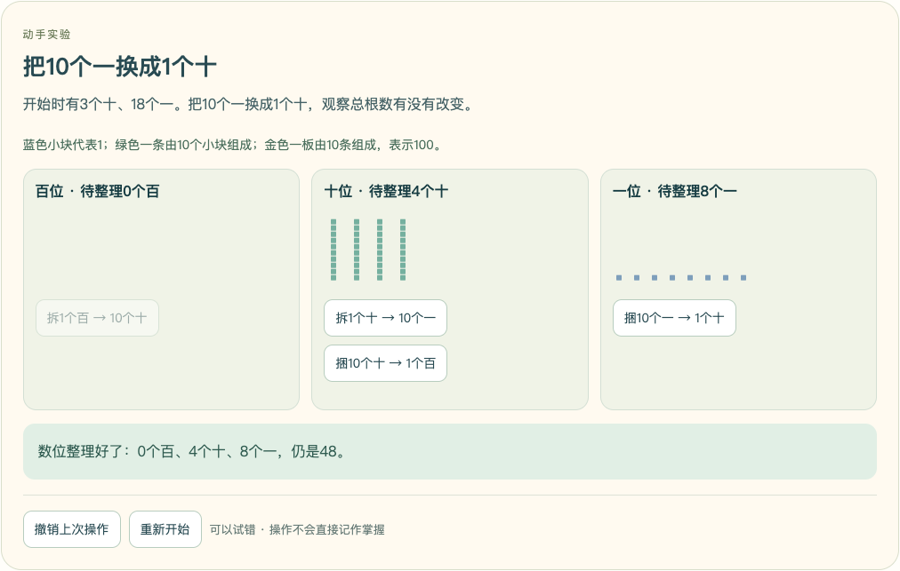
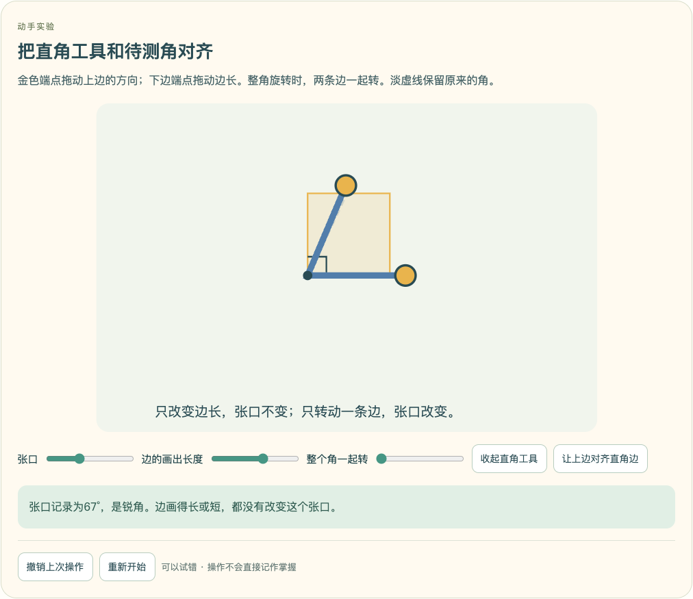
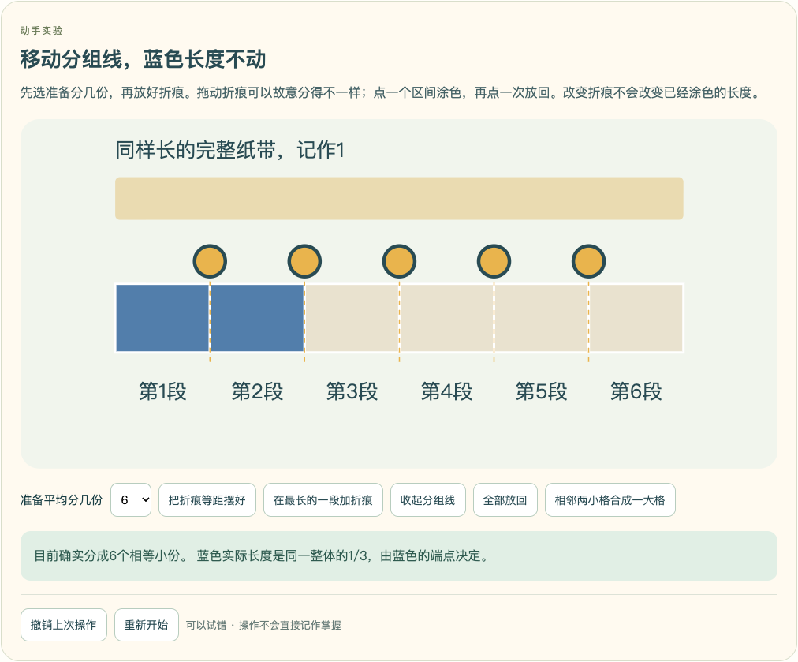
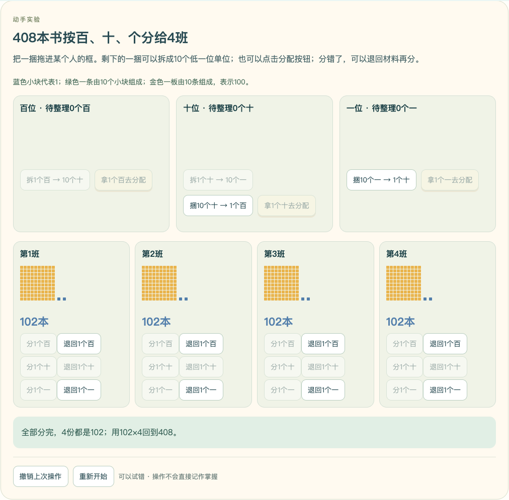
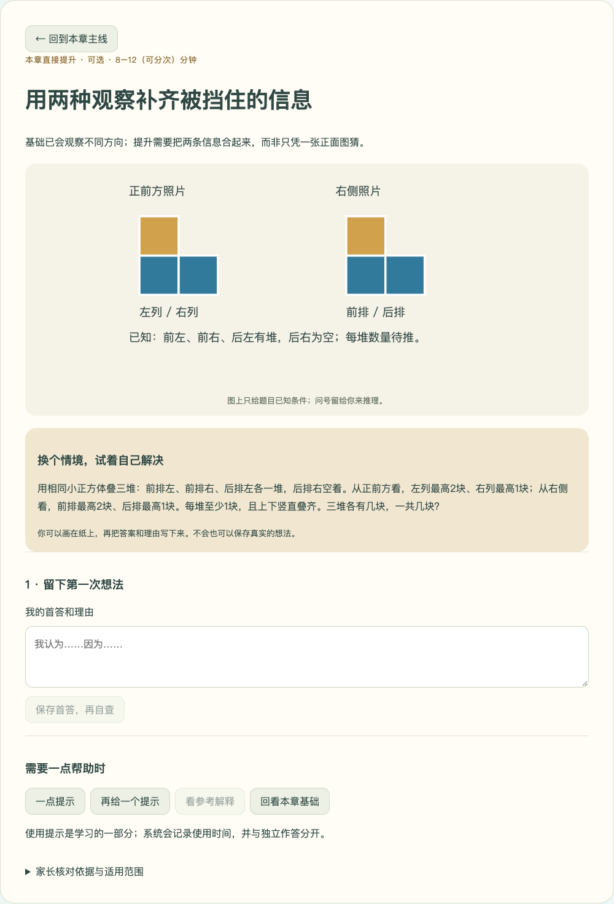

# 三年级教材主线与提升体系审计落实（2026-10-08）

## 审计版本与实施边界

用户提供的《Kevin_Math_Lab_三年级教材与提升体系全面审计_20261007.md》明确针对 GitHub main 的 `1e8199dd2963c70f539b23300a86e7e645350798`。本轮开始时，PR #1 的 `audit-fixes-20261002` 已推送到 `0297fcc44f3d289277c56b9eaba8214130f8d005`，并非只有本地修改。main 未合并，因此 ChatGPT 看到旧版本是版本差异。

本轮在该分支继续完成审计阶段A与阶段B的首批发布，冻结四至六年级。60张旧思维卡不增加新题、也不变成60节必修课。17章各开放一张本章迁移，43张保留出处与课程联系，明确暂缓；不把所有准备稿标为已发布。各课仍是 draft，技术验证不等于Kevin真实试学。

## 审计逐项对照

| 审计问题 | 本轮开始时的实际情况 | 本次处理 |
|---|---|---|
| O01倒推错误算式 | 分支已修正；main旧式不能代表现代码 | 保留独立模型回代与回归测试，验证 `(4+7)×4=44` |
| 非数值选择题语言泄题 | 分支已移除自动拼选项；解释题待家长核对 | 不新增自动判对的文字模板；迁移卡首答、自查、最终解释分开存档 |
| 观察物体、质量都是静态 | 分支已有5课真旋转、折盒、称量与船载替换 | 保留连续动画与实际数学状态，继续跑已有浏览器回归 |
| 大量其它章节静态 | 仍存在41课静态关系卡 | 新增24课显式教具，覆盖余下13个教材入口；静态关系卡减少为17课 |
| 每课交互状态不清 | 课程不能按已安装数宣称互动完成 | 增加 interactionStatus、活动验证状态与17章台账；静态课入口明确标识 |
| 提升联系分散 | 教材、E/O与60卡未形成清晰产品入口 | 每章显示课本主线、本章提升、数学思想、间隔复习；推荐一张，不锁下一章 |
| 教材数学广场误入奥数 | 搭配、重叠B课因optional-extension被误归O | B课仍属课本主线，E/O依tier分类，不把选学属性当成奥数归属 |
| 60卡未发布 | 文件为authored_not_published，运行时未接入 | 分类60卡并接入网站；首批17卡可学习，43卡暂缓；元数据改partially_published |
| originUnit与thinkingDomain | 只有原unitId与混合layer | 增加两者与直接提升/数学思想桥梁/暂缓状态；数位最优化等不再标成简单教材提升 |
| 独立掌握夸大 | 提示、当日订正不能作独立迁移 | 新卡不自动给积分或判对；记录辅助时间、不可覆盖首答，最终解释pendingReview |
| 实际试学 | 没有Kevin试学证据 | 台账保留待家长核对与Kevin试学，不伪造“全三年级定稿” |

## 本轮教具及关键数学约束

- 多位数：个位小块、十条、百板按真实十进制拆换，分配前后总量恒定，份数不等不能宣布平均分完成。可以分错，撤销重来。
- 编码：架、层、格与高亮位置共用状态；固定宽度保留前导0，缺字段确实不能确定身份。
- 角：拖一边改张口、改边长不改张口、整角旋转不改角；直角工具可叠合，容许锐/直/钝之间改变。
- 分数：2520精确公共刻度支持2至10等分；移动折痕与分组不改变蓝色端点，非等分时不能仅按块数写分数。
- 搭配：衣裤实物卡可拖入，表格一个组合一格；重复组合不计新增。
- 折纸与运动：竖折是连续三维投影，穿透两层打孔、展开可见对应孔；平移与绕尾端旋转改变不同状态。两次对折迁移明确可以用线下纸张完成，不冒充已经实现两次网页折叠。
- 除法：52与408的按位拆换与分配是真实材料账，允许先分得不均，未分完或份数不等不报告完成。
- 周长：沿外边描线、拼接后公共边留在内部；两块边长3厘米方板由24厘米变18厘米，公共边扣两次。
- 面积：1平方米砖逐格覆盖，不重复计数；剪块材料保留40格，重叠时明确区分材料总量与实际覆盖面积。
- 数据：身份唯一，一人不能重复投票；10、20的分组边界可放错再核对；共有姓名归到交集并保留一份。
- 日历/时间：真实公历月份与1900/2000世纪规则；分钟与跨整点时长从同一时间状态产生，星期周期7天。
- 小数：整数位、十分位、百分位与米/分米/厘米来自同一数字状态，错误数位与容量可见。

各教具都支持撤销、重置，操作记录可刷新恢复及导出导入；动作本身不增加掌握或积分。

## 17章台账

来源页码继续使用本机教材引用，未把不同版本目录混用。完整机器台账为 `content/pilot/chapter-ledger.json`，包括核心活动、静态课、推荐迁移、暂缓卡与1/3/7/21复习节奏。

| 教材章 | 核心操作课 | 本章首张迁移 | 仍为静态的课数 |
|---|---|---|---:|
| G3-U01 观察物体 | G3-U01-B01 | G3-U01-TH1 | 0 |
| G3-U02 混合运算 | G3-U02-B01 | G3-U02-TH1 | 0 |
| G3-U03 毫米、分米和千米 | G3-U03-B01 | G3-U03-TH1 | 0 |
| G3-UP01 曹冲称象的故事：质量与替换测量 | G3-UP01-B01 | G3-UP01-TH1 | 0 |
| G3-U04 多位数乘一位数 | G3-U04-B02 | G3-U04-TH1 | 4 |
| G3-UP02 数字编码 | G3-UP02-B01 | G3-UP02-TH1 | 0 |
| G3-U05 线和角 | G3-U05-B02 | G3-U05-TH1 | 1 |
| G3-U06 分数的初步认识 | G3-U06-B01 | G3-U06-TH1 | 3 |
| G3-U07 复习与关联（含搭配问题） | G3-U07-B01 | G3-U07-TH1 | 1 |
| G3-L01 生活中的运动现象 | G3-L01-B01 | G3-L01-TH1 | 0 |
| G3-L02 除数是一位数的除法 | G3-L02-B02 | G3-L02-TH1 | 4 |
| G3-L03 长方形和正方形 | G3-L03-B02 | G3-L03-TH1 | 1 |
| G3-L04 图形的面积 | G3-L04-B02 | G3-L04-TH1 | 1 |
| G3-L05 数据的收集与整理 | G3-L05-B01 | G3-L05-TH1 | 0 |
| G3-LP01 年、月、日的秘密 | G3-LP01-B01 | G3-LP01-TH1 | 0 |
| G3-L06 小数的初步认识 | G3-L06-B01 | G3-L06-TH1 | 1 |
| G3-L07 复习与关联（含重叠问题） | G3-L07-B01 | G3-L07-TH1 | 1 |

## 60张思维卡分类与发布范围

`content/course-plan-v2/grade-3-thinking.json`保留完整题干、来源、解答和教学契约；`content/pilot/thinking-source.mjs`是本批发布与分类的唯一规则；`content/pilot/thinking.json`为无答案的公开索引。/api/data不提前发送答案、提示、解题过程。

暂缓卡不能打开空课程，也不计入已开放数。它们不是缺失或删去的题库；逐步发布前还需专用题图/操作、迁移独立性与教学核对。本批只开放每章第一张，长度章节原有木板、链环等实验仍能直接学习。

| 卡片 | 来源章 | 方法领域 | 分类 | 当前发布 |
|---|---|---|---|---|
| G3-U01-TH1 用两种观察补齐被挡住的信息 | G3-U01 | reasoning.sufficient-evidence（信息是否足够） | 本章直接提升 | 已开放，解释待核对 |
| G3-U01-TH2 同一轮廓能藏多少种数量 | G3-U01 | reasoning.exhaustive-cases（分类与找全） | 数学思想桥梁 | 暂缓 |
| G3-U02-TH1 括号为了解决不同的题意 | G3-U02 | arithmetic.parentheses.model（括号与现实运算顺序） | 本章直接提升 | 已开放，解释待核对 |
| G3-U02-TH2 错序为什么总多出同样的数 | G3-U02 | reasoning.invariant-difference（差的不变量） | 数学思想桥梁 | 暂缓 |
| G3-U03-TH1 两把没刻度的尺还能量吗 | G3-U03 | reasoning.segment-compensation（线段取差与补偿） | 本章直接提升 | 已开放，解释待核对 |
| G3-U03-TH2 路上的标记与环上的标记 | G3-U03 | reasoning.intervals（端点与间隔） | 数学思想桥梁 | 暂缓 |
| G3-UP01-TH1 天平两边都有盒子怎么办 | G3-UP01 | reasoning.equal-elimination（等量操作与消元） | 本章直接提升 | 已开放，解释待核对 |
| G3-UP01-TH2 两次称量找出较重的小球 | G3-UP01 | reasoning.branching（分支与排除） | 数学思想桥梁 | 暂缓 |
| G3-U04-TH1 十位看错，乘积差多少 | G3-U04 | arithmetic.law.distribution（倍数变化与分配结构） | 本章直接提升 | 已开放，解释待核对 |
| G3-U04-TH2 把乘法竖式中的数字补全 | G3-U04 | reasoning.constrained-enumeration（按条件枚举） | 数学思想桥梁 | 暂缓 |
| G3-UP02-TH1 把编号连起来会发生什么 | G3-UP02 | representation.code-ambiguity（编码的唯一性） | 本章直接提升 | 已开放，解释待核对 |
| G3-UP02-TH2 不用重复数字的两位密码 | G3-UP02 | reasoning.ordered-choice（有顺序的选择） | 数学思想桥梁 | 暂缓 |
| G3-U05-TH1 直角分成两份，大的一份一定钝吗 | G3-U05 | reasoning.counterexample（用参照检验推断） | 本章直接提升 | 已开放，解释待核对 |
| G3-U05-TH2 四条射线能组成几个角 | G3-U05 | reasoning.systematic-enumeration（有序枚举） | 数学思想桥梁 | 暂缓 |
| G3-U06-TH1 分数不同，取出的长度能相同吗 | G3-U06 | fraction.whole-versus-quantity（整体、比例与实际量） | 本章直接提升 | 已开放，解释待核对 |
| G3-U06-TH2 “剩下的一半”是谁的一半 | G3-U06 | reasoning.changing-whole（整体改变后的份数） | 数学思想桥梁 | 暂缓 |
| G3-U07-TH1 套餐加上预算条件，乘法还够吗 | G3-U07 | reasoning.constrained-combinations（组合与条件筛选） | 本章直接提升 | 已开放，解释待核对 |
| G3-U07-TH2 最短路线怎样列全 | G3-U07 | reasoning.path-enumeration（路线的有序计数） | 数学思想桥梁 | 暂缓 |
| G3-L01-TH1 折两次后打一个孔 | G3-L01 | geometry.symmetry-unfold（展开与对称） | 本章直接提升 | 已开放，解释待核对 |
| G3-L01-TH2 面积够了，为什么还铺不了 | G3-L01 | reasoning.coloring-invariant（染色与不变量） | 数学思想桥梁 | 暂缓 |
| G3-L02-TH1 有余数时，总数不只有一个答案 | G3-L02 | reasoning.remainder-range（商的范围与余数） | 本章直接提升 | 已开放，解释待核对 |
| G3-L02-TH2 两种装法的余数都要满足 | G3-L02 | reasoning.systematic-filter（逐层筛选） | 数学思想桥梁 | 暂缓 |
| G3-L03-TH1 同一根绳能围成几种长方形 | G3-L03 | reasoning.fixed-sum-enumeration（固定和与枚举） | 本章直接提升 | 已开放，解释待核对 |
| G3-L03-TH2 挖一个小缺口，周长为什么增加 | G3-L03 | reasoning.boundary-compensation（边界增减与补偿） | 数学思想桥梁 | 暂缓 |
| G3-L04-TH1 沿对角线剪开，面积怎么办 | G3-L04 | geometry.equal-area-decomposition（剪拼与面积守恒） | 本章直接提升 | 已开放，解释待核对 |
| G3-L04-TH2 九宫格里不只九个正方形 | G3-L04 | reasoning.count-by-size（按大小分类计数） | 数学思想桥梁 | 暂缓 |
| G3-L05-TH1 统计表空着的格子怎样补 | G3-L05 | reasoning.table-constraints（统计表约束） | 本章直接提升 | 已开放，解释待核对 |
| G3-L05-TH2 十票分给三种游戏，能保证什么 | G3-L05 | reasoning.pigeonhole（分配与至少保证） | 数学思想桥梁 | 暂缓 |
| G3-LP01-TH1 哪些星期会多出现一次 | G3-LP01 | reasoning.period-remainder（周期与余数） | 本章直接提升 | 已开放，解释待核对 |
| G3-LP01-TH2 三个连续星期一的日期之和 | G3-LP01 | reasoning.equalize-pair（等间隔与中间量） | 数学思想桥梁 | 暂缓 |
| G3-L06-TH1 正好花完4元，有不止一种买法 | G3-L06 | reasoning.decimal-combinations（小数金额与不重复组合） | 本章直接提升 | 已开放，解释待核对 |
| G3-L06-TH2 买至少五支，怎样最省钱 | G3-L06 | reasoning.finite-optimization（有限枚举与最优化） | 数学思想桥梁 | 暂缓 |
| G3-L07-TH1 两种都没选的人也要放进图里 | G3-L07 | reasoning.inclusion-exclusion（集合重叠与容斥） | 本章直接提升 | 已开放，解释待核对 |
| G3-L07-TH2 总数和相差数，怎样分成两份 | G3-L07 | reasoning.sum-difference（和差关系） | 数学思想桥梁 | 暂缓 |
| G3-U03-TH3 两块木板接起来，哪一段算重了 | G3-U03 | measurement.overlap（重叠长度与接头） | 本章直接提升 | 暂缓 |
| G3-U03-TH4 四块板只有几处接头 | G3-U03 | measurement.overlap（重叠长度与接头） | 本章直接提升 | 暂缓 |
| G3-U03-TH5 总长知道了，接头盖住多少 | G3-U03 | reasoning.inverse（逆向思考） | 本章直接提升 | 暂缓 |
| G3-U03-TH6 链环接长，为什么一处要看两段厚度 | G3-U03 | measurement.overlap（重叠长度与接头） | 本章直接提升 | 暂缓 |
| G3-U03-TH7 同样两根纸条，为什么答案不同 | G3-U03 | reasoning.sufficient-evidence（信息是否足够） | 本章直接提升 | 暂缓 |
| G3-U03-TH8 三块叠在一起，还能每对都减吗 | G3-U03 | reasoning.overcount（重复计数与扣除） | 数学思想桥梁 | 暂缓 |
| G3-U04-S01 相邻三位的和相同，哪两位必须相同 | G3-U04 | reasoning.cancellation（共同部分与消去） | 数学思想桥梁 | 暂缓 |
| G3-U02-S02 差变小，是哪两头一起变了 | G3-U02 | arithmetic.difference-change（差的变化） | 本章直接提升 | 暂缓 |
| G3-U04-S03 符合数字和的数，怎样保证最小 | G3-U04 | enumeration.extremum（有序寻找） | 数学思想桥梁 | 暂缓 |
| G3-U04-S04 同样七颗珠，两个不同数怎样和最大 | G3-U04 | enumeration.extremum（极值与最优化） | 数学思想桥梁 | 暂缓 |
| G3-U02-S05 两个部分的总数，谁被数了两遍 | G3-U02 | reasoning.overcount（重复计数与扣除） | 本章直接提升 | 暂缓 |
| G3-U02-S06 两种文具，先换成同一种价格份 | G3-U02 | reasoning.substitution（等量替换与归一） | 本章直接提升 | 暂缓 |
| G3-U02-S07 同一个数量，为什么出现一段缺口 | G3-U02 | reasoning.equivalent-relations（等量关系与盈亏） | 数学思想桥梁 | 暂缓 |
| G3-L02-S08 最多的一个人，最少能做多少 | G3-L02 | reasoning.optimization（极值与最优化） | 数学思想桥梁 | 暂缓 |
| G3-UP01-S09 两次试验都从原来两袋开始 | G3-UP01 | reasoning.equivalent-relations（等量关系与盈亏） | 数学思想桥梁 | 暂缓 |
| G3-U04-S10 四倍与多二十七，哪几份是差 | G3-U04 | reasoning.part-unit（份数与和倍、差倍） | 数学思想桥梁 | 暂缓 |
| G3-L02-S11 余数条件逐层筛，最小数怎样保证 | G3-L02 | reasoning.remainder-search（余数约束与筛选） | 数学思想桥梁 | 暂缓 |
| G3-LP01-S12 来回传球，一个周期不是六次 | G3-LP01 | reasoning.cycle（往返与循环边界） | 数学思想桥梁 | 暂缓 |
| G3-L02-S13 两个余数相同，先拿走什么 | G3-L02 | reasoning.remainder-search（余数约束与筛选） | 本章直接提升 | 暂缓 |
| G3-L02-S14 除法的四个量都在同一个总和里 | G3-L02 | reasoning.substitution（等量替换与归一） | 数学思想桥梁 | 暂缓 |
| G3-U04-S15 同是四倍，知道总数还是差数 | G3-U04 | reasoning.part-unit（份数与和倍、差倍） | 数学思想桥梁 | 暂缓 |
| G3-L02-S16 报到几号与余数，差在整轮的时候 | G3-L02 | reasoning.cycle（往返与循环边界） | 本章直接提升 | 暂缓 |
| G3-U02-S17 送出去以后，要倒着走两步 | G3-U02 | reasoning.inverse（逆向思考） | 本章直接提升 | 暂缓 |
| G3-U02-S18 一个给出五元，差为什么变成十元 | G3-U02 | reasoning.transfer-invariant（转移与差的不变量） | 数学思想桥梁 | 暂缓 |
| G3-U06-S19 第三次反弹往回找，要乘几次二 | G3-U06 | reasoning.inverse（逆向思考） | 数学思想桥梁 | 暂缓 |
| G3-UP01-S20 换小砝码之前，先凑成可以换的一组 | G3-UP01 | reasoning.substitution（等量替换与归一） | 本章直接提升 | 暂缓 |

## 迁移记录与复习边界

1. 可不看辅助保存首答，也可以先取提示；保存后首答不再覆盖，辅助是否发生在首答前另行记录。
2. 三项自查与自己的关键发现单独保存，完成后才能提交最终解释。
3. 看提示、参考解释、回看教材都记录时间。解答必须首答后主动获取，刷新仍保留已看记录。
4. 最终解释为pendingReview，不自动判对，不奖励，不开启迁移卡独立达标；家长在卡片适用范围与思维证据中核对。当前尚未提供家长正式评分工作台。
5. 教材正式课程继续按既有1/3/7/21天机制安排独立新情境复习。本批思维卡保留证据，不伪称另有已跑通的自动间隔评估。
6. 保存有版本冲突保护与事件幂等；旧无thinking字段备份兼容，新记录随进度一并导入导出。

## 验证

- `npm test`：103/103通过。
- `npm run build`：TypeScript与Vite生产构建通过；Vite保留既有单包大小提示（569.70kB，gzip188.48kB），本次未做性能拆包。
- `npm run content:check`：70课、849任务结构检查通过。
- 8个浏览器验收模块均通过：五课实操、教学首答/自查/订正/次日复习、连续动画、70课清单、故事配图、24课新教具、17张迁移卡、两条完整除法分配。
- 清单实测70个入口，其中53课真实可操作、17课静态关系卡；59个故事图与5个预测图继续通过。
- 24课新增教具逐课测试实际操作、错误、撤销、刷新恢复和1440/390宽度截图。52÷4、408÷4还实际分到13和102，并故意不均分、退回修正；探索奖励0。
- 17张迁移卡条件图与1440/390布局通过，首答—提示—自查—最终解释—家长入口—刷新恢复跑通；最终待核对、奖励0。
- `git diff --check`通过；人工复核数学不变量、已知条件图、备份兼容、状态真实性与关键截图。

原有模块先完整回归；最后材料退回与界面文字更新后，重跑24课、迁移卡以及两条完整除法路径。人工截图又发现百位材料的SVG超出旧容器而遮挡标题，修正容器尺寸后，完整除法在桌面和手机新增并通过标题不遮挡断言。所有测试使用独立临时数据，不触碰Kevin真实进度。后台预览同样使用独立数据。

技术状态按本次精确53课清单标`verified`，验证清单为`content/pilot/interaction-release.mjs`；新增课程默认不会自动进入该清单。教学状态仍为待Kevin试学，不能用技术verified宣称教学完成。

机器证据：[8模块验收结果](evidence-textbook-20261008/verify-lab-inventory.json)、[24课](evidence-textbook-20261008/verify-textbook-browser.json)、[迁移卡](evidence-textbook-20261008/verify-thinking-browser.json)、[完整除法](evidence-textbook-20261008/verify-division-browser.json)。

关键截图：

补充启动修正：新下载的仓库没有data目录时，后台启动脚本先建立目录再写日志；允许指定预览端口和独立存档目录。实测独立后台返回70课、53个技术验证实验、17张开放卡，空白预览积分0。

技术状态与教学状态分开：未试学、尚待核对的内容不会被升级为教材/全三年级最终定稿。
