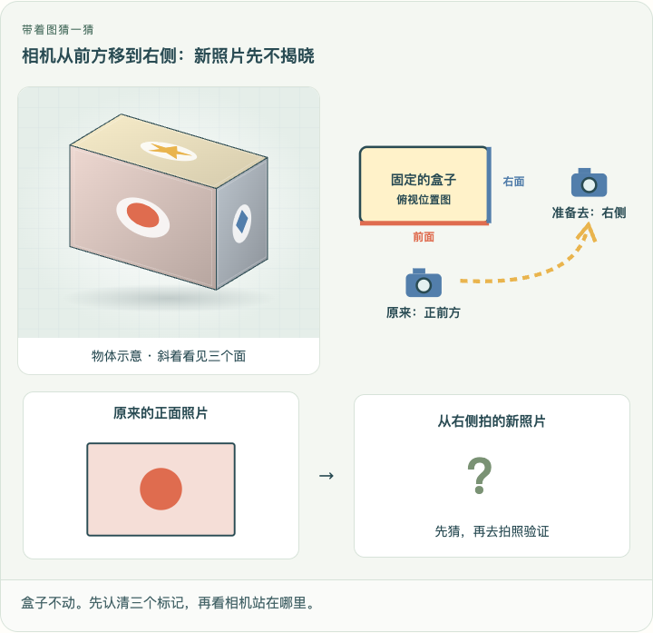
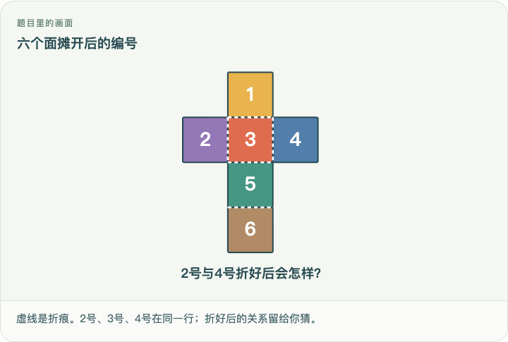
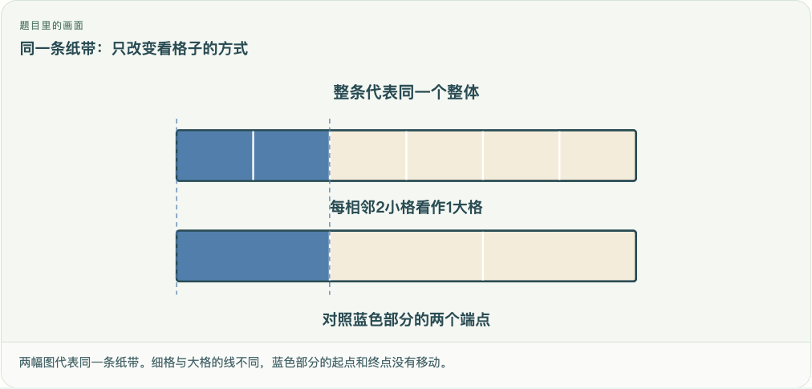
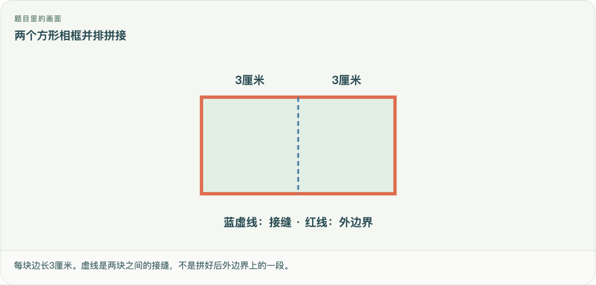

# 真实问题与预测配图验收（2026-10-07）

## 解决的问题

课堂在“真实问题”“先猜一猜”阶段只描述图形，却没有提供孩子判断所需的画面。此次把已知对象提前到题目旁，展示条件与位置，待猜结果仍由孩子先预测，再用实验验证。没有把实验的最终答案截图搬到预测页。

## 实现与范围

- 70个课程入口逐项检查：41课有新编写的场景图、6课复用混合运算初始对象画面、5课复用测量条件图、7个基础入口保留既有图，共59个故事入口有对应画面。
- 其余11课为完整文字条件的运算或数据推理题，显式记录在文字题审核名单；新课程必须提供图或明确的文字题审核声明。
- 五节第二代短课堂全部补齐故事图与预测图。观察物体使用同一组实验面编号、标记和积木坐标；新照片保持问号。六面展开图给出编号和折痕，不显示相对面答案。净重图不揭晓水的质量，替换图不揭晓模型象的质量。
- 家长完整教案也显示场景图；恢复原先被省略的测量课故事段落。
- 图形参数按题目已知条件逐项编写，不抓取正文数字，不把答案当画图输入。原实验、练习判定、积分与掌握规则不变。
- 后台在更新前已经启动时，前端也能从同一个编写源取得缺失的图形字段，避免出现白屏。

## 防止再次遗漏

`content/pilot/intro-visuals.mjs` 为场景规格与覆盖声明；`src/studio/IntroVisual.tsx` 为展示；`src/studio/StoryPicture.tsx` 复用经过验证的数学／测量初态。构建调用 `validateIntroVisualCoverage`，拒绝未声明图形、未实现的图形类型、非法纸带分组和缺失的短课堂前两屏配图。菱形坐标在共享模块中定义，并验证四边均为100、相邻边不是直角。

## 验证

- 91项单元测试通过；TypeScript、Vite构建、70课／849题内容检查与diff检查通过。
- 五项Playwright CLI回归检查通过：五课实验、首答→自查→订正→隔日复习、连续动画、70入口／29个实验／41张关系卡，以及59个故事和5个预测图。
- 最后修正菱形坐标及说明文字后，重新进行配图专项复测，覆盖桌面1440与手机390宽度、预测返回保持猜想，以及模拟旧接口缺少图形字段。
- 浏览器检查使用临时独立数据目录，没有读取或覆盖Kevin实际学习进度。截图证明页面呈现，不代替真实Kevin的理解试学。
- 本次改善故事与预测页的图形信息；41课后续操作仍为静态关系卡，不把新增故事配图宣称为完成全部动手课程。

## 新编写场景图清单

| 课程 | 标题 | 图形类型 | 图形说明 |
| --- | --- | --- | --- |
| G3-U01-B01 | 换一个位置，看到的样子为什么变了 | box-camera | 盒子不动。先认清三个标记，再看相机站在哪里。 |
| G3-U01-B02 | 看见一个面，能猜出整个物体吗 | hidden-blocks | 这是从斜上方看的搭法示意，不是机器人拍到的正面照片。 |
| G3-U01-B03 | 把纸盒打开，六个面去了哪里 | cube-net | 虚线是折痕。2号、3号、4号在同一行；折好后的关系留给你猜。 |
| G3-U02-E04 | 换位置、换分组：交换律和结合律的具体体验 | dot-array | 每个圆点是一颗珠子。这里只摆出原来的3行4列，还没有换位置。 |
| G3-U02-E05 | 一块点阵分两块：为什么每部分都要乘 | dot-array | 每个圆点是一个座位；每排左5个、右3个，一共7排。 |
| G3-U02-O02 | 把一整包数量临时换个名字 | groups | 每个盒子里12支红笔、8支蓝笔；问号表示三盒合起来的总数。 |
| G3-UP01-B01 | 用什么尺度记录轻重 | cup-scale | 图中读数是杯和水的总质量，水本身的质量还不知道。 |
| G3-UP01-B02 | 称不了大物体，怎样换成小物体 | boat-replacement | 红线画在船身上；蓝线是水面。象下船后船浮高，船身红线也跟着上移。 |
| G3-U04-B01 | 把几十、几百和零散个数分别乘 | groups | 框是一盒，每盒同样12支；先看每盒，再想三盒合起来。 |
| G3-U04-B02 | 竖式是把拆分过程排整齐 | groups | 每个框表示一组16根小棒。先看每组的根数，再思考三组怎样整理进数位表。 |
| G3-U04-B03 | 连续进位也只是反复“满十换一” | groups | 图是分组示意，每箱标的是瓶数，没有把147瓶缩成一个瓶子的数量。 |
| G3-U04-B04 | 乘数中的0，为什么不能跳过它的位置 | groups | 每个框是一个区，604表示这个区里的座位数，十位的0也保留。 |
| G3-UP02-B01 | 数字有时表示身份，而不是多少 | shelves | 示意一个书架的4层、每层8格。编号表示位置，不表示这里有多少本书。 |
| G3-U05-B01 | 线的端点和长度告诉我们什么 | lines | 实心点表示端点，箭头表示还可以沿这个方向延伸。 |
| G3-U05-B02 | 角的大小看张口，不看边画多长 | angles | 两把剪刀的刀片画得一样长，只改变张口；图中不标角度答案。 |
| G3-U05-B03 | 用一个直角作标准来分类 | angle-reference | 左边是书本的直角，右边是待比较的墙角。让两个顶点和一条边对齐，再判断。 |
| G3-U06-B01 | 一份不到一个，怎样说清楚 | fraction-strip | 用纸带代替这块饼。四份一样大，蓝色表示其中一个人的那一份。 |
| G3-U06-B02 | 几个同样的小份，怎样合成一个分数 | fraction-strip | 整条贴纸是一个整体；蓝色是已经涂好的部分。 |
| G3-U06-B03 | 分数加减，先确认数的是同一种小份 | fraction-strip | 蓝色表示上午吃的2份，橙色表示下午吃的3份，每份都是这块饼的八分之一。 |
| G3-U06-B04 | 一个整体，也可以是一盒东西 | fraction-collection | 大框表示这一整盒。先看清总数，再想平均分成3份；图中还没有替你分组。 |
| G3-U06-B05 | 先求一小份，再求几小份 | fraction-collection | 大框是全部24张。需要平均分成8份，取其中3份；图中还没有分好。 |
| G3-U06-E01 | 合并格子，已经涂色的长度会变吗 | fraction-strip | 两幅图代表同一条纸带。细格与大格的线不同，蓝色部分的起点和终点没有移动。 |
| G3-U07-B01 | 每种选择都配一遍，怎样不重复不遗漏 | outfits | 一次穿一件上衣和一条裤子。图中只列可选衣服，还没有替你配好所有套装。 |
| G3-L01-B01 | 对折后能重合，才是轴对称 | symmetry | 虚线是准备对折的位置。两侧的图案是否能重合，要通过对折来检查。 |
| G3-L01-B02 | 平移和旋转，移动方式哪里不同 | movement | 箭头表示准备怎样移动：抽屉向外滑，风车绕中心转。 |
| G3-L02-B01 | 把几十、几百平均分，先看计数单位 | groups | 每捆是10张纸，9捆合计90张；三个人的框还空着。 |
| G3-L02-B02 | 除法竖式为什么从高位开始 | groups | 每捆表示10颗，散点表示1颗。下面四个分配框还没有放糖。 |
| G3-L02-B03 | 有剩余时，怎样判断答案真的分完了 | groups | 每捆代表10颗，不是一个袋子；袋子每袋能装4颗，袋数暂时未知。 |
| G3-L02-B04 | 商里有0，也不能漏掉位置 | groups | 这里用数位记录总数：4个百、0个十、8个一。四个班的分配框还空着。 |
| G3-L03-B01 | 从边与角给图形分类 | frame-shapes | 长方形和正方形有四个直角；右边的斜菱形四边一样长，但角不同。 |
| G3-L03-B02 | 围一圈需要多长：周长的意义 | rectangle | 红线表示准备装围栏的外边界。已知长8米、宽5米，围栏总长还不知道。 |
| G3-L03-E01 | 拼在一起以后，哪些边不再露在外面 | joined-squares | 每块边长3厘米。虚线是两块之间的接缝，不是拼好后外边界上的一段。 |
| G3-L04-B01 | 铺满里面，需要多少个小方块 | area-grid | 红线表示围栏位置，绿色方格表示要铺砖的位置；两件事要数不同的量。 |
| G3-L04-B02 | 长乘宽为什么得到面积 | area-grid | 每个方格表示1平方米的方砖，地面要铺满；砖的总数留给你求。 |
| G3-L04-B03 | 分割、拼补和换单位，面积怎样保持一致 | unit-square | 每一小段是1厘米，每个小格是1平方厘米。两个方向都分成10段。 |
| G3-LP01-B01 | 日历为什么不能每月都排30天 | calendar | 2023年与2024年的二月：每格是一天，空格不算一天。 |
| G3-LP01-B02 | 时刻是一个点，时长是一段路 | timeline | “3点”可以出现在上午或下午。图中标出两个位置，先认清说的是哪一个。 |
| G3-LP01-E01 | 星期循环与制作月历 | week-calendar | 只填好已知的1日；其他日期与星期的对应关系由你来排。 |
| G3-L06-B01 | 不足一米的部分，仍用十进制记录 | length-comparison | 长的整段是1米，后面接3个1分米的小段。图上还没有写出用米表示的小数。 |
| G3-L06-B02 | 比较小数，先比较同样的计数单位 | length-comparison | 两个标记分别是0.9米和0.85米。先看标记，再比较；尺子从同一个0开始。 |
| G3-L07-B01 | 同一个人出现两次，怎样只数一次 | overlapping-sets | 中间3个位置是两个组共有的人。读书组8人包含这3人，绘画组7人也包含这3人。 |

## 截图证据

